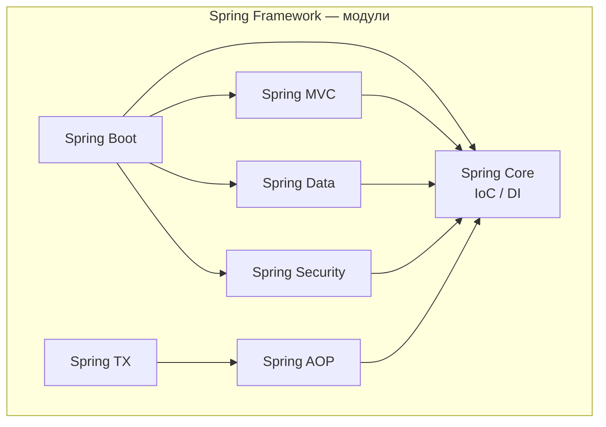
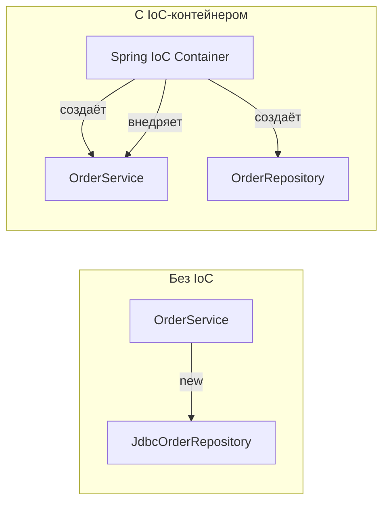
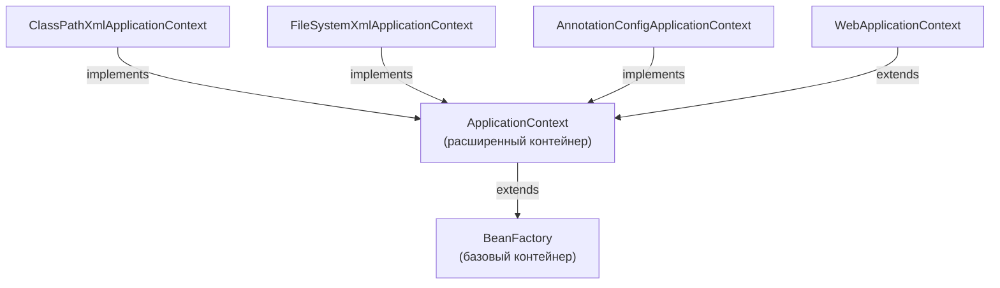
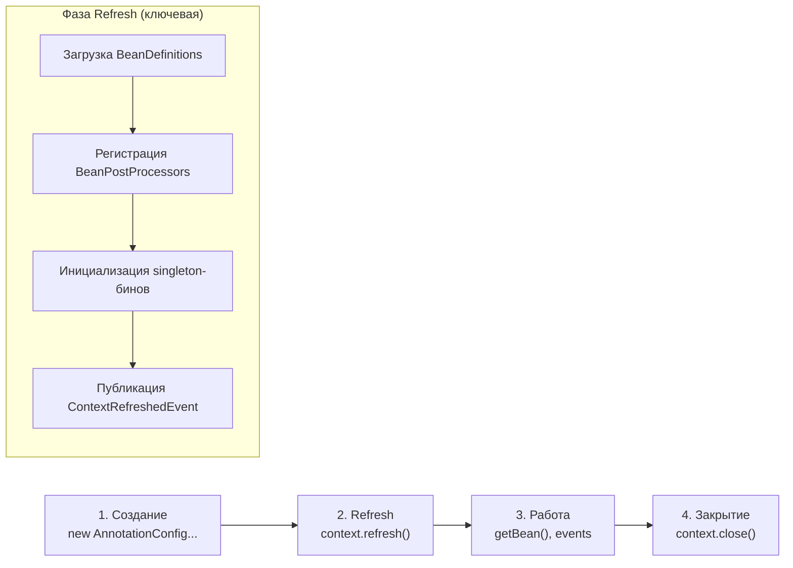
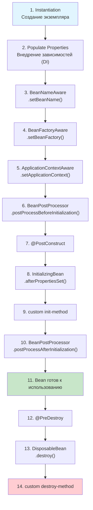
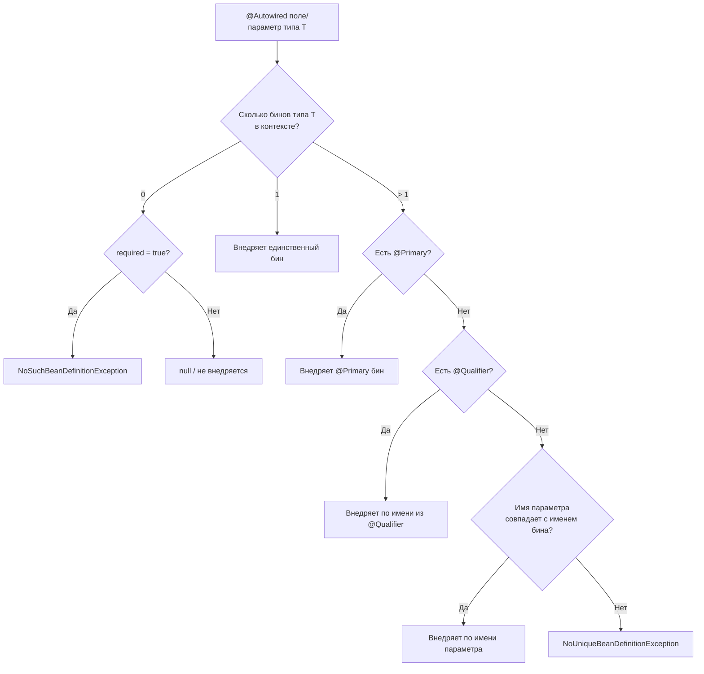
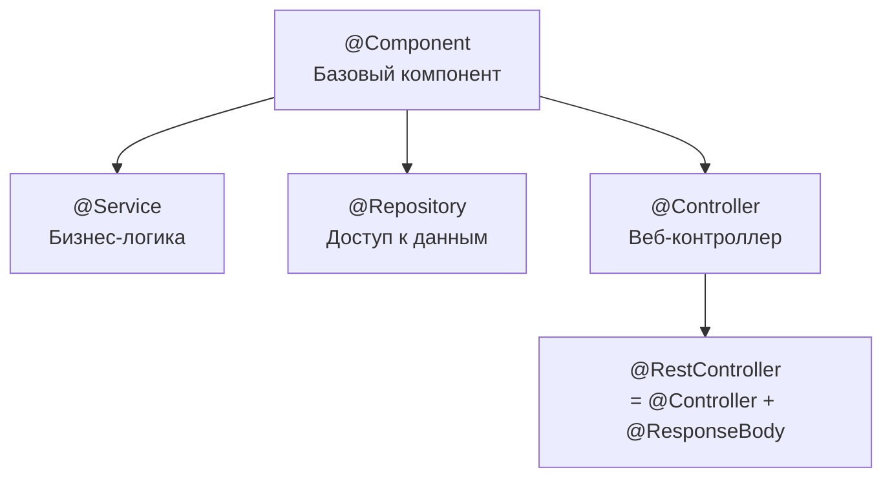
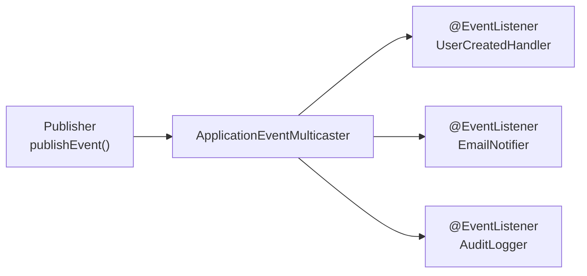
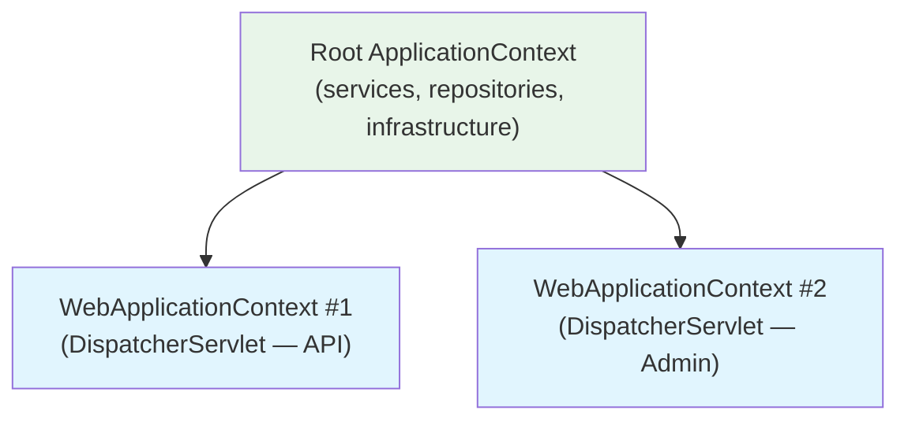

# Вопросы на собеседовании: `Spring Framework`

Полный гайд по `Spring Framework`: `IoC`-контейнер, `DI`, жизненный цикл бинов, `AOP`, прокси, профили, события, `@Conditional`, конфигурация.

Дата последнего обновления: 2026-04-13

**`Spring Framework`** — базовый фреймворк для enterprise-разработки на `Java`. Вопросы по `IoC`, `DI`, бинам, жизненному циклу, `AOP` и модулям `Spring` регулярно встречаются на собеседованиях всех уровней — от junior до senior. Этот файл покрывает ключевые темы с диаграммами, примерами кода и практическими нюансами.

## Полезные ссылки

### Официальная документация

- [Spring Framework Reference](https://docs.spring.io/spring-framework/reference/) — основная документация
- [Spring Framework API (Javadoc)](https://docs.spring.io/spring-framework/docs/current/javadoc-api/) — API-документация

### Baeldung

- [Spring Core Tutorials](https://www.baeldung.com/spring-tutorial) — практические туториалы по Spring Core
- [Inversion of Control and Dependency Injection with Spring](https://www.baeldung.com/inversion-control-and-dependency-injection-in-spring) — IoC и DI в деталях
- [Difference Between BeanFactory and ApplicationContext](https://www.baeldung.com/spring-beanfactory-vs-applicationcontext) — сравнение IoC-контейнеров
- [Wiring in Spring: @Autowired, @Resource and @Inject](https://www.baeldung.com/spring-annotations-resource-inject-autowire) — варианты внедрения зависимостей
- [Comparing Spring AOP and AspectJ](https://www.baeldung.com/spring-aop-vs-aspectj) — разница между Spring AOP и AspectJ
- [Implementing a Custom Spring AOP Annotation](https://www.baeldung.com/spring-aop-annotation) — создание кастомных аспектов
- [Top Spring Framework Interview Questions](https://www.baeldung.com/spring-interview-questions) — топ вопросов на интервью

## Содержание

- [Полезные ссылки](#полезные-ссылки)
- [See also](#see-also)

**Основы Spring Framework**
- [Q1. Что такое Spring Framework?](#q1-что-такое-spring-framework)
- [Q2. (!) Особенности и преимущества Spring Framework?](#q2-особенности-и-преимущества-spring-framework)

**IoC и Dependency Injection**
- [Q3. (!) Что такое Inversion of Control (IoC)?](#q3-что-такое-inversion-of-control-ioc)
- [Q4. (!) Что такое Dependency Injection (DI)?](#q4-что-такое-dependency-injection-di)
- [Q5. (!) Типы контейнеров в Spring Framework](#q5-типы-контейнеров-в-spring-framework)
- [Q6. (!) Какой жизненный цикл у Context?](#q6-какой-жизненный-цикл-у-context)
- [Q7. (!) В чем разница между BeanFactory и ApplicationContext?](#q7-в-чем-разница-между-beanfactory-и-applicationcontext)
- [Q8. (!) Как завершить работу Context?](#q8-как-завершить-работу-context)

**Bean и жизненный цикл**
- [Q9. Что такое Bean?](#q9-что-такое-bean)
- [Q10. (!) Какой жизненный цикл у Bean?](#q10-какой-жизненный-цикл-у-bean)
- [Q11. Как создать статический Bean?](#q11-как-создать-статический-bean)
- [Q12. Как внедрить Bean?](#q12-как-внедрить-bean)
- [Q13. (!) Что такое @Autowired?](#q13-что-такое-autowired)
- [Q14. (!) Какие есть области действия Bean?](#q14-какие-есть-области-действия-bean)
- [Q15. (!) Как лучше внедрять Bean?](#q15-как-лучше-внедрять-bean)
- [Q16. Является ли Singleton Bean потокобезопасным?](#q16-является-ли-singleton-bean-потокобезопасным)
- [Q17. Как внедрить Properties в Bean?](#q17-как-внедрить-properties-в-bean)

**Конфигурация и паттерны**
- [Q18. Что такое конфигурация Spring на основе Java?](#q18-что-такое-конфигурация-spring-на-основе-java)
- [Q19. (!) Можно ли иметь несколько файлов конфигурации Spring?](#q19-можно-ли-иметь-несколько-файлов-конфигурации-spring)
- [Q20. (!) Какие Design Patterns используются в Spring Framework?](#q20-какие-design-patterns-используются-в-spring-framework)

**AOP (Аспектно-ориентированное программирование)**
- [Q21. (!) Что такое AOP?](#q21-что-такое-aop)
- [Q22. (!) Как работает AOP-прокси в Spring?](#q22-как-работает-aop-прокси-в-spring)
- [Q23. Что такое Weaving?](#q23-что-такое-weaving)
- [Q24. (!) В чём разница между Spring AOP и AspectJ?](#q24-в-чём-разница-между-spring-aop-и-aspectj)

**Аннотации и конфигурация**
- [Q25. Что такое CommandLineRunner и ApplicationRunner?](#q25-что-такое-commandlinerunner-и-applicationrunner)
- [Q26. (!) Какие наиболее популярные аннотации в Spring?](#q26-какие-наиболее-популярные-аннотации-в-spring)
- [Q27. (!) В чём разница между @Component, @Service, @Repository и @Controller?](#q27-в-чём-разница-между-component-service-repository-и-controller)
- [Q28. Что такое @Qualifier и @Primary?](#q28-что-такое-qualifier-и-primary)

**Профили, условия, события**
- [Q29. (!) Что такое @Profile и как работают профили?](#q29-что-такое-profile-и-как-работают-профили)
- [Q30. Что такое @LookUp?](#q30-что-такое-lookup)
- [Q31. (!) Что такое @Conditional и как Spring Boot использует условные бины?](#q31-что-такое-conditional-и-как-spring-boot-использует-условные-бины)
- [Q32. (!) Как работает механизм событий (ApplicationEvent) в Spring?](#q32-как-работает-механизм-событий-applicationevent-в-spring)
- [Q33. (!) Иерархия ApplicationContext: parent-child контексты](#q33-иерархия-applicationcontext-parent-child-контексты)

**Продвинутые темы**
- [Q34. (!) В чём разница между @Bean и @Component?](#q34-в-чём-разница-между-bean-и-component)
- [Q35. (!) Что такое Pointcut и как писать Pointcut-выражения в Spring AOP?](#q35-что-такое-pointcut-и-как-писать-pointcut-выражения-в-spring-aop)
- [Q36. (!) Как работает @Around advice и чем он отличается от @Before / @After?](#q36-как-работает-around-advice-и-чем-он-отличается-от-before--after)
- [Q37. (!) Что такое SpEL (Spring Expression Language) и где он применяется?](#q37-что-такое-spel-spring-expression-language-и-где-он-применяется)
- [Q38. (!) Как работает @Async и что нужно настроить для асинхронных методов?](#q38-как-работает-async-и-что-нужно-настроить-для-асинхронных-методов)
- [Q39. (!) Что такое @EventListener и как публиковать события асинхронно?](#q39-что-такое-eventlistener-и-как-публиковать-события-асинхронно)
- [Q40. Как настроить несколько реализаций одного бина с разными профилями?](#q40-как-настроить-несколько-реализаций-одного-бина-с-разными-профилями)

## Q1. Что такое `Spring Framework`?

`Spring Framework` — это комплексный фреймворк для разработки enterprise-приложений на `Java`, построенный вокруг принципов **IoC** (Inversion of Control) и **AOP** (Aspect-Oriented Programming).

Основные модули:

| Модуль | Назначение |
|--------|-----------|
| `Spring Core` | IoC-контейнер, DI, ресурсы |
| `Spring MVC` | Веб-фреймворк (подробнее в [Spring MVC](spring-mvc-interview.md)) |
| `Spring Security` | Аутентификация и авторизация (подробнее в [Spring Security](spring-security-interview.md)) |
| `Spring Data` | Унифицированный доступ к данным (подробнее в [Spring Data JPA](spring-data-jpa-interview.md)) |
| `Spring AOP` | Аспектно-ориентированное программирование |
| `Spring TX` | Управление транзакциями |



Конфигурация возможна через `@Configuration` + `@Bean`, компонентное сканирование (`@Component`, `@Service`, `@Repository`) или XML. Зависимости внедряются через конструктор (рекомендуется), сеттер или поле.

## Q2. (!) Особенности и преимущества `Spring Framework`?

Ключевые преимущества `Spring Framework`:

1. **IoC/DI** — инверсия управления и внедрение зависимостей снижают связанность (coupling) и упрощают тестирование через подмену зависимостей (моки)
2. **AOP** — сквозная логика (логирование, транзакции, безопасность) выносится в аспекты, не загромождая бизнес-код
3. **Модульность** — подключаются только нужные модули; не нужно тянуть весь фреймворк
4. **Интеграция** — готовые абстракции для `Hibernate`, `JPA`, `MyBatis`, `Kafka`, `RabbitMQ`, `Redis`
5. **Тестируемость** — `@MockBean`, `@SpringBootTest`, `TestRestTemplate` делают тесты первоклассными гражданами
6. **Экосистема** — [Spring Boot](spring-boot-interview.md) для быстрого старта, [Spring Cloud](spring-cloud-interview.md) для микросервисов, `Spring Batch` для пакетной обработки

**Что ожидают на собеседовании:** не просто перечисление, а понимание trade-offs. Например, `Spring` добавляет overhead на старт (classpath scanning, proxy creation), что критично для serverless. `Spring Native` / `GraalVM` решают это за счёт AOT-компиляции.

## Q3. (!) Что такое `Inversion of Control` (`IoC`)?

**Inversion of Control** — принцип, при котором управление созданием объектов и их зависимостями передаётся от прикладного кода контейнеру (фреймворку).

**Без IoC** (прямые зависимости):
```java
public class OrderService {
    // жёсткая связь — сам создаёт зависимость
    private final OrderRepository repo = new JdbcOrderRepository();
}
```

**С IoC** (контейнер управляет зависимостями):
```java
@Service
public class OrderService {
    private final OrderRepository repo;

    // контейнер внедряет нужную реализацию
    public OrderService(OrderRepository repo) {
        this.repo = repo;
    }
}
```



Преимущества:
- **Слабая связанность** — зависимость от абстракций, а не реализаций (подробнее в [ООП: SOLID](../../programming-languages/java/java-oop-interview.md))
- **Тестируемость** — легко подменять зависимости на моки
- **Гибкость конфигурации** — переключение реализаций без изменения бизнес-кода

## Q4. (!) Что такое `Dependency Injection` (`DI`)?

`Dependency Injection` — конкретная реализация принципа `IoC`, при которой зависимости передаются объекту **извне** (через конструктор, сеттер или поле), а не создаются внутри объекта.

Три способа DI в Spring:

| Способ | Пример | Когда использовать |
|--------|--------|-------------------|
| **Конструктор** | `public OrderService(OrderRepository repo)` | Обязательные зависимости (рекомендуется) |
| **Сеттер** | `@Autowired public void setRepo(OrderRepository repo)` | Необязательные зависимости |
| **Поле** | `@Autowired private OrderRepository repo;` | Только в тестах; в production — антипаттерн |

```java
// Рекомендуемый способ — конструктор
@Service
public class PaymentService {
    private final PaymentGateway gateway;
    private final NotificationService notifications;

    // С Spring 4.3 @Autowired на единственном конструкторе не обязателен
    public PaymentService(PaymentGateway gateway, NotificationService notifications) {
        this.gateway = gateway;
        this.notifications = notifications;
    }
}
```

**Почему конструктор лучше:**
- Поля можно сделать `final` — гарантия неизменяемости
- Невозможно создать объект в невалидном состоянии (все зависимости обязательны)
- Видна сигнатура зависимостей — если их слишком много, это сигнал к рефакторингу (подробнее в [паттернах рефакторинга](../../code-quality/refactoring-patterns-interview.md))

## Q5. (!) Типы контейнеров в `Spring Framework`

`Spring` предоставляет два основных контейнера: `BeanFactory` и `ApplicationContext`.



| Характеристика | `BeanFactory` | `ApplicationContext` |
|----------------|--------------|---------------------|
| Инициализация бинов | **Ленивая** (lazy) — при вызове `getBean()` | **Жадная** (eager) — при старте контекста |
| Events | Нет | `ApplicationEvent` / `@EventListener` |
| i18n | Нет | `MessageSource` |
| AOP | Нет | Полная поддержка |
| `Environment` | Нет | Профили, property sources |
| `BeanPostProcessor` | Ручная регистрация | Автоматическая |

**На практике** `BeanFactory` напрямую почти не используется — `ApplicationContext` покрывает 99% сценариев. `BeanFactory` полезен в ресурсно-ограниченных средах (embedded, IoT).

## Q6. (!) Какой жизненный цикл у `Context`?

Жизненный цикл `ApplicationContext` можно разделить на три основные фазы:



**Детализация фазы `refresh()`:**

1. **`prepareRefresh()`** — инициализация property sources, валидация required properties
2. **`obtainFreshBeanFactory()`** — создание `BeanFactory`, загрузка `BeanDefinition` из XML/аннотаций/Java-конфига
3. **`prepareBeanFactory()`** — настройка classloader, регистрация системных бинов (`Environment`, `SystemProperties`)
4. **`invokeBeanFactoryPostProcessors()`** — вызов `BeanFactoryPostProcessor` (например, `PropertyPlaceholderConfigurer`, `ConfigurationClassPostProcessor`)
5. **`registerBeanPostProcessors()`** — регистрация `BeanPostProcessor` (`AutowiredAnnotationBeanPostProcessor`, `CommonAnnotationBeanPostProcessor`)
6. **`initMessageSource()`** — инициализация i18n
7. **`initApplicationEventMulticaster()`** — настройка механизма событий
8. **`onRefresh()`** — хук для подклассов (например, `ServletWebServerApplicationContext` запускает Tomcat)
9. **`registerListeners()`** — регистрация `ApplicationListener`
10. **`finishBeanFactoryInitialization()`** — создание всех singleton-бинов (самый тяжёлый этап)
11. **`finishRefresh()`** — публикация `ContextRefreshedEvent`, запуск lifecycle-процессоров

## Q7. (!) В чем разница между `BeanFactory` и `ApplicationContext`?

`BeanFactory` — базовый контейнер, предоставляющий функции DI. Реализация по умолчанию — `DefaultListableBeanFactory`. Создаёт бины **лениво** при вызове `getBean()`.

`ApplicationContext` — расширение `BeanFactory`, добавляющее:
- **Жадную инициализацию** singleton-бинов при старте (поведение можно переопределить через `@Lazy`)
- **Механизм событий** — `ApplicationEvent` / `@EventListener`
- **Интернационализацию** — `MessageSource`
- **Доступ к ресурсам** — `ResourceLoader` (classpath, filesystem, URL)
- **Интеграцию с AOP** — автоматическая регистрация `BeanPostProcessor` для проксирования
- **Профили и Environment** — `@Profile`, `@PropertySource`

```java
// BeanFactory — ленивая загрузка
BeanFactory factory = new XmlBeanFactory(new ClassPathResource("beans.xml"));
MyService service = factory.getBean(MyService.class); // бин создаётся здесь

// ApplicationContext — жадная загрузка
ApplicationContext ctx = new AnnotationConfigApplicationContext(AppConfig.class);
// все singleton-бины уже созданы
MyService service = ctx.getBean(MyService.class);
```

**На собеседовании:** часто спрашивают, когда `ApplicationContext` создаёт бины лениво. Ответ: при `@Lazy` на бине или `@Lazy` на `@Configuration`-классе, а также для `prototype`-scope бинов (они всегда ленивые).

## Q8. (!) Как завершить работу `Context`?

Для корректного завершения работы контекста нужно вызвать `close()`, который:
1. Публикует `ContextClosedEvent`
2. Вызывает `@PreDestroy`-методы на бинах
3. Вызывает `destroy()`-методы `DisposableBean`
4. Освобождает ресурсы

```java
// Способ 1: явный close() через ConfigurableApplicationContext
ConfigurableApplicationContext ctx = new AnnotationConfigApplicationContext(AppConfig.class);
try {
    // работа с контекстом
} finally {
    ctx.close();
}

// Способ 2: try-with-resources (ApplicationContext implements Closeable)
try (var ctx = new AnnotationConfigApplicationContext(AppConfig.class)) {
    // работа с контекстом
}

// Способ 3: registerShutdownHook() — JVM shutdown hook
var ctx = new AnnotationConfigApplicationContext(AppConfig.class);
ctx.registerShutdownHook(); // close() будет вызван при завершении JVM
```

**Важно:** `registerShutdownHook()` — это то, что [Spring Boot](spring-boot-interview.md) делает автоматически. В standalone-приложениях без `Spring Boot` нужно вызывать явно.

## Q9. Что такое `Bean`?

`Bean` — объект, управляемый IoC-контейнером `Spring`. Контейнер создаёт его, внедряет зависимости, управляет жизненным циклом и разрушает при закрытии контекста.

Три способа определения бинов:

**1. Компонентное сканирование (стереотипные аннотации):**
```java
@Service
public class UserService {
    private final UserRepository userRepository;

    public UserService(UserRepository userRepository) {
        this.userRepository = userRepository;
    }
}
```

**2. Java-конфигурация (`@Configuration` + `@Bean`):**
```java
@Configuration
public class AppConfig {
    @Bean
    public UserService userService(UserRepository userRepository) {
        return new UserService(userRepository);
    }

    @Bean
    public UserRepository userRepository(DataSource dataSource) {
        return new JdbcUserRepository(dataSource);
    }
}
```

**3. XML-конфигурация (legacy):**
```xml
<bean id="userService" class="com.example.UserService">
    <constructor-arg ref="userRepository"/>
</bean>
```

**На практике** в современных проектах используют комбинацию компонентного сканирования (для своих классов) и `@Bean`-методов (для сторонних библиотек, чьи классы нельзя аннотировать).

## Q10. (!) Какой жизненный цикл у `Bean`?

Жизненный цикл бина — одна из самых частых тем на собеседованиях. Важно знать не только этапы, но и порядок вызова callback-ов.



**Ключевые callback-и в коде:**

```java
@Component
public class CacheWarmer implements InitializingBean, DisposableBean {

    @PostConstruct
    public void postConstruct() {
        // 7. Вызывается после DI, до afterPropertiesSet()
        // Рекомендуемый способ инициализации
    }

    @Override
    public void afterPropertiesSet() {
        // 8. InitializingBean — альтернатива @PostConstruct
    }

    @PreDestroy
    public void preDestroy() {
        // 12. Вызывается перед destroy()
        // Рекомендуемый способ очистки ресурсов
    }

    @Override
    public void destroy() {
        // 13. DisposableBean — альтернатива @PreDestroy
    }
}
```

**Важный нюанс:** `BeanPostProcessor.postProcessAfterInitialization()` (шаг 10) — именно здесь Spring создаёт **прокси** для `@Transactional`, `@Cacheable`, `@Async` и других AOP-аннотаций. Поэтому вызов `this.method()` внутри того же бина обходит прокси и не запускает аспект.

## Q11. Как создать статический `Bean`?

Статический `@Bean`-метод объявляется с модификатором `static` внутри `@Configuration`-класса. `Spring` вызывает его **до** полной инициализации `@Configuration`-класса.

```java
@Configuration
public class InfraConfig {

    // Статический Bean — создаётся раньше остальных
    @Bean
    public static PropertySourcesPlaceholderConfigurer propertyConfigurer() {
        return new PropertySourcesPlaceholderConfigurer();
    }

    // Обычный Bean — @Configuration-класс уже проксирован
    @Bean
    public DataSource dataSource(@Value("${db.url}") String url) {
        return new HikariDataSource(new HikariConfig(url));
    }
}
```

**Когда нужен статический `@Bean`:**
- **`BeanFactoryPostProcessor`** и **`BeanDefinitionRegistryPostProcessor`** — они обрабатывают `BeanDefinition` до создания остальных бинов. Если определить их как нестатические, `Spring` выдаст предупреждение, потому что для вызова метода нужно создать `@Configuration`-класс, что форсирует раннюю инициализацию
- `PropertySourcesPlaceholderConfigurer` — классический пример; без `static` значения `@Value` не будут разрешены вовремя

## Q12. Как внедрить `Bean`?

Три способа внедрения зависимостей:

```java
// 1. Конструктор (рекомендуется)
@Service
public class OrderService {
    private final OrderRepository repo;
    private final PaymentGateway gateway;

    public OrderService(OrderRepository repo, PaymentGateway gateway) {
        this.repo = repo;
        this.gateway = gateway;
    }
}

// 2. Сеттер (для необязательных зависимостей)
@Service
public class ReportService {
    private EmailSender emailSender;

    @Autowired(required = false)
    public void setEmailSender(EmailSender emailSender) {
        this.emailSender = emailSender;
    }
}

// 3. Поле (антипаттерн в production-коде)
@Service
public class LegacyService {
    @Autowired
    private SomeDependency dep; // нельзя сделать final, сложно тестировать
}
```

## Q13. (!) Что такое `@Autowired`?

`@Autowired` — аннотация `Spring` для автоматического внедрения зависимости по типу. `Spring` ищет подходящий бин в контексте и внедряет его.

**Алгоритм разрешения зависимости:**



```java
@Service
public class NotificationService {
    private final MessageSender sender;

    // С Spring 4.3 @Autowired не нужен, если один конструктор
    public NotificationService(@Qualifier("emailSender") MessageSender sender) {
        this.sender = sender;
    }
}
```

**Важно:** начиная с `Spring 4.3`, если у класса **один** конструктор, `@Autowired` на нём не обязателен — `Spring` использует его автоматически.

## Q14. (!) Какие есть области действия `Bean`?

| Scope | Описание | Создание | Разрушение |
|-------|----------|----------|-----------|
| `singleton` | Один экземпляр на контекст (по умолчанию) | При старте контекста | При закрытии контекста |
| `prototype` | Новый экземпляр при каждом запросе | При каждом `getBean()` / внедрении | **Не управляется** контейнером! |
| `request` | Один экземпляр на HTTP-запрос | При поступлении запроса | По завершении запроса |
| `session` | Один экземпляр на HTTP-сессию | При создании сессии | При истечении/инвалидации сессии |
| `application` | Один экземпляр на `ServletContext` | При старте `ServletContext` | При остановке `ServletContext` |
| `websocket` | Один экземпляр на WebSocket-сессию | При открытии WS-соединения | При закрытии WS-соединения |

```java
@Component
@Scope("prototype")
public class ShoppingCart {
    private final List<Item> items = new ArrayList<>();
}

// Проблема: prototype внутри singleton
@Service
public class OrderService {
    // ОШИБКА! Один и тот же ShoppingCart на все запросы
    @Autowired private ShoppingCart cart;
}

// Решение 1: @Lookup
@Service
public abstract class OrderService {
    @Lookup
    protected abstract ShoppingCart createCart();
}

// Решение 2: ObjectProvider
@Service
public class OrderService {
    private final ObjectProvider<ShoppingCart> cartProvider;

    public OrderService(ObjectProvider<ShoppingCart> cartProvider) {
        this.cartProvider = cartProvider;
    }

    public void processOrder() {
        ShoppingCart cart = cartProvider.getObject(); // новый экземпляр
    }
}
```

**Ловушка с `prototype`:** Spring **не вызывает** `@PreDestroy` для prototype-бинов — ответственность за очистку ресурсов лежит на клиенте.

## Q15. (!) Как лучше внедрять `Bean`?

**Рекомендация Spring Team:** конструктор для обязательных зависимостей, сеттер для необязательных.

| Критерий | Конструктор | Сеттер | Поле |
|----------|------------|--------|------|
| Иммутабельность (`final`) | Да | Нет | Нет |
| Обязательность зависимости | Гарантирована | Нет | Нет |
| Тестируемость | Легко (через `new`) | Средне | Сложно (reflection) |
| Циклические зависимости | Ошибка при старте | Работает | Работает |
| Читаемость | Видна сигнатура | Разбросано по классу | Скрыто |

**Правило большого пальца:** если конструктор принимает больше 5-7 параметров, это сигнал к декомпозиции класса (нарушение Single Responsibility Principle — подробнее в [SOLID](../../programming-languages/java/java-oop-interview.md)).

**Циклические зависимости:** `Spring Boot 2.6+` по умолчанию запрещает циклические зависимости. Если они есть — это архитектурная проблема, которую нужно решать рефакторингом, а не `@Lazy`.

## Q16. Является ли `Singleton Bean` потокобезопасным?

**Нет.** `Singleton` — это шаблон создания, а не поведения. Потокобезопасность зависит от реализации бина.

**Проблема:**
```java
@Service
public class CounterService {
    private int count = 0; // Shared mutable state!

    public void increment() {
        count++; // Race condition в многопоточной среде
    }
}
```

**Решения:**
1. **Stateless бины** — не хранить mutable state (рекомендуется)
2. **Синхронизация** — `synchronized`, `Lock`, `AtomicInteger`
3. **ThreadLocal** — изоляция данных по потоку
4. **Prototype/request scope** — каждый поток/запрос получает свой экземпляр

```java
@Service
public class StatelessService {
    private final UserRepository repo; // immutable reference — безопасно

    public User findUser(Long id) {
        return repo.findById(id); // нет shared mutable state
    }
}
```

**На собеседовании:** покажите понимание связи scope-бинов и потокобезопасности. `Singleton` + mutable state = проблема. Подробнее о потоках в [Java Concurrency](../../programming-languages/java/java-concurrency-interview.md).

## Q17. Как внедрить `Properties` в `Bean`?

**Способ 1: `@Value` — отдельные свойства:**
```java
@Service
public class MailService {
    @Value("${mail.host}")
    private String host;

    @Value("${mail.port:587}")  // значение по умолчанию
    private int port;

    @Value("${mail.enabled:true}")
    private boolean enabled;

    @Value("#{${mail.headers}}")  // SpEL для Map
    private Map<String, String> headers;
}
```

**Способ 2: `@ConfigurationProperties` — типобезопасная привязка группы свойств:**
```java
@ConfigurationProperties(prefix = "mail")
@Validated
public class MailProperties {
    @NotBlank
    private String host;
    private int port = 587;
    private boolean enabled = true;
    private Map<String, String> headers = new HashMap<>();
    // getters + setters
}

@Configuration
@EnableConfigurationProperties(MailProperties.class)
public class MailConfig {
    @Bean
    public MailService mailService(MailProperties props) {
        return new MailService(props);
    }
}
```

**Рекомендация:** для 1-2 свойств — `@Value`, для группы связанных свойств — `@ConfigurationProperties` с валидацией через `@Validated` + `Jakarta Validation`. Подробнее о конфигурации в [Spring Boot](spring-boot-interview.md).

## Q18. Что такое конфигурация `Spring` на основе `Java`?

Java-based конфигурация — способ определения бинов через `@Configuration`-классы вместо XML. Это типобезопасный подход с поддержкой IDE (автодополнение, рефакторинг, компиляционные проверки).

```java
@Configuration
public class AppConfig {

    @Bean
    public DataSource dataSource() {
        HikariConfig config = new HikariConfig();
        config.setJdbcUrl("jdbc:postgresql://localhost:5432/mydb");
        config.setMaximumPoolSize(10);
        return new HikariDataSource(config);
    }

    @Bean
    public TransactionManager transactionManager(DataSource dataSource) {
        return new DataSourceTransactionManager(dataSource);
    }
}
```

**Важный нюанс:** `@Configuration`-класс проксируется через CGLIB. Это значит, что вызов `dataSource()` внутри другого `@Bean`-метода **не создаст** новый объект — прокси вернёт тот же singleton:

```java
@Configuration
public class AppConfig {
    @Bean
    public DataSource dataSource() { return new HikariDataSource(); }

    @Bean
    public JdbcTemplate jdbcTemplate() {
        // НЕ создаёт новый DataSource — CGLIB-прокси возвращает singleton
        return new JdbcTemplate(dataSource());
    }
}
```

Для `@Configuration(proxyBeanMethods = false)` (lite mode) — каждый вызов создаёт новый объект. `Spring Boot` использует lite mode в автоконфигурациях для ускорения старта.

## Q19. (!) Можно ли иметь несколько файлов конфигурации `Spring`?

Да, и в крупных проектах это рекомендуемая практика — разделение по ответственности.

**Java-конфигурация:**
```java
@Configuration
@Import({DataConfig.class, SecurityConfig.class, CacheConfig.class})
public class AppConfig {
}

// Или через component scanning
@Configuration
@ComponentScan(basePackages = "com.example.config")
public class AppConfig {
}
```

**XML-конфигурация (legacy):**
```xml
<import resource="datasource-config.xml"/>
<import resource="security-config.xml"/>
```

**Типичная структура конфигурации:**
```
config/
├── AppConfig.java          — корневая конфигурация
├── DataConfig.java         — DataSource, JPA, Flyway
├── SecurityConfig.java     — Spring Security
├── CacheConfig.java        — Redis/Caffeine
├── AsyncConfig.java        — @EnableAsync, ThreadPoolTaskExecutor
└── WebConfig.java          — CORS, interceptors, formatters
```

## Q20. (!) Какие `Design Patterns` используются в `Spring Framework`?

`Spring Framework` активно применяет паттерны проектирования (подробнее в [Design Patterns](../../design-patterns/design-patterns-interview.md)):

| Паттерн | Где используется | Пример |
|---------|-----------------|--------|
| **Singleton** | Scope бинов по умолчанию | `@Scope("singleton")` |
| **Factory Method** | Создание бинов | `@Bean`-методы, `BeanFactory` |
| **Proxy** | AOP, `@Transactional`, `@Cacheable` | JDK Dynamic Proxy / CGLIB |
| **Template Method** | JDBC, JMS, REST | `JdbcTemplate`, `RestTemplate` |
| **Observer** | События | `ApplicationEvent`, `@EventListener` |
| **Strategy** | Выбор реализации | `HandlerMapping`, `ViewResolver` |
| **Adapter** | Интеграция | `HandlerAdapter`, `MessageConverter` |
| **Decorator** | Обёртки | `BeanPostProcessor` оборачивает бины прокси |
| **Composite** | Цепочки | `CompositeHealthIndicator` |
| **Front Controller** | Веб | `DispatcherServlet` в [Spring MVC](spring-mvc-interview.md) |

## Q21. (!) Что такое `AOP`?

**Аспектно-ориентированное программирование (AOP)** — методология, позволяющая выделять сквозную функциональность (cross-cutting concerns) в отдельные модули — **аспекты**.

**Терминология:**

| Термин | Описание |
|--------|----------|
| **Aspect** | Модуль со сквозной логикой (`@Aspect`) |
| **Join Point** | Точка в программе, где можно подключить аспект (в Spring AOP — только вызов метода) |
| **Pointcut** | Выражение, определяющее, к каким Join Point применяется аспект |
| **Advice** | Действие аспекта: `@Before`, `@After`, `@Around`, `@AfterReturning`, `@AfterThrowing` |
| **Weaving** | Процесс применения аспекта к целевому объекту |
| **Target** | Объект, к которому применяется аспект |

```java
@Aspect
@Component
public class PerformanceAspect {

    @Around("execution(* com.example.service.*.*(..))")
    public Object measureTime(ProceedingJoinPoint joinPoint) throws Throwable {
        long start = System.nanoTime();
        try {
            return joinPoint.proceed();
        } finally {
            long elapsed = System.nanoTime() - start;
            log.info("{}.{} выполнен за {} мс",
                joinPoint.getTarget().getClass().getSimpleName(),
                joinPoint.getSignature().getName(),
                elapsed / 1_000_000);
        }
    }
}
```

Включение: `@EnableAspectJAutoProxy` (в `Spring Boot` включено автоматически).

## Q22. (!) Как работает `AOP`-прокси в `Spring`?

`Spring AOP` работает через прокси-объекты. При наличии аспекта `Spring` оборачивает целевой бин прокси, который перехватывает вызовы методов.


**Два типа прокси:**

| Характеристика | JDK Dynamic Proxy | CGLIB Proxy |
|----------------|-------------------|-------------|
| Механизм | `java.lang.reflect.Proxy` | Генерация подкласса |
| Требование | Бин реализует интерфейс | Любой класс (не `final`) |
| Производительность | Чуть медленнее | Чуть быстрее |
| Spring Boot default | — | **Да** (с 2.0) |

```java
// JDK Proxy — проксируется интерфейс
public interface PaymentService { void pay(Order order); }

@Service
public class PaymentServiceImpl implements PaymentService {
    @Transactional
    public void pay(Order order) { /* ... */ }
}

// CGLIB Proxy — проксируется класс
@Service
public class NotificationService {
    @Cacheable("notifications")
    public List<Notification> getAll() { /* ... */ }
}
```

**Главная ловушка — self-invocation:**
```java
@Service
public class UserService {
    @Transactional
    public void createUser(User user) {
        // ...
        this.sendWelcomeEmail(user); // Прокси ОБХОДИТСЯ! @Async не сработает
    }

    @Async
    public void sendWelcomeEmail(User user) { /* ... */ }
}
```

Решения: вынести метод в другой бин, использовать `AopContext.currentProxy()`, или `@Autowired` self-injection.

## Q23. Что такое `Weaving`?

`Weaving` (плетение) — процесс применения аспектов к целевым объектам для создания проксированного (advised) объекта.

Типы weaving:

| Тип | Когда происходит | Технология | Производительность |
|-----|-----------------|-----------|-------------------|
| **Compile-time** | При компиляции | AspectJ compiler (ajc) | Лучшая — нет overhead в runtime |
| **Load-time** | При загрузке классов | AspectJ LTW + Java agent | Средняя |
| **Runtime** | При создании бинов | Spring AOP (прокси) | Есть overhead на прокси |

**Spring AOP** использует **runtime weaving** через прокси (JDK Dynamic Proxy или CGLIB). Это ограничивает AOP только перехватом вызовов методов на бинах.

**AspectJ** поддерживает все три типа и может перехватывать конструкторы, доступ к полям и статические методы — чего Spring AOP не может.

## Q24. (!) В чём разница между `Spring AOP` и `AspectJ`?

| Характеристика | Spring AOP | AspectJ |
|----------------|-----------|---------|
| Weaving | Runtime (прокси) | Compile-time / Load-time / Runtime |
| Join Points | Только вызов метода | Метод, конструктор, поле, статический метод |
| Цель | Spring-бины | Любые Java-объекты |
| Производительность | Overhead от прокси | Нет overhead (compile-time) |
| Self-invocation | Не работает | Работает |
| Сложность | Простая настройка | Требует AspectJ compiler или agent |
| Зависимости | Только Spring | Нужен `aspectjrt` + `aspectjweaver` |

**Когда использовать что:**
- **Spring AOP** — 95% случаев: `@Transactional`, `@Cacheable`, `@Async`, логирование, security
- **AspectJ** — когда нужно перехватывать конструкторы, field access, или self-invocation критично

## Q25. Что такое `CommandLineRunner` и `ApplicationRunner`?

Интерфейсы для выполнения кода **после полного запуска** `Spring Boot`-приложения (после `ContextRefreshedEvent`, после `@PostConstruct`).

```java
@Component
@Order(1) // порядок выполнения
public class DataInitializer implements CommandLineRunner {
    @Override
    public void run(String... args) {
        // args — аргументы командной строки как массив строк
        log.info("Инициализация данных...");
    }
}

@Component
@Order(2)
public class HealthChecker implements ApplicationRunner {
    @Override
    public void run(ApplicationArguments args) {
        // ApplicationArguments — структурированный доступ к аргументам
        if (args.containsOption("check-db")) {
            verifyDatabaseConnection();
        }
        List<String> profiles = args.getNonOptionArgs();
    }
}
```

| Характеристика | `CommandLineRunner` | `ApplicationRunner` |
|----------------|--------------------|--------------------|
| Аргументы | `String... args` (сырой массив) | `ApplicationArguments` (парсинг `--key=value`) |
| Доступ к флагам | Ручной парсинг | `args.containsOption("key")` |
| Доступ к значениям | `args[0]`, `args[1]`... | `args.getOptionValues("key")` |

Подробнее о запуске приложений в [Spring Boot](spring-boot-interview.md).

## Q26. (!) Какие наиболее популярные аннотации в `Spring`?

**Основные стереотипы:**
- `@Component` — базовый компонент
- `@Service` — бизнес-логика
- `@Repository` — доступ к данным + автоматическая трансляция исключений
- `@Controller` / `@RestController` — обработка HTTP-запросов

**Конфигурация:**
- `@Configuration` — класс конфигурации (CGLIB-прокси)
- `@Bean` — определение бина
- `@ComponentScan` — сканирование пакетов
- `@Import` — импорт конфигураций

**DI:**
- `@Autowired` — внедрение по типу
- `@Qualifier` — уточнение при множестве кандидатов
- `@Primary` — приоритетный бин по умолчанию
- `@Value` — внедрение свойств/SpEL

**Жизненный цикл:**
- `@PostConstruct` — инициализация после DI
- `@PreDestroy` — очистка перед уничтожением
- `@Scope` — область действия бина
- `@Lazy` — ленивая инициализация

**AOP и транзакции:**
- `@Transactional` — управление транзакциями
- `@Aspect` — определение аспекта
- `@Cacheable` / `@CacheEvict` — кеширование

**Условия и профили:**
- `@Profile` — активация по профилю
- `@Conditional` — условная регистрация
- `@ConditionalOnProperty` / `@ConditionalOnClass` — условия в [Spring Boot](spring-boot-interview.md)

Подробнее об аннотациях Java в [Java Annotations](../../programming-languages/java/java-annotations-interview.md).

## Q27. (!) В чём разница между `@Component`, `@Service`, `@Repository` и `@Controller`?

Все четыре аннотации — **стереотипы**, наследующие от `@Component`. Функционально они эквивалентны с точки зрения регистрации бинов, но отличаются **семантикой** и **дополнительным поведением**:



| Аннотация | Слой | Дополнительное поведение |
|-----------|------|------------------------|
| `@Component` | Любой | Базовое — только регистрация бина |
| `@Service` | Business | Семантическое — нет доп. поведения |
| `@Repository` | Persistence | **Трансляция исключений** — `PersistenceExceptionTranslationPostProcessor` оборачивает JDBC/JPA исключения в `DataAccessException` |
| `@Controller` | Presentation | Обработка HTTP-запросов, разрешение view |
| `@RestController` | Presentation | `@Controller` + `@ResponseBody` на всех методах |

**Зачем различать, если поведение почти одинаковое?**
1. **Читаемость** — видно назначение класса по аннотации
2. **AOP pointcuts** — можно писать срезы по типу аннотации: `@within(org.springframework.stereotype.Service)`
3. **Специальная обработка** — `@Repository` транслирует исключения, `@Controller` интегрируется с `DispatcherServlet`

## Q28. Что такое `@Qualifier` и `@Primary`?

`@Qualifier` и `@Primary` решают проблему **неоднозначности** при наличии нескольких бинов одного типа.

```java
public interface NotificationSender {
    void send(String message);
}

@Service("emailSender")
@Primary  // будет выбран по умолчанию
public class EmailSender implements NotificationSender {
    public void send(String message) { /* email */ }
}

@Service("smsSender")
public class SmsSender implements NotificationSender {
    public void send(String message) { /* sms */ }
}

@Service
public class AlertService {
    // Внедрится EmailSender (помечен @Primary)
    private final NotificationSender defaultSender;

    // Явно указываем smsSender через @Qualifier
    private final NotificationSender smsSender;

    public AlertService(
            NotificationSender defaultSender,
            @Qualifier("smsSender") NotificationSender smsSender) {
        this.defaultSender = defaultSender;
        this.smsSender = smsSender;
    }
}
```

**Приоритет разрешения:** `@Qualifier` > `@Primary` > имя параметра > ошибка.

**Кастомные квалификаторы:** можно создать собственную аннотацию вместо строковых имён:
```java
@Qualifier
@Retention(RetentionPolicy.RUNTIME)
public @interface EmailChannel {}

@Service @EmailChannel
public class EmailSender implements NotificationSender { /* ... */ }

@Service
public class AlertService {
    public AlertService(@EmailChannel NotificationSender sender) { /* ... */ }
}
```

## Q29. (!) Что такое `@Profile` и как работают профили?

`@Profile` — аннотация `Spring`, позволяющая регистрировать бины **только при активном профиле**. Профили — механизм для разделения конфигурации по средам.

```java
@Configuration
@Profile("dev")
public class DevDataSourceConfig {
    @Bean
    public DataSource dataSource() {
        // H2 in-memory для разработки
        return new EmbeddedDatabaseBuilder()
            .setType(EmbeddedDatabaseType.H2)
            .build();
    }
}

@Configuration
@Profile("prod")
public class ProdDataSourceConfig {
    @Bean
    public DataSource dataSource() {
        // PostgreSQL для production
        HikariConfig config = new HikariConfig();
        config.setJdbcUrl("jdbc:postgresql://prod-db:5432/app");
        config.setMaximumPoolSize(20);
        return new HikariDataSource(config);
    }
}
```

**Способы активации профиля:**

| Способ | Пример |
|--------|--------|
| `application.properties` | `spring.profiles.active=dev,metrics` |
| JVM аргумент | `-Dspring.profiles.active=prod` |
| Переменная окружения | `SPRING_PROFILES_ACTIVE=prod` |
| Программно | `ctx.getEnvironment().setActiveProfiles("prod")` |
| В тестах | `@ActiveProfiles("test")` |

**Продвинутые возможности:**

```java
// Логические выражения (Spring 5.1+)
@Profile("prod & !monitoring")  // AND + NOT
@Profile("dev | staging")        // OR

// Профиль по умолчанию
@Profile("default")  // активен, если НИ ОДИН профиль не задан

// profile-specific properties files
// application-dev.properties, application-prod.properties
// Загружаются ПОВЕРХ application.properties
```

**На собеседовании:** часто спрашивают, как организовать конфигурацию для `dev`/`staging`/`prod`. Рекомендация: общие свойства в `application.yml`, специфичные — в `application-{profile}.yml`. Секреты — через переменные окружения или vault, не в файлах.

## Q30. Что такое `@LookUp`?

`@Lookup` — аннотация для инъекции **нового экземпляра** `prototype`-бина из `singleton`-бина при каждом вызове метода. `Spring` подменяет аннотированный метод через CGLIB, вызывая `getBean()` при каждом обращении.

```java
@Service
public abstract class OrderProcessor {

    // Spring подменит этот метод — каждый вызов вернёт новый ShoppingCart
    @Lookup
    protected abstract ShoppingCart createCart();

    public void processOrder(List<Item> items) {
        ShoppingCart cart = createCart(); // каждый раз новый!
        items.forEach(cart::add);
        cart.checkout();
    }
}
```

**Когда использовать:**
- `Singleton`-бину нужен каждый раз **новый** `prototype`/`request`-scoped бин
- Альтернатива — `ObjectProvider<T>` или `Provider<T>` (более явный подход)

**Ограничения:** класс с `@Lookup` должен быть non-final (CGLIB-прокси) или метод — абстрактный.

## Q31. (!) Что такое `@Conditional` и как `Spring Boot` использует условные бины?

`@Conditional` — аннотация `Spring`, позволяющая регистрировать бин **только при выполнении условия**. Это фундамент **автоконфигурации** в [Spring Boot](spring-boot-interview.md).

**Базовый `@Conditional`:**
```java
public class OnLinuxCondition implements Condition {
    @Override
    public boolean matches(ConditionContext context, AnnotatedTypeMetadata metadata) {
        return context.getEnvironment().getProperty("os.name", "").contains("Linux");
    }
}

@Configuration
@Conditional(OnLinuxCondition.class)
public class LinuxSpecificConfig {
    @Bean
    public FileWatcher fileWatcher() {
        return new InotifyFileWatcher();
    }
}
```

**Spring Boot расширяет `@Conditional` набором готовых аннотаций:**

| Аннотация | Условие |
|-----------|---------|
| `@ConditionalOnClass` | Класс есть в classpath |
| `@ConditionalOnMissingClass` | Класса нет в classpath |
| `@ConditionalOnBean` | Бин существует в контексте |
| `@ConditionalOnMissingBean` | Бина нет в контексте (для fallback) |
| `@ConditionalOnProperty` | Свойство имеет определённое значение |
| `@ConditionalOnResource` | Ресурс доступен |
| `@ConditionalOnWebApplication` | Это веб-приложение |
| `@ConditionalOnExpression` | SpEL-выражение истинно |

**Пример из Spring Boot автоконфигурации:**
```java
@Configuration
@ConditionalOnClass(DataSource.class)  // есть JDBC в classpath?
@ConditionalOnProperty(prefix = "spring.datasource", name = "url")
public class DataSourceAutoConfiguration {

    @Bean
    @ConditionalOnMissingBean  // пользователь не определил свой DataSource?
    public DataSource dataSource(DataSourceProperties properties) {
        return properties.initializeDataSourceBuilder().build();
    }
}
```

**Принцип:** автоконфигурация `Spring Boot` = сотни `@Configuration`-классов с `@Conditional*`, которые активируются только если подходит classpath и отсутствует пользовательская конфигурация. Это позволяет подключить, например, `spring-boot-starter-data-jpa` — и получить настроенный `DataSource`, `EntityManager`, `TransactionManager` без единой строки конфигурации.

## Q32. (!) Как работает механизм событий (`ApplicationEvent`) в `Spring`?

Механизм событий в `Spring` реализует паттерн **Observer** (подробнее в [Design Patterns](../../design-patterns/design-patterns-interview.md)). Позволяет компонентам обмениваться информацией без прямых зависимостей.



**Определение события:**
```java
// Способ 1: наследование от ApplicationEvent (классический)
public class OrderCreatedEvent extends ApplicationEvent {
    private final Order order;

    public OrderCreatedEvent(Object source, Order order) {
        super(source);
        this.order = order;
    }

    public Order getOrder() { return order; }
}

// Способ 2: любой POJO (Spring 4.2+, рекомендуется)
public record OrderCreated(Long orderId, BigDecimal total) {}
```

**Публикация:**
```java
@Service
@RequiredArgsConstructor
public class OrderService {
    private final ApplicationEventPublisher eventPublisher;

    @Transactional
    public Order createOrder(OrderRequest request) {
        Order order = orderRepository.save(toEntity(request));
        eventPublisher.publishEvent(new OrderCreated(order.getId(), order.getTotal()));
        return order;
    }
}
```

**Обработка:**
```java
@Component
public class OrderEventHandler {

    // Синхронный обработчик
    @EventListener
    public void onOrderCreated(OrderCreated event) {
        log.info("Заказ {} создан на сумму {}", event.orderId(), event.total());
    }

    // Асинхронный обработчик
    @Async
    @EventListener
    public void sendNotification(OrderCreated event) {
        emailService.sendOrderConfirmation(event.orderId());
    }

    // Условный обработчик
    @EventListener(condition = "#event.total() > 10000")
    public void onLargeOrder(OrderCreated event) {
        fraudCheckService.verify(event.orderId());
    }

    // Цепочка событий — обработчик возвращает новое событие
    @EventListener
    public OrderProcessed handleAndChain(OrderCreated event) {
        processPayment(event.orderId());
        return new OrderProcessed(event.orderId());
    }
}
```

**Встроенные события Spring:**

| Событие | Когда |
|---------|-------|
| `ContextRefreshedEvent` | Контекст инициализирован или обновлён |
| `ContextStartedEvent` | `context.start()` |
| `ContextStoppedEvent` | `context.stop()` |
| `ContextClosedEvent` | `context.close()` |
| `ServletRequestHandledEvent` | HTTP-запрос обработан |

**@TransactionalEventListener** — обработчик привязан к фазе транзакции:
```java
@TransactionalEventListener(phase = TransactionPhase.AFTER_COMMIT)
public void afterOrderCommitted(OrderCreated event) {
    // Гарантированно выполняется ПОСЛЕ коммита транзакции
    notificationService.send(event);
}
```

## Q33. (!) Иерархия `ApplicationContext`: parent-child контексты

`Spring` поддерживает иерархию контекстов, где дочерний контекст видит бины родительского, но **не наоборот**.



**Классический пример в Spring MVC (подробнее в [Spring MVC](spring-mvc-interview.md)):**
- **Root context** — `ContextLoaderListener` создаёт контекст с бизнес-логикой: `@Service`, `@Repository`, `DataSource`, `TransactionManager`
- **Web context** — `DispatcherServlet` создаёт контекст с веб-специфичными бинами: `@Controller`, `ViewResolver`, `HandlerMapping`

```java
// Программная настройка иерархии
AnnotationConfigApplicationContext root = new AnnotationConfigApplicationContext(RootConfig.class);

AnnotationConfigApplicationContext child = new AnnotationConfigApplicationContext();
child.setParent(root);
child.register(ChildConfig.class);
child.refresh();

// child.getBean(ServiceFromRoot.class) — работает
// root.getBean(ControllerFromChild.class) — NoSuchBeanDefinitionException
```

**Правила видимости:**
- Дочерний контекст **видит** бины родительского
- Родительский контекст **не видит** бины дочернего
- При поиске бина Spring сначала ищет в текущем контексте, затем поднимается по иерархии
- `@Autowired` в дочернем контексте может внедрить бин из родительского

**Практическое применение:**
- Разделение API и Admin-контроллеров в разные `DispatcherServlet` с общим слоем сервисов
- Мультитенантные приложения с общей инфраструктурой и tenant-специфичной конфигурацией
- В [Spring Boot](spring-boot-interview.md) иерархия упрощена — обычно один контекст, но в `Spring Cloud` `bootstrap` context — родитель основного контекста

## Q34. (!) В чём разница между `@Bean` и `@Component`?

| Характеристика | `@Component` | `@Bean` |
|---------------|-------------|---------|
| Место | На классе | На методе в `@Configuration`-классе |
| Управление | Spring сканирует и создаёт автоматически | Разработчик явно контролирует создание |
| Сторонние классы | Нельзя (нет доступа к исходникам) | Можно — создаёт бин из любого объекта |
| Дополнительная логика | Ограничена | Произвольная логика инициализации |
| Proxy | Нет (кроме `@Scope`) | `@Configuration`-методы проксируются CGLIB |

```java
// @Component — класс под нашим контролем
@Component
public class EmailService {
    private final JavaMailSender mailer;
    public EmailService(JavaMailSender mailer) { this.mailer = mailer; }
}

// @Bean — сторонняя библиотека или нестандартная инициализация
@Configuration
public class InfraConfig {

    @Bean
    public ObjectMapper objectMapper() {
        return JsonMapper.builder()
            .addModule(new JavaTimeModule())
            .disable(SerializationFeature.WRITE_DATES_AS_TIMESTAMPS)
            .build();
    }

    @Bean
    @Scope("prototype")
    public RestTemplate restTemplate() {
        RestTemplate rt = new RestTemplate();
        rt.setErrorHandler(new SilentErrorHandler());
        return rt;
    }
}
```

**Ключевая ловушка `@Configuration`:** методы `@Bean` вызываются через CGLIB-прокси, поэтому повторные вызовы `objectMapper()` внутри конфигурации возвращают один и тот же singleton-бин. При `@Configuration(proxyBeanMethods = false)` (`Lite mode`) — каждый вызов создаёт новый объект.

```java
@Configuration
public class Config {
    @Bean
    public ServiceA serviceA() { return new ServiceA(sharedDep()); }

    @Bean
    public ServiceB serviceB() { return new ServiceB(sharedDep()); }

    @Bean
    public SharedDep sharedDep() { return new SharedDep(); }
    // sharedDep() вызывается дважды, но возвращает один бин (CGLIB-прокси)
}
```

## Q35. (!) Что такое `Pointcut` и как писать `Pointcut`-выражения в `Spring AOP`?

**Pointcut** — предикат, определяющий набор join points, к которым применяется advice. В `Spring AOP` join points — это только **вызовы методов** на Spring-бинах.

**Синтаксис `execution`:**
```
execution([модификатор] тип-возврата [класс.]метод(параметры) [throws])
```

```java
@Aspect
@Component
public class LoggingAspect {

    // Все публичные методы любого класса в пакете service
    @Pointcut("execution(public * com.example.service.*.*(..))")
    public void serviceLayer() {}

    // Только методы, возвращающие String, с одним аргументом типа Long
    @Pointcut("execution(String com.example..*.find*(Long))")
    public void findMethods() {}

    // По аннотации на методе
    @Pointcut("@annotation(com.example.annotation.Audited)")
    public void auditedMethods() {}

    // По аннотации на классе
    @Pointcut("@within(org.springframework.stereotype.Service)")
    public void serviceBeans() {}

    // Комбинирование через &&, ||, !
    @Pointcut("serviceLayer() && !execution(* *.toString(..))")
    public void serviceExcludeToString() {}

    // Получение аргументов в advice
    @Before("execution(* com.example.service.*.*(..)) && args(id,..)")
    public void logWithId(JoinPoint jp, Long id) {
        log.info("Calling {} with id={}", jp.getSignature().getName(), id);
    }
}
```

**Типы Pointcut-десигнаторов:**

| Десигнатор | Описание |
|-----------|---------|
| `execution` | По сигнатуре метода (основной) |
| `within` | Все методы в пакете / классе |
| `@annotation` | Методы с указанной аннотацией |
| `@within` | Классы с указанной аннотацией |
| `bean` | По имени бина в Spring-контексте |
| `args` | По типам аргументов |
| `target` | По типу целевого объекта |

## Q36. (!) Как работает `@Around` advice и чем он отличается от `@Before` / `@After`?

**Типы advice и их порядок:**

```
@Around → @Before → метод → @AfterReturning / @AfterThrowing → @After → @Around (продолжение)
```

```java
@Aspect
@Component
public class RetryAspect {

    // @Before — выполняется ДО метода, не может изменить возвращаемое значение
    @Before("execution(* com.example.service.*.*(..))")
    public void logBefore(JoinPoint jp) {
        log.info("Before: {}", jp.getSignature().toShortString());
    }

    // @AfterReturning — ДО возврата результата (результат доступен, но не изменяемый)
    @AfterReturning(pointcut = "execution(* com.example.service.*.*(..))", returning = "result")
    public void logReturn(Object result) {
        log.info("Returned: {}", result);
    }

    // @AfterThrowing — при выбросе исключения
    @AfterThrowing(pointcut = "execution(* com.example.service.*.*(..))", throwing = "ex")
    public void logException(Exception ex) {
        log.error("Exception: {}", ex.getMessage());
    }

    // @After — всегда (аналог finally)
    @After("execution(* com.example.service.*.*(..))")
    public void logAfter(JoinPoint jp) {
        log.info("After (finally): {}", jp.getSignature().getName());
    }

    // @Around — полный контроль: до, после, изменение аргументов и результата
    @Around("@annotation(com.example.annotation.Retry)")
    public Object withRetry(ProceedingJoinPoint pjp) throws Throwable {
        int attempts = 3;
        Throwable lastEx = null;
        for (int i = 0; i < attempts; i++) {
            try {
                return pjp.proceed();          // вызвать оригинальный метод
            } catch (TransientException ex) {
                lastEx = ex;
                log.warn("Attempt {} failed, retrying...", i + 1);
            }
        }
        throw lastEx;
    }

    // @Around: изменение аргументов и результата
    @Around("execution(* com.example.service.PricingService.calculate(..))")
    public Object applyDiscount(ProceedingJoinPoint pjp) throws Throwable {
        Object[] args = pjp.getArgs();
        args[0] = ((BigDecimal) args[0]).multiply(BigDecimal.valueOf(0.9)); // скидка 10%
        BigDecimal result = (BigDecimal) pjp.proceed(args);
        return result.setScale(2, RoundingMode.HALF_UP);
    }
}
```

**Главное отличие `@Around`:** он **обязан** вызвать `pjp.proceed()`, иначе оригинальный метод не будет выполнен. Это и гибкость, и ответственность.

## Q37. (!) Что такое `SpEL` (`Spring Expression Language`) и где он применяется?

**SpEL** — мощный язык выражений `Spring`, поддерживающий обращение к бинам, вызов методов, условные операции, регулярные выражения и коллекции.

```java
// Внедрение значений через @Value
@Component
public class AppConfig {

    @Value("${server.port:8080}")                    // свойство с дефолтом
    private int port;

    @Value("#{systemProperties['user.home']}")        // системное свойство
    private String userHome;

    @Value("#{T(Math).random() * 100}")               // вызов статического метода
    private double randomValue;

    @Value("#{userService.findAll().size()}")          // вызов метода бина
    private int userCount;

    @Value("#{environment.getProperty('app.env') == 'prod' ? 'prod-db' : 'dev-db'}")
    private String dbName;

    @Value("#{'${app.tags}'.split(',')}")              // строку в List
    private List<String> tags;
}
```

**В `@Cacheable` и `@CacheEvict`:**
```java
@Service
public class ProductService {

    // Ключ кэша — из аргумента метода
    @Cacheable(value = "products", key = "#id")
    public Product findById(Long id) { /* ... */ }

    // Условный кэш — только для активных продуктов
    @Cacheable(value = "products", key = "#product.id",
               condition = "#product.active",
               unless = "#result == null")
    public Product save(Product product) { /* ... */ }

    // Сброс по вычисленному ключу
    @CacheEvict(value = "products", key = "#product.id")
    public void delete(Product product) { /* ... */ }
}
```

**В `@PreAuthorize` (Spring Security):**
```java
@PreAuthorize("hasRole('ADMIN') or #userId == authentication.principal.id")
public UserDto getUser(Long userId) { /* ... */ }

@PreAuthorize("#order.ownerId == authentication.principal.id")
public void cancelOrder(Order order) { /* ... */ }
```

**В `@ConditionalOnExpression`:**
```java
@Bean
@ConditionalOnExpression("${feature.new-algo.enabled:false} and '${app.env}' == 'prod'")
public AlgorithmV2 algorithmV2() { return new AlgorithmV2(); }
```

## Q38. (!) Как работает `@Async` и что нужно настроить для асинхронных методов?

`@Async` позволяет выполнять метод в отдельном потоке из пула. Spring оборачивает бин AOP-прокси, поэтому действуют те же ограничения (нет self-invocation).

**Необходимая конфигурация:**

```java
@Configuration
@EnableAsync                                // обязательно включить
public class AsyncConfig implements AsyncConfigurer {

    @Override
    public Executor getAsyncExecutor() {
        ThreadPoolTaskExecutor executor = new ThreadPoolTaskExecutor();
        executor.setCorePoolSize(5);
        executor.setMaxPoolSize(20);
        executor.setQueueCapacity(100);
        executor.setThreadNamePrefix("async-");
        executor.setRejectedExecutionHandler(new CallerRunsPolicy());
        executor.initialize();
        return executor;
    }

    @Override
    public AsyncUncaughtExceptionHandler getAsyncUncaughtExceptionHandler() {
        return (ex, method, params) ->
            log.error("Async exception in {}: {}", method.getName(), ex.getMessage());
    }
}
```

**Использование:**
```java
@Service
public class NotificationService {

    // Void — fire-and-forget
    @Async
    public void sendEmail(String to, String body) {
        emailClient.send(to, body); // в отдельном потоке
    }

    // CompletableFuture — можно дождаться результата
    @Async
    public CompletableFuture<String> fetchExternalData(String url) {
        String data = httpClient.get(url);
        return CompletableFuture.completedFuture(data);
    }
}

// Вызов
@Service
public class OrderService {
    private final NotificationService notifications;

    public void placeOrder(Order order) {
        orderRepo.save(order);
        notifications.sendEmail(order.getEmail(), "Order confirmed"); // не блокирует
    }

    public void processWithResult() throws Exception {
        CompletableFuture<String> future = notifications.fetchExternalData("http://api.example.com");
        String data = future.get(5, TimeUnit.SECONDS); // ждём с таймаутом
    }
}
```

**Ловушки:**
- `@Async` на `private` или `final` методах — не работает (прокси не перехватывает)
- Self-invocation — не работает (обходит прокси)
- Исключения из `void`-методов нужно перехватывать через `AsyncUncaughtExceptionHandler`
- Без явного `Executor` используется `SimpleAsyncTaskExecutor` — **создаёт поток на каждый вызов**, что опасно в production

## Q39. (!) Что такое `@EventListener` и как публиковать события асинхронно?

`@EventListener` — декларативная альтернатива `ApplicationListener<E>`. Позволяет обрабатывать события без явной реализации интерфейса.

```java
// Пользовательское событие (record в Java 16+)
public record UserRegistered(Long userId, String email, Instant occurredAt) {}

// Публикация события
@Service
public class RegistrationService {
    private final ApplicationEventPublisher publisher;

    public void register(RegistrationRequest req) {
        User user = userRepo.save(new User(req.email()));
        publisher.publishEvent(new UserRegistered(user.getId(), user.getEmail(), Instant.now()));
    }
}

// Обработчики — в любых Spring-бинах
@Component
public class WelcomeEmailHandler {

    // Синхронный обработчик (в том же потоке)
    @EventListener
    public void sendWelcome(UserRegistered event) {
        emailService.send(event.email(), "Welcome!");
    }

    // Асинхронный обработчик — нужен @EnableAsync
    @Async
    @EventListener
    public void initUserProfile(UserRegistered event) {
        profileService.createDefault(event.userId()); // в отдельном потоке
    }

    // Условный обработчик — condition через SpEL
    @EventListener(condition = "#event.email.endsWith('@vip.com')")
    public void handleVipUser(UserRegistered event) {
        vipService.enroll(event.userId());
    }

    // Транзакционный — только после COMMIT
    @TransactionalEventListener(phase = TransactionPhase.AFTER_COMMIT)
    public void notifyAnalytics(UserRegistered event) {
        analyticsService.track("user_registered", event.userId());
    }
}
```

**Порядок обработчиков** — через `@Order` или `Ordered`:
```java
@EventListener
@Order(1)    // меньше = раньше
public void firstHandler(UserRegistered event) { /* ... */ }

@EventListener
@Order(2)
public void secondHandler(UserRegistered event) { /* ... */ }
```

**@TransactionalEventListener vs @EventListener:**
- `@EventListener` — срабатывает в момент `publishEvent()`, внутри транзакции
- `@TransactionalEventListener` — привязан к фазе транзакции (`AFTER_COMMIT`, `BEFORE_COMMIT`, `AFTER_ROLLBACK`, `AFTER_COMPLETION`); если транзакции нет — событие **не обрабатывается** (если не указать `fallbackExecution = true`)

## Q40. Как настроить несколько реализаций одного бина с разными профилями?

Типичная задача — разные реализации сервиса для `prod` и `dev/test` окружений.

```java
// Интерфейс
public interface PaymentGateway {
    PaymentResult charge(Order order, BigDecimal amount);
}

// Реальная реализация — только для prod
@Profile("prod")
@Service
public class StripePaymentGateway implements PaymentGateway {
    private final StripeClient stripe;

    @Override
    public PaymentResult charge(Order order, BigDecimal amount) {
        return stripe.createCharge(order.getCustomerId(), amount);
    }
}

// Заглушка — для dev и test
@Profile({"dev", "test"})
@Service
public class StubPaymentGateway implements PaymentGateway {
    @Override
    public PaymentResult charge(Order order, BigDecimal amount) {
        log.info("STUB: Charged {} for order {}", amount, order.getId());
        return PaymentResult.success("stub-charge-id");
    }
}

// Потребитель — не знает о конкретной реализации
@Service
public class CheckoutService {
    private final PaymentGateway paymentGateway; // Spring внедрит нужную реализацию

    public CheckoutResult checkout(Cart cart) {
        return paymentGateway.charge(cart.toOrder(), cart.total());
    }
}
```

**Активация профиля:**
```yaml
# application.yml
spring:
  profiles:
    active: dev
```

```bash
# Через JVM-аргумент
java -jar app.jar --spring.profiles.active=prod

# Через переменную окружения
SPRING_PROFILES_ACTIVE=prod java -jar app.jar
```

**Комбинирование с `@Conditional`** для более гибкой логики:
```java
@Bean
@ConditionalOnProperty(name = "payment.provider", havingValue = "stripe", matchIfMissing = false)
public PaymentGateway stripeGateway(StripeClient client) {
    return new StripePaymentGateway(client);
}

@Bean
@ConditionalOnMissingBean(PaymentGateway.class)
public PaymentGateway stubGateway() {
    return new StubPaymentGateway();
}
```

---

## See also

- [Spring Boot](spring-boot-interview.md) — автоконфигурация и Boot-стартеры поверх Framework
- [Spring MVC](spring-mvc-interview.md) — веб-слой на основе DispatcherServlet
- [Spring WebFlux](spring-webflux-interview.md) — реактивный стек на Project Reactor
- [Spring Security](spring-security-interview.md) — аутентификация и авторизация
- [Spring Data JPA](spring-data-jpa-interview.md) — доступ к данным с репозиториями
- [Spring Cloud](spring-cloud-interview.md) — распределённые системы и микросервисы
- [Spring Boot Actuator](spring-boot-actuator-interview.md) — мониторинг и health-эндпоинты
- [Spring Batch](spring-batch-interview.md) — пакетная обработка данных
- [Паттерны проектирования](../../design-patterns/design-patterns-interview.md) — паттерны, реализованные в Spring
- [ООП в Java](../../programming-languages/java/java-oop-interview.md) — объектно-ориентированные основы

- [[spring-aop-interview|Spring AOP]]
- [[spring-batch-interview|Spring Batch]]
- [[spring-boot-actuator-interview|Spring Boot Actuator]]
- [[spring-boot-interview|Spring Boot]]
- [[spring-cloud-interview|Spring Cloud]]
- [[spring-data-jpa-interview|Spring Data JPA]]
