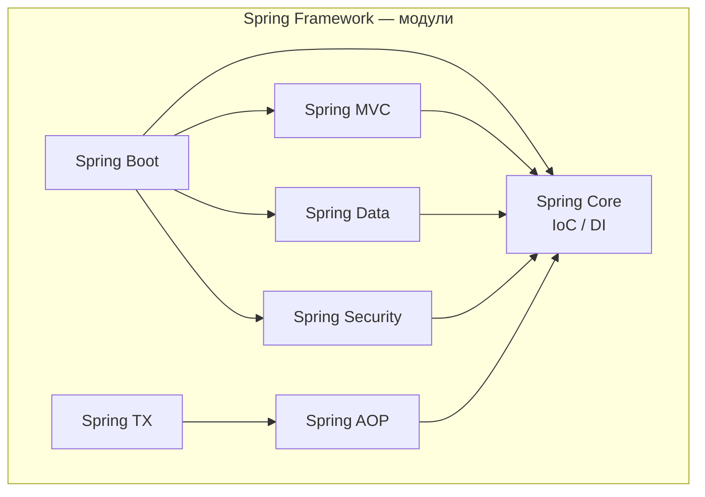
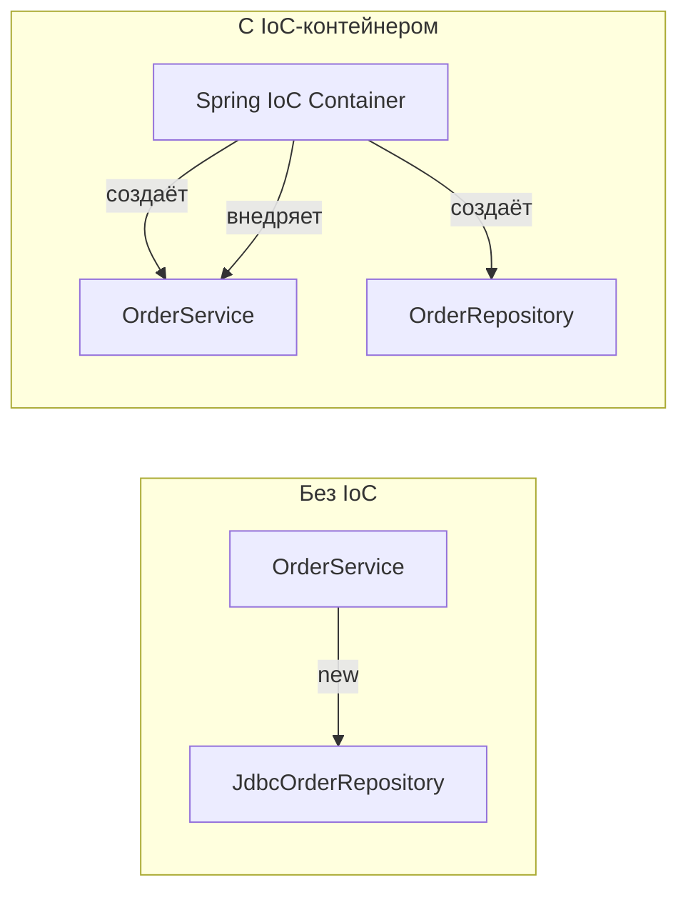
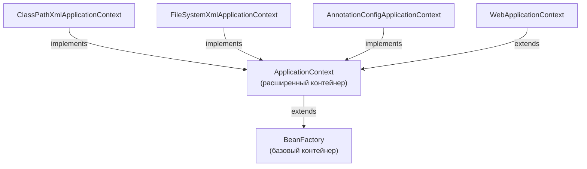
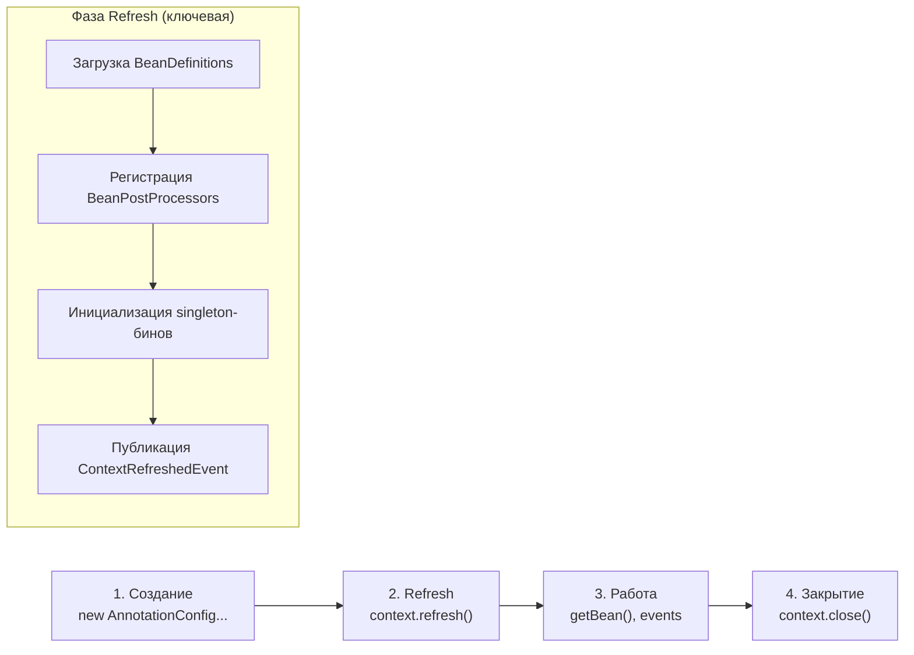
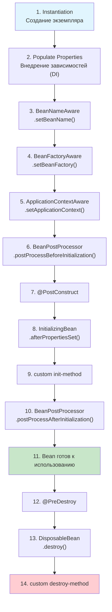
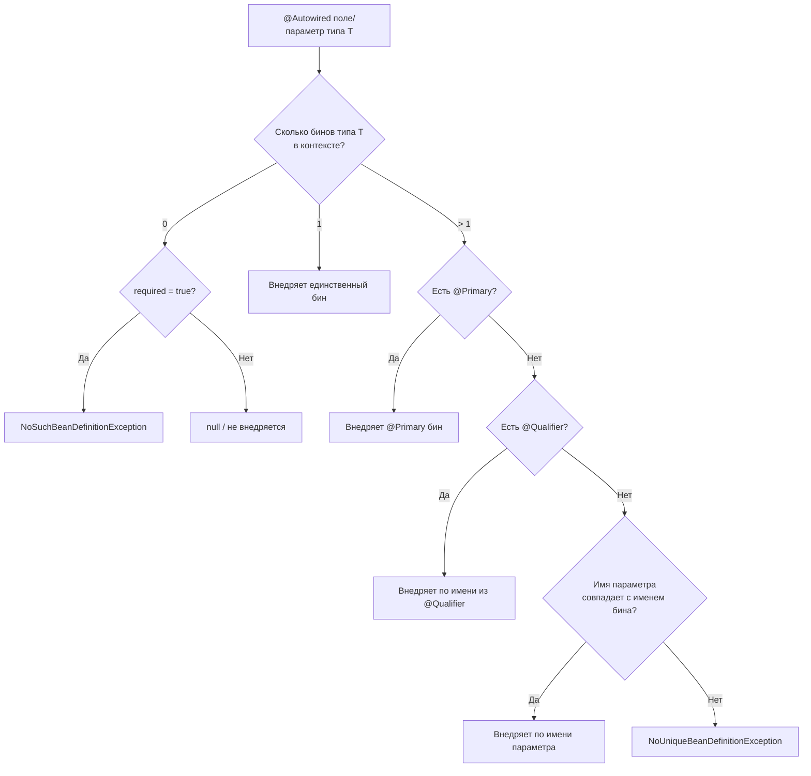
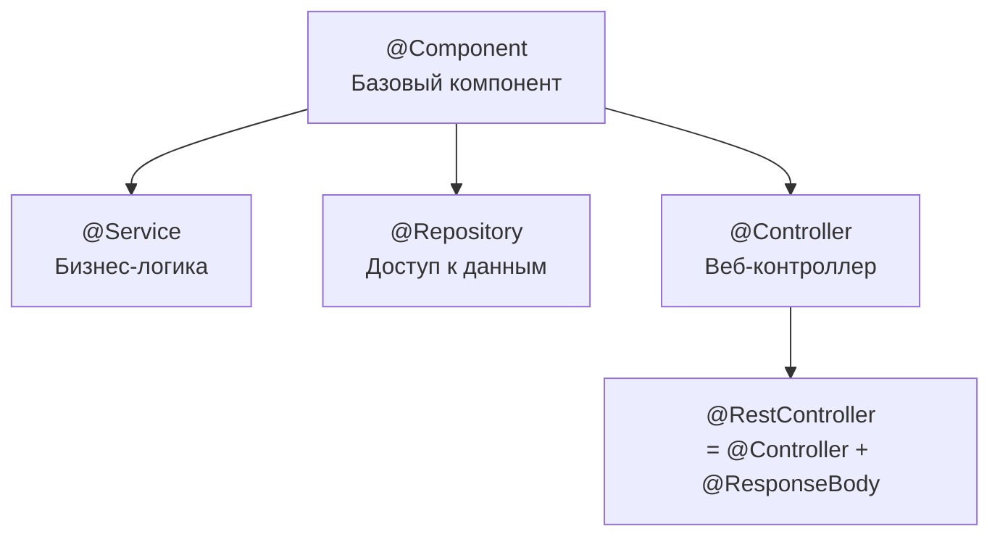
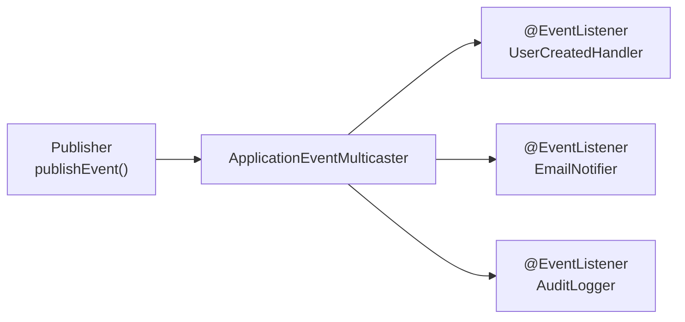
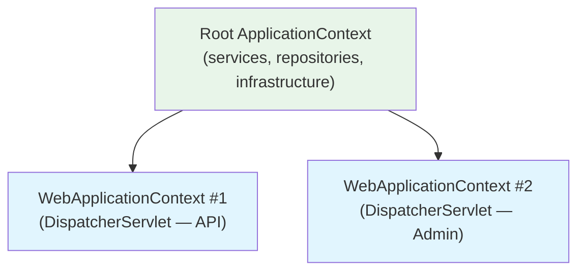

# Вопросы на собеседовании: `Spring Framework`

Полный гайд по `Spring Framework`: `IoC`-контейнер, `DI`, жизненный цикл бинов, `AOP`, прокси, профили, события, `@Conditional`, конфигурация.

**`Spring Framework`** — базовый фреймворк для enterprise-разработки на `Java`. Вопросы по `IoC`, `DI`, бинам, жизненному циклу, `AOP` и модулям `Spring` регулярно встречаются на собеседованиях всех уровней — от junior до senior. Этот файл покрывает ключевые темы с диаграммами, примерами кода и практическими нюансами.

## Полезные ссылки

### Официальная документация

- [Spring Framework Reference](https://docs.spring.io/spring-framework/reference/) — основная документация
- [Spring Framework API (Javadoc)](https://docs.spring.io/spring-framework/docs/current/javadoc-api/) — API-документация

### Baeldung

- [Spring Core Tutorials](https://www.baeldung.com/spring-tutorial) — практические туториалы по Spring Core
- [Inversion of Control and Dependency Injection with Spring](https://www.baeldung.com/inversion-control-and-dependency-injection-in-spring) — IoC и DI в деталях
- [Difference Between BeanFactory and ApplicationContext](https://www.baeldung.com/spring-beanfactory-vs-applicationcontext) — сравнение IoC-контейнеров
- [Wiring in Spring: @Autowired, @Resource and @Inject](https://www.baeldung.com/spring-annotations-resource-inject-autowire) — варианты внедрения зависимостей
- [Comparing Spring AOP and AspectJ](https://www.baeldung.com/spring-aop-vs-aspectj) — разница между Spring AOP и AspectJ
- [Implementing a Custom Spring AOP Annotation](https://www.baeldung.com/spring-aop-annotation) — создание кастомных аспектов
- [Top Spring Framework Interview Questions](https://www.baeldung.com/spring-interview-questions) — топ вопросов на интервью

## Содержание

- [Полезные ссылки](#полезные-ссылки)
- [See also](#see-also)

**Основы Spring Framework**
- [Q1. Что такое Spring Framework?](#q1-что-такое-spring-framework)
- [Q2. (!) Особенности и преимущества Spring Framework?](#q2-особенности-и-преимущества-spring-framework)

**IoC и Dependency Injection**
- [Q3. (!) Что такое Inversion of Control (IoC)?](#q3-что-такое-inversion-of-control-ioc)
- [Q4. (!) Что такое Dependency Injection (DI)?](#q4-что-такое-dependency-injection-di)
- [Q5. (!) Типы контейнеров в Spring Framework](#q5-типы-контейнеров-в-spring-framework)
- [Q6. (!) Какой жизненный цикл у Context?](#q6-какой-жизненный-цикл-у-context)
- [Q7. (!) В чем разница между BeanFactory и ApplicationContext?](#q7-в-чем-разница-между-beanfactory-и-applicationcontext)
- [Q8. (!) Как завершить работу Context?](#q8-как-завершить-работу-context)

**Bean и жизненный цикл**
- [Q9. Что такое Bean?](#q9-что-такое-bean)
- [Q10. (!) Какой жизненный цикл у Bean?](#q10-какой-жизненный-цикл-у-bean)
- [Q11. Как создать статический Bean?](#q11-как-создать-статический-bean)
- [Q12. Как внедрить Bean?](#q12-как-внедрить-bean)
- [Q13. (!) Что такое @Autowired?](#q13-что-такое-autowired)
- [Q14. (!) Какие есть области действия Bean?](#q14-какие-есть-области-действия-bean)
- [Q15. (!) Как лучше внедрять Bean?](#q15-как-лучше-внедрять-bean)
- [Q16. Является ли Singleton Bean потокобезопасным?](#q16-является-ли-singleton-bean-потокобезопасным)
- [Q17. Как внедрить Properties в Bean?](#q17-как-внедрить-properties-в-bean)

**Конфигурация и паттерны**
- [Q18. Что такое конфигурация Spring на основе Java?](#q18-что-такое-конфигурация-spring-на-основе-java)
- [Q19. (!) Можно ли иметь несколько файлов конфигурации Spring?](#q19-можно-ли-иметь-несколько-файлов-конфигурации-spring)
- [Q20. (!) Какие Design Patterns используются в Spring Framework?](#q20-какие-design-patterns-используются-в-spring-framework)

**AOP (Аспектно-ориентированное программирование)**
- [Q21. (!) Что такое AOP?](#q21-что-такое-aop)
- [Q22. (!) Как работает AOP-прокси в Spring?](#q22-как-работает-aop-прокси-в-spring)
- [Q23. Что такое Weaving?](#q23-что-такое-weaving)
- [Q24. (!) В чём разница между Spring AOP и AspectJ?](#q24-в-чём-разница-между-spring-aop-и-aspectj)

**Аннотации и конфигурация**
- [Q25. Что такое CommandLineRunner и ApplicationRunner?](#q25-что-такое-commandlinerunner-и-applicationrunner)
- [Q26. (!) Какие наиболее популярные аннотации в Spring?](#q26-какие-наиболее-популярные-аннотации-в-spring)
- [Q27. (!) В чём разница между @Component, @Service, @Repository и @Controller?](#q27-в-чём-разница-между-component-service-repository-и-controller)
- [Q28. Что такое @Qualifier и @Primary?](#q28-что-такое-qualifier-и-primary)

**Профили, условия, события**
- [Q29. (!) Что такое @Profile и как работают профили?](#q29-что-такое-profile-и-как-работают-профили)
- [Q30. Что такое @LookUp?](#q30-что-такое-lookup)
- [Q31. (!) Что такое @Conditional и как Spring Boot использует условные бины?](#q31-что-такое-conditional-и-как-spring-boot-использует-условные-бины)
- [Q32. (!) Как работает механизм событий (ApplicationEvent) в Spring?](#q32-как-работает-механизм-событий-applicationevent-в-spring)
- [Q33. (!) Иерархия ApplicationContext: parent-child контексты](#q33-иерархия-applicationcontext-parent-child-контексты)

**Продвинутые темы**
- [Q34. (!) В чём разница между @Bean и @Component?](#q34-в-чём-разница-между-bean-и-component)
- [Q35. (!) Что такое Pointcut и как писать Pointcut-выражения в Spring AOP?](#q35-что-такое-pointcut-и-как-писать-pointcut-выражения-в-spring-aop)
- [Q36. (!) Как работает @Around advice и чем он отличается от @Before / @After?](#q36-как-работает-around-advice-и-чем-он-отличается-от-before--after)
- [Q37. (!) Что такое SpEL (Spring Expression Language) и где он применяется?](#q37-что-такое-spel-spring-expression-language-и-где-он-применяется)
- [Q38. (!) Как работает @Async и что нужно настроить для асинхронных методов?](#q38-как-работает-async-и-что-нужно-настроить-для-асинхронных-методов)
- [Q39. (!) Что такое @EventListener и как публиковать события асинхронно?](#q39-что-такое-eventlistener-и-как-публиковать-события-асинхронно)
- [Q40. Как настроить несколько реализаций одного бина с разными профилями?](#q40-как-настроить-несколько-реализаций-одного-бина-с-разными-профилями)

## Q1. Что такое `Spring Framework`?

`Spring Framework` — это комплексный фреймворк для разработки enterprise-приложений на `Java`, построенный вокруг принципов **IoC** (Inversion of Control) и **AOP** (Aspect-Oriented Programming).

Основные модули:

| Модуль | Назначение |
|--------|-----------|
| `Spring Core` | IoC-контейнер, DI, ресурсы |
| `Spring MVC` | Веб-фреймворк (подробнее в [Spring MVC](spring-mvc-interview.md)) |
| `Spring Security` | Аутентификация и авторизация (подробнее в [Spring Security](spring-security-interview.md)) |
| `Spring Data` | Унифицированный доступ к данным (подробнее в [Spring Data JPA](spring-data-jpa-interview.md)) |
| `Spring AOP` | Аспектно-ориентированное программирование |
| `Spring TX` | Управление транзакциями |



Конфигурация возможна через `@Configuration` + `@Bean`, компонентное сканирование (`@Component`, `@Service`, `@Repository`) или XML. Зависимости внедряются через конструктор (рекомендуется), сеттер или поле.

> [!mcq]
> - [ ] `Spring Framework` — это `ORM`-фреймворк для работы с БД через `JPA`/`Hibernate`, готовые репозитории для `CRUD` | Это описание `Spring Data` — одного модуля. ❌ ПОСЛЕДСТВИЕ: при добавлении `spring-context` без JPA в проект разработчик ждёт автоматический `EntityManager` → `NoSuchBeanDefinitionException` на старте.
> - [x] `Spring Framework` — комплексный enterprise-фреймворк на `Java` вокруг `IoC`-контейнера и `AOP`, объединяющий модули веба, данных, безопасности и интеграции | Spring управляет жизненным циклом бинов (`IoC`/`DI`), поддерживает сквозную логику (`AOP`) и предоставляет унифицированные абстракции. ✓ ПРИМЕНЯТЬ: Netflix, Alibaba — миллионы JVM поверх Spring как платформы для микросервисов. 📋 ПРАВИЛО: «Spring = ядро IoC + AOP, всё остальное — модули поверх». 🔗 См. Q3, Q5, Q20.
> - [ ] `Spring Framework` — реактивный веб-фреймворк на `Project Reactor` для неблокирующей обработки `HTTP` | Это описание `Spring WebFlux` — одного из веб-модулей. ❌ ПОСЛЕДСТВИЕ: команда выбирает Spring «из-за реактивности» и в blocking-стеке `WebMvc` упирается в `Tomcat` thread pool на 200 threads → 503 при пиковой нагрузке.
> - [ ] `Spring Framework` — набор утилит для юнит-тестов на `Java`: моки, фикстуры, `DSL` для проверки поведения | Тестирование — лишь одна возможность. ❌ ПОСЛЕДСТВИЕ: команда тащит `spring-test` в legacy-проект ради `MockMvc`, не используя `IoC`, и получает 30+ секунд старта `@SpringBootTest` вместо 200 ms `Mockito`-теста.

## Q2. (!) Особенности и преимущества `Spring Framework`?

Ключевые преимущества `Spring Framework`:

1. **IoC/DI** — инверсия управления и внедрение зависимостей снижают связанность (coupling) и упрощают тестирование через подмену зависимостей (моки)
2. **AOP** — сквозная логика (логирование, транзакции, безопасность) выносится в аспекты, не загромождая бизнес-код
3. **Модульность** — подключаются только нужные модули; не нужно тянуть весь фреймворк
4. **Интеграция** — готовые абстракции для `Hibernate`, `JPA`, `MyBatis`, `Kafka`, `RabbitMQ`, `Redis`
5. **Тестируемость** — `@MockBean`, `@SpringBootTest`, `TestRestTemplate` делают тесты первоклассными гражданами
6. **Экосистема** — [Spring Boot](spring-boot-interview.md) для быстрого старта, [Spring Cloud](spring-cloud-interview.md) для микросервисов, `Spring Batch` для пакетной обработки

**Что ожидают на собеседовании:** не просто перечисление, а понимание trade-offs. Например, `Spring` добавляет overhead на старт (classpath scanning, proxy creation), что критично для serverless. `Spring Native` / `GraalVM` решают это за счёт AOT-компиляции.

> [!mcq]
> - [ ] Главное преимущество `Spring` — встроенная поддержка реактивного программирования, что делает его лучшим выбором для всех приложений | `WebFlux` — одна из возможностей, не главное. ❌ ПОСЛЕДСТВИЕ: junior форсит `WebFlux` в CRUD-сервисе с blocking-`JDBC` → `BlockHound` молчит, потоки `event-loop` пинятся на `Connection.execute()`, p99 latency растёт с 50ms до 5s под нагрузкой.
> - [ ] Главное преимущество `Spring` — минимальное время старта по сравнению с конкурентами | Spring Boot-приложения стартуют 2-10 секунд из-за classpath scanning и eager-инициализации. ❌ ПОСЛЕДСТВИЕ: команда выбирает Spring под `AWS Lambda` без `GraalVM` → cold start 8 секунд → SLA 1s провален, frontend получает 504 на холодных функциях.
> - [x] Ключевое преимущество `Spring` — снижение связанности через `IoC`/`DI`, что упрощает тестирование подменой моков и смену реализаций без изменения бизнес-кода | Слабая связанность означает зависимость от абстракций, а не от реализаций, что ведёт к тестируемости и гибкости. ✓ ПРИМЕНЯТЬ: `@MockBean` в integration-тестах Spring Boot — подмена `PaymentGateway` на стаб без перекомпиляции. 📋 ПРАВИЛО: «IoC/DI = сменная коробка передач для бизнес-логики». 🔗 См. Q3, Q4, Q15.
> - [ ] Ключевое преимущество — строгое следование спецификации `Java EE` для совместимости с любым `application server` | Spring пошёл своим путём, предложив лёгкий `IoC` вместо тяжёлых `EJB`. ❌ ПОСЛЕДСТВИЕ: архитектор требует деплой `WAR` на `WebSphere` под полный `JEE 8`, отказываясь от Spring Boot embedded `Tomcat` → 6 месяцев в очереди инфры на конфиг сервера вместо `java -jar`.

## Q3. (!) Что такое `Inversion of Control` (`IoC`)?

**Inversion of Control** — принцип, при котором управление созданием объектов и их зависимостями передаётся от прикладного кода контейнеру (фреймворку).

**Без IoC** (прямые зависимости):
```java
public class OrderService {
    // жёсткая связь — сам создаёт зависимость
    private final OrderRepository repo = new JdbcOrderRepository();
}
```

**С IoC** (контейнер управляет зависимостями):
```java
@Service
public class OrderService {
    private final OrderRepository repo;

    // контейнер внедряет нужную реализацию
    public OrderService(OrderRepository repo) {
        this.repo = repo;
    }
}
```



Преимущества:
- **Слабая связанность** — зависимость от абстракций, а не реализаций (подробнее в [ООП: SOLID](../../programming-languages/java/java-oop-interview.md))
- **Тестируемость** — легко подменять зависимости на моки
- **Гибкость конфигурации** — переключение реализаций без изменения бизнес-кода

> [!mcq]
> - [ ] `IoC` означает, что объект сам запрашивает зависимости из контейнера через `getBean()` — инвертируется поток данных | Это Service Locator — антипаттерн, противоположный `IoC`. ❌ ПОСЛЕДСТВИЕ: legacy-код вызывает `applicationContext.getBean(UserRepo.class)` в каждом методе → невозможно мокать в unit-тестах без поднятия Spring-контекста, тесты тормозят 30s vs 200ms.
> - [ ] `IoC` — паттерн, при котором бизнес-логика вызывает фреймворк для логирования и транзакций | Это описание `AOP`, а не `IoC`. ❌ ПОСЛЕДСТВИЕ: на собеседовании кандидат путает термины и не может объяснить, почему `@Transactional` на `private` методе не работает (это AOP-прокси, не IoC) — fail на middle-уровне.
> - [x] `IoC` — принцип, при котором управление созданием объектов и внедрение их зависимостей передаётся от прикладного кода внешнему контейнеру | Вместо `new` контейнер Spring берёт обязанность на себя, обеспечивая слабую связанность и тестируемость. ✓ ПРИМЕНЯТЬ: Hollywood Principle «Don't call us, we'll call you» — Spring инжектит `OrderRepository` в `OrderService`, не наоборот. 📋 ПРАВИЛО: «IoC = Hollywood Principle: контейнер вызывает тебя, не ты — контейнер». 🔗 См. Q4, Q5, Q12.
> - [ ] `IoC` — инверсия порядка выполнения методов: сначала деструктор, потом конструктор для оптимизации памяти | Это вымышленное определение. ❌ ПОСЛЕДСТВИЕ: на собеседовании кандидат отвечает в этом духе → немедленный reject, так как фундаментальное понимание Spring отсутствует.

> [!mcq]
> - [ ] Основная цель `IoC` — ускорить создание объектов за счёт пула заранее созданных экземпляров, выдаваемых вместо `new` | Это описание Object Pool паттерна, не `IoC`. ❌ ПОСЛЕДСТВИЕ: разработчик пишет `@Scope("prototype")` ожидая ускорения, на самом деле каждый `getBean()` создаёт новый объект через рефлексию → throughput падает на 30% при 10K RPS.
> - [ ] Основная цель `IoC` — обеспечить потокобезопасность объектов через синхронизированный контейнер | `IoC` не обеспечивает потокобезопасность. ❌ ПОСЛЕДСТВИЕ: команда хранит `private int counter` в singleton `@Service` → `++` без `AtomicInteger` → race condition в production, потеря 0.1% записей при 1K RPS.
> - [x] Основная цель `IoC` — снизить связанность через зависимость от абстракций, а не от конкретных реализаций, упрощая тестирование и замену | `IoC` реализует принцип Dependency Inversion из SOLID: компонент объявляет нужный интерфейс, контейнер подбирает реализацию. ✓ ПРИМЕНЯТЬ: Spring подменяет `PaymentGateway` на `StubPaymentGateway` через `@Profile("test")` без изменения `CheckoutService`. 📋 ПРАВИЛО: «IoC снижает coupling, а не latency». 🔗 См. Q3, Q4, Q40.
> - [ ] Основная цель `IoC` — шифровать зависимости между компонентами для защиты от реверс-инжиниринга | Вымышленная цель. ❌ ПОСЛЕДСТВИЕ: на собеседовании кандидат уходит в безопасность вместо архитектуры → reject; реальная защита от reverse — `ProGuard`/`R8`, а не Spring.

## Q4. (!) Что такое `Dependency Injection` (`DI`)?

`Dependency Injection` — конкретная реализация принципа `IoC`, при которой зависимости передаются объекту **извне** (через конструктор, сеттер или поле), а не создаются внутри объекта.

Три способа DI в Spring:

| Способ | Пример | Когда использовать |
|--------|--------|-------------------|
| **Конструктор** | `public OrderService(OrderRepository repo)` | Обязательные зависимости (рекомендуется) |
| **Сеттер** | `@Autowired public void setRepo(OrderRepository repo)` | Необязательные зависимости |
| **Поле** | `@Autowired private OrderRepository repo;` | Только в тестах; в production — антипаттерн |

```java
// Рекомендуемый способ — конструктор
@Service
public class PaymentService {
    private final PaymentGateway gateway;
    private final NotificationService notifications;

    // С Spring 4.3 @Autowired на единственном конструкторе не обязателен
    public PaymentService(PaymentGateway gateway, NotificationService notifications) {
        this.gateway = gateway;
        this.notifications = notifications;
    }
}
```

**Почему конструктор лучше:**
- Поля можно сделать `final` — гарантия неизменяемости
- Невозможно создать объект в невалидном состоянии (все зависимости обязательны)
- Видна сигнатура зависимостей — если их слишком много, это сигнал к рефакторингу (подробнее в [паттернах рефакторинга](../../code-quality/refactoring-patterns-interview.md))

> [!mcq]
> - [ ] `DI` — способ получения зависимостей, при котором объект сам вызывает `context.getBean()` всякий раз, когда нужна зависимость | Это Service Locator, не `DI`. ❌ ПОСЛЕДСТВИЕ: класс с `ApplicationContext`-полем для `getBean()` невозможно покрыть unit-тестами без поднятия Spring → `@SpringBootTest` 30s вместо 200ms на чистом Mockito.
> - [ ] `DI` — паттерн, при котором зависимости создаются через статические фабричные методы и кешируются в статических полях | Статические фабрики — не `DI`. ❌ ПОСЛЕДСТВИЕ: команда пишет `UserRepoFactory.getInstance()` вместо `@Autowired` → невозможно подменить реализацию в `@Profile("test")`, тесты используют production-БД и роняют CI.
> - [ ] `DI` — механизм, при котором Spring перехватывает все вызовы `new` в байткоде | Spring не перехватывает `new`. ❌ ПОСЛЕДСТВИЕ: разработчик пишет `OrderService s = new OrderService(repo)` ожидая, что Spring внедрит `repo` через байткод-магию → `repo` остаётся `null`, `NullPointerException` в первом же запросе.
> - [x] `DI` — конкретная реализация принципа `IoC`, при которой зависимости передаются объекту извне через конструктор, сеттер или поле | Контейнер создаёт зависимости и «вводит» их в зависимый объект, что позволяет подменять реализации и мокать в тестах. ✓ ПРИМЕНЯТЬ: Spring Team рекомендует constructor injection в official docs — `final` поля + явная сигнатура. 📋 ПРАВИЛО: «DI = ручка снаружи, не self-service внутри». 🔗 См. Q3, Q12, Q15.

> [!mcq]
> - [ ] Внедрение через поле предпочтительно из-за минимума шаблонного кода и прямой инъекции через рефлексию | Field injection — антипаттерн. ❌ ПОСЛЕДСТВИЕ: команда не может покрыть `OrderService` unit-тестом без `@SpringBootTest` (нет конструктора для прямого `new`) → `ReflectionTestUtils.setField()` костыли, тесты текут.
> - [ ] Внедрение через сеттер предпочтительно для всех зависимостей — позволяет менять их в runtime и легко переконфигурировать | Setter injection — только для опциональных зависимостей. ❌ ПОСЛЕДСТВИЕ: после `new OrderService()` без вызова `setRepo(repo)` объект в невалидном состоянии → `NullPointerException` в первом же `findById()` под нагрузкой.
> - [x] Внедрение через конструктор предпочтительно: позволяет `final`-поля, гарантирует полную инициализацию объекта и делает зависимости явными в сигнатуре | Constructor injection — рекомендация Spring Team. `final` исключает мутацию, наличие всех зависимостей сразу гарантирует валидное состояние. ✓ ПРИМЕНЯТЬ: Spring Boot reference docs явно рекомендует constructor injection с Spring 4.3 (без `@Autowired` если 1 конструктор). 📋 ПРАВИЛО: «Constructor для обязательных, setter для опциональных, field — никогда». 🔗 См. Q4, Q12, Q15.
> - [ ] Все три способа эквивалентны — выбор это вопрос стиля без последствий для тестируемости | Способ внедрения влияет фундаментально. ❌ ПОСЛЕДСТВИЕ: команда смешивает стили в кодовой базе → код-ревью без правил, циклические зависимости через `@Autowired`-поле проходят в master, на старте Spring Boot 2.6+ `BeanCurrentlyInCreationException`.

## Q5. (!) Типы контейнеров в `Spring Framework`

`Spring` предоставляет два основных контейнера: `BeanFactory` и `ApplicationContext`.



| Характеристика | `BeanFactory` | `ApplicationContext` |
|----------------|--------------|---------------------|
| Инициализация бинов | **Ленивая** (lazy) — при вызове `getBean()` | **Жадная** (eager) — при старте контекста |
| Events | Нет | `ApplicationEvent` / `@EventListener` |
| i18n | Нет | `MessageSource` |
| AOP | Нет | Полная поддержка |
| `Environment` | Нет | Профили, property sources |
| `BeanPostProcessor` | Ручная регистрация | Автоматическая |

**На практике** `BeanFactory` напрямую почти не используется — `ApplicationContext` покрывает 99% сценариев. `BeanFactory` полезен в ресурсно-ограниченных средах (embedded, IoT).

> [!mcq]
> - [ ] `BeanFactory` инициализирует все singleton-бины при старте (eager), а `ApplicationContext` — лениво при первом обращении | Всё наоборот: `BeanFactory` lazy, `ApplicationContext` eager по умолчанию. ❌ ПОСЛЕДСТВИЕ: разработчик ожидает, что ошибка конфигурации (отсутствующий `@Value`) проявится в `ApplicationContext` лениво при первом запросе → на самом деле fail на старте; команда не понимает, почему контейнер не стартует.
> - [ ] `BeanFactory` и `ApplicationContext` функционально идентичны: разница только в поддержке XML | Оба поддерживают XML и аннотации. ❌ ПОСЛЕДСТВИЕ: разработчик использует `XmlBeanFactory` для production-сервиса → `BeanPostProcessor` для `@Autowired` не регистрируется автоматически → инъекции не работают, `null`-поля.
> - [ ] `ApplicationContext` — замена `BeanFactory` без общего интерфейса; это два независимых способа | `ApplicationContext` extends `BeanFactory`. ❌ ПОСЛЕДСТВИЕ: на собеседовании middle-кандидат не может объяснить иерархию интерфейсов Spring — fail; в коде разработчик пишет приведение типов между ними и получает `ClassCastException`.
> - [x] `BeanFactory` — базовый контейнер с lazy-инициализацией; `ApplicationContext` расширяет его, добавляя eager-init, события, `i18n`, `AOP` и автоматическую регистрацию `BeanPostProcessor` | `ApplicationContext` — надстройка, берущая на себя регистрацию пост-процессоров, события и интернационализацию. ✓ ПРИМЕНЯТЬ: Spring Boot всегда использует `AnnotationConfigApplicationContext` (или Web-вариант) — `BeanFactory` напрямую почти не нужен. 📋 ПРАВИЛО: «BeanFactory — мотор, ApplicationContext — машина с приборной панелью». 🔗 См. Q6, Q7, Q10.

## Q6. (!) Какой жизненный цикл у `Context`?

Жизненный цикл `ApplicationContext` можно разделить на три основные фазы:



**Детализация фазы `refresh()`:**

1. **`prepareRefresh()`** — инициализация property sources, валидация required properties
2. **`obtainFreshBeanFactory()`** — создание `BeanFactory`, загрузка `BeanDefinition` из XML/аннотаций/Java-конфига
3. **`prepareBeanFactory()`** — настройка classloader, регистрация системных бинов (`Environment`, `SystemProperties`)
4. **`invokeBeanFactoryPostProcessors()`** — вызов `BeanFactoryPostProcessor` (например, `PropertyPlaceholderConfigurer`, `ConfigurationClassPostProcessor`)
5. **`registerBeanPostProcessors()`** — регистрация `BeanPostProcessor` (`AutowiredAnnotationBeanPostProcessor`, `CommonAnnotationBeanPostProcessor`)
6. **`initMessageSource()`** — инициализация i18n
7. **`initApplicationEventMulticaster()`** — настройка механизма событий
8. **`onRefresh()`** — хук для подклассов (например, `ServletWebServerApplicationContext` запускает Tomcat)
9. **`registerListeners()`** — регистрация `ApplicationListener`
10. **`finishBeanFactoryInitialization()`** — создание всех singleton-бинов (самый тяжёлый этап)
11. **`finishRefresh()`** — публикация `ContextRefreshedEvent`, запуск lifecycle-процессоров

> [!mcq]
> - [ ] Жизненный цикл `ApplicationContext` начинается с `finishBeanFactoryInitialization`, где загружаются все `BeanDefinition` из XML и аннотаций | `BeanDefinition` загружаются на `obtainFreshBeanFactory`, значительно раньше. ❌ ПОСЛЕДСТВИЕ: разработчик ставит брейкпоинт на `finishBeanFactoryInitialization` ища почему `BeanDefinition` не парсится из `@ComponentScan` → промахивается на 6 фаз и тратит часы на отладку.
> - [ ] Самый тяжёлый этап `refresh()` — вызов `BeanFactoryPostProcessor`-ов, генерирующих байткод для всех прокси при старте | Байткод-прокси создаются позже, в `finishBeanFactoryInitialization`. ❌ ПОСЛЕДСТВИЕ: команда оптимизирует время старта удалением `BeanFactoryPostProcessor` (например, `PropertyPlaceholderConfigurer`) → `@Value` подстановки ломаются, на старте `IllegalArgumentException: Could not resolve placeholder`.
> - [x] Самый тяжёлый этап `refresh()` — `finishBeanFactoryInitialization`: Spring создаёт все singleton-бины, внедряет зависимости и применяет `BeanPostProcessor` для прокси | На этом шаге происходит instantiation, DI и post-processing всех eager singleton-бинов; время старта растёт с числом бинов. ✓ ПРИМЕНЯТЬ: профилировка старта Spring Boot через `-Dlogging.level.org.springframework.context.support.PostProcessorRegistrationDelegate=DEBUG` или Spring Boot Startup Endpoint. 📋 ПРАВИЛО: «finishBeanFactoryInitialization — здесь живёт время старта». 🔗 См. Q5, Q7, Q10.
> - [ ] Повторный `context.refresh()` пересоздаёт все бины — годится для обновления конфигурации без перезапуска | Повторный `refresh()` на закрытом или активном контексте приводит к ошибке. ❌ ПОСЛЕДСТВИЕ: разработчик пишет endpoint `/refresh` с `ctx.refresh()` для hot-reload → `IllegalStateException` в production, под нагрузкой инстанс падает с `OOM` из-за двойной инициализации.

## Q7. (!) В чем разница между `BeanFactory` и `ApplicationContext`?

`BeanFactory` — базовый контейнер, предоставляющий функции DI. Реализация по умолчанию — `DefaultListableBeanFactory`. Создаёт бины **лениво** при вызове `getBean()`.

`ApplicationContext` — расширение `BeanFactory`, добавляющее:
- **Жадную инициализацию** singleton-бинов при старте (поведение можно переопределить через `@Lazy`)
- **Механизм событий** — `ApplicationEvent` / `@EventListener`
- **Интернационализацию** — `MessageSource`
- **Доступ к ресурсам** — `ResourceLoader` (classpath, filesystem, URL)
- **Интеграцию с AOP** — автоматическая регистрация `BeanPostProcessor` для проксирования
- **Профили и Environment** — `@Profile`, `@PropertySource`

```java
// BeanFactory — ленивая загрузка
BeanFactory factory = new XmlBeanFactory(new ClassPathResource("beans.xml"));
MyService service = factory.getBean(MyService.class); // бин создаётся здесь

// ApplicationContext — жадная загрузка
ApplicationContext ctx = new AnnotationConfigApplicationContext(AppConfig.class);
// все singleton-бины уже созданы
MyService service = ctx.getBean(MyService.class);
```

**На собеседовании:** часто спрашивают, когда `ApplicationContext` создаёт бины лениво. Ответ: при `@Lazy` на бине или `@Lazy` на `@Configuration`-классе, а также для `prototype`-scope бинов (они всегда ленивые).

> [!mcq]
> - [ ] `ApplicationContext` создаёт бины лениво по умолчанию: singleton создаётся при первом `getBean()`, а не при старте | По умолчанию `ApplicationContext` использует eager-инициализацию. ❌ ПОСЛЕДСТВИЕ: команда полагается на ленивость, ожидая что `DataSource` создастся при первом запросе → на самом деле `HikariDataSource` пытается подключиться на старте, под закрытой firewall — приложение падает за 60s `Connection refused`.
> - [x] `ApplicationContext` создаёт singleton-бины лениво только при `@Lazy` на бине или `@Configuration`-классе; `prototype`-бины всегда ленивые независимо от аннотаций | `@Lazy` переключает бин в режим отложенной инициализации; `prototype` создаётся только при запросе. ✓ ПРИМЕНЯТЬ: `@Lazy` на тяжёлом `RestTemplate`-клиенте к внешнему API ускоряет старт Spring Boot на 200-500 ms в crashloop-сценариях. 📋 ПРАВИЛО: «singleton — eager по умолчанию, @Lazy для исключений». 🔗 См. Q5, Q14, Q31.
> - [ ] `ApplicationContext` создаёт singleton лениво в профиле `dev` и eager в `prod` для быстрого обнаружения ошибок | Профиль не влияет на стратегию init. ❌ ПОСЛЕДСТВИЕ: команда ставит `@Profile("prod")` ожидая раннего fail на конфигурации → на dev сервис стартует «нормально», на prod падает; деплой откатывают, теряя 30 минут ради профиля который ничего не делает.
> - [ ] `ApplicationContext` всегда создаёт бины лениво при `scope = "singleton"` — singleton предполагает создание при первом обращении | Singleton-scope = один экземпляр на контекст, не ленивость. ❌ ПОСЛЕДСТВИЕ: разработчик ждёт лениво созданного singleton с тяжёлой инициализацией БД → `@PostConstruct` отрабатывает на старте, инстанс подвисает на 30s в `kubelet readiness probe` → бесконечный crashloop.

## Q8. (!) Как завершить работу `Context`?

Для корректного завершения работы контекста нужно вызвать `close()`, который:
1. Публикует `ContextClosedEvent`
2. Вызывает `@PreDestroy`-методы на бинах
3. Вызывает `destroy()`-методы `DisposableBean`
4. Освобождает ресурсы

```java
// Способ 1: явный close() через ConfigurableApplicationContext
ConfigurableApplicationContext ctx = new AnnotationConfigApplicationContext(AppConfig.class);
try {
    // работа с контекстом
} finally {
    ctx.close();
}

// Способ 2: try-with-resources (ApplicationContext implements Closeable)
try (var ctx = new AnnotationConfigApplicationContext(AppConfig.class)) {
    // работа с контекстом
}

// Способ 3: registerShutdownHook() — JVM shutdown hook
var ctx = new AnnotationConfigApplicationContext(AppConfig.class);
ctx.registerShutdownHook(); // close() будет вызван при завершении JVM
```

**Важно:** `registerShutdownHook()` — это то, что [Spring Boot](spring-boot-interview.md) делает автоматически. В standalone-приложениях без `Spring Boot` нужно вызывать явно.

> [!mcq]
> - [ ] Для корректного завершения достаточно установить бины в `null` — Spring отследит через `WeakReference` и вызовет `@PreDestroy` | Spring не отслеживает ссылки. ❌ ПОСЛЕДСТВИЕ: при `kill -15` контейнера `HikariDataSource` не закрывает соединения → connection leak в PgBouncer, через час `pool exhausted` для всех инстансов сервиса.
> - [x] Корректное завершение standalone-контекста — `context.close()` или `registerShutdownHook()`; затем Spring публикует `ContextClosedEvent` и вызывает `@PreDestroy` на всех бинах | `close()` гарантирует последовательность: `ContextClosedEvent` → `@PreDestroy` → `DisposableBean.destroy()` → custom destroy-method. ✓ ПРИМЕНЯТЬ: Spring Boot автоматически регистрирует shutdown hook через `SpringApplication.run()`; для standalone-приложений с `new AnnotationConfigApplicationContext()` нужен явный try-with-resources. 📋 ПРАВИЛО: «close() публикует ContextClosedEvent, stop() — нет». 🔗 См. Q6, Q10, Q32.
> - [ ] Завершение `main`-метода вызовет `@PreDestroy` через JVM-механизм | JVM не знает о Spring-бинах. ❌ ПОСЛЕДСТВИЕ: standalone batch-job завершает `main()`, не закрыв `EntityManagerFactory` → `Hibernate` оставляет background `Cleaner` thread → JVM не выходит, Jenkins job висит в RUNNING пока не убьёт по таймауту 1h.
> - [ ] `context.stop()` корректно завершает контекст, вызывая `@PreDestroy` и освобождая ресурсы | `stop()` через `Lifecycle` останавливает, но не разрушает бины. ❌ ПОСЛЕДСТВИЕ: разработчик пишет shutdown handler с `ctx.stop()` вместо `ctx.close()` → `@PreDestroy` методы (закрытие Kafka producer, flush метрик) не вызываются → теряются последние 100 сообщений при rolling deploy.

## Q9. Что такое `Bean`?

`Bean` — объект, управляемый IoC-контейнером `Spring`. Контейнер создаёт его, внедряет зависимости, управляет жизненным циклом и разрушает при закрытии контекста.

Три способа определения бинов:

**1. Компонентное сканирование (стереотипные аннотации):**
```java
@Service
public class UserService {
    private final UserRepository userRepository;

    public UserService(UserRepository userRepository) {
        this.userRepository = userRepository;
    }
}
```

**2. Java-конфигурация (`@Configuration` + `@Bean`):**
```java
@Configuration
public class AppConfig {
    @Bean
    public UserService userService(UserRepository userRepository) {
        return new UserService(userRepository);
    }

    @Bean
    public UserRepository userRepository(DataSource dataSource) {
        return new JdbcUserRepository(dataSource);
    }
}
```

**3. XML-конфигурация (legacy):**
```xml
<bean id="userService" class="com.example.UserService">
    <constructor-arg ref="userRepository"/>
</bean>
```

**На практике** в современных проектах используют комбинацию компонентного сканирования (для своих классов) и `@Bean`-методов (для сторонних библиотек, чьи классы нельзя аннотировать).

> [!mcq]
> - [ ] `Bean` — любой Java-объект, созданный через `new` и переданный в контекст через `registerBean()` | Не каждый переданный объект — полноценный бин. ❌ ПОСЛЕДСТВИЕ: разработчик регистрирует `new MyService()` через `registerSingleton()` → `@Autowired` поля внутри `MyService` не разрешаются (нет `BeanPostProcessor`-обработки), `null` в production.
> - [ ] `Bean` — только объекты с `@Component`/`@Service`/`@Repository`; `@Bean`-методы бинами не являются | `@Bean`-методы создают полноценные бины. ❌ ПОСЛЕДСТВИЕ: разработчик пытается аннотировать `ObjectMapper` из Jackson через `@Component` (невозможно — чужой класс) → теряет конфигурацию `JavaTimeModule`, в API возвращает `LocalDateTime` как `[2024,1,15]` вместо ISO.
> - [x] `Bean` — объект, созданный и управляемый `IoC`-контейнером: контейнер отвечает за создание, инъекцию зависимостей, lifecycle-callback и уничтожение | Каноническое определение; ключевое — «управляемый контейнером», что отличает бин от объекта через `new`. ✓ ПРИМЕНЯТЬ: Spring Cloud `RefreshScope` бины пересоздаются при `/actuator/refresh` — пример управления lifecycle контейнером поверх обычного singleton. 📋 ПРАВИЛО: «Bean = объект под контролем контейнера от рождения до смерти». 🔗 См. Q10, Q11, Q14.
> - [ ] `Bean` — только singleton; объекты с `prototype` не являются бинами | Prototype — тоже бины, хотя без auto-destroy. ❌ ПОСЛЕДСТВИЕ: разработчик считает prototype не-бином и не освобождает ресурсы вручную → утечка `Closeable`-объектов (например, `RestTemplate` с пулом соединений) → 100MB/сутки memory leak, OOM через 2 недели.

## Q10. (!) Какой жизненный цикл у `Bean`?

Жизненный цикл бина — одна из самых частых тем на собеседованиях. Важно знать не только этапы, но и порядок вызова callback-ов.



**Ключевые callback-и в коде:**

```java
@Component
public class CacheWarmer implements InitializingBean, DisposableBean {

    @PostConstruct
    public void postConstruct() {
        // 7. Вызывается после DI, до afterPropertiesSet()
        // Рекомендуемый способ инициализации
    }

    @Override
    public void afterPropertiesSet() {
        // 8. InitializingBean — альтернатива @PostConstruct
    }

    @PreDestroy
    public void preDestroy() {
        // 12. Вызывается перед destroy()
        // Рекомендуемый способ очистки ресурсов
    }

    @Override
    public void destroy() {
        // 13. DisposableBean — альтернатива @PreDestroy
    }
}
```

**Важный нюанс:** `BeanPostProcessor.postProcessAfterInitialization()` (шаг 10) — именно здесь Spring создаёт **прокси** для `@Transactional`, `@Cacheable`, `@Async` и других AOP-аннотаций. Поэтому вызов `this.method()` внутри того же бина обходит прокси и не запускает аспект.

> [!mcq]
> - [ ] Порядок: сначала `@PostConstruct`, затем `@Autowired`, потом бин доступен | Порядок обратный: сначала DI, потом `@PostConstruct`. ❌ ПОСЛЕДСТВИЕ: разработчик вызывает `repository.findAll()` в `@PostConstruct` → если зависимости вводились бы после — `NullPointerException` на старте; команда теряет день, не зная фактического порядка.
> - [ ] Порядок: `@PostConstruct` → `afterPropertiesSet()` → `BPP.before` → custom init | Порядок неверен; `BPP.before` идёт ДО `@PostConstruct`. ❌ ПОСЛЕДСТВИЕ: разработчик пишет custom `BeanPostProcessor` для логирования инициализации, ожидая что `@PostConstruct` уже отработал → видит `null`-поля, добавляет null-checks везде, маскируя реальную проблему порядка.
> - [ ] Порядок: custom init → `@PostConstruct` → `afterPropertiesSet()` → `BPP.after` | Неверно: `@PostConstruct` раньше `afterPropertiesSet()`, тот — раньше custom init. ❌ ПОСЛЕДСТВИЕ: команда мигрирует с XML на аннотации, ожидая что `init-method` запустится первым (как в XML-only) → init-логика дублируется с `@PostConstruct`, ресурсы инициализируются дважды.
> - [x] Правильный порядок: `BPP.postProcessBeforeInitialization()` → `@PostConstruct` → `afterPropertiesSet()` → custom init-method → `BPP.postProcessAfterInitialization()` | BPP.before первым (общие задачи), затем специфичные callback по убыванию приоритета; BPP.after — последний, здесь создаются AOP-прокси. ✓ ПРИМЕНЯТЬ: Spring Boot `ConfigurationPropertiesBindingPostProcessor` использует BPP.before для биндинга `@ConfigurationProperties` до `@PostConstruct`. 📋 ПРАВИЛО: «Init: BPP.before → @PostConstruct → afterProps → init-method → BPP.after». 🔗 См. Q9, Q11, Q22.

> [!mcq]
> - [ ] AOP-прокси для `@Transactional` создаются в `BPP.postProcessBeforeInitialization()`, поэтому `@PostConstruct` уже внутри прокси | Прокси создаются в `postProcessAfterInitialization()`, после `@PostConstruct`. ❌ ПОСЛЕДСТВИЕ: разработчик вызывает `@Transactional`-метод из `@PostConstruct`, ожидая транзакцию → транзакция не открывается, partial commit между двумя SQL-запросами при exception.
> - [x] AOP-прокси для `@Transactional` и `@Async` создаются в `BPP.postProcessAfterInitialization()` — поэтому self-invocation `this.method()` обходит прокси и аспект не срабатывает | Прокси оборачивают бин снаружи; `this` — оригинальный объект без обёртки. ✓ ПРИМЕНЯТЬ: разделение методов на разные бины (или `AopContext.currentProxy()` при `@EnableAspectJAutoProxy(exposeProxy=true)`) — стандартное решение в Spring Boot. 📋 ПРАВИЛО: «Прокси создаются в BPP.after, self-invocation минует их». 🔗 См. Q10, Q22, Q24.
> - [ ] AOP-прокси создаются `BeanFactoryPostProcessor` при загрузке `BeanDefinition`, до создания экземпляров | `BFPP` работает с метаданными, не экземплярами. ❌ ПОСЛЕДСТВИЕ: разработчик пишет custom `BFPP` для динамического добавления `@Transactional`, ожидая что прокси создадутся → BFPP только меняет `BeanDefinition`, прокси не появляются, транзакция не работает в runtime.
> - [ ] AOP-прокси создаются в `prepareRefresh()` задолго до инициализации бинов | `prepareRefresh()` — подготовка `Environment`. ❌ ПОСЛЕДСТВИЕ: на собеседовании middle-кандидат отвечает «прокси готовы с самого старта» → fail; реальный код: ставит брейкпоинт на `prepareRefresh()`, не видит прокси, тратит часы на отладку.

## Q11. Как создать статический `Bean`?

Статический `@Bean`-метод объявляется с модификатором `static` внутри `@Configuration`-класса. `Spring` вызывает его **до** полной инициализации `@Configuration`-класса.

```java
@Configuration
public class InfraConfig {

    // Статический Bean — создаётся раньше остальных
    @Bean
    public static PropertySourcesPlaceholderConfigurer propertyConfigurer() {
        return new PropertySourcesPlaceholderConfigurer();
    }

    // Обычный Bean — @Configuration-класс уже проксирован
    @Bean
    public DataSource dataSource(@Value("${db.url}") String url) {
        return new HikariDataSource(new HikariConfig(url));
    }
}
```

**Когда нужен статический `@Bean`:**
- **`BeanFactoryPostProcessor`** и **`BeanDefinitionRegistryPostProcessor`** — они обрабатывают `BeanDefinition` до создания остальных бинов. Если определить их как нестатические, `Spring` выдаст предупреждение, потому что для вызова метода нужно создать `@Configuration`-класс, что форсирует раннюю инициализацию
- `PropertySourcesPlaceholderConfigurer` — классический пример; без `static` значения `@Value` не будут разрешены вовремя

> [!mcq]
> - [ ] Статический `@Bean` — для бинов, разделяемых между несколькими `ApplicationContext` | Неверное обоснование. ❌ ПОСЛЕДСТВИЕ: разработчик ставит `static` ради "разделения контекстов", получает раннюю инициализацию `DataSource` → `HikariCP` стартует до загрузки `application-{profile}.yml` → подключение к dev-БД с prod-конфигурации.
> - [ ] Статический `@Bean` обходит CGLIB-проксирование и каждый вызов создаёт новый объект | Static-метод вызывается без экземпляра, но не создаёт новых объектов на каждый вызов. ❌ ПОСЛЕДСТВИЕ: команда использует `static @Bean public PaymentClient client()` для prototype-логики → CGLIB по-прежнему кэширует через `BeanDefinition`, реально один экземпляр; ожидание "новый каждый раз" не сбывается.
> - [x] Статический `@Bean` нужен для `BeanFactoryPostProcessor` и `PropertySourcesPlaceholderConfigurer` — они должны быть созданы до инициализации `@Configuration`-класса, иначе `@Value` не разрешатся вовремя | Static-методы вызываются без экземпляра конфиг-класса, что позволяет регистрировать пост-процессоры на ранней стадии. ✓ ПРИМЕНЯТЬ: Spring Boot autoconfiguration использует `static @Bean public static PropertySourcesPlaceholderConfigurer pspc()` повсеместно. 📋 ПРАВИЛО: «BFPP в @Bean — обязательно static». 🔗 См. Q6, Q18, Q19.
> - [ ] Статический `@Bean` нужен для prototype-бинов, чтобы CGLIB не кэшировал и возвращал новый экземпляр | Для prototype используется `@Scope("prototype")`, не `static`. ❌ ПОСЛЕДСТВИЕ: разработчик ставит `static` для `@Bean public ShoppingCart cart()` ожидая prototype-поведения → CGLIB всё равно возвращает singleton → все пользователи делят одну корзину, баг утечки данных между сессиями.

## Q12. Как внедрить `Bean`?

Три способа внедрения зависимостей:

```java
// 1. Конструктор (рекомендуется)
@Service
public class OrderService {
    private final OrderRepository repo;
    private final PaymentGateway gateway;

    public OrderService(OrderRepository repo, PaymentGateway gateway) {
        this.repo = repo;
        this.gateway = gateway;
    }
}

// 2. Сеттер (для необязательных зависимостей)
@Service
public class ReportService {
    private EmailSender emailSender;

    @Autowired(required = false)
    public void setEmailSender(EmailSender emailSender) {
        this.emailSender = emailSender;
    }
}

// 3. Поле (антипаттерн в production-коде)
@Service
public class LegacyService {
    @Autowired
    private SomeDependency dep; // нельзя сделать final, сложно тестировать
}
```

 
> [!mcq]
> - [ ] Все три способа применяются одинаково часто в production, ни один не считается антипаттерном | Field injection — антипаттерн. ❌ ПОСЛЕДСТВИЕ: разработчик пишет `@Autowired private Repo repo` в `@Service` → unit-тест требует `@SpringBootTest` для инициализации поля → 30s/тест вместо 200ms на чистом Mockito с конструктором.
> - [ ] Setter injection — рекомендация Spring Team для обязательных зависимостей: позволяет задать имя через имя метода | Spring Team рекомендует constructor injection для обязательных. ❌ ПОСЛЕДСТВИЕ: разработчик пишет setter для обязательного `DataSource`, забывает аннотировать `@Autowired(required=true)` → Spring не вызывает setter, в production `dataSource == null`, NPE при первом запросе.
> - [ ] Field injection — рекомендованный способ из-за минимума boilerplate | Это антипаттерн. ❌ ПОСЛЕДСТВИЕ: команда не замечает циклическую зависимость через поля (Spring разрешает через двухпроходный init с null) → в Spring Boot 2.6+ старт падает с `BeanCurrentlyInCreationException` после миграции версии.
> - [x] Constructor injection — для обязательных зависимостей; setter — для опциональных; field injection — антипаттерн в production | Constructor гарантирует все зависимости при создании и позволяет `final`; setter — гибкость для опциональных; field скрывает зависимости и усложняет тестирование. ✓ ПРИМЕНЯТЬ: Lombok `@RequiredArgsConstructor` + `private final Repo repo` — стандарт Spring Boot. 📋 ПРАВИЛО: «Constructor — обязательные, setter — опциональные, field — никогда». 🔗 См. Q4, Q13, Q15.

## Q13. (!) Что такое `@Autowired`?

`@Autowired` — аннотация `Spring` для автоматического внедрения зависимости по типу. `Spring` ищет подходящий бин в контексте и внедряет его.

**Алгоритм разрешения зависимости:**



```java
@Service
public class NotificationService {
    private final MessageSender sender;

    // С Spring 4.3 @Autowired не нужен, если один конструктор
    public NotificationService(@Qualifier("emailSender") MessageSender sender) {
        this.sender = sender;
    }
}
```

**Важно:** начиная с `Spring 4.3`, если у класса **один** конструктор, `@Autowired` на нём не обязателен — `Spring` использует его автоматически.

> [!mcq]
> - [ ] При нескольких бинах `@Autowired` выбирает первый зарегистрированный, независимо от `@Primary`/`@Qualifier` | Порядок регистрации не влияет. ❌ ПОСЛЕДСТВИЕ: разработчик ожидает порядок регистрации `EmailSender`/`SmsSender` через `@Order` → Spring выбирает по `@Primary`/имени, в проде уведомления уходят через SMS вместо email, биллинг растёт x10.
> - [x] При нескольких бинах одного типа `@Autowired` разрешает неоднозначность: `@Qualifier` → `@Primary` → имя параметра == имя бина → `NoUniqueBeanDefinitionException` | `@Qualifier` имеет высший приоритет среди кандидатов; `@Primary` — умолчание; имя параметра — последний резерв. ✓ ПРИМЕНЯТЬ: Spring Boot автоконфигурация маркирует `@Primary` дефолтные `DataSource`/`ObjectMapper`, давая возможность переопределить через `@Qualifier` для secondary БД. 📋 ПРАВИЛО: «Qualifier бьёт Primary, Primary бьёт имя, имя бьёт ошибку». 🔗 См. Q12, Q15, Q28.
> - [ ] При нескольких бинах `@Autowired` без `@Qualifier` всегда бросает `NoUniqueBeanDefinitionException` | Spring делает попытки разрешения. ❌ ПОСЛЕДСТВИЕ: разработчик добавляет `@Qualifier` "на всякий случай" во все инъекции → код-ревью отклоняется ('лишний boilerplate'), команда теряет время на правки которые не нужны при `@Primary`.
> - [ ] При нескольких бинах `@Autowired` без `@Qualifier` внедряет `null` | `required=true` по умолчанию — exception, не `null`. ❌ ПОСЛЕДСТВИЕ: разработчик пишет `if (sender != null) sender.send()` маскируя возможные null → когда Spring всё-таки бросает exception на старте, команда не понимает почему: считала что инжектится null silently.

> [!mcq]
> - [ ] `@Autowired`, `@Inject` (JSR-330) и `@Resource` (JSR-250) полностью взаимозаменяемы и идентичны во всех сценариях | Они отличаются стратегией. ❌ ПОСЛЕДСТВИЕ: разработчик заменяет `@Autowired` на `@Resource` в legacy для "стандартизации" → `@Resource` ищет по имени поля, при двух бинах `EmailSender`/`SmsSender` выбирает не тот, который ожидался — silent baгreplacement в production.
> - [x] `@Autowired` внедряет by type, `@Resource` — by name по умолчанию; `@Qualifier` уточняет выбор при `@Autowired`, а `@Resource(name=...)` содержит имя встроенно | Ключевое различие. ✓ ПРИМЕНЯТЬ: `@Resource` — JEE-legacy в проектах из WebSphere/JBoss; в новых Spring Boot — `@Autowired` + `@Qualifier`. 📋 ПРАВИЛО: «@Autowired by type, @Resource by name, @Inject — без required=false». 🔗 См. Q13, Q15, Q28.
> - [ ] `@Autowired` игнорирует наследование и внедряет только бины точного типа, не интерфейсы | `@Autowired` поддерживает полиморфизм. ❌ ПОСЛЕДСТВИЕ: разработчик не верит в полиморфизм, аннотирует поле конкретным классом `JdbcUserRepo` вместо интерфейса `UserRepo` → невозможно подменить через `@Profile("test")` на mock-реализацию, тесты идут к реальной БД.
> - [ ] С Spring 5 `@Autowired` deprecated и заменён на `@Inject` | `@Autowired` не deprecated. ❌ ПОСЛЕДСТВИЕ: команда мигрирует с `@Autowired` на `@Inject` "ради будущего" → теряет `required=false`, проверки `Optional<>`-параметров (через `ObjectProvider`) усложняются, рефакторинг растягивается на спринт без выгоды.

## Q14. (!) Какие есть области действия `Bean`?

| Scope | Описание | Создание | Разрушение |
|-------|----------|----------|-----------|
| `singleton` | Один экземпляр на контекст (по умолчанию) | При старте контекста | При закрытии контекста |
| `prototype` | Новый экземпляр при каждом запросе | При каждом `getBean()` / внедрении | **Не управляется** контейнером! |
| `request` | Один экземпляр на HTTP-запрос | При поступлении запроса | По завершении запроса |
| `session` | Один экземпляр на HTTP-сессию | При создании сессии | При истечении/инвалидации сессии |
| `application` | Один экземпляр на `ServletContext` | При старте `ServletContext` | При остановке `ServletContext` |
| `websocket` | Один экземпляр на WebSocket-сессию | При открытии WS-соединения | При закрытии WS-соединения |

```java
@Component
@Scope("prototype")
public class ShoppingCart {
    private final List<Item> items = new ArrayList<>();
}

// Проблема: prototype внутри singleton
@Service
public class OrderService {
    // ОШИБКА! Один и тот же ShoppingCart на все запросы
    @Autowired private ShoppingCart cart;
}

// Решение 1: @Lookup
@Service
public abstract class OrderService {
    @Lookup
    protected abstract ShoppingCart createCart();
}

// Решение 2: ObjectProvider
@Service
public class OrderService {
    private final ObjectProvider<ShoppingCart> cartProvider;

    public OrderService(ObjectProvider<ShoppingCart> cartProvider) {
        this.cartProvider = cartProvider;
    }

    public void processOrder() {
        ShoppingCart cart = cartProvider.getObject(); // новый экземпляр
    }
}
```

**Ловушка с `prototype`:** Spring **не вызывает** `@PreDestroy` для prototype-бинов — ответственность за очистку ресурсов лежит на клиенте.

> [!mcq]
> - [ ] Scope `prototype` — один экземпляр на `ApplicationContext`, переиспользуется всеми | Это описание `singleton`. ❌ ПОСЛЕДСТВИЕ: разработчик ставит `prototype` ожидая stateful-бин, но при `@Autowired private ShoppingCart cart` в singleton-сервисе все пользователи делят одну корзину → cross-user data leak.
> - [ ] Scope `request` — один экземпляр на поток JVM, для `ThreadLocal`-переменных | `request` привязан к HTTP-запросу, не потоку. ❌ ПОСЛЕДСТВИЕ: разработчик кеширует данные в `request`-бине ожидая thread-isolation → в Tomcat reusable threads подхватывают request-bean от предыдущего запроса (на самом деле прокси на ScopedProxy решает это, но без `@Scope(proxyMode = TARGET_CLASS)` баг). Подробности — `WebApplicationContextUtils`.
> - [x] Scope `session` — один экземпляр на HTTP-сессию, живёт до истечения/инвалидации; типичен для корзины покупок | `session`-scope хранит состояние, специфичное для сессии пользователя. ✓ ПРИМЕНЯТЬ: e-commerce checkout (Wildberries, Ozon) — `ShoppingCart` как `@SessionScope` с `proxyMode = TARGET_CLASS` для инъекции в `@RestController`. 📋 ПРАВИЛО: «session = жизнь сессии, request = жизнь запроса, application = жизнь ServletContext». 🔗 См. Q9, Q16, Q30.
> - [ ] Scope `application` — один экземпляр на JAR-модуль для изоляции между модулями | `application` = один экземпляр на `ServletContext`. ❌ ПОСЛЕДСТВИЕ: команда модулярного приложения думает что `@ApplicationScope` изолирует модули → все модули делят один экземпляр, конкурентная модификация state'а между модулями → race condition в счётчике запросов.

> [!mcq]
> - [ ] При `@Autowired` `prototype`-бина в singleton Spring создаёт новый экземпляр при каждом обращении к полю | Spring инжектит один раз при создании singleton. ❌ ПОСЛЕДСТВИЕ: разработчик добавляет state в `@Scope("prototype") ShoppingCart`, инжектит в `@Service` через поле → cart переиспользуется между запросами всех пользователей, утечка корзины пользователя A → пользователю B.
> - [ ] Spring вызывает `@PreDestroy` для prototype при закрытии контекста | Spring не уничтожает prototype-бины. ❌ ПОСЛЕДСТВИЕ: разработчик кладёт `Closeable` ресурс в prototype и полагается на `@PreDestroy` для закрытия → утечка `FileInputStream`/`Connection`, через сутки `Too many open files`.
> - [x] При обычном `@Autowired` prototype в singleton Spring инжектит один экземпляр на всю жизнь singleton; для нового экземпляра нужен `@Lookup` или `ObjectProvider<T>` | Это scope mismatch problem; singleton хранит ссылку на один прототип, созданный при инициализации. ✓ ПРИМЕНЯТЬ: `ObjectProvider<ShoppingCart>` в `@RequiredArgsConstructor`-сервисе — современный способ получать свежий prototype из singleton без CGLIB-`@Lookup`-абстрактных методов. 📋 ПРАВИЛО: «Prototype в singleton = ObjectProvider или @Lookup, иначе scope mismatch». 🔗 См. Q9, Q11, Q30.
> - [ ] Scope `prototype` идентичен `request`: оба создают новый экземпляр на HTTP-запрос | Они разные. ❌ ПОСЛЕДСТВИЕ: команда переключает `@RequestScope` на `prototype` "для упрощения" → потеря автоматической очистки после запроса, утечка `MDC`-контекста между запросами в Tomcat thread pool, лог запроса A приписывается запросу B.

## Q15. (!) Как лучше внедрять `Bean`?

**Рекомендация Spring Team:** конструктор для обязательных зависимостей, сеттер для необязательных.

| Критерий | Конструктор | Сеттер | Поле |
|----------|------------|--------|------|
| Иммутабельность (`final`) | Да | Нет | Нет |
| Обязательность зависимости | Гарантирована | Нет | Нет |
| Тестируемость | Легко (через `new`) | Средне | Сложно (reflection) |
| Циклические зависимости | Ошибка при старте | Работает | Работает |
| Читаемость | Видна сигнатура | Разбросано по классу | Скрыто |

**Правило большого пальца:** если конструктор принимает больше 5-7 параметров, это сигнал к декомпозиции класса (нарушение Single Responsibility Principle — подробнее в [SOLID](../../programming-languages/java/java-oop-interview.md)).

**Циклические зависимости:** `Spring Boot 2.6+` по умолчанию запрещает циклические зависимости. Если они есть — это архитектурная проблема, которую нужно решать рефакторингом, а не `@Lazy`.

> [!mcq]
> - [ ] Setter injection — для всех зависимостей, чтобы перенастраивать бины в runtime | Изменение зависимостей после создания — риск, не преимущество. ❌ ПОСЛЕДSTVIE: разработчик меняет `dataSource` через setter в runtime для "переключения БД" → активные транзакции теряют контекст соединения, `Connection is closed` exceptions для inflight-запросов.
> - [ ] Constructor injection не поддерживает циклы, Spring автоматически переключается на setter | Spring не переключается. ❌ ПОСЛЕДСТВИЕ: команда апгрейдится с Spring Boot 2.5 (где циклы разрешались) на 2.6+ → старт падает с `BeanCurrentlyInCreationException`, deploy откатывается, неделя на рефакторинг архитектуры.
> - [ ] Field injection — лучший выбор для производительности: Spring внедряет параллельно через рефлексию | Field injection не быстрее. ❌ ПОСЛЕДСТВИЕ: команда выбирает field "ради скорости", потом не может покрыть `OrderService` unit-тестом → `ReflectionTestUtils.setField` костыли, тесты медленнее в 100x чем с constructor.
> - [x] Constructor injection — для обязательных: позволяет `final`-поля, гарантирует полную инициализацию и выявляет циклы на старте | Spring Team рекомендует; `final`, детектирование циклов и явная сигнатура делают код надёжным. ✓ ПРИМЕНЯТЬ: Spring Boot 2.6+ по умолчанию запрещает циклы через `spring.main.allow-circular-references=false` — constructor injection ловит проблему на старте, не в runtime. 📋 ПРАВИЛО: «Constructor injection — fail fast, на старте, не на 100K-м запросе». 🔗 См. Q4, Q12, Q13.

## Q16. Является ли `Singleton Bean` потокобезопасным?

**Нет.** `Singleton` — это шаблон создания, а не поведения. Потокобезопасность зависит от реализации бина.

**Проблема:**
```java
@Service
public class CounterService {
    private int count = 0; // Shared mutable state!

    public void increment() {
        count++; // Race condition в многопоточной среде
    }
}
```

**Решения:**
1. **Stateless бины** — не хранить mutable state (рекомендуется)
2. **Синхронизация** — `synchronized`, `Lock`, `AtomicInteger`
3. **ThreadLocal** — изоляция данных по потоку
4. **Prototype/request scope** — каждый поток/запрос получает свой экземпляр

```java
@Service
public class StatelessService {
    private final UserRepository repo; // immutable reference — безопасно

    public User findUser(Long id) {
        return repo.findById(id); // нет shared mutable state
    }
}
```

**На собеседовании:** покажите понимание связи scope-бинов и потокобезопасности. `Singleton` + mutable state = проблема. Подробнее о потоках в [Java Concurrency](../../programming-languages/java/java-concurrency-interview.md).

> [!mcq]
> - [ ] Singleton-бин потокобезопасен по умолчанию: Spring синхронизирует вызовы через внутренние механизмы | Spring не синхронизирует вызовы. ❌ ПОСЛЕДСТВИЕ: разработчик хранит `private int counter` в `@Service` уверенный в потокобезопасности → `counter++` без `AtomicInteger` теряет инкременты под нагрузкой 1K RPS, метрики недоучёта 5-10% сообщений.
> - [ ] Singleton потокобезопасен, если все методы `synchronized`; Spring добавляет это автоматически к `@Service` | Spring не добавляет `synchronized`. ❌ ПОСЛЕДСТВИЕ: команда полагается на воображаемый авто-`synchronized` → race condition в `OrderService.create()` приводит к двойному списанию средств, регуляторный инцидент в платёжном сервисе.
> - [x] Singleton не потокобезопасен автоматически: при mutable state нужна явная синхронизация (`AtomicInteger`, `ThreadLocal`) или stateless-дизайн | Singleton scope = один экземпляр, но не изоляция между потоками; stateless — простейший путь. ✓ ПРИМЕНЯТЬ: stateless `@Service` + `final` зависимости — стандарт Spring Boot, любое изменяемое состояние выносится в БД/кэш/Atomic. 📋 ПРАВИЛО: «Singleton + mutable state = race condition; stateless или Atomic». 🔗 См. Q9, Q14, Q22.
> - [ ] Singleton + `@Transactional` потокобезопасен: транзакционный прокси синхронизирует методы | `@Transactional` управляет БД-транзакциями, не синхронизирует потоки. ❌ ПОСЛЕДСТВИЕ: разработчик меняет `private List<Order> cache` внутри `@Transactional`-метода → `ConcurrentModificationException` под нагрузкой, лог выглядит как DB-ошибка → команда тратит дни ища баг в Hibernate.

## Q17. Как внедрить `Properties` в `Bean`?

**Способ 1: `@Value` — отдельные свойства:**
```java
@Service
public class MailService {
    @Value("${mail.host}")
    private String host;

    @Value("${mail.port:587}")  // значение по умолчанию
    private int port;

    @Value("${mail.enabled:true}")
    private boolean enabled;

    @Value("#{${mail.headers}}")  // SpEL для Map
    private Map<String, String> headers;
}
```

**Способ 2: `@ConfigurationProperties` — типобезопасная привязка группы свойств:**
```java
@ConfigurationProperties(prefix = "mail")
@Validated
public class MailProperties {
    @NotBlank
    private String host;
    private int port = 587;
    private boolean enabled = true;
    private Map<String, String> headers = new HashMap<>();
    // getters + setters
}

@Configuration
@EnableConfigurationProperties(MailProperties.class)
public class MailConfig {
    @Bean
    public MailService mailService(MailProperties props) {
        return new MailService(props);
    }
}
```

**Рекомендация:** для 1-2 свойств — `@Value`, для группы связанных свойств — `@ConfigurationProperties` с валидацией через `@Validated` + `Jakarta Validation`. Подробнее о конфигурации в [Spring Boot](spring-boot-interview.md).

> [!mcq]
> - [ ] `@Value` и `@ConfigurationProperties` полностью взаимозаменяемы — вопрос личных предпочтений | Они отличаются функционально. ❌ ПОСЛЕДСТВИЕ: команда выбирает `@Value` для группы из 20 mail-свойств → нет валидации, при пустом `mail.host` сервис стартует и падает на первом отправлении, без `@NotBlank` ошибка не ловится на старте.
> - [x] `@Value` — для 1-2 отдельных свойств; `@ConfigurationProperties` — для типобезопасного связывания группы с валидацией через `@Validated` | `@ConfigurationProperties` поддерживает `@NotBlank`, `@Min`, nested objects, автодополнение IDE через `spring-configuration-metadata.json`. ✓ ПРИМЕНЯТЬ: Spring Boot собственные `ServerProperties`, `DataSourceProperties` — все autoconfiguration-классы построены на `@ConfigurationProperties` с валидацией. 📋 ПРАВИЛО: «1-2 свойства — @Value, группа — @ConfigurationProperties + @Validated». 🔗 См. Q12, Q18, Q31.
> - [ ] `@Value` поддерживает только String, `@ConfigurationProperties` конвертит в int/boolean/Duration | Оба используют `ConversionService` для типов. ❌ ПОСЛЕДСТВИЕ: разработчик пишет `@Value("${timeout}") String t; int timeout = Integer.parseInt(t)` ради конверсии → теряет встроенную поддержку `Duration` (`PT5S`), при изменении формата конфига ломается парсинг.
> - [ ] `@ConfigurationProperties` работает только с `application.properties`, не с YAML или env vars | Работает со всеми `PropertySources`. ❌ ПОСЛЕДСТВИЕ: разработчик дублирует конфигурацию в YAML и properties "ради совместимости" с `@ConfigurationProperties` → два файла рассинхронятся, в prod секция YAML обновлена, properties — нет, deploy идёт со старой конфигурацией.

## Q18. Что такое конфигурация `Spring` на основе `Java`?

Java-based конфигурация — способ определения бинов через `@Configuration`-классы вместо XML. Это типобезопасный подход с поддержкой IDE (автодополнение, рефакторинг, компиляционные проверки).

```java
@Configuration
public class AppConfig {

    @Bean
    public DataSource dataSource() {
        HikariConfig config = new HikariConfig();
        config.setJdbcUrl("jdbc:postgresql://localhost:5432/mydb");
        config.setMaximumPoolSize(10);
        return new HikariDataSource(config);
    }

    @Bean
    public TransactionManager transactionManager(DataSource dataSource) {
        return new DataSourceTransactionManager(dataSource);
    }
}
```

**Важный нюанс:** `@Configuration`-класс проксируется через CGLIB. Это значит, что вызов `dataSource()` внутри другого `@Bean`-метода **не создаст** новый объект — прокси вернёт тот же singleton:

```java
@Configuration
public class AppConfig {
    @Bean
    public DataSource dataSource() { return new HikariDataSource(); }

    @Bean
    public JdbcTemplate jdbcTemplate() {
        // НЕ создаёт новый DataSource — CGLIB-прокси возвращает singleton
        return new JdbcTemplate(dataSource());
    }
}
```

Для `@Configuration(proxyBeanMethods = false)` (lite mode) — каждый вызов создаёт новый объект. `Spring Boot` использует lite mode в автоконфигурациях для ускорения старта.

> [!mcq]
> - [ ] `@Configuration` не проксируется: вызов `@Bean`-метода из другого создаёт новый объект, нарушая singleton | По умолчанию проксируется через CGLIB. ❌ ПОСЛЕДСТВИЕ: разработчик не доверяет CGLIB и дублирует `@Bean public DataSource dataSource()` руками в каждом потребителе → 5 экземпляров `HikariDataSource`, 5x пулов соединений, БД упирается в `max_connections` лимит.
> - [x] `@Configuration` проксируется через CGLIB: вызов одного `@Bean`-метода из другого возвращает тот же singleton из контекста | CGLIB перехватывает `@Bean`-вызовы и возвращает уже созданный бин при повторном обращении. ✓ ПРИМЕНЯТЬ: Spring Boot autoconfiguration — `DataSourceAutoConfiguration` вызывает `dataSourceProperties()` несколько раз внутри одного `@Configuration` без дублирования. 📋 ПРАВИЛО: «@Configuration → CGLIB → один @Bean-вызов = один singleton». 🔗 См. Q11, Q22, Q34.
> - [ ] `@Configuration(proxyBeanMethods = false)` возвращает тот же singleton, но быстрее | Lite mode отключает проксирование. ❌ ПОСЛЕДСТВИЕ: разработчик включает `proxyBeanMethods = false` "для скорости старта" в `@Configuration` где `@Bean`-методы зовут друг друга → дубликаты бинов, два разных `DataSource` с разными connection-пулами, race condition при обновлении схемы Flyway.
> - [ ] `@Configuration` проксируется JDK Dynamic Proxy и требует интерфейс | CGLIB, не JDK Proxy. ❌ ПОСЛЕДСТВИЕ: разработчик создаёт интерфейс `IAppConfig` и реализует `@Configuration` для "правильного проксирования" → CGLIB всё равно генерирует подкласс, лишний интерфейс усложняет код, при `extends` вылазит `final`-проблема CGLIB.

## Q19. (!) Можно ли иметь несколько файлов конфигурации `Spring`?

Да, и в крупных проектах это рекомендуемая практика — разделение по ответственности.

**Java-конфигурация:**
```java
@Configuration
@Import({DataConfig.class, SecurityConfig.class, CacheConfig.class})
public class AppConfig {
}

// Или через component scanning
@Configuration
@ComponentScan(basePackages = "com.example.config")
public class AppConfig {
}
```

**XML-конфигурация (legacy):**
```xml
<import resource="datasource-config.xml"/>
<import resource="security-config.xml"/>
```

**Типичная структура конфигурации:**
```
config/
├── AppConfig.java          — корневая конфигурация
├── DataConfig.java         — DataSource, JPA, Flyway
├── SecurityConfig.java     — Spring Security
├── CacheConfig.java        — Redis/Caffeine
├── AsyncConfig.java        — @EnableAsync, ThreadPoolTaskExecutor
└── WebConfig.java          — CORS, interceptors, formatters
```

> [!mcq]
> - [ ] Spring требует один `@Configuration`-класс под `@SpringBootApplication` | Можно несколько. ❌ ПОСЛЕДСТВИЕ: junior пишет 2000-строчный `AppConfig` со всеми `@Bean` (DataSource, Security, Kafka, Cache, Web) → конфликт интересов, любая правка касается всей команды → merge conflicts в каждом sprint.
> - [ ] Java-конфигурация требует XML с `<import>` для объединения | XML не нужен. ❌ ПОСЛЕДСТВИЕ: legacy-проект мигрирует на Java-config, но архитектор оставляет XML "для импорта" → двойной источник истины, Spring загружает из обоих, неконсистентность бинов между средами.
> - [ ] `@Import` импортирует только `@Configuration`, для `@Component` обязателен `@ComponentScan` | `@Import` также принимает `ImportSelector`/`ImportBeanDefinitionRegistrar`. ❌ ПОСЛЕДСТВИЕ: разработчик ищет способ импортировать `ImportSelector` и не находит, считая `@Import` ограниченным → пишет ручные `BeanDefinitionRegistry` хуки вместо стандартного `ImportSelector`-механизма (как в Spring Boot autoconfiguration).
> - [x] Spring поддерживает несколько `@Configuration`: `@Import({DataConfig.class, SecurityConfig.class})` или `@ComponentScan` для автоматического обнаружения | Разбиение по ответственности (`DataConfig`, `SecurityConfig`, `CacheConfig`) — стандартная практика; `@Import` для явного контроля, `@ComponentScan` — автоматика. ✓ ПРИМЕНЯТЬ: Spring Boot — каждый стартер регистрирует свою autoconfiguration через `META-INF/spring/org.springframework.boot.autoconfigure.AutoConfiguration.imports`. 📋 ПРАВИЛО: «Один Configuration на одну ответственность, объединяем через @Import». 🔗 См. Q18, Q26, Q31.

## Q20. (!) Какие `Design Patterns` используются в `Spring Framework`?

`Spring Framework` активно применяет паттерны проектирования (подробнее в [Design Patterns](../../design-patterns/design-patterns-interview.md)):

| Паттерн | Где используется | Пример |
|---------|-----------------|--------|
| **Singleton** | Scope бинов по умолчанию | `@Scope("singleton")` |
| **Factory Method** | Создание бинов | `@Bean`-методы, `BeanFactory` |
| **Proxy** | AOP, `@Transactional`, `@Cacheable` | JDK Dynamic Proxy / CGLIB |
| **Template Method** | JDBC, JMS, REST | `JdbcTemplate`, `RestTemplate` |
| **Observer** | События | `ApplicationEvent`, `@EventListener` |
| **Strategy** | Выбор реализации | `HandlerMapping`, `ViewResolver` |
| **Adapter** | Интеграция | `HandlerAdapter`, `MessageConverter` |
| **Decorator** | Обёртки | `BeanPostProcessor` оборачивает бины прокси |
| **Composite** | Цепочки | `CompositeHealthIndicator` |
| **Front Controller** | Веб | `DispatcherServlet` в [Spring MVC](spring-mvc-interview.md) |

> [!mcq]
> - [ ] Паттерн Proxy применяется только для `@Transactional`, остальные бины — напрямую | Proxy для любого AOP-совета. ❌ ПОСЛЕДСТВИЕ: разработчик добавляет `@Cacheable` и не понимает почему self-invocation `this.getCached()` ломается → постоянные DB-запросы вместо кэша, при 5K RPS connection pool exhausted.
> - [x] Proxy — для `@Transactional`/`@Cacheable`/`@Async`/AOP; Template Method — в `JdbcTemplate`/`RestTemplate`; Observer — в `ApplicationEvent` | Spring пронизан паттернами: Proxy для перехвата, Template Method для управления ресурсами, Observer для событийной модели. ✓ ПРИМЕНЯТЬ: `RestTemplate` использует Template Method для управления HttpClient-соединениями; Hibernate `Session` — Decorator поверх JDBC. 📋 ПРАВИЛО: «Spring = коллекция GoF-паттернов с автоматизацией». 🔗 См. Q22, Q23, Q32.
> - [ ] Singleton в Spring — через `static` поля класса, один экземпляр на JVM | Singleton-scope = один бин на `ApplicationContext`, не JVM. ❌ ПОСЛЕДСТВИЕ: команда полагается на JVM-singleton и в multi-context-приложении (Spring Cloud bootstrap + main) ожидает один экземпляр → два экземпляра `MetricsRegistry`, метрики раздваиваются в Prometheus.
> - [ ] Factory Method только в XML `<bean factory-method>`, `@Bean` — не Factory Method | `@Bean`-методы и есть Factory Method. ❌ ПОСЛЕДСТВИЕ: на собеседовании middle-кандидат не может назвать паттерны Spring, считая что `@Bean` — это просто аннотация → reject; реальный код: команда не использует `@Bean` для сторонних библиотек, дублируя логику инициализации `ObjectMapper` в каждом сервисе.

## Q21. (!) Что такое `AOP`?

**Аспектно-ориентированное программирование (AOP)** — методология, позволяющая выделять сквозную функциональность (cross-cutting concerns) в отдельные модули — **аспекты**.

**Терминология:**

| Термин | Описание |
|--------|----------|
| **Aspect** | Модуль со сквозной логикой (`@Aspect`) |
| **Join Point** | Точка в программе, где можно подключить аспект (в Spring AOP — только вызов метода) |
| **Pointcut** | Выражение, определяющее, к каким Join Point применяется аспект |
| **Advice** | Действие аспекта: `@Before`, `@After`, `@Around`, `@AfterReturning`, `@AfterThrowing` |
| **Weaving** | Процесс применения аспекта к целевому объекту |
| **Target** | Объект, к которому применяется аспект |

```java
@Aspect
@Component
public class PerformanceAspect {

    @Around("execution(* com.example.service.*.*(..))")
    public Object measureTime(ProceedingJoinPoint joinPoint) throws Throwable {
        long start = System.nanoTime();
        try {
            return joinPoint.proceed();
        } finally {
            long elapsed = System.nanoTime() - start;
            log.info("{}.{} выполнен за {} мс",
                joinPoint.getTarget().getClass().getSimpleName(),
                joinPoint.getSignature().getName(),
                elapsed / 1_000_000);
        }
    }
}
```

Включение: `@EnableAspectJAutoProxy` (в `Spring Boot` включено автоматически).

> [!mcq]
> - [ ] Join Point в Spring AOP — конструктор, поле, статический метод или обычный метод | Spring AOP — только method invocation на бинах. ❌ ПОСЛЕДСТВИЕ: команда пишет `@Pointcut("execution(* *.<init>(..))")` для перехвата конструкторов в Spring AOP → не работает, Spring AOP не пишет ошибку, аспект просто не срабатывает в runtime, баг утечки в production.
> - [x] Join Point в Spring AOP — только вызов метода на Spring-бине; Pointcut — предикат, выбирающий нужные join points; Advice — код, выполняемый на выбранных join points | Spring намеренно ограничил join points вызовами методов через прокси — достаточно для 95% задач и проще в понимании. ✓ ПРИМЕНЯТЬ: `@Transactional`, `@Cacheable`, `@Async` — все AOP, все строятся на method-level join points. 📋 ПРАВИЛО: «Spring AOP: только вызов метода + Pointcut + Advice». 🔗 См. Q22, Q23, Q35.
> - [ ] Advice — имя класса-аспекта, Pointcut — имя метода внутри | Advice — действие (`@Before`/`@After`/`@Around`), Pointcut — выражение. ❌ ПОСЛЕДСТВИЕ: на собеседовании middle путается в терминах → fail; в коде разработчик пишет `@Pointcut("public void log()")` ожидая что метод `log()` станет Pointcut → AspectJ выдаёт `not a valid pointcut expression`.
> - [ ] Spring AOP weaving — compile-time: AspectJ-компилятор встраивает код в байткод | Spring AOP — runtime weaving через прокси. ❌ ПОСЛЕДСТВИЕ: команда добавляет `aspectj-maven-plugin` в pom ради "compile-time weaving" в Spring AOP → плагин ломает Spring Boot fat-jar, билд занимает 10 минут вместо 2, без выгоды.

> [!mcq]
> - [ ] `@Before` может изменить аргументы и отменить выполнение, вернув `null` из advice | `@Before` не может изменить или отменить. ❌ ПОСЛЕДСТВИЕ: разработчик пытается реализовать circuit breaker через `@Before` возвращая `null` → метод выполняется как ни в чём не бывало, в production падающий downstream-сервис продолжает получать запросы.
> - [x] `@Around` отличается от `@Before`/`@After` полным контролем: может изменять аргументы, перехватывать результат, повторять вызов (retry) или не вызывать оригинал | `ProceedingJoinPoint.proceed()` вызывает оригинальный метод; всё до и после под контролем аспекта. ✓ ПРИМЕНЯТЬ: Resilience4j `@Retry` и `@CircuitBreaker` реализованы через `@Around` advice — без него невозможна логика повтора. 📋 ПРАВИЛО: «@Around владеет вызовом, @Before/@After только наблюдают». 🔗 См. Q22, Q24, Q36.
> - [ ] `@AfterReturning` выполняется всегда — и при возврате, и при exception (как `finally`) | `finally` — это `@After`. ❌ ПОСЛЕДСТВИЕ: команда логирует успех через `@AfterReturning`, ждёт что лог будет всегда → при exception лог не пишется, в инцидентах нет следа что метод вообще вызывался, debug усложнён.
> - [ ] Несколько `@Aspect` применяются в алфавитном порядке | Без `@Order` порядок не определён. ❌ ПОСЛЕДСТВИЕ: команда полагается на алфавитный порядок (`AuditAspect` до `LoggingAspect`) → после переименования класса в рефакторинге порядок меняется, audit пишется ПОСЛЕ exception, теряются критичные события безопасности.

## Q22. (!) Как работает `AOP`-прокси в `Spring`?

`Spring AOP` работает через прокси-объекты. При наличии аспекта `Spring` оборачивает целевой бин прокси, который перехватывает вызовы методов.


**Два типа прокси:**

| Характеристика | JDK Dynamic Proxy | CGLIB Proxy |
|----------------|-------------------|-------------|
| Механизм | `java.lang.reflect.Proxy` | Генерация подкласса |
| Требование | Бин реализует интерфейс | Любой класс (не `final`) |
| Производительность | Чуть медленнее | Чуть быстрее |
| Spring Boot default | — | **Да** (с 2.0) |

```java
// JDK Proxy — проксируется интерфейс
public interface PaymentService { void pay(Order order); }

@Service
public class PaymentServiceImpl implements PaymentService {
    @Transactional
    public void pay(Order order) { /* ... */ }
}

// CGLIB Proxy — проксируется класс
@Service
public class NotificationService {
    @Cacheable("notifications")
    public List<Notification> getAll() { /* ... */ }
}
```

**Главная ловушка — self-invocation:**
```java
@Service
public class UserService {
    @Transactional
    public void createUser(User user) {
        // ...
        this.sendWelcomeEmail(user); // Прокси ОБХОДИТСЯ! @Async не сработает
    }

    @Async
    public void sendWelcomeEmail(User user) { /* ... */ }
}
```

Решения: вынести метод в другой бин, использовать `AopContext.currentProxy()`, или `@Autowired` self-injection.

> [!mcq]
> - [ ] Spring Boot по умолчанию JDK Dynamic Proxy, требует интерфейс | До 2.0 — JDK при наличии интерфейса; с 2.0 — CGLIB. ❌ ПОСЛЕДСТВИЕ: разработчик создаёт `interface UserService` ради JDK Proxy в Spring Boot 3 → CGLIB всё равно используется, лишний интерфейс растёт по проекту, тратится время на 1-1 интерфейсы.
> - [ ] Self-invocation `this.method()` работает с `@Transactional` — Spring заменяет `this` на прокси при компиляции | Spring не меняет байткод. ❌ ПОСЛЕДСТВИЕ: `@Transactional` метод `createUser()` вызывает `this.sendEmail()` (`@Async`) → email не уходит асинхронно, sync-вызов блокирует HTTP-thread на 2s до SMTP-ответа, throughput падает в 10 раз.
> - [x] Spring Boot по умолчанию CGLIB: создаёт подкласс целевого класса; класс не должен быть `final`, методы — тоже не `final` | CGLIB генерирует подкласс через байткод-манипуляцию; `final` не может быть переопределён. ✓ ПРИМЕНЯТЬ: Spring Boot 2.0+ переключился на CGLIB по умолчанию ради единообразия — `proxy-target-class=true` теперь дефолт. 📋 ПРАВИЛО: «CGLIB подклассует, поэтому никаких final классов и методов под @Transactional». 🔗 См. Q10, Q21, Q24.
> - [ ] JDK Proxy и CGLIB перехватывают `public` и `private` одинаково | Ни тот, ни другой не перехватывает `private`. ❌ ПОСЛЕДСТВИЕ: разработчик ставит `@Transactional` на `private` метод, ожидая что CGLIB его перехватит → silent no-op, транзакция не открывается, partial commit при exception в середине метода.

## Q23. Что такое `Weaving`?

`Weaving` (плетение) — процесс применения аспектов к целевым объектам для создания проксированного (advised) объекта.

Типы weaving:

| Тип | Когда происходит | Технология | Производительность |
|-----|-----------------|-----------|-------------------|
| **Compile-time** | При компиляции | AspectJ compiler (ajc) | Лучшая — нет overhead в runtime |
| **Load-time** | При загрузке классов | AspectJ LTW + Java agent | Средняя |
| **Runtime** | При создании бинов | Spring AOP (прокси) | Есть overhead на прокси |

**Spring AOP** использует **runtime weaving** через прокси (JDK Dynamic Proxy или CGLIB). Это ограничивает AOP только перехватом вызовов методов на бинах.

**AspectJ** поддерживает все три типа и может перехватывать конструкторы, доступ к полям и статические методы — чего Spring AOP не может.

> [!mcq]
> - [ ] Compile-time weaving — при загрузке классов с Java-агентом | Это Load-time weaving. ❌ ПОСЛЕДСТВИЕ: команда настраивает `aspectjweaver.jar` как Java-agent, ожидая compile-time weaving → на самом деле LTW, замедление старта на 30%, на CI добавляется этап настройки агента.
> - [ ] Runtime weaving в Spring AOP — самый производительный вариант | Имеет overhead на каждый вызов. ❌ ПОСЛЕДСТВИЕ: команда применяет `@Cacheable` на горячий метод (10K вызовов/сек) → 200ns на CGLIB-диспетчеризацию × 10K = 2ms cumulative, p99 latency растёт.
> - [ ] Load-time и compile-time weaving — одно и то же, разница только в инструменте | Разные моменты жизненного цикла. ❌ ПОСЛЕДСТВИЕ: на собеседовании middle-кандидат не различает фазы → fail; в коде команда выбирает LTW когда нужен CTW (или наоборот), теряя производительность или гибкость.
> - [x] Spring AOP — runtime weaving через прокси с overhead на вызов, без специального компилятора; AspectJ поддерживает compile-time/load-time без runtime overhead | Ключевой trade-off: Spring AOP — простота ценой overhead, AspectJ — производительность ценой сложности сборки. ✓ ПРИМЕНЯТЬ: Hibernate использует AspectJ load-time weaving для `@Entity` lazy-loading через `byte-buddy` агент в Spring Boot. 📋 ПРАВИЛО: «Spring AOP = runtime/прокси, AspectJ = compile/load-time/прокси». 🔗 См. Q21, Q24, Q35.

## Q24. (!) В чём разница между `Spring AOP` и `AspectJ`?

| Характеристика | Spring AOP | AspectJ |
|----------------|-----------|---------|
| Weaving | Runtime (прокси) | Compile-time / Load-time / Runtime |
| Join Points | Только вызов метода | Метод, конструктор, поле, статический метод |
| Цель | Spring-бины | Любые Java-объекты |
| Производительность | Overhead от прокси | Нет overhead (compile-time) |
| Self-invocation | Не работает | Работает |
| Сложность | Простая настройка | Требует AspectJ compiler или agent |
| Зависимости | Только Spring | Нужен `aspectjrt` + `aspectjweaver` |

**Когда использовать что:**
- **Spring AOP** — 95% случаев: `@Transactional`, `@Cacheable`, `@Async`, логирование, security
- **AspectJ** — когда нужно перехватывать конструкторы, field access, или self-invocation критично

> [!mcq]
> - [ ] Spring AOP и AspectJ полностью взаимозаменяемы: один аспект работает в обоих | Синтаксис совпадает, но Spring AOP ограничен method invocation. ❌ ПОСЛЕДСТВИЕ: команда переносит AspectJ-аспект (с `execution(* *.<init>(..))` на конструкторы) в Spring AOP → silent fail, аспект не срабатывает, security-инвариант нарушен.
> - [ ] AspectJ медленнее из-за Java-агента | AspectJ с CTW быстрее Spring AOP. ❌ ПОСЛЕДСТВИЕ: разработчик отказывается от AspectJ "ради производительности" и использует Spring AOP в hot path → CGLIB overhead 200ns × миллионы вызовов = заметный простой CPU.
> - [ ] Spring AOP лучше для перехвата конструкторов: CGLIB создаёт подкласс | Spring AOP не поддерживает перехват конструкторов вообще. ❌ ПОСЛЕДСТВИЕ: команда пишет аспект для аудита создания `User` через конструктор в Spring AOP → аспект не срабатывает, audit log пуст, инцидент с GDPR — нет следа создания PII.
> - [x] Spring AOP — для 95% задач (транзакции, кеш, логирование, безопасность) — все это method invocation; AspectJ — при self-invocation, конструкторах, field access | Spring AOP решает 95% задач простым способом; AspectJ — оставшиеся 5%. ✓ ПРИМЕНЯТЬ: Hibernate `@Entity` lazy-loading требует AspectJ LTW (перехват field access); Spring `@Transactional` — Spring AOP достаточно. 📋 ПРАВИЛО: «Spring AOP — методы на бинах, AspectJ — всё остальное». 🔗 См. Q21, Q22, Q23.

## Q25. Что такое `CommandLineRunner` и `ApplicationRunner`?

Интерфейсы для выполнения кода **после полного запуска** `Spring Boot`-приложения (после `ContextRefreshedEvent`, после `@PostConstruct`).

```java
@Component
@Order(1) // порядок выполнения
public class DataInitializer implements CommandLineRunner {
    @Override
    public void run(String... args) {
        // args — аргументы командной строки как массив строк
        log.info("Инициализация данных...");
    }
}

@Component
@Order(2)
public class HealthChecker implements ApplicationRunner {
    @Override
    public void run(ApplicationArguments args) {
        // ApplicationArguments — структурированный доступ к аргументам
        if (args.containsOption("check-db")) {
            verifyDatabaseConnection();
        }
        List<String> profiles = args.getNonOptionArgs();
    }
}
```

| Характеристика | `CommandLineRunner` | `ApplicationRunner` |
|----------------|--------------------|--------------------|
| Аргументы | `String... args` (сырой массив) | `ApplicationArguments` (парсинг `--key=value`) |
| Доступ к флагам | Ручной парсинг | `args.containsOption("key")` |
| Доступ к значениям | `args[0]`, `args[1]`... | `args.getOptionValues("key")` |

Подробнее о запуске приложений в [Spring Boot](spring-boot-interview.md).

> [!mcq]
> - [ ] `CommandLineRunner`/`ApplicationRunner` выполняются до полного запуска `ApplicationContext` | Оба после `ContextRefreshedEvent` и `@PostConstruct`. ❌ ПОСЛЕДСТВИЕ: разработчик пишет миграцию схемы в `CommandLineRunner` ожидая что она запустится до старта `EntityManagerFactory` → EMF уже инициализирован со старой схемой, на первом запросе `Hibernate` падает с `column not found`.
> - [ ] `ApplicationRunner` всегда лучше `CommandLineRunner` | Зависит от задачи. ❌ ПОСЛЕДСТВИЕ: разработчик выбирает `ApplicationRunner` для простой инициализации без аргументов → лишний boilerplate работы с `ApplicationArguments` где достаточно `String... args`, ревью отклоняет за over-engineering.
> - [x] Ключевое отличие — тип аргументов: `ApplicationRunner` получает `ApplicationArguments` с парсингом `--key=value`; `CommandLineRunner` — сырой `String... args` | `ApplicationArguments` даёт `containsOption("debug")`, `getOptionValues("profile")`, `getNonOptionArgs()`. ✓ ПРИМЕНЯТЬ: Spring Boot CLI-утилиты с парсингом флагов (`--rebuild-index --batch-size=1000`) — `ApplicationRunner`; data-loader для тестов — `CommandLineRunner`. 📋 ПРАВИЛО: «ApplicationRunner для именованных флагов, CommandLineRunner для позиционных аргументов». 🔗 См. Q6, Q8, Q26.
> - [ ] Их нельзя использовать вместе: Spring выбирает один | Можно сколько угодно. ❌ ПОСЛЕДСТВИЕ: команда дублирует логику в один runner боясь конфликта → монолитный 500-строчный `runner.run()`, невозможно тестировать отдельные части, любая правка ломает всё сразу.

## Q26. (!) Какие наиболее популярные аннотации в `Spring`?

**Основные стереотипы:**
- `@Component` — базовый компонент
- `@Service` — бизнес-логика
- `@Repository` — доступ к данным + автоматическая трансляция исключений
- `@Controller` / `@RestController` — обработка HTTP-запросов

**Конфигурация:**
- `@Configuration` — класс конфигурации (CGLIB-прокси)
- `@Bean` — определение бина
- `@ComponentScan` — сканирование пакетов
- `@Import` — импорт конфигураций

**DI:**
- `@Autowired` — внедрение по типу
- `@Qualifier` — уточнение при множестве кандидатов
- `@Primary` — приоритетный бин по умолчанию
- `@Value` — внедрение свойств/SpEL

**Жизненный цикл:**
- `@PostConstruct` — инициализация после DI
- `@PreDestroy` — очистка перед уничтожением
- `@Scope` — область действия бина
- `@Lazy` — ленивая инициализация

**AOP и транзакции:**
- `@Transactional` — управление транзакциями
- `@Aspect` — определение аспекта
- `@Cacheable` / `@CacheEvict` — кеширование

**Условия и профили:**
- `@Profile` — активация по профилю
- `@Conditional` — условная регистрация
- `@ConditionalOnProperty` / `@ConditionalOnClass` — условия в [Spring Boot](spring-boot-interview.md)

Подробнее об аннотациях Java в [Java Annotations](../../programming-languages/java/java-annotations-interview.md).

> [!mcq]
> - [ ] `@Transactional` регистрирует бин в контексте, как `@Component` | `@Transactional` — AOP, не stereotype. ❌ ПОСЛЕДСТВИЕ: разработчик ставит `@Transactional` на класс без `@Service`, ожидая что Spring его подхватит → бин не создан, `@Transactional` не работает, никакой регистрации в `ApplicationContext`.
> - [ ] `@Scope` применяется только к `@Configuration`-классам | `@Scope` — для `@Component` и `@Bean`-методов. ❌ ПОСЛЕДСТВИЕ: разработчик пишет `@Scope("prototype") @Configuration` ожидая что каждый раз будет новый конфиг → `@Scope` игнорируется на `@Configuration`, prototype-логика не работает.
> - [ ] `@Lazy` создаёт бин в отдельном потоке для ускорения старта | `@Lazy` — отложенная инициализация, не многопоточность. ❌ ПОСЛЕДСТВИЕ: команда применяет `@Lazy` ко всем бинам, ожидая параллельной инициализации → старт не ускоряется (бины всё равно создаются sequentially при первом запросе), но появляются непредсказуемые задержки на первом запросе пользователя.
> - [x] `@PostConstruct` вызывается после DI, но до доступности бина другим компонентам; `@PreDestroy` — перед уничтожением | Стандартный способ инициализации после DI и освобождения ресурсов; часть Jakarta Annotations (JSR-250). ✓ ПРИМЕНЯТЬ: Spring Boot 3.0+ требует `jakarta.annotation` вместо `javax.annotation` — миграция с JEE на Jakarta. 📋 ПРАВИЛО: «@PostConstruct после DI, @PreDestroy перед уничтожением, оба из jakarta.annotation». 🔗 См. Q9, Q10, Q27.

## Q27. (!) В чём разница между `@Component`, `@Service`, `@Repository` и `@Controller`?

Все четыре аннотации — **стереотипы**, наследующие от `@Component`. Функционально они эквивалентны с точки зрения регистрации бинов, но отличаются **семантикой** и **дополнительным поведением**:



| Аннотация | Слой | Дополнительное поведение |
|-----------|------|------------------------|
| `@Component` | Любой | Базовое — только регистрация бина |
| `@Service` | Business | Семантическое — нет доп. поведения |
| `@Repository` | Persistence | **Трансляция исключений** — `PersistenceExceptionTranslationPostProcessor` оборачивает JDBC/JPA исключения в `DataAccessException` |
| `@Controller` | Presentation | Обработка HTTP-запросов, разрешение view |
| `@RestController` | Presentation | `@Controller` + `@ResponseBody` на всех методах |

**Зачем различать, если поведение почти одинаковое?**
1. **Читаемость** — видно назначение класса по аннотации
2. **AOP pointcuts** — можно писать срезы по типу аннотации: `@within(org.springframework.stereotype.Service)`
3. **Специальная обработка** — `@Repository` транслирует исключения, `@Controller` интегрируется с `DispatcherServlet`

> [!mcq]
> - [ ] `@Service` создаёт транзакционный прокси автоматически, `@Repository` — только для data-методов | Ни один не делает auto-`@Transactional`. ❌ ПОСЛЕДСТВИЕ: разработчик считает что `@Service` методы автоматически транзакционные → не ставит `@Transactional` → multi-step операция (создать `Order` + списать со склада + отправить email) идёт без транзакции, при exception на step 2 step 1 уже зафиксирован.
> - [x] `@Repository` отличается от `@Service` тем, что `PersistenceExceptionTranslationPostProcessor` оборачивает методы и транслирует JDBC/JPA-исключения в `DataAccessException` | Это единственное реальное поведенческое отличие `@Repository`; трансляция позволяет работать с унифицированными исключениями. ✓ ПРИМЕНЯТЬ: Spring Data JPA автоматически помечает репозитории `@Repository` для трансляции — `DuplicateKeyException` единый для PostgreSQL и MySQL. 📋 ПРАВИЛО: «@Repository = @Component + exception translation». 🔗 См. Q26, Q28, Q34.
> - [ ] `@Controller` = `@RestController`: оба добавляют `@ResponseBody` | `@Controller` без `@ResponseBody`. ❌ ПОСЛЕДСТВИЕ: разработчик использует `@Controller` для REST API, ждёт JSON в ответе → возвращается строка (имя view), `Thymeleaf` ищет шаблон с таким именем → 500 `Could not resolve view`.
> - [ ] `@Component` нельзя для бизнес-логики — обязательны специализированные стереотипы | Функционально `@Component` работает везде. ❌ ПОСЛЕДСТВИЕ: команда переименовывает все `@Service` → `@Component` "ради простоты" → теряет AOP-срезы по `@within(@Service)`, аудит-аспект перестаёт срабатывать на 50% бинов.

> [!mcq]
> - [ ] `@Repository` на интерфейсе, `@Service` на реализации — для иерархии слоёв | Spring не требует такого разделения. ❌ ПОСЛЕДСТВИЕ: разработчик создаёт `@Repository interface UserRepoIface` и `@Service class UserRepoImpl` → Spring сканирует оба, пытается создать два бина для одного типа → `NoUniqueBeanDefinitionException` на старте.
> - [ ] `@Controller` можно `@Autowired` в `@Service`, как `@Repository` | Технически да, архитектурно — нет. ❌ ПОСЛЕДСТВИЕ: `@Service OrderService` инжектит `@Autowired UserController` → циклическая зависимость через `BeanCurrentlyInCreationException`, или (с `@Lazy`) контроллеры зависят от сервисов и наоборот → невозможно протестировать `OrderService` без HTTP-стэка.
> - [x] Все четыре регистрируют бин одинаково, но различаются семантикой и поведением: `@Repository` транслирует исключения, `@Controller` интегрируется с `DispatcherServlet`, `@Service` — только семантика | Функционально стереотипы над `@Component`; практическое отличие — трансляция исключений `@Repository` и HTTP-диспетчеризация `@Controller`. ✓ ПРИМЕНЯТЬ: AOP-срез `@within(@org.springframework.stereotype.Service)` для метрик через Micrometer — все бизнес-методы получают `Timer`. 📋 ПРАВИЛО: «4 стереотипа = 1 регистрация + 4 семантики + 2 поведения». 🔗 См. Q26, Q28, Q33.
> - [ ] `@RestController` регистрируется в отдельном REST-реестре | Это `@Controller` + `@ResponseBody`, обычный `ApplicationContext`. ❌ ПОСЛЕДСТВИЕ: команда ищет "REST registry" Spring для добавления глобального exception handler → не находит, пишет boilerplate в каждом контроллере вместо `@RestControllerAdvice`.

## Q28. Что такое `@Qualifier` и `@Primary`?

`@Qualifier` и `@Primary` решают проблему **неоднозначности** при наличии нескольких бинов одного типа.

```java
public interface NotificationSender {
    void send(String message);
}

@Service("emailSender")
@Primary  // будет выбран по умолчанию
public class EmailSender implements NotificationSender {
    public void send(String message) { /* email */ }
}

@Service("smsSender")
public class SmsSender implements NotificationSender {
    public void send(String message) { /* sms */ }
}

@Service
public class AlertService {
    // Внедрится EmailSender (помечен @Primary)
    private final NotificationSender defaultSender;

    // Явно указываем smsSender через @Qualifier
    private final NotificationSender smsSender;

    public AlertService(
            NotificationSender defaultSender,
            @Qualifier("smsSender") NotificationSender smsSender) {
        this.defaultSender = defaultSender;
        this.smsSender = smsSender;
    }
}
```

**Приоритет разрешения:** `@Qualifier` > `@Primary` > имя параметра > ошибка.

**Кастомные квалификаторы:** можно создать собственную аннотацию вместо строковых имён:
```java
@Qualifier
@Retention(RetentionPolicy.RUNTIME)
public @interface EmailChannel {}

@Service @EmailChannel
public class EmailSender implements NotificationSender { /* ... */ }

@Service
public class AlertService {
    public AlertService(@EmailChannel NotificationSender sender) { /* ... */ }
}
```

> [!mcq]
> - [ ] `@Primary` и `@Qualifier` равны, при совместном использовании — `NoUniqueBeanDefinitionException` | `@Qualifier` имеет приоритет. ❌ ПОСЛЕДСТВИЕ: разработчик ставит `@Primary` на дефолтный бин и `@Qualifier` на конкретный точный → ожидает exception, но Spring выбирает `@Qualifier`-бин silent — поведение меняется в один день после миграции, баги разводят на тестах.
> - [ ] `@Qualifier` только с `@Autowired`-полями, не с конструктором | Работает везде. ❌ ПОСЛЕДСТВИЕ: команда оставляет field injection ради `@Qualifier`, теряя `final`-иммутабельность → mutable singleton-state, race condition при пересоздании bean через `@RefreshScope`.
> - [x] `@Primary` — умолчание при неоднозначности; `@Qualifier` — точный выбор по имени; при совместном использовании `@Qualifier` имеет приоритет | Один дефолтный бин (`@Primary`) + явный выбор через `@Qualifier` в исключениях. ✓ ПРИМЕНЯТЬ: Spring Boot часто `@Primary` на main `DataSource`, `@Qualifier("readReplicaDataSource")` для read-only реплики в reporting-сервисах. 📋 ПРАВИЛО: «@Primary один на тип, @Qualifier — для исключений». 🔗 См. Q13, Q15, Q26.
> - [ ] `@Primary` можно на нескольких бинах, Spring выберет последний | Только один `@Primary` на тип. ❌ ПОСЛЕДСТВИЕ: команда добавляет `@Primary` на `StubPaymentGateway` для тестов, забыв убрать с `StripePaymentGateway` → старт fails с `NoUniqueBeanDefinitionException`, deploy откатывают.

## Q29. (!) Что такое `@Profile` и как работают профили?

`@Profile` — аннотация `Spring`, позволяющая регистрировать бины **только при активном профиле**. Профили — механизм для разделения конфигурации по средам.

```java
@Configuration
@Profile("dev")
public class DevDataSourceConfig {
    @Bean
    public DataSource dataSource() {
        // H2 in-memory для разработки
        return new EmbeddedDatabaseBuilder()
            .setType(EmbeddedDatabaseType.H2)
            .build();
    }
}

@Configuration
@Profile("prod")
public class ProdDataSourceConfig {
    @Bean
    public DataSource dataSource() {
        // PostgreSQL для production
        HikariConfig config = new HikariConfig();
        config.setJdbcUrl("jdbc:postgresql://prod-db:5432/app");
        config.setMaximumPoolSize(20);
        return new HikariDataSource(config);
    }
}
```

**Способы активации профиля:**

| Способ | Пример |
|--------|--------|
| `application.properties` | `spring.profiles.active=dev,metrics` |
| JVM аргумент | `-Dspring.profiles.active=prod` |
| Переменная окружения | `SPRING_PROFILES_ACTIVE=prod` |
| Программно | `ctx.getEnvironment().setActiveProfiles("prod")` |
| В тестах | `@ActiveProfiles("test")` |

**Продвинутые возможности:**

```java
// Логические выражения (Spring 5.1+)
@Profile("prod & !monitoring")  // AND + NOT
@Profile("dev | staging")        // OR

// Профиль по умолчанию
@Profile("default")  // активен, если НИ ОДИН профиль не задан

// profile-specific properties files
// application-dev.properties, application-prod.properties
// Загружаются ПОВЕРХ application.properties
```

**На собеседовании:** часто спрашивают, как организовать конфигурацию для `dev`/`staging`/`prod`. Рекомендация: общие свойства в `application.yml`, специфичные — в `application-{profile}.yml`. Секреты — через переменные окружения или vault, не в файлах.

> [!mcq]
> - [ ] `@Profile("prod")` активируется при деплое на prod-сервер: Spring определяет среду по hostname | Spring не определяет по hostname. ❌ ПОСЛЕДСТВИЕ: разработчик не указывает `SPRING_PROFILES_ACTIVE=prod` в Kubernetes deployment → Spring не активирует prod-профиль, в проде используется H2 in-memory DB вместо PostgreSQL, после рестарта pod все данные теряются.
> - [x] `@Profile("prod & !monitoring")` активирует бин если активен `prod` и не активен `monitoring`; логические выражения с Spring 5.1 | Spring 5.1 добавил `&`/`|`/`!` в `@Profile`, без необходимости `@Conditional`. ✓ ПРИМЕНЯТЬ: separation `@Profile("prod & !canary")` для production-only бинов, исключая canary deployment с другой конфигурацией. 📋 ПРАВИЛО: «@Profile с & | ! — Spring 5.1+, без @Conditional». 🔗 См. Q31, Q40, Q33.
> - [ ] Профиль `default` активен всегда | `default` активен только когда нет других. ❌ ПОСЛЕДСТВИЕ: разработчик кладёт критичные бины в `@Profile("default")` ожидая что они будут везде → при `SPRING_PROFILES_ACTIVE=prod` `default` отключается, prod-инстанс стартует без `MetricsRegistry`, мониторинг отсутствует.
> - [ ] `@ActiveProfiles("test")` автоматически заменяет `@Service`-бины на заглушки | Просто активирует профиль. ❌ ПОСЛЕДСТВИЕ: разработчик ждёт авто-замены без `@Profile("test")` на стабах → в тестах используется production `PaymentGateway`, charges уходят в Stripe sandbox с реальными webhook'ами в test runner.

## Q30. Что такое `@LookUp`?

`@Lookup` — аннотация для инъекции **нового экземпляра** `prototype`-бина из `singleton`-бина при каждом вызове метода. `Spring` подменяет аннотированный метод через CGLIB, вызывая `getBean()` при каждом обращении.

```java
@Service
public abstract class OrderProcessor {

    // Spring подменит этот метод — каждый вызов вернёт новый ShoppingCart
    @Lookup
    protected abstract ShoppingCart createCart();

    public void processOrder(List<Item> items) {
        ShoppingCart cart = createCart(); // каждый раз новый!
        items.forEach(cart::add);
        cart.checkout();
    }
}
```

**Когда использовать:**
- `Singleton`-бину нужен каждый раз **новый** `prototype`/`request`-scoped бин
- Альтернатива — `ObjectProvider<T>` или `Provider<T>` (более явный подход)

**Ограничения:** класс с `@Lookup` должен быть non-final (CGLIB-прокси) или метод — абстрактный.

> [!mcq]
> - [ ] `@Lookup`-метод должен принимать аргументы для конструктора прототипа | Не принимает аргументов. ❌ ПОСЛЕДСТВИЕ: разработчик пишет `@Lookup ShoppingCart createCart(User user)` ожидая передачи user → Spring игнорирует параметры, вызывает `getBean(ShoppingCart.class)` без user, теряется контекст пользователя в каждой prototype-корзине.
> - [ ] `@Lookup` работает только в singleton, не в prototype/request | Применимо везде. ❌ ПОСЛЕДСТВИЕ: разработчик считает `@Lookup` ограниченным и использует `ApplicationContext.getBean()` вручную в request-scope бине → код менее переиспользуемый, появляется зависимость от Spring runtime, тесты усложняются.
> - [x] `@Lookup` заставляет Spring переопределить метод через CGLIB; при каждом вызове контейнер возвращает новый prototype-экземпляр типа возвращаемого значения | Spring создаёт CGLIB-подкласс и переопределяет метод так, чтобы он вызывал `applicationContext.getBean(returnType)`; класс должен быть non-final. ✓ ПРИМЕНЯТЬ: альтернатива — `ObjectProvider<T>` (более явный, без CGLIB-абстрактных классов); `@Lookup` — наследие пред-Spring 4.3 эпохи. 📋 ПРАВИЛО: «@Lookup = CGLIB-подкласс + getBean(returnType) на каждый вызов». 🔗 См. Q11, Q14, Q22.
> - [ ] `@Lookup` = `@Autowired` + строгая проверка | `@Autowired` инжектит один раз; `@Lookup` — каждый вызов новый. ❌ ПОСЛЕДСТВИЕ: разработчик заменяет `@Autowired` на `@Lookup` "ради валидации" → каждый вызов создаёт новый bean, утечка ресурсов prototype-объектов, OOM через 2 недели в production.

## Q31. (!) Что такое `@Conditional` и как `Spring Boot` использует условные бины?

`@Conditional` — аннотация `Spring`, позволяющая регистрировать бин **только при выполнении условия**. Это фундамент **автоконфигурации** в [Spring Boot](spring-boot-interview.md).

**Базовый `@Conditional`:**
```java
public class OnLinuxCondition implements Condition {
    @Override
    public boolean matches(ConditionContext context, AnnotatedTypeMetadata metadata) {
        return context.getEnvironment().getProperty("os.name", "").contains("Linux");
    }
}

@Configuration
@Conditional(OnLinuxCondition.class)
public class LinuxSpecificConfig {
    @Bean
    public FileWatcher fileWatcher() {
        return new InotifyFileWatcher();
    }
}
```

**Spring Boot расширяет `@Conditional` набором готовых аннотаций:**

| Аннотация | Условие |
|-----------|---------|
| `@ConditionalOnClass` | Класс есть в classpath |
| `@ConditionalOnMissingClass` | Класса нет в classpath |
| `@ConditionalOnBean` | Бин существует в контексте |
| `@ConditionalOnMissingBean` | Бина нет в контексте (для fallback) |
| `@ConditionalOnProperty` | Свойство имеет определённое значение |
| `@ConditionalOnResource` | Ресурс доступен |
| `@ConditionalOnWebApplication` | Это веб-приложение |
| `@ConditionalOnExpression` | SpEL-выражение истинно |

**Пример из Spring Boot автоконфигурации:**
```java
@Configuration
@ConditionalOnClass(DataSource.class)  // есть JDBC в classpath?
@ConditionalOnProperty(prefix = "spring.datasource", name = "url")
public class DataSourceAutoConfiguration {

    @Bean
    @ConditionalOnMissingBean  // пользователь не определил свой DataSource?
    public DataSource dataSource(DataSourceProperties properties) {
        return properties.initializeDataSourceBuilder().build();
    }
}
```

**Принцип:** автоконфигурация `Spring Boot` = сотни `@Configuration`-классов с `@Conditional*`, которые активируются только если подходит classpath и отсутствует пользовательская конфигурация. Это позволяет подключить, например, `spring-boot-starter-data-jpa` — и получить настроенный `DataSource`, `EntityManager`, `TransactionManager` без единой строки конфигурации.

> [!mcq]
> - [ ] `@ConditionalOnMissingBean` проверяет отсутствие JAR в classpath | Это `@ConditionalOnMissingClass`. ❌ ПОСЛЕДСТВИЕ: разработчик пишет `@ConditionalOnMissingBean(DataSource.class)` ожидая что бин зарегистрируется только без JDBC-JAR → бин создаётся всегда (если бина нет в `ApplicationContext`), даже без JDBC, на старте `ClassNotFoundException`.
> - [x] `@ConditionalOnMissingBean` регистрирует бин только если в `ApplicationContext` нет бина этого типа — пользователь может переопределить автоконфигурацию | Ключевой паттерн Spring Boot autoconfiguration: `@ConditionalOnMissingBean(DataSource.class)` уступает дорогу пользовательскому `@Bean`. ✓ ПРИМЕНЯТЬ: Spring Boot `DataSourceAutoConfiguration` — пользовательский `@Bean DataSource customDS()` отключает автоконфигурацию. 📋 ПРАВИЛО: «@ConditionalOnMissingBean = autoconfiguration uses backoff, user wins». 🔗 См. Q19, Q29, Q40.
> - [ ] `@ConditionalOnClass` проверяет регистрацию бина в Spring-контексте | Проверяет класс в classpath. ❌ ПОСЛЕДСТВИЕ: разработчик ждёт активации `@ConditionalOnClass(KafkaTemplate.class)` после регистрации бина → активация происходит уже на старте по classpath, бин может быть не создан, бесконечный цикл «не зарегистрирован — не активирован».
> - [ ] `@Conditional` deprecated в Spring Boot 3.0+, заменён `@ConditionalOn*` | `@Conditional` базовый, `@ConditionalOn*` — поверх него. ❌ ПОСЛЕДСТВИЕ: команда мигрирует custom `@Conditional` логику на `@ConditionalOn*` (что не покрывает её случай) → потеря feature, hardcoded бины вместо runtime-условий.

## Q32. (!) Как работает механизм событий (`ApplicationEvent`) в `Spring`?

Механизм событий в `Spring` реализует паттерн **Observer** (подробнее в [Design Patterns](../../design-patterns/design-patterns-interview.md)). Позволяет компонентам обмениваться информацией без прямых зависимостей.



**Определение события:**
```java
// Способ 1: наследование от ApplicationEvent (классический)
public class OrderCreatedEvent extends ApplicationEvent {
    private final Order order;

    public OrderCreatedEvent(Object source, Order order) {
        super(source);
        this.order = order;
    }

    public Order getOrder() { return order; }
}

// Способ 2: любой POJO (Spring 4.2+, рекомендуется)
public record OrderCreated(Long orderId, BigDecimal total) {}
```

**Публикация:**
```java
@Service
@RequiredArgsConstructor
public class OrderService {
    private final ApplicationEventPublisher eventPublisher;

    @Transactional
    public Order createOrder(OrderRequest request) {
        Order order = orderRepository.save(toEntity(request));
        eventPublisher.publishEvent(new OrderCreated(order.getId(), order.getTotal()));
        return order;
    }
}
```

**Обработка:**
```java
@Component
public class OrderEventHandler {

    // Синхронный обработчик
    @EventListener
    public void onOrderCreated(OrderCreated event) {
        log.info("Заказ {} создан на сумму {}", event.orderId(), event.total());
    }

    // Асинхронный обработчик
    @Async
    @EventListener
    public void sendNotification(OrderCreated event) {
        emailService.sendOrderConfirmation(event.orderId());
    }

    // Условный обработчик
    @EventListener(condition = "#event.total() > 10000")
    public void onLargeOrder(OrderCreated event) {
        fraudCheckService.verify(event.orderId());
    }

    // Цепочка событий — обработчик возвращает новое событие
    @EventListener
    public OrderProcessed handleAndChain(OrderCreated event) {
        processPayment(event.orderId());
        return new OrderProcessed(event.orderId());
    }
}
```

**Встроенные события Spring:**

| Событие | Когда |
|---------|-------|
| `ContextRefreshedEvent` | Контекст инициализирован или обновлён |
| `ContextStartedEvent` | `context.start()` |
| `ContextStoppedEvent` | `context.stop()` |
| `ContextClosedEvent` | `context.close()` |
| `ServletRequestHandledEvent` | HTTP-запрос обработан |

**@TransactionalEventListener** — обработчик привязан к фазе транзакции:
```java
@TransactionalEventListener(phase = TransactionPhase.AFTER_COMMIT)
public void afterOrderCommitted(OrderCreated event) {
    // Гарантированно выполняется ПОСЛЕ коммита транзакции
    notificationService.send(event);
}
```

> [!mcq]
> - [ ] `publishEvent()` всегда асинхронно через внутренний пул | По умолчанию sync. ❌ ПОСЛЕДСТВИЕ: разработчик публикует `OrderCreated` в `@Transactional` методе ожидая что email-handler выполнится async → handler блокирует HTTP-thread на 2s ожидая SMTP, throughput падает в 10x на пиках.
> - [x] По умолчанию `@EventListener` обрабатывает sync в том же потоке; для async — `@Async` + `@EnableAsync` | Sync проще и предсказуемее, async через `@Async @EventListener` не задерживает publisher. ✓ ПРИМЕНЯТЬ: `@TransactionalEventListener(phase=AFTER_COMMIT) + @Async` — стандартный паттерн в `Spring Modulith` для inter-module communication. 📋 ПРАВИЛО: «@EventListener sync по умолчанию; @Async + @EnableAsync для пула потоков». 🔗 См. Q38, Q39, Q21.
> - [ ] `@TransactionalEventListener AFTER_COMMIT` выполняется и при rollback | Только после успешного commit. ❌ ПОСЛЕДСТВИЕ: разработчик считает что AFTER_COMMIT гарантирует выполнение независимо от результата → при rollback handler не вызывается, отчёт об отгрузке (отправка email клиенту) не уходит, клиент думает что заказ принят, поддержка получает шквал жалоб.
> - [ ] `@EventListener` только для наследников `ApplicationEvent`, POJO не поддерживаются | С Spring 4.2 поддерживаются произвольные POJO. ❌ ПОСЛЕДСТВИЕ: команда пишет boilerplate `extends ApplicationEvent` для каждого события, тратя по 30 строк на класс → 50 событий = 1500 лишних строк, переход на `record OrderCreated(...)` устраняет это полностью.

> [!mcq]
> - [ ] `@TransactionalEventListener` без транзакции обрабатывает немедленно | Без транзакции — silent skip без `fallbackExecution=true`. ❌ ПОСЛЕДСТВИЕ: разработчик публикует событие из non-transactional метода (CLI runner) ожидая обработки → handler не вызывается, audit-event теряется, регуляторное требование GDPR на логирование действий пользователей нарушено.
> - [x] `@TransactionalEventListener(phase = AFTER_COMMIT)` запускает обработчик только после успешного commit, защищая от обработки при rollback | Обычный `@EventListener` сработает в момент `publishEvent()` — внутри транзакции, которая может откатиться. ✓ ПРИМЕНЯТЬ: outbox pattern в платёжных сервисах (Wolt, Klarna) — `OrderCreated` → `AFTER_COMMIT` handler пишет в Kafka, гарантия отсутствия дубликатов при rollback. 📋 ПРАВИЛО: «AFTER_COMMIT — отправка наружу только после фиксации БД». 🔗 См. Q22, Q39, Q38.
> - [ ] `@TransactionalEventListener` создаёт новую транзакцию для handler | По умолчанию вне транзакции. ❌ ПОСЛЕДСТВИЕ: разработчик ставит JPA-обновление в `@TransactionalEventListener` без `@Transactional(propagation=REQUIRES_NEW)` → `LazyInitializationException` или silent no-flush, изменения не сохраняются в БД, audit-таблица пуста.
> - [ ] `ContextRefreshedEvent` публикуется один раз и не повторяется при `refresh()` | Публикуется при каждом `refresh()`. ❌ ПОСЛЕДСТВИЕ: разработчик пишет инициализацию кэша в `@EventListener(ContextRefreshedEvent.class)` → при `actuator/refresh` (Spring Cloud Config) кэш пересоздаётся, под нагрузкой 1K RPS пик cache miss, latency p99 взлетает с 50ms до 5s на 30 секунд.

## Q33. (!) Иерархия `ApplicationContext`: parent-child контексты

`Spring` поддерживает иерархию контекстов, где дочерний контекст видит бины родительского, но **не наоборот**.



**Классический пример в Spring MVC (подробнее в [Spring MVC](spring-mvc-interview.md)):**
- **Root context** — `ContextLoaderListener` создаёт контекст с бизнес-логикой: `@Service`, `@Repository`, `DataSource`, `TransactionManager`
- **Web context** — `DispatcherServlet` создаёт контекст с веб-специфичными бинами: `@Controller`, `ViewResolver`, `HandlerMapping`

```java
// Программная настройка иерархии
AnnotationConfigApplicationContext root = new AnnotationConfigApplicationContext(RootConfig.class);

AnnotationConfigApplicationContext child = new AnnotationConfigApplicationContext();
child.setParent(root);
child.register(ChildConfig.class);
child.refresh();

// child.getBean(ServiceFromRoot.class) — работает
// root.getBean(ControllerFromChild.class) — NoSuchBeanDefinitionException
```

**Правила видимости:**
- Дочерний контекст **видит** бины родительского
- Родительский контекст **не видит** бины дочернего
- При поиске бина Spring сначала ищет в текущем контексте, затем поднимается по иерархии
- `@Autowired` в дочернем контексте может внедрить бин из родительского

**Практическое применение:**
- Разделение API и Admin-контроллеров в разные `DispatcherServlet` с общим слоем сервисов
- Мультитенантные приложения с общей инфраструктурой и tenant-специфичной конфигурацией
- В [Spring Boot](spring-boot-interview.md) иерархия упрощена — обычно один контекст, но в `Spring Cloud` `bootstrap` context — родитель основного контекста

> [!mcq]
> - [ ] В иерархии parent-child контекстов родительский контекст видит все бины дочернего, но не наоборот — это позволяет централизованно управлять всеми бинами из root context | Правило видимости обратное: дочерний контекст видит бины родительского, но родительский не видит бины дочернего. Именно поэтому контроллеры в web-контексте могут использовать сервисы из root-контекста.
> - [x] Дочерний `ApplicationContext` видит бины родительского, но родительский не видит бины дочернего; это позволяет хранить общую инфраструктуру (сервисы, репозитории) в root-контексте, а веб-специфичные бины — в web-контексте | Верно: это классическая Spring MVC архитектура. Root context — общие бины; каждый `DispatcherServlet` имеет свой child context с контроллерами, видящими общие сервисы.
> - [ ] `@Autowired` в дочернем контексте не может внедрить бин из родительского контекста — для этого нужно явно получить бин через `parent.getBean()` | `@Autowired` в дочернем контексте работает прозрачно: Spring автоматически поднимается по иерархии при поиске бина. Явный `parent.getBean()` не нужен. ❌ ПОСЛЕДСТВИЕ: незаметный production-баг, обнаруживаемый только под нагрузкой.
> - [ ] В Spring Boot всегда существует минимум два ApplicationContext: root context для автоконфигурации и child context для пользовательских бинов | Spring Boot по умолчанию создаёт один `ApplicationContext`. Иерархия контекстов используется в старых Spring MVC-приложениях с `ContextLoaderListener` + `DispatcherServlet`.

## Q34. (!) В чём разница между `@Bean` и `@Component`?

| Характеристика | `@Component` | `@Bean` |
|---------------|-------------|---------|
| Место | На классе | На методе в `@Configuration`-классе |
| Управление | Spring сканирует и создаёт автоматически | Разработчик явно контролирует создание |
| Сторонние классы | Нельзя (нет доступа к исходникам) | Можно — создаёт бин из любого объекта |
| Дополнительная логика | Ограничена | Произвольная логика инициализации |
| Proxy | Нет (кроме `@Scope`) | `@Configuration`-методы проксируются CGLIB |

```java
// @Component — класс под нашим контролем
@Component
public class EmailService {
    private final JavaMailSender mailer;
    public EmailService(JavaMailSender mailer) { this.mailer = mailer; }
}

// @Bean — сторонняя библиотека или нестандартная инициализация
@Configuration
public class InfraConfig {

    @Bean
    public ObjectMapper objectMapper() {
        return JsonMapper.builder()
            .addModule(new JavaTimeModule())
            .disable(SerializationFeature.WRITE_DATES_AS_TIMESTAMPS)
            .build();
    }

    @Bean
    @Scope("prototype")
    public RestTemplate restTemplate() {
        RestTemplate rt = new RestTemplate();
        rt.setErrorHandler(new SilentErrorHandler());
        return rt;
    }
}
```

**Ключевая ловушка `@Configuration`:** методы `@Bean` вызываются через CGLIB-прокси, поэтому повторные вызовы `objectMapper()` внутри конфигурации возвращают один и тот же singleton-бин. При `@Configuration(proxyBeanMethods = false)` (`Lite mode`) — каждый вызов создаёт новый объект.

```java
@Configuration
public class Config {
    @Bean
    public ServiceA serviceA() { return new ServiceA(sharedDep()); }

    @Bean
    public ServiceB serviceB() { return new ServiceB(sharedDep()); }

    @Bean
    public SharedDep sharedDep() { return new SharedDep(); }
    // sharedDep() вызывается дважды, но возвращает один бин (CGLIB-прокси)
}
```

> [!mcq]
> - [x] `@Bean` используется для создания бинов из сторонних классов или при нестандартной инициализации, а `@Component` — для классов под контролем разработчика; оба создают полноценные Spring-бины | Верно: это главный критерий выбора. Если класс чужой (библиотека, фреймворк) — используем `@Bean`. Если свой — аннотируем `@Component` или его стереотипами. Singleton по умолчанию, lazy vs eager initialization, scope lifecycle важен.
> - [ ] `@Bean`-методы всегда создают новый экземпляр при каждом вызове; чтобы получить singleton, нужно явно кешировать его в поле `@Configuration`-класса | В `@Configuration`-классе CGLIB-прокси перехватывает вызовы `@Bean`-методов и возвращает singleton из контекста. Кеширование вручную не нужно и является антипаттерном. ❌ ПОСЛЕДСТВИЕ: незаметный production-баг, обнаруживаемый только под нагрузкой.
> - [ ] `@Component` и `@Bean` принципиально отличаются жизненным циклом: бины из `@Component` не поддерживают `@PostConstruct` и `@PreDestroy`, а бины из `@Bean`-методов поддерживают | Оба способа полностью поддерживают lifecycle-callback-и: `@PostConstruct`/`@PreDestroy`, `InitializingBean`/`DisposableBean`, custom init/destroy methods через атрибуты `@Bean`. ❌ ПОСЛЕДСТВИЕ: незаметный production-баг, обнаруживаемый только под нагрузкой.
> - [ ] `@Bean`-метод обязан находиться в классе, аннотированном `@Configuration`; в `@Component`-классе `@Bean`-методы не работают | `@Bean`-методы можно объявлять и в `@Component`-классах (lite mode), но без CGLIB-проксирования. Повторные вызовы таких методов создадут новые объекты, а не вернут singleton. ❌ ПОСЛЕДСТВИЕ: незаметный production-баг, обнаруживаемый только под нагрузкой.

## Q35. (!) Что такое `Pointcut` и как писать `Pointcut`-выражения в `Spring AOP`?

**Pointcut** — предикат, определяющий набор join points, к которым применяется advice. В `Spring AOP` join points — это только **вызовы методов** на Spring-бинах.

**Синтаксис `execution`:**
```
execution([модификатор] тип-возврата [класс.]метод(параметры) [throws])
```

```java
@Aspect
@Component
public class LoggingAspect {

    // Все публичные методы любого класса в пакете service
    @Pointcut("execution(public * com.example.service.*.*(..))")
    public void serviceLayer() {}

    // Только методы, возвращающие String, с одним аргументом типа Long
    @Pointcut("execution(String com.example..*.find*(Long))")
    public void findMethods() {}

    // По аннотации на методе
    @Pointcut("@annotation(com.example.annotation.Audited)")
    public void auditedMethods() {}

    // По аннотации на классе
    @Pointcut("@within(org.springframework.stereotype.Service)")
    public void serviceBeans() {}

    // Комбинирование через &&, ||, !
    @Pointcut("serviceLayer() && !execution(* *.toString(..))")
    public void serviceExcludeToString() {}

    // Получение аргументов в advice
    @Before("execution(* com.example.service.*.*(..)) && args(id,..)")
    public void logWithId(JoinPoint jp, Long id) {
        log.info("Calling {} with id={}", jp.getSignature().getName(), id);
    }
}
```

**Типы Pointcut-десигнаторов:**

| Десигнатор | Описание |
|-----------|---------|
| `execution` | По сигнатуре метода (основной) |
| `within` | Все методы в пакете / классе |
| `@annotation` | Методы с указанной аннотацией |
| `@within` | Классы с указанной аннотацией |
| `bean` | По имени бина в Spring-контексте |
| `args` | По типам аргументов |
| `target` | По типу целевого объекта |

> [!mcq]
> - [ ] Выражение `execution(* com.example.service.*.*(..))` перехватывает только публичные методы сервисов, возвращающие `void`, во всех подпакетах `com.example.service` | Символ `*` в позиции возвращаемого типа означает любой тип, включая `void` и не-void. Первый `*` — возвращаемый тип (любой), а не публичность. Публичность в этом выражении не ограничена.
> - [x] Выражение `execution(* com.example.service.*.*(..))` перехватывает любые методы любого класса в пакете `com.example.service` с любыми аргументами и любым возвращаемым типом | Верно: первый `*` — любой возвращаемый тип; `com.example.service` — пакет; `*.*` — любой класс, любой метод; `(..)` — любые аргументы (включая отсутствие аргументов). Стандартная форма для охвата всего слоя.
> - [ ] Десигнатор `@annotation` перехватывает все методы в классе, если хотя бы один метод в классе аннотирован; для перехвата только аннотированного метода используется `@within` | Всё наоборот: `@annotation` перехватывает конкретный метод с указанной аннотацией; `@within` применяется ко всем методам класса, если сам класс аннотирован.
> - [ ] Комбинирование pointcut-ов через `&&` невозможно в строковых выражениях и требует создания именованных `@Pointcut`-методов | Комбинирование через `&&`, `||`, `!` поддерживается как в строковых выражениях, так и в ссылках на именованные `@Pointcut`-методы. Оба синтаксиса валидны.

## Q36. (!) Как работает `@Around` advice и чем он отличается от `@Before` / `@After`?

**Типы advice и их порядок:**

```
@Around → @Before → метод → @AfterReturning / @AfterThrowing → @After → @Around (продолжение)
```

```java
@Aspect
@Component
public class RetryAspect {

    // @Before — выполняется ДО метода, не может изменить возвращаемое значение
    @Before("execution(* com.example.service.*.*(..))")
    public void logBefore(JoinPoint jp) {
        log.info("Before: {}", jp.getSignature().toShortString());
    }

    // @AfterReturning — ДО возврата результата (результат доступен, но не изменяемый)
    @AfterReturning(pointcut = "execution(* com.example.service.*.*(..))", returning = "result")
    public void logReturn(Object result) {
        log.info("Returned: {}", result);
    }

    // @AfterThrowing — при выбросе исключения
    @AfterThrowing(pointcut = "execution(* com.example.service.*.*(..))", throwing = "ex")
    public void logException(Exception ex) {
        log.error("Exception: {}", ex.getMessage());
    }

    // @After — всегда (аналог finally)
    @After("execution(* com.example.service.*.*(..))")
    public void logAfter(JoinPoint jp) {
        log.info("After (finally): {}", jp.getSignature().getName());
    }

    // @Around — полный контроль: до, после, изменение аргументов и результата
    @Around("@annotation(com.example.annotation.Retry)")
    public Object withRetry(ProceedingJoinPoint pjp) throws Throwable {
        int attempts = 3;
        Throwable lastEx = null;
        for (int i = 0; i < attempts; i++) {
            try {
                return pjp.proceed();          // вызвать оригинальный метод
            } catch (TransientException ex) {
                lastEx = ex;
                log.warn("Attempt {} failed, retrying...", i + 1);
            }
        }
        throw lastEx;
    }

    // @Around: изменение аргументов и результата
    @Around("execution(* com.example.service.PricingService.calculate(..))")
    public Object applyDiscount(ProceedingJoinPoint pjp) throws Throwable {
        Object[] args = pjp.getArgs();
        args[0] = ((BigDecimal) args[0]).multiply(BigDecimal.valueOf(0.9)); // скидка 10%
        BigDecimal result = (BigDecimal) pjp.proceed(args);
        return result.setScale(2, RoundingMode.HALF_UP);
    }
}
```

**Главное отличие `@Around`:** он **обязан** вызвать `pjp.proceed()`, иначе оригинальный метод не будет выполнен. Это и гибкость, и ответственность.

> [!mcq]
> - [ ] `@Around` advice выполняется только при возникновении исключения в целевом методе, а `@AfterThrowing` — при нормальном завершении | Это неверное описание: `@Around` оборачивает весь вызов метода и выполняется всегда, а `@AfterThrowing` — только при исключении. Поведения перепутаны.
> - [ ] Если `@Around` advice не вызывает `pjp.proceed()`, Spring автоматически вызовет оригинальный метод после завершения advice-метода | Если `pjp.proceed()` не вызван, оригинальный метод не будет выполнен вообще. Это намеренное поведение, позволяющее `@Around` реализовать паттерн Circuit Breaker или полностью подменить результат.
> - [ ] `@After` advice — аналог `catch`-блока в Java: выполняется только при возникновении исключения и получает доступ к нему | `@After` — аналог `finally`: выполняется всегда, независимо от результата. Для работы с исключениями предназначен `@AfterThrowing`. Аналог `catch` в AOP — именно `@AfterThrowing`. ❌ ПОСЛЕДСТВИЕ: незаметный production-баг, обнаруживаемый только под нагрузкой.
> - [x] `@Around` — единственный advice, позволяющий изменять аргументы метода через `pjp.proceed(newArgs)` и возвращаемое значение; `@Before` и `@After` могут только наблюдать, но не изменять | Верно: `@Around` через `ProceedingJoinPoint` имеет полный контроль — может изменить аргументы перед вызовом, перехватить и изменить результат, повторить вызов или полностью заменить его.

## Q37. (!) Что такое `SpEL` (`Spring Expression Language`) и где он применяется?

**SpEL** — мощный язык выражений `Spring`, поддерживающий обращение к бинам, вызов методов, условные операции, регулярные выражения и коллекции.

```java
// Внедрение значений через @Value
@Component
public class AppConfig {

    @Value("${server.port:8080}")                    // свойство с дефолтом
    private int port;

    @Value("#{systemProperties['user.home']}")        // системное свойство
    private String userHome;

    @Value("#{T(Math).random() * 100}")               // вызов статического метода
    private double randomValue;

    @Value("#{userService.findAll().size()}")          // вызов метода бина
    private int userCount;

    @Value("#{environment.getProperty('app.env') == 'prod' ? 'prod-db' : 'dev-db'}")
    private String dbName;

    @Value("#{'${app.tags}'.split(',')}")              // строку в List
    private List<String> tags;
}
```

**В `@Cacheable` и `@CacheEvict`:**
```java
@Service
public class ProductService {

    // Ключ кэша — из аргумента метода
    @Cacheable(value = "products", key = "#id")
    public Product findById(Long id) { /* ... */ }

    // Условный кэш — только для активных продуктов
    @Cacheable(value = "products", key = "#product.id",
               condition = "#product.active",
               unless = "#result == null")
    public Product save(Product product) { /* ... */ }

    // Сброс по вычисленному ключу
    @CacheEvict(value = "products", key = "#product.id")
    public void delete(Product product) { /* ... */ }
}
```

**В `@PreAuthorize` (Spring Security):**
```java
@PreAuthorize("hasRole('ADMIN') or #userId == authentication.principal.id")
public UserDto getUser(Long userId) { /* ... */ }

@PreAuthorize("#order.ownerId == authentication.principal.id")
public void cancelOrder(Order order) { /* ... */ }
```

**В `@ConditionalOnExpression`:**
```java
@Bean
@ConditionalOnExpression("${feature.new-algo.enabled:false} and '${app.env}' == 'prod'")
public AlgorithmV2 algorithmV2() { return new AlgorithmV2(); }
```

> [!mcq]
> - [ ] SpEL-выражение `#{userService.findAll().size()}` вызывает статический метод класса `UserService`, не обращаясь к бину в контексте | Синтаксис `#{beanName.method()}` обращается к Spring-бину по имени. `T(ClassName).staticMethod()` — это синтаксис для вызова статического метода. SpEL чётко различает обращение к бинам и статические вызовы.
> - [x] SpEL-выражения в `@Value` заключаются в `#{}`, а подстановка свойств — в `${}`; их можно комбинировать: `@Value("#{'${app.tags}'.split(',')}")` | Верно: `${}` — property placeholder, `#{}` — SpEL. Вложение `${}` внутрь `#{}` позволяет сначала получить значение свойства, а затем применить SpEL-выражение (например, `split`).
> - [ ] SpEL доступен только в `@Value`-аннотациях и не поддерживается в `@Cacheable`, `@PreAuthorize` и других Spring-аннотациях | SpEL широко используется по всему Spring: ключи кеша в `@Cacheable(key = "#id")`, условия в `@PreAuthorize`, фильтры в `@EventListener(condition = "...")`, `@ConditionalOnExpression` и многих других местах.
> - [ ] SpEL-выражение `#{T(Math).random()}` является ошибкой: SpEL не поддерживает вызовы методов из стандартной библиотеки Java. | SpEL поддерживает вызов статических методов через `T(ClassName).method()`; `T(Math).random()` — валидное выражение, вызывающее `Math.random()`. ❌ ПОСЛЕДСТВИЕ: разработчик подгружает Apache Commons или пишет custom-bean ради `random()` в `@Value` — лишняя зависимость в classpath, hot-reload медленнее.

> [!mcq]
> - [ ] В `@Cacheable` SpEL-выражение для ключа `#id` — это обращение к полю `id` возвращаемого объекта, а не к параметру метода | `#id` в контексте `@Cacheable` — это обращение к параметру метода с именем `id`, а не к полю результата. Для обращения к полю результата используется `#result.id` (или `unless = "#result == null"`).
> - [ ] SpEL в `@PreAuthorize` выполняется в JVM до создания прокси, поэтому проверки безопасности происходят ещё на этапе компиляции | Это не так: SpEL в `@PreAuthorize` вычисляется в runtime при вызове метода через AOP-прокси. Ни о какой compile-time проверке речи нет. ❌ ПОСЛЕДСТВИЕ: незаметный production-баг, обнаруживаемый только под нагрузкой.
> - [x] SpEL в `@PreAuthorize` вычисляется в runtime через SecurityExpressionRoot, что даёт доступ к `authentication`, `hasRole()`, а также к аргументам метода через `#paramName` | Верно: Spring Security предоставляет расширенный SpEL-контекст с security-методами (`hasRole`, `hasAuthority`, `isAuthenticated`) и доступом к параметрам через `#parameterName`. Authentication (who), authorization (what), CORS для cross-origin, CSRF protection.
> - [ ] SpEL в `@Cacheable(key = "#result.id")` вычисляется перед выполнением метода, чтобы определить, есть ли нужный кеш | `#result` доступен только в условии `unless`, которое вычисляется после выполнения метода. В атрибуте `key` `#result` недоступен — ключ должен быть вычислен до выполнения для поиска в кеше.

## Q38. (!) Как работает `@Async` и что нужно настроить для асинхронных методов?

`@Async` позволяет выполнять метод в отдельном потоке из пула. Spring оборачивает бин AOP-прокси, поэтому действуют те же ограничения (нет self-invocation).

**Необходимая конфигурация:**

```java
@Configuration
@EnableAsync                                // обязательно включить
public class AsyncConfig implements AsyncConfigurer {

    @Override
    public Executor getAsyncExecutor() {
        ThreadPoolTaskExecutor executor = new ThreadPoolTaskExecutor();
        executor.setCorePoolSize(5);
        executor.setMaxPoolSize(20);
        executor.setQueueCapacity(100);
        executor.setThreadNamePrefix("async-");
        executor.setRejectedExecutionHandler(new CallerRunsPolicy());
        executor.initialize();
        return executor;
    }

    @Override
    public AsyncUncaughtExceptionHandler getAsyncUncaughtExceptionHandler() {
        return (ex, method, params) ->
            log.error("Async exception in {}: {}", method.getName(), ex.getMessage());
    }
}
```

**Использование:**
```java
@Service
public class NotificationService {

    // Void — fire-and-forget
    @Async
    public void sendEmail(String to, String body) {
        emailClient.send(to, body); // в отдельном потоке
    }

    // CompletableFuture — можно дождаться результата
    @Async
    public CompletableFuture<String> fetchExternalData(String url) {
        String data = httpClient.get(url);
        return CompletableFuture.completedFuture(data);
    }
}

// Вызов
@Service
public class OrderService {
    private final NotificationService notifications;

    public void placeOrder(Order order) {
        orderRepo.save(order);
        notifications.sendEmail(order.getEmail(), "Order confirmed"); // не блокирует
    }

    public void processWithResult() throws Exception {
        CompletableFuture<String> future = notifications.fetchExternalData("http://api.example.com");
        String data = future.get(5, TimeUnit.SECONDS); // ждём с таймаутом
    }
}
```

**Ловушки:**
- `@Async` на `private` или `final` методах — не работает (прокси не перехватывает)
- Self-invocation — не работает (обходит прокси)
- Исключения из `void`-методов нужно перехватывать через `AsyncUncaughtExceptionHandler`
- Без явного `Executor` используется `SimpleAsyncTaskExecutor` — **создаёт поток на каждый вызов**, что опасно в production

> [!mcq]
> - [ ] `@Async` работает без дополнительной конфигурации: Spring автоматически создаёт пул потоков при обнаружении аннотации в classpath | Для работы `@Async` необходимо добавить `@EnableAsync` на `@Configuration`-класс. Без этого аннотация игнорируется, метод выполняется синхронно. ❌ ПОСЛЕДСТВИЕ: незаметный production-баг, обнаруживаемый только под нагрузкой.
> - [x] Для работы `@Async` необходимо добавить `@EnableAsync` на конфигурационный класс; без явного `Executor`-бина используется `SimpleAsyncTaskExecutor`, создающий новый поток на каждый вызов, что опасно в production | Верно: `SimpleAsyncTaskExecutor` — это не пул потоков, а генератор новых потоков. В production нужен `ThreadPoolTaskExecutor` с явными настройками `corePoolSize`, `maxPoolSize` и `queueCapacity`.
> - [ ] Исключение, выброшенное в `@Async void`-методе, автоматически пробрасывается в вызывающий поток и может быть поймано через `try-catch` вокруг вызова | Исключения из `void @Async`-методов не могут быть пойманы вызывающим кодом — они выполняются в другом потоке. Для их обработки нужен `AsyncUncaughtExceptionHandler`. ❌ ПОСЛЕДСТВИЕ: незаметный production-баг, обнаруживаемый только под нагрузкой.
> - [ ] `@Async` с `CompletableFuture` блокирует вызывающий поток до завершения асинхронной операции, так как Spring автоматически вызывает `.get()` на возвращаемом `Future` | Spring не вызывает `.get()` автоматически. `CompletableFuture`, возвращённый `@Async`-методом, позволяет вызывающему коду самостоятельно решить, когда и как ждать результата. ❌ ПОСЛЕДСТВИЕ: незаметный production-баг, обнаруживаемый только под нагрузкой.

## Q39. (!) Что такое `@EventListener` и как публиковать события асинхронно?

`@EventListener` — декларативная альтернатива `ApplicationListener<E>`. Позволяет обрабатывать события без явной реализации интерфейса.

```java
// Пользовательское событие (record в Java 16+)
public record UserRegistered(Long userId, String email, Instant occurredAt) {}

// Публикация события
@Service
public class RegistrationService {
    private final ApplicationEventPublisher publisher;

    public void register(RegistrationRequest req) {
        User user = userRepo.save(new User(req.email()));
        publisher.publishEvent(new UserRegistered(user.getId(), user.getEmail(), Instant.now()));
    }
}

// Обработчики — в любых Spring-бинах
@Component
public class WelcomeEmailHandler {

    // Синхронный обработчик (в том же потоке)
    @EventListener
    public void sendWelcome(UserRegistered event) {
        emailService.send(event.email(), "Welcome!");
    }

    // Асинхронный обработчик — нужен @EnableAsync
    @Async
    @EventListener
    public void initUserProfile(UserRegistered event) {
        profileService.createDefault(event.userId()); // в отдельном потоке
    }

    // Условный обработчик — condition через SpEL
    @EventListener(condition = "#event.email.endsWith('@vip.com')")
    public void handleVipUser(UserRegistered event) {
        vipService.enroll(event.userId());
    }

    // Транзакционный — только после COMMIT
    @TransactionalEventListener(phase = TransactionPhase.AFTER_COMMIT)
    public void notifyAnalytics(UserRegistered event) {
        analyticsService.track("user_registered", event.userId());
    }
}
```

**Порядок обработчиков** — через `@Order` или `Ordered`:
```java
@EventListener
@Order(1)    // меньше = раньше
public void firstHandler(UserRegistered event) { /* ... */ }

@EventListener
@Order(2)
public void secondHandler(UserRegistered event) { /* ... */ }
```

**@TransactionalEventListener vs @EventListener:**
- `@EventListener` — срабатывает в момент `publishEvent()`, внутри транзакции
- `@TransactionalEventListener` — привязан к фазе транзакции (`AFTER_COMMIT`, `BEFORE_COMMIT`, `AFTER_ROLLBACK`, `AFTER_COMPLETION`); если транзакции нет — событие **не обрабатывается** (если не указать `fallbackExecution = true`)

> [!mcq]
> - [ ] `@EventListener` и `ApplicationListener<E>` — разные механизмы с разным порядком обработки событий: `@EventListener` всегда вызывается раньше `ApplicationListener`. | Порядок вызова определяется `@Order` или `Ordered`-интерфейсом; без явного порядка оба типа обрабатываются в неопределённом порядке. ❌ ПОСЛЕДСТВИЕ: разработчик надеется на «гарантированное предшествование» @EventListener, не ставит @Order — после рефакторинга порядок меняется незаметно, audit-лог пишется до изменения данных вместо после, recovery становится невозможной.
> - [x] `@EventListener` — декларативная альтернатива `ApplicationListener<E>`: не требует реализации интерфейса, поддерживает `@Order` для упорядочивания и может вернуть событие для публикации новой цепочки | Верно: возвращаемое из `@EventListener`-метода не-null значение автоматически публикуется как новое событие, что позволяет строить цепочки событий без явного `publishEvent()`.
> - [ ] Обработчики `@EventListener` регистрируются только для событий из того же `ApplicationContext`, что и обработчик; события из parent-контекста не доходят до child. | По умолчанию события из parent-контекста доходят до child-контекстов; поведение настраивается через кастомный `ApplicationEventMulticaster`. ❌ ПОСЛЕДСТВИЕ: разработчик настраивает event-flow от root-context к web-MVC-child, ожидая что должен явно прокидывать события — теряет время на лишний `EventBridge`-bean, который дублирует уже работающую механику.
> - [ ] Условие в `@EventListener(condition = "#event.total() > 1000")` вычисляется до вызова `publishEvent()` и предотвращает постановку события в очередь | Условие вычисляется в момент диспетчеризации события обработчику, а не до `publishEvent()`. Событие всегда публикуется; условие определяет, будет ли конкретный обработчик его обрабатывать.

## Q40. Как настроить несколько реализаций одного бина с разными профилями?

Типичная задача — разные реализации сервиса для `prod` и `dev/test` окружений.

```java
// Интерфейс
public interface PaymentGateway {
    PaymentResult charge(Order order, BigDecimal amount);
}

// Реальная реализация — только для prod
@Profile("prod")
@Service
public class StripePaymentGateway implements PaymentGateway {
    private final StripeClient stripe;

    @Override
    public PaymentResult charge(Order order, BigDecimal amount) {
        return stripe.createCharge(order.getCustomerId(), amount);
    }
}

// Заглушка — для dev и test
@Profile({"dev", "test"})
@Service
public class StubPaymentGateway implements PaymentGateway {
    @Override
    public PaymentResult charge(Order order, BigDecimal amount) {
        log.info("STUB: Charged {} for order {}", amount, order.getId());
        return PaymentResult.success("stub-charge-id");
    }
}

// Потребитель — не знает о конкретной реализации
@Service
public class CheckoutService {
    private final PaymentGateway paymentGateway; // Spring внедрит нужную реализацию

    public CheckoutResult checkout(Cart cart) {
        return paymentGateway.charge(cart.toOrder(), cart.total());
    }
}
```

**Активация профиля:**
```yaml
# application.yml
spring:
  profiles:
    active: dev
```

```bash
# Через JVM-аргумент
java -jar app.jar --spring.profiles.active=prod

# Через переменную окружения
SPRING_PROFILES_ACTIVE=prod java -jar app.jar
```

**Комбинирование с `@Conditional`** для более гибкой логики:
```java
@Bean
@ConditionalOnProperty(name = "payment.provider", havingValue = "stripe", matchIfMissing = false)
public PaymentGateway stripeGateway(StripeClient client) {
    return new StripePaymentGateway(client);
}

@Bean
@ConditionalOnMissingBean(PaymentGateway.class)
public PaymentGateway stubGateway() {
    return new StubPaymentGateway();
}
```

> [!mcq]
> - [ ] Для переключения реализаций между профилями `@Profile` обязательно используется в паре с `@Qualifier`, иначе Spring не знает, какую реализацию выбрать | `@Profile` не требует `@Qualifier`. Если активен только один профиль и зарегистрирован только один бин нужного типа, Spring внедряет его без каких-либо дополнительных аннотаций.
> - [ ] `@Profile({"dev", "test"})` создаёт два отдельных бина — один для профиля `dev`, другой для `test` — и Spring управляет ими независимо | `@Profile({"dev", "test"})` означает, что бин активен при наличии профиля `dev` ИЛИ `test`. Создаётся один бин, доступный при любом из указанных профилей.
> - [ ] `@ConditionalOnProperty` — более мощная альтернатива `@Profile`, которая полностью заменяет профили в Spring Boot и должна использоваться вместо них | Это разные инструменты с разными назначениями. `@Profile` — для среды выполнения (dev/prod). `@ConditionalOnProperty` — для функциональных переключателей (feature flags) на основе свойств конфигурации.
> - [x] Комбинация `@Profile("prod") + @Service` на реализации позволяет Spring автоматически выбрать нужный бин: в prod-окружении — реальный, в dev/test — заглушку, при этом потребитель не меняется | Верно: это классический паттерн для тестирования и разработки. Потребитель зависит от интерфейса и не знает о конкретной реализации — Spring подставляет нужную в зависимости от активного профиля.

---

## See also

- [Spring Boot](spring-boot-interview.md) — автоконфигурация и Boot-стартеры поверх Framework
- [Spring MVC](spring-mvc-interview.md) — веб-слой на основе DispatcherServlet
- [Spring WebFlux](spring-webflux-interview.md) — реактивный стек на Project Reactor
- [Spring Security](spring-security-interview.md) — аутентификация и авторизация
- [Spring Data JPA](spring-data-jpa-interview.md) — доступ к данным с репозиториями
- [Spring Cloud](spring-cloud-interview.md) — распределённые системы и микросервисы
- [Spring Boot Actuator](spring-boot-actuator-interview.md) — мониторинг и health-эндпоинты
- [Spring Batch](spring-batch-interview.md) — пакетная обработка данных
- [Паттерны проектирования](../../design-patterns/design-patterns-interview.md) — паттерны, реализованные в Spring
- [ООП в Java](../../programming-languages/java/java-oop-interview.md) — объектно-ориентированные основы

- [Spring AOP](spring-aop-interview.md)
- [Spring Batch](spring-batch-interview.md)
- [Spring Boot Actuator](spring-boot-actuator-interview.md)
- [Spring Boot](spring-boot-interview.md)
- [Spring Cloud](spring-cloud-interview.md)
- [Spring Data JPA](spring-data-jpa-interview.md)
