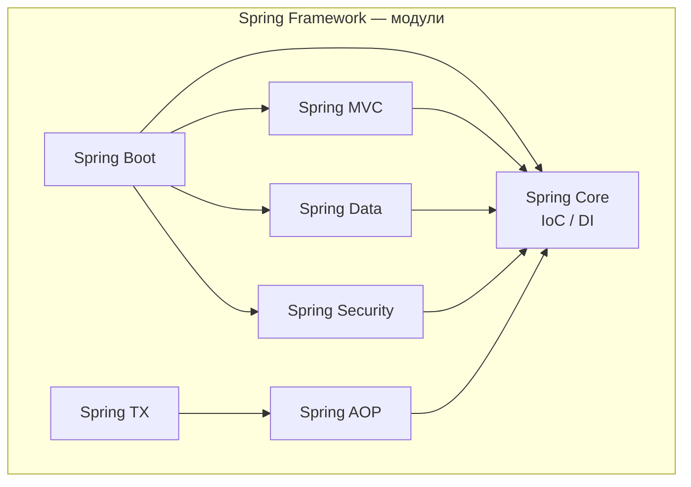
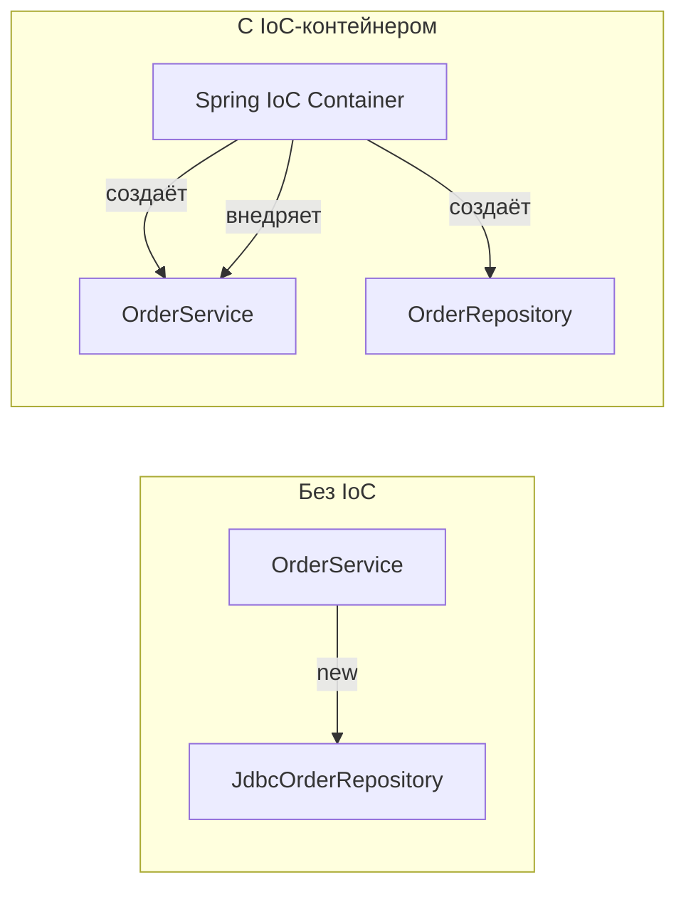
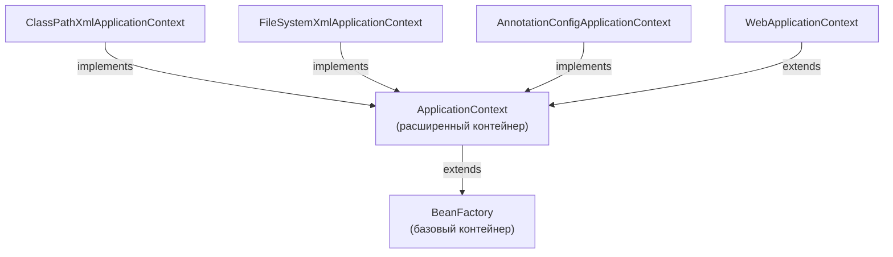
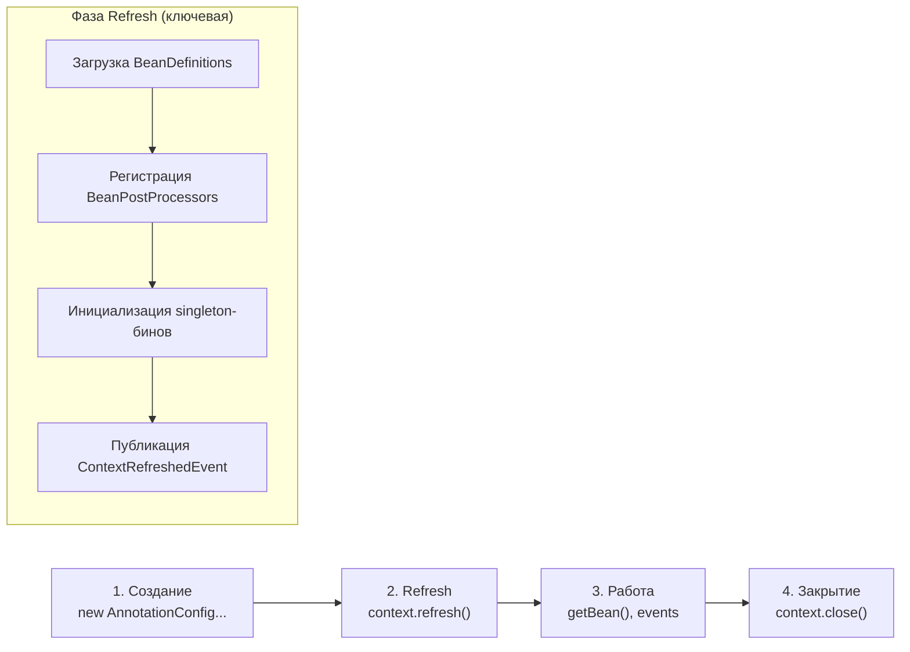
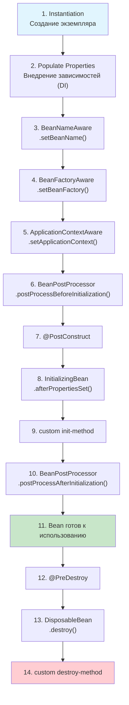
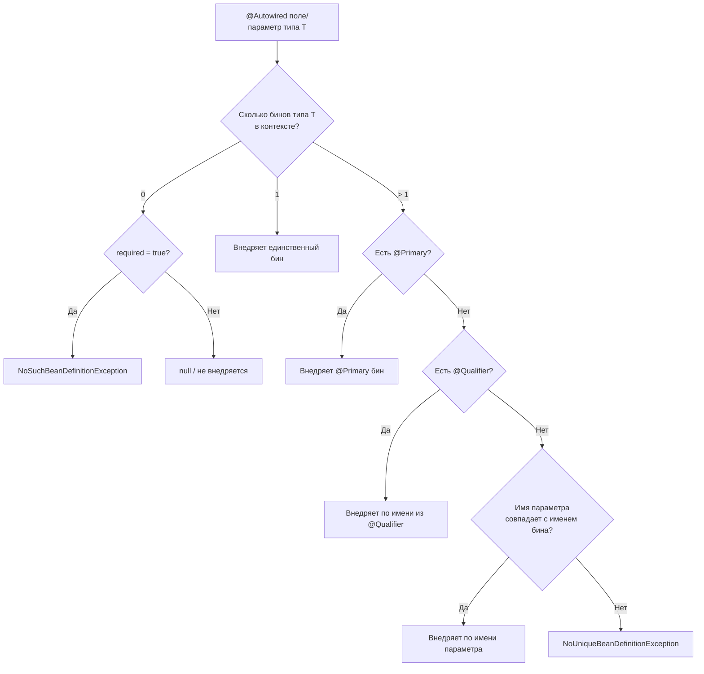
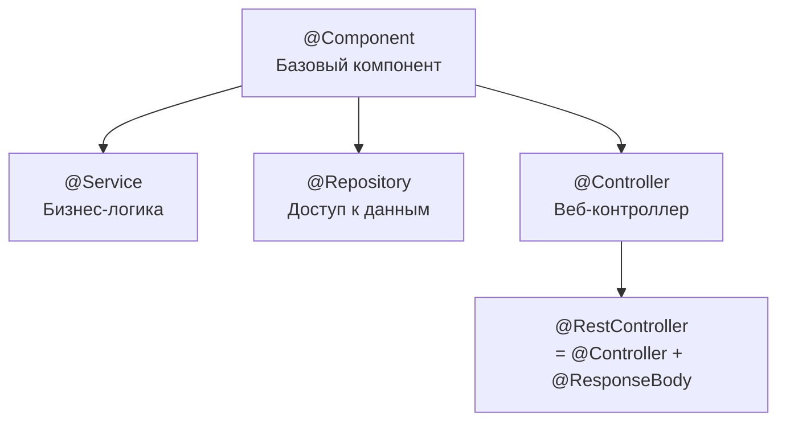
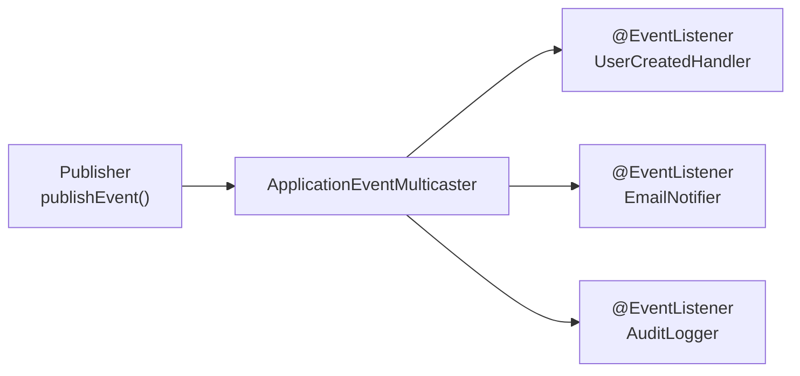
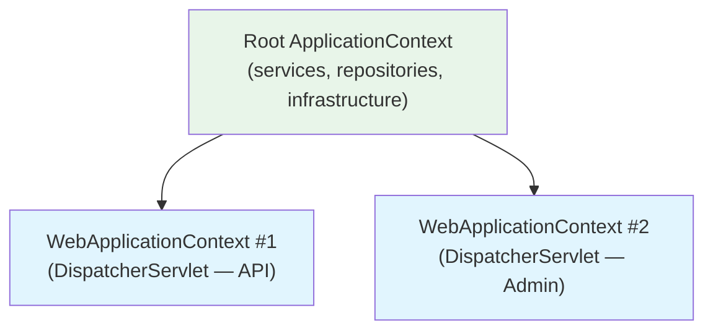

# Вопросы на собеседовании: `Spring Framework`

Полный гайд по `Spring Framework`: `IoC`-контейнер, `DI`, жизненный цикл бинов, `AOP`, прокси, профили, события, `@Conditional`, конфигурация.

**`Spring Framework`** — базовый фреймворк для enterprise-разработки на `Java`. Вопросы по `IoC`, `DI`, бинам, жизненному циклу, `AOP` и модулям `Spring` регулярно встречаются на собеседованиях всех уровней — от junior до senior. Этот файл покрывает ключевые темы с диаграммами, примерами кода и практическими нюансами.

## Полезные ссылки

### Официальная документация

- [Spring Framework Reference](https://docs.spring.io/spring-framework/reference/) — основная документация
- [Spring Framework API (Javadoc)](https://docs.spring.io/spring-framework/docs/current/javadoc-api/) — API-документация

### Baeldung

- [Spring Core Tutorials](https://www.baeldung.com/spring-tutorial) — практические туториалы по Spring Core
- [Inversion of Control and Dependency Injection with Spring](https://www.baeldung.com/inversion-control-and-dependency-injection-in-spring) — IoC и DI в деталях
- [Difference Between BeanFactory and ApplicationContext](https://www.baeldung.com/spring-beanfactory-vs-applicationcontext) — сравнение IoC-контейнеров
- [Wiring in Spring: @Autowired, @Resource and @Inject](https://www.baeldung.com/spring-annotations-resource-inject-autowire) — варианты внедрения зависимостей
- [Comparing Spring AOP and AspectJ](https://www.baeldung.com/spring-aop-vs-aspectj) — разница между Spring AOP и AspectJ
- [Implementing a Custom Spring AOP Annotation](https://www.baeldung.com/spring-aop-annotation) — создание кастомных аспектов
- [Top Spring Framework Interview Questions](https://www.baeldung.com/spring-interview-questions) — топ вопросов на интервью

## Содержание

- [Полезные ссылки](#полезные-ссылки)
- [See also](#see-also)

**Основы Spring Framework**
- [Q1. Что такое Spring Framework?](#q1-что-такое-spring-framework)
- [Q2. (!) Особенности и преимущества Spring Framework?](#q2-особенности-и-преимущества-spring-framework)

**IoC и Dependency Injection**
- [Q3. (!) Что такое Inversion of Control (IoC)?](#q3-что-такое-inversion-of-control-ioc)
- [Q4. (!) Что такое Dependency Injection (DI)?](#q4-что-такое-dependency-injection-di)
- [Q5. (!) Типы контейнеров в Spring Framework](#q5-типы-контейнеров-в-spring-framework)
- [Q6. (!) Какой жизненный цикл у Context?](#q6-какой-жизненный-цикл-у-context)
- [Q7. (!) В чем разница между BeanFactory и ApplicationContext?](#q7-в-чем-разница-между-beanfactory-и-applicationcontext)
- [Q8. (!) Как завершить работу Context?](#q8-как-завершить-работу-context)

**Bean и жизненный цикл**
- [Q9. Что такое Bean?](#q9-что-такое-bean)
- [Q10. (!) Какой жизненный цикл у Bean?](#q10-какой-жизненный-цикл-у-bean)
- [Q11. Как создать статический Bean?](#q11-как-создать-статический-bean)
- [Q12. Как внедрить Bean?](#q12-как-внедрить-bean)
- [Q13. (!) Что такое @Autowired?](#q13-что-такое-autowired)
- [Q14. (!) Какие есть области действия Bean?](#q14-какие-есть-области-действия-bean)
- [Q15. (!) Как лучше внедрять Bean?](#q15-как-лучше-внедрять-bean)
- [Q16. Является ли Singleton Bean потокобезопасным?](#q16-является-ли-singleton-bean-потокобезопасным)
- [Q17. Как внедрить Properties в Bean?](#q17-как-внедрить-properties-в-bean)

**Конфигурация и паттерны**
- [Q18. Что такое конфигурация Spring на основе Java?](#q18-что-такое-конфигурация-spring-на-основе-java)
- [Q19. (!) Можно ли иметь несколько файлов конфигурации Spring?](#q19-можно-ли-иметь-несколько-файлов-конфигурации-spring)
- [Q20. (!) Какие Design Patterns используются в Spring Framework?](#q20-какие-design-patterns-используются-в-spring-framework)

**AOP (Аспектно-ориентированное программирование)**
- [Q21. (!) Что такое AOP?](#q21-что-такое-aop)
- [Q22. (!) Как работает AOP-прокси в Spring?](#q22-как-работает-aop-прокси-в-spring)
- [Q23. Что такое Weaving?](#q23-что-такое-weaving)
- [Q24. (!) В чём разница между Spring AOP и AspectJ?](#q24-в-чём-разница-между-spring-aop-и-aspectj)

**Аннотации и конфигурация**
- [Q25. Что такое CommandLineRunner и ApplicationRunner?](#q25-что-такое-commandlinerunner-и-applicationrunner)
- [Q26. (!) Какие наиболее популярные аннотации в Spring?](#q26-какие-наиболее-популярные-аннотации-в-spring)
- [Q27. (!) В чём разница между @Component, @Service, @Repository и @Controller?](#q27-в-чём-разница-между-component-service-repository-и-controller)
- [Q28. Что такое @Qualifier и @Primary?](#q28-что-такое-qualifier-и-primary)

**Профили, условия, события**
- [Q29. (!) Что такое @Profile и как работают профили?](#q29-что-такое-profile-и-как-работают-профили)
- [Q30. Что такое @LookUp?](#q30-что-такое-lookup)
- [Q31. (!) Что такое @Conditional и как Spring Boot использует условные бины?](#q31-что-такое-conditional-и-как-spring-boot-использует-условные-бины)
- [Q32. (!) Как работает механизм событий (ApplicationEvent) в Spring?](#q32-как-работает-механизм-событий-applicationevent-в-spring)
- [Q33. (!) Иерархия ApplicationContext: parent-child контексты](#q33-иерархия-applicationcontext-parent-child-контексты)

**Продвинутые темы**
- [Q34. (!) В чём разница между @Bean и @Component?](#q34-в-чём-разница-между-bean-и-component)
- [Q35. (!) Что такое Pointcut и как писать Pointcut-выражения в Spring AOP?](#q35-что-такое-pointcut-и-как-писать-pointcut-выражения-в-spring-aop)
- [Q36. (!) Как работает @Around advice и чем он отличается от @Before / @After?](#q36-как-работает-around-advice-и-чем-он-отличается-от-before--after)
- [Q37. (!) Что такое SpEL (Spring Expression Language) и где он применяется?](#q37-что-такое-spel-spring-expression-language-и-где-он-применяется)
- [Q38. (!) Как работает @Async и что нужно настроить для асинхронных методов?](#q38-как-работает-async-и-что-нужно-настроить-для-асинхронных-методов)
- [Q39. (!) Что такое @EventListener и как публиковать события асинхронно?](#q39-что-такое-eventlistener-и-как-публиковать-события-асинхронно)
- [Q40. Как настроить несколько реализаций одного бина с разными профилями?](#q40-как-настроить-несколько-реализаций-одного-бина-с-разными-профилями)

## Q1. Что такое `Spring Framework`?

`Spring Framework` — это комплексный фреймворк для разработки enterprise-приложений на `Java`, построенный вокруг принципов **IoC** (Inversion of Control) и **AOP** (Aspect-Oriented Programming).

Основные модули:

| Модуль | Назначение |
|--------|-----------|
| `Spring Core` | IoC-контейнер, DI, ресурсы |
| `Spring MVC` | Веб-фреймворк (подробнее в [Spring MVC](spring-mvc-interview.md)) |
| `Spring Security` | Аутентификация и авторизация (подробнее в [Spring Security](spring-security-interview.md)) |
| `Spring Data` | Унифицированный доступ к данным (подробнее в [Spring Data JPA](spring-data-jpa-interview.md)) |
| `Spring AOP` | Аспектно-ориентированное программирование |
| `Spring TX` | Управление транзакциями |



Конфигурация возможна через `@Configuration` + `@Bean`, компонентное сканирование (`@Component`, `@Service`, `@Repository`) или XML. Зависимости внедряются через конструктор (рекомендуется), сеттер или поле.

> [!mcq]
> - [ ] Spring Framework — это ORM-фреймворк для работы с базами данных через JPA и Hibernate, предоставляющий готовые репозитории для CRUD-операций | Это описание Spring Data, а не всего Spring Framework. Spring — гораздо шире: IoC-контейнер, AOP, веб-слой, интеграция и многое другое. Это антипаттерн или неправильный выбор в production.
> - [ ] Spring Framework — это реактивный веб-фреймворк на основе Project Reactor, предназначенный для неблокирующей обработки HTTP-запросов | Это описание Spring WebFlux, который является одним модулем экосистемы. Spring Framework включает как WebFlux, так и традиционный MVC и много других возможностей.
> - [x] Spring Framework — это комплексный enterprise-фреймворк на Java, построенный вокруг IoC-контейнера и AOP, объединяющий модули для веба, доступа к данным, безопасности и интеграции | Верно: Spring Framework — фундамент, который управляет жизненным циклом объектов (IoC/DI), поддерживает сквозную логику (AOP) и предоставляет унифицированные абстракции для всего стека разработки.
> - [ ] Spring Framework — это набор утилит для упрощения написания юнит-тестов на Java, включающий моки, фикстуры и DSL для проверки поведения | Тестирование — лишь одна из возможностей Spring. Основное назначение — управление зависимостями и жизненным циклом компонентов в production-приложениях.

## Q2. (!) Особенности и преимущества `Spring Framework`?

Ключевые преимущества `Spring Framework`:

1. **IoC/DI** — инверсия управления и внедрение зависимостей снижают связанность (coupling) и упрощают тестирование через подмену зависимостей (моки)
2. **AOP** — сквозная логика (логирование, транзакции, безопасность) выносится в аспекты, не загромождая бизнес-код
3. **Модульность** — подключаются только нужные модули; не нужно тянуть весь фреймворк
4. **Интеграция** — готовые абстракции для `Hibernate`, `JPA`, `MyBatis`, `Kafka`, `RabbitMQ`, `Redis`
5. **Тестируемость** — `@MockBean`, `@SpringBootTest`, `TestRestTemplate` делают тесты первоклассными гражданами
6. **Экосистема** — [Spring Boot](spring-boot-interview.md) для быстрого старта, [Spring Cloud](spring-cloud-interview.md) для микросервисов, `Spring Batch` для пакетной обработки

**Что ожидают на собеседовании:** не просто перечисление, а понимание trade-offs. Например, `Spring` добавляет overhead на старт (classpath scanning, proxy creation), что критично для serverless. `Spring Native` / `GraalVM` решают это за счёт AOT-компиляции.

> [!mcq]
> - [ ] Главное преимущество Spring Framework — встроенная поддержка реактивного программирования, что делает его лучшим выбором для всех типов приложений по умолчанию | Реактивное программирование (WebFlux) — одна из возможностей, но не главное преимущество. Основное — IoC/DI и тестируемость, которые полезны в любом стиле разработки.
> - [x] Ключевое преимущество Spring Framework — снижение связанности компонентов через IoC/DI, что упрощает тестирование заменой зависимостей на моки и гибкую смену реализаций без изменения бизнес-кода | Верно: IoC/DI — центральная идея Spring. Слабая связанность означает, что компоненты зависят от абстракций, а не реализаций, что напрямую ведёт к тестируемости и гибкости.
> - [ ] Главное преимущество Spring Framework — минимальное время старта приложения по сравнению с конкурентами, поскольку фреймворк не выполняет никакой работы при инициализации | Это неверно: Spring Boot-приложения нередко стартуют 2-10 секунд из-за classpath scanning и eager-инициализации бинов. Быстрый старт — одна из задач Spring Native / GraalVM.
> - [ ] Ключевое преимущество Spring Framework — строгое следование спецификации Java EE, что гарантирует полную совместимость с любым сервером приложений | Spring намеренно пошёл своим путём, предложив лёгкий IoC-контейнер вместо тяжёлых EJB. Он не привязан к EE-спецификации, хотя поддерживает многие JSR-стандарты (Servlet, JPA, CDI).

## Q3. (!) Что такое `Inversion of Control` (`IoC`)?

**Inversion of Control** — принцип, при котором управление созданием объектов и их зависимостями передаётся от прикладного кода контейнеру (фреймворку).

**Без IoC** (прямые зависимости):
```java
public class OrderService {
    // жёсткая связь — сам создаёт зависимость
    private final OrderRepository repo = new JdbcOrderRepository();
}
```

**С IoC** (контейнер управляет зависимостями):
```java
@Service
public class OrderService {
    private final OrderRepository repo;

    // контейнер внедряет нужную реализацию
    public OrderService(OrderRepository repo) {
        this.repo = repo;
    }
}
```



Преимущества:
- **Слабая связанность** — зависимость от абстракций, а не реализаций (подробнее в [ООП: SOLID](../../programming-languages/java/java-oop-interview.md))
- **Тестируемость** — легко подменять зависимости на моки
- **Гибкость конфигурации** — переключение реализаций без изменения бизнес-кода

> [!mcq]
> - [ ] Inversion of Control означает, что объект сам запрашивает нужные зависимости из контейнера через вызов `getBean()`, то есть инвертируется направление потока данных | Это Service Locator — антипаттерн, противоположный IoC. При IoC контейнер сам предоставляет зависимости объекту, а не объект запрашивает их. Это антипаттерн или неправильный выбор в production.
> - [x] Inversion of Control — принцип, при котором управление созданием объектов и внедрением их зависимостей передаётся от прикладного кода внешнему контейнеру или фреймворку | Верно: вместо того чтобы класс сам создавал зависимости через `new`, контейнер Spring берёт эту обязанность на себя, обеспечивая слабую связанность и тестируемость.
> - [ ] Inversion of Control — паттерн, при котором бизнес-логика приложения вызывает фреймворк для выполнения инфраструктурных задач вроде логирования и транзакций | Это описание AOP, а не IoC. Хотя AOP и строится поверх IoC-контейнера, сама концепция IoC касается управления созданием и жизненным циклом объектов. Это антипаттерн или неправильный выбор в production.
> - [ ] Inversion of Control означает инверсию порядка выполнения методов: сначала выполняется деструктор, потом конструктор, что позволяет оптимизировать управление памятью | Это полностью вымышленное определение. IoC не имеет отношения к порядку вызова конструкторов и деструкторов. Частая ошибка в реальном коде.

> [!mcq]
> - [x] Основная цель IoC — снизить связанность (coupling) компонентов, сделав их зависимыми от абстракций, а не от конкретных реализаций, что упрощает тестирование и замену реализаций | Верно: IoC напрямую реализует принцип Dependency Inversion из SOLID. Компонент объявляет, что ему нужен интерфейс, а контейнер подбирает нужную реализацию.
> - [ ] Основная цель IoC — ускорить создание объектов за счёт пула заранее созданных экземпляров, которые контейнер выдаёт по запросу вместо вызова `new` | Это описание Object Pool паттерна. IoC касается управления зависимостями и жизненным циклом, а не оптимизации производительности создания объектов. Частая ошибка в реальном коде.
> - [ ] Основная цель IoC — обеспечить потокобезопасность объектов, управляя доступом к ним через синхронизированный контейнер | IoC-контейнер не обеспечивает потокобезопасность автоматически. Singleton-бины разделяются между потоками, и их потокобезопасность зависит от реализации.
> - [ ] Основная цель IoC — шифровать зависимости между компонентами для защиты архитектуры приложения от реверс-инжиниринга | Это полностью вымышленная цель. IoC — архитектурный принцип для управления зависимостями, не связанный с безопасностью или шифрованием. Частая ошибка в реальном коде.

## Q4. (!) Что такое `Dependency Injection` (`DI`)?

`Dependency Injection` — конкретная реализация принципа `IoC`, при которой зависимости передаются объекту **извне** (через конструктор, сеттер или поле), а не создаются внутри объекта.

Три способа DI в Spring:

| Способ | Пример | Когда использовать |
|--------|--------|-------------------|
| **Конструктор** | `public OrderService(OrderRepository repo)` | Обязательные зависимости (рекомендуется) |
| **Сеттер** | `@Autowired public void setRepo(OrderRepository repo)` | Необязательные зависимости |
| **Поле** | `@Autowired private OrderRepository repo;` | Только в тестах; в production — антипаттерн |

```java
// Рекомендуемый способ — конструктор
@Service
public class PaymentService {
    private final PaymentGateway gateway;
    private final NotificationService notifications;

    // С Spring 4.3 @Autowired на единственном конструкторе не обязателен
    public PaymentService(PaymentGateway gateway, NotificationService notifications) {
        this.gateway = gateway;
        this.notifications = notifications;
    }
}
```

**Почему конструктор лучше:**
- Поля можно сделать `final` — гарантия неизменяемости
- Невозможно создать объект в невалидном состоянии (все зависимости обязательны)
- Видна сигнатура зависимостей — если их слишком много, это сигнал к рефакторингу (подробнее в [паттернах рефакторинга](../../code-quality/refactoring-patterns-interview.md))

> [!mcq]
> - [ ] Dependency Injection — это способ получения зависимостей, при котором объект сам вызывает фабричный метод контейнера `context.getBean()` всякий раз, когда нужна зависимость | Это Service Locator, а не DI. При DI зависимости передаются объекту извне — через конструктор, сеттер или поле — без явного запроса. Это антипаттерн или неправильный выбор в production.
> - [ ] Dependency Injection — это паттерн, при котором зависимости создаются через статические фабричные методы и кешируются в статических полях класса для повторного использования | Статические фабрики и статические поля — это не DI. DI предполагает передачу зависимости через конструктор, сеттер или поле, управляемое контейнером. Частая ошибка в реальном коде.
> - [ ] Dependency Injection — это механизм, при котором Spring перехватывает все вызовы `new` в байткоде и автоматически подставляет управляемые экземпляры | Spring не перехватывает вызовы `new` в байткоде. DI работает на уровне контейнера: объекты создаются им самим, а зависимости передаются при создании. Частая ошибка в реальном коде.
> - [x] Dependency Injection — конкретная реализация принципа IoC, при которой зависимости передаются объекту извне через конструктор, сеттер или поле, а не создаются самим объектом через `new` | Верно: DI — это механизм реализации IoC. Контейнер создаёт зависимости и «вводит» их в зависимый объект, что позволяет легко подменять реализации и мокировать при тестировании.

> [!mcq]
> - [x] Внедрение через конструктор предпочтительно, потому что позволяет объявить зависимости как `final`, гарантирует полную инициализацию объекта и делает зависимости явными в сигнатуре | Верно: конструкторная инъекция — рекомендованный подход Spring Team. `final`-поля исключают изменение после создания, а наличие всех зависимостей сразу гарантирует валидное состояние объекта.
> - [ ] Внедрение через поле предпочтительно, потому что требует меньше шаблонного кода и позволяет Spring внедрять зависимости напрямую через рефлексию без конструктора | Хотя код и короче, внедрение через поле — антипаттерн в production: поля не могут быть `final`, тестирование требует рефлексии или Spring-контекста, а зависимости скрыты от вызывающего кода.
> - [ ] Внедрение через сеттер предпочтительно для всех зависимостей, поскольку позволяет контейнеру менять их в любой момент жизненного цикла бина и легко переконфигурировать | Сеттерная инъекция рекомендована только для необязательных зависимостей. Возможность менять зависимости после создания — скорее недостаток, так как объект может оказаться в невалидном состоянии.
> - [ ] Все три способа внедрения эквивалентны и выбор между ними — исключительно вопрос стиля команды без практических последствий для тестируемости или безопасности | Это не так: способ внедрения влияет на `final`-иммутабельность, обнаружение циклических зависимостей, тестируемость без контейнера и читаемость кода. Частая ошибка в реальном коде.

## Q5. (!) Типы контейнеров в `Spring Framework`

`Spring` предоставляет два основных контейнера: `BeanFactory` и `ApplicationContext`.



| Характеристика | `BeanFactory` | `ApplicationContext` |
|----------------|--------------|---------------------|
| Инициализация бинов | **Ленивая** (lazy) — при вызове `getBean()` | **Жадная** (eager) — при старте контекста |
| Events | Нет | `ApplicationEvent` / `@EventListener` |
| i18n | Нет | `MessageSource` |
| AOP | Нет | Полная поддержка |
| `Environment` | Нет | Профили, property sources |
| `BeanPostProcessor` | Ручная регистрация | Автоматическая |

**На практике** `BeanFactory` напрямую почти не используется — `ApplicationContext` покрывает 99% сценариев. `BeanFactory` полезен в ресурсно-ограниченных средах (embedded, IoT).

> [!mcq]
> - [ ] `BeanFactory` инициализирует все singleton-бины при старте контекста (eager), а `ApplicationContext` создаёт их лениво при первом обращении (lazy) | Всё наоборот: `BeanFactory` использует ленивую инициализацию, а `ApplicationContext` — жадную (eager) по умолчанию. При `@Lazy` или prototype-scope `ApplicationContext` тоже откладывает создание.
> - [x] `BeanFactory` — базовый контейнер с ленивой инициализацией бинов, а `ApplicationContext` расширяет его, добавляя eager-инициализацию, события, i18n, AOP-интеграцию и автоматическую регистрацию `BeanPostProcessor` | Верно: `ApplicationContext` — надстройка над `BeanFactory`, которая берёт на себя регистрацию пост-процессоров, события и интернационализацию, что делает её стандартным выбором для любых Spring-приложений.
> - [ ] `BeanFactory` и `ApplicationContext` функционально идентичны, разница лишь в том, что `ApplicationContext` поддерживает XML-конфигурацию, а `BeanFactory` — только аннотации | Оба контейнера поддерживают XML и аннотации. Принципиальная разница — в наборе возможностей: события, i18n, автоматическая регистрация `BeanPostProcessor`, которых нет в базовом `BeanFactory`.
> - [ ] `ApplicationContext` является заменой `BeanFactory` и не имеет с ним общего интерфейса — это два независимых способа конфигурации Spring | `ApplicationContext` расширяет интерфейс `BeanFactory` (является подтипом), а не заменяет его. Код, написанный под `BeanFactory`, будет работать с `ApplicationContext`. Это антипаттерн или неправильный выбор в production.

## Q6. (!) Какой жизненный цикл у `Context`?

Жизненный цикл `ApplicationContext` можно разделить на три основные фазы:



**Детализация фазы `refresh()`:**

1. **`prepareRefresh()`** — инициализация property sources, валидация required properties
2. **`obtainFreshBeanFactory()`** — создание `BeanFactory`, загрузка `BeanDefinition` из XML/аннотаций/Java-конфига
3. **`prepareBeanFactory()`** — настройка classloader, регистрация системных бинов (`Environment`, `SystemProperties`)
4. **`invokeBeanFactoryPostProcessors()`** — вызов `BeanFactoryPostProcessor` (например, `PropertyPlaceholderConfigurer`, `ConfigurationClassPostProcessor`)
5. **`registerBeanPostProcessors()`** — регистрация `BeanPostProcessor` (`AutowiredAnnotationBeanPostProcessor`, `CommonAnnotationBeanPostProcessor`)
6. **`initMessageSource()`** — инициализация i18n
7. **`initApplicationEventMulticaster()`** — настройка механизма событий
8. **`onRefresh()`** — хук для подклассов (например, `ServletWebServerApplicationContext` запускает Tomcat)
9. **`registerListeners()`** — регистрация `ApplicationListener`
10. **`finishBeanFactoryInitialization()`** — создание всех singleton-бинов (самый тяжёлый этап)
11. **`finishRefresh()`** — публикация `ContextRefreshedEvent`, запуск lifecycle-процессоров

> [!mcq]
> - [ ] Жизненный цикл `ApplicationContext` начинается с фазы `finishBeanFactoryInitialization`, на которой загружаются все определения бинов из XML и аннотаций | `BeanDefinition`-ы загружаются на шаге `obtainFreshBeanFactory`, значительно раньше. `finishBeanFactoryInitialization` — это создание экземпляров singleton-бинов, а не загрузка определений.
> - [ ] Самый тяжёлый этап фазы `refresh()` — вызов `BeanFactoryPostProcessor`-ов, которые генерируют байткод для всех прокси сразу при старте контекста | Байткод-прокси создаются на более позднем этапе — `finishBeanFactoryInitialization`, когда инстанцируются бины и применяются `BeanPostProcessor`-ы. `BeanFactoryPostProcessor` работает с `BeanDefinition`, а не с экземплярами.
> - [x] Самый тяжёлый этап фазы `refresh()` — `finishBeanFactoryInitialization`, на котором Spring создаёт все singleton-бины, внедряет зависимости и применяет `BeanPostProcessor`-ы для создания прокси | Верно: именно на этом шаге происходит instantiation, DI и post-processing всех eager singleton-бинов. Это объясняет, почему время старта Spring-приложения растёт с количеством бинов.
> - [ ] При повторном вызове `context.refresh()` Spring полностью пересоздаёт все бины, поэтому в production следует вызывать `refresh()` для обновления конфигурации без перезапуска | Повторный вызов `refresh()` на уже закрытом или активном контексте приведёт к ошибке или непредсказуемому поведению. Для динамической перезагрузки конфигурации используют Spring Cloud Config или `@RefreshScope`.

## Q7. (!) В чем разница между `BeanFactory` и `ApplicationContext`?

`BeanFactory` — базовый контейнер, предоставляющий функции DI. Реализация по умолчанию — `DefaultListableBeanFactory`. Создаёт бины **лениво** при вызове `getBean()`.

`ApplicationContext` — расширение `BeanFactory`, добавляющее:
- **Жадную инициализацию** singleton-бинов при старте (поведение можно переопределить через `@Lazy`)
- **Механизм событий** — `ApplicationEvent` / `@EventListener`
- **Интернационализацию** — `MessageSource`
- **Доступ к ресурсам** — `ResourceLoader` (classpath, filesystem, URL)
- **Интеграцию с AOP** — автоматическая регистрация `BeanPostProcessor` для проксирования
- **Профили и Environment** — `@Profile`, `@PropertySource`

```java
// BeanFactory — ленивая загрузка
BeanFactory factory = new XmlBeanFactory(new ClassPathResource("beans.xml"));
MyService service = factory.getBean(MyService.class); // бин создаётся здесь

// ApplicationContext — жадная загрузка
ApplicationContext ctx = new AnnotationConfigApplicationContext(AppConfig.class);
// все singleton-бины уже созданы
MyService service = ctx.getBean(MyService.class);
```

**На собеседовании:** часто спрашивают, когда `ApplicationContext` создаёт бины лениво. Ответ: при `@Lazy` на бине или `@Lazy` на `@Configuration`-классе, а также для `prototype`-scope бинов (они всегда ленивые).

> [!mcq]
> - [ ] `ApplicationContext` создаёт бины лениво по умолчанию точно так же, как `BeanFactory`: singleton-бин создаётся при первом вызове `getBean()`, а не при старте контекста | По умолчанию `ApplicationContext` использует eager-инициализацию и создаёт все singleton-бины в фазе `finishBeanFactoryInitialization`. Ленивость нужно явно задавать через `@Lazy`.
> - [x] `ApplicationContext` создаёт singleton-бины лениво, если на них или на их `@Configuration`-классе указана аннотация `@Lazy`, а `prototype`-бины всегда создаются лениво независимо от аннотаций | Верно: `@Lazy` переключает конкретный бин или весь класс конфигурации в режим отложенной инициализации. Prototype-scope по своей природе ленивый — экземпляр создаётся только при запросе.
> - [ ] `ApplicationContext` создаёт singleton-бины лениво при использовании профиля `dev`, а в профиле `prod` переходит в eager-режим для быстрого обнаружения ошибок конфигурации | Профиль не влияет на стратегию инициализации. Eager или lazy определяется наличием `@Lazy` на бине или в конфигурации, а не активным профилем. Это антипаттерн или неправильный выбор в production.
> - [ ] `ApplicationContext` всегда создаёт бины лениво при указании `scope = "singleton"`, так как singleton подразумевает создание только при первом обращении | Singleton-scope означает один экземпляр на контекст, но не ленивость. По умолчанию singleton-бины создаются eager при старте; ленивость нужно задавать явно через `@Lazy`. Это антипаттерн или неправильный выбор в production.

## Q8. (!) Как завершить работу `Context`?

Для корректного завершения работы контекста нужно вызвать `close()`, который:
1. Публикует `ContextClosedEvent`
2. Вызывает `@PreDestroy`-методы на бинах
3. Вызывает `destroy()`-методы `DisposableBean`
4. Освобождает ресурсы

```java
// Способ 1: явный close() через ConfigurableApplicationContext
ConfigurableApplicationContext ctx = new AnnotationConfigApplicationContext(AppConfig.class);
try {
    // работа с контекстом
} finally {
    ctx.close();
}

// Способ 2: try-with-resources (ApplicationContext implements Closeable)
try (var ctx = new AnnotationConfigApplicationContext(AppConfig.class)) {
    // работа с контекстом
}

// Способ 3: registerShutdownHook() — JVM shutdown hook
var ctx = new AnnotationConfigApplicationContext(AppConfig.class);
ctx.registerShutdownHook(); // close() будет вызван при завершении JVM
```

**Важно:** `registerShutdownHook()` — это то, что [Spring Boot](spring-boot-interview.md) делает автоматически. В standalone-приложениях без `Spring Boot` нужно вызывать явно.

> [!mcq]
> - [ ] Для корректного завершения контекста достаточно установить все бины в `null` — Spring отследит это через `WeakReference` и вызовет `@PreDestroy`-методы автоматически | Spring не отслеживает ссылки на бины. Для вызова `@PreDestroy` и `DisposableBean.destroy()` необходимо явно вызвать `context.close()` или зарегистрировать shutdown hook. Это антипаттерн или неправильный выбор в production.
> - [ ] Для корректного завершения контекста в standalone-приложении достаточно завершить `main`-метод — JVM вызовет `@PreDestroy` на всех бинах при остановке | JVM не знает о Spring-бинах. Без явного `context.close()` или `registerShutdownHook()` деструкторные callback-и (`@PreDestroy`, `DisposableBean.destroy()`) не будут вызваны. Это антипаттерн или неправильный выбор в production.
> - [ ] Метод `context.stop()` корректно завершает работу контекста, вызывая `@PreDestroy` на всех бинах и освобождая ресурсы | `stop()` переводит контекст в остановленное состояние через `Lifecycle`-интерфейс, но не разрушает бины. Для вызова `@PreDestroy` и освобождения ресурсов нужен `close()`.
> - [x] Корректное завершение standalone-контекста требует вызова `context.close()` или `registerShutdownHook()`, после чего Spring публикует `ContextClosedEvent` и вызывает `@PreDestroy`-методы на всех бинах | Верно: `close()` гарантирует последовательное завершение: сначала `ContextClosedEvent`, затем `@PreDestroy`, `DisposableBean.destroy()`, custom destroy-method. Spring Boot регистрирует shutdown hook автоматически.

## Q9. Что такое `Bean`?

`Bean` — объект, управляемый IoC-контейнером `Spring`. Контейнер создаёт его, внедряет зависимости, управляет жизненным циклом и разрушает при закрытии контекста.

Три способа определения бинов:

**1. Компонентное сканирование (стереотипные аннотации):**
```java
@Service
public class UserService {
    private final UserRepository userRepository;

    public UserService(UserRepository userRepository) {
        this.userRepository = userRepository;
    }
}
```

**2. Java-конфигурация (`@Configuration` + `@Bean`):**
```java
@Configuration
public class AppConfig {
    @Bean
    public UserService userService(UserRepository userRepository) {
        return new UserService(userRepository);
    }

    @Bean
    public UserRepository userRepository(DataSource dataSource) {
        return new JdbcUserRepository(dataSource);
    }
}
```

**3. XML-конфигурация (legacy):**
```xml
<bean id="userService" class="com.example.UserService">
    <constructor-arg ref="userRepository"/>
</bean>
```

**На практике** в современных проектах используют комбинацию компонентного сканирования (для своих классов) и `@Bean`-методов (для сторонних библиотек, чьи классы нельзя аннотировать).

> [!mcq]
> - [ ] Bean в Spring — это любой Java-объект, созданный через `new`, который был передан в контекст методом `registerBean()` для дальнейшего управления | Не все объекты, переданные через `registerBean()`, являются бинами в полном смысле. Бин — это объект, жизненный цикл которого полностью управляется IoC-контейнером с момента создания до уничтожения.
> - [ ] Bean в Spring — это только объекты, аннотированные `@Component` или его стереотипами (`@Service`, `@Repository`); объекты из `@Bean`-методов бинами не являются | Объекты, созданные в `@Bean`-методах, являются полноценными Spring-бинами. Разница лишь в способе объявления, а не в статусе управления контейнером. Это антипаттерн или неправильный выбор в production.
> - [x] Bean — это объект, созданный и управляемый IoC-контейнером Spring: контейнер отвечает за его создание, внедрение зависимостей, управление lifecycle-callback-ами и уничтожение | Верно: это каноническое определение бина. Ключевое слово — «управляемый контейнером», что отличает бин от обычного Java-объекта, созданного через `new`. Singleton по умолчанию, lazy vs eager initialization, scope lifecycle важен.
> - [ ] Bean в Spring — это только singleton-объекты; объекты с `scope = "prototype"` не являются бинами, так как контейнер не управляет их жизненным циклом после создания | Prototype-объекты тоже являются бинами, хотя Spring не управляет их уничтожением. Контейнер создаёт их, внедряет зависимости, вызывает `@PostConstruct` — то есть частично управляет lifecycle.

## Q10. (!) Какой жизненный цикл у `Bean`?

Жизненный цикл бина — одна из самых частых тем на собеседованиях. Важно знать не только этапы, но и порядок вызова callback-ов.



**Ключевые callback-и в коде:**

```java
@Component
public class CacheWarmer implements InitializingBean, DisposableBean {

    @PostConstruct
    public void postConstruct() {
        // 7. Вызывается после DI, до afterPropertiesSet()
        // Рекомендуемый способ инициализации
    }

    @Override
    public void afterPropertiesSet() {
        // 8. InitializingBean — альтернатива @PostConstruct
    }

    @PreDestroy
    public void preDestroy() {
        // 12. Вызывается перед destroy()
        // Рекомендуемый способ очистки ресурсов
    }

    @Override
    public void destroy() {
        // 13. DisposableBean — альтернатива @PreDestroy
    }
}
```

**Важный нюанс:** `BeanPostProcessor.postProcessAfterInitialization()` (шаг 10) — именно здесь Spring создаёт **прокси** для `@Transactional`, `@Cacheable`, `@Async` и других AOP-аннотаций. Поэтому вызов `this.method()` внутри того же бина обходит прокси и не запускает аспект.

> [!mcq]
> - [ ] Порядок инициализации бина: сначала вызывается `@PostConstruct`, затем внедряются зависимости (`@Autowired`), и только после этого бин становится доступен для использования | Порядок обратный: сначала создаётся экземпляр, затем внедряются зависимости (Populate Properties), и только после этого вызывается `@PostConstruct`. Иначе в `@PostConstruct` зависимости были бы ещё не доступны.
> - [ ] Порядок инициализации бина: `@PostConstruct` → `afterPropertiesSet()` (InitializingBean) → `BeanPostProcessor.postProcessBeforeInitialization()` → custom init-method | Порядок неверный. `BeanPostProcessor.postProcessBeforeInitialization()` вызывается ДО `@PostConstruct`, а не после. Правильный порядок: BPP.before → @PostConstruct → afterPropertiesSet() → custom init → BPP.after.
> - [ ] Порядок инициализации бина: custom init-method → `@PostConstruct` → `afterPropertiesSet()` → `BeanPostProcessor.postProcessAfterInitialization()` | Порядок инициализации callback-ов неверный. `@PostConstruct` всегда вызывается раньше `afterPropertiesSet()`, а тот — раньше custom init-method. Порядок от специфичного к общему. Это антипаттерн или неправильный выбор в production.
> - [x] Правильный порядок инициализации бина: `BeanPostProcessor.postProcessBeforeInitialization()` → `@PostConstruct` → `afterPropertiesSet()` → custom init-method → `BeanPostProcessor.postProcessAfterInitialization()` | Верно: BPP.before запускается первым (здесь могут быть общие задачи), затем более специфичные callback-и по убыванию приоритета. BPP.after — последний шаг, где создаются AOP-прокси.

> [!mcq]
> - [ ] AOP-прокси для `@Transactional`-бинов создаются в `BeanPostProcessor.postProcessBeforeInitialization()`, поэтому `@PostConstruct`-метод уже выполняется внутри транзакционного прокси | Прокси создаются в `postProcessAfterInitialization()`, то есть после `@PostConstruct`. Это означает, что в `@PostConstruct` нельзя полагаться на транзакционное поведение аннотированных методов.
> - [x] AOP-прокси для `@Transactional` и `@Async` создаются в `BeanPostProcessor.postProcessAfterInitialization()` — именно поэтому self-invocation (вызов `this.method()`) обходит прокси и аспект не срабатывает | Верно: прокси оборачивают бин снаружи. Когда метод вызывает `this.method()`, он обращается к оригинальному объекту, а не к прокси-обёртке, поэтому перехват аспекта не происходит. Singleton по умолчанию, lazy vs eager initialization, scope lifecycle важен.
> - [ ] AOP-прокси создаются при вызове `BeanFactoryPostProcessor` во время загрузки `BeanDefinition`-ов, ещё до создания экземпляров бинов | `BeanFactoryPostProcessor` работает с метаданными (`BeanDefinition`), а не с экземплярами. Прокси — это объекты-обёртки, которые создаются только после инстанцирования бинов на шаге 10.
> - [ ] AOP-прокси создаются во время фазы `prepareRefresh()` контекста, задолго до инициализации бинов, чтобы обеспечить перехват с самого начала | `prepareRefresh()` — подготовительная фаза (инициализация property sources). Никаких бинов и прокси на этом этапе ещё нет. Это антипаттерн или неправильный выбор в production.

## Q11. Как создать статический `Bean`?

Статический `@Bean`-метод объявляется с модификатором `static` внутри `@Configuration`-класса. `Spring` вызывает его **до** полной инициализации `@Configuration`-класса.

```java
@Configuration
public class InfraConfig {

    // Статический Bean — создаётся раньше остальных
    @Bean
    public static PropertySourcesPlaceholderConfigurer propertyConfigurer() {
        return new PropertySourcesPlaceholderConfigurer();
    }

    // Обычный Bean — @Configuration-класс уже проксирован
    @Bean
    public DataSource dataSource(@Value("${db.url}") String url) {
        return new HikariDataSource(new HikariConfig(url));
    }
}
```

**Когда нужен статический `@Bean`:**
- **`BeanFactoryPostProcessor`** и **`BeanDefinitionRegistryPostProcessor`** — они обрабатывают `BeanDefinition` до создания остальных бинов. Если определить их как нестатические, `Spring` выдаст предупреждение, потому что для вызова метода нужно создать `@Configuration`-класс, что форсирует раннюю инициализацию
- `PropertySourcesPlaceholderConfigurer` — классический пример; без `static` значения `@Value` не будут разрешены вовремя

> [!mcq]
> - [ ] Статический `@Bean`-метод нужен только для создания бинов, которые должны быть доступны в нескольких `ApplicationContext`-ах одновременно, то есть разделяться между контекстами | Это неверное обоснование. Статические `@Bean`-методы нужны для `BeanFactoryPostProcessor`-ов, которые должны быть доступны до инициализации `@Configuration`-класса, а не для разделения между контекстами.
> - [ ] Статический `@Bean`-метод нужен, чтобы обойти CGLIB-проксирование `@Configuration`-класса и позволить Spring вызвать метод напрямую, создавая каждый раз новый объект | Статический метод вызывается без создания экземпляра класса, но это не значит, что он создаёт новые объекты каждый раз. Цель статического метода — доступность до инициализации `@Configuration`-класса.
> - [x] Статический `@Bean`-метод нужен для `BeanFactoryPostProcessor`-ов и `PropertySourcesPlaceholderConfigurer` — они должны быть созданы до инициализации `@Configuration`-класса, иначе `@Value`-аннотации не будут разрешены вовремя | Верно: статические методы вызываются без создания экземпляра `@Configuration`-класса, что позволяет зарегистрировать пост-процессоры на ранней стадии старта. Без `static` у `PropertySourcesPlaceholderConfigurer` `@Value`-подстановки будут работать некорректно.
> - [ ] Статический `@Bean`-метод нужен для prototype-бинов, чтобы CGLIB-прокси не перехватывал их создание и каждый раз действительно возвращал новый экземпляр | CGLIB-прокси `@Configuration` перехватывает и статические методы иначе, чем нестатические. Для prototype-бинов используют `@Scope("prototype")`, а не `static`-модификатор. Это антипаттерн или неправильный выбор в production.

## Q12. Как внедрить `Bean`?

Три способа внедрения зависимостей:

```java
// 1. Конструктор (рекомендуется)
@Service
public class OrderService {
    private final OrderRepository repo;
    private final PaymentGateway gateway;

    public OrderService(OrderRepository repo, PaymentGateway gateway) {
        this.repo = repo;
        this.gateway = gateway;
    }
}

// 2. Сеттер (для необязательных зависимостей)
@Service
public class ReportService {
    private EmailSender emailSender;

    @Autowired(required = false)
    public void setEmailSender(EmailSender emailSender) {
        this.emailSender = emailSender;
    }
}

// 3. Поле (антипаттерн в production-коде)
@Service
public class LegacyService {
    @Autowired
    private SomeDependency dep; // нельзя сделать final, сложно тестировать
}
```

 
> [!mcq]
> - [ ] Все три способа внедрения — через конструктор, сеттер и поле — одинаково часто применяются в современном production-коде, и ни один из них не считается антипаттерном | Внедрение через поле считается антипаттерном в production: поля не могут быть `final`, тестирование требует рефлексии, а сигнатура зависимостей скрыта. В unit-тестах допустимо, в production — нет.
> - [ ] Сеттерная инъекция — рекомендованный Spring Team способ для обязательных зависимостей, потому что позволяет явно задать имя зависимости через имя метода-сеттера | Spring Team рекомендует конструктор для обязательных зависимостей. Сеттер рекомендован для необязательных — тех, для которых допустимо `null` или значение по умолчанию.
> - [ ] Внедрение через поле — рекомендованный способ в Spring, потому что минимизирует шаблонный код и Spring сам обеспечивает видимость зависимостей через IDE | IDE может подсвечивать внедрение через поле, но это не делает его рекомендованным. Spring Team явно указывает в документации, что полевая инъекция в production — антипаттерн.
> - [x] Внедрение через конструктор рекомендуется для обязательных зависимостей, через сеттер — для необязательных; внедрение через поле является антипаттерном в production-коде | Верно: конструктор гарантирует наличие всех зависимостей при создании объекта и позволяет использовать `final`. Сеттер даёт гибкость для опциональных зависимостей. Поле скрывает зависимости и усложняет тестирование.

## Q13. (!) Что такое `@Autowired`?

`@Autowired` — аннотация `Spring` для автоматического внедрения зависимости по типу. `Spring` ищет подходящий бин в контексте и внедряет его.

**Алгоритм разрешения зависимости:**



```java
@Service
public class NotificationService {
    private final MessageSender sender;

    // С Spring 4.3 @Autowired не нужен, если один конструктор
    public NotificationService(@Qualifier("emailSender") MessageSender sender) {
        this.sender = sender;
    }
}
```

**Важно:** начиная с `Spring 4.3`, если у класса **один** конструктор, `@Autowired` на нём не обязателен — `Spring` использует его автоматически.

> [!mcq]
> - [x] При наличии нескольких бинов одного типа `@Autowired` разрешает неоднозначность сначала через `@Primary`, затем через `@Qualifier`, затем по совпадению имени параметра с именем бина, и только если ничего не подошло — бросает `NoUniqueBeanDefinitionException` | Верно: это точный приоритет разрешения. `@Qualifier` имеет высший приоритет среди кандидатов, `@Primary` — умолчательный выбор при отсутствии `@Qualifier`, имя параметра — последний резерв перед ошибкой.
> - [ ] При наличии нескольких бинов одного типа `@Autowired` всегда выбирает бин, зарегистрированный первым в контексте, независимо от `@Primary` или `@Qualifier` | Порядок регистрации бинов не влияет на разрешение `@Autowired`. Для управления выбором нужны `@Primary` или `@Qualifier`. Частая ошибка в реальном коде.
> - [ ] При наличии нескольких бинов одного типа `@Autowired` без `@Qualifier` всегда бросает `NoUniqueBeanDefinitionException`, не пытаясь разрешить конфликт другими способами | Spring делает дополнительные попытки: сначала ищет бин с `@Primary`, затем сопоставляет имя параметра с именем бина. `NoUniqueBeanDefinitionException` возникает только если все попытки неудачны.
> - [ ] При наличии нескольких бинов одного типа `@Autowired` игнорирует все кандидаты и внедряет `null`, если не указан явный `@Qualifier` | `@Autowired` по умолчанию имеет `required = true`, и при невозможности разрешить зависимость выбросит исключение, а не внедрит `null`. Частая ошибка в реальном коде.

> [!mcq]
> - [ ] `@Autowired`, `@Inject` (JSR-330) и `@Resource` (JSR-250) являются полностью взаимозаменяемыми аннотациями и работают идентично во всех сценариях | Аннотации похожи, но различаются: `@Resource` разрешает по имени (by name) по умолчанию, а `@Autowired` — по типу (by type). `@Inject` не поддерживает `required = false`. Детали разрешения неоднозначности тоже отличаются.
> - [x] `@Autowired` выполняет внедрение по типу (by type), тогда как `@Resource` — по имени бина (by name) по умолчанию; `@Qualifier` уточняет выбор при `@Autowired`, а `@Resource(name=...)` уже содержит имя встроенно | Верно: это ключевое различие. `@Autowired` + `@Qualifier("name")` — Spring-стиль; `@Resource(name="...")` — JEE-стиль с встроенным именем. Знание разницы важно для работы с legacy-кодом.
> - [ ] `@Autowired` игнорирует наследование и внедряет только бины точно того типа, что указан в поле, не учитывая реализации интерфейсов или подклассы | `@Autowired` полностью поддерживает полиморфизм: если тип поля — интерфейс, Spring найдёт реализующий бин. Именно это позволяет делать DI через интерфейсы.
> - [ ] Начиная с Spring 5, `@Autowired` объявлен устаревшим и заменён на `@Inject` из JSR-330 в соответствии с рекомендациями Jakarta EE | `@Autowired` не объявлен устаревшим и остаётся основной аннотацией Spring. `@Inject` — альтернатива для кода, не зависящего от Spring-специфичных аннотаций.

## Q14. (!) Какие есть области действия `Bean`?

| Scope | Описание | Создание | Разрушение |
|-------|----------|----------|-----------|
| `singleton` | Один экземпляр на контекст (по умолчанию) | При старте контекста | При закрытии контекста |
| `prototype` | Новый экземпляр при каждом запросе | При каждом `getBean()` / внедрении | **Не управляется** контейнером! |
| `request` | Один экземпляр на HTTP-запрос | При поступлении запроса | По завершении запроса |
| `session` | Один экземпляр на HTTP-сессию | При создании сессии | При истечении/инвалидации сессии |
| `application` | Один экземпляр на `ServletContext` | При старте `ServletContext` | При остановке `ServletContext` |
| `websocket` | Один экземпляр на WebSocket-сессию | При открытии WS-соединения | При закрытии WS-соединения |

```java
@Component
@Scope("prototype")
public class ShoppingCart {
    private final List<Item> items = new ArrayList<>();
}

// Проблема: prototype внутри singleton
@Service
public class OrderService {
    // ОШИБКА! Один и тот же ShoppingCart на все запросы
    @Autowired private ShoppingCart cart;
}

// Решение 1: @Lookup
@Service
public abstract class OrderService {
    @Lookup
    protected abstract ShoppingCart createCart();
}

// Решение 2: ObjectProvider
@Service
public class OrderService {
    private final ObjectProvider<ShoppingCart> cartProvider;

    public OrderService(ObjectProvider<ShoppingCart> cartProvider) {
        this.cartProvider = cartProvider;
    }

    public void processOrder() {
        ShoppingCart cart = cartProvider.getObject(); // новый экземпляр
    }
}
```

**Ловушка с `prototype`:** Spring **не вызывает** `@PreDestroy` для prototype-бинов — ответственность за очистку ресурсов лежит на клиенте.

> [!mcq]
> - [ ] Scope `prototype` означает, что один экземпляр создаётся на весь ApplicationContext и переиспользуется всеми потребителями, аналогично паттерну Singleton | Это описание scope `singleton`. Prototype создаёт новый экземпляр при каждом запросе к контейнеру или внедрении зависимости. Частая ошибка в реальном коде.
> - [ ] Scope `request` означает, что один экземпляр бина создаётся на каждый поток JVM, что позволяет использовать `ThreadLocal`-переменные без явного объявления | Scope `request` привязан к HTTP-запросу, а не к потоку JVM. Один HTTP-запрос обрабатывается одним потоком, но несколько запросов могут идти в одном потоке (при переиспользовании потоков в пуле).
> - [x] Scope `session` означает, что один экземпляр бина создаётся на HTTP-сессию пользователя и живёт до её истечения или инвалидации, что типично для хранения корзины покупок | Верно: session-scope позволяет хранить состояние, специфичное для сессии пользователя. Классический пример — корзина покупок, которая должна сохраняться между запросами одного пользователя.
> - [ ] Scope `application` означает, что один экземпляр создаётся на каждый модуль или JAR-файл в classpath, что позволяет изолировать конфигурацию между модулями | Scope `application` означает один экземпляр на `ServletContext`, то есть на всё веб-приложение. Изоляция между модулями — задача иерархии контекстов, а не scope.

> [!mcq]
> - [ ] При внедрении `prototype`-бина в `singleton`-бин через `@Autowired`-поле Spring создаёт новый экземпляр `prototype`-бина при каждом обращении к этому полю | Spring создаёт `prototype`-бин один раз — при создании `singleton`-бина — и сохраняет ссылку. Все последующие обращения к полю возвращают тот же экземпляр. Это классическая ловушка scope mismatch.
> - [ ] Spring автоматически вызывает `@PreDestroy` для `prototype`-бинов при закрытии контекста, так как они были созданы контейнером | Spring не управляет уничтожением `prototype`-бинов. `@PreDestroy` для них не вызывается. Ответственность за освобождение ресурсов прототипа лежит на потребителе.
> - [x] При внедрении `prototype`-бина в `singleton`-бин через обычный `@Autowired` Spring инжектирует один и тот же экземпляр прототипа во все запросы; для получения нового экземпляра при каждом вызове нужен `@Lookup` или `ObjectProvider` | Верно: это scope mismatch problem. Singleton хранит ссылку на один экземпляр прототипа, созданный при его инициализации. Новый экземпляр на каждый вызов можно получить через `@Lookup`-метод или `ObjectProvider<T>.getObject()`.
> - [ ] Scope `prototype` полностью аналогичен scope `request`: оба создают новый экземпляр на каждый входящий HTTP-запрос и уничтожают его по завершении обработки | Scope `request` привязан к HTTP-запросу и автоматически уничтожается; `prototype` создаётся при каждом `getBean()` или внедрении зависимости и не уничтожается контейнером вообще. Это антипаттерн или неправильный выбор в production.

## Q15. (!) Как лучше внедрять `Bean`?

**Рекомендация Spring Team:** конструктор для обязательных зависимостей, сеттер для необязательных.

| Критерий | Конструктор | Сеттер | Поле |
|----------|------------|--------|------|
| Иммутабельность (`final`) | Да | Нет | Нет |
| Обязательность зависимости | Гарантирована | Нет | Нет |
| Тестируемость | Легко (через `new`) | Средне | Сложно (reflection) |
| Циклические зависимости | Ошибка при старте | Работает | Работает |
| Читаемость | Видна сигнатура | Разбросано по классу | Скрыто |

**Правило большого пальца:** если конструктор принимает больше 5-7 параметров, это сигнал к декомпозиции класса (нарушение Single Responsibility Principle — подробнее в [SOLID](../../programming-languages/java/java-oop-interview.md)).

**Циклические зависимости:** `Spring Boot 2.6+` по умолчанию запрещает циклические зависимости. Если они есть — это архитектурная проблема, которую нужно решать рефакторингом, а не `@Lazy`.

> [!mcq]
> - [ ] Сеттерная инъекция рекомендована для всех зависимостей, потому что позволяет перенастраивать бины в runtime без перезапуска контейнера, что удобно в production | Возможность изменять зависимости после создания — риск нарушения инварианта объекта, а не преимущество. Для обязательных зависимостей рекомендован конструктор, обеспечивающий иммутабельность через `final`.
> - [ ] Конструкторная инъекция не поддерживает циклические зависимости, поэтому Spring автоматически переключается на сеттерную инъекцию при обнаружении цикла | Spring не переключается автоматически. При циклической зависимости через конструкторы Spring Boot 2.6+ выбрасывает исключение при старте. Разрешать цикл через сеттеры — обходной путь, а не автоматика.
> - [ ] Полевая инъекция (`@Autowired`-поле) является наилучшим выбором для производительности, так как Spring может внедрять зависимости параллельно без ожидания конструктора | Spring не выполняет внедрение в поля параллельно. Полевая инъекция через рефлексию не быстрее конструкторной и имеет существенные недостатки в тестируемости и безопасности.
> - [x] Конструкторная инъекция рекомендована для обязательных зависимостей, так как позволяет объявить поля `final`, гарантирует полную инициализацию объекта при создании и выявляет циклические зависимости на старте | Верно: конструкторная инъекция — лучшая практика по версии Spring Team. `final`-поля, детектирование циклов при старте и явная сигнатура зависимостей делают код надёжным и читаемым.

## Q16. Является ли `Singleton Bean` потокобезопасным?

**Нет.** `Singleton` — это шаблон создания, а не поведения. Потокобезопасность зависит от реализации бина.

**Проблема:**
```java
@Service
public class CounterService {
    private int count = 0; // Shared mutable state!

    public void increment() {
        count++; // Race condition в многопоточной среде
    }
}
```

**Решения:**
1. **Stateless бины** — не хранить mutable state (рекомендуется)
2. **Синхронизация** — `synchronized`, `Lock`, `AtomicInteger`
3. **ThreadLocal** — изоляция данных по потоку
4. **Prototype/request scope** — каждый поток/запрос получает свой экземпляр

```java
@Service
public class StatelessService {
    private final UserRepository repo; // immutable reference — безопасно

    public User findUser(Long id) {
        return repo.findById(id); // нет shared mutable state
    }
}
```

**На собеседовании:** покажите понимание связи scope-бинов и потокобезопасности. `Singleton` + mutable state = проблема. Подробнее о потоках в [Java Concurrency](../../programming-languages/java/java-concurrency-interview.md).

> [!mcq]
> - [ ] Singleton-бин в Spring является потокобезопасным по умолчанию, так как Spring создаёт его один раз и синхронизирует все вызовы методов через внутренние механизмы контейнера | Spring не синхронизирует вызовы методов на singleton-бинах. Singleton — это шаблон создания (один экземпляр), а не поведения. Потокобезопасность зависит исключительно от реализации бина.
> - [ ] Singleton-бин является потокобезопасным, если все его методы объявлены `synchronized`, причём Spring автоматически добавляет `synchronized` к методам `@Service`-бинов | Spring не добавляет `synchronized` автоматически ни к каким методам. Если синхронизация нужна, разработчик должен явно объявить её сам или использовать `AtomicInteger`, `Lock` и т.д.
> - [x] Singleton-бин не является потокобезопасным автоматически: если бин хранит изменяемое состояние (mutable state), необходима явная синхронизация или использование `AtomicInteger`, `ThreadLocal` либо переход к stateless-дизайну | Верно: singleton scope гарантирует только один экземпляр, но не изолирует доступ к нему между потоками. Stateless-дизайн — самый простой и надёжный путь к потокобезопасности.
> - [ ] Singleton-бин является потокобезопасным при использовании `scope = "singleton"` совместно с `@Transactional`, так как транзакционный прокси синхронизирует доступ к методам | `@Transactional` управляет транзакциями базы данных, но не синхронизирует потоки. Транзакционный прокси не добавляет никакой синхронизации к методам бина. Это антипаттерн или неправильный выбор в production.

## Q17. Как внедрить `Properties` в `Bean`?

**Способ 1: `@Value` — отдельные свойства:**
```java
@Service
public class MailService {
    @Value("${mail.host}")
    private String host;

    @Value("${mail.port:587}")  // значение по умолчанию
    private int port;

    @Value("${mail.enabled:true}")
    private boolean enabled;

    @Value("#{${mail.headers}}")  // SpEL для Map
    private Map<String, String> headers;
}
```

**Способ 2: `@ConfigurationProperties` — типобезопасная привязка группы свойств:**
```java
@ConfigurationProperties(prefix = "mail")
@Validated
public class MailProperties {
    @NotBlank
    private String host;
    private int port = 587;
    private boolean enabled = true;
    private Map<String, String> headers = new HashMap<>();
    // getters + setters
}

@Configuration
@EnableConfigurationProperties(MailProperties.class)
public class MailConfig {
    @Bean
    public MailService mailService(MailProperties props) {
        return new MailService(props);
    }
}
```

**Рекомендация:** для 1-2 свойств — `@Value`, для группы связанных свойств — `@ConfigurationProperties` с валидацией через `@Validated` + `Jakarta Validation`. Подробнее о конфигурации в [Spring Boot](spring-boot-interview.md).

> [!mcq]
> - [ ] `@Value("${mail.host}")` и `@ConfigurationProperties(prefix = "mail")` являются полностью взаимозаменяемыми и выбор между ними — исключительно вопрос личных предпочтений команды | Они отличаются функционально: `@ConfigurationProperties` поддерживает валидацию (`@Validated`), типобезопасное связывание, nested objects и списки. `@Value` удобен для одного свойства, но плохо масштабируется.
> - [x] `@Value` подходит для внедрения 1-2 отдельных свойств, а `@ConfigurationProperties` — для типобезопасного связывания группы связанных свойств с поддержкой валидации через `@Validated` | Верно: `@ConfigurationProperties` — предпочтительный способ для конфигурационных объектов (например, `MailProperties` со всеми настройками почты). Он поддерживает `@NotBlank`, `@Min`, автодополнение в IDE.
> - [ ] `@Value` поддерживает только строковые свойства, тогда как `@ConfigurationProperties` умеет автоматически конвертировать строки в `int`, `boolean`, `Duration` и другие типы | `@Value` тоже умеет конвертировать типы — Spring использует `ConversionService` для обоих подходов. Разница не в типах, а в структуре: одно свойство vs группа.
> - [ ] `@ConfigurationProperties` работает только с файлами `application.properties` и не поддерживает `application.yml` или системные переменные окружения | `@ConfigurationProperties` работает со всеми источниками свойств Spring Environment: `.properties`, `.yml`, переменными окружения, JVM-аргументами — любой источник, зарегистрированный в `PropertySources`.

## Q18. Что такое конфигурация `Spring` на основе `Java`?

Java-based конфигурация — способ определения бинов через `@Configuration`-классы вместо XML. Это типобезопасный подход с поддержкой IDE (автодополнение, рефакторинг, компиляционные проверки).

```java
@Configuration
public class AppConfig {

    @Bean
    public DataSource dataSource() {
        HikariConfig config = new HikariConfig();
        config.setJdbcUrl("jdbc:postgresql://localhost:5432/mydb");
        config.setMaximumPoolSize(10);
        return new HikariDataSource(config);
    }

    @Bean
    public TransactionManager transactionManager(DataSource dataSource) {
        return new DataSourceTransactionManager(dataSource);
    }
}
```

**Важный нюанс:** `@Configuration`-класс проксируется через CGLIB. Это значит, что вызов `dataSource()` внутри другого `@Bean`-метода **не создаст** новый объект — прокси вернёт тот же singleton:

```java
@Configuration
public class AppConfig {
    @Bean
    public DataSource dataSource() { return new HikariDataSource(); }

    @Bean
    public JdbcTemplate jdbcTemplate() {
        // НЕ создаёт новый DataSource — CGLIB-прокси возвращает singleton
        return new JdbcTemplate(dataSource());
    }
}
```

Для `@Configuration(proxyBeanMethods = false)` (lite mode) — каждый вызов создаёт новый объект. `Spring Boot` использует lite mode в автоконфигурациях для ускорения старта.

> [!mcq]
> - [ ] `@Configuration`-класс не проксируется Spring, поэтому вызов `@Bean`-метода внутри другого `@Bean`-метода всегда создаёт новый объект, нарушая принцип singleton | По умолчанию `@Configuration`-класс проксируется через CGLIB. Прокси перехватывает вызовы `@Bean`-методов и возвращает существующий singleton из контекста вместо создания нового объекта.
> - [x] `@Configuration`-класс проксируется через CGLIB, поэтому вызов одного `@Bean`-метода из другого возвращает тот же singleton-бин из контекста, а не создаёт новый экземпляр | Верно: CGLIB-прокси оборачивает `@Configuration`-класс и перехватывает все `@Bean`-вызовы. При повторном вызове `dataSource()` внутри конфигурации прокси вернёт уже созданный бин. Singleton по умолчанию, lazy vs eager initialization, scope lifecycle важен.
> - [ ] При использовании `@Configuration(proxyBeanMethods = false)` вызов `@Bean`-методов друг из друга возвращает singleton-бин, как и при обычном `@Configuration`, но работает быстрее | При `proxyBeanMethods = false` (lite mode) CGLIB-проксирование отключено. Каждый вызов `@Bean`-метода создаёт новый объект, что означает возможное дублирование бинов. Это антипаттерн или неправильный выбор в production.
> - [ ] `@Configuration`-класс проксируется через JDK Dynamic Proxy, поэтому он обязан реализовывать интерфейс — иначе Spring не сможет перехватывать `@Bean`-вызовы | Spring использует CGLIB (не JDK Proxy) для `@Configuration`, что позволяет проксировать классы без интерфейса. JDK Proxy требует интерфейса, CGLIB — нет. Это антипаттерн или неправильный выбор в production.

## Q19. (!) Можно ли иметь несколько файлов конфигурации `Spring`?

Да, и в крупных проектах это рекомендуемая практика — разделение по ответственности.

**Java-конфигурация:**
```java
@Configuration
@Import({DataConfig.class, SecurityConfig.class, CacheConfig.class})
public class AppConfig {
}

// Или через component scanning
@Configuration
@ComponentScan(basePackages = "com.example.config")
public class AppConfig {
}
```

**XML-конфигурация (legacy):**
```xml
<import resource="datasource-config.xml"/>
<import resource="security-config.xml"/>
```

**Типичная структура конфигурации:**
```
config/
├── AppConfig.java          — корневая конфигурация
├── DataConfig.java         — DataSource, JPA, Flyway
├── SecurityConfig.java     — Spring Security
├── CacheConfig.java        — Redis/Caffeine
├── AsyncConfig.java        — @EnableAsync, ThreadPoolTaskExecutor
└── WebConfig.java          — CORS, interceptors, formatters
```

> [!mcq]
> - [ ] Spring не позволяет иметь несколько файлов конфигурации: все бины должны быть определены в одном `@Configuration`-классе, помеченном как `@SpringBootApplication` | Это неверно: Spring поддерживает разбиение конфигурации на несколько классов через `@Import`, `@ComponentScan` или автоматическое обнаружение. Частая ошибка в реальном коде.
> - [ ] Для объединения нескольких конфигурационных классов Spring требует XML-файл с элементами `<import>`, так как Java-конфигурация не поддерживает импорт | Java-конфигурация поддерживает `@Import({DataConfig.class, SecurityConfig.class})` и `@ComponentScan` для автоматического обнаружения. XML-файлы не нужны. Это антипаттерн или неправильный выбор в production.
> - [ ] `@Import` позволяет импортировать только `@Configuration`-классы; для `@Component`-классов нужен отдельный `@ComponentScan` | `@Import` принимает `@Configuration`-классы, `ImportSelector`-ы и `ImportBeanDefinitionRegistrar`-ы. Для обычных компонентов действительно используется `@ComponentScan`, но это не ограничение `@Import` — просто разные инструменты.
> - [x] Spring поддерживает несколько конфигурационных классов: их можно объединять через `@Import({DataConfig.class, SecurityConfig.class})` или автоматически находить через `@ComponentScan`, что рекомендуется в крупных проектах | Верно: разбиение конфигурации по ответственности (`DataConfig`, `SecurityConfig`, `CacheConfig`) — стандартная практика. `@Import` дает явный контроль зависимостей, `@ComponentScan` — автоматическое обнаружение.

## Q20. (!) Какие `Design Patterns` используются в `Spring Framework`?

`Spring Framework` активно применяет паттерны проектирования (подробнее в [Design Patterns](../../design-patterns/design-patterns-interview.md)):

| Паттерн | Где используется | Пример |
|---------|-----------------|--------|
| **Singleton** | Scope бинов по умолчанию | `@Scope("singleton")` |
| **Factory Method** | Создание бинов | `@Bean`-методы, `BeanFactory` |
| **Proxy** | AOP, `@Transactional`, `@Cacheable` | JDK Dynamic Proxy / CGLIB |
| **Template Method** | JDBC, JMS, REST | `JdbcTemplate`, `RestTemplate` |
| **Observer** | События | `ApplicationEvent`, `@EventListener` |
| **Strategy** | Выбор реализации | `HandlerMapping`, `ViewResolver` |
| **Adapter** | Интеграция | `HandlerAdapter`, `MessageConverter` |
| **Decorator** | Обёртки | `BeanPostProcessor` оборачивает бины прокси |
| **Composite** | Цепочки | `CompositeHealthIndicator` |
| **Front Controller** | Веб | `DispatcherServlet` в [Spring MVC](spring-mvc-interview.md) |

> [!mcq]
> - [ ] В Spring Framework паттерн Proxy применяется только для `@Transactional`-бинов, а все остальные бины используются напрямую без обёртки | Proxy применяется для любого AOP-совета: `@Transactional`, `@Cacheable`, `@Async`, `@Secured` и кастомных аспектов. Любой бин с AOP-аннотацией получает прокси-обёртку. Это антипаттерн или неправильный выбор в production.
> - [x] В Spring Framework паттерн Proxy применяется для `@Transactional`, `@Cacheable`, `@Async` и других AOP-аспектов; паттерн Template Method — в `JdbcTemplate`, `RestTemplate`; паттерн Observer — в механизме событий `ApplicationEvent` | Верно: Spring пронизан паттернами проектирования. Proxy — для перехвата, Template Method — для упрощения работы с ресурсами (открытие/закрытие соединения), Observer — для событийной модели.
> - [ ] Паттерн Singleton в Spring реализован через ключевое слово `static` в классе бина, что гарантирует один экземпляр на всю JVM независимо от количества ApplicationContext-ов | Singleton-scope Spring — это один бин на `ApplicationContext`, а не на JVM. Если создать два контекста, будут два экземпляра singleton-бина. Статические поля класса — другой механизм, не связанный со Spring.
> - [ ] Паттерн Factory Method в Spring реализован исключительно через XML-конфигурацию `<bean factory-method="...">`; `@Bean`-методы в Java-конфигурации этим паттерном не являются | `@Bean`-методы — это и есть реализация Factory Method: метод в конфигурационном классе создаёт и возвращает экземпляр бина. XML-конфигурация — лишь один из способов объявить фабричный метод.

## Q21. (!) Что такое `AOP`?

**Аспектно-ориентированное программирование (AOP)** — методология, позволяющая выделять сквозную функциональность (cross-cutting concerns) в отдельные модули — **аспекты**.

**Терминология:**

| Термин | Описание |
|--------|----------|
| **Aspect** | Модуль со сквозной логикой (`@Aspect`) |
| **Join Point** | Точка в программе, где можно подключить аспект (в Spring AOP — только вызов метода) |
| **Pointcut** | Выражение, определяющее, к каким Join Point применяется аспект |
| **Advice** | Действие аспекта: `@Before`, `@After`, `@Around`, `@AfterReturning`, `@AfterThrowing` |
| **Weaving** | Процесс применения аспекта к целевому объекту |
| **Target** | Объект, к которому применяется аспект |

```java
@Aspect
@Component
public class PerformanceAspect {

    @Around("execution(* com.example.service.*.*(..))")
    public Object measureTime(ProceedingJoinPoint joinPoint) throws Throwable {
        long start = System.nanoTime();
        try {
            return joinPoint.proceed();
        } finally {
            long elapsed = System.nanoTime() - start;
            log.info("{}.{} выполнен за {} мс",
                joinPoint.getTarget().getClass().getSimpleName(),
                joinPoint.getSignature().getName(),
                elapsed / 1_000_000);
        }
    }
}
```

Включение: `@EnableAspectJAutoProxy` (в `Spring Boot` включено автоматически).

> [!mcq]
> - [ ] Join Point в Spring AOP — это любая точка в программе: конструктор, поле, статический метод или обычный метод бина | Spring AOP поддерживает только вызовы методов в качестве join points. Конструкторы, поля и статические методы доступны только в AspectJ, который реализует полную AOP-модель. Это антипаттерн или неправильный выбор в production.
> - [x] Join Point в Spring AOP ограничен вызовом метода на Spring-бине; Pointcut — предикат, выбирающий нужные join points; Advice — код, выполняемый на выбранных join points | Верно: это фундаментальные понятия AOP. Spring намеренно ограничил join points вызовами методов через прокси — это достаточно для 95% задач и проще в понимании. Before/After/Around advice, pointcut for matching, weaving (compile-time vs runtime).
> - [ ] Advice в Spring AOP — это имя класса-аспекта, а Pointcut — имя метода внутри аспекта, к которому применяется перехват | Advice — это действие (код), выполняемое в определённый момент (before/after/around); Pointcut — выражение, выбирающее join points. Это не имена классов и методов. Это антипаттерн или неправильный выбор в production.
> - [ ] Weaving в Spring AOP происходит во время компиляции: AspectJ-компилятор вставляет код аспекта прямо в байткод целевых классов | Spring AOP использует runtime weaving через прокси-объекты, а не compile-time weaving. Compile-time weaving — особенность AspectJ, который требует отдельного компилятора `ajc`. Это антипаттерн или неправильный выбор в production.

> [!mcq]
> - [ ] `@Before` advice может изменить аргументы вызываемого метода и отменить его выполнение, вернув `null` из advice-метода | `@Before` не может изменить аргументы или отменить выполнение. Для этого нужен `@Around` с `ProceedingJoinPoint`, который позволяет манипулировать аргументами и решать, вызывать ли `proceed()`.
> - [x] `@Around` advice отличается от `@Before`/`@After` тем, что полностью контролирует выполнение целевого метода: может изменять аргументы, перехватывать результат, повторять вызов (retry) или вовсе не вызывать оригинальный метод | Верно: `@Around` — самый мощный advice. `ProceedingJoinPoint.proceed()` вызывает оригинальный метод, и то, что происходит до и после этого вызова, полностью под контролем аспекта.
> - [ ] `@AfterReturning` advice выполняется всегда — как при успешном возврате, так и при выброшенном исключении, поэтому он аналогичен блоку `finally` в Java | Для поведения `finally` предназначен `@After`. `@AfterReturning` выполняется только при нормальном возврате из метода; при исключении вызывается `@AfterThrowing`.
> - [ ] Несколько `@Aspect`-классов применяются к одному методу в алфавитном порядке имён классов, что гарантирует детерминированный порядок выполнения | Без явного порядка (`@Order`) последовательность применения аспектов не определена. Для управления порядком нужно аннотировать `@Aspect`-классы `@Order(1)`, `@Order(2)` и т.д.

## Q22. (!) Как работает `AOP`-прокси в `Spring`?

`Spring AOP` работает через прокси-объекты. При наличии аспекта `Spring` оборачивает целевой бин прокси, который перехватывает вызовы методов.


**Два типа прокси:**

| Характеристика | JDK Dynamic Proxy | CGLIB Proxy |
|----------------|-------------------|-------------|
| Механизм | `java.lang.reflect.Proxy` | Генерация подкласса |
| Требование | Бин реализует интерфейс | Любой класс (не `final`) |
| Производительность | Чуть медленнее | Чуть быстрее |
| Spring Boot default | — | **Да** (с 2.0) |

```java
// JDK Proxy — проксируется интерфейс
public interface PaymentService { void pay(Order order); }

@Service
public class PaymentServiceImpl implements PaymentService {
    @Transactional
    public void pay(Order order) { /* ... */ }
}

// CGLIB Proxy — проксируется класс
@Service
public class NotificationService {
    @Cacheable("notifications")
    public List<Notification> getAll() { /* ... */ }
}
```

**Главная ловушка — self-invocation:**
```java
@Service
public class UserService {
    @Transactional
    public void createUser(User user) {
        // ...
        this.sendWelcomeEmail(user); // Прокси ОБХОДИТСЯ! @Async не сработает
    }

    @Async
    public void sendWelcomeEmail(User user) { /* ... */ }
}
```

Решения: вынести метод в другой бин, использовать `AopContext.currentProxy()`, или `@Autowired` self-injection.

> [!mcq]
> - [x] Spring Boot по умолчанию использует CGLIB-прокси, который создаёт подкласс целевого класса, поэтому класс не должен быть `final`, а перехватываемые методы — тоже не `final` | Верно: CGLIB генерирует подкласс через байткод-манипуляцию. `final`-класс или `final`-метод не может быть переопределён, поэтому CGLIB не сможет создать перехватывающий прокси.
> - [ ] Spring Boot по умолчанию использует JDK Dynamic Proxy, который требует, чтобы бин реализовывал хотя бы один интерфейс для создания прокси | До Spring Boot 2.0 JDK Proxy был дефолтным при наличии интерфейса. Начиная с Spring Boot 2.0 CGLIB стал дефолтом для всех бинов, включая те, что реализуют интерфейс.
> - [ ] Self-invocation (`this.method()`) работает корректно с `@Transactional`, потому что Spring заменяет `this`-ссылку на ссылку на прокси при компиляции | Spring не изменяет байткод вызовов через `this`. `this` всегда указывает на оригинальный объект, а не на прокси. Это фундаментальное ограничение proxy-based AOP. Это антипаттерн или неправильный выбор в production.
> - [ ] JDK Dynamic Proxy и CGLIB Proxy перехватывают вызовы одинаково: оба могут перехватывать как `public`, так и `private` методы на бинах | Ни JDK Proxy, ни CGLIB не перехватывают `private`-методы. JDK Proxy работает только с интерфейсными методами; CGLIB — с `public` и `protected`, но не `private`.

## Q23. Что такое `Weaving`?

`Weaving` (плетение) — процесс применения аспектов к целевым объектам для создания проксированного (advised) объекта.

Типы weaving:

| Тип | Когда происходит | Технология | Производительность |
|-----|-----------------|-----------|-------------------|
| **Compile-time** | При компиляции | AspectJ compiler (ajc) | Лучшая — нет overhead в runtime |
| **Load-time** | При загрузке классов | AspectJ LTW + Java agent | Средняя |
| **Runtime** | При создании бинов | Spring AOP (прокси) | Есть overhead на прокси |

**Spring AOP** использует **runtime weaving** через прокси (JDK Dynamic Proxy или CGLIB). Это ограничивает AOP только перехватом вызовов методов на бинах.

**AspectJ** поддерживает все три типа и может перехватывать конструкторы, доступ к полям и статические методы — чего Spring AOP не может.

> [!mcq]
> - [ ] Compile-time weaving происходит при загрузке классов JVM с помощью Java-агента и позволяет встраивать аспекты без изменения исходного кода | Это описание Load-time weaving (LTW), а не compile-time. Compile-time weaving выполняется компилятором AspectJ (`ajc`) и требует изменения процесса сборки.
> - [ ] Runtime weaving в Spring AOP — самый производительный вариант, так как не добавляет overhead при компиляции и загрузке классов | Runtime weaving через прокси имеет overhead при каждом вызове перехваченного метода (создание прокси, диспетчеризация). Compile-time weaving встраивает код в байткод и работает без overhead в runtime.
> - [ ] Load-time weaving и compile-time weaving — это одно и то же: оба изменяют байткод целевых классов, разница только в инструменте | Load-time weaving изменяет байткод при загрузке класса ClassLoader-ом с Java-агентом; compile-time weaving — во время компиляции компилятором `ajc`. Это разные моменты жизненного цикла класса.
> - [x] Spring AOP использует runtime weaving через прокси-объекты, что добавляет небольшой overhead на вызов, но не требует специального компилятора или агента; AspectJ поддерживает compile-time и load-time weaving без overhead в runtime | Верно: это ключевой trade-off. Spring AOP — простота настройки ценой runtime overhead; AspectJ — лучшая производительность ценой сложности сборки и дополнительных зависимостей. Before/After/Around advice, pointcut for matching, weaving (compile-time vs runtime).

## Q24. (!) В чём разница между `Spring AOP` и `AspectJ`?

| Характеристика | Spring AOP | AspectJ |
|----------------|-----------|---------|
| Weaving | Runtime (прокси) | Compile-time / Load-time / Runtime |
| Join Points | Только вызов метода | Метод, конструктор, поле, статический метод |
| Цель | Spring-бины | Любые Java-объекты |
| Производительность | Overhead от прокси | Нет overhead (compile-time) |
| Self-invocation | Не работает | Работает |
| Сложность | Простая настройка | Требует AspectJ compiler или agent |
| Зависимости | Только Spring | Нужен `aspectjrt` + `aspectjweaver` |

**Когда использовать что:**
- **Spring AOP** — 95% случаев: `@Transactional`, `@Cacheable`, `@Async`, логирование, security
- **AspectJ** — когда нужно перехватывать конструкторы, field access, или self-invocation критично

> [!mcq]
> - [ ] Spring AOP и AspectJ полностью взаимозаменяемы: любой аспект, написанный для Spring AOP, будет работать с AspectJ без каких-либо изменений | Хотя синтаксис аннотаций `@Aspect`, `@Before`, `@Around` совпадает, Spring AOP ограничен вызовами методов на бинах через прокси. AspectJ поддерживает конструкторы, поля, self-invocation — то, что Spring AOP не может.
> - [ ] AspectJ работает медленнее Spring AOP, так как требует дополнительного Java-агента, который добавляет overhead при каждом вызове метода | AspectJ с compile-time weaving работает быстрее Spring AOP: код аспекта встроен в байткод и не требует прокси-диспетчеризации в runtime. Агент нужен только для load-time weaving. Это антипаттерн или неправильный выбор в production.
> - [ ] Spring AOP лучше AspectJ для перехвата конструкторов, так как CGLIB создаёт подкласс и может переопределить конструктор суперкласса | CGLIB создаёт подкласс, но перехват конструктора суперкласса — не то же самое, что перехват вызова конструктора. Spring AOP не поддерживает перехват конструкторов вообще; это возможность только AspectJ.
> - [x] Spring AOP достаточен для 95% задач (транзакции, кеш, логирование, безопасность), так как все они — перехват вызовов методов на бинах; AspectJ нужен при self-invocation, перехвате конструкторов или field access | Верно: Spring AOP намеренно решает 95% AOP-задач простым и понятным способом. AspectJ — инструмент для оставшихся 5%, требующих полной AOP-модели. Before/After/Around advice, pointcut for matching, weaving (compile-time vs runtime).

## Q25. Что такое `CommandLineRunner` и `ApplicationRunner`?

Интерфейсы для выполнения кода **после полного запуска** `Spring Boot`-приложения (после `ContextRefreshedEvent`, после `@PostConstruct`).

```java
@Component
@Order(1) // порядок выполнения
public class DataInitializer implements CommandLineRunner {
    @Override
    public void run(String... args) {
        // args — аргументы командной строки как массив строк
        log.info("Инициализация данных...");
    }
}

@Component
@Order(2)
public class HealthChecker implements ApplicationRunner {
    @Override
    public void run(ApplicationArguments args) {
        // ApplicationArguments — структурированный доступ к аргументам
        if (args.containsOption("check-db")) {
            verifyDatabaseConnection();
        }
        List<String> profiles = args.getNonOptionArgs();
    }
}
```

| Характеристика | `CommandLineRunner` | `ApplicationRunner` |
|----------------|--------------------|--------------------|
| Аргументы | `String... args` (сырой массив) | `ApplicationArguments` (парсинг `--key=value`) |
| Доступ к флагам | Ручной парсинг | `args.containsOption("key")` |
| Доступ к значениям | `args[0]`, `args[1]`... | `args.getOptionValues("key")` |

Подробнее о запуске приложений в [Spring Boot](spring-boot-interview.md).

> [!mcq]
> - [ ] `CommandLineRunner` и `ApplicationRunner` выполняются до полного запуска ApplicationContext, что позволяет инициализировать бины до начала их нормальной работы | Оба интерфейса выполняются после полного запуска контекста (после `ContextRefreshedEvent` и `@PostConstruct`). Для инициализации до готовности бина используется `@PostConstruct`.
> - [ ] `ApplicationRunner` предпочтительнее `CommandLineRunner` во всех случаях, так как даёт более структурированный доступ к аргументам через `ApplicationArguments` | `ApplicationRunner` удобнее при работе с именованными аргументами (`--key=value`). Для простых сценариев без разбора аргументов `CommandLineRunner` достаточен и проще.
> - [x] Ключевое отличие `ApplicationRunner` от `CommandLineRunner` — тип аргументов: `ApplicationRunner` получает `ApplicationArguments` с парсингом `--key=value`, а `CommandLineRunner` — сырой массив `String... args` | Верно: `ApplicationArguments` предоставляет структурированный доступ: `containsOption("debug")`, `getOptionValues("profile")`, `getNonOptionArgs()`. `CommandLineRunner` подходит для простых случаев.
> - [ ] `CommandLineRunner` и `ApplicationRunner` нельзя использовать одновременно в одном приложении: Spring выбирает один из них на основе наличия аргументов командной строки | Оба интерфейса можно использовать одновременно в любом количестве бинов. Порядок выполнения регулируется `@Order`. Spring вызывает все найденные реализации.

## Q26. (!) Какие наиболее популярные аннотации в `Spring`?

**Основные стереотипы:**
- `@Component` — базовый компонент
- `@Service` — бизнес-логика
- `@Repository` — доступ к данным + автоматическая трансляция исключений
- `@Controller` / `@RestController` — обработка HTTP-запросов

**Конфигурация:**
- `@Configuration` — класс конфигурации (CGLIB-прокси)
- `@Bean` — определение бина
- `@ComponentScan` — сканирование пакетов
- `@Import` — импорт конфигураций

**DI:**
- `@Autowired` — внедрение по типу
- `@Qualifier` — уточнение при множестве кандидатов
- `@Primary` — приоритетный бин по умолчанию
- `@Value` — внедрение свойств/SpEL

**Жизненный цикл:**
- `@PostConstruct` — инициализация после DI
- `@PreDestroy` — очистка перед уничтожением
- `@Scope` — область действия бина
- `@Lazy` — ленивая инициализация

**AOP и транзакции:**
- `@Transactional` — управление транзакциями
- `@Aspect` — определение аспекта
- `@Cacheable` / `@CacheEvict` — кеширование

**Условия и профили:**
- `@Profile` — активация по профилю
- `@Conditional` — условная регистрация
- `@ConditionalOnProperty` / `@ConditionalOnClass` — условия в [Spring Boot](spring-boot-interview.md)

Подробнее об аннотациях Java в [Java Annotations](../../programming-languages/java/java-annotations-interview.md).

> [!mcq]
> - [ ] `@Transactional` является аннотацией компонентного сканирования и регистрирует бин в контексте Spring, аналогично `@Component` | `@Transactional` — AOP-аннотация, управляющая границами транзакции. Она не регистрирует бин в контексте и не является стереотипом. Это антипаттерн или неправильный выбор в production.
> - [ ] `@Scope` применяется только к классам, аннотированным `@Configuration`, и задаёт область действия самого конфигурационного класса | `@Scope` применяется к бинам: к классам с `@Component`/стереотипами или к `@Bean`-методам. К `@Configuration`-классам не применяется. Это антипаттерн или неправильный выбор в production.
> - [x] `@PostConstruct` вызывается после того, как все зависимости бина внедрены, но до того, как бин станет доступен другим компонентам через контекст; `@PreDestroy` — перед уничтожением | Верно: `@PostConstruct` — стандартный способ инициализации бина после DI. `@PreDestroy` — для освобождения ресурсов перед уничтожением. Оба являются частью Jakarta Annotations (бывший JSR-250).
> - [ ] `@Lazy` гарантирует, что бин будет создан в отдельном потоке для ускорения старта приложения, не блокируя основной поток инициализации | `@Lazy` означает отложенную инициализацию: бин создаётся при первом обращении, а не при старте контекста. Многопоточность к этому не имеет отношения. Это антипаттерн или неправильный выбор в production.

## Q27. (!) В чём разница между `@Component`, `@Service`, `@Repository` и `@Controller`?

Все четыре аннотации — **стереотипы**, наследующие от `@Component`. Функционально они эквивалентны с точки зрения регистрации бинов, но отличаются **семантикой** и **дополнительным поведением**:



| Аннотация | Слой | Дополнительное поведение |
|-----------|------|------------------------|
| `@Component` | Любой | Базовое — только регистрация бина |
| `@Service` | Business | Семантическое — нет доп. поведения |
| `@Repository` | Persistence | **Трансляция исключений** — `PersistenceExceptionTranslationPostProcessor` оборачивает JDBC/JPA исключения в `DataAccessException` |
| `@Controller` | Presentation | Обработка HTTP-запросов, разрешение view |
| `@RestController` | Presentation | `@Controller` + `@ResponseBody` на всех методах |

**Зачем различать, если поведение почти одинаковое?**
1. **Читаемость** — видно назначение класса по аннотации
2. **AOP pointcuts** — можно писать срезы по типу аннотации: `@within(org.springframework.stereotype.Service)`
3. **Специальная обработка** — `@Repository` транслирует исключения, `@Controller` интегрируется с `DispatcherServlet`

> [!mcq]
> - [ ] `@Service` и `@Repository` имеют принципиально разное поведение: `@Service` создаёт транзакционный прокси для всех методов бина, а `@Repository` — только для методов доступа к данным | `@Service` не создаёт транзакционный прокси автоматически. Транзакционное поведение добавляется только через `@Transactional`. Реальное отличие `@Repository` — трансляция исключений через `PersistenceExceptionTranslationPostProcessor`.
> - [x] `@Repository` отличается от `@Service` тем, что `PersistenceExceptionTranslationPostProcessor` оборачивает его методы и транслирует JDBC/JPA-исключения в иерархию `DataAccessException`; `@Service` не имеет этого поведения | Верно: это единственное реальное поведенческое отличие `@Repository`. Трансляция исключений позволяет клиентскому коду работать с `DataAccessException` вместо vendor-специфичных исключений.
> - [ ] `@Controller` и `@RestController` — полные синонимы: оба добавляют `@ResponseBody` ко всем методам и предназначены только для REST API | `@Controller` без `@ResponseBody` — для традиционного MVC с возвратом имени view. `@RestController` = `@Controller` + `@ResponseBody` на классе. Разница существенна: `@Controller` может возвращать названия шаблонов (Thymeleaf, FreeMarker).
> - [ ] `@Component` нельзя использовать для бинов бизнес-логики или персистентного слоя — для них обязательно нужны специализированные стереотипы `@Service` и `@Repository` | Функционально `@Component` можно использовать везде — Spring зарегистрирует бин в любом случае. Специализированные аннотации рекомендованы для семантики, AOP-срезов и специального поведения `@Repository`, но не обязательны.

> [!mcq]
> - [ ] Аннотацию `@Repository` следует ставить на интерфейс репозитория, а `@Service` — на его реализацию, чтобы Spring правильно выстроил иерархию слоёв | Spring не требует разделения аннотаций между интерфейсом и реализацией. `@Repository` обычно ставится на реализацию (или на интерфейс в Spring Data, где реализацию генерирует сам Spring).
> - [ ] Классы, аннотированные `@Controller`, доступны через `@Autowired` в других бинах точно так же, как `@Service` и `@Repository`, так как все они — просто Spring-бины | Технически это верно: `@Controller`-бины можно внедрять через `@Autowired`. Но архитектурно это нарушает слоистость: контроллеры не должны внедряться в сервисы или репозитории.
> - [x] Все четыре аннотации регистрируют бин в контексте одинаково, но различаются семантикой и дополнительным поведением: `@Repository` транслирует исключения, `@Controller` интегрируется с `DispatcherServlet`, `@Service` — только семантика | Верно: функционально все четыре — стереотипы над `@Component`. Главное практическое отличие — трансляция исключений у `@Repository` и HTTP-диспетчеризация у `@Controller`.
> - [ ] `@RestController` создаёт отдельный тип бина, который Spring регистрирует в специальном REST-реестре, отдельном от обычного `ApplicationContext` | `@RestController` — просто комбинация `@Controller` + `@ResponseBody`. Никакого отдельного реестра нет: бин регистрируется в обычном `ApplicationContext` и обнаруживается `DispatcherServlet`.

## Q28. Что такое `@Qualifier` и `@Primary`?

`@Qualifier` и `@Primary` решают проблему **неоднозначности** при наличии нескольких бинов одного типа.

```java
public interface NotificationSender {
    void send(String message);
}

@Service("emailSender")
@Primary  // будет выбран по умолчанию
public class EmailSender implements NotificationSender {
    public void send(String message) { /* email */ }
}

@Service("smsSender")
public class SmsSender implements NotificationSender {
    public void send(String message) { /* sms */ }
}

@Service
public class AlertService {
    // Внедрится EmailSender (помечен @Primary)
    private final NotificationSender defaultSender;

    // Явно указываем smsSender через @Qualifier
    private final NotificationSender smsSender;

    public AlertService(
            NotificationSender defaultSender,
            @Qualifier("smsSender") NotificationSender smsSender) {
        this.defaultSender = defaultSender;
        this.smsSender = smsSender;
    }
}
```

**Приоритет разрешения:** `@Qualifier` > `@Primary` > имя параметра > ошибка.

**Кастомные квалификаторы:** можно создать собственную аннотацию вместо строковых имён:
```java
@Qualifier
@Retention(RetentionPolicy.RUNTIME)
public @interface EmailChannel {}

@Service @EmailChannel
public class EmailSender implements NotificationSender { /* ... */ }

@Service
public class AlertService {
    public AlertService(@EmailChannel NotificationSender sender) { /* ... */ }
}
```

> [!mcq]
> - [ ] `@Primary` и `@Qualifier` имеют одинаковый приоритет при разрешении зависимостей, и при их одновременном использовании Spring выбрасывает `NoUniqueBeanDefinitionException` | Приоритеты разные: `@Qualifier` имеет более высокий приоритет, чем `@Primary`. При наличии `@Qualifier` Spring использует его и игнорирует `@Primary`. Это антипаттерн или неправильный выбор в production.
> - [ ] `@Qualifier("emailSender")` можно использовать только с полями `@Autowired`, но не с параметрами конструктора | `@Qualifier` работает с полями, параметрами конструктора и параметрами сеттеров. Конструкторная инъекция с `@Qualifier` — рекомендованный подход. Частая ошибка в реальном коде.
> - [x] `@Primary` указывает бин, который выбирается по умолчанию при неоднозначности, а `@Qualifier` точно указывает нужный бин по имени; при совместном использовании `@Qualifier` имеет приоритет | Верно: `@Primary` — умолчание, `@Qualifier` — точный выбор. Это позволяет иметь один дефолтный бин (`@Primary`) и явно запрашивать другие через `@Qualifier` там, где нужно.
> - [ ] `@Primary` может быть помечено несколько бинов одного типа — Spring выберет тот, что зарегистрирован последним | Только один бин типа может быть помечен `@Primary`. Если их несколько, Spring выбросит `NoUniqueBeanDefinitionException` — ситуация станет такой же, как без `@Primary`. Это антипаттерн или неправильный выбор в production.

## Q29. (!) Что такое `@Profile` и как работают профили?

`@Profile` — аннотация `Spring`, позволяющая регистрировать бины **только при активном профиле**. Профили — механизм для разделения конфигурации по средам.

```java
@Configuration
@Profile("dev")
public class DevDataSourceConfig {
    @Bean
    public DataSource dataSource() {
        // H2 in-memory для разработки
        return new EmbeddedDatabaseBuilder()
            .setType(EmbeddedDatabaseType.H2)
            .build();
    }
}

@Configuration
@Profile("prod")
public class ProdDataSourceConfig {
    @Bean
    public DataSource dataSource() {
        // PostgreSQL для production
        HikariConfig config = new HikariConfig();
        config.setJdbcUrl("jdbc:postgresql://prod-db:5432/app");
        config.setMaximumPoolSize(20);
        return new HikariDataSource(config);
    }
}
```

**Способы активации профиля:**

| Способ | Пример |
|--------|--------|
| `application.properties` | `spring.profiles.active=dev,metrics` |
| JVM аргумент | `-Dspring.profiles.active=prod` |
| Переменная окружения | `SPRING_PROFILES_ACTIVE=prod` |
| Программно | `ctx.getEnvironment().setActiveProfiles("prod")` |
| В тестах | `@ActiveProfiles("test")` |

**Продвинутые возможности:**

```java
// Логические выражения (Spring 5.1+)
@Profile("prod & !monitoring")  // AND + NOT
@Profile("dev | staging")        // OR

// Профиль по умолчанию
@Profile("default")  // активен, если НИ ОДИН профиль не задан

// profile-specific properties files
// application-dev.properties, application-prod.properties
// Загружаются ПОВЕРХ application.properties
```

**На собеседовании:** часто спрашивают, как организовать конфигурацию для `dev`/`staging`/`prod`. Рекомендация: общие свойства в `application.yml`, специфичные — в `application-{profile}.yml`. Секреты — через переменные окружения или vault, не в файлах.

> [!mcq]
> - [ ] `@Profile("prod")` активирует бин только тогда, когда приложение задеплоено на production-сервер; Spring автоматически определяет среду выполнения по hostname | Spring не определяет среду по hostname. Профиль активируется явно: через `spring.profiles.active`, переменную окружения, JVM-аргумент или программно. Частая ошибка в реальном коде.
> - [x] `@Profile("prod & !monitoring")` активирует бин только если активен профиль `prod` и при этом не активен профиль `monitoring`; поддержка логических выражений появилась в Spring 5.1 | Верно: Spring 5.1 добавил поддержку логических операторов в `@Profile`. Это позволяет создавать составные условия активации без дополнительного `@Conditional`.
> - [ ] Профиль `default` в Spring активен всегда и не может быть отключён — он предназначен для бинов, которые нужны во всех окружениях | Профиль `default` активен только тогда, когда не задан ни один другой профиль. Если указать `spring.profiles.active=dev`, профиль `default` перестаёт быть активным.
> - [ ] `@ActiveProfiles("test")` в тестах активирует тестовый профиль и автоматически заменяет все `@Service`-бины на заглушки из тестового пакета | `@ActiveProfiles("test")` просто активирует профиль. Замена бинов на заглушки требует явного объявления тестовых конфигураций с `@Profile("test")` или использования `@MockBean`. Это антипаттерн или неправильный выбор в production.

## Q30. Что такое `@LookUp`?

`@Lookup` — аннотация для инъекции **нового экземпляра** `prototype`-бина из `singleton`-бина при каждом вызове метода. `Spring` подменяет аннотированный метод через CGLIB, вызывая `getBean()` при каждом обращении.

```java
@Service
public abstract class OrderProcessor {

    // Spring подменит этот метод — каждый вызов вернёт новый ShoppingCart
    @Lookup
    protected abstract ShoppingCart createCart();

    public void processOrder(List<Item> items) {
        ShoppingCart cart = createCart(); // каждый раз новый!
        items.forEach(cart::add);
        cart.checkout();
    }
}
```

**Когда использовать:**
- `Singleton`-бину нужен каждый раз **новый** `prototype`/`request`-scoped бин
- Альтернатива — `ObjectProvider<T>` или `Provider<T>` (более явный подход)

**Ограничения:** класс с `@Lookup` должен быть non-final (CGLIB-прокси) или метод — абстрактный.

> [!mcq]
> - [ ] `@Lookup`-метод должен принимать аргументы того типа, экземпляр которого нужно создать — Spring передаёт их в конструктор прототипа | `@Lookup`-метод обычно не принимает аргументов (или игнорирует их). Spring просто вызывает `context.getBean(returnType)` при каждом обращении, создавая новый prototype-экземпляр. Это антипаттерн или неправильный выбор в production.
> - [ ] `@Lookup` работает только с singleton-бинами в качестве потребителя, но не с prototype или request-scoped бинами | `@Lookup` применим в любом бине, которому нужен свежий экземпляр другого бина при каждом вызове. Однако типичный сценарий — именно singleton, которому нужен prototype.
> - [x] `@Lookup` заставляет Spring переопределить аннотированный метод через CGLIB, и при каждом вызове метода контейнер возвращает новый экземпляр prototype-бина типа, указанного как возвращаемый тип | Верно: Spring создаёт CGLIB-подкласс и переопределяет `@Lookup`-метод так, чтобы он вызывал `applicationContext.getBean(returnType)`. Поэтому класс должен быть non-final. Singleton по умолчанию, lazy vs eager initialization, scope lifecycle важен.
> - [ ] `@Lookup` является аналогом `@Autowired` и внедряет зависимость один раз при создании бина, но с более строгой проверкой наличия бина в контексте | `@Autowired` внедряет зависимость один раз при создании. `@Lookup` — противоположность: метод вызывается при каждом обращении и каждый раз возвращает новый экземпляр prototype-бина.

## Q31. (!) Что такое `@Conditional` и как `Spring Boot` использует условные бины?

`@Conditional` — аннотация `Spring`, позволяющая регистрировать бин **только при выполнении условия**. Это фундамент **автоконфигурации** в [Spring Boot](spring-boot-interview.md).

**Базовый `@Conditional`:**
```java
public class OnLinuxCondition implements Condition {
    @Override
    public boolean matches(ConditionContext context, AnnotatedTypeMetadata metadata) {
        return context.getEnvironment().getProperty("os.name", "").contains("Linux");
    }
}

@Configuration
@Conditional(OnLinuxCondition.class)
public class LinuxSpecificConfig {
    @Bean
    public FileWatcher fileWatcher() {
        return new InotifyFileWatcher();
    }
}
```

**Spring Boot расширяет `@Conditional` набором готовых аннотаций:**

| Аннотация | Условие |
|-----------|---------|
| `@ConditionalOnClass` | Класс есть в classpath |
| `@ConditionalOnMissingClass` | Класса нет в classpath |
| `@ConditionalOnBean` | Бин существует в контексте |
| `@ConditionalOnMissingBean` | Бина нет в контексте (для fallback) |
| `@ConditionalOnProperty` | Свойство имеет определённое значение |
| `@ConditionalOnResource` | Ресурс доступен |
| `@ConditionalOnWebApplication` | Это веб-приложение |
| `@ConditionalOnExpression` | SpEL-выражение истинно |

**Пример из Spring Boot автоконфигурации:**
```java
@Configuration
@ConditionalOnClass(DataSource.class)  // есть JDBC в classpath?
@ConditionalOnProperty(prefix = "spring.datasource", name = "url")
public class DataSourceAutoConfiguration {

    @Bean
    @ConditionalOnMissingBean  // пользователь не определил свой DataSource?
    public DataSource dataSource(DataSourceProperties properties) {
        return properties.initializeDataSourceBuilder().build();
    }
}
```

**Принцип:** автоконфигурация `Spring Boot` = сотни `@Configuration`-классов с `@Conditional*`, которые активируются только если подходит classpath и отсутствует пользовательская конфигурация. Это позволяет подключить, например, `spring-boot-starter-data-jpa` — и получить настроенный `DataSource`, `EntityManager`, `TransactionManager` без единой строки конфигурации.

> [!mcq]
> - [ ] `@ConditionalOnMissingBean` проверяет, что в classpath отсутствует JAR-файл с определённым классом, и регистрирует бин только в этом случае | Это описание `@ConditionalOnMissingClass`. `@ConditionalOnMissingBean` проверяет отсутствие бина в ApplicationContext, что позволяет пользователю переопределить автоконфигурацию своим бином.
> - [x] `@ConditionalOnMissingBean` регистрирует бин только если в ApplicationContext ещё нет бина этого типа, что позволяет автоконфигурации создавать бины по умолчанию, которые пользователь может переопределить своей конфигурацией | Верно: это ключевой паттерн Spring Boot auto-configuration. Если пользователь объявил свой `DataSource`, автоконфигурация его не перезапишет благодаря `@ConditionalOnMissingBean(DataSource.class)`.
> - [ ] `@ConditionalOnClass` проверяет наличие класса в контексте Spring и активирует конфигурацию только если бин этого класса уже зарегистрирован | `@ConditionalOnClass` проверяет наличие класса в classpath (то есть в зависимостях), а не в Spring-контексте. Для проверки наличия бина в контексте используется `@ConditionalOnBean`.
> - [ ] `@Conditional` является устаревшим механизмом: начиная с Spring Boot 3.0 он заменён на `@ConditionalOn*`-аннотации и больше не поддерживается | `@Conditional` — базовый механизм, `@ConditionalOn*` — удобные специализации на его основе. `@Conditional` не устарел и активно используется для создания кастомных условий.

## Q32. (!) Как работает механизм событий (`ApplicationEvent`) в `Spring`?

Механизм событий в `Spring` реализует паттерн **Observer** (подробнее в [Design Patterns](../../design-patterns/design-patterns-interview.md)). Позволяет компонентам обмениваться информацией без прямых зависимостей.



**Определение события:**
```java
// Способ 1: наследование от ApplicationEvent (классический)
public class OrderCreatedEvent extends ApplicationEvent {
    private final Order order;

    public OrderCreatedEvent(Object source, Order order) {
        super(source);
        this.order = order;
    }

    public Order getOrder() { return order; }
}

// Способ 2: любой POJO (Spring 4.2+, рекомендуется)
public record OrderCreated(Long orderId, BigDecimal total) {}
```

**Публикация:**
```java
@Service
@RequiredArgsConstructor
public class OrderService {
    private final ApplicationEventPublisher eventPublisher;

    @Transactional
    public Order createOrder(OrderRequest request) {
        Order order = orderRepository.save(toEntity(request));
        eventPublisher.publishEvent(new OrderCreated(order.getId(), order.getTotal()));
        return order;
    }
}
```

**Обработка:**
```java
@Component
public class OrderEventHandler {

    // Синхронный обработчик
    @EventListener
    public void onOrderCreated(OrderCreated event) {
        log.info("Заказ {} создан на сумму {}", event.orderId(), event.total());
    }

    // Асинхронный обработчик
    @Async
    @EventListener
    public void sendNotification(OrderCreated event) {
        emailService.sendOrderConfirmation(event.orderId());
    }

    // Условный обработчик
    @EventListener(condition = "#event.total() > 10000")
    public void onLargeOrder(OrderCreated event) {
        fraudCheckService.verify(event.orderId());
    }

    // Цепочка событий — обработчик возвращает новое событие
    @EventListener
    public OrderProcessed handleAndChain(OrderCreated event) {
        processPayment(event.orderId());
        return new OrderProcessed(event.orderId());
    }
}
```

**Встроенные события Spring:**

| Событие | Когда |
|---------|-------|
| `ContextRefreshedEvent` | Контекст инициализирован или обновлён |
| `ContextStartedEvent` | `context.start()` |
| `ContextStoppedEvent` | `context.stop()` |
| `ContextClosedEvent` | `context.close()` |
| `ServletRequestHandledEvent` | HTTP-запрос обработан |

**@TransactionalEventListener** — обработчик привязан к фазе транзакции:
```java
@TransactionalEventListener(phase = TransactionPhase.AFTER_COMMIT)
public void afterOrderCommitted(OrderCreated event) {
    // Гарантированно выполняется ПОСЛЕ коммита транзакции
    notificationService.send(event);
}
```

> [!mcq]
> - [ ] `ApplicationEventPublisher.publishEvent()` всегда отправляет события асинхронно через внутренний пул потоков, чтобы не блокировать вызывающий код | По умолчанию события обрабатываются синхронно в том же потоке, что и вызов `publishEvent()`. Для асинхронности нужно добавить `@Async` к методу-обработчику и включить `@EnableAsync`.
> - [x] По умолчанию `@EventListener` обрабатывает события синхронно в том же потоке; для асинхронной обработки нужно добавить `@Async` к обработчику и включить `@EnableAsync` в конфигурации | Верно: синхронная модель проще и предсказуемее, но может блокировать вызывающий поток. `@Async @EventListener` выполняет обработку в пуле потоков, не задерживая публикующий код. @Async для non-blocking, CompletableFuture для chaining, Future для polling.
> - [ ] `@TransactionalEventListener` с `phase = AFTER_COMMIT` гарантирует выполнение обработчика даже если транзакция была отменена (rollback) | `AFTER_COMMIT` выполняется только после успешного коммита. Если транзакция откатилась, обработчик не вызывается. Для любого исхода транзакции есть `AFTER_COMPLETION`. Это антипаттерн или неправильный выбор в production.
> - [ ] `@EventListener` может обрабатывать только события, унаследованные от `ApplicationEvent`; POJO-события (record, обычный класс) не поддерживаются | Начиная с Spring 4.2 поддерживаются произвольные POJO-события. `ApplicationEvent` больше не обязателен — можно публиковать любой объект через `publishEvent()`.

> [!mcq]
> - [ ] `@TransactionalEventListener` с `AFTER_COMMIT` работает даже когда метод-публикатор не обёрнут в транзакцию — в этом случае событие обрабатывается немедленно | По умолчанию, если транзакции нет, `@TransactionalEventListener` молча игнорирует событие. Чтобы оно обрабатывалось без транзакции, нужно явно указать `fallbackExecution = true`. Это антипаттерн или неправильный выбор в production.
> - [x] `@TransactionalEventListener(phase = AFTER_COMMIT)` гарантирует, что обработчик запустится только после успешного коммита транзакции, что защищает от отправки уведомлений при последующем откате | Верно: это ключевое преимущество `@TransactionalEventListener`. Обычный `@EventListener` сработает в момент `publishEvent()` — ещё внутри транзакции, которая может потом откатиться.
> - [ ] `@TransactionalEventListener` автоматически создаёт новую транзакцию для выполнения обработчика, что позволяет делать изменения в БД внутри обработчика | По умолчанию `@TransactionalEventListener` выполняется вне транзакции (после её завершения). Для изменений в БД внутри обработчика нужно добавить `@Transactional(propagation = REQUIRES_NEW)`.
> - [ ] `ContextRefreshedEvent` публикуется один раз при первом старте контекста и не повторяется при вызове `context.refresh()` | `ContextRefreshedEvent` публикуется при каждом успешном `refresh()`. Это важно знать при написании `@EventListener`-обработчиков: они могут сработать несколько раз.

## Q33. (!) Иерархия `ApplicationContext`: parent-child контексты

`Spring` поддерживает иерархию контекстов, где дочерний контекст видит бины родительского, но **не наоборот**.



**Классический пример в Spring MVC (подробнее в [Spring MVC](spring-mvc-interview.md)):**
- **Root context** — `ContextLoaderListener` создаёт контекст с бизнес-логикой: `@Service`, `@Repository`, `DataSource`, `TransactionManager`
- **Web context** — `DispatcherServlet` создаёт контекст с веб-специфичными бинами: `@Controller`, `ViewResolver`, `HandlerMapping`

```java
// Программная настройка иерархии
AnnotationConfigApplicationContext root = new AnnotationConfigApplicationContext(RootConfig.class);

AnnotationConfigApplicationContext child = new AnnotationConfigApplicationContext();
child.setParent(root);
child.register(ChildConfig.class);
child.refresh();

// child.getBean(ServiceFromRoot.class) — работает
// root.getBean(ControllerFromChild.class) — NoSuchBeanDefinitionException
```

**Правила видимости:**
- Дочерний контекст **видит** бины родительского
- Родительский контекст **не видит** бины дочернего
- При поиске бина Spring сначала ищет в текущем контексте, затем поднимается по иерархии
- `@Autowired` в дочернем контексте может внедрить бин из родительского

**Практическое применение:**
- Разделение API и Admin-контроллеров в разные `DispatcherServlet` с общим слоем сервисов
- Мультитенантные приложения с общей инфраструктурой и tenant-специфичной конфигурацией
- В [Spring Boot](spring-boot-interview.md) иерархия упрощена — обычно один контекст, но в `Spring Cloud` `bootstrap` context — родитель основного контекста

> [!mcq]
> - [ ] В иерархии parent-child контекстов родительский контекст видит все бины дочернего, но не наоборот — это позволяет централизованно управлять всеми бинами из root context | Правило видимости обратное: дочерний контекст видит бины родительского, но родительский не видит бины дочернего. Именно поэтому контроллеры в web-контексте могут использовать сервисы из root-контекста.
> - [x] Дочерний `ApplicationContext` видит бины родительского, но родительский не видит бины дочернего; это позволяет хранить общую инфраструктуру (сервисы, репозитории) в root-контексте, а веб-специфичные бины — в web-контексте | Верно: это классическая Spring MVC архитектура. Root context — общие бины; каждый `DispatcherServlet` имеет свой child context с контроллерами, видящими общие сервисы.
> - [ ] `@Autowired` в дочернем контексте не может внедрить бин из родительского контекста — для этого нужно явно получить бин через `parent.getBean()` | `@Autowired` в дочернем контексте работает прозрачно: Spring автоматически поднимается по иерархии при поиске бина. Явный `parent.getBean()` не нужен. Это антипаттерн или неправильный выбор в production.
> - [ ] В Spring Boot всегда существует минимум два ApplicationContext: root context для автоконфигурации и child context для пользовательских бинов | Spring Boot по умолчанию создаёт один `ApplicationContext`. Иерархия контекстов используется в старых Spring MVC-приложениях с `ContextLoaderListener` + `DispatcherServlet`.

## Q34. (!) В чём разница между `@Bean` и `@Component`?

| Характеристика | `@Component` | `@Bean` |
|---------------|-------------|---------|
| Место | На классе | На методе в `@Configuration`-классе |
| Управление | Spring сканирует и создаёт автоматически | Разработчик явно контролирует создание |
| Сторонние классы | Нельзя (нет доступа к исходникам) | Можно — создаёт бин из любого объекта |
| Дополнительная логика | Ограничена | Произвольная логика инициализации |
| Proxy | Нет (кроме `@Scope`) | `@Configuration`-методы проксируются CGLIB |

```java
// @Component — класс под нашим контролем
@Component
public class EmailService {
    private final JavaMailSender mailer;
    public EmailService(JavaMailSender mailer) { this.mailer = mailer; }
}

// @Bean — сторонняя библиотека или нестандартная инициализация
@Configuration
public class InfraConfig {

    @Bean
    public ObjectMapper objectMapper() {
        return JsonMapper.builder()
            .addModule(new JavaTimeModule())
            .disable(SerializationFeature.WRITE_DATES_AS_TIMESTAMPS)
            .build();
    }

    @Bean
    @Scope("prototype")
    public RestTemplate restTemplate() {
        RestTemplate rt = new RestTemplate();
        rt.setErrorHandler(new SilentErrorHandler());
        return rt;
    }
}
```

**Ключевая ловушка `@Configuration`:** методы `@Bean` вызываются через CGLIB-прокси, поэтому повторные вызовы `objectMapper()` внутри конфигурации возвращают один и тот же singleton-бин. При `@Configuration(proxyBeanMethods = false)` (`Lite mode`) — каждый вызов создаёт новый объект.

```java
@Configuration
public class Config {
    @Bean
    public ServiceA serviceA() { return new ServiceA(sharedDep()); }

    @Bean
    public ServiceB serviceB() { return new ServiceB(sharedDep()); }

    @Bean
    public SharedDep sharedDep() { return new SharedDep(); }
    // sharedDep() вызывается дважды, но возвращает один бин (CGLIB-прокси)
}
```

> [!mcq]
> - [x] `@Bean` используется для создания бинов из сторонних классов или при нестандартной инициализации, а `@Component` — для классов под контролем разработчика; оба создают полноценные Spring-бины | Верно: это главный критерий выбора. Если класс чужой (библиотека, фреймворк) — используем `@Bean`. Если свой — аннотируем `@Component` или его стереотипами. Singleton по умолчанию, lazy vs eager initialization, scope lifecycle важен.
> - [ ] `@Bean`-методы всегда создают новый экземпляр при каждом вызове; чтобы получить singleton, нужно явно кешировать его в поле `@Configuration`-класса | В `@Configuration`-классе CGLIB-прокси перехватывает вызовы `@Bean`-методов и возвращает singleton из контекста. Кеширование вручную не нужно и является антипаттерном. Это антипаттерн или неправильный выбор в production.
> - [ ] `@Component` и `@Bean` принципиально отличаются жизненным циклом: бины из `@Component` не поддерживают `@PostConstruct` и `@PreDestroy`, а бины из `@Bean`-методов поддерживают | Оба способа полностью поддерживают lifecycle-callback-и: `@PostConstruct`/`@PreDestroy`, `InitializingBean`/`DisposableBean`, custom init/destroy methods через атрибуты `@Bean`. Это антипаттерн или неправильный выбор в production.
> - [ ] `@Bean`-метод обязан находиться в классе, аннотированном `@Configuration`; в `@Component`-классе `@Bean`-методы не работают | `@Bean`-методы можно объявлять и в `@Component`-классах (lite mode), но без CGLIB-проксирования. Повторные вызовы таких методов создадут новые объекты, а не вернут singleton. Это антипаттерн или неправильный выбор в production.

## Q35. (!) Что такое `Pointcut` и как писать `Pointcut`-выражения в `Spring AOP`?

**Pointcut** — предикат, определяющий набор join points, к которым применяется advice. В `Spring AOP` join points — это только **вызовы методов** на Spring-бинах.

**Синтаксис `execution`:**
```
execution([модификатор] тип-возврата [класс.]метод(параметры) [throws])
```

```java
@Aspect
@Component
public class LoggingAspect {

    // Все публичные методы любого класса в пакете service
    @Pointcut("execution(public * com.example.service.*.*(..))")
    public void serviceLayer() {}

    // Только методы, возвращающие String, с одним аргументом типа Long
    @Pointcut("execution(String com.example..*.find*(Long))")
    public void findMethods() {}

    // По аннотации на методе
    @Pointcut("@annotation(com.example.annotation.Audited)")
    public void auditedMethods() {}

    // По аннотации на классе
    @Pointcut("@within(org.springframework.stereotype.Service)")
    public void serviceBeans() {}

    // Комбинирование через &&, ||, !
    @Pointcut("serviceLayer() && !execution(* *.toString(..))")
    public void serviceExcludeToString() {}

    // Получение аргументов в advice
    @Before("execution(* com.example.service.*.*(..)) && args(id,..)")
    public void logWithId(JoinPoint jp, Long id) {
        log.info("Calling {} with id={}", jp.getSignature().getName(), id);
    }
}
```

**Типы Pointcut-десигнаторов:**

| Десигнатор | Описание |
|-----------|---------|
| `execution` | По сигнатуре метода (основной) |
| `within` | Все методы в пакете / классе |
| `@annotation` | Методы с указанной аннотацией |
| `@within` | Классы с указанной аннотацией |
| `bean` | По имени бина в Spring-контексте |
| `args` | По типам аргументов |
| `target` | По типу целевого объекта |

> [!mcq]
> - [ ] Выражение `execution(* com.example.service.*.*(..))` перехватывает только публичные методы сервисов, возвращающие `void`, во всех подпакетах `com.example.service` | Символ `*` в позиции возвращаемого типа означает любой тип, включая `void` и не-void. Первый `*` — возвращаемый тип (любой), а не публичность. Публичность в этом выражении не ограничена.
> - [x] Выражение `execution(* com.example.service.*.*(..))` перехватывает любые методы любого класса в пакете `com.example.service` с любыми аргументами и любым возвращаемым типом | Верно: первый `*` — любой возвращаемый тип; `com.example.service` — пакет; `*.*` — любой класс, любой метод; `(..)` — любые аргументы (включая отсутствие аргументов). Стандартная форма для охвата всего слоя.
> - [ ] Десигнатор `@annotation` перехватывает все методы в классе, если хотя бы один метод в классе аннотирован; для перехвата только аннотированного метода используется `@within` | Всё наоборот: `@annotation` перехватывает конкретный метод с указанной аннотацией; `@within` применяется ко всем методам класса, если сам класс аннотирован.
> - [ ] Комбинирование pointcut-ов через `&&` невозможно в строковых выражениях и требует создания именованных `@Pointcut`-методов | Комбинирование через `&&`, `||`, `!` поддерживается как в строковых выражениях, так и в ссылках на именованные `@Pointcut`-методы. Оба синтаксиса валидны.

## Q36. (!) Как работает `@Around` advice и чем он отличается от `@Before` / `@After`?

**Типы advice и их порядок:**

```
@Around → @Before → метод → @AfterReturning / @AfterThrowing → @After → @Around (продолжение)
```

```java
@Aspect
@Component
public class RetryAspect {

    // @Before — выполняется ДО метода, не может изменить возвращаемое значение
    @Before("execution(* com.example.service.*.*(..))")
    public void logBefore(JoinPoint jp) {
        log.info("Before: {}", jp.getSignature().toShortString());
    }

    // @AfterReturning — ДО возврата результата (результат доступен, но не изменяемый)
    @AfterReturning(pointcut = "execution(* com.example.service.*.*(..))", returning = "result")
    public void logReturn(Object result) {
        log.info("Returned: {}", result);
    }

    // @AfterThrowing — при выбросе исключения
    @AfterThrowing(pointcut = "execution(* com.example.service.*.*(..))", throwing = "ex")
    public void logException(Exception ex) {
        log.error("Exception: {}", ex.getMessage());
    }

    // @After — всегда (аналог finally)
    @After("execution(* com.example.service.*.*(..))")
    public void logAfter(JoinPoint jp) {
        log.info("After (finally): {}", jp.getSignature().getName());
    }

    // @Around — полный контроль: до, после, изменение аргументов и результата
    @Around("@annotation(com.example.annotation.Retry)")
    public Object withRetry(ProceedingJoinPoint pjp) throws Throwable {
        int attempts = 3;
        Throwable lastEx = null;
        for (int i = 0; i < attempts; i++) {
            try {
                return pjp.proceed();          // вызвать оригинальный метод
            } catch (TransientException ex) {
                lastEx = ex;
                log.warn("Attempt {} failed, retrying...", i + 1);
            }
        }
        throw lastEx;
    }

    // @Around: изменение аргументов и результата
    @Around("execution(* com.example.service.PricingService.calculate(..))")
    public Object applyDiscount(ProceedingJoinPoint pjp) throws Throwable {
        Object[] args = pjp.getArgs();
        args[0] = ((BigDecimal) args[0]).multiply(BigDecimal.valueOf(0.9)); // скидка 10%
        BigDecimal result = (BigDecimal) pjp.proceed(args);
        return result.setScale(2, RoundingMode.HALF_UP);
    }
}
```

**Главное отличие `@Around`:** он **обязан** вызвать `pjp.proceed()`, иначе оригинальный метод не будет выполнен. Это и гибкость, и ответственность.

> [!mcq]
> - [ ] `@Around` advice выполняется только при возникновении исключения в целевом методе, а `@AfterThrowing` — при нормальном завершении | Это неверное описание: `@Around` оборачивает весь вызов метода и выполняется всегда, а `@AfterThrowing` — только при исключении. Поведения перепутаны.
> - [ ] Если `@Around` advice не вызывает `pjp.proceed()`, Spring автоматически вызовет оригинальный метод после завершения advice-метода | Если `pjp.proceed()` не вызван, оригинальный метод не будет выполнен вообще. Это намеренное поведение, позволяющее `@Around` реализовать паттерн Circuit Breaker или полностью подменить результат.
> - [ ] `@After` advice — аналог `catch`-блока в Java: выполняется только при возникновении исключения и получает доступ к нему | `@After` — аналог `finally`: выполняется всегда, независимо от результата. Для работы с исключениями предназначен `@AfterThrowing`. Аналог `catch` в AOP — именно `@AfterThrowing`. Это антипаттерн или неправильный выбор в production.
> - [x] `@Around` — единственный advice, позволяющий изменять аргументы метода через `pjp.proceed(newArgs)` и возвращаемое значение; `@Before` и `@After` могут только наблюдать, но не изменять | Верно: `@Around` через `ProceedingJoinPoint` имеет полный контроль — может изменить аргументы перед вызовом, перехватить и изменить результат, повторить вызов или полностью заменить его.

## Q37. (!) Что такое `SpEL` (`Spring Expression Language`) и где он применяется?

**SpEL** — мощный язык выражений `Spring`, поддерживающий обращение к бинам, вызов методов, условные операции, регулярные выражения и коллекции.

```java
// Внедрение значений через @Value
@Component
public class AppConfig {

    @Value("${server.port:8080}")                    // свойство с дефолтом
    private int port;

    @Value("#{systemProperties['user.home']}")        // системное свойство
    private String userHome;

    @Value("#{T(Math).random() * 100}")               // вызов статического метода
    private double randomValue;

    @Value("#{userService.findAll().size()}")          // вызов метода бина
    private int userCount;

    @Value("#{environment.getProperty('app.env') == 'prod' ? 'prod-db' : 'dev-db'}")
    private String dbName;

    @Value("#{'${app.tags}'.split(',')}")              // строку в List
    private List<String> tags;
}
```

**В `@Cacheable` и `@CacheEvict`:**
```java
@Service
public class ProductService {

    // Ключ кэша — из аргумента метода
    @Cacheable(value = "products", key = "#id")
    public Product findById(Long id) { /* ... */ }

    // Условный кэш — только для активных продуктов
    @Cacheable(value = "products", key = "#product.id",
               condition = "#product.active",
               unless = "#result == null")
    public Product save(Product product) { /* ... */ }

    // Сброс по вычисленному ключу
    @CacheEvict(value = "products", key = "#product.id")
    public void delete(Product product) { /* ... */ }
}
```

**В `@PreAuthorize` (Spring Security):**
```java
@PreAuthorize("hasRole('ADMIN') or #userId == authentication.principal.id")
public UserDto getUser(Long userId) { /* ... */ }

@PreAuthorize("#order.ownerId == authentication.principal.id")
public void cancelOrder(Order order) { /* ... */ }
```

**В `@ConditionalOnExpression`:**
```java
@Bean
@ConditionalOnExpression("${feature.new-algo.enabled:false} and '${app.env}' == 'prod'")
public AlgorithmV2 algorithmV2() { return new AlgorithmV2(); }
```

> [!mcq]
> - [ ] SpEL-выражение `#{userService.findAll().size()}` вызывает статический метод класса `UserService`, не обращаясь к бину в контексте | Синтаксис `#{beanName.method()}` обращается к Spring-бину по имени. `T(ClassName).staticMethod()` — это синтаксис для вызова статического метода. SpEL чётко различает обращение к бинам и статические вызовы.
> - [x] SpEL-выражения в `@Value` заключаются в `#{}`, а подстановка свойств — в `${}`; их можно комбинировать: `@Value("#{'${app.tags}'.split(',')}")` | Верно: `${}` — property placeholder, `#{}` — SpEL. Вложение `${}` внутрь `#{}` позволяет сначала получить значение свойства, а затем применить SpEL-выражение (например, `split`).
> - [ ] SpEL доступен только в `@Value`-аннотациях и не поддерживается в `@Cacheable`, `@PreAuthorize` и других Spring-аннотациях | SpEL широко используется по всему Spring: ключи кеша в `@Cacheable(key = "#id")`, условия в `@PreAuthorize`, фильтры в `@EventListener(condition = "...")`, `@ConditionalOnExpression` и многих других местах.
> - [ ] SpEL-выражение `#{T(Math).random()}` является ошибкой: SpEL не поддерживает вызовы методов из стандартной библиотеки Java | SpEL поддерживает вызов статических методов через `T(ClassName).method()`. `T(Math).random()` — валидное выражение, вызывающее `Math.random()`. Частая ошибка в реальном коде.

> [!mcq]
> - [ ] В `@Cacheable` SpEL-выражение для ключа `#id` — это обращение к полю `id` возвращаемого объекта, а не к параметру метода | `#id` в контексте `@Cacheable` — это обращение к параметру метода с именем `id`, а не к полю результата. Для обращения к полю результата используется `#result.id` (или `unless = "#result == null"`).
> - [ ] SpEL в `@PreAuthorize` выполняется в JVM до создания прокси, поэтому проверки безопасности происходят ещё на этапе компиляции | Это не так: SpEL в `@PreAuthorize` вычисляется в runtime при вызове метода через AOP-прокси. Ни о какой compile-time проверке речи нет. Это антипаттерн или неправильный выбор в production.
> - [x] SpEL в `@PreAuthorize` вычисляется в runtime через SecurityExpressionRoot, что даёт доступ к `authentication`, `hasRole()`, а также к аргументам метода через `#paramName` | Верно: Spring Security предоставляет расширенный SpEL-контекст с security-методами (`hasRole`, `hasAuthority`, `isAuthenticated`) и доступом к параметрам через `#parameterName`. Authentication (who), authorization (what), CORS для cross-origin, CSRF protection.
> - [ ] SpEL в `@Cacheable(key = "#result.id")` вычисляется перед выполнением метода, чтобы определить, есть ли нужный кеш | `#result` доступен только в условии `unless`, которое вычисляется после выполнения метода. В атрибуте `key` `#result` недоступен — ключ должен быть вычислен до выполнения для поиска в кеше.

## Q38. (!) Как работает `@Async` и что нужно настроить для асинхронных методов?

`@Async` позволяет выполнять метод в отдельном потоке из пула. Spring оборачивает бин AOP-прокси, поэтому действуют те же ограничения (нет self-invocation).

**Необходимая конфигурация:**

```java
@Configuration
@EnableAsync                                // обязательно включить
public class AsyncConfig implements AsyncConfigurer {

    @Override
    public Executor getAsyncExecutor() {
        ThreadPoolTaskExecutor executor = new ThreadPoolTaskExecutor();
        executor.setCorePoolSize(5);
        executor.setMaxPoolSize(20);
        executor.setQueueCapacity(100);
        executor.setThreadNamePrefix("async-");
        executor.setRejectedExecutionHandler(new CallerRunsPolicy());
        executor.initialize();
        return executor;
    }

    @Override
    public AsyncUncaughtExceptionHandler getAsyncUncaughtExceptionHandler() {
        return (ex, method, params) ->
            log.error("Async exception in {}: {}", method.getName(), ex.getMessage());
    }
}
```

**Использование:**
```java
@Service
public class NotificationService {

    // Void — fire-and-forget
    @Async
    public void sendEmail(String to, String body) {
        emailClient.send(to, body); // в отдельном потоке
    }

    // CompletableFuture — можно дождаться результата
    @Async
    public CompletableFuture<String> fetchExternalData(String url) {
        String data = httpClient.get(url);
        return CompletableFuture.completedFuture(data);
    }
}

// Вызов
@Service
public class OrderService {
    private final NotificationService notifications;

    public void placeOrder(Order order) {
        orderRepo.save(order);
        notifications.sendEmail(order.getEmail(), "Order confirmed"); // не блокирует
    }

    public void processWithResult() throws Exception {
        CompletableFuture<String> future = notifications.fetchExternalData("http://api.example.com");
        String data = future.get(5, TimeUnit.SECONDS); // ждём с таймаутом
    }
}
```

**Ловушки:**
- `@Async` на `private` или `final` методах — не работает (прокси не перехватывает)
- Self-invocation — не работает (обходит прокси)
- Исключения из `void`-методов нужно перехватывать через `AsyncUncaughtExceptionHandler`
- Без явного `Executor` используется `SimpleAsyncTaskExecutor` — **создаёт поток на каждый вызов**, что опасно в production

> [!mcq]
> - [ ] `@Async` работает без дополнительной конфигурации: Spring автоматически создаёт пул потоков при обнаружении аннотации в classpath | Для работы `@Async` необходимо добавить `@EnableAsync` на `@Configuration`-класс. Без этого аннотация игнорируется, метод выполняется синхронно. Это антипаттерн или неправильный выбор в production.
> - [x] Для работы `@Async` необходимо добавить `@EnableAsync` на конфигурационный класс; без явного `Executor`-бина используется `SimpleAsyncTaskExecutor`, создающий новый поток на каждый вызов, что опасно в production | Верно: `SimpleAsyncTaskExecutor` — это не пул потоков, а генератор новых потоков. В production нужен `ThreadPoolTaskExecutor` с явными настройками `corePoolSize`, `maxPoolSize` и `queueCapacity`.
> - [ ] Исключение, выброшенное в `@Async void`-методе, автоматически пробрасывается в вызывающий поток и может быть поймано через `try-catch` вокруг вызова | Исключения из `void @Async`-методов не могут быть пойманы вызывающим кодом — они выполняются в другом потоке. Для их обработки нужен `AsyncUncaughtExceptionHandler`. Это антипаттерн или неправильный выбор в production.
> - [ ] `@Async` с `CompletableFuture` блокирует вызывающий поток до завершения асинхронной операции, так как Spring автоматически вызывает `.get()` на возвращаемом `Future` | Spring не вызывает `.get()` автоматически. `CompletableFuture`, возвращённый `@Async`-методом, позволяет вызывающему коду самостоятельно решить, когда и как ждать результата. Это антипаттерн или неправильный выбор в production.

## Q39. (!) Что такое `@EventListener` и как публиковать события асинхронно?

`@EventListener` — декларативная альтернатива `ApplicationListener<E>`. Позволяет обрабатывать события без явной реализации интерфейса.

```java
// Пользовательское событие (record в Java 16+)
public record UserRegistered(Long userId, String email, Instant occurredAt) {}

// Публикация события
@Service
public class RegistrationService {
    private final ApplicationEventPublisher publisher;

    public void register(RegistrationRequest req) {
        User user = userRepo.save(new User(req.email()));
        publisher.publishEvent(new UserRegistered(user.getId(), user.getEmail(), Instant.now()));
    }
}

// Обработчики — в любых Spring-бинах
@Component
public class WelcomeEmailHandler {

    // Синхронный обработчик (в том же потоке)
    @EventListener
    public void sendWelcome(UserRegistered event) {
        emailService.send(event.email(), "Welcome!");
    }

    // Асинхронный обработчик — нужен @EnableAsync
    @Async
    @EventListener
    public void initUserProfile(UserRegistered event) {
        profileService.createDefault(event.userId()); // в отдельном потоке
    }

    // Условный обработчик — condition через SpEL
    @EventListener(condition = "#event.email.endsWith('@vip.com')")
    public void handleVipUser(UserRegistered event) {
        vipService.enroll(event.userId());
    }

    // Транзакционный — только после COMMIT
    @TransactionalEventListener(phase = TransactionPhase.AFTER_COMMIT)
    public void notifyAnalytics(UserRegistered event) {
        analyticsService.track("user_registered", event.userId());
    }
}
```

**Порядок обработчиков** — через `@Order` или `Ordered`:
```java
@EventListener
@Order(1)    // меньше = раньше
public void firstHandler(UserRegistered event) { /* ... */ }

@EventListener
@Order(2)
public void secondHandler(UserRegistered event) { /* ... */ }
```

**@TransactionalEventListener vs @EventListener:**
- `@EventListener` — срабатывает в момент `publishEvent()`, внутри транзакции
- `@TransactionalEventListener` — привязан к фазе транзакции (`AFTER_COMMIT`, `BEFORE_COMMIT`, `AFTER_ROLLBACK`, `AFTER_COMPLETION`); если транзакции нет — событие **не обрабатывается** (если не указать `fallbackExecution = true`)

> [!mcq]
> - [ ] `@EventListener` и `ApplicationListener<E>` — разные механизмы с разным порядком обработки событий: `@EventListener` всегда вызывается раньше `ApplicationListener` | Порядок вызова определяется `@Order` или `Ordered`-интерфейсом. Без явного порядка оба типа обработчиков обрабатываются в неопределённом порядке. Частая ошибка в реальном коде.
> - [x] `@EventListener` — декларативная альтернатива `ApplicationListener<E>`: не требует реализации интерфейса, поддерживает `@Order` для упорядочивания и может вернуть событие для публикации новой цепочки | Верно: возвращаемое из `@EventListener`-метода не-null значение автоматически публикуется как новое событие, что позволяет строить цепочки событий без явного `publishEvent()`.
> - [ ] Обработчики `@EventListener` регистрируются только для событий из того же `ApplicationContext`, что и обработчик; события из parent-контекста не доходят до child-обработчиков | По умолчанию события из parent-контекста доступны в child-контекстах. Это поведение можно контролировать через `ApplicationEventMulticaster`. Частая ошибка в реальном коде.
> - [ ] Условие в `@EventListener(condition = "#event.total() > 1000")` вычисляется до вызова `publishEvent()` и предотвращает постановку события в очередь | Условие вычисляется в момент диспетчеризации события обработчику, а не до `publishEvent()`. Событие всегда публикуется; условие определяет, будет ли конкретный обработчик его обрабатывать.

## Q40. Как настроить несколько реализаций одного бина с разными профилями?

Типичная задача — разные реализации сервиса для `prod` и `dev/test` окружений.

```java
// Интерфейс
public interface PaymentGateway {
    PaymentResult charge(Order order, BigDecimal amount);
}

// Реальная реализация — только для prod
@Profile("prod")
@Service
public class StripePaymentGateway implements PaymentGateway {
    private final StripeClient stripe;

    @Override
    public PaymentResult charge(Order order, BigDecimal amount) {
        return stripe.createCharge(order.getCustomerId(), amount);
    }
}

// Заглушка — для dev и test
@Profile({"dev", "test"})
@Service
public class StubPaymentGateway implements PaymentGateway {
    @Override
    public PaymentResult charge(Order order, BigDecimal amount) {
        log.info("STUB: Charged {} for order {}", amount, order.getId());
        return PaymentResult.success("stub-charge-id");
    }
}

// Потребитель — не знает о конкретной реализации
@Service
public class CheckoutService {
    private final PaymentGateway paymentGateway; // Spring внедрит нужную реализацию

    public CheckoutResult checkout(Cart cart) {
        return paymentGateway.charge(cart.toOrder(), cart.total());
    }
}
```

**Активация профиля:**
```yaml
# application.yml
spring:
  profiles:
    active: dev
```

```bash
# Через JVM-аргумент
java -jar app.jar --spring.profiles.active=prod

# Через переменную окружения
SPRING_PROFILES_ACTIVE=prod java -jar app.jar
```

**Комбинирование с `@Conditional`** для более гибкой логики:
```java
@Bean
@ConditionalOnProperty(name = "payment.provider", havingValue = "stripe", matchIfMissing = false)
public PaymentGateway stripeGateway(StripeClient client) {
    return new StripePaymentGateway(client);
}

@Bean
@ConditionalOnMissingBean(PaymentGateway.class)
public PaymentGateway stubGateway() {
    return new StubPaymentGateway();
}
```

> [!mcq]
> - [ ] Для переключения реализаций между профилями `@Profile` обязательно используется в паре с `@Qualifier`, иначе Spring не знает, какую реализацию выбрать | `@Profile` не требует `@Qualifier`. Если активен только один профиль и зарегистрирован только один бин нужного типа, Spring внедряет его без каких-либо дополнительных аннотаций.
> - [ ] `@Profile({"dev", "test"})` создаёт два отдельных бина — один для профиля `dev`, другой для `test` — и Spring управляет ими независимо | `@Profile({"dev", "test"})` означает, что бин активен при наличии профиля `dev` ИЛИ `test`. Создаётся один бин, доступный при любом из указанных профилей.
> - [ ] `@ConditionalOnProperty` — более мощная альтернатива `@Profile`, которая полностью заменяет профили в Spring Boot и должна использоваться вместо них | Это разные инструменты с разными назначениями. `@Profile` — для среды выполнения (dev/prod). `@ConditionalOnProperty` — для функциональных переключателей (feature flags) на основе свойств конфигурации.
> - [x] Комбинация `@Profile("prod") + @Service` на реализации позволяет Spring автоматически выбрать нужный бин: в prod-окружении — реальный, в dev/test — заглушку, при этом потребитель не меняется | Верно: это классический паттерн для тестирования и разработки. Потребитель зависит от интерфейса и не знает о конкретной реализации — Spring подставляет нужную в зависимости от активного профиля.

---

## See also

- [Spring Boot](spring-boot-interview.md) — автоконфигурация и Boot-стартеры поверх Framework
- [Spring MVC](spring-mvc-interview.md) — веб-слой на основе DispatcherServlet
- [Spring WebFlux](spring-webflux-interview.md) — реактивный стек на Project Reactor
- [Spring Security](spring-security-interview.md) — аутентификация и авторизация
- [Spring Data JPA](spring-data-jpa-interview.md) — доступ к данным с репозиториями
- [Spring Cloud](spring-cloud-interview.md) — распределённые системы и микросервисы
- [Spring Boot Actuator](spring-boot-actuator-interview.md) — мониторинг и health-эндпоинты
- [Spring Batch](spring-batch-interview.md) — пакетная обработка данных
- [Паттерны проектирования](../../design-patterns/design-patterns-interview.md) — паттерны, реализованные в Spring
- [ООП в Java](../../programming-languages/java/java-oop-interview.md) — объектно-ориентированные основы

- [Spring AOP](spring-aop-interview.md)
- [Spring Batch](spring-batch-interview.md)
- [Spring Boot Actuator](spring-boot-actuator-interview.md)
- [Spring Boot](spring-boot-interview.md)
- [Spring Cloud](spring-cloud-interview.md)
- [Spring Data JPA](spring-data-jpa-interview.md)
