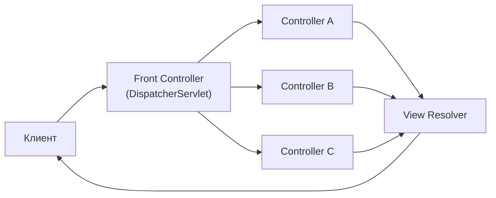
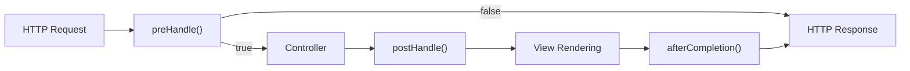
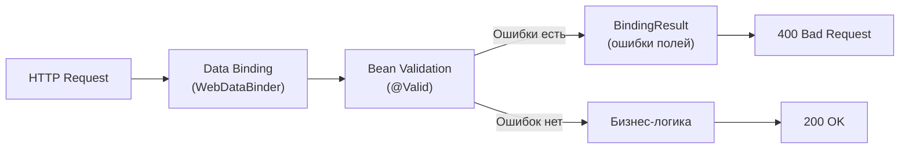
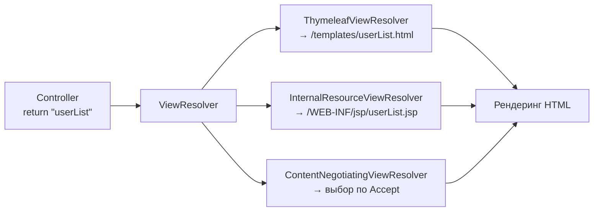
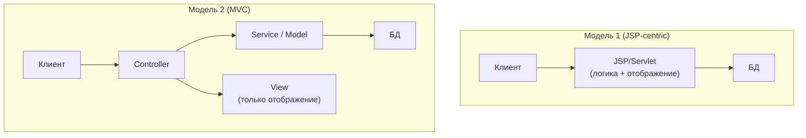
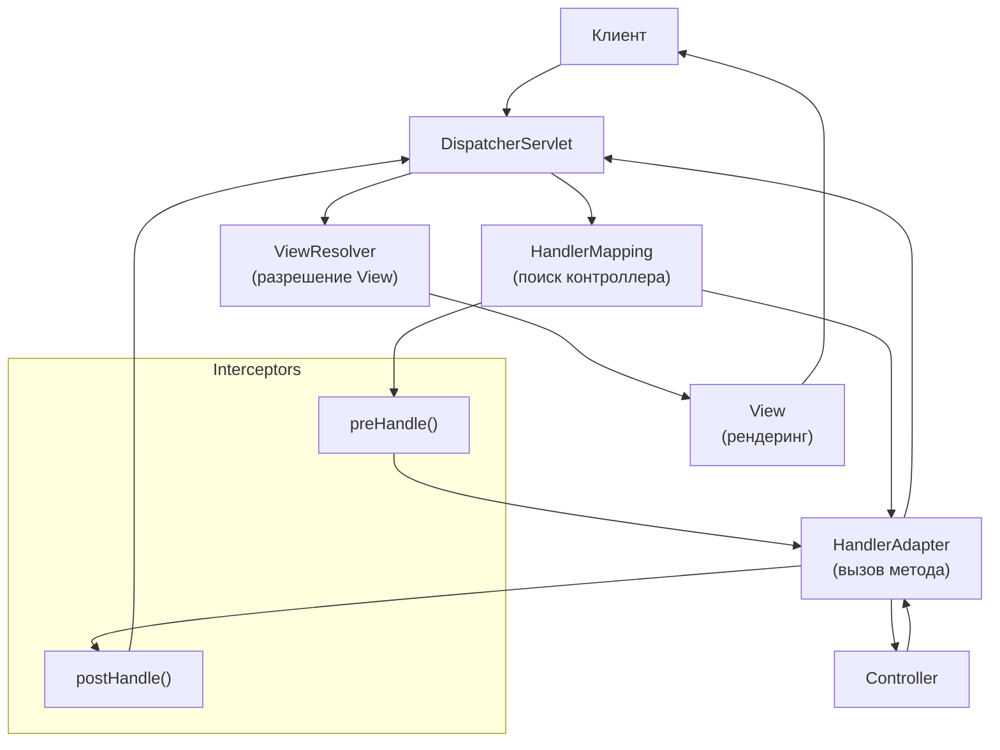
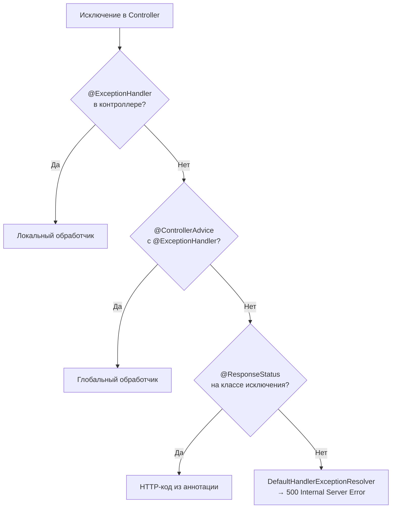
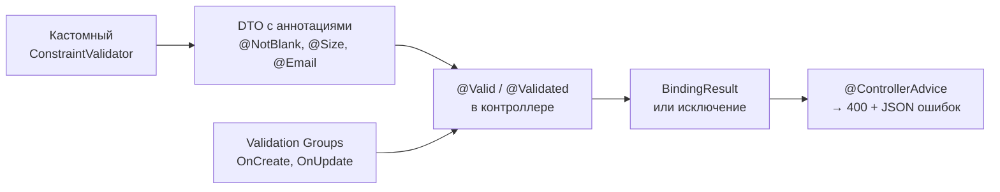
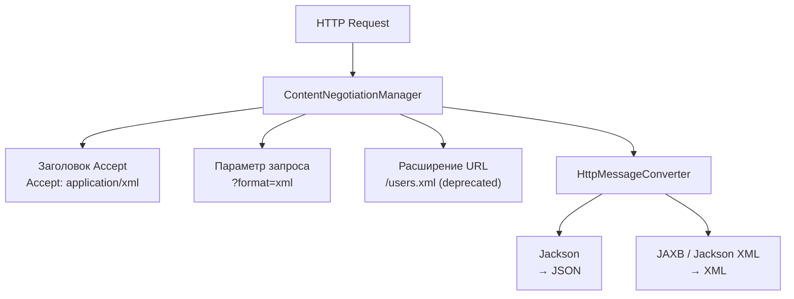
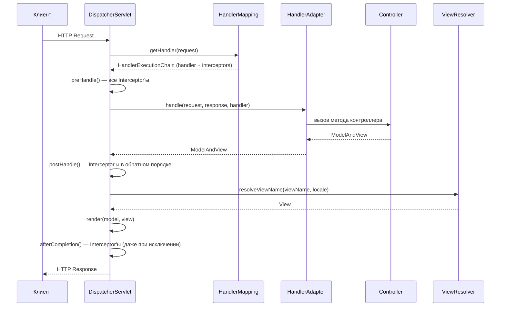

# Вопросы на собеседовании: `Spring MVC`

Краткое введение: **Spring MVC** — основа веб-слоя в `Spring Framework`. На собеседованиях часто спрашивают про `DispatcherServlet`, жизненный цикл запроса, контроллеры, обработку исключений, валидацию, `Content Negotiation`, `CORS` и тестирование с `MockMvc`. Понимание внутренней механики `Spring MVC` отличает сильного кандидата от поверхностного.

## Полезные ссылки

### Официальная документация

- [Spring MVC Documentation](https://docs.spring.io/spring-framework/reference/web/servlet.html) — основной справочник по веб-слою
- [Spring Boot Web](https://docs.spring.io/spring-boot/docs/current/reference/html/web.html) — автоконфигурация веб-приложений
- [Bean Validation (JSR 380)](https://beanvalidation.org/2.0/spec/) — спецификация валидации

### Baeldung

- [Spring MVC Tutorial](https://www.baeldung.com/spring-mvc-tutorial) — полный туториал по Spring MVC
- [An Intro to the Spring DispatcherServlet](https://www.baeldung.com/spring-dispatcherservlet) — архитектура и жизненный цикл запроса
- [Error Handling for REST with Spring](https://www.baeldung.com/exception-handling-for-rest-with-spring) — обработка исключений: @ExceptionHandler, @ControllerAdvice
- [Introduction to Spring MVC HandlerInterceptor](https://www.baeldung.com/spring-mvc-handlerinterceptor) — перехватчики запросов
- [Types of Spring HandlerAdapters](https://www.baeldung.com/spring-mvc-handler-adapters) — адаптеры обработчиков в DispatcherServlet
- [Custom Error Message Handling for REST API](https://www.baeldung.com/global-error-handler-in-a-spring-rest-api) — глобальная обработка ошибок

## Содержание

- [Полезные ссылки](#полезные-ссылки)
- [See also](#see-also)

**Основы Spring MVC**
- [Q1. (!) Что такое Front Controller?](#q1--что-такое-front-controller)
- [Q2. (!) Что такое Spring MVC?](#q2--что-такое-spring-mvc)
- [Q3. Как получить ServletContext и ServletConfig внутри бина?](#q3-как-получить-servletcontext-и-servletconfig-внутри-бина)
- [Q4. Что такое локализация?](#q4-что-такое-локализация)
- [Q5. (!) Что такое Interceptor?](#q5--что-такое-interceptor)

**Model и атрибуты**
- [Q6. Что такое @ModelAttribute?](#q6-что-такое-modelattribute)
- [Q7. В чём разница между Model, ModelMap и ModelAndView?](#q7-в-чём-разница-между-model-modelmap-и-modelandview)
- [Q8. В чем разница между model.put() и model.addAttribute()?](#q8-в-чем-разница-между-modelput-и-modeladdattribute)
- [Q9. Что такое связывание форм?](#q9-что-такое-связывание-форм)
- [Q10. Что такое @PathVariable?](#q10-что-такое-pathvariable)

**Валидация и Binding**
- [Q11. (!) Что такое Validation?](#q11--что-такое-validation)
- [Q12. (!) Что такое BindingResult?](#q12--что-такое-bindingresult)
- [Q13. Что такое аннотации @RequestBody и @ResponseBody?](#q13-что-такое-аннотации-requestbody-и-responsebody)
- [Q14. (!) В чём разница между @Controller и @RestController?](#q14--в-чём-разница-между-controller-и-restcontroller)
- [Q15. Что такое @SessionAttributes и @SessionAttribute?](#q15-что-такое-sessionattributes-и-sessionattribute)

**Конфигурация и View**
- [Q16. Что такое @EnableWebMvc и когда его включать?](#q16-что-такое-enablewebmvc-и-когда-его-включать)
- [Q17. (!) Что такое ViewResolver и зачем он нужен?](#q17--что-такое-viewresolver-и-зачем-он-нужен)
- [Q18. Что такое POJO?](#q18-что-такое-pojo)
- [Q19. Что такое архитектуры модели 1 и модели 2?](#q19-что-такое-архитектуры-модели-1-и-модели-2)
- [Q20. (!) Что такое DispatcherServlet и ContextLoaderListener?](#q20--что-такое-dispatcherservlet-и-contextloaderlistener)
- [Q21. Что такое MultipartResolver?](#q21-что-такое-multipartresolver)
- [Q22. Что такое @InitBinder?](#q22-что-такое-initbinder)

**Обработка исключений**
- [Q23. (!) Как происходит обработка исключений в веб-приложениях?](#q23--как-происходит-обработка-исключений-в-веб-приложениях)
- [Q24. (!) Что такое @ExceptionHandler?](#q24--что-такое-exceptionhandler)
- [Q25. (!) Что такое @ControllerAdvice?](#q25--что-такое-controlleradvice)

**Шаблоны и тестирование**
- [Q26. Как настроить шаблоны (Thymeleaf, JSP)?](#q26-как-настроить-шаблоны-thymeleaf-jsp)
- [Q27. (!) В чём разница между @RequestBody и @RequestParam?](#q27--в-чём-разница-между-requestbody-и-requestparam)
- [Q28. Как организовать валидацию входных данных?](#q28-как-организовать-валидацию-входных-данных)
- [Q29. Что такое Content Negotiation и как его настроить?](#q29-что-такое-content-negotiation-и-как-его-настроить)
- [Q30. Как тестировать контроллеры (MockMvc)?](#q30-как-тестировать-контроллеры-mockmvc)

**Продвинутые темы**
- [Q31. (!) Как устроен pipeline обработки запроса в DispatcherServlet?](#q31-как-устроен-pipeline-обработки-запроса-в-dispatcherservlet)
- [Q32. (!) Как настроить @RequestMapping: все варианты маппинга?](#q32-как-настроить-requestmapping-все-варианты-маппинга)
- [Q33. (!) Как работает HandlerInterceptor и чем отличается от Filter?](#q33-как-работает-handlerinterceptor-и-чем-отличается-от-filter)
- [Q34. Как обрабатывать загрузку файлов (Multipart) в Spring MVC?](#q34-как-обрабатывать-загрузку-файлов-multipart-в-spring-mvc)
- [Q35. (!) Как настроить CORS в Spring MVC?](#q35-как-настроить-cors-в-spring-mvc)
- [Q36. (!) Что такое @ControllerAdvice и как строить глобальную обработку ошибок?](#q36-что-такое-controlleradvice-и-как-строить-глобальную-обработку-ошибок)
- [Q37. Что такое @ModelAttribute на уровне метода и как он взаимодействует с моделью?](#q37-что-такое-modelattribute-на-уровне-метода-и-как-он-взаимодействует-с-моделью)

**Продвинутые темы Spring MVC**
- [Q38. (!) Как устроен lifecycle DispatcherServlet — инициализация и выбор HandlerMapping?](#q38--как-устроен-lifecycle-dispatcherservlet--инициализация-и-выбор-handlermapping)
- [Q39. (!) Как работают @RequestBody и @ResponseBody через цепочку HttpMessageConverter?](#q39--как-работают-requestbody-и-responsebody-через-цепочку-httpmessageconverter)
- [Q40. Как обрабатывать Multipart-запросы — @RequestPart, MultipartFile, ограничения?](#q40-как-обрабатывать-multipart-запросы--requestpart-multipartfile-ограничения)
- [Q41. (!) Как реализовать асинхронные запросы в Spring MVC — Callable, DeferredResult, @Async?](#q41--как-реализовать-асинхронные-запросы-в-spring-mvc--callable-deferredresult-async)
- [Q42. (!) Каков порядок применения ExceptionHandler — @ControllerAdvice vs локальный?](#q42--каков-порядок-применения-exceptionhandler--controlleradvice-vs-локальный)
- [Q43. (!) Когда переходить с Spring MVC на Spring WebFlux?](#q43--когда-переходить-с-spring-mvc-на-spring-webflux)

## Q1. (!) Что такое **Front Controller**?

**Front Controller** — архитектурный паттерн, в котором единая точка входа принимает все входящие запросы, маршрутизирует их к соответствующим обработчикам и координирует общую логику (безопасность, логирование, локализация).

В `Spring MVC` роль Front Controller выполняет `DispatcherServlet`. Он принимает HTTP-запрос, определяет подходящий контроллер через `HandlerMapping`, вызывает его через `HandlerAdapter`, а затем разрешает представление через `ViewResolver`.



Преимущества: централизация сквозной логики (аутентификация, CORS, логирование), единая обработка ошибок, единообразная маршрутизация. Этот паттерн используется в `Spring MVC`, `JSF`, `Struts`.

> [!mcq]
> - [x] `Front Controller` — единая точка входа, которая принимает все запросы и маршрутизирует их к обработчикам. | В Spring MVC эту роль играет `DispatcherServlet` — он централизует сквозную логику (безопасность, логирование, локализация) и вызывает нужный контроллер через `HandlerMapping`.
> - [ ] `Front Controller` — обработчик одного конкретного URL, привязанный к методу контроллера. | Это описание endpoint handler'а или `@RequestMapping`-метода, а не паттерна Front Controller. Front Controller — единая точка входа, а не per-URL-обработчик.
> - [ ] `Front Controller` — JSP-страница, которая отображает стартовую форму приложения. | Это путаница с view-компонентом. Front Controller — архитектурный паттерн маршрутизации, не имеющий отношения к конкретному шаблону отображения. Частая ошибка в реальном коде.
> - [ ] `Front Controller` — прокси-сервер перед приложением, выполняющий балансировку нагрузки. | Это описание reverse proxy / load balancer. Front Controller работает внутри приложения и маршрутизирует запросы к контроллерам, а не между инстансами сервиса.

## Q2. (!) Что такое `Spring MVC`?

**Spring MVC** — реализация паттерна `Model-View-Controller` в [Spring Framework](spring-framework-interview.md):

- **Model** — данные и бизнес-логика (сервисы, DTO, доменные объекты)
- **View** — отображение (`Thymeleaf`, `JSP`, `JSON` через `Jackson`)
- **Controller** — обработка запросов, вызов сервисов, передача данных в модель и выбор представления

`Spring MVC` предоставляет: маршрутизацию по аннотациям (`@RequestMapping`), автоматическое связывание данных из запроса в объекты, интеграцию с `Bean Validation`, Content Negotiation, гибкую обработку исключений и тесную интеграцию с `DI` и `AOP` контейнера `Spring`. В [Spring Boot](spring-boot-interview.md) веб-слой автоконфигурируется через `spring-boot-starter-web`.

> [!mcq]
> - [ ] `Spring MVC` — реактивный веб-фреймворк на базе `Project Reactor`, работающий поверх Netty. | Это описание `Spring WebFlux`, а не `Spring MVC`. MVC построен на блокирующем Servlet API, а не на Reactive Streams. Частая ошибка в реальном коде.
> - [x] `Spring MVC` — реализация паттерна Model-View-Controller поверх Servlet API с `DispatcherServlet` в роли Front Controller. | MVC предоставляет маршрутизацию по `@RequestMapping`, data binding, интеграцию с Bean Validation и гибкую обработку исключений. Работает поверх стандартного Servlet API (Tomcat, Jetty).
> - [ ] `Spring MVC` — модуль `Spring` для работы с базами данных через `JdbcTemplate` и `JPA`. | Это описание `Spring Data` или модуля `spring-jdbc`. `Spring MVC` — это веб-слой, а не слой доступа к данным. Частая ошибка в реальном коде.
> - [ ] `Spring MVC` — библиотека клиентских HTTP-вызовов, включающая `RestTemplate` и `WebClient`. | Это путаница с клиентскими HTTP-абстракциями. `Spring MVC` — серверный веб-фреймворк, обрабатывающий входящие запросы, а не исходящие. Частая ошибка в реальном коде.

## Q3. Как получить `ServletContext` и `ServletConfig` внутри бина?

Два способа:

1. **Через внедрение зависимостей** — объявить параметр конструктора или поле с `@Autowired` типа `ServletContext` или `ServletConfig`. Контейнер подставит те же экземпляры, что использует `DispatcherServlet`.

2. **Через Aware-интерфейсы** — реализовать `ServletContextAware` или `ServletConfigAware`. `Spring` вызовет сеттеры `setServletContext()` / `setServletConfig()` при инициализации бина.

```java
@Component
public class MyComponent implements ServletContextAware {
    private ServletContext servletContext;

    @Override
    public void setServletContext(ServletContext servletContext) {
        this.servletContext = servletContext;
    }
}
```

На практике предпочтителен первый способ — меньше бойлерплейта. `Aware`-интерфейсы полезны, когда нужна совместимость с кодом без аннотаций.

> [!mcq]
> - [ ] Нужно вручную создать `new ServletContext()` в конструкторе бина и инициализировать его при старте. | `ServletContext` создаёт сервлет-контейнер (Tomcat/Jetty), а не приложение. Попытка создать его руками приведёт к несовместимости с реальным контекстом запросов.
> - [ ] Единственный способ — через статический метод `RequestContextHolder.getServletContext()`. | `RequestContextHolder` отдаёт атрибуты текущего запроса, а не сам `ServletContext`. Для получения контекста используется DI или `ServletContextAware`, и такого статического метода нет.
> - [x] Внедрить через `@Autowired` либо реализовать `ServletContextAware` / `ServletConfigAware`. | Контейнер передаст бину те же экземпляры, которые использует `DispatcherServlet`. Оба способа работают, DI предпочтительнее — меньше бойлерплейта. Ключевое отличие и best practice в production.
> - [ ] Через `@Value("${servlet.context}")` из `application.yml`. | `@Value` достаёт строковые property, а не объектные ссылки на сервлетные абстракции. `ServletContext` не хранится в конфигурации — он создаётся контейнером.

## Q4. Что такое локализация?

Локализация (i18n) — адаптация приложения к языку и региону пользователя. В `Spring MVC` это реализуется через:

- **Файлы ресурсов** — `messages_en.properties`, `messages_ru.properties` и т.д.
- **MessageSource** — бин для получения строк по ключу и локали
- **LocaleResolver** — определяет текущую локаль (из `Accept-Language`, cookie или сессии)
- **LocaleChangeInterceptor** — позволяет менять локаль через параметр запроса (`?lang=ru`)

```java
@Configuration
public class LocaleConfig implements WebMvcConfigurer {
    @Bean
    public LocaleResolver localeResolver() {
        var resolver = new SessionLocaleResolver();
        resolver.setDefaultLocale(Locale.forLanguageTag("ru"));
        return resolver;
    }

    @Override
    public void addInterceptors(InterceptorRegistry registry) {
        var interceptor = new LocaleChangeInterceptor();
        interceptor.setParamName("lang");
        registry.addInterceptor(interceptor);
    }
}
```

В шаблонах `Thymeleaf` используют ключи: `th:text="#{welcome.message}"`, Spring подставит значение из файла ресурсов для текущей локали.

> [!mcq]
> - [ ] `LocaleResolver` определяет локаль запроса только по IP-адресу клиента через GeoIP-базу. | По умолчанию Spring ничего про GeoIP не знает. `LocaleResolver` работает с заголовком `Accept-Language`, сессией или cookie — никаких обращений к внешним GeoIP-сервисам.
> - [ ] `MessageSource` хранит локализованные строки в базе данных и читает их через SQL-запросы. | Стандартный `ResourceBundleMessageSource` читает `.properties`-файлы из classpath. БД-реализация возможна, но требует отдельного кастомного бина и не является поведением по умолчанию.
> - [ ] `LocaleChangeInterceptor` меняет локаль через HTTP-заголовок `X-Locale` в каждом запросе. | Интерцептор по умолчанию читает параметр запроса (`?lang=ru`), а не заголовок. Имя параметра настраивается через `setParamName()`, но это query-параметр, не header.
> - [x] Связка `MessageSource` + `LocaleResolver` + `LocaleChangeInterceptor` плюс `messages_*.properties` файлы. | `MessageSource` достаёт строки по ключу, `LocaleResolver` определяет текущую локаль (cookie/session/`Accept-Language`), а `LocaleChangeInterceptor` позволяет переключать её через параметр запроса. Это стандартная схема i18n в Spring MVC.

## Q5. (!) Что такое `Interceptor`?

**HandlerInterceptor** — перехватчик, который добавляет сквозную логику (логирование, аутентификация, метрики) до и после выполнения контроллера. Три метода:

- `preHandle()` — до вызова контроллера; возвращает `boolean` (продолжить или прервать)
- `postHandle()` — после контроллера, но до рендеринга `View`
- `afterCompletion()` — после полного завершения запроса (включая рендеринг)



Регистрация через `WebMvcConfigurer`:

```java
@Configuration
public class WebConfig implements WebMvcConfigurer {
    @Override
    public void addInterceptors(InterceptorRegistry registry) {
        registry.addInterceptor(new LoggingInterceptor())
                .addPathPatterns("/api/**")
                .excludePathPatterns("/api/health")
                .order(1);
    }
}
```

Отличие от Servlet `Filter`: интерцепторы работают на уровне `Spring MVC` (имеют доступ к `HandlerMethod`), а фильтры — на уровне сервлет-контейнера (работают до `DispatcherServlet`). Подробнее о фильтрах и безопасности — в [Spring Security](spring-security-interview.md).

> [!mcq]
> - [x] `HandlerInterceptor` имеет методы `preHandle`, `postHandle` и `afterCompletion` и работает внутри `DispatcherServlet`. | `preHandle` возвращает `boolean` — если `false`, цепочка прерывается. `postHandle` вызывается до рендеринга View, `afterCompletion` — после полного завершения запроса (даже при исключении).
> - [ ] `HandlerInterceptor` имеет только один метод `intercept()` и работает на уровне сервлет-контейнера. | Это описание Servlet `Filter` с его `doFilter()`. У `HandlerInterceptor` три метода, и он работает внутри `DispatcherServlet`, а не до него. Частая ошибка в реальном коде.
> - [ ] `HandlerInterceptor` может изменять HTTP-статус ответа только в методе `preHandle`, возвращая новый код. | `preHandle` возвращает `boolean`, а не HTTP-код. Чтобы отдать кастомный статус, нужно вызывать `response.setStatus()` напрямую — это работает в любом из методов интерцептора.
> - [ ] `HandlerInterceptor` регистрируется автоматически при наличии аннотации `@Component` без дополнительной конфигурации. | Недостаточно `@Component` — интерцептор нужно явно зарегистрировать через `WebMvcConfigurer.addInterceptors()`, указав пути и порядок применения. Частая ошибка в реальном коде.

## Q6. Что такое `@ModelAttribute`?

`@ModelAttribute` используется двумя способами:

**На параметре метода** — `Spring` привязывает параметры запроса к полям объекта (по именам), создавая экземпляр и вызывая сеттеры:

```java
@PostMapping("/register")
public String register(@ModelAttribute("user") User user) {
    // user заполнен из параметров формы
    return "success";
}
```

**На методе** — метод вызывается перед каждым обработчиком контроллера и добавляет атрибут в модель:

```java
@ModelAttribute("categories")
public List<Category> populateCategories() {
    return categoryService.findAll(); // доступно во всех View контроллера
}
```

При использовании на параметре `Spring` выполняет: создание объекта, привязку данных из запроса (`WebDataBinder`), валидацию (если стоит `@Valid`) и добавление в модель. Это основа форм-биндинга в `Spring MVC`.

> [!mcq]
> - [ ] `@ModelAttribute` работает только на параметрах методов и предназначен исключительно для связывания форм. | Это неполное описание. `@ModelAttribute` можно ставить и на методы — тогда он выполняется перед каждым обработчиком и добавляет атрибут в модель. Частая ошибка в реальном коде.
> - [x] `@ModelAttribute` имеет двойное назначение: на параметре — биндинг запроса в объект, на методе — предзаполнение модели. | На параметре Spring создаёт объект, биндит параметры запроса через `WebDataBinder` и добавляет его в модель. На методе — вызывает его перед каждым handler'ом, чтобы заполнить модель общими данными (например, справочниками).
> - [ ] `@ModelAttribute` — аннотация для автоматической валидации DTO без `@Valid`. | Валидация не запускается сама по себе. Нужен явный `@Valid` (или `@Validated`) рядом с `@ModelAttribute`, иначе ограничения Bean Validation не сработают. Это антипаттерн или неправильный выбор в production.
> - [ ] `@ModelAttribute` на методе возвращает объект, который попадает в HTTP-ответ как JSON. | В ответ попадает то, что возвращает `@RequestMapping`-метод. `@ModelAttribute`-метод наполняет модель для последующего рендеринга View, а не формирует HTTP-ответ напрямую.

## Q7. В чём разница между `Model`, `ModelMap` и `ModelAndView`?

| Тип | Описание | Типичное использование |
|-----|----------|----------------------|
| `Model` | Интерфейс; методы `addAttribute()` | Параметр метода контроллера |
| `ModelMap` | Класс, реализует `Map + Model` | Когда нужны map-операции |
| `ModelAndView` | Объект, содержащий и модель, и имя View | Возврат из метода контроллера |

```java
// Model — самый частый подход
@GetMapping("/users")
public String list(Model model) {
    model.addAttribute("users", userService.findAll());
    return "userList";
}

// ModelAndView — данные + представление в одном объекте
@GetMapping("/users")
public ModelAndView list() {
    return new ModelAndView("userList", "users", userService.findAll());
}
```

На практике `Model` как параметр метода — самый чистый подход. `ModelAndView` полезен, когда имя View определяется условно внутри метода.

> [!mcq]
> - [ ] `Model`, `ModelMap` и `ModelAndView` — три имени одного и того же класса, отличаются только алиасами. | Это три разных типа. `Model` — интерфейс, `ModelMap` — класс-реализация `Map + Model`, `ModelAndView` — объект с моделью и именем View. Частая ошибка в реальном коде.
> - [ ] `ModelAndView` содержит только имя View, а данные хранятся отдельно в `HttpServletRequest.attributes`. | `ModelAndView` по определению содержит и модель, и имя View в одном объекте — это его основное отличие от `Model`. Частая ошибка в реальном коде.
> - [x] `Model` — интерфейс только для данных, `ModelMap` — Map-реализация `Model`, `ModelAndView` — связка модель+имя View. | `Model` и `ModelMap` используются как параметры контроллера для наполнения модели, а имя View возвращается строкой. `ModelAndView` удобно возвращать из метода, когда имя View определяется условно.
> - [ ] `ModelMap` отличается от `Model` только потокобезопасностью, остальное идентично. | `ModelMap` не потокобезопасен — это просто реализация, дополнительно предоставляющая стандартные Map-операции (`get`, `containsKey`). Отличие в API и типе, а не в concurrency.

## Q8. В чем разница между `model.put()` и `model.addAttribute()`?

Оба метода добавляют атрибуты в модель, но:

- **`put(key, value)`** — из интерфейса `Map`; принимает любой `key` (включая `null`)
- **`addAttribute(name, value)`** — из интерфейса `Model`; выбрасывает исключение при `null`-ключе; поддерживает цепочку вызовов (method chaining); есть перегрузка `addAttribute(value)`, которая генерирует имя по типу объекта

```java
model.addAttribute("user", user)
     .addAttribute("roles", roles); // chaining

model.put("user", user); // без chaining
```

Предпочтительнее `addAttribute()` — типобезопасный, с защитой от `null`-ключей и fluent-интерфейсом.

> [!mcq]
> - [ ] `put()` и `addAttribute()` — полные синонимы, выбор чисто стилистический. | Есть семантические отличия: `put()` разрешает `null`-ключ, `addAttribute()` бросает исключение. Плюс `addAttribute()` поддерживает method chaining. Частая ошибка в реальном коде.
> - [ ] `put()` быстрее `addAttribute()`, потому что не делает дополнительных проверок. | Разница в скорости не в пользу `put()` на практике несущественна. Главное отличие — семантика и API: `addAttribute()` валидирует ключ и возвращает `Model` для цепочки.
> - [ ] `addAttribute()` сериализует значения в JSON автоматически, а `put()` оставляет как есть. | Ни один из методов не делает сериализацию. Оба просто кладут объект в модель — превращение в JSON или HTML происходит позже в `HttpMessageConverter` или View-layer.
> - [x] `addAttribute()` запрещает `null`-ключ, поддерживает chaining и автоматическую генерацию имени по типу; `put()` — метод `Map`. | `addAttribute(value)` без имени генерирует его через `Conventions.getVariableName()` по типу объекта. Это и делает `addAttribute()` предпочтительным в контроллерах.

## Q9. Что такое связывание форм?

Связывание форм (form binding) — автоматическая привязка данных из HTML-формы к Java-объекту. `Spring MVC` сопоставляет имена полей формы с полями объекта и вызывает сеттеры через `WebDataBinder`.

```java
@PostMapping("/register")
public String register(@ModelAttribute("user") @Valid User user,
                        BindingResult result) {
    if (result.hasErrors()) {
        return "registrationForm";
    }
    userService.save(user);
    return "redirect:/success";
}
```

```html
<form th:action="@{/register}" th:object="${user}" method="post">
    <input type="text" th:field="*{name}" />
    <span th:if="${#fields.hasErrors('name')}" th:errors="*{name}"></span>
    <button type="submit">Зарегистрироваться</button>
</form>
```

Для безопасности рекомендуется ограничивать допустимые поля через `@InitBinder` + `setAllowedFields()`, чтобы злоумышленник не мог подменить поля, которые не отображаются в форме (mass assignment vulnerability).

> [!mcq]
> - [x] `WebDataBinder` автоматически сопоставляет имена полей формы с полями объекта и вызывает сеттеры. | Это классический data binding: Spring берёт параметры запроса по именам, конвертирует типы через `PropertyEditor` / `Converter` и проставляет значения через сеттеры. Для защиты от mass assignment используют `setAllowedFields()`.
> - [ ] Spring разбирает форму вручную в контроллере — нужно вызывать `request.getParameter()` для каждого поля. | Это подход голого Servlet API. В Spring MVC весь биндинг делает `WebDataBinder` автоматически, не требуя ручного чтения параметров. Частая ошибка в реальном коде.
> - [ ] Связывание форм работает только с JSON-телом запроса, form-urlencoded не поддерживается. | Наоборот: `@ModelAttribute` обычно работает с `application/x-www-form-urlencoded` или `multipart/form-data`. JSON-тело обычно обрабатывается через `@RequestBody`.
> - [ ] При ошибке биндинга Spring молча игнорирует поле и продолжает обработку без уведомлений. | Ошибки биндинга попадают в `BindingResult`. Если его нет в сигнатуре метода, Spring выбросит `BindException` или `MethodArgumentNotValidException`. Частая ошибка в реальном коде.

## Q10. Что такое `@PathVariable`?

`@PathVariable` извлекает значение из шаблона URI-пути и подставляет в параметр метода:

```java
@GetMapping("/users/{id}")
public User getUser(@PathVariable Long id) {
    return userService.findById(id);
}

// Несколько переменных
@GetMapping("/users/{userId}/orders/{orderId}")
public Order getOrder(@PathVariable Long userId,
                      @PathVariable Long orderId) {
    return orderService.find(userId, orderId);
}

// Все переменные в Map
@GetMapping("/users/{userId}/orders/{orderId}")
public Order getOrder(@PathVariable Map<String, String> vars) {
    Long userId = Long.parseLong(vars.get("userId"));
    Long orderId = Long.parseLong(vars.get("orderId"));
    return orderService.find(userId, orderId);
}
```

Если имя переменной в шаблоне совпадает с именем параметра метода, `value` можно не указывать. `@PathVariable(required = false)` позволяет сделать переменную необязательной (тогда тип параметра должен быть `Optional` или nullable).

> [!mcq]
> - [ ] `@PathVariable` читает значение из query-string (`?id=42`) и подставляет в параметр метода. | Это описание `@RequestParam`. `@PathVariable` извлекает значение из сегмента URI-пути (`/users/{id}`), а не из query-параметров. Частая ошибка в реальном коде.
> - [x] `@PathVariable` извлекает значение из шаблона URI (`/users/{id}`) и подставляет в параметр метода. | Spring использует `UriTemplateHandler` для сопоставления сегмента пути с плейсхолдером. Можно связать по имени (если имена совпадают) или через `@PathVariable("id")`.
> - [ ] `@PathVariable` работает только со `String`-параметрами, примитивные типы не поддерживаются. | Spring автоматически конвертирует значение через `Converter`/`Formatter`: `Long`, `Integer`, `UUID`, `enum` — всё работает из коробки. Частая ошибка в реальном коде.
> - [ ] `@PathVariable` обязательно требует `value`-атрибут, иначе биндинг упадёт с ошибкой. | Если имя переменной в шаблоне совпадает с именем параметра метода, `value` можно опустить — Spring свяжет их по имени. Явный `value` нужен только при несовпадении.

## Q11. (!) Что такое `Validation`?

Валидация в `Spring MVC` основана на **Bean Validation** (`JSR 380`, реализация — `Hibernate Validator`). На полях DTO ставят аннотации ограничений, а в контроллере аргумент помечают `@Valid`:



```java
public record UserCreateDto(
    @NotBlank(message = "Имя обязательно")
    String name,

    @Email(message = "Некорректный email")
    @NotBlank
    String email,

    @Size(min = 8, max = 100, message = "Пароль от 8 до 100 символов")
    String password
) {}
```

Для кастомных правил — собственная аннотация с `ConstraintValidator`. Для групповой валидации — `@Validated(OnCreate.class)` вместо `@Valid`. Подробнее о паттернах валидации — в [Spring Boot](spring-boot-interview.md).

> [!mcq]
> - [ ] Валидация в `Spring MVC` реализована на собственном механизме Spring без JSR-спецификации. | Spring использует стандарт Bean Validation (JSR 380) через `Hibernate Validator` как референсную реализацию. Свой механизм (`Validator` из `org.springframework.validation`) существует, но Bean Validation — основной путь.
> - [ ] Для запуска валидации достаточно поставить аннотации ограничений на DTO, `@Valid` не нужен. | Без `@Valid` (или `@Validated` на классе) Spring не запустит проверку ограничений. Аннотации на полях DTO сами по себе ничего не делают. Частая ошибка в реальном коде.
> - [x] Bean Validation (JSR 380) + `@Valid` на аргументе контроллера запускает проверку через `Hibernate Validator`. | При нарушении ограничений Spring собирает ошибки в `BindingResult`. Если `BindingResult` в сигнатуре нет, выбрасывается `MethodArgumentNotValidException` (для `@RequestBody`) или `BindException` (для `@ModelAttribute`).
> - [ ] Валидация применяется только к `@RequestBody`-параметрам, к `@ModelAttribute` не применяется. | `@Valid`/`@Validated` работает и для `@RequestBody`, и для `@ModelAttribute`, и для `@RequestPart`, и на полях `@Validated`-сервиса. Ограничение на `@RequestBody` — миф.

## Q12. (!) Что такое `BindingResult`?

**BindingResult** — объект, хранящий результат привязки данных и валидации. Он обязательно должен идти **сразу после** валидируемого аргумента в сигнатуре метода:

```java
@PostMapping("/users")
public String createUser(@Valid @ModelAttribute User user,
                          BindingResult result,  // сразу после @Valid аргумента!
                          Model model) {
    if (result.hasErrors()) {
        // result.getFieldErrors() — список ошибок по полям
        // result.getGlobalErrors() — ошибки уровня объекта
        return "userForm";
    }
    userService.save(user);
    return "redirect:/users";
}
```

Если `BindingResult` не объявлен, а валидация провалилась, `Spring` выбросит `MethodArgumentNotValidException` (для `@RequestBody`) или `BindException` (для `@ModelAttribute`). При наличии `BindingResult` исключение не выбрасывается — контроллер сам решает, как обработать ошибки.

> [!mcq]
> - [ ] `BindingResult` может находиться в любом месте сигнатуры метода — Spring сам найдёт его по типу. | Spring требует, чтобы `BindingResult` шёл **сразу** после валидируемого аргумента. Иначе он не связывается с нужным объектом, и валидация всё равно бросит исключение.
> - [ ] Наличие `BindingResult` отключает валидацию — ограничения игнорируются. | Валидация запускается и ошибки складываются в `BindingResult`. Разница только в том, выбрасывать исключение или отдать контроль контроллеру. Частая ошибка в реальном коде.
> - [ ] `BindingResult` хранит только ошибки валидации, без ошибок биндинга типов. | Он хранит оба типа ошибок: `FieldError` от data binding (например, невалидный формат даты) и `ObjectError`/`FieldError` от Bean Validation. Это антипаттерн или неправильный выбор в production.
> - [x] `BindingResult` хранит ошибки биндинга и валидации; должен идти сразу после валидируемого аргумента. | При наличии `BindingResult` исключение не выбрасывается — контроллер сам решает, что делать. Методы `hasErrors()`, `getFieldErrors()`, `getGlobalErrors()` позволяют инспектировать ошибки.

## Q13. Что такое аннотации `@RequestBody` и `@ResponseBody`?

**`@RequestBody`** — привязывает тело HTTP-запроса к Java-объекту. `Spring` использует `HttpMessageConverter` (например, `MappingJackson2HttpMessageConverter`) для десериализации `JSON/XML` в объект:

```java
@PostMapping("/users")
public User create(@RequestBody UserCreateDto dto) {
    return userService.create(dto);
}
```

**`@ResponseBody`** — указывает, что возвращаемое значение метода нужно записать прямо в тело ответа (не интерпретировать как имя View). `Spring` сериализует объект через `HttpMessageConverter`:

```java
@GetMapping("/users/{id}")
@ResponseBody
public User getUser(@PathVariable Long id) {
    return userService.findById(id);
}
```

`@RestController` = `@Controller` + `@ResponseBody` на уровне класса, поэтому в REST-контроллерах `@ResponseBody` писать не нужно.

> [!mcq]
> - [x] `@RequestBody` десериализует тело запроса в объект через `HttpMessageConverter`; `@ResponseBody` — сериализует возвращаемый объект в тело ответа. | Цепочка `HttpMessageConverter`'ов (Jackson, Jaxb2, String) выбирается по `Content-Type` (для входа) и `Accept` (для выхода). В `@RestController` оба поведения включены автоматически.
> - [ ] `@RequestBody` читает query-параметры запроса, `@ResponseBody` формирует заголовки ответа. | Нет. Query-параметры — это `@RequestParam`, заголовки — `@RequestHeader`/`@ResponseStatus`. `@RequestBody`/`@ResponseBody` работают именно с телом HTTP-сообщения.
> - [ ] `@RequestBody` обязателен для всех POST-методов, без него запрос не дойдёт до контроллера. | Не обязателен. Можно принимать данные через `@RequestParam`, `@ModelAttribute` (form-urlencoded) или `@RequestPart` (multipart). `@RequestBody` нужен только для JSON/XML-тела.
> - [ ] `@ResponseBody` работает только в `@RestController`, в обычном `@Controller` он игнорируется. | В обычном `@Controller` его можно ставить на отдельные методы — тогда их ответ пишется в тело напрямую, а не интерпретируется как имя View. Частая ошибка в реальном коде.

## Q14. (!) В чём разница между `@Controller` и `@RestController`?

| Аспект | `@Controller` | `@RestController` |
|--------|---------------|-------------------|
| Что возвращает метод | Имя View (строка) | Объект → JSON/XML |
| `@ResponseBody` | Нужен явно на каждом методе | Включён автоматически |
| Типичное применение | Веб-страницы (Thymeleaf, JSP) | REST API |
| ViewResolver | Участвует | Не участвует |

```java
// Для веб-страниц
@Controller
public class PageController {
    @GetMapping("/home")
    public String home(Model model) {
        model.addAttribute("title", "Главная");
        return "home"; // → ViewResolver → home.html
    }
}

// Для REST API
@RestController
@RequestMapping("/api/users")
public class UserController {
    @GetMapping("/{id}")
    public User getUser(@PathVariable Long id) {
        return userService.findById(id); // → Jackson → JSON
    }
}
```

В одном `@Controller` можно комбинировать: часть методов возвращает View, а часть — с `@ResponseBody` отдаёт JSON. Но на практике смешивать не рекомендуется — лучше разделять по классам.

> [!mcq]
> - [ ] `@RestController` и `@Controller` — полные синонимы; отличаются только именем. | Функциональная разница есть: `@RestController` включает `@ResponseBody` на уровне класса, а `@Controller` — нет. Синонимами они не являются. Частая ошибка в реальном коде.
> - [x] `@RestController` = `@Controller` + `@ResponseBody` на уровне класса; методы сериализуются в тело ответа. | В `@RestController` `ViewResolver` не участвует — возвращаемый объект идёт через `HttpMessageConverter` (обычно Jackson → JSON). В `@Controller` строка интерпретируется как имя View.
> - [ ] `@Controller` используется только для REST API, `@RestController` — только для возвращения HTML-страниц. | Всё наоборот. `@Controller` классически используется с View-рендерингом (Thymeleaf/JSP), а `@RestController` — для REST API с JSON. Частая ошибка в реальном коде.
> - [ ] В `@RestController` нельзя использовать `Model` и `ModelAndView`, они не поддерживаются. | Технически можно, но бессмысленно — ViewResolver не включён, и `Model` не влияет на ответ. Однако сам факт объявления параметра не вызовет ошибки. Частая ошибка в реальном коде.

## Q15. Что такое `@SessionAttributes` и `@SessionAttribute`?

**`@SessionAttributes`** (на классе контроллера) — сохраняет указанные атрибуты модели в HTTP-сессии между запросами:

```java
@Controller
@SessionAttributes("wizard")
public class WizardController {

    @ModelAttribute("wizard")
    public WizardForm initWizard() {
        return new WizardForm(); // создаётся один раз, живёт в сессии
    }

    @PostMapping("/step1")
    public String step1(@ModelAttribute("wizard") WizardForm form) {
        return "step2";
    }

    @PostMapping("/complete")
    public String complete(SessionStatus status) {
        status.setComplete(); // очищает сессионные атрибуты
        return "redirect:/done";
    }
}
```

**`@SessionAttribute`** (на параметре метода) — достаёт существующий атрибут из сессии:

```java
@GetMapping("/dashboard")
public String dashboard(@SessionAttribute("user") User currentUser) {
    // атрибут уже в сессии (положен ранее)
}
```

Разница: `@SessionAttributes` управляет жизненным циклом атрибутов модели в рамках контроллера; `@SessionAttribute` просто читает атрибут из `HttpSession`.

> [!mcq]
> - [ ] `@SessionAttributes` и `@SessionAttribute` — псевдонимы, отличаются только опечаткой во множественном числе. | Это два разных механизма с разным поведением. `@SessionAttributes` (на классе) синхронизирует атрибуты модели с сессией, `@SessionAttribute` (на параметре) читает из `HttpSession`.
> - [ ] `@SessionAttributes` работает только в `@RestController` и сохраняет JSON-атрибуты в Redis. | Никакого Redis и REST-контроллера. `@SessionAttributes` использует обычную `HttpSession` (или её замену через `SessionRepository` в Spring Session), и чаще всего применяется в стандартных `@Controller`.
> - [x] `@SessionAttributes` — на классе, сохраняет атрибуты модели в сессии; `@SessionAttribute` — на параметре, читает из `HttpSession`. | `@SessionAttributes("name")` автоматически синхронизирует атрибут модели с сессией, пока `SessionStatus.setComplete()` не очистит его. `@SessionAttribute` просто достаёт ранее положенное значение.
> - [ ] `@SessionAttribute` создаёт новую сессию, если её нет, а `@SessionAttributes` требует существующую сессию. | Создание сессии контролирует сервлет-контейнер и `HttpServletRequest.getSession(true/false)`. Аннотации не создают сессий — они работают с атрибутами уже существующей.

## Q16. Что такое `@EnableWebMvc` и когда его включать?

`@EnableWebMvc` активирует полную конфигурацию `Spring MVC` через Java-конфиг (аналог `<mvc:annotation-driven/>` из XML). Регистрирует: `HandlerMapping`, `HandlerAdapter`, `HttpMessageConverter`'ы, валидаторы, форматтеры.

**Когда использовать:**
- В приложениях без `Spring Boot`, где нет автоконфигурации
- Когда нужен полный контроль над MVC-конфигурацией

**Когда НЕ использовать:**
- В `Spring Boot` — автоконфигурация уже всё настраивает. Добавление `@EnableWebMvc` **отключает** автоконфигурацию `WebMvcAutoConfiguration`, что может сломать многие дефолты (Jackson, статические ресурсы и т.д.)

Для кастомизации в `Spring Boot` достаточно реализовать `WebMvcConfigurer` без `@EnableWebMvc`:

```java
@Configuration
public class WebConfig implements WebMvcConfigurer {
    @Override
    public void addCorsMappings(CorsRegistry registry) {
        registry.addMapping("/api/**").allowedOrigins("https://example.com");
    }
}
```

> [!mcq]
> - [ ] `@EnableWebMvc` необходим в каждом Spring Boot приложении — без него контроллеры не работают. | В Spring Boot `WebMvcAutoConfiguration` уже регистрирует всё нужное. `@EnableWebMvc` не обязателен и даже вреден — он отключит автоконфигурацию. Частая ошибка в реальном коде.
> - [ ] `@EnableWebMvc` включает только поддержку CORS и REST-конвертеров, остальное не трогает. | Аннотация регистрирует полный стек MVC: `HandlerMapping`, `HandlerAdapter`, `HttpMessageConverter`, валидаторы, форматтеры. Это не частичная, а полная замена конфигурации.
> - [ ] `@EnableWebMvc` нужен исключительно для интеграции с `Spring Security` и без него `@Controller` не сработает. | Spring Security не требует этой аннотации. `@Controller` регистрируется обычным сканированием компонентов, независимо от `@EnableWebMvc`. Это антипаттерн или неправильный выбор в production.
> - [x] `@EnableWebMvc` активирует полную Java-конфигурацию MVC; в Spring Boot его НЕ включают, чтобы не отключить автоконфигурацию. | Добавление `@EnableWebMvc` отключает `WebMvcAutoConfiguration`, что ломает дефолты (Jackson, статические ресурсы). В Spring Boot достаточно реализовать `WebMvcConfigurer` без этой аннотации.

## Q17. (!) Что такое `ViewResolver` и зачем он нужен?

**ViewResolver** — компонент, который преобразует логическое имя представления (строку, возвращённую контроллером) в объект `View` для рендеринга.



Основные реализации:

| ViewResolver | Назначение |
|-------------|-----------|
| `ThymeleafViewResolver` | Шаблоны Thymeleaf |
| `InternalResourceViewResolver` | JSP-страницы |
| `ContentNegotiatingViewResolver` | Делегирует другим резолверам по `Accept` |
| `BeanNameViewResolver` | Ищет бин с именем View |

В чисто REST-приложениях с `@RestController` `ViewResolver` не участвует — ответ формируется через `HttpMessageConverter` (например, `Jackson` для JSON). Подробнее о Content Negotiation — в Q29.

> [!mcq]
> - [x] `ViewResolver` преобразует логическое имя View (строка от контроллера) в объект `View` для рендеринга. | Реализации: `ThymeleafViewResolver`, `InternalResourceViewResolver` (JSP), `ContentNegotiatingViewResolver`. В REST-приложениях с `@RestController` ViewResolver не участвует — используется `HttpMessageConverter`.
> - [ ] `ViewResolver` сериализует объект в JSON/XML перед отправкой клиенту. | Сериализация — задача `HttpMessageConverter` (Jackson, Jaxb2). `ViewResolver` работает только с View-технологиями (Thymeleaf, JSP, FreeMarker). Частая ошибка в реальном коде.
> - [ ] `ViewResolver` определяет HTTP-статус ответа на основе результата работы контроллера. | HTTP-статус задаётся через `@ResponseStatus`, `ResponseEntity` или `HttpServletResponse`, а не ViewResolver. Резолвер отвечает только за выбор View. Частая ошибка в реальном коде.
> - [ ] `ViewResolver` кэширует результаты рендеринга шаблонов в Redis для ускорения. | Кэш шаблонов есть внутри движков (Thymeleaf/Freemarker), но он in-memory и не имеет отношения к ViewResolver. Redis-кэш — это отдельный уровень и он не про View.

## Q18. Что такое `POJO`?

**POJO** (Plain Old Java Object) — обычный Java-объект без привязки к фреймворку: нет наследования от специальных классов, нет обязательных интерфейсов.

В контексте `Spring MVC` POJO часто упоминается как:
- **Command Object / Backing Object** — объект, в который `Spring` привязывает данные из формы через `@ModelAttribute`
- **DTO** — объект передачи данных между слоями

```java
// POJO — нет зависимостей от Spring
public class UserForm {
    private String name;
    private String email;
    // getters, setters
}
```

Философия `Spring` — контроллеры и сервисы тоже по возможности должны оставаться POJO: бизнес-логика не зависит от `javax.servlet.*`, что упрощает тестирование (см. [модульное тестирование](../../testing/unit-testing-interview.md)).

> [!mcq]
> - [ ] `POJO` — класс, обязательно унаследованный от `java.lang.Object` и имеющий аннотацию `@Component`. | Аннотации делают класс Spring Bean, а не POJO. Философия POJO как раз о том, что объект не привязан к фреймворку — это отсутствие наследования от специальных классов. Это антипаттерн или неправильный выбор в production.
> - [x] `POJO` — обычный Java-объект без привязки к фреймворку: нет обязательного наследования или интерфейсов. | В Spring MVC POJO выступают в роли command object, DTO, entity. Их можно тестировать без Spring, легко сериализовать и переносить между слоями. Ключевое отличие и best practice в production.
> - [ ] `POJO` — класс, реализующий `Serializable` и имеющий публичные поля без геттеров. | Сериализация и публичные поля — не критерии POJO. Классические POJO-DTO имеют приватные поля и getter/setter, но это вопрос стиля, а не определения. Частая ошибка в реальном коде.
> - [ ] `POJO` — класс, создаваемый через `BeanFactory.getBean()` с обязательным scope `singleton`. | POJO можно инстанцировать через `new` — это и есть суть паттерна. `BeanFactory` и scope — детали Spring контейнера, к POJO не относящиеся. Это антипаттерн или неправильный выбор в production.

## Q19. Что такое архитектуры модели 1 и модели 2?

**Модель 1** — запрос обрабатывается непосредственно в `JSP`/сервлете, где логика и отображение смешаны. Быстро для простых приложений, но плохо масштабируется.

**Модель 2** — паттерн `MVC`: разделение на контроллер, модель и представление.



`Spring MVC` реализует модель 2. Разделение ответственности даёт: независимое тестирование слоёв, переиспользование бизнес-логики, замену View-технологии без переписывания контроллеров.

> [!mcq]
> - [ ] Модель 1 — это REST API, модель 2 — это SOAP-сервисы. | Оба термина относятся к веб-архитектурам в Java, а не к стилю API. Разница не в протоколе (REST/SOAP), а в разделении логики и отображения. Частая ошибка в реальном коде.
> - [ ] Модель 1 использует `DispatcherServlet`, модель 2 — чистые JSP без контроллеров. | Всё наоборот. Модель 2 — это MVC с `DispatcherServlet`; модель 1 — JSP-centric подход, где логика пишется прямо в JSP-страницах. Частая ошибка в реальном коде.
> - [x] Модель 1 — JSP-centric (логика и отображение в одном файле); модель 2 — MVC-архитектура с разделением на Controller/Model/View. | Модель 2 (MVC) даёт независимое тестирование слоёв и замену View-технологии без переписывания контроллеров. Spring MVC реализует именно модель 2. Ключевое отличие и best practice в production.
> - [ ] Модель 1 — синхронная обработка, модель 2 — асинхронная с `DeferredResult`. | Оба термина про организацию кода, а не про синхронность. Асинхронность (Callable/DeferredResult) — отдельная тема внутри любой из моделей. Частая ошибка в реальном коде.

## Q20. (!) Что такое `DispatcherServlet` и `ContextLoaderListener`?

**DispatcherServlet** — центральный сервлет `Spring MVC`, реализующий паттерн Front Controller. Он координирует весь цикл обработки запроса:



**ContextLoaderListener** — при старте приложения создаёт **корневой** `ApplicationContext` (сервисы, репозитории, общая инфраструктура). `DispatcherServlet` создаёт свой **дочерний** контекст (контроллеры, `ViewResolver`, `HandlerMapping`). Бины веб-слоя видят бины из корневого контекста, но не наоборот.

В `Spring Boot` это абстрагировано: есть один контекст, а `DispatcherServlet` регистрируется автоматически как бин `DispatcherServletAutoConfiguration`.

> [!mcq]
> - [ ] `DispatcherServlet` — класс сервлет-контейнера Tomcat, не относящийся к Spring. | `DispatcherServlet` — часть Spring Web (`org.springframework.web.servlet.DispatcherServlet`). Tomcat лишь запускает его как обычный сервлет. Частая ошибка в реальном коде.
> - [ ] `ContextLoaderListener` создаёт только дочерний контекст для `DispatcherServlet`. | `ContextLoaderListener` создаёт **корневой** `ApplicationContext` (сервисы, репозитории). Дочерний контекст создаёт сам `DispatcherServlet`. Частая ошибка в реальном коде.
> - [ ] `DispatcherServlet` работает только с одним контроллером и не поддерживает аннотации. | `DispatcherServlet` — Front Controller, обрабатывающий любой `@RequestMapping`-метод во всех контроллерах. Поддержка аннотаций — его основной режим работы.
> - [x] `DispatcherServlet` — Front Controller, координирует обработку запроса; `ContextLoaderListener` создаёт корневой `ApplicationContext`. | В классических приложениях бины веб-слоя (в дочернем контексте `DispatcherServlet`) видят бины корневого контекста, но не наоборот. В Spring Boot это абстрагировано: один контекст и автоконфигурация `DispatcherServletAutoConfiguration`.

## Q21. Что такое `MultipartResolver`?

**MultipartResolver** — стратегия разбора multipart-запросов (загрузка файлов). Две реализации:

- **`StandardServletMultipartResolver`** — на основе Servlet 3.0+ API (используется в `Spring Boot` по умолчанию)
- **`CommonsMultipartResolver`** — на основе Apache Commons FileUpload

```java
@PostMapping("/upload")
public String upload(@RequestParam("file") MultipartFile file) {
    String name = file.getOriginalFilename();
    long size = file.getSize();
    // file.transferTo(Path.of("/uploads/" + name));
    return "uploaded";
}
```

Настройка лимитов в `application.yml`:

```yaml
spring:
  servlet:
    multipart:
      max-file-size: 10MB
      max-request-size: 50MB
```

При превышении лимита `Spring` выбрасывает `MaxUploadSizeExceededException`, которое можно обработать в `@ControllerAdvice`.

> [!mcq]
> - [x] `MultipartResolver` — стратегия разбора `multipart/form-data` запросов; в Spring Boot по умолчанию `StandardServletMultipartResolver`. | Есть две реализации: `StandardServletMultipartResolver` (Servlet 3.0+) и `CommonsMultipartResolver` (Apache Commons FileUpload). Настройка лимитов — через `spring.servlet.multipart.*`.
> - [ ] `MultipartResolver` читает исключительно JSON с файлами в base64-кодировке. | `MultipartResolver` работает с `multipart/form-data`, а не с JSON. Base64-кодирование файла в JSON — это альтернативный подход, который резолвер не обрабатывает.
> - [ ] `MultipartResolver` автоматически сохраняет все загруженные файлы на S3 без дополнительной настройки. | Резолвер только парсит запрос и даёт доступ к `MultipartFile`. Сохранение на S3/локально — ручная ответственность приложения, вызывающего `transferTo()`.
> - [ ] `MultipartResolver` не поддерживает лимит на размер файла — нужно писать проверку вручную. | Лимиты настраиваются через `spring.servlet.multipart.max-file-size` / `max-request-size`. При превышении выбрасывается `MaxUploadSizeExceededException`.

## Q22. Что такое `@InitBinder`?

Метод с `@InitBinder` вызывается перед каждым запросом и настраивает `WebDataBinder` — компонент, отвечающий за привязку данных из запроса к объектам:

```java
@Controller
public class UserController {

    @InitBinder
    public void initBinder(WebDataBinder binder) {
        // Защита от mass assignment — разрешаем только нужные поля
        binder.setAllowedFields("name", "email");

        // Регистрация кастомного форматтера
        binder.registerCustomEditor(Date.class,
            new CustomDateEditor(new SimpleDateFormat("yyyy-MM-dd"), true));

        // Регистрация валидатора
        binder.addValidators(new UserValidator());
    }

    @InitBinder("order") // только для аргумента с именем "order"
    public void initOrderBinder(WebDataBinder binder) {
        binder.setDisallowedFields("id");
    }
}
```

`@InitBinder` без `value` применяется ко всем аргументам контроллера. С `value("order")` — только к аргументу с именем `order`.

## Q23. (!) Как происходит обработка исключений в веб-приложениях?

Три уровня обработки исключений в `Spring MVC`:



1. **`@ResponseStatus` на исключении** — `Spring` автоматически вернёт указанный HTTP-код:
```java
@ResponseStatus(HttpStatus.NOT_FOUND)
public class ResourceNotFoundException extends RuntimeException { }
```

2. **`@ExceptionHandler` в контроллере** — обработчик для конкретного контроллера

3. **`@ControllerAdvice` + `@ExceptionHandler`** — глобальный обработчик для всех контроллеров (самый распространённый подход)

На практике в REST API используют `@RestControllerAdvice` (= `@ControllerAdvice` + `@ResponseBody`) с единым форматом ответа об ошибке (RFC 7807 Problem Details).

## Q24. (!) Что такое `@ExceptionHandler`?

`@ExceptionHandler` помечает метод, который вызывается при выбросе указанного исключения в контроллере. Метод может возвращать `ResponseEntity`, View или объект (в `@RestController`):

```java
@RestControllerAdvice
public class GlobalExceptionHandler {

    @ExceptionHandler(ResourceNotFoundException.class)
    @ResponseStatus(HttpStatus.NOT_FOUND)
    public ProblemDetail handleNotFound(ResourceNotFoundException ex) {
        ProblemDetail pd = ProblemDetail.forStatus(HttpStatus.NOT_FOUND);
        pd.setTitle("Ресурс не найден");
        pd.setDetail(ex.getMessage());
        return pd;
    }

    @ExceptionHandler(MethodArgumentNotValidException.class)
    @ResponseStatus(HttpStatus.BAD_REQUEST)
    public ProblemDetail handleValidation(MethodArgumentNotValidException ex) {
        ProblemDetail pd = ProblemDetail.forStatus(HttpStatus.BAD_REQUEST);
        pd.setTitle("Ошибка валидации");
        Map<String, String> errors = ex.getBindingResult().getFieldErrors().stream()
            .collect(Collectors.toMap(
                FieldError::getField, FieldError::getDefaultMessage));
        pd.setProperty("errors", errors);
        return pd;
    }
}
```

`ProblemDetail` (Spring 6+) — реализация RFC 7807, стандартный формат ответа об ошибках в REST API. В одном `@ControllerAdvice` нельзя объявить два обработчика для одного и того же типа исключения.

## Q25. (!) Что такое `@ControllerAdvice`?

`@ControllerAdvice` помечает класс, чьи методы применяются ко всем (или к выбранным) контроллерам. Три типа методов:

- **`@ExceptionHandler`** — глобальная обработка исключений
- **`@ModelAttribute`** — добавление общих атрибутов в модель
- **`@InitBinder`** — глобальная настройка привязки данных

```java
@ControllerAdvice(basePackages = "com.example.api")
public class ApiAdvice {

    @ModelAttribute("apiVersion")
    public String apiVersion() {
        return "v2";
    }

    @InitBinder
    public void initBinder(WebDataBinder binder) {
        binder.registerCustomEditor(Date.class,
            new CustomDateEditor(new SimpleDateFormat("yyyy-MM-dd"), true));
    }
}
```

Область сужают через: `basePackages`, `basePackageClasses`, `assignableTypes`, `annotations`. `@RestControllerAdvice` = `@ControllerAdvice` + `@ResponseBody` — для REST API.

## Q26. Как настроить шаблоны (`Thymeleaf`, `JSP`)?

Для `Thymeleaf` в `Spring Boot` достаточно добавить зависимость `spring-boot-starter-thymeleaf` — автоконфигурация настроит `ThymeleafViewResolver` с дефолтами:

```yaml
spring:
  thymeleaf:
    prefix: classpath:/templates/   # где искать шаблоны
    suffix: .html                    # расширение
    cache: false                     # отключить для разработки
```

Для `JSP` (не рекомендуется в новых проектах):

```yaml
spring:
  mvc:
    view:
      prefix: /WEB-INF/jsp/
      suffix: .jsp
```

Контроллер возвращает имя: `return "userList"` → `ViewResolver` подставит префикс/суффикс → `/templates/userList.html`. В чисто REST-приложениях с `@RestController` шаблоны не используются — ответ формируется через `HttpMessageConverter` (JSON/XML).

В современных приложениях `Thymeleaf` — стандартный выбор (поддержка layout-фрагментов, интеграция с [Spring Security](spring-security-interview.md), рендеринг без сервера).

## Q27. (!) В чём разница между `@RequestBody` и `@RequestParam`?

| Аспект | `@RequestBody` | `@RequestParam` | `@PathVariable` |
|--------|---------------|-----------------|-----------------|
| Источник данных | Тело запроса | Query/form параметры | Сегмент URL |
| Типичный метод | POST, PUT | GET, POST (form) | GET, DELETE |
| Маппинг | JSON → объект | `?key=value` → параметр | `/path/{id}` → параметр |
| Количество | Одно тело на запрос | Много параметров | Много переменных |

```java
// @RequestBody — тело запроса (JSON)
@PostMapping("/users")
public User create(@RequestBody @Valid UserCreateDto dto) { ... }

// @RequestParam — параметры запроса
@GetMapping("/users")
public Page<User> search(@RequestParam(defaultValue = "") String name,
                          @RequestParam(defaultValue = "0") int page) { ... }

// @PathVariable — часть URL
@DeleteMapping("/users/{id}")
public void delete(@PathVariable Long id) { ... }
```

Для подробностей о [HTTP и REST](../../api/http-rest-interview.md) — смотрите соответствующий раздел.

## Q28. Как организовать валидацию входных данных?

Полная цепочка валидации в `Spring MVC`:



```java
// 1. DTO с ограничениями
public record UserCreateDto(
    @NotBlank String name,
    @Email @NotBlank String email,
    @Size(min = 8) String password
) {}

// 2. Контроллер с @Valid
@PostMapping("/users")
public ResponseEntity<User> create(@Valid @RequestBody UserCreateDto dto) {
    return ResponseEntity.status(201).body(userService.create(dto));
}

// 3. Глобальный обработчик ошибок валидации
@RestControllerAdvice
public class ValidationAdvice {
    @ExceptionHandler(MethodArgumentNotValidException.class)
    public ResponseEntity<Map<String, String>> handleValidation(
            MethodArgumentNotValidException ex) {
        Map<String, String> errors = ex.getBindingResult().getFieldErrors().stream()
            .collect(Collectors.toMap(
                FieldError::getField, FieldError::getDefaultMessage));
        return ResponseEntity.badRequest().body(errors);
    }
}
```

Для кастомных правил — собственная аннотация + `ConstraintValidator`. Для разных сценариев (создание vs. обновление) — `@Validated(OnCreate.class)` с группами валидации.

## Q29. Что такое `Content Negotiation` и как его настроить?

**Content Negotiation** — механизм выбора формата ответа (JSON, XML, HTML) в зависимости от запроса клиента. `Spring MVC` поддерживает несколько стратегий:



Настройка через `WebMvcConfigurer`:

```java
@Configuration
public class WebConfig implements WebMvcConfigurer {
    @Override
    public void configureContentNegotiation(ContentNegotiationConfigurer configurer) {
        configurer
            .favorParameter(true)        // разрешить ?format=xml
            .parameterName("format")
            .defaultContentType(MediaType.APPLICATION_JSON)
            .mediaType("json", MediaType.APPLICATION_JSON)
            .mediaType("xml", MediaType.APPLICATION_XML);
    }
}
```

По умолчанию `Spring Boot` использует стратегию по заголовку `Accept`. Формат JSON доступен из коробки (Jackson), для XML нужно добавить зависимость `jackson-dataformat-xml`.

## Q30. Как тестировать контроллеры с помощью `MockMvc`?

**MockMvc** выполняет запросы через `DispatcherServlet` без запуска HTTP-сервера — тесты быстрые и детерминированные.

```java
@WebMvcTest(UserController.class) // поднимает только веб-слой
class UserControllerTest {

    @Autowired
    private MockMvc mockMvc;

    @MockBean
    private UserService userService;

    @Test
    void shouldReturnUser() throws Exception {
        when(userService.findById(1L))
            .thenReturn(Optional.of(new User(1L, "John", "john@mail.com")));

        mockMvc.perform(get("/api/users/1")
                .accept(MediaType.APPLICATION_JSON))
            .andExpect(status().isOk())
            .andExpect(jsonPath("$.name").value("John"))
            .andExpect(jsonPath("$.email").value("john@mail.com"));
    }

    @Test
    void shouldReturn400OnInvalidInput() throws Exception {
        String invalidJson = """
            {"name": "", "email": "not-an-email"}
            """;

        mockMvc.perform(post("/api/users")
                .contentType(MediaType.APPLICATION_JSON)
                .content(invalidJson))
            .andExpect(status().isBadRequest())
            .andExpect(jsonPath("$.errors.name").exists());
    }
}
```

- `@WebMvcTest` — срез: только контроллер, фильтры, `ControllerAdvice`; сервисы подменяются `@MockBean`
- `@SpringBootTest` + `@AutoConfigureMockMvc` — полный контекст с MockMvc
- `@WithMockUser` — тестирование с [аутентификацией](spring-security-interview.md)
- Для подробностей о тестировании — [модульное тестирование](../../testing/unit-testing-interview.md) и [интеграционное тестирование](../../testing/integration-testing-interview.md)

## Q31. (!) Как устроен pipeline обработки запроса в `DispatcherServlet`?

`DispatcherServlet` обрабатывает каждый HTTP-запрос через фиксированную цепочку шагов:



**Ключевые компоненты:**

| Компонент | Роль |
|-----------|-----|
| `HandlerMapping` | Сопоставляет URL с handler-методом |
| `HandlerAdapter` | Адаптирует разные типы handler'ов (аннотации, `HttpRequestHandler`) |
| `HandlerExceptionResolver` | Обрабатывает исключения из handler'а |
| `ViewResolver` | Преобразует имя view в объект `View` |
| `LocaleResolver` | Определяет локаль запроса |
| `MultipartResolver` | Разбирает multipart-запросы |

При `@ResponseBody` шаг с `ViewResolver` пропускается — ответ пишется напрямую через `HttpMessageConverter`.

## Q32. (!) Как настроить `@RequestMapping`: все варианты маппинга?

```java
@RestController
@RequestMapping("/api/v1/users")   // базовый путь для всех методов класса
public class UserController {

    // GET /api/v1/users
    @GetMapping
    public List<UserDto> getAll() { /* ... */ }

    // GET /api/v1/users/42
    @GetMapping("/{id}")
    public UserDto getById(@PathVariable Long id) { /* ... */ }

    // POST /api/v1/users
    // Принимает только application/json
    // Отвечает только application/json
    @PostMapping(consumes = MediaType.APPLICATION_JSON_VALUE,
                 produces = MediaType.APPLICATION_JSON_VALUE)
    @ResponseStatus(HttpStatus.CREATED)
    public UserDto create(@RequestBody @Valid CreateUserRequest req) { /* ... */ }

    // PUT /api/v1/users/42
    @PutMapping("/{id}")
    public UserDto update(@PathVariable Long id,
                          @RequestBody @Valid UpdateUserRequest req) { /* ... */ }

    // DELETE /api/v1/users/42
    @DeleteMapping("/{id}")
    @ResponseStatus(HttpStatus.NO_CONTENT)
    public void delete(@PathVariable Long id) { /* ... */ }

    // Маппинг по заголовку
    @GetMapping(headers = "X-API-Version=2")
    public List<UserDtoV2> getAllV2() { /* ... */ }

    // Маппинг по параметру запроса
    @GetMapping(params = "format=csv")
    public ResponseEntity<byte[]> exportCsv() { /* ... */ }

    // Маппинг нескольких путей
    @GetMapping({"/me", "/current"})
    public UserDto getCurrentUser(Authentication auth) { /* ... */ }

    // Матрица переменных: GET /api/v1/users/search;city=Moscow;age=30
    @GetMapping("/search")
    public List<UserDto> search(@MatrixVariable String city,
                                @MatrixVariable(required = false) Integer age) { /* ... */ }
}
```

**Параметры `@RequestMapping`:**
- `value` / `path` — URL-паттерн (поддерживает Ant-wildcards `*`, `**`, `?`)
- `method` — HTTP-методы (GET, POST, PUT, DELETE, PATCH, OPTIONS, HEAD)
- `consumes` — Content-Type входящего запроса
- `produces` — Accept-заголовок / тип ответа
- `params` — обязательные / запрещённые параметры запроса
- `headers` — обязательные заголовки

## Q33. (!) Как работает `HandlerInterceptor` и чем отличается от `Filter`?

**HandlerInterceptor** — перехватчик Spring MVC, работающий **внутри** `DispatcherServlet` и имеющий доступ к handler'у (контроллеру).

```java
@Component
public class RequestTimingInterceptor implements HandlerInterceptor {

    private static final String START_TIME = "startTime";

    // ДО выполнения handler'а. Если false — цепочка прерывается
    @Override
    public boolean preHandle(HttpServletRequest req, HttpServletResponse res, Object handler)
            throws Exception {
        req.setAttribute(START_TIME, System.currentTimeMillis());

        // Пример: проверка API-ключа
        String apiKey = req.getHeader("X-API-Key");
        if (apiKey == null || !apiKeyService.isValid(apiKey)) {
            res.setStatus(HttpStatus.UNAUTHORIZED.value());
            return false; // прерываем
        }
        return true;
    }

    // ПОСЛЕ выполнения handler'а, ДО рендеринга View
    // Доступен ModelAndView для модификации модели
    @Override
    public void postHandle(HttpServletRequest req, HttpServletResponse res,
                           Object handler, ModelAndView mav) {
        if (mav != null) {
            mav.addObject("serverTime", Instant.now());
        }
    }

    // После завершения (View отрендерен). Всегда вызывается, даже при исключении
    @Override
    public void afterCompletion(HttpServletRequest req, HttpServletResponse res,
                                Object handler, Exception ex) {
        long start = (long) req.getAttribute(START_TIME);
        long elapsed = System.currentTimeMillis() - start;
        log.info("{} {} — {} ms", req.getMethod(), req.getRequestURI(), elapsed);
    }
}

// Регистрация
@Configuration
public class WebConfig implements WebMvcConfigurer {
    private final RequestTimingInterceptor timingInterceptor;

    @Override
    public void addInterceptors(InterceptorRegistry registry) {
        registry.addInterceptor(timingInterceptor)
            .addPathPatterns("/api/**")
            .excludePathPatterns("/api/health", "/api/metrics");
    }
}
```

**Сравнение Filter vs HandlerInterceptor:**

| Характеристика | `javax.servlet.Filter` | `HandlerInterceptor` |
|---------------|----------------------|---------------------|
| Уровень | Servlet Container (вне Spring) | Spring MVC (внутри DispatcherServlet) |
| Доступ к handler | Нет | Да (`handler` — метод контроллера) |
| Доступ к ModelAndView | Нет | Да (`postHandle`) |
| Spring Beans | Только через `DelegatingFilterProxy` | Полный доступ |
| Применение | Аутентификация, кодировка, CORS | Логирование, авторизация на уровне MVC |
| При исключении | postHandle не вызывается, afterCompletion — вызывается | afterCompletion — всегда |

## Q34. Как обрабатывать загрузку файлов (`Multipart`) в `Spring MVC`?

**Настройка** (в `Spring Boot` работает из коробки):
```yaml
spring:
  servlet:
    multipart:
      enabled: true
      max-file-size: 10MB
      max-request-size: 50MB
      location: /tmp/uploads
```

**Контроллер:**
```java
@RestController
@RequestMapping("/api/files")
public class FileController {

    private final StorageService storage;

    // Один файл
    @PostMapping("/upload")
    public ResponseEntity<FileResponse> upload(
            @RequestParam("file") MultipartFile file,
            @RequestParam(required = false) String description) {

        if (file.isEmpty()) {
            throw new BadRequestException("Файл не выбран");
        }
        String contentType = file.getContentType();
        if (!List.of("image/jpeg", "image/png", "application/pdf").contains(contentType)) {
            throw new BadRequestException("Неподдерживаемый тип: " + contentType);
        }

        String savedPath = storage.save(file);
        return ResponseEntity.ok(new FileResponse(savedPath, file.getOriginalFilename()));
    }

    // Несколько файлов
    @PostMapping("/upload-batch")
    public List<FileResponse> uploadBatch(
            @RequestParam("files") List<MultipartFile> files) {
        return files.stream()
            .map(storage::save)
            .map(path -> new FileResponse(path, null))
            .toList();
    }

    // Смешанный: файл + JSON-данные
    @PostMapping(value = "/upload-with-meta",
                 consumes = MediaType.MULTIPART_FORM_DATA_VALUE)
    public ResponseEntity<FileResponse> uploadWithMeta(
            @RequestPart("file") MultipartFile file,
            @RequestPart("metadata") @Valid FileMetadata metadata) {
        String path = storage.save(file, metadata);
        return ResponseEntity.ok(new FileResponse(path, metadata.name()));
    }

    // Скачивание файла
    @GetMapping("/{id}")
    public ResponseEntity<Resource> download(@PathVariable String id) {
        Resource resource = storage.load(id);
        return ResponseEntity.ok()
            .contentType(MediaType.APPLICATION_OCTET_STREAM)
            .header(HttpHeaders.CONTENT_DISPOSITION,
                    "attachment; filename=\"" + resource.getFilename() + "\"")
            .body(resource);
    }
}
```

## Q35. (!) Как настроить `CORS` в `Spring MVC`?

**CORS (Cross-Origin Resource Sharing)** — механизм браузера, разрешающий запросы к другому origin. Spring поддерживает несколько уровней настройки:

**1. Аннотация `@CrossOrigin` на контроллере / методе:**
```java
@RestController
@CrossOrigin(origins = "https://frontend.example.com",
             methods = {RequestMethod.GET, RequestMethod.POST},
             maxAge = 3600)
public class UserController {

    @GetMapping("/users")
    @CrossOrigin(origins = "*") // переопределяет для конкретного метода
    public List<User> getAll() { /* ... */ }
}
```

**2. Глобальная настройка через `WebMvcConfigurer`:**
```java
@Configuration
public class WebConfig implements WebMvcConfigurer {

    @Override
    public void addCorsMappings(CorsRegistry registry) {
        registry.addMapping("/api/**")
            .allowedOrigins("https://app.example.com", "https://admin.example.com")
            .allowedMethods("GET", "POST", "PUT", "DELETE", "OPTIONS")
            .allowedHeaders("Authorization", "Content-Type", "X-Requested-With")
            .exposedHeaders("X-Total-Count", "X-Page-Number")
            .allowCredentials(true)   // разрешить куки и Auth-заголовки
            .maxAge(3600);            // кэшировать preflight-ответ 1 час
    }
}
```

**3. Через `CorsFilter` (работает до `DispatcherServlet`, нужен при Spring Security):**
```java
@Bean
public CorsFilter corsFilter() {
    CorsConfiguration config = new CorsConfiguration();
    config.setAllowedOriginPatterns(List.of("https://*.example.com"));
    config.setAllowedMethods(List.of("*"));
    config.setAllowedHeaders(List.of("*"));
    config.setAllowCredentials(true);

    UrlBasedCorsConfigurationSource source = new UrlBasedCorsConfigurationSource();
    source.registerCorsConfiguration("/api/**", config);
    return new CorsFilter(source);
}
```

**Preflight-запрос:** браузер отправляет `OPTIONS`-запрос перед реальным запросом. Spring обрабатывает его автоматически — возвращает `200 OK` с нужными заголовками без вызова контроллера.

## Q36. (!) Что такое `@ControllerAdvice` и как строить глобальную обработку ошибок?

`@ControllerAdvice` — аннотация, превращающая класс в глобальный перехватчик для всех контроллеров. Объединяет `@ExceptionHandler`, `@InitBinder` и `@ModelAttribute` в одном месте.

```java
@RestControllerAdvice  // = @ControllerAdvice + @ResponseBody
public class GlobalExceptionHandler {

    // 404 — бизнес-объект не найден
    @ExceptionHandler(ResourceNotFoundException.class)
    @ResponseStatus(HttpStatus.NOT_FOUND)
    public ErrorResponse handleNotFound(ResourceNotFoundException ex) {
        return new ErrorResponse("NOT_FOUND", ex.getMessage());
    }

    // 400 — ошибки валидации Bean Validation
    @ExceptionHandler(MethodArgumentNotValidException.class)
    @ResponseStatus(HttpStatus.BAD_REQUEST)
    public ValidationErrorResponse handleValidation(MethodArgumentNotValidException ex) {
        Map<String, String> errors = ex.getBindingResult()
            .getFieldErrors().stream()
            .collect(Collectors.toMap(
                FieldError::getField,
                fe -> Objects.requireNonNullElse(fe.getDefaultMessage(), "invalid"),
                (a, b) -> a  // дублирующиеся поля
            ));
        return new ValidationErrorResponse("VALIDATION_ERROR", errors);
    }

    // 400 — ошибки параметров запроса (@RequestParam)
    @ExceptionHandler(ConstraintViolationException.class)
    @ResponseStatus(HttpStatus.BAD_REQUEST)
    public ErrorResponse handleConstraintViolation(ConstraintViolationException ex) {
        String message = ex.getConstraintViolations().stream()
            .map(cv -> cv.getPropertyPath() + ": " + cv.getMessage())
            .collect(Collectors.joining("; "));
        return new ErrorResponse("CONSTRAINT_VIOLATION", message);
    }

    // 409 — конфликт (например, дублирующийся email)
    @ExceptionHandler(DuplicateResourceException.class)
    @ResponseStatus(HttpStatus.CONFLICT)
    public ErrorResponse handleDuplicate(DuplicateResourceException ex) {
        return new ErrorResponse("DUPLICATE", ex.getMessage());
    }

    // 500 — всё неожиданное
    @ExceptionHandler(Exception.class)
    @ResponseStatus(HttpStatus.INTERNAL_SERVER_ERROR)
    public ErrorResponse handleGeneric(Exception ex, HttpServletRequest request) {
        log.error("Unhandled exception for {}: {}", request.getRequestURI(), ex.getMessage(), ex);
        return new ErrorResponse("INTERNAL_ERROR", "Внутренняя ошибка сервера");
    }
}

// DTO ответа
public record ErrorResponse(String code, String message) {}
public record ValidationErrorResponse(String code, Map<String, String> errors) {}
```

**Ограничение `@ControllerAdvice` по пакетам:**
```java
@ControllerAdvice(basePackages = "com.example.api.v2")
// или
@ControllerAdvice(assignableTypes = {UserController.class, OrderController.class})
```

## Q37. Что такое `@ModelAttribute` на уровне метода и как он взаимодействует с моделью?

`@ModelAttribute` на методе — механизм предзаполнения модели данными, которые нужны **всем** методам контроллера (или `@ControllerAdvice`).

```java
@Controller
@RequestMapping("/orders")
public class OrderController {

    private final CategoryService categoryService;
    private final UserService userService;

    // Вызывается ПЕРЕД каждым @RequestMapping-методом в этом контроллере
    // Добавляет "categories" в модель автоматически
    @ModelAttribute("categories")
    public List<Category> populateCategories() {
        return categoryService.findAll(); // например, для выпадающего списка в форме
    }

    // Также можно добавить несколько атрибутов через Model
    @ModelAttribute
    public void addCommonAttributes(Model model, Principal principal) {
        model.addAttribute("currentUser", userService.findByUsername(principal.getName()));
        model.addAttribute("serverTime", LocalDateTime.now());
    }

    // @ModelAttribute на параметре — привязка формы к объекту
    @PostMapping("/create")
    public String createOrder(@ModelAttribute("order") @Valid OrderForm form,
                              BindingResult result) {
        if (result.hasErrors()) {
            return "order/create"; // форма с ошибками, модель уже заполнена
        }
        orderService.create(form);
        return "redirect:/orders";
    }

    @GetMapping("/create")
    public String showCreateForm(Model model) {
        model.addAttribute("order", new OrderForm()); // начальное значение для формы
        // "categories" уже в модели от @ModelAttribute-метода
        return "order/create";
    }
}
```

**Порядок выполнения в `DispatcherServlet`:**
1. Вызываются все методы `@ModelAttribute` (заполняют модель)
2. Вызывается `@RequestMapping`-метод
3. `postHandle` Interceptor'ов
4. Рендеринг View с полной моделью

**В `@ControllerAdvice`** `@ModelAttribute` применяется глобально ко всем контроллерам:
```java
@ControllerAdvice
public class GlobalModelEnricher {

    @ModelAttribute("appVersion")
    public String appVersion() {
        return "2.5.0";
    }
}
```

---

## Q38. (!) Как устроен lifecycle DispatcherServlet — инициализация и выбор HandlerMapping?

**Инициализация** происходит при первом запросе или при запуске контейнера (если `load-on-startup=1`):

```
ContextLoaderListener → WebApplicationContext (Root)
         ↓
DispatcherServlet.init() → WebApplicationContext (Servlet)
         ↓
onRefresh() → initStrategies()
    ├── initHandlerMappings()       — загружает все HandlerMapping бины
    ├── initHandlerAdapters()       — загружает все HandlerAdapter бины
    ├── initHandlerExceptionResolvers()
    ├── initViewResolvers()
    ├── initMultipartResolver()
    ├── initLocaleResolver()
    └── initThemeResolver()
```

**Выбор HandlerMapping при запросе:**

```
HTTP Request
    ↓
DispatcherServlet.doDispatch()
    ↓
getHandler(request) — перебирает HandlerMappings по priority (Order)
    ├── RequestMappingHandlerMapping  (приоритет 0) — @RequestMapping
    ├── BeanNameUrlHandlerMapping     (приоритет 2) — по имени бина
    └── RouterFunctionMapping         (реактивный)
    ↓
HandlerExecutionChain (handler + interceptors)
    ↓
getHandlerAdapter(handler) — выбирает подходящий Adapter
    ├── RequestMappingHandlerAdapter  — для @RequestMapping методов
    ├── HttpRequestHandlerAdapter     — для HttpRequestHandler
    └── SimpleControllerHandlerAdapter — для Controller интерфейса
    ↓
applyPreHandle() → handle() → applyPostHandle() → processDispatchResult()
```

```java
// Кастомный HandlerMapping (пример: маршрутизация по subdomain)
@Bean
@Order(Ordered.HIGHEST_PRECEDENCE)
public HandlerMapping subdomainHandlerMapping() {
    // Перехватывает запросы ДО RequestMappingHandlerMapping
    return new SubdomainHandlerMapping();
}
```

## Q39. (!) Как работают @RequestBody и @ResponseBody через цепочку HttpMessageConverter?

**`@RequestBody`** — Spring десериализует тело HTTP-запроса в Java-объект через `HttpMessageConverter`.

**`@ResponseBody`** — Spring сериализует Java-объект в тело HTTP-ответа.

**Процесс выбора конвертера (`Content Negotiation`):**

```
@RequestBody:
    Content-Type: application/json
        ↓
    перебор List<HttpMessageConverter> (в порядке регистрации)
        ├── ByteArrayHttpMessageConverter     — application/octet-stream
        ├── StringHttpMessageConverter         — text/plain, text/*
        ├── ResourceHttpMessageConverter       — */*
        ├── MappingJackson2HttpMessageConverter — application/json ✓
        └── ...
        ↓
    Jackson.readValue(requestBody, TargetClass.class)

@ResponseBody:
    Accept: application/json (или */* → первый подходящий)
        ↓
    выбор по canWrite(returnType, mediaType)
        ↓
    Jackson.writeValueAsBytes(returnValue) → response body
```

```java
// Стандартные конвертеры (порядок важен):
// 1. ByteArrayHttpMessageConverter       — byte[]
// 2. StringHttpMessageConverter          — String
// 3. ResourceHttpMessageConverter        — Resource
// 4. MappingJackson2HttpMessageConverter — JSON (Jackson)
// 5. Jaxb2RootElementHttpMessageConverter — XML

// Добавление кастомного конвертера
@Configuration
public class WebConfig implements WebMvcConfigurer {

    @Override
    public void configureMessageConverters(List<HttpMessageConverter<?>> converters) {
        // Полная замена списка (осторожно: теряете стандартные)
        converters.add(new MappingJackson2HttpMessageConverter());
    }

    @Override
    public void extendMessageConverters(List<HttpMessageConverter<?>> converters) {
        // Добавление к существующим (предпочтительно)
        converters.add(0, new ProtobufHttpMessageConverter());  // высокий приоритет
    }
}

// Кастомный конвертер (пример: CSV)
public class CsvHttpMessageConverter extends AbstractHttpMessageConverter<List<?>> {
    public CsvHttpMessageConverter() {
        super(new MediaType("text", "csv"));
    }

    @Override
    protected List<?> readInternal(Class clazz, HttpInputMessage message) { ... }

    @Override
    protected void writeInternal(List<?> list, HttpOutputMessage message) { ... }
}
```

## Q40. Как обрабатывать Multipart-запросы — @RequestPart, MultipartFile, ограничения?

**Multipart** — тип запроса для передачи файлов и данных формы (`Content-Type: multipart/form-data`).

```java
// Загрузка одного файла
@PostMapping("/upload")
public ResponseEntity<String> uploadFile(
        @RequestParam("file") MultipartFile file,
        @RequestParam("description") String description) {

    if (file.isEmpty()) {
        return ResponseEntity.badRequest().body("File is empty");
    }

    String filename = StringUtils.cleanPath(file.getOriginalFilename());
    Path target = uploadDir.resolve(filename);
    Files.copy(file.getInputStream(), target, StandardCopyOption.REPLACE_EXISTING);

    return ResponseEntity.ok("Uploaded: " + filename);
}

// @RequestPart — для сложных multipart (JSON + файл)
@PostMapping(value = "/upload-with-meta", consumes = MediaType.MULTIPART_FORM_DATA_VALUE)
public ResponseEntity<ProductDto> uploadWithMeta(
        @RequestPart("metadata") @Valid ProductRequest metadata,  // JSON часть
        @RequestPart("image") MultipartFile image,               // файл
        @RequestPart(value = "thumbnail", required = false) MultipartFile thumbnail) {

    // metadata десериализуется через MappingJackson2HttpMessageConverter
    return ResponseEntity.ok(productService.create(metadata, image));
}

// Загрузка нескольких файлов
@PostMapping("/upload-multiple")
public List<String> uploadMultiple(@RequestParam("files") List<MultipartFile> files) {
    return files.stream()
        .map(this::saveFile)
        .collect(toList());
}
```

**Настройка ограничений:**

```yaml
spring:
  servlet:
    multipart:
      enabled: true
      max-file-size: 10MB        # максимальный размер одного файла
      max-request-size: 50MB     # максимальный размер всего запроса
      file-size-threshold: 2KB   # порог записи на диск (до — в памяти)
      location: /tmp             # директория для временных файлов
```

```java
// Обработка исключений при превышении лимитов
@ControllerAdvice
public class FileUploadExceptionHandler {

    @ExceptionHandler(MaxUploadSizeExceededException.class)
    public ResponseEntity<String> handleMaxSize(MaxUploadSizeExceededException e) {
        return ResponseEntity.status(HttpStatus.PAYLOAD_TOO_LARGE)
            .body("File too large. Max size: " + e.getMaxUploadSize());
    }
}
```

## Q41. (!) Как реализовать асинхронные запросы в Spring MVC — Callable, DeferredResult, @Async?

Spring MVC поддерживает три подхода к асинхронной обработке HTTP-запросов (без блокировки Servlet-потока).

**1. `Callable<T>` — простая асинхронность:**

```java
@GetMapping("/async/callable")
public Callable<ResponseEntity<String>> asyncCallable() {
    // Возвращаем немедленно — Servlet-поток освобождён
    return () -> {
        // Выполняется в отдельном потоке (AsyncTaskExecutor)
        Thread.sleep(2000);
        return ResponseEntity.ok("Done in thread: " + Thread.currentThread().getName());
    };
}
```

**2. `DeferredResult<T>` — внешнее завершение (события, Kafka, push):**

```java
@GetMapping("/async/deferred")
public DeferredResult<ResponseEntity<String>> asyncDeferred() {
    DeferredResult<ResponseEntity<String>> result = new DeferredResult<>(5000L);  // timeout 5s

    // Отдаём result другому потоку/событию для завершения
    eventBus.subscribe(event -> {
        result.setResult(ResponseEntity.ok(event.getData()));
    });

    result.onTimeout(() ->
        result.setErrorResult(ResponseEntity.status(408).body("Timeout")));

    return result;  // Servlet-поток освобождён немедленно
}
```

**3. `@Async` на сервисном методе:**

```java
@Service
public class ReportService {

    @Async("reportExecutor")              // имя TaskExecutor
    public CompletableFuture<Report> generateReport(ReportRequest request) {
        // Выполняется асинхронно
        Report report = doHeavyWork(request);
        return CompletableFuture.completedFuture(report);
    }
}

@GetMapping("/report")
public CompletableFuture<ResponseEntity<Report>> getReport(ReportRequest request) {
    return reportService.generateReport(request)
        .thenApply(ResponseEntity::ok);
}
```

```java
// Конфигурация AsyncTaskExecutor
@Configuration
@EnableAsync
public class AsyncConfig implements WebMvcConfigurer {

    @Override
    public void configureAsyncSupport(AsyncSupportConfigurer configurer) {
        configurer.setDefaultTimeout(30_000);              // 30s по умолчанию
        configurer.setTaskExecutor(asyncExecutor());
    }

    @Bean("reportExecutor")
    public TaskExecutor asyncExecutor() {
        ThreadPoolTaskExecutor executor = new ThreadPoolTaskExecutor();
        executor.setCorePoolSize(5);
        executor.setMaxPoolSize(20);
        executor.setQueueCapacity(100);
        executor.setThreadNamePrefix("async-");
        return executor;
    }
}
```

**Сравнение:**

| Подход | Применение | Управление потоком |
|--------|-----------|-------------------|
| `Callable` | Простые фоновые задачи | Spring AsyncTaskExecutor |
| `DeferredResult` | События, push, SSE | Внешний код/поток |
| `@Async` | Сервисный слой, Fire-and-forget | Spring AsyncTaskExecutor |

## Q42. (!) Каков порядок применения ExceptionHandler — @ControllerAdvice vs локальный?

Spring MVC обрабатывает исключения в строгом порядке приоритетов.

**Порядок поиска обработчика:**

```
Исключение в Controller
    ↓
1. @ExceptionHandler в САМОМ контроллере (высший приоритет)
    ↓ (не найден)
2. @ExceptionHandler в @ControllerAdvice
    └── Сортировка @ControllerAdvice по:
        ├── @Order / Ordered.getOrder() — меньше = приоритетнее
        ├── Специфичность basePackages (более конкретный — раньше)
        └── Специфичность типа исключения (более конкретный — раньше)
    ↓ (не найден)
3. ResponseStatusExceptionResolver — @ResponseStatus на классе исключения
    ↓ (не найден)
4. DefaultHandlerExceptionResolver — стандартные Spring исключения
    ↓ (не найден)
5. SimpleMappingExceptionResolver (если настроен)
    ↓ (не найден)
6. Servlet контейнер (страница ошибки 500)
```

```java
// Локальный @ExceptionHandler — только для данного контроллера
@RestController
@RequestMapping("/orders")
public class OrderController {

    @ExceptionHandler(OrderNotFoundException.class)
    public ResponseEntity<String> handleOrderNotFound(OrderNotFoundException e) {
        return ResponseEntity.status(404).body("Order not found: " + e.getId());
    }
}

// Глобальный @ControllerAdvice — все контроллеры
@RestControllerAdvice
@Order(1)  // Приоритет (меньше = выше приоритет)
public class GlobalExceptionHandler {

    // Конкретный тип — обрабатывается раньше общего
    @ExceptionHandler(OrderNotFoundException.class)
    public ProblemDetail handleNotFound(OrderNotFoundException e) {
        return ProblemDetail.forStatusAndDetail(HttpStatus.NOT_FOUND, e.getMessage());
    }

    @ExceptionHandler(ValidationException.class)
    public ProblemDetail handleValidation(ValidationException e) {
        return ProblemDetail.forStatusAndDetail(HttpStatus.BAD_REQUEST, e.getMessage());
    }

    // Базовый — ловит всё остальное
    @ExceptionHandler(Exception.class)
    public ProblemDetail handleGeneral(Exception e) {
        return ProblemDetail.forStatusAndDetail(HttpStatus.INTERNAL_SERVER_ERROR, "Internal error");
    }
}

// Специализированный ControllerAdvice только для конкретного пакета
@RestControllerAdvice(basePackages = "com.example.payment")
@Order(0)  // Выше приоритет, чем глобальный
public class PaymentExceptionHandler {
    @ExceptionHandler(PaymentException.class)
    public ProblemDetail handle(PaymentException e) { ... }
}
```

> **Важно**: Локальный `@ExceptionHandler` **всегда** имеет приоритет над `@ControllerAdvice` для исключений из того же контроллера.

## Q43. (!) Когда переходить с Spring MVC на Spring WebFlux?

**Spring MVC** и **Spring WebFlux** — два разных стека обработки HTTP в Spring:

| Аспект | Spring MVC | Spring WebFlux |
|--------|-----------|---------------|
| Модель | Blocking, Servlet API | Non-blocking, Reactive Streams |
| Сервер | Tomcat, Jetty (thread-per-request) | Netty, Undertow (event loop) |
| API | Sync: `@RequestMapping`, `ResponseEntity` | Sync + Reactive: `Mono<T>`, `Flux<T>` |
| Пул потоков | Большой (200+ threads) | Маленький (cpu cores × 2) |
| Высокие нагрузки | Ограничен числом потоков | Эффективен при I/O-bound задачах |
| Экосистема | Зрелая, полная совместимость | Растущая, не все библиотеки поддерживают |

**Когда оставаться на Spring MVC:**
- CRUD-приложения с умеренной нагрузкой
- Команда не знакома с реактивным программированием
- Зависимости не поддерживают reactive (JDBC, legacy libs)
- Простота важнее масштабируемости

**Когда переходить на WebFlux:**
- Тысячи одновременных соединений (WebSocket, SSE, streaming)
- Много I/O-bound операций (HTTP-запросы к другим сервисам, медленные БД)
- Уже используете R2DBC, WebClient, реактивные Kafka-клиенты
- Нужен backpressure (контроль потока данных)

```java
// Spring MVC — блокирующий вызов
@GetMapping("/products/{id}")
public ProductDto getProduct(@PathVariable Long id) {
    return productRepository.findById(id)          // блокирует поток
        .orElseThrow(() -> new NotFoundException(id));
}

// Spring WebFlux — реактивный вызов
@GetMapping("/products/{id}")
public Mono<ProductDto> getProduct(@PathVariable Long id) {
    return productRepository.findById(id)          // R2DBC — не блокирует
        .map(productMapper::toDto)
        .switchIfEmpty(Mono.error(new NotFoundException(id)));
}

// WebFlux — streaming (SSE)
@GetMapping(value = "/events", produces = MediaType.TEXT_EVENT_STREAM_VALUE)
public Flux<ServerSentEvent<String>> streamEvents() {
    return Flux.interval(Duration.ofSeconds(1))
        .map(seq -> ServerSentEvent.<String>builder()
            .id(String.valueOf(seq))
            .data("Event #" + seq)
            .build());
}
```

**Золотое правило**: не смешивайте блокирующий код с реактивным в одном стеке. Переход — это решение для всей команды и всего сервиса, не частичное.

---

## See also

- [Spring Framework](spring-framework-interview.md) — IoC-контейнер и DI как основа MVC
- [Spring Boot](spring-boot-interview.md) — автоконфигурация веб-слоя
- [Spring WebFlux](spring-webflux-interview.md) — реактивная альтернатива для высоких нагрузок
- [Spring Security](spring-security-interview.md) — защита HTTP-эндпоинтов и фильтры
- [Spring Data JPA](spring-data-jpa-interview.md) — интеграция с репозиториями в контроллерах
- [Spring Cloud](spring-cloud-interview.md) — Gateway и Load Balancer поверх MVC
- [Spring Boot Actuator](spring-boot-actuator-interview.md) — мониторинг контроллеров и метрики
- [Spring Batch](spring-batch-interview.md) — пакетные задачи, запускаемые через REST
- [HTTP и REST](../../api/http-rest-interview.md) — протокол и архитектурный стиль для REST API
- [Паттерны проектирования](../../design-patterns/design-patterns-interview.md) — Front Controller, MVC

- [Spring AOP](spring-aop-interview.md)
- [Spring Batch](spring-batch-interview.md)
- [Spring Boot Actuator](spring-boot-actuator-interview.md)
- [Spring Boot](spring-boot-interview.md)
- [Spring Cloud](spring-cloud-interview.md)
- [Spring Data JPA](spring-data-jpa-interview.md)
- [Шпаргалка: Spring MVC: Полное руководство по веб-фр](../../../frameworks/java-frameworks/spring/spring-mvc.md) — теория
