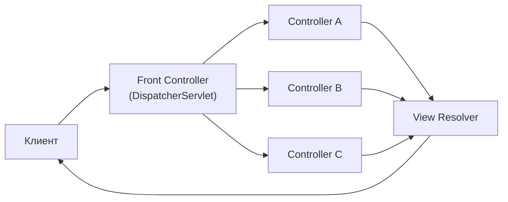
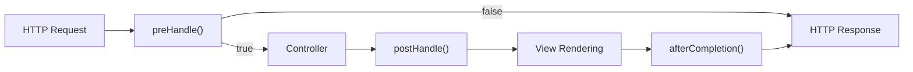
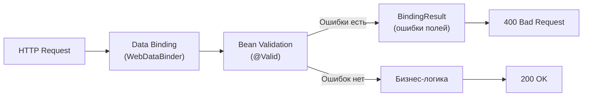
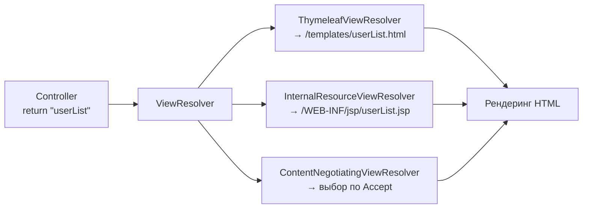
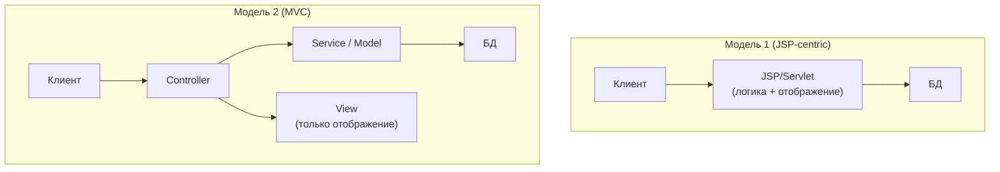
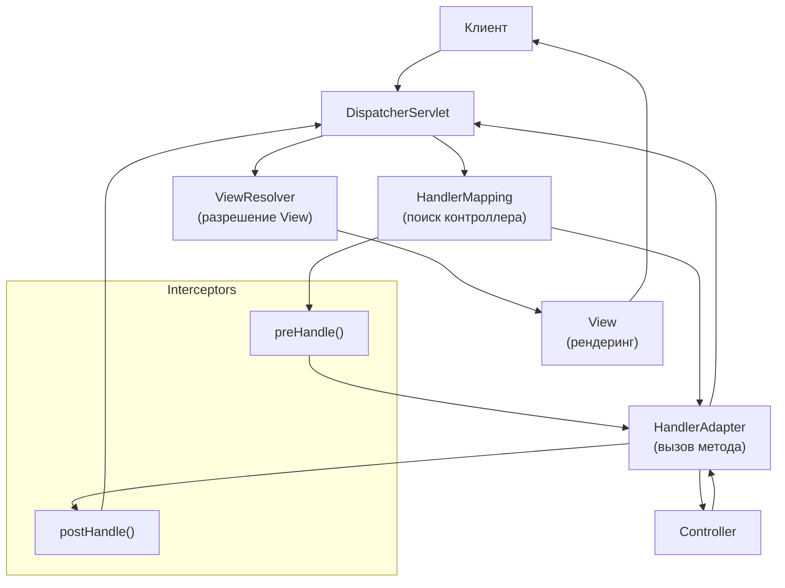
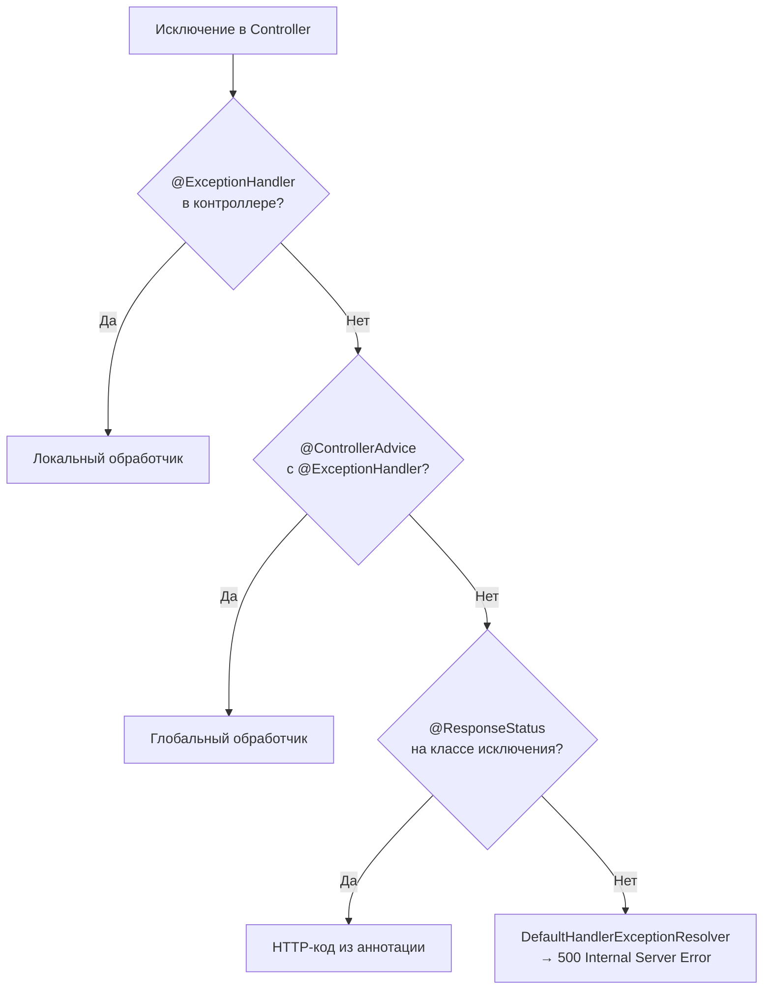
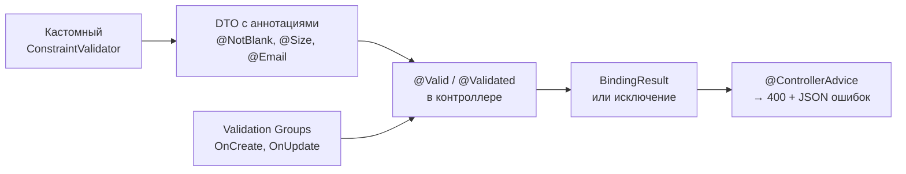
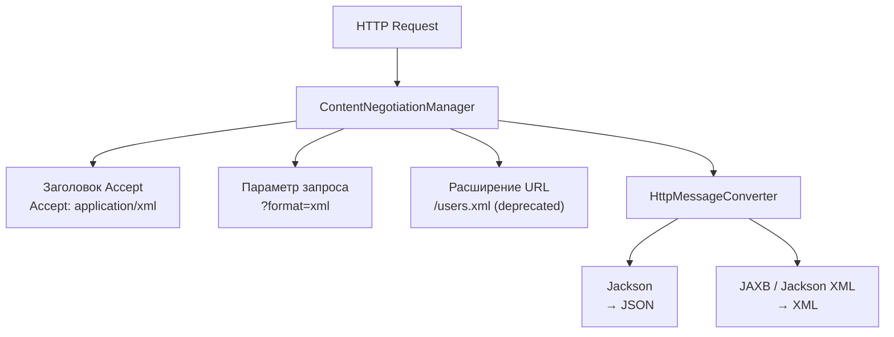
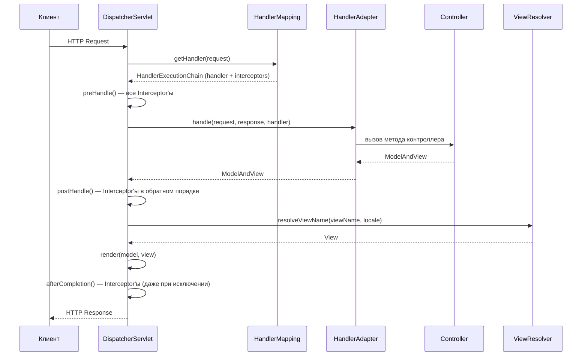

# Вопросы на собеседовании: `Spring MVC`

Краткое введение: **Spring MVC** — основа веб-слоя в `Spring Framework`. На собеседованиях часто спрашивают про `DispatcherServlet`, жизненный цикл запроса, контроллеры, обработку исключений, валидацию, `Content Negotiation`, `CORS` и тестирование с `MockMvc`. Понимание внутренней механики `Spring MVC` отличает сильного кандидата от поверхностного.

## Полезные ссылки

### Официальная документация

- [Spring MVC Documentation](https://docs.spring.io/spring-framework/reference/web/servlet.html) — основной справочник по веб-слою
- [Spring Boot Web](https://docs.spring.io/spring-boot/docs/current/reference/html/web.html) — автоконфигурация веб-приложений
- [Bean Validation (JSR 380)](https://beanvalidation.org/2.0/spec/) — спецификация валидации

### Baeldung

- [Spring MVC Tutorial](https://www.baeldung.com/spring-mvc-tutorial) — полный туториал по Spring MVC
- [An Intro to the Spring DispatcherServlet](https://www.baeldung.com/spring-dispatcherservlet) — архитектура и жизненный цикл запроса
- [Error Handling for REST with Spring](https://www.baeldung.com/exception-handling-for-rest-with-spring) — обработка исключений: @ExceptionHandler, @ControllerAdvice
- [Introduction to Spring MVC HandlerInterceptor](https://www.baeldung.com/spring-mvc-handlerinterceptor) — перехватчики запросов
- [Types of Spring HandlerAdapters](https://www.baeldung.com/spring-mvc-handler-adapters) — адаптеры обработчиков в DispatcherServlet
- [Custom Error Message Handling for REST API](https://www.baeldung.com/global-error-handler-in-a-spring-rest-api) — глобальная обработка ошибок

## Содержание

- [Полезные ссылки](#полезные-ссылки)
- [See also](#see-also)

**Основы Spring MVC**
- [Q1. (!) Что такое **Front Controller**?](#q1--что-такое-front-controller)
- [Q2. (!) Что такое `Spring MVC`?](#q2--что-такое-spring-mvc)
- [Q3. Как получить `ServletContext` и `ServletConfig` внутри бина?](#q3-как-получить-servletcontext-и-servletconfig-внутри-бина)
- [Q4. Что такое локализация?](#q4-что-такое-локализация)
- [Q5. (!) Что такое `Interceptor`?](#q5--что-такое-interceptor)

**Model и атрибуты**
- [Q6. Что такое `@ModelAttribute`?](#q6-что-такое-modelattribute)
- [Q7. В чём разница между `Model`, `ModelMap` и `ModelAndView`?](#q7-в-чём-разница-между-model-modelmap-и-modelandview)
- [Q8. В чем разница между `model.put()` и `model.addAttribute()`?](#q8-в-чем-разница-между-modelput-и-modeladdattribute)
- [Q9. Что такое связывание форм?](#q9-что-такое-связывание-форм)
- [Q10. Что такое `@PathVariable`?](#q10-что-такое-pathvariable)

**Валидация и Binding**
- [Q11. (!) Что такое `Validation`?](#q11--что-такое-validation)
- [Q12. (!) Что такое `BindingResult`?](#q12--что-такое-bindingresult)
- [Q13. Что такое аннотации `@RequestBody` и `@ResponseBody`?](#q13-что-такое-аннотации-requestbody-и-responsebody)
- [Q14. (!) В чём разница между `@Controller` и `@RestController`?](#q14--в-чём-разница-между-controller-и-restcontroller)
- [Q15. Что такое `@SessionAttributes` и `@SessionAttribute`?](#q15-что-такое-sessionattributes-и-sessionattribute)

**Конфигурация и View**
- [Q16. Что такое `@EnableWebMvc` и когда его включать?](#q16-что-такое-enablewebmvc-и-когда-его-включать)
- [Q17. (!) Что такое `ViewResolver` и зачем он нужен?](#q17--что-такое-viewresolver-и-зачем-он-нужен)
- [Q18. Что такое `POJO`?](#q18-что-такое-pojo)
- [Q19. Что такое архитектуры модели 1 и модели 2?](#q19-что-такое-архитектуры-модели-1-и-модели-2)
- [Q20. (!) Что такое `DispatcherServlet` и `ContextLoaderListener`?](#q20--что-такое-dispatcherservlet-и-contextloaderlistener)
- [Q21. Что такое `MultipartResolver`?](#q21-что-такое-multipartresolver)
- [Q22. Что такое `@InitBinder`?](#q22-что-такое-initbinder)

**Обработка исключений**
- [Q23. (!) Как происходит обработка исключений в веб-приложениях?](#q23--как-происходит-обработка-исключений-в-веб-приложениях)
- [Q24. (!) Что такое `@ExceptionHandler`?](#q24--что-такое-exceptionhandler)
- [Q25. (!) Что такое `@ControllerAdvice`?](#q25--что-такое-controlleradvice)

**Шаблоны и тестирование**
- [Q26. Как настроить шаблоны (`Thymeleaf`, `JSP`)?](#q26-как-настроить-шаблоны-thymeleaf-jsp)
- [Q27. (!) В чём разница между `@RequestBody` и `@RequestParam`?](#q27--в-чём-разница-между-requestbody-и-requestparam)
- [Q28. Как организовать валидацию входных данных?](#q28-как-организовать-валидацию-входных-данных)
- [Q29. Что такое `Content Negotiation` и как его настроить?](#q29-что-такое-content-negotiation-и-как-его-настроить)
- [Q30. Как тестировать контроллеры с помощью `MockMvc`?](#q30-как-тестировать-контроллеры-с-помощью-mockmvc)

**Продвинутые темы**
- [Q31. (!) Как устроен pipeline обработки запроса в `DispatcherServlet`?](#q31--как-устроен-pipeline-обработки-запроса-в-dispatcherservlet)
- [Q32. (!) Как настроить `@RequestMapping`: все варианты маппинга?](#q32--как-настроить-requestmapping-все-варианты-маппинга)
- [Q33. (!) Как работает `HandlerInterceptor` и чем отличается от `Filter`?](#q33--как-работает-handlerinterceptor-и-чем-отличается-от-filter)
- [Q34. Как обрабатывать загрузку файлов (`Multipart`) в `Spring MVC`?](#q34-как-обрабатывать-загрузку-файлов-multipart-в-spring-mvc)
- [Q35. (!) Как настроить `CORS` в `Spring MVC`?](#q35--как-настроить-cors-в-spring-mvc)
- [Q36. (!) Что такое `@ControllerAdvice` и как строить глобальную обработку ошибок?](#q36--что-такое-controlleradvice-и-как-строить-глобальную-обработку-ошибок)
- [Q37. Что такое `@ModelAttribute` на уровне метода и как он взаимодействует с моделью?](#q37-что-такое-modelattribute-на-уровне-метода-и-как-он-взаимодействует-с-моделью)

**Продвинутые темы Spring MVC**
- [Q38. (!) Как устроен lifecycle DispatcherServlet — инициализация и выбор HandlerMapping?](#q38--как-устроен-lifecycle-dispatcherservlet--инициализация-и-выбор-handlermapping)
- [Q39. (!) Как работают @RequestBody и @ResponseBody через цепочку HttpMessageConverter?](#q39--как-работают-requestbody-и-responsebody-через-цепочку-httpmessageconverter)
- [Q40. Как обрабатывать Multipart-запросы — @RequestPart, MultipartFile, ограничения?](#q40-как-обрабатывать-multipart-запросы--requestpart-multipartfile-ограничения)
- [Q41. (!) Как реализовать асинхронные запросы в Spring MVC — Callable, DeferredResult, @Async?](#q41--как-реализовать-асинхронные-запросы-в-spring-mvc--callable-deferredresult-async)
- [Q42. (!) Каков порядок применения ExceptionHandler — @ControllerAdvice vs локальный?](#q42--каков-порядок-применения-exceptionhandler--controlleradvice-vs-локальный)
- [Q43. (!) Когда переходить с Spring MVC на Spring WebFlux?](#q43--когда-переходить-с-spring-mvc-на-spring-webflux)

## Q1. (!) Что такое **Front Controller**?

**Front Controller** — паттерн с единой точкой входа: один компонент принимает все запросы, маршрутизирует их к нужным обработчикам и берёт на себя сквозную логику (безопасность, логирование, локализация). Без него каждый сервлет дублировал бы эту обвязку; с ним она лежит в одном месте.

В `Spring MVC` роль Front Controller играет `DispatcherServlet`. Получив HTTP-запрос, он находит подходящий контроллер через `HandlerMapping`, вызывает его через `HandlerAdapter`, а результат превращает в представление через `ViewResolver`.



**Что это даёт:** сквозная логика (аутентификация, CORS, логирование) и обработка ошибок описаны один раз, а не размазаны по обработчикам; маршрутизация единообразна. Тот же паттерн лежит в основе `Spring MVC`, `JSF`, `Struts`.

## Q2. (!) Что такое `Spring MVC`?

**Spring MVC** — веб-фреймворк поверх Servlet API, реализующий паттерн `Model-View-Controller` в [Spring Framework](spring-framework-interview.md). Три роли разделяют ответственность:

- **Model** — данные и бизнес-логика (сервисы, DTO, доменные объекты)
- **View** — отображение (`Thymeleaf`, `JSP`, `JSON` через `Jackson`)
- **Controller** — принимает запрос, вызывает сервисы, кладёт данные в модель и выбирает представление

Что фреймворк берёт на себя, чтобы не писать это руками:

- маршрутизацию по аннотациям (`@RequestMapping`)
- связывание данных запроса в Java-объекты (data binding)
- интеграцию с `Bean Validation`, Content Negotiation и гибкую обработку исключений
- доступ к `DI` и `AOP` контейнера `Spring`

В [Spring Boot](spring-boot-interview.md) весь веб-слой автоконфигурируется одной зависимостью `spring-boot-starter-web`.

## Q3. Как получить `ServletContext` и `ServletConfig` внутри бина?

Есть два способа, и оба дают те же экземпляры, что использует `DispatcherServlet`.

1. **Внедрение зависимостей** — объявить параметр конструктора (или поле с `@Autowired`) типа `ServletContext` / `ServletConfig`. Контейнер подставит нужный объект сам.

2. **Aware-интерфейсы** — реализовать `ServletContextAware` или `ServletConfigAware`. На этапе инициализации бина `Spring` вызовет `setServletContext()` / `setServletConfig()` и передаст объект.

```java
@Component
public class MyComponent implements ServletContextAware {
    private ServletContext servletContext;

    @Override
    public void setServletContext(ServletContext servletContext) {
        this.servletContext = servletContext;
    }
}
```

**Рекомендация:** на практике предпочтителен первый способ — меньше кода и явная зависимость в сигнатуре. `Aware`-интерфейсы оставляют для совместимости со старым кодом без аннотаций.

## Q4. Что такое локализация?

Локализация (i18n) — адаптация приложения к языку и региону пользователя: тексты, форматы дат и чисел подбираются под его локаль. В `Spring MVC` это собирается из четырёх частей, которые работают вместе:

- **Файлы ресурсов** — `messages_en.properties`, `messages_ru.properties` и т.д.: один ключ — разные переводы по файлам
- **MessageSource** — бин, который по ключу и локали достаёт нужную строку
- **LocaleResolver** — определяет текущую локаль (из `Accept-Language`, cookie или сессии)
- **LocaleChangeInterceptor** — позволяет переключать локаль параметром запроса (`?lang=ru`)

```java
@Configuration
public class LocaleConfig implements WebMvcConfigurer {
    @Bean
    public LocaleResolver localeResolver() {
        var resolver = new SessionLocaleResolver();
        resolver.setDefaultLocale(Locale.forLanguageTag("ru"));
        return resolver;
    }

    @Override
    public void addInterceptors(InterceptorRegistry registry) {
        var interceptor = new LocaleChangeInterceptor();
        interceptor.setParamName("lang");
        registry.addInterceptor(interceptor);
    }
}
```

В шаблонах `Thymeleaf` обращаются к ключу: `th:text="#{welcome.message}"` — `Spring` сам подставит строку из файла ресурсов для текущей локали.

## Q5. (!) Что такое `Interceptor`?

**HandlerInterceptor** — перехватчик, который вклинивается до и после контроллера и выполняет сквозную логику (логирование, аутентификация, метрики), не засоряя ей сами контроллеры. У него три точки подключения по ходу запроса:

- `preHandle()` — до вызова контроллера; возвращает `boolean`: `true` — продолжить, `false` — прервать цепочку
- `postHandle()` — после контроллера, но до рендеринга `View` (можно дополнить модель)
- `afterCompletion()` — после полного завершения запроса, включая рендеринг (место для очистки ресурсов и замеров)



Регистрация через `WebMvcConfigurer`:

```java
@Configuration
public class WebConfig implements WebMvcConfigurer {
    @Override
    public void addInterceptors(InterceptorRegistry registry) {
        registry.addInterceptor(new LoggingInterceptor())
                .addPathPatterns("/api/**")
                .excludePathPatterns("/api/health")
                .order(1);
    }
}
```

**Отличие от Servlet `Filter`:** интерцептор работает уже внутри `Spring MVC` и видит выбранный `HandlerMethod` (контроллер), а фильтр стоит раньше, на уровне сервлет-контейнера, и срабатывает ещё до `DispatcherServlet` — про контроллер он ничего не знает. Подробнее о фильтрах и безопасности — в [Spring Security](spring-security-interview.md).

## Q6. Что такое `@ModelAttribute`?

`@ModelAttribute` работает по-разному в зависимости от того, где стоит — на параметре или на методе.

**На параметре метода** — `Spring` создаёт объект и заполняет его поля параметрами запроса (сопоставляя по именам и вызывая сеттеры):

```java
@PostMapping("/register")
public String register(@ModelAttribute("user") User user) {
    // user заполнен из параметров формы
    return "success";
}
```

**На методе** — такой метод вызывается перед каждым обработчиком контроллера, а его результат попадает в модель (удобно для данных, нужных всем View — справочников, текущего пользователя):

```java
@ModelAttribute("categories")
public List<Category> populateCategories() {
    return categoryService.findAll(); // доступно во всех View контроллера
}
```

**Что происходит под капотом** на параметре: `Spring` создаёт объект → привязывает данные запроса через `WebDataBinder` → валидирует (если стоит `@Valid`) → кладёт в модель. На этом и держится форм-биндинг в `Spring MVC`.

## Q7. В чём разница между `Model`, `ModelMap` и `ModelAndView`?

Все три переносят данные в представление, но различаются ролью: первые два — только контейнеры модели, третий держит ещё и имя View.

| Тип | Что это | Типичное использование |
|-----|----------|----------------------|
| `Model` | Интерфейс с методами `addAttribute()` | Параметр метода контроллера |
| `ModelMap` | Класс, реализует `Map` + `Model` | Когда нужны map-операции (`get`, `remove`) |
| `ModelAndView` | Объект, объединяющий модель и имя View | Возврат из метода контроллера |

```java
// Model — самый частый подход
@GetMapping("/users")
public String list(Model model) {
    model.addAttribute("users", userService.findAll());
    return "userList";
}

// ModelAndView — данные + представление в одном объекте
@GetMapping("/users")
public ModelAndView list() {
    return new ModelAndView("userList", "users", userService.findAll());
}
```

**Рекомендация:** в большинстве случаев берите `Model` как параметр метода — это самый чистый вариант. `ModelAndView` уместен, когда имя View выбирается условно прямо внутри метода и удобно вернуть данные и представление одним объектом.

## Q8. В чем разница между `model.put()` и `model.addAttribute()`?

Оба кладут атрибут в модель, но `addAttribute()` строже и удобнее, потому что приходит из API самого `Spring`, а не из голого `Map`:

- **`put(key, value)`** — метод интерфейса `Map`; примет любой ключ, включая `null` (а `null`-ключ в модели — это скрытый баг)
- **`addAttribute(name, value)`** — метод интерфейса `Model`: бросает исключение на `null`-ключе, возвращает сам `Model` (можно строить цепочку вызовов), а перегрузка `addAttribute(value)` сама придумывает имя по типу объекта

```java
model.addAttribute("user", user)
     .addAttribute("roles", roles); // chaining

model.put("user", user); // без chaining
```

**Рекомендация:** используйте `addAttribute()` — он защищает от `null`-ключей и даёт fluent-интерфейс.

## Q9. Что такое связывание форм?

Связывание форм (form binding) — автоматическое заполнение Java-объекта данными из HTML-формы, без ручного разбора параметров запроса. `Spring MVC` сопоставляет имена полей формы с полями объекта и проставляет значения через `WebDataBinder` (с конвертацией типов — строка из формы в `int`, `LocalDate` и т.д.).

```java
@PostMapping("/register")
public String register(@ModelAttribute("user") @Valid User user,
                        BindingResult result) {
    if (result.hasErrors()) {
        return "registrationForm";
    }
    userService.save(user);
    return "redirect:/success";
}
```

```html
<form th:action="@{/register}" th:object="${user}" method="post">
    <input type="text" th:field="*{name}" />
    <span th:if="${#fields.hasErrors('name')}" th:errors="*{name}"></span>
    <button type="submit">Зарегистрироваться</button>
</form>
```

**Подводный камень (безопасность):** биндер заполнит любое поле, чьё имя пришло в запросе, — даже скрытое от формы (например, `role` или `isAdmin`). Это уязвимость mass assignment. Защита — явный белый список полей через `@InitBinder` + `setAllowedFields()`.

## Q10. Что такое `@PathVariable`?

`@PathVariable` достаёт значение из сегмента URI (часть пути в фигурных скобках шаблона) и подставляет в параметр метода — так читают идентификаторы из ЧПУ-адресов вроде `/users/42`:

```java
@GetMapping("/users/{id}")
public User getUser(@PathVariable Long id) {
    return userService.findById(id);
}

// Несколько переменных
@GetMapping("/users/{userId}/orders/{orderId}")
public Order getOrder(@PathVariable Long userId,
                      @PathVariable Long orderId) {
    return orderService.find(userId, orderId);
}

// Все переменные в Map
@GetMapping("/users/{userId}/orders/{orderId}")
public Order getOrder(@PathVariable Map<String, String> vars) {
    Long userId = Long.parseLong(vars.get("userId"));
    Long orderId = Long.parseLong(vars.get("orderId"));
    return orderService.find(userId, orderId);
}
```

**Нюансы:**
- Если имя переменной в шаблоне совпадает с именем параметра метода, `value` можно не указывать (имена в `.class` сохраняются при компиляции с `-parameters`, что в `Spring Boot` включено по умолчанию).
- `@PathVariable(required = false)` делает переменную необязательной — тогда тип параметра должен быть `Optional` или nullable.

## Q11. (!) Что такое `Validation`?

Валидация в `Spring MVC` строится на декларативном **Bean Validation** (`JSR 380`, реализация — `Hibernate Validator`): правила описывают аннотациями на полях DTO, а не пишут проверки руками в контроллере. Чтобы `Spring` запустил проверку, аргумент в контроллере помечают `@Valid`:



```java
public record UserCreateDto(
    @NotBlank(message = "Имя обязательно")
    String name,

    @Email(message = "Некорректный email")
    @NotBlank
    String email,

    @Size(min = 8, max = 100, message = "Пароль от 8 до 100 символов")
    String password
) {}
```

**Что делать, когда встроенных аннотаций не хватает:**
- **Своё правило** — собственная аннотация + `ConstraintValidator` с логикой проверки.
- **Разные правила для разных операций** (создание vs обновление) — группы валидации и `@Validated(OnCreate.class)` вместо `@Valid`.

Подробнее о паттернах валидации — в [Spring Boot](spring-boot-interview.md).

## Q12. (!) Что такое `BindingResult`?

**BindingResult** — объект, в который `Spring` складывает ошибки привязки данных и валидации, чтобы контроллер сам решил, что с ними делать, вместо немедленного исключения. Критично: он обязан стоять в сигнатуре **сразу после** проверяемого аргумента — `Spring` связывает их по позиции:

```java
@PostMapping("/users")
public String createUser(@Valid @ModelAttribute User user,
                          BindingResult result,  // сразу после @Valid аргумента!
                          Model model) {
    if (result.hasErrors()) {
        // result.getFieldErrors() — список ошибок по полям
        // result.getGlobalErrors() — ошибки уровня объекта
        return "userForm";
    }
    userService.save(user);
    return "redirect:/users";
}
```

**Развилка поведения при провале валидации:**
- **`BindingResult` объявлен** — исключения нет, ошибки лежат в нём, контроллер обрабатывает их сам (типично для форм: вернуть ту же страницу с подсветкой полей).
- **`BindingResult` не объявлен** — `Spring` бросает исключение: `MethodArgumentNotValidException` для `@RequestBody` или `BindException` для `@ModelAttribute`. Его ловит `@ControllerAdvice` (типично для REST: единый JSON-ответ об ошибке).

## Q13. Что такое аннотации `@RequestBody` и `@ResponseBody`?

Эта пара отвечает за две стороны работы с телом HTTP: `@RequestBody` — на входе, `@ResponseBody` — на выходе, и обе используют `HttpMessageConverter`.

**`@RequestBody`** — десериализует тело HTTP-запроса в Java-объект. `Spring` подбирает `HttpMessageConverter` по `Content-Type` (например, `MappingJackson2HttpMessageConverter` для `JSON/XML`):

```java
@PostMapping("/users")
public User create(@RequestBody UserCreateDto dto) {
    return userService.create(dto);
}
```

**`@ResponseBody`** — говорит `Spring`, что возвращаемое значение надо записать прямо в тело ответа, а не трактовать как имя View. Объект сериализуется через `HttpMessageConverter` (формат выбирается по `Accept`):

```java
@GetMapping("/users/{id}")
@ResponseBody
public User getUser(@PathVariable Long id) {
    return userService.findById(id);
}
```

`@RestController` = `@Controller` + `@ResponseBody` на уровне класса, поэтому в REST-контроллерах `@ResponseBody` писать не нужно.

## Q14. (!) В чём разница между `@Controller` и `@RestController`?

Главное отличие в одном: `@RestController` = `@Controller` + `@ResponseBody` на уровне класса. Из этого вытекает всё остальное — что возвращает метод и участвует ли `ViewResolver`.

| Аспект | `@Controller` | `@RestController` |
|--------|---------------|-------------------|
| Что возвращает метод | Имя View (строка) | Объект → сериализуется в JSON/XML |
| `@ResponseBody` | Нужен явно на каждом методе | Включён автоматически на классе |
| Типичное применение | Веб-страницы (Thymeleaf, JSP) | REST API |
| ViewResolver | Участвует | Не участвует |

```java
// Для веб-страниц
@Controller
public class PageController {
    @GetMapping("/home")
    public String home(Model model) {
        model.addAttribute("title", "Главная");
        return "home"; // → ViewResolver → home.html
    }
}

// Для REST API
@RestController
@RequestMapping("/api/users")
public class UserController {
    @GetMapping("/{id}")
    public User getUser(@PathVariable Long id) {
        return userService.findById(id); // → Jackson → JSON
    }
}
```

В одном `@Controller` можно комбинировать: часть методов возвращает View, а часть — с `@ResponseBody` отдаёт JSON. Но на практике смешивать не рекомендуется — лучше разделять по классам.

## Q15. Что такое `@SessionAttributes` и `@SessionAttribute`?

Имена похожи, но это две разные аннотации: одна (множественное число) управляет сессией, другая — читает из неё.

**`@SessionAttributes`** (на классе контроллера) — переносит указанные атрибуты модели в HTTP-сессию, чтобы они переживали между запросами. Классический сценарий — многошаговый wizard, где форма заполняется по частям:

```java
@Controller
@SessionAttributes("wizard")
public class WizardController {

    @ModelAttribute("wizard")
    public WizardForm initWizard() {
        return new WizardForm(); // создаётся один раз, живёт в сессии
    }

    @PostMapping("/step1")
    public String step1(@ModelAttribute("wizard") WizardForm form) {
        return "step2";
    }

    @PostMapping("/complete")
    public String complete(SessionStatus status) {
        status.setComplete(); // очищает сессионные атрибуты
        return "redirect:/done";
    }
}
```

**`@SessionAttribute`** (на параметре метода) — просто читает уже лежащий в сессии атрибут (положенный, например, фильтром или другим контроллером):

```java
@GetMapping("/dashboard")
public String dashboard(@SessionAttribute("user") User currentUser) {
    // атрибут уже в сессии (положен ранее)
}
```

**Итог:** `@SessionAttributes` управляет жизненным циклом атрибутов модели в рамках контроллера (положить и потом очистить через `SessionStatus`); `@SessionAttribute` только читает готовый атрибут из `HttpSession`.

## Q16. Что такое `@EnableWebMvc` и когда его включать?

`@EnableWebMvc` включает полную программную конфигурацию `Spring MVC` через Java-конфиг (аналог `<mvc:annotation-driven/>` из XML): регистрирует `HandlerMapping`, `HandlerAdapter`, набор `HttpMessageConverter`'ов, валидаторы и форматтеры. Главный нюанс собеседования — в `Spring Boot` эта аннотация чаще вредит, чем помогает.

**Когда использовать:**
- В приложениях без `Spring Boot`, где автоконфигурации нет вовсе
- Когда нужен полный ручной контроль над всей MVC-инфраструктурой

**Когда НЕ использовать (важно):**
- В `Spring Boot` — автоконфигурация уже всё настроила. `@EnableWebMvc` **полностью отключает** `WebMvcAutoConfiguration`, и вы теряете её дефолты (настроенный Jackson, отдачу статических ресурсов, обработку ошибок). То есть берёте на себя всю конфигурацию вручную, обычно не желая этого.

**Рекомендация для Spring Boot:** для точечной настройки реализуйте `WebMvcConfigurer` без `@EnableWebMvc` — так вы дополняете автоконфигурацию, а не отключаете её:

```java
@Configuration
public class WebConfig implements WebMvcConfigurer {
    @Override
    public void addCorsMappings(CorsRegistry registry) {
        registry.addMapping("/api/**").allowedOrigins("https://example.com");
    }
}
```

## Q17. (!) Что такое `ViewResolver` и зачем он нужен?

**ViewResolver** — компонент, который превращает логическое имя представления (строку из контроллера, например `"userList"`) в конкретный объект `View` для рендеринга. Благодаря этому контроллер не знает ни о пути к шаблону, ни о технологии отображения — он лишь называет View, а способ его найти и отрисовать остаётся за резолвером.



Основные реализации:

| ViewResolver | Назначение |
|-------------|-----------|
| `ThymeleafViewResolver` | Шаблоны Thymeleaf |
| `InternalResourceViewResolver` | JSP-страницы |
| `ContentNegotiatingViewResolver` | Делегирует другим резолверам по `Accept` |
| `BeanNameViewResolver` | Ищет бин с именем View |

В чисто REST-приложениях с `@RestController` `ViewResolver` не участвует — ответ формируется через `HttpMessageConverter` (например, `Jackson` для JSON). Подробнее о Content Negotiation — в Q29.

## Q18. Что такое `POJO`?

**POJO** (Plain Old Java Object) — обычный Java-объект, не привязанный к фреймворку: не наследует специальных классов, не реализует обязательных интерфейсов, ничего не знает о контейнере. Смысл термина — отделить бизнес-объект от инфраструктуры, чтобы его легко создавать и тестировать без поднятия `Spring`.

В контексте `Spring MVC` POJO выступает в двух ролях:
- **Command Object / Backing Object** — объект, в который `Spring` привязывает данные формы через `@ModelAttribute`
- **DTO** — объект передачи данных между слоями

```java
// POJO — нет зависимостей от Spring
public class UserForm {
    private String name;
    private String email;
    // getters, setters
}
```

Философия `Spring` — контроллеры и сервисы тоже по возможности должны оставаться POJO: бизнес-логика не зависит от `javax.servlet.*`, что упрощает тестирование (см. [модульное тестирование](../../testing/unit-testing-interview.md)).

## Q19. Что такое архитектуры модели 1 и модели 2?

Это два исторических подхода к архитектуре веб-приложений на Java; разница — в том, где живёт логика.

**Модель 1** — запрос обрабатывается прямо в `JSP`/сервлете, где бизнес-логика и отображение перемешаны в одном файле. Быстро стартует на простых страницах, но с ростом проекта превращается в кашу и плохо тестируется.

**Модель 2** — собственно паттерн `MVC`: логика, данные и представление разнесены по контроллеру, модели и View.



`Spring MVC` — это модель 2. Разделение ответственности окупается на практике: слои тестируются независимо, бизнес-логика переиспользуется разными контроллерами, а View-технологию (JSP → Thymeleaf → JSON) можно заменить, не трогая контроллеры.

## Q20. (!) Что такое `DispatcherServlet` и `ContextLoaderListener`?

Это две разные сущности из устройства `Spring MVC`: `DispatcherServlet` обрабатывает запросы, `ContextLoaderListener` поднимает контекст приложения при старте.

**DispatcherServlet** — центральный сервлет `Spring MVC` и воплощение паттерна Front Controller. Он дирижирует всем циклом обработки запроса, делегируя шаги специализированным компонентам:



**ContextLoaderListener** — при старте создаёт **корневой** `ApplicationContext` с общими бинами (сервисы, репозитории, инфраструктура). `DispatcherServlet` поверх него заводит свой **дочерний** контекст веб-слоя (контроллеры, `ViewResolver`, `HandlerMapping`). Иерархия односторонняя: бины веб-слоя видят корневые, но не наоборот — поэтому сервисы не зависят от веб-обвязки.

**В Spring Boot** этого разделения не видно: используется один контекст, а `DispatcherServlet` регистрируется автоматически через `DispatcherServletAutoConfiguration`.

## Q21. Что такое `MultipartResolver`?

**MultipartResolver** — стратегия разбора multipart-запросов (`multipart/form-data`, то есть загрузка файлов). Он распознаёт такой запрос и оборачивает его так, чтобы части были доступны как `MultipartFile`. Две реализации:

- **`StandardServletMultipartResolver`** — поверх Servlet 3.0+ API; дефолт в `Spring Boot`, без внешних зависимостей
- **`CommonsMultipartResolver`** — поверх Apache Commons FileUpload (нужен для старых контейнеров)

```java
@PostMapping("/upload")
public String upload(@RequestParam("file") MultipartFile file) {
    String name = file.getOriginalFilename();
    long size = file.getSize();
    // file.transferTo(Path.of("/uploads/" + name));
    return "uploaded";
}
```

Настройка лимитов в `application.yml`:

```yaml
spring:
  servlet:
    multipart:
      max-file-size: 10MB
      max-request-size: 50MB
```

**Граничный случай:** при превышении лимита `Spring` бросает `MaxUploadSizeExceededException` — перехватите его в `@ControllerAdvice` и верните понятный `413 Payload Too Large`, иначе клиент получит сырую 500-ю.

## Q22. Что такое `@InitBinder`?

Метод с `@InitBinder` вызывается перед каждым запросом контроллера и настраивает `WebDataBinder` — компонент, который привязывает данные запроса к объектам. Через него управляют тремя вещами: какие поля разрешены (защита от mass assignment), как конвертировать типы и какие валидаторы применять:

```java
@Controller
public class UserController {

    @InitBinder
    public void initBinder(WebDataBinder binder) {
        // Защита от mass assignment — разрешаем только нужные поля
        binder.setAllowedFields("name", "email");

        // Регистрация кастомного форматтера
        binder.registerCustomEditor(Date.class,
            new CustomDateEditor(new SimpleDateFormat("yyyy-MM-dd"), true));

        // Регистрация валидатора
        binder.addValidators(new UserValidator());
    }

    @InitBinder("order") // только для аргумента с именем "order"
    public void initOrderBinder(WebDataBinder binder) {
        binder.setDisallowedFields("id");
    }
}
```

**Область действия:** `@InitBinder` без `value` применяется ко всем привязываемым аргументам контроллера; с `value("order")` — только к аргументу с именем `order`.

## Q23. (!) Как происходит обработка исключений в веб-приложениях?

`Spring MVC` ищет обработчик исключения сверху вниз по трём уровням и останавливается на первом подходящем. Если не нашёл ни одного — отдаёт `500`.



1. **`@ResponseStatus` на классе исключения** — самый простой вариант: `Spring` сам вернёт указанный HTTP-код, без отдельного обработчика. Подходит, когда тело ответа не важно:
```java
@ResponseStatus(HttpStatus.NOT_FOUND)
public class ResourceNotFoundException extends RuntimeException { }
```

2. **`@ExceptionHandler` в контроллере** — обработчик с собственной логикой, но только для одного контроллера.

3. **`@ControllerAdvice` + `@ExceptionHandler`** — глобальный обработчик для всех контроллеров. Самый распространённый подход: вся обработка ошибок в одном месте.

**Рекомендация:** в REST API берут `@RestControllerAdvice` (= `@ControllerAdvice` + `@ResponseBody`) и отдают единый формат ответа об ошибке — стандарт RFC 7807 Problem Details, чтобы клиенты парсили ошибки одинаково.

## Q24. (!) Что такое `@ExceptionHandler`?

`@ExceptionHandler` помечает метод, который `Spring` вызывает вместо контроллера, когда из обработки запроса вылетает указанное исключение — так ошибка превращается в осмысленный HTTP-ответ. Метод волен вернуть `ResponseEntity`, имя View или объект (в `@RestController` — он уйдёт в тело как JSON):

```java
@RestControllerAdvice
public class GlobalExceptionHandler {

    @ExceptionHandler(ResourceNotFoundException.class)
    @ResponseStatus(HttpStatus.NOT_FOUND)
    public ProblemDetail handleNotFound(ResourceNotFoundException ex) {
        ProblemDetail pd = ProblemDetail.forStatus(HttpStatus.NOT_FOUND);
        pd.setTitle("Ресурс не найден");
        pd.setDetail(ex.getMessage());
        return pd;
    }

    @ExceptionHandler(MethodArgumentNotValidException.class)
    @ResponseStatus(HttpStatus.BAD_REQUEST)
    public ProblemDetail handleValidation(MethodArgumentNotValidException ex) {
        ProblemDetail pd = ProblemDetail.forStatus(HttpStatus.BAD_REQUEST);
        pd.setTitle("Ошибка валидации");
        Map<String, String> errors = ex.getBindingResult().getFieldErrors().stream()
            .collect(Collectors.toMap(
                FieldError::getField, FieldError::getDefaultMessage));
        pd.setProperty("errors", errors);
        return pd;
    }
}
```

`ProblemDetail` (Spring 6+) — встроенная реализация RFC 7807, стандартного формата ответов об ошибках в REST API (поля `type`, `title`, `status`, `detail` + произвольные свойства).

**Подводный камень:** в одном `@ControllerAdvice` нельзя объявить два обработчика для одного и того же типа исключения — `Spring` не поймёт, какой выбрать.

## Q25. (!) Что такое `@ControllerAdvice`?

`@ControllerAdvice` помечает класс-«советник», чьи методы применяются сразу ко всем (или к выбранным) контроллерам — это способ вынести общую обвязку из контроллеров в одно место. В нём бывает три типа методов:

- **`@ExceptionHandler`** — глобальная обработка исключений
- **`@ModelAttribute`** — общие атрибуты модели для всех View
- **`@InitBinder`** — глобальная настройка привязки данных

```java
@ControllerAdvice(basePackages = "com.example.api")
public class ApiAdvice {

    @ModelAttribute("apiVersion")
    public String apiVersion() {
        return "v2";
    }

    @InitBinder
    public void initBinder(WebDataBinder binder) {
        binder.registerCustomEditor(Date.class,
            new CustomDateEditor(new SimpleDateFormat("yyyy-MM-dd"), true));
    }
}
```

**Сужение области:** если совет нужен не всем контроллерам, ограничьте его через `basePackages`, `basePackageClasses`, `assignableTypes` или `annotations`. Для REST API берут `@RestControllerAdvice` (= `@ControllerAdvice` + `@ResponseBody`), чтобы ответы сразу шли в тело как JSON.

## Q26. Как настроить шаблоны (`Thymeleaf`, `JSP`)?

Самый частый случай — `Thymeleaf` в `Spring Boot`: достаточно добавить зависимость `spring-boot-starter-thymeleaf`, и автоконфигурация сама настроит `ThymeleafViewResolver` с разумными дефолтами. Менять обычно нужно лишь несколько свойств:

```yaml
spring:
  thymeleaf:
    prefix: classpath:/templates/   # где искать шаблоны
    suffix: .html                    # расширение
    cache: false                     # отключить для разработки
```

Для `JSP` (не рекомендуется в новых проектах):

```yaml
spring:
  mvc:
    view:
      prefix: /WEB-INF/jsp/
      suffix: .jsp
```

**Как это связывается:** контроллер возвращает короткое имя (`return "userList"`), а `ViewResolver` достраивает путь префиксом и суффиксом → `/templates/userList.html`. В чисто REST-приложениях с `@RestController` шаблонов нет вовсе — ответ собирает `HttpMessageConverter` (JSON/XML).

**Рекомендация:** для серверного рендеринга сегодня стандарт — `Thymeleaf` (layout-фрагменты, интеграция с [Spring Security](spring-security-interview.md), валидный HTML, открывающийся в браузере как обычный файл). `JSP` в новых проектах не берут.

## Q27. (!) В чём разница между `@RequestBody` и `@RequestParam`?

Все три достают данные из запроса, но из разных его частей — выбор зависит от того, где лежит значение. Удобно держать рядом и `@PathVariable`:

| Аспект | `@RequestBody` | `@RequestParam` | `@PathVariable` |
|--------|---------------|-----------------|-----------------|
| Источник данных | Тело запроса | Query- или form-параметры | Сегмент URL |
| Типичный метод | POST, PUT | GET, POST (form) | GET, DELETE |
| Маппинг | JSON → объект | `?key=value` → параметр | `/path/{id}` → параметр |
| Количество | Одно тело на запрос | Много параметров | Много переменных |

```java
// @RequestBody — тело запроса (JSON)
@PostMapping("/users")
public User create(@RequestBody @Valid UserCreateDto dto) { ... }

// @RequestParam — параметры запроса
@GetMapping("/users")
public Page<User> search(@RequestParam(defaultValue = "") String name,
                          @RequestParam(defaultValue = "0") int page) { ... }

// @PathVariable — часть URL
@DeleteMapping("/users/{id}")
public void delete(@PathVariable Long id) { ... }
```

Для подробностей о [HTTP и REST](../../api/http-rest-interview.md) — смотрите соответствующий раздел.

## Q28. Как организовать валидацию входных данных?

Идея — описать правила декларативно на DTO и обрабатывать нарушения в одном месте, а не проверять поля вручную в каждом контроллере. Полная цепочка такая: ограничения на DTO → `@Valid` в контроллере → ошибки → единый обработчик, который превращает их в `400` с понятным JSON.



```java
// 1. DTO с ограничениями
public record UserCreateDto(
    @NotBlank String name,
    @Email @NotBlank String email,
    @Size(min = 8) String password
) {}

// 2. Контроллер с @Valid
@PostMapping("/users")
public ResponseEntity<User> create(@Valid @RequestBody UserCreateDto dto) {
    return ResponseEntity.status(201).body(userService.create(dto));
}

// 3. Глобальный обработчик ошибок валидации
@RestControllerAdvice
public class ValidationAdvice {
    @ExceptionHandler(MethodArgumentNotValidException.class)
    public ResponseEntity<Map<String, String>> handleValidation(
            MethodArgumentNotValidException ex) {
        Map<String, String> errors = ex.getBindingResult().getFieldErrors().stream()
            .collect(Collectors.toMap(
                FieldError::getField, FieldError::getDefaultMessage));
        return ResponseEntity.badRequest().body(errors);
    }
}
```

**Когда стандартных аннотаций мало:**
- **Своё правило** — собственная аннотация + `ConstraintValidator` (например, проверка уникальности email в БД).
- **Разные правила для создания и обновления** — группы валидации и `@Validated(OnCreate.class)`.

## Q29. Что такое `Content Negotiation` и как его настроить?

**Content Negotiation** — механизм, которым `Spring` выбирает формат ответа (JSON, XML, HTML) под конкретного клиента: один и тот же контроллер может отдать JSON браузеру и XML интеграции, не дублируя код. Формат определяется по одной из стратегий (по убыванию предпочтительности):



Настройка через `WebMvcConfigurer`:

```java
@Configuration
public class WebConfig implements WebMvcConfigurer {
    @Override
    public void configureContentNegotiation(ContentNegotiationConfigurer configurer) {
        configurer
            .favorParameter(true)        // разрешить ?format=xml
            .parameterName("format")
            .defaultContentType(MediaType.APPLICATION_JSON)
            .mediaType("json", MediaType.APPLICATION_JSON)
            .mediaType("xml", MediaType.APPLICATION_XML);
    }
}
```

**По умолчанию** `Spring Boot` ориентируется на заголовок `Accept` — это «правильный» HTTP-способ. JSON работает из коробки (Jackson на classpath), а для XML нужно добавить зависимость `jackson-dataformat-xml`.

## Q30. Как тестировать контроллеры с помощью `MockMvc`?

**MockMvc** прогоняет запросы через настоящий `DispatcherServlet`, но без поднятия HTTP-сервера и сети. За счёт этого проверяется весь веб-слой (маршрутизация, биндинг, валидация, сериализация, обработка ошибок), а тесты остаются быстрыми и детерминированными.

```java
@WebMvcTest(UserController.class) // поднимает только веб-слой
class UserControllerTest {

    @Autowired
    private MockMvc mockMvc;

    @MockBean
    private UserService userService;

    @Test
    void shouldReturnUser() throws Exception {
        when(userService.findById(1L))
            .thenReturn(Optional.of(new User(1L, "John", "john@mail.com")));

        mockMvc.perform(get("/api/users/1")
                .accept(MediaType.APPLICATION_JSON))
            .andExpect(status().isOk())
            .andExpect(jsonPath("$.name").value("John"))
            .andExpect(jsonPath("$.email").value("john@mail.com"));
    }

    @Test
    void shouldReturn400OnInvalidInput() throws Exception {
        String invalidJson = """
            {"name": "", "email": "not-an-email"}
            """;

        mockMvc.perform(post("/api/users")
                .contentType(MediaType.APPLICATION_JSON)
                .content(invalidJson))
            .andExpect(status().isBadRequest())
            .andExpect(jsonPath("$.errors.name").exists());
    }
}
```

**Два режима запуска:**
- `@WebMvcTest` — тонкий срез: поднимает только веб-слой (контроллер, фильтры, `ControllerAdvice`), сервисы подменяются `@MockBean`. Быстрее, изолирует контроллер от БД и бизнес-логики.
- `@SpringBootTest` + `@AutoConfigureMockMvc` — полный контекст приложения с `MockMvc`. Медленнее, но ближе к боевому поведению.

**Полезное:** `@WithMockUser` — тесты с [аутентификацией](spring-security-interview.md). Подробнее — [модульное тестирование](../../testing/unit-testing-interview.md) и [интеграционное тестирование](../../testing/integration-testing-interview.md).

## Q31. (!) Как устроен pipeline обработки запроса в `DispatcherServlet`?

`DispatcherServlet` гоняет каждый HTTP-запрос через одну и ту же фиксированную цепочку: найти обработчик → пропустить через интерцепторы → вызвать контроллер → разрешить и отрендерить View. Каждый шаг делегируется отдельному компоненту, что и делает фреймворк расширяемым.



**Ключевые компоненты:**

| Компонент | Роль |
|-----------|-----|
| `HandlerMapping` | Сопоставляет URL с handler-методом |
| `HandlerAdapter` | Адаптирует разные типы handler'ов (аннотации, `HttpRequestHandler`) |
| `HandlerExceptionResolver` | Обрабатывает исключения из handler'а |
| `ViewResolver` | Преобразует имя view в объект `View` |
| `LocaleResolver` | Определяет локаль запроса |
| `MultipartResolver` | Разбирает multipart-запросы |

**Важный нюанс:** при `@ResponseBody` (и значит во всём `@RestController`) шаг с `ViewResolver` выпадает — `HandlerAdapter` сразу пишет тело ответа через `HttpMessageConverter`, минуя рендеринг View.

## Q32. (!) Как настроить `@RequestMapping`: все варианты маппинга?

`@RequestMapping` сопоставляет запрос с методом не только по URL: в условие можно добавить HTTP-метод, типы данных (`consumes`/`produces`), параметры и заголовки. На уровне класса задают общий префикс пути, на методах — специализированные шорткаты (`@GetMapping`, `@PostMapping` и т.д.). Ниже — все практические варианты в одном контроллере:

```java
@RestController
@RequestMapping("/api/v1/users")   // базовый путь для всех методов класса
public class UserController {

    // GET /api/v1/users
    @GetMapping
    public List<UserDto> getAll() { /* ... */ }

    // GET /api/v1/users/42
    @GetMapping("/{id}")
    public UserDto getById(@PathVariable Long id) { /* ... */ }

    // POST /api/v1/users
    // Принимает только application/json
    // Отвечает только application/json
    @PostMapping(consumes = MediaType.APPLICATION_JSON_VALUE,
                 produces = MediaType.APPLICATION_JSON_VALUE)
    @ResponseStatus(HttpStatus.CREATED)
    public UserDto create(@RequestBody @Valid CreateUserRequest req) { /* ... */ }

    // PUT /api/v1/users/42
    @PutMapping("/{id}")
    public UserDto update(@PathVariable Long id,
                          @RequestBody @Valid UpdateUserRequest req) { /* ... */ }

    // DELETE /api/v1/users/42
    @DeleteMapping("/{id}")
    @ResponseStatus(HttpStatus.NO_CONTENT)
    public void delete(@PathVariable Long id) { /* ... */ }

    // Маппинг по заголовку
    @GetMapping(headers = "X-API-Version=2")
    public List<UserDtoV2> getAllV2() { /* ... */ }

    // Маппинг по параметру запроса
    @GetMapping(params = "format=csv")
    public ResponseEntity<byte[]> exportCsv() { /* ... */ }

    // Маппинг нескольких путей
    @GetMapping({"/me", "/current"})
    public UserDto getCurrentUser(Authentication auth) { /* ... */ }

    // Матрица переменных: GET /api/v1/users/search;city=Moscow;age=30
    @GetMapping("/search")
    public List<UserDto> search(@MatrixVariable String city,
                                @MatrixVariable(required = false) Integer age) { /* ... */ }
}
```

**Параметры `@RequestMapping`:**
- `value` / `path` — URL-паттерн (поддерживает Ant-wildcards `*`, `**`, `?`)
- `method` — HTTP-методы (GET, POST, PUT, DELETE, PATCH, OPTIONS, HEAD)
- `consumes` — Content-Type входящего запроса
- `produces` — Accept-заголовок / тип ответа
- `params` — обязательные / запрещённые параметры запроса
- `headers` — обязательные заголовки

## Q33. (!) Как работает `HandlerInterceptor` и чем отличается от `Filter`?

**HandlerInterceptor** — перехватчик Spring MVC, который работает **внутри** `DispatcherServlet` и потому видит выбранный handler (метод контроллера). Это его ключевое отличие от Servlet-фильтра: фильтр стоит снаружи MVC и о контроллере не знает. Интерцептор реализует до трёх хуков — `preHandle`, `postHandle`, `afterCompletion`:

```java
@Component
public class RequestTimingInterceptor implements HandlerInterceptor {

    private static final String START_TIME = "startTime";

    // ДО выполнения handler'а. Если false — цепочка прерывается
    @Override
    public boolean preHandle(HttpServletRequest req, HttpServletResponse res, Object handler)
            throws Exception {
        req.setAttribute(START_TIME, System.currentTimeMillis());

        // Пример: проверка API-ключа
        String apiKey = req.getHeader("X-API-Key");
        if (apiKey == null || !apiKeyService.isValid(apiKey)) {
            res.setStatus(HttpStatus.UNAUTHORIZED.value());
            return false; // прерываем
        }
        return true;
    }

    // ПОСЛЕ выполнения handler'а, ДО рендеринга View
    // Доступен ModelAndView для модификации модели
    @Override
    public void postHandle(HttpServletRequest req, HttpServletResponse res,
                           Object handler, ModelAndView mav) {
        if (mav != null) {
            mav.addObject("serverTime", Instant.now());
        }
    }

    // После завершения (View отрендерен). Всегда вызывается, даже при исключении
    @Override
    public void afterCompletion(HttpServletRequest req, HttpServletResponse res,
                                Object handler, Exception ex) {
        long start = (long) req.getAttribute(START_TIME);
        long elapsed = System.currentTimeMillis() - start;
        log.info("{} {} — {} ms", req.getMethod(), req.getRequestURI(), elapsed);
    }
}

// Регистрация
@Configuration
public class WebConfig implements WebMvcConfigurer {
    private final RequestTimingInterceptor timingInterceptor;

    @Override
    public void addInterceptors(InterceptorRegistry registry) {
        registry.addInterceptor(timingInterceptor)
            .addPathPatterns("/api/**")
            .excludePathPatterns("/api/health", "/api/metrics");
    }
}
```

**Сравнение Filter vs HandlerInterceptor:**

| Характеристика | `javax.servlet.Filter` | `HandlerInterceptor` |
|---------------|----------------------|---------------------|
| Уровень | Servlet Container (вне Spring) | Spring MVC (внутри DispatcherServlet) |
| Доступ к handler | Нет | Да (`handler` — метод контроллера) |
| Доступ к ModelAndView | Нет | Да (`postHandle`) |
| Spring Beans | Только через `DelegatingFilterProxy` | Полный доступ |
| Применение | Аутентификация, кодировка, CORS | Логирование, авторизация на уровне MVC |
| При исключении | postHandle не вызывается, afterCompletion — вызывается | afterCompletion — всегда |

## Q34. Как обрабатывать загрузку файлов (`Multipart`) в `Spring MVC`?

Загрузка файлов идёт через `multipart/form-data`: `Spring` разбирает запрос `MultipartResolver`'ом и отдаёт части как `MultipartFile`. Контроллеру остаётся прочитать файл, проверить его и сохранить. На собеседовании важно упомянуть лимиты и валидацию типа — без них эндпоинт уязвим к перегрузке и подмене контента.

**Настройка лимитов** (в `Spring Boot` базовая поддержка работает из коробки):
```yaml
spring:
  servlet:
    multipart:
      enabled: true
      max-file-size: 10MB
      max-request-size: 50MB
      location: /tmp/uploads
```

**Контроллер:**
```java
@RestController
@RequestMapping("/api/files")
public class FileController {

    private final StorageService storage;

    // Один файл
    @PostMapping("/upload")
    public ResponseEntity<FileResponse> upload(
            @RequestParam("file") MultipartFile file,
            @RequestParam(required = false) String description) {

        if (file.isEmpty()) {
            throw new BadRequestException("Файл не выбран");
        }
        String contentType = file.getContentType();
        if (!List.of("image/jpeg", "image/png", "application/pdf").contains(contentType)) {
            throw new BadRequestException("Неподдерживаемый тип: " + contentType);
        }

        String savedPath = storage.save(file);
        return ResponseEntity.ok(new FileResponse(savedPath, file.getOriginalFilename()));
    }

    // Несколько файлов
    @PostMapping("/upload-batch")
    public List<FileResponse> uploadBatch(
            @RequestParam("files") List<MultipartFile> files) {
        return files.stream()
            .map(storage::save)
            .map(path -> new FileResponse(path, null))
            .toList();
    }

    // Смешанный: файл + JSON-данные
    @PostMapping(value = "/upload-with-meta",
                 consumes = MediaType.MULTIPART_FORM_DATA_VALUE)
    public ResponseEntity<FileResponse> uploadWithMeta(
            @RequestPart("file") MultipartFile file,
            @RequestPart("metadata") @Valid FileMetadata metadata) {
        String path = storage.save(file, metadata);
        return ResponseEntity.ok(new FileResponse(path, metadata.name()));
    }

    // Скачивание файла
    @GetMapping("/{id}")
    public ResponseEntity<Resource> download(@PathVariable String id) {
        Resource resource = storage.load(id);
        return ResponseEntity.ok()
            .contentType(MediaType.APPLICATION_OCTET_STREAM)
            .header(HttpHeaders.CONTENT_DISPOSITION,
                    "attachment; filename=\"" + resource.getFilename() + "\"")
            .body(resource);
    }
}
```

## Q35. (!) Как настроить `CORS` в `Spring MVC`?

**CORS (Cross-Origin Resource Sharing)** — механизм браузера, который контролирует, кому из чужих origin (схема + хост + порт) можно обращаться к API. Без явного разрешения от сервера браузер блокирует кросс-доменный ответ — поэтому CORS настраивают именно на бэкенде. `Spring` даёт три уровня настройки, от точечного к глобальному:

**1. Аннотация `@CrossOrigin` на контроллере / методе:**
```java
@RestController
@CrossOrigin(origins = "https://frontend.example.com",
             methods = {RequestMethod.GET, RequestMethod.POST},
             maxAge = 3600)
public class UserController {

    @GetMapping("/users")
    @CrossOrigin(origins = "*") // переопределяет для конкретного метода
    public List<User> getAll() { /* ... */ }
}
```

**2. Глобальная настройка через `WebMvcConfigurer`:**
```java
@Configuration
public class WebConfig implements WebMvcConfigurer {

    @Override
    public void addCorsMappings(CorsRegistry registry) {
        registry.addMapping("/api/**")
            .allowedOrigins("https://app.example.com", "https://admin.example.com")
            .allowedMethods("GET", "POST", "PUT", "DELETE", "OPTIONS")
            .allowedHeaders("Authorization", "Content-Type", "X-Requested-With")
            .exposedHeaders("X-Total-Count", "X-Page-Number")
            .allowCredentials(true)   // разрешить куки и Auth-заголовки
            .maxAge(3600);            // кэшировать preflight-ответ 1 час
    }
}
```

**3. Через `CorsFilter` (работает до `DispatcherServlet`, нужен при Spring Security):**
```java
@Bean
public CorsFilter corsFilter() {
    CorsConfiguration config = new CorsConfiguration();
    config.setAllowedOriginPatterns(List.of("https://*.example.com"));
    config.setAllowedMethods(List.of("*"));
    config.setAllowedHeaders(List.of("*"));
    config.setAllowCredentials(true);

    UrlBasedCorsConfigurationSource source = new UrlBasedCorsConfigurationSource();
    source.registerCorsConfiguration("/api/**", config);
    return new CorsFilter(source);
}
```

**Preflight-запрос:** для «непростых» запросов (нестандартные заголовки, методы кроме GET/POST/HEAD) браузер сначала шлёт пробный `OPTIONS` — спрашивает разрешение. `Spring` отвечает на него сам: `200 OK` с нужными CORS-заголовками, не вызывая контроллер.

**Подводный камень:** при подключённом [Spring Security](spring-security-interview.md) фильтр безопасности стоит раньше MVC, поэтому `@CrossOrigin` и `addCorsMappings` могут не сработать. Нужен вариант 3 (`CorsFilter`) или включение CORS в самой security-конфигурации.

## Q36. (!) Что такое `@ControllerAdvice` и как строить глобальную обработку ошибок?

`@ControllerAdvice` превращает класс в глобальный перехватчик для всех контроллеров и собирает в одном месте `@ExceptionHandler`, `@InitBinder` и `@ModelAttribute`. Для обработки ошибок идея проста: завести по `@ExceptionHandler` на каждый класс исключений и отдавать единый формат ответа с правильным HTTP-кодом — клиент всегда получает предсказуемую структуру, а не случайную 500-ю.

```java
@RestControllerAdvice  // = @ControllerAdvice + @ResponseBody
public class GlobalExceptionHandler {

    // 404 — бизнес-объект не найден
    @ExceptionHandler(ResourceNotFoundException.class)
    @ResponseStatus(HttpStatus.NOT_FOUND)
    public ErrorResponse handleNotFound(ResourceNotFoundException ex) {
        return new ErrorResponse("NOT_FOUND", ex.getMessage());
    }

    // 400 — ошибки валидации Bean Validation
    @ExceptionHandler(MethodArgumentNotValidException.class)
    @ResponseStatus(HttpStatus.BAD_REQUEST)
    public ValidationErrorResponse handleValidation(MethodArgumentNotValidException ex) {
        Map<String, String> errors = ex.getBindingResult()
            .getFieldErrors().stream()
            .collect(Collectors.toMap(
                FieldError::getField,
                fe -> Objects.requireNonNullElse(fe.getDefaultMessage(), "invalid"),
                (a, b) -> a  // дублирующиеся поля
            ));
        return new ValidationErrorResponse("VALIDATION_ERROR", errors);
    }

    // 400 — ошибки параметров запроса (@RequestParam)
    @ExceptionHandler(ConstraintViolationException.class)
    @ResponseStatus(HttpStatus.BAD_REQUEST)
    public ErrorResponse handleConstraintViolation(ConstraintViolationException ex) {
        String message = ex.getConstraintViolations().stream()
            .map(cv -> cv.getPropertyPath() + ": " + cv.getMessage())
            .collect(Collectors.joining("; "));
        return new ErrorResponse("CONSTRAINT_VIOLATION", message);
    }

    // 409 — конфликт (например, дублирующийся email)
    @ExceptionHandler(DuplicateResourceException.class)
    @ResponseStatus(HttpStatus.CONFLICT)
    public ErrorResponse handleDuplicate(DuplicateResourceException ex) {
        return new ErrorResponse("DUPLICATE", ex.getMessage());
    }

    // 500 — всё неожиданное
    @ExceptionHandler(Exception.class)
    @ResponseStatus(HttpStatus.INTERNAL_SERVER_ERROR)
    public ErrorResponse handleGeneric(Exception ex, HttpServletRequest request) {
        log.error("Unhandled exception for {}: {}", request.getRequestURI(), ex.getMessage(), ex);
        return new ErrorResponse("INTERNAL_ERROR", "Внутренняя ошибка сервера");
    }
}

// DTO ответа
public record ErrorResponse(String code, String message) {}
public record ValidationErrorResponse(String code, Map<String, String> errors) {}
```

**Сужение области действия:** если совет нужен не всем контроллерам (например, отдельный формат ошибок для версии API), ограничьте его по пакету или по конкретным классам:
```java
@ControllerAdvice(basePackages = "com.example.api.v2")
// или
@ControllerAdvice(assignableTypes = {UserController.class, OrderController.class})
```

## Q37. Что такое `@ModelAttribute` на уровне метода и как он взаимодействует с моделью?

`@ModelAttribute` на методе — способ предзаполнить модель данными, которые нужны **всем** обработчикам контроллера (а в `@ControllerAdvice` — всем контроллерам сразу). Такой метод `Spring` вызывает перед каждым `@RequestMapping`-методом, поэтому он избавляет от дублирования: справочники для выпадающих списков, текущего пользователя или версию API кладут в модель один раз.

```java
@Controller
@RequestMapping("/orders")
public class OrderController {

    private final CategoryService categoryService;
    private final UserService userService;

    // Вызывается ПЕРЕД каждым @RequestMapping-методом в этом контроллере
    // Добавляет "categories" в модель автоматически
    @ModelAttribute("categories")
    public List<Category> populateCategories() {
        return categoryService.findAll(); // например, для выпадающего списка в форме
    }

    // Также можно добавить несколько атрибутов через Model
    @ModelAttribute
    public void addCommonAttributes(Model model, Principal principal) {
        model.addAttribute("currentUser", userService.findByUsername(principal.getName()));
        model.addAttribute("serverTime", LocalDateTime.now());
    }

    // @ModelAttribute на параметре — привязка формы к объекту
    @PostMapping("/create")
    public String createOrder(@ModelAttribute("order") @Valid OrderForm form,
                              BindingResult result) {
        if (result.hasErrors()) {
            return "order/create"; // форма с ошибками, модель уже заполнена
        }
        orderService.create(form);
        return "redirect:/orders";
    }

    @GetMapping("/create")
    public String showCreateForm(Model model) {
        model.addAttribute("order", new OrderForm()); // начальное значение для формы
        // "categories" уже в модели от @ModelAttribute-метода
        return "order/create";
    }
}
```

**Порядок выполнения в `DispatcherServlet`:**
1. Вызываются все методы `@ModelAttribute` (заполняют модель)
2. Вызывается `@RequestMapping`-метод
3. `postHandle` Interceptor'ов
4. Рендеринг View с полной моделью

**В `@ControllerAdvice`** `@ModelAttribute` применяется глобально ко всем контроллерам:
```java
@ControllerAdvice
public class GlobalModelEnricher {

    @ModelAttribute("appVersion")
    public String appVersion() {
        return "2.5.0";
    }
}
```

---

## Q38. (!) Как устроен lifecycle DispatcherServlet — инициализация и выбор HandlerMapping?

У `DispatcherServlet` две фазы: одноразовая инициализация (загружает стратегии) и обработка каждого запроса (выбирает нужную стратегию). Понимать разделение важно, чтобы видеть, где подключаются кастомные `HandlerMapping` и `HandlerAdapter`.

**Инициализация** происходит при первом запросе или при старте контейнера (если `load-on-startup=1`). На фазе `initStrategies()` сервлет один раз вычитывает из контекста все бины стратегий:

```
ContextLoaderListener → WebApplicationContext (Root)
         ↓
DispatcherServlet.init() → WebApplicationContext (Servlet)
         ↓
onRefresh() → initStrategies()
    ├── initHandlerMappings()       — загружает все HandlerMapping бины
    ├── initHandlerAdapters()       — загружает все HandlerAdapter бины
    ├── initHandlerExceptionResolvers()
    ├── initViewResolvers()
    ├── initMultipartResolver()
    ├── initLocaleResolver()
    └── initThemeResolver()
```

**Выбор HandlerMapping при запросе.** На каждый запрос `doDispatch()` перебирает зарегистрированные `HandlerMapping` по приоритету (`@Order`) и берёт первый, который сопоставил запрос с обработчиком; затем подбирает подходящий `HandlerAdapter`:

```
HTTP Request
    ↓
DispatcherServlet.doDispatch()
    ↓
getHandler(request) — перебирает HandlerMappings по priority (Order)
    ├── RequestMappingHandlerMapping  (приоритет 0) — @RequestMapping
    ├── BeanNameUrlHandlerMapping     (приоритет 2) — по имени бина
    └── RouterFunctionMapping         (реактивный)
    ↓
HandlerExecutionChain (handler + interceptors)
    ↓
getHandlerAdapter(handler) — выбирает подходящий Adapter
    ├── RequestMappingHandlerAdapter  — для @RequestMapping методов
    ├── HttpRequestHandlerAdapter     — для HttpRequestHandler
    └── SimpleControllerHandlerAdapter — для Controller интерфейса
    ↓
applyPreHandle() → handle() → applyPostHandle() → processDispatchResult()
```

```java
// Кастомный HandlerMapping (пример: маршрутизация по subdomain)
@Bean
@Order(Ordered.HIGHEST_PRECEDENCE)
public HandlerMapping subdomainHandlerMapping() {
    // Перехватывает запросы ДО RequestMappingHandlerMapping
    return new SubdomainHandlerMapping();
}
```

## Q39. (!) Как работают @RequestBody и @ResponseBody через цепочку HttpMessageConverter?

`HttpMessageConverter` — это мост между байтами HTTP и Java-объектами, и обе аннотации работают через него:

- **`@RequestBody`** — `Spring` десериализует тело запроса в объект.
- **`@ResponseBody`** — `Spring` сериализует объект в тело ответа.

Ключевой момент — конвертер выбирается не наугад: `Spring` идёт по списку зарегистрированных конвертеров и берёт первый, способный обработать нужный медиатип (`Content-Type` на входе, `Accept` на выходе). Порядок в списке поэтому имеет значение.

**Процесс выбора конвертера (`Content Negotiation`):**

```
@RequestBody:
    Content-Type: application/json
        ↓
    перебор List<HttpMessageConverter> (в порядке регистрации)
        ├── ByteArrayHttpMessageConverter     — application/octet-stream
        ├── StringHttpMessageConverter         — text/plain, text/*
        ├── ResourceHttpMessageConverter       — */*
        ├── MappingJackson2HttpMessageConverter — application/json ✓
        └── ...
        ↓
    Jackson.readValue(requestBody, TargetClass.class)

@ResponseBody:
    Accept: application/json (или */* → первый подходящий)
        ↓
    выбор по canWrite(returnType, mediaType)
        ↓
    Jackson.writeValueAsBytes(returnValue) → response body
```

```java
// Стандартные конвертеры (порядок важен):
// 1. ByteArrayHttpMessageConverter       — byte[]
// 2. StringHttpMessageConverter          — String
// 3. ResourceHttpMessageConverter        — Resource
// 4. MappingJackson2HttpMessageConverter — JSON (Jackson)
// 5. Jaxb2RootElementHttpMessageConverter — XML

// Добавление кастомного конвертера
@Configuration
public class WebConfig implements WebMvcConfigurer {

    @Override
    public void configureMessageConverters(List<HttpMessageConverter<?>> converters) {
        // Полная замена списка (осторожно: теряете стандартные)
        converters.add(new MappingJackson2HttpMessageConverter());
    }

    @Override
    public void extendMessageConverters(List<HttpMessageConverter<?>> converters) {
        // Добавление к существующим (предпочтительно)
        converters.add(0, new ProtobufHttpMessageConverter());  // высокий приоритет
    }
}

// Кастомный конвертер (пример: CSV)
public class CsvHttpMessageConverter extends AbstractHttpMessageConverter<List<?>> {
    public CsvHttpMessageConverter() {
        super(new MediaType("text", "csv"));
    }

    @Override
    protected List<?> readInternal(Class clazz, HttpInputMessage message) { ... }

    @Override
    protected void writeInternal(List<?> list, HttpOutputMessage message) { ... }
}
```

## Q40. Как обрабатывать Multipart-запросы — @RequestPart, MultipartFile, ограничения?

**Multipart** (`Content-Type: multipart/form-data`) — формат запроса, в котором файлы и поля формы едут отдельными частями. Здесь важно различать две аннотации: `@RequestParam` берёт простую часть (файл или строку «как есть»), а `@RequestPart` дополнительно прогоняет часть через `HttpMessageConverter` — поэтому именно он нужен, когда одна из частей это JSON, который надо распарсить в DTO.

```java
// Загрузка одного файла
@PostMapping("/upload")
public ResponseEntity<String> uploadFile(
        @RequestParam("file") MultipartFile file,
        @RequestParam("description") String description) {

    if (file.isEmpty()) {
        return ResponseEntity.badRequest().body("File is empty");
    }

    String filename = StringUtils.cleanPath(file.getOriginalFilename());
    Path target = uploadDir.resolve(filename);
    Files.copy(file.getInputStream(), target, StandardCopyOption.REPLACE_EXISTING);

    return ResponseEntity.ok("Uploaded: " + filename);
}

// @RequestPart — для сложных multipart (JSON + файл)
@PostMapping(value = "/upload-with-meta", consumes = MediaType.MULTIPART_FORM_DATA_VALUE)
public ResponseEntity<ProductDto> uploadWithMeta(
        @RequestPart("metadata") @Valid ProductRequest metadata,  // JSON часть
        @RequestPart("image") MultipartFile image,               // файл
        @RequestPart(value = "thumbnail", required = false) MultipartFile thumbnail) {

    // metadata десериализуется через MappingJackson2HttpMessageConverter
    return ResponseEntity.ok(productService.create(metadata, image));
}

// Загрузка нескольких файлов
@PostMapping("/upload-multiple")
public List<String> uploadMultiple(@RequestParam("files") List<MultipartFile> files) {
    return files.stream()
        .map(this::saveFile)
        .collect(toList());
}
```

**Настройка ограничений:**

```yaml
spring:
  servlet:
    multipart:
      enabled: true
      max-file-size: 10MB        # максимальный размер одного файла
      max-request-size: 50MB     # максимальный размер всего запроса
      file-size-threshold: 2KB   # порог записи на диск (до — в памяти)
      location: /tmp             # директория для временных файлов
```

```java
// Обработка исключений при превышении лимитов
@ControllerAdvice
public class FileUploadExceptionHandler {

    @ExceptionHandler(MaxUploadSizeExceededException.class)
    public ResponseEntity<String> handleMaxSize(MaxUploadSizeExceededException e) {
        return ResponseEntity.status(HttpStatus.PAYLOAD_TOO_LARGE)
            .body("File too large. Max size: " + e.getMaxUploadSize());
    }
}
```

## Q41. (!) Как реализовать асинхронные запросы в Spring MVC — Callable, DeferredResult, @Async?

Цель async-обработки одна — освободить Servlet-поток, пока выполняется долгая операция, чтобы пул потоков не упирался в число одновременных запросов (поток возвращается в пул, а ответ дописывается позже). `Spring MVC` предлагает три подхода, различающихся тем, кто и когда завершает запрос.

**1. `Callable<T>` — простая асинхронность:**

```java
@GetMapping("/async/callable")
public Callable<ResponseEntity<String>> asyncCallable() {
    // Возвращаем немедленно — Servlet-поток освобождён
    return () -> {
        // Выполняется в отдельном потоке (AsyncTaskExecutor)
        Thread.sleep(2000);
        return ResponseEntity.ok("Done in thread: " + Thread.currentThread().getName());
    };
}
```

**2. `DeferredResult<T>` — внешнее завершение (события, Kafka, push):**

```java
@GetMapping("/async/deferred")
public DeferredResult<ResponseEntity<String>> asyncDeferred() {
    DeferredResult<ResponseEntity<String>> result = new DeferredResult<>(5000L);  // timeout 5s

    // Отдаём result другому потоку/событию для завершения
    eventBus.subscribe(event -> {
        result.setResult(ResponseEntity.ok(event.getData()));
    });

    result.onTimeout(() ->
        result.setErrorResult(ResponseEntity.status(408).body("Timeout")));

    return result;  // Servlet-поток освобождён немедленно
}
```

**3. `@Async` на сервисном методе:**

```java
@Service
public class ReportService {

    @Async("reportExecutor")              // имя TaskExecutor
    public CompletableFuture<Report> generateReport(ReportRequest request) {
        // Выполняется асинхронно
        Report report = doHeavyWork(request);
        return CompletableFuture.completedFuture(report);
    }
}

@GetMapping("/report")
public CompletableFuture<ResponseEntity<Report>> getReport(ReportRequest request) {
    return reportService.generateReport(request)
        .thenApply(ResponseEntity::ok);
}
```

```java
// Конфигурация AsyncTaskExecutor
@Configuration
@EnableAsync
public class AsyncConfig implements WebMvcConfigurer {

    @Override
    public void configureAsyncSupport(AsyncSupportConfigurer configurer) {
        configurer.setDefaultTimeout(30_000);              // 30s по умолчанию
        configurer.setTaskExecutor(asyncExecutor());
    }

    @Bean("reportExecutor")
    public TaskExecutor asyncExecutor() {
        ThreadPoolTaskExecutor executor = new ThreadPoolTaskExecutor();
        executor.setCorePoolSize(5);
        executor.setMaxPoolSize(20);
        executor.setQueueCapacity(100);
        executor.setThreadNamePrefix("async-");
        return executor;
    }
}
```

**Сравнение:**

| Подход | Применение | Управление потоком |
|--------|-----------|-------------------|
| `Callable` | Простые фоновые задачи | Spring AsyncTaskExecutor |
| `DeferredResult` | События, push, SSE | Внешний код/поток |
| `@Async` | Сервисный слой, Fire-and-forget | Spring AsyncTaskExecutor |

## Q42. (!) Каков порядок применения ExceptionHandler — @ControllerAdvice vs локальный?

`Spring MVC` ищет обработчик исключения в строгом порядке и берёт первый подходящий. Главное правило для собеседования: локальный `@ExceptionHandler` в самом контроллере всегда бьёт `@ControllerAdvice`, а среди нескольких advice выигрывает более приоритетный (`@Order`) и более конкретный по типу исключения.

**Порядок поиска обработчика:**

```
Исключение в Controller
    ↓
1. @ExceptionHandler в САМОМ контроллере (высший приоритет)
    ↓ (не найден)
2. @ExceptionHandler в @ControllerAdvice
    └── Сортировка @ControllerAdvice по:
        ├── @Order / Ordered.getOrder() — меньше = приоритетнее
        ├── Специфичность basePackages (более конкретный — раньше)
        └── Специфичность типа исключения (более конкретный — раньше)
    ↓ (не найден)
3. ResponseStatusExceptionResolver — @ResponseStatus на классе исключения
    ↓ (не найден)
4. DefaultHandlerExceptionResolver — стандартные Spring исключения
    ↓ (не найден)
5. SimpleMappingExceptionResolver (если настроен)
    ↓ (не найден)
6. Servlet контейнер (страница ошибки 500)
```

```java
// Локальный @ExceptionHandler — только для данного контроллера
@RestController
@RequestMapping("/orders")
public class OrderController {

    @ExceptionHandler(OrderNotFoundException.class)
    public ResponseEntity<String> handleOrderNotFound(OrderNotFoundException e) {
        return ResponseEntity.status(404).body("Order not found: " + e.getId());
    }
}

// Глобальный @ControllerAdvice — все контроллеры
@RestControllerAdvice
@Order(1)  // Приоритет (меньше = выше приоритет)
public class GlobalExceptionHandler {

    // Конкретный тип — обрабатывается раньше общего
    @ExceptionHandler(OrderNotFoundException.class)
    public ProblemDetail handleNotFound(OrderNotFoundException e) {
        return ProblemDetail.forStatusAndDetail(HttpStatus.NOT_FOUND, e.getMessage());
    }

    @ExceptionHandler(ValidationException.class)
    public ProblemDetail handleValidation(ValidationException e) {
        return ProblemDetail.forStatusAndDetail(HttpStatus.BAD_REQUEST, e.getMessage());
    }

    // Базовый — ловит всё остальное
    @ExceptionHandler(Exception.class)
    public ProblemDetail handleGeneral(Exception e) {
        return ProblemDetail.forStatusAndDetail(HttpStatus.INTERNAL_SERVER_ERROR, "Internal error");
    }
}

// Специализированный ControllerAdvice только для конкретного пакета
@RestControllerAdvice(basePackages = "com.example.payment")
@Order(0)  // Выше приоритет, чем глобальный
public class PaymentExceptionHandler {
    @ExceptionHandler(PaymentException.class)
    public ProblemDetail handle(PaymentException e) { ... }
}
```

> **Важно**: Локальный `@ExceptionHandler` **всегда** имеет приоритет над `@ControllerAdvice` для исключений из того же контроллера.

## Q43. (!) Когда переходить с Spring MVC на Spring WebFlux?

Короткий ответ: переходят на **WebFlux** только когда узкое место — именно блокировка потоков на I/O при тысячах одновременных соединений. Во всех остальных случаях `Spring MVC` проще и совместимее. Разница стеков — в модели работы с потоками:

| Аспект | Spring MVC | Spring WebFlux |
|--------|-----------|---------------|
| Модель | Blocking, Servlet API | Non-blocking, Reactive Streams |
| Сервер | Tomcat, Jetty (thread-per-request) | Netty, Undertow (event loop) |
| API | Sync: `@RequestMapping`, `ResponseEntity` | Sync + Reactive: `Mono<T>`, `Flux<T>` |
| Пул потоков | Большой (200+ threads) | Маленький (cpu cores × 2) |
| Высокие нагрузки | Ограничен числом потоков | Эффективен при I/O-bound задачах |
| Экосистема | Зрелая, полная совместимость | Растущая, не все библиотеки поддерживают |

**Когда оставаться на Spring MVC:**
- CRUD-приложения с умеренной нагрузкой
- Команда не знакома с реактивным программированием
- Зависимости не поддерживают reactive (JDBC, legacy libs)
- Простота важнее масштабируемости

**Когда переходить на WebFlux:**
- Тысячи одновременных соединений (WebSocket, SSE, streaming)
- Много I/O-bound операций (HTTP-запросы к другим сервисам, медленные БД)
- Уже используете R2DBC, WebClient, реактивные Kafka-клиенты
- Нужен backpressure (контроль потока данных)

```java
// Spring MVC — блокирующий вызов
@GetMapping("/products/{id}")
public ProductDto getProduct(@PathVariable Long id) {
    return productRepository.findById(id)          // блокирует поток
        .orElseThrow(() -> new NotFoundException(id));
}

// Spring WebFlux — реактивный вызов
@GetMapping("/products/{id}")
public Mono<ProductDto> getProduct(@PathVariable Long id) {
    return productRepository.findById(id)          // R2DBC — не блокирует
        .map(productMapper::toDto)
        .switchIfEmpty(Mono.error(new NotFoundException(id)));
}

// WebFlux — streaming (SSE)
@GetMapping(value = "/events", produces = MediaType.TEXT_EVENT_STREAM_VALUE)
public Flux<ServerSentEvent<String>> streamEvents() {
    return Flux.interval(Duration.ofSeconds(1))
        .map(seq -> ServerSentEvent.<String>builder()
            .id(String.valueOf(seq))
            .data("Event #" + seq)
            .build());
}
```

**Золотое правило**: не смешивайте блокирующий код с реактивным в одном стеке. Переход — это решение для всей команды и всего сервиса, не частичное.

---

## See also

- [Spring Framework](spring-framework-interview.md) — IoC-контейнер и DI как основа MVC
- [Spring Boot](spring-boot-interview.md) — автоконфигурация веб-слоя
- [Spring WebFlux](spring-webflux-interview.md) — реактивная альтернатива для высоких нагрузок
- [Spring Security](spring-security-interview.md) — защита HTTP-эндпоинтов и фильтры
- [Spring Data JPA](spring-data-jpa-interview.md) — интеграция с репозиториями в контроллерах
- [Spring Cloud](spring-cloud-interview.md) — Gateway и Load Balancer поверх MVC
- [Spring Boot Actuator](spring-boot-actuator-interview.md) — мониторинг контроллеров и метрики
- [Spring Batch](spring-batch-interview.md) — пакетные задачи, запускаемые через REST
- [HTTP и REST](../../api/http-rest-interview.md) — протокол и архитектурный стиль для REST API
- [Паттерны проектирования](../../design-patterns/design-patterns-interview.md) — Front Controller, MVC

- [Spring AOP](spring-aop-interview.md)
- [Spring Batch](spring-batch-interview.md)
- [Spring Boot Actuator](spring-boot-actuator-interview.md)
- [Spring Boot](spring-boot-interview.md)
- [Spring Cloud](spring-cloud-interview.md)
- [Spring Data JPA](spring-data-jpa-interview.md)
- [Шпаргалка: Spring MVC: Полное руководство по веб-фр](../../../frameworks/java-frameworks/spring/spring-mvc.md) — теория
