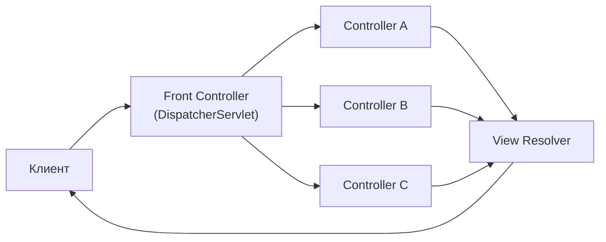
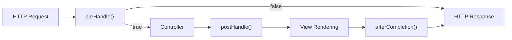
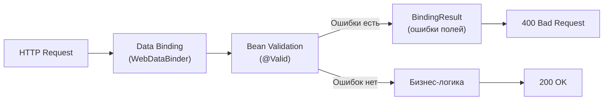
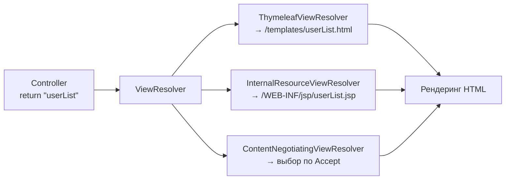
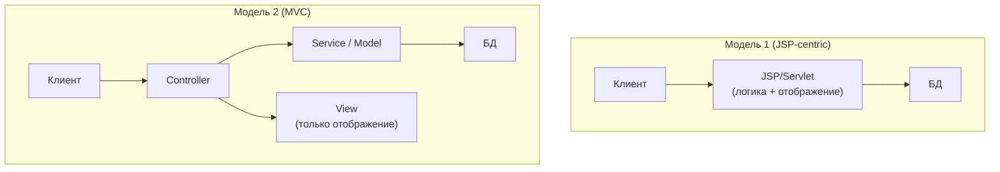
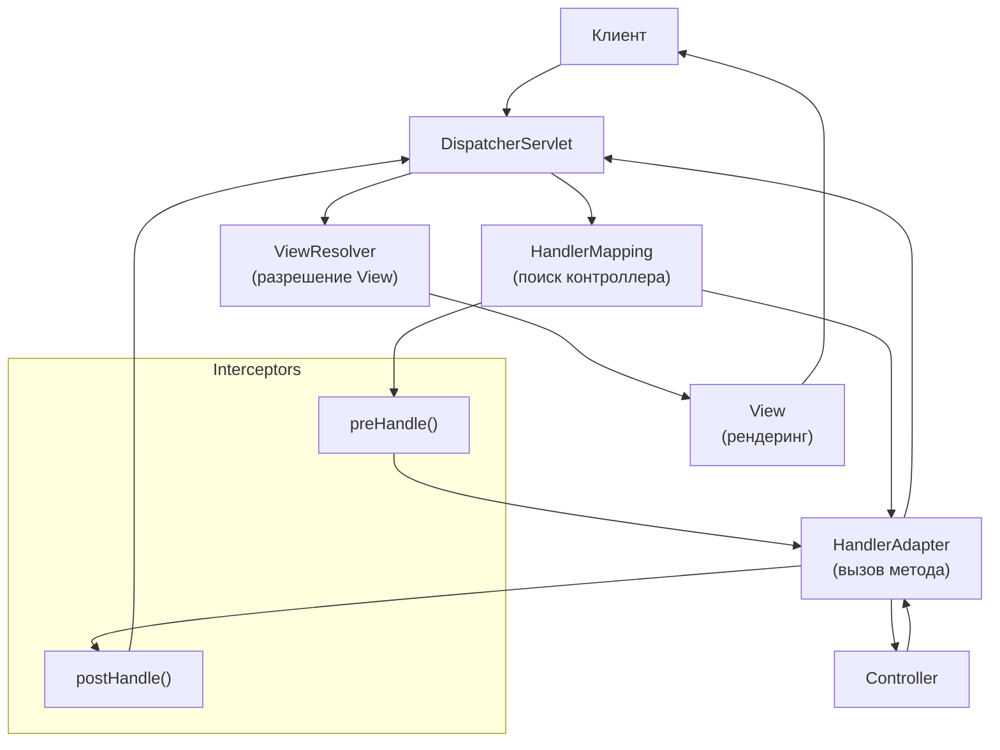
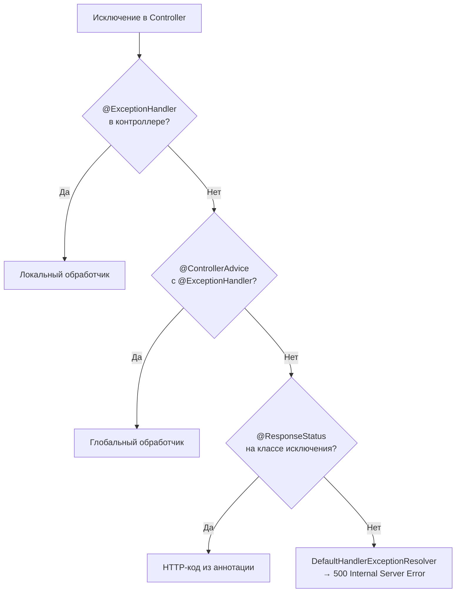
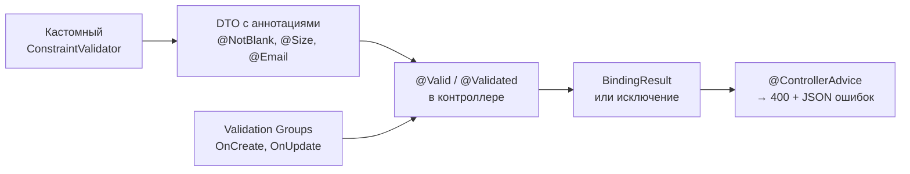
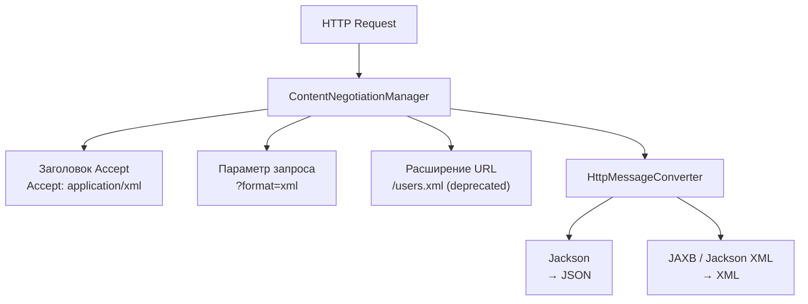
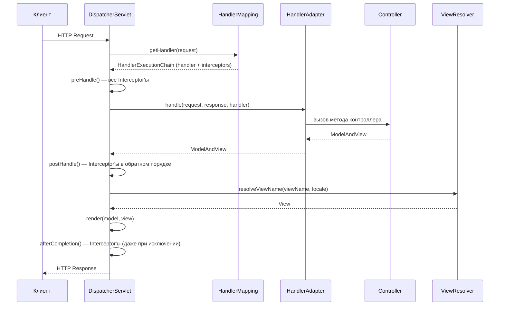

# Вопросы на собеседовании: `Spring MVC`

Краткое введение: **Spring MVC** — основа веб-слоя в `Spring Framework`. На собеседованиях часто спрашивают про `DispatcherServlet`, жизненный цикл запроса, контроллеры, обработку исключений, валидацию, `Content Negotiation`, `CORS` и тестирование с `MockMvc`. Понимание внутренней механики `Spring MVC` отличает сильного кандидата от поверхностного.

## Полезные ссылки

### Официальная документация

- [Spring MVC Documentation](https://docs.spring.io/spring-framework/reference/web/servlet.html) — основной справочник по веб-слою
- [Spring Boot Web](https://docs.spring.io/spring-boot/docs/current/reference/html/web.html) — автоконфигурация веб-приложений
- [Bean Validation (JSR 380)](https://beanvalidation.org/2.0/spec/) — спецификация валидации

### Baeldung

- [Spring MVC Tutorial](https://www.baeldung.com/spring-mvc-tutorial) — полный туториал по Spring MVC
- [An Intro to the Spring DispatcherServlet](https://www.baeldung.com/spring-dispatcherservlet) — архитектура и жизненный цикл запроса
- [Error Handling for REST with Spring](https://www.baeldung.com/exception-handling-for-rest-with-spring) — обработка исключений: @ExceptionHandler, @ControllerAdvice
- [Introduction to Spring MVC HandlerInterceptor](https://www.baeldung.com/spring-mvc-handlerinterceptor) — перехватчики запросов
- [Types of Spring HandlerAdapters](https://www.baeldung.com/spring-mvc-handler-adapters) — адаптеры обработчиков в DispatcherServlet
- [Custom Error Message Handling for REST API](https://www.baeldung.com/global-error-handler-in-a-spring-rest-api) — глобальная обработка ошибок

## Содержание

- [Полезные ссылки](#полезные-ссылки)
- [See also](#see-also)

**Основы Spring MVC**
- [Q1. (!) Что такое Front Controller?](#q1--что-такое-front-controller)
- [Q2. (!) Что такое Spring MVC?](#q2--что-такое-spring-mvc)
- [Q3. Как получить ServletContext и ServletConfig внутри бина?](#q3-как-получить-servletcontext-и-servletconfig-внутри-бина)
- [Q4. Что такое локализация?](#q4-что-такое-локализация)
- [Q5. (!) Что такое Interceptor?](#q5--что-такое-interceptor)

**Model и атрибуты**
- [Q6. Что такое @ModelAttribute?](#q6-что-такое-modelattribute)
- [Q7. В чём разница между Model, ModelMap и ModelAndView?](#q7-в-чём-разница-между-model-modelmap-и-modelandview)
- [Q8. В чем разница между model.put() и model.addAttribute()?](#q8-в-чем-разница-между-modelput-и-modeladdattribute)
- [Q9. Что такое связывание форм?](#q9-что-такое-связывание-форм)
- [Q10. Что такое @PathVariable?](#q10-что-такое-pathvariable)

**Валидация и Binding**
- [Q11. (!) Что такое Validation?](#q11--что-такое-validation)
- [Q12. (!) Что такое BindingResult?](#q12--что-такое-bindingresult)
- [Q13. Что такое аннотации @RequestBody и @ResponseBody?](#q13-что-такое-аннотации-requestbody-и-responsebody)
- [Q14. (!) В чём разница между @Controller и @RestController?](#q14--в-чём-разница-между-controller-и-restcontroller)
- [Q15. Что такое @SessionAttributes и @SessionAttribute?](#q15-что-такое-sessionattributes-и-sessionattribute)

**Конфигурация и View**
- [Q16. Что такое @EnableWebMvc и когда его включать?](#q16-что-такое-enablewebmvc-и-когда-его-включать)
- [Q17. (!) Что такое ViewResolver и зачем он нужен?](#q17--что-такое-viewresolver-и-зачем-он-нужен)
- [Q18. Что такое POJO?](#q18-что-такое-pojo)
- [Q19. Что такое архитектуры модели 1 и модели 2?](#q19-что-такое-архитектуры-модели-1-и-модели-2)
- [Q20. (!) Что такое DispatcherServlet и ContextLoaderListener?](#q20--что-такое-dispatcherservlet-и-contextloaderlistener)
- [Q21. Что такое MultipartResolver?](#q21-что-такое-multipartresolver)
- [Q22. Что такое @InitBinder?](#q22-что-такое-initbinder)

**Обработка исключений**
- [Q23. (!) Как происходит обработка исключений в веб-приложениях?](#q23--как-происходит-обработка-исключений-в-веб-приложениях)
- [Q24. (!) Что такое @ExceptionHandler?](#q24--что-такое-exceptionhandler)
- [Q25. (!) Что такое @ControllerAdvice?](#q25--что-такое-controlleradvice)

**Шаблоны и тестирование**
- [Q26. Как настроить шаблоны (Thymeleaf, JSP)?](#q26-как-настроить-шаблоны-thymeleaf-jsp)
- [Q27. (!) В чём разница между @RequestBody и @RequestParam?](#q27--в-чём-разница-между-requestbody-и-requestparam)
- [Q28. Как организовать валидацию входных данных?](#q28-как-организовать-валидацию-входных-данных)
- [Q29. Что такое Content Negotiation и как его настроить?](#q29-что-такое-content-negotiation-и-как-его-настроить)
- [Q30. Как тестировать контроллеры (MockMvc)?](#q30-как-тестировать-контроллеры-mockmvc)

**Продвинутые темы**
- [Q31. (!) Как устроен pipeline обработки запроса в DispatcherServlet?](#q31-как-устроен-pipeline-обработки-запроса-в-dispatcherservlet)
- [Q32. (!) Как настроить @RequestMapping: все варианты маппинга?](#q32-как-настроить-requestmapping-все-варианты-маппинга)
- [Q33. (!) Как работает HandlerInterceptor и чем отличается от Filter?](#q33-как-работает-handlerinterceptor-и-чем-отличается-от-filter)
- [Q34. Как обрабатывать загрузку файлов (Multipart) в Spring MVC?](#q34-как-обрабатывать-загрузку-файлов-multipart-в-spring-mvc)
- [Q35. (!) Как настроить CORS в Spring MVC?](#q35-как-настроить-cors-в-spring-mvc)
- [Q36. (!) Что такое @ControllerAdvice и как строить глобальную обработку ошибок?](#q36-что-такое-controlleradvice-и-как-строить-глобальную-обработку-ошибок)
- [Q37. Что такое @ModelAttribute на уровне метода и как он взаимодействует с моделью?](#q37-что-такое-modelattribute-на-уровне-метода-и-как-он-взаимодействует-с-моделью)

**Продвинутые темы Spring MVC**
- [Q38. (!) Как устроен lifecycle DispatcherServlet — инициализация и выбор HandlerMapping?](#q38--как-устроен-lifecycle-dispatcherservlet--инициализация-и-выбор-handlermapping)
- [Q39. (!) Как работают @RequestBody и @ResponseBody через цепочку HttpMessageConverter?](#q39--как-работают-requestbody-и-responsebody-через-цепочку-httpmessageconverter)
- [Q40. Как обрабатывать Multipart-запросы — @RequestPart, MultipartFile, ограничения?](#q40-как-обрабатывать-multipart-запросы--requestpart-multipartfile-ограничения)
- [Q41. (!) Как реализовать асинхронные запросы в Spring MVC — Callable, DeferredResult, @Async?](#q41--как-реализовать-асинхронные-запросы-в-spring-mvc--callable-deferredresult-async)
- [Q42. (!) Каков порядок применения ExceptionHandler — @ControllerAdvice vs локальный?](#q42--каков-порядок-применения-exceptionhandler--controlleradvice-vs-локальный)
- [Q43. (!) Когда переходить с Spring MVC на Spring WebFlux?](#q43--когда-переходить-с-spring-mvc-на-spring-webflux)

## Q1. (!) Что такое **Front Controller**?

**Front Controller** — архитектурный паттерн, в котором единая точка входа принимает все входящие запросы, маршрутизирует их к соответствующим обработчикам и координирует общую логику (безопасность, логирование, локализация).

В `Spring MVC` роль Front Controller выполняет `DispatcherServlet`. Он принимает HTTP-запрос, определяет подходящий контроллер через `HandlerMapping`, вызывает его через `HandlerAdapter`, а затем разрешает представление через `ViewResolver`.



Преимущества: централизация сквозной логики (аутентификация, CORS, логирование), единая обработка ошибок, единообразная маршрутизация. Этот паттерн используется в `Spring MVC`, `JSF`, `Struts`.

> [!mcq]
> - [x] `Front Controller` — единая точка входа, которая принимает все запросы и маршрутизирует их к обработчикам. | ✓ ПРИМЕНЯТЬ: `DispatcherServlet` в Spring MVC, `Routes.draw` в Rails, `Express Router` в Node — все реализации одной идеи. Используется для централизованной auth (Spring Security `FilterChainProxy`), глобальной обработки исключений (`@ControllerAdvice`), tracing (`Micrometer Tracing`). 📋 ПРАВИЛО: "Front Controller = single entry, маршрутизация + cross-cutting concerns в одном месте". 🔗 См. Q2 (Spring MVC), Q5 (Interceptor), Q20 (DispatcherServlet).
> - [ ] `Front Controller` — обработчик одного конкретного URL, привязанный к методу контроллера. | Это endpoint, не паттерн. ❌ ПОСЛЕДСТВИЕ: путаница приводит к попыткам "сделать свой Front Controller" через @RestController с одним URL — на деле паттерн уже реализован DispatcherServlet, дублирование вредит.
> - [ ] `Front Controller` — JSP-страница, которая отображает стартовую форму приложения. | Это view, не паттерн. ❌ ПОСЛЕДСТВИЕ: путаница с view-компонентом приводит к ошибочной архитектуре — попытка маршрутизировать через JSP-include приводит к спагетти-коду, без централизации auth/logging.
> - [ ] `Front Controller` — прокси-сервер перед приложением, выполняющий балансировку нагрузки. | Это reverse proxy. ❌ ПОСЛЕДСТВИЕ: путаница уровней инфраструктуры (Nginx) и приложения (DispatcherServlet) приводит к неправильному дизайну: команда пытается реализовать app-level routing на уровне Nginx через сложные rewrite rules вместо использования встроенного Front Controller в Spring.

> [!mcq]
> - [x] `DispatcherServlet` маппится на `/` (servlet path `""`), тогда static-ресурсы (`/static/**`, `/webjars/**`) отдаются `ResourceHttpRequestHandler`. | ✓ ПРИМЕНЯТЬ: Spring Boot по умолчанию маппит `DispatcherServlet` на `/` (`spring.mvc.servlet.path=/`), `WebMvcAutoConfiguration` регистрирует `ResourceHandlerRegistry` для `/static/**`, `/public/**`, `/resources/**`, `/META-INF/resources/**`. Кастомизация — `spring.mvc.servlet.path=/api`, тогда static идёт мимо. 📋 ПРАВИЛО: «`/` (default servlet mapping) = static резолвится handler-ом; `/*` = всё через DispatcherServlet, static ломается». 🔗 См. Q20 (DispatcherServlet), Q31 (pipeline), Q38 (lifecycle).
> - [ ] `DispatcherServlet` нужно маппить на `/*` — это покрывает все запросы включая static, иначе часть URL не доходит до Spring. | `/*` ломает static. ❌ ПОСЛЕДСТВИЕ: после `<url-pattern>/*</url-pattern>` (legacy web.xml) `/css/app.css` идёт через `DispatcherServlet`, не находит `@RequestMapping`, возвращает 404 — сайт без CSS. `/` (servlet path `""`) — единственный правильный mapping для Front Controller.
> - [ ] `DispatcherServlet` обязан маппиться на `/api/*`, иначе Spring не сможет различить REST и веб-маршруты. | Это ваше решение, не requirement. ❌ ПОСЛЕДСТВИЕ: команда искусственно префиксирует `/api/*`, потом не может отдавать HTML с того же DispatcherServlet — нужно дополнительно настраивать `spring.mvc.static-path-pattern`. Префикс — convention, не constraint.
> - [ ] `DispatcherServlet` регистрируется через `@WebServlet` на классе пользователя — Spring не делает это автоматически. | Auto. ❌ ПОСЛЕДСТВИЕ: разработчик добавляет `@WebServlet("/")` на `MyDispatcherServlet extends DispatcherServlet`, получает конфликт с `DispatcherServletAutoConfiguration` — два сервлета на одном path, `IllegalStateException` на старте.

## Q2. (!) Что такое `Spring MVC`?

**Spring MVC** — реализация паттерна `Model-View-Controller` в [Spring Framework](spring-framework-interview.md):

- **Model** — данные и бизнес-логика (сервисы, DTO, доменные объекты)
- **View** — отображение (`Thymeleaf`, `JSP`, `JSON` через `Jackson`)
- **Controller** — обработка запросов, вызов сервисов, передача данных в модель и выбор представления

`Spring MVC` предоставляет: маршрутизацию по аннотациям (`@RequestMapping`), автоматическое связывание данных из запроса в объекты, интеграцию с `Bean Validation`, Content Negotiation, гибкую обработку исключений и тесную интеграцию с `DI` и `AOP` контейнера `Spring`. В [Spring Boot](spring-boot-interview.md) веб-слой автоконфигурируется через `spring-boot-starter-web`.

> [!mcq]
> - [ ] `Spring MVC` — реактивный веб-фреймворк на базе `Project Reactor`, работающий поверх Netty. | Это WebFlux. ❌ ПОСЛЕДСТВИЕ: команда пишет реактивные методы в Spring MVC `@Controller` — методы возвращают `Mono`/`Flux`, но Tomcat-блокирующий поток всё равно ждёт завершения. Получается худший из двух миров: complexity reactive без производительного выигрыша.
> - [x] `Spring MVC` — реализация паттерна Model-View-Controller поверх Servlet API с `DispatcherServlet` в роли Front Controller. | ✓ ПРИМЕНЯТЬ: для классических blocking-приложений, где основные узкие места — DB JDBC (95% Java enterprise); Spring Boot 3+ позволяет MVC на virtual threads (`spring.threads.virtual.enabled=true`) без переписывания на reactive. 📋 ПРАВИЛО: "Spring MVC = Servlet API + DispatcherServlet + @RequestMapping; для blocking JDBC — оптимальный выбор". 🔗 См. Q1 (Front Controller), Q20 (DispatcherServlet), Q43 (когда переходить на WebFlux).
> - [ ] `Spring MVC` — модуль `Spring` для работы с базами данных через `JdbcTemplate` и `JPA`. | Это Spring Data/JDBC. ❌ ПОСЛЕДСТВИЕ: путаница приводит к неправильным dependency: команда пытается включить `spring-mvc` для DB-работы, не находит JDBC API, добавляет лишние starters. Spring MVC не имеет отношения к persistence layer.
> - [ ] `Spring MVC` — библиотека клиентских HTTP-вызовов, включающая `RestTemplate` и `WebClient`. | Это HTTP clients. ❌ ПОСЛЕДСТВИЕ: путаница server vs client приводит к недопониманию архитектуры — команда говорит "у нас Spring MVC для интеграции с external API", имея в виду RestTemplate, что технически некорректно и сбивает с толку при code review.

> [!mcq]
> - [ ] Spring MVC и Spring WebFlux работают на одном стеке (Servlet API), отличаются только аннотациями `@Controller` vs `@RestController`. | Разные стеки: Servlet vs Reactor. ❌ ПОСЛЕДСТВИЕ: команда добавляет `spring-boot-starter-webflux` рядом с `-web` ожидая reactive endpoints — Spring Boot выбирает MVC (`web` приоритетнее), reactive код блокирует Tomcat thread-pool, perf хуже чем pure MVC.
> - [ ] WebFlux работает поверх Servlet 3.1+ async API, поэтому фактически это надстройка над Spring MVC. | Netty по умолчанию, не Servlet. ❌ ПОСЛЕДСТВИЕ: разработчик пытается достать `HttpServletRequest` из WebFlux endpoint — не существует, есть `ServerHttpRequest`; команда теряет день на попытки портировать MVC-фильтры.
> - [ ] Spring MVC поддерживает реактивные типы возврата `Mono`/`Flux` нативно начиная с Spring 5 — это и есть WebFlux. | Поддерживает через async wrapping, но это НЕ WebFlux. ❌ ПОСЛЕДСТВИЕ: команда пишет `Mono<User> getUser()` в `@RestController` под Tomcat, считает это reactive endpoint — Tomcat thread блокируется на subscribe, throughput не растёт, профайлер показывает заблокированные threads.
> - [x] `Spring MVC` основан на Servlet API (blocking I/O, thread-per-request); `Spring WebFlux` — реактивный стек на Reactor (non-blocking, event loop); MVC = Tomcat/Jetty/Undertow + JDBC, WebFlux = Netty + R2DBC; Spring Boot 3.2+ позволяет MVC на virtual threads (`spring.threads.virtual.enabled=true`) — нивелирует преимущество WebFlux для blocking JDBC. | ✓ ПРИМЕНЯТЬ: MVC + Tomcat + JDBC для классического CRUD; WebFlux + Netty + R2DBC для streaming/SSE/gateway. 📋 ПРАВИЛО: «MVC = Servlet + blocking; WebFlux = Reactor + non-blocking; не смешивать в модуле». 🔗 См. Q43, Q41.

## Q3. Как получить `ServletContext` и `ServletConfig` внутри бина?

Два способа:

1. **Через внедрение зависимостей** — объявить параметр конструктора или поле с `@Autowired` типа `ServletContext` или `ServletConfig`. Контейнер подставит те же экземпляры, что использует `DispatcherServlet`.

2. **Через Aware-интерфейсы** — реализовать `ServletContextAware` или `ServletConfigAware`. `Spring` вызовет сеттеры `setServletContext()` / `setServletConfig()` при инициализации бина.

```java
@Component
public class MyComponent implements ServletContextAware {
    private ServletContext servletContext;

    @Override
    public void setServletContext(ServletContext servletContext) {
        this.servletContext = servletContext;
    }
}
```

На практике предпочтителен первый способ — меньше бойлерплейта. `Aware`-интерфейсы полезны, когда нужна совместимость с кодом без аннотаций.

> [!mcq]
> - [ ] Нужно вручную создать `new ServletContext()` в конструкторе бина и инициализировать его при старте. | ServletContext создаёт контейнер. ❌ ПОСЛЕДСТВИЕ: попытка `new ServletContext()` в коде даже не скомпилируется (это интерфейс), а реализация контейнера (`ApplicationContextFacade` в Tomcat) — internal API. Подмена контекста приводит к runtime-ошибкам.
> - [ ] Единственный способ — через статический метод `RequestContextHolder.getServletContext()`. | Метода нет. ❌ ПОСЛЕДСТВИЕ: разработчик ищет несуществующий API, теряет время на доку — `RequestContextHolder` даёт `RequestAttributes`, не сам ServletContext. DI через `@Autowired ServletContext` решает за секунду.
> - [x] Внедрить через `@Autowired` либо реализовать `ServletContextAware` / `ServletConfigAware`. | ✓ ПРИМЕНЯТЬ: `@Autowired ServletContext` для современного Spring (constructor injection), `ServletContextAware` для legacy-кода и фреймворков без DI. Получите доступ к init-параметрам из `web.xml`, временным каталогам, real-path файлов. 📋 ПРАВИЛО: "ServletContext = DI или Aware-interface; не создавать вручную". 🔗 См. Q2 (Spring MVC), Q20 (DispatcherServlet), Q21 (MultipartResolver).
> - [ ] Через `@Value("${servlet.context}")` из `application.yml`. | @Value для String-property. ❌ ПОСЛЕДСТВИЕ: попытка `@Value` для object-typed bean приводит к `IllegalStateException` — Spring не знает, как преобразовать YAML-string в `ServletContext`. Путаница config-properties и DI-объектов.

## Q4. Что такое локализация?

Локализация (i18n) — адаптация приложения к языку и региону пользователя. В `Spring MVC` это реализуется через:

- **Файлы ресурсов** — `messages_en.properties`, `messages_ru.properties` и т.д.
- **MessageSource** — бин для получения строк по ключу и локали
- **LocaleResolver** — определяет текущую локаль (из `Accept-Language`, cookie или сессии)
- **LocaleChangeInterceptor** — позволяет менять локаль через параметр запроса (`?lang=ru`)

```java
@Configuration
public class LocaleConfig implements WebMvcConfigurer {
    @Bean
    public LocaleResolver localeResolver() {
        var resolver = new SessionLocaleResolver();
        resolver.setDefaultLocale(Locale.forLanguageTag("ru"));
        return resolver;
    }

    @Override
    public void addInterceptors(InterceptorRegistry registry) {
        var interceptor = new LocaleChangeInterceptor();
        interceptor.setParamName("lang");
        registry.addInterceptor(interceptor);
    }
}
```

В шаблонах `Thymeleaf` используют ключи: `th:text="#{welcome.message}"`, Spring подставит значение из файла ресурсов для текущей локали.

> [!mcq]
> - [ ] `LocaleResolver` определяет локаль запроса только по IP-адресу клиента через GeoIP-базу. | GeoIP — отдельный сервис. ❌ ПОСЛЕДСТВИЕ: команда ожидает auto-detect локали по IP — на самом деле user из России в роуминге увидит turkish UI. Для GeoIP нужны MaxMind/IP2Location, и UX обычно даёт user manually выбрать язык, а не angajazh GeoIP.
> - [ ] `MessageSource` хранит локализованные строки в базе данных и читает их через SQL-запросы. | Default — classpath properties. ❌ ПОСЛЕДСТВИЕ: команда ищет SQL-таблицу `messages`, не находит — путается. БД-реализация требует кастомного `AbstractMessageSource`-бина, что и оправдано для multi-tenant систем с динамическими переводами (Booking, Airbnb).
> - [ ] `LocaleChangeInterceptor` меняет локаль через HTTP-заголовок `X-Locale` в каждом запросе. | Это query-param. ❌ ПОСЛЕДСТВИЕ: разработчик пишет middleware, который читает кастомный header `X-Locale`, не понимает, почему `LocaleChangeInterceptor` его игнорирует — нужен URL `?lang=ru` или вручную написать `HandlerInterceptor` для header-based detection.
> - [x] Связка `MessageSource` + `LocaleResolver` + `LocaleChangeInterceptor` плюс `messages_*.properties` файлы. | ✓ ПРИМЕНЯТЬ: `messages_en.properties`, `messages_ru.properties`, `messages_kz.properties` (DM использует все три) с UTF-8 encoding (`spring.messages.encoding=UTF-8`); `SessionLocaleResolver` для запоминания между запросами; `?lang=ru` для switch. Hot reload — `messageSource.setCacheSeconds(10)` в dev. 📋 ПРАВИЛО: "i18n = MessageSource (strings) + LocaleResolver (detect) + Interceptor (switch)". 🔗 См. Q5 (Interceptor), Q11 (Validation), Q23 (exception handling с локализованными ошибками).

## Q5. (!) Что такое `Interceptor`?

**HandlerInterceptor** — перехватчик, который добавляет сквозную логику (логирование, аутентификация, метрики) до и после выполнения контроллера. Три метода:

- `preHandle()` — до вызова контроллера; возвращает `boolean` (продолжить или прервать)
- `postHandle()` — после контроллера, но до рендеринга `View`
- `afterCompletion()` — после полного завершения запроса (включая рендеринг)



Регистрация через `WebMvcConfigurer`:

```java
@Configuration
public class WebConfig implements WebMvcConfigurer {
    @Override
    public void addInterceptors(InterceptorRegistry registry) {
        registry.addInterceptor(new LoggingInterceptor())
                .addPathPatterns("/api/**")
                .excludePathPatterns("/api/health")
                .order(1);
    }
}
```

Отличие от Servlet `Filter`: интерцепторы работают на уровне `Spring MVC` (имеют доступ к `HandlerMethod`), а фильтры — на уровне сервлет-контейнера (работают до `DispatcherServlet`). Подробнее о фильтрах и безопасности — в [Spring Security](spring-security-interview.md).

> [!mcq]
> - [x] `HandlerInterceptor` имеет методы `preHandle`/`postHandle`/`afterCompletion` и работает внутри `DispatcherServlet` (имеет доступ к `HandlerMethod`); регистрируется через `WebMvcConfigurer.addInterceptors(registry)` с `pathPatterns`/`order`. | ✓ ПРИМЕНЯТЬ: request-level metrics (Micrometer Tracing), audit logging (`afterCompletion` гарантированно), feature-flag proxy (`preHandle return false`). 📋 ПРАВИЛО: «Interceptor = внутри DispatcherServlet (HandlerMethod известен), Filter = снаружи (raw Servlet)». 🔗 См. Q1, Q4, Q22.
> - [ ] `HandlerInterceptor` имеет только один метод `intercept()` и работает на уровне сервлет-контейнера. | Это `Filter` API. ❌ ПОСЛЕДСТВИЕ: разработчик пытается реализовать `intercept()`, IDE не подсказывает — такого метода нет; в `HandlerInterceptor` три метода (`preHandle`/`postHandle`/`afterCompletion`), путаница API стоит часа разбирательств.
> - [ ] `HandlerInterceptor` может изменять HTTP-статус ответа только в методе `preHandle`, возвращая новый код. | `preHandle` возвращает `boolean`, статус через `response.setStatus()`. ❌ ПОСЛЕДСТВИЕ: разработчик пишет `return 401`, не компилируется; или возвращает `true` ожидая что 401 уйдёт автоматически — клиент получает 200 с пустым телом.
> - [ ] `HandlerInterceptor` регистрируется автоматически при наличии аннотации `@Component` без дополнительной конфигурации. | `@Component` недостаточно — нужен `WebMvcConfigurer.addInterceptors`. ❌ ПОСЛЕДСТВИЕ: типовой баг — разработчик помечает interceptor `@Component`, удивляется почему `preHandle` не вызывается; logs пустые, audit-запись не пишется в прод.

> [!mcq]
> - [ ] Порядок: `preHandle` → controller → `afterCompletion` → render View → `postHandle`; `postHandle` всегда последний. | Наоборот: `postHandle` ДО render, `afterCompletion` ПОСЛЕ. ❌ ПОСЛЕДСТВИЕ: разработчик мутирует `ModelAndView` в `afterCompletion` рассчитывая попасть в HTML — view уже отрендерен и отправлен клиенту, изменения теряются, фронт получает старые данные.
> - [ ] `postHandle` вызывается всегда после controller, независимо от того, выбросил ли controller exception. | Только при успешном завершении. ❌ ПОСЛЕДСТВИЕ: команда пишет закрытие audit-транзакции в `postHandle`, controller бросает `IllegalArgumentException` — `postHandle` НЕ вызывается, audit-запись висит, на дашборде Grafana «потерянные транзакции» растут.
> - [ ] При нескольких interceptor-ах все три callback вызываются в одинаковом forward-порядке регистрации (`[A, B] → A.preHandle → B.preHandle → A.postHandle → B.postHandle`). | `postHandle`/`afterCompletion` идут в reverse (LIFO). ❌ ПОСЛЕДСТВИЕ: `A.postHandle` чистит ресурс, который ещё нужен `B.postHandle` — `B` падает с `NullPointerException`, тест зелёный (один interceptor), прод красный (два).
> - [x] `preHandle` → controller → `postHandle` (до render) → render View → `afterCompletion`; `afterCompletion` вызывается ВСЕГДА (даже при exception), `postHandle` — только без exception; при нескольких interceptor-ах `preHandle` в forward-порядке, `postHandle`/`afterCompletion` — в reverse (LIFO). | ✓ ПРИМЕНЯТЬ: cleanup `MDC.clear()` и span-close — в `afterCompletion` (гарантия); mutate Model — в `postHandle`; auth `return false` — в `preHandle`. 📋 ПРАВИЛО: «`preHandle` forward → controller → `postHandle` reverse (no-exception) → render → `afterCompletion` reverse (always)». 🔗 См. Q31, Q33.

## Q6. Что такое `@ModelAttribute`?

`@ModelAttribute` используется двумя способами:

**На параметре метода** — `Spring` привязывает параметры запроса к полям объекта (по именам), создавая экземпляр и вызывая сеттеры:

```java
@PostMapping("/register")
public String register(@ModelAttribute("user") User user) {
    // user заполнен из параметров формы
    return "success";
}
```

**На методе** — метод вызывается перед каждым обработчиком контроллера и добавляет атрибут в модель:

```java
@ModelAttribute("categories")
public List<Category> populateCategories() {
    return categoryService.findAll(); // доступно во всех View контроллера
}
```

При использовании на параметре `Spring` выполняет: создание объекта, привязку данных из запроса (`WebDataBinder`), валидацию (если стоит `@Valid`) и добавление в модель. Это основа форм-биндинга в `Spring MVC`.

> [!mcq]
> - [ ] `@ModelAttribute` работает только на параметрах методов и предназначен исключительно для связывания форм. | Двойное назначение. ❌ ПОСЛЕДСТВИЕ: команда не использует `@ModelAttribute` на методах для общих data — каждый контроллер дублирует `model.addAttribute("currentUser", ...)` в каждом методе вместо одного `@ModelAttribute`-метода в `@ControllerAdvice`.
> - [x] `@ModelAttribute` имеет двойное назначение: на параметре — биндинг запроса в объект, на методе — предзаполнение модели. | ✓ ПРИМЕНЯТЬ: на параметре для form binding (PUT/POST с `application/x-www-form-urlencoded`), на методе для shared model data (current user, навигация, справочники в dropdown'ах) через `@ControllerAdvice`. Для REST API чаще `@RequestBody`. 📋 ПРАВИЛО: "@ModelAttribute = двойник: param=binding, method=pre-fill model; @ControllerAdvice для shared data". 🔗 См. Q9 (form binding), Q11 (Validation), Q22 (@InitBinder).
> - [ ] `@ModelAttribute` — аннотация для автоматической валидации DTO без `@Valid`. | Auto-validation нет. ❌ ПОСЛЕДСТВИЕ: классический баг — DTO с `@NotBlank` полями не валидируется, разработчик удивляется. Spring запускает Bean Validation только при явном `@Valid` рядом с `@ModelAttribute`/`@RequestBody`.
> - [ ] `@ModelAttribute` на методе возвращает объект, который попадает в HTTP-ответ как JSON. | Это для модели, не response. ❌ ПОСЛЕДСТВИЕ: разработчик помечает `@ModelAttribute`-метод, ожидая JSON-ответа — получает HTML-render через ViewResolver или 404. Для REST endpoint используйте `@RequestMapping` + `@ResponseBody`.

## Q7. В чём разница между `Model`, `ModelMap` и `ModelAndView`?

| Тип | Описание | Типичное использование |
|-----|----------|----------------------|
| `Model` | Интерфейс; методы `addAttribute()` | Параметр метода контроллера |
| `ModelMap` | Класс, реализует `Map + Model` | Когда нужны map-операции |
| `ModelAndView` | Объект, содержащий и модель, и имя View | Возврат из метода контроллера |

```java
// Model — самый частый подход
@GetMapping("/users")
public String list(Model model) {
    model.addAttribute("users", userService.findAll());
    return "userList";
}

// ModelAndView — данные + представление в одном объекте
@GetMapping("/users")
public ModelAndView list() {
    return new ModelAndView("userList", "users", userService.findAll());
}
```

На практике `Model` как параметр метода — самый чистый подход. `ModelAndView` полезен, когда имя View определяется условно внутри метода.

> [!mcq]
> - [ ] `Model`, `ModelMap` и `ModelAndView` — три имени одного и того же класса, отличаются только алиасами. | Три разных типа. ❌ ПОСЛЕДСТВИЕ: разработчик пытается заменить `Model` на `ModelAndView` в параметре метода, не находит совпадения API — `ModelAndView` обычно возвращаемое значение, не параметр. Concept confusion слоит код.
> - [ ] `ModelAndView` содержит только имя View, а данные хранятся отдельно в `HttpServletRequest.attributes`. | MAV содержит и model, и view. ❌ ПОСЛЕДСТВИЕ: команда дублирует данные через `request.setAttribute(...)` параллельно с `ModelAndView` — view рендерит из обоих источников, поведение зависит от конкретного template engine. Anti-pattern с trace-leaking.
> - [x] `Model` — интерфейс только для данных, `ModelMap` — Map-реализация `Model`, `ModelAndView` — связка модель+имя View. | ✓ ПРИМЕНЯТЬ: `Model` как параметр метода + `return "viewName"` для классического случая (95% случаев); `ModelAndView` для условного выбора view (`return error ? new ModelAndView("error") : new ModelAndView("success")`); `ModelMap` редко — для legacy-кода с Map-операциями. 📋 ПРАВИЛО: "Model = parameter, ModelAndView = return when view dynamic, ModelMap = legacy Map API". 🔗 См. Q1 (Front Controller), Q8 (addAttribute vs put), Q17 (ViewResolver).
> - [ ] `ModelMap` отличается от `Model` только потокобезопасностью, остальное идентично. | Concurrency не отличает. ❌ ПОСЛЕДСТВИЕ: разработчик использует `ModelMap` "ради thread-safety" — на деле обе реализации не thread-safe, и в Spring MVC контекст модели per-request, шаренный доступ невозможен. Ложная безопасность.

## Q8. В чем разница между `model.put()` и `model.addAttribute()`?

Оба метода добавляют атрибуты в модель, но:

- **`put(key, value)`** — из интерфейса `Map`; принимает любой `key` (включая `null`)
- **`addAttribute(name, value)`** — из интерфейса `Model`; выбрасывает исключение при `null`-ключе; поддерживает цепочку вызовов (method chaining); есть перегрузка `addAttribute(value)`, которая генерирует имя по типу объекта

```java
model.addAttribute("user", user)
     .addAttribute("roles", roles); // chaining

model.put("user", user); // без chaining
```

Предпочтительнее `addAttribute()` — типобезопасный, с защитой от `null`-ключей и fluent-интерфейсом.

> [!mcq]
> - [ ] `put()` и `addAttribute()` — полные синонимы, выбор чисто стилистический. | Есть семантические отличия. ❌ ПОСЛЕДСТВИЕ: разработчик пишет `model.put(null, value)` — компилируется, runtime бросает NPE из template engine. С `addAttribute()` ошибка вылетает immediately с явным сообщением.
> - [ ] `put()` быстрее `addAttribute()`, потому что не делает дополнительных проверок. | Производительность тут не main concern. ❌ ПОСЛЕДСТВИЕ: микро-оптимизация без замеров — типичный анти-паттерн. Разница 0.0001ms не имеет значения, в то время как fluent API экономит десятки минут разработчикам в день.
> - [ ] `addAttribute()` сериализует значения в JSON автоматически, а `put()` оставляет как есть. | Сериализация позже. ❌ ПОСЛЕДСТВИЕ: ожидание "addAttribute = JSON" приводит к попыткам manually marshal перед `put()` — двойная сериализация, ломаются html-views. Сериализация в `HttpMessageConverter` (REST) или ViewResolver (HTML).
> - [x] `addAttribute()` запрещает `null`-ключ, поддерживает chaining и автоматическую генерацию имени по типу; `put()` — метод `Map`. | ✓ ПРИМЕНЯТЬ: `model.addAttribute("user", user).addAttribute("roles", roles)` для chained naming; `model.addAttribute(user)` — Spring сгенерирует key как `"user"` (lowercase first letter имени класса). 📋 ПРАВИЛО: "addAttribute = Spring API, type-safe, chaining; put = Map legacy". 🔗 См. Q7 (Model vs ModelMap), Q6 (@ModelAttribute), Q17 (ViewResolver рендерит модель).

## Q9. Что такое связывание форм?

Связывание форм (form binding) — автоматическая привязка данных из HTML-формы к Java-объекту. `Spring MVC` сопоставляет имена полей формы с полями объекта и вызывает сеттеры через `WebDataBinder`.

```java
@PostMapping("/register")
public String register(@ModelAttribute("user") @Valid User user,
                        BindingResult result) {
    if (result.hasErrors()) {
        return "registrationForm";
    }
    userService.save(user);
    return "redirect:/success";
}
```

```html
<form th:action="@{/register}" th:object="${user}" method="post">
    <input type="text" th:field="*{name}" />
    <span th:if="${#fields.hasErrors('name')}" th:errors="*{name}"></span>
    <button type="submit">Зарегистрироваться</button>
</form>
```

Для безопасности рекомендуется ограничивать допустимые поля через `@InitBinder` + `setAllowedFields()`, чтобы злоумышленник не мог подменить поля, которые не отображаются в форме (mass assignment vulnerability).

> [!mcq]
> - [ ] Spring разбирает форму вручную в контроллере — нужно вызывать `request.getParameter()` для каждого поля. | Это голый Servlet, не Spring. ❌ ПОСЛЕДСТВИЕ: legacy-код с ручным разбором — десятки строк boilerplate на DTO, нет type-conversion (`Integer.parseInt` вручную), нет `@Valid`-интеграции, добавление поля требует правки 5 мест.
> - [ ] Связывание форм работает только с JSON-телом запроса, form-urlencoded не поддерживается. | Наоборот: `@ModelAttribute` для form-urlencoded, `@RequestBody` для JSON. ❌ ПОСЛЕДСТВИЕ: команда смешивает `@ModelAttribute` и `@RequestBody` в одном endpoint, не понимая разницы — получает `HttpMediaTypeNotSupportedException` 415 на каждом submit формы.
> - [ ] При ошибке биндинга Spring молча игнорирует поле и продолжает обработку без уведомлений. | Ошибки попадают в `BindingResult` или бросают `BindException`. ❌ ПОСЛЕДСТВИЕ: разработчик не объявляет `BindingResult`, не использует `@Valid` — `"abc"` в `Long`-поле приводит к 400 без полевых сообщений, форма не возвращается с подсвеченными ошибками, UX-катастрофа.
> - [x] `WebDataBinder` автоматически сопоставляет имена полей формы с полями DTO и вызывает сеттеры; защищать от mass assignment через `binder.setAllowedFields()` в `@InitBinder` либо immutable `record`-DTO (поля только из конструктора). | ✓ ПРИМЕНЯТЬ: `@ModelAttribute User user` для HTML-форм; `consumes = APPLICATION_FORM_URLENCODED` для form-data REST; reference — Rails mass-assignment CVE 2012 (GitHub leak). 📋 ПРАВИЛО: «`WebDataBinder` = auto bind по names; защита = `setAllowedFields` ИЛИ record-DTO». 🔗 См. Q6, Q11, Q22.

## Q10. Что такое `@PathVariable`?

`@PathVariable` извлекает значение из шаблона URI-пути и подставляет в параметр метода:

```java
@GetMapping("/users/{id}")
public User getUser(@PathVariable Long id) {
    return userService.findById(id);
}

// Несколько переменных
@GetMapping("/users/{userId}/orders/{orderId}")
public Order getOrder(@PathVariable Long userId,
                      @PathVariable Long orderId) {
    return orderService.find(userId, orderId);
}

// Все переменные в Map
@GetMapping("/users/{userId}/orders/{orderId}")
public Order getOrder(@PathVariable Map<String, String> vars) {
    Long userId = Long.parseLong(vars.get("userId"));
    Long orderId = Long.parseLong(vars.get("orderId"));
    return orderService.find(userId, orderId);
}
```

Если имя переменной в шаблоне совпадает с именем параметра метода, `value` можно не указывать. `@PathVariable(required = false)` позволяет сделать переменную необязательной (тогда тип параметра должен быть `Optional` или nullable).

> [!mcq]
> - [ ] `@PathVariable` читает значение из query-string (`?id=42`) и подставляет в параметр метода. | Это `@RequestParam`. ❌ ПОСЛЕДСТВИЕ: endpoint `/users/{id}` с `@PathVariable` ожидает `/users/42`, не `/users?id=42` — фронт шлёт через `?id=`, в логах сыпется 404, инцидент 2 часа на разбор «почему ручка не отвечает».
> - [x] `@PathVariable` извлекает значение из шаблона URI (`/users/{id}`) и подставляет в параметр метода. | ✓ ПРИМЕНЯТЬ: для RESTful resource-paths (Roy Fielding's REST) — `/users/42`, `/orders/123/items/456`. Параметр-имя должно совпадать с template-placeholder ИЛИ явно `@PathVariable("id")`. Для UUID/enum — Spring auto-converts через `Converter`. 📋 ПРАВИЛО: "@PathVariable = path segment, @RequestParam = query string; RESTful URIs предпочитают первое". 🔗 См. Q14 (@RestController), Q23 (exception handling), Q11 (Validation для path params).
> - [ ] `@PathVariable` работает только со `String`-параметрами, примитивные типы не поддерживаются. | Auto-conversion. ❌ ПОСЛЕДСТВИЕ: разработчик пишет ручной `Long.parseLong(idStr)` для каждого `@PathVariable String id` — boilerplate без необходимости. Spring сам конвертирует через `ConversionService`.
> - [ ] `@PathVariable` обязательно требует `value`-атрибут, иначе биндинг упадёт с ошибкой. | Не обязателен. ❌ ПОСЛЕДСТВИЕ: лишний boilerplate `@PathVariable("id") Long id` вместо просто `@PathVariable Long id`. Java 8+ с `-parameters` flag сохраняет имена параметров — Spring использует их для биндинга.

## Q11. (!) Что такое `Validation`?

Валидация в `Spring MVC` основана на **Bean Validation** (`JSR 380`, реализация — `Hibernate Validator`). На полях DTO ставят аннотации ограничений, а в контроллере аргумент помечают `@Valid`:



```java
public record UserCreateDto(
    @NotBlank(message = "Имя обязательно")
    String name,

    @Email(message = "Некорректный email")
    @NotBlank
    String email,

    @Size(min = 8, max = 100, message = "Пароль от 8 до 100 символов")
    String password
) {}
```

Для кастомных правил — собственная аннотация с `ConstraintValidator`. Для групповой валидации — `@Validated(OnCreate.class)` вместо `@Valid`. Подробнее о паттернах валидации — в [Spring Boot](spring-boot-interview.md).

> [!mcq]
> - [ ] Валидация в `Spring MVC` реализована на собственном механизме Spring без JSR-спецификации. | JSR 380 — стандарт. ❌ ПОСЛЕДСТВИЕ: разработчик думает что Spring использует proprietary валидатор и не подключает `hibernate-validator`, получает `NoSuchMethodError`. Spring Boot 3+ требует Jakarta EE (jakarta.validation вместо javax.validation).
> - [ ] Для запуска валидации достаточно поставить аннотации ограничений на DTO, `@Valid` не нужен. | @Valid обязателен. ❌ ПОСЛЕДСТВИЕ: классическая ошибка — DTO с `@NotBlank` поля игнорируются, в БД попадает невалидные данные, обнаруживается баг через несколько недель в проде. Always pair `@Valid` с DTO.
> - [x] Bean Validation (JSR 380) + `@Valid` на аргументе контроллера запускает проверку через `Hibernate Validator`. | ✓ ПРИМЕНЯТЬ: `@Valid @RequestBody UserDto` для REST API, `@Valid @ModelAttribute` для form binding. Группы валидации (`@Validated(OnCreate.class)`) для разных сценариев (create vs update). Кастомные правила — `ConstraintValidator` + custom annotation. 📋 ПРАВИЛО: "Bean Validation = JSR 380 + Hibernate Validator + @Valid trigger; без @Valid = nothing happens". 🔗 См. Q12 (BindingResult), Q22 (@InitBinder), Q24 (@ExceptionHandler).
> - [ ] Валидация применяется только к `@RequestBody`-параметрам, к `@ModelAttribute` не применяется. | Валидация для всех. ❌ ПОСЛЕДСТВИЕ: команда оборачивает `@ModelAttribute` параметры в `@RequestBody` "для валидации" — ломает form-data flows, получает `MediaTypeNotSupportedException`. `@Valid` работает с любым data-binding source.

> [!mcq]
> - [ ] `@Valid` и `@Validated` — синонимы; `@Validated` это Spring-обёртка над JSR-380 `@Valid` без дополнительных возможностей. | `@Validated` поддерживает groups, `@Valid` — нет. ❌ ПОСЛЕДСТВИЕ: команда пишет `@Valid(groups = Update.class)` — compile error, у `jakarta.validation.Valid` нет атрибута `groups`. День на чтение Stack Overflow прежде чем находят `@Validated`.
> - [ ] При `@Validated(Update.class)` ограничения без `groups` автоматически попадают в активную группу `Update`. | Без явной `groups` = `Default`, не активируется. ❌ ПОСЛЕДСТВИЕ: `@NotBlank String name` (без `groups`) при `@Validated(Update.class)` НЕ срабатывает — пустой `name` уходит в БД, обнаружение через 2 недели когда юзеры жалуются на `null` в UI.
> - [ ] Group validation работает только для `@RequestBody`; для `@ModelAttribute` нужно вручную вызывать `Validator.validate(obj, groups)`. | Работает везде идентично. ❌ ПОСЛЕДСТВИЕ: команда дублирует логику валидации руками для form-binding controllers — bloat 100+ строк, легко забыть на новом методе, пропуск в `PaymentController` приводит к проходу invalid card-data.
> - [x] `@Validated(Update.class)` запускает только ограничения с `groups = {Update.class}`; `@Valid` (без групп) запускает только ограничения с `Default.class`; ограничения без `groups` идут в `Default` и не запускаются при явной группе — комбинировать через `@Validated({Update.class, Default.class})`. | ✓ ПРИМЕНЯТЬ: разные правила create vs update — `@NotNull(groups = Create.class) Long id` (на create id null, на update обязателен); маркер-интерфейсы `interface Create {}`, `interface Update {}`. 📋 ПРАВИЛО: «`@Valid` = `Default` only; `@Validated(X.class)` = X only; `@Validated({X, Default})` = оба». 🔗 См. Q12, Q22, Q24.

## Q12. (!) Что такое `BindingResult`?

**BindingResult** — объект, хранящий результат привязки данных и валидации. Он обязательно должен идти **сразу после** валидируемого аргумента в сигнатуре метода:

```java
@PostMapping("/users")
public String createUser(@Valid @ModelAttribute User user,
                          BindingResult result,  // сразу после @Valid аргумента!
                          Model model) {
    if (result.hasErrors()) {
        // result.getFieldErrors() — список ошибок по полям
        // result.getGlobalErrors() — ошибки уровня объекта
        return "userForm";
    }
    userService.save(user);
    return "redirect:/users";
}
```

Если `BindingResult` не объявлен, а валидация провалилась, `Spring` выбросит `MethodArgumentNotValidException` (для `@RequestBody`) или `BindException` (для `@ModelAttribute`). При наличии `BindingResult` исключение не выбрасывается — контроллер сам решает, как обработать ошибки.

> [!mcq]
> - [ ] `BindingResult` может находиться в любом месте сигнатуры метода — Spring сам найдёт его по типу. | Position matters. ❌ ПОСЛЕДСТВИЕ: типичный subtle баг — разработчик ставит `Model model` между `@Valid User user` и `BindingResult result`, ошибки валидации не попадают в `BindingResult`, фактически невалидные данные доходят до бизнес-логики. Compile-time нет ошибки.
> - [ ] Наличие `BindingResult` отключает валидацию — ограничения игнорируются. | Валидация работает. ❌ ПОСЛЕДСТВИЕ: команда удаляет `BindingResult` "чтобы валидация заработала" — теперь Spring бросает `MethodArgumentNotValidException`, что нужно ловить в `@ExceptionHandler`. Просто перешли с одной модели обработки на другую.
> - [ ] `BindingResult` хранит только ошибки валидации, без ошибок биндинга типов. | Хранит оба. ❌ ПОСЛЕДСТВИЕ: разработчик не проверяет ошибки биндинга (например, "abc" в `Long`-поле) — `BindingResult.hasErrors()` возвращает `true`, но он только смотрит на `@NotBlank` ошибки. Form re-display показывает корректную валидацию, но не type binding errors.
> - [x] `BindingResult` хранит ошибки биндинга и валидации; должен идти сразу после валидируемого аргумента. | ✓ ПРИМЕНЯТЬ: для form-based controllers где нужно re-display формы с ошибками; `@RequestBody` REST лучше использовать без `BindingResult` (let `MethodArgumentNotValidException` bubble up к `@RestControllerAdvice`). 📋 ПРАВИЛО: "BindingResult ИММЕДИАТНО после @Valid аргумента; иначе rules apply, но errors не captured". 🔗 См. Q11 (Validation), Q23 (exception handling), Q25 (@ControllerAdvice).

> [!mcq]
> - [ ] Spring находит `BindingResult` в сигнатуре по типу — позиция параметра неважна, можно ставить в любое место. | Position matters: должен быть СРАЗУ после `@Valid` аргумента. ❌ ПОСЛЕДСТВИЕ: разработчик ставит `BindingResult` последним «для читаемости», при первой же ошибке Spring бросает `MethodArgumentNotValidException`, controller-метод даже не вызывается, форма не возвращается с ошибками — UX поломан.
> - [ ] Один `BindingResult` покрывает все `@Valid` аргументы метода — Spring агрегирует ошибки. | Один на каждый `@Valid`. ❌ ПОСЛЕДСТВИЕ: `update(@Valid User u, @Valid Address a, BindingResult result)` — ошибки `Address` НЕ попадают в `result`, Spring бросает `MethodArgumentNotValidException` для `a`, контроллер не отрабатывает, валидация `User` пройдёт, но `Address` свалится 400.
> - [ ] При нарушении порядка Spring логирует warning и всё равно заполняет `BindingResult` — это soft constraint. | Hard: исключение, не warning. ❌ ПОСЛЕДСТВИЕ: команда видит warning в dev-логах, игнорирует — прод падает с `MethodArgumentNotValidException` без advice-handler, клиенты получают 500 вместо человеческого 400, инцидент.
> - [x] `BindingResult` ДОЛЖЕН идти параметром НЕПОСРЕДСТВЕННО после `@Valid`/`@Validated` объекта; нарушение порядка → `MethodArgumentNotValidException` вместо заполнения `BindingResult`; один `BindingResult` на ОДИН валидируемый аргумент — для двух DTO нужно два `BindingResult`-а. | ✓ ПРИМЕНЯТЬ: `createUser(@Valid User user, BindingResult userResult, @Valid Address addr, BindingResult addrResult)`. 📋 ПРАВИЛО: «`@Valid Foo` → `BindingResult` (сразу) → остальные; пара на каждый валидируемый». 🔗 См. Q11, Q23, Q25.

## Q13. Что такое аннотации `@RequestBody` и `@ResponseBody`?

**`@RequestBody`** — привязывает тело HTTP-запроса к Java-объекту. `Spring` использует `HttpMessageConverter` (например, `MappingJackson2HttpMessageConverter`) для десериализации `JSON/XML` в объект:

```java
@PostMapping("/users")
public User create(@RequestBody UserCreateDto dto) {
    return userService.create(dto);
}
```

**`@ResponseBody`** — указывает, что возвращаемое значение метода нужно записать прямо в тело ответа (не интерпретировать как имя View). `Spring` сериализует объект через `HttpMessageConverter`:

```java
@GetMapping("/users/{id}")
@ResponseBody
public User getUser(@PathVariable Long id) {
    return userService.findById(id);
}
```

`@RestController` = `@Controller` + `@ResponseBody` на уровне класса, поэтому в REST-контроллерах `@ResponseBody` писать не нужно.

> [!mcq]
> - [x] `@RequestBody` десериализует тело запроса в объект через `HttpMessageConverter` по `Content-Type`; `@ResponseBody` сериализует возвращаемый объект в тело ответа по `Accept`; в `@RestController` `@ResponseBody` уже включён на уровне класса. | ✓ ПРИМЕНЯТЬ: Jackson по умолчанию для JSON, кастомизация через `ObjectMapper` bean; для streaming — `StreamingResponseBody`; `@JsonView` для skip sensitive fields. 📋 ПРАВИЛО: «@RequestBody = body→object, @ResponseBody = object→body, через HttpMessageConverter». 🔗 См. Q14, Q11, Q25.
> - [ ] `@RequestBody` читает query-параметры запроса, `@ResponseBody` формирует заголовки ответа. | Тело, не query/headers. ❌ ПОСЛЕДСТВИЕ: путаница приводит к классическому «почему `@RequestBody Long id` не работает» — Spring ожидает JSON-тело `42`, клиент шлёт `?id=42`, endpoint возвращает 400 `Required request body is missing`.
> - [ ] `@RequestBody` обязателен для всех POST-методов, без него запрос не дойдёт до контроллера. | Не обязателен — для form-data берётся `@ModelAttribute`. ❌ ПОСЛЕДСТВИЕ: разработчик добавляет `@RequestBody` к методу принимающему form-urlencoded — `HttpMediaTypeNotSupportedException` 415, browser-формы ломаются.
> - [ ] `@ResponseBody` работает только в `@RestController`, в обычном `@Controller` он игнорируется. | Работает в обоих. ❌ ПОСЛЕДСТВИЕ: разработчик создаёт отдельный `@RestController` ради одного JSON-endpoint в legacy `@Controller`-классе вместо `@ResponseBody` на методе — лишний класс, дублирование `@RequestMapping`-префикса, рост code-smell.

## Q14. (!) В чём разница между `@Controller` и `@RestController`?

| Аспект | `@Controller` | `@RestController` |
|--------|---------------|-------------------|
| Что возвращает метод | Имя View (строка) | Объект → JSON/XML |
| `@ResponseBody` | Нужен явно на каждом методе | Включён автоматически |
| Типичное применение | Веб-страницы (Thymeleaf, JSP) | REST API |
| ViewResolver | Участвует | Не участвует |

```java
// Для веб-страниц
@Controller
public class PageController {
    @GetMapping("/home")
    public String home(Model model) {
        model.addAttribute("title", "Главная");
        return "home"; // → ViewResolver → home.html
    }
}

// Для REST API
@RestController
@RequestMapping("/api/users")
public class UserController {
    @GetMapping("/{id}")
    public User getUser(@PathVariable Long id) {
        return userService.findById(id); // → Jackson → JSON
    }
}
```

В одном `@Controller` можно комбинировать: часть методов возвращает View, а часть — с `@ResponseBody` отдаёт JSON. Но на практике смешивать не рекомендуется — лучше разделять по классам.

> [!mcq]
> - [ ] `@RestController` и `@Controller` — полные синонимы; отличаются только именем. | Разные. ❌ ПОСЛЕДСТВИЕ: разработчик заменяет `@RestController` на `@Controller`, забывает добавить `@ResponseBody` на каждый метод — все REST API возвращают 404 (Spring пытается резолвить view "user-list", "users/42"). Production-блокер.
> - [x] `@RestController` = `@Controller` + `@ResponseBody` на уровне класса; методы сериализуются в тело ответа. | ✓ ПРИМЕНЯТЬ: `@RestController` для REST API (95% случаев backend), `@Controller` для server-side rendering (Thymeleaf admin panels, legacy JSP). Mix в одном классе допустим, но антипаттерн — разделяйте на два класса для clarity. 📋 ПРАВИЛО: "@RestController = REST API (JSON), @Controller = server-side HTML". 🔗 См. Q13 (@ResponseBody), Q17 (ViewResolver), Q1 (Front Controller).
> - [ ] `@Controller` используется только для REST API, `@RestController` — только для возвращения HTML-страниц. | Наоборот. ❌ ПОСЛЕДСТВИЕ: путаница ролей в дизайн-доку приводит к non-conventional architecture, где новые разработчики не понимают, какие endpoint'ы где. Industry convention строго противоположный.
> - [ ] В `@RestController` нельзя использовать `Model` и `ModelAndView`, они не поддерживаются. | Технически работают, но бессмысленны. ❌ ПОСЛЕДСТВИЕ: разработчик в `@RestController` пишет `model.addAttribute(...)`, рассчитывая что данные попадут в JSON — на самом деле игнорируются, response — пустой. Confusion при code review.

> [!mcq]
> - [ ] `@RestController` — отдельная независимая аннотация без связи с `@Controller`; Spring обрабатывает её специальным сканером, отличным от `@ComponentScan`. | Это мета-аннотация = `@Controller` + `@ResponseBody`. ❌ ПОСЛЕДСТВИЕ: разработчик отключает `@Controller`-сканирование «для оптимизации», `@RestController`-беаны тоже исчезают (под капотом `@Controller`) — все endpoints возвращают 404, прод down.
> - [ ] `@ResponseBody` на методе `@Controller` отключает `@RequestMapping` — нужно использовать или одно, или другое. | Они независимы (orthogonal). ❌ ПОСЛЕДСТВИЕ: разработчик удаляет `@RequestMapping` с метода под `@ResponseBody`, ждёт что Spring «сам определит URL» — endpoint не маппится, 404; URL-binding и сериализация — две разные оси.
> - [ ] Чтобы получить эффект `@RestController` в `@Controller`, нужно поставить `@ResponseBody` на КАЖДЫЙ метод вручную — нет способа сделать class-level. | `@ResponseBody` сама мета-аннотация, ставится на класс. ❌ ПОСЛЕДСТВИЕ: разработчик дублирует `@ResponseBody` на 20 методах вместо одного class-level — bloat, легко забыть на новом методе → ViewResolver пытается резолвить `"user-list"` → 404 на одном endpoint.
> - [x] `@RestController` — мета-аннотация = `@Controller` + `@ResponseBody`; `@ResponseBody` применяется ко всем методам автоматически через `AnnotatedElementUtils.findMergedAnnotation`; можно сделать свою: `@RestController + @RequestMapping("/api/v1")` → `@ApiV1Controller`. | ✓ ПРИМЕНЯТЬ: возврат `User` сериализуется через `HttpMessageConverter` (Jackson), не идёт в View. 📋 ПРАВИЛО: «`@RestController` = `@Controller` + class-level `@ResponseBody`; methods → JSON, не View resolution». 🔗 См. Q13, Q17, Q39.

## Q15. Что такое `@SessionAttributes` и `@SessionAttribute`?

**`@SessionAttributes`** (на классе контроллера) — сохраняет указанные атрибуты модели в HTTP-сессии между запросами:

```java
@Controller
@SessionAttributes("wizard")
public class WizardController {

    @ModelAttribute("wizard")
    public WizardForm initWizard() {
        return new WizardForm(); // создаётся один раз, живёт в сессии
    }

    @PostMapping("/step1")
    public String step1(@ModelAttribute("wizard") WizardForm form) {
        return "step2";
    }

    @PostMapping("/complete")
    public String complete(SessionStatus status) {
        status.setComplete(); // очищает сессионные атрибуты
        return "redirect:/done";
    }
}
```

**`@SessionAttribute`** (на параметре метода) — достаёт существующий атрибут из сессии:

```java
@GetMapping("/dashboard")
public String dashboard(@SessionAttribute("user") User currentUser) {
    // атрибут уже в сессии (положен ранее)
}
```

Разница: `@SessionAttributes` управляет жизненным циклом атрибутов модели в рамках контроллера; `@SessionAttribute` просто читает атрибут из `HttpSession`.

> [!mcq]
> - [ ] `@SessionAttributes` и `@SessionAttribute` — псевдонимы, отличаются только опечаткой во множественном числе. | Разные механизмы. ❌ ПОСЛЕДСТВИЕ: путаница приводит к багам — разработчик ставит `@SessionAttribute("user")` на класс, ожидая sync — компиляция не падает, но runtime поведение отличается от ожиданий, NPE на чтении.
> - [ ] `@SessionAttributes` работает только в `@RestController` и сохраняет JSON-атрибуты в Redis. | HttpSession, не Redis (Spring Session optional). ❌ ПОСЛЕДСТВИЕ: разработчик ожидает auto-Redis-persistence без подключения `spring-session-data-redis` — на самом деле использует in-memory сессию Tomcat, при перезапуске пода данные теряются.
> - [x] `@SessionAttributes` — на классе, сохраняет атрибуты модели в сессии; `@SessionAttribute` — на параметре, читает из `HttpSession`. | ✓ ПРИМЕНЯТЬ: `@SessionAttributes("wizard")` для multi-step форм (registration wizard, checkout flow), очистка через `SessionStatus.setComplete()`; `@SessionAttribute` для чтения данных, положенных Filter'ом или другим контроллером. Альтернатива в stateless REST — JWT с claims или Redis. 📋 ПРАВИЛО: "@SessionAttributes (class) = sync with HttpSession; @SessionAttribute (param) = read from HttpSession". 🔗 См. Q6 (@ModelAttribute), Q5 (Interceptor), Q14 (@RestController stateless).
> - [ ] `@SessionAttribute` создаёт новую сессию, если её нет, а `@SessionAttributes` требует существующую сессию. | Сессии контролирует контейнер. ❌ ПОСЛЕДСТВИЕ: ошибочные ожидания приводят к NPE — разработчик не вызывает `request.getSession(true)`, аннотации не помогают, при чтении `@SessionAttribute` получает `null` или `IllegalStateException`.

## Q16. Что такое `@EnableWebMvc` и когда его включать?

`@EnableWebMvc` активирует полную конфигурацию `Spring MVC` через Java-конфиг (аналог `<mvc:annotation-driven/>` из XML). Регистрирует: `HandlerMapping`, `HandlerAdapter`, `HttpMessageConverter`'ы, валидаторы, форматтеры.

**Когда использовать:**
- В приложениях без `Spring Boot`, где нет автоконфигурации
- Когда нужен полный контроль над MVC-конфигурацией

**Когда НЕ использовать:**
- В `Spring Boot` — автоконфигурация уже всё настраивает. Добавление `@EnableWebMvc` **отключает** автоконфигурацию `WebMvcAutoConfiguration`, что может сломать многие дефолты (Jackson, статические ресурсы и т.д.)

Для кастомизации в `Spring Boot` достаточно реализовать `WebMvcConfigurer` без `@EnableWebMvc`:

```java
@Configuration
public class WebConfig implements WebMvcConfigurer {
    @Override
    public void addCorsMappings(CorsRegistry registry) {
        registry.addMapping("/api/**").allowedOrigins("https://example.com");
    }
}
```

> [!mcq]
> - [ ] `@EnableWebMvc` необходим в каждом Spring Boot приложении — без него контроллеры не работают. | В Boot autoconfig делает всё. ❌ ПОСЛЕДСТВИЕ: типичная ошибка из tutorial — копируется `@EnableWebMvc` на конфиг-класс, ломается JSON Jackson serialization (custom modules не работают), 404 на /actuator/* endpoints. Откат конфига возвращает работу.
> - [ ] `@EnableWebMvc` включает только поддержку CORS и REST-конвертеров, остальное не трогает. | Полная конфигурация. ❌ ПОСЛЕДСТВИЕ: команда подключает `@EnableWebMvc` "только ради CORS", ломает все остальные дефолты Spring Boot. Для CORS — `WebMvcConfigurer.addCorsMappings()` без `@EnableWebMvc`.
> - [ ] `@EnableWebMvc` нужен исключительно для интеграции с `Spring Security` и без него `@Controller` не сработает. | Не нужен для Security. ❌ ПОСЛЕДСТВИЕ: cargo-cult копирование — добавляют `@EnableWebMvc` "потому что Security require it", получают broken Spring Boot. Spring Security ortogonal к MVC config.
> - [x] `@EnableWebMvc` активирует полную Java-конфигурацию MVC; в Spring Boot его НЕ включают, чтобы не отключить автоконфигурацию. | ✓ ПРИМЕНЯТЬ: только в plain Spring (не Boot) приложениях; в Spring Boot — `WebMvcConfigurer` для кастомизации (CORS, interceptors, message converters), Spring Boot управляет регистрацией. 📋 ПРАВИЛО: "Spring Boot = WebMvcConfigurer без @EnableWebMvc; plain Spring = @EnableWebMvc обязателен". 🔗 См. Q5 (Interceptor через WebMvcConfigurer), Q1 (Front Controller), Q20 (DispatcherServlet auto-config).

## Q17. (!) Что такое `ViewResolver` и зачем он нужен?

**ViewResolver** — компонент, который преобразует логическое имя представления (строку, возвращённую контроллером) в объект `View` для рендеринга.



Основные реализации:

| ViewResolver | Назначение |
|-------------|-----------|
| `ThymeleafViewResolver` | Шаблоны Thymeleaf |
| `InternalResourceViewResolver` | JSP-страницы |
| `ContentNegotiatingViewResolver` | Делегирует другим резолверам по `Accept` |
| `BeanNameViewResolver` | Ищет бин с именем View |

В чисто REST-приложениях с `@RestController` `ViewResolver` не участвует — ответ формируется через `HttpMessageConverter` (например, `Jackson` для JSON). Подробнее о Content Negotiation — в Q29.

> [!mcq]
> - [x] `ViewResolver` преобразует логическое имя View (строка от контроллера) в объект `View` для рендеринга. | ✓ ПРИМЕНЯТЬ: `ThymeleafViewResolver` для server-side HTML (admin panels, Spring Security login), `ContentNegotiatingViewResolver` для multi-format ответов (HTML + JSON по Accept), `BeanNameViewResolver` для кастомных Excel/PDF views (`AbstractView` подклассы). В REST с `@RestController` не участвует. 📋 ПРАВИЛО: «ViewResolver = server-side HTML render; для REST — `HttpMessageConverter`». 🔗 См. Q14, Q1, Q4.
> - [ ] `ViewResolver` сериализует объект в JSON/XML перед отправкой клиенту. | Это HttpMessageConverter. ❌ ПОСЛЕДСТВИЕ: разработчик пытается кастомизировать ViewResolver для JSON output, не находит подходящего API — JSON serialization идёт через `MappingJackson2HttpMessageConverter`, не через ViewResolver. Confusing layer of abstraction.
> - [ ] `ViewResolver` определяет HTTP-статус ответа на основе результата работы контроллера. | HTTP-статус — другой API. ❌ ПОСЛЕДСТВИЕ: попытки манипулировать статусом через кастомный ViewResolver приводят к unexpected behavior — ViewResolver запускается ПОСЛЕ выбора статуса. Используйте `@ResponseStatus`, `ResponseEntity.status(...)`.
> - [ ] `ViewResolver` кэширует результаты рендеринга шаблонов в Redis для ускорения. | Cache в template engine, не Redis. ❌ ПОСЛЕДСТВИЕ: попытка интегрировать Redis в ViewResolver layer — не работает out-of-the-box. Если нужно кэширование рендера — кэшировать на уровне controller (`@Cacheable`) или использовать reverse-proxy cache (Varnish, Nginx).

> [!mcq]
> - [ ] У `DispatcherServlet` может быть только ОДИН активный `ViewResolver`; при регистрации нескольких Spring бросит `BeanCreationException`. | Поддерживается chain нескольких. ❌ ПОСЛЕДСТВИЕ: команда удаляет `BeanNameViewResolver` думая что конфликтует с `ThymeleafViewResolver` — теряет возможность отдавать Excel/PDF через `AbstractView`-наследников, отчёт-эндпоинт возвращает HTML-стринг вместо xlsx-файла.
> - [ ] Spring сортирует `ViewResolver`-ы по типу (`ContentNegotiating` всегда первый, `Thymeleaf` всегда последний), `order` атрибут игнорируется. | Сортировка строго по `Ordered`/`@Order`. ❌ ПОСЛЕДСТВИЕ: разработчик не задаёт `order`, на dev порядок один (Thymeleaf первый, работает), на prod после JAR-репака другой (`InternalResourceView` первый, ловит всё) — `404 view not found` только в проде.
> - [ ] `InternalResourceViewResolver` рекомендуется ставить ПЕРВЫМ в цепочке, потому что JSP — самый быстрый template engine. | Должен быть последним (catch-all). ❌ ПОСЛЕДСТВИЕ: `order=0` всегда вернёт `JstlView` для любого имени (даже `userList` без `.jsp` файла) — `ThymeleafViewResolver` никогда не вызывается, все Thymeleaf-шаблоны ломаются с `404`, classic configuration trap.
> - [x] Spring MVC поддерживает chain `ViewResolver`-ов; порядок через `setOrder(int)` (меньше = раньше); `InternalResourceViewResolver` ОБЯЗАТЕЛЬНО последний (`Ordered.LOWEST_PRECEDENCE`), потому что не проверяет физическое существование JSP-файла и всегда возвращает non-null `JstlView`, обрывая chain. | ✓ ПРИМЕНЯТЬ: `ThymeleafViewResolver(1)` → `BeanNameViewResolver(2)` → `InternalResourceViewResolver(MAX_VALUE)`. 📋 ПРАВИЛО: «chain по `order`; `InternalResourceViewResolver` = LOWEST (catch-all)». 🔗 См. Q1, Q26, Q29.

## Q18. Что такое `POJO`?

**POJO** (Plain Old Java Object) — обычный Java-объект без привязки к фреймворку: нет наследования от специальных классов, нет обязательных интерфейсов.

В контексте `Spring MVC` POJO часто упоминается как:
- **Command Object / Backing Object** — объект, в который `Spring` привязывает данные из формы через `@ModelAttribute`
- **DTO** — объект передачи данных между слоями

```java
// POJO — нет зависимостей от Spring
public class UserForm {
    private String name;
    private String email;
    // getters, setters
}
```

Философия `Spring` — контроллеры и сервисы тоже по возможности должны оставаться POJO: бизнес-логика не зависит от `javax.servlet.*`, что упрощает тестирование (см. [модульное тестирование](../../testing/unit-testing-interview.md)).

> [!mcq]
> - [ ] `POJO` — класс, обязательно унаследованный от `java.lang.Object` и имеющий аннотацию `@Component`. | Аннотации = Spring Bean, не POJO. ❌ ПОСЛЕДСТВИЕ: команда добавляет `@Component` на DTO — теряется portable POJO-property, при unit-тестировании нужен ApplicationContext, скорость тестов падает.
> - [x] `POJO` — обычный Java-объект без привязки к фреймворку: нет обязательного наследования или интерфейсов. | ✓ ПРИМЕНЯТЬ: для DTO/command objects, JPA entities (нет required Spring deps), domain objects в Hexagonal/Clean architecture. Records (Java 14+) — современная idiomatic POJO; `@JsonProperty` от Jackson допустим (это не Spring). 📋 ПРАВИЛО: "POJO = no Spring deps; testable through `new`; record = idiomatic POJO в Java 14+". 🔗 См. Q9 (POJO как command object), Q13 (POJO как DTO), Q6 (@ModelAttribute с POJO).
> - [ ] `POJO` — класс, реализующий `Serializable` и имеющий публичные поля без геттеров. | Не критерии POJO. ❌ ПОСЛЕДСТВИЕ: разработчик пишет публичные поля для DTO, нарушая инкапсуляцию — Jackson сериализует только public-fields/getters, поведение становится непредсказуемым в зависимости от настроек ObjectMapper.
> - [ ] `POJO` — класс, создаваемый через `BeanFactory.getBean()` с обязательным scope `singleton`. | POJO через `new`. ❌ ПОСЛЕДСТВИЕ: путаница между POJO и Spring Bean — разработчик пытается получить POJO-DTO через `applicationContext.getBean(UserDto.class)`, не находит. Создавайте через конструктор/Builder.

## Q19. Что такое архитектуры модели 1 и модели 2?

**Модель 1** — запрос обрабатывается непосредственно в `JSP`/сервлете, где логика и отображение смешаны. Быстро для простых приложений, но плохо масштабируется.

**Модель 2** — паттерн `MVC`: разделение на контроллер, модель и представление.



`Spring MVC` реализует модель 2. Разделение ответственности даёт: независимое тестирование слоёв, переиспользование бизнес-логики, замену View-технологии без переписывания контроллеров.

> [!mcq]
> - [ ] Модель 1 — это REST API, модель 2 — это SOAP-сервисы. | Не про API style. ❌ ПОСЛЕДСТВИЕ: путаница на интервью — кандидат озвучивает "Model 1 = REST", интервьюер ставит минус. Это исторические термины из J2EE Servlet/JSP era, никак не связанные с REST/SOAP.
> - [ ] Модель 1 использует `DispatcherServlet`, модель 2 — чистые JSP без контроллеров. | Наоборот. ❌ ПОСЛЕДСТВИЕ: путаница concepts приводит к неправильному выбору архитектуры — команда возвращается к "Model 1" в новых проектах считая что это modern Spring подход. На самом деле — устаревший legacy, Model 2 — стандарт.
> - [x] Модель 1 — JSP-centric (логика и отображение в одном файле); модель 2 — MVC-архитектура с разделением на Controller/Model/View. | ✓ ПРИМЕНЯТЬ: знать как theoretical baseline для понимания эволюции Java web, для собеседований senior+; в новых проектах — Model 2 (Spring MVC) или ещё лучше — Hexagonal/Clean architecture как evolution. Model 1 встречается в legacy enterprise (10+ лет). 📋 ПРАВИЛО: "Model 1 = JSP-centric, legacy; Model 2 = MVC, modern; знать historical context". 🔗 См. Q1 (Front Controller), Q2 (Spring MVC), Q17 (ViewResolver).
> - [ ] Модель 1 — синхронная обработка, модель 2 — асинхронная с `DeferredResult`. | Не про sync/async. ❌ ПОСЛЕДСТВИЕ: разработчик путает термины с modern reactive paradigm — пытается "перейти с Model 1 на Model 2" для async support, но это две ortogonal axis. Async достижим в обеих моделях через `Callable`/`DeferredResult`.

## Q20. (!) Что такое `DispatcherServlet` и `ContextLoaderListener`?

**DispatcherServlet** — центральный сервлет `Spring MVC`, реализующий паттерн Front Controller. Он координирует весь цикл обработки запроса:



**ContextLoaderListener** — при старте приложения создаёт **корневой** `ApplicationContext` (сервисы, репозитории, общая инфраструктура). `DispatcherServlet` создаёт свой **дочерний** контекст (контроллеры, `ViewResolver`, `HandlerMapping`). Бины веб-слоя видят бины из корневого контекста, но не наоборот.

В `Spring Boot` это абстрагировано: есть один контекст, а `DispatcherServlet` регистрируется автоматически как бин `DispatcherServletAutoConfiguration`.

> [!mcq]
> - [ ] `DispatcherServlet` — класс сервлет-контейнера Tomcat, не относящийся к Spring. | Spring Web. ❌ ПОСЛЕДСТВИЕ: путаница приводит к неправильному troubleshooting — разработчик ищет проблему в Tomcat-конфиге (`server.xml`), хотя суть в Spring `DispatcherServlet` configuration (`HandlerMapping`, `HandlerAdapter`).
> - [ ] `ContextLoaderListener` создаёт только дочерний контекст для `DispatcherServlet`. | Создаёт root context. ❌ ПОСЛЕДСТВИЕ: при дебаге classpath issues разработчик ожидает что bean foundationв дочернем контексте, а на деле они в root context — `Cannot resolve bean` ошибки в неожиданных местах. В Spring Boot это абстрагировано (один контекст).
> - [ ] `DispatcherServlet` работает только с одним контроллером и не поддерживает аннотации. | Annotation-based (default). ❌ ПОСЛЕДСТВИЕ: ложные предположения о ограничениях приводят к попыткам подключить XML config или один-controller-per-DispatcherServlet — overengineering. Single DispatcherServlet handles all `@RequestMapping`-методы.
> - [x] `DispatcherServlet` — Front Controller, координирует обработку запроса; `ContextLoaderListener` создаёт корневой `ApplicationContext`. | ✓ ПРИМЕНЯТЬ: в Spring Boot — `DispatcherServletAutoConfiguration` управляет регистрацией; кастомизация через `DispatcherServlet`-bean (`spring.mvc.dispatch-options-request=true` для CORS preflight); multiple `DispatcherServlet` для разных URL-namespaces (`/api/v1/*`, `/api/v2/*`). 📋 ПРАВИЛО: "DispatcherServlet = Front Controller; ContextLoaderListener = root context (legacy); Spring Boot = single context auto-configured". 🔗 См. Q1 (Front Controller), Q2 (Spring MVC), Q5 (Interceptor inside DispatcherServlet).

> [!mcq]
> - [ ] `BeanNameUrlHandlerMapping` имеет приоритет выше `RequestMappingHandlerMapping`, поэтому bean с именем `/users` перехватит запрос раньше `@GetMapping("/users")`. | Наоборот: `RequestMappingHandlerMapping` идёт `Order=0`, `BeanNameUrlHandlerMapping` — `Order=2`. ❌ ПОСЛЕДСТВИЕ: разработчик ради «экспериментального override» регистрирует `@Bean("/users")`, ждёт перехвата — `@GetMapping("/users")` всё равно срабатывает первым, день потерян на debug.
> - [ ] `DispatcherServlet` создаёт по одному `HandlerMapping` за всю жизнь приложения и кэширует его глобально на JVM. | Per-DispatcherServlet: каждый сервлет имеет свой набор `HandlerMapping`-ов из своего `WebApplicationContext`. ❌ ПОСЛЕДСТВИЕ: при запуске двух `DispatcherServlet` (`/api/v1/*` и `/api/v2/*`) команда ожидает общий cache routes, дебажит «почему `/api/v2/users` падает в 404» — на самом деле каждый сервлет имеет свой scan.
> - [x] `DispatcherServlet` поддерживает несколько `HandlerMapping` одновременно, перебирает их по `@Order` (`RequestMappingHandlerMapping`=0 → `BeanNameUrlHandlerMapping`=2 → `SimpleUrlHandlerMapping`); первый, нашедший handler, выигрывает. | ✓ ПРИМЕНЯТЬ: кастомный `HandlerMapping` с `@Order(Ordered.HIGHEST_PRECEDENCE)` для маршрутизации по subdomain/header — перехватит запрос ДО `@RequestMapping`-метода; `SimpleUrlHandlerMapping` для статики (`/static/**`). 📋 ПРАВИЛО: «`@Order` меньше = раньше; первый match выигрывает — кастомный mapping ставь HIGHEST_PRECEDENCE». 🔗 См. Q31 (pipeline), Q38 (lifecycle).
> - [ ] `RequestMappingHandlerMapping` сканирует `@RequestMapping` только при первом запросе — lazy. | Сканирование происходит на старте в `afterPropertiesSet()`, mapping строится при инициализации контекста. ❌ ПОСЛЕДСТВИЕ: команда ждёт что новый `@GetMapping` подхватится после hot-reload без рестарта, кладёт jar в classpath на runtime — endpoint возвращает 404, требует полный restart.

## Q21. Что такое `MultipartResolver`?

**MultipartResolver** — стратегия разбора multipart-запросов (загрузка файлов). Две реализации:

- **`StandardServletMultipartResolver`** — на основе Servlet 3.0+ API (используется в `Spring Boot` по умолчанию)
- **`CommonsMultipartResolver`** — на основе Apache Commons FileUpload

```java
@PostMapping("/upload")
public String upload(@RequestParam("file") MultipartFile file) {
    String name = file.getOriginalFilename();
    long size = file.getSize();
    // file.transferTo(Path.of("/uploads/" + name));
    return "uploaded";
}
```

Настройка лимитов в `application.yml`:

```yaml
spring:
  servlet:
    multipart:
      max-file-size: 10MB
      max-request-size: 50MB
```

При превышении лимита `Spring` выбрасывает `MaxUploadSizeExceededException`, которое можно обработать в `@ControllerAdvice`.

> [!mcq]
> - [x] `MultipartResolver` — стратегия разбора `multipart/form-data` запросов; в Spring Boot по умолчанию `StandardServletMultipartResolver` (Servlet 3.0+); лимиты через `spring.servlet.multipart.max-file-size`/`max-request-size`; `MaxUploadSizeExceededException` ловится в `@ControllerAdvice`. | ✓ ПРИМЕНЯТЬ: `@RequestParam("file") MultipartFile`, `MultipartFile[]` для multiple, `@RequestPart` для смешанного (JSON+файл); стримить через `InputStream` напрямую в S3 без локального `transferTo()`. 📋 ПРАВИЛО: «`MultipartResolver` = parse `multipart/form-data`; лимиты `spring.servlet.multipart.*`; stream large files». 🔗 См. Q9, Q23, Q24.
> - [ ] `MultipartResolver` читает исключительно JSON с файлами в base64-кодировке. | Это `multipart/form-data`, не JSON. ❌ ПОСЛЕДСТВИЕ: команда базирует API на base64-в-JSON для file upload (3× размер, no streaming) вместо native multipart — mobile clients жалуются на трафик/батарею, latency на 100MB upload растёт втрое.
> - [ ] `MultipartResolver` автоматически сохраняет все загруженные файлы на S3 без дополнительной настройки. | Только парсит, не сохраняет. ❌ ПОСЛЕДСТВИЕ: разработчик ждёт auto-S3, не находит конфигурацию — сохраняет файлы локально через `transferTo`, переполняет диск пода до `disk-pressure` taint, Kubernetes evict'ит pod.
> - [ ] `MultipartResolver` не поддерживает лимит на размер файла — нужно писать проверку вручную. | Дефолтные лимиты есть. ❌ ПОСЛЕДСТВИЕ: разработчик пишет ручной check, дублирует встроенный механизм; default `max-file-size=1MB` (Spring Boot 3.x) — 5MB upload падает с 413 раньше custom-проверки, баг «не работает мой check».

## Q22. Что такое `@InitBinder`?

Метод с `@InitBinder` вызывается перед каждым запросом и настраивает `WebDataBinder` — компонент, отвечающий за привязку данных из запроса к объектам:

```java
@Controller
public class UserController {

    @InitBinder
    public void initBinder(WebDataBinder binder) {
        // Защита от mass assignment — разрешаем только нужные поля
        binder.setAllowedFields("name", "email");

        // Регистрация кастомного форматтера
        binder.registerCustomEditor(Date.class,
            new CustomDateEditor(new SimpleDateFormat("yyyy-MM-dd"), true));

        // Регистрация валидатора
        binder.addValidators(new UserValidator());
    }

    @InitBinder("order") // только для аргумента с именем "order"
    public void initOrderBinder(WebDataBinder binder) {
        binder.setDisallowedFields("id");
    }
}
```

`@InitBinder` без `value` применяется ко всем аргументам контроллера. С `value("order")` — только к аргументу с именем `order`.

> [!mcq]
> - [ ] `@InitBinder` запускается один раз при старте приложения и кэширует `WebDataBinder` глобально. | Per-request callback. ❌ ПОСЛЕДСТВИЕ: разработчик ожидает singleton-семантики, складывает state в поля binder'а — на проде получает race conditions, чужие значения в чужих запросах. Каждый запрос получает свежий `WebDataBinder`.
> - [x] Метод с `@InitBinder` вызывается перед каждым запросом и настраивает `WebDataBinder` (форматтеры, валидаторы, allowed/disallowed-fields). | ✓ ПРИМЕНЯТЬ: `binder.setAllowedFields("name","email")` для защиты от mass assignment в form-binding (CVE-stories Spring 2010-2014); `registerCustomEditor(LocalDate.class, ...)` для нестандартных date-форматов; `addValidators` — кастомные правила. 📋 ПРАВИЛО: «`@InitBinder` = per-request hook → формат + whitelist полей → защита от mass assignment». 🔗 См. Q11 (Validation), Q22 (`@InitBinder`), Q25 (`@ControllerAdvice`).
> - [ ] `@InitBinder("order")` означает регистрацию binder-а для всех методов с URL-сегментом `order`. | Имя параметра, не URL. ❌ ПОСЛЕДСТВИЕ: разработчик ожидает route-фильтрацию, кладёт `/orders/*` логику в binder — она не срабатывает на других URL, бизнес-валидация игнорируется. `value` фильтрует по имени аргумента контроллера.
> - [ ] `setDisallowedFields` лишь логирует попытку установки запрещённого поля, но всё равно его применяет. | Поле игнорируется. ❌ ПОСЛЕДСТВИЕ: ложное чувство защиты — атакующий шлёт `id=1` в multipart-форме, разработчик видит warning в логах и считает проблему решённой, на самом деле без disallowed список поле бы пробросилось. Disallowed реально режет, не логирует.

## Q23. (!) Как происходит обработка исключений в веб-приложениях?

Три уровня обработки исключений в `Spring MVC`:



1. **`@ResponseStatus` на исключении** — `Spring` автоматически вернёт указанный HTTP-код:
```java
@ResponseStatus(HttpStatus.NOT_FOUND)
public class ResourceNotFoundException extends RuntimeException { }
```

2. **`@ExceptionHandler` в контроллере** — обработчик для конкретного контроллера

3. **`@ControllerAdvice` + `@ExceptionHandler`** — глобальный обработчик для всех контроллеров (самый распространённый подход)

На практике в REST API используют `@RestControllerAdvice` (= `@ControllerAdvice` + `@ResponseBody`) с единым форматом ответа об ошибке (RFC 7807 Problem Details).

> [!mcq]
> - [x] Три уровня: `@ExceptionHandler` в контроллере → `@ControllerAdvice` глобально → `@ResponseStatus` на классе исключения; иначе `DefaultHandlerExceptionResolver` → 500. | ✓ ПРИМЕНЯТЬ: для REST API — `@RestControllerAdvice` с `ProblemDetail` (RFC 7807); локальный `@ExceptionHandler` только для специфики (платежные исключения). 📋 ПРАВИЛО: «3 уровня: local → advice → @ResponseStatus → 500 fallback». 🔗 См. Q24, Q25, Q42.
> - [ ] Все исключения автоматически попадают в `@ControllerAdvice`, локальные обработчики игнорируются. | Локальные имеют приоритет над advice. ❌ ПОСЛЕДСТВИЕ: команда переносит все handlers в advice, удивляется почему controller-level handler «не работает» — он перекрывает global; либо двойное логирование одного error, дашборды считают error rate × 2.
> - [ ] `@ResponseStatus` на исключении срабатывает только если оно `RuntimeException`, для checked-исключений нужен только `@ExceptionHandler`. | Работает для обоих. ❌ ПОСЛЕДСТВИЕ: разработчик добавляет лишний `@ExceptionHandler` для `IOException` с тем же `@ResponseStatus(NOT_FOUND)`, дублирует механизм; reviewer на PR неделю не понимает зачем дубликат — confusion.
> - [ ] При выбросе исключения из `@ControllerAdvice` Spring снова отдаст его в тот же advice — рекурсивно. | Advice не вызывает себя. ❌ ПОСЛЕДСТВИЕ: разработчик ждёт recursive handling, не оборачивает critical секции `try/catch` — `NullPointerException` в advice прокидывается в Servlet container, клиент получает HTML-страницу 500 Tomcat вместо JSON.

## Q24. (!) Что такое `@ExceptionHandler`?

`@ExceptionHandler` помечает метод, который вызывается при выбросе указанного исключения в контроллере. Метод может возвращать `ResponseEntity`, View или объект (в `@RestController`):

```java
@RestControllerAdvice
public class GlobalExceptionHandler {

    @ExceptionHandler(ResourceNotFoundException.class)
    @ResponseStatus(HttpStatus.NOT_FOUND)
    public ProblemDetail handleNotFound(ResourceNotFoundException ex) {
        ProblemDetail pd = ProblemDetail.forStatus(HttpStatus.NOT_FOUND);
        pd.setTitle("Ресурс не найден");
        pd.setDetail(ex.getMessage());
        return pd;
    }

    @ExceptionHandler(MethodArgumentNotValidException.class)
    @ResponseStatus(HttpStatus.BAD_REQUEST)
    public ProblemDetail handleValidation(MethodArgumentNotValidException ex) {
        ProblemDetail pd = ProblemDetail.forStatus(HttpStatus.BAD_REQUEST);
        pd.setTitle("Ошибка валидации");
        Map<String, String> errors = ex.getBindingResult().getFieldErrors().stream()
            .collect(Collectors.toMap(
                FieldError::getField, FieldError::getDefaultMessage));
        pd.setProperty("errors", errors);
        return pd;
    }
}
```

`ProblemDetail` (Spring 6+) — реализация RFC 7807, стандартный формат ответа об ошибках в REST API. В одном `@ControllerAdvice` нельзя объявить два обработчика для одного и того же типа исключения.

> [!mcq]
> - [ ] `@ExceptionHandler` ловит исключения только из контроллера, в котором объявлен; глобально не работает. | Работает и в `@ControllerAdvice`. ❌ ПОСЛЕДСТВИЕ: команда копирует один и тот же `handleNotFound` в 20 контроллеров, при изменении формата ошибки забывает обновить часть — клиенты получают разный JSON для одного типа ошибки.
> - [ ] `@ExceptionHandler` метод обязан возвращать `ResponseEntity` — иные типы запрещены. | Можно `ProblemDetail`, объект, View, `void`. ❌ ПОСЛЕДСТВИЕ: разработчик оборачивает примитивный `ErrorResponse` в `ResponseEntity.ok()` ради компилируемости, теряет автоматический `@ResponseStatus`, отдаёт 200 вместо 404.
> - [x] `@ExceptionHandler` помечает метод-обработчик исключения; работает в контроллере и в `@ControllerAdvice`; может вернуть `ResponseEntity`, `ProblemDetail` (RFC 7807), View или объект. | ✓ ПРИМЕНЯТЬ: `@RestControllerAdvice` + `@ExceptionHandler(MethodArgumentNotValidException.class)` для централизованной валидации; `ProblemDetail.forStatus(...)` как стандартный формат ошибок. 📋 ПРАВИЛО: «один handler на тип исключения в одном advice — иначе `IllegalStateException` на старте». 🔗 См. Q25 (`@ControllerAdvice`), Q36 (глобальная обработка), Q42 (порядок применения).
> - [ ] В одном `@ControllerAdvice` можно объявить несколько `@ExceptionHandler` для одного типа — Spring выберет более специфичный по `@Order`. | Запрещено: `IllegalStateException` на старте. ❌ ПОСЛЕДСТВИЕ: добавляют второй handler «для другого случая», приложение не стартует в проде, downtime пока разработчик ищет дубликат.

> [!mcq]
> - [ ] Если объявлены `handle(Exception)` и `handle(IllegalArgumentException)`, для `IllegalArgumentException` Spring всегда зовёт `handle(Exception)` — он первый в classpath. | Spring выбирает наиболее СПЕЦИФИЧНЫЙ тип через `ExceptionHandlerMethodResolver` (depth-first по иерархии). ❌ ПОСЛЕДСТВИЕ: разработчик не понимает почему validation-exception не уходит в общий 500-handler, удаляет специфичный handler ради «упрощения», теряет 400-формат с детальным JSON.
> - [x] При выбросе исключения `Spring` ищет `@ExceptionHandler` с НАИБОЛЕЕ специфичным типом по иерархии: `IllegalArgumentException` → `RuntimeException` → `Exception` → `Throwable`; `Exception.class` срабатывает только если нет более точного. | ✓ ПРИМЕНЯТЬ: писать handler от частного к общему — `MethodArgumentNotValidException` (400 с полями), `BusinessException` (422), `Exception` (500 fallback с логом); порядок объявления методов в классе НЕ важен. 📋 ПРАВИЛО: «depth-first по иерархии типов; `Exception.class` — last resort, не первый». 🔗 См. Q23 (3 уровня), Q42 (порядок advice), Q36 (Exception.class fallback).
> - [ ] `@ExceptionHandler({IOException.class, SQLException.class})` запрещён — нужно писать два отдельных метода. | Массив типов разрешён; параметр метода — общий supertype (`Exception` или конкретный). ❌ ПОСЛЕДСТВИЕ: команда дублирует один и тот же handler на 5 типов исключений, при изменении формата ответа правит 5 методов, забывает один — несогласованность.
> - [ ] `@ExceptionHandler` ловит исключение, выброшенное из `HandlerInterceptor.preHandle()` — поэтому весь auth можно делать через handler-методы. | Не ловит: Interceptor-исключения идут в `HandlerExceptionResolver`, но НЕ в локальный `@ExceptionHandler`. ❌ ПОСЛЕДСТВИЕ: команда строит auth на `throw AuthException` из interceptor'а, ждёт перехвата в `@RestControllerAdvice` — exception всплывает наружу как 500 со stacktrace.

## Q25. (!) Что такое `@ControllerAdvice`?

`@ControllerAdvice` помечает класс, чьи методы применяются ко всем (или к выбранным) контроллерам. Три типа методов:

- **`@ExceptionHandler`** — глобальная обработка исключений
- **`@ModelAttribute`** — добавление общих атрибутов в модель
- **`@InitBinder`** — глобальная настройка привязки данных

```java
@ControllerAdvice(basePackages = "com.example.api")
public class ApiAdvice {

    @ModelAttribute("apiVersion")
    public String apiVersion() {
        return "v2";
    }

    @InitBinder
    public void initBinder(WebDataBinder binder) {
        binder.registerCustomEditor(Date.class,
            new CustomDateEditor(new SimpleDateFormat("yyyy-MM-dd"), true));
    }
}
```

Область сужают через: `basePackages`, `basePackageClasses`, `assignableTypes`, `annotations`. `@RestControllerAdvice` = `@ControllerAdvice` + `@ResponseBody` — для REST API.

> [!mcq]
> - [ ] `@ControllerAdvice` применяется только к контроллерам в том же пакете, что и сам класс advice. | Применяется ко всем без сужения. ❌ ПОСЛЕДСТВИЕ: разработчик кладёт advice в `com.example.api.handlers`, надеется что он не затронет `com.example.admin` контроллеры — но advice применяется глобально, ломает кастомную логику админки.
> - [x] `@ControllerAdvice` — глобальный класс с `@ExceptionHandler`, `@ModelAttribute`, `@InitBinder`; область сужают через `basePackages`/`assignableTypes`/`annotations`. | ✓ ПРИМЕНЯТЬ: `@RestControllerAdvice` для REST API с `ProblemDetail`; `basePackages = "com.example.payment"` для разделения payment и order ошибок. 📋 ПРАВИЛО: «advice = global cross-cutting для контроллеров с тонкой настройкой scope». 🔗 См. Q24 (`@ExceptionHandler`), Q36 (глобальная обработка ошибок), Q42 (порядок ExceptionHandler).
> - [ ] `@RestControllerAdvice` отличается тем, что обрабатывает только REST-исключения (`HttpMessageNotReadable`, `MethodArgumentNotValid`). | Это `@ControllerAdvice` + `@ResponseBody`. ❌ ПОСЛЕДСТВИЕ: команда создаёт два advice (REST + MVC), дублирует общие handlers, при добавлении нового исключения забывает в одном — 500 в логах продакшна для одного типа клиентов.
> - [ ] В одном `@ControllerAdvice` нельзя одновременно использовать `@ExceptionHandler` и `@ModelAttribute`. | Можно все три типа. ❌ ПОСЛЕДСТВИЕ: разработчик дробит логику на 3 advice класса, теряет общий контекст (apiVersion, currentUser), дублирует impoty и зависимости.

> [!mcq]
> - [x] При нескольких `@ControllerAdvice` Spring сортирует их через `Ordered`/`@Order` (меньше = раньше) перед поиском handler'а; селекторы (`basePackages`, `assignableTypes`, `annotations`) не повышают приоритет — лишь сужают область применения. | ✓ ПРИМЕНЯТЬ: `@RestControllerAdvice(annotations = ApiV2.class) @Order(0)` для версионных handler'ов выше `@Order(Ordered.LOWEST_PRECEDENCE)` глобального fallback'а; `assignableTypes = {PaymentController.class}` для domain-isolation. 📋 ПРАВИЛО: «scope сужает зону, `@Order` решает приоритет — это две разные оси». 🔗 См. Q24 (`@ExceptionHandler`), Q42 (порядок применения), Q36 (несколько advice).
> - [ ] Без `@Order` Spring выбирает `@ControllerAdvice` в алфавитном порядке имени класса — детерминированно. | Порядок зависит от `classpath scan order` (не алфавит); без `@Order` — недетерминирован. ❌ ПОСЛЕДСТВИЕ: на dev `AbcAdvice` срабатывает первым, на prod (после JAR-репака) — `XyzAdvice`, разные форматы ошибок на разных подах, фронт ломается выборочно.
> - [ ] `annotations = RestController.class` исключает обычные `@Controller` — это безопасный способ ограничить advice REST-слоем. | Корректное использование, но `@RestControllerAdvice` уже делает это автоматом + добавляет `@ResponseBody`. ❌ ПОСЛЕДСТВИЕ: разработчик пишет `@ControllerAdvice(annotations = RestController.class)` без `@ResponseBody`, MVC-controller возвращает имя view вместо JSON — клиенты получают `text/html` с template-резолюшеном.
> - [ ] `basePackages = "com.example.api"` фильтрует контроллеры по иерархии вложенности пакетов advice-класса, а не по абсолютному пути. | Это абсолютный package-filter, расположение advice не важно. ❌ ПОСЛЕДСТВИЕ: команда кладёт advice в `com.example.shared`, ставит `basePackages = "api"` (relative), advice не применяется ни к одному контроллеру — тихая поломка обработки ошибок.

## Q26. Как настроить шаблоны (`Thymeleaf`, `JSP`)?

Для `Thymeleaf` в `Spring Boot` достаточно добавить зависимость `spring-boot-starter-thymeleaf` — автоконфигурация настроит `ThymeleafViewResolver` с дефолтами:

```yaml
spring:
  thymeleaf:
    prefix: classpath:/templates/   # где искать шаблоны
    suffix: .html                    # расширение
    cache: false                     # отключить для разработки
```

Для `JSP` (не рекомендуется в новых проектах):

```yaml
spring:
  mvc:
    view:
      prefix: /WEB-INF/jsp/
      suffix: .jsp
```

Контроллер возвращает имя: `return "userList"` → `ViewResolver` подставит префикс/суффикс → `/templates/userList.html`. В чисто REST-приложениях с `@RestController` шаблоны не используются — ответ формируется через `HttpMessageConverter` (JSON/XML).

В современных приложениях `Thymeleaf` — стандартный выбор (поддержка layout-фрагментов, интеграция с [Spring Security](spring-security-interview.md), рендеринг без сервера).

> [!mcq]
> - [ ] `Thymeleaf` рендерится на клиенте через JavaScript, как `Vue`/`React`. | Это server-side template engine. ❌ ПОСЛЕДСТВИЕ: разработчик пытается передать модель через `<script>window.model = ...</script>`, ломает SEO и SSR; при отключённом JS страница пустая.
> - [ ] `JSP` рекомендуется для новых Spring Boot проектов как самый быстрый view engine. | `JSP` deprecated, `Thymeleaf` стандарт. ❌ ПОСЛЕДСТВИЕ: команда выбирает `JSP` в 2026, сталкивается с проблемами Spring Boot embedded Tomcat (требует war-packaging), теряет неделю на конфиг.
> - [x] Для `Thymeleaf` достаточно `spring-boot-starter-thymeleaf` — автоконфигурация настроит `ThymeleafViewResolver`; контроллер возвращает имя view, resolver добавляет prefix/suffix. | ✓ ПРИМЕНЯТЬ: server-side rendering для admin-панелей, email-шаблонов, layout-фрагменты для DRY. 📋 ПРАВИЛО: «`Thymeleaf` для server-side HTML, `@RestController` для JSON — не смешивать в одном контроллере». 🔗 См. Q14 (`@Controller` vs `@RestController`), Q17 (`ViewResolver`).
> - [ ] `cache: false` нужно оставлять в продакшне для горячей перезагрузки шаблонов. | Только для dev. ❌ ПОСЛЕДСТВИЕ: production парсит шаблоны на каждый запрос, нагрузка CPU вырастает на 30%, latency p99 деградирует.

## Q27. (!) В чём разница между `@RequestBody` и `@RequestParam`?

| Аспект | `@RequestBody` | `@RequestParam` | `@PathVariable` |
|--------|---------------|-----------------|-----------------|
| Источник данных | Тело запроса | Query/form параметры | Сегмент URL |
| Типичный метод | POST, PUT | GET, POST (form) | GET, DELETE |
| Маппинг | JSON → объект | `?key=value` → параметр | `/path/{id}` → параметр |
| Количество | Одно тело на запрос | Много параметров | Много переменных |

```java
// @RequestBody — тело запроса (JSON)
@PostMapping("/users")
public User create(@RequestBody @Valid UserCreateDto dto) { ... }

// @RequestParam — параметры запроса
@GetMapping("/users")
public Page<User> search(@RequestParam(defaultValue = "") String name,
                          @RequestParam(defaultValue = "0") int page) { ... }

// @PathVariable — часть URL
@DeleteMapping("/users/{id}")
public void delete(@PathVariable Long id) { ... }
```

Для подробностей о [HTTP и REST](../../api/http-rest-interview.md) — смотрите соответствующий раздел.

> [!mcq]
> - [ ] `@RequestBody` можно использовать на нескольких параметрах одного метода — Spring разделит тело по именам. | Только одно `@RequestBody` на запрос. ❌ ПОСЛЕДСТВИЕ: разработчик пишет `create(@RequestBody UserDto u, @RequestBody AddressDto a)`, получает `IllegalArgumentException` на старте; в legacy-коде с `@RequestPart` путает источники данных.
> - [ ] `@PathVariable` и `@RequestParam` взаимозаменяемы — оба читают значения из URL. | `@PathVariable` — сегмент URL `/{id}`, `@RequestParam` — query `?key=value`. ❌ ПОСЛЕДСТВИЕ: API `/users?id=42` вместо `/users/42` — нарушает REST conventions, REST-clients не работают, OpenAPI неверно генерирует пути.
> - [x] `@RequestBody` — JSON/XML тело (POST/PUT), `@RequestParam` — query/form (`?key=value`), `@PathVariable` — сегмент URL (`/{id}`); источники не пересекаются. | ✓ ПРИМЕНЯТЬ: `@RequestBody` для DTO в API, `@PathVariable` для REST-идентификаторов, `@RequestParam` для пагинации/фильтров. 📋 ПРАВИЛО: «body=payload, path=identifier, param=filter — три источника, три аннотации». 🔗 См. Q10 (`@PathVariable`), Q13 (`@RequestBody`/`@ResponseBody`), Q39 (`HttpMessageConverter`).
> - [ ] `@RequestParam(required = false)` без default возвращает пустую строку для отсутствующего параметра. | Возвращает `null`. ❌ ПОСЛЕДСТВИЕ: код `if (name.isEmpty())` упадёт `NullPointerException`, тесты на happy-path не ловят (там значения всегда есть), баг всплывёт в проде на пустом фильтре.

## Q28. Как организовать валидацию входных данных?

Полная цепочка валидации в `Spring MVC`:



```java
// 1. DTO с ограничениями
public record UserCreateDto(
    @NotBlank String name,
    @Email @NotBlank String email,
    @Size(min = 8) String password
) {}

// 2. Контроллер с @Valid
@PostMapping("/users")
public ResponseEntity<User> create(@Valid @RequestBody UserCreateDto dto) {
    return ResponseEntity.status(201).body(userService.create(dto));
}

// 3. Глобальный обработчик ошибок валидации
@RestControllerAdvice
public class ValidationAdvice {
    @ExceptionHandler(MethodArgumentNotValidException.class)
    public ResponseEntity<Map<String, String>> handleValidation(
            MethodArgumentNotValidException ex) {
        Map<String, String> errors = ex.getBindingResult().getFieldErrors().stream()
            .collect(Collectors.toMap(
                FieldError::getField, FieldError::getDefaultMessage));
        return ResponseEntity.badRequest().body(errors);
    }
}
```

Для кастомных правил — собственная аннотация + `ConstraintValidator`. Для разных сценариев (создание vs. обновление) — `@Validated(OnCreate.class)` с группами валидации.

> [!mcq]
> - [ ] Без `@Valid` Spring всё равно проверит `@NotBlank`/`@Email` — аннотации работают сами по себе. | `@Valid`/`@Validated` обязателен для запуска валидатора. ❌ ПОСЛЕДСТВИЕ: команда полагается на JSR-380 «volшебно работает», в проде уходят запросы с пустыми email — XSS/SQL injection через unvalidated input, паттерн как в Equifax 2017.
> - [x] Цепочка: `DTO` с `@NotBlank`/`@Email`/`@Size` → `@Valid` в контроллере → `MethodArgumentNotValidException` → `@ControllerAdvice` → 400 + JSON ошибок; для разных сценариев — Validation Groups. | ✓ ПРИМЕНЯТЬ: `@Validated(OnCreate.class)` для POST, `OnUpdate.class` для PATCH; кастомный `ConstraintValidator` для бизнес-правил типа «email уникален». 📋 ПРАВИЛО: «DTO + @Valid + @ControllerAdvice = три кита защищённого API». 🔗 См. Q11 (Validation), Q12 (`BindingResult`), Q36 (глобальная обработка).
> - [ ] `BindingResult` — антипаттерн, всегда лучше использовать `@ControllerAdvice` для всех ошибок валидации. | `BindingResult` нужен для form-binding с возвратом на форму. ❌ ПОСЛЕДСТВИЕ: server-side форма с `Thymeleaf` теряет введённые данные при ошибке (advice делает redirect), пользователь должен заполнять заново — UX катастрофа.
> - [ ] Validation Groups в `@Valid(OnCreate.class)` указываются — Spring сам их распознает. | Нужно `@Validated(OnCreate.class)` (Spring-аннотация). ❌ ПОСЛЕДСТВИЕ: разработчик пишет `@Valid(OnCreate.class)` — компиляция падает, тратит час на StackOverflow, не понимает разницу `@Valid` (JSR-380) и `@Validated` (Spring).

## Q29. Что такое `Content Negotiation` и как его настроить?

**Content Negotiation** — механизм выбора формата ответа (JSON, XML, HTML) в зависимости от запроса клиента. `Spring MVC` поддерживает несколько стратегий:



Настройка через `WebMvcConfigurer`:

```java
@Configuration
public class WebConfig implements WebMvcConfigurer {
    @Override
    public void configureContentNegotiation(ContentNegotiationConfigurer configurer) {
        configurer
            .favorParameter(true)        // разрешить ?format=xml
            .parameterName("format")
            .defaultContentType(MediaType.APPLICATION_JSON)
            .mediaType("json", MediaType.APPLICATION_JSON)
            .mediaType("xml", MediaType.APPLICATION_XML);
    }
}
```

По умолчанию `Spring Boot` использует стратегию по заголовку `Accept`. Формат JSON доступен из коробки (Jackson), для XML нужно добавить зависимость `jackson-dataformat-xml`.

> [!mcq]
> - [x] `Content Negotiation` — выбор формата ответа (JSON/XML/HTML) по `Accept`-заголовку (приоритет), параметру `?format=xml`, реже — расширению URL (deprecated); настройка через `WebMvcConfigurer.configureContentNegotiation()`. | ✓ ПРИМЕНЯТЬ: `Accept: application/json` для REST, fallback на `defaultContentType`; `?format=xml` для legacy-клиентов без возможности задать заголовки. 📋 ПРАВИЛО: «Accept первичен, query-param — fallback, URL-расширение — антипаттерн». 🔗 См. Q39, Q13.
> - [ ] Для XML достаточно вернуть DTO — Spring сам сериализует, JAXB включён по умолчанию. | Нужна зависимость `jackson-dataformat-xml`. ❌ ПОСЛЕДСТВИЕ: на запрос `Accept: application/xml` Spring возвращает 406 `Not Acceptable`, клиент legacy SOAP-системы получает ошибку, инцидент в проде на B2B-интеграции.
> - [ ] Расширение URL `/users.xml` — рекомендуемый способ Content Negotiation в Spring Boot 3+. | Deprecated с Spring 5.3, отключено по умолчанию. ❌ ПОСЛЕДСТВИЕ: разработчик читает старый туториал, включает `favorPathExtension(true)`, открывает RFD-уязвимость (Reflected File Download attack), security audit бракует деплой.
> - [ ] `defaultContentType(MediaType.APPLICATION_JSON)` форсит JSON для всех запросов, игнорируя `Accept`. | Это fallback, когда `Accept` отсутствует. ❌ ПОСЛЕДСТВИЕ: команда думает что XML-клиент сломан, пытается удалить настройку — теряет дефолт для curl-запросов без заголовков, smoke-тесты в CI ломаются.

> [!mcq]
> - [ ] `ContentNegotiationManager` опрашивает strategies одновременно, объединяя результаты в `union` и выбирая случайный. | Strategies опрашиваются ПОСЛЕДОВАТЕЛЬНО до первого непустого результата (`HeaderContentNegotiationStrategy` → `ParameterContentNegotiationStrategy` → `FixedContentNegotiationStrategy`). ❌ ПОСЛЕДСТВИЕ: разработчик ждёт что `?format=xml` переопределит `Accept: application/json` (parameter > header), на проде `Accept` срабатывает первым, XML-export всегда возвращает JSON.
> - [x] При `@RequestMapping(produces = "application/json")` Spring сначала проверяет `produces`-список метода против `Accept`-заголовка клиента — несовпадение даёт `406 Not Acceptable` ДО вызова `HttpMessageConverter`. | ✓ ПРИМЕНЯТЬ: `@GetMapping(produces = {APPLICATION_JSON_VALUE, APPLICATION_XML_VALUE})` для контроллеров с двойной поддержкой; `MediaType.ALL_VALUE` отключает strict-проверку. 📋 ПРАВИЛО: «`produces` — фильтр routing'а по Accept; converter подбирается ПОСЛЕ совпадения produces». 🔗 См. Q32 (`@RequestMapping`), Q39 (`HttpMessageConverter`), Q13 (`@ResponseBody`).
> - [ ] `favorParameter(true)` автоматически активирует `favorPathExtension(true)` — это пакетная настройка. | Это независимые флаги; `favorPathExtension` deprecated и отключён по умолчанию с Spring 5.3. ❌ ПОСЛЕДСТВИЕ: разработчик включает `favorParameter`, ждёт что `/users.xml` тоже заработает, тестит и не находит — закидывает ticket «Spring сломан», теряя час на чтение release notes.
> - [ ] `MediaType.ALL_VALUE` (`*/*`) в `Accept`-заголовке гарантирует возврат `application/json` независимо от `defaultContentType`. | `*/*` означает «любой» — Spring выбирает первый поддерживаемый converter; зависит от регистрации. ❌ ПОСЛЕДСТВИЕ: команда добавляет `Jaxb2RootElementHttpMessageConverter` раньше Jackson, curl-запрос (`Accept: */*`) внезапно возвращает XML, фронт получает `<UserDto>` вместо JSON и ломается на `JSON.parse`.

## Q30. Как тестировать контроллеры с помощью `MockMvc`?

**MockMvc** выполняет запросы через `DispatcherServlet` без запуска HTTP-сервера — тесты быстрые и детерминированные.

```java
@WebMvcTest(UserController.class) // поднимает только веб-слой
class UserControllerTest {

    @Autowired
    private MockMvc mockMvc;

    @MockBean
    private UserService userService;

    @Test
    void shouldReturnUser() throws Exception {
        when(userService.findById(1L))
            .thenReturn(Optional.of(new User(1L, "John", "john@mail.com")));

        mockMvc.perform(get("/api/users/1")
                .accept(MediaType.APPLICATION_JSON))
            .andExpect(status().isOk())
            .andExpect(jsonPath("$.name").value("John"))
            .andExpect(jsonPath("$.email").value("john@mail.com"));
    }

    @Test
    void shouldReturn400OnInvalidInput() throws Exception {
        String invalidJson = """
            {"name": "", "email": "not-an-email"}
            """;

        mockMvc.perform(post("/api/users")
                .contentType(MediaType.APPLICATION_JSON)
                .content(invalidJson))
            .andExpect(status().isBadRequest())
            .andExpect(jsonPath("$.errors.name").exists());
    }
}
```

- `@WebMvcTest` — срез: только контроллер, фильтры, `ControllerAdvice`; сервисы подменяются `@MockBean`
- `@SpringBootTest` + `@AutoConfigureMockMvc` — полный контекст с MockMvc
- `@WithMockUser` — тестирование с [аутентификацией](spring-security-interview.md)
- Для подробностей о тестировании — [модульное тестирование](../../testing/unit-testing-interview.md) и [интеграционное тестирование](../../testing/integration-testing-interview.md)

> [!mcq]
> - [ ] `MockMvc` поднимает реальный HTTP-сервер на свободном порту и шлёт запросы по сети. | Без сети, через `DispatcherServlet` напрямую. ❌ ПОСЛЕДСТВИЕ: команда жалуется на медленные тесты, добавляет `@DirtiesContext`, время прогона 500 тестов растёт с 30 секунд до 8 минут — CI становится bottleneck.
> - [ ] `@WebMvcTest` поднимает полный Spring контекст со всеми сервисами и репозиториями. | Только web-слой; сервисы — `@MockBean`. ❌ ПОСЛЕДСТВИЕ: тест требует Postgres контейнер для unit-теста контроллера, прогон 200 тестов вместо 5 секунд занимает 2 минуты.
> - [x] `MockMvc` выполняет запросы через `DispatcherServlet` без HTTP-сервера; `@WebMvcTest(UserController.class)` поднимает только web-слой, сервисы заменяются `@MockBean`. | ✓ ПРИМЕНЯТЬ: unit-тесты контроллеров с быстрой обратной связью, `@WithMockUser` для security; `@SpringBootTest + @AutoConfigureMockMvc` — для интеграционных. 📋 ПРАВИЛО: «`@WebMvcTest` для slice, `@SpringBootTest` для full integration — выбирай по scope теста». 🔗 См. Q14 (`@RestController`), Q36 (`@ControllerAdvice` тестирование).
> - [ ] `jsonPath("$.name")` работает только если контроллер возвращает строго JSON, для XML — `xpath()`. | Верно частично, но MockMvc поддерживает оба для одного теста через `accept(...)`. ❌ ПОСЛЕДСТВИЕ: разработчик дублирует тест-классы для JSON и XML вариантов, удваивает поддержку, при изменении DTO забывает один — CI падает на random-runs.

## Q31. (!) Как устроен pipeline обработки запроса в `DispatcherServlet`?

`DispatcherServlet` обрабатывает каждый HTTP-запрос через фиксированную цепочку шагов:



**Ключевые компоненты:**

| Компонент | Роль |
|-----------|-----|
| `HandlerMapping` | Сопоставляет URL с handler-методом |
| `HandlerAdapter` | Адаптирует разные типы handler'ов (аннотации, `HttpRequestHandler`) |
| `HandlerExceptionResolver` | Обрабатывает исключения из handler'а |
| `ViewResolver` | Преобразует имя view в объект `View` |
| `LocaleResolver` | Определяет локаль запроса |
| `MultipartResolver` | Разбирает multipart-запросы |

При `@ResponseBody` шаг с `ViewResolver` пропускается — ответ пишется напрямую через `HttpMessageConverter`.

> [!mcq]
> - [ ] `DispatcherServlet` сначала вызывает `ViewResolver`, а уже потом `HandlerMapping` — чтобы знать, какую View подставить. | Сначала `HandlerMapping` → `HandlerAdapter` → controller, и только потом `ViewResolver`. ❌ ПОСЛЕДСТВИЕ: разработчик делает `ViewResolver` тяжёлым (запросы в БД), считая что вызывается один раз — на каждом запросе фактически срабатывает после controller, p99 latency растёт в 3 раза.
> - [ ] `afterCompletion` у `HandlerInterceptor` НЕ вызывается, если controller выбросил исключение. | Вызывается всегда — даже при exception, для cleanup. ❌ ПОСЛЕДСТВИЕ: команда чистит `MDC` только в `postHandle`, при ошибках `traceId` течёт между запросами, в логах коррелируются разные клиенты — нарушение privacy.
> - [x] Pipeline: `HandlerMapping` (handler + interceptors) → `preHandle` → `HandlerAdapter` → controller → `postHandle` (обратный порядок) → `ViewResolver` → render → `afterCompletion`; при `@ResponseBody` `ViewResolver` пропускается, ответ пишется через `HttpMessageConverter`. | ✓ ПРИМЕНЯТЬ: понимание порядка для отладки interceptor-цепочек, проектирования логирования и метрик. 📋 ПРАВИЛО: «`afterCompletion` всегда; `postHandle` пропускается при exception; для REST `ViewResolver` не работает». 🔗 См. Q33 (`HandlerInterceptor`), Q38 (lifecycle), Q39 (`HttpMessageConverter`).
> - [ ] `HandlerExceptionResolver` вызывается только до `preHandle` — если interceptor вернул `false`. | Вызывается при exception из handler'а, после `preHandle=true`. ❌ ПОСЛЕДСТВИЕ: разработчик ставит `@ExceptionHandler` для `AuthException` от своего interceptor'а — exception не возникает (interceptor возвращает false и пишет 401 сам), handler не срабатывает, клиенты получают пустой 401 без JSON-формата.

## Q32. (!) Как настроить `@RequestMapping`: все варианты маппинга?

```java
@RestController
@RequestMapping("/api/v1/users")   // базовый путь для всех методов класса
public class UserController {

    // GET /api/v1/users
    @GetMapping
    public List<UserDto> getAll() { /* ... */ }

    // GET /api/v1/users/42
    @GetMapping("/{id}")
    public UserDto getById(@PathVariable Long id) { /* ... */ }

    // POST /api/v1/users
    // Принимает только application/json
    // Отвечает только application/json
    @PostMapping(consumes = MediaType.APPLICATION_JSON_VALUE,
                 produces = MediaType.APPLICATION_JSON_VALUE)
    @ResponseStatus(HttpStatus.CREATED)
    public UserDto create(@RequestBody @Valid CreateUserRequest req) { /* ... */ }

    // PUT /api/v1/users/42
    @PutMapping("/{id}")
    public UserDto update(@PathVariable Long id,
                          @RequestBody @Valid UpdateUserRequest req) { /* ... */ }

    // DELETE /api/v1/users/42
    @DeleteMapping("/{id}")
    @ResponseStatus(HttpStatus.NO_CONTENT)
    public void delete(@PathVariable Long id) { /* ... */ }

    // Маппинг по заголовку
    @GetMapping(headers = "X-API-Version=2")
    public List<UserDtoV2> getAllV2() { /* ... */ }

    // Маппинг по параметру запроса
    @GetMapping(params = "format=csv")
    public ResponseEntity<byte[]> exportCsv() { /* ... */ }

    // Маппинг нескольких путей
    @GetMapping({"/me", "/current"})
    public UserDto getCurrentUser(Authentication auth) { /* ... */ }

    // Матрица переменных: GET /api/v1/users/search;city=Moscow;age=30
    @GetMapping("/search")
    public List<UserDto> search(@MatrixVariable String city,
                                @MatrixVariable(required = false) Integer age) { /* ... */ }
}
```

**Параметры `@RequestMapping`:**
- `value` / `path` — URL-паттерн (поддерживает Ant-wildcards `*`, `**`, `?`)
- `method` — HTTP-методы (GET, POST, PUT, DELETE, PATCH, OPTIONS, HEAD)
- `consumes` — Content-Type входящего запроса
- `produces` — Accept-заголовок / тип ответа
- `params` — обязательные / запрещённые параметры запроса
- `headers` — обязательные заголовки

> [!mcq]
> - [ ] `@GetMapping` и `@PostMapping` — синонимы `@RequestMapping`, отличаются только именем; `method`-атрибут у них тот же. | Это композитные аннотации, фиксирующие `method = RequestMethod.GET`/`POST`. ❌ ПОСЛЕДСТВИЕ: разработчик пишет `@GetMapping(method = RequestMethod.POST)` — компилируется, но `method` игнорируется (мета-аннотация уже зафиксировала GET), POST-запросы возвращают 405.
> - [ ] `consumes` определяет `Accept`-заголовок ответа, `produces` — `Content-Type` запроса. | Наоборот: `consumes` — `Content-Type` входа, `produces` — `Accept` ответа. ❌ ПОСЛЕДСТВИЕ: команда меняет местами, контроллер не подхватывается для JSON, клиенты получают 415 `Unsupported Media Type` на корректный POST.
> - [x] `@RequestMapping` поддерживает маппинг по `value`/`path` (Ant-wildcards), `method`, `consumes` (Content-Type входа), `produces` (Accept ответа), `params`, `headers`; композитные `@GetMapping`/`@PostMapping`/`@PutMapping`/`@DeleteMapping` фиксируют `method`. | ✓ ПРИМЕНЯТЬ: `@PostMapping(consumes = APPLICATION_JSON_VALUE, produces = APPLICATION_JSON_VALUE)` для строгого REST; `@GetMapping(headers = "X-API-Version=2")` для версионирования. 📋 ПРАВИЛО: «consumes = вход; produces = выход — мнемоника по направлению данных». 🔗 См. Q27 (`@RequestBody`), Q29 (Content Negotiation), Q39 (`HttpMessageConverter`).
> - [ ] Ant-wildcards в `path` поддерживают только `*` (один сегмент), `**` запрещён ради безопасности. | `**` поддерживается (recursive match). ❌ ПОСЛЕДСТВИЕ: разработчик пишет 5 отдельных маппингов вместо `/api/**`, при добавлении нового пути забывает один — endpoint не доступен в проде, инцидент.

## Q33. (!) Как работает `HandlerInterceptor` и чем отличается от `Filter`?

**HandlerInterceptor** — перехватчик Spring MVC, работающий **внутри** `DispatcherServlet` и имеющий доступ к handler'у (контроллеру).

```java
@Component
public class RequestTimingInterceptor implements HandlerInterceptor {

    private static final String START_TIME = "startTime";

    // ДО выполнения handler'а. Если false — цепочка прерывается
    @Override
    public boolean preHandle(HttpServletRequest req, HttpServletResponse res, Object handler)
            throws Exception {
        req.setAttribute(START_TIME, System.currentTimeMillis());

        // Пример: проверка API-ключа
        String apiKey = req.getHeader("X-API-Key");
        if (apiKey == null || !apiKeyService.isValid(apiKey)) {
            res.setStatus(HttpStatus.UNAUTHORIZED.value());
            return false; // прерываем
        }
        return true;
    }

    // ПОСЛЕ выполнения handler'а, ДО рендеринга View
    // Доступен ModelAndView для модификации модели
    @Override
    public void postHandle(HttpServletRequest req, HttpServletResponse res,
                           Object handler, ModelAndView mav) {
        if (mav != null) {
            mav.addObject("serverTime", Instant.now());
        }
    }

    // После завершения (View отрендерен). Всегда вызывается, даже при исключении
    @Override
    public void afterCompletion(HttpServletRequest req, HttpServletResponse res,
                                Object handler, Exception ex) {
        long start = (long) req.getAttribute(START_TIME);
        long elapsed = System.currentTimeMillis() - start;
        log.info("{} {} — {} ms", req.getMethod(), req.getRequestURI(), elapsed);
    }
}

// Регистрация
@Configuration
public class WebConfig implements WebMvcConfigurer {
    private final RequestTimingInterceptor timingInterceptor;

    @Override
    public void addInterceptors(InterceptorRegistry registry) {
        registry.addInterceptor(timingInterceptor)
            .addPathPatterns("/api/**")
            .excludePathPatterns("/api/health", "/api/metrics");
    }
}
```

**Сравнение Filter vs HandlerInterceptor:**

| Характеристика | `javax.servlet.Filter` | `HandlerInterceptor` |
|---------------|----------------------|---------------------|
| Уровень | Servlet Container (вне Spring) | Spring MVC (внутри DispatcherServlet) |
| Доступ к handler | Нет | Да (`handler` — метод контроллера) |
| Доступ к ModelAndView | Нет | Да (`postHandle`) |
| Spring Beans | Только через `DelegatingFilterProxy` | Полный доступ |
| Применение | Аутентификация, кодировка, CORS | Логирование, авторизация на уровне MVC |
| При исключении | postHandle не вызывается, afterCompletion — вызывается | afterCompletion — всегда |

> [!mcq]
> - [ ] `Filter` и `HandlerInterceptor` — одно и то же, оба работают внутри `DispatcherServlet`. | `Filter` — на уровне Servlet Container (вне Spring), `HandlerInterceptor` — внутри `DispatcherServlet`. ❌ ПОСЛЕДСТВИЕ: разработчик инжектит `@Service`-бин в `Filter` напрямую, получает NPE на старте, не понимая что нужен `DelegatingFilterProxy`.
> - [x] `HandlerInterceptor` работает внутри `DispatcherServlet` и имеет доступ к handler-методу и `ModelAndView`; `Filter` — на уровне Servlet Container, без доступа к Spring MVC контексту, регистрируется через `FilterRegistrationBean` или `@Component`+`OncePerRequestFilter`. | ✓ ПРИМЕНЯТЬ: `Filter` — для аутентификации, кодировки, CORS (вне MVC); `HandlerInterceptor` — для логирования handler-метрик, авторизации на уровне controller'а. 📋 ПРАВИЛО: «нужен handler-метод или ModelAndView → Interceptor; нужно перед всеми сервлетами → Filter». 🔗 См. Q31 (pipeline), Q35 (CORS), Q5 (Interceptor).
> - [ ] `preHandle` Interceptor'а возвращает `void` — прервать цепочку нельзя. | Возвращает `boolean`; `false` прерывает цепочку. ❌ ПОСЛЕДСТВИЕ: разработчик пытается остановить запрос через `throw`, получает 500 вместо 401, мониторинг бьёт алерты на «server errors» которые на самом деле auth failures.
> - [ ] `postHandle` Interceptor'а вызывается всегда, даже при исключении в controller'е. | При exception вызывается только `afterCompletion`, не `postHandle`. ❌ ПОСЛЕДСТВИЕ: метрики времени ответа считаются в `postHandle`, при ошибках 500 не записываются — мониторинг показывает идеальный SLA, реальные тайминги ошибок невидимы.

> [!mcq]
> - [x] `Filter` обёртывает запрос ДО `DispatcherServlet` (видит OPTIONS-preflight, multipart до парсинга, может заменить request/response через `HttpServletRequestWrapper`); `HandlerInterceptor` живёт ВНУТРИ `DispatcherServlet` — preflight `OPTIONS` уже обработан Spring'ом и до него не доходит. | ✓ ПРИМЕНЯТЬ: CORS/security/encoding/body-caching — через `OncePerRequestFilter`; handler-aware (имя контроллера, `ModelAndView`) — через Interceptor. 📋 ПРАВИЛО: «ДО парсинга/MVC или wrapping → Filter; знание handler'а → Interceptor». 🔗 См. Q31, Q35, Q5.
> - [ ] `Filter` и `HandlerInterceptor` оба видят preflight `OPTIONS`-запросы — preflight всегда проходит полную цепочку MVC. | Spring обрабатывает preflight в `DispatcherServlet` напрямую (через `AbstractHandlerMapping.getCorsHandlerExecutionChain`); `Filter` видит, `Interceptor` — нет. ❌ ПОСЛЕДСТВИЕ: разработчик ставит auth-проверку в `preHandle`, тестирует через GET (работает) — preflight `OPTIONS` от браузера проходит без проверки, security audit находит дыру.
> - [ ] `OncePerRequestFilter` нужен только для устаревших Servlet 2.x контейнеров; на Tomcat 10+ он не имеет смысла. | Гарантирует одно срабатывание даже при `forward`/`include`/`async-dispatch` — актуально на любой версии. ❌ ПОСЛЕДСТВИЕ: команда наследуется от `GenericFilterBean`, при `Callable`-async фильтр срабатывает второй раз, дублирует MDC-trace-id, в логах два request-id для одного запроса.
> - [ ] `Filter` имеет доступ к Spring beans без дополнительных усилий — Spring auto-wires через `@Component`. | `Filter` живёт в Servlet Container, не в Spring; нужен `DelegatingFilterProxy` или `FilterRegistrationBean`. ❌ ПОСЛЕДСТВИЕ: разработчик ставит `@Autowired UserService`, получает `NPE` при первом запросе; ручной `new UserService()` теряет prototype-scope и `@Transactional`-proxy.

## Q34. Как обрабатывать загрузку файлов (`Multipart`) в `Spring MVC`?

**Настройка** (в `Spring Boot` работает из коробки):
```yaml
spring:
  servlet:
    multipart:
      enabled: true
      max-file-size: 10MB
      max-request-size: 50MB
      location: /tmp/uploads
```

**Контроллер:**
```java
@RestController
@RequestMapping("/api/files")
public class FileController {

    private final StorageService storage;

    // Один файл
    @PostMapping("/upload")
    public ResponseEntity<FileResponse> upload(
            @RequestParam("file") MultipartFile file,
            @RequestParam(required = false) String description) {

        if (file.isEmpty()) {
            throw new BadRequestException("Файл не выбран");
        }
        String contentType = file.getContentType();
        if (!List.of("image/jpeg", "image/png", "application/pdf").contains(contentType)) {
            throw new BadRequestException("Неподдерживаемый тип: " + contentType);
        }

        String savedPath = storage.save(file);
        return ResponseEntity.ok(new FileResponse(savedPath, file.getOriginalFilename()));
    }

    // Несколько файлов
    @PostMapping("/upload-batch")
    public List<FileResponse> uploadBatch(
            @RequestParam("files") List<MultipartFile> files) {
        return files.stream()
            .map(storage::save)
            .map(path -> new FileResponse(path, null))
            .toList();
    }

    // Смешанный: файл + JSON-данные
    @PostMapping(value = "/upload-with-meta",
                 consumes = MediaType.MULTIPART_FORM_DATA_VALUE)
    public ResponseEntity<FileResponse> uploadWithMeta(
            @RequestPart("file") MultipartFile file,
            @RequestPart("metadata") @Valid FileMetadata metadata) {
        String path = storage.save(file, metadata);
        return ResponseEntity.ok(new FileResponse(path, metadata.name()));
    }

    // Скачивание файла
    @GetMapping("/{id}")
    public ResponseEntity<Resource> download(@PathVariable String id) {
        Resource resource = storage.load(id);
        return ResponseEntity.ok()
            .contentType(MediaType.APPLICATION_OCTET_STREAM)
            .header(HttpHeaders.CONTENT_DISPOSITION,
                    "attachment; filename=\"" + resource.getFilename() + "\"")
            .body(resource);
    }
}
```

> [!mcq]
> - [ ] `MultipartFile` хранит файл целиком в памяти всегда, независимо от размера. | До порога `file-size-threshold` — в памяти, после — на диске (`location`). ❌ ПОСЛЕДСТВИЕ: загрузка 100 MB файла кладёт сервис в OOM, хотя в `application.yml` стоит `max-file-size: 100MB` — забыли про `file-size-threshold`.
> - [ ] `@RequestParam("file") MultipartFile` подходит для смешанных запросов с JSON-частью. | Для JSON-части нужен `@RequestPart` (использует `HttpMessageConverter`). ❌ ПОСЛЕДСТВИЕ: разработчик принимает JSON через `@RequestParam`, получает строку вместо объекта, парсит вручную через `ObjectMapper`, теряет валидацию `@Valid`.
> - [x] `MultipartFile` через `@RequestParam` для простых файлов; `@RequestPart` для смешанных multipart (JSON + файл) — JSON десериализуется через `HttpMessageConverter`; ограничения через `spring.servlet.multipart.max-file-size` и `max-request-size`; `MaxUploadSizeExceededException` ловится в `@ControllerAdvice`. | ✓ ПРИМЕНЯТЬ: `@PostMapping(consumes = MULTIPART_FORM_DATA_VALUE)` + `@RequestPart("metadata") @Valid Dto` для документов с метаданными. 📋 ПРАВИЛО: «файл-only → `@RequestParam`; файл+JSON → `@RequestPart`». 🔗 См. Q21 (`MultipartResolver`), Q40 (RequestPart детали).
> - [ ] При превышении `max-file-size` Spring молча обрезает файл и возвращает 200 с частичным содержимым. | Бросает `MaxUploadSizeExceededException`, нужен handler. ❌ ПОСЛЕДСТВИЕ: команда не пишет handler, клиенты получают 500 со stacktrace вместо 413 `Payload Too Large`, фронт не понимает причину и retry'ит до бесконечности.

## Q35. (!) Как настроить `CORS` в `Spring MVC`?

**CORS (Cross-Origin Resource Sharing)** — механизм браузера, разрешающий запросы к другому origin. Spring поддерживает несколько уровней настройки:

**1. Аннотация `@CrossOrigin` на контроллере / методе:**
```java
@RestController
@CrossOrigin(origins = "https://frontend.example.com",
             methods = {RequestMethod.GET, RequestMethod.POST},
             maxAge = 3600)
public class UserController {

    @GetMapping("/users")
    @CrossOrigin(origins = "*") // переопределяет для конкретного метода
    public List<User> getAll() { /* ... */ }
}
```

**2. Глобальная настройка через `WebMvcConfigurer`:**
```java
@Configuration
public class WebConfig implements WebMvcConfigurer {

    @Override
    public void addCorsMappings(CorsRegistry registry) {
        registry.addMapping("/api/**")
            .allowedOrigins("https://app.example.com", "https://admin.example.com")
            .allowedMethods("GET", "POST", "PUT", "DELETE", "OPTIONS")
            .allowedHeaders("Authorization", "Content-Type", "X-Requested-With")
            .exposedHeaders("X-Total-Count", "X-Page-Number")
            .allowCredentials(true)   // разрешить куки и Auth-заголовки
            .maxAge(3600);            // кэшировать preflight-ответ 1 час
    }
}
```

**3. Через `CorsFilter` (работает до `DispatcherServlet`, нужен при Spring Security):**
```java
@Bean
public CorsFilter corsFilter() {
    CorsConfiguration config = new CorsConfiguration();
    config.setAllowedOriginPatterns(List.of("https://*.example.com"));
    config.setAllowedMethods(List.of("*"));
    config.setAllowedHeaders(List.of("*"));
    config.setAllowCredentials(true);

    UrlBasedCorsConfigurationSource source = new UrlBasedCorsConfigurationSource();
    source.registerCorsConfiguration("/api/**", config);
    return new CorsFilter(source);
}
```

**Preflight-запрос:** браузер отправляет `OPTIONS`-запрос перед реальным запросом. Spring обрабатывает его автоматически — возвращает `200 OK` с нужными заголовками без вызова контроллера.

> [!mcq]
> - [ ] `allowCredentials(true)` совместимо с `allowedOrigins("*")` — это рекомендуемая комбинация для public API. | Запрещено спецификацией CORS: при `allowCredentials=true` нужен конкретный origin или `allowedOriginPatterns`. ❌ ПОСЛЕДСТВИЕ: Spring 5.3+ кидает `IllegalArgumentException` на старте, приложение не поднимается; до 5.3 — браузер блокирует ответ, фронт получает CORS error в консоли в проде.
> - [ ] `@CrossOrigin` на методе игнорируется, если на классе уже стоит `@CrossOrigin`. | Аннотация на методе переопределяет/мерджится с классовой. ❌ ПОСЛЕДСТВИЕ: разработчик уверен что класс-уровень «защищает» все методы, добавляет `@CrossOrigin(origins="*")` на debug-метод — origins расширяется на проде, утечка данных через CSRF.
> - [x] CORS настраивается тремя способами: `@CrossOrigin` (точечно на controller/метод), `WebMvcConfigurer.addCorsMappings()` (глобально для MVC), `CorsFilter` (до `DispatcherServlet`, нужен при Spring Security); preflight `OPTIONS` обрабатывается автоматически без вызова controller'а. | ✓ ПРИМЕНЯТЬ: `CorsFilter` при включённой Spring Security (иначе `WebMvcConfigurer` не работает); `allowedOriginPatterns` вместо `allowedOrigins("*")` при `allowCredentials(true)`. 📋 ПРАВИЛО: «Security on → CorsFilter; Security off → WebMvcConfigurer; точечно → @CrossOrigin». 🔗 См. Q33 (`Filter`), Q36 (глобальная конфигурация).
> - [ ] Preflight `OPTIONS`-запрос обязательно проходит через все `HandlerInterceptor`'ы и controller. | Spring отвечает на preflight автоматически в `DispatcherServlet` без вызова controller'а. ❌ ПОСЛЕДСТВИЕ: разработчик пишет логику авторизации в `preHandle`, ожидает что `OPTIONS` будет блокирован — браузер получает 200, реальный запрос проходит, security-проверка не срабатывает.

## Q36. (!) Что такое `@ControllerAdvice` и как строить глобальную обработку ошибок?

`@ControllerAdvice` — аннотация, превращающая класс в глобальный перехватчик для всех контроллеров. Объединяет `@ExceptionHandler`, `@InitBinder` и `@ModelAttribute` в одном месте.

```java
@RestControllerAdvice  // = @ControllerAdvice + @ResponseBody
public class GlobalExceptionHandler {

    // 404 — бизнес-объект не найден
    @ExceptionHandler(ResourceNotFoundException.class)
    @ResponseStatus(HttpStatus.NOT_FOUND)
    public ErrorResponse handleNotFound(ResourceNotFoundException ex) {
        return new ErrorResponse("NOT_FOUND", ex.getMessage());
    }

    // 400 — ошибки валидации Bean Validation
    @ExceptionHandler(MethodArgumentNotValidException.class)
    @ResponseStatus(HttpStatus.BAD_REQUEST)
    public ValidationErrorResponse handleValidation(MethodArgumentNotValidException ex) {
        Map<String, String> errors = ex.getBindingResult()
            .getFieldErrors().stream()
            .collect(Collectors.toMap(
                FieldError::getField,
                fe -> Objects.requireNonNullElse(fe.getDefaultMessage(), "invalid"),
                (a, b) -> a  // дублирующиеся поля
            ));
        return new ValidationErrorResponse("VALIDATION_ERROR", errors);
    }

    // 400 — ошибки параметров запроса (@RequestParam)
    @ExceptionHandler(ConstraintViolationException.class)
    @ResponseStatus(HttpStatus.BAD_REQUEST)
    public ErrorResponse handleConstraintViolation(ConstraintViolationException ex) {
        String message = ex.getConstraintViolations().stream()
            .map(cv -> cv.getPropertyPath() + ": " + cv.getMessage())
            .collect(Collectors.joining("; "));
        return new ErrorResponse("CONSTRAINT_VIOLATION", message);
    }

    // 409 — конфликт (например, дублирующийся email)
    @ExceptionHandler(DuplicateResourceException.class)
    @ResponseStatus(HttpStatus.CONFLICT)
    public ErrorResponse handleDuplicate(DuplicateResourceException ex) {
        return new ErrorResponse("DUPLICATE", ex.getMessage());
    }

    // 500 — всё неожиданное
    @ExceptionHandler(Exception.class)
    @ResponseStatus(HttpStatus.INTERNAL_SERVER_ERROR)
    public ErrorResponse handleGeneric(Exception ex, HttpServletRequest request) {
        log.error("Unhandled exception for {}: {}", request.getRequestURI(), ex.getMessage(), ex);
        return new ErrorResponse("INTERNAL_ERROR", "Внутренняя ошибка сервера");
    }
}

// DTO ответа
public record ErrorResponse(String code, String message) {}
public record ValidationErrorResponse(String code, Map<String, String> errors) {}
```

**Ограничение `@ControllerAdvice` по пакетам:**
```java
@ControllerAdvice(basePackages = "com.example.api.v2")
// или
@ControllerAdvice(assignableTypes = {UserController.class, OrderController.class})
```

> [!mcq]
> - [ ] `@ControllerAdvice` обрабатывает только `RuntimeException`; для checked-исключений нужен `@ExceptionHandler` в самом контроллере. | Обрабатывает любые `Throwable`, включая checked. ❌ ПОСЛЕДСТВИЕ: разработчик дублирует `@ExceptionHandler(IOException.class)` во всех контроллерах вместо одного в advice, при добавлении нового error-формата правит 30 классов вручную.
> - [x] Глобальный `@RestControllerAdvice` агрегирует обработку: специфичные исключения (`ResourceNotFoundException`, `MethodArgumentNotValidException`, `ConstraintViolationException`) → конкретные `@ExceptionHandler`, базовый `Exception.class` — fallback c логированием; область сужают через `basePackages`/`assignableTypes`. | ✓ ПРИМЕНЯТЬ: `ProblemDetail` (RFC 7807) как стандартный формат; разделение advice по доменам (`PaymentExceptionHandler`, `OrderExceptionHandler`) с `@Order`. 📋 ПРАВИЛО: «специфичный exception раньше общего; `Exception.class` всегда последний fallback». 🔗 См. Q24 (`@ExceptionHandler`), Q25 (`@ControllerAdvice` основы), Q42 (порядок применения).
> - [ ] `@RestControllerAdvice` нельзя использовать вместе с `ProblemDetail` — нужен только `@ResponseBody` ручной. | `@RestControllerAdvice` уже = `@ControllerAdvice` + `@ResponseBody`, `ProblemDetail` сериализуется автоматически. ❌ ПОСЛЕДСТВИЕ: разработчик оборачивает `ProblemDetail` в `ResponseEntity.body(...)`, теряет автоматическое выставление `Content-Type: application/problem+json`, клиент-библиотеки парсят как обычный JSON.
> - [ ] Если `@ExceptionHandler(Exception.class)` стоит первым в advice, остальные `@ExceptionHandler` методы никогда не сработают. | Spring выбирает наиболее специфичный handler по типу exception, порядок объявления не важен. ❌ ПОСЛЕДСТВИЕ: разработчик переставляет методы пытаясь починить «не работающий» handler, тратит часы на отладку, реальная причина — отсутствие impoty или опечатка в типе exception.

## Q37. Что такое `@ModelAttribute` на уровне метода и как он взаимодействует с моделью?

`@ModelAttribute` на методе — механизм предзаполнения модели данными, которые нужны **всем** методам контроллера (или `@ControllerAdvice`).

```java
@Controller
@RequestMapping("/orders")
public class OrderController {

    private final CategoryService categoryService;
    private final UserService userService;

    // Вызывается ПЕРЕД каждым @RequestMapping-методом в этом контроллере
    // Добавляет "categories" в модель автоматически
    @ModelAttribute("categories")
    public List<Category> populateCategories() {
        return categoryService.findAll(); // например, для выпадающего списка в форме
    }

    // Также можно добавить несколько атрибутов через Model
    @ModelAttribute
    public void addCommonAttributes(Model model, Principal principal) {
        model.addAttribute("currentUser", userService.findByUsername(principal.getName()));
        model.addAttribute("serverTime", LocalDateTime.now());
    }

    // @ModelAttribute на параметре — привязка формы к объекту
    @PostMapping("/create")
    public String createOrder(@ModelAttribute("order") @Valid OrderForm form,
                              BindingResult result) {
        if (result.hasErrors()) {
            return "order/create"; // форма с ошибками, модель уже заполнена
        }
        orderService.create(form);
        return "redirect:/orders";
    }

    @GetMapping("/create")
    public String showCreateForm(Model model) {
        model.addAttribute("order", new OrderForm()); // начальное значение для формы
        // "categories" уже в модели от @ModelAttribute-метода
        return "order/create";
    }
}
```

**Порядок выполнения в `DispatcherServlet`:**
1. Вызываются все методы `@ModelAttribute` (заполняют модель)
2. Вызывается `@RequestMapping`-метод
3. `postHandle` Interceptor'ов
4. Рендеринг View с полной моделью

**В `@ControllerAdvice`** `@ModelAttribute` применяется глобально ко всем контроллерам:
```java
@ControllerAdvice
public class GlobalModelEnricher {

    @ModelAttribute("appVersion")
    public String appVersion() {
        return "2.5.0";
    }
}
```

> [!mcq]
> - [ ] `@ModelAttribute` на методе вызывается ПОСЛЕ `@RequestMapping`-метода для дополнения модели. | Вызывается ДО — заполняет модель перед controller-методом. ❌ ПОСЛЕДСТВИЕ: разработчик ожидает что `categories` появятся после render'а формы, View рендерится с пустым выпадающим списком, юзер не видит варианты.
> - [ ] `@ModelAttribute` на параметре controller'а блокирует автоматическую привязку формы — нужен ручной парсинг. | Наоборот: включает data binding из request-параметров. ❌ ПОСЛЕДСТВИЕ: команда пишет `request.getParameter(...)` для каждого поля, теряет тип-конверсию (`Integer`, `LocalDate`) и валидацию `@Valid`.
> - [x] `@ModelAttribute` на методе предзаполняет модель (вызывается ДО `@RequestMapping`-методов) — для общих данных (категории, currentUser); на параметре controller'а делает data binding из формы и поддерживает `@Valid` + `BindingResult`; в `@ControllerAdvice` применяется глобально. | ✓ ПРИМЕНЯТЬ: `@ModelAttribute("categories")` в `@ControllerAdvice` для всех форм; `@ModelAttribute @Valid OrderForm form, BindingResult result` — для submit с валидацией. 📋 ПРАВИЛО: «метод = до handler, параметр = data binding». 🔗 См. Q6 (`@ModelAttribute`), Q9 (form binding), Q11 (Validation).
> - [ ] `BindingResult` обязан быть ДО `@ModelAttribute`-параметра, иначе будет 500. | `BindingResult` ДОЛЖЕН быть СРАЗУ ПОСЛЕ `@ModelAttribute`-параметра, иначе 400 на любую невалидную форму. ❌ ПОСЛЕДСТВИЕ: разработчик ставит `BindingResult` в конце метода, validation errors превращаются в 400 без шанса вернуть форму с ошибками — UX поломан.

---

## Q38. (!) Как устроен lifecycle DispatcherServlet — инициализация и выбор HandlerMapping?

**Инициализация** происходит при первом запросе или при запуске контейнера (если `load-on-startup=1`):

```
ContextLoaderListener → WebApplicationContext (Root)
         ↓
DispatcherServlet.init() → WebApplicationContext (Servlet)
         ↓
onRefresh() → initStrategies()
    ├── initHandlerMappings()       — загружает все HandlerMapping бины
    ├── initHandlerAdapters()       — загружает все HandlerAdapter бины
    ├── initHandlerExceptionResolvers()
    ├── initViewResolvers()
    ├── initMultipartResolver()
    ├── initLocaleResolver()
    └── initThemeResolver()
```

**Выбор HandlerMapping при запросе:**

```
HTTP Request
    ↓
DispatcherServlet.doDispatch()
    ↓
getHandler(request) — перебирает HandlerMappings по priority (Order)
    ├── RequestMappingHandlerMapping  (приоритет 0) — @RequestMapping
    ├── BeanNameUrlHandlerMapping     (приоритет 2) — по имени бина
    └── RouterFunctionMapping         (реактивный)
    ↓
HandlerExecutionChain (handler + interceptors)
    ↓
getHandlerAdapter(handler) — выбирает подходящий Adapter
    ├── RequestMappingHandlerAdapter  — для @RequestMapping методов
    ├── HttpRequestHandlerAdapter     — для HttpRequestHandler
    └── SimpleControllerHandlerAdapter — для Controller интерфейса
    ↓
applyPreHandle() → handle() → applyPostHandle() → processDispatchResult()
```

```java
// Кастомный HandlerMapping (пример: маршрутизация по subdomain)
@Bean
@Order(Ordered.HIGHEST_PRECEDENCE)
public HandlerMapping subdomainHandlerMapping() {
    // Перехватывает запросы ДО RequestMappingHandlerMapping
    return new SubdomainHandlerMapping();
}
```

> [!mcq]
> - [ ] `DispatcherServlet` инициализируется только при первом HTTP-запросе — `load-on-startup` не влияет. | При `load-on-startup=1` (default в Spring Boot) инициализация на старте контейнера. ❌ ПОСЛЕДСТВИЕ: первый запрос после деплоя занимает 5-10 секунд (lazy init `HandlerMapping`/`HandlerAdapter`), readiness-probe падает по таймауту, ArgoCD откатывает релиз с пометкой `Degraded`.
> - [ ] `RequestMappingHandlerMapping` и `BeanNameUrlHandlerMapping` имеют одинаковый приоритет — порядок не определён. | `RequestMappingHandlerMapping` приоритет 0, `BeanNameUrlHandlerMapping` — 2 (ниже). ❌ ПОСЛЕДСТВИЕ: разработчик пытается переопределить URL через bean-name (legacy XML стиль) `@Bean("/users")`, bean игнорируется потому что `@GetMapping("/users")` ловит первым — debugging часами без понимания приоритетов.
> - [ ] Servlet `WebApplicationContext` НЕ имеет доступа к bean'ам root context'а. | Servlet context — child root'а, видит все root-beans. ❌ ПОСЛЕДСТВИЕ: разработчик дублирует `DataSource` в обеих конфигурациях, два пула соединений к одной БД, `ConnectionLeak` алерты в Prometheus, БД режет соединения по `max_connections=100`.
> - [x] Lifecycle: `ContextLoaderListener` создаёт root `WebApplicationContext` → `DispatcherServlet.init()` создаёт servlet-контекст (child от root) → `initStrategies()` подгружает `HandlerMapping`/`HandlerAdapter`/`ViewResolver`/`MultipartResolver`; при запросе `getHandler()` перебирает `HandlerMapping` по `@Order` (`RequestMappingHandlerMapping` приоритет 0). | ✓ ПРИМЕНЯТЬ: кастомный `HandlerMapping` с `@Order(HIGHEST_PRECEDENCE)` для маршрутизации по subdomain/header. 📋 ПРАВИЛО: «root = общие beans, servlet = MVC-инфра; `@Order` решает приоритет HandlerMapping». 🔗 См. Q20, Q31, Q32.

## Q39. (!) Как работают @RequestBody и @ResponseBody через цепочку HttpMessageConverter?

**`@RequestBody`** — Spring десериализует тело HTTP-запроса в Java-объект через `HttpMessageConverter`.

**`@ResponseBody`** — Spring сериализует Java-объект в тело HTTP-ответа.

**Процесс выбора конвертера (`Content Negotiation`):**

```
@RequestBody:
    Content-Type: application/json
        ↓
    перебор List<HttpMessageConverter> (в порядке регистрации)
        ├── ByteArrayHttpMessageConverter     — application/octet-stream
        ├── StringHttpMessageConverter         — text/plain, text/*
        ├── ResourceHttpMessageConverter       — */*
        ├── MappingJackson2HttpMessageConverter — application/json ✓
        └── ...
        ↓
    Jackson.readValue(requestBody, TargetClass.class)

@ResponseBody:
    Accept: application/json (или */* → первый подходящий)
        ↓
    выбор по canWrite(returnType, mediaType)
        ↓
    Jackson.writeValueAsBytes(returnValue) → response body
```

```java
// Стандартные конвертеры (порядок важен):
// 1. ByteArrayHttpMessageConverter       — byte[]
// 2. StringHttpMessageConverter          — String
// 3. ResourceHttpMessageConverter        — Resource
// 4. MappingJackson2HttpMessageConverter — JSON (Jackson)
// 5. Jaxb2RootElementHttpMessageConverter — XML

// Добавление кастомного конвертера
@Configuration
public class WebConfig implements WebMvcConfigurer {

    @Override
    public void configureMessageConverters(List<HttpMessageConverter<?>> converters) {
        // Полная замена списка (осторожно: теряете стандартные)
        converters.add(new MappingJackson2HttpMessageConverter());
    }

    @Override
    public void extendMessageConverters(List<HttpMessageConverter<?>> converters) {
        // Добавление к существующим (предпочтительно)
        converters.add(0, new ProtobufHttpMessageConverter());  // высокий приоритет
    }
}

// Кастомный конвертер (пример: CSV)
public class CsvHttpMessageConverter extends AbstractHttpMessageConverter<List<?>> {
    public CsvHttpMessageConverter() {
        super(new MediaType("text", "csv"));
    }

    @Override
    protected List<?> readInternal(Class clazz, HttpInputMessage message) { ... }

    @Override
    protected void writeInternal(List<?> list, HttpOutputMessage message) { ... }
}
```

> [!mcq]
> - [ ] `configureMessageConverters()` ДОБАВЛЯЕТ конвертер к стандартным; `extendMessageConverters()` ЗАМЕНЯЕТ полностью список. | Наоборот: `configureMessageConverters` заменяет, `extendMessageConverters` добавляет. ❌ ПОСЛЕДСТВИЕ: команда переопределяет `configureMessageConverters`, добавляя CSV-конвертер — теряет JSON, XML, ByteArray, весь REST API возвращает 406 `Not Acceptable`, прод down 30 минут до отката.
> - [ ] `@ResponseBody` выбирает конвертер только по `Content-Type` запроса. | По `Accept`-заголовку (Content Negotiation) и `produces` маппинга. ❌ ПОСЛЕДСТВИЕ: клиент шлёт `Accept: application/xml`, Content-Type запроса JSON, разработчик ждёт XML-ответ, получает JSON — интеграция с legacy SOAP-системой возвращает «unparseable XML», интеграция падает.
> - [x] `@RequestBody` десериализует тело через `HttpMessageConverter` по `Content-Type`; `@ResponseBody` сериализует по `Accept`; `extendMessageConverters` ДОБАВЛЯЕТ к стандартным, `configureMessageConverters` — ЗАМЕНЯЕТ полностью; порядок конвертеров важен (`canRead/canWrite` первого подходящего выигрывает). | ✓ ПРИМЕНЯТЬ: `extendMessageConverters` + `converters.add(0, new ProtobufHttpMessageConverter())` для приоритета protobuf над JSON; `AbstractHttpMessageConverter` для CSV/Excel. 📋 ПРАВИЛО: «extend = добавить, configure = заменить; иначе теряешь стандартные converters». 🔗 См. Q13, Q27, Q29.
> - [ ] `@RequestBody` обязательно требует `Content-Type: application/json` — для других типов нужен `@RequestParam`. | Поддерживает любой тип c зарегистрированным `HttpMessageConverter` (XML, protobuf, CSV). ❌ ПОСЛЕДСТВИЕ: команда не использует XML-API, переписывает legacy SOAP-клиент на ручной парсинг через `@RequestParam`+`StringReader`, теряет автоматическую валидацию `@Valid` и type-conversion.

> [!mcq]
> - [ ] При отсутствии тела запроса `@RequestBody` всегда инжектит `null` в параметр контроллера — `required=false` по умолчанию. | По умолчанию `required=true` → `HttpMessageNotReadableException` → 400; `null` приходит только при `@RequestBody(required = false)`. ❌ ПОСЛЕДСТВИЕ: команда пишет `if (dto == null)` без явного `required=false`, мёртвая ветка никогда не срабатывает (приходит 400 раньше), валидное «пустой PATCH = no-op» поведение не реализовано.
> - [x] Невалидный JSON в теле запроса вызывает `HttpMessageNotReadableException` (400) — это происходит ДО `@Valid`, поэтому handler этого исключения должен быть отдельным от `MethodArgumentNotValidException`. | ✓ ПРИМЕНЯТЬ: в `@RestControllerAdvice` два handler'а — `HttpMessageNotReadableException` для синтаксиса JSON, `MethodArgumentNotValidException` для bean-validation; для PATCH-семантики `@RequestBody(required = false) PartialUpdate dto`. 📋 ПРАВИЛО: «парсинг (`HttpMessageNotReadable`) ДО валидации (`MethodArgumentNotValid`) — два разных handler'а». 🔗 См. Q11 (Validation), Q24 (`@ExceptionHandler`), Q36 (advice handlers).
> - [ ] `@RequestBody Optional<UserDto> dto` автоматически даёт `Optional.empty()` для пустого тела — это рекомендуемый паттерн. | `Optional` оборачивание не делает `required=false`; нужен явный `@RequestBody(required = false)`, иначе тот же 400 при пустом теле. ❌ ПОСЛЕДСТВИЕ: разработчик считает `Optional` достаточным сигналом «может отсутствовать», получает 400 вместо `Optional.empty()`, тратит вечер на чтение Spring-issues.
> - [ ] `extendMessageConverters(converters.add(0, new ProtobufHttpMessageConverter()))` ставит protobuf в конец цепочки — порядок 0 = последний. | `add(0, ...)` ставит элемент на индекс 0 (первый/приоритетный) `List`'а; `canRead/canWrite` проверяется первым. ❌ ПОСЛЕДСТВИЕ: команда читает API как «индекс 0 = lowest priority», делает наоборот — protobuf никогда не выбирается, gRPC-фронт получает JSON, бинарный десериализатор клиента падает.

## Q40. Как обрабатывать Multipart-запросы — @RequestPart, MultipartFile, ограничения?

**Multipart** — тип запроса для передачи файлов и данных формы (`Content-Type: multipart/form-data`).

```java
// Загрузка одного файла
@PostMapping("/upload")
public ResponseEntity<String> uploadFile(
        @RequestParam("file") MultipartFile file,
        @RequestParam("description") String description) {

    if (file.isEmpty()) {
        return ResponseEntity.badRequest().body("File is empty");
    }

    String filename = StringUtils.cleanPath(file.getOriginalFilename());
    Path target = uploadDir.resolve(filename);
    Files.copy(file.getInputStream(), target, StandardCopyOption.REPLACE_EXISTING);

    return ResponseEntity.ok("Uploaded: " + filename);
}

// @RequestPart — для сложных multipart (JSON + файл)
@PostMapping(value = "/upload-with-meta", consumes = MediaType.MULTIPART_FORM_DATA_VALUE)
public ResponseEntity<ProductDto> uploadWithMeta(
        @RequestPart("metadata") @Valid ProductRequest metadata,  // JSON часть
        @RequestPart("image") MultipartFile image,               // файл
        @RequestPart(value = "thumbnail", required = false) MultipartFile thumbnail) {

    // metadata десериализуется через MappingJackson2HttpMessageConverter
    return ResponseEntity.ok(productService.create(metadata, image));
}

// Загрузка нескольких файлов
@PostMapping("/upload-multiple")
public List<String> uploadMultiple(@RequestParam("files") List<MultipartFile> files) {
    return files.stream()
        .map(this::saveFile)
        .collect(toList());
}
```

**Настройка ограничений:**

```yaml
spring:
  servlet:
    multipart:
      enabled: true
      max-file-size: 10MB        # максимальный размер одного файла
      max-request-size: 50MB     # максимальный размер всего запроса
      file-size-threshold: 2KB   # порог записи на диск (до — в памяти)
      location: /tmp             # директория для временных файлов
```

```java
// Обработка исключений при превышении лимитов
@ControllerAdvice
public class FileUploadExceptionHandler {

    @ExceptionHandler(MaxUploadSizeExceededException.class)
    public ResponseEntity<String> handleMaxSize(MaxUploadSizeExceededException e) {
        return ResponseEntity.status(HttpStatus.PAYLOAD_TOO_LARGE)
            .body("File too large. Max size: " + e.getMaxUploadSize());
    }
}
```

> [!mcq]
> - [ ] `@RequestParam("file") MultipartFile` и `@RequestPart("file") MultipartFile` функционально идентичны во всех случаях. | Различаются для НЕ-файловых частей: `@RequestPart` использует `HttpMessageConverter` (десериализует JSON в DTO), `@RequestParam` — простое преобразование строки. ❌ ПОСЛЕДСТВИЕ: команда принимает `metadata` через `@RequestParam`, получает строку JSON, парсит вручную через `ObjectMapper`, теряет `@Valid` и кастомные валидаторы.
> - [ ] `file-size-threshold` определяет максимальный размер файла; всё что больше отбрасывается. | Это порог, до которого файл хранится в памяти; больше — на диске в `location`. Максимум — `max-file-size`. ❌ ПОСЛЕДСТВИЕ: разработчик ставит `file-size-threshold: 100MB` ради «производительности», все uploads хранятся в памяти, OOM при 5 параллельных uploads больших файлов.
> - [x] `@RequestPart` для смешанных multipart (JSON + файл) — десериализация через `HttpMessageConverter` + `@Valid`; `@RequestParam` MultipartFile — для простых файловых полей; ограничения `max-file-size`/`max-request-size`/`file-size-threshold` (порог memory→disk); `MaxUploadSizeExceededException` ловится в `@ControllerAdvice` для 413. | ✓ ПРИМЕНЯТЬ: `consumes = MULTIPART_FORM_DATA_VALUE` обязательно при `@RequestPart`; `file-size-threshold: 2KB` для эффективного использования памяти при множественных uploads. 📋 ПРАВИЛО: «`@RequestPart` = converter+valid; `@RequestParam` = string или файл». 🔗 См. Q21 (`MultipartResolver`), Q34 (Multipart базы), Q39 (`HttpMessageConverter`).
> - [ ] `MaxUploadSizeExceededException` — checked exception, не обрабатывается `@ControllerAdvice`. | Это `RuntimeException`, ловится `@ExceptionHandler` в `@ControllerAdvice`. ❌ ПОСЛЕДСТВИЕ: разработчик заворачивает upload-методы в `try/catch`, дублирует код в каждом контроллере, при добавлении нового error-формата правит десятки методов.

## Q41. (!) Как реализовать асинхронные запросы в Spring MVC — Callable, DeferredResult, @Async?

Spring MVC поддерживает три подхода к асинхронной обработке HTTP-запросов (без блокировки Servlet-потока).

**1. `Callable<T>` — простая асинхронность:**

```java
@GetMapping("/async/callable")
public Callable<ResponseEntity<String>> asyncCallable() {
    // Возвращаем немедленно — Servlet-поток освобождён
    return () -> {
        // Выполняется в отдельном потоке (AsyncTaskExecutor)
        Thread.sleep(2000);
        return ResponseEntity.ok("Done in thread: " + Thread.currentThread().getName());
    };
}
```

**2. `DeferredResult<T>` — внешнее завершение (события, Kafka, push):**

```java
@GetMapping("/async/deferred")
public DeferredResult<ResponseEntity<String>> asyncDeferred() {
    DeferredResult<ResponseEntity<String>> result = new DeferredResult<>(5000L);  // timeout 5s

    // Отдаём result другому потоку/событию для завершения
    eventBus.subscribe(event -> {
        result.setResult(ResponseEntity.ok(event.getData()));
    });

    result.onTimeout(() ->
        result.setErrorResult(ResponseEntity.status(408).body("Timeout")));

    return result;  // Servlet-поток освобождён немедленно
}
```

**3. `@Async` на сервисном методе:**

```java
@Service
public class ReportService {

    @Async("reportExecutor")              // имя TaskExecutor
    public CompletableFuture<Report> generateReport(ReportRequest request) {
        // Выполняется асинхронно
        Report report = doHeavyWork(request);
        return CompletableFuture.completedFuture(report);
    }
}

@GetMapping("/report")
public CompletableFuture<ResponseEntity<Report>> getReport(ReportRequest request) {
    return reportService.generateReport(request)
        .thenApply(ResponseEntity::ok);
}
```

```java
// Конфигурация AsyncTaskExecutor
@Configuration
@EnableAsync
public class AsyncConfig implements WebMvcConfigurer {

    @Override
    public void configureAsyncSupport(AsyncSupportConfigurer configurer) {
        configurer.setDefaultTimeout(30_000);              // 30s по умолчанию
        configurer.setTaskExecutor(asyncExecutor());
    }

    @Bean("reportExecutor")
    public TaskExecutor asyncExecutor() {
        ThreadPoolTaskExecutor executor = new ThreadPoolTaskExecutor();
        executor.setCorePoolSize(5);
        executor.setMaxPoolSize(20);
        executor.setQueueCapacity(100);
        executor.setThreadNamePrefix("async-");
        return executor;
    }
}
```

**Сравнение:**

| Подход | Применение | Управление потоком |
|--------|-----------|-------------------|
| `Callable` | Простые фоновые задачи | Spring AsyncTaskExecutor |
| `DeferredResult` | События, push, SSE | Внешний код/поток |
| `@Async` | Сервисный слой, Fire-and-forget | Spring AsyncTaskExecutor |

> [!mcq]
> - [ ] Возврат `Callable<T>` блокирует Servlet-поток до завершения вычисления — освобождение происходит только после `return`. | Servlet-поток освобождается СРАЗУ; `Callable` выполняется в `AsyncTaskExecutor`, ответ записывается потом. ❌ ПОСЛЕДСТВИЕ: команда ставит `Callable` ради scalability, не понимает что это уже работает, профилирует не там — реальная боль не в MVC, а в blocking JDBC внутри `Callable`.
> - [x] Три подхода: `Callable<T>` (Spring `AsyncTaskExecutor`, Servlet-поток освобождён), `DeferredResult<T>` (внешнее завершение через `setResult()` — events/Kafka/SSE, поддерживает `onTimeout`), `@Async` + `CompletableFuture<T>` (сервисный слой); конфигурация через `WebMvcConfigurer.configureAsyncSupport()`. | ✓ ПРИМЕНЯТЬ: `DeferredResult` для long-polling и push-уведомлений; `Callable` для простой фоновой работы; `@Async` для fire-and-forget из сервисов. 📋 ПРАВИЛО: «внешнее событие → `DeferredResult`; внутреннее вычисление → `Callable`; service-layer → `@Async`». 🔗 См. Q43 (WebFlux переход), Q31 (pipeline).
> - [ ] `DeferredResult` нельзя завершить из другого потока — `setResult()` бросит `IllegalStateException`. | Именно для этого и создан — внешний поток завершает request. ❌ ПОСЛЕДСТВИЕ: разработчик переключается на `CompletableFuture` для async event handling, теряет встроенные `onTimeout`/`onError` callbacks, реализует таймауты вручную через `ScheduledExecutorService` с багами.
> - [ ] `@Async`-метод работает корректно при self-invocation (вызов внутри того же класса). | Не работает — proxy не перехватывает self-invocation, метод выполнится синхронно. ❌ ПОСЛЕДСТВИЕ: команда вызывает `this.sendEmailAsync()` из метода controller'а, мониторинг показывает SLA в норме (метод async), реально — синхронный вызов блокирует request на 3 секунды.

> [!mcq]
> - [x] Async-запросы используют Servlet 3.0+ `AsyncContext`: при `Callable`/`DeferredResult` Spring зовёт `request.startAsync()`, освобождает servlet-thread; таймаут (`spring.mvc.async.request-timeout` или `DeferredResult(5000L)`) ведёт к `AsyncRequestTimeoutException` → 503 (или 200 от `onTimeout`-callback). | ✓ ПРИМЕНЯТЬ: `new DeferredResult<>(30_000L)` для long-polling; `@ExceptionHandler(AsyncRequestTimeoutException.class)` для кастомного 504 вместо 503; `result.onTimeout(() -> result.setErrorResult(...))` для graceful fallback. 📋 ПРАВИЛО: «async = `startAsync()` + timeout; без timeout `DeferredResult` висит до OOM connection-pool». 🔗 См. Q31, Q23, Q43.
> - [ ] `Callable<T>` гарантирует что MDC/SecurityContext автоматически переносятся в async-thread без дополнительной настройки. | Нет — нужны `MdcThreadPoolTaskExecutor` или `DelegatingSecurityContextAsyncTaskExecutor`. ❌ ПОСЛЕДСТВИЕ: логи async-операции теряют `traceId`, корреляция ломается; `@PreAuthorize` падает с `AuthenticationCredentialsNotFoundException` потому что `SecurityContextHolder.getContext()` пустой в новом потоке.
> - [ ] `Filter` и `HandlerInterceptor` для async-запроса вызываются по одному разу (initial dispatch), при `dispatch back` после `setResult()` они пропускаются. | Сервлет делает второй dispatch (`ASYNC`) → фильтры (без `OncePerRequestFilter` сработают дважды), interceptors (`afterConcurrentHandlingStarted` + повторный `preHandle`) — повторно. ❌ ПОСЛЕДСТВИЕ: метрики counter инкрементятся дважды, dashboard показывает 2× фейк-RPS, capacity-планирование на двойную нагрузку.
> - [ ] `configureAsyncSupport()` влияет ТОЛЬКО на `Callable`, для `DeferredResult` и `@Async` нужен отдельный `Executor`. | Дефолтный `setTaskExecutor` для `Callable`; `DeferredResult` — внешний код, `@Async` — `@EnableAsync` + `AsyncConfigurer`. ❌ ПОСЛЕДСТВИЕ: команда настраивает `ThreadPoolTaskExecutor` для `configureAsyncSupport`, ждёт что `@Async` тоже будет тюнинговый — реально `@Async` идёт на дефолтный `SimpleAsyncTaskExecutor` (новый поток на каждый вызов), под нагрузкой OOM `unable to create native thread`.

## Q42. (!) Каков порядок применения ExceptionHandler — @ControllerAdvice vs локальный?

Spring MVC обрабатывает исключения в строгом порядке приоритетов.

**Порядок поиска обработчика:**

```
Исключение в Controller
    ↓
1. @ExceptionHandler в САМОМ контроллере (высший приоритет)
    ↓ (не найден)
2. @ExceptionHandler в @ControllerAdvice
    └── Сортировка @ControllerAdvice по:
        ├── @Order / Ordered.getOrder() — меньше = приоритетнее
        ├── Специфичность basePackages (более конкретный — раньше)
        └── Специфичность типа исключения (более конкретный — раньше)
    ↓ (не найден)
3. ResponseStatusExceptionResolver — @ResponseStatus на классе исключения
    ↓ (не найден)
4. DefaultHandlerExceptionResolver — стандартные Spring исключения
    ↓ (не найден)
5. SimpleMappingExceptionResolver (если настроен)
    ↓ (не найден)
6. Servlet контейнер (страница ошибки 500)
```

```java
// Локальный @ExceptionHandler — только для данного контроллера
@RestController
@RequestMapping("/orders")
public class OrderController {

    @ExceptionHandler(OrderNotFoundException.class)
    public ResponseEntity<String> handleOrderNotFound(OrderNotFoundException e) {
        return ResponseEntity.status(404).body("Order not found: " + e.getId());
    }
}

// Глобальный @ControllerAdvice — все контроллеры
@RestControllerAdvice
@Order(1)  // Приоритет (меньше = выше приоритет)
public class GlobalExceptionHandler {

    // Конкретный тип — обрабатывается раньше общего
    @ExceptionHandler(OrderNotFoundException.class)
    public ProblemDetail handleNotFound(OrderNotFoundException e) {
        return ProblemDetail.forStatusAndDetail(HttpStatus.NOT_FOUND, e.getMessage());
    }

    @ExceptionHandler(ValidationException.class)
    public ProblemDetail handleValidation(ValidationException e) {
        return ProblemDetail.forStatusAndDetail(HttpStatus.BAD_REQUEST, e.getMessage());
    }

    // Базовый — ловит всё остальное
    @ExceptionHandler(Exception.class)
    public ProblemDetail handleGeneral(Exception e) {
        return ProblemDetail.forStatusAndDetail(HttpStatus.INTERNAL_SERVER_ERROR, "Internal error");
    }
}

// Специализированный ControllerAdvice только для конкретного пакета
@RestControllerAdvice(basePackages = "com.example.payment")
@Order(0)  // Выше приоритет, чем глобальный
public class PaymentExceptionHandler {
    @ExceptionHandler(PaymentException.class)
    public ProblemDetail handle(PaymentException e) { ... }
}
```

> **Важно**: Локальный `@ExceptionHandler` **всегда** имеет приоритет над `@ControllerAdvice` для исключений из того же контроллера.

> [!mcq]
> - [ ] `@ControllerAdvice` всегда имеет приоритет над локальным `@ExceptionHandler` — для централизации обработки. | Локальный `@ExceptionHandler` всегда побеждает для исключений из своего контроллера. ❌ ПОСЛЕДСТВИЕ: разработчик переопределяет общий handler для специального случая в одном controller'е, обработчик не срабатывает потому что разработчик ждёт глобальный — debugging часами.
> - [ ] Среди нескольких `@ControllerAdvice` Spring выбирает случайный — порядок не управляется. | Сортировка по `@Order`/`Ordered.getOrder()` (меньше = раньше), специфичности `basePackages` и типа исключения. ❌ ПОСЛЕДСТВИЕ: команда не ставит `@Order`, после рестарта поды отдают разные форматы ошибок (порядок зависит от classpath scanning), фронт ломается на половине pod'ов.
> - [x] Порядок: 1) локальный `@ExceptionHandler` в controller'е (высший); 2) `@ControllerAdvice` (по `@Order` + специфичности); 3) `ResponseStatusExceptionResolver` (`@ResponseStatus` на исключении); 4) `DefaultHandlerExceptionResolver` (стандартные Spring exceptions); 5) Servlet container fallback. | ✓ ПРИМЕНЯТЬ: `@ControllerAdvice(basePackages = "com.example.payment") @Order(0)` для domain-специфичных handlers выше глобального; конкретный exception раньше базового `Exception.class`. 📋 ПРАВИЛО: «локальный → advice (по Order/специфичности) → ResponseStatus → Default → 500». 🔗 См. Q24 (`@ExceptionHandler`), Q25 (`@ControllerAdvice`), Q36 (глобальная обработка).
> - [ ] `DefaultHandlerExceptionResolver` обрабатывает любые исключения — он fallback для всего. | Только стандартные Spring (`HttpRequestMethodNotSupportedException`, `HttpMediaTypeNotAcceptableException`, etc), не бизнес-исключения. ❌ ПОСЛЕДСТВИЕ: команда ждёт что `DefaultHandlerExceptionResolver` вернёт 500 для бизнес-exception, не пишет advice — клиенты получают сырую error-page Tomcat'а со stacktrace.

## Q43. (!) Когда переходить с Spring MVC на Spring WebFlux?

**Spring MVC** и **Spring WebFlux** — два разных стека обработки HTTP в Spring:

| Аспект | Spring MVC | Spring WebFlux |
|--------|-----------|---------------|
| Модель | Blocking, Servlet API | Non-blocking, Reactive Streams |
| Сервер | Tomcat, Jetty (thread-per-request) | Netty, Undertow (event loop) |
| API | Sync: `@RequestMapping`, `ResponseEntity` | Sync + Reactive: `Mono<T>`, `Flux<T>` |
| Пул потоков | Большой (200+ threads) | Маленький (cpu cores × 2) |
| Высокие нагрузки | Ограничен числом потоков | Эффективен при I/O-bound задачах |
| Экосистема | Зрелая, полная совместимость | Растущая, не все библиотеки поддерживают |

**Когда оставаться на Spring MVC:**
- CRUD-приложения с умеренной нагрузкой
- Команда не знакома с реактивным программированием
- Зависимости не поддерживают reactive (JDBC, legacy libs)
- Простота важнее масштабируемости

**Когда переходить на WebFlux:**
- Тысячи одновременных соединений (WebSocket, SSE, streaming)
- Много I/O-bound операций (HTTP-запросы к другим сервисам, медленные БД)
- Уже используете R2DBC, WebClient, реактивные Kafka-клиенты
- Нужен backpressure (контроль потока данных)

```java
// Spring MVC — блокирующий вызов
@GetMapping("/products/{id}")
public ProductDto getProduct(@PathVariable Long id) {
    return productRepository.findById(id)          // блокирует поток
        .orElseThrow(() -> new NotFoundException(id));
}

// Spring WebFlux — реактивный вызов
@GetMapping("/products/{id}")
public Mono<ProductDto> getProduct(@PathVariable Long id) {
    return productRepository.findById(id)          // R2DBC — не блокирует
        .map(productMapper::toDto)
        .switchIfEmpty(Mono.error(new NotFoundException(id)));
}

// WebFlux — streaming (SSE)
@GetMapping(value = "/events", produces = MediaType.TEXT_EVENT_STREAM_VALUE)
public Flux<ServerSentEvent<String>> streamEvents() {
    return Flux.interval(Duration.ofSeconds(1))
        .map(seq -> ServerSentEvent.<String>builder()
            .id(String.valueOf(seq))
            .data("Event #" + seq)
            .build());
}
```

**Золотое правило**: не смешивайте блокирующий код с реактивным в одном стеке. Переход — это решение для всей команды и всего сервиса, не частичное.

> [!mcq]
> - [ ] Spring WebFlux всегда быстрее Spring MVC — нужно мигрировать любой production-сервис ради latency. | WebFlux выигрывает при I/O-bound и тысячах одновременных соединений; для CPU-bound и умеренной нагрузки MVC сравним или быстрее. ❌ ПОСЛЕДСТВИЕ: команда переписывает CRUD на WebFlux, добавляет R2DBC вместо JPA, теряет 6 месяцев на миграцию, latency остаётся той же — узкое место было в БД, не в потоках.
> - [ ] WebFlux совместим с blocking JDBC — можно использовать `@Repository` JPA внутри `Mono`. | Блокирует event loop, рушит весь reactive stack; нужен R2DBC или `Schedulers.boundedElastic()`. ❌ ПОСЛЕДСТВИЕ: разработчик оборачивает `repository.findAll()` в `Mono.fromCallable`, под нагрузкой все Netty-потоки заблокированы JDBC-вызовами, throughput падает до уровня MVC, debug сложнее.
> - [x] WebFlux подходит для thousands-connections (WebSocket, SSE, streaming), I/O-bound с reactive-стеком (R2DBC, WebClient, reactive Kafka), backpressure; MVC — для CRUD с умеренной нагрузкой, blocking-зависимостей (JDBC, legacy), команд без reactive-опыта; смешивать blocking и reactive в одном стеке нельзя. | ✓ ПРИМЕНЯТЬ: WebFlux для gateway/API aggregator (много I/O вызовов), MVC для классического REST с PostgreSQL+JPA. 📋 ПРАВИЛО: «весь стек reactive ИЛИ весь стек blocking — не миксовать». 🔗 См. Q31 (pipeline), Q41 (async в MVC), [Spring WebFlux](spring-webflux-interview.md).
> - [ ] Reactive Streams в WebFlux работает на маленьком пуле (cpu cores × 2) только для CPU-bound задач. | Маленький пул эффективен для I/O-bound (event loop), CPU-bound лучше на классическом thread-per-request. ❌ ПОСЛЕДСТВИЕ: команда мигрирует CPU-heavy сервис на WebFlux ради «эффективности», CPU-задачи блокируют event loop, latency p99 деградирует в 5 раз.

---

## See also

- [Spring Framework](spring-framework-interview.md) — IoC-контейнер и DI как основа MVC
- [Spring Boot](spring-boot-interview.md) — автоконфигурация веб-слоя
- [Spring WebFlux](spring-webflux-interview.md) — реактивная альтернатива для высоких нагрузок
- [Spring Security](spring-security-interview.md) — защита HTTP-эндпоинтов и фильтры
- [Spring Data JPA](spring-data-jpa-interview.md) — интеграция с репозиториями в контроллерах
- [Spring Cloud](spring-cloud-interview.md) — Gateway и Load Balancer поверх MVC
- [Spring Boot Actuator](spring-boot-actuator-interview.md) — мониторинг контроллеров и метрики
- [Spring Batch](spring-batch-interview.md) — пакетные задачи, запускаемые через REST
- [HTTP и REST](../../api/http-rest-interview.md) — протокол и архитектурный стиль для REST API
- [Паттерны проектирования](../../design-patterns/design-patterns-interview.md) — Front Controller, MVC

- [Spring AOP](spring-aop-interview.md)
- [Spring Batch](spring-batch-interview.md)
- [Spring Boot Actuator](spring-boot-actuator-interview.md)
- [Spring Boot](spring-boot-interview.md)
- [Spring Cloud](spring-cloud-interview.md)
- [Spring Data JPA](spring-data-jpa-interview.md)
- [Шпаргалка: Spring MVC: Полное руководство по веб-фр](../../../frameworks/java-frameworks/spring/spring-mvc.md) — теория
