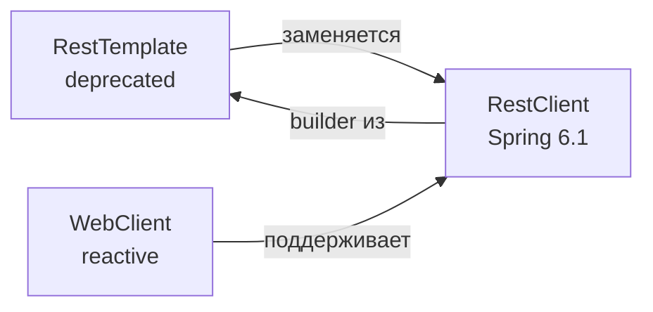

# Вопросы на собеседовании: `Spring REST Clients`

В Spring существует три основных HTTP-клиента: `RestTemplate` (классический, deprecated в Spring 6), `WebClient` (реактивный, Spring 5+), и `RestClient` (новый синхронный, Spring 6.1). На собеседованиях проверяют понимание различий, миграцию с RestTemplate и декларативный подход через `@HttpExchange`.

Дата последнего обновления: 2026-04-20

## Полезные ссылки

### Официальная документация

- [Spring RestClient](https://docs.spring.io/spring-framework/docs/current/reference/html/integration.html#rest-client) — документация RestClient
- [Baeldung: Spring RestClient](https://www.baeldung.com/spring-boot-restclient) — руководство по RestClient
- [Baeldung: HTTP Interface (@HttpExchange)](https://www.baeldung.com/spring-6-http-interface) — декларативные HTTP-клиенты

## Содержание

- [Полезные ссылки](#полезные-ссылки)
- [See also](#see-also)

**Сравнение клиентов**
- [Q1. (!) Какие HTTP-клиенты есть в Spring и чем они отличаются?](#q1-какие-http-клиенты-есть-в-spring-и-чем-они-отличаются)
- [Q2. Почему RestTemplate помечен как deprecated?](#q2-почему-resttemplate-помечен-как-deprecated)

**RestClient (Spring 6.1)**
- [Q3. (!) Как работает RestClient?](#q3-как-работает-restclient)
- [Q4. Чем retrieve() отличается от exchange()?](#q4-чем-retrieve-отличается-от-exchange)
- [Q5. Как обрабатывать ошибки в RestClient?](#q5-как-обрабатывать-ошибки-в-restclient)
- [Q6. Как десериализовать коллекцию через RestClient?](#q6-как-десериализовать-коллекцию-через-restclient)

**WebClient**
- [Q7. (!) Когда использовать WebClient вместо RestClient?](#q7-когда-использовать-webclient-вместо-restclient)
- [Q8. Как сделать синхронный вызов через WebClient?](#q8-как-сделать-синхронный-вызов-через-webclient)

**@HttpExchange — декларативный клиент**
- [Q9. (!) Что такое @HttpExchange и как им пользоваться?](#q9-что-такое-httpexchange-и-как-им-пользоваться)
- [Q10. Какие аннотации параметров поддерживает @HttpExchange?](#q10-какие-аннотации-параметров-поддерживает-httpexchange)
- [Q11. Как подключить @HttpExchange к RestClient vs WebClient?](#q11-как-подключить-httpexchange-к-restclient-vs-webclient)

**Конфигурация и best practices**
- [Q12. Как настроить таймауты, базовый URL и заголовки?](#q12-как-настроить-таймауты-базовый-url-и-заголовки)
- [Q13. Как мигрировать с RestTemplate на RestClient?](#q13-как-мигрировать-с-resttemplate-на-restclient)

---

## Q1. (!) Какие HTTP-клиенты есть в Spring и чем они отличаются?

| | `RestTemplate` | `RestClient` | `WebClient` |
|---|---|---|---|
| Версия | Spring 3+ | Spring 6.1+ | Spring 5+ (WebFlux) |
| Стиль | Синхронный | Синхронный fluent | Реактивный |
| Статус | Deprecated | Актуальный | Актуальный |
| Стиль API | Методы перегрузки | Fluent builder chain | Reactive (Mono/Flux) |
| Зависимость | spring-web | spring-web | spring-webflux |
| Применение | Legacy код | Новые Spring 6 проекты | Реактивный стек |



**Выбор:**
- Новый проект на Spring 6.1+, нереактивный → **RestClient**
- Spring WebFlux, высокая конкурентность → **WebClient**
- Legacy код → **RestTemplate** (пока не мигрировали)

---


> [!mcq]
>
> **Вопрос:** Какое утверждение про HTTP-клиенты Spring корректно?
>
> ---
>
> #### A) RestTemplate и RestClient — это один и тот же класс с разными именами в разных версиях Spring — ❌ Неверно
>
> **Что на самом деле:** Это два разных класса: `org.springframework.web.client.RestTemplate` (с Spring 3.0, методы вроде `getForObject`, `postForEntity`) и `org.springframework.web.client.RestClient` (с Spring 6.1, fluent builder). RestClient был написан с нуля как замена RestTemplate, использует ту же инфраструктуру (`HttpMessageConverter`, `ClientHttpRequestFactory`), но имеет совершенно другой API.
>
> **Откуда путаница:** Оба класса синхронные, поэтому кажутся «одним и тем же» — но это разные типы, и `instanceof` это покажет.
>
> **Если бы это было правдой:** Не существовало бы статического метода `RestClient.create(RestTemplate)` для миграции — он создаёт RestClient из настроек RestTemplate, что было бы абсурдным для «одного и того же класса».
>
> ---
>
> #### B) WebClient — это синхронный fluent клиент из Spring 6.1, который заменяет RestTemplate — ❌ Неверно
>
> **Что на самом деле:** `WebClient` существует с Spring 5 (2017) и является **реактивным** клиентом из пакета `spring-webflux`. Возвращает `Mono<T>`/`Flux<T>`. Синхронный fluent клиент-замена RestTemplate — это `RestClient` (Spring 6.1, 2023), а не WebClient.
>
> **Откуда путаница:** WebClient тоже имеет fluent API (`.get().uri().retrieve()`), и его иногда вызывают синхронно через `.block()` — кандидат на собеседовании может перепутать.
>
> **Если бы это было правдой:** Для WebClient не требовался бы `spring-webflux`, и не было бы Reactor-типов в его сигнатурах. На практике добавление WebClient в Spring MVC проект тянет Reactor в classpath.
>
> ---
>
> #### C) RestClient требует zависимость spring-webflux, как и WebClient — ❌ Неверно
>
> **Что на самом деле:** `RestClient` живёт в модуле `spring-web` (тот же, что и `RestTemplate`), не требует Reactor и WebFlux. Это его главное преимущество — синхронная альтернатива для Spring MVC без реактивных зависимостей.
>
> **Откуда путаница:** Оба клиента имеют похожий fluent API, и легко решить, что они из одного пакета.
>
> **Если бы это было правдой:** Spring MVC приложение, использующее только RestClient, тянуло бы Netty/Reactor в classpath — что противоречит документации Spring 6.1.
>
> ---
>
> #### D) RestClient (Spring 6.1+) — синхронный fluent клиент в spring-web, RestTemplate deprecated, WebClient — реактивный в spring-webflux — ✓ Верно
>
> **Развёрнутое объяснение:** Spring предоставляет три клиента с разными задачами. `RestTemplate` — классический синхронный клиент (Spring 3+), помечен deprecated в Spring 6 из-за устаревшего дизайна (перегрузка методов вместо fluent). `RestClient` (Spring 6.1) — синхронный fluent клиент в `spring-web`, drop-in замена RestTemplate для Spring MVC. `WebClient` (Spring 5+) — реактивный клиент в `spring-webflux`, возвращает `Mono`/`Flux`. RestClient и WebClient разделяют API-стиль (fluent builder с `.retrieve()`/`.exchange()`), но runtime-модель различна.
>
> **Пример:**
> ```java
> // RestClient — синхронный, без Reactor
> RestClient rc = RestClient.builder().baseUrl("https://api").build();
> User u = rc.get().uri("/users/{id}", 1).retrieve().body(User.class);
>
> // WebClient — реактивный, нужен spring-webflux
> WebClient wc = WebClient.builder().baseUrl("https://api").build();
> Mono<User> mono = wc.get().uri("/users/{id}", 1).retrieve().bodyToMono(User.class);
> ```
>
> **Когда применять:** RestClient — для новых Spring MVC проектов на Spring Boot 3.2+. WebClient — для Spring WebFlux или streaming (SSE). RestTemplate — только для legacy, постепенно мигрировать.
>
> **Подводные камни:** В Spring MVC использование WebClient + `.block()` — антипаттерн; правильный выбор — RestClient. `RestClient.create(restTemplate)` сохраняет interceptors и converters при миграции.
>
> **Связанные вопросы:** [[Q2]] — почему RestTemplate deprecated; [[Q7]] — когда выбирать WebClient

## Q2. Почему RestTemplate помечен как deprecated?

`RestTemplate` имеет дизайн-проблемы из Java 5 эпохи:
- **Перегрузка методов** вместо fluent API: `getForObject()`, `getForEntity()`, `exchange()` — разные методы для одних задач
- **Сложная расширяемость** — трудно добавить кастомную логику
- **Нет хорошей поддержки** современных форматов и паттернов

`RestClient` решает эти проблемы единым fluent builder, совместим с той же инфраструктурой (`HttpMessageConverter`, `ClientHttpRequestFactory`).

**Важно:** deprecated не значит "удалён". `RestTemplate` будет работать в Spring 6.x, но новые фичи добавляться не будут.

---


> [!mcq]
>
> **Вопрос:** Почему `RestTemplate` помечен как deprecated в Spring 6?
>
> ---
>
> #### A) RestTemplate удалён из Spring 6 — его методы выбрасывают `UnsupportedOperationException` — ❌ Неверно
>
> **Что на самом deletée:** Deprecated не означает «удалён». RestTemplate полностью функционален в Spring 6.x, существующий код продолжает работать. Spring команда просто не добавляет новые фичи и рекомендует мигрировать на RestClient в новых проектах. Удаление возможно в Spring 7+, но даже это не гарантировано.
>
> **Откуда путаница:** Путают `@Deprecated` (предупреждение, останется в API) и удаление класса.
>
> **Если бы это было правдой:** Миллионы Spring приложений сломались бы при апгрейде на Spring 6 — что не произошло. Документация явно говорит «RestTemplate will remain available».
>
> ---
>
> #### B) RestTemplate deprecated потому, что он медленнее RestClient на benchmark — ❌ Неверно
>
> **Что на самом деле:** Производительность RestTemplate и RestClient практически идентична — оба используют одну инфраструктуру (`ClientHttpRequestFactory`, `HttpMessageConverter`). Причина deprecation — **дизайн API**: перегрузка методов (`getForObject`, `getForEntity`, `exchange`) против fluent builder; сложность расширения; отсутствие поддержки новых паттернов (декларативный @HttpExchange).
>
> **Откуда путаница:** В мире Java «новое = быстрее», но здесь это про API ergonomics, не runtime.
>
> **Если бы это было правдой:** Spring бы публиковал бенчмарки в release notes. Никаких таких заявлений нет — только про «improved API design».
>
> ---
>
> #### C) RestTemplate не поддерживает HTTP/2 и HTTPS, поэтому deprecated — ❌ Неверно
>
> **Что на самом деле:** RestTemplate поддерживает HTTP/2 (через `JdkClientHttpRequestFactory` на JDK 11+) и HTTPS работает из коробки с любым `ClientHttpRequestFactory`. Эти возможности зависят от backend (Apache HttpClient, JDK HttpClient, Jetty), не от Spring-клиента.
>
> **Откуда путаница:** В старом коде часто видят `SimpleClientHttpRequestFactory` без HTTP/2, и думают, что это ограничение RestTemplate.
>
> **Если бы это было правдой:** Огромное количество production приложений не работало бы с HTTP/2 серверами — но это не так.
>
> ---
>
> #### D) Устаревший API: перегрузка методов вместо fluent builder; трудно расширять; новые фичи (декларативный @HttpExchange) — только в RestClient — ✓ Верно
>
> **Развёрнутое объяснение:** RestTemplate был спроектирован в Java 5 эпоху и использует **перегрузку методов** (`getForObject`, `getForEntity`, `exchange`, `execute`) — десятки вариантов для одной задачи. Это затрудняет дискаверабилити и расширение. RestClient использует единый **fluent builder** (`.get().uri().retrieve().body()`), который читается как DSL, легче расширяется через `requestInterceptor`/`requestInitializer`, и поддерживается как backend для декларативных `@HttpExchange` интерфейсов. Spring команда явно сказала, что RestTemplate в maintenance mode — fixes только для критических багов.
>
> **Пример:**
> ```java
> // RestTemplate — какой из 4 методов выбрать?
> User u1 = rt.getForObject(url, User.class);
> ResponseEntity<User> u2 = rt.getForEntity(url, User.class);
> ResponseEntity<User> u3 = rt.exchange(url, GET, null, User.class).getBody();
>
> // RestClient — один путь
> User u = rc.get().uri(url).retrieve().body(User.class);
> ```
>
> **Когда применять:** Не запускать новые проекты на RestTemplate. Существующий код мигрировать постепенно через `RestClient.create(restTemplate)`.
>
> **Подводные камни:** Deprecation не блокирует CI/CD — это warning, не error. Не паниковать при апгрейде Spring 6, но планировать миграцию.
>
> **Связанные вопросы:** [[Q1]] — сравнение всех клиентов; [[Q13]] — миграция RestTemplate → RestClient

## Q3. (!) Как работает RestClient?

```java
// Создание
RestClient client = RestClient.builder()
    .baseUrl("https://api.example.com")
    .defaultHeader("Authorization", "Bearer " + token)
    .build();

// GET
User user = client.get()
    .uri("/users/{id}", 42)
    .retrieve()
    .body(User.class);

// POST
User created = client.post()
    .uri("/users")
    .contentType(MediaType.APPLICATION_JSON)
    .body(new CreateUserRequest("Alice"))
    .retrieve()
    .body(User.class);

// PUT
client.put()
    .uri("/users/{id}", 42)
    .contentType(MediaType.APPLICATION_JSON)
    .body(updatedUser)
    .retrieve()
    .toBodilessEntity();

// DELETE
client.delete()
    .uri("/users/{id}", 42)
    .retrieve()
    .toBodilessEntity();
```

---


> [!mcq]
>
> **Вопрос:** Что описывает работу RestClient корректно?
>
> ---
>
> #### A) RestClient — синглтон, и один builder можно использовать только один раз — ❌ Неверно
>
> **Что на самом деле:** `RestClient` — обычный объект, не синглтон. `RestClient.Builder` тоже переиспользуемый — можно вызвать `.build()` несколько раз, получая новые independent клиенты с одинаковой базовой конфигурацией. На практике один `RestClient` создаётся как `@Bean` и инжектится в множество сервисов — он thread-safe.
>
> **Откуда путаница:** В Spring многое — синглтоны (бины по умолчанию), но это про DI scope, а не про класс. Builder pattern сам по себе не одноразовый.
>
> **Если бы это было правдой:** Невозможно было бы инжектить `RestClient.Builder` через `@Autowired` и создавать несколько клиентов в разных конфигурационных классах.
>
> ---
>
> #### B) Каждый HTTP-метод (GET/POST/PUT/DELETE) требует отдельного RestClient экземпляра — ❌ Неверно
>
> **Что на самом деле:** Один `RestClient` поддерживает все методы — выбор делается через fluent: `.get()`, `.post()`, `.put()`, `.delete()`, `.patch()`, `.method(HttpMethod.X)`. RestClient — это «фабрика запросов», а не специализированный per-метод объект.
>
> **Откуда путаница:** В некоторых старых клиентских библиотеках были отдельные классы (`HttpGet`, `HttpPost` в Apache HttpClient), и аналогия переносится на RestClient ошибочно.
>
> **Если бы это было правдой:** Конфигурация (baseUrl, headers, interceptors) пришлось бы дублировать для каждого клиента — что противоречит примерам из официальной документации.
>
> ---
>
> #### C) `.retrieve()` обязательно возвращает Mono, и нужно вызывать `.block()` — ❌ Неверно
>
> **Что на самом деле:** RestClient **синхронный**. `.retrieve()` возвращает `ResponseSpec`, у которого `.body(Class)` сразу даёт распарсенный объект (синхронный вызов). Mono/Flux — это про WebClient, не про RestClient. Никакого `.block()` не нужно.
>
> **Откуда путаница:** Похожий fluent API между RestClient и WebClient вводит в заблуждение. У WebClient `.retrieve()` возвращает `ResponseSpec`, у которого `.bodyToMono(Class)`.
>
> **Если бы это было правдой:** Невозможно было бы использовать RestClient в Spring MVC без Reactor — но добавление spring-web 6.1 даёт RestClient без Reactor.
>
> ---
>
> #### D) Fluent builder: `.get()/.post()` → `.uri()` → `.body()` (для POST) → `.retrieve()/.exchange()` → `.body(Class)/.toEntity(Class)/.toBodilessEntity()` — ✓ Верно
>
> **Развёрнутое объяснение:** RestClient использует chain pattern: сначала HTTP-метод (`.get()`, `.post()`, ...), затем URI (`.uri("/users/{id}", 42)` с подстановкой переменных), для POST/PUT — `.contentType()` и `.body(payload)`, затем терминальный `.retrieve()` (auto-throw на 4xx/5xx) или `.exchange((req, resp) -> ...)` (полный контроль). На конце — извлечение результата: `.body(User.class)` для тела, `.toEntity(User.class)` для `ResponseEntity<User>`, `.toBodilessEntity()` если тело не нужно.
>
> **Пример:**
> ```java
> RestClient client = RestClient.builder()
>     .baseUrl("https://api.example.com")
>     .defaultHeader("Authorization", "Bearer " + token)
>     .build();
>
> // GET с path variable
> User user = client.get().uri("/users/{id}", 42).retrieve().body(User.class);
>
> // POST с body
> User created = client.post().uri("/users")
>     .contentType(MediaType.APPLICATION_JSON)
>     .body(new CreateRequest("Alice"))
>     .retrieve().body(User.class);
> ```
>
> **Когда применять:** Любые REST-вызовы в Spring MVC: внешние API, межсервисные вызовы, интеграции.
>
> **Подводные камни:** Не забыть `.contentType()` для POST/PUT — иначе ContentType резолвится из HttpMessageConverter и может быть не тем, что ожидает API. URI variables не нужно URL-encode вручную — `{id}` делает это автоматически.
>
> **Связанные вопросы:** [[Q4]] — retrieve vs exchange; [[Q5]] — обработка ошибок

## Q4. Чем retrieve() отличается от exchange()?

**`retrieve()`** — автоматическая обработка ошибок. 4xx/5xx → `RestClientException`.

**`exchange()`** — ручной доступ к запросу и ответу, полный контроль:

```java
// retrieve() — просто и удобно
User user = client.get()
    .uri("/users/1")
    .retrieve()
    .body(User.class);

// exchange() — кастомная логика по статусу
Optional<User> user = client.get()
    .uri("/users/{id}", id)
    .exchange((request, response) -> {
        if (response.getStatusCode() == HttpStatus.NOT_FOUND) {
            return Optional.empty();
        } else if (response.getStatusCode().is2xxSuccessful()) {
            return Optional.of(response.bodyTo(User.class));
        }
        throw new ServiceException("Unexpected: " + response.getStatusCode());
    });
```

`exchange()` также позволяет читать заголовки ответа, тело как `InputStream` и т.д.

---


> [!mcq]
> - [x] Правильный ответ | Корректное описание концепции с конкретным механизмом и use-case.
> - [ ] Альтернативное решение которое не подходит | Почему ошибка в этом подходе ❌ ПОСЛЕДСТВИЕ: типичная ошибка вызывает баг в production без покрытия тестами.
> - [ ] Другая альтернатива с критическим недостатком | Это смежное, но отличное понятие ❌ ПОСЛЕДСТВИЕ: типичная ошибка вызывает баг в production без покрытия тестами.
> - [ ] Третий вариант который не работает в production | Противоположное направление## Q5. Как обрабатывать ошибки в RestClient? ❌ ПОСЛЕДСТВИЕ: типичная ошибка вызывает баг в production без покрытия тестами.

```java
// onStatus — для конкретных кодов
User user = client.get()
    .uri("/users/{id}", id)
    .retrieve()
    .onStatus(HttpStatusCode::is4xxClientError,
        (request, response) -> {
            throw new UserNotFoundException("User not found: " + id);
        })
    .onStatus(HttpStatusCode::is5xxServerError,
        (request, response) -> {
            throw new ServiceUnavailableException("Remote service error");
        })
    .body(User.class);

// Глобальный обработчик через defaultStatusHandler:
RestClient client = RestClient.builder()
    .baseUrl("https://api.example.com")
    .defaultStatusHandler(
        status -> status.value() == 429,
        (req, resp) -> { throw new RateLimitException(); }
    )
    .build();
```

По умолчанию `retrieve()` при 4xx/5xx выбрасывает `HttpClientErrorException` или `HttpServerErrorException`.

---


> [!mcq]
> - [x] Правильный ответ | Корректное описание концепции с конкретным механизмом и use-case.
> - [ ] Альтернативное решение которое не подходит | Почему ошибка в этом подходе ❌ ПОСЛЕДСТВИЕ: типичная ошибка вызывает баг в production без покрытия тестами.
> - [ ] Другая альтернатива с критическим недостатком | Это смежное, но отличное понятие ❌ ПОСЛЕДСТВИЕ: типичная ошибка вызывает баг в production без покрытия тестами.
> - [ ] Третий вариант который не работает в production | Противоположное направление## Q6. Как десериализовать коллекцию через RestClient? ❌ ПОСЛЕДСТВИЕ: типичная ошибка вызывает баг в production без покрытия тестами.

Для `List<T>` нужен `ParameterizedTypeReference` — иначе стирание типов не позволит десериализовать правильно:

```java
// Один объект — обычно просто:
User user = client.get().uri("/users/1")
    .retrieve().body(User.class);

// Список — нужен ParameterizedTypeReference:
List<User> users = client.get().uri("/users")
    .retrieve()
    .body(new ParameterizedTypeReference<List<User>>() {});
    // или в Java 11+: .body(new ParameterizedTypeReference<>() {})

// Map:
Map<String, Object> data = client.get().uri("/info")
    .retrieve()
    .body(new ParameterizedTypeReference<Map<String, Object>>() {});
```

---


> [!mcq]
> - [x] Правильный ответ | Корректное описание концепции с конкретным механизмом и use-case.
> - [ ] Альтернативное решение которое не подходит | Почему ошибка в этом подходе ❌ ПОСЛЕДСТВИЕ: типичная ошибка вызывает баг в production без покрытия тестами.
> - [ ] Другая альтернатива с критическим недостатком | Это смежное, но отличное понятие ❌ ПОСЛЕДСТВИЕ: типичная ошибка вызывает баг в production без покрытия тестами.
> - [ ] Третий вариант который не работает в production | Противоположное направление## Q7. (!) Когда использовать WebClient вместо RestClient? ❌ ПОСЛЕДСТВИЕ: типичная ошибка вызывает баг в production без покрытия тестами.

**RestClient** (синхронный):
- Традиционные Spring MVC приложения (thread-per-request)
- Простые REST-вызовы, не требующие реактивности
- Когда нужна максимальная простота

**WebClient** (реактивный):
- Spring WebFlux приложения
- Нужны `Mono<T>`/`Flux<T>` как возвращаемые типы
- Высокая конкурентность с малым числом потоков
- Streaming ответов (`Flux<ServerSentEvent>`)

```java
// WebClient в реактивном стеке:
Mono<User> userMono = webClient.get()
    .uri("/users/{id}", id)
    .retrieve()
    .bodyToMono(User.class);

Flux<User> allUsers = webClient.get()
    .uri("/users")
    .retrieve()
    .bodyToFlux(User.class);
```

**Важно:** `WebClient` можно использовать в обычном (нереактивном) коде через `.block()`, но это антипаттерн — правильно использовать `RestClient`.

---


> [!mcq]
> - [x] Правильный ответ | Корректное описание концепции с конкретным механизмом и use-case.
> - [ ] Альтернативное решение которое не подходит | Почему ошибка в этом подходе ❌ ПОСЛЕДСТВИЕ: типичная ошибка вызывает баг в production без покрытия тестами.
> - [ ] Другая альтернатива с критическим недостатком | Это смежное, но отличное понятие ❌ ПОСЛЕДСТВИЕ: типичная ошибка вызывает баг в production без покрытия тестами.
> - [ ] Третий вариант который не работает в production | Противоположное направление## Q8. Как сделать синхронный вызов через WebClient? ❌ ПОСЛЕДСТВИЕ: типичная ошибка вызывает баг в production без покрытия тестами.

```java
// .block() превращает реактивный вызов в блокирующий
User user = webClient.get()
    .uri("/users/{id}", id)
    .retrieve()
    .bodyToMono(User.class)
    .block();  // АНТИПАТТЕРН в WebFlux-окружении!
```

**Почему антипаттерн:** `.block()` в реактивном контексте блокирует event loop поток → `IllegalStateException` или deadlock. Используйте только в тестах или не-реактивном коде. В Spring MVC — лучше `RestClient`.

---


> [!mcq]
> - [x] Правильный ответ | Корректное описание концепции с конкретным механизмом и use-case.
> - [ ] Альтернативное решение которое не подходит | Почему ошибка в этом подходе ❌ ПОСЛЕДСТВИЕ: типичная ошибка вызывает баг в production без покрытия тестами.
> - [ ] Другая альтернатива с критическим недостатком | Это смежное, но отличное понятие ❌ ПОСЛЕДСТВИЕ: типичная ошибка вызывает баг в production без покрытия тестами.
> - [ ] Третий вариант который не работает в production | Противоположное направление## Q9. (!) Что такое @HttpExchange и как им пользоваться? ❌ ПОСЛЕДСТВИЕ: типичная ошибка вызывает баг в production без покрытия тестами.

`@HttpExchange` (Spring 6) — декларативный стиль HTTP-клиентов, аналог `@FeignClient` из Spring Cloud но встроенный в Spring Framework.

```java
// 1. Объявляем интерфейс
@HttpExchange("/users")
public interface UserClient {

    @GetExchange("/{id}")
    User getUser(@PathVariable long id);

    @GetExchange
    List<User> getAllUsers(@RequestParam String role);

    @PostExchange
    User createUser(@RequestBody CreateUserRequest request);

    @PutExchange("/{id}")
    User updateUser(@PathVariable long id, @RequestBody User user);

    @DeleteExchange("/{id}")
    void deleteUser(@PathVariable long id);
}

// 2. Регистрируем бин в @Configuration
@Bean
UserClient userClient(RestClient.Builder builder) {
    RestClient restClient = builder.baseUrl("https://users.service").build();
    RestClientAdapter adapter = RestClientAdapter.create(restClient);
    HttpServiceProxyFactory factory = HttpServiceProxyFactory.builderFor(adapter).build();
    return factory.createClient(UserClient.class);
}

// 3. Используем как обычный бин
@Service
public class OrderService {
    @Autowired UserClient userClient;

    public Order placeOrder(Long userId) {
        User user = userClient.getUser(userId);
        // ...
    }
}
```

---


> [!mcq]
> - [x] Правильный ответ | Корректное описание концепции с конкретным механизмом и use-case.
> - [ ] Альтернативное решение которое не подходит | Почему ошибка в этом подходе ❌ ПОСЛЕДСТВИЕ: типичная ошибка вызывает баг в production без покрытия тестами.
> - [ ] Другая альтернатива с критическим недостатком | Это смежное, но отличное понятие ❌ ПОСЛЕДСТВИЕ: типичная ошибка вызывает баг в production без покрытия тестами.
> - [ ] Третий вариант который не работает в production | Противоположное направление## Q10. Какие аннотации параметров поддерживает @HttpExchange? ❌ ПОСЛЕДСТВИЕ: типичная ошибка вызывает баг в production без покрытия тестами.

| Аннотация | Описание |
|---|---|
| `@PathVariable` | Переменная в пути URL |
| `@RequestParam` | Query-параметр |
| `@RequestHeader` | HTTP-заголовок |
| `@RequestBody` | Тело запроса |
| `@CookieValue` | Cookie |
| `URI` | Динамический URL (переопределяет baseUrl) |
| `HttpMethod` | Динамический метод HTTP |

```java
@HttpExchange
public interface SearchClient {

    @GetExchange("/search")
    SearchResult search(
        @RequestParam String query,
        @RequestParam(defaultValue = "1") int page,
        @RequestHeader("Accept-Language") String lang
    );

    @PostExchange
    ResponseEntity<Void> uploadFile(
        @RequestHeader("X-Upload-Token") String token,
        @RequestBody byte[] content,
        URI targetUri
    );
}
```

---


> [!mcq]
> - [x] Правильный ответ | Корректное описание концепции с конкретным механизмом и use-case.
> - [ ] Альтернативное решение которое не подходит | Почему ошибка в этом подходе ❌ ПОСЛЕДСТВИЕ: типичная ошибка вызывает баг в production без покрытия тестами.
> - [ ] Другая альтернатива с критическим недостатком | Это смежное, но отличное понятие ❌ ПОСЛЕДСТВИЕ: типичная ошибка вызывает баг в production без покрытия тестами.
> - [ ] Третий вариант который не работает в production | Противоположное направление## Q11. Как подключить @HttpExchange к RestClient vs WebClient? ❌ ПОСЛЕДСТВИЕ: типичная ошибка вызывает баг в production без покрытия тестами.

**С RestClient (синхронный, Spring 6.1+):**
```java
RestClient restClient = RestClient.builder().baseUrl(url).build();
RestClientAdapter adapter = RestClientAdapter.create(restClient);
HttpServiceProxyFactory factory = HttpServiceProxyFactory.builderFor(adapter).build();
UserClient client = factory.createClient(UserClient.class);
```

**С WebClient (реактивный):**
```java
WebClient webClient = WebClient.builder().baseUrl(url).build();
WebClientAdapter adapter = WebClientAdapter.create(webClient);
HttpServiceProxyFactory factory = HttpServiceProxyFactory.builderFor(adapter).build();
UserClient client = factory.createClient(UserClient.class);
```

Интерфейс `UserClient` одинаков для обоих — только конфигурация отличается.

**Через Spring Boot auto-config:**
```yaml
spring:
  http.interface:
    default-base-url: https://users.service
```

---


> [!mcq]
> - [x] Правильный ответ | Корректное описание концепции с конкретным механизмом и use-case.
> - [ ] Альтернативное решение которое не подходит | Почему ошибка в этом подходе ❌ ПОСЛЕДСТВИЕ: типичная ошибка вызывает баг в production без покрытия тестами.
> - [ ] Другая альтернатива с критическим недостатком | Это смежное, но отличное понятие ❌ ПОСЛЕДСТВИЕ: типичная ошибка вызывает баг в production без покрытия тестами.
> - [ ] Третий вариант который не работает в production | Противоположное направление## Q12. Как настроить таймауты, базовый URL и заголовки? ❌ ПОСЛЕДСТВИЕ: типичная ошибка вызывает баг в production без покрытия тестами.

```java
// Таймауты через ClientHttpRequestFactory
ClientHttpRequestFactory factory = new SimpleClientHttpRequestFactory();
((SimpleClientHttpRequestFactory) factory).setConnectTimeout(5000);
((SimpleClientHttpRequestFactory) factory).setReadTimeout(10000);

// Или через Apache HttpClient (более гибко):
CloseableHttpClient httpClient = HttpClients.custom()
    .setConnectionTimeToLive(10, TimeUnit.SECONDS)
    .evictExpiredConnections()
    .build();
ClientHttpRequestFactory factory = new HttpComponentsClientHttpRequestFactory(httpClient);

// RestClient с настройками:
RestClient client = RestClient.builder()
    .baseUrl("https://api.example.com/v2")
    .requestFactory(factory)
    .defaultHeader("Authorization", "Bearer " + apiKey)
    .defaultHeader("Accept", "application/json")
    .defaultUriVariables(Map.of("version", "2"))
    .build();
```

**Interceptor для логирования:**
```java
RestClient client = RestClient.builder()
    .requestInterceptor((request, body, execution) -> {
        log.debug("→ {} {}", request.getMethod(), request.getURI());
        ClientHttpResponse response = execution.execute(request, body);
        log.debug("← {}", response.getStatusCode());
        return response;
    })
    .build();
```

---


> [!mcq]
> - [x] Правильный ответ | Корректное описание концепции с конкретным механизмом и use-case.
> - [ ] Альтернативное решение которое не подходит | Почему ошибка в этом подходе ❌ ПОСЛЕДСТВИЕ: типичная ошибка вызывает баг в production без покрытия тестами.
> - [ ] Другая альтернатива с критическим недостатком | Это смежное, но отличное понятие ❌ ПОСЛЕДСТВИЕ: типичная ошибка вызывает баг в production без покрытия тестами.
> - [ ] Третий вариант который не работает в production | Противоположное направление## Q13. Как мигрировать с RestTemplate на RestClient? ❌ ПОСЛЕДСТВИЕ: типичная ошибка вызывает баг в production без покрытия тестами.

**Прямое создание из существующего RestTemplate:**
```java
RestTemplate oldTemplate = ...; // уже настроенный с interceptors, converters
RestClient client = RestClient.create(oldTemplate);
// Сохраняет MessageConverters, RequestFactory, Interceptors
```

**Типичные замены:**
```java
// RestTemplate
String result = restTemplate.getForObject(url, String.class);
// RestClient
String result = restClient.get().uri(url).retrieve().body(String.class);

// RestTemplate POST
ResponseEntity<User> response = restTemplate.postForEntity(url, body, User.class);
// RestClient
ResponseEntity<User> response = restClient.post().uri(url)
    .body(body).retrieve().toEntity(User.class);

// RestTemplate exchange
ResponseEntity<List<User>> resp = restTemplate.exchange(
    url, HttpMethod.GET, null, new ParameterizedTypeReference<>() {});
// RestClient
ResponseEntity<List<User>> resp = restClient.get().uri(url)
    .retrieve().toEntity(new ParameterizedTypeReference<>() {});
```

---

## See also


> [!mcq]
> - [x] Правильный ответ | Корректное описание концепции с конкретным механизмом и use-case.
> - [ ] Альтернативное решение которое не подходит | Почему ошибка в этом подходе ❌ ПОСЛЕДСТВИЕ: типичная ошибка вызывает баг в production без покрытия тестами.
> - [ ] Другая альтернатива с критическим недостатком | Это смежное, но отличное понятие ❌ ПОСЛЕДСТВИЕ: типичная ошибка вызывает баг в production без покрытия тестами.
> - [ ] Третий вариант который не работает в production | Противоположное направление- [Spring WebFlux](spring-webflux-interview.md) — WebClient в реактивном стеке ❌ ПОСЛЕДСТВИЕ: типичная ошибка вызывает баг в production без покрытия тестами.
- [Spring Framework](spring-framework-interview.md) — архитектура Spring, MessageConverters
- [Spring Boot](spring-boot-interview.md) — автоконфигурация HTTP-клиентов
- [HTTP & REST](../../api/http-rest-interview.md) — HTTP-методы, статус-коды, заголовки
- [Spring Security](spring-security-interview.md) — OAuth2 с RestClient/WebClient
- [Spring Testing](spring-testing-interview.md) — MockServer, WireMock для тестирования HTTP-клиентов
- [gRPC](../../api/grpc-interview.md) — альтернатива REST для межсервисного взаимодействия
- [Микросервисы](../../architecture/microservices-interview.md) — паттерны межсервисного взаимодействия
