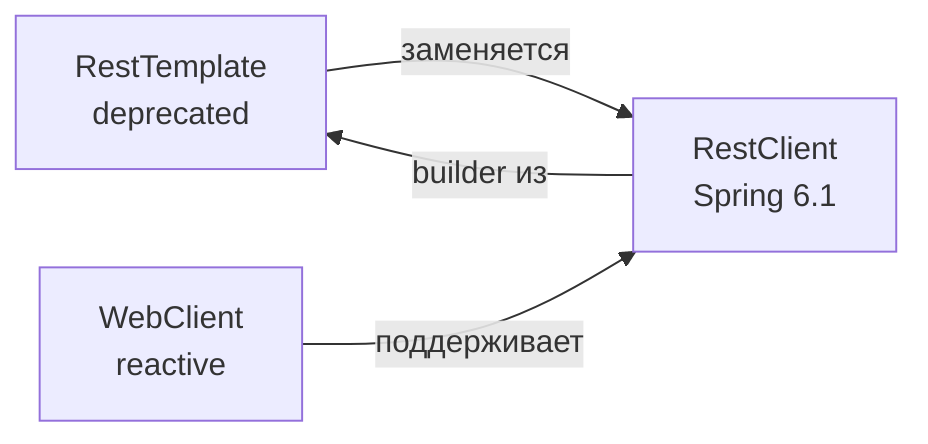

# Вопросы на собеседовании: `Spring REST Clients`

В Spring существует три основных HTTP-клиента: `RestTemplate` (классический, deprecated в Spring 6), `WebClient` (реактивный, Spring 5+), и `RestClient` (новый синхронный, Spring 6.1). На собеседованиях проверяют понимание различий, миграцию с RestTemplate и декларативный подход через `@HttpExchange`.

Дата последнего обновления: 2026-04-20

## Полезные ссылки

### Официальная документация

- [Spring RestClient](https://docs.spring.io/spring-framework/docs/current/reference/html/integration.html#rest-client) — документация RestClient
- [Baeldung: Spring RestClient](https://www.baeldung.com/spring-boot-restclient) — руководство по RestClient
- [Baeldung: HTTP Interface (@HttpExchange)](https://www.baeldung.com/spring-6-http-interface) — декларативные HTTP-клиенты

## Содержание

- [Полезные ссылки](#полезные-ссылки)
- [See also](#see-also)

**Сравнение клиентов**
- [Q1. (!) Какие HTTP-клиенты есть в Spring и чем они отличаются?](#q1-какие-http-клиенты-есть-в-spring-и-чем-они-отличаются)
- [Q2. Почему RestTemplate помечен как deprecated?](#q2-почему-resttemplate-помечен-как-deprecated)

**RestClient (Spring 6.1)**
- [Q3. (!) Как работает RestClient?](#q3-как-работает-restclient)
- [Q4. Чем retrieve() отличается от exchange()?](#q4-чем-retrieve-отличается-от-exchange)
- [Q5. Как обрабатывать ошибки в RestClient?](#q5-как-обрабатывать-ошибки-в-restclient)
- [Q6. Как десериализовать коллекцию через RestClient?](#q6-как-десериализовать-коллекцию-через-restclient)

**WebClient**
- [Q7. (!) Когда использовать WebClient вместо RestClient?](#q7-когда-использовать-webclient-вместо-restclient)
- [Q8. Как сделать синхронный вызов через WebClient?](#q8-как-сделать-синхронный-вызов-через-webclient)

**@HttpExchange — декларативный клиент**
- [Q9. (!) Что такое @HttpExchange и как им пользоваться?](#q9-что-такое-httpexchange-и-как-им-пользоваться)
- [Q10. Какие аннотации параметров поддерживает @HttpExchange?](#q10-какие-аннотации-параметров-поддерживает-httpexchange)
- [Q11. Как подключить @HttpExchange к RestClient vs WebClient?](#q11-как-подключить-httpexchange-к-restclient-vs-webclient)

**Конфигурация и best practices**
- [Q12. Как настроить таймауты, базовый URL и заголовки?](#q12-как-настроить-таймауты-базовый-url-и-заголовки)
- [Q13. Как мигрировать с RestTemplate на RestClient?](#q13-как-мигрировать-с-resttemplate-на-restclient)

---

## Q1. (!) Какие HTTP-клиенты есть в Spring и чем они отличаются?

| | `RestTemplate` | `RestClient` | `WebClient` |
|---|---|---|---|
| Версия | Spring 3+ | Spring 6.1+ | Spring 5+ (WebFlux) |
| Стиль | Синхронный | Синхронный fluent | Реактивный |
| Статус | Deprecated | Актуальный | Актуальный |
| Стиль API | Методы перегрузки | Fluent builder chain | Reactive (Mono/Flux) |
| Зависимость | spring-web | spring-web | spring-webflux |
| Применение | Legacy код | Новые Spring 6 проекты | Реактивный стек |



**Выбор:**
- Новый проект на Spring 6.1+, нереактивный → **RestClient**
- Spring WebFlux, высокая конкурентность → **WebClient**
- Legacy код → **RestTemplate** (пока не мигрировали)

---


> [!mcq]
>
> **Вопрос:** Какое утверждение про HTTP-клиенты Spring корректно?
>
> ---
>
> #### B) RestTemplate и RestClient — это один и тот же класс с разными именами в разных версиях Spring — ❌ Неверно
>
> **Что на самом деле:** Это два разных класса: `org.springframework.web.client.RestTemplate` (с Spring 3.0, методы вроде `getForObject`, `postForEntity`) и `org.springframework.web.client.RestClient` (с Spring 6.1, fluent builder). RestClient был написан с нуля как замена RestTemplate, использует ту же инфраструктуру (`HttpMessageConverter`, `ClientHttpRequestFactory`), но имеет совершенно другой API.
>
> **Откуда путаница:** Оба класса синхронные, поэтому кажутся «одним и тем же» — но это разные типы, и `instanceof` это покажет.
>
> **Если бы это было правдой:** Не существовало бы статического метода `RestClient.create(RestTemplate)` для миграции — он создаёт RestClient из настроек RestTemplate, что было бы абсурдным для «одного и того же класса».
>
> ---
>
> #### C) WebClient — это синхронный fluent клиент из Spring 6.1, который заменяет RestTemplate — ❌ Неверно
>
> **Что на самом деле:** `WebClient` существует с Spring 5 (2017) и является **реактивным** клиентом из пакета `spring-webflux`. Возвращает `Mono<T>`/`Flux<T>`. Синхронный fluent клиент-замена RestTemplate — это `RestClient` (Spring 6.1, 2023), а не WebClient.
>
> **Откуда путаница:** WebClient тоже имеет fluent API (`.get().uri().retrieve()`), и его иногда вызывают синхронно через `.block()` — кандидат на собеседовании может перепутать.
>
> **Если бы это было правдой:** Для WebClient не требовался бы `spring-webflux`, и не было бы Reactor-типов в его сигнатурах. На практике добавление WebClient в Spring MVC проект тянет Reactor в classpath.
>
> ---
>
> #### D) RestClient требует zависимость spring-webflux, как и WebClient — ❌ Неверно
>
> **Что на самом деле:** `RestClient` живёт в модуле `spring-web` (тот же, что и `RestTemplate`), не требует Reactor и WebFlux. Это его главное преимущество — синхронная альтернатива для Spring MVC без реактивных зависимостей.
>
> **Откуда путаница:** Оба клиента имеют похожий fluent API, и легко решить, что они из одного пакета.
>
> **Если бы это было правдой:** Spring MVC приложение, использующее только RestClient, тянуло бы Netty/Reactor в classpath — что противоречит документации Spring 6.1.
>
> ---
>
> #### A) RestClient (Spring 6.1+) — синхронный fluent клиент в spring-web, RestTemplate deprecated, WebClient — реактивный в spring-webflux — ✓ Верно
>
> **Развёрнутое объяснение:** Spring предоставляет три клиента с разными задачами. `RestTemplate` — классический синхронный клиент (Spring 3+), помечен deprecated в Spring 6 из-за устаревшего дизайна (перегрузка методов вместо fluent). `RestClient` (Spring 6.1) — синхронный fluent клиент в `spring-web`, drop-in замена RestTemplate для Spring MVC. `WebClient` (Spring 5+) — реактивный клиент в `spring-webflux`, возвращает `Mono`/`Flux`. RestClient и WebClient разделяют API-стиль (fluent builder с `.retrieve()`/`.exchange()`), но runtime-модель различна.
>
> **Пример:**
> ```java
> // RestClient — синхронный, без Reactor
> RestClient rc = RestClient.builder().baseUrl("https://api").build();
> User u = rc.get().uri("/users/{id}", 1).retrieve().body(User.class);
>
> // WebClient — реактивный, нужен spring-webflux
> WebClient wc = WebClient.builder().baseUrl("https://api").build();
> Mono<User> mono = wc.get().uri("/users/{id}", 1).retrieve().bodyToMono(User.class);
> ```
>
> **Когда применять:** RestClient — для новых Spring MVC проектов на Spring Boot 3.2+. WebClient — для Spring WebFlux или streaming (SSE). RestTemplate — только для legacy, постепенно мигрировать.
>
> **Подводные камни:** В Spring MVC использование WebClient + `.block()` — антипаттерн; правильный выбор — RestClient. `RestClient.create(restTemplate)` сохраняет interceptors и converters при миграции.
>
> **Связанные вопросы:** [[spring-rest-client-interview#Q2]] — почему RestTemplate deprecated; [[spring-rest-client-interview#Q7]] — когда выбирать WebClient

## Q2. Почему RestTemplate помечен как deprecated?

`RestTemplate` имеет дизайн-проблемы из Java 5 эпохи:
- **Перегрузка методов** вместо fluent API: `getForObject()`, `getForEntity()`, `exchange()` — разные методы для одних задач
- **Сложная расширяемость** — трудно добавить кастомную логику
- **Нет хорошей поддержки** современных форматов и паттернов

`RestClient` решает эти проблемы единым fluent builder, совместим с той же инфраструктурой (`HttpMessageConverter`, `ClientHttpRequestFactory`).

**Важно:** deprecated не значит "удалён". `RestTemplate` будет работать в Spring 6.x, но новые фичи добавляться не будут.

---


> [!mcq]
>
> **Вопрос:** Почему `RestTemplate` помечен как deprecated в Spring 6?
>
> ---
>
> #### C) RestTemplate удалён из Spring 6 — его методы выбрасывают `UnsupportedOperationException` — ❌ Неверно
>
> **Что на самом deletée:** Deprecated не означает «удалён». RestTemplate полностью функционален в Spring 6.x, существующий код продолжает работать. Spring команда просто не добавляет новые фичи и рекомендует мигрировать на RestClient в новых проектах. Удаление возможно в Spring 7+, но даже это не гарантировано.
>
> **Откуда путаница:** Путают `@Deprecated` (предупреждение, останется в API) и удаление класса.
>
> **Если бы это было правдой:** Миллионы Spring приложений сломались бы при апгрейде на Spring 6 — что не произошло. Документация явно говорит «RestTemplate will remain available».
>
> ---
>
> #### D) RestTemplate deprecated потому, что он медленнее RestClient на benchmark — ❌ Неверно
>
> **Что на самом деле:** Производительность RestTemplate и RestClient практически идентична — оба используют одну инфраструктуру (`ClientHttpRequestFactory`, `HttpMessageConverter`). Причина deprecation — **дизайн API**: перегрузка методов (`getForObject`, `getForEntity`, `exchange`) против fluent builder; сложность расширения; отсутствие поддержки новых паттернов (декларативный @HttpExchange).
>
> **Откуда путаница:** В мире Java «новое = быстрее», но здесь это про API ergonomics, не runtime.
>
> **Если бы это было правдой:** Spring бы публиковал бенчмарки в release notes. Никаких таких заявлений нет — только про «improved API design».
>
> ---
>
> #### A) RestTemplate не поддерживает HTTP/2 и HTTPS, поэтому deprecated — ❌ Неверно
>
> **Что на самом деле:** RestTemplate поддерживает HTTP/2 (через `JdkClientHttpRequestFactory` на JDK 11+) и HTTPS работает из коробки с любым `ClientHttpRequestFactory`. Эти возможности зависят от backend (Apache HttpClient, JDK HttpClient, Jetty), не от Spring-клиента.
>
> **Откуда путаница:** В старом коде часто видят `SimpleClientHttpRequestFactory` без HTTP/2, и думают, что это ограничение RestTemplate.
>
> **Если бы это было правдой:** Огромное количество production приложений не работало бы с HTTP/2 серверами — но это не так.
>
> ---
>
> #### B) Устаревший API: перегрузка методов вместо fluent builder; трудно расширять; новые фичи (декларативный @HttpExchange) — только в RestClient — ✓ Верно
>
> **Развёрнутое объяснение:** RestTemplate был спроектирован в Java 5 эпоху и использует **перегрузку методов** (`getForObject`, `getForEntity`, `exchange`, `execute`) — десятки вариантов для одной задачи. Это затрудняет дискаверабилити и расширение. RestClient использует единый **fluent builder** (`.get().uri().retrieve().body()`), который читается как DSL, легче расширяется через `requestInterceptor`/`requestInitializer`, и поддерживается как backend для декларативных `@HttpExchange` интерфейсов. Spring команда явно сказала, что RestTemplate в maintenance mode — fixes только для критических багов.
>
> **Пример:**
> ```java
> // RestTemplate — какой из 4 методов выбрать?
> User u1 = rt.getForObject(url, User.class);
> ResponseEntity<User> u2 = rt.getForEntity(url, User.class);
> ResponseEntity<User> u3 = rt.exchange(url, GET, null, User.class).getBody();
>
> // RestClient — один путь
> User u = rc.get().uri(url).retrieve().body(User.class);
> ```
>
> **Когда применять:** Не запускать новые проекты на RestTemplate. Существующий код мигрировать постепенно через `RestClient.create(restTemplate)`.
>
> **Подводные камни:** Deprecation не блокирует CI/CD — это warning, не error. Не паниковать при апгрейде Spring 6, но планировать миграцию.
>
> **Связанные вопросы:** [[spring-rest-client-interview#Q1]] — сравнение всех клиентов; [[spring-rest-client-interview#Q13]] — миграция RestTemplate → RestClient

## Q3. (!) Как работает RestClient?

```java
// Создание
RestClient client = RestClient.builder()
    .baseUrl("https://api.example.com")
    .defaultHeader("Authorization", "Bearer " + token)
    .build();

// GET
User user = client.get()
    .uri("/users/{id}", 42)
    .retrieve()
    .body(User.class);

// POST
User created = client.post()
    .uri("/users")
    .contentType(MediaType.APPLICATION_JSON)
    .body(new CreateUserRequest("Alice"))
    .retrieve()
    .body(User.class);

// PUT
client.put()
    .uri("/users/{id}", 42)
    .contentType(MediaType.APPLICATION_JSON)
    .body(updatedUser)
    .retrieve()
    .toBodilessEntity();

// DELETE
client.delete()
    .uri("/users/{id}", 42)
    .retrieve()
    .toBodilessEntity();
```

---


> [!mcq]
>
> **Вопрос:** Что описывает работу RestClient корректно?
>
> ---
>
> #### D) RestClient — синглтон, и один builder можно использовать только один раз — ❌ Неверно
>
> **Что на самом деле:** `RestClient` — обычный объект, не синглтон. `RestClient.Builder` тоже переиспользуемый — можно вызвать `.build()` несколько раз, получая новые independent клиенты с одинаковой базовой конфигурацией. На практике один `RestClient` создаётся как `@Bean` и инжектится в множество сервисов — он thread-safe.
>
> **Откуда путаница:** В Spring многое — синглтоны (бины по умолчанию), но это про DI scope, а не про класс. Builder pattern сам по себе не одноразовый.
>
> **Если бы это было правдой:** Невозможно было бы инжектить `RestClient.Builder` через `@Autowired` и создавать несколько клиентов в разных конфигурационных классах.
>
> ---
>
> #### A) Каждый HTTP-метод (GET/POST/PUT/DELETE) требует отдельного RestClient экземпляра — ❌ Неверно
>
> **Что на самом деле:** Один `RestClient` поддерживает все методы — выбор делается через fluent: `.get()`, `.post()`, `.put()`, `.delete()`, `.patch()`, `.method(HttpMethod.X)`. RestClient — это «фабрика запросов», а не специализированный per-метод объект.
>
> **Откуда путаница:** В некоторых старых клиентских библиотеках были отдельные классы (`HttpGet`, `HttpPost` в Apache HttpClient), и аналогия переносится на RestClient ошибочно.
>
> **Если бы это было правдой:** Конфигурация (baseUrl, headers, interceptors) пришлось бы дублировать для каждого клиента — что противоречит примерам из официальной документации.
>
> ---
>
> #### B) `.retrieve()` обязательно возвращает Mono, и нужно вызывать `.block()` — ❌ Неверно
>
> **Что на самом деле:** RestClient **синхронный**. `.retrieve()` возвращает `ResponseSpec`, у которого `.body(Class)` сразу даёт распарсенный объект (синхронный вызов). Mono/Flux — это про WebClient, не про RestClient. Никакого `.block()` не нужно.
>
> **Откуда путаница:** Похожий fluent API между RestClient и WebClient вводит в заблуждение. У WebClient `.retrieve()` возвращает `ResponseSpec`, у которого `.bodyToMono(Class)`.
>
> **Если бы это было правдой:** Невозможно было бы использовать RestClient в Spring MVC без Reactor — но добавление spring-web 6.1 даёт RestClient без Reactor.
>
> ---
>
> #### C) Fluent builder: `.get()/.post()` → `.uri()` → `.body()` (для POST) → `.retrieve()/.exchange()` → `.body(Class)/.toEntity(Class)/.toBodilessEntity()` — ✓ Верно
>
> **Развёрнутое объяснение:** RestClient использует chain pattern: сначала HTTP-метод (`.get()`, `.post()`, ...), затем URI (`.uri("/users/{id}", 42)` с подстановкой переменных), для POST/PUT — `.contentType()` и `.body(payload)`, затем терминальный `.retrieve()` (auto-throw на 4xx/5xx) или `.exchange((req, resp) -> ...)` (полный контроль). На конце — извлечение результата: `.body(User.class)` для тела, `.toEntity(User.class)` для `ResponseEntity<User>`, `.toBodilessEntity()` если тело не нужно.
>
> **Пример:**
> ```java
> RestClient client = RestClient.builder()
>     .baseUrl("https://api.example.com")
>     .defaultHeader("Authorization", "Bearer " + token)
>     .build();
>
> // GET с path variable
> User user = client.get().uri("/users/{id}", 42).retrieve().body(User.class);
>
> // POST с body
> User created = client.post().uri("/users")
>     .contentType(MediaType.APPLICATION_JSON)
>     .body(new CreateRequest("Alice"))
>     .retrieve().body(User.class);
> ```
>
> **Когда применять:** Любые REST-вызовы в Spring MVC: внешние API, межсервисные вызовы, интеграции.
>
> **Подводные камни:** Не забыть `.contentType()` для POST/PUT — иначе ContentType резолвится из HttpMessageConverter и может быть не тем, что ожидает API. URI variables не нужно URL-encode вручную — `{id}` делает это автоматически.
>
> **Связанные вопросы:** [[spring-rest-client-interview#Q4]] — retrieve vs exchange; [[spring-rest-client-interview#Q5]] — обработка ошибок

## Q4. Чем retrieve() отличается от exchange()?

**`retrieve()`** — автоматическая обработка ошибок. 4xx/5xx → `RestClientException`.

**`exchange()`** — ручной доступ к запросу и ответу, полный контроль:

```java
// retrieve() — просто и удобно
User user = client.get()
    .uri("/users/1")
    .retrieve()
    .body(User.class);

// exchange() — кастомная логика по статусу
Optional<User> user = client.get()
    .uri("/users/{id}", id)
    .exchange((request, response) -> {
        if (response.getStatusCode() == HttpStatus.NOT_FOUND) {
            return Optional.empty();
        } else if (response.getStatusCode().is2xxSuccessful()) {
            return Optional.of(response.bodyTo(User.class));
        }
        throw new ServiceException("Unexpected: " + response.getStatusCode());
    });
```

`exchange()` также позволяет читать заголовки ответа, тело как `InputStream` и т.д.

---


> [!mcq]
>
> **Вопрос:** В чём принципиальное различие между `.retrieve()` и `.exchange()` в RestClient?
>
> ---
>
> #### A) `.retrieve()` синхронный, а `.exchange()` асинхронный — ❌ Неверно
>
> **Что на самом деле:** Оба метода **синхронные** — RestClient в принципе синхронный клиент. Разница не в синхронности, а в **уровне контроля**: `.retrieve()` — high-level, автоматическая обработка статусов и ошибок; `.exchange()` — low-level, ручной разбор `ClientHttpResponse`.
>
> **Откуда путаница:** В WebClient оба возвращают `Mono`, и кажется, что в RestClient может быть аналог. Но RestClient — это синхронная парадигма.
>
> **Если бы это было правдой:** `exchange((req, resp) -> ...)` возвращал бы `CompletableFuture` или `Mono`, а он возвращает прямо `T`.
>
> ---
>
> #### B) `.exchange()` не может читать тело ответа, только статус и заголовки — ❌ Неверно
>
> **Что на самом деле:** `.exchange()` получает `ConvertibleClientHttpResponse` с методом `.bodyTo(Class)`, `.bodyTo(ParameterizedTypeReference)` — читает тело так же гибко, как `.retrieve()`. Главное преимущество — доступ к телу **в зависимости от статуса**: можно прочитать только при 2xx, и пропустить при 404.
>
> **Откуда путаница:** В старом RestTemplate `exchange()` действительно возвращал `ResponseEntity<T>`, и был жёстко привязан к десериализации. В RestClient `.exchange()` гибче.
>
> **Если бы это было правдой:** Невозможно было бы реализовать паттерн «404 → Optional.empty(), 200 → Optional.of(body)» через `.exchange()` — а это его основной use-case.
>
> ---
>
> #### C) `.retrieve()` не выбрасывает исключений на 4xx/5xx — нужно проверять статус вручную — ❌ Неверно
>
> **Что на самом деле:** По умолчанию `.retrieve()` **автоматически** выбрасывает `HttpClientErrorException` для 4xx и `HttpServerErrorException` для 5xx. Это default-поведение для безопасности — нельзя «забыть проверить статус». Кастомизировать через `.onStatus(predicate, errorHandler)`.
>
> **Откуда путаница:** В некоторых других HTTP-библиотеках (например, OkHttp Response) ошибки не выбрасываются автоматически — паттерн переносят на Spring ошибочно.
>
> **Если бы это было правдой:** Документация Spring явно говорит обратное: «By default, ResponseSpec throws an exception when encountering a 4xx or 5xx response status».
>
> ---
>
> #### D) `.retrieve()` — short-circuit с auto-throw на ошибках; `.exchange()` — callback `(req, resp) → T` с полным контролем (status, headers, body, condition) — ✓ Верно
>
> **Развёрнутое объяснение:** `.retrieve()` подходит для 90% случаев: успешный 2xx → распарсить body, иначе исключение. `.exchange(BiFunction<HttpRequest, ConvertibleClientHttpResponse, T>)` даёт callback, в котором можно: проверить статус (`response.getStatusCode()`), прочитать заголовки (`response.getHeaders()`), условно распарсить тело (`response.bodyTo(...)`) или вернуть `null`/`Optional.empty()`, отдельно обработать конкретные коды без exception. Используется когда нужно отличать 404 от 500 в бизнес-логике, или когда схема ответа зависит от статуса.
>
> **Пример:**
> ```java
> // retrieve() — простой случай
> User u = client.get().uri("/users/1").retrieve().body(User.class);
>
> // exchange() — 404 как Optional.empty
> Optional<User> u = client.get().uri("/users/{id}", id)
>     .exchange((req, resp) -> {
>         if (resp.getStatusCode() == HttpStatus.NOT_FOUND)
>             return Optional.empty();
>         if (resp.getStatusCode().is2xxSuccessful())
>             return Optional.of(resp.bodyTo(User.class));
>         throw new ServiceException("Unexpected: " + resp.getStatusCode());
>     });
> ```
>
> **Когда применять:** `retrieve()` для default-флоу; `exchange()` когда тело зависит от статуса, нужны response headers, или нестандартная обработка ошибок без exception-flow.
>
> **Подводные камни:** В `exchange()` callback **обязан** прочитать response body или закрыть его — иначе connection leak. RestClient делает это автоматически после возврата из lambda, но в долгих обработках всё равно следить за ресурсами.
>
> **Связанные вопросы:** [[spring-rest-client-interview#Q3]] — общая структура fluent API; [[spring-rest-client-interview#Q5]] — `.onStatus()` для кастомных ошибок

## Q5. Как обрабатывать ошибки в RestClient?

```java
// onStatus — для конкретных кодов
User user = client.get()
    .uri("/users/{id}", id)
    .retrieve()
    .onStatus(HttpStatusCode::is4xxClientError,
        (request, response) -> {
            throw new UserNotFoundException("User not found: " + id);
        })
    .onStatus(HttpStatusCode::is5xxServerError,
        (request, response) -> {
            throw new ServiceUnavailableException("Remote service error");
        })
    .body(User.class);

// Глобальный обработчик через defaultStatusHandler:
RestClient client = RestClient.builder()
    .baseUrl("https://api.example.com")
    .defaultStatusHandler(
        status -> status.value() == 429,
        (req, resp) -> { throw new RateLimitException(); }
    )
    .build();
```

По умолчанию `retrieve()` при 4xx/5xx выбрасывает `HttpClientErrorException` или `HttpServerErrorException`.

---


> [!mcq]
>
> **Вопрос:** Как корректно обработать ошибки 4xx/5xx в RestClient, сохраняя бизнес-логику?
>
> ---
>
> #### B) Обернуть `.retrieve().body()` в try-catch и парсить статус из exception message — ❌ Неверно
>
> **Что на самом деле:** Парсинг exception message — fragile подход (тексты ошибок меняются между версиями Spring). Правильно: `HttpClientErrorException`/`HttpServerErrorException` имеют структурированный API: `.getStatusCode()`, `.getResponseBodyAsString()`, `.getResponseHeaders()`. Ещё лучше — `.onStatus()`, который преобразует ошибку до того, как она станет исключением Spring.
>
> **Откуда путаница:** Программисты привыкли к exceptions с string-based info, забывают про typed API.
>
> **Если бы это было правдой:** Любой апгрейд Spring мог бы сломать обработку ошибок, потому что message format не входит в API contract.
>
> ---
>
> #### C) Использовать `.exchange()` всегда — `.retrieve()` опасно из-за auto-throw — ❌ Неверно
>
> **Что на самом деле:** `.retrieve()` + `.onStatus()` — рекомендованный паттерн. Auto-throw это **фича**, не баг: не позволяет случайно проигнорировать ошибку. `.exchange()` нужен только для специфичных случаев (404 → Optional, response headers как часть бизнес-логики).
>
> **Откуда путаница:** Боязнь exceptions в hot path — но JVM exception cost amortized низок, и Spring exceptions используются как control flow в этом домене.
>
> **Если бы это было правдой:** Тонны boilerplate в каждом RestClient-вызове — что противоречит идее fluent DSL.
>
> ---
>
> #### D) Глобальный try-catch на уровне @ControllerAdvice — единственный правильный способ — ❌ Неверно
>
> **Что на самом деле:** @ControllerAdvice — для конвертации необработанных exceptions в HTTP-ответы вашего API. Но **до** него часто нужна локальная обработка: rate-limit (429) → retry с backoff, 404 → fallback на cache, 500 → circuit breaker. Это делается на уровне RestClient через `.onStatus()` или `.exchange()`.
>
> **Откуда путаница:** Глобальный handler — известный Spring паттерн, и кажется универсальным решением.
>
> **Если бы это было правдой:** Невозможны были бы паттерны Circuit Breaker, Retry, Bulkhead на уровне HTTP-клиента — а они стандарт для production.
>
> ---
>
> #### A) `.onStatus(predicate, errorHandler)` per-call, `.defaultStatusHandler()` global; HttpClientErrorException и HttpServerErrorException — typed exceptions с .getStatusCode() — ✓ Верно
>
> **Развёрнутое объяснение:** Spring предоставляет три слоя обработки ошибок: (1) **per-call**: `.onStatus(HttpStatusCode::is4xxClientError, (req, resp) -> throw new MyBusinessException(...))` — преобразует HTTP-статус в доменное исключение; (2) **builder-level**: `.defaultStatusHandler()` в `RestClient.builder()` — применяется ко всем запросам этого клиента; (3) **fallback**: если `.onStatus()` не покрыл — выбрасывается `RestClientResponseException` (родитель `HttpClientErrorException`/`HttpServerErrorException`/`UnknownContentTypeException`). У всех есть `.getStatusCode()`, `.getResponseBodyAsString()`, `.getResponseHeaders()`.
>
> **Пример:**
> ```java
> User user = client.get().uri("/users/{id}", id)
>     .retrieve()
>     .onStatus(s -> s.value() == 404,
>         (req, resp) -> { throw new UserNotFoundException(id); })
>     .onStatus(HttpStatusCode::is5xxServerError,
>         (req, resp) -> { throw new ServiceUnavailableException(
>             resp.getStatusCode() + ": " + new String(resp.getBody().readAllBytes())); })
>     .body(User.class);
>
> // Global rate-limit handler
> RestClient rc = RestClient.builder()
>     .defaultStatusHandler(s -> s.value() == 429,
>         (req, resp) -> { throw new RateLimitException(
>             resp.getHeaders().getFirst("Retry-After")); })
>     .build();
> ```
>
> **Когда применять:** `.onStatus()` для конкретных кодов с бизнес-логикой; `.defaultStatusHandler()` для cross-cutting concerns (rate-limit, auth-refresh). Доменные exceptions ловить в @ControllerAdvice для финальной конвертации.
>
> **Подводные камни:** В `.onStatus()` handler **обязан** выбросить исключение или throw — нельзя «проглотить» ошибку и продолжить. Для возврата alternative-значения используйте `.exchange()`.
>
> **Связанные вопросы:** [[spring-rest-client-interview#Q4]] — exchange для условной обработки; [[spring-rest-client-interview#Q12]] — retry на уровне ClientHttpRequestFactory

## Q6. Как десериализовать коллекцию через RestClient?

Для `List<T>` нужен `ParameterizedTypeReference` — иначе стирание типов не позволит десериализовать правильно:

```java
// Один объект — обычно просто:
User user = client.get().uri("/users/1")
    .retrieve().body(User.class);

// Список — нужен ParameterizedTypeReference:
List<User> users = client.get().uri("/users")
    .retrieve()
    .body(new ParameterizedTypeReference<List<User>>() {});
    // или в Java 11+: .body(new ParameterizedTypeReference<>() {})

// Map:
Map<String, Object> data = client.get().uri("/info")
    .retrieve()
    .body(new ParameterizedTypeReference<Map<String, Object>>() {});
```

---


> [!mcq]
>
> **Вопрос:** Почему `.body(List<User>.class)` не работает и что использовать вместо этого?
>
> ---
>
> #### C) `List<User>.class` синтаксически корректен, но дольше работает чем `User[]` — ❌ Неверно
>
> **Что на самом деле:** `List<User>.class` — это **syntax error** в Java. Параметризованные generic типы нельзя превратить в `Class` literal из-за type erasure. Компилятор ругнётся ещё до production.
>
> **Откуда путаница:** В C# `typeof(List<User>)` работает (reified generics), и аналогию переносят в Java.
>
> **Если бы это было правдой:** Любой Java программист использовал бы `List<X>.class` в reflection — но такого кода нигде нет.
>
> ---
>
> #### D) Использовать `.body(List.class)` — Spring сам поймёт, что это `List<User>` по context — ❌ Неверно
>
> **Что на самом деле:** `.body(List.class)` вернёт `List<LinkedHashMap>` (Jackson default для unknown generic). Метод **не** знает целевой тип элементов — это and is exactly где **type erasure** теряет информацию. Без `ParameterizedTypeReference` Spring физически не может прочитать `<User>`.
>
> **Откуда путаница:** Spring часто «угадывает» правильное поведение, и это создаёт ложное ожидание.
>
> **Если бы это было правдой:** Не существовало бы `ParameterizedTypeReference` в Spring API.
>
> ---
>
> #### A) Десериализовать в `User[]` — массивы безопаснее List и быстрее — ❌ Частично верно, но не лучшее решение
>
> **Что на самом деле:** `User[].class` **работает** (массивы reified в Java), но это компромисс: теряете `List` API (`.stream()`, `.add()`, immutability), и при чтении больших коллекций массив требует contiguous memory. Стандарт — `ParameterizedTypeReference<List<User>>`. Массив только если API клиентского кода требует.
>
> **Откуда путаница:** Quick hack «обойти generics через массив» популярен, и кажется идиоматичным.
>
> **Если бы это было правдой:** Документация Spring рекомендовала бы массивы — но она рекомендует `ParameterizedTypeReference`.
>
> ---
>
> #### B) `.body(new ParameterizedTypeReference<List<User>>() {})` — anonymous subclass захватывает generic info через reflection — ✓ Верно
>
> **Развёрнутое объяснение:** `ParameterizedTypeReference` — паттерн «type token» из Guava, встроенный в Spring. Anonymous subclass (`new ParameterizedTypeReference<List<User>>() {}`) сохраняет generic parameters в `superclass` метаданных class-файла — Spring читает их через `getGenericSuperclass()`. Это единственный способ передать `Type` информацию через границы методов в Java. Работает для любых generic типов: `List<User>`, `Map<String, Object>`, `Page<Order>`, nested `Map<String, List<User>>`.
>
> **Пример:**
> ```java
> // List
> List<User> users = client.get().uri("/users")
>     .retrieve()
>     .body(new ParameterizedTypeReference<List<User>>() {});
>
> // Java 11+: diamond операторы работают
> List<User> users = client.get().uri("/users")
>     .retrieve()
>     .body(new ParameterizedTypeReference<>() {});  // компилятор выводит тип
>
> // Map
> Map<String, Object> data = client.get().uri("/info")
>     .retrieve()
>     .body(new ParameterizedTypeReference<Map<String, Object>>() {});
>
> // Spring Page<T>
> Page<Order> page = client.get().uri("/orders?page=0&size=20")
>     .retrieve()
>     .body(new ParameterizedTypeReference<RestPage<Order>>() {});
> // RestPage — custom subclass с @JsonCreator, т.к. Page интерфейс
> ```
>
> **Когда применять:** Всегда когда возвращаемый тип — generic (List, Map, Page, Set, custom generic). Для single object достаточно `.body(User.class)`.
>
> **Подводные камни:** Anonymous class create new class per call site — не критично, но при экстремальном тюнинге можно вынести в static final. Spring `Page<T>` нельзя десериализовать напрямую — нужна `RestPage<T>` (custom с конструктором), потому что `Page` интерфейс.
>
> **Связанные вопросы:** [[spring-rest-client-interview#Q3]] — общая структура RestClient; [[spring-rest-client-interview#Q13]] — миграция с `RestTemplate.exchange(..., new ParameterizedTypeReference<>() {})`

## Q7. (!) Когда использовать WebClient вместо RestClient?

**RestClient** (синхронный):
- Традиционные Spring MVC приложения (thread-per-request)
- Простые REST-вызовы, не требующие реактивности
- Когда нужна максимальная простота

**WebClient** (реактивный):
- Spring WebFlux приложения
- Нужны `Mono<T>`/`Flux<T>` как возвращаемые типы
- Высокая конкурентность с малым числом потоков
- Streaming ответов (`Flux<ServerSentEvent>`)

```java
// WebClient в реактивном стеке:
Mono<User> userMono = webClient.get()
    .uri("/users/{id}", id)
    .retrieve()
    .bodyToMono(User.class);

Flux<User> allUsers = webClient.get()
    .uri("/users")
    .retrieve()
    .bodyToFlux(User.class);
```

**Важно:** `WebClient` можно использовать в обычном (нереактивном) коде через `.block()`, но это антипаттерн — правильно использовать `RestClient`.

---


> [!mcq]
>
> **Вопрос:** Когда оправдан выбор WebClient вместо RestClient в Spring 6.1+ проекте?
>
> ---
>
> #### D) Всегда — WebClient новее и поэтому лучше — ❌ Неверно
>
> **Что на самом деле:** WebClient (Spring 5, 2017) **старше** RestClient (Spring 6.1, 2023). И «новее = лучше» здесь не работает: WebClient оптимизирован для реактивного стека (event-loop, Reactor), RestClient — для thread-per-request (Spring MVC). В неподходящем стеке каждый из них даёт overhead.
>
> **Откуда путаница:** Маркетинг fluent API и привычка «новые библиотеки лучше старых».
>
> **Если бы это было правдой:** Spring команда не выпустила бы RestClient после WebClient — это противоречит факту его релиза в 6.1.
>
> ---
>
> #### A) Когда вы вызываете больше 100 RPS — RestClient не выдержит — ❌ Неверно
>
> **Что на самом деле:** RestClient выдерживает любую нагрузку, которую выдерживает thread pool + backend HTTP client (Apache HC, JDK HttpClient). Тысячи RPS — норма. Bottleneck — не RestClient, а количество потоков (tomcat default 200, можно увеличить) и connection pool.
>
> **Откуда путаница:** Реактивные библиотеки рекламируют «миллионы соединений», и это ассоциируется с «нужно реактивно для нагрузки». Но реактив помогает только когда **много параллельных I/O ожиданий**, не RPS как таковых.
>
> **Если бы это было правдой:** Все high-load REST API на Spring MVC давно бы перешли на WebFlux — но миллионы продакшен-сервисов на Spring MVC работают отлично.
>
> ---
>
> #### B) WebClient — единственный, кто поддерживает HTTP/2 — ❌ Неверно
>
> **Что на самом деле:** RestClient поддерживает HTTP/2 через `JdkClientHttpRequestFactory` (JDK 11+, HTTP/2 default) или `JettyClientHttpRequestFactory`. WebClient тоже поддерживает HTTP/2 через Reactor Netty. Поддержка зависит от backend, а не от Spring-клиента.
>
> **Откуда путаница:** Reactor Netty часто упоминается с HTTP/2, и кажется, что только WebClient это умеет.
>
> **Если бы это было правдой:** RestClient в HTTP/1.1-only стеке был бы неприемлем для современных API — что не так.
>
> ---
>
> #### C) Реактивный стек (WebFlux), streaming (SSE/Flux), либо параллельные I/O с малым числом потоков — ✓ Верно
>
> **Развёрнутое объяснение:** WebClient уместен в трёх сценариях: (1) **Реактивное приложение** — controllers возвращают `Mono`/`Flux`, и WebClient органично встраивается без `.block()`; (2) **Streaming** — Server-Sent Events, NDJSON, chunked responses — `bodyToFlux(ServerSentEvent.class)`; (3) **Параллельные I/O без блокировки потоков** — например, нужно вызвать 50 API параллельно из одного запроса, и thread-per-request не подходит (можно использовать `Flux.merge()`). В Spring MVC проекте на thread-per-request — RestClient проще и достаточен.
>
> **Пример:**
> ```java
> // WebClient уместен — SSE streaming
> Flux<ServerSentEvent<Update>> updates = webClient.get()
>     .uri("/stream/updates")
>     .accept(MediaType.TEXT_EVENT_STREAM)
>     .retrieve()
>     .bodyToFlux(new ParameterizedTypeReference<ServerSentEvent<Update>>() {});
>
> // WebClient уместен — fan-out
> Flux<User> users = Flux.fromIterable(ids)
>     .flatMap(id -> webClient.get().uri("/users/{id}", id)
>         .retrieve().bodyToMono(User.class), 10);  // 10 параллельно
>
> // RestClient достаточен — обычный CRUD
> User u = restClient.get().uri("/users/{id}", id).retrieve().body(User.class);
> ```
>
> **Когда применять:** WebFlux приложение → WebClient. Spring MVC + SSE → WebClient. Spring MVC + sync CRUD → RestClient.
>
> **Подводные камни:** `WebClient` + `.block()` в Spring MVC — антипаттерн, даёт деградацию по сравнению с RestClient. Если нужны Reactor-типы только локально — лучше использовать RestClient и обернуть в `CompletableFuture.supplyAsync()`.
>
> **Связанные вопросы:** [[spring-rest-client-interview#Q8]] — `.block()` в WebClient; [[spring-rest-client-interview#Q11]] — @HttpExchange с WebClient

## Q8. Как сделать синхронный вызов через WebClient?

```java
// .block() превращает реактивный вызов в блокирующий
User user = webClient.get()
    .uri("/users/{id}", id)
    .retrieve()
    .bodyToMono(User.class)
    .block();  // АНТИПАТТЕРН в WebFlux-окружении!
```

**Почему антипаттерн:** `.block()` в реактивном контексте блокирует event loop поток → `IllegalStateException` или deadlock. Используйте только в тестах или не-реактивном коде. В Spring MVC — лучше `RestClient`.

---


> [!mcq]
>
> **Вопрос:** Можно ли использовать `WebClient` синхронно, и каковы последствия?
>
> ---
>
> #### A) Да, через `.synchronous()` модификатор на WebClient builder — ❌ Неверно
>
> **Что на самом деле:** Такого метода **не существует** в WebClient API. WebClient изначально reactive, и единственный способ получить значение синхронно — `Mono.block()`. Кандидат, придумавший «.synchronous()», вероятно путает с другими fluent API.
>
> **Откуда путаница:** В некоторых HTTP-клиентах есть переключатели sync/async — переносят на WebClient.
>
> **Если бы это было правдой:** Документация и Javadoc упоминали бы этот метод — но они говорят только про `.block()` и предостерегают от него в реактивном контексте.
>
> ---
>
> #### B) Использовать `Mono.block()` без проблем — это рекомендованный паттерн в Spring MVC — ❌ Неверно
>
> **Что на самом деле:** `.block()` **работает**, но это **антипаттерн** в реактивном контексте (WebFlux) — блокирует event-loop поток, что вызывает `IllegalStateException` или деградацию. В Spring MVC `.block()` технически безопасен (поток из thread pool, всё равно блокируется), но overhead WebClient + Reactor больше, чем у RestClient. Документация Spring 6.1+ явно рекомендует RestClient для синхронных вызовов.
>
> **Откуда путаница:** Многие legacy-проекты использовали WebClient синхронно, потому что RestClient не существовал. Это привычка, не лучшая практика.
>
> **Если бы это было правдой:** RestClient не появился бы в Spring 6.1 — его цель именно заменить «WebClient + .block()» паттерн.
>
> ---
>
> #### C) Использовать `.toFuture().get()` — это правильный способ синхронизации — ❌ Неверно
>
> **Что на самом деле:** `.toFuture().get()` — обходной путь через `CompletableFuture`, но семантически эквивалентен `.block()` (тоже блокирует поток). И ещё хуже: `CompletableFuture.get()` бросает checked exceptions (`InterruptedException`, `ExecutionException`), что усложняет код. `.block()` бросает `RuntimeException`.
>
> **Откуда путаница:** Программисты ищут «более чистый» путь и приходят к Future API.
>
> **Если бы это было правдой:** Этот паттерн был бы в документации — но Spring рекомендует или `.block()`, или RestClient.
>
> ---
>
> #### D) Через `.block()` — но это антипаттерн в WebFlux (блокирует event-loop); в Spring MVC лучше использовать RestClient — ✓ Верно
>
> **Развёрнутое объяснение:** `.block()` — единственный способ получить значение из `Mono`/`Flux` синхронно. В Spring MVC (thread-per-request, нет event-loop) это технически безопасно: поток из tomcat pool блокируется. Но: (1) тащит зависимости Reactor + spring-webflux; (2) overhead создания/диспозиции `Mono` для каждого вызова; (3) Reactor Netty thread pool по умолчанию маленький (количество CPU × 2) — может стать bottleneck. В Spring WebFlux `.block()` **бросает** `IllegalStateException` при попытке в реактивном потоке. Поэтому Spring 6.1 ввёл RestClient — синхронный без Reactor.
>
> **Пример:**
> ```java
> // Технически работает в Spring MVC, но антипаттерн
> User user = webClient.get().uri("/users/{id}", id)
>     .retrieve()
>     .bodyToMono(User.class)
>     .block();
>
> // В WebFlux — IllegalStateException
> @GetMapping("/sync-bad")
> public User badEndpoint() {
>     return webClient.get().uri("/users/1")
>         .retrieve().bodyToMono(User.class).block();  // ОШИБКА!
> }
>
> // Правильно в WebFlux — асинхронно
> @GetMapping("/async")
> public Mono<User> goodEndpoint() {
>     return webClient.get().uri("/users/1")
>         .retrieve().bodyToMono(User.class);
> }
>
> // Правильно в Spring MVC — RestClient
> User user = restClient.get().uri("/users/{id}", id)
>     .retrieve().body(User.class);
> ```
>
> **Когда применять:** `.block()` допустим только в тестах, CLI-приложениях, init-фазе. В production коде Spring MVC — RestClient.
>
> **Подводные камни:** В WebFlux `.block()` определяется по имени потока (`reactor-http-nio-*` и т.п.). Reactor проверяет это через `BlockHound` при включенном `-javaagent`. Любой `.block()` в `@RestController` reactive метода — runtime error.
>
> **Связанные вопросы:** [[spring-rest-client-interview#Q7]] — когда нужен WebClient; [[spring-rest-client-interview#Q1]] — RestClient как замена для sync

## Q9. (!) Что такое @HttpExchange и как им пользоваться?

`@HttpExchange` (Spring 6) — декларативный стиль HTTP-клиентов, аналог `@FeignClient` из Spring Cloud но встроенный в Spring Framework.

```java
// 1. Объявляем интерфейс
@HttpExchange("/users")
public interface UserClient {

    @GetExchange("/{id}")
    User getUser(@PathVariable long id);

    @GetExchange
    List<User> getAllUsers(@RequestParam String role);

    @PostExchange
    User createUser(@RequestBody CreateUserRequest request);

    @PutExchange("/{id}")
    User updateUser(@PathVariable long id, @RequestBody User user);

    @DeleteExchange("/{id}")
    void deleteUser(@PathVariable long id);
}

// 2. Регистрируем бин в @Configuration
@Bean
UserClient userClient(RestClient.Builder builder) {
    RestClient restClient = builder.baseUrl("https://users.service").build();
    RestClientAdapter adapter = RestClientAdapter.create(restClient);
    HttpServiceProxyFactory factory = HttpServiceProxyFactory.builderFor(adapter).build();
    return factory.createClient(UserClient.class);
}

// 3. Используем как обычный бин
@Service
public class OrderService {
    @Autowired UserClient userClient;

    public Order placeOrder(Long userId) {
        User user = userClient.getUser(userId);
        // ...
    }
}
```

---


> [!mcq]
>
> **Вопрос:** Что такое `@HttpExchange` в Spring 6 и как он работает?
>
> ---
>
> #### B) @HttpExchange — это аннотация для контроллеров, аналог @RequestMapping — ❌ Неверно
>
> **Что на самом деле:** `@HttpExchange` для **клиентского** интерфейса, а не для серверного контроллера. Использует тот же стиль (path, method), но создаёт **прокси для вызова remote API**, не обработчик запросов. Серверная аннотация — `@RequestMapping`/`@GetMapping`/`@PostMapping` etc.
>
> **Откуда путаница:** Аннотации называются похоже (`@GetExchange` vs `@GetMapping`), и оба работают с REST.
>
> **Если бы это было правдой:** Существование `RestClientAdapter`, `HttpServiceProxyFactory` не имело бы смысла.
>
> ---
>
> #### C) Это часть Spring Cloud OpenFeign, требует @EnableFeignClients — ❌ Неверно
>
> **Что на самом деле:** `@HttpExchange` — **встроенный** в Spring Framework 6 механизм, **не требует** Spring Cloud или Feign. Это замена/упрощение Feign внутри ядра Spring. Не нужны `@EnableFeignClients`, `spring-cloud-starter-openfeign` — только spring-web 6+.
>
> **Откуда путаница:** OpenFeign был стандартом для декларативных HTTP-клиентов до Spring 6. Команды могут не знать про новый встроенный механизм.
>
> **Если бы это было правдой:** В Spring Framework documentation не было бы раздела «HTTP Interface», но он есть начиная с 6.0.
>
> ---
>
> #### D) @HttpExchange генерирует код во время компиляции через annotation processor — ❌ Неверно
>
> **Что на самом деле:** `@HttpExchange` использует **runtime прокси** (JDK Dynamic Proxy), а не code generation. `HttpServiceProxyFactory.createClient(InterfaceClass)` создаёт прокси-объект, который перехватывает вызовы методов и преобразует их в HTTP-вызовы через `RestClient`/`WebClient`. Никакого APT/annotation processor, никакого compile-time codegen.
>
> **Откуда путаница:** Многие современные библиотеки используют codegen (MapStruct, Lombok), и предполагается, что @HttpExchange делает то же.
>
> **Если бы это было правдой:** В pom/build.gradle потребовалось бы `annotationProcessor` зависимость — но её нет в документации.
>
> ---
>
> #### A) Декларативный HTTP-клиент: интерфейс с аннотациями, прокси создаётся через `HttpServiceProxyFactory` + `RestClientAdapter`/`WebClientAdapter` — ✓ Верно
>
> **Развёрнутое объяснение:** Паттерн: (1) объявить **интерфейс** с методами, аннотированными `@HttpExchange` (или специализациями `@GetExchange`, `@PostExchange`, `@PutExchange`, `@DeleteExchange`, `@PatchExchange`); параметры — `@PathVariable`, `@RequestParam`, `@RequestBody`, `@RequestHeader`; (2) на старте создать backend — `RestClient` (для sync) или `WebClient` (для reactive); (3) обернуть его в `RestClientAdapter.create(rc)` или `WebClientAdapter.create(wc)`; (4) `HttpServiceProxyFactory.builderFor(adapter).build().createClient(MyApi.class)` — получить готовый прокси-бин; (5) использовать как обычный Spring бин. Прокси автоматически: подставляет path variables, сериализует body, парсит response, обрабатывает status codes.
>
> **Пример:**
> ```java
> // 1. Интерфейс
> public interface UserClient {
>     @GetExchange("/users/{id}")
>     User getUser(@PathVariable long id);
>
>     @GetExchange("/users")
>     List<User> findUsers(@RequestParam String role);
>
>     @PostExchange("/users")
>     User createUser(@RequestBody CreateUserRequest req);
>
>     @PutExchange("/users/{id}")
>     User updateUser(@PathVariable long id, @RequestBody User user);
>
>     @DeleteExchange("/users/{id}")
>     void deleteUser(@PathVariable long id);
> }
>
> // 2. Конфигурация
> @Configuration
> class UserClientConfig {
>     @Bean
>     UserClient userClient(RestClient.Builder builder) {
>         RestClient rc = builder.baseUrl("https://users.api").build();
>         RestClientAdapter adapter = RestClientAdapter.create(rc);
>         HttpServiceProxyFactory factory =
>             HttpServiceProxyFactory.builderFor(adapter).build();
>         return factory.createClient(UserClient.class);
>     }
> }
>
> // 3. Использование как любого бина
> @Service
> @RequiredArgsConstructor
> class OrderService {
>     private final UserClient userClient;
>
>     public Order placeOrder(long userId) {
>         User u = userClient.getUser(userId);
>         // ...
>     }
> }
> ```
>
> **Когда применять:** Когда есть несколько endpoints одного API — интерфейс читается как контракт. Лучше тестируется (можно замокать interface), лучше документируется (Javadoc на методах).
>
> **Подводные камни:** Можно вернуть `Mono<T>` для WebClient adapter и `T` для RestClient adapter — типы зависят от backend. Smешать в одном интерфейсе нельзя. Кастомные exception mapping настраиваются через `RestClient`/`WebClient` builder (`.defaultStatusHandler()`), а не на интерфейсе.
>
> **Связанные вопросы:** [[spring-rest-client-interview#Q10]] — аннотации параметров; [[spring-rest-client-interview#Q11]] — RestClient vs WebClient adapter

## Q10. Какие аннотации параметров поддерживает @HttpExchange?

| Аннотация | Описание |
|---|---|
| `@PathVariable` | Переменная в пути URL |
| `@RequestParam` | Query-параметр |
| `@RequestHeader` | HTTP-заголовок |
| `@RequestBody` | Тело запроса |
| `@CookieValue` | Cookie |
| `URI` | Динамический URL (переопределяет baseUrl) |
| `HttpMethod` | Динамический метод HTTP |

```java
@HttpExchange
public interface SearchClient {

    @GetExchange("/search")
    SearchResult search(
        @RequestParam String query,
        @RequestParam(defaultValue = "1") int page,
        @RequestHeader("Accept-Language") String lang
    );

    @PostExchange
    ResponseEntity<Void> uploadFile(
        @RequestHeader("X-Upload-Token") String token,
        @RequestBody byte[] content,
        URI targetUri
    );
}
```

---


> [!mcq]
>
> **Вопрос:** Какие аннотации параметров поддерживает `@HttpExchange` интерфейс?
>
> ---
>
> #### C) Только `@PathVariable` и `@RequestBody` — это minimal API — ❌ Неверно
>
> **Что на самом деле:** `@HttpExchange` поддерживает полный набор: `@PathVariable`, `@RequestParam`, `@RequestHeader`, `@RequestBody`, `@CookieValue`, `@RequestPart` (multipart), `@RequestAttribute`, плюс «специальные» параметры — `URI`, `HttpMethod`, `MultiValueMap<String, String>` (для form data). Полнее, чем у Feign, потому что переиспользует инфраструктуру Spring MVC argument resolvers.
>
> **Откуда путаница:** В простых примерах из туториалов часто только `@PathVariable` и `@RequestBody`.
>
> **Если бы это было правдой:** Невозможно было бы передать query params или headers, что делало бы клиент неюзабельным для большинства API.
>
> ---
>
> #### D) Все аннотации @RequestParam становятся path variables — ❌ Неверно
>
> **Что на самом деле:** Они принципиально разные: `@RequestParam` → query string (`?role=admin`), `@PathVariable` → подстановка в URL path (`/users/{id}` → `/users/42`). Spring различает их по аннотации, не «всё подставляет в URL».
>
> **Откуда путаница:** Оба «попадают в URL», и кажется, что они эквивалентны.
>
> **Если бы это было правдой:** Невозможно было бы передать query параметры в @HttpExchange — но это нормально работает.
>
> ---
>
> #### A) Заголовки нельзя передать через параметры — только через builder.defaultHeader() — ❌ Неверно
>
> **Что на самом деле:** `@RequestHeader("X-Token") String token` в сигнатуре метода — корректный и идиоматичный способ. `defaultHeader()` для константных, общих для всех вызовов значений; `@RequestHeader` — для динамических (например, request ID на каждый запрос, токен сессии пользователя).
>
> **Откуда путаница:** Default headers — частый паттерн, может казаться единственным.
>
> **Если бы это было правдой:** Невозможно передать correlation ID или per-call token — что блокирует реальные use-cases.
>
> ---
>
> #### B) `@PathVariable`, `@RequestParam`, `@RequestHeader`, `@RequestBody`, `@CookieValue`, плюс `URI`, `HttpMethod` для динамических override — ✓ Верно
>
> **Развёрнутое объяснение:** Полный набор аннотаций, поддерживаемых `HttpServiceMethodArgumentResolver`:
> - `@PathVariable` — подстановка в `{name}` placeholders URL
> - `@RequestParam` — query string параметры; для `Map<String, String>` — все ключи как params
> - `@RequestHeader` — HTTP заголовки запроса; `Map`/`MultiValueMap` — несколько заголовков
> - `@RequestBody` — тело запроса; сериализуется через `HttpMessageConverter`
> - `@CookieValue` — отправляет cookie в `Cookie:` header
> - `@RequestPart` — multipart upload, для файлов и form data
> - `@RequestAttribute` — атрибуты запроса (доступны в interceptors)
> - **Специальные типы без аннотации:**
>   - `URI` — переопределяет baseUrl + path этого вызова (динамический URL)
>   - `HttpMethod` — динамически меняет метод (редко используется)
>   - `MultiValueMap<String, String>` — form-encoded body
>
> **Пример:**
> ```java
> public interface SearchClient {
>
>     @GetExchange("/search/{type}")
>     SearchResult search(
>         @PathVariable String type,                          // path: /search/articles
>         @RequestParam String query,                          // ?query=spring
>         @RequestParam(defaultValue = "1") int page,          // &page=1
>         @RequestHeader("Accept-Language") String lang        // header
>     );
>
>     @PostExchange("/upload")
>     ResponseEntity<Void> upload(
>         @RequestHeader("X-Upload-Token") String token,
>         @RequestPart("file") MultipartFile file,
>         @RequestPart("metadata") FileMetadata meta,
>         URI alternateBase  // override URL: загрузка на CDN, не на основной API
>     );
>
>     @PostExchange("/login")
>     LoginResp login(MultiValueMap<String, String> formData);  // x-www-form-urlencoded
> }
> ```
>
> **Когда применять:** Использовать аннотации одноимённые Spring MVC — переиспользование mental model. Динамический URI — для multi-tenant сценариев. `MultiValueMap` — для OAuth2 token endpoint (form-urlencoded).
>
> **Подводные камни:** `URI` параметр должен быть **абсолютным** — он не комбинируется с baseUrl. Если нужно лишь переопределить путь — лучше путь через `@GetExchange("/dynamic")` + `@PathVariable`. Multipart upload требует, чтобы backend имел `MultipartResolver` (для RestClient — HttpComponents или Jetty).
>
> **Связанные вопросы:** [[spring-rest-client-interview#Q9]] — общая структура @HttpExchange; [[spring-rest-client-interview#Q11]] — выбор adapter

## Q11. Как подключить @HttpExchange к RestClient vs WebClient?

**С RestClient (синхронный, Spring 6.1+):**
```java
RestClient restClient = RestClient.builder().baseUrl(url).build();
RestClientAdapter adapter = RestClientAdapter.create(restClient);
HttpServiceProxyFactory factory = HttpServiceProxyFactory.builderFor(adapter).build();
UserClient client = factory.createClient(UserClient.class);
```

**С WebClient (реактивный):**
```java
WebClient webClient = WebClient.builder().baseUrl(url).build();
WebClientAdapter adapter = WebClientAdapter.create(webClient);
HttpServiceProxyFactory factory = HttpServiceProxyFactory.builderFor(adapter).build();
UserClient client = factory.createClient(UserClient.class);
```

Интерфейс `UserClient` одинаков для обоих — только конфигурация отличается.

**Через Spring Boot auto-config:**
```yaml
spring:
  http.interface:
    default-base-url: https://users.service
```

---


> [!mcq]
>
> **Вопрос:** Как @HttpExchange интерфейс подключается к разным HTTP-клиентам?
>
> ---
>
> #### D) Через @Backend(RestClient.class) аннотацию на интерфейсе — ❌ Неверно
>
> **Что на самом деле:** Такой аннотации **не существует** в Spring API. Выбор backend — runtime concern, через factory: `RestClientAdapter.create(restClient)` или `WebClientAdapter.create(webClient)`. Интерфейс одинаков для обоих, только wiring отличается.
>
> **Откуда путаница:** Многие фреймворки используют аннотацию для выбора реализации (например, `@Transactional(transactionManager = "...")`).
>
> **Если бы это было правдой:** Было бы много примеров с `@Backend` в Spring docs — но их нет.
>
> ---
>
> #### A) RestClient adapter не поддерживает `Mono`/`Flux` возвращаемые типы — ❌ Частично верно, но требует уточнения
>
> **Что на самом деле:** Это **верно**, но утверждение неполное и часто понимают неправильно. RestClientAdapter — синхронный, поддерживает `T`, `ResponseEntity<T>`, `void`. Не поддерживает `Mono`/`Flux` — потому что они реактивные. Однако в задаче этот пункт — про подключение, а не ограничение типов; это деталь, а не главный ответ.
>
> **Откуда путаница:** Деталь, которая может казаться полным ответом.
>
> **Если бы это было правдой:** (это правда) — но это часть большей картины.
>
> ---
>
> #### B) Один HttpServiceProxyFactory можно использовать только с одним adapter за всё время приложения — ❌ Неверно
>
> **Что на самом деле:** Каждый вызов `HttpServiceProxyFactory.builderFor(adapter)` создаёт новый factory, который привязан к этому adapter. В приложении можно иметь несколько factories с разными adapters (один для sync, другой для reactive). Один adapter — на один RestClient/WebClient экземпляр (или на API).
>
> **Откуда путаница:** Builder-pattern может казаться singleton.
>
> **Если бы это было правдой:** Невозможно было бы иметь два разных API в одном приложении.
>
> ---
>
> #### C) `RestClientAdapter.create(rc)` — sync (T, ResponseEntity<T>); `WebClientAdapter.create(wc)` — reactive (Mono<T>, Flux<T>); интерфейс одинаковый, разные factories — ✓ Верно
>
> **Развёрнутое объяснение:** Spring предоставляет два adapter'а:
> - **`RestClientAdapter`** — для синхронного backend; методы интерфейса возвращают `T`, `ResponseEntity<T>`, `void`. Создаётся: `RestClientAdapter.create(restClient)`.
> - **`WebClientAdapter`** — для реактивного backend; методы возвращают `Mono<T>`, `Flux<T>`, `Mono<ResponseEntity<T>>`. Создаётся: `WebClientAdapter.create(webClient)`.
>
> Интерфейс `@HttpExchange` можно написать в двух стилях (или поддержать оба — но не одновременно в одном интерфейсе): sync-стиль (`User getUser(...)`) для RestClient, reactive-стиль (`Mono<User> getUser(...)`) для WebClient. Один и тот же интерфейс может работать с обоими, если возвращаемые типы — `T` (RestClient) или Spring сам adapter'ит (для WebClient `Mono<T>` всегда).
>
> **Пример:**
> ```java
> // Интерфейс
> public interface UserClient {
>     @GetExchange("/users/{id}")
>     User getUser(@PathVariable long id);
> }
>
> // Sync — RestClient
> @Bean
> UserClient userClientSync(RestClient.Builder builder) {
>     RestClient rc = builder.baseUrl("https://users.api").build();
>     RestClientAdapter adapter = RestClientAdapter.create(rc);
>     return HttpServiceProxyFactory.builderFor(adapter).build()
>         .createClient(UserClient.class);
> }
>
> // Reactive интерфейс — другой набор методов
> public interface UserClientReactive {
>     @GetExchange("/users/{id}")
>     Mono<User> getUser(@PathVariable long id);
> }
>
> @Bean
> UserClientReactive userClientReactive(WebClient.Builder builder) {
>     WebClient wc = builder.baseUrl("https://users.api").build();
>     WebClientAdapter adapter = WebClientAdapter.create(wc);
>     return HttpServiceProxyFactory.builderFor(adapter).build()
>         .createClient(UserClientReactive.class);
> }
> ```
>
> **Когда применять:** Spring MVC → RestClient + RestClientAdapter. Spring WebFlux → WebClient + WebClientAdapter. Mixed (рекомендуется избегать) → два разных интерфейса.
>
> **Подводные камни:** Spring Boot 3.2+ имеет авто-конфигурацию через `@ImportHttpServices` или manual bean registration — не нужно вручную создавать factory в простых случаях. RestClient adapter не сериализует `CompletableFuture` — для async parallel вызовов нужен WebClient или ручной `@Async`.
>
> **Связанные вопросы:** [[spring-rest-client-interview#Q9]] — общая структура @HttpExchange; [[spring-rest-client-interview#Q7]] — RestClient vs WebClient выбор

## Q12. Как настроить таймауты, базовый URL и заголовки?

```java
// Таймауты через ClientHttpRequestFactory
ClientHttpRequestFactory factory = new SimpleClientHttpRequestFactory();
((SimpleClientHttpRequestFactory) factory).setConnectTimeout(5000);
((SimpleClientHttpRequestFactory) factory).setReadTimeout(10000);

// Или через Apache HttpClient (более гибко):
CloseableHttpClient httpClient = HttpClients.custom()
    .setConnectionTimeToLive(10, TimeUnit.SECONDS)
    .evictExpiredConnections()
    .build();
ClientHttpRequestFactory factory = new HttpComponentsClientHttpRequestFactory(httpClient);

// RestClient с настройками:
RestClient client = RestClient.builder()
    .baseUrl("https://api.example.com/v2")
    .requestFactory(factory)
    .defaultHeader("Authorization", "Bearer " + apiKey)
    .defaultHeader("Accept", "application/json")
    .defaultUriVariables(Map.of("version", "2"))
    .build();
```

**Interceptor для логирования:**
```java
RestClient client = RestClient.builder()
    .requestInterceptor((request, body, execution) -> {
        log.debug("→ {} {}", request.getMethod(), request.getURI());
        ClientHttpResponse response = execution.execute(request, body);
        log.debug("← {}", response.getStatusCode());
        return response;
    })
    .build();
```

---


> [!mcq]
>
> **Вопрос:** Как настроить connect/read timeouts и pool в RestClient для production?
>
> ---
>
> #### A) Через @Value("${rest.timeout}") в коде RestClient — Spring сам применит — ❌ Неверно
>
> **Что на самом деле:** RestClient таймауты настраиваются через `ClientHttpRequestFactory`, который **передаётся** в builder. Просто `@Value` не делает магии — нужно его прочитать и применить к factory: `factory.setConnectTimeout(...)`. Spring Boot имеет авто-конфигурацию через `spring.http.client.connect-timeout`, но это работает только при использовании `RestClient.Builder` Spring Boot бина.
>
> **Откуда путаница:** Часть Spring properties применяются автоматически (например, `server.port`), и хочется верить, что и тут так.
>
> **Если бы это было правдой:** Не нужны были бы `ClientHttpRequestFactory` варианты.
>
> ---
>
> #### B) Один timeout на всё — connect и read одно значение — ❌ Неверно
>
> **Что на самом деле:** Это **разные** уровни и должны настраиваться раздельно: **connect timeout** — время на установление TCP соединения (обычно 1-5 сек, fail-fast если backend down); **read timeout** — время ожидания **каждого chunk** ответа от server (обычно 10-30 сек, зависит от SLA endpoint); опционально **request timeout** (`SETTING_HTTP_REQUEST_TIMEOUT`) — общее время на запрос целиком. Один таймаут — либо слишком короткий для медленных операций, либо слишком длинный для fail-fast.
>
> **Откуда путаница:** Многие библиотеки имели простой single timeout, и привычка переносится на Spring.
>
> **Если бы это было правдой:** API `setConnectTimeout/setReadTimeout` не имел бы смысла — а они есть.
>
> ---
>
> #### C) Connection pool настраивается на уровне RestClient — `RestClient.builder().maxConnections(100)` — ❌ Неверно
>
> **Что на самом деле:** RestClient **не знает** о пуле соединений — это responsibility backend (Apache HttpClient, JDK HttpClient, Jetty). Пул настраивается **внутри** backend и оборачивается в `ClientHttpRequestFactory`. Метода `.maxConnections()` на RestClient builder нет.
>
> **Откуда путаница:** Logically pool «принадлежит» клиенту, и кажется естественным settings там.
>
> **Если бы это было правдой:** RestClient смешивал бы concerns и был бы менее портативным.
>
> ---
>
> #### D) Через `ClientHttpRequestFactory` (Apache HttpClient/JDK HttpClient): connectTimeout, readTimeout раздельно; pool — в backend; baseUrl/headers/interceptors — в RestClient builder — ✓ Верно
>
> **Развёрнутое объяснение:** Production-ready конфигурация делится на слои:
> - **Backend (HTTP client)** — Apache HttpComponents 5, JDK HttpClient, Jetty Reactive Client. Здесь pool size, keep-alive, eviction.
> - **`ClientHttpRequestFactory`** — обёртка над backend, экспонирует connectTimeout/readTimeout. Варианты: `HttpComponentsClientHttpRequestFactory` (Apache HC), `JdkClientHttpRequestFactory` (JDK 11+), `SimpleClientHttpRequestFactory` (deprecated, dev only).
> - **RestClient builder** — baseUrl, defaultHeader, defaultUriVariables, requestInterceptor, defaultStatusHandler, messageConverters.
>
> Таймауты не должны быть бесконечными — без них зависшие соединения исчерпают thread pool и приведут к cascading failure.
>
> **Пример:**
> ```java
> // Apache HttpClient 5 с пулом
> PoolingHttpClientConnectionManager cm = PoolingHttpClientConnectionManagerBuilder.create()
>     .setMaxConnTotal(200)
>     .setMaxConnPerRoute(50)
>     .setDefaultConnectionConfig(ConnectionConfig.custom()
>         .setConnectTimeout(Timeout.ofSeconds(3))
>         .setSocketTimeout(Timeout.ofSeconds(15))
>         .build())
>     .build();
>
> CloseableHttpClient httpClient = HttpClients.custom()
>     .setConnectionManager(cm)
>     .evictExpiredConnections()
>     .evictIdleConnections(TimeValue.ofSeconds(30))
>     .build();
>
> ClientHttpRequestFactory factory = new HttpComponentsClientHttpRequestFactory(httpClient);
>
> RestClient client = RestClient.builder()
>     .baseUrl("https://api.example.com/v2")
>     .requestFactory(factory)
>     .defaultHeader("Authorization", "Bearer " + apiKey)
>     .defaultHeader("Accept", "application/json")
>     .requestInterceptor((request, body, execution) -> {
>         log.debug("→ {} {}", request.getMethod(), request.getURI());
>         var response = execution.execute(request, body);
>         log.debug("← {}", response.getStatusCode());
>         return response;
>     })
>     .build();
>
> // Альтернатива: JDK HttpClient (HTTP/2 default)
> HttpClient jdk = HttpClient.newBuilder()
>     .connectTimeout(Duration.ofSeconds(3))
>     .version(HttpClient.Version.HTTP_2)
>     .build();
> ClientHttpRequestFactory jdkFactory = new JdkClientHttpRequestFactory(jdk);
> ```
>
> **Когда применять:** Apache HC — для production с тонкой настройкой пула и SSL. JDK HttpClient — для HTTP/2 без extra dependencies. Spring Boot 3.4+ имеет авто-конфигурацию через `spring.http.client.*` properties.
>
> **Подводные камни:** Read timeout — это **socket read**, не общий request timeout. Если backend возвращает chunked response, каждый chunk должен прийти в пределах timeout, но total time может быть больше. Для total cap нужен `request-timeout` (Apache HC 5.2+) или вручную `CompletableFuture.orTimeout()`.
>
> **Связанные вопросы:** [[spring-rest-client-interview#Q3]] — структура RestClient; [[spring-rest-client-interview#Q5]] — error handling

## Q13. Как мигрировать с RestTemplate на RestClient?

**Прямое создание из существующего RestTemplate:**
```java
RestTemplate oldTemplate = ...; // уже настроенный с interceptors, converters
RestClient client = RestClient.create(oldTemplate);
// Сохраняет MessageConverters, RequestFactory, Interceptors
```

**Типичные замены:**
```java
// RestTemplate
String result = restTemplate.getForObject(url, String.class);
// RestClient
String result = restClient.get().uri(url).retrieve().body(String.class);

// RestTemplate POST
ResponseEntity<User> response = restTemplate.postForEntity(url, body, User.class);
// RestClient
ResponseEntity<User> response = restClient.post().uri(url)
    .body(body).retrieve().toEntity(User.class);

// RestTemplate exchange
ResponseEntity<List<User>> resp = restTemplate.exchange(
    url, HttpMethod.GET, null, new ParameterizedTypeReference<>() {});
// RestClient
ResponseEntity<List<User>> resp = restClient.get().uri(url)
    .retrieve().toEntity(new ParameterizedTypeReference<>() {});
```

---

## See also


> [!mcq]
>
> **Вопрос:** Как наиболее безопасно мигрировать большую кодовую базу с RestTemplate на RestClient?
>
> ---
>
> #### B) Сразу заменить все вызовы RestTemplate на RestClient через regex find/replace — ❌ Неверно
>
> **Что на самом деле:** API кардинально другой (методы vs fluent builder), regex не поможет: `getForObject(url, Cls)` → `get().uri(url).retrieve().body(Cls)`. Кроме того, теряются настройки: interceptors, converters, error handlers. Big-bang миграции в production коде — рецепт для regression. Правильный путь — постепенный, с переиспользованием существующих настроек.
>
> **Откуда путаница:** Простые случаи (`getForObject` → `get().retrieve().body()`) выглядят похоже, и кажется, что весь код можно поменять механически.
>
> **Если бы это было правдой:** Spring команда не вводила бы `RestClient.create(restTemplate)` — этот factory метод нужен именно для постепенной миграции.
>
> ---
>
> #### C) Переписать весь код с нуля — RestClient несовместим с RestTemplate инфраструктурой — ❌ Неверно
>
> **Что на самом деле:** RestClient **полностью совместим** с инфраструктурой RestTemplate — использует те же `HttpMessageConverter`, `ClientHttpRequestFactory`, `ClientHttpRequestInterceptor`. `RestClient.create(existingTemplate)` сохраняет ВСЕ настройки: factory, interceptors, converters, errorHandler.
>
> **Откуда путаница:** Новое API → кажется, что и инфра новая.
>
> **Если бы это было правдой:** Миграция была бы непомерно дорогой, и Spring не рекомендовал бы её.
>
> ---
>
> #### D) Обернуть RestClient в адаптер с интерфейсом RestTemplate — пусть код не меняется — ❌ Неверно
>
> **Что на самом деле:** Технически возможно, но **не нужно** — RestClient уже использует те же converters/interceptors. Адаптерный слой только добавляет complexity без выгод. Лучше **переписать call sites** (немного boilerplate, но прозрачный код), чем поддерживать compatibility-обёртку.
>
> **Откуда путаница:** Шаблон «adapter pattern» популярен, и кажется решением для миграции API.
>
> **Если бы это было правдой:** Spring предоставил бы такой адаптер из коробки — но его нет, потому что Spring рекомендует переписывать call sites.
>
> ---
>
> #### A) `RestClient.create(restTemplate)` сохраняет настройки; постепенно мигрировать call sites; держать оба клиента параллельно во время transition — ✓ Верно
>
> **Развёрнутое объяснение:** Безопасный путь: (1) для каждого `@Bean RestTemplate` создать соседний `@Bean RestClient` через `RestClient.create(restTemplate)` — переиспользует существующие interceptors (auth, logging), MessageConverters, RequestFactory; (2) новый код пишем сразу на RestClient; (3) существующие call sites рефакторим **по одному**, покрывая тестами; (4) когда последний caller мигрирован — удаляем `RestTemplate` бин. Параллельное сосуществование безопасно: оба клиента из одной инфраструктуры, поведение идентично.
>
> **Пример:**
> ```java
> // 1. Параллельный bean
> @Bean
> RestTemplate restTemplate(ClientHttpRequestFactory factory, Auth auth) {
>     RestTemplate rt = new RestTemplate(factory);
>     rt.getInterceptors().add(new AuthInterceptor(auth));
>     rt.getMessageConverters().add(0, new SpecialConverter());
>     return rt;
> }
>
> @Bean
> RestClient restClient(RestTemplate restTemplate) {
>     return RestClient.create(restTemplate);  // переиспользует всё!
> }
>
> // 2. Типичные замены call sites
> // Старое:
> String body = restTemplate.getForObject(url, String.class);
> ResponseEntity<User> resp = restTemplate.postForEntity(url, payload, User.class);
> List<User> users = restTemplate.exchange(url, GET, null,
>     new ParameterizedTypeReference<List<User>>() {}).getBody();
>
> // Новое:
> String body = restClient.get().uri(url).retrieve().body(String.class);
> ResponseEntity<User> resp = restClient.post().uri(url)
>     .body(payload).retrieve().toEntity(User.class);
> List<User> users = restClient.get().uri(url)
>     .retrieve().body(new ParameterizedTypeReference<List<User>>() {});
> ```
>
> **Когда применять:** Любая существующая RestTemplate-based кодовая база при апгрейде на Spring 6+. Не нужно блокировать новый код — пишите его на RestClient сразу.
>
> **Подводные камни:** `RestTemplate.getInterceptors()` — mutable list, изменения **после** `RestClient.create(rt)` **не** распространятся на RestClient (snapshot на момент создания). Если interceptors добавляются динамически — лучше создавать RestClient после полной инициализации, или конфигурировать оба в одном `@Configuration`. `errorHandler` ведёт себя различно: в RestTemplate он перехватывает ошибки, в RestClient `.retrieve()` использует свои `.onStatus()` handlers — может потребоваться адаптация error handling логики.
>
> **Связанные вопросы:** [[spring-rest-client-interview#Q1]] — сравнение клиентов; [[spring-rest-client-interview#Q2]] — почему RestTemplate deprecated; [[spring-rest-client-interview#Q3]] — fluent API RestClient

## See also

> [!mcq]
>
> **Вопрос:** Какой interceptor lifecycle hook используется для модификации запроса в RestClient?
>
> ---
>
> #### C) `ClientHttpRequestFilter` — обёртка вокруг запроса, как Servlet Filter — ❌ Неверно
>
> **Что на самом деле:** В RestClient (синхронный) интерфейс называется `ClientHttpRequestInterceptor` — НЕ Filter. Filter — это терминология WebClient (`ExchangeFilterFunction`). RestClient использует interceptor pattern.
>
> **Откуда путаница:** Servlet Filter аналогия — кажется, что и здесь будет «Filter».
>
> **Если бы это было правдой:** `RestClient.builder().filter(...)` существовал бы — но метод называется `requestInterceptor()`.
>
> ---
>
> #### D) `@RestClientInterceptor` аннотация на любом бине — Spring сам подцепит — ❌ Неверно
>
> **Что на самом деле:** Такой аннотации нет. Interceptor регистрируется явно: `.requestInterceptor(ClientHttpRequestInterceptor)`. Если нужно несколько — вызвать несколько раз builder, либо передать список.
>
> **Откуда путаница:** В Spring есть много `@*` аннотаций, и кажется, что для всего есть declarative way.
>
> **Если бы это было правдой:** Documentation описывала бы аннотацию — но описывает только functional interface.
>
> ---
>
> #### A) Interceptor может только читать запрос, не модифицировать — ❌ Неверно
>
> **Что на самом деле:** `ClientHttpRequestInterceptor.intercept(HttpRequest req, byte[] body, ClientHttpRequestExecution exec)` может **изменить** request headers (добавить Authorization, correlation ID), модифицировать body (например, для подписи), и подменить response (retry, fallback). Полный контроль над request/response chain.
>
> **Откуда путаница:** Read-only это безопаснее, и кажется default-поведением.
>
> **Если бы это было правдой:** Не было бы стандартного use-case "auth header через interceptor".
>
> ---
>
> #### B) `ClientHttpRequestInterceptor` — функциональный интерфейс с доступом к request/body/execution для модификации до и после реального HTTP-вызова — ✓ Верно
>
> **Развёрнутое объяснение:** Сигнатура: `ClientHttpResponse intercept(HttpRequest request, byte[] body, ClientHttpRequestExecution execution)`. Внутри: можно прочитать/модифицировать request (через `request.getHeaders().set(...)`), вызвать `execution.execute(request, body)` для real call (или skip — для caching/mock), прочитать/модифицировать response. Типичные use-cases: добавление auth headers, логирование, метрики (latency), retry с backoff, circuit breaker, distributed tracing.
>
> **Пример:**
> ```java
> RestClient client = RestClient.builder()
>     // Auth interceptor
>     .requestInterceptor((req, body, exec) -> {
>         req.getHeaders().set("Authorization", "Bearer " + tokenProvider.get());
>         return exec.execute(req, body);
>     })
>     // Logging + metrics interceptor
>     .requestInterceptor((req, body, exec) -> {
>         long start = System.nanoTime();
>         log.debug("→ {} {}", req.getMethod(), req.getURI());
>         ClientHttpResponse resp = exec.execute(req, body);
>         long latencyMs = (System.nanoTime() - start) / 1_000_000;
>         log.debug("← {} ({} ms)", resp.getStatusCode(), latencyMs);
>         meterRegistry.timer("http.client", "uri", req.getURI().getPath())
>             .record(latencyMs, TimeUnit.MILLISECONDS);
>         return resp;
>     })
>     .build();
> ```
>
> **Когда применять:** Auth, logging, metrics, tracing — стандартные cross-cutting concerns на уровне HTTP-клиента. Несколько interceptors применяются в порядке регистрации (chain).
>
> **Подводные камни:** Если interceptor вызывает `exec.execute()` несколько раз (например, retry), нужно **повторно** скопировать body — InputStream может быть consumed. Для distributed tracing — использовать готовый `ClientHttpRequestInterceptor` из Micrometer или Sleuth/Brave, не писать свой.
>
> **Связанные вопросы:** [[spring-rest-client-interview#Q12]] — конфигурация RestClient; [[spring-rest-client-interview#Q5]] — обработка ошибок через .onStatus()

- [Spring WebFlux](spring-webflux-interview.md) — WebClient в реактивном стеке
- [Spring Framework](spring-framework-interview.md) — архитектура Spring, MessageConverters
- [Spring Boot](spring-boot-interview.md) — автоконфигурация HTTP-клиентов
- [HTTP & REST](../../api/http-rest-interview.md) — HTTP-методы, статус-коды, заголовки
- [Spring Security](spring-security-interview.md) — OAuth2 с RestClient/WebClient
- [Spring Testing](spring-testing-interview.md) — MockServer, WireMock для тестирования HTTP-клиентов
- [gRPC](../../api/grpc-interview.md) — альтернатива REST для межсервисного взаимодействия
- [Микросервисы](../../architecture/microservices-interview.md) — паттерны межсервисного взаимодействия
