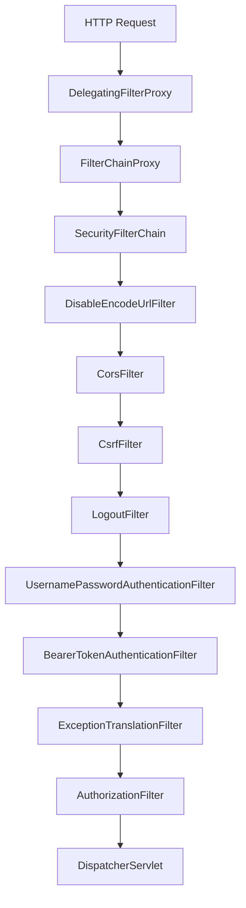
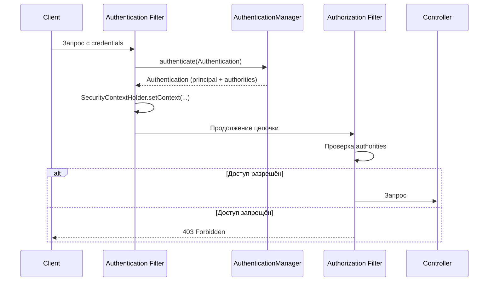
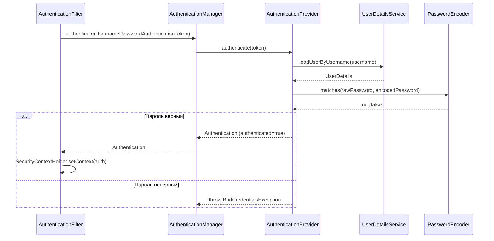
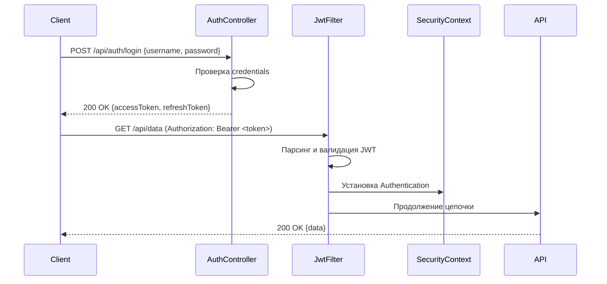

# Вопросы на собеседовании: `Spring Security`

Ответы по `Spring Security`: `SecurityFilterChain`, аутентификация, авторизация, `JWT`, `OAuth2`, `CORS`/`CSRF`, method security, тестирование.

**`Spring Security`** — де-факто стандарт безопасности в экосистеме `Spring`. На собеседованиях проверяют понимание архитектуры фильтров, механизмов аутентификации/авторизации, работу с токенами и умение конфигурировать защиту для REST API.

## Полезные ссылки

### Официальная документация

- [Spring Security Reference](https://docs.spring.io/spring-security/reference/) — основная документация
- [Spring Security OAuth2](https://docs.spring.io/spring-security/reference/servlet/oauth2/index.html) — OAuth2 интеграция

### Baeldung

- [Spring Security Tutorials](https://www.baeldung.com/security-spring) — серия практических туториалов
- [Custom Filter in the Spring Security Filter Chain](https://www.baeldung.com/spring-security-custom-filter) — кастомные фильтры в цепочке безопасности
- [Spring Security — OAuth2 Login](https://www.baeldung.com/spring-security-5-oauth2-login) — вход через OAuth2 провайдеров (Google, GitHub)
- [OAuth 2.0 Resource Server With Spring Security](https://www.baeldung.com/spring-security-oauth-resource-server) — настройка Resource Server с JWT и opaque-токенами
- [Using JWT with Spring Security OAuth](https://www.baeldung.com/spring-security-oauth-jwt) — интеграция JWT в Spring Security
- [Find the Registered Spring Security Filters](https://www.baeldung.com/spring-security-registered-filters) — просмотр цепочки фильтров безопасности
- [Handle Spring Security Exceptions With @ExceptionHandler](https://www.baeldung.com/spring-security-exceptionhandler) — обработка ошибок аутентификации и авторизации

## Содержание

- [Полезные ссылки](#полезные-ссылки)
- [See also](#see-also)

**Основы и архитектура**
- [Q1. (!) Что такое Spring Security и какие задачи он решает?](#q1--что-такое-spring-security-и-какие-задачи-он-решает)
- [Q2. (!) Как устроена архитектура фильтров Spring Security?](#q2--как-устроена-архитектура-фильтров-spring-security)
- [Q3. (!) В чём разница между аутентификацией и авторизацией?](#q3--в-чём-разница-между-аутентификацией-и-авторизацией)
- [Q4. (!) Как работает SecurityFilterChain и как его настроить?](#q4--как-работает-securityfilterchain-и-как-его-настроить)
- [Q5. Что такое SecurityContext и SecurityContextHolder?](#q5-что-такое-securitycontext-и-securitycontextholder)

**Аутентификация**
- [Q6. (!) Как работает процесс аутентификации (AuthenticationManager, Provider)?](#q6--как-работает-процесс-аутентификации-authenticationmanager-provider)
- [Q7. Как реализовать UserDetailsService для загрузки из БД?](#q7-как-реализовать-userdetailsservice-для-загрузки-из-бд)
- [Q8. Как настроить хеширование паролей (PasswordEncoder)?](#q8-как-настроить-хеширование-паролей-passwordencoder)
- [Q9. Как настроить form-based аутентификацию?](#q9-как-настроить-form-based-аутентификацию)
- [Q10. Как настроить HTTP Basic аутентификацию?](#q10-как-настроить-http-basic-аутентификацию)

**JWT и токены**
- [Q11. (!) Как интегрировать Spring Security с JWT?](#q11--как-интегрировать-spring-security-с-jwt)
- [Q12. (!) Как написать JWT-фильтр (JwtAuthenticationFilter)?](#q12--как-написать-jwt-фильтр-jwtauthenticationfilter)
- [Q13. Как реализовать endpoint выдачи JWT-токена?](#q13-как-реализовать-endpoint-выдачи-jwt-токена)
- [Q14. Как реализовать refresh-токен?](#q14-как-реализовать-refresh-токен)

**OAuth2 и SSO**
- [Q15. (!) Как настроить OAuth2 Login (вход через Google/GitHub)?](#q15--как-настроить-oauth2-login-вход-через-googlegithub)
- [Q16. Как настроить Spring Security как OAuth2 Resource Server?](#q16-как-настроить-spring-security-как-oauth2-resource-server)

**Авторизация и Method Security**
- [Q17. (!) Как настроить авторизацию по URL-паттернам?](#q17--как-настроить-авторизацию-по-url-паттернам)
- [Q18. (!) Как работают @PreAuthorize, @PostAuthorize и @Secured?](#q18--как-работают-preauthorize-postauthorize-и-secured)
- [Q19. Как использовать @PreFilter и @PostFilter?](#q19-как-использовать-prefilter-и-postfilter)
- [Q20. Как реализовать доступ на основе данных (domain object security)?](#q20-как-реализовать-доступ-на-основе-данных-domain-object-security)

**CORS и CSRF**
- [Q21. (!) Как настроить CORS в Spring Security?](#q21--как-настроить-cors-в-spring-security)
- [Q22. (!) Как работает CSRF-защита и когда её отключать?](#q22--как-работает-csrf-защита-и-когда-её-отключать)

**Сессии и Remember Me**
- [Q23. Как управлять сессиями (session management)?](#q23-как-управлять-сессиями-session-management)
- [Q24. Как настроить Remember Me?](#q24-как-настроить-remember-me)
- [Q25. Как обеспечить безопасность сессий в кластере?](#q25-как-обеспечить-безопасность-сессий-в-кластере)

**Обработка ошибок и безопасность REST API**
- [Q26. Как обработать ошибки аутентификации и авторизации?](#q26-как-обработать-ошибки-аутентификации-и-авторизации)
- [Q27. (!) Как защитить REST API с помощью Spring Security?](#q27--как-защитить-rest-api-с-помощью-spring-security)
- [Q28. Как настроить rate limiting?](#q28-как-настроить-rate-limiting)

**Тестирование и продвинутые темы**
- [Q29. (!) Как тестировать защищённые эндпоинты?](#q29--как-тестировать-защищённые-эндпоинты)
- [Q30. Как настроить двухфакторную аутентификацию (2FA)?](#q30-как-настроить-двухфакторную-аутентификацию-2fa)

**SecurityContext в асинхронном коде и продвинутые темы**
- [Q31. (!) Как работает SecurityContext в async-методах и @Async?](#q31--как-работает-securitycontext-в-async-методах-и-async)
- [Q32. (!) Как настроить OAuth2 Resource Server с JWT и кастомными клеймами?](#q32--как-настроить-oauth2-resource-server-с-jwt-и-кастомными-клеймами)
- [Q33. (!) Как работает @PreAuthorize с выражениями SpEL и кастомным Permission Evaluator?](#q33--как-работает-preauthorize-с-выражениями-spel-и-кастомным-permission-evaluator)
- [Q34. Как включить Method Security и в чём разница между @PreAuthorize и @PostFilter?](#q34-как-включить-method-security-и-в-чём-разница-между-preauthorize-и-postfilter)
- [Q35. Как одновременно настроить CORS и CSRF в SecurityFilterChain?](#q35-как-одновременно-настроить-cors-и-csrf-в-securityfilterchain)
- [Q36. Как ограничить доступ к Actuator-эндпоинтам через SecurityFilterChain?](#q36-как-ограничить-доступ-к-actuator-эндпоинтам-через-securityfilterchain)

**Spring Security 6, JWT/OAuth2 Resource Server и тестирование**
- [Q37. Чем SecurityFilterChain в Spring Security 6 отличается от WebSecurityConfigurerAdapter?](#q37-чем-securityfilterchain-в-spring-security-6-отличается-от-websecurityconfigureradapter)
- [Q38. Как настроить OAuth2 Resource Server через spring-security-oauth2-resource-server?](#q38-как-настроить-oauth2-resource-server-через-spring-security-oauth2-resource-server)
- [Q39. Как использовать JwtDecoder и BearerTokenAuthenticationFilter?](#q39-как-использовать-jwtdecoder-и-bearertokenauthenticationfilter)
- [Q40. CSRF защита — когда отключать и SameSite cookies как альтернатива?](#q40-csrf-защита--когда-отключать-и-samesite-cookies-как-альтернатива)
- [Q41. Как тестировать Spring Security — @WithMockUser и SecurityMockMvcRequestPostProcessors?](#q41-как-тестировать-spring-security--withmockuser-и-securitymockmvcrequestpostprocessors)
- [Q42. Как передавать SecurityContext между потоками и в реактивном стеке?](#q42-как-передавать-securitycontext-между-потоками-и-в-реактивном-стеке)
- [Q43. Что такое @PostAuthorize и @Secured — когда использовать вместо @PreAuthorize?](#q43-что-такое-postauthorize-и-secured--когда-использовать-вместо-preauthorize)

---

## Q1. (!) Что такое `Spring Security` и какие задачи он решает?

`Spring Security` — фреймворк аутентификации и авторизации для `Spring`-приложений. Основные задачи:

- **Аутентификация** — проверка «кто ты» (форма входа, `Basic`, `JWT`, `OAuth2`, `LDAP`)
- **Авторизация** — проверка «что тебе можно» (по URL, по методам через `@PreAuthorize`)
- **Защита от атак** — `CSRF`, `XSS`, clickjacking, session fixation (подробнее в [OWASP Top 10](../../security/owasp-top10-interview.md))
- **Управление сессиями** — таймауты, ограничение одновременных сессий
- **Хеширование паролей** — `BCrypt`, `Argon2`, `SCrypt`

Начиная с `Spring Security 6` конфигурация основана на бине `SecurityFilterChain` (устаревший `WebSecurityConfigurerAdapter` удалён).

> [!mcq]
> - [ ] Spring Security — библиотека для работы только с JWT-токенами и не поддерживает другие механизмы аутентификации. | Spring Security поддерживает множество механизмов: форма входа, HTTP Basic, JWT, OAuth2, LDAP. JWT — лишь один из способов. Утверждение неверно. Это антипаттерн или неправильный выбор в production.
> - [x] Spring Security решает задачи аутентификации, авторизации, защиты от CSRF/XSS и управления сессиями. | Это полный перечень: аутентификация («кто ты»), авторизация («что можно»), защита от атак (CSRF, XSS, session fixation), управление сессиями и хеширование паролей. Именно это является де-факто стандартом в экосистеме Spring.
> - [ ] Spring Security — библиотека для работы только с формой входа и не поддерживает другие механизмы аутентификации. | Spring Security поддерживает форму входа, HTTP Basic, JWT, OAuth2, LDAP и другие. Ограничение только формой входа — неверное утверждение. Это антипаттерн или неправильный выбор в production.
> - [ ] Spring Security решает задачи аутентификации и авторизации, но не обеспечивает защиту от CSRF/XSS и не управляет сессиями. | Spring Security включает встроенную защиту от CSRF (через CsrfFilter), XSS (заголовки безопасности) и управление сессиями. Это ключевые возможности фреймворка. Это антипаттерн или неправильный выбор в production.

## Q2. (!) Как устроена архитектура фильтров `Spring Security`?

`Spring Security` реализован как цепочка `Servlet`-фильтров. Каждый фильтр отвечает за свою задачу:



Ключевые фильтры:

| Фильтр | Задача |
|--------|--------|
| `CorsFilter` | Обработка CORS preflight-запросов |
| `CsrfFilter` | Проверка CSRF-токена |
| `UsernamePasswordAuthenticationFilter` | Обработка form login |
| `BearerTokenAuthenticationFilter` | Аутентификация по Bearer-токену |
| `ExceptionTranslationFilter` | Перехват `AuthenticationException` и `AccessDeniedException` |
| `AuthorizationFilter` | Проверка прав доступа |

`FilterChainProxy` может содержать несколько `SecurityFilterChain` для разных URL-паттернов (например, отдельно для `/api/**` и для остального приложения).

> [!mcq]
> - [ ] Spring Security реализован как цепочка Servlet-фильтров, где точкой входа является UsernamePasswordAuthenticationFilter, напрямую получающий запрос от клиента. | Точкой входа является DelegatingFilterProxy, который делегирует в FilterChainProxy. UsernamePasswordAuthenticationFilter — один из многих фильтров внутри цепочки, а не входная точка.
> - [x] Spring Security реализован как цепочка Servlet-фильтров, где точкой входа является DelegatingFilterProxy, делегирующий в FilterChainProxy. | DelegatingFilterProxy регистрируется в Servlet-контейнере и делегирует обработку в FilterChainProxy, который выбирает нужный SecurityFilterChain по URL. Это корректное описание архитектуры.
> - [ ] Spring Security реализован как цепочка Servlet-фильтров, где точкой входа является SecurityFilterChain, напрямую получающий запрос от клиента. | SecurityFilterChain — это набор фильтров для определённого паттерна URL, но не точка входа. Точка входа — DelegatingFilterProxy → FilterChainProxy. Это антипаттерн или неправильный выбор в production.
> - [ ] Spring Security реализован как цепочка Servlet-фильтров, где точкой входа является FilterChainProxy, напрямую получающий запрос от клиента. | FilterChainProxy не является первой точкой входа — перед ним стоит DelegatingFilterProxy, который зарегистрирован в Servlet-контейнере и делегирует обработку в FilterChainProxy. Это антипаттерн или неправильный выбор в production.

## Q3. (!) В чём разница между аутентификацией и авторизацией?

| Аспект | Аутентификация | Авторизация |
|--------|---------------|-------------|
| Вопрос | «Кто ты?» | «Что тебе можно?» |
| Когда | Первая | После аутентификации |
| Данные | Логин/пароль, токен, сертификат | Роли, разрешения (authorities) |
| Результат | `Authentication` объект | Разрешение или `AccessDeniedException` |
| HTTP-код ошибки | `401 Unauthorized` | `403 Forbidden` |



Подробнее о паттернах авторизации — в [вопросах по паттернам аутентификации и авторизации](../../security/authentication-authorization-patterns-interview.md).

> [!mcq]
> - [ ] Аутентификация отвечает на вопрос «что тебе можно?» и возвращает объект Authentication с ролями, тогда как авторизация отвечает на вопрос «кто ты?» и завершается кодом 403. | Аутентификация и авторизация перепутаны местами. Аутентификация — «кто ты», ошибка — 401. Авторизация — «что тебе можно», ошибка — 403. Частая ошибка в реальном коде.
> - [x] Аутентификация отвечает на вопрос «кто ты?» и завершается кодом 401 при ошибке, тогда как авторизация отвечает на вопрос «что тебе можно?» и завершается кодом 403 при отказе. | Это точное разграничение: аутентификация устанавливает личность (401 при неудаче), авторизация проверяет права (403 при отказе). Аутентификация всегда предшествует авторизации.
> - [ ] Аутентификация отвечает на вопрос «кто ты?» и завершается кодом 403 при ошибке, тогда как авторизация отвечает на вопрос «что тебе можно?» и завершается кодом 401 при отказе. | Коды ошибок перепутаны. 401 Unauthorized означает отсутствие или неверные credentials (аутентификация), а 403 Forbidden означает нехватку прав (авторизация).
> - [ ] Аутентификация отвечает на вопрос «кто ты?» и завершается кодом 401 при ошибке, тогда как авторизация отвечает на вопрос «что тебе можно?» и завершается кодом 401 при отказе. | Авторизация при отказе должна возвращать 403 Forbidden, а не 401 Unauthorized. 401 используется только при проблемах с идентификацией пользователя. Частая ошибка в реальном коде.

## Q4. (!) Как работает `SecurityFilterChain` и как его настроить?

`SecurityFilterChain` — центральный бин конфигурации `Spring Security 6+`. Заменяет устаревший `WebSecurityConfigurerAdapter`.

```java
@Configuration
@EnableWebSecurity
public class SecurityConfig {

    @Bean
    public SecurityFilterChain securityFilterChain(HttpSecurity http) throws Exception {
        return http
            .csrf(csrf -> csrf.disable())
            .sessionManagement(session -> 
                session.sessionCreationPolicy(SessionCreationPolicy.STATELESS))
            .authorizeHttpRequests(auth -> auth
                .requestMatchers("/api/auth/**").permitAll()
                .requestMatchers("/api/admin/**").hasRole("ADMIN")
                .anyRequest().authenticated())
            .httpBasic(Customizer.withDefaults())
            .build();
    }
}
```

Можно объявить несколько `SecurityFilterChain` для разных путей (через `@Order` и `securityMatcher`):

```java
@Bean
@Order(1)
public SecurityFilterChain apiFilterChain(HttpSecurity http) throws Exception {
    return http
        .securityMatcher("/api/**")
        .authorizeHttpRequests(auth -> auth.anyRequest().authenticated())
        .httpBasic(Customizer.withDefaults())
        .build();
}

@Bean
@Order(2)
public SecurityFilterChain webFilterChain(HttpSecurity http) throws Exception {
    return http
        .authorizeHttpRequests(auth -> auth.anyRequest().authenticated())
        .formLogin(Customizer.withDefaults())
        .build();
}
```

> [!mcq]
> - [ ] SecurityFilterChain в Spring Security 6 конфигурируется наследованием от WebSecurityConfigurerAdapter и переопределением метода configure(HttpSecurity). | WebSecurityConfigurerAdapter удалён в Spring Security 6. Конфигурация ведётся через @Bean-метод, возвращающий SecurityFilterChain, без наследования. Это антипаттерн или неправильный выбор в production.
> - [x] SecurityFilterChain в Spring Security 6 конфигурируется через @Bean-метод, принимающий HttpSecurity и возвращающий результат вызова http.build(). | Это правильный подход: объявить @Bean public SecurityFilterChain filterChain(HttpSecurity http), настроить http через лямбды и вернуть http.build(). WebSecurityConfigurerAdapter больше не используется.
> - [ ] SecurityFilterChain в Spring Security 6 конфигурируется через @Bean-метод, принимающий HttpSecurity и возвращающий результат вызова http.configure(). | Метод configure() не существует в HttpSecurity. Правильный метод для завершения конфигурации — http.build(), который возвращает готовый SecurityFilterChain. Это антипаттерн или неправильный выбор в production.
> - [ ] SecurityFilterChain в Spring Security 6 конфигурируется через @Bean-метод, принимающий WebSecurity и возвращающий результат вызова web.build(). | SecurityFilterChain принимает HttpSecurity, а не WebSecurity. WebSecurity используется для настройки WebSecurityCustomizer (например, исключения статических ресурсов), но не для основной цепочки фильтров.

## Q5. Что такое `SecurityContext` и `SecurityContextHolder`?

**`SecurityContext`** хранит объект `Authentication` (текущий пользователь, роли). **`SecurityContextHolder`** — статический хелпер для доступа к контексту.

```java
// Получить текущего пользователя
Authentication auth = SecurityContextHolder.getContext().getAuthentication();
String username = auth.getName();
Collection<? extends GrantedAuthority> roles = auth.getAuthorities();

// В контроллере — через параметр
@GetMapping("/me")
public UserDto currentUser(@AuthenticationPrincipal UserDetails user) {
    return new UserDto(user.getUsername(), user.getAuthorities());
}
```

Стратегии хранения:
- **`MODE_THREADLOCAL`** (по умолчанию) — контекст в `ThreadLocal`, привязан к текущему потоку
- **`MODE_INHERITABLETHREADLOCAL`** — наследуется дочерними потоками
- **`MODE_GLOBAL`** — один контекст на всё приложение (редко)

Для реактивного стека (`WebFlux`) используется `ReactiveSecurityContextHolder` — контекст в `Reactor Context`, не в `ThreadLocal` (подробнее в [Spring WebFlux](spring-webflux-interview.md)).

> [!mcq]
> - [ ] SecurityContextHolder по умолчанию хранит SecurityContext в стратегии MODE_GLOBAL, создавая единый контекст для всего приложения. | MODE_GLOBAL — редко используемая стратегия для специальных случаев. Стратегия по умолчанию — MODE_THREADLOCAL, которая хранит SecurityContext в ThreadLocal текущего потока. Это антипаттерн или неправильный выбор в production.
> - [ ] SecurityContextHolder по умолчанию хранит SecurityContext в стратегии MODE_INHERITABLETHREADLOCAL, автоматически передавая контекст дочерним потокам. | MODE_INHERITABLETHREADLOCAL — не стратегия по умолчанию, а дополнительная опция для передачи контекста в дочерние потоки. По умолчанию используется MODE_THREADLOCAL. Это антипаттерн или неправильный выбор в production.
> - [x] SecurityContextHolder по умолчанию хранит SecurityContext в стратегии MODE_THREADLOCAL, привязывая контекст к текущему потоку выполнения. | MODE_THREADLOCAL — стратегия по умолчанию: SecurityContext хранится в ThreadLocal и доступен только в текущем потоке. Это безопасно для servlet-контейнеров с моделью thread-per-request.
> - [ ] SecurityContextHolder по умолчанию хранит SecurityContext в стратегии MODE_THREADLOCAL, при этом автоматически передавая контекст всем дочерним потокам. | MODE_THREADLOCAL не передаёт контекст дочерним потокам — это свойство MODE_INHERITABLETHREADLOCAL. При создании нового потока из пула SecurityContext недоступен. Это антипаттерн или неправильный выбор в production.

## Q6. (!) Как работает процесс аутентификации (`AuthenticationManager`, `Provider`)?



- **`AuthenticationManager`** — точка входа (`authenticate()`), обычно `ProviderManager`
- **`AuthenticationProvider`** — реализует проверку конкретного типа (`DaoAuthenticationProvider` для логин/пароль)
- **`UserDetailsService`** — загрузка пользователя по имени
- **`PasswordEncoder`** — сравнение паролей

Кастомный `AuthenticationProvider`:

```java
@Component
public class CustomAuthProvider implements AuthenticationProvider {

    @Override
    public Authentication authenticate(Authentication authentication) {
        String username = authentication.getName();
        String password = authentication.getCredentials().toString();
        
        // Своя логика проверки (LDAP, внешний сервис и т.д.)
        if (externalService.verify(username, password)) {
            return new UsernamePasswordAuthenticationToken(
                username, password, List.of(new SimpleGrantedAuthority("ROLE_USER")));
        }
        throw new BadCredentialsException("Invalid credentials");
    }

    @Override
    public boolean supports(Class<?> authentication) {
        return UsernamePasswordAuthenticationToken.class.isAssignableFrom(authentication);
    }
}
```

> [!mcq]
> - [ ] Точкой входа в процесс аутентификации выступает `SecurityContextHolder` — его метод `authenticate()` вызывается фильтром. | `SecurityContextHolder` только хранит контекст (ThreadLocal), он не выполняет проверку credentials. Это антипаттерн или неправильный выбор в production.
> - [x] Точкой входа в процесс аутентификации выступает `AuthenticationManager` — его метод `authenticate()` вызывается фильтром. | `AuthenticationManager` (обычно `ProviderManager`) делегирует вызов списку `AuthenticationProvider` и возвращает успешный `Authentication` или бросает исключение.
> - [ ] Точкой входа в процесс аутентификации выступает `AuthenticationProvider` — его метод `authenticate()` вызывается фильтром. | `AuthenticationProvider` — это звено внутри цепочки, фильтр не вызывает его напрямую, только через `AuthenticationManager`. Частая ошибка в реальном коде.
> - [ ] Точкой входа в процесс аутентификации выступает `UserDetailsService` — его метод `authenticate()` вызывается фильтром. | `UserDetailsService` только загружает `UserDetails` по имени и не содержит метода `authenticate()`. Частая ошибка в реальном коде.

## Q7. Как реализовать `UserDetailsService` для загрузки из БД?

```java
@Service
@RequiredArgsConstructor
public class CustomUserDetailsService implements UserDetailsService {

    private final UserRepository userRepository;

    @Override
    public UserDetails loadUserByUsername(String username) throws UsernameNotFoundException {
        User user = userRepository.findByUsername(username)
            .orElseThrow(() -> new UsernameNotFoundException(
                "User not found: " + username));

        return org.springframework.security.core.userdetails.User.builder()
            .username(user.getUsername())
            .password(user.getPasswordHash())  // уже захешированный
            .authorities(user.getRoles().stream()
                .map(role -> new SimpleGrantedAuthority("ROLE_" + role.getName()))
                .toList())
            .accountExpired(!user.isActive())
            .accountLocked(user.isLocked())
            .build();
    }
}
```

Конфигурация автоматическая: если `UserDetailsService` — бин, `Spring Security` подхватит его. Явная привязка:

```java
@Bean
public AuthenticationManager authManager(HttpSecurity http,
        UserDetailsService uds, PasswordEncoder encoder) throws Exception {
    var provider = new DaoAuthenticationProvider();
    provider.setUserDetailsService(uds);
    provider.setPasswordEncoder(encoder);
    return new ProviderManager(provider);
}
```

> [!mcq]
> - [x] Интерфейс `UserDetailsService` имеет единственный метод `loadUserByUsername(String)`, возвращающий `UserDetails`. | Именно этот метод реализует провайдер для загрузки пользователя из БД; при отсутствии — бросается `UsernameNotFoundException`. Ключевое отличие и best practice в production.
> - [ ] Интерфейс `UserDetailsManager` имеет единственный метод `loadUserByUsername(String)`, возвращающий `UserDetails`. | `UserDetailsManager` расширяет `UserDetailsService` и добавляет CRUD-операции (`createUser`, `deleteUser`), это не тот же интерфейс. Частая ошибка в реальном коде.
> - [ ] Интерфейс `AuthenticationProvider` имеет единственный метод `loadUserByUsername(String)`, возвращающий `UserDetails`. | `AuthenticationProvider` описывает `authenticate(Authentication)` и `supports(Class)` — это не загрузчик пользователя. Частая ошибка в реальном коде.
> - [ ] Интерфейс `UserDetails` имеет единственный метод `loadUserByUsername(String)`, возвращающий `UserDetails`. | `UserDetails` — это DTO-подобный интерфейс пользователя (`getUsername`, `getPassword`), он не загружает сам себя. Частая ошибка в реальном коде.

## Q8. Как настроить хеширование паролей (`PasswordEncoder`)?

```java
@Bean
public PasswordEncoder passwordEncoder() {
    return new BCryptPasswordEncoder(12); // cost factor 12
}
```

| Алгоритм | Класс | Рекомендация |
|----------|-------|-------------|
| BCrypt | `BCryptPasswordEncoder` | Рекомендован для большинства случаев |
| Argon2 | `Argon2PasswordEncoder` | Лучшая защита от GPU-атак |
| SCrypt | `SCryptPasswordEncoder` | Альтернатива Argon2 |
| PBKDF2 | `Pbkdf2PasswordEncoder` | Совместимость с FIPS |

`DelegatingPasswordEncoder` позволяет мигрировать между алгоритмами:

```java
@Bean
public PasswordEncoder passwordEncoder() {
    return PasswordEncoderFactories.createDelegatingPasswordEncoder();
    // Хранит в формате: {bcrypt}$2a$12$... , {argon2}...
}
```

При логине `Spring` через `PasswordEncoder.matches()` сравнивает введённый пароль с хешем из БД. Хранить пароли в открытом виде (`{noop}`) допустимо **только** в тестах.

> [!mcq]
> - [ ] Рекомендованным общим `PasswordEncoder` является `NoOpPasswordEncoder`, имеющий адаптивную стоимость. | `NoOpPasswordEncoder` хранит пароли в открытом виде и помечен `@Deprecated` — использовать нельзя ни в каком случае, кроме тестов. Частая ошибка в реальном коде.
> - [ ] Рекомендованным общим `PasswordEncoder` является `MessageDigestPasswordEncoder`, имеющий адаптивную стоимость. | MD5/SHA через `MessageDigestPasswordEncoder` быстры и уязвимы к rainbow-table атакам, не имеют настраиваемой стоимости. Частая ошибка в реальном коде.
> - [x] Рекомендованным общим `PasswordEncoder` является `BCryptPasswordEncoder`, имеющий адаптивную стоимость. | `BCryptPasswordEncoder` использует настраиваемый cost factor (log-rounds), по умолчанию 10, и встроенную соль — baseline для парольного хеширования в Spring.
> - [ ] Рекомендованным общим `PasswordEncoder` является `StandardPasswordEncoder`, имеющий адаптивную стоимость. | `StandardPasswordEncoder` (SHA-256+соль) объявлен deprecated, не адаптивен и не рекомендуется для нового кода. Частая ошибка в реальном коде.

## Q9. Как настроить `form-based` аутентификацию?

```java
@Bean
public SecurityFilterChain filterChain(HttpSecurity http) throws Exception {
    return http
        .authorizeHttpRequests(auth -> auth
            .requestMatchers("/login", "/css/**").permitAll()
            .anyRequest().authenticated())
        .formLogin(form -> form
            .loginPage("/login")              // кастомная страница
            .loginProcessingUrl("/login")     // куда POST форма
            .defaultSuccessUrl("/dashboard")  // после успешного входа
            .failureUrl("/login?error=true")) // при ошибке
        .logout(logout -> logout
            .logoutUrl("/logout")
            .logoutSuccessUrl("/login?logout"))
        .build();
}
```

`Spring Security` автоматически обрабатывает `POST /login` с параметрами `username` и `password`. Для `Thymeleaf`:

```html
<form th:action="@{/login}" method="post">
    <input type="text" name="username" />
    <input type="password" name="password" />
    <button type="submit">Войти</button>
</form>
```

> [!mcq]
> - [ ] За обработку POST-запроса `/login` в form-based аутентификации отвечает фильтр `BasicAuthenticationFilter`. | `BasicAuthenticationFilter` парсит заголовок `Authorization: Basic <base64>`, а не параметры формы. Частая ошибка в реальном коде.
> - [x] За обработку POST-запроса `/login` в form-based аутентификации отвечает фильтр `UsernamePasswordAuthenticationFilter`. | Именно этот фильтр извлекает параметры `username`/`password` из формы и создаёт `UsernamePasswordAuthenticationToken` для `AuthenticationManager`. Ключевое отличие и best practice в production.
> - [ ] За обработку POST-запроса `/login` в form-based аутентификации отвечает фильтр `BearerTokenAuthenticationFilter`. | `BearerTokenAuthenticationFilter` работает с JWT/OAuth2-токенами из заголовка `Authorization: Bearer`. Частая ошибка в реальном коде.
> - [ ] За обработку POST-запроса `/login` в form-based аутентификации отвечает фильтр `RememberMeAuthenticationFilter`. | Этот фильтр восстанавливает аутентификацию по cookie `remember-me`, а не обрабатывает форму логина. Частая ошибка в реальном коде.

## Q10. Как настроить `HTTP Basic` аутентификацию?

```java
@Bean
public SecurityFilterChain filterChain(HttpSecurity http) throws Exception {
    return http
        .authorizeHttpRequests(auth -> auth.anyRequest().authenticated())
        .httpBasic(basic -> basic
            .realmName("My API")
            .authenticationEntryPoint(new CustomBasicAuthEntryPoint()))
        .build();
}
```

Credentials передаются в заголовке `Authorization: Basic <base64(user:pass)>`. В production обязательно использовать **HTTPS**, иначе пароль передаётся в открытом виде. Обычно используется для внутренних API или для простых интеграций; для публичных API предпочтительнее `JWT` или `OAuth2`.

> [!mcq]
> - [x] HTTP Basic передаёт логин и пароль как `base64(username:password)` в заголовке `Authorization: Basic ...`. | Base64 — это кодирование, не шифрование: без HTTPS credentials легко декодируются, поэтому Basic используется только поверх TLS. Ключевое отличие и best practice в production.
> - [ ] HTTP Basic передаёт логин и пароль как `base64(username:password)` в заголовке `Authorization: Bearer ...`. | `Bearer` — схема для токенов (OAuth2/JWT), а не для имени/пароля. Частая ошибка в реальном коде.
> - [ ] HTTP Basic передаёт логин и пароль как `base64(username:password)` в заголовке `Authorization: Digest ...`. | `Digest` — отдельная схема с хешированием nonce, не использует Base64 от пары user:pass. Частая ошибка в реальном коде.
> - [ ] HTTP Basic передаёт логин и пароль как `base64(username:password)` в заголовке `Proxy-Authorization: Basic ...`. | `Proxy-Authorization` предназначен для аутентификации на HTTP-прокси, а не на целевом ресурсе. Частая ошибка в реальном коде.

## Q11. (!) Как интегрировать `Spring Security` с `JWT`?

Общая схема для stateless REST API:



Конфигурация `SecurityFilterChain` для `JWT`:

```java
@Bean
public SecurityFilterChain securityFilterChain(HttpSecurity http,
        JwtAuthenticationFilter jwtFilter) throws Exception {
    return http
        .csrf(csrf -> csrf.disable())  // stateless — CSRF не нужен
        .sessionManagement(session -> 
            session.sessionCreationPolicy(SessionCreationPolicy.STATELESS))
        .authorizeHttpRequests(auth -> auth
            .requestMatchers("/api/auth/**").permitAll()
            .requestMatchers("/api/admin/**").hasRole("ADMIN")
            .anyRequest().authenticated())
        .addFilterBefore(jwtFilter, UsernamePasswordAuthenticationFilter.class)
        .exceptionHandling(ex -> ex
            .authenticationEntryPoint((req, res, e) -> 
                res.sendError(HttpServletResponse.SC_UNAUTHORIZED)))
        .build();
}
```

> [!mcq]
> - [ ] Для stateless JWT-API в `SecurityFilterChain` задают `SessionCreationPolicy.ALWAYS`. | `ALWAYS` заставляет создавать HTTP-сессию на каждый запрос — это противоположность stateless-режиму. Это антипаттерн или неправильный выбор в production.
> - [ ] Для stateless JWT-API в `SecurityFilterChain` задают `SessionCreationPolicy.IF_REQUIRED`. | Это дефолтная политика: сервер создаёт сессию при необходимости, что не подходит для чисто stateless REST. Это антипаттерн или неправильный выбор в production.
> - [ ] Для stateless JWT-API в `SecurityFilterChain` задают `SessionCreationPolicy.NEVER`. | `NEVER` не создаёт сессию, но использует существующую если есть — это всё ещё не полный stateless. Это антипаттерн или неправильный выбор в production.
> - [x] Для stateless JWT-API в `SecurityFilterChain` задают `SessionCreationPolicy.STATELESS`. | `STATELESS` — сервер не создаёт и не использует HTTP-сессию; каждый запрос аутентифицируется заново по JWT. Authentication (who), authorization (what), CORS для cross-origin, CSRF protection.

## Q12. (!) Как написать `JWT`-фильтр (`JwtAuthenticationFilter`)?

```java
@Component
@RequiredArgsConstructor
public class JwtAuthenticationFilter extends OncePerRequestFilter {

    private final JwtService jwtService;
    private final UserDetailsService userDetailsService;

    @Override
    protected void doFilterInternal(HttpServletRequest request,
            HttpServletResponse response, FilterChain chain)
            throws ServletException, IOException {

        String header = request.getHeader("Authorization");
        if (header == null || !header.startsWith("Bearer ")) {
            chain.doFilter(request, response);
            return;
        }

        String token = header.substring(7);
        String username = jwtService.extractUsername(token);

        if (username != null && SecurityContextHolder.getContext()
                .getAuthentication() == null) {
            UserDetails userDetails = userDetailsService
                .loadUserByUsername(username);

            if (jwtService.isTokenValid(token, userDetails)) {
                var authToken = new UsernamePasswordAuthenticationToken(
                    userDetails, null, userDetails.getAuthorities());
                authToken.setDetails(
                    new WebAuthenticationDetailsSource().buildDetails(request));
                SecurityContextHolder.getContext().setAuthentication(authToken);
            }
        }
        chain.doFilter(request, response);
    }
}
```

Ключевые моменты:
- Наследуется от `OncePerRequestFilter` — гарантированно один вызов на запрос
- Регистрируется **перед** `UsernamePasswordAuthenticationFilter` через `addFilterBefore`
- При невалидном или отсутствующем токене — просто пропускает запрос дальше (авторизация сработает позже)

> [!mcq]
> - [x] Кастомный JWT-фильтр наследуется от `OncePerRequestFilter`, что гарантирует один вызов `doFilterInternal` на запрос. | `OncePerRequestFilter` обеспечивает защиту от повторного запуска в forward/include и нужную сигнатуру с `HttpServletRequest`. Ключевое отличие и best practice в production.
> - [ ] Кастомный JWT-фильтр наследуется от `GenericFilterBean`, что гарантирует один вызов `doFilterInternal` на запрос. | `GenericFilterBean` — более низкоуровневый предок; сам по себе не защищает от повторного срабатывания на forward. Это антипаттерн или неправильный выбор в production.
> - [ ] Кастомный JWT-фильтр наследуется от `BasicAuthenticationFilter`, что гарантирует один вызов `doFilterInternal` на запрос. | `BasicAuthenticationFilter` специализирован на HTTP Basic-схеме, наследоваться от него для JWT нелогично. Частая ошибка в реальном коде.
> - [ ] Кастомный JWT-фильтр наследуется от `AbstractAuthenticationProcessingFilter`, что гарантирует один вызов `doFilterInternal` на запрос. | Этот класс рассчитан на logging-in через specific URL (например, `/login`), не на per-request Bearer-токен. Частая ошибка в реальном коде.

## Q13. Как реализовать endpoint выдачи `JWT`-токена?

```java
@RestController
@RequestMapping("/api/auth")
@RequiredArgsConstructor
public class AuthController {

    private final AuthenticationManager authManager;
    private final JwtService jwtService;

    @PostMapping("/login")
    public ResponseEntity<AuthResponse> login(@RequestBody AuthRequest request) {
        Authentication auth = authManager.authenticate(
            new UsernamePasswordAuthenticationToken(
                request.username(), request.password()));

        UserDetails user = (UserDetails) auth.getPrincipal();
        String accessToken = jwtService.generateToken(user, Duration.ofMinutes(15));
        String refreshToken = jwtService.generateToken(user, Duration.ofDays(7));

        return ResponseEntity.ok(new AuthResponse(accessToken, refreshToken));
    }
}

record AuthRequest(String username, String password) {}
record AuthResponse(String accessToken, String refreshToken) {}
```

Для работы `AuthenticationManager` нужно объявить его как бин:

```java
@Bean
public AuthenticationManager authenticationManager(
        AuthenticationConfiguration config) throws Exception {
    return config.getAuthenticationManager();
}
```

> [!mcq]
> - [ ] В `/login`-endpoint для проверки пары логин/пароль вызывается `SecurityContextHolder.authenticate()`. | У `SecurityContextHolder` нет метода `authenticate()`; это хранилище контекста, а не точка аутентификации. Это антипаттерн или неправильный выбор в production.
> - [x] В `/login`-endpoint для проверки пары логин/пароль вызывается `AuthenticationManager.authenticate()`. | Контроллер передаёт `UsernamePasswordAuthenticationToken` в `AuthenticationManager`, который делегирует проверку провайдерам. Ключевое отличие и best practice в production.
> - [ ] В `/login`-endpoint для проверки пары логин/пароль вызывается `UserDetailsService.authenticate()`. | `UserDetailsService` только загружает пользователя по имени; метода `authenticate` в нём нет. Частая ошибка в реальном коде.
> - [ ] В `/login`-endpoint для проверки пары логин/пароль вызывается `PasswordEncoder.authenticate()`. | `PasswordEncoder` умеет только `encode` и `matches`, это компонент проверки пароля, а не точка входа аутентификации. Частая ошибка в реальном коде.

## Q14. Как реализовать refresh-токен?

Refresh-токен позволяет получить новый access-токен без повторного ввода credentials. Варианты хранения:

| Подход | Плюсы | Минусы |
|--------|-------|--------|
| JWT refresh-токен | Stateless | Нельзя отозвать до истечения |
| Refresh-токен в БД | Можно отозвать, ротировать | Запрос к БД при каждом обновлении |
| HttpOnly cookie | Защита от XSS | Уязвим к CSRF |

```java
@PostMapping("/refresh")
public ResponseEntity<AuthResponse> refresh(@RequestBody RefreshRequest request) {
    String refreshToken = request.refreshToken();
    
    if (!jwtService.isTokenValid(refreshToken)) {
        return ResponseEntity.status(HttpStatus.UNAUTHORIZED).build();
    }
    
    String username = jwtService.extractUsername(refreshToken);
    UserDetails user = userDetailsService.loadUserByUsername(username);
    
    String newAccessToken = jwtService.generateToken(user, Duration.ofMinutes(15));
    // Ротация refresh-токена — старый становится невалидным
    String newRefreshToken = jwtService.generateToken(user, Duration.ofDays(7));
    
    return ResponseEntity.ok(new AuthResponse(newAccessToken, newRefreshToken));
}
```

Для revocable-токенов лучше хранить refresh-токены в БД или `Redis` и проверять при обновлении. Подробнее об OAuth2-потоках — в [вопросах по OAuth2](../../security/oauth2-interview.md).

> [!mcq]
> - [x] Чтобы отозвать refresh-токен до истечения его срока, его хранят в `Redis`/БД и проверяют при каждом обновлении. | Чистый JWT stateless — revoke не работает; revocation list в хранилище позволяет пометить токен как недействительный до `exp`. Ключевое отличие и best practice в production.
> - [ ] Чтобы отозвать refresh-токен до истечения его срока, его хранят в `SecurityContextHolder` и проверяют при каждом обновлении. | `SecurityContextHolder` — это ThreadLocal на запрос, он не рассчитан на долгосрочное хранение и не персистентен. Это антипаттерн или неправильный выбор в production.
> - [ ] Чтобы отозвать refresh-токен до истечения его срока, его хранят в `HttpSession` и проверяют при каждом обновлении. | `HttpSession` живёт на одном узле (если нет Spring Session), не подходит для распределённой revocation. Частая ошибка в реальном коде.
> - [ ] Чтобы отозвать refresh-токен до истечения его срока, его хранят в JWT-payload и проверяют при каждом обновлении. | JWT неизменяем после подписи — невозможно «отозвать» сам токен через его содержимое. Частая ошибка в реальном коде.

## Q15. (!) Как настроить `OAuth2 Login` (вход через `Google`/`GitHub`)?

Подключение зависимости и конфигурация в `application.yml`:

```yaml
spring:
  security:
    oauth2:
      client:
        registration:
          google:
            client-id: ${GOOGLE_CLIENT_ID}
            client-secret: ${GOOGLE_CLIENT_SECRET}
            scope: openid, email, profile
          github:
            client-id: ${GITHUB_CLIENT_ID}
            client-secret: ${GITHUB_CLIENT_SECRET}
            scope: read:user, user:email
```

Конфигурация `SecurityFilterChain`:

```java
@Bean
public SecurityFilterChain filterChain(HttpSecurity http) throws Exception {
    return http
        .authorizeHttpRequests(auth -> auth
            .requestMatchers("/", "/login/**").permitAll()
            .anyRequest().authenticated())
        .oauth2Login(oauth2 -> oauth2
            .loginPage("/login")
            .userInfoEndpoint(userInfo -> userInfo
                .userService(customOAuth2UserService))
            .successHandler(oAuth2SuccessHandler))
        .build();
}
```

Для кастомной обработки пользователя после OAuth2 входа:

```java
@Service
@RequiredArgsConstructor
public class CustomOAuth2UserService extends DefaultOAuth2UserService {

    private final UserRepository userRepository;

    @Override
    public OAuth2User loadUser(OAuth2UserRequest request) {
        OAuth2User oAuth2User = super.loadUser(request);
        String email = oAuth2User.getAttribute("email");
        
        // Создать или обновить пользователя в БД
        userRepository.findByEmail(email)
            .orElseGet(() -> userRepository.save(
                new User(email, oAuth2User.getAttribute("name"))));
        
        return oAuth2User;
    }
}
```

> [!mcq]
> - [ ] Для кастомной пост-обработки профиля после OAuth2-входа расширяют `UserDetailsService`. | `UserDetailsService` нужен для форм/Basic-логина (loadUserByUsername), а не для OAuth2-профилей. Частая ошибка в реальном коде.
> - [x] Для кастомной пост-обработки профиля после OAuth2-входа расширяют `DefaultOAuth2UserService`. | `DefaultOAuth2UserService.loadUser(OAuth2UserRequest)` — штатная точка, в которой можно обогатить/сохранить пользователя после получения данных от IdP.
> - [ ] Для кастомной пост-обработки профиля после OAuth2-входа расширяют `AuthenticationManager`. | `AuthenticationManager` — интерфейс с одним методом `authenticate`, у него нет профильной обработки OAuth2. Частая ошибка в реальном коде.
> - [ ] Для кастомной пост-обработки профиля после OAuth2-входа расширяют `OAuth2AuthorizationRequestResolver`. | Этот компонент управляет формированием authorization-request к IdP (например, добавляет параметры), а не обрабатывает профиль. Частая ошибка в реальном коде.

## Q16. Как настроить `Spring Security` как `OAuth2 Resource Server`?

Когда приложение — не provider, а принимает JWT-токены от внешнего IdP (Keycloak, Auth0 и т.д.):

```yaml
spring:
  security:
    oauth2:
      resourceserver:
        jwt:
          issuer-uri: https://auth.example.com/realms/my-realm
          # или jwk-set-uri для прямого указания ключей
```

```java
@Bean
public SecurityFilterChain filterChain(HttpSecurity http) throws Exception {
    return http
        .authorizeHttpRequests(auth -> auth
            .requestMatchers("/public/**").permitAll()
            .anyRequest().authenticated())
        .oauth2ResourceServer(oauth2 -> oauth2
            .jwt(jwt -> jwt
                .jwtAuthenticationConverter(jwtAuthConverter())))
        .build();
}

// Маппинг claims → GrantedAuthority
@Bean
public JwtAuthenticationConverter jwtAuthConverter() {
    var converter = new JwtGrantedAuthoritiesConverter();
    converter.setAuthoritiesClaimName("roles");
    converter.setAuthorityPrefix("ROLE_");
    
    var jwtConverter = new JwtAuthenticationConverter();
    jwtConverter.setJwtGrantedAuthoritiesConverter(converter);
    return jwtConverter;
}
```

`Spring Security` автоматически валидирует подпись JWT через JWKS-endpoint провайдера.

> [!mcq]
> - [ ] Проверка подписи JWT в Resource Server выполняется через `UserDetailsService`. | `UserDetailsService` к JWKS и криптографии не имеет отношения — он работает с локальным хранилищем пользователей. Частая ошибка в реальном коде.
> - [x] Проверка подписи JWT в Resource Server выполняется через `JwtDecoder`, который подтягивает ключи из JWKS-endpoint. | `NimbusJwtDecoder` настраивается через `jwk-set-uri` или `issuer-uri` и автоматически валидирует подпись, `iss`, `exp`, `nbf`. Ключевое отличие и best practice в production.
> - [ ] Проверка подписи JWT в Resource Server выполняется через `PasswordEncoder`. | `PasswordEncoder` — утилита для парольных хешей, к JWT не применяется. Частая ошибка в реальном коде.
> - [ ] Проверка подписи JWT в Resource Server выполняется через `AuthenticationManager` без дополнительных компонентов. | `AuthenticationManager` лишь делегирует на `JwtAuthenticationProvider`, который требует корректно настроенный `JwtDecoder` — без него проверка невозможна.

## Q17. (!) Как настроить авторизацию по URL-паттернам?

```java
@Bean
public SecurityFilterChain filterChain(HttpSecurity http) throws Exception {
    return http
        .authorizeHttpRequests(auth -> auth
            // Публичные ресурсы
            .requestMatchers("/", "/login", "/register").permitAll()
            .requestMatchers("/css/**", "/js/**", "/images/**").permitAll()
            
            // По ролям
            .requestMatchers("/api/admin/**").hasRole("ADMIN")
            .requestMatchers("/api/moderator/**").hasAnyRole("ADMIN", "MODERATOR")
            
            // По HTTP-методу
            .requestMatchers(HttpMethod.GET, "/api/articles/**").permitAll()
            .requestMatchers(HttpMethod.POST, "/api/articles/**").hasRole("AUTHOR")
            .requestMatchers(HttpMethod.DELETE, "/api/articles/**").hasRole("ADMIN")
            
            // По authority (без префикса ROLE_)
            .requestMatchers("/api/reports/**").hasAuthority("REPORT_VIEW")
            
            // Всё остальное — только для аутентифицированных
            .anyRequest().authenticated())
        .build();
}
```

**Важно**: порядок `requestMatchers` имеет значение — первое совпадение выигрывает. Более специфичные правила ставьте раньше.

В `Spring Security 6` вместо `antMatchers()` используется `requestMatchers()` с `AntPathRequestMatcher` под капотом. Поддерживается также `MvcRequestMatcher` для точного соответствия маршрутам [Spring MVC](spring-mvc-interview.md).

> [!mcq]
> - [x] В Spring Security 6 для URL-авторизации применяется DSL `authorizeHttpRequests()` с вызовом `requestMatchers(...)`. | Устаревшие `authorizeRequests()` + `antMatchers()` удалены вместе с `WebSecurityConfigurerAdapter`; новый DSL даёт более точные матчеры. Authentication (who), authorization (what), CORS для cross-origin, CSRF protection.
> - [ ] В Spring Security 6 для URL-авторизации применяется DSL `authorizeRequests()` с вызовом `requestMatchers(...)`. | `authorizeRequests()` deprecated и удалён; вместо него `authorizeHttpRequests()`. Это антипаттерн или неправильный выбор в production.
> - [ ] В Spring Security 6 для URL-авторизации применяется DSL `authorizeHttpRequests()` с вызовом `antMatchers(...)`. | `antMatchers()` удалён; используется `requestMatchers()` (внутри — `AntPathRequestMatcher`/`MvcRequestMatcher`). Это антипаттерн или неправильный выбор в production.
> - [ ] В Spring Security 6 для URL-авторизации применяется DSL `httpSecurity()` с вызовом `matchers(...)`. | Метода `httpSecurity()` с таким DSL нет — конфигурация идёт через бин `SecurityFilterChain`. Это антипаттерн или неправильный выбор в production.

## Q18. (!) Как работают `@PreAuthorize`, `@PostAuthorize` и `@Secured`?

Включение method security (Spring Security 6+):

```java
@Configuration
@EnableMethodSecurity  // заменяет @EnableGlobalMethodSecurity
public class MethodSecurityConfig {
}
```

Примеры использования:

```java
@Service
public class ArticleService {

    // Проверка ДО вызова метода
    @PreAuthorize("hasRole('ADMIN')")
    public void deleteArticle(Long id) { ... }

    // SpEL с параметрами метода
    @PreAuthorize("#userId == authentication.principal.id")
    public UserProfile getProfile(Long userId) { ... }

    // Проверка ПОСЛЕ вызова (доступ к returnObject)
    @PostAuthorize("returnObject.author == authentication.name")
    public Article findArticle(Long id) { ... }

    // Комбинация условий
    @PreAuthorize("hasRole('ADMIN') or #article.author == authentication.name")
    public void updateArticle(Article article) { ... }

    // @Secured — упрощённый вариант (без SpEL)
    @Secured({"ROLE_ADMIN", "ROLE_MODERATOR"})
    public void moderateContent(Long id) { ... }

    // @RolesAllowed — JSR-250 аналог @Secured
    @RolesAllowed("ADMIN")
    public List<User> getAllUsers() { ... }
}
```

| Аннотация | SpEL | Когда проверяет | Доступ к результату |
|-----------|------|-----------------|---------------------|
| `@PreAuthorize` | Да | До вызова | Нет |
| `@PostAuthorize` | Да | После вызова | `returnObject` |
| `@Secured` | Нет | До вызова | Нет |
| `@RolesAllowed` | Нет | До вызова | Нет |

> [!mcq]
> - [ ] Для включения `@PreAuthorize`/`@PostAuthorize` в Spring Security 6 применяется аннотация `@EnableGlobalMethodSecurity(prePostEnabled = true)`. | `@EnableGlobalMethodSecurity` deprecated в Spring Security 6 — нужно использовать `@EnableMethodSecurity`. Это антипаттерн или неправильный выбор в production.
> - [x] Для включения `@PreAuthorize`/`@PostAuthorize` в Spring Security 6 применяется аннотация `@EnableMethodSecurity`. | Это правильная аннотация; по умолчанию `prePostEnabled=true`, `securedEnabled`/`jsr250Enabled` — `false`. Authentication (who), authorization (what), CORS для cross-origin, CSRF protection.
> - [ ] Для включения `@PreAuthorize`/`@PostAuthorize` в Spring Security 6 применяется аннотация `@EnableWebSecurity`. | `@EnableWebSecurity` активирует web-часть (`HttpSecurity`, `SecurityFilterChain`), но не method-security. Это антипаттерн или неправильный выбор в production.
> - [ ] Для включения `@PreAuthorize`/`@PostAuthorize` в Spring Security 6 применяется аннотация `@EnableAuthenticationManager`. | Такой аннотации в Spring Security нет, это выдуманное имя. Это антипаттерн или неправильный выбор в production.

## Q19. Как использовать `@PreFilter` и `@PostFilter`?

`@PreFilter` фильтрует **входную** коллекцию, `@PostFilter` — **возвращаемую**:

```java
@Service
public class DocumentService {

    // Из входного списка останутся только документы текущего пользователя
    @PreFilter("filterObject.owner == authentication.name")
    public void batchDelete(List<Document> documents) {
        documentRepository.deleteAll(documents);
    }

    // Из результата останутся только документы с доступом
    @PostFilter("filterObject.accessLevel <= authentication.principal.level")
    public List<Document> findAll() {
        return documentRepository.findAll();
    }
}
```

**Осторожно**: `@PostFilter` загружает все данные из БД и потом фильтрует в памяти. Для больших коллекций лучше фильтровать в SQL-запросе.

> [!mcq]
> - [x] Внутри SpEL в `@PreFilter`/`@PostFilter` текущий элемент коллекции доступен под именем `filterObject`. | Spring Security применяет выражение к каждому элементу коллекции, предоставляя его через `filterObject`. Authentication (who), authorization (what), CORS для cross-origin, CSRF protection.
> - [ ] Внутри SpEL в `@PreFilter`/`@PostFilter` текущий элемент коллекции доступен под именем `returnObject`. | `returnObject` — это возвращаемое значение метода для `@PostAuthorize`, не элемент коллекции. Частая ошибка в реальном коде.
> - [ ] Внутри SpEL в `@PreFilter`/`@PostFilter` текущий элемент коллекции доступен под именем `principal`. | `principal` — это `Authentication.getPrincipal()`, аутентифицированный пользователь, не элемент коллекции. Частая ошибка в реальном коде.
> - [ ] Внутри SpEL в `@PreFilter`/`@PostFilter` текущий элемент коллекции доступен под именем `authentication`. | `authentication` — сам объект `Authentication`, а не элемент обрабатываемой коллекции. Частая ошибка в реальном коде.

## Q20. Как реализовать доступ на основе данных (domain object security)?

Когда нужна авторизация на уровне конкретных объектов (например, «пользователь может редактировать только свои статьи»):

**Вариант 1 — SpEL в `@PreAuthorize`:**

```java
@PreAuthorize("@articleSecurity.isOwner(#id, authentication)")
public Article updateArticle(Long id, ArticleDto dto) { ... }

@Component("articleSecurity")
public class ArticleSecurity {
    public boolean isOwner(Long articleId, Authentication auth) {
        Article article = articleRepository.findById(articleId).orElseThrow();
        return article.getAuthor().equals(auth.getName());
    }
}
```

**Вариант 2 — `PermissionEvaluator`:**

```java
@PreAuthorize("hasPermission(#id, 'Article', 'WRITE')")
public void editArticle(Long id) { ... }

@Component
public class CustomPermissionEvaluator implements PermissionEvaluator {
    @Override
    public boolean hasPermission(Authentication auth, 
            Serializable targetId, String targetType, Object permission) {
        // Логика проверки прав на конкретный объект
        return permissionRepository
            .exists(auth.getName(), targetId, targetType, permission.toString());
    }
}
```

Для сложных ACL-сценариев существует модуль `spring-security-acl` с таблицами разрешений в БД.

> [!mcq]
> - [ ] Выражение вида `hasPermission(#id, 'Article', 'WRITE')` в `@PreAuthorize` обрабатывается `AuthenticationProvider`. | `AuthenticationProvider` занимается процессом аутентификации, а не проверкой прав на конкретный объект. Частая ошибка в реальном коде.
> - [x] Выражение вида `hasPermission(#id, 'Article', 'WRITE')` в `@PreAuthorize` обрабатывается `PermissionEvaluator`. | Spring Security делегирует `hasPermission(...)` в зарегистрированный `PermissionEvaluator`, обычно через `DefaultMethodSecurityExpressionHandler`. Authentication (who), authorization (what), CORS для cross-origin, CSRF protection.
> - [ ] Выражение вида `hasPermission(#id, 'Article', 'WRITE')` в `@PreAuthorize` обрабатывается `UserDetailsService`. | `UserDetailsService` только загружает пользователя по имени, выражения SpEL через него не проходят. Частая ошибка в реальном коде.
> - [ ] Выражение вида `hasPermission(#id, 'Article', 'WRITE')` в `@PreAuthorize` обрабатывается `SecurityContextHolder`. | `SecurityContextHolder` — это хранилище контекста, а не обработчик SpEL-выражений. Это антипаттерн или неправильный выбор в production.

## Q21. (!) Как настроить `CORS` в `Spring Security`?

```java
@Bean
public SecurityFilterChain filterChain(HttpSecurity http) throws Exception {
    return http
        .cors(cors -> cors.configurationSource(corsConfigurationSource()))
        .authorizeHttpRequests(auth -> auth.anyRequest().authenticated())
        .build();
}

@Bean
public CorsConfigurationSource corsConfigurationSource() {
    CorsConfiguration config = new CorsConfiguration();
    config.setAllowedOrigins(List.of(
        "https://frontend.example.com",
        "http://localhost:3000"));
    config.setAllowedMethods(List.of("GET", "POST", "PUT", "DELETE", "OPTIONS"));
    config.setAllowedHeaders(List.of("Authorization", "Content-Type"));
    config.setExposedHeaders(List.of("X-Total-Count"));
    config.setAllowCredentials(true);
    config.setMaxAge(3600L);  // кэш preflight на 1 час

    UrlBasedCorsConfigurationSource source = new UrlBasedCorsConfigurationSource();
    source.registerCorsConfiguration("/api/**", config);
    return source;
}
```

**Важно**: `CORS`-фильтр в `Spring Security` должен обрабатываться **до** аутентификации, иначе preflight `OPTIONS`-запросы (без credentials) получат `401`. При использовании `cors()` в `HttpSecurity` порядок фильтров настраивается автоматически.

На уровне контроллера можно использовать `@CrossOrigin`, но `SecurityFilterChain` конфигурация имеет приоритет. Подробнее о безопасности веб-приложений — в [вопросах по безопасности приложений](../../security/application-security-interview.md).

> [!mcq]
> - [x] Чтобы preflight-запрос (`OPTIONS`) не получал 401, CORS должен обрабатываться фильтром `CorsFilter` до `UsernamePasswordAuthenticationFilter`. | Метод `http.cors(...)` регистрирует CORS-фильтр до security-фильтров, поэтому preflight проходит без credentials. Authentication (who), authorization (what), CORS для cross-origin, CSRF protection.
> - [ ] Чтобы preflight-запрос (`OPTIONS`) не получал 401, CORS должен обрабатываться фильтром `CsrfFilter` до `UsernamePasswordAuthenticationFilter`. | `CsrfFilter` проверяет CSRF-токен, он не связан с CORS и не обрабатывает заголовки `Origin`. Частая ошибка в реальном коде.
> - [ ] Чтобы preflight-запрос (`OPTIONS`) не получал 401, CORS должен обрабатываться фильтром `BasicAuthenticationFilter` до `UsernamePasswordAuthenticationFilter`. | `BasicAuthenticationFilter` — это аутентификация HTTP Basic, он лишь будет возвращать 401 для preflight без креденшелов. Частая ошибка в реальном коде.
> - [ ] Чтобы preflight-запрос (`OPTIONS`) не получал 401, CORS должен обрабатываться фильтром `SecurityContextPersistenceFilter` до `UsernamePasswordAuthenticationFilter`. | Этот фильтр загружает/сохраняет `SecurityContext`, к обработке CORS он отношения не имеет. Это антипаттерн или неправильный выбор в production.

## Q22. (!) Как работает `CSRF`-защита и когда её отключать?

`CSRF` (Cross-Site Request Forgery) включён по умолчанию. Защищает state-changing запросы (`POST`, `PUT`, `DELETE`) через синхронизирующий токен.

```java
// Для stateless API (JWT) — CSRF не нужен
@Bean
public SecurityFilterChain apiFilterChain(HttpSecurity http) throws Exception {
    return http
        .csrf(csrf -> csrf.disable())
        .sessionManagement(s -> s.sessionCreationPolicy(SessionCreationPolicy.STATELESS))
        .build();
}

// Для традиционного приложения с сессиями — CSRF включён
@Bean
public SecurityFilterChain webFilterChain(HttpSecurity http) throws Exception {
    return http
        .csrf(csrf -> csrf
            .csrfTokenRepository(CookieCsrfTokenRepository.withHttpOnlyFalse())
            .ignoringRequestMatchers("/api/webhooks/**"))  // исключение для webhooks
        .build();
}
```

| Сценарий | CSRF |
|----------|------|
| Сессионная аутентификация (cookie) | **Включён** (обязательно) |
| JWT в заголовке Authorization | **Отключён** (токен не отправляется автоматически) |
| OAuth2 client (cookie-based) | **Включён** |
| Public API без аутентификации | **Отключён** |

В `Thymeleaf` CSRF-токен подставляется автоматически при использовании `th:action`. Подробнее об атаках — в [OWASP Top 10](../../security/owasp-top10-interview.md).

> [!mcq]
> - [ ] CSRF-защиту безопасно отключать, когда клиент аутентифицируется через cookie-сессию в браузере. | Cookie отправляется браузером автоматически — это и есть самый уязвимый для CSRF сценарий. Частая ошибка в реальном коде.
> - [ ] CSRF-защиту безопасно отключать, когда форма логина открыта публично без TLS. | Отсутствие TLS — отдельная уязвимость; CSRF к ней добавляется, не устраняется. Частая ошибка в реальном коде.
> - [x] CSRF-защиту безопасно отключать, когда API stateless и токен передаётся в заголовке `Authorization: Bearer`. | Заголовок `Authorization` не отправляется браузером автоматически при cross-site запросе, поэтому CSRF-атака невозможна. Ключевое отличие и best practice в production.
> - [ ] CSRF-защиту безопасно отключать, когда сервер обслуживает OAuth2 login через cookie. | OAuth2 login через сессионное cookie в браузере требует CSRF-защиты для callback-запросов. Частая ошибка в реальном коде.

## Q23. Как управлять сессиями (session management)?

```java
@Bean
public SecurityFilterChain filterChain(HttpSecurity http) throws Exception {
    return http
        .sessionManagement(session -> session
            .sessionCreationPolicy(SessionCreationPolicy.IF_REQUIRED)
            .maximumSessions(1)                         // 1 сессия на пользователя
            .maxSessionsPreventsLogin(true)              // блокировать новый вход
            .expiredUrl("/login?expired")                // редирект при истечении
            .and()
            .sessionFixation().migrateSession()          // защита от session fixation
            .invalidSessionUrl("/login?invalid"))
        .build();
}
```

Политики создания сессий:

| Политика | Описание |
|----------|----------|
| `ALWAYS` | Всегда создавать сессию |
| `IF_REQUIRED` | Создавать при необходимости (по умолчанию) |
| `NEVER` | Не создавать, но использовать если есть |
| `STATELESS` | Никогда (для JWT/REST API) |

Таймаут сессии настраивается в `application.yml`:

```yaml
server:
  servlet:
    session:
      timeout: 30m
```

> [!mcq]
> - [x] Для REST API с JWT рекомендуют `SessionCreationPolicy.STATELESS` — сервер не создаёт и не читает HTTP-сессию. | При `STATELESS` Spring Security не сохраняет `SecurityContext` в сессии, что экономит память и согласуется с per-request JWT. Authentication (who), authorization (what), CORS для cross-origin, CSRF protection.
> - [ ] Для REST API с JWT рекомендуют `SessionCreationPolicy.ALWAYS` — сервер не создаёт и не читает HTTP-сессию. | `ALWAYS` принудительно создаёт сессию, это противоположность stateless-режиму. Частая ошибка в реальном коде.
> - [ ] Для REST API с JWT рекомендуют `SessionCreationPolicy.IF_REQUIRED` — сервер не создаёт и не читает HTTP-сессию. | `IF_REQUIRED` — дефолт, сессия создаётся по требованию; для чистого JWT всё же лучше `STATELESS`. Частая ошибка в реальном коде.
> - [ ] Для REST API с JWT рекомендуют `SessionCreationPolicy.NEVER` — сервер не создаёт и не читает HTTP-сессию. | `NEVER` не создаёт сессию, но использует существующую — это не полный stateless. Частая ошибка в реальном коде.

## Q24. Как настроить `Remember Me`?

```java
@Bean
public SecurityFilterChain filterChain(HttpSecurity http) throws Exception {
    return http
        .rememberMe(remember -> remember
            .key("uniqueSecretKey")
            .tokenValiditySeconds(604800)  // 7 дней
            .userDetailsService(userDetailsService)
            // Для хранения в БД (persistent tokens):
            .tokenRepository(persistentTokenRepository()))
        .build();
}

@Bean
public PersistentTokenRepository persistentTokenRepository() {
    JdbcTokenRepositoryImpl repo = new JdbcTokenRepositoryImpl();
    repo.setDataSource(dataSource);
    return repo;
}
```

В форме входа нужен чекбокс с `name="remember-me"`. `Spring Security` создаёт cookie, по которому восстанавливает аутентификацию без повторного ввода пароля.

> [!mcq]
> - [ ] Для persistent-стратегии Remember-Me в БД используется репозиторий `JdbcUserDetailsManager`. | `JdbcUserDetailsManager` хранит пользователей, а не серии/токены remember-me. Частая ошибка в реальном коде.
> - [x] Для persistent-стратегии Remember-Me в БД используется репозиторий `JdbcTokenRepositoryImpl`. | `JdbcTokenRepositoryImpl` хранит пары series/token в таблице `persistent_logins`, что позволяет инвалидировать cookie. Ключевое отличие и best practice в production.
> - [ ] Для persistent-стратегии Remember-Me в БД используется репозиторий `InMemoryTokenRepository`. | Такого стандартного класса нет; in-memory для remember-me хранится в Map, но это не persistent. Частая ошибка в реальном коде.
> - [ ] Для persistent-стратегии Remember-Me в БД используется репозиторий `TokenBasedRememberMeServices`. | `TokenBasedRememberMeServices` — это сервис cookie-signature без БД, он противоположен persistent-подходу. Частая ошибка в реальном коде.

## Q25. Как обеспечить безопасность сессий в кластере?

Для кластерного развёртывания сессии должны быть общими для всех узлов. Используется `Spring Session`:

```yaml
# application.yml
spring:
  session:
    store-type: redis
  data:
    redis:
      host: redis.internal
      port: 6379
```

```java
@Configuration
@EnableRedisHttpSession(maxInactiveIntervalInSeconds = 1800)
public class SessionConfig {
}
```

`SecurityContext` сериализуется в `Redis` вместе с сессией. При запросе на любой узел кластера контекст восстанавливается по cookie `SESSION`.

**Альтернатива**: stateless-архитектура с `JWT` — сессии не нужны, каждый запрос несёт токен. В этом случае кластеризация сессий не требуется, но нужен механизм отзыва токенов (blacklist в `Redis`).

> [!mcq]
> - [x] Для шаринга сессий между узлами кластера используют `Spring Session` с бэкендом `Redis`. | Spring Session сериализует `SecurityContext` в Redis, и любой узел восстанавливает его по cookie `SESSION`. Authentication (who), authorization (what), CORS для cross-origin, CSRF protection.
> - [ ] Для шаринга сессий между узлами кластера используют `Spring Session` с бэкендом `ThreadLocal`. | `ThreadLocal` локален для потока внутри одной JVM, по определению не шарится между узлами. Частая ошибка в реальном коде.
> - [ ] Для шаринга сессий между узлами кластера используют `Spring Session` с бэкендом `SecurityContextHolder`. | `SecurityContextHolder` — это ThreadLocal-обёртка, а не распределённое хранилище сессий. Это антипаттерн или неправильный выбор в production.
> - [ ] Для шаринга сессий между узлами кластера используют `Spring Session` с бэкендом `InMemoryUserDetailsManager`. | Это in-memory хранилище пользователей, не сессий, и оно не реплицируется между узлами. Частая ошибка в реальном коде.

## Q26. Как обработать ошибки аутентификации и авторизации?

```java
@Bean
public SecurityFilterChain filterChain(HttpSecurity http) throws Exception {
    return http
        .exceptionHandling(ex -> ex
            .authenticationEntryPoint(new CustomAuthEntryPoint())
            .accessDeniedHandler(new CustomAccessDeniedHandler()))
        .build();
}

// 401 — не аутентифицирован
@Component
public class CustomAuthEntryPoint implements AuthenticationEntryPoint {
    @Override
    public void commence(HttpServletRequest request, HttpServletResponse response,
            AuthenticationException ex) throws IOException {
        response.setStatus(HttpServletResponse.SC_UNAUTHORIZED);
        response.setContentType("application/json");
        response.getWriter().write("""
            {"error": "Unauthorized", "message": "%s"}
            """.formatted(ex.getMessage()));
    }
}

// 403 — нет прав
@Component
public class CustomAccessDeniedHandler implements AccessDeniedHandler {
    @Override
    public void handle(HttpServletRequest request, HttpServletResponse response,
            AccessDeniedException ex) throws IOException {
        response.setStatus(HttpServletResponse.SC_FORBIDDEN);
        response.setContentType("application/json");
        response.getWriter().write("""
            {"error": "Forbidden", "message": "Недостаточно прав"}
            """);
    }
}
```

Для form-based приложений вместо JSON используют редирект: `failureUrl("/login?error")` и `accessDeniedPage("/403")`.

> [!mcq]
> - [ ] Для ответа `401 Unauthorized` неаутентифицированному пользователю настраивают `AccessDeniedHandler`. | `AccessDeniedHandler` отвечает за 403: когда пользователь аутентифицирован, но не имеет прав. Частая ошибка в реальном коде.
> - [x] Для ответа `401 Unauthorized` неаутентифицированному пользователю настраивают `AuthenticationEntryPoint`. | `AuthenticationEntryPoint.commence(...)` вызывается, когда запрос попадает в защищённый ресурс без валидной аутентификации. Ключевое отличие и best practice в production.
> - [ ] Для ответа `401 Unauthorized` неаутентифицированному пользователю настраивают `AuthenticationSuccessHandler`. | Этот обработчик срабатывает на успешный логин, а не на отсутствие аутентификации. Частая ошибка в реальном коде.
> - [ ] Для ответа `401 Unauthorized` неаутентифицированному пользователю настраивают `LogoutSuccessHandler`. | `LogoutSuccessHandler` запускается после выхода пользователя, не имеет отношения к 401. Частая ошибка в реальном коде.

## Q27. (!) Как защитить `REST API` с помощью `Spring Security`?

Полная конфигурация для REST API:

```java
@Configuration
@EnableWebSecurity
@EnableMethodSecurity
public class RestSecurityConfig {

    @Bean
    public SecurityFilterChain filterChain(HttpSecurity http,
            JwtAuthenticationFilter jwtFilter) throws Exception {
        return http
            .csrf(csrf -> csrf.disable())
            .cors(cors -> cors.configurationSource(corsConfig()))
            .sessionManagement(s -> 
                s.sessionCreationPolicy(SessionCreationPolicy.STATELESS))
            .authorizeHttpRequests(auth -> auth
                .requestMatchers("/api/auth/**").permitAll()
                .requestMatchers("/actuator/health").permitAll()
                .requestMatchers(HttpMethod.GET, "/api/public/**").permitAll()
                .requestMatchers("/api/admin/**").hasRole("ADMIN")
                .anyRequest().authenticated())
            .addFilterBefore(jwtFilter, 
                UsernamePasswordAuthenticationFilter.class)
            .exceptionHandling(ex -> ex
                .authenticationEntryPoint(customEntryPoint())
                .accessDeniedHandler(customAccessDeniedHandler()))
            .build();
    }
}
```

Чек-лист безопасности REST API:
1. `CSRF` отключён (stateless)
2. `CORS` настроен (whitelist origins)
3. Сессии — `STATELESS`
4. `JWT`-фильтр для аутентификации
5. `@PreAuthorize` для method-level авторизации
6. Кастомные `401`/`403` ответы в JSON
7. Rate limiting на уровне фильтра или gateway

Подробнее о конфигурации [Spring Boot](spring-boot-interview.md) и структуре контроллеров — в [Spring MVC](spring-mvc-interview.md).

> [!mcq]
> - [x] Кастомный JWT-фильтр регистрируют в цепочке через `http.addFilterBefore(jwtFilter, UsernamePasswordAuthenticationFilter.class)`. | Это помещает JWT-проверку до стандартной username/password-аутентификации, чтобы запрос с Bearer-токеном не проваливался на неё. Ключевое отличие и best practice в production.
> - [ ] Кастомный JWT-фильтр регистрируют в цепочке через `http.addFilterAfter(jwtFilter, UsernamePasswordAuthenticationFilter.class)`. | После UsernamePasswordAuthenticationFilter уже поздно: неаутентифицированный запрос до этого фильтра может быть отклонён. Частая ошибка в реальном коде.
> - [ ] Кастомный JWT-фильтр регистрируют в цепочке через `http.addFilterAt(jwtFilter, SecurityContextHolderFilter.class)`. | `addFilterAt` ставит фильтр на ту же позицию, что обычно неправильно для JWT-проверки токена. Это антипаттерн или неправильный выбор в production.
> - [ ] Кастомный JWT-фильтр регистрируют в цепочке через `http.filter(jwtFilter)`. | Метода `filter(...)` в `HttpSecurity` нет, это выдуманный API. Это антипаттерн или неправильный выбор в production.

## Q28. Как настроить rate limiting?

Rate limiting не встроен в `Spring Security`, реализуется через фильтр или библиотеку:

```java
@Component
public class RateLimitFilter extends OncePerRequestFilter {

    // Bucket4j: 20 запросов в минуту на IP
    private final Map<String, Bucket> buckets = new ConcurrentHashMap<>();

    @Override
    protected void doFilterInternal(HttpServletRequest request,
            HttpServletResponse response, FilterChain chain)
            throws ServletException, IOException {

        String clientIp = request.getRemoteAddr();
        Bucket bucket = buckets.computeIfAbsent(clientIp, 
            k -> Bucket.builder()
                .addLimit(Bandwidth.classic(20, Refill.greedy(20, Duration.ofMinutes(1))))
                .build());

        if (bucket.tryConsume(1)) {
            chain.doFilter(request, response);
        } else {
            response.setStatus(429);
            response.getWriter().write("""
                {"error": "Too Many Requests"}
                """);
        }
    }
}
```

Регистрация в `SecurityFilterChain`:

```java
http.addFilterBefore(rateLimitFilter, UsernamePasswordAuthenticationFilter.class);
```

Для продакшена рекомендуется хранить счётчики в `Redis` (распределённый rate limiting) и использовать API Gateway (например, `Spring Cloud Gateway` с фильтром `RequestRateLimiter`).

> [!mcq]
> - [ ] Для распределённого rate limiting во многих инстансах лучше хранить счётчики в `ThreadLocal`. | `ThreadLocal` локален для потока и JVM, в кластере такой счётчик не шарится между узлами. Частая ошибка в реальном коде.
> - [ ] Для распределённого rate limiting во многих инстансах лучше хранить счётчики в `InMemory Map`. | `Map` на каждом инстансе разная — в кластере клиент может обойти лимит, попав на разные узлы. Частая ошибка в реальном коде.
> - [x] Для распределённого rate limiting во многих инстансах лучше хранить счётчики в `Redis`. | Redis атомарно инкрементирует ключи (`INCR`, `EXPIRE`) и виден всем узлам кластера — стандартный бэкенд для `Bucket4j`/`Spring Cloud Gateway`. Ключевое отличие и best practice в production.
> - [ ] Для распределённого rate limiting во многих инстансах лучше хранить счётчики в `HttpSession`. | `HttpSession` привязан к одному клиенту и без Spring Session не кластеризуется; счётчики rate-limiting это не его задача. Частая ошибка в реальном коде.

## Q29. (!) Как тестировать защищённые эндпоинты?

```java
@WebMvcTest(ArticleController.class)
@Import(SecurityConfig.class)
class ArticleControllerTest {

    @Autowired
    private MockMvc mockMvc;

    // Тест с мок-пользователем
    @Test
    @WithMockUser(roles = "ADMIN")
    void adminCanDeleteArticle() throws Exception {
        mockMvc.perform(delete("/api/articles/1"))
            .andExpect(status().isOk());
    }

    // Тест без аутентификации — ожидаем 401
    @Test
    void anonymousCannotDeleteArticle() throws Exception {
        mockMvc.perform(delete("/api/articles/1"))
            .andExpect(status().isUnauthorized());
    }

    // Тест с недостаточными правами — ожидаем 403
    @Test
    @WithMockUser(roles = "USER")
    void userCannotDeleteArticle() throws Exception {
        mockMvc.perform(delete("/api/articles/1"))
            .andExpect(status().isForbidden());
    }

    // Кастомный пользователь через SecurityMockMvcRequestPostProcessors
    @Test
    void testWithJwt() throws Exception {
        mockMvc.perform(get("/api/profile")
                .with(jwt().authorities(
                    new SimpleGrantedAuthority("ROLE_USER"))))
            .andExpect(status().isOk());
    }
}
```

Ключевые аннотации и утилиты:

| Инструмент | Назначение |
|-----------|-----------|
| `@WithMockUser` | Подставляет мок `Authentication` |
| `@WithUserDetails` | Загружает реального пользователя через `UserDetailsService` |
| `SecurityMockMvcRequestPostProcessors.jwt()` | Мок JWT-токена |
| `SecurityMockMvcRequestPostProcessors.csrf()` | Добавляет CSRF-токен в запрос |

Для интеграционных тестов с `@SpringBootTest` и `TestRestTemplate`/`WebTestClient` используйте реальные токены или мок `JwtDecoder`.

> [!mcq]
> - [x] Для теста MVC-контроллера с фиксированным пользователем и ролью используют аннотацию `@WithMockUser`. | `@WithMockUser` создаёт `UsernamePasswordAuthenticationToken` и кладёт его в `SecurityContext` на время теста. Authentication (who), authorization (what), CORS для cross-origin, CSRF protection.
> - [ ] Для теста MVC-контроллера с фиксированным пользователем и ролью используют аннотацию `@MockBean`. | `@MockBean` заменяет бин Spring-контекста на Mockito-мок — он не задаёт Authentication. Это антипаттерн или неправильный выбор в production.
> - [ ] Для теста MVC-контроллера с фиксированным пользователем и ролью используют аннотацию `@SpringBootTest`. | Это общая аннотация для загрузки контекста, она не предоставляет аутентификацию в SecurityContext. Это антипаттерн или неправильный выбор в production.
> - [ ] Для теста MVC-контроллера с фиксированным пользователем и ролью используют аннотацию `@AutoConfigureMockMvc`. | Эта аннотация настраивает `MockMvc`, но не подставляет пользователя в SecurityContext. Это антипаттерн или неправильный выбор в production.

## Q30. Как настроить двухфакторную аутентификацию (2FA)?

2FA в `Spring Security` реализуется через кастомный `AuthenticationProvider` или дополнительный фильтр:

```java
@Component
public class TwoFactorAuthProvider implements AuthenticationProvider {

    private final UserDetailsService userDetailsService;
    private final PasswordEncoder passwordEncoder;
    private final TotpService totpService;

    @Override
    public Authentication authenticate(Authentication auth) {
        String username = auth.getName();
        String password = auth.getCredentials().toString();
        
        UserDetails user = userDetailsService.loadUserByUsername(username);
        if (!passwordEncoder.matches(password, user.getPassword())) {
            throw new BadCredentialsException("Invalid password");
        }

        // Возвращаем частичную аутентификацию — пользователь должен ввести TOTP
        return new TwoFactorAuthenticationToken(user, user.getAuthorities());
    }

    @Override
    public boolean supports(Class<?> auth) {
        return UsernamePasswordAuthenticationToken.class.isAssignableFrom(auth);
    }
}
```

```java
// Endpoint для проверки TOTP-кода
@PostMapping("/api/auth/verify-2fa")
public ResponseEntity<AuthResponse> verify2fa(
        @RequestBody TotpRequest request,
        @AuthenticationPrincipal UserDetails user) {
    
    if (!totpService.verifyCode(user.getUsername(), request.code())) {
        return ResponseEntity.status(HttpStatus.UNAUTHORIZED).build();
    }
    
    // Выдать полноценный JWT после успешной 2FA
    String token = jwtService.generateToken(user, Duration.ofMinutes(15));
    return ResponseEntity.ok(new AuthResponse(token));
}
```

Для TOTP используют библиотеки: `dev.samstevens.totp` (Java TOTP), `com.warrenstrange:googleauth`. Пользователь сканирует QR-код в Google Authenticator, Authy или аналогичном приложении.

> [!mcq]
> - [ ] 2FA в Spring Security реализуется через кастомный `UserDetailsService`, возвращающий «наполовину аутентифицированного» пользователя. | `UserDetailsService` просто загружает пользователя, он не делает шаг проверки TOTP-кода. Это антипаттерн или неправильный выбор в production.
> - [x] 2FA в Spring Security реализуется через кастомный `AuthenticationProvider` или дополнительный фильтр, проверяющий TOTP-код. | Отдельный провайдер/фильтр для второго шага возвращает полноценный Authentication только после валидного TOTP. Authentication (who), authorization (what), CORS для cross-origin, CSRF protection.
> - [ ] 2FA в Spring Security реализуется через кастомный `PasswordEncoder`, который сравнивает пароль и TOTP-код. | `PasswordEncoder` только хеширует и сравнивает пароли, он ничего не знает про TOTP. Это антипаттерн или неправильный выбор в production.
> - [ ] 2FA в Spring Security реализуется через кастомный `AccessDeniedHandler`, принимающий TOTP-код. | `AccessDeniedHandler` отвечает за формирование 403-ответа, а не за процесс аутентификации. Это антипаттерн или неправильный выбор в production.

## Q31. (!) Как работает `SecurityContext` в async-методах и `@Async`?

По умолчанию `SecurityContextHolder` использует стратегию `MODE_THREADLOCAL` — контекст хранится в `ThreadLocal` текущего потока. Когда метод помечен `@Async`, он выполняется в другом потоке пула, поэтому `SecurityContext` там **не доступен**.

**Решение 1 — изменить стратегию на `MODE_INHERITABLETHREADLOCAL`:**

```java
@Bean
public MethodInvokingFactoryBean securityContextStrategy() {
    MethodInvokingFactoryBean bean = new MethodInvokingFactoryBean();
    bean.setTargetClass(SecurityContextHolder.class);
    bean.setTargetMethod("setStrategyName");
    bean.setArguments("MODE_INHERITABLETHREADLOCAL");
    return bean;
}
```

`MODE_INHERITABLETHREADLOCAL` автоматически передаёт контекст в дочерние потоки через `InheritableThreadLocal`. Подходит для простых случаев, но **не работает с пулами потоков** (`ThreadPoolExecutor` переиспользует потоки, не создаёт дочерние).

**Решение 2 — `DelegatingSecurityContextAsyncTaskExecutor`** (рекомендуется):

```java
@Configuration
@EnableAsync
public class AsyncConfig implements AsyncConfigurer {

    @Override
    public Executor getAsyncExecutor() {
        ThreadPoolTaskExecutor executor = new ThreadPoolTaskExecutor();
        executor.setCorePoolSize(5);
        executor.setMaxPoolSize(10);
        executor.setQueueCapacity(25);
        executor.initialize();
        // Оборачиваем — копирует SecurityContext в каждый async-поток
        return new DelegatingSecurityContextAsyncTaskExecutor(executor);
    }
}
```

**Решение 3 — явная передача контекста:**

```java
@Service
public class ReportService {

    @Async
    public CompletableFuture<Report> generateReport(SecurityContext context) {
        SecurityContextHolder.setContext(context);
        try {
            Authentication auth = SecurityContextHolder.getContext().getAuthentication();
            String user = auth.getName();
            // ... бизнес-логика
            return CompletableFuture.completedFuture(buildReport(user));
        } finally {
            SecurityContextHolder.clearContext(); // очищаем после использования
        }
    }
}

// Вызывающий код:
SecurityContext ctx = SecurityContextHolder.getContext();
reportService.generateReport(ctx);
```

**Сравнение стратегий:**

| Стратегия | Подходит | Недостатки |
|-----------|----------|------------|
| `MODE_THREADLOCAL` | Синхронный код | Не работает в async |
| `MODE_INHERITABLETHREADLOCAL` | `new Thread()` | Не работает с пулами |
| `DelegatingSecurityContextExecutor` | Пулы потоков | Требует конфигурации |
| Явная передача | Любой сценарий | Boilerplate-код |

> [!mcq]
> - [x] Для пула потоков `@Async` контекст правильно пробрасывает обёртка `DelegatingSecurityContextAsyncTaskExecutor`. | Она захватывает `SecurityContext` в submitter-потоке и устанавливает его в рабочий поток перед выполнением задачи. Authentication (who), authorization (what), CORS для cross-origin, CSRF protection.
> - [ ] Для пула потоков `@Async` контекст правильно пробрасывает обёртка `InheritableThreadLocalSecurityContextHolder`. | `MODE_INHERITABLETHREADLOCAL` работает только при `new Thread()`, для пулов потоков он бесполезен. Это антипаттерн или неправильный выбор в production.
> - [ ] Для пула потоков `@Async` контекст правильно пробрасывает обёртка `ThreadLocalSecurityContextHolder`. | Стандартный `MODE_THREADLOCAL` вообще не передаёт контекст в другой поток. Это антипаттерн или неправильный выбор в production.
> - [ ] Для пула потоков `@Async` контекст правильно пробрасывает обёртка `SecurityContextPersistenceFilter`. | Это фильтр web-цепочки, он не имеет отношения к пулам `@Async`. Это антипаттерн или неправильный выбор в production.

## Q32. (!) Как настроить `OAuth2 Resource Server` с `JWT` и кастомными клеймами?

`OAuth2 Resource Server` — сервер, который принимает `Bearer`-токены и проверяет их через `Authorization Server`. Spring Security предоставляет готовую интеграцию.

**Зависимость:**

```groovy
implementation 'org.springframework.boot:spring-boot-starter-oauth2-resource-server'
```

**Конфигурация через `application.yml`:**

```yaml
spring:
  security:
    oauth2:
      resourceserver:
        jwt:
          issuer-uri: https://auth-server.example.com   # auto-discovery через OIDC
          # или явно:
          jwk-set-uri: https://auth-server.example.com/.well-known/jwks.json
```

**`SecurityFilterChain` для Resource Server:**

```java
@Configuration
@EnableWebSecurity
public class ResourceServerConfig {

    @Bean
    public SecurityFilterChain securityFilterChain(HttpSecurity http) throws Exception {
        http
            .authorizeHttpRequests(auth -> auth
                .requestMatchers("/api/public/**").permitAll()
                .requestMatchers("/api/admin/**").hasAuthority("SCOPE_admin")
                .anyRequest().authenticated()
            )
            .oauth2ResourceServer(oauth2 -> oauth2
                .jwt(jwt -> jwt
                    .jwtAuthenticationConverter(jwtAuthConverter())
                )
            )
            .sessionManagement(session -> session
                .sessionCreationPolicy(SessionCreationPolicy.STATELESS)
            )
            .csrf(AbstractHttpConfigurer::disable);
        return http.build();
    }

    @Bean
    public JwtAuthenticationConverter jwtAuthConverter() {
        JwtGrantedAuthoritiesConverter converter = new JwtGrantedAuthoritiesConverter();
        converter.setAuthoritiesClaimName("roles");     // кастомный claim вместо "scope"
        converter.setAuthorityPrefix("ROLE_");          // маппинг на Spring Security roles
        
        JwtAuthenticationConverter jwtConverter = new JwtAuthenticationConverter();
        jwtConverter.setJwtGrantedAuthoritiesConverter(converter);
        jwtConverter.setPrincipalClaimName("preferred_username"); // claim для имени
        return jwtConverter;
    }
}
```

**Кастомный `JwtDecoder` с дополнительной валидацией:**

```java
@Bean
public JwtDecoder jwtDecoder() {
    NimbusJwtDecoder decoder = NimbusJwtDecoder
        .withJwkSetUri("https://auth-server.example.com/.well-known/jwks.json")
        .build();
    
    // Добавляем кастомный валидатор клеймов
    OAuth2TokenValidator<Jwt> audienceValidator = token -> {
        List<String> audiences = token.getAudience();
        if (audiences.contains("my-api")) {
            return OAuth2TokenValidatorResult.success();
        }
        return OAuth2TokenValidatorResult.failure(
            new OAuth2Error("invalid_token", "Wrong audience", null));
    };
    
    OAuth2TokenValidator<Jwt> withIssuer = JwtValidators.createDefaultWithIssuer(
        "https://auth-server.example.com");
    OAuth2TokenValidator<Jwt> combined = new DelegatingOAuth2TokenValidator<>(
        withIssuer, audienceValidator);
    
    decoder.setJwtValidator(combined);
    return decoder;
}
```

**Доступ к клеймам из JWT в контроллере:**

```java
@GetMapping("/api/profile")
public ProfileDto getProfile(@AuthenticationPrincipal Jwt jwt) {
    String userId = jwt.getSubject();
    String email = jwt.getClaimAsString("email");
    List<String> roles = jwt.getClaimAsStringList("roles");
    return new ProfileDto(userId, email, roles);
}
```

> [!mcq]
> - [ ] Чтобы маппить claim `roles` из JWT в `GrantedAuthority` без префикса `SCOPE_`, настраивают бин `JwtDecoder`. | `JwtDecoder` только валидирует и парсит токен, он не отвечает за создание `GrantedAuthority`. Частая ошибка в реальном коде.
> - [x] Чтобы маппить claim `roles` из JWT в `GrantedAuthority` без префикса `SCOPE_`, настраивают бин `JwtAuthenticationConverter`. | `JwtGrantedAuthoritiesConverter` внутри `JwtAuthenticationConverter` позволяет задать `setAuthoritiesClaimName("roles")` и `setAuthorityPrefix("ROLE_")`.
> - [ ] Чтобы маппить claim `roles` из JWT в `GrantedAuthority` без префикса `SCOPE_`, настраивают бин `BearerTokenResolver`. | `BearerTokenResolver` отвечает за извлечение токена из запроса, не за маппинг claim-ов. Частая ошибка в реальном коде.
> - [ ] Чтобы маппить claim `roles` из JWT в `GrantedAuthority` без префикса `SCOPE_`, настраивают бин `JwkSetUriJwtDecoderBuilder`. | Это билдер для получения `JwtDecoder` с JWKS URI, не связан с маппингом authorities. Частая ошибка в реальном коде.

## Q33. (!) Как работает `@PreAuthorize` с выражениями `SpEL` и кастомным `Permission Evaluator`?

`@PreAuthorize` принимает `SpEL`-выражение, которое вычисляется до выполнения метода. Доступны встроенные объекты: `authentication`, `principal`, `hasRole()`, `hasAuthority()`, `#paramName`.

**Базовые примеры:**

```java
@PreAuthorize("hasRole('ADMIN')")
public void deleteUser(Long id) { ... }

@PreAuthorize("hasAnyAuthority('user:read', 'admin:read')")
public List<User> getUsers() { ... }

// Доступ к параметру метода через #
@PreAuthorize("#username == authentication.name")
public UserProfile getProfile(String username) { ... }

// Проверка поля объекта
@PreAuthorize("#order.owner == authentication.name")
public void cancelOrder(Order order) { ... }
```

**Кастомный `PermissionEvaluator` для domain object security:**

```java
@Component
public class DocumentPermissionEvaluator implements PermissionEvaluator {

    private final DocumentRepository documentRepository;

    @Override
    public boolean hasPermission(Authentication auth, Object targetDomainObject, Object permission) {
        if (targetDomainObject instanceof Document doc) {
            return switch (permission.toString()) {
                case "READ"   -> doc.isPublic() || doc.getOwner().equals(auth.getName());
                case "WRITE"  -> doc.getOwner().equals(auth.getName());
                case "DELETE" -> doc.getOwner().equals(auth.getName()) 
                              || auth.getAuthorities().stream()
                                     .anyMatch(a -> a.getAuthority().equals("ROLE_ADMIN"));
                default -> false;
            };
        }
        return false;
    }

    @Override
    public boolean hasPermission(Authentication auth, Serializable targetId,
                                  String targetType, Object permission) {
        if ("Document".equals(targetType)) {
            Document doc = documentRepository.findById((Long) targetId).orElse(null);
            return doc != null && hasPermission(auth, doc, permission);
        }
        return false;
    }
}
```

**Регистрация `PermissionEvaluator`:**

```java
@Configuration
@EnableMethodSecurity  // Spring Security 6+
public class MethodSecurityConfig {

    @Bean
    public MethodSecurityExpressionHandler methodSecurityExpressionHandler(
            DocumentPermissionEvaluator evaluator) {
        DefaultMethodSecurityExpressionHandler handler =
            new DefaultMethodSecurityExpressionHandler();
        handler.setPermissionEvaluator(evaluator);
        return handler;
    }
}
```

**Использование `hasPermission()` в аннотациях:**

```java
@PreAuthorize("hasPermission(#docId, 'Document', 'READ')")
public Document getDocument(Long docId) { ... }

@PreAuthorize("hasPermission(#doc, 'WRITE')")
public Document updateDocument(Document doc) { ... }

@PostAuthorize("hasPermission(returnObject, 'READ')")
public Document findDocument(Long id) { ... }
```

**`@PostFilter` — фильтрация коллекции после выполнения метода:**

```java
@PostFilter("hasPermission(filterObject, 'READ')")
public List<Document> getAllDocuments() {
    return documentRepository.findAll(); // фильтрует на уровне Spring Security
}
```

> [!mcq]
> - [x] Чтобы интегрировать кастомный `PermissionEvaluator` в `@PreAuthorize`, его регистрируют через бин `MethodSecurityExpressionHandler`. | `DefaultMethodSecurityExpressionHandler.setPermissionEvaluator(...)` подключает эвалюатор к SpEL-контексту method-security. Authentication (who), authorization (what), CORS для cross-origin, CSRF protection.
> - [ ] Чтобы интегрировать кастомный `PermissionEvaluator` в `@PreAuthorize`, его регистрируют через бин `WebSecurityExpressionHandler`. | Этот хендлер отвечает за URL-авторизацию (`authorizeHttpRequests`), а не за аннотации методов. Это антипаттерн или неправильный выбор в production.
> - [ ] Чтобы интегрировать кастомный `PermissionEvaluator` в `@PreAuthorize`, его регистрируют через бин `JwtAuthenticationConverter`. | Этот конвертер только строит `Authentication` из JWT, он не участвует в вычислении `hasPermission`. Частая ошибка в реальном коде.
> - [ ] Чтобы интегрировать кастомный `PermissionEvaluator` в `@PreAuthorize`, его регистрируют через бин `AuthenticationEntryPoint`. | `AuthenticationEntryPoint` формирует 401-ответ, к SpEL не имеет отношения. Частая ошибка в реальном коде.

## Q34. Как включить `Method Security` и в чём разница между `@PreAuthorize` и `@PostFilter`?

**Включение Method Security (Spring Security 6+):**

```java
@Configuration
@EnableMethodSecurity(
    prePostEnabled = true,   // @PreAuthorize, @PostAuthorize, @PreFilter, @PostFilter
    securedEnabled = true,   // @Secured
    jsr250Enabled = true     // @RolesAllowed (JSR-250)
)
public class MethodSecurityConfig { }
```

**Сравнение аннотаций:**

| Аннотация | Момент проверки | Что делает |
|-----------|----------------|------------|
| `@PreAuthorize` | До выполнения | Блокирует вызов если условие `false` |
| `@PostAuthorize` | После выполнения | Блокирует возврат результата (метод уже выполнен) |
| `@PreFilter` | До выполнения | Фильтрует входную коллекцию |
| `@PostFilter` | После выполнения | Фильтрует выходную коллекцию |
| `@Secured` | До выполнения | Только проверка роли, без SpEL |
| `@RolesAllowed` | До выполнения | JSR-250, аналог `@Secured` |

**`@PreFilter` — фильтрация входных данных:**

```java
// Удаляет из списка элементы, к которым нет доступа
@PreFilter("hasPermission(filterObject, 'WRITE')")
public void deleteDocuments(List<Document> documents) {
    // documents уже отфильтрован перед вызовом
    documentRepository.deleteAll(documents);
}
```

**Важные нюансы:**
- `@PostAuthorize` — метод выполняется, но результат блокируется → побочные эффекты уже произошли
- `@PreFilter`/`@PostFilter` работают только с коллекциями (List, Set, array)
- В `filterObject` — текущий элемент коллекции
- В `returnObject` — возвращаемое значение метода

> [!mcq]
> - [ ] Основной риск `@PostAuthorize` в том, что проверка происходит до выполнения метода, поэтому дорогой SQL-запрос выполняется впустую. | Наоборот: `@PostAuthorize` проверяет после выполнения, то есть SQL/побочные эффекты уже произошли. Частая ошибка в реальном коде.
> - [x] Основной риск `@PostAuthorize` в том, что метод уже выполнился с побочными эффектами, прежде чем будет отказано в доступе. | Поскольку SpEL получает `returnObject`, вызов метода обязателен — для дорогих или мутирующих операций это критично. Ключевое отличие и best practice в production.
> - [ ] Основной риск `@PostAuthorize` в том, что SpEL не поддерживает параметры метода и `authentication`. | SpEL в `@PostAuthorize` видит и `#paramName`, и `returnObject`, и `authentication`; ограничений нет. Частая ошибка в реальном коде.
> - [ ] Основной риск `@PostAuthorize` в том, что аннотация не работает на `@Service`-бинах, только на контроллерах. | `@PostAuthorize` применяется ко всем Spring-бинам при включённом `@EnableMethodSecurity`. Это антипаттерн или неправильный выбор в production.

## Q35. Как одновременно настроить `CORS` и `CSRF` в `SecurityFilterChain`?

**Полная конфигурация CORS + CSRF для REST API:**

```java
@Configuration
@EnableWebSecurity
public class SecurityConfig {

    @Bean
    public SecurityFilterChain securityFilterChain(HttpSecurity http) throws Exception {
        http
            // CORS — должен быть настроен до CSRF
            .cors(cors -> cors.configurationSource(corsConfigurationSource()))
            // CSRF — для stateless JWT API отключаем, для form-based включаем
            .csrf(csrf -> csrf
                .csrfTokenRepository(CookieCsrfTokenRepository.withHttpOnlyFalse())
                // Игнорировать CSRF для API-эндпоинтов (используют JWT)
                .ignoringRequestMatchers("/api/**")
            )
            .authorizeHttpRequests(auth -> auth
                .requestMatchers(HttpMethod.OPTIONS, "/**").permitAll() // preflight
                .anyRequest().authenticated()
            )
            .oauth2ResourceServer(oauth2 -> oauth2.jwt(Customizer.withDefaults()));
        return http.build();
    }

    @Bean
    public CorsConfigurationSource corsConfigurationSource() {
        CorsConfiguration config = new CorsConfiguration();
        config.setAllowedOriginPatterns(List.of(
            "https://*.example.com",
            "http://localhost:3000"      // dev-фронтенд
        ));
        config.setAllowedMethods(List.of("GET", "POST", "PUT", "DELETE", "OPTIONS", "PATCH"));
        config.setAllowedHeaders(List.of("Authorization", "Content-Type", "X-XSRF-TOKEN"));
        config.setExposedHeaders(List.of("X-Total-Count"));
        config.setAllowCredentials(true);
        config.setMaxAge(3600L);         // кешировать preflight на 1 час
        
        UrlBasedCorsConfigurationSource source = new UrlBasedCorsConfigurationSource();
        source.registerCorsConfiguration("/**", config);
        return source;
    }
}
```

**Когда отключать CSRF:**
- REST API с `JWT`-аутентификацией (stateless) → `csrf.disable()`
- Мобильные клиенты / `curl` → `csrf.disable()`
- Web-приложения с формами → оставить включённым

**Когда нужен CSRF:**
- Браузерные клиенты с cookie-сессиями
- Form-based логин
- Любые мутирующие операции из браузера

**Паттерн `Double Submit Cookie` (когда `allowCredentials: false`):**

```java
// Frontend отправляет CSRF-токен в заголовке X-XSRF-TOKEN
// Spring Security сравнивает его с cookie XSRF-TOKEN
.csrf(csrf -> csrf.csrfTokenRepository(
    CookieCsrfTokenRepository.withHttpOnlyFalse()
))
```

> [!mcq]
> - [x] Чтобы SPA-клиент мог читать CSRF-токен из cookie и отправлять его в заголовке `X-XSRF-TOKEN`, применяется `CookieCsrfTokenRepository.withHttpOnlyFalse()`. | Флаг `HttpOnly=false` разрешает JavaScript читать cookie `XSRF-TOKEN`, что нужно для double-submit-pattern. Ключевое отличие и best practice в production.
> - [ ] Чтобы SPA-клиент мог читать CSRF-токен из cookie и отправлять его в заголовке `X-XSRF-TOKEN`, применяется `HttpSessionCsrfTokenRepository`. | `HttpSessionCsrfTokenRepository` хранит токен в серверной сессии, JS-клиенту он напрямую недоступен. Частая ошибка в реальном коде.
> - [ ] Чтобы SPA-клиент мог читать CSRF-токен из cookie и отправлять его в заголовке `X-XSRF-TOKEN`, применяется `LazyCsrfTokenRepository`. | `LazyCsrfTokenRepository` — обёртка над другим репозиторием для отложенной генерации, флаги cookie задаёт внутренний repo. Это антипаттерн или неправильный выбор в production.
> - [ ] Чтобы SPA-клиент мог читать CSRF-токен из cookie и отправлять его в заголовке `X-XSRF-TOKEN`, применяется `CookieCsrfTokenRepository.withHttpOnlyTrue()`. | При `HttpOnly=true` JavaScript не сможет прочитать cookie, и SPA не передаст токен в заголовке. Частая ошибка в реальном коде.

## Q36. Как ограничить доступ к `Actuator`-эндпоинтам через `SecurityFilterChain`?

Actuator-эндпоинты содержат чувствительную информацию — их нужно защищать в production.

**Выделенный `SecurityFilterChain` для Actuator:**

```java
@Configuration
public class ActuatorSecurityConfig {

    @Bean
    @Order(1)  // более высокий приоритет, чем основная цепочка
    public SecurityFilterChain actuatorSecurityFilterChain(HttpSecurity http) throws Exception {
        http
            .securityMatcher(EndpointRequest.toAnyEndpoint())
            .authorizeHttpRequests(auth -> auth
                // health и info доступны всем (для K8s probes)
                .requestMatchers(EndpointRequest.to(HealthEndpoint.class, InfoEndpoint.class))
                    .permitAll()
                // остальные — только ACTUATOR_ADMIN
                .anyRequest().hasRole("ACTUATOR_ADMIN")
            )
            .httpBasic(Customizer.withDefaults())
            .csrf(AbstractHttpConfigurer::disable);
        return http.build();
    }
}
```

**Конфигурация в `application.yml`:**

```yaml
management:
  endpoints:
    web:
      exposure:
        include: health, info, metrics, prometheus, loggers
  endpoint:
    health:
      show-details: when-authorized  # детали только аутентифицированным
      show-components: when-authorized
  server:
    port: 8081  # отдельный порт для Actuator
```

**Пользователь для Actuator (In-Memory для простоты):**

```java
@Bean
public UserDetailsService actuatorUsers() {
    UserDetails actuatorAdmin = User.withDefaultPasswordEncoder()
        .username("actuator")
        .password("secret")
        .roles("ACTUATOR_ADMIN")
        .build();
    return new InMemoryUserDetailsManager(actuatorAdmin);
}
```

**Важные практики:**
- Вынести Actuator на отдельный порт (`management.server.port`) — недоступен снаружи
- Открывать только нужные эндпоинты (`include`), не использовать `include: "*"`
- Эндпоинты `/shutdown`, `/env` (POST) — отключить в production или жёстко ограничить
- Использовать `EndpointRequest.to(...)` вместо ручного матчинга путей — устойчиво к смене base-path

> [!mcq]
> - [ ] Чтобы выделить отдельный `SecurityFilterChain` именно для Actuator, в нём используют `securityMatcher(new AntPathRequestMatcher("/api/**"))`. | Такой матчер закроет бизнес-API, а не Actuator; путь `/actuator/**` к нему не относится. Это антипаттерн или неправильный выбор в production.
> - [x] Чтобы выделить отдельный `SecurityFilterChain` именно для Actuator, в нём используют `securityMatcher(EndpointRequest.toAnyEndpoint())`. | `EndpointRequest.toAnyEndpoint()` корректно покрывает все Actuator-эндпоинты, включая кастомный base-path. Metrics expose через /metrics, health через /health, используйте с Prometheus + Grafana.
> - [ ] Чтобы выделить отдельный `SecurityFilterChain` именно для Actuator, в нём используют `securityMatcher(RequestMatcher.anyRequest())`. | `anyRequest()` заматчит вообще всё и сломает приоритет цепочек. Это антипаттерн или неправильный выбор в production.
> - [ ] Чтобы выделить отдельный `SecurityFilterChain` именно для Actuator, в нём используют `securityMatcher(new RegexRequestMatcher("/actuator.*"))`. | Работоспособно, но ломается при смене `management.endpoints.web.base-path` и не покрывает `management.server.port`. Это антипаттерн или неправильный выбор в production.

---

## Q37. Чем SecurityFilterChain в Spring Security 6 отличается от WebSecurityConfigurerAdapter?

`WebSecurityConfigurerAdapter` **удалён** в Spring Security 6 (deprecated с 5.7). Новый подход — конфигурация через `@Bean`-методы.

### Было (Spring Security 5, устарело):

```java
@Configuration
@EnableWebSecurity
public class SecurityConfig extends WebSecurityConfigurerAdapter {

    @Override
    protected void configure(HttpSecurity http) throws Exception {
        http
            .authorizeRequests()
                .antMatchers("/public/**").permitAll()
                .anyRequest().authenticated()
            .and()
            .formLogin();
    }

    @Override
    protected void configure(AuthenticationManagerBuilder auth) throws Exception {
        auth.userDetailsService(userDetailsService).passwordEncoder(passwordEncoder());
    }
}
```

### Стало (Spring Security 6, актуально):

```java
@Configuration
@EnableWebSecurity
@EnableMethodSecurity          // Включает @PreAuthorize, @PostAuthorize
public class SecurityConfig {

    @Bean
    public SecurityFilterChain filterChain(HttpSecurity http) throws Exception {
        return http
            .authorizeHttpRequests(auth -> auth
                .requestMatchers("/public/**").permitAll()
                .requestMatchers("/admin/**").hasRole("ADMIN")
                .anyRequest().authenticated()
            )
            .formLogin(Customizer.withDefaults())
            .build();
    }

    @Bean
    public AuthenticationManager authenticationManager(
            AuthenticationConfiguration config) throws Exception {
        return config.getAuthenticationManager();
    }

    @Bean
    public PasswordEncoder passwordEncoder() {
        return new BCryptPasswordEncoder();
    }
}
```

### Ключевые изменения Spring Security 6:

| Изменение | Было | Стало |
|---|---|---|
| `authorizeRequests()` | `antMatchers` | `authorizeHttpRequests` + `requestMatchers` |
| CSRF | Включён по умолчанию | Включён, но конфиг через лямбды |
| `cors()` | `.cors().and()` | `.cors(cors -> cors.configure...)` |
| `httpBasic()` | `.httpBasic()` | `.httpBasic(Customizer.withDefaults())` |
| Несколько цепочек | Override + `@Order` | Несколько `@Bean SecurityFilterChain` с `@Order` |

> [!mcq]
> - [x] В Spring Security 6 конфигурация строится через регистрацию бина `SecurityFilterChain` вместо наследования от базового класса. | `WebSecurityConfigurerAdapter` удалён; вся настройка через компонентное программирование и `@Bean`-методы. Singleton по умолчанию, lazy vs eager initialization, scope lifecycle важен.
> - [ ] В Spring Security 6 конфигурация строится через наследование `WebSecurityConfigurerAdapter` и переопределение `configure(HttpSecurity)`. | `WebSecurityConfigurerAdapter` deprecated с 5.7 и удалён в 6 — этот подход больше не работает. Это антипаттерн или неправильный выбор в production.
> - [ ] В Spring Security 6 конфигурация строится через наследование `AbstractSecurityConfigurer` и переопределение `configure(HttpSecurity)`. | Такого публичного API в Spring Security 6 нет, это фабрикат названия. Это антипаттерн или неправильный выбор в production.
> - [ ] В Spring Security 6 конфигурация строится через реализацию `SecurityConfigurer<HttpSecurity>` на своём конфиге. | Интерфейс `SecurityConfigurer` существует, но это низкоуровневый механизм, рядовому пользователю предлагается именно бин `SecurityFilterChain`. Это антипаттерн или неправильный выбор в production.

---

## Q38. Как настроить OAuth2 Resource Server через spring-security-oauth2-resource-server?

**OAuth2 Resource Server** — режим, когда приложение не занимается аутентификацией само, а доверяет токенам от внешнего Authorization Server (Keycloak, Auth0, Okta).

### Зависимость:

```groovy
implementation 'org.springframework.boot:spring-boot-starter-oauth2-resource-server'
```

### Конфигурация с JWT (JWKS endpoint):

```yaml
spring:
  security:
    oauth2:
      resourceserver:
        jwt:
          # Spring Boot автоматически скачивает публичные ключи с этого endpoint
          jwk-set-uri: https://keycloak.example.com/realms/my-realm/protocol/openid-connect/certs
          # Или через issuer-uri (auto-discovery через .well-known/openid-configuration)
          issuer-uri: https://keycloak.example.com/realms/my-realm
```

### SecurityFilterChain для Resource Server:

```java
@Bean
public SecurityFilterChain resourceServerChain(HttpSecurity http) throws Exception {
    return http
        .oauth2ResourceServer(oauth2 -> oauth2
            .jwt(jwt -> jwt
                .jwtAuthenticationConverter(jwtAuthenticationConverter())
            )
        )
        .authorizeHttpRequests(auth -> auth
            .requestMatchers("/api/public/**").permitAll()
            .requestMatchers("/api/admin/**").hasAuthority("ROLE_ADMIN")
            .anyRequest().authenticated()
        )
        .sessionManagement(session ->
            session.sessionCreationPolicy(SessionCreationPolicy.STATELESS))
        .csrf(AbstractHttpConfigurer::disable)
        .build();
}

// Маппинг claim-ов JWT в Spring Security GrantedAuthority
@Bean
public JwtAuthenticationConverter jwtAuthenticationConverter() {
    JwtGrantedAuthoritiesConverter converter = new JwtGrantedAuthoritiesConverter();
    converter.setAuthoritiesClaimName("roles");          // Claim с ролями
    converter.setAuthorityPrefix("ROLE_");               // Префикс для hasRole()

    JwtAuthenticationConverter authConverter = new JwtAuthenticationConverter();
    authConverter.setJwtGrantedAuthoritiesConverter(converter);
    return authConverter;
}
```

### Opaque token (introspection):

```yaml
spring:
  security:
    oauth2:
      resourceserver:
        opaquetoken:
          introspection-uri: https://auth-server/oauth/introspect
          client-id: my-resource-server
          client-secret: ${INTROSPECTION_SECRET}
```

> [!mcq]
> - [ ] Свойство `spring.security.oauth2.resourceserver.jwt.issuer-uri` нужно чтобы приложение могло **подписывать** выдаваемые JWT. | Resource Server не выдаёт токены — он их проверяет; подписью занимается Authorization Server. Это антипаттерн или неправильный выбор в production.
> - [x] Свойство `spring.security.oauth2.resourceserver.jwt.issuer-uri` нужно чтобы приложение могло auto-discovery получить `jwks_uri` и валидировать входящие JWT. | По `issuer-uri` Spring Boot достаёт `.well-known/openid-configuration` и оттуда извлекает JWKS и валидатор `iss`. Authentication (who), authorization (what), CORS для cross-origin, CSRF protection.
> - [ ] Свойство `spring.security.oauth2.resourceserver.jwt.issuer-uri` нужно чтобы приложение могло редиректить на страницу логина провайдера. | Редирект на login — функция OAuth2 Client, а не Resource Server. Это антипаттерн или неправильный выбор в production.
> - [ ] Свойство `spring.security.oauth2.resourceserver.jwt.issuer-uri` нужно чтобы приложение могло загружать `UserDetails` пользователя из БД провайдера. | Resource Server не трогает чужую БД, он валидирует токен и работает с его claim-ами. Это антипаттерн или неправильный выбор в production.

---

## Q39. Как использовать JwtDecoder и BearerTokenAuthenticationFilter?

`BearerTokenAuthenticationFilter` — стандартный фильтр Spring Security, который извлекает `Bearer`-токен из заголовка `Authorization` и передаёт его на валидацию.

### Схема работы:

```
HTTP Request
  → BearerTokenAuthenticationFilter
  → BearerTokenExtractor (извлечение из Authorization header)
  → AuthenticationManager
  → JwtAuthenticationProvider
  → JwtDecoder (валидация подписи + claims)
  → JwtAuthenticationConverter (claims → GrantedAuthority)
  → SecurityContext
```

### Кастомный JwtDecoder:

```java
@Bean
public JwtDecoder jwtDecoder() {
    // Из JWKS endpoint (рекомендуется)
    return NimbusJwtDecoder.withJwkSetUri("https://auth.example.com/.well-known/jwks.json")
        .build();
}

// ИЛИ из секрета (HMAC — для симметричных токенов)
@Bean
public JwtDecoder jwtDecoder(@Value("${jwt.secret}") String secret) {
    SecretKeySpec key = new SecretKeySpec(
        secret.getBytes(StandardCharsets.UTF_8), "HmacSHA256");
    return NimbusJwtDecoder.withSecretKey(key).build();
}

// ИЛИ из публичного ключа (RSA)
@Bean
public JwtDecoder jwtDecoder() throws Exception {
    RSAPublicKey publicKey = (RSAPublicKey) KeyFactory.getInstance("RSA")
        .generatePublic(new X509EncodedKeySpec(
            Base64.getDecoder().decode(publicKeyBase64)));
    return NimbusJwtDecoder.withPublicKey(publicKey).build();
}
```

### Кастомная валидация claims:

```java
@Bean
public JwtDecoder jwtDecoder() {
    NimbusJwtDecoder decoder = NimbusJwtDecoder
        .withJwkSetUri("https://auth.example.com/jwks").build();

    // Добавить дополнительный валидатор
    OAuth2TokenValidator<Jwt> withIssuer =
        JwtValidators.createDefaultWithIssuer("https://auth.example.com");
    OAuth2TokenValidator<Jwt> audienceValidator =
        jwt -> jwt.getAudience().contains("my-api")
            ? OAuth2TokenValidatorResult.success()
            : OAuth2TokenValidatorResult.failure(
                new OAuth2Error("invalid_token", "Wrong audience", null));

    decoder.setJwtValidator(
        new DelegatingOAuth2TokenValidator<>(withIssuer, audienceValidator));
    return decoder;
}
```

> [!mcq]
> - [x] Bearer-токен из заголовка `Authorization` извлекает фильтр `BearerTokenAuthenticationFilter` и передаёт в `AuthenticationManager`. | Это штатный фильтр Spring Security OAuth2 Resource Server, работающий до авторизации. Authentication (who), authorization (what), CORS для cross-origin, CSRF protection.
> - [ ] Bearer-токен из заголовка `Authorization` извлекает фильтр `BasicAuthenticationFilter` и передаёт в `AuthenticationManager`. | `BasicAuthenticationFilter` парсит только схему `Basic`, не `Bearer`. Частая ошибка в реальном коде.
> - [ ] Bearer-токен из заголовка `Authorization` извлекает фильтр `UsernamePasswordAuthenticationFilter` и передаёт в `AuthenticationManager`. | Этот фильтр читает параметры формы, не `Authorization` header. Частая ошибка в реальном коде.
> - [ ] Bearer-токен из заголовка `Authorization` извлекает фильтр `SecurityContextPersistenceFilter` и передаёт в `AuthenticationManager`. | Он загружает `SecurityContext` из хранилища (обычно сессии), к токенам отношения не имеет. Это антипаттерн или неправильный выбор в production.

---

## Q40. CSRF защита — когда отключать и SameSite cookies как альтернатива?

### Когда CSRF можно отключать:

**Безопасно отключить** при соблюдении **всех** условий:
1. API полностью **stateless** (нет session cookies, используется JWT в `Authorization` header)
2. Нет форм с browser-based аутентификацией
3. Клиенты — мобильные приложения или другие бэкенды (не браузер)

```java
// Stateless REST API — CSRF не нужен
http.csrf(AbstractHttpConfigurer::disable)
    .sessionManagement(s -> s.sessionCreationPolicy(SessionCreationPolicy.STATELESS));
```

**Нельзя отключать**, если:
- Используются session cookies (form login, OAuth2 login через browser)
- Есть традиционные HTML-формы
- Используется `HttpOnly` cookie для хранения токенов

### SameSite cookies как дополнительная защита:

```java
@Configuration
public class SessionConfig {

    @Bean
    public CookieSerializer cookieSerializer() {
        DefaultCookieSerializer serializer = new DefaultCookieSerializer();
        serializer.setSameSite("Strict");    // или "Lax"
        serializer.setUseSecureCookie(true); // Только HTTPS
        serializer.setUseHttpOnlyCookie(true);
        return serializer;
    }
}
```

| SameSite значение | Защита от CSRF | Ограничение |
|---|---|---|
| `Strict` | Полная | Cookie не отправляется даже при навигации по ссылке |
| `Lax` | Частичная | Cookie отправляется при GET-навигации, но не при POST |
| `None` | Нет | Cookie отправляется всегда (нужен `Secure`) |

**Важно:** `SameSite=Strict/Lax` — это дополнение к CSRF-токену, а не замена. В `Spring Security 6` рекомендуется использовать оба механизма для браузерных приложений.

### Современная конфигурация CSRF для SPA:

```java
http.csrf(csrf -> csrf
    .csrfTokenRepository(CookieCsrfTokenRepository.withHttpOnlyFalse())
    // JS-клиент читает XSRF-TOKEN cookie и отправляет в X-XSRF-TOKEN header
    .csrfTokenRequestHandler(new XorCsrfTokenRequestAttributeHandler())
);
```

> [!mcq]
> - [ ] Значение `SameSite=None` полностью заменяет CSRF-защиту для cookie-сессии. | `None` наоборот разрешает отправку cookie при cross-site запросах, что открывает путь CSRF. Частая ошибка в реальном коде.
> - [x] Значение `SameSite=Strict` блокирует отправку cookie при cross-site запросах и существенно снижает поверхность CSRF. | При `Strict` браузер не шлёт cookie даже при навигации по ссылке с другого сайта — CSRF-атаки через forged-forms перестают работать. Ключевое отличие и best practice в production.
> - [ ] Значение `SameSite=Lax` запрещает отправку cookie при GET-навигации по ссылке. | `Lax` как раз разрешает cookie при top-level GET-навигации, блокируя лишь POST и subresource-запросы. Частая ошибка в реальном коде.
> - [ ] Значение `SameSite=Strict` нужно использовать без флага `Secure`, чтобы работало и по HTTP. | Современные браузеры требуют `Secure` для cookie с `SameSite=None`, а для `Strict` `Secure` остаётся best-practice. Частая ошибка в реальном коде.

---

## Q41. Как тестировать Spring Security — @WithMockUser и SecurityMockMvcRequestPostProcessors?

### @WithMockUser — имитация аутентифицированного пользователя:

```java
@SpringBootTest
@AutoConfigureMockMvc
class OrderControllerTest {

    @Autowired
    private MockMvc mockMvc;

    @Test
    @WithMockUser(username = "john", roles = {"USER"})
    void shouldAllowAuthenticatedUser() throws Exception {
        mockMvc.perform(get("/api/orders"))
            .andExpect(status().isOk());
    }

    @Test
    @WithMockUser(username = "admin",
                  roles = {"USER", "ADMIN"},
                  authorities = {"ROLE_ADMIN", "READ_ORDERS"})
    void adminCanAccessAdminPanel() throws Exception {
        mockMvc.perform(get("/api/admin/orders"))
            .andExpect(status().isOk());
    }

    @Test
    void anonymousUserGets401() throws Exception {
        mockMvc.perform(get("/api/orders"))
            .andExpect(status().isUnauthorized());
    }
}
```

### @WithUserDetails — реальный UserDetailsService:

```java
@Test
@WithUserDetails(value = "testuser@example.com",
                 userDetailsServiceBeanName = "customUserDetailsService")
void shouldLoadRealUser() throws Exception {
    mockMvc.perform(get("/api/profile"))
        .andExpect(status().isOk())
        .andExpect(jsonPath("$.email").value("testuser@example.com"));
}
```

### SecurityMockMvcRequestPostProcessors (для JWT / Bearer):

```java
import static org.springframework.security.test.web.servlet.request.SecurityMockMvcRequestPostProcessors.*;

@Test
void jwtAuthenticatedRequest() throws Exception {
    mockMvc.perform(get("/api/orders")
            .with(jwt()
                .authorities(new SimpleGrantedAuthority("ROLE_USER"))
                .jwt(token -> token
                    .subject("user-123")
                    .claim("email", "user@example.com")
                    .claim("roles", List.of("USER")))))
        .andExpect(status().isOk());
}

@Test
void opaqueTokenRequest() throws Exception {
    mockMvc.perform(post("/api/orders")
            .with(opaqueToken()
                .authorities(new SimpleGrantedAuthority("SCOPE_orders:write")))
            .contentType(MediaType.APPLICATION_JSON)
            .content("{\"productId\": 1}"))
        .andExpect(status().isCreated());
}
```

### Кастомная аннотация для повторного использования:

```java
@Target(ElementType.METHOD)
@Retention(RetentionPolicy.RUNTIME)
@WithMockUser(username = "admin@example.com", roles = "ADMIN")
public @interface WithAdminUser {}

// Использование
@Test
@WithAdminUser
void adminCanDeleteOrder() throws Exception {
    mockMvc.perform(delete("/api/orders/1"))
        .andExpect(status().isNoContent());
}
```

> [!mcq]
> - [x] Для теста Resource Server со сформированным JWT в `MockMvc` используют `.with(jwt().authorities(...))` из `SecurityMockMvcRequestPostProcessors`. | Post-processor строит мок `JwtAuthenticationToken` и кладёт его в `SecurityContext`, обходя настоящий `JwtDecoder`. Authentication (who), authorization (what), CORS для cross-origin, CSRF protection.
> - [ ] Для теста Resource Server со сформированным JWT в `MockMvc` используют `.with(httpBasic(...))` из `SecurityMockMvcRequestPostProcessors`. | `httpBasic` добавляет заголовок Basic-auth, это не имитация JWT. Это антипаттерн или неправильный выбор в production.
> - [ ] Для теста Resource Server со сформированным JWT в `MockMvc` используют `.with(formLogin(...))` из `SecurityMockMvcRequestPostProcessors`. | `formLogin` симулирует POST на `/login`, к JWT отношения не имеет. Это антипаттерн или неправильный выбор в production.
> - [ ] Для теста Resource Server со сформированным JWT в `MockMvc` используют `.with(anonymous())` из `SecurityMockMvcRequestPostProcessors`. | `anonymous()` наоборот очищает `Authentication` — противоположный сценарий. Это антипаттерн или неправильный выбор в production.

---

## Q42. Как передавать SecurityContext между потоками и в реактивном стеке?

`SecurityContextHolder` по умолчанию использует `ThreadLocal` — контекст не передаётся в другие потоки автоматически.

### Проблема в @Async методах:

```java
@Service
public class ReportService {

    @Async("taskExecutor")  // Выполняется в другом потоке
    public CompletableFuture<Report> generateReport() {
        // SecurityContextHolder.getContext() — ПУСТО! Другой поток.
        Authentication auth = SecurityContextHolder.getContext().getAuthentication();
        // auth == null
    }
}
```

### Решение 1 — DelegatingSecurityContextAsyncTaskExecutor:

```java
@Bean
public Executor taskExecutor() {
    ThreadPoolTaskExecutor executor = new ThreadPoolTaskExecutor();
    executor.setCorePoolSize(5);
    executor.initialize();
    // Оборачиваем в делегат, который копирует SecurityContext в дочерний поток
    return new DelegatingSecurityContextAsyncTaskExecutor(executor);
}
```

### Решение 2 — MODE_INHERITABLETHREADLOCAL:

```java
// В Application.java или @Configuration
SecurityContextHolder.setStrategyName(
    SecurityContextHolder.MODE_INHERITABLETHREADLOCAL);
// Копирует контекст в дочерние потоки через InheritableThreadLocal
// Не работает с пулами потоков!
```

### Реактивный стек (WebFlux) — ReactiveSecurityContextHolder:

```java
// В WebFlux НЕТ ThreadLocal — контекст в Reactor Context
@GetMapping("/api/profile")
public Mono<UserProfile> getProfile() {
    return ReactiveSecurityContextHolder.getContext()
        .map(SecurityContext::getAuthentication)
        .map(Authentication::getName)
        .flatMap(username -> userService.findByUsername(username));
}

// Передача SecurityContext в flatMap/map — автоматически через Reactor Context
// НЕ нужно явно передавать, Reactor сам propagates context
```

### Ручная передача в CompletableFuture:

```java
@Service
public class AsyncService {

    public CompletableFuture<String> doWork() {
        SecurityContext context = SecurityContextHolder.getContext(); // Захват в текущем потоке

        return CompletableFuture.supplyAsync(() -> {
            SecurityContextHolder.setContext(context);  // Установить в дочернем
            try {
                return heavyOperation();
            } finally {
                SecurityContextHolder.clearContext();   // Очистить после
            }
        });
    }
}
```

> [!mcq]
> - [ ] В WebFlux для получения текущего пользователя внутри `Mono` используют `SecurityContextHolder.getContext()`. | В WebFlux нет ThreadLocal-контекста — `SecurityContextHolder` вернёт пустое значение или значение не того потока. Это антипаттерн или неправильный выбор в production.
> - [x] В WebFlux для получения текущего пользователя внутри `Mono` используют `ReactiveSecurityContextHolder.getContext()`. | В реактивном стеке контекст хранится в Reactor Context и пробрасывается автоматически; этот API возвращает `Mono<SecurityContext>`. Authentication (who), authorization (what), CORS для cross-origin, CSRF protection.
> - [ ] В WebFlux для получения текущего пользователя внутри `Mono` используют `SubscriberContext.current()`. | Такого публичного метода нет; напрямую к Reactor Context обращаются через `Mono.deferContextual`, но не для Security. Это антипаттерн или неправильный выбор в production.
> - [ ] В WebFlux для получения текущего пользователя внутри `Mono` используют `InheritableThreadLocal` в `SecurityContextHolder`. | В реактивном pipeline поток меняется при каждом операторе, ThreadLocal не подходит. Это антипаттерн или неправильный выбор в production.

---

## Q43. Что такое @PostAuthorize и @Secured — когда использовать вместо @PreAuthorize?

### @PreAuthorize vs @PostAuthorize vs @Secured:

| Аннотация | Когда проверяется | Доступ к returnObject | SpEL | Типичный use case |
|---|---|---|---|---|
| `@PreAuthorize` | До выполнения метода | Нет | Да | Проверка прав до дорогой операции |
| `@PostAuthorize` | После выполнения метода | `returnObject` | Да | Проверка что возвращённый объект принадлежит пользователю |
| `@Secured` | До выполнения | Нет | Нет | Простая проверка роли |

### @PostAuthorize — проверка возвращаемого объекта:

```java
@Service
public class OrderService {

    // Выполняет запрос, потом проверяет что заказ принадлежит текущему пользователю
    @PostAuthorize("returnObject.userId == authentication.name or hasRole('ADMIN')")
    public Order getOrder(Long orderId) {
        return orderRepository.findById(orderId)
            .orElseThrow(() -> new OrderNotFoundException(orderId));
    }

    // Полезно когда нельзя проверить права без загрузки объекта из БД
    @PostAuthorize("returnObject.department == authentication.details.department")
    public Employee getEmployeeDetails(Long id) {
        return employeeRepository.findById(id).orElseThrow();
    }
}
```

**Минус @PostAuthorize:** метод уже выполнился (SQL-запрос уже сделан) перед отказом в доступе. Для дорогих операций предпочтительнее `@PreAuthorize`.

### @Secured — простая проверка ролей:

```java
@Secured("ROLE_ADMIN")  // Только одна роль
public void deleteUser(Long userId) {
    userRepository.deleteById(userId);
}

@Secured({"ROLE_ADMIN", "ROLE_MANAGER"})  // Любая из ролей
public List<User> getAllUsers() {
    return userRepository.findAll();
}
```

**Ограничения @Secured:** нет SpEL, нет проверки параметров метода, нет `authentication.name`. Для сложной логики всегда используйте `@PreAuthorize`.

### Включение аннотаций (Spring Security 6):

```java
@Configuration
@EnableMethodSecurity(
    prePostEnabled = true,    // @PreAuthorize, @PostAuthorize (по умолчанию true)
    securedEnabled = true,    // @Secured (по умолчанию false)
    jsr250Enabled = true      // @RolesAllowed (JSR-250, по умолчанию false)
)
public class MethodSecurityConfig {}
```

> [!mcq]
> - [x] Ключевое отличие `@PostAuthorize` от `@PreAuthorize` — доступ к `returnObject` в SpEL-выражении. | `@PostAuthorize` позволяет проверить поля именно возвращаемого объекта (например, owner), что невозможно до выполнения метода. Ключевое отличие и best practice в production.
> - [ ] Ключевое отличие `@PostAuthorize` от `@PreAuthorize` — поддержка параметров метода через `#paramName`. | Параметры `#paramName` доступны в обеих аннотациях — это не отличие. Частая ошибка в реальном коде.
> - [ ] Ключевое отличие `@PostAuthorize` от `@PreAuthorize` — способность работать без `@EnableMethodSecurity`. | Обе аннотации требуют включённого method-security, без него они игнорируются. Это антипаттерн или неправильный выбор в production.
> - [ ] Ключевое отличие `@PostAuthorize` от `@PreAuthorize` — автоматическое повторное выполнение метода при отказе. | Никакого авторетрая нет: при отказе бросается `AccessDeniedException`, метод не повторяется. Частая ошибка в реальном коде.

---

## See also

- [Spring Framework](spring-framework-interview.md) — IoC-контейнер и жизненный цикл бинов Security
- [Spring Boot](spring-boot-interview.md) — автоконфигурация Security-стека
- [Spring MVC](spring-mvc-interview.md) — защита HTTP-эндпоинтов и CORS
- [Spring WebFlux](spring-webflux-interview.md) — SecurityWebFilterChain для реактивного стека
- [Spring Data JPA](spring-data-jpa-interview.md) — интеграция UserDetailsService с базой данных
- [Spring Cloud](spring-cloud-interview.md) — безопасность в микросервисах (Gateway, Oauth2)
- [Spring Boot Actuator](spring-boot-actuator-interview.md) — защита management-эндпоинтов
- [Spring Batch](spring-batch-interview.md) — защита batch-заданий и REST-триггеров
- [OAuth2 и OpenID Connect](../../security/oauth2-interview.md) — протоколы аутентификации и авторизации
- [Распределённые системы](../../architecture/distributed-systems-interview.md) — безопасность в микросервисах

- [Spring AOP](spring-aop-interview.md)
- [Spring Batch](spring-batch-interview.md)
- [Spring Boot Actuator](spring-boot-actuator-interview.md)
- [Spring Boot](spring-boot-interview.md)
- [Spring Cloud](spring-cloud-interview.md)
- [Spring Data JPA](spring-data-jpa-interview.md)
- [Шпаргалка: Spring Security](../../../frameworks/java-frameworks/spring/spring-security.md) — теория
