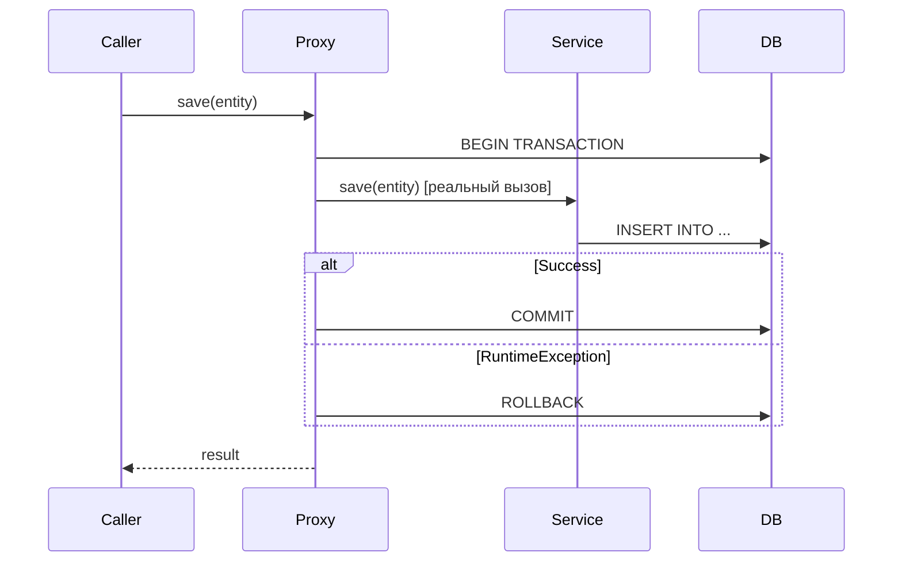

# Вопросы на собеседовании: `Spring Transactions`

`@Transactional` — самая часто задаваемая тема на Spring-собеседованиях. Проверяют понимание propagation, isolation levels, правил rollback и типичных ловушек (self-invocation, checked exceptions, видимость метода).

Дата последнего обновления: 2026-04-22

## Полезные ссылки

### Официальная документация

- [Spring Transaction Management](https://docs.spring.io/spring-framework/docs/current/reference/html/data-access.html#transaction) — официальная документация
- [Baeldung: @Transactional](https://www.baeldung.com/transaction-configuration-with-jpa-and-spring) — настройка транзакций
- [Baeldung: Propagation & Isolation](https://www.baeldung.com/spring-transactional-propagation-isolation) — все типы propagation и isolation

## Содержание

- [Полезные ссылки](#полезные-ссылки)
- [See also](#see-also)

**Основы**
- [Q1. (!) Как Spring реализует @Transactional?](#q1-как-spring-реализует-transactional)
- [Q2. Когда нужен @EnableTransactionManagement?](#q2-когда-нужен-enabletransactionmanagement)
- [Q3. Какие требования для работы @Transactional?](#q3-какие-требования-для-работы-transactional)

**Propagation**
- [Q4. (!) Какие типы Propagation существуют?](#q4-какие-типы-propagation-существуют)
- [Q5. (!) Чем REQUIRES_NEW отличается от NESTED?](#q5-чем-requires_new-отличается-от-nested)
- [Q6. Когда использовать MANDATORY и NEVER?](#q6-когда-использовать-mandatory-и-never)

**Isolation**
- [Q7. (!) Какие уровни изоляции поддерживает Spring?](#q7-какие-уровни-изоляции-поддерживает-spring)
- [Q8. Что такое dirty read, non-repeatable read, phantom read?](#q8-что-такое-dirty-read-non-repeatable-read-phantom-read)

**Rollback**
- [Q9. (!) По каким исключениям Spring откатывает транзакцию по умолчанию?](#q9-по-каким-исключениям-spring-откатывает-транзакцию-по-умолчанию)
- [Q10. Как настроить rollback для checked exceptions?](#q10-как-настроить-rollback-для-checked-exceptions)

**Подводные камни**
- [Q11. (!) Почему self-invocation ломает @Transactional?](#q11-почему-self-invocation-ломает-transactional)
- [Q12. Что делает readOnly = true?](#q12-что-делает-readonly--true)
- [Q13. Можно ли ставить @Transactional на интерфейс?](#q13-можно-ли-ставить-transactional-на-интерфейс)
- [Q14. Как работает @Transactional в многопоточном коде?](#q14-как-работает-transactional-в-многопоточном-коде)
- [Q15. Как тестировать транзакционный код?](#q15-как-тестировать-транзакционный-код)

---

## Q1. (!) Как Spring реализует @Transactional?

Spring использует AOP-прокси: при первом обращении к методу с `@Transactional` вызов перехватывается прокси, который:
1. Открывает транзакцию (или присоединяется к существующей)
2. Вызывает реальный метод
3. Коммитит или откатывает по результату



Прокси создаётся через JDK Dynamic Proxy (если бин реализует интерфейс) или CGLIB (для классов). `@Transactional` — это `@Around`-advice под капотом.

> [!mcq]
> - [ ] Spring реализует @Transactional через AspectJ compile-time weaving, внедряя байткод транзакционного поведения во время компиляции. | Это AspectJ. ❌ ПОСЛЕДСТВИЕ: разработчик ищет AspectJ Maven plugin для @Transactional работы — лишняя настройка, ломается hot-reload. Default — runtime proxy.
> - [ ] Spring реализует @Transactional через reflection, напрямую перехватывая вызовы методов через java.lang.reflect.Proxy без создания прокси-объектов. | Прокси создаётся. ❌ ПОСЛЕДСТВИЕ: путаница приводит к попыткам "включить @Transactional через reflection-tricks" вместо понимания proxy-modelа.
> - [x] Spring реализует @Transactional через AOP-прокси (JDK Dynamic Proxy или CGLIB), который перехватывает вызов, открывает транзакцию, вызывает реальный метод и коммитит или откатывает по результату. | ✓ ПРИМЕНЯТЬ: понимание proxy-модели — ключ к диагностике self-invocation (Q11), private-method bug (Q3). `TransactionInterceptor` extends `MethodInterceptor` (AOP Alliance), реализует `@Around` semantics. `TransactionSynchronizationManager.isActualTransactionActive()` для проверки наличия TX в текущем потоке. 📋 ПРАВИЛО: "@Transactional = AOP-proxy + @Around семантика; JDK Proxy для interface, CGLIB для class". 🔗 См. Q3 (требования), Q11 (self-invocation), Q14 (multi-thread).
> - [ ] Spring реализует @Transactional через ThreadLocal-переменные в TransactionSynchronizationManager без создания каких-либо прокси. | ThreadLocal — для context, не для перехвата. ❌ ПОСЛЕДСТВИЕ: путаница приводит к попыткам устанавливать TX-context manually через ThreadLocal — на деле без proxy транзакция не управляется.

> [!mcq]
> - [ ] При вызове @Transactional-метода Spring всегда создаёт JDK Dynamic Proxy, потому что это более производительный механизм, чем CGLIB. | Не всегда JDK. ❌ ПОСЛЕДСТВИЕ: непонимание автоматического выбора приводит к недоумению "почему мой класс без интерфейса не работает с JDK Proxy" — Spring уже сам выбрал CGLIB.
> - [x] При вызове @Transactional-метода Spring создаёт JDK Dynamic Proxy если бин реализует интерфейс, и CGLIB — если бин является классом без интерфейса. | ✓ ПРИМЕНЯТЬ: Spring Boot 2.0+ default `proxyTargetClass=true` (всегда CGLIB) — для consistency и переходов между интерфейсной и не-интерфейсной реализацией. `AopUtils.isJdkDynamicProxy(bean)` / `isCglibProxy(bean)` для проверки в тестах. 📋 ПРАВИЛО: "interface = JDK Proxy, no interface = CGLIB; Spring Boot 2.0+ default CGLIB через proxyTargetClass=true". 🔗 См. Q1 (proxy общий), Q3 (требования), Q11 (self-invocation у обоих типов).
> - [ ] При вызове @Transactional-метода Spring всегда создаёт CGLIB-прокси, потому что JDK Dynamic Proxy не поддерживает транзакции. | JDK поддерживает. ❌ ПОСЛЕДСТВИЕ: ошибочное предположение приводит к лишнему `proxyTargetClass=true` в plain Spring проектах с интерфейсами — небольшой performance overhead, лишние bytecode generation.
> - [ ] При вызове @Transactional-метода Spring не создаёт прокси, а применяет AspectJ load-time weaving через Java agent. | LTW — отдельный режим. ❌ ПОСЛЕДСТВИЕ: разработчик ищет `-javaagent:aspectjweaver.jar` в Java-команде, не находит — путается. Spring AOP по умолчанию работает без агента.

---

## Q2. Когда нужен @EnableTransactionManagement?

В Spring Boot — **не нужен**: автоконфигурация включает управление транзакциями автоматически при наличии `spring-data-*` или `spring-tx` в classpath.

В чистом Spring — необходим:
```java
@Configuration
@EnableTransactionManagement
public class AppConfig { ... }
```

Или XML: `<tx:annotation-driven transaction-manager="txManager"/>`.

> [!mcq]
> - [ ] @EnableTransactionManagement нужен в любом Spring-приложении, включая Spring Boot, чтобы явно включить поддержку @Transactional. | Не нужен в Boot. ❌ ПОСЛЕДСТВИЕ: лишняя аннотация — копируется из туториалов, может конфликтовать с custom TransactionManager configuration в `proxyTargetClass`/`mode` параметрах.
> - [ ] @EnableTransactionManagement нужен только при использовании JPA, но не нужен при работе с JDBC напрямую. | Не зависит от технологии. ❌ ПОСЛЕДСТВИЕ: разработчик в plain Spring + JDBC не добавляет аннотацию, удивляется почему `@Transactional` не работает с `JdbcTemplate`. Аннотация общая для AOP processing.
> - [x] @EnableTransactionManagement нужен в чистом Spring-приложении (без Boot) — в Spring Boot автоконфигурация включает управление транзакциями автоматически. | ✓ ПРИМЕНЯТЬ: для plain Spring (war-deployment в Tomcat, no Boot) — обязательна; для Spring Boot — опциональна, но нужна для кастомизации `mode = AdviceMode.ASPECTJ` (compile-time weaving) или `proxyTargetClass`. Без аннотации — `@Transactional` молча игнорируется, classic newbie bug. 📋 ПРАВИЛО: "Spring Boot = autoconfig (TransactionAutoConfiguration); plain Spring = manual @EnableTransactionManagement". 🔗 См. Q1 (proxy mechanism), Q3 (требования к работе).
> - [ ] @EnableTransactionManagement нужен только при использовании программного управления транзакциями через TransactionTemplate, а для @Transactional он не требуется. | Наоборот. ❌ ПОСЛЕДСТВИЕ: разработчик удаляет аннотацию "потому что использует только TransactionTemplate", не замечает что в проекте также есть `@Transactional` методы — те молча перестают работать.

---

## Q3. Какие требования для работы @Transactional?

1. **Только `public` методы** — `protected`/`private`/`package-private` игнорируются молча (без ошибки!)
2. **Вызов через прокси** — self-invocation (`this.method()`) не работает
3. **Бин должен быть в Spring-контексте** — аннотация на `new MyService()` не работает

```java
@Service
public class UserService {

    @Transactional          // работает — public
    public void save(User u) { ... }

    @Transactional          // НЕ работает — private (молча игнорируется)
    private void internalSave(User u) { ... }
}
```

> [!mcq]
> - [ ] @Transactional на private-методе вызовет исключение при старте приложения, потому что Spring обнаружит некорректную конфигурацию. | Молча игнорируется. ❌ ПОСЛЕДСТВИЕ: разработчик ожидает loud failure при старте, не получает — баг проявляется только в проде через data inconsistency. Spring 6+ начинает выдавать DEBUG warnings, но это easily missable.
> - [ ] @Transactional на protected-методе работает корректно при использовании CGLIB-прокси, потому что CGLIB может переопределять protected-методы. | Не работает. ❌ ПОСЛЕДСТВИЕ: разработчик переходит с private на protected ожидая что заработает с CGLIB — Spring AOP всё равно игнорирует. Только public.
> - [x] @Transactional на private-методе молча игнорируется без ошибки — Spring применяет @Transactional только к public-методам. | ✓ ПРИМЕНЯТЬ: всегда public для @Transactional методов; для encapsulation — package-private класса с public методом, или вынос в отдельный сервис. IntelliJ IDEA подсвечивает warning "method is not visible to proxy". 📋 ПРАВИЛО: "@Transactional ТОЛЬКО на public методах (Spring AOP); IDE warning IntelliJ помогает; AspectJ снимает ограничение". 🔗 См. Q1 (proxy mechanism), Q11 (self-invocation), Q14 (multi-thread).
> - [ ] @Transactional работает на любых методах при использовании AspectJ-weaving вместо Spring AOP, включая private. | AspectJ снимает ограничение, но требует отдельной настройки. ❌ ПОСЛЕДСТВИЕ: команда переходит на AspectJ "для private методов" не понимая всех trade-offs (compile-time complexity, IDE support issues, class loading impact). Проще — рефакторинг на public.

> [!mcq]
> - [x] Если вызвать @Transactional-метод через new MyService() вместо Spring-бина, транзакция не создастся, потому что объект не управляется Spring-контейнером. | ✓ ПРИМЕНЯТЬ: всегда `@Autowired` или constructor injection для Spring-сервисов; в тестах используйте `@SpringBootTest` или `@DataJpaTest` для injection вместо `new` (тогда @Transactional работает). Инстанцирование через `new` — для unit-тестов с моками, не для transaction testing. 📋 ПРАВИЛО: "@Transactional работает только через Spring-managed bean; new = no proxy = no transaction". 🔗 См. Q1 (proxy creation), Q15 (тестирование), Q11 (self-invocation).
> - [ ] Если вызвать @Transactional-метод через new MyService(), Spring всё равно создаст транзакцию, потому что аннотация обрабатывается в runtime через reflection. | Без bean — без proxy. ❌ ПОСЛЕДСТВИЕ: разработчик `new MyService().save(...)` в тесте, удивляется что rollback не работает между тестами. Объяснение — нет prox.
> - [ ] Если вызвать @Transactional-метод через new MyService(), Spring выбросит BeanCreationException при обнаружении аннотации вне контекста. | Не выбросит. ❌ ПОСЛЕДСТВИЕ: разработчик надеется на explicit failure при ошибке — Spring молча работает без транзакций. Subtle bug требует тестов на rollback behavior.
> - [ ] Если вызвать @Transactional-метод через new MyService(), транзакция создастся только если в classpath есть spring-aspects и AspectJ-агент. | AspectJ требует load-time weaving setup. ❌ ПОСЛЕДСТВИЕ: команда не настраивает LTW, ожидает что наличие spring-aspects "просто работает" — нет, нужен `-javaagent:aspectjweaver.jar` и `META-INF/aop.xml`.

---

## Q4. (!) Какие типы Propagation существуют?

`Propagation` определяет поведение транзакции при вызове из уже транзакционного контекста.

| Тип | Есть активная TX | Нет активной TX |
|---|---|---|
| `REQUIRED` (дефолт) | Использует существующую | Создаёт новую |
| `REQUIRES_NEW` | Приостанавливает старую, создаёт новую | Создаёт новую |
| `NESTED` | Создаёт savepoint внутри текущей | Создаёт новую |
| `SUPPORTS` | Использует существующую | Выполняется без TX |
| `NOT_SUPPORTED` | Приостанавливает TX | Выполняется без TX |
| `MANDATORY` | Использует существующую | **Исключение** |
| `NEVER` | **Исключение** | Выполняется без TX |

**REQUIRED (дефолт):**
```java
@Transactional  // REQUIRED по умолчанию
public void updateOrder(Order order) {
    orderRepository.save(order);
    auditService.log(order);  // присоединится к этой же транзакции
}
```

**REQUIRES_NEW:**
```java
@Transactional(propagation = Propagation.REQUIRES_NEW)
public void auditLog(String event) {
    // Всегда в отдельной TX — коммитится независимо
    auditRepository.save(new AuditEntry(event));
}
```

> [!mcq]
> - [ ] Propagation.SUPPORTS создаёт новую транзакцию если активной нет, и присоединяется к существующей если есть. | Это REQUIRED. ❌ ПОСЛЕДСТВИЕ: разработчик ставит SUPPORTS на критичный save-метод ожидая auto-create transaction — на деле метод выполняется без TX, partial writes без rollback.
> - [ ] Propagation.REQUIRED приостанавливает существующую транзакцию и создаёт новую независимую транзакцию при каждом вызове. | Это REQUIRES_NEW. ❌ ПОСЛЕДСТВИЕ: путаница в дизайне приводит к unexpected rollback isolation — ожидается join existing, фактически — independent transaction с разными commit points.
> - [ ] Propagation.NOT_SUPPORTED бросает исключение если вызван внутри активной транзакции. | Это NEVER. ❌ ПОСЛЕДСТВИЕ: разработчик путает NOT_SUPPORTED с NEVER — для long-running export операции ожидает exception при misuse, не получает; long export блокирует resources в transaction.
> - [x] Propagation.MANDATORY бросает IllegalTransactionStateException если вызван без активной транзакции, и использует существующую если она есть. | ✓ ПРИМЕНЯТЬ: для guard-методов в финансовых операциях ("transfer должен быть в транзакции"), для validation в saga compensation. NEVER для read-only batch jobs (export, reports). 📋 ПРАВИЛО: "MANDATORY = метод требует TX (guard от ошибки); NEVER = метод не должен быть в TX (long ops)". 🔗 См. Q4 (все propagation), Q5 (REQUIRES_NEW vs NESTED), Q6 (MANDATORY/NEVER use cases).

> [!mcq]
> - [x] Propagation.REQUIRED (дефолт) присоединяется к существующей транзакции если она есть, или создаёт новую если нет — это поведение по умолчанию для @Transactional. | ✓ ПРИМЕНЯТЬ: 90% случаев — оставляйте default (REQUIRED); явно меняйте только для специальных случаев (REQUIRES_NEW для audit logs, NESTED для partial rollback с savepoints). REQUIRED обеспечивает atomicity всей цепочки вызовов в одной TX. 📋 ПРАВИЛО: "REQUIRED = default; join existing OR create new; для 90% случаев". 🔗 См. Q5 (REQUIRES_NEW vs NESTED), Q6 (MANDATORY/NEVER), Q11 (self-invocation).
> - [ ] Propagation.NESTED приостанавливает существующую транзакцию и выполняется в новой независимой транзакции, которая может коммититься отдельно. | Это REQUIRES_NEW. ❌ ПОСЛЕДСТВИЕ: разработчик использует NESTED ожидая independent commit, на деле — savepoint внутри parent TX. Если parent rollback — NESTED тоже rollback. Audit logs не сохраняются.
> - [ ] Propagation.NEVER присоединяется к существующей транзакции если она есть, выполняется без TX если нет — аналог SUPPORTS но с другим названием. | NEVER ≠ SUPPORTS. ❌ ПОСЛЕДСТВИЕ: путаница приводит к runtime IllegalTransactionStateException в production — NEVER метод вызван из @Transactional метода, exception, request fails.
> - [ ] Propagation.REQUIRES_NEW создаёт savepoint внутри текущей транзакции, позволяя откатить вложенную операцию без отката родительской. | Это NESTED. ❌ ПОСЛЕДСТВИЕ: путаница savepoints с new transaction приводит к неправильным ожиданиям isolation — `REQUIRES_NEW` рассматривает свою commit/rollback независимо от parent, а `NESTED` зависит.

---

## Q5. (!) Чем REQUIRES_NEW отличается от NESTED?

| | `REQUIRES_NEW` | `NESTED` |
|---|---|---|
| Транзакция | Новая независимая | Savepoint внутри текущей |
| Rollback дочерней | Не откатывает родительскую | Не откатывает до savepoint |
| Rollback родительской | Не откатывает дочернюю | **Откатывает** дочернюю |
| Commit | Независимый | При коммите родительской |
| Поддержка | Все TX-менеджеры | Только JDBC savepoints |

```java
@Transactional
public void placeOrder(Order order) {
    orderRepository.save(order);

    try {
        // REQUIRES_NEW: если упадёт notifyCustomer, 
        // order всё равно сохранится
        notifyCustomer(order.getCustomerId());
    } catch (NotificationException e) {
        log.warn("Notification failed, order saved anyway");
    }
}

@Transactional(propagation = Propagation.REQUIRES_NEW)
public void notifyCustomer(Long customerId) { ... }
```

**NESTED** использует JDBC savepoints:
```java
@Transactional(propagation = Propagation.NESTED)
public void updateInventory(Long productId, int delta) {
    // Если упадёт — откатится до savepoint
    // Если parent откатится — откатится и это
}
```

> [!mcq]
> - [ ] При откате родительской транзакции REQUIRES_NEW также откатывает дочернюю транзакцию, потому что они связаны через один Connection. | REQUIRES_NEW = independent. ❌ ПОСЛЕДСТВИЕ: разработчик ожидает что audit log на REQUIRES_NEW тоже rollback при ошибке main TX — на деле audit сохраняется. Может быть как desired behavior (always log attempts), так и проблема (audit без actual data).
> - [x] При откате родительской транзакции NESTED откатывает и дочернюю, а REQUIRES_NEW — нет, потому что NESTED использует savepoint внутри той же транзакции, а REQUIRES_NEW создаёт новую независимую. | ✓ ПРИМЕНЯТЬ: REQUIRES_NEW для audit logs (всегда сохраняются), для notification (отправлять даже при rollback main), для metrics tracking; NESTED для partial rollback внутри одной TX (восстановление после bulk-операции). NESTED требует JDBC savepoints. 📋 ПРАВИЛО: "REQUIRES_NEW = independent commit/rollback; NESTED = savepoint в parent TX, rollback parent = rollback NESTED". 🔗 См. Q4 (все propagation), Q5 (подробнее REQUIRES_NEW vs NESTED), Q11 (self-invocation).
> - [ ] При откате дочерней транзакции REQUIRES_NEW откатывает и родительскую, потому что они разделяют один и тот же Connection к БД. | Не разделяют. ❌ ПОСЛЕДСТВИЕ: разработчик ожидает что failure в REQUIRES_NEW abort'ит main flow — на деле parent продолжает, child exception нужно ловить explicitly через try/catch.
> - [ ] NESTED и REQUIRES_NEW идентичны по поведению отката — оба создают независимые транзакции, отличаясь только наличием savepoint как оптимизации. | Принципиально разные. ❌ ПОСЛЕДСТВИЕ: путаница приводит к неправильному выбору в дизайне — для финансовой operation использован NESTED вместо REQUIRES_NEW; main TX rollback также откатывает audit; нет следов attempt'ов.

> [!mcq]
> - [ ] NESTED поддерживается всеми транзакционными менеджерами Spring так же, как REQUIRES_NEW. | NESTED требует savepoints. ❌ ПОСЛЕДСТВИЕ: разработчик пишет NESTED логику, на тестах в H2 работает, в production с JpaTransactionManager бросает `NestedTransactionNotSupportedException`. Кейс из реальных incidents.
> - [ ] REQUIRES_NEW не поддерживается JPA-транзакционным менеджером и работает только с DataSourceTransactionManager. | Поддерживается всеми. ❌ ПОСЛЕДСТВИЕ: ложное предположение приводит к over-complex архитектуре с двумя TransactionManager — на деле один JpaTransactionManager handles REQUIRES_NEW корректно.
> - [x] REQUIRES_NEW поддерживается всеми TX-менеджерами, а NESTED требует поддержки JDBC savepoints — поэтому NESTED может не работать с некоторыми провайдерами. | ✓ ПРИМЕНЯТЬ: для предсказуемой работы — REQUIRES_NEW (always works); для NESTED — проверьте `DataSourceTransactionManager` + JDBC driver supports savepoints (PostgreSQL, MySQL, Oracle — yes). NoSQL/JPA may not support. 📋 ПРАВИЛО: "REQUIRES_NEW = universal; NESTED = JDBC savepoints required, not all TX managers support". 🔗 См. Q5 (главный вопрос), Q4 (все propagation), Q14 (multi-thread).
> - [ ] NESTED поддерживается только в PostgreSQL, а REQUIRES_NEW работает со всеми реляционными СУБД без ограничений. | Не только PostgreSQL. ❌ ПОСЛЕДСТВИЕ: разработчик ограничивает NESTED только для PostgreSQL-deployments — на деле MySQL, Oracle, MSSQL также поддерживают savepoints.

---

## Q6. Когда использовать MANDATORY и NEVER?

**`MANDATORY`** — метод должен вызываться только из транзакционного контекста. Полезен для защиты от ошибок проектирования:
```java
@Transactional(propagation = Propagation.MANDATORY)
public void updateBalance(Account acc, BigDecimal amount) {
    // Защита: этот метод нельзя вызывать без транзакции
    acc.setBalance(acc.getBalance().add(amount));
    repository.save(acc);
}
```
Если вызвать без транзакции → `IllegalTransactionStateException`.

**`NEVER`** — метод не должен выполняться в транзакции:
```java
@Transactional(propagation = Propagation.NEVER)
public void exportToCsv() {
    // Долгая операция, не должна блокировать TX
}
```
Если вызвать внутри транзакции → `IllegalTransactionStateException`.

> [!mcq]
> - [ ] Propagation.MANDATORY создаёт новую транзакцию если активной нет, и бросает исключение если активная транзакция уже есть. | Обратная логика. ❌ ПОСЛЕДСТВИЕ: разработчик ставит MANDATORY ожидая защиту от nested transactions — на деле получает наоборот: failure при first call without TX.
> - [ ] Propagation.NEVER приостанавливает активную транзакцию и выполняет метод без транзакционного контекста, не бросая исключений. | Это NOT_SUPPORTED. ❌ ПОСЛЕДСТВИЕ: разработчик путает NEVER с NOT_SUPPORTED — для long-running export метод вызывается внутри @Transactional, бросает exception. Производство ломается.
> - [ ] Propagation.MANDATORY используется когда метод не должен выполняться в транзакции — например, для долгих операций чтения. | Это NEVER. ❌ ПОСЛЕДСТВИЕ: обратная семантика приводит к неправильным дизайн-решениям; для protection long-running ops использован MANDATORY вместо NEVER.
> - [x] Propagation.MANDATORY бросает IllegalTransactionStateException при вызове без транзакции, а NEVER — при вызове внутри транзакции. | ✓ ПРИМЕНЯТЬ: MANDATORY для finansial helpers ("transfer должен быть в parent TX"); NEVER для batch jobs/exports которые держат resources долго; NOT_SUPPORTED для безопасного исключения логики из TX без exception. 📋 ПРАВИЛО: "MANDATORY = require TX (defensive); NEVER = forbid TX (long ops); NOT_SUPPORTED = silently exclude". 🔗 См. Q4 (все propagation), Q5 (REQUIRES_NEW vs NESTED), Q3 (требования к работе).

---

## Q7. (!) Какие уровни изоляции поддерживает Spring?

| Уровень | Dirty Read | Non-repeatable Read | Phantom Read |
|---|---|---|---|
| `READ_UNCOMMITTED` | Возможен | Возможен | Возможен |
| `READ_COMMITTED` | Нет | Возможен | Возможен |
| `REPEATABLE_READ` | Нет | Нет | Возможен |
| `SERIALIZABLE` | Нет | Нет | Нет |
| `DEFAULT` | Дефолт СУБД | — | — |

```java
@Transactional(isolation = Isolation.READ_COMMITTED)
public List<Product> getProducts() { ... }
```

**Дефолты СУБД:**
- PostgreSQL, SQL Server, Oracle: `READ_COMMITTED`
- MySQL: `REPEATABLE_READ`

**Важно:** `READ_UNCOMMITTED` не поддерживается в PostgreSQL и Oracle.

> [!mcq]
> - [ ] Isolation.REPEATABLE_READ защищает от dirty read, non-repeatable read и phantom read — то есть обеспечивает полную изоляцию транзакций. | Phantom read возможен. ❌ ПОСЛЕДСТВИЕ: разработчик в финансовой системе использует REPEATABLE_READ ожидая full isolation, on production двойная агрегация (SELECT SUM... — SELECT COUNT...) даёт inconsistent values из-за phantom inserts. Решение: SERIALIZABLE или explicit SELECT FOR UPDATE.
> - [x] Isolation.REPEATABLE_READ защищает от dirty read и non-repeatable read, но phantom read при нём всё ещё возможен. | ✓ ПРИМЕНЯТЬ: для read consistency одних и тех же строк (повторное чтение `SELECT * FROM accounts WHERE id=42` гарантирует same data); MySQL InnoDB использует REPEATABLE_READ + gap locks (защищает от phantoms!) — implementation-specific behavior отличается от стандарта SQL. PostgreSQL — стандартное поведение. 📋 ПРАВИЛО: "REPEATABLE_READ = same row consistency, range queries не защищены от phantoms (стандарт); MySQL InnoDB — gap locks дают phantom protection". 🔗 См. Q8 (anomalies подробно), Q7 (другие isolation levels).
> - [ ] Isolation.READ_COMMITTED защищает от dirty read, non-repeatable read, но допускает phantom read. | Только dirty read. ❌ ПОСЛЕДСТВИЕ: разработчик в reporting flow ожидает stable values между SELECT'ами в одной TX — non-repeatable read возможен на READ_COMMITTED, отчёты показывают cross-state inconsistency.
> - [ ] Isolation.SERIALIZABLE защищает от dirty read и phantom read, но non-repeatable read при нём всё ещё возможен. | SERIALIZABLE = full protection. ❌ ПОСЛЕДСТВИЕ: ложные предположения о limitations SERIALIZABLE приводят к over-engineering — добавление additional locks "на всякий случай" поверх SERIALIZABLE, потеря throughput без gain.

> [!mcq]
> - [ ] PostgreSQL по умолчанию использует уровень изоляции REPEATABLE_READ, поэтому non-repeatable read в нём невозможен. | PostgreSQL default = READ_COMMITTED. ❌ ПОСЛЕДСТВИЕ: разработчик мигрирует с MySQL на PostgreSQL ожидая same isolation behavior — внезапно появляются non-repeatable reads в production reports. Проявление dependency leakage между application code и DB defaults.
> - [ ] READ_UNCOMMITTED поддерживается всеми СУБД, подключаемыми через Spring, и является самым быстрым уровнем изоляции. | Не поддерживается PostgreSQL/Oracle. ❌ ПОСЛЕДСТВИЕ: команда оптимизирует heavy read query с `Isolation.READ_UNCOMMITTED`, на тестах H2 работает, в проде PostgreSQL silently повышает до READ_COMMITTED — performance gain не достигнут.
> - [x] PostgreSQL и Oracle по умолчанию используют READ_COMMITTED, а MySQL — REPEATABLE_READ, и READ_UNCOMMITTED не поддерживается PostgreSQL и Oracle. | ✓ ПРИМЕНЯТЬ: явно указывайте Isolation в @Transactional для critical-path code; для миграции между СУБД — testcontainers с тем же провайдером что в production; знайте default для своей СУБД при code review. 📋 ПРАВИЛО: "PG/Oracle = READ_COMMITTED default; MySQL = REPEATABLE_READ default; READ_UNCOMMITTED not supported in PG/Oracle". 🔗 См. Q7 (все isolation levels), Q8 (anomalies подробно), database-transactions-interview.md (cross-DB behaviour).
> - [ ] Spring всегда использует Isolation.DEFAULT, который соответствует READ_COMMITTED независимо от используемой СУБД. | DEFAULT = СУБД-specific. ❌ ПОСЛЕДСТВИЕ: предположение о universal default приводит к undocumented behaviour между environments — staging (MySQL) и prod (PostgreSQL) показывают разное поведение isolation.

---

## Q8. Что такое dirty read, non-repeatable read, phantom read?

**Dirty Read** — читаем данные незакоммиченной транзакции:
```
TX1: UPDATE balance SET amount = 1000  (не закоммичено)
TX2: SELECT amount  → получает 1000
TX1: ROLLBACK
TX2 прочитал несуществующие данные → dirty read
```

**Non-repeatable Read** — один и тот же SELECT в рамках транзакции возвращает разные данные:
```
TX1: SELECT price FROM products WHERE id = 1  → 100
TX2: UPDATE products SET price = 150 WHERE id = 1; COMMIT
TX1: SELECT price FROM products WHERE id = 1  → 150 (другой результат!)
```

**Phantom Read** — повторный SELECT с диапазоном возвращает другие строки:
```
TX1: SELECT * FROM orders WHERE amount > 500  → 5 строк
TX2: INSERT INTO orders (amount) VALUES (600); COMMIT
TX1: SELECT * FROM orders WHERE amount > 500  → 6 строк (phantom!)
```

> [!mcq]
> - [ ] Dirty read — это когда повторный SELECT в одной транзакции возвращает другой результат из-за UPDATE, закоммиченного другой транзакцией между двумя чтениями. | Это non-repeatable read. ❌ ПОСЛЕДСТВИЕ: путаница в дизайне — разработчик ставит REPEATABLE_READ "защититься от dirty read" — overkill, READ_COMMITTED достаточно.
> - [ ] Non-repeatable read — это когда диапазонный SELECT возвращает разное количество строк из-за INSERT или DELETE, выполненных другой транзакцией. | Это phantom. ❌ ПОСЛЕДСТВИЕ: путаница приводит к неправильным ожиданиям isolation level — разработчик ставит REPEATABLE_READ ожидая phantom protection, не получает.
> - [x] Phantom read — это когда повторный диапазонный SELECT в одной транзакции возвращает разное количество строк из-за INSERT или DELETE в другой транзакции. | ✓ ПРИМЕНЯТЬ: типичный кейс — `SELECT COUNT(*) FROM orders WHERE status='pending'` дважды в одной TX даёт разные значения — другая TX вставила new pending order. Решение: SERIALIZABLE или explicit `SELECT ... FOR UPDATE` блокирует диапазон. 📋 ПРАВИЛО: "dirty=uncommitted data; non-repeatable=different row values; phantom=different row count (range query)". 🔗 См. Q7 (isolation levels), Q9 (rollback rules), database-transactions-interview для подробностей.
> - [ ] Dirty read — это когда два последовательных SELECT в одной транзакции возвращают разные значения одной и той же строки из-за UPDATE в другой транзакции. | Это non-repeatable read. ❌ ПОСЛЕДСТВИЕ: путаница terminology в design discussions — на собеседовании или code review, неправильное использование терминов снижает credibility.

---

## Q9. (!) По каким исключениям Spring откатывает транзакцию по умолчанию?

**Только `RuntimeException` и его наследники (unchecked)**. `Error` тоже вызывает rollback.

Checked исключения (`IOException`, `SQLException` и т.д.) — **НЕ** откатывают транзакцию по умолчанию.

```java
@Transactional
public void process() throws IOException {
    repository.save(data);
    throw new IOException("file error");  // транзакция ЗАКОММИТИТСЯ!
}

@Transactional
public void process2() {
    repository.save(data);
    throw new RuntimeException("error");  // транзакция ОТКАТИТСЯ
}
```

**Логика дефолтного поведения:** checked exceptions — "ожидаемые ситуации", не обязательно означают ошибку транзакции.

> [!mcq]
> - [ ] Spring по умолчанию откатывает транзакцию при любом Exception, включая checked, потому что любое исключение указывает на ошибку. | Только Runtime/Error. ❌ ПОСЛЕДСТВИЕ: ложные ожидания приводят к data inconsistency — `IOException` thrown after partial save, transaction commits, half-baked state в БД. На собеседовании senior — критическая ошибка.
> - [ ] Spring по умолчанию откатывает транзакцию только при Error, но не при RuntimeException — для RuntimeException нужен явный rollbackFor. | Откатывает на Runtime тоже. ❌ ПОСЛЕДСТВИЕ: разработчик добавляет лишний `rollbackFor=RuntimeException.class` — works но redundant.
> - [ ] Spring по умолчанию откатывает транзакцию при checked exceptions, потому что они объявлены в сигнатуре метода и значит ожидаются разработчиком. | Логика обратная — ожидаемые → не rollback. ❌ ПОСЛЕДСТВИЕ: разработчик не настраивает `rollbackFor`, доверяя что "exception=rollback", получает inconsistency.
> - [x] Spring по умолчанию откатывает транзакцию при RuntimeException и Error, а при checked exceptions (IOException, SQLException и т.д.) — коммитит. | ✓ ПРИМЕНЯТЬ: для критичной business logic — `@Transactional(rollbackFor = Exception.class)`; для библиотечного кода — let callers decide. Альтернатива: оборачивайте checked в RuntimeException (Vavr Try, custom runtime exceptions). EJB и JTA имели обратное правило (rollback on any), Spring сохранил Java-конвенцию для совместимости. 📋 ПРАВИЛО: "default rollback only on Runtime/Error; checked = commit; явно указывайте rollbackFor для критичных операций". 🔗 См. Q10 (rollbackFor configuration), Q1 (proxy mechanism), Q5 (REQUIRES_NEW при rollback).

---

## Q10. Как настроить rollback для checked exceptions?

```java
// Откатывать при любом Exception (включая checked)
@Transactional(rollbackFor = Exception.class)
public void importFile() throws IOException {
    // Если IOException → rollback
}

// Несколько типов:
@Transactional(rollbackFor = {IOException.class, SQLException.class})
public void process() throws IOException, SQLException { ... }

// Не откатывать при конкретном RuntimeException:
@Transactional(noRollbackFor = BusinessValidationException.class)
public void validateAndSave(Order order) {
    // BusinessValidationException не откатит TX — данные сохранятся
}
```

**Программный rollback:**
```java
@Transactional
public void saveWithManualRollback() {
    try {
        repository.save(entity);
    } catch (SomeCheckedException e) {
        TransactionAspectSupport.currentTransactionStatus().setRollbackOnly();
        throw e;
    }
}
```

> [!mcq]
> - [ ] Чтобы откатить транзакцию при IOException, нужно указать @Transactional(noRollbackFor = IOException.class). | noRollbackFor — opposite. ❌ ПОСЛЕДСТВИЕ: confusion semantically — разработчик ставит noRollbackFor получая обратный effect, transaction коммитится при IOException, partial saves в проде.
> - [x] Чтобы откатить транзакцию при IOException, нужно указать @Transactional(rollbackFor = IOException.class) или rollbackFor = Exception.class. | ✓ ПРИМЕНЯТЬ: для finansial operations — всегда `rollbackFor = Exception.class` (no exception leaks через commit); для пакетной обработки — `rollbackFor = {IOException.class, SQLException.class}` selective list. Программный rollback — `TransactionAspectSupport.currentTransactionStatus().setRollbackOnly()` для условного rollback. 📋 ПРАВИЛО: "rollbackFor расширяет default; Exception.class = catch all; setRollbackOnly = программный rollback из catch block". 🔗 См. Q9 (default rollback rules), Q14 (multi-thread), Q11 (self-invocation).
> - [ ] Чтобы откатить транзакцию при IOException, достаточно объявить IOException в сигнатуре метода через throws, и Spring автоматически добавит rollback. | throws не влияет. ❌ ПОСЛЕДСТВИЕ: ложные ожидания приводят к разработке без `rollbackFor` атрибута, в production checked exceptions не roll-back'ят, data inconsistency.
> - [ ] Чтобы откатить транзакцию при IOException, нужно перехватить исключение и вызвать TransactionAspectSupport.currentTransactionStatus().commit(). | commit() не существует. ❌ ПОСЛЕДСТВИЕ: разработчик ищет несуществующий API, теряет время. Правильно — `setRollbackOnly()` или re-throw exception для proxy rollback.

> [!mcq]
> - [ ] noRollbackFor используется чтобы полностью отключить транзакцию для определённых методов, работающих с некритичными данными. | Влияет только на rollback rules. ❌ ПОСЛЕДСТВИЕ: разработчик ставит noRollbackFor ожидая что метод "выйдет из TX" — на деле TX создаётся и коммитится, просто без rollback на specific exceptions.
> - [ ] TransactionAspectSupport.currentTransactionStatus().setRollbackOnly() бросает исключение если активной транзакции нет в текущем потоке. | Бросает NoTransactionException. ❌ ПОСЛЕДСТВИЕ: разработчик использует `setRollbackOnly()` в helper-методе, который иногда вызывается без TX — runtime exception в edge cases.
> - [x] noRollbackFor позволяет исключить определённый RuntimeException из дефолтных правил rollback — транзакция закоммитится даже если этот тип исключения был брошен. | ✓ ПРИМЕНЯТЬ: для business validation exceptions (insufficient balance, validation failed) — данные предыдущих saves корректны, не должны rollback'иться; user-facing errors с partial data integrity. Pattern: `BusinessException extends RuntimeException` + `@Transactional(noRollbackFor = BusinessException.class)`. 📋 ПРАВИЛО: "noRollbackFor = exclude specific exceptions from default rollback; для business-expected exceptions". 🔗 См. Q9 (default rules), Q10 (rollbackFor), spring-aop-interview Q21 (Transactional через AOP).
> - [ ] noRollbackFor применяется только к checked exceptions — для RuntimeException нельзя отключить rollback через noRollbackFor. | Работает с любым типом. ❌ ПОСЛЕДСТВИЕ: ложные ограничения приводят к дополнительному коду — try/catch с custom rollback logic для RuntimeException, тогда как `noRollbackFor` решает за один атрибут.

---

## Q11. (!) Почему self-invocation ломает @Transactional?

Spring создаёт прокси вокруг бина. При вызове `this.method()` обращение идёт напрямую, **минуя прокси** — транзакционный advice не срабатывает.

```java
@Service
public class OrderService {

    @Transactional
    public void processAll(List<Order> orders) {
        for (Order o : orders) {
            processOne(o);  // self-invocation! @Transactional(REQUIRES_NEW) не создаётся
        }
    }

    @Transactional(propagation = Propagation.REQUIRES_NEW)
    public void processOne(Order order) {
        // Работает только если вызван извне через прокси
    }
}
```

**Решения:**

1. **Вынести в отдельный бин** (рекомендуется):
```java
@Service
public class OrderItemService {
    @Transactional(propagation = Propagation.REQUIRES_NEW)
    public void processOne(Order order) { ... }
}

@Service
public class OrderService {
    @Autowired OrderItemService orderItemService;

    @Transactional
    public void processAll(List<Order> orders) {
        orders.forEach(orderItemService::processOne);  // через прокси ✓
    }
}
```

2. **Self-inject через `@Lazy`:**
```java
@Service
public class OrderService {
    @Autowired @Lazy
    private OrderService self;

    @Transactional
    public void processAll(List<Order> orders) {
        orders.forEach(self::processOne);  // через прокси ✓
    }
}
```

> [!mcq]
> - [ ] Self-invocation ломает @Transactional потому что Java не позволяет вызывать переопределённые методы через this в CGLIB-подклассах. | Не Java limitation, AOP architecture. ❌ ПОСЛЕДСТВИЕ: ошибочное направление дебага — разработчик ищет CGLIB-specific issue, не находит, теряет время. Корень — proxy outside object, this inside object.
> - [x] Self-invocation ломает @Transactional потому что вызов через this идёт напрямую к реальному объекту, минуя AOP-прокси — транзакционный advice не срабатывает. | ✓ ПРИМЕНЯТЬ: для дебага — log `AopUtils.isAopProxy(this)` в проблемном методе (false означает self-invoked); для решения — extract в отдельный bean (best), self-injection с `@Lazy` (acceptable), `AopContext.currentProxy()` (last resort). 📋 ПРАВИЛО: "self-invocation = bypass proxy = no advice; решение — отдельный bean ИЛИ self-injection ИЛИ AopContext". 🔗 См. Q1 (proxy mechanism), Q5 (REQUIRES_NEW bug from self-invocation), spring-aop-interview Q5 (общая проблема).
> - [ ] Self-invocation ломает @Transactional только при использовании JDK Dynamic Proxy — с CGLIB self-invocation работает корректно. | Оба страдают. ❌ ПОСЛЕДСТВИЕ: команда переходит на `proxyTargetClass=true` ожидая что заработает self-invocation — нет, проблема fundamental для runtime proxy подхода. Time wasted.
> - [ ] Self-invocation ломает @Transactional только если вызываемый метод имеет другой propagation type — при одинаковом propagation self-invocation работает. | Не зависит от propagation. ❌ ПОСЛЕДСТВИЕ: subtle bug — разработчик считает что REQUIRED→REQUIRED self-invocation работает (выполняется в same TX), но при mixed propagation (REQUIRED→REQUIRES_NEW) "ломается". На деле — оба не работают, просто в первом случае баг не виден через side effects.

> [!mcq]
> - [ ] Лучший способ решить проблему self-invocation — использовать @Lazy self-inject, потому что это стандартная рекомендация Spring. | Workable, но не best. ❌ ПОСЛЕДСТВИЕ: self-injection маскирует архитектурную проблему — class violates SRP (Single Responsibility), несколько transactional concerns в одном классе. Refactor на separate beans даёт cleaner code.
> - [ ] Лучший способ решить проблему self-invocation — использовать AopContext.currentProxy() для получения прокси и вызова метода через него. | Code smell. ❌ ПОСЛЕДСТВИЕ: tight coupling класса к Spring AOP infrastructure; код становится не testable без full Spring context (`exposeProxy=true` обязателен); refactor с Spring AOP на reactive WebFlux ломается.
> - [x] Лучший способ решить проблему self-invocation — вынести вызываемый метод в отдельный Spring-бин, чтобы вызов шёл через прокси внешнего бина. | ✓ ПРИМЕНЯТЬ: extract method into new `@Service` (например, `OrderItemService` для items processing); inject через constructor; clean SRP, easy to test, no AOP-dependency leakage. Anti-pattern (avoid): everything в одном God-Service. 📋 ПРАВИЛО: "self-invocation fix = extract в отдельный bean (best); self-inject @Lazy (ok); AopContext (smell)". 🔗 См. Q11 (problem), Q1 (proxy), spring-aop-interview Q5 (общая проблема).
> - [ ] Лучший способ решить проблему self-invocation — переключиться на AspectJ compile-time weaving, которое работает без прокси и поддерживает self-invocation. | Heavy solution. ❌ ПОСЛЕДСТВИЕ: команда тратит спринт на AspectJ setup ради одной фичи self-invocation, получает complex build, slow compile times, IDE limitations. Refactor на separate beans даёт same effect без overhead.

---

## Q12. Что делает readOnly = true?

```java
@Transactional(readOnly = true)
public List<Product> findAll() { ... }
```

**Оптимизации при `readOnly = true`:**
- Hibernate: не выполняет dirty checking (не проверяет изменения сущностей)
- Hibernate: не накапливает snapshot сущностей → меньше памяти
- PostgreSQL/Oracle: использует read-only транзакцию (меньше локов)
- Spring: может выбрать read replica при соответствующей настройке роутинга

**Важно:** это **hint**, а не запрет на запись. БД не заблокирует INSERT через read-only транзакцию Spring на уровне драйвера (если не настроен явно). Гарантия — только на уровне Hibernate dirty checking.

**Best practice:** ставьте `readOnly = true` на все read-only сервисные методы и query-репозитории.

> [!mcq]
> - [ ] readOnly = true запрещает любые операции записи на уровне драйвера JDBC — при попытке INSERT Spring бросит исключение до отправки запроса в БД. | Hint, не enforce. ❌ ПОСЛЕДСТВИЕ: разработчик ожидает hard enforcement, делает `repository.save()` в @Transactional(readOnly=true) — runtime поведение зависит от Hibernate config, может silently записать или упасть с не очевидной ошибкой.
> - [ ] readOnly = true включает кэширование результатов запросов в Hibernate second-level cache для повышения производительности. | Не про L2 cache. ❌ ПОСЛЕДСТВИЕ: команда настраивает readOnly думая что включает caching, ожидает performance boost — фактически экономия только на dirty checking, что для простых queries незначительно.
> - [x] readOnly = true отключает в Hibernate dirty checking и накопление snapshot сущностей, что снижает нагрузку на память и CPU, а также может включить read-only режим в СУБД. | ✓ ПРИМЕНЯТЬ: на ВСЕ query-методы сервисов (`findAll`, `findById`, `getReport`); в reporting flows для больших датасетов (отказ от snapshot экономит heap dramatically); для batch READ операций. Best practice — `@Transactional(readOnly = true)` на @Service-class level + `@Transactional` (writable) на write methods. 📋 ПРАВИЛО: "readOnly = true для всех read methods; class-level + override на write methods". 🔗 См. Q14 (multi-thread), Q9 (rollback rules), spring-data-jpa-interview (read replica routing).
> - [ ] readOnly = true автоматически направляет запросы на read replica в кластере PostgreSQL без дополнительной настройки роутинга в Spring. | Routing — manual. ❌ ПОСЛЕДСТВИЕ: команда добавляет `readOnly=true` ожидая что queries автоматически уйдут на replica, нагрузка на primary не снизилась. Для routing — `AbstractRoutingDataSource` или Spring Cloud Connectors с явным mapping.

---

## Q13. Можно ли ставить @Transactional на интерфейс?

Технически — да, но **не рекомендуется** по нескольким причинам:
- Работает только с JDK proxy (не с CGLIB)
- Аннотации на интерфейсах не всегда видны через Spring AOP
- Нарушает принцип: интерфейс — контракт, транзакция — детали реализации

```java
// НЕ рекомендуется
public interface UserService {
    @Transactional
    void save(User user);
}

// Рекомендуется: аннотация на реализации
@Service
public class UserServiceImpl implements UserService {
    @Transactional
    @Override
    public void save(User user) { ... }
}
```

> [!mcq]
> - [ ] @Transactional на интерфейсе работает одинаково хорошо как с JDK Dynamic Proxy, так и с CGLIB — разницы между механизмами прокси нет. | Только JDK Proxy. ❌ ПОСЛЕДСТВИЕ: команда ставит @Transactional на интерфейсе, в Spring Boot 2.0+ default `proxyTargetClass=true` (CGLIB) — annotation не обрабатывается, transactions silently не работают. Subtle production bug.
> - [ ] @Transactional нельзя ставить на интерфейс технически — компилятор Java запрещает аннотации с @Target(METHOD) на методах интерфейса. | Технически можно. ❌ ПОСЛЕДСТВИЕ: команда напрасно тратит время убеждая что "Java не позволяет" вместо обсуждения почему это плохая практика архитектурно.
> - [x] @Transactional на интерфейсе технически работает только с JDK Dynamic Proxy и не рекомендуется, потому что транзакция — деталь реализации, а не контракт. | ✓ ПРИМЕНЯТЬ: ставьте @Transactional на @Service-классе или его методах (impl), не на интерфейсе; интерфейс — публичный контракт ("что делать"), транзакция — implementation detail ("как делать"); упрощает unit-testing impl-класса без full Spring context. 📋 ПРАВИЛО: "@Transactional на impl-классе/методе, НЕ на интерфейсе; clean architecture: contract vs detail". 🔗 См. Q1 (proxy mechanism), Q3 (требования), Q11 (self-invocation).
> - [ ] @Transactional на интерфейсе автоматически применяется ко всем реализациям интерфейса, даже если реализация явно переопределяет метод без @Transactional. | Behavior depends on proxy. ❌ ПОСЛЕДСТВИЕ: разработчик добавляет @Transactional на интерфейсе ожидая universal applies, в production CGLIB-proxy игнорирует — баг по environments.

---

## Q14. Как работает @Transactional в многопоточном коде?

Транзакция привязана к **текущему потоку** через `ThreadLocal` в `TransactionSynchronizationManager`. Каждый поток имеет свою транзакцию.

```java
@Transactional
public void processAsync() {
    CompletableFuture.runAsync(() -> {
        // Новый поток — НЕТ транзакции!
        // repository.save() выполнится без TX
    });
}
```

**Решение:** не пробрасывать транзакцию в другой поток. Каждый поток запускает свою транзакцию:

```java
@Transactional
public void processAsync() {
    CompletableFuture.runAsync(() -> {
        transactionalService.saveInNewTransaction(data);  // собственная TX
    });
}

@Transactional(propagation = Propagation.REQUIRES_NEW)
public void saveInNewTransaction(Object data) { ... }
```

> [!mcq]
> - [ ] @Transactional в многопоточном коде автоматически распространяет транзакцию на дочерние потоки через наследование ThreadLocal-контекста. | Не наследуется. ❌ ПОСЛЕДСТВИЕ: classic bug — `@Transactional` метод запускает `CompletableFuture.supplyAsync(() -> repository.save(...))`, в production save выполняется без TX, partial inconsistency. Yandex 2018 описал такой инцидент с message processing.
> - [x] @Transactional привязан к текущему потоку через ThreadLocal — дочерние потоки (CompletableFuture, Thread) не наследуют транзакцию и выполняют операции без транзакционного контекста. | ✓ ПРИМЕНЯТЬ: для async work — используйте `@Async` метод с собственным `@Transactional` (новая TX в новом потоке); или передайте через `Transmittable ThreadLocal` (TTL library от Alibaba); для structured concurrency Java 21+ — `ScopedValue` (Q50 java-concurrency). 📋 ПРАВИЛО: "TX = ThreadLocal-bound; child threads — no TX; решение — @Async + @Transactional на отдельном bean methode". 🔗 См. Q1 (proxy mechanism), Q11 (self-invocation), java-concurrency Q26 (ThreadLocal), Q50 (ScopedValue).
> - [ ] @Transactional в многопоточном коде бросает исключение при попытке запустить дочерний поток, потому что это нарушает атомарность транзакции. | Не бросает. ❌ ПОСЛЕДСТВИЕ: ложные ожидания — разработчик надеется на explicit failure при misuse, не получает; baby silent — child thread выполняется без TX, результаты неконсистентные.
> - [ ] @Transactional в многопоточном коде можно правильно использовать, передав TransactionStatus в дочерний поток и вызвав там transactionManager.getTransaction(). | Connection thread-bound. ❌ ПОСЛЕДСТВИЕ: команда пишет sophisticated transaction-passing logic, на code review обнаруживается что Connection не shareable между потоков; lots of refactoring lost.

---

## Q15. Как тестировать транзакционный код?

```java
@SpringBootTest
@Transactional  // каждый тест откатывается после выполнения
class OrderServiceTest {

    @Autowired OrderService orderService;
    @Autowired OrderRepository orderRepository;

    @Test
    void shouldSaveOrder() {
        orderService.placeOrder(new Order("product"));
        // После теста — rollback, БД чистая
        assertEquals(1, orderRepository.count());
    }

    @Test
    @Commit  // явный commit вместо rollback (редко нужен)
    void shouldCommitForIntegrationTest() { ... }
}
```

**Проверка REQUIRES_NEW:**
```java
@Test
void shouldCommitAuditEvenIfOrderFails() {
    assertThrows(RuntimeException.class, () -> orderService.processWithAudit(badOrder));
    // Audit должен закоммититься (REQUIRES_NEW), проверяем
    // НО: если тест @Transactional, outer TX откатит и nested!
    // Нужен @Transactional(propagation = NOT_SUPPORTED) на тесте
}
```

> [!mcq]
> - [ ] @Transactional на тестовом классе гарантирует что все тесты выполняются в одной общей транзакции, которая откатывается после завершения всего класса. | Per-method TX. ❌ ПОСЛЕДСТВИЕ: разработчик ожидает что setup-данные из первого теста доступны во втором — на деле каждый тест rollback изолирован, второй стартует с пустой БД. Test inter-dependencies не работают.
> - [ ] При тестировании REQUIRES_NEW достаточно пометить тест @Transactional — вложенная REQUIRES_NEW транзакция будет корректно проверяться внутри тестовой транзакции. | Trap. ❌ ПОСЛЕДСТВИЕ: tests "проходят" но не отлавливают регрессии — REQUIRES_NEW commits внутри теста, после теста outer rollback откатывает то что нужно было проверить. False positive coverage.
> - [x] При тестировании REQUIRES_NEW нужно использовать @Transactional(propagation = NOT_SUPPORTED) на тесте — иначе откат тестовой транзакции откатит и данные, закоммиченные через REQUIRES_NEW. | ✓ ПРИМЕНЯТЬ: для тестирования audit logs (REQUIRES_NEW); используйте `@Transactional(propagation = NOT_SUPPORTED)` + ручной cleanup в `@AfterEach`. Альтернатива — `@DirtiesContext` для пересоздания контекста (медленно). Testcontainers с fresh DB per test class — самый надёжный путь. 📋 ПРАВИЛО: "test @Transactional auto-rollback per method; для REQUIRES_NEW тестирования — NOT_SUPPORTED + manual cleanup". 🔗 См. Q5 (REQUIRES_NEW), Q11 (self-invocation), Q14 (multi-thread), Q4 (propagation).
> - [ ] @Commit на тестовом методе означает что транзакция не откатится, но данные сохранятся только в памяти до завершения тестового класса. | Real commit. ❌ ПОСЛЕДСТВИЕ: команда добавляет `@Commit` в integration test, после прохождения тесты загрязняют staging DB — следующие тесты падают на unique constraint violations. Cleanup нужен явно.

---

## See also

- [Spring Framework](spring-framework-interview.md) — AOP, прокси-механизм
- [Spring AOP](spring-aop-interview.md) — как именно реализованы @Transactional и self-invocation
- [Spring Data JPA](spring-data-jpa-interview.md) — транзакции в JPA-репозиториях
- [Spring Data JDBC](spring-data-jdbc-interview.md) — транзакции в JDBC
- [Hibernate](../../databases/hibernate-interview.md) — dirty checking, first-level cache в транзакции
- [Транзакции БД](../../databases/database-transactions-interview.md) — ACID, isolation levels на уровне СУБД
- [Spring Events](spring-events-interview.md) — @TransactionalEventListener (AFTER_COMMIT)
- [Spring Testing](spring-testing-interview.md) — @Transactional в тестах, @Commit
