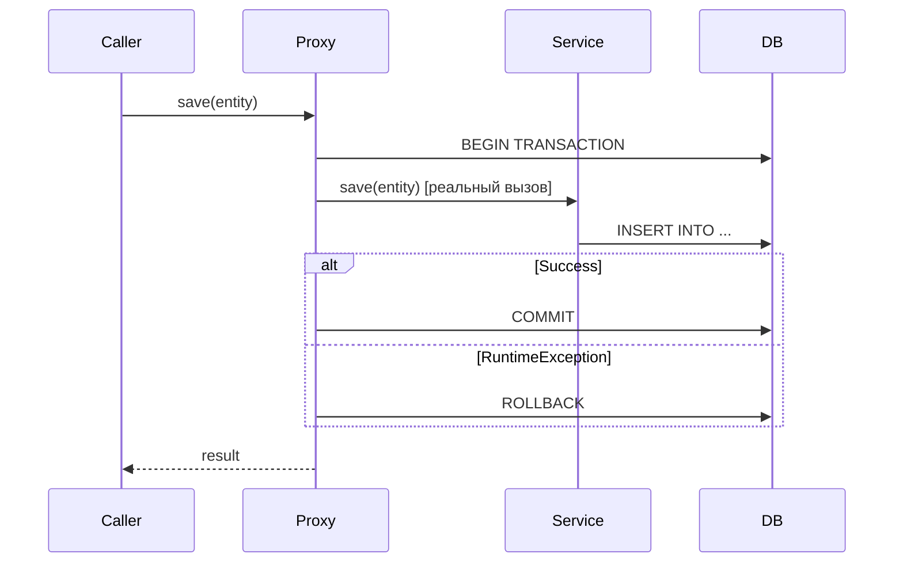

# Вопросы на собеседовании: `Spring Transactions`

`@Transactional` — самая часто задаваемая тема на Spring-собеседованиях. Проверяют понимание propagation, isolation levels, правил rollback и типичных ловушек (self-invocation, checked exceptions, видимость метода).

Дата последнего обновления: 2026-04-22

## Полезные ссылки

### Официальная документация

- [Spring Transaction Management](https://docs.spring.io/spring-framework/docs/current/reference/html/data-access.html#transaction) — официальная документация
- [Baeldung: @Transactional](https://www.baeldung.com/transaction-configuration-with-jpa-and-spring) — настройка транзакций
- [Baeldung: Propagation & Isolation](https://www.baeldung.com/spring-transactional-propagation-isolation) — все типы propagation и isolation

## Содержание

- [Полезные ссылки](#полезные-ссылки)
- [See also](#see-also)

**Основы**
- [Q1. (!) Как Spring реализует @Transactional?](#q1--как-spring-реализует-transactional)
- [Q2. Когда нужен @EnableTransactionManagement?](#q2-когда-нужен-enabletransactionmanagement)
- [Q3. Какие требования для работы @Transactional?](#q3-какие-требования-для-работы-transactional)

**Propagation**
- [Q4. (!) Какие типы Propagation существуют?](#q4--какие-типы-propagation-существуют)
- [Q5. (!) Чем REQUIRES_NEW отличается от NESTED?](#q5--чем-requires_new-отличается-от-nested)
- [Q6. Когда использовать MANDATORY и NEVER?](#q6-когда-использовать-mandatory-и-never)

**Isolation**
- [Q7. (!) Какие уровни изоляции поддерживает Spring?](#q7--какие-уровни-изоляции-поддерживает-spring)
- [Q8. Что такое dirty read, non-repeatable read, phantom read?](#q8-что-такое-dirty-read-non-repeatable-read-phantom-read)

**Rollback**
- [Q9. (!) По каким исключениям Spring откатывает транзакцию по умолчанию?](#q9--по-каким-исключениям-spring-откатывает-транзакцию-по-умолчанию)
- [Q10. Как настроить rollback для checked exceptions?](#q10-как-настроить-rollback-для-checked-exceptions)

**Подводные камни**
- [Q11. (!) Почему self-invocation ломает @Transactional?](#q11--почему-self-invocation-ломает-transactional)
- [Q12. Что делает readOnly = true?](#q12-что-делает-readonly--true)
- [Q13. Можно ли ставить @Transactional на интерфейс?](#q13-можно-ли-ставить-transactional-на-интерфейс)
- [Q14. Как работает @Transactional в многопоточном коде?](#q14-как-работает-transactional-в-многопоточном-коде)
- [Q15. Как тестировать транзакционный код?](#q15-как-тестировать-транзакционный-код)

---

## Q1. (!) Как Spring реализует @Transactional?

Через **AOP-прокси**: Spring оборачивает бин в прокси-объект, и каждый вызов транзакционного метода проходит не напрямую в класс, а сначала в прокси. Прокси добавляет вокруг метода транзакционный advice:

1. Открывает транзакцию (или присоединяется к существующей — зависит от propagation).
2. Вызывает реальный метод.
3. По результату коммитит (нормальный возврат) или откатывает (исключение, попадающее под правила rollback).

Ключевая мысль: сам класс ничего не знает о транзакциях — вся логика BEGIN/COMMIT/ROLLBACK живёт во внешнем прокси. Отсюда вытекают две главные ловушки темы: транзакция не работает при self-invocation (вызов минует прокси) и на `private`-методах (CGLIB не может переопределить их в подклассе). До Spring Framework 6.0 ограничение было шире — только `public`; с 6.0 на CGLIB-прокси (дефолт Spring Boot 3.x) `@Transactional` работает и на `protected`/package-private методах. При interface-based (JDK) прокси по-прежнему только `public`.



**Чем создаётся прокси:** JDK Dynamic Proxy, если бин реализует интерфейс, иначе CGLIB (подкласс самого класса). По умолчанию в Spring Boot включён CGLIB (`proxyTargetClass=true`). Под капотом `@Transactional` — это `@Around`-advice (`TransactionInterceptor`), который и оборачивает вызов в try/commit/catch-rollback.

---

## Q2. Когда нужен @EnableTransactionManagement?

Эта аннотация включает обработку `@Transactional` — без неё (или её XML-аналога) Spring просто не создаёт транзакционные прокси, и аннотации молча игнорируются.

**В Spring Boot — не нужен.** Автоконфигурация (`TransactionAutoConfiguration`) сама включает управление транзакциями, если в classpath есть `spring-tx` или стартер `spring-data-*`. Поэтому в Boot-проектах эту аннотацию обычно не пишут.

**В чистом Spring (без Boot) — обязателен.** Иначе `@Transactional` ни на что не влияет:
```java
@Configuration
@EnableTransactionManagement
public class AppConfig { ... }
```

Или XML: `<tx:annotation-driven transaction-manager="txManager"/>`.

---

## Q3. Какие требования для работы @Transactional?

Все три требования вытекают из того, что транзакция реализована прокси (см. Q1): если вызов не проходит через прокси, advice не срабатывает.

1. **Видимость метода.** До Spring Framework 6.0 работали только `public`-методы. Со Spring 6.0 (дефолт Boot 3.x) на CGLIB-прокси `@Transactional` работает также на `protected` и package-private методах. Не работают по-прежнему: `private` (CGLIB не может переопределить такой метод) и любые не-`public` методы при interface-based (JDK) прокси. Игнорируется аннотация молча — без ошибки и предупреждения; это частый источник «почему транзакция не откатилась».
2. **Вызов через прокси.** Прямой self-invocation (`this.method()`) минует прокси, поэтому транзакция не открывается (см. Q11).
3. **Бин должен жить в Spring-контексте.** На объекте, созданном через `new MyService()`, прокси нет — аннотация бесполезна.

```java
@Service
public class UserService {

    @Transactional          // работает — public
    public void save(User u) { ... }

    @Transactional          // НЕ работает — private (молча игнорируется)
    private void internalSave(User u) { ... }
}
```

---

## Q4. (!) Какие типы Propagation существуют?

`Propagation` задаёт правило: **что делать с транзакцией, если транзакционный метод вызван внутри уже открытой транзакции** (и что — если внешней транзакции нет). Всего семь вариантов; на собеседовании важнее всего `REQUIRED`, `REQUIRES_NEW` и `NESTED`.

| Тип | Есть активная TX | Нет активной TX |
|---|---|---|
| `REQUIRED` (дефолт) | Использует существующую | Создаёт новую |
| `REQUIRES_NEW` | Приостанавливает старую, создаёт новую | Создаёт новую |
| `NESTED` | Создаёт savepoint внутри текущей | Создаёт новую |
| `SUPPORTS` | Использует существующую | Выполняется без TX |
| `NOT_SUPPORTED` | Приостанавливает TX | Выполняется без TX |
| `MANDATORY` | Использует существующую | **Исключение** |
| `NEVER` | **Исключение** | Выполняется без TX |

**REQUIRED (дефолт):**
```java
@Transactional  // REQUIRED по умолчанию
public void updateOrder(Order order) {
    orderRepository.save(order);
    auditService.log(order);  // присоединится к этой же транзакции
}
```

**REQUIRES_NEW:**
```java
@Transactional(propagation = Propagation.REQUIRES_NEW)
public void auditLog(String event) {
    // Всегда в отдельной TX — коммитится независимо
    auditRepository.save(new AuditEntry(event));
}
```

---

## Q5. (!) Чем REQUIRES_NEW отличается от NESTED?

Суть различия: **`REQUIRES_NEW` создаёт полностью независимую транзакцию, а `NESTED` — точку отката (savepoint) внутри той же транзакции.** Отсюда — разное поведение при откате родителя и разный физический механизм.

- **`REQUIRES_NEW`** приостанавливает (suspend) внешнюю транзакцию и открывает новое физическое подключение/транзакцию. Дочерняя коммитится отдельно: даже если родитель потом откатится, уже закоммиченные данные дочерней останутся в БД.
- **`NESTED`** работает на JDBC savepoint внутри той же транзакции. Откат дочерней откатывает только до savepoint (родитель цел), но **откат родителя уносит и дочернюю** — это одна транзакция.

| | `REQUIRES_NEW` | `NESTED` |
|---|---|---|
| Транзакция | Новая независимая | Savepoint внутри текущей |
| Rollback дочерней | Не откатывает родительскую | Не откатывает до savepoint |
| Rollback родительской | Не откатывает дочернюю | **Откатывает** дочернюю |
| Commit | Независимый | При коммите родительской |
| Поддержка | Все TX-менеджеры | Только JDBC savepoints |

```java
@Transactional
public void placeOrder(Order order) {
    orderRepository.save(order);

    try {
        // REQUIRES_NEW: если упадёт notifyCustomer, 
        // order всё равно сохранится
        notifyCustomer(order.getCustomerId());
    } catch (NotificationException e) {
        log.warn("Notification failed, order saved anyway");
    }
}

@Transactional(propagation = Propagation.REQUIRES_NEW)
public void notifyCustomer(Long customerId) { ... }
```

**NESTED** использует JDBC savepoints:
```java
@Transactional(propagation = Propagation.NESTED)
public void updateInventory(Long productId, int delta) {
    // Если упадёт — откатится до savepoint
    // Если parent откатится — откатится и это
}
```

**Практический вывод из «только JDBC savepoints»:** `NESTED` реально работает только с `DataSourceTransactionManager` (чистый JDBC, JdbcTemplate, MyBatis). `JpaTransactionManager` — дефолт при Hibernate/JPA, в том числе в Spring Boot со `spring-data-jpa` — savepoints не поддерживает и на попытку открыть вложенную транзакцию бросает `NestedTransactionNotSupportedException`. То есть в типичном JPA-приложении `NESTED` просто не вариант.

**Подводный камень:** в примере выше `notifyCustomer` вызван из `placeOrder` того же класса — это self-invocation, и `REQUIRES_NEW` фактически не сработает (см. Q11). Чтобы пример работал, метод должен жить в отдельном бине и вызываться через прокси.

**Когда что применять:** `REQUIRES_NEW` — для «обязательно сохранить, даже если основная операция откатится» (аудит, лог, отправка уведомления). `NESTED` — для частичного отката внутри одной бизнес-операции (откатить один шаг батча, не теряя остальные), когда устраивает откат всего вместе с родителем.

---

## Q6. Когда использовать MANDATORY и NEVER?

Оба — это «контрактные» propagation: они не создают и не приостанавливают транзакцию, а **проверяют, в правильном ли контексте вызван метод**, и кидают исключение, если нет. Используются как защита от ошибок проектирования, а не для управления транзакциями.

**`MANDATORY`** — метод обязан выполняться внутри уже открытой транзакции (своей не создаёт). Удобно для «строительных блоков», которые сами по себе не имеют смысла вне транзакции:
```java
@Transactional(propagation = Propagation.MANDATORY)
public void updateBalance(Account acc, BigDecimal amount) {
    // Защита: этот метод нельзя вызывать без транзакции
    acc.setBalance(acc.getBalance().add(amount));
    repository.save(acc);
}
```
Если вызвать без активной транзакции → `IllegalTransactionStateException`.

**`NEVER`** — метод, наоборот, не должен выполняться внутри транзакции (например, долгая операция, которую нельзя держать в открытой TX):
```java
@Transactional(propagation = Propagation.NEVER)
public void exportToCsv() {
    // Долгая операция, не должна блокировать TX
}
```
Если вызвать внутри активной транзакции → `IllegalTransactionStateException`.

**Не путать `NEVER` с `NOT_SUPPORTED`:** `NEVER` падает при наличии транзакции, а `NOT_SUPPORTED` молча приостанавливает её и выполняет метод без транзакции.

---

## Q7. (!) Какие уровни изоляции поддерживает Spring?

`Isolation` определяет, насколько одна транзакция «видит» незакоммиченные и параллельно меняющиеся данные других. Чем строже уровень — тем меньше аномалий, но тем дороже по блокировкам и параллелизму. Spring пробрасывает выбранный уровень в драйвер JDBC, а реально его обеспечивает СУБД.

Пять констант: четыре стандартных уровня ANSI плюс `DEFAULT` (берёт настройку самой БД). Чем ниже в таблице — тем строже изоляция:

| Уровень | Dirty Read | Non-repeatable Read | Phantom Read |
|---|---|---|---|
| `READ_UNCOMMITTED` | Возможен | Возможен | Возможен |
| `READ_COMMITTED` | Нет | Возможен | Возможен |
| `REPEATABLE_READ` | Нет | Нет | Возможен |
| `SERIALIZABLE` | Нет | Нет | Нет |
| `DEFAULT` | Дефолт СУБД | — | — |

```java
@Transactional(isolation = Isolation.READ_COMMITTED)
public List<Product> getProducts() { ... }
```

**Дефолты СУБД:**
- PostgreSQL, SQL Server, Oracle: `READ_COMMITTED`
- MySQL: `REPEATABLE_READ`

**Важно:** `READ_UNCOMMITTED` не поддерживается ни в PostgreSQL, ни в Oracle, но реагируют они по-разному: PostgreSQL принимает настройку и молча трактует её как `READ_COMMITTED`, а Oracle отклоняет неподдерживаемый уровень исключением (он поддерживает только `READ_COMMITTED` и `SERIALIZABLE`). Итог один: «понизить» изоляцию ниже дефолта в этих СУБД нельзя.

---

## Q8. Что такое dirty read, non-repeatable read, phantom read?

Это три аномалии параллельного доступа — именно их и предотвращают уровни изоляции из Q7. Идут по нарастанию «сложности» защиты: dirty read убирается уже на `READ_COMMITTED`, non-repeatable — на `REPEATABLE_READ`, phantom — только на `SERIALIZABLE`.

**Dirty Read (грязное чтение)** — транзакция читает данные, которые другая ещё не закоммитила и может откатить. В итоге прочитанного значения «никогда не было»:
```
TX1: UPDATE balance SET amount = 1000  (не закоммичено)
TX2: SELECT amount  → получает 1000
TX1: ROLLBACK
TX2 прочитал несуществующие данные → dirty read
```

**Non-repeatable Read (неповторяемое чтение)** — один и тот же SELECT по одной строке внутри транзакции возвращает разные значения, потому что между чтениями другая транзакция изменила и закоммитила строку:
```
TX1: SELECT price FROM products WHERE id = 1  → 100
TX2: UPDATE products SET price = 150 WHERE id = 1; COMMIT
TX1: SELECT price FROM products WHERE id = 1  → 150 (другой результат!)
```

**Phantom Read (фантомное чтение)** — повторный SELECT по диапазону возвращает другой набор строк: появились (или исчезли) записи, которые другая транзакция вставила/удалила в этот диапазон. Отличие от non-repeatable: там менялось значение существующей строки, здесь — состав строк выборки:
```
TX1: SELECT * FROM orders WHERE amount > 500  → 5 строк
TX2: INSERT INTO orders (amount) VALUES (600); COMMIT
TX1: SELECT * FROM orders WHERE amount > 500  → 6 строк (phantom!)
```

---

## Q9. (!) По каким исключениям Spring откатывает транзакцию по умолчанию?

По умолчанию rollback вызывают **только unchecked-исключения** — `RuntimeException` и его наследники, а также `Error`.

**Checked-исключения** (`IOException`, `SQLException` и т.д.) транзакцию **не откатывают** — она спокойно коммитится, несмотря на брошенное исключение. Это самая контринтуитивная деталь темы, которую любят спрашивать.

```java
@Transactional
public void process() throws IOException {
    repository.save(data);
    throw new IOException("file error");  // транзакция ЗАКОММИТИТСЯ!
}

@Transactional
public void process2() {
    repository.save(data);
    throw new RuntimeException("error");  // транзакция ОТКАТИТСЯ
}
```

**Почему так:** Spring унаследовал соглашение EJB — checked-исключения считаются «ожидаемыми» (бизнес-ситуациями, которые код обязан обработать), а unchecked — программными сбоями, при которых данные нельзя доверять. На практике это поведение часто нежелательно, поэтому его переопределяют через `rollbackFor` (см. Q10).

---

## Q10. Как настроить rollback для checked exceptions?

Поведение из Q9 переопределяется атрибутами `@Transactional`: `rollbackFor` расширяет список «откатных» исключений, `noRollbackFor` — сужает.

```java
// Откатывать при любом Exception (включая checked)
@Transactional(rollbackFor = Exception.class)
public void importFile() throws IOException {
    // Если IOException → rollback
}

// Несколько типов:
@Transactional(rollbackFor = {IOException.class, SQLException.class})
public void process() throws IOException, SQLException { ... }

// Не откатывать при конкретном RuntimeException:
@Transactional(noRollbackFor = BusinessValidationException.class)
public void validateAndSave(Order order) {
    // BusinessValidationException не откатит TX — данные сохранятся
}
```

**Программный rollback** — когда исключение хочется поймать и не пробрасывать, но транзакцию всё равно откатить. Помечаем её `rollbackOnly`, и прокси при выходе сделает ROLLBACK вместо COMMIT:
```java
@Transactional
public void saveWithManualRollback() {
    try {
        repository.save(entity);
    } catch (SomeCheckedException e) {
        TransactionAspectSupport.currentTransactionStatus().setRollbackOnly();
        throw e;
    }
}
```

**Подводный камень:** если транзакция помечена `rollbackOnly` (или вложенный метод бросил откатное исключение), любая попытка её закоммитить упадёт с `UnexpectedRollbackException` — даже если внешний код «проглотил» исключение.

---

## Q11. (!) Почему self-invocation ломает @Transactional?

Потому что транзакция живёт в прокси, а не в самом классе (см. Q1). Когда метод вызывает другой метод того же бина через `this.method()` (или просто `method()`), обращение идёт **напрямую к объекту, минуя прокси** — транзакционный advice не вызывается, поэтому новая транзакция или `REQUIRES_NEW` не создаётся, аннотация на вызванном методе фактически игнорируется.

```java
@Service
public class OrderService {

    @Transactional
    public void processAll(List<Order> orders) {
        for (Order o : orders) {
            processOne(o);  // self-invocation! @Transactional(REQUIRES_NEW) не создаётся
        }
    }

    @Transactional(propagation = Propagation.REQUIRES_NEW)
    public void processOne(Order order) {
        // Работает только если вызван извне через прокси
    }
}
```

**Решения:**

1. **Вынести в отдельный бин** (рекомендуется):
```java
@Service
public class OrderItemService {
    @Transactional(propagation = Propagation.REQUIRES_NEW)
    public void processOne(Order order) { ... }
}

@Service
public class OrderService {
    @Autowired OrderItemService orderItemService;

    @Transactional
    public void processAll(List<Order> orders) {
        orders.forEach(orderItemService::processOne);  // через прокси ✓
    }
}
```

2. **Self-inject прокси через `@Lazy`** — внедряем сам бин (точнее, его прокси) в себя и вызываем метод через эту ссылку, а не через `this`. `@Lazy` нужен, чтобы разорвать циклическую зависимость при создании бина:
```java
@Service
public class OrderService {
    @Autowired @Lazy
    private OrderService self;

    @Transactional
    public void processAll(List<Order> orders) {
        orders.forEach(self::processOne);  // через прокси ✓
    }
}
```

**Рекомендация:** первый вариант (отдельный бин) чище — он делает зависимость явной и не требует трюка с self-инъекцией. К `@Lazy self` прибегают, когда выносить метод в новый класс неудобно.

---

## Q12. Что делает readOnly = true?

Это **подсказка (hint)** для Hibernate и драйвера БД, что в транзакции не будет изменений — что позволяет включить ряд оптимизаций. Это не механизм безопасности: он не запрещает запись, а лишь экономит ресурсы на read-путях.

```java
@Transactional(readOnly = true)
public List<Product> findAll() { ... }
```

**Что именно оптимизируется:**
- Hibernate: не выполняет dirty checking (не проверяет изменения сущностей)
- Hibernate: не накапливает snapshot сущностей → меньше памяти
- PostgreSQL/Oracle: использует read-only транзакцию (меньше локов)
- Spring: может выбрать read replica при соответствующей настройке роутинга

**Важно — это hint, а не запрет на запись.** Spring сам не блокирует INSERT/UPDATE в read-only транзакции на уровне драйвера (если это явно не настроено). Реальный эффект «не писать» даёт только то, что Hibernate пропускает dirty checking и не флашит изменения; некоторые СУБД дополнительно могут отклонить запись на своей стороне.

**Рекомендация:** ставьте `readOnly = true` на все читающие сервисные методы и query-репозитории — это бесплатная экономия памяти и нагрузки на БД, плюс возможность маршрутизации на read-реплику.

---

## Q13. Можно ли ставить @Transactional на интерфейс?

Технически — да, но **официальная рекомендация Spring — не ставить**, аннотацию вешают на класс-реализацию или его методы. Причины:

- Работает только с JDK-прокси; при CGLIB (а это дефолт в Spring Boot) аннотация на интерфейсе **не подхватывается** — транзакция молча не сработает.
- Поведение зависит от того, какой прокси выбран, — хрупко и неочевидно.
- Концептуально: интерфейс — это контракт, а транзакционность — деталь реализации, ей не место в публичном API.

```java
// НЕ рекомендуется
public interface UserService {
    @Transactional
    void save(User user);
}

// Рекомендуется: аннотация на реализации
@Service
public class UserServiceImpl implements UserService {
    @Transactional
    @Override
    public void save(User user) { ... }
}
```

---

## Q14. Как работает @Transactional в многопоточном коде?

Главное правило: **транзакция привязана к потоку и через границу потока не передаётся.** Spring хранит активную транзакцию (соединение, статус) в `ThreadLocal` внутри `TransactionSynchronizationManager`. Поэтому новый поток (через `@Async`, `CompletableFuture`, executor) не видит транзакцию родителя — у него её просто нет.

```java
@Transactional
public void processAsync() {
    CompletableFuture.runAsync(() -> {
        // Новый поток — НЕТ транзакции!
        // repository.save() выполнится без TX
    });
}
```

**Следствие:** в коде выше `repository.save()` в лямбде выполнится без транзакции — не откатится при ошибке и может закоммититься частично. Никогда не рассчитывайте, что асинхронный код «унаследует» родительскую транзакцию.

**Решение:** не пытаться пробросить транзакцию в другой поток, а запускать в нём собственную — через бин, вызванный из нового потока (вызов идёт через прокси, поэтому транзакция откроется в этом потоке):

```java
@Transactional
public void processAsync() {
    CompletableFuture.runAsync(() -> {
        transactionalService.saveInNewTransaction(data);  // собственная TX
    });
}

@Transactional(propagation = Propagation.REQUIRES_NEW)
public void saveInNewTransaction(Object data) { ... }
```

---

## Q15. Как тестировать транзакционный код?

Ключевой приём: `@Transactional` на тестовом классе/методе оборачивает каждый тест в транзакцию, которую Spring **по умолчанию откатывает после теста**. Это держит БД чистой между тестами без ручного удаления данных. При необходимости откат заменяется на коммит аннотацией `@Commit`.

```java
@SpringBootTest
@Transactional  // каждый тест откатывается после выполнения
class OrderServiceTest {

    @Autowired OrderService orderService;
    @Autowired OrderRepository orderRepository;

    @Test
    void shouldSaveOrder() {
        orderService.placeOrder(new Order("product"));
        // После теста — rollback, БД чистая
        assertEquals(1, orderRepository.count());
    }

    @Test
    @Commit  // явный commit вместо rollback (редко нужен)
    void shouldCommitForIntegrationTest() { ... }
}
```

**Подводный камень при проверке REQUIRES_NEW:** обёртывающий тест-`@Transactional` ломает проверку независимых транзакций. Тест-транзакция охватывает весь вызов, поэтому даже то, что закоммитил `REQUIRES_NEW`, в конце откатится вместе с тестом — и проверить «закоммитилось» не получится. Решение — отключить тестовую транзакцию для такого теста (`@Transactional(propagation = NOT_SUPPORTED)`) и убирать данные вручную:
```java
@Test
void shouldCommitAuditEvenIfOrderFails() {
    assertThrows(RuntimeException.class, () -> orderService.processWithAudit(badOrder));
    // Audit должен закоммититься (REQUIRES_NEW), проверяем
    // НО: если тест @Transactional, outer TX откатит и nested!
    // Нужен @Transactional(propagation = NOT_SUPPORTED) на тесте
}
```

---

## See also

- [Spring Framework](spring-framework-interview.md) — AOP, прокси-механизм
- [Spring AOP](spring-aop-interview.md) — как именно реализованы @Transactional и self-invocation
- [Spring Data JPA](spring-data-jpa-interview.md) — транзакции в JPA-репозиториях
- [Spring Data JDBC](spring-data-jdbc-interview.md) — транзакции в JDBC
- [Hibernate](../../databases/hibernate-interview.md) — dirty checking, first-level cache в транзакции
- [Транзакции БД](../../databases/database-transactions-interview.md) — ACID, isolation levels на уровне СУБД
- [Spring Events](spring-events-interview.md) — @TransactionalEventListener (AFTER_COMMIT)
- [Spring Testing](spring-testing-interview.md) — @Transactional в тестах, @Commit
