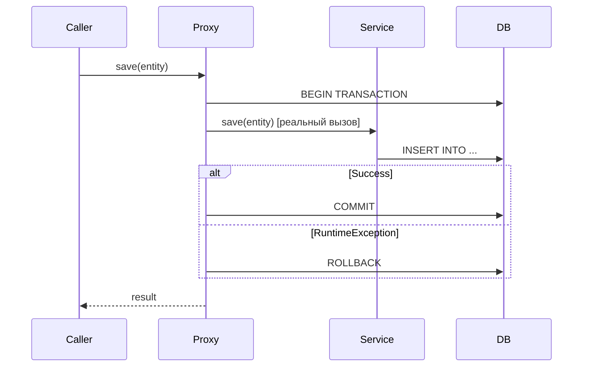

# Вопросы на собеседовании: `Spring Transactions`

`@Transactional` — самая часто задаваемая тема на Spring-собеседованиях. Проверяют понимание propagation, isolation levels, правил rollback и типичных ловушек (self-invocation, checked exceptions, видимость метода).

Дата последнего обновления: 2026-04-22

## Полезные ссылки

### Официальная документация

- [Spring Transaction Management](https://docs.spring.io/spring-framework/docs/current/reference/html/data-access.html#transaction) — официальная документация
- [Baeldung: @Transactional](https://www.baeldung.com/transaction-configuration-with-jpa-and-spring) — настройка транзакций
- [Baeldung: Propagation & Isolation](https://www.baeldung.com/spring-transactional-propagation-isolation) — все типы propagation и isolation

## Содержание

- [Полезные ссылки](#полезные-ссылки)
- [See also](#see-also)

**Основы**
- [Q1. (!) Как Spring реализует @Transactional?](#q1-как-spring-реализует-transactional)
- [Q2. Когда нужен @EnableTransactionManagement?](#q2-когда-нужен-enabletransactionmanagement)
- [Q3. Какие требования для работы @Transactional?](#q3-какие-требования-для-работы-transactional)

**Propagation**
- [Q4. (!) Какие типы Propagation существуют?](#q4-какие-типы-propagation-существуют)
- [Q5. (!) Чем REQUIRES_NEW отличается от NESTED?](#q5-чем-requires_new-отличается-от-nested)
- [Q6. Когда использовать MANDATORY и NEVER?](#q6-когда-использовать-mandatory-и-never)

**Isolation**
- [Q7. (!) Какие уровни изоляции поддерживает Spring?](#q7-какие-уровни-изоляции-поддерживает-spring)
- [Q8. Что такое dirty read, non-repeatable read, phantom read?](#q8-что-такое-dirty-read-non-repeatable-read-phantom-read)

**Rollback**
- [Q9. (!) По каким исключениям Spring откатывает транзакцию по умолчанию?](#q9-по-каким-исключениям-spring-откатывает-транзакцию-по-умолчанию)
- [Q10. Как настроить rollback для checked exceptions?](#q10-как-настроить-rollback-для-checked-exceptions)

**Подводные камни**
- [Q11. (!) Почему self-invocation ломает @Transactional?](#q11-почему-self-invocation-ломает-transactional)
- [Q12. Что делает readOnly = true?](#q12-что-делает-readonly--true)
- [Q13. Можно ли ставить @Transactional на интерфейс?](#q13-можно-ли-ставить-transactional-на-интерфейс)
- [Q14. Как работает @Transactional в многопоточном коде?](#q14-как-работает-transactional-в-многопоточном-коде)
- [Q15. Как тестировать транзакционный код?](#q15-как-тестировать-транзакционный-код)

---

## Q1. (!) Как Spring реализует @Transactional?

Spring использует AOP-прокси: при первом обращении к методу с `@Transactional` вызов перехватывается прокси, который:
1. Открывает транзакцию (или присоединяется к существующей)
2. Вызывает реальный метод
3. Коммитит или откатывает по результату



Прокси создаётся через JDK Dynamic Proxy (если бин реализует интерфейс) или CGLIB (для классов). `@Transactional` — это `@Around`-advice под капотом.

> [!mcq]
> - [x] Spring реализует `@Transactional` через AOP-прокси (`JDK Dynamic Proxy` для интерфейсов, `CGLIB` для классов): прокси перехватывает вызов, открывает TX, вызывает реальный метод, коммитит или откатывает. | `TransactionInterceptor` реализует `@Around`-семантику. ✓ ПРИМЕНЯТЬ: понимание proxy-модели — ключ к диагностике `self-invocation` и `private`-method bug в Spring-сервисах. 📋 ПРАВИЛО: «@Transactional = AOP-proxy + @Around; JDK для interface, CGLIB для class». 🔗 См. Q3, Q11, Q14.
> - [ ] Spring реализует `@Transactional` через `AspectJ compile-time weaving`, внедряя байткод транзакционного поведения во время компиляции через специальный maven/gradle plugin. | Это `AspectJ` — отдельный режим, не default. ❌ ПОСЛЕДСТВИЕ: разработчик ищет `aspectj-maven-plugin` для работы `@Transactional`, тратит 2 дня на настройку weaving, ломается hot-reload в IntelliJ.
> - [ ] Spring реализует `@Transactional` через reflection, напрямую перехватывая вызовы методов через `java.lang.reflect.Proxy` без создания прокси-объектов вокруг бина. | Прокси-объект создаётся всегда. ❌ ПОСЛЕДСТВИЕ: разработчик пытается «включить» `@Transactional` через `Method.setAccessible(true)` или manual reflection-tricks, не понимает почему транзакция не открывается на private-методе.
> - [ ] Spring реализует `@Transactional` через `ThreadLocal`-переменные в `TransactionSynchronizationManager` без создания прокси — context хранится в потоке. | `ThreadLocal` хранит context, но не перехватывает вызовы. ❌ ПОСЛЕДСТВИЕ: разработчик устанавливает TX-context manually через `TransactionSynchronizationManager.bindResource()` в надежде «включить» транзакцию — без proxy commit/rollback не вызовутся.

> [!mcq]
> - [ ] Spring всегда создаёт `JDK Dynamic Proxy` для `@Transactional`-бина, потому что это более производительный механизм, чем `CGLIB`, и работает для классов без интерфейсов. | Spring выбирает динамически. ❌ ПОСЛЕДСТВИЕ: разработчик не понимает почему `@Service`-класс без интерфейса работает — на деле Spring сам выбрал `CGLIB` через `subclass-proxying`. Время теряется на ложную диагностику.
> - [ ] Spring всегда создаёт `CGLIB`-прокси для `@Transactional`-бина, потому что `JDK Dynamic Proxy` не поддерживает транзакционный advice — только interface-методы. | `JDK Proxy` поддерживает `@Transactional`. ❌ ПОСЛЕДСТВИЕ: разработчик добавляет `proxyTargetClass=true` в plain-Spring с интерфейсами — лишний bytecode generation, +20MB heap, медленный старт контекста.
> - [ ] Spring не создаёт прокси для `@Transactional`, а применяет `AspectJ load-time weaving` через `-javaagent:aspectjweaver.jar` в JVM-командной строке. | `LTW` — отдельный режим, не default. ❌ ПОСЛЕДСТВИЕ: команда ищет `aspectjweaver.jar` агент в `JAVA_OPTS`, не находит — приложение стартует без транзакций, в production первый же `repository.save()` коммитит partial state.
> - [x] Spring создаёт `JDK Dynamic Proxy` если бин реализует интерфейс, и `CGLIB` — если бин является классом без интерфейса; Spring Boot 2.0+ по умолчанию использует `CGLIB` всегда (`proxyTargetClass=true`). | ✓ ПРИМЕНЯТЬ: `AopUtils.isJdkDynamicProxy(bean)` / `isCglibProxy(bean)` для проверки в тестах при дебаге `self-invocation`. 📋 ПРАВИЛО: «interface → JDK Proxy; class → CGLIB; Spring Boot 2.0+ default = CGLIB». 🔗 См. Q1, Q3, Q11.

---

## Q2. Когда нужен @EnableTransactionManagement?

В Spring Boot — **не нужен**: автоконфигурация включает управление транзакциями автоматически при наличии `spring-data-*` или `spring-tx` в classpath.

В чистом Spring — необходим:
```java
@Configuration
@EnableTransactionManagement
public class AppConfig { ... }
```

Или XML: `<tx:annotation-driven transaction-manager="txManager"/>`.

> [!mcq]
> - [ ] `@EnableTransactionManagement` нужен в любом Spring-приложении, включая Spring Boot, чтобы явно включить поддержку `@Transactional` — это часть AOP-инфраструктуры. | Не нужен в Boot. ❌ ПОСЛЕДСТВИЕ: лишняя аннотация скопирована из туториала, конфликтует с custom `TransactionManager` config через `proxyTargetClass`/`mode` параметры — Spring создаёт два advice-chain, transactions двойные.
> - [ ] `@EnableTransactionManagement` нужен только при использовании JPA, но не нужен при работе с JDBC напрямую через `JdbcTemplate`. | Не зависит от технологии. ❌ ПОСЛЕДСТВИЕ: разработчик в plain Spring + JDBC не добавляет аннотацию, удивляется почему `@Transactional` молча игнорируется на `JdbcTemplate`-операциях; partial commits в production, debug — день.
> - [x] `@EnableTransactionManagement` нужен в чистом Spring-приложении (без Boot); в Spring Boot автоконфигурация включает управление транзакциями автоматически через `TransactionAutoConfiguration`. | ✓ ПРИМЕНЯТЬ: plain Spring (war-deploy в Tomcat) — обязательна; Spring Boot — опциональна, нужна только для кастомизации `mode = AdviceMode.ASPECTJ`. 📋 ПРАВИЛО: «Spring Boot = autoconfig; plain Spring = manual @EnableTransactionManagement». 🔗 См. Q1, Q3.
> - [ ] `@EnableTransactionManagement` нужен только при программном управлении транзакциями через `TransactionTemplate`, а для декларативного `@Transactional` он не требуется. | Наоборот. ❌ ПОСЛЕДСТВИЕ: разработчик удаляет аннотацию «потому что используем только `TransactionTemplate`», `@Transactional`-методы в других сервисах молча перестают работать, инциденты с partial state в проде.

---

## Q3. Какие требования для работы @Transactional?

1. **Только `public` методы** — `protected`/`private`/`package-private` игнорируются молча (без ошибки!)
2. **Вызов через прокси** — self-invocation (`this.method()`) не работает
3. **Бин должен быть в Spring-контексте** — аннотация на `new MyService()` не работает

```java
@Service
public class UserService {

    @Transactional          // работает — public
    public void save(User u) { ... }

    @Transactional          // НЕ работает — private (молча игнорируется)
    private void internalSave(User u) { ... }
}
```

> [!mcq]
> - [ ] `@Transactional` на `private`-методе вызовет `BeanCreationException` при старте приложения — Spring обнаружит некорректную конфигурацию `proxy-target`. | Молча игнорируется без ошибки. ❌ ПОСЛЕДСТВИЕ: `@Transactional` на `private void internalSave()` → silent no-op, транзакция не открывается, partial commit; баг виден только в production через data inconsistency.
> - [ ] `@Transactional` на `protected`-методе работает корректно при использовании `CGLIB`-прокси, потому что `CGLIB` может переопределять `protected`-методы через subclassing. | Spring AOP игнорирует non-public. ❌ ПОСЛЕДСТВИЕ: разработчик меняет `private` → `protected` ожидая «теперь заработает с CGLIB», в production транзакция всё ещё не открывается, debugging тратит ещё неделю.
> - [x] `@Transactional` на `private`-методе молча игнорируется без ошибки — Spring AOP применяет advice только к `public`-методам. | ✓ ПРИМЕНЯТЬ: всегда `public` для `@Transactional`; IntelliJ подсвечивает warning «Method is not transactional» как safety net. 📋 ПРАВИЛО: «@Transactional только на public (Spring AOP); AspectJ снимает ограничение». 🔗 См. Q1, Q11, Q14.
> - [ ] `@Transactional` работает на любых методах включая `private` при использовании `AspectJ`-weaving вместо `Spring AOP` — `LTW` снимает ограничения видимости. | Технически верно, но требует setup. ❌ ПОСЛЕДСТВИЕ: команда переходит на `AspectJ` ради одной фичи `private`-методов, получает 3-минутный compile, ломаются IDE-плагины hot-reload, build pipeline тормозит на каждом push.

> [!mcq]
> - [x] Если вызвать `@Transactional`-метод через `new MyService()` вместо Spring-бина, транзакция не создастся: объект не управляется контейнером, прокси не создан. | ✓ ПРИМЕНЯТЬ: всегда constructor injection через `@Autowired` для Spring-сервисов; в тестах — `@SpringBootTest` / `@DataJpaTest` для injection вместо `new`. 📋 ПРАВИЛО: «@Transactional работает только через Spring-managed bean; new = no proxy = no transaction». 🔗 См. Q1, Q11, Q15.
> - [ ] Если вызвать `@Transactional`-метод через `new MyService()`, Spring всё равно создаст транзакцию, потому что аннотация обрабатывается в runtime через `reflection` на уровне JVM. | Без bean нет прокси. ❌ ПОСЛЕДСТВИЕ: разработчик пишет `new OrderService().save(order)` в unit-тесте, проверяет rollback — `save` коммитит без TX, тест ложно зелёный, в production регрессия с partial state.
> - [ ] Если вызвать `@Transactional`-метод через `new MyService()`, Spring выбросит `BeanCreationException` при обнаружении аннотации вне контекста — это safety-механизм. | Spring не выбросит. ❌ ПОСЛЕДСТВИЕ: разработчик надеется на explicit failure при `new`-инстанцировании — на деле молчаливый no-op, транзакция не открыта, баг ловится только в проде через несогласованные данные.
> - [ ] Если вызвать `@Transactional`-метод через `new MyService()`, транзакция создастся только если в classpath есть `spring-aspects` и подключён `AspectJ`-агент через `-javaagent`. | `AspectJ` требует полноценного `LTW` setup. ❌ ПОСЛЕДСТВИЕ: команда добавляет `spring-aspects` в pom.xml ожидая что «теперь работает с new», но без `-javaagent:aspectjweaver.jar` и `META-INF/aop.xml` ничего не меняется.

---

## Q4. (!) Какие типы Propagation существуют?

`Propagation` определяет поведение транзакции при вызове из уже транзакционного контекста.

| Тип | Есть активная TX | Нет активной TX |
|---|---|---|
| `REQUIRED` (дефолт) | Использует существующую | Создаёт новую |
| `REQUIRES_NEW` | Приостанавливает старую, создаёт новую | Создаёт новую |
| `NESTED` | Создаёт savepoint внутри текущей | Создаёт новую |
| `SUPPORTS` | Использует существующую | Выполняется без TX |
| `NOT_SUPPORTED` | Приостанавливает TX | Выполняется без TX |
| `MANDATORY` | Использует существующую | **Исключение** |
| `NEVER` | **Исключение** | Выполняется без TX |

**REQUIRED (дефолт):**
```java
@Transactional  // REQUIRED по умолчанию
public void updateOrder(Order order) {
    orderRepository.save(order);
    auditService.log(order);  // присоединится к этой же транзакции
}
```

**REQUIRES_NEW:**
```java
@Transactional(propagation = Propagation.REQUIRES_NEW)
public void auditLog(String event) {
    // Всегда в отдельной TX — коммитится независимо
    auditRepository.save(new AuditEntry(event));
}
```

> [!mcq]
> - [ ] `Propagation.SUPPORTS` создаёт новую транзакцию если активной нет, и присоединяется к существующей если она есть — это default-поведение для read-методов. | Это `REQUIRED`. ❌ ПОСЛЕДСТВИЕ: разработчик ставит `SUPPORTS` на критичный `transferMoney()` ожидая auto-create TX — метод выполняется без транзакции, два UPDATE на разные счета не атомарны, race condition в production.
> - [ ] `Propagation.REQUIRED` приостанавливает существующую транзакцию и создаёт новую независимую при каждом вызове — каждый `@Transactional` метод имеет свою TX. | Это `REQUIRES_NEW`. ❌ ПОСЛЕДСТВИЕ: при mental modelе «каждый метод = своя TX» разработчик не понимает почему `auditService.log()` rollback'ится вместе с `orderService.save()` — на деле они в одной TX через `REQUIRED` join.
> - [ ] `Propagation.NOT_SUPPORTED` бросает `IllegalTransactionStateException` если вызван внутри активной транзакции — это safety guard от misuse. | Это `NEVER`. ❌ ПОСЛЕДСТВИЕ: разработчик ожидает explicit failure для `exportToCsv()` в составе bigger flow — `NOT_SUPPORTED` молча suspend'ит TX, long export держит DB connection 5 минут, pool exhaustion.
> - [x] `Propagation.MANDATORY` бросает `IllegalTransactionStateException` если вызван без активной транзакции, и использует существующую если она есть — guard от вызова вне TX. | ✓ ПРИМЕНЯТЬ: для guard-методов в финансовых операциях («`transfer()` должен быть в parent TX»); для validation в Saga compensation. 📋 ПРАВИЛО: «MANDATORY = require TX (defensive); вызов без TX → exception». 🔗 См. Q4, Q5, Q6.

> [!mcq]
> - [x] `Propagation.REQUIRED` (дефолт) присоединяется к существующей транзакции если она есть, или создаёт новую если её нет — default-поведение `@Transactional`. | ✓ ПРИМЕНЯТЬ: 90% случаев — оставлять default; менять только для audit logs (`REQUIRES_NEW`) или partial rollback (`NESTED`). 📋 ПРАВИЛО: «REQUIRED = default; join existing OR create new; покрывает 90% сценариев». 🔗 См. Q5, Q6, Q11.
> - [ ] `Propagation.NESTED` приостанавливает существующую транзакцию и выполняется в новой независимой транзакции, которая может коммититься отдельно от parent через `Connection.commit()`. | Это `REQUIRES_NEW`. ❌ ПОСЛЕДСТВИЕ: разработчик ставит `NESTED` на `auditLog()` ожидая independent commit — на деле savepoint внутри parent TX, при `RuntimeException` в main flow audit-записи rollback'ятся вместе с бизнес-данными.
> - [ ] `Propagation.NEVER` присоединяется к существующей транзакции если она есть, и выполняется без TX если её нет — аналог `SUPPORTS` с переименованным флагом. | `NEVER ≠ SUPPORTS`. ❌ ПОСЛЕДСТВИЕ: `NEVER`-метод `exportLargeReport()` вызван из `@Transactional`-обработчика → `IllegalTransactionStateException` в проде, request 500, customer не получает отчёт, alert на on-call.
> - [ ] `Propagation.REQUIRES_NEW` создаёт `JDBC savepoint` внутри текущей транзакции, позволяя откатить вложенную операцию без отката родительской через `Connection.rollback(savepoint)`. | Это `NESTED`. ❌ ПОСЛЕДСТВИЕ: разработчик путает savepoint и new TX — `REQUIRES_NEW` audit на самом деле сохраняется при rollback main, но команда строит логику ожидая что rollback main очистит и audit, получает «грязные» audit-логи неисполненных операций.

---

## Q5. (!) Чем REQUIRES_NEW отличается от NESTED?

| | `REQUIRES_NEW` | `NESTED` |
|---|---|---|
| Транзакция | Новая независимая | Savepoint внутри текущей |
| Rollback дочерней | Не откатывает родительскую | Не откатывает до savepoint |
| Rollback родительской | Не откатывает дочернюю | **Откатывает** дочернюю |
| Commit | Независимый | При коммите родительской |
| Поддержка | Все TX-менеджеры | Только JDBC savepoints |

```java
@Transactional
public void placeOrder(Order order) {
    orderRepository.save(order);

    try {
        // REQUIRES_NEW: если упадёт notifyCustomer, 
        // order всё равно сохранится
        notifyCustomer(order.getCustomerId());
    } catch (NotificationException e) {
        log.warn("Notification failed, order saved anyway");
    }
}

@Transactional(propagation = Propagation.REQUIRES_NEW)
public void notifyCustomer(Long customerId) { ... }
```

**NESTED** использует JDBC savepoints:
```java
@Transactional(propagation = Propagation.NESTED)
public void updateInventory(Long productId, int delta) {
    // Если упадёт — откатится до savepoint
    // Если parent откатится — откатится и это
}
```

> [!mcq]
> - [ ] При откате родительской транзакции `REQUIRES_NEW` также откатывает дочернюю транзакцию, потому что они связаны через один `JDBC Connection` в Spring. | `REQUIRES_NEW` = independent + другой Connection. ❌ ПОСЛЕДСТВИЕ: разработчик надеется что rollback main flow очистит и audit-логи через `REQUIRES_NEW` — audit остаётся в БД, появляются «фантомные» записи о невыполненных платежах, аудиторы фиксируют расхождение.
> - [ ] При откате дочерней транзакции `REQUIRES_NEW` откатывает и родительскую, потому что обе TX разделяют один pool-овый `Connection` к БД через ThreadLocal. | Не разделяют, у каждой свой Connection. ❌ ПОСЛЕДСТВИЕ: команда ожидает что exception в `notifyCustomer()` (REQUIRES_NEW) abort'ит `placeOrder()` — на деле parent продолжает выполнение, order сохраняется, customer не уведомлён, support tickets.
> - [ ] `NESTED` и `REQUIRES_NEW` идентичны по поведению отката — оба создают независимые транзакции, отличаясь только наличием `savepoint` как внутренней оптимизации. | Принципиально разные. ❌ ПОСЛЕДСТВИЕ: для finance-operation использован `NESTED` вместо `REQUIRES_NEW` ожидая «всегда сохранится audit» — main TX rollback откатывает и audit savepoint, аудит-trail неполный, требование compliance нарушено.
> - [x] При откате parent TX: `NESTED` откатывает дочернюю (savepoint в той же TX), а `REQUIRES_NEW` — нет (отдельная независимая TX с собственным `Connection`). | ✓ ПРИМЕНЯТЬ: `REQUIRES_NEW` для audit/notification/metrics (всегда сохраняются); `NESTED` для partial rollback внутри bulk-операции. 📋 ПРАВИЛО: «REQUIRES_NEW = independent commit; NESTED = savepoint, rollback parent = rollback child». 🔗 См. Q4, Q5, Q11.

> [!mcq]
> - [ ] `NESTED` поддерживается всеми транзакционными менеджерами Spring точно так же, как `REQUIRES_NEW` — оба используют единый proxy-механизм. | `NESTED` требует savepoints. ❌ ПОСЛЕДСТВИЕ: команда пишет partial rollback логику с `NESTED`, в тестах на H2 работает, в production на `JpaTransactionManager` — `NestedTransactionNotSupportedException`. Hot-fix-релиз ночью.
> - [x] `REQUIRES_NEW` поддерживается всеми TX-менеджерами Spring, а `NESTED` требует поддержки `JDBC savepoints` — `NESTED` может не работать с `JpaTransactionManager` или NoSQL. | ✓ ПРИМЕНЯТЬ: для надёжности — `REQUIRES_NEW` (universal); `NESTED` только с `DataSourceTransactionManager` + PostgreSQL/MySQL/Oracle. 📋 ПРАВИЛО: «REQUIRES_NEW = universal; NESTED = требует JDBC savepoints, не все managers поддерживают». 🔗 См. Q4, Q5, Q14.
> - [ ] `REQUIRES_NEW` не поддерживается `JpaTransactionManager` и работает только с `DataSourceTransactionManager` — это ограничение Hibernate. | Поддерживается всеми. ❌ ПОСЛЕДСТВИЕ: команда строит сложную архитектуру с двумя TX-менеджерами «для audit logs», добавляет `ChainedTransactionManager` — на деле один `JpaTransactionManager` отлично handle'ит `REQUIRES_NEW`, два месяца работы выброшены.
> - [ ] `NESTED` поддерживается только в PostgreSQL, а `REQUIRES_NEW` работает со всеми реляционными СУБД без ограничений со стороны драйвера. | Savepoints есть в MySQL/Oracle/MSSQL тоже. ❌ ПОСЛЕДСТВИЕ: разработчик ограничивает `NESTED`-фичу только для PG-deployments, дублирует код для MySQL-стенда «потому что не работает» — реально работает, дублирование увеличивает maintenance.

---

## Q6. Когда использовать MANDATORY и NEVER?

**`MANDATORY`** — метод должен вызываться только из транзакционного контекста. Полезен для защиты от ошибок проектирования:
```java
@Transactional(propagation = Propagation.MANDATORY)
public void updateBalance(Account acc, BigDecimal amount) {
    // Защита: этот метод нельзя вызывать без транзакции
    acc.setBalance(acc.getBalance().add(amount));
    repository.save(acc);
}
```
Если вызвать без транзакции → `IllegalTransactionStateException`.

**`NEVER`** — метод не должен выполняться в транзакции:
```java
@Transactional(propagation = Propagation.NEVER)
public void exportToCsv() {
    // Долгая операция, не должна блокировать TX
}
```
Если вызвать внутри транзакции → `IllegalTransactionStateException`.

> [!mcq]
> - [ ] `Propagation.MANDATORY` создаёт новую транзакцию если активной нет, и бросает исключение если активная транзакция уже существует — guard от double-TX. | Обратная логика. ❌ ПОСЛЕДСТВИЕ: разработчик ставит `MANDATORY` ожидая защиту от nested transactions, в production первый же вызов `transferMoney()` без parent TX → `IllegalTransactionStateException`, payment-processing полностью падает.
> - [ ] `Propagation.NEVER` приостанавливает активную транзакцию и выполняет метод без транзакционного контекста, не бросая исключений — silent fallback. | Это `NOT_SUPPORTED`. ❌ ПОСЛЕДСТВИЕ: для long-running `exportToCsv()` поставлен `NEVER` ожидая «выполнится без TX» — на деле вызов из `@Transactional` parent → exception, batch-job падает каждую ночь.
> - [ ] `Propagation.MANDATORY` используется когда метод не должен выполняться в транзакции — например, для долгих операций чтения файлов или внешних API. | Это `NEVER`. ❌ ПОСЛЕДСТВИЕ: обратная семантика → для защиты long-running ops использован `MANDATORY` вместо `NEVER`, метод требует TX и блокирует connection, pool exhaustion при 50 одновременных запросах.
> - [x] `Propagation.MANDATORY` бросает `IllegalTransactionStateException` при вызове без транзакции, а `NEVER` — при вызове внутри транзакции (зеркальная семантика). | ✓ ПРИМЕНЯТЬ: `MANDATORY` для financial helpers («`transfer` должен быть в parent TX»); `NEVER` для batch jobs/exports; `NOT_SUPPORTED` для silent suspend. 📋 ПРАВИЛО: «MANDATORY = require TX; NEVER = forbid TX; NOT_SUPPORTED = silent exclude». 🔗 См. Q3, Q4, Q5.

---

## Q7. (!) Какие уровни изоляции поддерживает Spring?

| Уровень | Dirty Read | Non-repeatable Read | Phantom Read |
|---|---|---|---|
| `READ_UNCOMMITTED` | Возможен | Возможен | Возможен |
| `READ_COMMITTED` | Нет | Возможен | Возможен |
| `REPEATABLE_READ` | Нет | Нет | Возможен |
| `SERIALIZABLE` | Нет | Нет | Нет |
| `DEFAULT` | Дефолт СУБД | — | — |

```java
@Transactional(isolation = Isolation.READ_COMMITTED)
public List<Product> getProducts() { ... }
```

**Дефолты СУБД:**
- PostgreSQL, SQL Server, Oracle: `READ_COMMITTED`
- MySQL: `REPEATABLE_READ`

**Важно:** `READ_UNCOMMITTED` не поддерживается в PostgreSQL и Oracle.

> [!mcq]
> - [x] `Isolation.REPEATABLE_READ` защищает от dirty read и non-repeatable read, но phantom read при нём всё ещё возможен (по стандарту SQL). | MySQL InnoDB использует `REPEATABLE_READ` + gap locks (защита от phantoms!) — отличие от стандарта. ✓ ПРИМЕНЯТЬ: для повторного чтения тех же строк в TX (`SELECT * WHERE id=42`); SERIALIZABLE для range-queries. 📋 ПРАВИЛО: «REPEATABLE_READ = same row consistency; phantoms возможны (стандарт), MySQL InnoDB защищает через gap locks». 🔗 См. Q7, Q8.
> - [ ] `Isolation.REPEATABLE_READ` защищает от dirty read, non-repeatable read и phantom read — то есть обеспечивает полную изоляцию транзакций по стандарту SQL-92. | Phantom read возможен. ❌ ПОСЛЕДСТВИЕ: финансовая система использует `REPEATABLE_READ` ожидая full isolation; двойной `SELECT SUM(amount)` в одной TX даёт inconsistent values из-за phantom inserts другой TX, агрегированные отчёты расходятся с детализацией.
> - [ ] `Isolation.READ_COMMITTED` защищает от dirty read и non-repeatable read, но допускает phantom read — это PostgreSQL default-уровень с такой гарантией. | Только dirty read. ❌ ПОСЛЕДСТВИЕ: reporting-flow ставит `READ_COMMITTED` ожидая stable values между SELECT'ами — non-repeatable read возможен, отчёт «balance до» и «balance после» в одной TX показывает разные значения из-за параллельного UPDATE.
> - [ ] `Isolation.SERIALIZABLE` защищает от dirty read и phantom read, но non-repeatable read при нём всё ещё возможен — это trade-off для performance. | SERIALIZABLE = full protection от всех трёх anomalies. ❌ ПОСЛЕДСТВИЕ: команда добавляет additional `SELECT FOR UPDATE` lock'и поверх `SERIALIZABLE` «на всякий случай», throughput падает в 3 раза без реального benefit, on-call ругается на latency.

> [!mcq]
> - [ ] PostgreSQL по умолчанию использует уровень изоляции `REPEATABLE_READ`, поэтому non-repeatable read в нём невозможен без явной настройки `READ_COMMITTED`. | PG default = `READ_COMMITTED`. ❌ ПОСЛЕДСТВИЕ: миграция с MySQL → PG, разработчик уверен «оба используют REPEATABLE_READ», в production отчёты внезапно показывают non-repeatable reads, расхождения в financial reconciliation.
> - [x] PostgreSQL и Oracle по умолчанию используют `READ_COMMITTED`, MySQL — `REPEATABLE_READ`; `READ_UNCOMMITTED` не поддерживается PostgreSQL и Oracle (silently upgrade'ится). | ✓ ПРИМЕНЯТЬ: явно указывать `Isolation` в `@Transactional` для critical-path; testcontainers с production-DB. 📋 ПРАВИЛО: «PG/Oracle = READ_COMMITTED; MySQL = REPEATABLE_READ; READ_UNCOMMITTED не работает в PG/Oracle». 🔗 См. Q7, Q8, database-transactions-interview.
> - [ ] `READ_UNCOMMITTED` поддерживается всеми СУБД через Spring и является самым быстрым уровнем изоляции для read-heavy workload без конкуренции. | Не поддерживается PG/Oracle. ❌ ПОСЛЕДСТВИЕ: команда оптимизирует heavy SELECT с `Isolation.READ_UNCOMMITTED`, тесты на H2 показывают +30% throughput, в prod на PostgreSQL silently upgrade'ится до `READ_COMMITTED` — оптимизация не работает, метрики не меняются.
> - [ ] Spring всегда использует `Isolation.DEFAULT`, который маппится на `READ_COMMITTED` независимо от используемой СУБД через `JdbcTemplate` mapping. | `DEFAULT` = СУБД-specific. ❌ ПОСЛЕДСТВИЕ: staging на MySQL (`REPEATABLE_READ`) и prod на PostgreSQL (`READ_COMMITTED`) показывают разное поведение в reporting-flow, тесты зелёные, прод показывает inconsistent reads, debug занимает неделю.

---

## Q8. Что такое dirty read, non-repeatable read, phantom read?

**Dirty Read** — читаем данные незакоммиченной транзакции:
```
TX1: UPDATE balance SET amount = 1000  (не закоммичено)
TX2: SELECT amount  → получает 1000
TX1: ROLLBACK
TX2 прочитал несуществующие данные → dirty read
```

**Non-repeatable Read** — один и тот же SELECT в рамках транзакции возвращает разные данные:
```
TX1: SELECT price FROM products WHERE id = 1  → 100
TX2: UPDATE products SET price = 150 WHERE id = 1; COMMIT
TX1: SELECT price FROM products WHERE id = 1  → 150 (другой результат!)
```

**Phantom Read** — повторный SELECT с диапазоном возвращает другие строки:
```
TX1: SELECT * FROM orders WHERE amount > 500  → 5 строк
TX2: INSERT INTO orders (amount) VALUES (600); COMMIT
TX1: SELECT * FROM orders WHERE amount > 500  → 6 строк (phantom!)
```

> [!mcq]
> - [ ] `Dirty read` — это когда повторный SELECT в одной транзакции возвращает другой результат из-за UPDATE, закоммиченного другой транзакцией между двумя чтениями. | Это `non-repeatable read`. ❌ ПОСЛЕДСТВИЕ: разработчик ставит `REPEATABLE_READ` «защититься от dirty read» — overkill для PG (там и так `READ_COMMITTED` нет dirty), throughput падает на 15% без реального benefit.
> - [ ] `Non-repeatable read` — это когда диапазонный SELECT возвращает разное количество строк из-за INSERT или DELETE, выполненных другой закоммиченной транзакцией. | Это `phantom read`. ❌ ПОСЛЕДСТВИЕ: команда ставит `REPEATABLE_READ` для reporting-flow ожидая защиту от phantoms — на стандарте SQL фантомы возможны, отчёт «pending orders count» меняется между двумя SELECT в одной TX.
> - [ ] `Dirty read` — это когда два последовательных SELECT в одной транзакции возвращают разные значения одной и той же строки из-за UPDATE в другой commit'нутой транзакции. | Это `non-repeatable read`. ❌ ПОСЛЕДСТВИЕ: путаница terminology в design discussions — на собеседовании senior-кандидат теряет offer; в code review команда принимает неправильное решение по isolation.
> - [x] `Phantom read` — это когда повторный диапазонный SELECT в одной транзакции возвращает разное количество строк из-за INSERT или DELETE в другой транзакции. | Типичный случай: `SELECT COUNT(*) WHERE status='pending'` дважды → разные значения. ✓ ПРИМЕНЯТЬ: `SERIALIZABLE` или `SELECT ... FOR UPDATE` блокирует диапазон. 📋 ПРАВИЛО: «dirty = uncommitted data; non-repeatable = different row values; phantom = different row count (range query)». 🔗 См. Q7, Q9, database-transactions-interview.

---

## Q9. (!) По каким исключениям Spring откатывает транзакцию по умолчанию?

**Только `RuntimeException` и его наследники (unchecked)**. `Error` тоже вызывает rollback.

Checked исключения (`IOException`, `SQLException` и т.д.) — **НЕ** откатывают транзакцию по умолчанию.

```java
@Transactional
public void process() throws IOException {
    repository.save(data);
    throw new IOException("file error");  // транзакция ЗАКОММИТИТСЯ!
}

@Transactional
public void process2() {
    repository.save(data);
    throw new RuntimeException("error");  // транзакция ОТКАТИТСЯ
}
```

**Логика дефолтного поведения:** checked exceptions — "ожидаемые ситуации", не обязательно означают ошибку транзакции.

> [!mcq]
> - [ ] Spring по умолчанию откатывает транзакцию при любом `Exception`, включая checked, потому что любое исключение указывает на ошибку бизнес-логики. | Только `RuntimeException`/`Error`. ❌ ПОСЛЕДСТВИЕ: `IOException` после `repository.save(order)` → транзакция коммитится, order сохранён без файла-вложения, customer видит «ошибка загрузки» но запись в БД уже есть; reconciliation team вручную чистит.
> - [ ] Spring по умолчанию откатывает транзакцию только при `Error`, но не при `RuntimeException` — для Runtime нужен явный `rollbackFor = RuntimeException.class`. | Откатывает и на Runtime. ❌ ПОСЛЕДСТВИЕ: разработчик добавляет redundant `rollbackFor = RuntimeException.class` во все `@Transactional`, тратит 2 дня на «оптимизацию», merge-request на 200 файлов без реального изменения поведения.
> - [ ] Spring по умолчанию откатывает транзакцию при checked exceptions, потому что они объявлены в сигнатуре метода и значит ожидаются разработчиком как сигнал ошибки. | Логика обратная: ожидаемые → не rollback. ❌ ПОСЛЕДСТВИЕ: команда не настраивает `rollbackFor`, доверяя что «любое exception = rollback», `SQLException` коммитит partial state, в production half-baked записи между связанными таблицами.
> - [x] Spring по умолчанию откатывает транзакцию при `RuntimeException` и `Error`; checked exceptions (`IOException`, `SQLException`) — коммитят partial state. | ✓ ПРИМЕНЯТЬ: критичная business logic — `@Transactional(rollbackFor = Exception.class)`; либо оборачивать checked в Runtime через `Vavr Try`. 📋 ПРАВИЛО: «default rollback ТОЛЬКО на Runtime/Error; checked = commit; явный rollbackFor для критики». 🔗 См. Q1, Q5, Q10.

---

## Q10. Как настроить rollback для checked exceptions?

```java
// Откатывать при любом Exception (включая checked)
@Transactional(rollbackFor = Exception.class)
public void importFile() throws IOException {
    // Если IOException → rollback
}

// Несколько типов:
@Transactional(rollbackFor = {IOException.class, SQLException.class})
public void process() throws IOException, SQLException { ... }

// Не откатывать при конкретном RuntimeException:
@Transactional(noRollbackFor = BusinessValidationException.class)
public void validateAndSave(Order order) {
    // BusinessValidationException не откатит TX — данные сохранятся
}
```

**Программный rollback:**
```java
@Transactional
public void saveWithManualRollback() {
    try {
        repository.save(entity);
    } catch (SomeCheckedException e) {
        TransactionAspectSupport.currentTransactionStatus().setRollbackOnly();
        throw e;
    }
}
```

> [!mcq]
> - [ ] Чтобы откатить транзакцию при `IOException`, нужно указать `@Transactional(noRollbackFor = IOException.class)` — это «exclude from default» с обратным effect. | `noRollbackFor` = противоположный смысл. ❌ ПОСЛЕДСТВИЕ: разработчик ставит `noRollbackFor=IOException.class` уверенный «теперь IOException откатит», на деле — обратный эффект, при IOException транзакция коммитится с partial state, file-upload feature ломается в проде.
> - [ ] Чтобы откатить транзакцию при `IOException`, достаточно объявить его в сигнатуре через `throws IOException` — Spring автоматически добавит rollback в proxy advice. | `throws` не влияет на rollback rules. ❌ ПОСЛЕДСТВИЕ: команда полагается на `throws IOException` как «маркер для Spring», `rollbackFor` не настроен, в production `IOException` коммитит partial state, поддержка чинит руками каждую ночь.
> - [x] Чтобы откатить транзакцию при `IOException`, нужно указать `@Transactional(rollbackFor = IOException.class)` или `rollbackFor = Exception.class` для catch-all. | Программный rollback — `TransactionAspectSupport.currentTransactionStatus().setRollbackOnly()`. ✓ ПРИМЕНЯТЬ: financial ops — `rollbackFor = Exception.class`; batch — selective list. 📋 ПРАВИЛО: «rollbackFor расширяет default; Exception.class = catch-all; setRollbackOnly для условного». 🔗 См. Q9, Q11, Q14.
> - [ ] Чтобы откатить транзакцию при `IOException`, нужно перехватить exception и вызвать `TransactionAspectSupport.currentTransactionStatus().commit()` для controlled rollback. | Метод `commit()` не существует. ❌ ПОСЛЕДСТВИЕ: разработчик ищет несуществующий API, ChatGPT галлюцинирует «такой метод есть», два часа потеряно; правильный API — `setRollbackOnly()` или re-throw для proxy rollback.

> [!mcq]
> - [x] `noRollbackFor` позволяет исключить определённый `RuntimeException` из дефолтных правил rollback — транзакция закоммитится даже если этот тип был брошен. | Pattern: `BusinessException extends RuntimeException` + `@Transactional(noRollbackFor = BusinessException.class)`. ✓ ПРИМЕНЯТЬ: для business validation (insufficient balance, validation failed) — saves выше остаются. 📋 ПРАВИЛО: «noRollbackFor = exclude specific exception из default rollback; для expected business exceptions». 🔗 См. Q9, Q10, spring-aop-interview Q21.
> - [ ] `noRollbackFor` используется чтобы полностью отключить транзакцию для определённых методов, работающих с некритичными данными — аналог `Propagation.NEVER`. | Влияет только на rollback rules. ❌ ПОСЛЕДСТВИЕ: разработчик ставит `noRollbackFor` ожидая «метод теперь без TX» — TX создаётся и коммитится, но connection держится 5 минут, pool exhaustion при росте нагрузки.
> - [ ] `TransactionAspectSupport.currentTransactionStatus().setRollbackOnly()` бросает исключение если активной транзакции нет в текущем потоке — это safety guard. | Бросает `NoTransactionException`. ❌ ПОСЛЕДСТВИЕ: helper-метод с `setRollbackOnly()` иногда вызывается без TX (например, в `@PostConstruct` init flow), runtime exception в edge cases, приложение не стартует на одном из инстансов.
> - [ ] `noRollbackFor` применяется только к checked exceptions — для `RuntimeException` нельзя отключить rollback через эту опцию, нужен programmatic подход. | Работает с любым типом. ❌ ПОСЛЕДСТВИЕ: ложное ограничение → разработчик пишет try/catch wrapper с `setRollbackOnly()` отрицанием, 50 строк кода вместо одного атрибута, code review даёт «approve» из-за сложности дискуссии.

---

## Q11. (!) Почему self-invocation ломает @Transactional?

Spring создаёт прокси вокруг бина. При вызове `this.method()` обращение идёт напрямую, **минуя прокси** — транзакционный advice не срабатывает.

```java
@Service
public class OrderService {

    @Transactional
    public void processAll(List<Order> orders) {
        for (Order o : orders) {
            processOne(o);  // self-invocation! @Transactional(REQUIRES_NEW) не создаётся
        }
    }

    @Transactional(propagation = Propagation.REQUIRES_NEW)
    public void processOne(Order order) {
        // Работает только если вызван извне через прокси
    }
}
```

**Решения:**

1. **Вынести в отдельный бин** (рекомендуется):
```java
@Service
public class OrderItemService {
    @Transactional(propagation = Propagation.REQUIRES_NEW)
    public void processOne(Order order) { ... }
}

@Service
public class OrderService {
    @Autowired OrderItemService orderItemService;

    @Transactional
    public void processAll(List<Order> orders) {
        orders.forEach(orderItemService::processOne);  // через прокси ✓
    }
}
```

2. **Self-inject через `@Lazy`:**
```java
@Service
public class OrderService {
    @Autowired @Lazy
    private OrderService self;

    @Transactional
    public void processAll(List<Order> orders) {
        orders.forEach(self::processOne);  // через прокси ✓
    }
}
```

> [!mcq]
> - [ ] Self-invocation ломает `@Transactional` потому что Java не позволяет вызывать переопределённые методы через `this` в `CGLIB`-подклассах из-за final-modifier'ов. | Не Java limitation, а AOP-архитектура. ❌ ПОСЛЕДСТВИЕ: ошибочное направление дебага — разработчик ищет CGLIB-specific issue в JDK release notes, тратит день, не находит; корень — proxy снаружи объекта, `this` внутри объекта.
> - [ ] Self-invocation ломает `@Transactional` только при использовании `JDK Dynamic Proxy` — с `CGLIB`-subclass-proxy self-invocation работает корректно через bytecode rewriting. | Оба прокси страдают. ❌ ПОСЛЕДСТВИЕ: команда переключает Spring на `proxyTargetClass=true` ожидая «теперь self-invocation заработает», `processOne()` всё ещё bypass'ит advice, проблема fundamental для runtime-proxy архитектуры.
> - [ ] Self-invocation ломает `@Transactional` только если вызываемый метод имеет другой `propagation` type — при одинаковом propagation self-invocation корректно использует существующую TX. | Не зависит от propagation. ❌ ПОСЛЕДСТВИЕ: разработчик считает `REQUIRED→REQUIRED` self-invocation «работает» (визуально TX есть, но это parent), при mixed `REQUIRED→REQUIRES_NEW` — бага «вдруг» становится виден; реально оба не работают.
> - [x] Self-invocation ломает `@Transactional` потому что вызов через `this` идёт напрямую к реальному объекту, минуя AOP-прокси — транзакционный advice не срабатывает. | Дебаг: log `AopUtils.isAopProxy(this)` (false → self-invoked). ✓ ПРИМЕНЯТЬ: extract в отдельный bean (best); self-injection с `@Lazy` (ok); `AopContext.currentProxy()` (last resort). 📋 ПРАВИЛО: «self-invocation = bypass proxy = no advice; fix — отдельный bean ИЛИ self-inject». 🔗 См. Q1, Q5, spring-aop-interview Q5.

> [!mcq]
> - [ ] Лучший способ решить self-invocation — использовать `@Lazy`-self-inject (`@Autowired @Lazy private OrderService self`), потому что это стандартная рекомендация Spring документации. | Workable, но маскирует SRP-violation. ❌ ПОСЛЕДСТВИЕ: self-injection прячет архитектурную проблему — класс с несколькими transactional concerns; через год тот же класс — God-Service на 2000 строк, refactor занимает месяц.
> - [x] Лучший способ решить self-invocation — вынести вызываемый метод в отдельный Spring-бин, чтобы вызов шёл через прокси внешнего бина (clean SRP). | Пример: extract `OrderItemService` для item-processing. ✓ ПРИМЕНЯТЬ: constructor injection нового `@Service`; легко тестировать. 📋 ПРАВИЛО: «fix = extract в отдельный bean (best); self-inject @Lazy (ok); AopContext (smell)». 🔗 См. Q1, Q11, spring-aop-interview Q5.
> - [ ] Лучший способ решить self-invocation — использовать `AopContext.currentProxy()` для получения прокси и вызова метода через него явно из bean'а. | Code smell, требует `exposeProxy=true`. ❌ ПОСЛЕДСТВИЕ: tight coupling к Spring AOP infrastructure; unit-тесты падают без full Spring context; миграция на reactive WebFlux требует переписывать всю логику с `currentProxy()`.
> - [ ] Лучший способ решить self-invocation — переключиться на `AspectJ` compile-time weaving с `aspectj-maven-plugin`, который работает без прокси и поддерживает self-invocation. | Heavy solution для одной проблемы. ❌ ПОСЛЕДСТВИЕ: команда тратит спринт на `AspectJ` setup ради self-invocation в одном сервисе, получает 5-минутный compile, ломаются IDE-плагины hot-reload, через месяц делают rollback к Spring AOP.

---

## Q12. Что делает readOnly = true?

```java
@Transactional(readOnly = true)
public List<Product> findAll() { ... }
```

**Оптимизации при `readOnly = true`:**
- Hibernate: не выполняет dirty checking (не проверяет изменения сущностей)
- Hibernate: не накапливает snapshot сущностей → меньше памяти
- PostgreSQL/Oracle: использует read-only транзакцию (меньше локов)
- Spring: может выбрать read replica при соответствующей настройке роутинга

**Важно:** это **hint**, а не запрет на запись. БД не заблокирует INSERT через read-only транзакцию Spring на уровне драйвера (если не настроен явно). Гарантия — только на уровне Hibernate dirty checking.

**Best practice:** ставьте `readOnly = true` на все read-only сервисные методы и query-репозитории.

> [!mcq]
> - [ ] `readOnly = true` запрещает любые операции записи на уровне `JDBC`-драйвера — при попытке INSERT Spring бросит exception до отправки запроса в БД. | Это hint, не enforcement. ❌ ПОСЛЕДСТВИЕ: разработчик надеется на hard guard, делает `repository.save()` в `@Transactional(readOnly=true)` — Hibernate silently записывает (зависит от config), или падает с невнятным `OptimisticLockingFailureException`.
> - [ ] `readOnly = true` включает кэширование результатов запросов в Hibernate second-level cache для повышения производительности на повторных запросах. | Не про L2 cache. ❌ ПОСЛЕДСТВИЕ: команда настраивает `readOnly=true` ожидая cache, замеряет performance — нет boost'а, реальная экономия только на dirty checking, что для простых queries даёт <2% latency improvement.
> - [x] `readOnly = true` отключает в Hibernate dirty checking и накопление snapshot сущностей — снижает память и CPU, плюс включает read-only режим в СУБД. | ✓ ПРИМЕНЯТЬ: на ВСЕ query-методы (`findAll`, `findById`, `getReport`); class-level `@Transactional(readOnly = true)` + override на write methods. 📋 ПРАВИЛО: «readOnly = true для всех read methods; class-level + override на writes». 🔗 См. Q9, Q14, spring-data-jpa-interview.
> - [ ] `readOnly = true` автоматически направляет запросы на read replica в кластере PostgreSQL без дополнительной настройки routing'а в Spring DataSource. | Routing — manual. ❌ ПОСЛЕДСТВИЕ: команда ставит `readOnly=true` на 200 методов ожидая offload на replica, мониторинг показывает что нагрузка на primary не снизилась; routing требует `AbstractRoutingDataSource` + явный mapping read/write.

---

## Q13. Можно ли ставить @Transactional на интерфейс?

Технически — да, но **не рекомендуется** по нескольким причинам:
- Работает только с JDK proxy (не с CGLIB)
- Аннотации на интерфейсах не всегда видны через Spring AOP
- Нарушает принцип: интерфейс — контракт, транзакция — детали реализации

```java
// НЕ рекомендуется
public interface UserService {
    @Transactional
    void save(User user);
}

// Рекомендуется: аннотация на реализации
@Service
public class UserServiceImpl implements UserService {
    @Transactional
    @Override
    public void save(User user) { ... }
}
```

> [!mcq]
> - [ ] `@Transactional` на интерфейсе работает одинаково хорошо как с `JDK Dynamic Proxy`, так и с `CGLIB` — разницы между механизмами прокси нет. | Только `JDK Proxy` видит interface annotation. ❌ ПОСЛЕДСТВИЕ: команда ставит `@Transactional` на `UserService` interface, в Spring Boot 2.0+ default `proxyTargetClass=true` (`CGLIB`) — аннотация не обрабатывается, транзакции silently не работают, production data corruption.
> - [ ] `@Transactional` нельзя ставить на интерфейс технически — компилятор Java запрещает аннотации с `@Target(METHOD)` на методах интерфейса как часть JLS. | Технически можно. ❌ ПОСЛЕДСТВИЕ: команда напрасно спорит «Java не позволяет», пишет линтер для запрета, тратит спринт; реально вопрос архитектурный — interface это контракт, транзакция это деталь.
> - [x] `@Transactional` на интерфейсе технически работает только с `JDK Dynamic Proxy` и не рекомендуется: транзакция — деталь реализации, а не контракт. | ✓ ПРИМЕНЯТЬ: ставить `@Transactional` на `@Service`-impl или его методах; interface — публичный контракт, транзакция — implementation detail. 📋 ПРАВИЛО: «@Transactional на impl-классе/методе, НЕ на интерфейсе; clean architecture: contract vs detail». 🔗 См. Q1, Q3, Q11.
> - [ ] `@Transactional` на интерфейсе автоматически применяется ко всем реализациям, даже если impl явно переопределяет метод без аннотации — Spring наследует через AOP. | Behavior зависит от proxy type. ❌ ПОСЛЕДСТВИЕ: разработчик ставит `@Transactional` на interface ожидая universal apply на все impls, в production `CGLIB`-proxy игнорирует impl-методы; в staging с JDK Proxy работает — environment-specific bug.

---

## Q14. Как работает @Transactional в многопоточном коде?

Транзакция привязана к **текущему потоку** через `ThreadLocal` в `TransactionSynchronizationManager`. Каждый поток имеет свою транзакцию.

```java
@Transactional
public void processAsync() {
    CompletableFuture.runAsync(() -> {
        // Новый поток — НЕТ транзакции!
        // repository.save() выполнится без TX
    });
}
```

**Решение:** не пробрасывать транзакцию в другой поток. Каждый поток запускает свою транзакцию:

```java
@Transactional
public void processAsync() {
    CompletableFuture.runAsync(() -> {
        transactionalService.saveInNewTransaction(data);  // собственная TX
    });
}

@Transactional(propagation = Propagation.REQUIRES_NEW)
public void saveInNewTransaction(Object data) { ... }
```

> [!mcq]
> - [x] `@Transactional` привязан к текущему потоку через `ThreadLocal` — дочерние потоки (`CompletableFuture`, `Thread`) не наследуют TX и выполняют операции без транзакционного контекста. | ✓ ПРИМЕНЯТЬ: `@Async`-метод с собственным `@Transactional`; либо `TTL` library; для Java 21+ — `ScopedValue`. 📋 ПРАВИЛО: «TX = ThreadLocal-bound; child threads — no TX; fix — @Async + @Transactional на bean method». 🔗 См. Q1, Q11, java-concurrency Q26, Q50.
> - [ ] `@Transactional` в многопоточном коде автоматически распространяет транзакцию на дочерние потоки через наследование `InheritableThreadLocal`-контекста. | `TransactionSynchronizationManager` использует обычный `ThreadLocal`. ❌ ПОСЛЕДСТВИЕ: classic bug — `@Transactional` метод вызывает `CompletableFuture.supplyAsync(() -> repository.save(...))`, в проде `save` выполняется без TX, partial state, customer видит «успех», БД пустая.
> - [ ] `@Transactional` в многопоточном коде бросает исключение при попытке запустить дочерний поток через `CompletableFuture` — это safety guard от misuse. | Не бросает, silent. ❌ ПОСЛЕДСТВИЕ: разработчик надеется на explicit failure при `@Transactional` + `runAsync()`, не получает; child thread выполняется без TX, результаты неконсистентные между связанными таблицами, race condition.
> - [ ] `@Transactional` в многопоточном коде можно правильно использовать, передав `TransactionStatus` в дочерний поток и вызвав там `transactionManager.getTransaction()` явно. | `Connection` thread-bound. ❌ ПОСЛЕДСТВИЕ: команда пишет sophisticated transaction-passing logic с передачей `TransactionStatus`, на code review обнаруживается что `JDBC Connection` не shareable между потоков; sprint refactoring выброшен.

---

## Q15. Как тестировать транзакционный код?

```java
@SpringBootTest
@Transactional  // каждый тест откатывается после выполнения
class OrderServiceTest {

    @Autowired OrderService orderService;
    @Autowired OrderRepository orderRepository;

    @Test
    void shouldSaveOrder() {
        orderService.placeOrder(new Order("product"));
        // После теста — rollback, БД чистая
        assertEquals(1, orderRepository.count());
    }

    @Test
    @Commit  // явный commit вместо rollback (редко нужен)
    void shouldCommitForIntegrationTest() { ... }
}
```

**Проверка REQUIRES_NEW:**
```java
@Test
void shouldCommitAuditEvenIfOrderFails() {
    assertThrows(RuntimeException.class, () -> orderService.processWithAudit(badOrder));
    // Audit должен закоммититься (REQUIRES_NEW), проверяем
    // НО: если тест @Transactional, outer TX откатит и nested!
    // Нужен @Transactional(propagation = NOT_SUPPORTED) на тесте
}
```

> [!mcq]
> - [ ] `@Transactional` на тестовом классе гарантирует что все тесты класса выполняются в одной общей TX, которая откатывается после завершения всего класса. | Per-method TX, не per-class. ❌ ПОСЛЕДСТВИЕ: разработчик ожидает shared setup-данные между тестами, второй тест стартует с пустой БД из-за rollback первого, флакающие assertions «row not found», команда тратит день на дебаг.
> - [x] При тестировании `REQUIRES_NEW` нужен `@Transactional(propagation = NOT_SUPPORTED)` на тесте — иначе rollback тестовой TX откатит и данные через `REQUIRES_NEW`. | ✓ ПРИМЕНЯТЬ: для audit-logs тестов — `NOT_SUPPORTED` + manual cleanup в `@AfterEach`; альтернатива — Testcontainers с fresh DB. 📋 ПРАВИЛО: «test @Transactional = auto-rollback per method; для REQUIRES_NEW — NOT_SUPPORTED + manual cleanup». 🔗 См. Q4, Q5, Q11, Q14.
> - [ ] При тестировании `REQUIRES_NEW` достаточно пометить тест `@Transactional` — вложенная `REQUIRES_NEW` будет корректно проверяться внутри тестовой транзакции. | Trap: outer rollback откатит и nested commit. ❌ ПОСЛЕДСТВИЕ: тест проходит, но не ловит регрессию — `REQUIRES_NEW` audit commits, тест rollback'ит, проверка `assertEquals(1, auditRepo.count())` ложно зелёная; в production audit пропадает на real-rollback.
> - [ ] `@Commit` на тестовом методе означает что транзакция не откатится, но данные сохранятся только в памяти test-context до завершения класса, реальный commit не происходит. | Real commit в БД. ❌ ПОСЛЕДСТВИЕ: команда ставит `@Commit` в integration test «для проверки финального state», staging-DB загрязнена residual data; следующий запуск падает на unique constraint, CI/CD красный.

---

## See also

- [Spring Framework](spring-framework-interview.md) — AOP, прокси-механизм
- [Spring AOP](spring-aop-interview.md) — как именно реализованы @Transactional и self-invocation
- [Spring Data JPA](spring-data-jpa-interview.md) — транзакции в JPA-репозиториях
- [Spring Data JDBC](spring-data-jdbc-interview.md) — транзакции в JDBC
- [Hibernate](../../databases/hibernate-interview.md) — dirty checking, first-level cache в транзакции
- [Транзакции БД](../../databases/database-transactions-interview.md) — ACID, isolation levels на уровне СУБД
- [Spring Events](spring-events-interview.md) — @TransactionalEventListener (AFTER_COMMIT)
- [Spring Testing](spring-testing-interview.md) — @Transactional в тестах, @Commit
