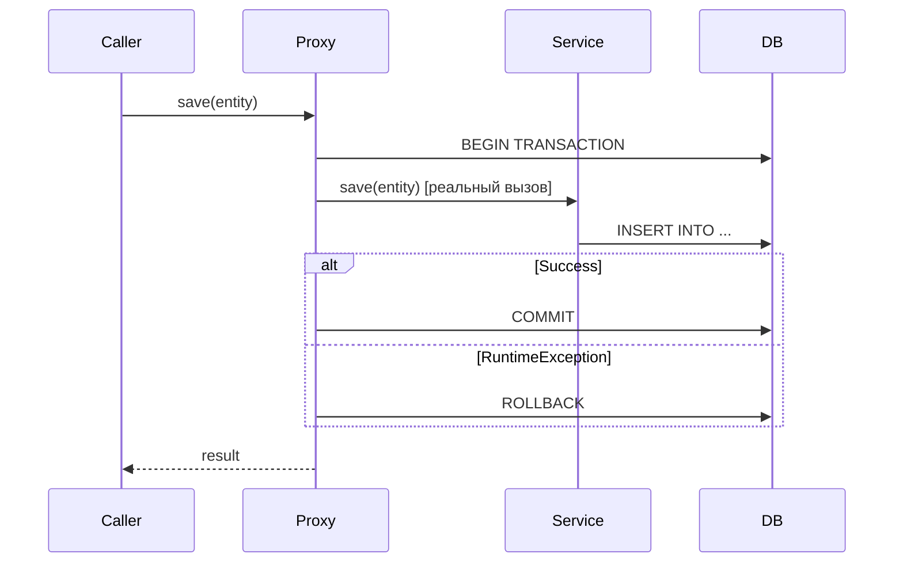

# Вопросы на собеседовании: `Spring Transactions`

`@Transactional` — самая часто задаваемая тема на Spring-собеседованиях. Проверяют понимание propagation, isolation levels, правил rollback и типичных ловушек (self-invocation, checked exceptions, видимость метода).

Дата последнего обновления: 2026-04-20

## Полезные ссылки

### Официальная документация

- [Spring Transaction Management](https://docs.spring.io/spring-framework/docs/current/reference/html/data-access.html#transaction) — официальная документация
- [Baeldung: @Transactional](https://www.baeldung.com/transaction-configuration-with-jpa-and-spring) — настройка транзакций
- [Baeldung: Propagation & Isolation](https://www.baeldung.com/spring-transactional-propagation-isolation) — все типы propagation и isolation

## Содержание

- [Полезные ссылки](#полезные-ссылки)
- [See also](#see-also)

**Основы**
- [Q1. (!) Как Spring реализует @Transactional?](#q1-как-spring-реализует-transactional)
- [Q2. Когда нужен @EnableTransactionManagement?](#q2-когда-нужен-enabletransactionmanagement)
- [Q3. Какие требования для работы @Transactional?](#q3-какие-требования-для-работы-transactional)

**Propagation**
- [Q4. (!) Какие типы Propagation существуют?](#q4-какие-типы-propagation-существуют)
- [Q5. (!) Чем REQUIRES_NEW отличается от NESTED?](#q5-чем-requires_new-отличается-от-nested)
- [Q6. Когда использовать MANDATORY и NEVER?](#q6-когда-использовать-mandatory-и-never)

**Isolation**
- [Q7. (!) Какие уровни изоляции поддерживает Spring?](#q7-какие-уровни-изоляции-поддерживает-spring)
- [Q8. Что такое dirty read, non-repeatable read, phantom read?](#q8-что-такое-dirty-read-non-repeatable-read-phantom-read)

**Rollback**
- [Q9. (!) По каким исключениям Spring откатывает транзакцию по умолчанию?](#q9-по-каким-исключениям-spring-откатывает-транзакцию-по-умолчанию)
- [Q10. Как настроить rollback для checked exceptions?](#q10-как-настроить-rollback-для-checked-exceptions)

**Подводные камни**
- [Q11. (!) Почему self-invocation ломает @Transactional?](#q11-почему-self-invocation-ломает-transactional)
- [Q12. Что делает readOnly = true?](#q12-что-делает-readonly--true)
- [Q13. Можно ли ставить @Transactional на интерфейс?](#q13-можно-ли-ставить-transactional-на-интерфейс)
- [Q14. Как работает @Transactional в многопоточном коде?](#q14-как-работает-transactional-в-многопоточном-коде)
- [Q15. Как тестировать транзакционный код?](#q15-как-тестировать-транзакционный-код)

---

## Q1. (!) Как Spring реализует @Transactional?

Spring использует AOP-прокси: при первом обращении к методу с `@Transactional` вызов перехватывается прокси, который:
1. Открывает транзакцию (или присоединяется к существующей)
2. Вызывает реальный метод
3. Коммитит или откатывает по результату



Прокси создаётся через JDK Dynamic Proxy (если бин реализует интерфейс) или CGLIB (для классов). `@Transactional` — это `@Around`-advice под капотом.

---

## Q2. Когда нужен @EnableTransactionManagement?

В Spring Boot — **не нужен**: автоконфигурация включает управление транзакциями автоматически при наличии `spring-data-*` или `spring-tx` в classpath.

В чистом Spring — необходим:
```java
@Configuration
@EnableTransactionManagement
public class AppConfig { ... }
```

Или XML: `<tx:annotation-driven transaction-manager="txManager"/>`.

---

## Q3. Какие требования для работы @Transactional?

1. **Только `public` методы** — `protected`/`private`/`package-private` игнорируются молча (без ошибки!)
2. **Вызов через прокси** — self-invocation (`this.method()`) не работает
3. **Бин должен быть в Spring-контексте** — аннотация на `new MyService()` не работает

```java
@Service
public class UserService {

    @Transactional          // работает — public
    public void save(User u) { ... }

    @Transactional          // НЕ работает — private (молча игнорируется)
    private void internalSave(User u) { ... }
}
```

---

## Q4. (!) Какие типы Propagation существуют?

`Propagation` определяет поведение транзакции при вызове из уже транзакционного контекста.

| Тип | Есть активная TX | Нет активной TX |
|---|---|---|
| `REQUIRED` (дефолт) | Использует существующую | Создаёт новую |
| `REQUIRES_NEW` | Приостанавливает старую, создаёт новую | Создаёт новую |
| `NESTED` | Создаёт savepoint внутри текущей | Создаёт новую |
| `SUPPORTS` | Использует существующую | Выполняется без TX |
| `NOT_SUPPORTED` | Приостанавливает TX | Выполняется без TX |
| `MANDATORY` | Использует существующую | **Исключение** |
| `NEVER` | **Исключение** | Выполняется без TX |

**REQUIRED (дефолт):**
```java
@Transactional  // REQUIRED по умолчанию
public void updateOrder(Order order) {
    orderRepository.save(order);
    auditService.log(order);  // присоединится к этой же транзакции
}
```

**REQUIRES_NEW:**
```java
@Transactional(propagation = Propagation.REQUIRES_NEW)
public void auditLog(String event) {
    // Всегда в отдельной TX — коммитится независимо
    auditRepository.save(new AuditEntry(event));
}
```

---

## Q5. (!) Чем REQUIRES_NEW отличается от NESTED?

| | `REQUIRES_NEW` | `NESTED` |
|---|---|---|
| Транзакция | Новая независимая | Savepoint внутри текущей |
| Rollback дочерней | Не откатывает родительскую | Не откатывает до savepoint |
| Rollback родительской | Не откатывает дочернюю | **Откатывает** дочернюю |
| Commit | Независимый | При коммите родительской |
| Поддержка | Все TX-менеджеры | Только JDBC savepoints |

```java
@Transactional
public void placeOrder(Order order) {
    orderRepository.save(order);

    try {
        // REQUIRES_NEW: если упадёт notifyCustomer, 
        // order всё равно сохранится
        notifyCustomer(order.getCustomerId());
    } catch (NotificationException e) {
        log.warn("Notification failed, order saved anyway");
    }
}

@Transactional(propagation = Propagation.REQUIRES_NEW)
public void notifyCustomer(Long customerId) { ... }
```

**NESTED** использует JDBC savepoints:
```java
@Transactional(propagation = Propagation.NESTED)
public void updateInventory(Long productId, int delta) {
    // Если упадёт — откатится до savepoint
    // Если parent откатится — откатится и это
}
```

---

## Q6. Когда использовать MANDATORY и NEVER?

**`MANDATORY`** — метод должен вызываться только из транзакционного контекста. Полезен для защиты от ошибок проектирования:
```java
@Transactional(propagation = Propagation.MANDATORY)
public void updateBalance(Account acc, BigDecimal amount) {
    // Защита: этот метод нельзя вызывать без транзакции
    acc.setBalance(acc.getBalance().add(amount));
    repository.save(acc);
}
```
Если вызвать без транзакции → `IllegalTransactionStateException`.

**`NEVER`** — метод не должен выполняться в транзакции:
```java
@Transactional(propagation = Propagation.NEVER)
public void exportToCsv() {
    // Долгая операция, не должна блокировать TX
}
```
Если вызвать внутри транзакции → `IllegalTransactionStateException`.

---

## Q7. (!) Какие уровни изоляции поддерживает Spring?

| Уровень | Dirty Read | Non-repeatable Read | Phantom Read |
|---|---|---|---|
| `READ_UNCOMMITTED` | Возможен | Возможен | Возможен |
| `READ_COMMITTED` | Нет | Возможен | Возможен |
| `REPEATABLE_READ` | Нет | Нет | Возможен |
| `SERIALIZABLE` | Нет | Нет | Нет |
| `DEFAULT` | Дефолт СУБД | — | — |

```java
@Transactional(isolation = Isolation.READ_COMMITTED)
public List<Product> getProducts() { ... }
```

**Дефолты СУБД:**
- PostgreSQL, SQL Server, Oracle: `READ_COMMITTED`
- MySQL: `REPEATABLE_READ`

**Важно:** `READ_UNCOMMITTED` не поддерживается в PostgreSQL и Oracle.

---

## Q8. Что такое dirty read, non-repeatable read, phantom read?

**Dirty Read** — читаем данные незакоммиченной транзакции:
```
TX1: UPDATE balance SET amount = 1000  (не закоммичено)
TX2: SELECT amount  → получает 1000
TX1: ROLLBACK
TX2 прочитал несуществующие данные → dirty read
```

**Non-repeatable Read** — один и тот же SELECT в рамках транзакции возвращает разные данные:
```
TX1: SELECT price FROM products WHERE id = 1  → 100
TX2: UPDATE products SET price = 150 WHERE id = 1; COMMIT
TX1: SELECT price FROM products WHERE id = 1  → 150 (другой результат!)
```

**Phantom Read** — повторный SELECT с диапазоном возвращает другие строки:
```
TX1: SELECT * FROM orders WHERE amount > 500  → 5 строк
TX2: INSERT INTO orders (amount) VALUES (600); COMMIT
TX1: SELECT * FROM orders WHERE amount > 500  → 6 строк (phantom!)
```

---

## Q9. (!) По каким исключениям Spring откатывает транзакцию по умолчанию?

**Только `RuntimeException` и его наследники (unchecked)**. `Error` тоже вызывает rollback.

Checked исключения (`IOException`, `SQLException` и т.д.) — **НЕ** откатывают транзакцию по умолчанию.

```java
@Transactional
public void process() throws IOException {
    repository.save(data);
    throw new IOException("file error");  // транзакция ЗАКОММИТИТСЯ!
}

@Transactional
public void process2() {
    repository.save(data);
    throw new RuntimeException("error");  // транзакция ОТКАТИТСЯ
}
```

**Логика дефолтного поведения:** checked exceptions — "ожидаемые ситуации", не обязательно означают ошибку транзакции.

---

## Q10. Как настроить rollback для checked exceptions?

```java
// Откатывать при любом Exception (включая checked)
@Transactional(rollbackFor = Exception.class)
public void importFile() throws IOException {
    // Если IOException → rollback
}

// Несколько типов:
@Transactional(rollbackFor = {IOException.class, SQLException.class})
public void process() throws IOException, SQLException { ... }

// Не откатывать при конкретном RuntimeException:
@Transactional(noRollbackFor = BusinessValidationException.class)
public void validateAndSave(Order order) {
    // BusinessValidationException не откатит TX — данные сохранятся
}
```

**Программный rollback:**
```java
@Transactional
public void saveWithManualRollback() {
    try {
        repository.save(entity);
    } catch (SomeCheckedException e) {
        TransactionAspectSupport.currentTransactionStatus().setRollbackOnly();
        throw e;
    }
}
```

---

## Q11. (!) Почему self-invocation ломает @Transactional?

Spring создаёт прокси вокруг бина. При вызове `this.method()` обращение идёт напрямую, **минуя прокси** — транзакционный advice не срабатывает.

```java
@Service
public class OrderService {

    @Transactional
    public void processAll(List<Order> orders) {
        for (Order o : orders) {
            processOne(o);  // self-invocation! @Transactional(REQUIRES_NEW) не создаётся
        }
    }

    @Transactional(propagation = Propagation.REQUIRES_NEW)
    public void processOne(Order order) {
        // Работает только если вызван извне через прокси
    }
}
```

**Решения:**

1. **Вынести в отдельный бин** (рекомендуется):
```java
@Service
public class OrderItemService {
    @Transactional(propagation = Propagation.REQUIRES_NEW)
    public void processOne(Order order) { ... }
}

@Service
public class OrderService {
    @Autowired OrderItemService orderItemService;

    @Transactional
    public void processAll(List<Order> orders) {
        orders.forEach(orderItemService::processOne);  // через прокси ✓
    }
}
```

2. **Self-inject через `@Lazy`:**
```java
@Service
public class OrderService {
    @Autowired @Lazy
    private OrderService self;

    @Transactional
    public void processAll(List<Order> orders) {
        orders.forEach(self::processOne);  // через прокси ✓
    }
}
```

---

## Q12. Что делает readOnly = true?

```java
@Transactional(readOnly = true)
public List<Product> findAll() { ... }
```

**Оптимизации при `readOnly = true`:**
- Hibernate: не выполняет dirty checking (не проверяет изменения сущностей)
- Hibernate: не накапливает snapshot сущностей → меньше памяти
- PostgreSQL/Oracle: использует read-only транзакцию (меньше локов)
- Spring: может выбрать read replica при соответствующей настройке роутинга

**Важно:** это **hint**, а не запрет на запись. БД не заблокирует INSERT через read-only транзакцию Spring на уровне драйвера (если не настроен явно). Гарантия — только на уровне Hibernate dirty checking.

**Best practice:** ставьте `readOnly = true` на все read-only сервисные методы и query-репозитории.

---

## Q13. Можно ли ставить @Transactional на интерфейс?

Технически — да, но **не рекомендуется** по нескольким причинам:
- Работает только с JDK proxy (не с CGLIB)
- Аннотации на интерфейсах не всегда видны через Spring AOP
- Нарушает принцип: интерфейс — контракт, транзакция — детали реализации

```java
// НЕ рекомендуется
public interface UserService {
    @Transactional
    void save(User user);
}

// Рекомендуется: аннотация на реализации
@Service
public class UserServiceImpl implements UserService {
    @Transactional
    @Override
    public void save(User user) { ... }
}
```

---

## Q14. Как работает @Transactional в многопоточном коде?

Транзакция привязана к **текущему потоку** через `ThreadLocal` в `TransactionSynchronizationManager`. Каждый поток имеет свою транзакцию.

```java
@Transactional
public void processAsync() {
    CompletableFuture.runAsync(() -> {
        // Новый поток — НЕТ транзакции!
        // repository.save() выполнится без TX
    });
}
```

**Решение:** не пробрасывать транзакцию в другой поток. Каждый поток запускает свою транзакцию:

```java
@Transactional
public void processAsync() {
    CompletableFuture.runAsync(() -> {
        transactionalService.saveInNewTransaction(data);  // собственная TX
    });
}

@Transactional(propagation = Propagation.REQUIRES_NEW)
public void saveInNewTransaction(Object data) { ... }
```

---

## Q15. Как тестировать транзакционный код?

```java
@SpringBootTest
@Transactional  // каждый тест откатывается после выполнения
class OrderServiceTest {

    @Autowired OrderService orderService;
    @Autowired OrderRepository orderRepository;

    @Test
    void shouldSaveOrder() {
        orderService.placeOrder(new Order("product"));
        // После теста — rollback, БД чистая
        assertEquals(1, orderRepository.count());
    }

    @Test
    @Commit  // явный commit вместо rollback (редко нужен)
    void shouldCommitForIntegrationTest() { ... }
}
```

**Проверка REQUIRES_NEW:**
```java
@Test
void shouldCommitAuditEvenIfOrderFails() {
    assertThrows(RuntimeException.class, () -> orderService.processWithAudit(badOrder));
    // Audit должен закоммититься (REQUIRES_NEW), проверяем
    // НО: если тест @Transactional, outer TX откатит и nested!
    // Нужен @Transactional(propagation = NOT_SUPPORTED) на тесте
}
```

---

## See also

- [Spring Framework](spring-framework-interview.md) — AOP, прокси-механизм
- [Spring AOP](spring-aop-interview.md) — как именно реализованы @Transactional и self-invocation
- [Spring Data JPA](spring-data-jpa-interview.md) — транзакции в JPA-репозиториях
- [Spring Data JDBC](spring-data-jdbc-interview.md) — транзакции в JDBC
- [Hibernate](../../databases/hibernate-interview.md) — dirty checking, first-level cache в транзакции
- [Транзакции БД](../../databases/database-transactions-interview.md) — ACID, isolation levels на уровне СУБД
- [Spring Events](spring-events-interview.md) — @TransactionalEventListener (AFTER_COMMIT)
- [Spring Testing](spring-testing-interview.md) — @Transactional в тестах, @Commit
