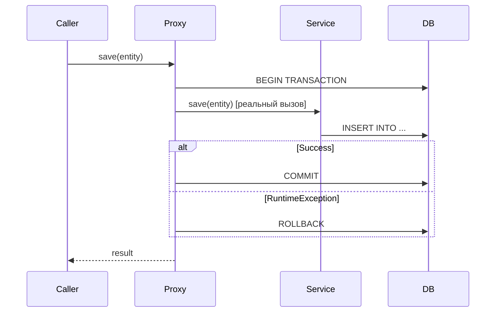

# Вопросы на собеседовании: `Spring Transactions`

`@Transactional` — самая часто задаваемая тема на Spring-собеседованиях. Проверяют понимание propagation, isolation levels, правил rollback и типичных ловушек (self-invocation, checked exceptions, видимость метода).

Дата последнего обновления: 2026-04-22

## Полезные ссылки

### Официальная документация

- [Spring Transaction Management](https://docs.spring.io/spring-framework/docs/current/reference/html/data-access.html#transaction) — официальная документация
- [Baeldung: @Transactional](https://www.baeldung.com/transaction-configuration-with-jpa-and-spring) — настройка транзакций
- [Baeldung: Propagation & Isolation](https://www.baeldung.com/spring-transactional-propagation-isolation) — все типы propagation и isolation

## Содержание

- [Полезные ссылки](#полезные-ссылки)
- [See also](#see-also)

**Основы**
- [Q1. (!) Как Spring реализует @Transactional?](#q1-как-spring-реализует-transactional)
- [Q2. Когда нужен @EnableTransactionManagement?](#q2-когда-нужен-enabletransactionmanagement)
- [Q3. Какие требования для работы @Transactional?](#q3-какие-требования-для-работы-transactional)

**Propagation**
- [Q4. (!) Какие типы Propagation существуют?](#q4-какие-типы-propagation-существуют)
- [Q5. (!) Чем REQUIRES_NEW отличается от NESTED?](#q5-чем-requires_new-отличается-от-nested)
- [Q6. Когда использовать MANDATORY и NEVER?](#q6-когда-использовать-mandatory-и-never)

**Isolation**
- [Q7. (!) Какие уровни изоляции поддерживает Spring?](#q7-какие-уровни-изоляции-поддерживает-spring)
- [Q8. Что такое dirty read, non-repeatable read, phantom read?](#q8-что-такое-dirty-read-non-repeatable-read-phantom-read)

**Rollback**
- [Q9. (!) По каким исключениям Spring откатывает транзакцию по умолчанию?](#q9-по-каким-исключениям-spring-откатывает-транзакцию-по-умолчанию)
- [Q10. Как настроить rollback для checked exceptions?](#q10-как-настроить-rollback-для-checked-exceptions)

**Подводные камни**
- [Q11. (!) Почему self-invocation ломает @Transactional?](#q11-почему-self-invocation-ломает-transactional)
- [Q12. Что делает readOnly = true?](#q12-что-делает-readonly--true)
- [Q13. Можно ли ставить @Transactional на интерфейс?](#q13-можно-ли-ставить-transactional-на-интерфейс)
- [Q14. Как работает @Transactional в многопоточном коде?](#q14-как-работает-transactional-в-многопоточном-коде)
- [Q15. Как тестировать транзакционный код?](#q15-как-тестировать-транзакционный-код)

---

## Q1. (!) Как Spring реализует @Transactional?

Spring использует AOP-прокси: при первом обращении к методу с `@Transactional` вызов перехватывается прокси, который:
1. Открывает транзакцию (или присоединяется к существующей)
2. Вызывает реальный метод
3. Коммитит или откатывает по результату



Прокси создаётся через JDK Dynamic Proxy (если бин реализует интерфейс) или CGLIB (для классов). `@Transactional` — это `@Around`-advice под капотом.

> [!mcq]
> - [ ] Spring реализует @Transactional через AspectJ compile-time weaving, внедряя байткод транзакционного поведения во время компиляции. | Compile-time weaving доступен как опция, но не является дефолтным механизмом. По умолчанию Spring использует runtime-прокси, а не статическое вплетение. Это антипаттерн или неправильный выбор в production.
> - [ ] Spring реализует @Transactional через reflection, напрямую перехватывая вызовы методов через java.lang.reflect.Proxy без создания прокси-объектов. | Reflection используется внутри JDK Dynamic Proxy, но сам механизм — это именно создание прокси-объектов, а не прямое перехватывание через reflection. Это антипаттерн или неправильный выбор в production.
> - [x] Spring реализует @Transactional через AOP-прокси (JDK Dynamic Proxy или CGLIB), который перехватывает вызов, открывает транзакцию, вызывает реальный метод и коммитит или откатывает по результату. | Это стандартный механизм Spring AOP. JDK proxy используется если бин реализует интерфейс, CGLIB — для классов без интерфейса. Логика управления транзакцией оформлена как @Around-advice.
> - [ ] Spring реализует @Transactional через ThreadLocal-переменные в TransactionSynchronizationManager без создания каких-либо прокси. | ThreadLocal в TransactionSynchronizationManager хранит контекст текущей транзакции, но сам механизм перехвата вызовов — это именно прокси, а не ThreadLocal. Это антипаттерн или неправильный выбор в production.

> [!mcq]
> - [ ] При вызове @Transactional-метода Spring всегда создаёт JDK Dynamic Proxy, потому что это более производительный механизм, чем CGLIB. | JDK Dynamic Proxy используется только когда бин реализует хотя бы один интерфейс. CGLIB применяется для классов без интерфейсов и по умолчанию в Spring Boot. Это антипаттерн или неправильный выбор в production.
> - [x] При вызове @Transactional-метода Spring создаёт JDK Dynamic Proxy если бин реализует интерфейс, и CGLIB — если бин является классом без интерфейса. | Spring выбирает механизм прокси автоматически. JDK proxy требует наличия интерфейса, CGLIB генерирует подкласс и не требует интерфейса. Spring Boot по умолчанию предпочитает CGLIB.
> - [ ] При вызове @Transactional-метода Spring всегда создаёт CGLIB-прокси, потому что JDK Dynamic Proxy не поддерживает транзакции. | JDK Dynamic Proxy полностью поддерживает транзакции. Выбор механизма зависит от наличия интерфейса, а не от поддержки транзакций. Это антипаттерн или неправильный выбор в production.
> - [ ] При вызове @Transactional-метода Spring не создаёт прокси, а применяет AspectJ load-time weaving через Java agent. | Load-time weaving — отдельный, нестандартный режим, требующий явной настройки и Java-агента. По умолчанию используются runtime-прокси. Это антипаттерн или неправильный выбор в production.

---

## Q2. Когда нужен @EnableTransactionManagement?

В Spring Boot — **не нужен**: автоконфигурация включает управление транзакциями автоматически при наличии `spring-data-*` или `spring-tx` в classpath.

В чистом Spring — необходим:
```java
@Configuration
@EnableTransactionManagement
public class AppConfig { ... }
```

Или XML: `<tx:annotation-driven transaction-manager="txManager"/>`.

> [!mcq]
> - [ ] @EnableTransactionManagement нужен в любом Spring-приложении, включая Spring Boot, чтобы явно включить поддержку @Transactional. | В Spring Boot автоконфигурация автоматически включает управление транзакциями при наличии spring-tx в classpath. Явный @EnableTransactionManagement в Spring Boot избыточен. Это антипаттерн или неправильный выбор в production.
> - [ ] @EnableTransactionManagement нужен только при использовании JPA, но не нужен при работе с JDBC напрямую. | Аннотация не зависит от технологии доступа к данным. Она включает AOP-обработку @Transactional в целом, независимо от того, JPA или JDBC используется. Это антипаттерн или неправильный выбор в production.
> - [x] @EnableTransactionManagement нужен в чистом Spring-приложении (без Boot) — в Spring Boot автоконфигурация включает управление транзакциями автоматически. | В Spring Boot TransactionAutoConfiguration срабатывает автоматически. В чистом Spring без этой аннотации @Transactional будет молча игнорироваться, что типичная ошибка новичков. Propagation (REQUIRED, REQUIRES_NEW, NESTED, NEVER), isolation (READ_UNCOMMITTED до SERIALIZABLE).
> - [ ] @EnableTransactionManagement нужен только при использовании программного управления транзакциями через TransactionTemplate, а для @Transactional он не требуется. | Верно обратное: @EnableTransactionManagement включает именно декларативные транзакции через @Transactional. TransactionTemplate работает программно и не зависит от этой аннотации. Это антипаттерн или неправильный выбор в production.

---

## Q3. Какие требования для работы @Transactional?

1. **Только `public` методы** — `protected`/`private`/`package-private` игнорируются молча (без ошибки!)
2. **Вызов через прокси** — self-invocation (`this.method()`) не работает
3. **Бин должен быть в Spring-контексте** — аннотация на `new MyService()` не работает

```java
@Service
public class UserService {

    @Transactional          // работает — public
    public void save(User u) { ... }

    @Transactional          // НЕ работает — private (молча игнорируется)
    private void internalSave(User u) { ... }
}
```

> [!mcq]
> - [ ] @Transactional на private-методе вызовет исключение при старте приложения, потому что Spring обнаружит некорректную конфигурацию. | Spring не бросает исключение — аннотация молча игнорируется. Это опасная ловушка: код компилируется и запускается, но транзакция не создаётся. Это антипаттерн или неправильный выбор в production.
> - [ ] @Transactional на protected-методе работает корректно при использовании CGLIB-прокси, потому что CGLIB может переопределять protected-методы. | Несмотря на то что CGLIB технически может переопределять protected-методы, Spring AOP игнорирует @Transactional на non-public методах. Транзакция не будет создана. Это антипаттерн или неправильный выбор в production.
> - [x] @Transactional на private-методе молча игнорируется без ошибки — Spring применяет @Transactional только к public-методам. | Это одна из самых коварных ловушек. Никакого исключения нет, IDE обычно не предупреждает. Метод вызывается, но без транзакционного поведения. Обнаружить можно только через тесты или отладку.
> - [ ] @Transactional работает на любых методах при использовании AspectJ-weaving вместо Spring AOP, включая private. | AspectJ действительно позволяет перехватывать private-методы, однако это требует отдельной настройки compile-time или load-time weaving. По умолчанию Spring использует AOP-прокси с ограничением на public.

> [!mcq]
> - [x] Если вызвать @Transactional-метод через new MyService() вместо Spring-бина, транзакция не создастся, потому что объект не управляется Spring-контейнером. | Spring создаёт прокси только для бинов в контексте. При создании через new получается обычный объект без AOP-обёртки — @Transactional не срабатывает. Propagation (REQUIRED, REQUIRES_NEW, NESTED, NEVER), isolation (READ_UNCOMMITTED до SERIALIZABLE).
> - [ ] Если вызвать @Transactional-метод через new MyService(), Spring всё равно создаст транзакцию, потому что аннотация обрабатывается в runtime через reflection. | @Transactional работает через прокси-объект, который Spring создаёт при регистрации бина. Без регистрации в контексте прокси не существует. Это антипаттерн или неправильный выбор в production.
> - [ ] Если вызвать @Transactional-метод через new MyService(), Spring выбросит BeanCreationException при обнаружении аннотации вне контекста. | Spring не сканирует объекты, созданные через new. Исключения не будет — транзакция просто не откроется, что может привести к трудноуловимым багам. Это антипаттерн или неправильный выбор в production.
> - [ ] Если вызвать @Transactional-метод через new MyService(), транзакция создастся только если в classpath есть spring-aspects и AspectJ-агент. | AspectJ-агент помог бы при load-time weaving, но это отдельная конфигурация. В стандартном сценарии с Spring AOP объекты вне контекста транзакций не получают. Это антипаттерн или неправильный выбор в production.

---

## Q4. (!) Какие типы Propagation существуют?

`Propagation` определяет поведение транзакции при вызове из уже транзакционного контекста.

| Тип | Есть активная TX | Нет активной TX |
|---|---|---|
| `REQUIRED` (дефолт) | Использует существующую | Создаёт новую |
| `REQUIRES_NEW` | Приостанавливает старую, создаёт новую | Создаёт новую |
| `NESTED` | Создаёт savepoint внутри текущей | Создаёт новую |
| `SUPPORTS` | Использует существующую | Выполняется без TX |
| `NOT_SUPPORTED` | Приостанавливает TX | Выполняется без TX |
| `MANDATORY` | Использует существующую | **Исключение** |
| `NEVER` | **Исключение** | Выполняется без TX |

**REQUIRED (дефолт):**
```java
@Transactional  // REQUIRED по умолчанию
public void updateOrder(Order order) {
    orderRepository.save(order);
    auditService.log(order);  // присоединится к этой же транзакции
}
```

**REQUIRES_NEW:**
```java
@Transactional(propagation = Propagation.REQUIRES_NEW)
public void auditLog(String event) {
    // Всегда в отдельной TX — коммитится независимо
    auditRepository.save(new AuditEntry(event));
}
```

> [!mcq]
> - [ ] Propagation.SUPPORTS создаёт новую транзакцию если активной нет, и присоединяется к существующей если есть. | Это описание REQUIRED, а не SUPPORTS. SUPPORTS выполняется без транзакции если активной нет — то есть транзакционность не гарантируется. Частая ошибка в реальном коде.
> - [ ] Propagation.REQUIRED приостанавливает существующую транзакцию и создаёт новую независимую транзакцию при каждом вызове. | Это описание REQUIRES_NEW. REQUIRED присоединяется к существующей транзакции, а не приостанавливает её. Частая ошибка в реальном коде.
> - [ ] Propagation.NOT_SUPPORTED бросает исключение если вызван внутри активной транзакции. | Это описание NEVER. NOT_SUPPORTED приостанавливает активную транзакцию и выполняется без неё — исключения не бросает. Частая ошибка в реальном коде.
> - [x] Propagation.MANDATORY бросает IllegalTransactionStateException если вызван без активной транзакции, и использует существующую если она есть. | MANDATORY — это «защитный» propagation: метод обязан вызываться из транзакционного контекста. Используется для защиты от ошибок проектирования, когда метод логически должен быть частью внешней транзакции.

> [!mcq]
> - [x] Propagation.REQUIRED (дефолт) присоединяется к существующей транзакции если она есть, или создаёт новую если нет — это поведение по умолчанию для @Transactional. | REQUIRED — наиболее используемый propagation. Он обеспечивает что операция выполнится в транзакции в любом случае, при этом не создавая лишних транзакций при вложенных вызовах. Propagation (REQUIRED, REQUIRES_NEW, NESTED, NEVER), isolation (READ_UNCOMMITTED до SERIALIZABLE).
> - [ ] Propagation.NESTED приостанавливает существующую транзакцию и выполняется в новой независимой транзакции, которая может коммититься отдельно. | Это описание REQUIRES_NEW. NESTED создаёт savepoint внутри текущей транзакции — при откате возвращается к savepoint, а не создаёт независимую транзакцию.
> - [ ] Propagation.NEVER присоединяется к существующей транзакции если она есть, выполняется без TX если нет — аналог SUPPORTS но с другим названием. | NEVER и SUPPORTS — противоположности. NEVER бросает исключение при наличии активной транзакции, SUPPORTS использует её если есть. Частая ошибка в реальном коде.
> - [ ] Propagation.REQUIRES_NEW создаёт savepoint внутри текущей транзакции, позволяя откатить вложенную операцию без отката родительской. | Это описание NESTED с savepoints. REQUIRES_NEW полностью приостанавливает родительскую транзакцию и создаёт новую, независимую. Частая ошибка в реальном коде.

---

## Q5. (!) Чем REQUIRES_NEW отличается от NESTED?

| | `REQUIRES_NEW` | `NESTED` |
|---|---|---|
| Транзакция | Новая независимая | Savepoint внутри текущей |
| Rollback дочерней | Не откатывает родительскую | Не откатывает до savepoint |
| Rollback родительской | Не откатывает дочернюю | **Откатывает** дочернюю |
| Commit | Независимый | При коммите родительской |
| Поддержка | Все TX-менеджеры | Только JDBC savepoints |

```java
@Transactional
public void placeOrder(Order order) {
    orderRepository.save(order);

    try {
        // REQUIRES_NEW: если упадёт notifyCustomer, 
        // order всё равно сохранится
        notifyCustomer(order.getCustomerId());
    } catch (NotificationException e) {
        log.warn("Notification failed, order saved anyway");
    }
}

@Transactional(propagation = Propagation.REQUIRES_NEW)
public void notifyCustomer(Long customerId) { ... }
```

**NESTED** использует JDBC savepoints:
```java
@Transactional(propagation = Propagation.NESTED)
public void updateInventory(Long productId, int delta) {
    // Если упадёт — откатится до savepoint
    // Если parent откатится — откатится и это
}
```

> [!mcq]
> - [ ] При откате родительской транзакции REQUIRES_NEW также откатывает дочернюю транзакцию, потому что они связаны через один Connection. | Это поведение NESTED, а не REQUIRES_NEW. REQUIRES_NEW создаёт полностью независимую транзакцию с отдельным Connection — откат родительской не затрагивает дочернюю.
> - [x] При откате родительской транзакции NESTED откатывает и дочернюю, а REQUIRES_NEW — нет, потому что NESTED использует savepoint внутри той же транзакции, а REQUIRES_NEW создаёт новую независимую. | Это ключевое различие. NESTED физически остаётся в рамках родительской транзакции (savepoint), поэтому rollback родителя откатывает всё. REQUIRES_NEW — отдельная транзакция, живущая независимо.
> - [ ] При откате дочерней транзакции REQUIRES_NEW откатывает и родительскую, потому что они разделяют один и тот же Connection к БД. | Верно обратное. REQUIRES_NEW использует отдельный Connection, поэтому откат дочерней не влияет на родительскую. Это и есть основное преимущество REQUIRES_NEW для аудит-логов.
> - [ ] NESTED и REQUIRES_NEW идентичны по поведению отката — оба создают независимые транзакции, отличаясь только наличием savepoint как оптимизации. | Savepoint — не просто оптимизация, а принципиальное различие. NESTED физически не является отдельной транзакцией: она завершается только вместе с родительской, откат родителя откатывает и NESTED.

> [!mcq]
> - [ ] NESTED поддерживается всеми транзакционными менеджерами Spring так же, как REQUIRES_NEW. | NESTED требует поддержки JDBC savepoints — не все БД и драйверы их поддерживают. REQUIRES_NEW работает с любым TransactionManager. Например, JPA EntityManager может не поддерживать NESTED.
> - [ ] REQUIRES_NEW не поддерживается JPA-транзакционным менеджером и работает только с DataSourceTransactionManager. | REQUIRES_NEW поддерживается всеми стандартными TransactionManager в Spring, включая JpaTransactionManager. Ограничения по поддержке есть у NESTED, а не у REQUIRES_NEW. Это антипаттерн или неправильный выбор в production.
> - [x] REQUIRES_NEW поддерживается всеми TX-менеджерами, а NESTED требует поддержки JDBC savepoints — поэтому NESTED может не работать с некоторыми провайдерами. | Savepoints — функциональность JDBC-драйвера и СУБД, не все её поддерживают. Например, при использовании некоторых JPA-провайдеров или NoSQL-адаптеров NESTED может выбросить исключение.
> - [ ] NESTED поддерживается только в PostgreSQL, а REQUIRES_NEW работает со всеми реляционными СУБД без ограничений. | NESTED зависит от поддержки savepoints в JDBC-драйвере и СУБД, но это не ограничено PostgreSQL. MySQL, Oracle и другие СУБД тоже поддерживают savepoints.

---

## Q6. Когда использовать MANDATORY и NEVER?

**`MANDATORY`** — метод должен вызываться только из транзакционного контекста. Полезен для защиты от ошибок проектирования:
```java
@Transactional(propagation = Propagation.MANDATORY)
public void updateBalance(Account acc, BigDecimal amount) {
    // Защита: этот метод нельзя вызывать без транзакции
    acc.setBalance(acc.getBalance().add(amount));
    repository.save(acc);
}
```
Если вызвать без транзакции → `IllegalTransactionStateException`.

**`NEVER`** — метод не должен выполняться в транзакции:
```java
@Transactional(propagation = Propagation.NEVER)
public void exportToCsv() {
    // Долгая операция, не должна блокировать TX
}
```
Если вызвать внутри транзакции → `IllegalTransactionStateException`.

> [!mcq]
> - [ ] Propagation.MANDATORY создаёт новую транзакцию если активной нет, и бросает исключение если активная транзакция уже есть. | Это описание NEVER наоборот. MANDATORY бросает исключение при отсутствии транзакции, а при наличии — присоединяется к ней. Частая ошибка в реальном коде.
> - [ ] Propagation.NEVER приостанавливает активную транзакцию и выполняет метод без транзакционного контекста, не бросая исключений. | Это описание NOT_SUPPORTED. NEVER бросает IllegalTransactionStateException если вызван внутри активной транзакции. Это антипаттерн или неправильный выбор в production.
> - [ ] Propagation.MANDATORY используется когда метод не должен выполняться в транзакции — например, для долгих операций чтения. | Это описание NEVER. MANDATORY используется для обратного: метод обязан выполняться в транзакции. Типичный use case — защита внутренних методов, которые должны быть частью внешней транзакции.
> - [x] Propagation.MANDATORY бросает IllegalTransactionStateException при вызове без транзакции, а NEVER — при вызове внутри транзакции. | Оба типа используются как защитные механизмы: MANDATORY гарантирует что метод не вызван случайно вне транзакции, NEVER — что долгая операция не блокирует транзакцию. Propagation (REQUIRED, REQUIRES_NEW, NESTED, NEVER), isolation (READ_UNCOMMITTED до SERIALIZABLE).

---

## Q7. (!) Какие уровни изоляции поддерживает Spring?

| Уровень | Dirty Read | Non-repeatable Read | Phantom Read |
|---|---|---|---|
| `READ_UNCOMMITTED` | Возможен | Возможен | Возможен |
| `READ_COMMITTED` | Нет | Возможен | Возможен |
| `REPEATABLE_READ` | Нет | Нет | Возможен |
| `SERIALIZABLE` | Нет | Нет | Нет |
| `DEFAULT` | Дефолт СУБД | — | — |

```java
@Transactional(isolation = Isolation.READ_COMMITTED)
public List<Product> getProducts() { ... }
```

**Дефолты СУБД:**
- PostgreSQL, SQL Server, Oracle: `READ_COMMITTED`
- MySQL: `REPEATABLE_READ`

**Важно:** `READ_UNCOMMITTED` не поддерживается в PostgreSQL и Oracle.

> [!mcq]
> - [ ] Isolation.REPEATABLE_READ защищает от dirty read, non-repeatable read и phantom read — то есть обеспечивает полную изоляцию транзакций. | Полную изоляцию обеспечивает только SERIALIZABLE. REPEATABLE_READ защищает от dirty read и non-repeatable read, но phantom read всё ещё возможен (вставка новых строк другой транзакцией).
> - [x] Isolation.REPEATABLE_READ защищает от dirty read и non-repeatable read, но phantom read при нём всё ещё возможен. | На уровне REPEATABLE_READ гарантируется что повторное чтение одной строки вернёт те же данные. Однако диапазонные запросы могут возвращать разные наборы строк если другая транзакция вставила новые строки.
> - [ ] Isolation.READ_COMMITTED защищает от dirty read, non-repeatable read, но допускает phantom read. | READ_COMMITTED защищает только от dirty read. Non-repeatable read на этом уровне возможен: другая транзакция может закоммитить изменение строки между двумя одинаковыми SELECT.
> - [ ] Isolation.SERIALIZABLE защищает от dirty read и phantom read, но non-repeatable read при нём всё ещё возможен. | SERIALIZABLE — максимальный уровень изоляции, защищающий от всех трёх аномалий: dirty read, non-repeatable read и phantom read. Non-repeatable read при SERIALIZABLE невозможен.

> [!mcq]
> - [ ] PostgreSQL по умолчанию использует уровень изоляции REPEATABLE_READ, поэтому non-repeatable read в нём невозможен. | По умолчанию PostgreSQL использует READ_COMMITTED. REPEATABLE_READ — дефолт MySQL/InnoDB. В PostgreSQL non-repeatable read возможен без явного указания уровня изоляции.
> - [ ] READ_UNCOMMITTED поддерживается всеми СУБД, подключаемыми через Spring, и является самым быстрым уровнем изоляции. | READ_UNCOMMITTED не поддерживается PostgreSQL и Oracle. Попытка установить этот уровень в PostgreSQL будет молча проигнорирована — СУБД повысит его до READ_COMMITTED.
> - [x] PostgreSQL и Oracle по умолчанию используют READ_COMMITTED, а MySQL — REPEATABLE_READ, и READ_UNCOMMITTED не поддерживается PostgreSQL и Oracle. | Это важная практическая деталь. Spring позволяет указать Isolation.READ_UNCOMMITTED, но PostgreSQL проигнорирует его. Разработчику важно знать реальные дефолты конкретной СУБД.
> - [ ] Spring всегда использует Isolation.DEFAULT, который соответствует READ_COMMITTED независимо от используемой СУБД. | Isolation.DEFAULT передаёт управление уровнем изоляции самой СУБД — Spring не устанавливает конкретный уровень. Дефолт СУБД зависит от конкретной базы данных и может быть не READ_COMMITTED.

---

## Q8. Что такое dirty read, non-repeatable read, phantom read?

**Dirty Read** — читаем данные незакоммиченной транзакции:
```
TX1: UPDATE balance SET amount = 1000  (не закоммичено)
TX2: SELECT amount  → получает 1000
TX1: ROLLBACK
TX2 прочитал несуществующие данные → dirty read
```

**Non-repeatable Read** — один и тот же SELECT в рамках транзакции возвращает разные данные:
```
TX1: SELECT price FROM products WHERE id = 1  → 100
TX2: UPDATE products SET price = 150 WHERE id = 1; COMMIT
TX1: SELECT price FROM products WHERE id = 1  → 150 (другой результат!)
```

**Phantom Read** — повторный SELECT с диапазоном возвращает другие строки:
```
TX1: SELECT * FROM orders WHERE amount > 500  → 5 строк
TX2: INSERT INTO orders (amount) VALUES (600); COMMIT
TX1: SELECT * FROM orders WHERE amount > 500  → 6 строк (phantom!)
```

> [!mcq]
> - [ ] Dirty read — это когда повторный SELECT в одной транзакции возвращает другой результат из-за UPDATE, закоммиченного другой транзакцией между двумя чтениями. | Это описание non-repeatable read. Dirty read — чтение данных незакоммиченной транзакции. Ключевое слово «грязный» — данные могут исчезнуть при откате чужой транзакции.
> - [ ] Non-repeatable read — это когда диапазонный SELECT возвращает разное количество строк из-за INSERT или DELETE, выполненных другой транзакцией. | Это описание phantom read. Non-repeatable read касается изменения существующих строк (UPDATE), а не добавления или удаления строк. Частая ошибка в реальном коде.
> - [x] Phantom read — это когда повторный диапазонный SELECT в одной транзакции возвращает разное количество строк из-за INSERT или DELETE в другой транзакции. | Phantom read связан именно с диапазонными запросами. Новые строки, вставленные другой транзакцией, «появляются» как призраки в повторном запросе. REPEATABLE_READ не защищает от этого — только SERIALIZABLE.
> - [ ] Dirty read — это когда два последовательных SELECT в одной транзакции возвращают разные значения одной и той же строки из-за UPDATE в другой транзакции. | Это описание non-repeatable read. Dirty read специфичен тем, что читается незакоммиченные данные — транзакция, чьи данные читаются, ещё не завершена и может откатиться.

---

## Q9. (!) По каким исключениям Spring откатывает транзакцию по умолчанию?

**Только `RuntimeException` и его наследники (unchecked)**. `Error` тоже вызывает rollback.

Checked исключения (`IOException`, `SQLException` и т.д.) — **НЕ** откатывают транзакцию по умолчанию.

```java
@Transactional
public void process() throws IOException {
    repository.save(data);
    throw new IOException("file error");  // транзакция ЗАКОММИТИТСЯ!
}

@Transactional
public void process2() {
    repository.save(data);
    throw new RuntimeException("error");  // транзакция ОТКАТИТСЯ
}
```

**Логика дефолтного поведения:** checked exceptions — "ожидаемые ситуации", не обязательно означают ошибку транзакции.

> [!mcq]
> - [ ] Spring по умолчанию откатывает транзакцию при любом Exception, включая checked, потому что любое исключение указывает на ошибку. | По умолчанию Spring откатывает только при RuntimeException и Error. Checked exceptions считаются ожидаемыми ситуациями и не приводят к rollback без явной настройки rollbackFor.
> - [ ] Spring по умолчанию откатывает транзакцию только при Error, но не при RuntimeException — для RuntimeException нужен явный rollbackFor. | Верно обратное. По умолчанию Spring откатывает и при RuntimeException, и при Error. RuntimeException — это стандартный триггер rollback без дополнительных настроек.
> - [ ] Spring по умолчанию откатывает транзакцию при checked exceptions, потому что они объявлены в сигнатуре метода и значит ожидаются разработчиком. | Объявление в сигнатуре не означает rollback. Логика обратная: checked exceptions — «ожидаемые ситуации», которые не обязательно нарушают целостность данных, поэтому дефолт — коммит.
> - [x] Spring по умолчанию откатывает транзакцию при RuntimeException и Error, а при checked exceptions (IOException, SQLException и т.д.) — коммитит. | Это одна из самых частых ошибок. Код бросает IOException, данные частично сохранены, транзакция коммитится. Для rollback при checked нужно явно указать rollbackFor = Exception.class.

---

## Q10. Как настроить rollback для checked exceptions?

```java
// Откатывать при любом Exception (включая checked)
@Transactional(rollbackFor = Exception.class)
public void importFile() throws IOException {
    // Если IOException → rollback
}

// Несколько типов:
@Transactional(rollbackFor = {IOException.class, SQLException.class})
public void process() throws IOException, SQLException { ... }

// Не откатывать при конкретном RuntimeException:
@Transactional(noRollbackFor = BusinessValidationException.class)
public void validateAndSave(Order order) {
    // BusinessValidationException не откатит TX — данные сохранятся
}
```

**Программный rollback:**
```java
@Transactional
public void saveWithManualRollback() {
    try {
        repository.save(entity);
    } catch (SomeCheckedException e) {
        TransactionAspectSupport.currentTransactionStatus().setRollbackOnly();
        throw e;
    }
}
```

> [!mcq]
> - [ ] Чтобы откатить транзакцию при IOException, нужно указать @Transactional(noRollbackFor = IOException.class). | noRollbackFor — противоположный атрибут: он отключает rollback для указанного типа. Для включения rollback при checked нужен rollbackFor = IOException.class. Это антипаттерн или неправильный выбор в production.
> - [x] Чтобы откатить транзакцию при IOException, нужно указать @Transactional(rollbackFor = IOException.class) или rollbackFor = Exception.class. | rollbackFor расширяет дефолтные правила rollback на указанные типы. Exception.class охватывает все checked и unchecked исключения, что часто удобнее чем перечислять конкретные типы.
> - [ ] Чтобы откатить транзакцию при IOException, достаточно объявить IOException в сигнатуре метода через throws, и Spring автоматически добавит rollback. | Объявление в throws не влияет на правила rollback. Spring смотрит только на тип исключения (checked vs unchecked) и атрибуты rollbackFor/noRollbackFor аннотации.
> - [ ] Чтобы откатить транзакцию при IOException, нужно перехватить исключение и вызвать TransactionAspectSupport.currentTransactionStatus().commit(). | Метода commit() в TransactionStatus нет для прямого вызова. Для принудительного rollback используется setRollbackOnly(), а затем исключение повторно бросается или прокси сам откатит при исключении.

> [!mcq]
> - [ ] noRollbackFor используется чтобы полностью отключить транзакцию для определённых методов, работающих с некритичными данными. | noRollbackFor влияет только на правила rollback — он не отключает транзакцию. Транзакция создаётся и коммитится в штатном режиме, просто указанное исключение больше не вызывает rollback.
> - [ ] TransactionAspectSupport.currentTransactionStatus().setRollbackOnly() бросает исключение если активной транзакции нет в текущем потоке. | setRollbackOnly() бросает исключение если вызван вне транзакционного контекста, однако это относится не к его прямой семантике. Основное назначение — пометить текущую транзакцию как «только откат».
> - [x] noRollbackFor позволяет исключить определённый RuntimeException из дефолтных правил rollback — транзакция закоммитится даже если этот тип исключения был брошен. | Типичный кейс: BusinessValidationException — это RuntimeException, но бросается при ожидаемой бизнес-ошибке (например, недостаточный баланс). Транзакцию при этом откатывать не нужно — данные могут быть уже частично сохранены корректно.
> - [ ] noRollbackFor применяется только к checked exceptions — для RuntimeException нельзя отключить rollback через noRollbackFor. | noRollbackFor работает с любыми типами исключений, включая RuntimeException и его наследников. Это полезно когда нужно коммитить при конкретном RuntimeException, несмотря на дефолтное правило rollback.

---

## Q11. (!) Почему self-invocation ломает @Transactional?

Spring создаёт прокси вокруг бина. При вызове `this.method()` обращение идёт напрямую, **минуя прокси** — транзакционный advice не срабатывает.

```java
@Service
public class OrderService {

    @Transactional
    public void processAll(List<Order> orders) {
        for (Order o : orders) {
            processOne(o);  // self-invocation! @Transactional(REQUIRES_NEW) не создаётся
        }
    }

    @Transactional(propagation = Propagation.REQUIRES_NEW)
    public void processOne(Order order) {
        // Работает только если вызван извне через прокси
    }
}
```

**Решения:**

1. **Вынести в отдельный бин** (рекомендуется):
```java
@Service
public class OrderItemService {
    @Transactional(propagation = Propagation.REQUIRES_NEW)
    public void processOne(Order order) { ... }
}

@Service
public class OrderService {
    @Autowired OrderItemService orderItemService;

    @Transactional
    public void processAll(List<Order> orders) {
        orders.forEach(orderItemService::processOne);  // через прокси ✓
    }
}
```

2. **Self-inject через `@Lazy`:**
```java
@Service
public class OrderService {
    @Autowired @Lazy
    private OrderService self;

    @Transactional
    public void processAll(List<Order> orders) {
        orders.forEach(self::processOne);  // через прокси ✓
    }
}
```

> [!mcq]
> - [ ] Self-invocation ломает @Transactional потому что Java не позволяет вызывать переопределённые методы через this в CGLIB-подклассах. | Проблема не в ограничениях Java, а в архитектуре Spring AOP. При вызове через this объект обращается напрямую к своему полю, минуя прокси-обёртку, которая находится снаружи. Это антипаттерн или неправильный выбор в production.
> - [x] Self-invocation ломает @Transactional потому что вызов через this идёт напрямую к реальному объекту, минуя AOP-прокси — транзакционный advice не срабатывает. | Прокси находится снаружи бина. Когда метод внутри класса вызывает другой метод через this, он обходит прокси полностью. Для работы транзакции вызов должен пройти через прокси-объект.
> - [ ] Self-invocation ломает @Transactional только при использовании JDK Dynamic Proxy — с CGLIB self-invocation работает корректно. | Оба механизма прокси (JDK и CGLIB) страдают от self-invocation одинаково. CGLIB создаёт подкласс, но this внутри метода ссылается на реальный объект, а не на прокси-подкласс. Это антипаттерн или неправильный выбор в production.
> - [ ] Self-invocation ломает @Transactional только если вызываемый метод имеет другой propagation type — при одинаковом propagation self-invocation работает. | Self-invocation ломает @Transactional независимо от propagation. Любой вызов через this минует прокси, поэтому никакой транзакционной логики не выполняется вне зависимости от настроек.

> [!mcq]
> - [ ] Лучший способ решить проблему self-invocation — использовать @Lazy self-inject, потому что это стандартная рекомендация Spring. | Вынесение в отдельный бин — рекомендуемый способ, потому что он лучше соответствует принципу единственной ответственности. @Lazy self-inject — рабочий, но менее предпочтительный паттерн.
> - [ ] Лучший способ решить проблему self-invocation — использовать AopContext.currentProxy() для получения прокси и вызова метода через него. | AopContext.currentProxy() — рабочее решение, но требует включения exposeProxy=true в @EnableAspectJAutoProxy и считается антипаттерном из-за тесной связи с инфраструктурой AOP. Это антипаттерн или неправильный выбор в production.
> - [x] Лучший способ решить проблему self-invocation — вынести вызываемый метод в отдельный Spring-бин, чтобы вызов шёл через прокси внешнего бина. | Разделение на бины улучшает архитектуру и устраняет self-invocation без ухищрений. @Lazy self-inject и AopContext.currentProxy() — рабочие, но являются запахом кода (code smell). Before/After/Around advice, pointcut for matching, weaving (compile-time vs runtime).
> - [ ] Лучший способ решить проблему self-invocation — переключиться на AspectJ compile-time weaving, которое работает без прокси и поддерживает self-invocation. | AspectJ действительно решает проблему self-invocation, но требует сложной настройки агента или плагина компилятора. Это не практичное решение для большинства проектов.

---

## Q12. Что делает readOnly = true?

```java
@Transactional(readOnly = true)
public List<Product> findAll() { ... }
```

**Оптимизации при `readOnly = true`:**
- Hibernate: не выполняет dirty checking (не проверяет изменения сущностей)
- Hibernate: не накапливает snapshot сущностей → меньше памяти
- PostgreSQL/Oracle: использует read-only транзакцию (меньше локов)
- Spring: может выбрать read replica при соответствующей настройке роутинга

**Важно:** это **hint**, а не запрет на запись. БД не заблокирует INSERT через read-only транзакцию Spring на уровне драйвера (если не настроен явно). Гарантия — только на уровне Hibernate dirty checking.

**Best practice:** ставьте `readOnly = true` на все read-only сервисные методы и query-репозитории.

> [!mcq]
> - [ ] readOnly = true запрещает любые операции записи на уровне драйвера JDBC — при попытке INSERT Spring бросит исключение до отправки запроса в БД. | readOnly = true — это hint, а не жёсткий запрет. Spring передаёт флаг Hibernate и возможно драйверу, но не гарантирует блокировку INSERT на уровне JDBC без дополнительной настройки.
> - [ ] readOnly = true включает кэширование результатов запросов в Hibernate second-level cache для повышения производительности. | readOnly = true не связан напрямую с second-level cache. Основные оптимизации — отключение dirty checking и накопления snapshot в first-level cache, что снижает нагрузку на память и CPU.
> - [x] readOnly = true отключает в Hibernate dirty checking и накопление snapshot сущностей, что снижает нагрузку на память и CPU, а также может включить read-only режим в СУБД. | Это конкретные, измеримые оптимизации. При большом количестве загруженных сущностей dirty checking занимает значительное время. Отказ от snapshot освобождает память. PostgreSQL при read-only транзакции снижает нагрузку на WAL.
> - [ ] readOnly = true автоматически направляет запросы на read replica в кластере PostgreSQL без дополнительной настройки роутинга в Spring. | Автоматическое переключение на read replica требует явной настройки AbstractRoutingDataSource или аналогичного механизма. readOnly = true лишь предоставляет hint, на основе которого можно реализовать такое роутинг.

---

## Q13. Можно ли ставить @Transactional на интерфейс?

Технически — да, но **не рекомендуется** по нескольким причинам:
- Работает только с JDK proxy (не с CGLIB)
- Аннотации на интерфейсах не всегда видны через Spring AOP
- Нарушает принцип: интерфейс — контракт, транзакция — детали реализации

```java
// НЕ рекомендуется
public interface UserService {
    @Transactional
    void save(User user);
}

// Рекомендуется: аннотация на реализации
@Service
public class UserServiceImpl implements UserService {
    @Transactional
    @Override
    public void save(User user) { ... }
}
```

> [!mcq]
> - [ ] @Transactional на интерфейсе работает одинаково хорошо как с JDK Dynamic Proxy, так и с CGLIB — разницы между механизмами прокси нет. | @Transactional на интерфейсе работает только с JDK Dynamic Proxy. При использовании CGLIB (дефолт в Spring Boot) аннотации на интерфейсе могут не обрабатываться корректно. Это антипаттерн или неправильный выбор в production.
> - [ ] @Transactional нельзя ставить на интерфейс технически — компилятор Java запрещает аннотации с @Target(METHOD) на методах интерфейса. | Технически это возможно — Java допускает аннотации на методах интерфейса. Проблема не в компиляции, а в том как Spring AOP обрабатывает такие аннотации во время выполнения. Это антипаттерн или неправильный выбор в production.
> - [x] @Transactional на интерфейсе технически работает только с JDK Dynamic Proxy и не рекомендуется, потому что транзакция — деталь реализации, а не контракт. | Ставить аннотации транзакции на интерфейс — плохая практика с архитектурной точки зрения. Интерфейс описывает что делает сервис, реализация — как, включая транзакционность. Propagation (REQUIRED, REQUIRES_NEW, NESTED, NEVER), isolation (READ_UNCOMMITTED до SERIALIZABLE).
> - [ ] @Transactional на интерфейсе автоматически применяется ко всем реализациям интерфейса, даже если реализация явно переопределяет метод без @Transactional. | Поведение аннотаций на интерфейсах в Spring AOP непредсказуемо и зависит от типа прокси. Более того, аннотация на реализации имеет приоритет. Полагаться на наследование @Transactional с интерфейса ненадёжно.

---

## Q14. Как работает @Transactional в многопоточном коде?

Транзакция привязана к **текущему потоку** через `ThreadLocal` в `TransactionSynchronizationManager`. Каждый поток имеет свою транзакцию.

```java
@Transactional
public void processAsync() {
    CompletableFuture.runAsync(() -> {
        // Новый поток — НЕТ транзакции!
        // repository.save() выполнится без TX
    });
}
```

**Решение:** не пробрасывать транзакцию в другой поток. Каждый поток запускает свою транзакцию:

```java
@Transactional
public void processAsync() {
    CompletableFuture.runAsync(() -> {
        transactionalService.saveInNewTransaction(data);  // собственная TX
    });
}

@Transactional(propagation = Propagation.REQUIRES_NEW)
public void saveInNewTransaction(Object data) { ... }
```

> [!mcq]
> - [ ] @Transactional в многопоточном коде автоматически распространяет транзакцию на дочерние потоки через наследование ThreadLocal-контекста. | ThreadLocal по определению изолирован для каждого потока и не наследуется дочерними потоками. CompletableFuture.runAsync() выполняется в новом потоке без транзакционного контекста.
> - [x] @Transactional привязан к текущему потоку через ThreadLocal — дочерние потоки (CompletableFuture, Thread) не наследуют транзакцию и выполняют операции без транзакционного контекста. | TransactionSynchronizationManager использует ThreadLocal для хранения текущего Connection и состояния транзакции. При создании нового потока этот контекст не передаётся автоматически.
> - [ ] @Transactional в многопоточном коде бросает исключение при попытке запустить дочерний поток, потому что это нарушает атомарность транзакции. | Spring не запрещает запуск дочерних потоков внутри транзакционного метода. Дочерний поток просто выполняется без транзакции — никакого исключения нет, что и является скрытой проблемой.
> - [ ] @Transactional в многопоточном коде можно правильно использовать, передав TransactionStatus в дочерний поток и вызвав там transactionManager.getTransaction(). | Передача TransactionStatus между потоками не обеспечит общую транзакцию — Connection привязан к потоку. Правильное решение: каждый поток запускает собственную транзакцию через отдельный @Transactional-метод.

---

## Q15. Как тестировать транзакционный код?

```java
@SpringBootTest
@Transactional  // каждый тест откатывается после выполнения
class OrderServiceTest {

    @Autowired OrderService orderService;
    @Autowired OrderRepository orderRepository;

    @Test
    void shouldSaveOrder() {
        orderService.placeOrder(new Order("product"));
        // После теста — rollback, БД чистая
        assertEquals(1, orderRepository.count());
    }

    @Test
    @Commit  // явный commit вместо rollback (редко нужен)
    void shouldCommitForIntegrationTest() { ... }
}
```

**Проверка REQUIRES_NEW:**
```java
@Test
void shouldCommitAuditEvenIfOrderFails() {
    assertThrows(RuntimeException.class, () -> orderService.processWithAudit(badOrder));
    // Audit должен закоммититься (REQUIRES_NEW), проверяем
    // НО: если тест @Transactional, outer TX откатит и nested!
    // Нужен @Transactional(propagation = NOT_SUPPORTED) на тесте
}
```

> [!mcq]
> - [ ] @Transactional на тестовом классе гарантирует что все тесты выполняются в одной общей транзакции, которая откатывается после завершения всего класса. | @Transactional на тестовом классе создаёт отдельную транзакцию для каждого тестового метода, и каждая транзакция откатывается после своего теста. Общей транзакции на весь класс нет.
> - [ ] При тестировании REQUIRES_NEW достаточно пометить тест @Transactional — вложенная REQUIRES_NEW транзакция будет корректно проверяться внутри тестовой транзакции. | Это ловушка. Тестовая @Transactional создаёт outer транзакцию. REQUIRES_NEW в тестируемом методе создаёт inner, но при откате тестовой outer транзакции все изменения откатываются. Нужно NOT_SUPPORTED на тесте.
> - [x] При тестировании REQUIRES_NEW нужно использовать @Transactional(propagation = NOT_SUPPORTED) на тесте — иначе откат тестовой транзакции откатит и данные, закоммиченные через REQUIRES_NEW. | NOT_SUPPORTED приостанавливает транзакционный контекст теста, позволяя REQUIRES_NEW-методу коммититься реально. После теста нужно вручную очищать БД через @AfterEach. Propagation (REQUIRED, REQUIRES_NEW, NESTED, NEVER), isolation (READ_UNCOMMITTED до SERIALIZABLE).
> - [ ] @Commit на тестовом методе означает что транзакция не откатится, но данные сохранятся только в памяти до завершения тестового класса. | @Commit означает реальный commit в БД, а не сохранение в памяти. После @Commit данные физически записаны и не будут автоматически удалены — это может засорить тестовую БД если не предусмотрена очистка.

---

## See also

- [Spring Framework](spring-framework-interview.md) — AOP, прокси-механизм
- [Spring AOP](spring-aop-interview.md) — как именно реализованы @Transactional и self-invocation
- [Spring Data JPA](spring-data-jpa-interview.md) — транзакции в JPA-репозиториях
- [Spring Data JDBC](spring-data-jdbc-interview.md) — транзакции в JDBC
- [Hibernate](../../databases/hibernate-interview.md) — dirty checking, first-level cache в транзакции
- [Транзакции БД](../../databases/database-transactions-interview.md) — ACID, isolation levels на уровне СУБД
- [Spring Events](spring-events-interview.md) — @TransactionalEventListener (AFTER_COMMIT)
- [Spring Testing](spring-testing-interview.md) — @Transactional в тестах, @Commit
