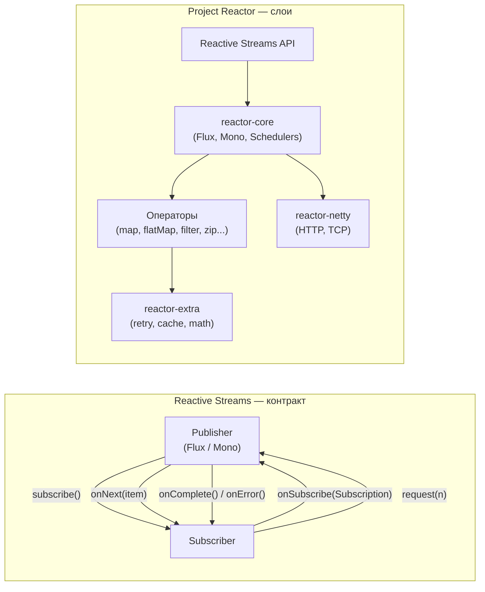
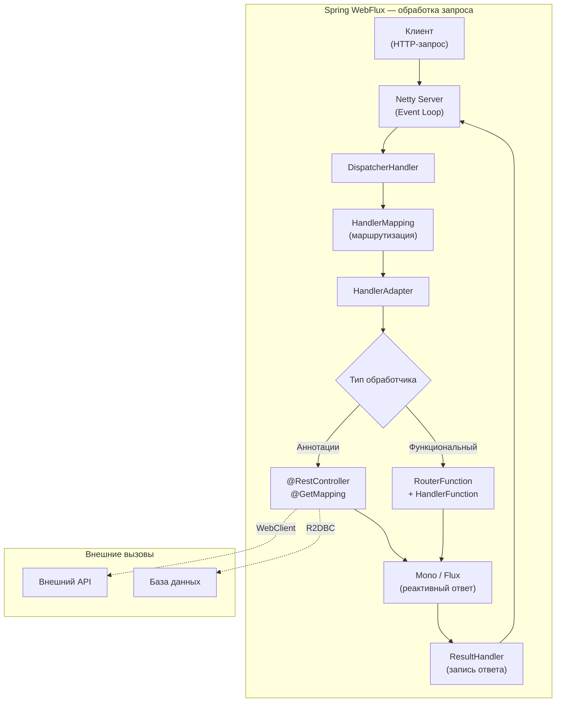
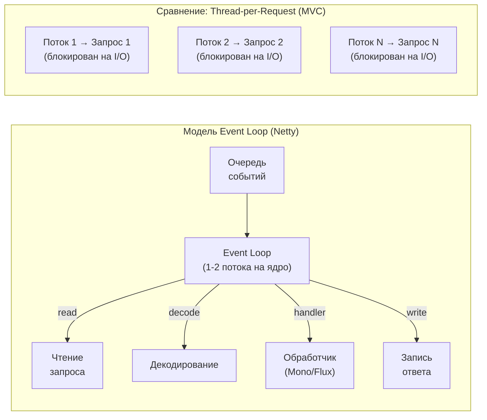
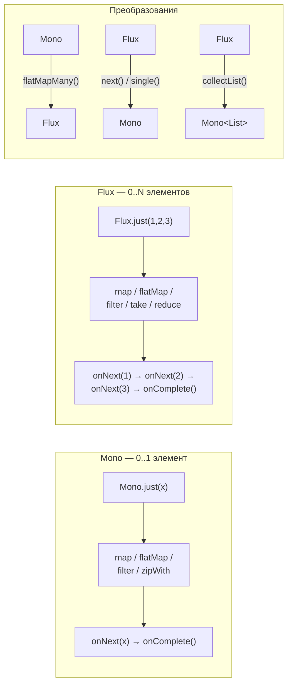
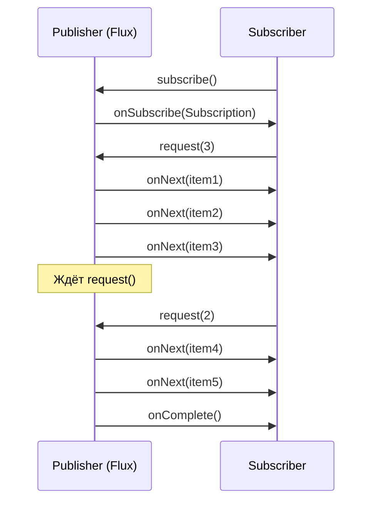
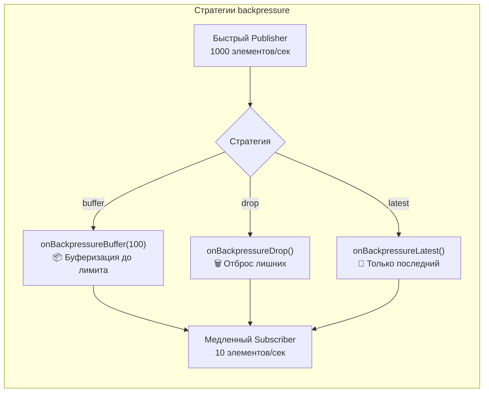

# Вопросы на собеседовании: `Spring WebFlux`

Краткие ответы по `Spring WebFlux`: `Mono / Flux`, реактивная модель, `WebClient`, отличия от `MVC`, `R2DBC`.

Дата последнего обновления: 2026-04-13

Краткое введение: `Spring WebFlux` — реактивный веб-стек на `Project Reactor`. На собеседованиях проверяют понимание реактивной модели, `Mono / Flux` и отличий от `Spring MVC`.

## Полезные ссылки

### Официальная документация

- [Spring WebFlux Documentation](https://docs.spring.io/spring-framework/reference/web/webflux.html) — основной справочник по реактивному веб-стеку
- [Project Reactor Reference](https://projectreactor.io/docs/core/release/reference/) — документация Reactor: Mono, Flux, операторы

### Baeldung

- [Guide to Spring WebFlux](https://www.baeldung.com/spring-webflux) — полный туториал по WebFlux
- [Difference Between Flux and Mono](https://www.baeldung.com/java-reactor-flux-vs-mono) — когда использовать Mono, а когда Flux
- [Spring WebClient](https://www.baeldung.com/spring-5-webclient) — реактивный HTTP-клиент: настройка и использование
- [Concurrency in Spring WebFlux](https://www.baeldung.com/spring-webflux-concurrency) — модель потоков, event loop и Schedulers
- [Set a Timeout in Spring WebClient](https://www.baeldung.com/spring-webflux-timeout) — настройка таймаутов и retry в WebClient
- [Using Reactor Mono.cache() for Memoization](https://www.baeldung.com/spring-reactor-mono-cache) — кеширование в реактивных цепочках

## Содержание

- [Полезные ссылки](#полезные-ссылки)
- [See also](#see-also)

**Основы Spring WebFlux**
- [Q1. Что такое Project Reactor и Spring WebFlux?](#q1-что-такое-project-reactor-и-spring-webflux)
- [Q2. (!) В чем отличие между Project Reactor и Spring WebFlux?](#q2-важно-в-чем-отличие-между-project-reactor-и-spring-webflux)
- [Q3. (!) Какова архитектура Project Reactor?](#q3-важно-какова-архитектура-project-reactor)
- [Q4. (!) Какова архитектура Spring WebFlux?](#q4-важно-какова-архитектура-spring-webflux)

**Реактивное программирование**
- [Q5. Что такое реактивное программирование?](#q5-что-такое-реактивное-программирование)
- [Q6. Какие основные принципы реактивного программирования?](#q6-какие-основные-принципы-реактивного-программирования)
- [Q7. (!) Как реализована асинхронность в Project Reactor?](#q7-важно-как-реализована-асинхронность-в-project-reactor)
- [Q8. (!) Как реализована асинхронность в Spring WebFlux?](#q8-важно-как-реализована-асинхронность-в-spring-webflux)

**Flux, Mono и операторы**
- [Q9. Что такое Flux и Mono в Project Reactor?](#q9-что-такое-flux-и-mono-в-project-reactor)
- [Q10. Какие методы доступны для работы с реактивными потоками в Spring WebFlux?](#q10-какие-методы-доступны-для-работы-с-реактивными-потоками-в-spring-webflux)
- [Q11. Как обрабатывать ошибки в Project Reactor?](#q11-как-обрабатывать-ошибки-в-project-reactor)
- [Q12. Как обрабатывать ошибки в Spring WebFlux?](#q12-как-обрабатывать-ошибки-в-spring-webflux)
- [Q13. Как тестировать реактивные приложения, построенные на Project Reactor и Spring WebFlux?](#q13-как-тестировать-реактивные-приложения-построенные-на-project-reactor-и-spring-webflux)
- [Q14. Что такое backpressure и как с ним работать?](#q14-что-такое-backpressure-и-как-с-ним-работать)

**WebClient и R2DBC**
- [Q15. Чем WebClient отличается от RestTemplate?](#q15-чем-webclient-отличается-от-resttemplate)
- [Q16. Как использовать R2DBC с Spring Data?](#q16-как-использовать-r2dbc-с-spring-data)
- [Q17. Что такое Schedulers и когда какой использовать?](#q17-что-такое-schedulers-и-когда-какой-использовать)
- [Q18. Как реализовать Server-Sent Events (SSE) в WebFlux?](#q18-как-реализовать-server-sent-events-sse-в-webflux)
- [Q19. Что такое cold и hot publishers?](#q19-что-такое-cold-и-hot-publishers)
- [Q20. Как комбинировать Mono и Flux (zip, merge, concat)?](#q20-как-комбинировать-mono-и-flux-zip-merge-concat)

**Безопасность и маршрутизация**
- [Q21. Как обеспечить безопасность в WebFlux (Spring Security)?](#q21-как-обеспечить-безопасность-в-webflux-spring-security)
- [Q22. Что такое RouterFunction vs @RestController?](#q22-что-такое-routerfunction-vs-restcontroller)
- [Q23. Как валидировать запросы в реактивном стеке?](#q23-как-валидировать-запросы-в-реактивном-стеке)
- [Q24. Когда выбирать WebFlux вместо Spring MVC?](#q24-когда-выбирать-webflux-вместо-spring-mvc)

**Продвинутые темы**
- [Q25. Как обрабатывать таймауты и retry в реактивных цепочках?](#q25-как-обрабатывать-таймауты-и-retry-в-реактивных-цепочках)
- [Q26. Что такое Reactor Context и для чего он нужен?](#q26-что-такое-reactor-context-и-для-чего-он-нужен)
- [Q27. Как тестировать с StepVerifier?](#q27-как-тестировать-с-stepverifier)
- [Q28. Как обеспечить транзакционность в R2DBC?](#q28-как-обеспечить-транзакционность-в-r2dbc)
- [Q29. Какие метрики и мониторинг для WebFlux?](#q29-какие-метрики-и-мониторинг-для-webflux)
- [Q30. Какие best practices для реактивных приложений?](#q30-какие-best-practices-для-реактивных-приложений)

**Реактивная маршрутизация и фильтры**
- [Q31. (!) Как использовать RouterFunction для функционального стиля маршрутизации?](#q31-как-использовать-routerfunction-для-функционального-стиля-маршрутизации)
- [Q32. (!) Что такое WebFilter и как он работает?](#q32-что-такое-webfilter-и-как-он-работает)
- [Q33. Как реализовать WebSocket в Spring WebFlux?](#q33-как-реализовать-websocket-в-spring-webflux)
- [Q34. (!) Как настроить реактивный WebClient с retry и таймаутами?](#q34-как-настроить-реактивный-webclient-с-retry-и-таймаутами)
- [Q35. Как управлять WebSession в реактивном стеке?](#q35-как-управлять-websession-в-реактивном-стеке)
- [Q36. (!) Как интегрировать R2DBC с Spring Data и получить полностью реактивный стек?](#q36-как-интегрировать-r2dbc-с-spring-data-и-получить-полностью-реактивный-стек)
- [Q37. Какие операторы Project Reactor важнее всего знать для собеседования?](#q37-какие-операторы-project-reactor-важнее-всего-знать-для-собеседования)

**WebFlux и современные альтернативы**
- [Q38. Как WebFlux работает совместно с Virtual Threads (Java 21)?](#q38-как-webflux-работает-совместно-с-virtual-threads-java-21)
- [Q39. Как интегрировать Resilience4j с WebFlux?](#q39-как-интегрировать-resilience4j-с-webflux)
- [Q40. Как Spring Security работает в реактивном стеке?](#q40-как-spring-security-работает-в-реактивном-стеке)
- [Q41. Чем R2DBC отличается от JDBC и как использовать R2dbcRepository?](#q41-чем-r2dbc-отличается-от-jdbc-и-как-использовать-r2dbcrepository)
- [Q42. WebClient vs RestTemplate vs RestClient — когда что выбирать?](#q42-webclient-vs-resttemplate-vs-restclient--когда-что-выбирать)
- [Q43. Как тестировать WebFlux-приложения с WebTestClient и StepVerifier?](#q43-как-тестировать-webflux-приложения-с-webtestclient-и-stepverifier)

## Q1. Что такое `Project Reactor` и `Spring WebFlux`?

`Project Reactor` и `Spring WebFlux` — это две связанные технологии, которые предоставляют поддержку реактивного программирования в `Java`. `Project Reactor` — это реактивная библиотека, основанная на принципах реактивного программирования. Она предоставляет мощные инструменты для работы с асинхронными и событийно-ориентированными потоками данных. `Project Reactor` предлагает два основных типа данных — `Flux` (поток данных с нулевым или более значениями) и `Mono` (поток данных с нулем или одним значением).

`Spring WebFlux` — это модуль `Spring Framework`, который интегрирует `Project Reactor` и предоставляет возможности реактивного программирования для разработки веб-приложений. Он поддерживает асинхронный и неблокирующий ввод-вывод, что позволяет обрабатывать большое количество одновременных запросов с помощью небольшого количества потоков. `Spring WebFlux` также предоставляет аннотационную модель для определения обработчиков запросов и поддержку реактивных сокетов.

Оба этих инструмента позволяют разработчикам создавать масштабируемые и отзывчивые приложения, которые эффективно обрабатывают большие нагрузки и высокую конкуренцию запросов.

## Q2. (!) В чем отличие между `Project Reactor` и `Spring WebFlux`?

**Project Reactor** — самостоятельная реактивная библиотека (`Flux`, `Mono`, операторы, `Reactive Streams`). **Spring WebFlux** — модуль `Spring`, который использует Reactor: аннотированные контроллеры (`@RestController`, возврат `Mono`/`Flux`) или функциональные маршруты (`RouterFunction`). `Reactor` применим везде, где нужны реактивные потоки; `WebFlux` — именно для веб-приложений и интеграции с `Spring`.

Практическая ценность ответа обычно повышается, если дополнить определение операционным контекстом: как решение ведёт себя под нагрузкой, при сбоях и в процессе сопровождения. На интервью ожидают, что вы назовёте критерии выбора и способ валидации решения через метрики и проверяемый сценарий.

## Q3. (!) Какова архитектура `Project Reactor`?

Основа — протокол **Reactive Streams**: **Publisher** (источник, в Reactor — `Flux`, `Mono`), **Subscriber** (потребитель), **Subscription** (управление потоком), **Processor** (и то, и другое). Подписка через `subscribe()`; данные передаются по запросу (`backpressure`). `Reactor` реализует этот контракт и добавляет богатый набор операторов.



Связь с Java: `Reactive Streams` API включён в JDK 9+ как `java.util.concurrent.Flow` (см. [Java Concurrency](../../programming-languages/java/java-concurrency-interview.md)). `Project Reactor` реализует этот контракт и предоставляет мост через `JdkFlowAdapter`.

При обсуждении архитектуры важно дополнить ответ явными trade-offs: что выигрываем, чем платим и как контролируем риски в production. Хорошей практикой считается привязка решения к измеримым SLO/SLI и плану эволюции при росте нагрузки.

## Q4. (!) Какова архитектура `Spring WebFlux`?

Похожа на `MVC`, но на неблокирующем стеке: **DispatcherHandler** принимает запрос и выбирает обработчик; **HandlerMapping** сопоставляет `URL` с handler; **HandlerAdapter** вызывает handler и передаёт запрос; handler возвращает `Mono` или `Flux` (тело ответа). Маршруты задают аннотациями (`@RestController`, `@GetMapping`) или **RouterFunction** (функциональный стиль). Под капотом — `Netty`, `ServerHttpRequest`, `ServerHttpResponse`; вызовы наружу — **WebClient**.



Сравнение с [Spring MVC](spring-mvc-interview.md): `MVC` использует `DispatcherServlet` и Servlet API (один поток на запрос), тогда как `WebFlux` построен на `DispatcherHandler` и неблокирующем I/O.

При обсуждении архитектуры важно дополнить ответ явными trade-offs: что выигрываем, чем платим и как контролируем риски в production. Хорошей практикой считается привязка решения к измеримым SLO/SLI и плану эволюции при росте нагрузки.

## Q5. Что такое реактивное программирование?

Реактивное программирование (`Reactive Programming`) — это программирование, основанное на обработке и реагировании на потоки данных, события и изменения состояния. Главная идея реактивного программирования состоит в том, чтобы создавать асинхронные, отзывчивые и эффективные приложения, которые могут эффективно обрабатывать потоки данных, приходящие из разных источников.

В реактивном программировании основной упор делается на обработку и реагирование на события в реальном времени. Вместо традиционного подхода, где программы ожидают синхронного выполнения задач, реактивные системы стремятся быть более отзывчивыми и гибкими путем предоставления возможности обработки событий асинхронно и параллельно.

Основные концепции и инструменты реактивного программирования включают в себя:

1. Потоки данных (`Streams`): Они представляют потоки событий или изменений состояния, которые могут быть обработаны и переданы к другим компонентам программы.
2. Функциональные операторы (`Functional Operators`): Они предоставляют инструменты для преобразования, фильтрации и комбинирования потоков данных, что позволяет эффективно манипулировать данными.
3. Обратные вызовы (`Callbacks`) и Подписки (`Subscriptions`): Они позволяют компонентам программы реагировать на поступающие события и подписываться на определенные потоки данных.
4. Асинхронность (`Asynchrony`): Реактивное программирование активно использует асинхронные операции, чтобы не блокировать выполнение программы и обеспечить отзывчивость.

Реактивное программирование особенно полезно в разработке веб-приложений, микросервисов и других систем, где требуется обработка большого количества асинхронных событий и потоков данных. Оно помогает создавать более гибкие и масштабируемые приложения, которые могут эффективно работать с изменяющимися потоками данных.

## Q6. Какие основные принципы реактивного программирования?

Основные принципы реактивного программирования включают в себя:

1. Асинхронность: Реактивное программирование активно использует асинхронные операции для эффективной обработки множества событий и запросов, не блокируя выполнение программы. Это позволяет создавать отзывчивые системы, способные обрабатывать большое количество одновременных операций.
2. Отзывчивость: Реактивные системы строятся с учетом высокой отзывчивости к запросам и событиям. Они активно используют асинхронность и неблокирующие операции для минимизации времени ожидания и обеспечения мгновенного реагирования на поступающие запросы.
3. Эластичность: Реактивное программирование способствует созданию эластичных систем, которые могут масштабироваться в зависимости от нагрузки. Путем использования асинхронности, автоматической маршрутизации и гибкой обработки данных, реактивные системы могут легко расширяться или уменьшаться для адаптации к изменяющимся условиям.
4. Отказоустойчивость: Реактивные системы строятся с учетом высокой отказоустойчивости. Они активно используют обработку ошибок и механизмы восстановления для гарантии нормальной работы приложения, даже в случае возникновения сбоев.
5. Обработка потоков данных: Реактивное программирование предоставляет инструменты для эффективной обработки потоков данных, изменений состояния и событий. Оно активно использует потоки данных и функциональные операторы, позволяющие преобразовывать, фильтровать и комбинировать данные с помощью декларативного подхода.
6. Обратная связь: Реактивное программирование уделяет внимание обратной связи. Компоненты программы могут подписываться на изменения в потоке данных и получать уведомления о событиях. Это позволяет реагировать на изменения в режиме реального времени и принимать соответствующие действия.

Основные принципы реактивного программирования помогают создавать гибкие, эффективные и масштабируемые системы, которые могут обрабатывать большое количество событий и запросов, и обеспечивать отзывчивость в реальном времени.

## Q7. (!) Как реализована асинхронность в `Project Reactor`?

Асинхронность в `Project Reactor` реализуется с помощью использования реактивных потоков данных (`Flux` и `Mono`) и планировщиков (`Schedulers`).

1. Реактивные потоки данных: `Flux` и `Mono` представляют собой абстракции над потоками данных. Они предоставляют методы для создания, преобразования и обработки данных в асинхронном режиме. Вместо блокирующих вызовов операции выполняются неблокирующим способом и возвращают реактивные типы данных - `Flux` и `Mono` - которые представляют поток данных, который можно далее обрабатывать.
2. Планировщики: Планировщики (`Schedulers`) определяют контекст выполнения операций в `Project Reactor`. Они предоставляют потоки выполнения (например, потоки или пулы потоков), в которых операции будут выполняться. Планировщики также определяют, какие потоки будут использоваться для выполнения операций, и контролируют передачу данных между ними.

Например, планировщик `Schedulers.parallel()` будет использовать множество потоков для выполнения операций параллельно. Планировщик `Schedulers.single()` будет использовать единственный поток для выполнения операций последовательно.

При обработке реактивных потоков данных `Project Reactor` использует паттерн наблюдателя (`Observable` pattern), при котором поток данных оповещает своих подписчиков о появлении новых данных. Это позволяет выполнять операции неблокирующим способом и обрабатывать данные по мере их поступления.

Благодаря асинхронной реализации `Project Reactor` достигает высокой производительности, эффективно используя ресурсы системы и обеспечивая отзывчивость приложений даже при обработке большого количества данных или одновременных запросов.

## Q8. (!) Как реализована асинхронность в `Spring WebFlux`?

Асинхронная обработка в `Spring WebFlux` достигается за счет использования реактивного программирования и реактивного стека.

1. **Реактивные типы данных:** `Spring WebFlux` использует `Flux` и `Mono` для представления асинхронных операций. `Flux` — последовательность данных, `Mono` — результат одиночной операции. Эти типы позволяют обрабатывать данные асинхронно, не блокируя поток выполнения.
2. **Неблокирующие операции:** `Spring WebFlux` использует неблокирующий ввод-вывод для взаимодействия с `HTTP`-серверами и клиентами. Процессор не блокируется, позволяя обрабатывать больше запросов меньшим числом потоков.
3. **Реактивные аннотации:** `@GetMapping` и другие маппинги работают так же, как в [Spring MVC](spring-mvc-interview.md), но метод возвращает `Mono<T>` или `Flux<T>` вместо синхронного объекта.
4. **Реактивный сервер `Netty`:** `Spring WebFlux` по умолчанию использует `Netty`, основанный на событийной модели (event loop). Он эффективно управляет большим числом одновременных соединений.



**Ключевое отличие:** в модели thread-per-request (см. [Spring MVC](spring-mvc-interview.md)) каждый запрос занимает отдельный поток на всё время обработки, включая ожидание I/O. В event loop модели один поток обрабатывает множество запросов, переключаясь между ними при завершении I/O-событий. Это позволяет обслуживать тысячи соединений малым числом потоков.

Благодаря этим компонентам асинхронная обработка в `Spring WebFlux` обеспечивает эффективное использование ресурсов, высокую производительность и отзывчивость при обработке запросов, особенно в условиях высоких нагрузок.

## Q9. Что такое `Flux` и `Mono` в `Project Reactor`?

`Flux` и `Mono` — это два основных реактивных типа данных, предоставляемых `Project Reactor`.

1. `Flux`: `Flux` представляет собой поток данных, который может содержать ноль или более элементов. Он представляет собой асинхронную версию коллекции и позволяет работать с данными в режиме "потока". `Flux` может быть бесконечным, то есть может продолжать генерировать данные бесконечно, или конечным, имеющим определенное количество элементов. `Flux` предоставляет широкие возможности для преобразования, фильтрации и комбинирования данных, а также поддерживает асинхронное или параллельное выполнение операций над ними.

Пример использования `Flux`:

```java
Flux<Integer> numbers = Flux.just(1, 2, 3, 4, 5);
numbers.map(n -> n * 2).filter(n -> n > 5).subscribe(System.out::println);
```

2. `Mono`: `Mono` представляет собой реактивный тип данных, который содержит ноль или один элемент. Он аналогичен `Option`, `Maybe` или `Single` из других реактивных библиотек. `Mono` предоставляет возможности для обработки операций над одиночными значениями, такие как преобразования, фильтрация и комбинация. Он также может быть использован для обработки ошибок и выполнения асинхронных операций.

Пример использования `Mono`:

```java
Mono<String> greeting = Mono.just("Hello");
greeting.map(s -> s + " World").subscribe(System.out::println);
```



Оба типа предоставляют методы `map`, `filter`, `flatMap`, `reduce` и другие. Аналогия со [Java Stream API](../../programming-languages/java/java-stream-interview.md): `Flux` похож на `Stream<T>`, а `Mono` — на `Optional<T>`, но с поддержкой асинхронности и backpressure.

## Q10. Какие методы доступны для работы с реактивными потоками в `Spring WebFlux`?

В `Spring WebFlux` доступно множество методов для работы с реактивными потоками. Некоторые из наиболее часто используемых методов включают:

1. map: Преобразует каждый элемент потока, применяя функцию к нему, и возвращает поток с преобразованными элементами.
2. `flatMap`: Преобразует каждый элемент потока в другой поток и объединяет их все в один поток.
3. filter: Оставляет только элементы, соответствующие определенному условию.
4. take: Берет определенное количество элементов из потока и завершает его.
5. reduce: Выполняет агрегацию элементов потока, используя указанную функцию.
6. zip: Комбинирует элементы из нескольких потоков, используя указанную функцию.
7. `onErrorResume`: Позволяет определить альтернативный поток для обработки ошибок.
8. retry: Пытается снова выполнить операцию в случае ошибки.

Это всего лишь некоторые методы доступные в `Spring WebFlux` для работы с реактивными потоками. Их список довольно обширен, и каждый метод предоставляет различные возможности для преобразования и обработки реактивных потоков.

Кроме того, `Spring WebFlux` также предоставляет операторы, которые могут быть использованы вместе с реактивными потоками для выполнения различных операций, таких как сетевые запросы, манипуляция данными, обработка ошибок и другие. Эти операторы включают `WebClient` для выполнения `HTTP`-запросов, `R2DBC` для взаимодействия с базами данных, а также множество других операторов и адаптеров.

## Q11. Как обрабатывать ошибки в `Project Reactor`?

В `Project Reactor` предоставляются различные методы для обработки ошибок. Некоторые из самых распространенных способов включают:

1. `onError`: Этот метод позволяет указать, что делать при возникновении ошибки в потоке. Вы можете передать лямбда-выражение или обработчик ошибок, который будет выполнен при возникновении ошибки.

```java
flux.onError(err -> {
    // обработка ошибки
})
```

2. `onErrorReturn`: При возникновении ошибки этот метод позволяет вернуть значение по умолчанию или альтернативное значение вместо ошибки.

```java
flux.onErrorReturn("Default Value")
```

3. `onErrorResume`: Этот метод позволяет вернуть альтернативный поток, который будет использован вместо оригинального потока, если произойдет ошибка.

```java
flux.onErrorResume(err -> {
    // вернуть альтернативный поток
})
```

4. retry: Этот метод позволяет повторить выполнение операции при возникновении ошибки. Вы можете задать количество повторов или определенные условия для повтора.

```java
flux.retry(3) // повторить операцию 3 раза
```

5. `doOnError`: Этот метод позволяет выполнить действие при возникновении ошибки, но не обрабатывает ее. Он может использоваться для логирования или выполнения других операций при возникновении ошибки.

```java
flux.doOnError(err -> {
    // выполнить действие при ошибке
})
```

Это только несколько примеров методов для обработки ошибок в `Project Reactor`. Важно выбрать подходящий метод, который соответствует вашим потребностям и предоставляет необходимую логику для обработки ошибок в вашем потоке.

## Q12. Как обрабатывать ошибки в `Spring WebFlux`?

Существует несколько способов обработки ошибок в `Spring WebFlux`. Вот несколько из них:

1. Обработчики исключений (`Exception Handlers`): С помощью аннотации `@ExceptionHandler` вы можете определить методы, которые будут обрабатывать определенные исключения. В этих методах можно выполнить логирование ошибок, сформировать кастомный ответ или выполнить другие действия для обработки ошибки.

```java
@ExceptionHandler(YourException.class)
public Mono<ServerResponse> handleYourException(YourException ex) {
    // обработка исключения
    return ServerResponse.status(HttpStatus.INTERNAL_SERVER_ERROR).bodyValue("Custom error message");
}
```

2. Адаптеры `WebExceptionHandler`: Этот способ похож на обработчики исключений, но является гибким и допускает большую настройку. Вы можете определить собственный класс, реализующий интерфейс `WebExceptionHandler`, и зарегистрировать его в качестве глобального обработчика исключений для вашего приложения.

```java
@Component
public class CustomExceptionHandler implements WebExceptionHandler {
    @Override
    public Mono<Void> handle(ServerWebExchange exchange, Throwable ex) {
        // обработка исключения
        return ServerResponse.status(HttpStatus.INTERNAL_SERVER_ERROR).bodyValue("Custom error message").then();
    }
}
```

3. Оператор `onErrorResume`: Этот оператор позволяет предоставить альтернативный поток данных, который будет использоваться в случае возникновения ошибки. Вы можете вернуть альтернативный ответ или поток данных, содержащий ошибку, с помощью метода `onErrorResume`.

```java
flux.onErrorResume(ex -> {
    // обработка ошибки
    return Mono.just("Error occurred");
})
```

4. Глобальные обработчики исключений: Вы также можете определить глобальные обработчики исключений, которые будут работать для всех запросов в вашем приложении, используя классы, реализующие `HandlerExceptionResolver`. Это может быть полезно для предоставления собственных страниц ошибок или обработки исключений определенным образом.

```java
@Component
public class GlobalExceptionHandler implements HandlerExceptionResolver {
    @Override
    public ModelAndView resolveException(HttpServletRequest request, HttpServletResponse response, Object handler, Exception ex) {
        // обработка исключения
        ModelAndView modelAndView = new ModelAndView();
        modelAndView.addObject("errorMessage", "An error occurred");
        modelAndView.setViewName("error");
        return modelAndView;
    }
}
```

Это только некоторые из способов обработки ошибок в `Spring WebFlux`. Выбор метода зависит от вашей конкретной ситуации и требований.

## Q13. Как тестировать реактивные приложения, построенные на `Project Reactor` и `Spring WebFlux`?

Для тестирования реактивных приложений, построенных на `Project Reactor` и `Spring WebFlux`, вы можете использовать следующие подходы и инструменты:

1. Встроенный подход в `Spring WebFlux`: `Spring Framework` предоставляет встроенный подход для тестирования реактивных контроллеров. Вы можете использовать класс `WebTestClient`, который предоставляет возможности для выполнения `HTTP` запросов и проверки ответов. Это позволяет вам проверить взаимодействие с вашими эндпоинтами, их поведение и корректность возвращаемых результатов.
2. Использование JUnit и `Mockito`: Вы можете использовать JUnit и `Mockito` для тестирования реактивных компонентов, таких как сервисы, репозитории или другие компоненты, которые не связаны напрямую с `HTTP` запросами. Вы можете создать тестовые классы и использовать аннотации `@Mock` и `@InjectMocks` для создания моков и инъекции зависимостей. Затем, используя методы `Mockito`, вы можете определить поведение моков и проверить правильность их вызовов.
3. Использование тестовых баз данных: Если ваше реактивное приложение взаимодействует с базой данных, вы можете использовать тестовые базы данных, такие как `H2` или `Embedded MongoDB`, для выполнения интеграционных тестов. Это позволит вам проверить правильность работы ваших запросов к базе данных и взаимодействие с ней в контексте реактивности.
4. Использование `StepVerifier`: `StepVerifier` — это инструмент, предоставляемый `Project Reactor`, который упрощает тестирование реактивных потоков. Вы можете создать поток, применить операции и использовать `StepVerifier` для проверки результатов. `StepVerifier` позволяет вам проверить значения, ошибки и завершение потока.

Независимо от выбранного подхода, рекомендуется создать тесты, которые проверяют общую функциональность вашего приложения, а также отдельные тесты для каждой отдельной функции или компонента. Тестирование реактивных приложений требует особого внимания к синхронизации и времени. Запомните, что реактивные потоки могут выполняться асинхронно, и ваш код для тестирования должен учитывать это.

В целом, тестирование реактивных приложений с использованием `Project Reactor` и `Spring WebFlux` следует общим принципам тестирования, но требует дополнительного внимания к асинхронности и объему данных, которые обрабатываются в потоках.

## Q14. Что такое `backpressure` и как с ним работать?

**Backpressure** — механизм протокола `Reactive Streams`, при котором подписчик через `Subscription.request(n)` сообщает издателю, сколько элементов он готов принять. Это предотвращает переполнение потребителя, когда издатель выдаёт данные быстрее, чем потребитель их обрабатывает.





В `Project Reactor backpressure` поддерживается из коробки: при подписке передаётся запрос на объём данных. Операторы обратной связи:

- **`onBackpressureBuffer(int capacity)`** — буферизует элементы до заданного лимита; при переполнении по умолчанию — `BufferOverflowError`; можно задать стратегию переполнения (DROP_OLDEST и т.д.).
- **`onBackpressureDrop()`** — отбрасывает элементы, которые потребитель не успел запросить; подходит, когда допустима потеря части данных (например, сенсорные сэмплы).
- **`onBackpressureLatest()`** — хранит только последний необработанный элемент; старые отбрасываются; полезно для «текущего значения» (например, курс, температура).

Для медленного потребителя (запись в БД, внешний `API`) часто ограничивают параллелизм через **`flatMap(`maxConcurrency`)`**, а не полагаются только на буфер: `flux.flatMap(item -> saveToDb(item), 10)` — не более 10 одновременных сохранений.

```java
// Буфер до 100 элементов; при переполнении — ошибка
Flux.range(1, 1000)
    .onBackpressureBuffer(100)
    .subscribe(n -> slowConsumer(n));

// Только последнее значение при отставании
Flux.interval(Duration.ofMillis(10))
    .onBackpressureLatest()
    .subscribe(System.out::println);

// Ограничение параллелизма вместо неограниченного потока
Flux.range(1, 1000)
    .flatMap(id -> repository.save(entity(id)), 5)
    .subscribe();
```

## Q15. Чем `WebClient` отличается от `RestTemplate`?

| Критерий | `WebClient` | `RestTemplate` |
|----------|-----------|--------------|
| Модель | Реактивная, неблокирующая | Блокирующая (один запрос — один поток) |
| Возвращаемый тип | `Mono<T>`, `Flux<T>` | `ResponseEntity<T>`, тело напрямую |
| Движок по умолчанию | `Netty` (или `Jetty`, `Tomcat` реактивный) | `Apache HttpClient` или стандартный `HttpURLConnection` |
| Масштабирование | Мало потоков, много одновременных запросов за счёт неблокирующего I/O | Рост числа потоков при росте запросов |

**WebClient** предпочтителен в реактивном стеке (`Spring WebFlux`), при высокой нагрузке и при необходимости стриминга тела ответа (`bodyToFlux`). **RestTemplate** проще для синхронного кода и legacy-интеграций.

В `WebFlux`-приложении вызов **RestTemplate** блокирует event loop; если его нельзя убрать, выполняют в отдельном пуле: `Mono.fromCallable(() -> restTemplate.getForObject(...)).subscribeOn(Schedulers.boundedElastic())`. Для новых интеграций используют `WebClient`.

```java
// WebClient — один запрос, Mono
WebClient client = WebClient.create("https://api.example.com");
Mono<User> user = client.get()
    .uri("/users/{id}", id)
    .retrieve()
    .bodyToMono(User.class);

// Стриминг списка
Flux<Item> items = client.get()
    .uri("/items")
    .retrieve()
    .bodyToFlux(Item.class);

// В тесте или при миграции — блокирующий вызов (не в реактивной цепочке!)
User u = user.block(Duration.ofSeconds(5));
```

## Q16. Как использовать `R2DBC` с `Spring Data`?

Подключить `spring-`boot-starter-data`-r2dbc`, настроить `ConnectionFactory`. Репозитории наследуют `ReactiveCrudRepository`. Методы возвращают `Mono / Flux`. Поддерживаются derived queries и `@Query`. Транзакции — через `TransactionalOperator` или аннотацию в сервисе. Нет кэша `L2` и lazy-связей как в `JPA`.

Практическая ценность ответа обычно повышается, если дополнить определение операционным контекстом: как решение ведёт себя под нагрузкой, при сбоях и в процессе сопровождения. На интервью ожидают, что вы назовёте критерии выбора и способ валидации решения через метрики и проверяемый сценарий.

## Q17. Что такое `Schedulers` и когда какой использовать?

`Schedulers` задают пул потоков (подробнее о пулах — в [Java Concurrency](../../programming-languages/java/java-concurrency-interview.md)) для операторов:

| Scheduler | Потоки | Назначение |
|-----------|--------|------------|
| `parallel()` | Фиксированный пул (N = кол-во ядер) | CPU-bound задачи |
| `boundedElastic()` | Растущий пул с лимитом | Блокирующий I/O (JDBC, файлы) |
| `single()` | Один поток | Последовательные задачи |
| `immediate()` | Текущий поток | Без переключения |

**`publishOn`** меняет scheduler для downstream-операторов; **`subscribeOn`** — для всей цепочки от источника. Для блокирующих вызовов в реактивной цепочке используют `subscribeOn(Schedulers.boundedElastic())`.

```java
// CPU-bound обработка на parallel пуле
Flux.range(1, 100)
    .publishOn(Schedulers.parallel())
    .map(n -> heavyComputation(n))
    .subscribe();

// Блокирующий вызов на boundedElastic
Mono.fromCallable(() -> blockingService.call())
    .subscribeOn(Schedulers.boundedElastic())
    .flatMap(result -> reactiveProcess(result))
    .subscribe();
```

## Q18. Как реализовать `Server-Sent Events` (`SSE`) в `WebFlux`?

Возвращать `Flux<ServerSentEvent<T>>` или `Flux<T>` с `MediaType.TEXT_EVENT_STREAM`. Контроллер: `@GetMapping(produces = MediaType.TEXT_EVENT_STREAM_VALUE) Flux<Event> stream()`. Клиент подписывается на поток; сервер шлёт события через `ServerSentEvent.builder().data(...).build()`. Подходит для push-уведомлений и стриминга.

**Пример:** `@GetMapping(produces = MediaType.TEXT_EVENT_STREAM_VALUE) Flux<ServerSentEvent<String>> stream() { return Flux.interval(Duration.ofSeconds(1)).map(i -> ServerSentEvent.builder("event-" + i).build()); }`. Клиент: `EventSource` в браузере или `WebTestClient.bodyToFlux(ServerSentEvent.class)`. Соединение держится открытым; сервер шлёт события по мере появления.

## Q19. Что такое cold и hot publishers?

`Cold` — данные начинают издаться при каждой подписке (например, `Flux.just`, `Mono.defer`). Hot — один поток данных, подписчики получают элементы с момента подписки (например, `share()`, `publish().refCount()`, `ConnectableFlux`). Hot используют для событий и широковещательной рассылки.

Практическая ценность ответа обычно повышается, если дополнить определение операционным контекстом: как решение ведёт себя под нагрузкой, при сбоях и в процессе сопровождения. На интервью ожидают, что вы назовёте критерии выбора и способ валидации решения через метрики и проверяемый сценарий.

## Q20. Как комбинировать `Mono` и `Flux` (zip, merge, concat)?

`Mono.zip(a, b)` — объединить два `Mono` в один. `Flux.merge(flux1, flux2)` — элементы по мере появления. `Flux.concat(flux1, flux2)` — сначала flux1, потом flux2. `Mono.zipWith`, `Flux.zipWith` — комбинировать с другим источником. `flatMap` — преобразовать элемент в новый поток и слить.

```mermaid
graph TB
    subgraph "Операторы комбинирования"
        direction TB

        subgraph "zip — параллельно, попарно"
            ZA["Mono A: 👤 User"] --> ZIP["Mono.zip(A, B)"]
            ZB["Mono B: 📋 Orders"] --> ZIP
            ZIP --> ZR["Tuple2(User, Orders)"]
        end

        subgraph "merge — чередование по готовности"
            MA["Flux 1: A₁ A₂ A₃"] --> MERGE["Flux.merge(1, 2)"]
            MB["Flux 2: B₁ B₂"] --> MERGE
            MERGE --> MR["A₁ B₁ A₂ B₂ A₃"]
        end

        subgraph "concat — последовательно"
            CA["Flux 1: A₁ A₂"] --> CONCAT["Flux.concat(1, 2)"]
            CB["Flux 2: B₁ B₂"] --> CONCAT
            CONCAT --> CR["A₁ A₂ B₁ B₂"]
        end

        subgraph "flatMap — 1:N трансформация"
            FM["Flux: id₁ id₂ id₃"] --> FMAP["flatMap(id → getOrders(id))"]
            FMAP --> FR["Order₁₁ Order₂₁ Order₁₂ ..."]
        end
    end
```



**Когда что использовать:**

| Оператор | Порядок | Параллельность | Типичный сценарий |
|----------|---------|----------------|-------------------|
| `zip` | Попарно | Да | Собрать данные из нескольких источников |
| `merge` | По готовности | Да | Объединить события из нескольких потоков |
| `concat` | Последовательный | Нет | Приоритетный fallback (кэш → БД) |
| `flatMap` | По готовности | Да (concurrency) | Запрос вложенных данных |
| `concatMap` | Последовательный | Нет | Порядок важен |

```java
// zip — параллельный запрос пользователя и его заказов
Mono<User> user = userService.findById(id);
Mono<List<Order>> orders = orderService.findByUserId(id);
Mono<UserProfile> profile = Mono.zip(user, orders)
    .map(t -> new UserProfile(t.getT1(), t.getT2()));

// merge — объединение событий из нескольких источников
Flux<Event> allEvents = Flux.merge(
    kafkaEvents,
    webSocketEvents,
    scheduledEvents
);

// concat — fallback: сначала кэш, потом БД
Flux<Product> products = Flux.concat(
    cacheService.find(query),
    databaseService.find(query)
).take(10);
```

## Q21. Как обеспечить безопасность в `WebFlux` (`Spring Security`)?

Подробнее о `Spring Security` — в [Spring Security](spring-security-interview.md). В реактивном стеке используются реактивные аналоги:

- **`ReactiveUserDetailsService`** вместо `UserDetailsService`
- **`ServerSecurityContextRepository`** вместо `SecurityContextRepository`
- **`SecurityWebFilterChain`** вместо `SecurityFilterChain`
- Фильтры работают с `ServerWebExchange` вместо `HttpServletRequest`

Аутентификация и авторизация реактивные; контекст безопасности передаётся через `ReactorContext`.

Для production-систем дополнительно стоит описать модель угроз, контроль доступа по принципу least privilege и процесс реагирования на инциденты. На собеседовании обычно ожидают, что вы свяжете техническую меру с риском для бизнеса и с проверяемыми контрольными точками в CI/CD.

## Q22. Что такое `RouterFunction` vs `@RestController`?

`RouterFunction` — декларативное описание маршрутов и обработчиков в коде (функциональная модель). `@RestController` — аннотационная модель, как в `MVC`. Оба поддерживаются в `WebFlux`. `RouterFunction` удобен для динамических маршрутов и тестирования; `@RestController` привычнее для `REST API`.

Практическая ценность ответа обычно повышается, если дополнить определение операционным контекстом: как решение ведёт себя под нагрузкой, при сбоях и в процессе сопровождения. На интервью ожидают, что вы назовёте критерии выбора и способ валидации решения через метрики и проверяемый сценарий.

## Q23. Как валидировать запросы в реактивном стеке?

Использовать `@Valid` с телом запроса в `Mono / Flux`: например, `( `@Valid @RequestBody Mono`<Dto> `body` )`. Валидация срабатывает при подписке на `body`. Для кастомной обработки ошибок — `WebExchangeBindException` в `@ControllerAdvice`. `Reactive Validator` поддерживается `Spring`.

Практическая ценность ответа обычно повышается, если дополнить определение операционным контекстом: как решение ведёт себя под нагрузкой, при сбоях и в процессе сопровождения. На интервью ожидают, что вы назовёте критерии выбора и способ валидации решения через метрики и проверяемый сценарий.

## Q24. Когда выбирать `WebFlux` вместо `Spring MVC`?

| Критерий | WebFlux | [Spring MVC](spring-mvc-interview.md) |
|----------|---------|-----------|
| Модель I/O | Неблокирующая (event loop) | Блокирующая (thread-per-request) |
| Кол-во соединений | Тысячи одновременных | Ограничено пулом потоков |
| Стек данных | `R2DBC`, `MongoDB Reactive` | `JPA`, `JDBC` |
| Сложность | Высокая (реактивные цепочки) | Низкая (императивный код) |
| Стриминг | `SSE`, `WebSocket`, `Flux` | Ограничен |

**Выбирайте WebFlux**, если: большое число одновременных соединений (long polling, `SSE`, `WebSocket`), потоковая передача данных, микросервис — шлюз с множеством исходящих вызовов.

**Выбирайте MVC**, если: блокирующий стек (`JPA`, legacy-библиотеки), простой `CRUD`, команда без опыта в реактивном программировании.

**Миграция** с `MVC` на `WebFlux` — не «просто поменять зависимость», а переписать цепочки на `Mono / Flux` и убрать все блокирующие вызовы.

## Q25. Как обрабатывать таймауты и retry в реактивных цепочках?

`timeout(`Duration`)` — прервать с ошибкой, если нет элемента за заданное время. `timeout(`Duration`, `fallbackMono`)` — вернуть fallback. `retry(n)`, `retryWhen(Retry.backoff(...))` — повторы с задержкой. Комбинировать с `onErrorResume` для обработки таймаутов и повторных попыток.

Практическая ценность ответа обычно повышается, если дополнить определение операционным контекстом: как решение ведёт себя под нагрузкой, при сбоях и в процессе сопровождения. На интервью ожидают, что вы назовёте критерии выбора и способ валидации решения через метрики и проверяемый сценарий.

## Q26. Что такое `Reactor Context` и для чего он нужен?

`Context` — ключ-значение, привязанное к подписке и доступное по цепочке без явной передачи аргументов. Записывают через `contextWrite`; читают через `deferContextual` или в операторах. Используют для трассировки, аутентификации, локали. Контекст не передаётся между цепочками при новой подписке.

Практическая ценность ответа обычно повышается, если дополнить определение операционным контекстом: как решение ведёт себя под нагрузкой, при сбоях и в процессе сопровождения. На интервью ожидают, что вы назовёте критерии выбора и способ валидации решения через метрики и проверяемый сценарий.

## Q27. Как тестировать с `StepVerifier`?

`StepVerifier.create(`fluxOrMono`)` — создать верификатор. Затем: `expectNext(...)`, `expectNextCount(n)`, `expectComplete()`, `expectError()`, `expectNextMatches(...)`. Завершить вызовом `verify()` или `verify(`Duration`)`. Для виртуального времени — `StepVerifier.withVirtualTime(() -> flux).thenAwait(...).expectNext(...).verify()`.

**Пример:** `StepVerifier.create(service.getUser(id)).expectNextMatches(u -> u.getName().equals("Alice")).expectComplete().verify(Duration.ofSeconds(2))` — проверяем, что `Mono` выдаёт один элемент и завершается. Для `Flux`: `expectNext(1).expectNext(2).expectNextCount(5).expectComplete().verify()`. Без вызова `verify()` подписка не выполняется — тест не проверит поток.

## Q28. Как обеспечить транзакционность в `R2DBC`?

Использовать `TransactionOperator` из `ConnectionFactoryUtils` или `@Transactional` или `connection.beginTransaction()`, затем `flatMap` с бизнес-операциями и `then(`connection.commit`())`.

Практическая ценность ответа обычно повышается, если дополнить определение операционным контекстом: как решение ведёт себя под нагрузкой, при сбоях и в процессе сопровождения. На интервью ожидают, что вы назовёте критерии выбора и способ валидации решения через метрики и проверяемый сценарий.

## Q29. Какие метрики и мониторинг для `WebFlux`?

`Actuator`: `webflux` метрики (запросы, ошибки, таймауты). Метрики `Reactor`: `reactor.netty` (соединения, пул). Кастомные метрики через `MeterRegistry`, таймеры на критичных операторах. Логирование с `log()` в цепочке. Трассировка — `Reactor Context` + `Sleuth / Micrometer Tracing`.

Практическая ценность ответа обычно повышается, если дополнить определение операционным контекстом: как решение ведёт себя под нагрузкой, при сбоях и в процессе сопровождения. На интервью ожидают, что вы назовёте критерии выбора и способ валидации решения через метрики и проверяемый сценарий.

## Q30. Какие best practices для реактивных приложений?

Не блокировать в реактивной цепочке; блокирующие вызовы выносить в `subscribeOn(`boundedElastic`)`. Избегать пустых `subscribe()`. Обрабатывать ошибки через `onErrorResume / doOnError`. Использовать `backpressure`. Не создавать лишних подписок. Тестировать через `StepVerifier`. Документировать контракты (cold/hot, одноразовость).

Практическая ценность ответа обычно повышается, если дополнить определение операционным контекстом: как решение ведёт себя под нагрузкой, при сбоях и в процессе сопровождения. На интервью ожидают, что вы назовёте критерии выбора и способ валидации решения через метрики и проверяемый сценарий.

## Q31. (!) Как использовать `RouterFunction` для функционального стиля маршрутизации?

`RouterFunction` — альтернатива аннотационной модели. Маршруты и обработчики определяются явно в коде, что упрощает тестирование и композицию.

```java
// Handler — обработчик запросов (аналог методов контроллера)
@Component
public class UserHandler {
    private final UserService userService;

    public Mono<ServerResponse> getAll(ServerRequest request) {
        return ServerResponse.ok()
            .contentType(MediaType.APPLICATION_JSON)
            .body(userService.findAll(), UserDto.class);
    }

    public Mono<ServerResponse> getById(ServerRequest request) {
        Long id = Long.parseLong(request.pathVariable("id"));
        return userService.findById(id)
            .flatMap(user -> ServerResponse.ok().bodyValue(user))
            .switchIfEmpty(ServerResponse.notFound().build());
    }

    public Mono<ServerResponse> create(ServerRequest request) {
        return request.bodyToMono(CreateUserRequest.class)
            .flatMap(userService::create)
            .flatMap(user -> ServerResponse
                .created(URI.create("/api/users/" + user.getId()))
                .bodyValue(user));
    }
}

// Router — определяет маршруты
@Configuration
public class UserRouter {
    @Bean
    public RouterFunction<ServerResponse> userRoutes(UserHandler handler) {
        return RouterFunctions.route()
            .path("/api/users", builder -> builder
                .GET("", handler::getAll)
                .GET("/{id}", handler::getById)
                .POST("", handler::create)
            )
            .build();
    }
}

// Несколько router'ов объединяются автоматически через Spring-контекст.
// Можно комбинировать вручную:
@Bean
public RouterFunction<ServerResponse> allRoutes(UserHandler u, OrderHandler o) {
    return RouterFunctions.route()
        .path("/api/users", b -> b.GET("", u::getAll).POST("", u::create))
        .path("/api/orders", b -> b.GET("", o::getAll))
        .filter((req, next) -> {
            log.info(">>> {} {}", req.method(), req.path());
            return next.handle(req);
        })
        .build();
}
```

**Тестирование `RouterFunction` без HTTP-сервера:**
```java
@Test
void shouldReturnUsers() {
    RouterFunction<ServerResponse> router = new UserRouter().userRoutes(handler);

    WebTestClient client = WebTestClient.bindToRouterFunction(router).build();

    client.get().uri("/api/users")
        .exchange()
        .expectStatus().isOk()
        .expectBodyList(UserDto.class).hasSize(3);
}
```

## Q32. (!) Что такое `WebFilter` и как он работает?

`WebFilter` — реактивный аналог `javax.servlet.Filter`. Встраивается в цепочку обработки до `DispatcherHandler` и работает с `ServerWebExchange`.

```java
// Фильтр для логирования запросов
@Component
@Order(1)  // порядок применения
public class RequestLoggingFilter implements WebFilter {

    @Override
    public Mono<Void> filter(ServerWebExchange exchange, WebFilterChain chain) {
        ServerHttpRequest req = exchange.getRequest();
        long startTime = System.currentTimeMillis();

        return chain.filter(exchange)
            .doOnSuccess(v -> {
                long elapsed = System.currentTimeMillis() - startTime;
                log.info("{} {} → {} [{}ms]",
                    req.getMethod(), req.getPath(),
                    exchange.getResponse().getStatusCode(), elapsed);
            })
            .doOnError(ex -> log.error("{} {} → ERROR: {}",
                req.getMethod(), req.getPath(), ex.getMessage()));
    }
}

// Фильтр аутентификации по токену
@Component
@Order(2)
public class TokenAuthFilter implements WebFilter {

    private final TokenService tokenService;

    @Override
    public Mono<Void> filter(ServerWebExchange exchange, WebFilterChain chain) {
        String token = exchange.getRequest().getHeaders()
            .getFirst(HttpHeaders.AUTHORIZATION);

        if (token == null || !token.startsWith("Bearer ")) {
            exchange.getResponse().setStatusCode(HttpStatus.UNAUTHORIZED);
            return exchange.getResponse().setComplete();
        }

        return tokenService.validate(token.substring(7))
            .flatMap(claims -> {
                // Передаём данные через Reactor Context
                return chain.filter(exchange)
                    .contextWrite(Context.of("userId", claims.getSubject()));
            })
            .onErrorResume(e -> {
                exchange.getResponse().setStatusCode(HttpStatus.UNAUTHORIZED);
                return exchange.getResponse().setComplete();
            });
    }
}
```

**Отличие от `HandlerFilterFunction`** (для `RouterFunction`):
```java
// HandlerFilterFunction — только для функционального стиля, более типобезопасен
RouterFunction<ServerResponse> routes = RouterFunctions.route()
    .GET("/api/users", handler::getAll)
    .filter((request, next) -> {
        // работает только внутри этого router'а
        return next.handle(request);
    })
    .build();
```

## Q33. Как реализовать `WebSocket` в `Spring WebFlux`?

`Spring WebFlux` поддерживает `WebSocket` через `WebSocketHandler`.

```java
// Handler для WebSocket-сессии
@Component
public class ChatWebSocketHandler implements WebSocketHandler {

    // Разделяем входящий поток между подписчиками
    private final Sinks.Many<String> chatSink = Sinks.many().multicast().onBackpressureBuffer();

    @Override
    public Mono<Void> handle(WebSocketSession session) {
        // Получение сообщений от клиента и публикация в sink
        Mono<Void> input = session.receive()
            .map(WebSocketMessage::getPayloadAsText)
            .doOnNext(msg -> chatSink.tryEmitNext(session.getId() + ": " + msg))
            .doOnError(ex -> log.error("WS error: {}", ex.getMessage()))
            .then();

        // Отправка сообщений всем подписчикам
        Flux<WebSocketMessage> output = chatSink.asFlux()
            .map(session::textMessage);

        return session.send(output).and(input);
    }
}

// Регистрация маршрута WebSocket
@Configuration
public class WebSocketConfig {
    @Bean
    public HandlerMapping webSocketMapping(ChatWebSocketHandler handler) {
        Map<String, WebSocketHandler> map = Map.of("/ws/chat", handler);

        SimpleUrlHandlerMapping mapping = new SimpleUrlHandlerMapping();
        mapping.setUrlMap(map);
        mapping.setOrder(-1); // перед DispatcherHandler
        return mapping;
    }

    @Bean
    public WebSocketHandlerAdapter webSocketHandlerAdapter() {
        return new WebSocketHandlerAdapter();
    }
}
```

**Клиент (WebTestClient не поддерживает WS, нужен реактивный клиент):**
```java
WebSocketClient client = new ReactorNettyWebSocketClient();
URI uri = URI.create("ws://localhost:8080/ws/chat");

client.execute(uri, session ->
    session.send(Mono.just(session.textMessage("Hello")))
        .thenMany(session.receive().take(5))
        .map(WebSocketMessage::getPayloadAsText)
        .doOnNext(System.out::println)
        .then()
).block(Duration.ofSeconds(10));
```

## Q34. (!) Как настроить реактивный `WebClient` с retry и таймаутами?

```java
@Configuration
public class WebClientConfig {

    @Bean
    public WebClient paymentWebClient() {
        // Настройка Reactor Netty соединения
        HttpClient httpClient = HttpClient.create()
            .option(ChannelOption.CONNECT_TIMEOUT_MILLIS, 3000)
            .responseTimeout(Duration.ofSeconds(10))
            .doOnConnected(conn -> conn
                .addHandlerLast(new ReadTimeoutHandler(10))
                .addHandlerLast(new WriteTimeoutHandler(10)));

        return WebClient.builder()
            .baseUrl("https://payment-api.example.com")
            .clientConnector(new ReactorClientHttpConnector(httpClient))
            .defaultHeader(HttpHeaders.CONTENT_TYPE, MediaType.APPLICATION_JSON_VALUE)
            .defaultHeader("X-Client-Id", "cheatsheet-app")
            .filter(ExchangeFilterFunctions.basicAuthentication("user", "pass"))
            .filter(logRequest())
            .build();
    }

    private ExchangeFilterFunction logRequest() {
        return (req, next) -> {
            log.info("WebClient → {} {}", req.method(), req.url());
            return next.exchange(req);
        };
    }
}

// Использование с retry и fallback
@Service
public class PaymentClient {
    private final WebClient webClient;

    public Mono<PaymentResult> charge(ChargeRequest request) {
        return webClient.post()
            .uri("/api/charges")
            .bodyValue(request)
            .retrieve()
            .onStatus(HttpStatusCode::is4xxClientError, response ->
                response.bodyToMono(ApiError.class)
                    .flatMap(err -> Mono.error(new PaymentException(err.message()))))
            .onStatus(HttpStatusCode::is5xxServerError, response ->
                Mono.error(new ServiceUnavailableException("Payment service error")))
            .bodyToMono(PaymentResult.class)
            .timeout(Duration.ofSeconds(8))
            .retryWhen(Retry.backoff(3, Duration.ofMillis(500))
                .filter(ex -> ex instanceof ServiceUnavailableException)
                .maxBackoff(Duration.ofSeconds(5))
                .jitter(0.5)
                .doBeforeRetry(rs -> log.warn("Retry #{}: {}", rs.totalRetries(), rs.failure().getMessage())))
            .onErrorReturn(ServiceUnavailableException.class,
                PaymentResult.failed("service_unavailable"));
    }
}
```

## Q35. Как управлять `WebSession` в реактивном стеке?

`WebSession` — реактивный аналог `HttpSession`. Управляется через `WebSessionManager` (по умолчанию — in-memory с `DefaultWebSessionManager`).

```java
@RestController
@RequestMapping("/api/session")
public class SessionController {

    // Получение сессии через параметр метода
    @GetMapping("/data")
    public Mono<Map<String, Object>> getSessionData(WebSession session) {
        return Mono.just(session.getAttributes());
    }

    // Сохранение данных в сессии
    @PostMapping("/cart/add")
    public Mono<ServerResponse> addToCart(WebSession session,
                                          @RequestBody CartItem item) {
        List<CartItem> cart = session.getAttributeOrDefault("cart", new ArrayList<>());
        cart.add(item);
        session.getAttributes().put("cart", cart);

        return ServerResponse.ok().bodyValue(cart);
    }

    // Сессия через ServerWebExchange
    @GetMapping("/info")
    public Mono<String> sessionInfo(ServerWebExchange exchange) {
        return exchange.getSession()
            .map(ws -> "Session ID: " + ws.getId() +
                       ", Created: " + ws.getCreationTime() +
                       ", Attrs: " + ws.getAttributes().size());
    }

    // Инвалидация сессии (logout)
    @PostMapping("/logout")
    public Mono<Void> logout(WebSession session) {
        return session.invalidate();
    }
}
```

**Настройка Redis-хранилища** для сессий (`spring-session-data-redis`):
```yaml
spring:
  session:
    store-type: redis
    timeout: 30m
  data:
    redis:
      host: localhost
      port: 6379
```

```java
@Configuration
@EnableRedisWebSession(maxInactiveIntervalInSeconds = 1800)
public class SessionConfig {}
```

## Q36. (!) Как интегрировать `R2DBC` с `Spring Data` и получить полностью реактивный стек?

**R2DBC (Reactive Relational Database Connectivity)** — реактивный драйвер для реляционных БД.

**Зависимости (PostgreSQL):**
```groovy
implementation 'org.springframework.boot:spring-boot-starter-data-r2dbc'
implementation 'org.postgresql:r2dbc-postgresql'
```

**Конфигурация:**
```yaml
spring:
  r2dbc:
    url: r2dbc:postgresql://localhost:5432/mydb
    username: user
    password: secret
    pool:
      max-size: 10
      initial-size: 5
```

**Entity и репозиторий:**
```java
// Entity — без JPA-аннотаций, только Spring Data
@Table("users")
public class User {
    @Id
    private Long id;
    private String name;
    private String email;
    @Column("created_at")
    private LocalDateTime createdAt;
}

// Реактивный репозиторий
public interface UserRepository extends ReactiveCrudRepository<User, Long> {

    Flux<User> findByEmail(String email);

    @Query("SELECT * FROM users WHERE created_at > :since ORDER BY created_at DESC")
    Flux<User> findRecentUsers(LocalDateTime since);

    @Modifying
    @Query("UPDATE users SET email = :email WHERE id = :id")
    Mono<Integer> updateEmail(Long id, String email);
}

// Сервис с транзакциями
@Service
@Transactional  // реактивный TransactionManager (R2dbc)
public class UserService {
    private final UserRepository userRepo;
    private final AuditRepository auditRepo;

    public Mono<User> createUser(CreateUserRequest req) {
        User user = new User(null, req.name(), req.email(), LocalDateTime.now());
        return userRepo.save(user)
            .flatMap(saved ->
                auditRepo.save(new AuditLog("user_created", saved.getId()))
                    .thenReturn(saved)
            );
        // Если auditRepo.save() бросит ошибку — транзакция откатится
    }
}
```

**Ключевые отличия от JPA:**
- Нет `LazyLoading` — нет `Hibernate Session`, нет `N+1` по умолчанию
- Связи (`@OneToMany`) — только вручную через JOIN или отдельные запросы
- Нет DDL auto-create — используется `Flyway` / `Liquibase` (или `spring.r2dbc.initialization-mode`)
- Аннотация `@Transactional` работает через реактивный `ReactiveTransactionManager`

## Q37. Какие операторы `Project Reactor` важнее всего знать для собеседования?

```java
// map — синхронное преобразование каждого элемента
Flux.just("alice", "bob")
    .map(String::toUpperCase)
    // → "ALICE", "BOB"

// flatMap — асинхронное преобразование (может изменять порядок!)
Flux.just(1L, 2L, 3L)
    .flatMap(id -> userRepo.findById(id)) // параллельно, порядок может нарушиться
    .subscribe(System.out::println);

// concatMap — как flatMap, но сохраняет порядок (последовательно)
Flux.just(1L, 2L, 3L)
    .concatMap(id -> userRepo.findById(id)) // последовательно, порядок сохраняется

// filter — фильтрация
Flux.range(1, 10)
    .filter(n -> n % 2 == 0)  // → 2, 4, 6, 8, 10

// reduce — агрегация в Mono
Flux.range(1, 5)
    .reduce(0, Integer::sum)   // → Mono.just(15)

// collectList — Flux → Mono<List>
Flux.just("a", "b", "c")
    .collectList()  // → Mono.just(["a","b","c"])

// zip — объединение по позиции
Mono<String> name = Mono.just("Alice");
Mono<Integer> age = Mono.just(30);
Mono.zip(name, age, (n, a) -> n + " is " + a)  // → "Alice is 30"

// merge — параллельно, без сохранения порядка
Flux.merge(flux1, flux2, flux3)

// concat — последовательно, с сохранением порядка
Flux.concat(flux1, flux2, flux3)

// switchIfEmpty — fallback при пустом publisher
userRepo.findById(id)
    .switchIfEmpty(Mono.error(new NotFoundException("User " + id)))

// defaultIfEmpty — значение по умолчанию
userRepo.findById(id)
    .defaultIfEmpty(User.anonymous())

// doOnNext / doOnError / doOnComplete — side effects без изменения потока
flux
    .doOnNext(item -> log.info("Processing: {}", item))
    .doOnError(ex -> metrics.incrementError())
    .doOnComplete(() -> log.info("Done"))

// onErrorResume — восстановление при ошибке
userRepo.findById(id)
    .onErrorResume(DatabaseException.class, ex -> Mono.just(User.fallback()))

// cache — подписка вычисляется один раз, результат переиспользуется
Mono<Config> config = configService.load().cache(Duration.ofMinutes(5));

// take / skip — ограничение и пропуск
Flux.range(1, 100).skip(10).take(5)  // → 11, 12, 13, 14, 15

// buffer — группировка элементов
Flux.range(1, 10).buffer(3)  // → [1,2,3], [4,5,6], [7,8,9], [10]

// groupBy — разделение на подпотоки по ключу
Flux.just("a1", "b1", "a2", "b2")
    .groupBy(s -> s.charAt(0))
    .flatMap(group -> group.collectList()
        .map(list -> group.key() + ": " + list))
    // → "a: [a1, a2]", "b: [b1, b2]"
```

---

## Q38. Как WebFlux работает совместно с Virtual Threads (Java 21)?

**Virtual Threads** (Project Loom) и **WebFlux** решают одну проблему — масштабируемость при I/O-нагрузке, но разными способами. Важно понимать, когда их комбинирование имеет смысл, а когда нет.

**Ключевое различие:**

| | WebFlux (Reactor) | Virtual Threads (Loom) |
|--|--|--|
| Модель | Неблокирующий event-loop | Блокирующий код на лёгких потоках |
| Стек | Реактивный (`Mono`/`Flux`) | Привычный императивный |
| Стек вызовов | Плохо читаемый (операторы) | Обычный, понятный stacktrace |
| Подходит для | Streaming, SSE, WebSocket | CRUD с блокирующим I/O |

**Когда комбинировать WebFlux + Virtual Threads имеет смысл:**

```java
// Перенос блокирующей операции на virtual thread scheduler
Mono<String> result = Mono.fromCallable(() -> blockingLegacyService.call())
    .subscribeOn(Schedulers.boundedElastic()); // boundedElastic создаёт virtual-thread-friendly пул

// Spring 6.1+: явная поддержка virtual threads в WebFlux
// application.yml
spring:
  threads:
    virtual:
      enabled: true
```

**Практические сценарии:**
- **WebFlux + Virtual Threads**: если часть операций блокирующая (legacy JDBC, синхронные SDK) — перенос на `Schedulers.boundedElastic()` с виртуальными потоками
- **Spring MVC + Virtual Threads** (Spring Boot 3.2+): для простых REST API более читаемая альтернатива WebFlux
- **WebFlux без Virtual Threads**: для чисто реактивного стека (R2DBC, WebClient) — виртуальные потоки не нужны

**Главный вывод:** WebFlux + Virtual Threads — не обязательная комбинация. Если весь стек реактивный, достаточно WebFlux. Если есть блокирующие зависимости — Virtual Threads помогают избежать `publishOn(Schedulers.boundedElastic())`.

---

## Q39. Как интегрировать Resilience4j с WebFlux?

`Resilience4j` поддерживает реактивный стек через модуль `resilience4j-reactor`. Операторы-трансформеры оборачивают `Mono`/`Flux` в `CircuitBreaker`, `RateLimiter`, `Retry`, `Bulkhead`.

**Подключение:**
```kotlin
implementation("io.github.resilience4j:resilience4j-reactor:2.x.x")
implementation("io.github.resilience4j:resilience4j-spring-boot3:2.x.x")
```

**Circuit Breaker с Mono:**
```java
CircuitBreaker cb = CircuitBreakerRegistry.ofDefaults().circuitBreaker("userService");

Mono<User> result = userWebClient.get()
    .uri("/users/{id}", id)
    .retrieve()
    .bodyToMono(User.class)
    .transformDeferred(CircuitBreakerOperator.of(cb))    // оборачиваем в circuit breaker
    .onErrorResume(CallNotPermittedException.class,      // CB открыт — fallback
        ex -> Mono.just(User.fallback()))
    .onErrorResume(ex -> Mono.error(new ServiceUnavailableException()));
```

**Retry с Flux:**
```java
Retry retry = RetryRegistry.ofDefaults().retry("dataStream");

Flux<Event> events = eventService.streamEvents()
    .transformDeferred(RetryOperator.of(retry));
```

**Rate Limiter:**
```java
RateLimiter rateLimiter = RateLimiterRegistry.ofDefaults().rateLimiter("api");

Mono<Response> response = apiClient.call()
    .transformDeferred(RateLimiterOperator.of(rateLimiter));
```

**Через аннотации (Spring Boot Starter):**
```java
@CircuitBreaker(name = "userService", fallbackMethod = "fallback")
public Mono<User> getUser(Long id) {
    return webClient.get().uri("/users/" + id).retrieve().bodyToMono(User.class);
}

public Mono<User> fallback(Long id, CallNotPermittedException ex) {
    return Mono.just(User.anonymous());
}
```

**Ключевой принцип:** `transformDeferred` применяется лениво — circuit breaker проверяется при каждой подписке, что корректно для реактивного холодного publisher.

---

## Q40. Как Spring Security работает в реактивном стеке?

В WebFlux-приложениях Spring Security использует **реактивный стек безопасности** — `ReactiveSecurityContextHolder` вместо `SecurityContextHolder`, и `SecurityWebFilterChain` вместо `SecurityFilterChain`.

**Ключевые компоненты:**

| Servlet (MVC) | Reactive (WebFlux) |
|--|--|
| `SecurityContextHolder` | `ReactiveSecurityContextHolder` |
| `SecurityFilterChain` | `SecurityWebFilterChain` |
| `UserDetailsService` | `ReactiveUserDetailsService` |
| `AuthenticationManager` | `ReactiveAuthenticationManager` |

**Настройка SecurityWebFilterChain:**
```java
@Configuration
@EnableWebFluxSecurity
public class SecurityConfig {

    @Bean
    public SecurityWebFilterChain securityWebFilterChain(ServerHttpSecurity http) {
        return http
            .authorizeExchange(ex -> ex
                .pathMatchers("/public/**").permitAll()
                .pathMatchers("/admin/**").hasRole("ADMIN")
                .anyExchange().authenticated()
            )
            .oauth2ResourceServer(oauth2 -> oauth2
                .jwt(Customizer.withDefaults())
            )
            .csrf(ServerHttpSecurity.CsrfSpec::disable)
            .build();
    }
}
```

**Извлечение SecurityContext в реактивной цепочке:**
```java
public Mono<String> getCurrentUsername() {
    return ReactiveSecurityContextHolder.getContext()
        .map(ctx -> ctx.getAuthentication().getName());
}

// Передача контекста через Reactor Context автоматически
@GetMapping("/profile")
public Mono<UserProfile> getProfile() {
    return ReactiveSecurityContextHolder.getContext()
        .map(SecurityContext::getAuthentication)
        .map(auth -> (JwtAuthenticationToken) auth)
        .flatMap(token -> userService.findById(token.getName()));
}
```

**Важный нюанс:** Reactor Context используется как аналог ThreadLocal. Spring Security автоматически помещает `SecurityContext` в Reactor Context при каждом запросе через `ReactorContextWebFilter`.

**Кастомный ReactiveUserDetailsService:**
```java
@Bean
public ReactiveUserDetailsService userDetailsService(UserRepository repo) {
    return username -> repo.findByUsername(username)
        .map(user -> User.withUsername(user.username())
            .password(user.passwordHash())
            .roles(user.roles().toArray(String[]::new))
            .build());
}
```

---

## Q41. Чем R2DBC отличается от JDBC и как использовать R2dbcRepository?

**R2DBC** (Reactive Relational Database Connectivity) — стандарт реактивного доступа к реляционным БД. В отличие от JDBC (блокирующий), R2DBC возвращает `Publisher` (`Mono`/`Flux`).

**Сравнение:**

| | JDBC | R2DBC |
|--|--|--|
| I/O модель | Блокирующий | Неблокирующий |
| Spring интеграция | Spring Data JPA | Spring Data R2DBC |
| Поддержка lazy loading | Через Hibernate | Нет (нет N+1 стратегии) |
| Поддержка join fetch | HQL/JPQL | Ручные запросы или `@Query` |
| Транзакции | `@Transactional` (синхронный) | `@Transactional` (реактивный) |

**Подключение (Spring Boot):**
```kotlin
// build.gradle.kts
implementation("org.springframework.boot:spring-boot-starter-data-r2dbc")
implementation("io.r2dbc:r2dbc-postgresql")  // или другой драйвер
```

```yaml
# application.yml
spring:
  r2dbc:
    url: r2dbc:postgresql://localhost:5432/mydb
    username: user
    password: pass
```

**Сущность и репозиторий:**
```java
@Table("users")
public record User(@Id Long id, String username, String email) {}

public interface UserRepository extends R2dbcRepository<User, Long> {

    Flux<User> findByEmail(String email);

    @Query("SELECT * FROM users WHERE username ILIKE :pattern")
    Flux<User> searchByUsername(String pattern);
}
```

**Использование в сервисе:**
```java
@Service
@RequiredArgsConstructor
public class UserService {

    private final UserRepository userRepository;

    @Transactional
    public Mono<User> createUser(CreateUserRequest req) {
        return userRepository.save(new User(null, req.username(), req.email()));
    }

    public Flux<User> findAll() {
        return userRepository.findAll();
    }
}
```

**Ограничения R2DBC относительно JPA:**
- Нет lazy loading — связи нужно загружать явно
- Нет `@OneToMany`, `@ManyToOne` — joins через `@Query` или `DatabaseClient`
- Нет кеша первого/второго уровня

**Когда выбирать R2DBC:** когда весь стек реактивный (WebFlux + R2DBC + WebClient) и нужна максимальная масштабируемость без блокировок.

---

## Q42. WebClient vs RestTemplate vs RestClient — когда что выбирать?

В Spring 6.1 появился **RestClient** — синхронный fluent API, похожий на WebClient по стилю, но без реактивности.

**Сравнение трёх клиентов:**

| | RestTemplate | WebClient | RestClient |
|--|--|--|--|
| API-стиль | Template methods | Fluent, реактивный | Fluent, синхронный |
| Модель I/O | Синхронный, блокирующий | Асинхронный, неблокирующий | Синхронный, блокирующий |
| Status Spring | Maintenance mode | Активный | Активный (Spring 6.1+) |
| Возвращаемый тип | `T` | `Mono<T>` / `Flux<T>` | `T` |
| Стек | Spring MVC / любой | WebFlux / любой | Spring MVC / любой |
| Тест-поддержка | `MockRestServiceServer` | `MockWebServer` | `MockRestServiceServer` |

**RestTemplate (legacy):**
```java
RestTemplate restTemplate = new RestTemplate();
User user = restTemplate.getForObject("/users/{id}", User.class, 1L);
// Не используйте в новых проектах — deprecated в пользу RestClient
```

**WebClient (реактивный стек):**
```java
WebClient client = WebClient.builder().baseUrl("http://api.example.com").build();

Mono<User> user = client.get()
    .uri("/users/{id}", 1L)
    .retrieve()
    .bodyToMono(User.class);
```

**RestClient (Spring 6.1+, синхронный):**
```java
RestClient restClient = RestClient.builder()
    .baseUrl("http://api.example.com")
    .build();

User user = restClient.get()
    .uri("/users/{id}", 1L)
    .retrieve()
    .body(User.class);
```

**Рекомендации по выбору:**
- **WebFlux-приложение** → `WebClient`
- **Spring MVC, новый проект** → `RestClient` (Spring 6.1+)
- **Spring MVC, legacy** → мигрируйте с `RestTemplate` на `RestClient`
- **Streaming / SSE** → только `WebClient` (умеет `Flux<T>`)

---

## Q43. Как тестировать WebFlux-приложения с WebTestClient и StepVerifier?

Для интеграционного тестирования WebFlux используют **WebTestClient**, для unit-тестирования реактивных цепочек — **StepVerifier**.

**WebTestClient — интеграционные тесты:**

```java
@SpringBootTest(webEnvironment = SpringBootTest.WebEnvironment.RANDOM_PORT)
class UserControllerIntegrationTest {

    @Autowired
    private WebTestClient webTestClient;

    @Test
    void shouldReturnUser() {
        webTestClient.get()
            .uri("/users/1")
            .accept(MediaType.APPLICATION_JSON)
            .exchange()
            .expectStatus().isOk()
            .expectHeader().contentType(MediaType.APPLICATION_JSON)
            .expectBody(User.class)
            .consumeWith(result -> {
                User user = result.getResponseBody();
                assertThat(user).isNotNull();
                assertThat(user.id()).isEqualTo(1L);
            });
    }

    @Test
    void shouldReturnListOfUsers() {
        webTestClient.get()
            .uri("/users")
            .exchange()
            .expectStatus().isOk()
            .expectBodyList(User.class)
            .hasSize(3);
    }

    @Test
    @WithMockUser(roles = "ADMIN")
    void shouldRequireAdminRole() {
        webTestClient.delete()
            .uri("/users/1")
            .exchange()
            .expectStatus().isNoContent();
    }
}
```

**WebTestClient без SpringBootTest (mock server):**
```java
@WebFluxTest(UserController.class)
class UserControllerTest {

    @Autowired
    private WebTestClient webTestClient;

    @MockBean
    private UserService userService;

    @Test
    void shouldGetUser() {
        given(userService.findById(1L)).willReturn(Mono.just(new User(1L, "alice", "alice@example.com")));

        webTestClient.get().uri("/users/1")
            .exchange()
            .expectStatus().isOk()
            .expectBody()
            .jsonPath("$.username").isEqualTo("alice");
    }
}
```

**StepVerifier — unit-тесты реактивных цепочек:**
```java
class UserServiceTest {

    private final UserRepository userRepo = mock(UserRepository.class);
    private final UserService userService = new UserService(userRepo);

    @Test
    void shouldFindUser() {
        User expected = new User(1L, "alice", "alice@example.com");
        when(userRepo.findById(1L)).thenReturn(Mono.just(expected));

        StepVerifier.create(userService.findById(1L))
            .expectNext(expected)
            .verifyComplete();
    }

    @Test
    void shouldHandleNotFound() {
        when(userRepo.findById(99L)).thenReturn(Mono.empty());

        StepVerifier.create(userService.findById(99L))
            .expectError(UserNotFoundException.class)
            .verify();
    }

    @Test
    void shouldStreamEvents() {
        Flux<Event> events = Flux.just(
            new Event("e1"), new Event("e2"), new Event("e3")
        );
        when(eventRepo.findAll()).thenReturn(events);

        StepVerifier.create(userService.streamEvents())
            .expectNext(new Event("e1"))
            .expectNext(new Event("e2"))
            .expectNext(new Event("e3"))
            .verifyComplete();
    }

    @Test
    void shouldTestWithVirtualTime() {
        // Тест с виртуальным временем для delay/interval
        StepVerifier.withVirtualTime(() -> Mono.delay(Duration.ofHours(1)))
            .thenAwait(Duration.ofHours(1))
            .expectNextCount(1)
            .verifyComplete();
    }
}
```

**Ключевые методы StepVerifier:**
- `expectNext(T)` — проверить следующий элемент
- `expectNextCount(n)` — проверить количество элементов
- `expectError(Class)` — ожидать ошибку определённого типа
- `verifyComplete()` — проверить завершение и запустить
- `withVirtualTime()` — тест с виртуальным временем (для `delay`, `interval`)

---

## See also

- [Spring Framework](spring-framework-interview.md) — IoC-контейнер, на котором стоит WebFlux
- [Spring MVC](spring-mvc-interview.md) — классический синхронный стек, альтернатива WebFlux
- [Spring Boot](spring-boot-interview.md) — автоконфигурация реактивного стека
- [Spring Security](spring-security-interview.md) — реактивная безопасность (SecurityWebFilterChain)
- [Spring Data JPA](spring-data-jpa-interview.md) — сравнение с R2DBC в реактивном стеке
- [Spring Cloud](spring-cloud-interview.md) — Gateway на WebFlux под капотом
- [Spring Boot Actuator](spring-boot-actuator-interview.md) — мониторинг реактивных приложений
- [Spring Batch](spring-batch-interview.md) — пакетная обработка vs. реактивные потоки
- [Микросервисы](../../architecture/microservices-interview.md) — реактивные паттерны в распределённых системах
- [Java Concurrency](../../programming-languages/java/java-concurrency-interview.md) — потоки и модели конкурентности