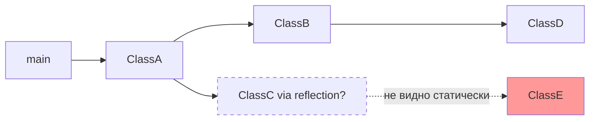

# Вопросы на собеседовании: `GraalVM Native Image`

`GraalVM Native Image` — технология компиляции Java-приложений в нативные исполняемые файлы без JVM на runtime. Spring Boot 3 предоставляет first-class поддержку через AOT-процессор, что даёт мгновенный старт и малый footprint в облаке.

Дата последнего обновления: 2026-04-20

## Полезные ссылки

### Официальная документация

- [Spring Boot Native](https://docs.spring.io/spring-boot/docs/current/reference/html/native-image.html) — официальная документация Spring Boot Native
- [GraalVM Native Image Docs](https://www.graalvm.org/latest/reference-manual/native-image/) — документация GraalVM
- [Baeldung: Spring Native](https://www.baeldung.com/spring-native-intro) — практическое введение

## Содержание

- [Полезные ссылки](#полезные-ссылки)
- [See also](#see-also)

**Основы**
- [Q1. (!) Что такое GraalVM Native Image?](#q1--что-такое-graalvm-native-image)
- [Q2. (!) Чем AOT отличается от JIT компиляции?](#q2--чем-aot-отличается-от-jit-компиляции)
- [Q3. Что такое Closed World Assumption?](#q3-что-такое-closed-world-assumption)
- [Q4. Как GraalVM строит граф достижимости?](#q4-как-graalvm-строит-граф-достижимости)

**Native Image vs JVM**
- [Q5. (!) Чем Native Image отличается от JVM по характеристикам?](#q5--чем-native-image-отличается-от-jvm-по-характеристикам)
- [Q6. В каких сценариях Native Image предпочтительнее JVM?](#q6-в-каких-сценариях-native-image-предпочтительнее-jvm)

**Spring Boot AOT**
- [Q7. (!) Как Spring Boot 3 поддерживает Native Image?](#q7--как-spring-boot-3-поддерживает-native-image)
- [Q8. Что такое AOT-процессинг в Spring Boot?](#q8-что-такое-aot-процессинг-в-spring-boot)
- [Q9. Как собрать Spring Boot приложение как Native Image?](#q9-как-собрать-spring-boot-приложение-как-native-image)

**Ограничения и конфигурация**
- [Q10. (!) Какие ограничения у Native Image?](#q10--какие-ограничения-у-native-image)
- [Q11. Как зарегистрировать рефлексию для Native Image?](#q11-как-зарегистрировать-рефлексию-для-native-image)
- [Q12. Что такое RuntimeHints в Spring?](#q12-что-такое-runtimehints-в-spring)
- [Q13. Как работают JSON-конфигурации для native-image?](#q13-как-работают-json-конфигурации-для-native-image)

**Тестирование и отладка**
- [Q14. Как тестировать Spring Boot Native приложения?](#q14-как-тестировать-spring-boot-native-приложения)
- [Q15. Как тестировать RuntimeHints?](#q15-как-тестировать-runtimehints)

## Q1. (!) Что такое GraalVM Native Image?

`GraalVM Native Image` — это технология, которая компилирует Java-приложение в **самодостаточный нативный исполняемый файл** заранее, на этапе сборки. Вместо того чтобы грузить байткод в JVM и компилировать его в машинный код в рантайме, native-image делает всю компиляцию заранее (AOT) и упаковывает результат в один бинарник.

Ключевая идея: на машине, где запускается приложение, **JVM уже не нужна** — она встроена внутрь бинарника в минимально необходимом виде.

Внутрь бинарника попадает:
- машинный код приложения и всех зависимостей (скомпилированный заранее под целевую архитектуру — x86_64, ARM64);
- **Substrate VM** — урезанный рантайм: сборщик мусора, управление потоками, обработка исключений (это и есть «встроенная JVM»).

```bash
# Обычный запуск (нужна JVM)
java -jar app.jar

# Native Image запуск (не нужна JVM)
./app
```

**За что его выбирают:**
- старт за 10-100 мс вместо 3-10 с у JVM — нет загрузки классов и прогрева JIT;
- потребление RAM в 2-5 раз меньше — нет метаданных классов и инфраструктуры JIT;
- маленький контейнер — образ собирается «с нуля» (from scratch), без JRE внутри;
- предсказуемая задержка с первого запроса — нет JIT-разогрева, производительность стабильна сразу.

**Цена за это** (важно назвать на собеседовании): долгая сборка (минуты вместо секунд) и ограничения на динамику Java — рефлексию, прокси, динамическую загрузку классов нужно объявлять заранее (см. Q3, Q10).

## Q2. (!) Чем AOT отличается от JIT компиляции?

Разница в **моменте компиляции** байткода в машинный код. JIT (Just-In-Time) компилирует во время работы приложения, AOT (Ahead-Of-Time) — заранее, на этапе сборки. Из этого вытекают все остальные отличия.

| Аспект | JIT (Just-In-Time) | AOT (Ahead-Of-Time) |
|---|---|---|
| Когда компилируется | В runtime | До запуска |
| Оптимизации | Профиль реального выполнения | Статический анализ |
| Warmup | Нужен (пик через 1-5 мин) | Нет (максимум сразу) |
| Пиковая производительность | Выше (adaptive optimization) | Ниже (статические оптимизации) |
| Startup time | Секунды | Миллисекунды |
| Потребление памяти | Больше (metadata JVM) | Меньше |
| Динамические возможности | Полные | Ограниченные |

**Почему у JIT выше пиковая производительность.** JIT видит, как код реально выполняется: какие методы «горячие», какие ветки `if` берутся чаще, какие типы приходят в полиморфные вызовы. На основе этого профиля он применяет агрессивные оптимизации — adaptive inlining, escape analysis, speculative optimizations — и при необходимости деоптимизирует код, если предположение оказалось неверным. AOT работает по статическому анализу и такой картины выполнения не имеет, поэтому его оптимизации консервативнее.

**Почему AOT стартует за миллисекунды.** Машинный код уже готов, классы загружать и верифицировать не нужно, прогрев не требуется — приложение сразу работает на максимуме доступной ему производительности (которая ниже разогретого JIT, но достигается мгновенно).

**Когда что выбирать:**
- **JIT** — долгоживущие сервисы под высокой нагрузкой, где успевает окупиться разогрев и важна пиковая throughput.
- **AOT** — serverless и Lambda (критичен cold start, платишь за время), сотни мелких инстансов (критична RAM), CLI-утилиты (нужен мгновенный отклик), edge computing (ограниченные ресурсы).

## Q3. Что такое Closed World Assumption?

`Closed World Assumption` (допущение замкнутого мира) — это фундаментальное условие GraalVM: **весь код, который может выполниться, должен быть известен на этапе сборки**. Ничего нельзя «дозагрузить» или сгенерировать в рантайме.

**Зачем это нужно.** Именно благодаря этому допущению native-image может выкинуть из бинарника всё лишнее. Он строит граф достижимости (reachability analysis) от точки входа и включает только те классы и методы, до которых реально можно дойти. Невидимый для статического анализа код просто не попадает в бинарник — отсюда и компактность, и быстрый старт.

Обратная сторона: всё, что в Java делается динамически, статический анализ «не видит», поэтому такие вещи запрещены без явной регистрации:
- динамическая загрузка классов (`Class.forName` без регистрации);
- рефлексия — только по заранее зарегистрированным классам;
- динамические прокси без регистрации;
- сканирование classpath в рантайме.

**Пример проблемы:**
```java
// Это НЕ работает в Native Image без конфигурации
String className = readFromConfig("my.class.name");
Class<?> clazz = Class.forName(className); // ClassNotFoundException в runtime
```

Имя класса читается из конфига в рантайме — на этапе сборки оно неизвестно, поэтому нужный класс в граф достижимости не попал и в бинарник не включён.

**Решение:** заранее объявить эти классы через `RuntimeHints` или JSON-конфиг (см. Q11), чтобы native-image знал о них на этапе сборки.

## Q4. Как GraalVM строит граф достижимости?

`native-image` выполняет **статический анализ от точки входа** (points-to analysis): он не угадывает, что может понадобиться, а строго прослеживает, что реально вызывается.

1. Стартует от метода `main()` (плюс явно зарегистрированные точки входа).
2. Рекурсивно обходит все достижимые вызовы методов, обращения к полям и классам.
3. Строит граф всего достижимого кода.
4. В бинарник включает только то, что попало в граф; всё остальное отбрасывается.

Поэтому проблема — не «класс отсутствует», а **«анализ не увидел, что класс используется»**. Если до класса можно дойти только через рефлексию или динамику, статический обход о нём не узнает.



На схеме `ClassE` достижим только через рефлексию из `ClassC` (пунктир) — статический анализ этой связи не видит, класс выпадает из графа, и в рантайме вылетит `ClassNotFoundException`.

Руками отследить все рефлексивные вызовы тяжело, поэтому есть **Native Image Tracing Agent**: он запускается вместе с приложением на обычной JVM, наблюдает за реальными рефлексивными обращениями во время прогона и записывает их в JSON-конфиги.

```bash
java -agentlib:native-image-agent=config-output-dir=src/main/resources/META-INF/native-image \
     -jar app.jar
# Запускаем приложение, проходим все пути → агент записывает JSON конфиги
```

**Важный нюанс:** агент видит только те пути, которые реально выполнились во время прогона. Если какой-то сценарий не задействован — соответствующая рефлексия в конфиг не попадёт. Поэтому прогонять нужно полноценный набор сценариев (тесты, smoke-тест), а не один happy path.

## Q5. (!) Чем Native Image отличается от JVM по характеристикам?

Коротко: **Native Image выигрывает старт, память и размер образа, но проигрывает пиковую производительность и время сборки**. Это прямое следствие AOT-компиляции — нет JIT, который разгоняет долгоживущий сервис, зато нет и его накладных расходов.

**Реальные показатели Spring Boot приложения:**

| Метрика | JVM | Native Image |
|---|---|---|
| Startup time | ~3-10 с | ~50-200 мс |
| Heap (idle) | ~250-400 MB | ~50-100 MB |
| Docker image size | ~200 MB (JRE) | ~50-80 MB |
| Пиковый throughput | Выше (+20-50% после warmup) | Ниже |
| Latency (p99 hot) | Ниже после warmup | Немного выше |
| Время сборки | ~30 с | ~3-5 мин |

**Как это читать:** старт быстрее в десятки раз, RAM и образ — в 2-5 раз меньше. Но под устойчивой нагрузкой разогретая JVM обгоняет native на 20-50% по throughput и держит лучше p99. То есть выбор — это **компромисс**: мгновенный старт и экономия ресурсов против пиковой производительности долгоживущего сервиса (см. Q6, когда что важнее).

## Q6. В каких сценариях Native Image предпочтительнее JVM?

Главный критерий выбора — **что для нагрузки дороже: быстрый старт и память или пиковая throughput**. Где приложения часто стартуют и/или живут недолго — выигрывает Native; где сервис работает месяцами под постоянной нагрузкой — выигрывает JVM.

**Выбирай Native Image, когда важен старт и экономия ресурсов:**
- **Serverless / AWS Lambda** — холодный старт напрямую влияет и на латентность, и на счёт (платишь за время выполнения);
- **Kubernetes с auto-scaling** — новые поды поднимаются мгновенно, масштабирование реагирует быстрее;
- **Сотни мелких инстансов** — экономия RAM на каждом превращается в ощутимую экономию денег;
- **CLI-утилиты** — мгновенный отклик без задержки на старт JVM;
- **Edge computing** — жёсткие ограничения по ресурсам.

**Выбирай JVM, когда важна пиковая производительность или динамика:**
- **Долгоживущие сервисы под высокой нагрузкой** — JIT успевает разогреться и даёт лучший throughput;
- **Тяжёлая рефлексия и динамика** — Hibernate, динамические прокси, генерация байткода в рантайме требуют много hints и плохо совместимы с closed-world;
- **Быстрая итерация в разработке** — пересборка native занимает минуты, что убивает скорость цикла правка-проверка.

## Q7. (!) Как Spring Boot 3 поддерживает Native Image?

Spring Boot 3 даёт **first-class поддержку native «из коробки»**. Идея в том, чтобы взять всё, что обычный Spring делает при старте динамически (сканирование classpath, создание прокси, рефлексия), и перенести это на этап сборки — туда, где native-image сможет это увидеть.

Поддержка стоит на четырёх частях:

1. **Spring AOT Engine** — анализирует контекст и генерирует исходный код вместо рантайм-магии (см. Q8);
2. **GraalVM Native Build Tools** — Maven/Gradle-плагины, которые запускают `native-image` как часть сборки (см. Q9);
3. **RuntimeHints API** — декларативный Java-API для регистрации рефлексии, ресурсов и прокси (см. Q12);
4. **Готовые hints для экосистемы** — большинство стандартных стартеров Spring уже поставляют свои hints, поэтому типовое приложение собирается в native без ручной настройки.

**Архитектура AOT в Spring Boot 3:**
```
Build time:
  Source code
       ↓
  Spring AOT Processing    ← анализирует context, генерирует hints
       ↓
  Generated Sources (reflection-config.json, proxies, factories)
       ↓
  GraalVM native-image tool
       ↓
  Native Executable
```

## Q8. Что такое AOT-процессинг в Spring Boot?

**AOT-процессинг** — это этап сборки, на котором Spring Boot полностью поднимает `ApplicationContext` (как при старте), смотрит, какие бины и как создаются, и «застывает» этот результат в виде сгенерированного кода и метаданных. По сути, дорогая работа старта выполняется один раз на сборке, а не каждый раз при запуске.

На выходе AOT генерирует:
- pre-computed код `BeanFactory` — определения бинов уже известны, classpath-сканирование в рантайме не нужно;
- `RuntimeHints` для рефлексии, ресурсов и прокси (чтобы native-image их увидел);
- конфиги сериализации;
- JSON-конфиги для native (reflection / proxy).

```java
// Обычный Spring Boot — всё в runtime
@SpringBootApplication
public class App {
    public static void main(String[] args) {
        SpringApplication.run(App.class, args); // classpath scan, proxy creation...
    }
}

// В Native Image — AOT генерирует класс вида:
// AppContextInitializer.java — содержит pre-computed bean definitions
// Startup: просто регистрация уже известных bean'ов
```

**Подводный камень AOT:** поскольку контекст «застывает» на сборке, условия `@ConditionalOnProperty`, `@Profile` и зависящие от окружения бины вычисляются именно тогда — на build-time, а не при запуске. Профиль фактически «вшивается» в бинарник, и сменить его в рантайме без пересборки нельзя.

## Q9. Как собрать Spring Boot приложение как Native Image?

Сборка идёт в два шага: сначала Spring AOT генерирует код и hints, затем плагин запускает `native-image`, который компилирует всё в бинарник. На практике обоими шагами управляет один плагин — нужно лишь подключить его и вызвать нужную команду.

**Требования:**
- GraalVM 22+ (или `native-image` в PATH);
- Spring Boot 3.x;
- `native-maven-plugin` или `native-gradle-plugin`.

**Maven — pom.xml:**
```xml
<parent>
    <groupId>org.springframework.boot</groupId>
    <artifactId>spring-boot-starter-parent</artifactId>
    <version>3.2.0</version>
</parent>

<profiles>
    <profile>
        <id>native</id>
        <build>
            <plugins>
                <plugin>
                    <groupId>org.graalvm.buildtools</groupId>
                    <artifactId>native-maven-plugin</artifactId>
                    <executions>
                        <execution>
                            <id>build-native</id>
                            <goals><goal>compile-no-fork</goal></goals>
                            <phase>package</phase>
                        </execution>
                    </executions>
                </plugin>
            </plugins>
        </build>
    </profile>
</profiles>
```

**Команды сборки:**
```bash
# Maven
mvn clean package -Pnative

# Gradle
./gradlew nativeCompile

# Docker (без локального GraalVM — через buildpack)
mvn spring-boot:build-image -Pnative
# Результат: Docker образ с нативным бинарником
```

**Рекомендация:** вариант через `build-image` (buildpack) удобен на CI — он не требует устанавливать GraalVM на агента, всё происходит внутри контейнера сборки, а на выходе сразу готовый образ.

## Q10. (!) Какие ограничения у Native Image?

Почти все ограничения растут из одного корня — **closed world assumption** (Q3): всё динамическое, что статический анализ не может увидеть на сборке, по умолчанию запрещено и требует явной регистрации.

**Главные ограничения:**

| Ограничение | Описание | Решение |
|---|---|---|
| Reflection | `Class.forName`, `Method.invoke` без регистрации | `RuntimeHints` / JSON конфиги |
| Dynamic Proxy | `Proxy.newProxyInstance` | `RuntimeHints.proxies()` |
| Class loading | Нельзя загружать классы в runtime | Только предрегистрированные |
| Serialization | Java serialization требует регистрации | `RuntimeHints.serialization()` |
| @Profile | Профили фиксируются на build-time | Пересборка для смены профиля |
| @ConditionalOn* | Условия вычисляются на build-time | Фиксированные свойства |
| Mockito | Не работает в native tests | Используй `@MockBean` с Spring context |
| JVMTI агенты | Profilers, debuggers на базе JVMTI | Нативные отладчики (gdb, lldb) |
| Время сборки | 3-5 минут | Неизбежно |

**Совместимость популярных библиотек** (закономерность: чем больше библиотека опирается на рантайм-динамику, тем сложнее с native):
- `Hibernate` — требует регистрации всех entity для рефлексии; стартеры Spring Data JPA уже поставляют нужные hints, поэтому через Spring обычно заводится;
- `Jackson` — работает, но кастомные сериализаторы/десериализаторы могут требовать hints;
- `Lombok` — работает без проблем, потому что это compile-time-генерация: к рантайму это уже обычный сгенерированный код, динамики нет.

## Q11. Как зарегистрировать рефлексию для Native Image?

Зарегистрировать рефлексию — значит **явно сообщить native-image, какие классы и члены понадобятся динамически**, чтобы он не выкинул их из бинарника. Есть три способа, от низкоуровневого к удобному.

**Способ 1: JSON-конфигурация** (`reflect-config.json`) — низкоуровневый, родной для GraalVM. Подходит когда нет Spring или нужно донастроить чужую библиотеку:
```json
// src/main/resources/META-INF/native-image/reflect-config.json
[
  {
    "name": "com.example.MyClass",
    "allDeclaredConstructors": true,
    "allPublicMethods": true,
    "allDeclaredFields": true
  },
  {
    "name": "com.example.dto.UserDto",
    "allDeclaredFields": true,
    "allPublicConstructors": true
  }
]
```

**Способ 2: `RuntimeHintsRegistrar` (Spring Boot 3, рекомендуемый)** — типобезопасный Java-API вместо ручного JSON. Один регистратор покрывает рефлексию, ресурсы, прокси и сериализацию:
```java
@Configuration
@ImportRuntimeHints(MyRuntimeHints.class)
public class MyConfig {
    // ...
}

class MyRuntimeHints implements RuntimeHintsRegistrar {
    @Override
    public void registerHints(RuntimeHints hints, ClassLoader classLoader) {
        // Рефлексия
        hints.reflection()
            .registerType(MyClass.class,
                MemberCategory.INVOKE_DECLARED_CONSTRUCTORS,
                MemberCategory.INVOKE_PUBLIC_METHODS);

        // Ресурсы
        hints.resources()
            .registerPattern("templates/*.html");

        // Proxy
        hints.proxies()
            .registerJdkProxy(MyInterface.class);

        // Сериализация
        hints.serialization()
            .registerType(MySerializable.class);
    }
}
```

**Способ 3: `@RegisterReflectionForBinding` (самый короткий, для DTO/entity)** — частый случай: классы нужны только для сериализации/десериализации (тело запроса, ответ). Тогда вместо целого регистратора достаточно одной аннотации:
```java
@RegisterReflectionForBinding({UserDto.class, OrderDto.class})
@RestController
public class UserController { ... }
```

**Эмпирическое правило:** для своих DTO/entity начинай со способа 3, для нетривиальных случаев (ресурсы, прокси) бери способ 2, к голому JSON (способ 1) спускайся только когда Spring-обёртки не хватает.

## Q12. Что такое RuntimeHints в Spring?

`RuntimeHints` — это **единый Java-API Spring Boot 3 для объявления всего, что native-image должен знать заранее**: какие классы доступны через рефлексию, какие ресурсы лежат в classpath, какие прокси создаются. По сути, он заменяет набор разрозненных JSON-конфигов GraalVM одной типобезопасной точкой настройки.

Чем это лучше JSON: компилятор проверяет типы, рефакторинг переименует классы автоматически, а вся конфигурация native собрана в одном месте, а не размазана по `META-INF`.

API сгруппирован по видам метаданных — `reflection()`, `resources()`, `proxies()`, `serialization()`:

```java
public class ApplicationRuntimeHints implements RuntimeHintsRegistrar {
    @Override
    public void registerHints(RuntimeHints hints, ClassLoader classLoader) {
        // Регистрация для рефлексии
        hints.reflection()
            .registerField(PropertyNamingStrategies.class, "SNAKE_CASE")
            .registerConstructor(
                MyService.class.getDeclaredConstructors()[0],
                ExecutableMode.INVOKE);

        // Регистрация ресурсов (classpath files)
        hints.resources()
            .registerPattern("graphql/**/*.graphqls")
            .registerResourceBundle("messages");

        // JDK proxy
        hints.proxies()
            .registerJdkProxy(UserRepository.class);

        // CGLIB proxy (Spring AOP)
        hints.proxies()
            .registerJdkProxy(MyService.class, SpringProxy.class, Advised.class);
    }
}
```

**Как Spring подхватывает регистратор.** В приложении достаточно `@ImportRuntimeHints` (см. Q11). Но для библиотеки, которая поставляет hints всем потребителям, регистратор объявляют декларативно в `aot.factories` — тогда Spring найдёт его автоматически при AOT-обработке:
```
# src/main/resources/META-INF/spring/aot.factories
org.springframework.aot.hint.RuntimeHintsRegistrar=\
  com.example.ApplicationRuntimeHints
```

## Q13. Как работают JSON-конфигурации для native-image?

Это **родной механизм GraalVM** (тот, что Spring `RuntimeHints` оборачивает в Java-API). На этапе сборки native-image читает JSON-файлы из `META-INF/native-image/`, и каждый файл отвечает за свой вид метаданных:
- `reflect-config.json` — классы и члены для рефлексии;
- `proxy-config.json` — динамические прокси;
- `resource-config.json` — ресурсы classpath;
- `serialization-config.json` — сериализация;
- `jni-config.json` — вызовы через JNI.

Писать их руками для чужих библиотек больно, поэтому на практике их **генерирует Tracing Agent** — это основной способ для legacy-зависимостей без своих hints. Принцип тот же, что в Q4: запускаем приложение с агентом на JVM, прогоняем все сценарии, агент записывает реально использованную динамику в JSON.

```bash
# 1. Запустить приложение с агентом
java -agentlib:native-image-agent=config-output-dir=target/native-image-configs \
     -jar app.jar

# 2. Выполнить все code paths (тесты, smoke test)
# 3. Агент сгенерирует все конфиги автоматически

# 4. Скопировать в src/main/resources/META-INF/native-image/
cp target/native-image-configs/*.json \
   src/main/resources/META-INF/native-image/
```

## Q14. Как тестировать Spring Boot Native приложения?

Тестирование делится на два уровня. **Обычные unit-тесты гоняются на JVM и не меняются** — они проверяют логику, а не native-сборку. Отдельно есть **native-тесты**, которые компилируют приложение в бинарник и прогоняют тесты прямо на нём — это единственный способ поймать проблемы, проявляющиеся только в native (нехватка hints, рефлексия).

```bash
mvn -Pnative test          # Maven
./gradlew nativeTest       # Gradle
```

**Подводный камень native-тестов — Mockito.** `Mockito.mock()` генерирует моки через байткод в рантайме, а это ровно то, что closed world запрещает, — в native такой мок не создастся. Поэтому:
- вместо `Mockito.mock()` используй `@MockBean` — Spring подменяет бин в контексте без рантайм-генерации, и это работает;
- связки `@SpringBootTest` + `@AutoConfigureMockMvc` работают штатно.

```java
@SpringBootTest
class UserControllerNativeTest {
    @Autowired
    MockMvc mockMvc;

    @MockBean  // OK — Spring proxy, не Mockito bytegen
    UserService userService;

    @Test
    void shouldReturnUser() throws Exception {
        given(userService.find(1L)).willReturn(new User(1L, "Alice"));
        mockMvc.perform(get("/users/1"))
            .andExpect(status().isOk());
    }
}
```

## Q15. Как тестировать RuntimeHints?

Главная проблема native-тестов — они медленные (минуты на компиляцию). Spring Boot решает её для hints: класс `RuntimeHintsPredicates` позволяет **проверить, что нужные hints зарегистрированы, обычным быстрым JVM-тестом, без полной native-сборки**.

Идея проста: создаём пустой `RuntimeHints`, прогоняем через него свой регистратор и затем спрашиваем предикатом, попал ли туда нужный класс/поле/ресурс.

```java
class MyRuntimeHintsTest {

    @Test
    void shouldRegisterSnakeCaseField() {
        RuntimeHints hints = new RuntimeHints();
        new MyRuntimeHints().registerHints(hints, getClass().getClassLoader());

        // Проверяем, что поле зарегистрировано для рефлексии
        assertThat(RuntimeHintsPredicates.reflection()
            .onField(PropertyNamingStrategies.class, "SNAKE_CASE"))
            .accepts(hints);
    }

    @Test
    void shouldRegisterResource() {
        RuntimeHints hints = new RuntimeHints();
        new MyRuntimeHints().registerHints(hints, getClass().getClassLoader());

        assertThat(RuntimeHintsPredicates.resource()
            .forResource("templates/email.html"))
            .accepts(hints);
    }
}
```

**Зачем это нужно:** такой тест ловит забытую регистрацию за секунды, а не после многоминутной native-сборки, которая упала бы с `ClassNotFoundException`. То есть hints проверяются дёшево на JVM, а полная native-компиляция остаётся для финальной проверки.

---

## See also

- [JVM](jvm-interview.md) — как работает JVM: ClassLoader, JIT, GC, memory model
- [JVM Performance Tuning](../performance/jvm-performance-tuning-interview.md) — JIT оптимизации, GC tuning — противоположность native
- [Spring Boot](../frameworks/spring/spring-boot-interview.md) — auto-configuration, Spring Boot 3 features
- [Spring Framework](../frameworks/spring/spring-framework-interview.md) — AOT context и BeanFactory в Spring 6
- [Java 17-21](../programming-languages/java/java-17-21-interview.md) — Java 17 требование для Spring Boot 3, virtual threads
- [Virtual Threads](../programming-languages/java/java-virtual-threads-interview.md) — альтернатива native для снижения resource overhead
- [Kubernetes](../devops/kubernetes-interview.md) — развёртывание native контейнеров с fast startup
- [Docker](../devops/docker-interview.md) — minimal Docker images для native executables
- [Cloud Native Patterns](../cloud/cloud-native-patterns-interview.md) — паттерны для cloud где native image выигрывает
- [Micrometer](../monitoring/micrometer-interview.md) — observability в native Spring Boot приложениях
