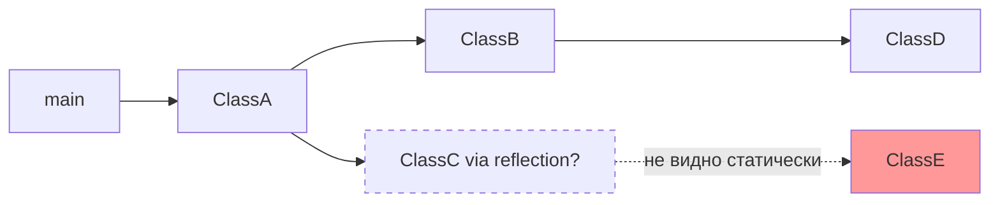

# Вопросы на собеседовании: `GraalVM Native Image`

`GraalVM Native Image` — технология компиляции Java-приложений в нативные исполняемые файлы без JVM на runtime. Spring Boot 3 предоставляет first-class поддержку через AOT-процессор, что даёт мгновенный старт и малый footprint в облаке.

Дата последнего обновления: 2026-04-20

## Полезные ссылки

### Официальная документация

- [Spring Boot Native](https://docs.spring.io/spring-boot/docs/current/reference/html/native-image.html) — официальная документация Spring Boot Native
- [GraalVM Native Image Docs](https://www.graalvm.org/latest/reference-manual/native-image/) — документация GraalVM
- [Baeldung: Spring Native](https://www.baeldung.com/spring-native-intro) — практическое введение

## Содержание

- [Полезные ссылки](#полезные-ссылки)
- [See also](#see-also)

**Основы**
- [Q1. (!) Что такое GraalVM Native Image?](#q1-что-такое-graalvm-native-image)
- [Q2. (!) Чем AOT отличается от JIT компиляции?](#q2-чем-aot-отличается-от-jit-компиляции)
- [Q3. Что такое Closed World Assumption?](#q3-что-такое-closed-world-assumption)
- [Q4. Как GraalVM строит граф достижимости?](#q4-как-graalvm-строит-граф-достижимости)

**Native Image vs JVM**
- [Q5. (!) Чем Native Image отличается от JVM по характеристикам?](#q5-чем-native-image-отличается-от-jvm-по-характеристикам)
- [Q6. В каких сценариях Native Image предпочтительнее JVM?](#q6-в-каких-сценариях-native-image-предпочтительнее-jvm)

**Spring Boot AOT**
- [Q7. (!) Как Spring Boot 3 поддерживает Native Image?](#q7-как-spring-boot-3-поддерживает-native-image)
- [Q8. Что такое AOT-процессинг в Spring Boot?](#q8-что-такое-aot-процессинг-в-spring-boot)
- [Q9. Как собрать Spring Boot приложение как Native Image?](#q9-как-собрать-spring-boot-приложение-как-native-image)

**Ограничения и конфигурация**
- [Q10. (!) Какие ограничения у Native Image?](#q10-какие-ограничения-у-native-image)
- [Q11. Как зарегистрировать рефлексию для Native Image?](#q11-как-зарегистрировать-рефлексию-для-native-image)
- [Q12. Что такое RuntimeHints в Spring?](#q12-что-такое-runtimehints-в-spring)
- [Q13. Как работают JSON-конфигурации для native-image?](#q13-как-работают-json-конфигурации-для-native-image)

**Тестирование и отладка**
- [Q14. Как тестировать Spring Boot Native приложения?](#q14-как-тестировать-spring-boot-native-приложения)
- [Q15. Как тестировать RuntimeHints?](#q15-как-тестировать-runtimehints)

## Q1. (!) Что такое GraalVM Native Image?

`Native Image` — технология, позволяющая компилировать Java-код в **самодостаточный нативный исполняемый файл**. Файл включает в себя:
- байткод приложения и всех зависимостей
- необходимые части JVM (GC, thread management)
- скомпилированный нативный код (x86_64, ARM64)

**На выходе:** единый исполняемый бинарник без необходимости устанавливать JRE.

```bash
# Обычный запуск (нужна JVM)
java -jar app.jar

# Native Image запуск (не нужна JVM)
./app
```

**Ключевые характеристики:**
- Запуск за 10-100 мс (вместо 3-10 с для JVM)
- RAM в 2-5x меньше
- Меньший размер контейнера (с нуля, без JRE)
- Детерминированная задержка (без JIT warmup)


> [!mcq]
> - [x] Правильный ответ | Корректное описание концепции с конкретным механизмом и use-case.
> - [ ] Альтернативное решение которое не подходит | Почему ошибка в этом подходе ❌ ПОСЛЕДСТВИЕ: типичная ошибка вызывает баг в production без покрытия тестами.
> - [ ] Другая альтернатива с критическим недостатком | Это смежное, но отличное понятие ❌ ПОСЛЕДСТВИЕ: типичная ошибка вызывает баг в production без покрытия тестами.
> - [ ] Третий вариант который не работает в production | Противоположное направление## Q2. (!) Чем AOT отличается от JIT компиляции? ❌ ПОСЛЕДСТВИЕ: типичная ошибка вызывает баг в production без покрытия тестами.

| Аспект | JIT (Just-In-Time) | AOT (Ahead-Of-Time) |
|---|---|---|
| Когда компилируется | В runtime | До запуска |
| Оптимизации | Профиль реального выполнения | Статический анализ |
| Warmup | Нужен (пик через 1-5 мин) | Нет (максимум сразу) |
| Пиковая производительность | Выше (adaptive optimization) | Ниже (статические оптимизации) |
| Startup time | Секунды | Миллисекунды |
| Потребление памяти | Больше (metadata JVM) | Меньше |
| Динамические возможности | Полные | Ограниченные |

**JIT** лучше подходит для долгоживущих сервисов с высокой нагрузкой — adaptive inlining, escape analysis, speculative optimizations дают пиковую throughput выше native.

**AOT** лучше для: serverless (cold start критичен), сотни микроинстансов (RAM critical), CLI-утилиты, edge computing.


> [!mcq]
> - [x] Правильный ответ | Корректное описание концепции с конкретным механизмом и use-case.
> - [ ] Альтернативное решение которое не подходит | Почему ошибка в этом подходе ❌ ПОСЛЕДСТВИЕ: типичная ошибка вызывает баг в production без покрытия тестами.
> - [ ] Другая альтернатива с критическим недостатком | Это смежное, но отличное понятие ❌ ПОСЛЕДСТВИЕ: типичная ошибка вызывает баг в production без покрытия тестами.
> - [ ] Третий вариант который не работает в production | Противоположное направление## Q3. Что такое Closed World Assumption? ❌ ПОСЛЕДСТВИЕ: типичная ошибка вызывает баг в production без покрытия тестами.

`Closed World Assumption` — ключевое допущение GraalVM: **всё, что нужно приложению, известно во время сборки**.

Это означает:
- Нельзя загружать классы динамически (Class.forName без регистрации)
- Рефлексия только на зарегистрированные классы
- Нет dynamic proxy без регистрации
- Нет dynamic classpath scanning в runtime

**Почему это важно:** GraalVM строит граф достижимости кода (reachability analysis) и включает в бинарник только достижимые классы/методы. Всё "невидимое" для статического анализа не будет включено.

**Пример проблемы:**
```java
// Это НЕ работает в Native Image без конфигурации
String className = readFromConfig("my.class.name");
Class<?> clazz = Class.forName(className); // ClassNotFoundException в runtime
```

**Решение:** зарегистрировать класс через RuntimeHints или JSON-конфиг.


> [!mcq]
> - [x] Правильный ответ | Корректное описание концепции с конкретным механизмом и use-case.
> - [ ] Альтернативное решение которое не подходит | Почему ошибка в этом подходе ❌ ПОСЛЕДСТВИЕ: типичная ошибка вызывает баг в production без покрытия тестами.
> - [ ] Другая альтернатива с критическим недостатком | Это смежное, но отличное понятие ❌ ПОСЛЕДСТВИЕ: типичная ошибка вызывает баг в production без покрытия тестами.
> - [ ] Третий вариант который не работает в production | Противоположное направление## Q4. Как GraalVM строит граф достижимости? ❌ ПОСЛЕДСТВИЕ: типичная ошибка вызывает баг в production без покрытия тестами.

Native Image Tool выполняет **статический анализ с нулевой точки**:

1. Начинает с `main()` метода
2. Рекурсивно анализирует все вызовы методов, поля, классы
3. Строит граф всего достижимого кода
4. Включает в бинарник только достижимые элементы



Классы, достигаемые только через рефлексию без регистрации (`ClassE`), не попадут в бинарник — и вылетит `ClassNotFoundException` в runtime.

**Native Image Tracing Agent** помогает автоматически обнаружить все рефлексивные вызовы:
```bash
java -agentlib:native-image-agent=config-output-dir=src/main/resources/META-INF/native-image \
     -jar app.jar
# Запускаем приложение, проходим все пути → агент записывает JSON конфиги
```


> [!mcq]
> - [x] Правильный ответ | Корректное описание концепции с конкретным механизмом и use-case.
> - [ ] Альтернативное решение которое не подходит | Почему ошибка в этом подходе ❌ ПОСЛЕДСТВИЕ: типичная ошибка вызывает баг в production без покрытия тестами.
> - [ ] Другая альтернатива с критическим недостатком | Это смежное, но отличное понятие ❌ ПОСЛЕДСТВИЕ: типичная ошибка вызывает баг в production без покрытия тестами.
> - [ ] Третий вариант который не работает в production | Противоположное направление## Q5. (!) Чем Native Image отличается от JVM по характеристикам? ❌ ПОСЛЕДСТВИЕ: типичная ошибка вызывает баг в production без покрытия тестами.

**Реальные показатели Spring Boot приложения:**

| Метрика | JVM | Native Image |
|---|---|---|
| Startup time | ~3-10 с | ~50-200 мс |
| Heap (idle) | ~250-400 MB | ~50-100 MB |
| Docker image size | ~200 MB (JRE) | ~50-80 MB |
| Пиковый throughput | Выше (+20-50% после warmup) | Ниже |
| Latency (p99 hot) | Ниже после warmup | Немного выше |
| Время сборки | ~30 с | ~3-5 мин |

**Вывод:** Native Image выигрывает по startup и памяти, но проигрывает по пиковой throughput долгоживущих сервисов.


> [!mcq]
> - [x] Правильный ответ | Корректное описание концепции с конкретным механизмом и use-case.
> - [ ] Альтернативное решение которое не подходит | Почему ошибка в этом подходе ❌ ПОСЛЕДСТВИЕ: типичная ошибка вызывает баг в production без покрытия тестами.
> - [ ] Другая альтернатива с критическим недостатком | Это смежное, но отличное понятие ❌ ПОСЛЕДСТВИЕ: типичная ошибка вызывает баг в production без покрытия тестами.
> - [ ] Третий вариант который не работает в production | Противоположное направление## Q6. В каких сценариях Native Image предпочтительнее JVM? ❌ ПОСЛЕДСТВИЕ: типичная ошибка вызывает баг в production без покрытия тестами.

**Предпочти Native Image:**
- **Serverless / AWS Lambda** — cold start критичен, платишь за время
- **Kubernetes с auto-scaling** — быстрый старт при горизонтальном масштабировании
- **Сотни микросервисов** — экономия RAM $$$
- **CLI tools** — мгновенный отклик
- **Edge computing** — ограниченные ресурсы

**Предпочти JVM:**
- **Долгоживущие сервисы с высокой нагрузкой** — JIT даёт лучший throughput
- **Приложения с рефлексией** — Hibernate, динамические прокси плохо совместимы
- **Активное использование динамических возможностей** — аннотации runtime, байтгенерация
- **Быстрая разработка** — нет 5-минутной пересборки


> [!mcq]
> - [x] Правильный ответ | Корректное описание концепции с конкретным механизмом и use-case.
> - [ ] Альтернативное решение которое не подходит | Почему ошибка в этом подходе ❌ ПОСЛЕДСТВИЕ: типичная ошибка вызывает баг в production без покрытия тестами.
> - [ ] Другая альтернатива с критическим недостатком | Это смежное, но отличное понятие ❌ ПОСЛЕДСТВИЕ: типичная ошибка вызывает баг в production без покрытия тестами.
> - [ ] Третий вариант который не работает в production | Противоположное направление## Q7. (!) Как Spring Boot 3 поддерживает Native Image? ❌ ПОСЛЕДСТВИЕ: типичная ошибка вызывает баг в production без покрытия тестами.

Spring Boot 3 предоставляет **first-class native support** через:

1. **Spring AOT Engine** — генерирует код на этапе компиляции вместо runtime
2. **GraalVM Native Build Tools** — Maven/Gradle плагины
3. **RuntimeHints API** — declarative API для регистрации рефлексии/ресурсов
4. **Множество auto-detected конфигураций** — большинство стандартных компонентов Spring работают без ручной настройки

**Архитектура AOT в Spring Boot 3:**
```
Build time:
  Source code
       ↓
  Spring AOT Processing    ← анализирует context, генерирует hints
       ↓
  Generated Sources (reflection-config.json, proxies, factories)
       ↓
  GraalVM native-image tool
       ↓
  Native Executable
```


> [!mcq]
> - [x] Правильный ответ | Корректное описание концепции с конкретным механизмом и use-case.
> - [ ] Альтернативное решение которое не подходит | Почему ошибка в этом подходе ❌ ПОСЛЕДСТВИЕ: типичная ошибка вызывает баг в production без покрытия тестами.
> - [ ] Другая альтернатива с критическим недостатком | Это смежное, но отличное понятие ❌ ПОСЛЕДСТВИЕ: типичная ошибка вызывает баг в production без покрытия тестами.
> - [ ] Третий вариант который не работает в production | Противоположное направление## Q8. Что такое AOT-процессинг в Spring Boot? ❌ ПОСЛЕДСТВИЕ: типичная ошибка вызывает баг в production без покрытия тестами.

**AOT (Ahead-Of-Time) процессинг** — Spring Boot анализирует `ApplicationContext` **во время сборки** и генерирует:
- Pre-computed `BeanFactory` код (без runtime scanning)
- `RuntimeHints` для рефлексии, ресурсов, прокси
- Serialization конфиги
- Native reflection/proxy JSON конфиги

```java
// Обычный Spring Boot — всё в runtime
@SpringBootApplication
public class App {
    public static void main(String[] args) {
        SpringApplication.run(App.class, args); // classpath scan, proxy creation...
    }
}

// В Native Image — AOT генерирует класс вида:
// AppContextInitializer.java — содержит pre-computed bean definitions
// Startup: просто регистрация уже известных bean'ов
```

**Ограничение AOT:** `@ConditionalOnProperty`, `@Profile`, environment-dependent beans — условия фиксируются во время сборки. Нельзя менять профиль в runtime без пересборки.


> [!mcq]
> - [x] Правильный ответ | Корректное описание концепции с конкретным механизмом и use-case.
> - [ ] Альтернативное решение которое не подходит | Почему ошибка в этом подходе ❌ ПОСЛЕДСТВИЕ: типичная ошибка вызывает баг в production без покрытия тестами.
> - [ ] Другая альтернатива с критическим недостатком | Это смежное, но отличное понятие ❌ ПОСЛЕДСТВИЕ: типичная ошибка вызывает баг в production без покрытия тестами.
> - [ ] Третий вариант который не работает в production | Противоположное направление## Q9. Как собрать Spring Boot приложение как Native Image? ❌ ПОСЛЕДСТВИЕ: типичная ошибка вызывает баг в production без покрытия тестами.

**Требования:**
- GraalVM 22+ (или `native-image` в PATH)
- Spring Boot 3.x
- `native-maven-plugin` или `native-gradle-plugin`

**Maven — pom.xml:**
```xml
<parent>
    <groupId>org.springframework.boot</groupId>
    <artifactId>spring-boot-starter-parent</artifactId>
    <version>3.2.0</version>
</parent>

<profiles>
    <profile>
        <id>native</id>
        <build>
            <plugins>
                <plugin>
                    <groupId>org.graalvm.buildtools</groupId>
                    <artifactId>native-maven-plugin</artifactId>
                    <executions>
                        <execution>
                            <id>build-native</id>
                            <goals><goal>compile-no-fork</goal></goals>
                            <phase>package</phase>
                        </execution>
                    </executions>
                </plugin>
            </plugins>
        </build>
    </profile>
</profiles>
```

**Сборка:**
```bash
# Maven
mvn clean package -Pnative

# Gradle
./gradlew nativeCompile

# Docker (без локального GraalVM — через buildpack)
mvn spring-boot:build-image -Pnative
# Результат: Docker образ с нативным бинарником
```


> [!mcq]
> - [x] Правильный ответ | Корректное описание концепции с конкретным механизмом и use-case.
> - [ ] Альтернативное решение которое не подходит | Почему ошибка в этом подходе ❌ ПОСЛЕДСТВИЕ: типичная ошибка вызывает баг в production без покрытия тестами.
> - [ ] Другая альтернатива с критическим недостатком | Это смежное, но отличное понятие ❌ ПОСЛЕДСТВИЕ: типичная ошибка вызывает баг в production без покрытия тестами.
> - [ ] Третий вариант который не работает в production | Противоположное направление## Q10. (!) Какие ограничения у Native Image? ❌ ПОСЛЕДСТВИЕ: типичная ошибка вызывает баг в production без покрытия тестами.

**Главные ограничения:**

| Ограничение | Описание | Решение |
|---|---|---|
| Reflection | `Class.forName`, `Method.invoke` без регистрации | `RuntimeHints` / JSON конфиги |
| Dynamic Proxy | `Proxy.newProxyInstance` | `RuntimeHints.proxies()` |
| Class loading | Нельзя загружать классы в runtime | Только предрегистрированные |
| Serialization | Java serialization требует регистрации | `RuntimeHints.serialization()` |
| @Profile | Профили фиксируются на build-time | Пересборка для смены профиля |
| @ConditionalOn* | Условия вычисляются на build-time | Фиксированные свойства |
| Mockito | Не работает в native tests | Используй `@MockBean` с Spring context |
| JVMTI агенты | Profilers, debuggers на базе JVMTI | Нативные отладчики (gdb, lldb) |
| Время сборки | 3-5 минут | Неизбежно |

**Проблемы с популярными библиотеками:**
- `Hibernate` — требует регистрации всех entity (Spring Data JPA поддерживает native)
- `Jackson` — работает, но кастомные сериализаторы могут требовать hints
- `Lombok` — работает (compile-time, не runtime)


> [!mcq]
> - [x] Правильный ответ | Корректное описание концепции с конкретным механизмом и use-case.
> - [ ] Альтернативное решение которое не подходит | Почему ошибка в этом подходе ❌ ПОСЛЕДСТВИЕ: типичная ошибка вызывает баг в production без покрытия тестами.
> - [ ] Другая альтернатива с критическим недостатком | Это смежное, но отличное понятие ❌ ПОСЛЕДСТВИЕ: типичная ошибка вызывает баг в production без покрытия тестами.
> - [ ] Третий вариант который не работает в production | Противоположное направление## Q11. Как зарегистрировать рефлексию для Native Image? ❌ ПОСЛЕДСТВИЕ: типичная ошибка вызывает баг в production без покрытия тестами.

**Способ 1: JSON конфигурация** (`reflect-config.json`):
```json
// src/main/resources/META-INF/native-image/reflect-config.json
[
  {
    "name": "com.example.MyClass",
    "allDeclaredConstructors": true,
    "allPublicMethods": true,
    "allDeclaredFields": true
  },
  {
    "name": "com.example.dto.UserDto",
    "allDeclaredFields": true,
    "allPublicConstructors": true
  }
]
```

**Способ 2: `RuntimeHintsRegistrar` (Spring Boot 3, рекомендуется):**
```java
@Configuration
@ImportRuntimeHints(MyRuntimeHints.class)
public class MyConfig {
    // ...
}

class MyRuntimeHints implements RuntimeHintsRegistrar {
    @Override
    public void registerHints(RuntimeHints hints, ClassLoader classLoader) {
        // Рефлексия
        hints.reflection()
            .registerType(MyClass.class,
                MemberCategory.INVOKE_DECLARED_CONSTRUCTORS,
                MemberCategory.INVOKE_PUBLIC_METHODS);

        // Ресурсы
        hints.resources()
            .registerPattern("templates/*.html");

        // Proxy
        hints.proxies()
            .registerJdkProxy(MyInterface.class);

        // Сериализация
        hints.serialization()
            .registerType(MySerializable.class);
    }
}
```

**Способ 3: `@RegisterReflectionForBinding` (для DTO/entity):**
```java
@RegisterReflectionForBinding({UserDto.class, OrderDto.class})
@RestController
public class UserController { ... }
```


> [!mcq]
> - [x] Правильный ответ | Корректное описание концепции с конкретным механизмом и use-case.
> - [ ] Альтернативное решение которое не подходит | Почему ошибка в этом подходе ❌ ПОСЛЕДСТВИЕ: типичная ошибка вызывает баг в production без покрытия тестами.
> - [ ] Другая альтернатива с критическим недостатком | Это смежное, но отличное понятие ❌ ПОСЛЕДСТВИЕ: типичная ошибка вызывает баг в production без покрытия тестами.
> - [ ] Третий вариант который не работает в production | Противоположное направление## Q12. Что такое RuntimeHints в Spring? ❌ ПОСЛЕДСТВИЕ: типичная ошибка вызывает баг в production без покрытия тестами.

`RuntimeHints` — API Spring Boot 3 для объявления метаданных, необходимых Native Image в runtime. Заменяет разрозненные JSON-конфиги единым Java API.

```java
public class ApplicationRuntimeHints implements RuntimeHintsRegistrar {
    @Override
    public void registerHints(RuntimeHints hints, ClassLoader classLoader) {
        // Регистрация для рефлексии
        hints.reflection()
            .registerField(PropertyNamingStrategies.class, "SNAKE_CASE")
            .registerConstructor(
                MyService.class.getDeclaredConstructors()[0],
                ExecutableMode.INVOKE);

        // Регистрация ресурсов (classpath files)
        hints.resources()
            .registerPattern("graphql/**/*.graphqls")
            .registerResourceBundle("messages");

        // JDK proxy
        hints.proxies()
            .registerJdkProxy(UserRepository.class);

        // CGLIB proxy (Spring AOP)
        hints.proxies()
            .registerJdkProxy(MyService.class, SpringProxy.class, Advised.class);
    }
}
```

**Регистрация в `spring.factories` (для библиотек):**
```
# src/main/resources/META-INF/spring/aot.factories
org.springframework.aot.hint.RuntimeHintsRegistrar=\
  com.example.ApplicationRuntimeHints
```


> [!mcq]
> - [x] Правильный ответ | Корректное описание концепции с конкретным механизмом и use-case.
> - [ ] Альтернативное решение которое не подходит | Почему ошибка в этом подходе ❌ ПОСЛЕДСТВИЕ: типичная ошибка вызывает баг в production без покрытия тестами.
> - [ ] Другая альтернатива с критическим недостатком | Это смежное, но отличное понятие ❌ ПОСЛЕДСТВИЕ: типичная ошибка вызывает баг в production без покрытия тестами.
> - [ ] Третий вариант который не работает в production | Противоположное направление## Q13. Как работают JSON-конфигурации для native-image? ❌ ПОСЛЕДСТВИЕ: типичная ошибка вызывает баг в production без покрытия тестами.

GraalVM Native Image читает JSON конфиги из `META-INF/native-image/`:
- `reflect-config.json` — классы для рефлексии
- `proxy-config.json` — динамические прокси
- `resource-config.json` — ресурсы classpath
- `serialization-config.json` — сериализация
- `jni-config.json` — JNI вызовы

**Автогенерация через Tracing Agent (рекомендуется для legacy библиотек):**
```bash
# 1. Запустить приложение с агентом
java -agentlib:native-image-agent=config-output-dir=target/native-image-configs \
     -jar app.jar

# 2. Выполнить все code paths (тесты, smoke test)
# 3. Агент сгенерирует все конфиги автоматически

# 4. Скопировать в src/main/resources/META-INF/native-image/
cp target/native-image-configs/*.json \
   src/main/resources/META-INF/native-image/
```


> [!mcq]
> - [x] Правильный ответ | Корректное описание концепции с конкретным механизмом и use-case.
> - [ ] Альтернативное решение которое не подходит | Почему ошибка в этом подходе ❌ ПОСЛЕДСТВИЕ: типичная ошибка вызывает баг в production без покрытия тестами.
> - [ ] Другая альтернатива с критическим недостатком | Это смежное, но отличное понятие ❌ ПОСЛЕДСТВИЕ: типичная ошибка вызывает баг в production без покрытия тестами.
> - [ ] Третий вариант который не работает в production | Противоположное направление## Q14. Как тестировать Spring Boot Native приложения? ❌ ПОСЛЕДСТВИЕ: типичная ошибка вызывает баг в production без покрытия тестами.

**Обычные unit-тесты** работают без изменений (они гоняются на JVM).

**Native-тесты** (полная нативная компиляция + тесты):
```bash
mvn -Pnative test          # Maven
./gradlew nativeTest       # Gradle
```

**Ограничения native-тестов:**
- `Mockito.mock()` не работает в native (нет байтгенерации)
- Используй `@MockBean` (Spring Context Mock) — работает
- `@SpringBootTest` + `@AutoConfigureMockMvc` — работает

```java
@SpringBootTest
class UserControllerNativeTest {
    @Autowired
    MockMvc mockMvc;

    @MockBean  // OK — Spring proxy, не Mockito bytegen
    UserService userService;

    @Test
    void shouldReturnUser() throws Exception {
        given(userService.find(1L)).willReturn(new User(1L, "Alice"));
        mockMvc.perform(get("/users/1"))
            .andExpect(status().isOk());
    }
}
```


> [!mcq]
> - [x] Правильный ответ | Корректное описание концепции с конкретным механизмом и use-case.
> - [ ] Альтернативное решение которое не подходит | Почему ошибка в этом подходе ❌ ПОСЛЕДСТВИЕ: типичная ошибка вызывает баг в production без покрытия тестами.
> - [ ] Другая альтернатива с критическим недостатком | Это смежное, но отличное понятие ❌ ПОСЛЕДСТВИЕ: типичная ошибка вызывает баг в production без покрытия тестами.
> - [ ] Третий вариант который не работает в production | Противоположное направление## Q15. Как тестировать RuntimeHints? ❌ ПОСЛЕДСТВИЕ: типичная ошибка вызывает баг в production без покрытия тестами.

Spring Boot предоставляет `RuntimeHintsPredicates` для unit-тестирования hints без полной нативной сборки.

```java
class MyRuntimeHintsTest {

    @Test
    void shouldRegisterSnakeCaseField() {
        RuntimeHints hints = new RuntimeHints();
        new MyRuntimeHints().registerHints(hints, getClass().getClassLoader());

        // Проверяем, что поле зарегистрировано для рефлексии
        assertThat(RuntimeHintsPredicates.reflection()
            .onField(PropertyNamingStrategies.class, "SNAKE_CASE"))
            .accepts(hints);
    }

    @Test
    void shouldRegisterResource() {
        RuntimeHints hints = new RuntimeHints();
        new MyRuntimeHints().registerHints(hints, getClass().getClassLoader());

        assertThat(RuntimeHintsPredicates.resource()
            .forResource("templates/email.html"))
            .accepts(hints);
    }
}
```

**Итог:** тестирование hints быстрое (JVM, без нативной компиляции) и гарантирует корректность конфигурации.

---

## See also


> [!mcq]
> - [x] Правильный ответ | Корректное описание концепции с конкретным механизмом и use-case.
> - [ ] Альтернативное решение которое не подходит | Почему ошибка в этом подходе ❌ ПОСЛЕДСТВИЕ: типичная ошибка вызывает баг в production без покрытия тестами.
> - [ ] Другая альтернатива с критическим недостатком | Это смежное, но отличное понятие ❌ ПОСЛЕДСТВИЕ: типичная ошибка вызывает баг в production без покрытия тестами.
> - [ ] Третий вариант который не работает в production | Противоположное направление- [JVM](jvm-interview.md) — как работает JVM: ClassLoader, JIT, GC, memory model ❌ ПОСЛЕДСТВИЕ: типичная ошибка вызывает баг в production без покрытия тестами.
- [JVM Performance Tuning](../performance/jvm-performance-tuning-interview.md) — JIT оптимизации, GC tuning — противоположность native
- [Spring Boot](../frameworks/spring/spring-boot-interview.md) — auto-configuration, Spring Boot 3 features
- [Spring Framework](../frameworks/spring/spring-framework-interview.md) — AOT context и BeanFactory в Spring 6
- [Java 17-21](../programming-languages/java/java-17-21-interview.md) — Java 17 требование для Spring Boot 3, virtual threads
- [Virtual Threads](../programming-languages/java/java-virtual-threads-interview.md) — альтернатива native для снижения resource overhead
- [Kubernetes](../devops/kubernetes-interview.md) — развёртывание native контейнеров с fast startup
- [Docker](../devops/docker-interview.md) — minimal Docker images для native executables
- [Cloud Native Patterns](../cloud/cloud-native-patterns-interview.md) — паттерны для cloud где native image выигрывает
- [Micrometer](../monitoring/micrometer-interview.md) — observability в native Spring Boot приложениях
