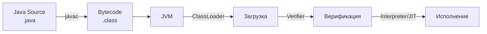
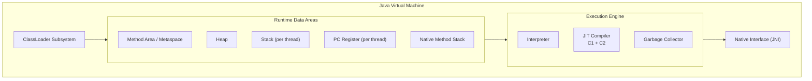
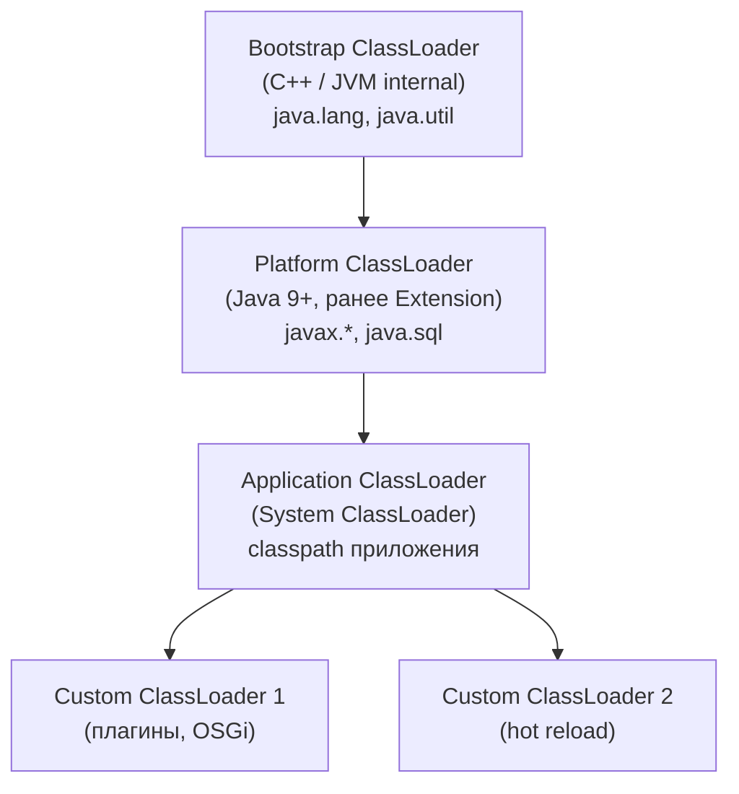
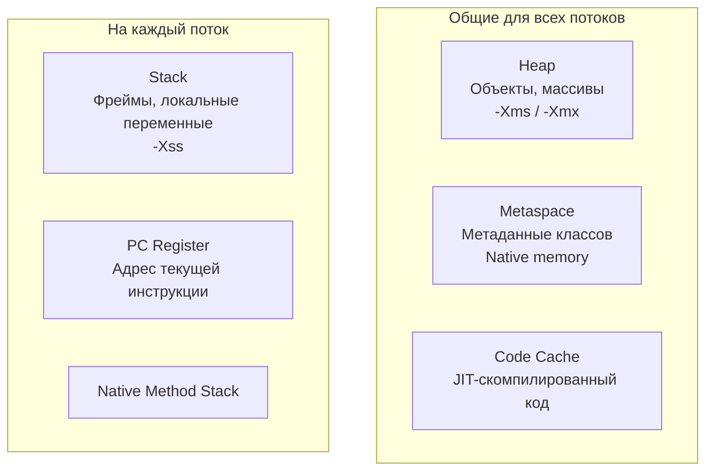
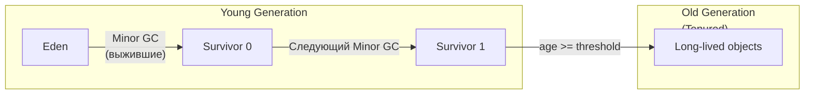
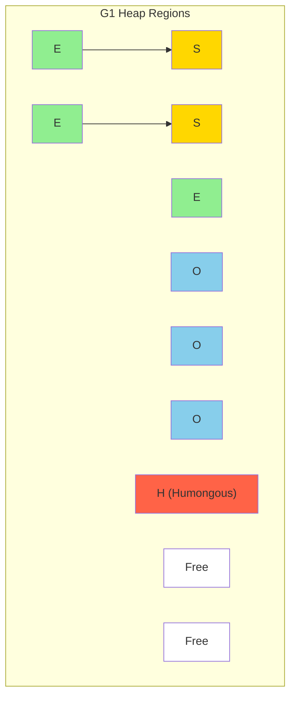
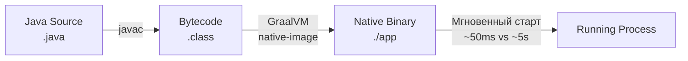

# Вопросы на собеседовании: `JVM`

Полное покрытие `JVM`: архитектура, модель памяти, `Garbage Collection`, `JIT`-компиляция, `ClassLoader`, диагностика, флаги для production, `GraalVM` и native images.

## Полезные ссылки

### Официальная документация

- [JVM Specification (SE 21)](https://docs.oracle.com/javase/specs/jvms/se21/html/) — спецификация виртуальной машины
- [Java Garbage Collection Tuning Guide](https://docs.oracle.com/en/java/javase/21/gctuning/) — руководство по настройке GC
- [JVM Tool Interface (JVMTI)](https://docs.oracle.com/en/java/javase/21/docs/specs/jvmti.html) — спецификация инструментирования
- [Baeldung - JVM Parameters](https://www.baeldung.com/jvm-parameters) — обзор важнейших параметров JVM
- [Baeldung - JVM Garbage Collectors](https://www.baeldung.com/jvm-garbage-collectors) — обзор сборщиков мусора
- [Baeldung - Tiered Compilation](https://www.baeldung.com/jvm-tiered-compilation) — многоуровневая компиляция

## Содержание

- [Полезные ссылки](#полезные-ссылки)
- [See also](#see-also)

**Архитектура JVM**
- [Q1. (!) Что такое JVM и зачем она нужна?](#q1--что-такое-jvm-и-зачем-она-нужна)
- [Q2. (!) Из каких компонентов состоит JVM?](#q2--из-каких-компонентов-состоит-jvm)
- [Q3. Что такое байткод и как JVM его выполняет?](#q3-что-такое-байткод-и-как-jvm-его-выполняет)
- [Q4. Чем отличаются JVM, JRE и JDK?](#q4-чем-отличаются-jvm-jre-и-jdk)

**JIT-компиляция и GraalVM**
- [Q5. (!) Что такое JIT-компиляция и как она работает?](#q5--что-такое-jit-компиляция-и-как-она-работает)
- [Q6. Что такое Tiered Compilation?](#q6-что-такое-tiered-compilation)
- [Q7. Что такое GraalVM и AOT-компиляция?](#q7-что-такое-graalvm-и-aot-компиляция)

**ClassLoader**
- [Q8. (!) Как работает иерархия ClassLoader в JVM?](#q8--как-работает-иерархия-classloader-в-jvm)
- [Q9. Что такое принцип делегирования ClassLoader?](#q9-что-такое-принцип-делегирования-classloader)
- [Q10. Когда нужен кастомный ClassLoader?](#q10-когда-нужен-кастомный-classloader)

**Модель памяти JVM**
- [Q11. (!) Какие области памяти существуют в JVM?](#q11--какие-области-памяти-существуют-в-jvm)
- [Q12. (!) Что такое Stack и Heap и чем они отличаются?](#q12--что-такое-stack-и-heap-и-чем-они-отличаются)
- [Q13. Что такое Metaspace и чем он заменил PermGen?](#q13-что-такое-metaspace-и-чем-он-заменил-permgen)
- [Q14. Что происходит при нехватке памяти в Heap?](#q14-что-происходит-при-нехватке-памяти-в-heap)

**Garbage Collection — основы**
- [Q15. (!) Что такое Garbage Collection и зачем он нужен?](#q15--что-такое-garbage-collection-и-зачем-он-нужен)
- [Q16. (!) Что такое Generational Garbage Collection?](#q16--что-такое-generational-garbage-collection)
- [Q17. (!) Что означает Stop-The-World?](#q17--что-означает-stop-the-world)
- [Q18. Когда объект становится пригодным для GC?](#q18-когда-объект-становится-пригодным-для-gc)
- [Q19. (!) В чём разница между Strong, Weak, Soft и Phantom ссылками?](#q19--в-чём-разница-между-strong-weak-soft-и-phantom-ссылками)
- [Q20. Можно ли запустить GC из кода? Стоит ли?](#q20-можно-ли-запустить-gc-из-кода-стоит-ли)
- [Q21. Пригодны ли циклические ссылки для GC?](#q21-пригодны-ли-циклические-ссылки-для-gc)

**Сборщики мусора**
- [Q22. (!) Какие сборщики мусора доступны в HotSpot JVM?](#q22--какие-сборщики-мусора-доступны-в-hotspot-jvm)
- [Q23. (!) Как работает G1 Garbage Collector?](#q23--как-работает-g1-garbage-collector)
- [Q24. (!) Как работает ZGC?](#q24--как-работает-zgc)
- [Q25. Как работает Shenandoah?](#q25-как-работает-shenandoah)
- [Q26. Как выбрать сборщик мусора для production?](#q26-как-выбрать-сборщик-мусора-для-production)

**Настройка и флаги JVM**
- [Q27. (!) Какие флаги JVM наиболее важны для production?](#q27--какие-флаги-jvm-наиболее-важны-для-production)
- [Q28. Как настроить размер Heap?](#q28-как-настроить-размер-heap)
- [Q29. (!) Как уменьшить GC-паузы?](#q29--как-уменьшить-gc-паузы)
- [Q30. Как JVM работает в контейнерах Docker/Kubernetes?](#q30-как-jvm-работает-в-контейнерах-dockerkubernetes)

**Диагностика и мониторинг**
- [Q31. (!) Какие инструменты доступны для диагностики JVM?](#q31--какие-инструменты-доступны-для-диагностики-jvm)
- [Q32. Что такое Heap Dump и Thread Dump?](#q32-что-такое-heap-dump-и-thread-dump)
- [Q33. Как диагностировать утечку памяти в Java?](#q33-как-диагностировать-утечку-памяти-в-java)
- [Q34. Что такое Java Flight Recorder и JFR Events?](#q34-что-такое-java-flight-recorder-и-jfr-events)

**Прочие вопросы**
- [Q35. Есть ли деструктор в Java?](#q35-есть-ли-деструктор-в-java)
- [Q36. Можно ли воскресить объект после finalize?](#q36-можно-ли-воскресить-объект-после-finalize)
- [Q37. Что такое Escape Analysis и скалярная замена?](#q37-что-такое-escape-analysis-и-скалярная-замена)

**GraalVM Native Image и AOT**
- [Q38. (!) Как работает GraalVM Native Image и каковы ограничения?](#q38-как-работает-graalvm-native-image-и-каковы-ограничения)
- [Q39. Как JIT-компилятор обнаруживает "горячие" методы?](#q39-как-jit-компилятор-обнаруживает-горячие-методы)
- [Q40. Что такое AOT-компиляция в контексте Spring Boot 3?](#q40-что-такое-aot-компиляция-в-контексте-spring-boot-3)

---

## Q1. (!) Что такое `JVM` и зачем она нужна?

**`JVM`** (`Java Virtual Machine`) — виртуальная машина, которая выполняет `Java`-байткод. Главный принцип — **Write Once, Run Anywhere**: один и тот же `.class`-файл работает на любой платформе, где есть `JVM`.

Основные функции `JVM`:
- **Загрузка классов** — `ClassLoader` находит и загружает `.class`-файлы
- **Верификация байткода** — проверка корректности и безопасности
- **Исполнение** — интерпретация или `JIT`-компиляция в нативный код
- **Управление памятью** — автоматическое выделение и освобождение (`GC`)
- **Управление потоками** — маппинг `Java`-потоков на потоки ОС



На собеседовании важно подчеркнуть, что `JVM` — это **спецификация**, а `HotSpot`, `OpenJ9`, `GraalVM` — **реализации**.

> [!mcq]
> - [ ] `JVM` — это конкретная реализация виртуальной машины, которую Oracle поставляет вместе с `JDK`; `HotSpot` и `OpenJ9` — лишь её форки | JVM — это спецификация (набор требований), а не реализация; HotSpot, OpenJ9, GraalVM — независимые реализации этой спецификации от разных вендоров. ❌ ПОСЛЕДСТВИЕ: команда заблокирована «лицензией Oracle JDK», тратит месяцы на migration с Oracle JDK 8 на Oracle 11. Не знают, что Eclipse Temurin (форк OpenJDK) — drop-in replacement бесплатно. Многие компании после Oracle Java SE Subscription 2019 ($25/user/month) переехали на Adoptium/Amazon Corretto без потерь.
> - [ ] `JVM` — это интерпретатор байткода; компиляция в нативный код не входит в спецификацию и является расширением вендоров | Спецификация JVM описывает формат байткода и семантику, но не запрещает JIT-компиляцию; JIT является штатным механизмом исполнения, а не расширением. ❌ ПОСЛЕДСТВИЕ: разработчик отключает `-XX:-TieredCompilation` «потому что JIT — это extension, а не часть JVM». Holy моменты замедляются в 10x — после прогрева C2 даёт нативную скорость, без JIT методы 10000x вызовов на интерпретаторе. Профилировщик показывает CPU usage 100% даже на простом цикле.
> - [x] `JVM` — это спецификация виртуальной машины; `HotSpot`, `OpenJ9` и `GraalVM` — независимые реализации этой спецификации | Разделение «спецификация vs реализация» — ключевой принцип Java-экосистемы; позволяет разным вендорам создавать JVM с одинаковым поведением, но разными оптимизациями. ✓ ПРИМЕНЯТЬ: команда выбирает Eclipse Temurin (OpenJDK) для production — бесплатно, проверено на TCK; Amazon Corretto для AWS-нагрузки; GraalVM Native Image для serverless lambda с быстрым cold-start. Один и тот же `.class` запустится на любой совместимой реализации. 📋 ПРАВИЛО: «JVM = spec, HotSpot/OpenJ9/GraalVM = impl». 🔗 См. Q4 (JVM/JRE/JDK), Q5 (JIT), Q7 (GraalVM/AOT).
> - [ ] `JVM` — это часть `JDK`; без `JDK` нельзя запустить `Java`-приложение, потому что `JVM` поставляется только в составе инструментов разработчика | JVM входит как в JDK, так и в JRE; приложения запускаются только с JVM (или JRE), JDK необходим лишь для компиляции. ❌ ПОСЛЕДСТВИЕ: команда тащит full JDK (~300MB) в production Docker-image, где нужен только runtime. Образ контейнера 600MB вместо 200MB, pull/push медленнее в 3 раза, AWS ECR storage cost растёт. Fix: multi-stage Dockerfile с `eclipse-temurin:21-jre-alpine` или `jlink` для custom runtime (40MB).

## Q2. (!) Из каких компонентов состоит `JVM`?



| Компонент | Назначение |
|-----------|-----------|
| `ClassLoader` | Загрузка, линковка и инициализация классов |
| `Method Area` / `Metaspace` | Метаданные классов, таблицы методов, `constant pool` |
| `Heap` | Хранение всех объектов; область работы `GC` |
| `Stack` | Фреймы вызовов: локальные переменные, операнды, адреса возврата |
| `PC Register` | Адрес текущей выполняемой инструкции для каждого потока |
| `Interpreter` | Построчное выполнение байткода |
| `JIT Compiler` | Компиляция «горячих» методов в нативный код |
| `GC` | Автоматическое освобождение памяти от недостижимых объектов |

> [!mcq]
> - [ ] `PC Register` хранит байткод текущего класса и является общим для всех потоков, чтобы синхронизировать выполнение | PC Register — per-thread структура; каждый поток имеет свой собственный счётчик команд, указывающий на текущую инструкцию именно этого потока. ❌ ПОСЛЕДСТВИЕ: разработчик пишет «глобальный счётчик инструкций» для multi-thread debug — на самом деле каждый thread должен иметь свой PC. Без per-thread PC два потока, выполняющие один и тот же метод, не могли бы быть в разных точках. Базовая ошибка в понимании JVM, проявится при попытке написать кастомный JVM или агент.
> - [ ] `Method Area` (Metaspace) находится в `Heap` и управляется тем же `GC`, что собирает объекты — это часть единого пространства памяти | Metaspace хранится в нативной памяти ОС вне Heap; управляется отдельным механизмом (Metadata GC Threshold), а не общим GC, работающим с объектами. ❌ ПОСЛЕДСТВИЕ: команда тюнит `-Xmx4g` для решения OOM, но реальная проблема — Metaspace, а не heap. ClassLoader leak (например, через CGLIB прокси в Spring) забивает Metaspace, OOM повторяется. Правильный fix: `-XX:MaxMetaspaceSize=512m` + heap dump anslysis. Tomcat 2014 — классические PermGen leaks при hot redeploy.
> - [x] `Stack` — per-thread структура, хранящая фреймы вызовов с локальными переменными и операндами; `Heap` — общая область для всех потоков с объектами | Разделение Stack (per-thread) и Heap (shared) — фундаментальная архитектура JVM; именно поэтому локальные примитивные переменные потокобезопасны, а объекты в Heap требуют синхронизации. ✓ ПРИМЕНЯТЬ: каждый поток в Tomcat thread pool (200 потоков) имеет свой Stack 512KB = 100MB; объекты `User` в Heap shared, поэтому требуют `synchronized` или ConcurrentHashMap; локальные `int counter` потокобезопасны без синхронизации. 📋 ПРАВИЛО: «Stack = per-thread (примитивы, ссылки), Heap = shared (объекты)». 🔗 См. Q3 (байткод), Q9 (memory model), Q10 (heap regions).
> - [ ] `Native Method Stack` и обычный `Stack` — это одна и та же структура; `JVM` использует единый стек как для Java-методов, так и для нативных вызовов | Это две отдельные структуры; Native Method Stack обслуживает вызовы через JNI, а Stack (Java Stack) хранит фреймы только Java-методов. ❌ ПОСЛЕДСТВИЕ: при анализе StackOverflowError разработчик видит Java-фреймы и удивляется, почему `nm.cpp` не показывается. JNI-вызовы (например, `FileInputStream.readBytes` → `read0`) лежат в Native Stack — для full traces нужен `jstack -m` или JDK Mission Control. Без этого debug crashes в native libs (Netty epoll, snappy compression) превращается в гадание.

## Q3. Что такое байткод и как `JVM` его выполняет?

**Байткод** — промежуточное представление программы в виде инструкций `JVM`. Генерируется компилятором `javac` из исходного кода `.java` в файлы `.class`.

```java
// Исходный код
public int add(int a, int b) {
    return a + b;
}

// Байткод (вывод javap -c):
// 0: iload_1
// 1: iload_2
// 2: iadd
// 3: ireturn
```

Просмотр байткода:

```java
// Команда для дизассемблирования
// javap -c -p MyClass.class
// javap -v MyClass.class  — подробный вывод с constant pool
```

Процесс исполнения: `ClassLoader` загружает байткод -> `Verifier` проверяет корректность -> `Interpreter` начинает выполнение -> `JIT` компилирует «горячие» методы (по счётчику вызовов, обычно ~10 000 для `C2`).

> [!mcq]
> - [ ] Байткод — это нативный машинный код для архитектуры `x86`, сгенерированный `javac`; `JVM` запускает его напрямую без дополнительной интерпретации | Байткод — платформонезависимые инструкции для виртуальной машины, а не для конкретного процессора; именно поэтому один .class-файл работает на любой ОС. ❌ ПОСЛЕДСТВИЕ: команда боится переходить на ARM-инстансы AWS Graviton («у нас x86 байткод»). На самом деле тот же `.jar` запускается без перекомпиляции на ARM, JIT в runtime генерирует ARM-нативный код. Cost saving 20-40% упускается из-за непонимания. Booking.com 2022: миграция на Graviton снизила стоимость JVM-кластера на 35%.
> - [x] Байткод — промежуточное платформонезависимое представление; `JVM` сначала интерпретирует его, затем `JIT` компилирует горячие методы в нативный код конкретного процессора | Двухэтапный подход (интерпретация → JIT) обеспечивает баланс между быстрым стартом и пиковой производительностью; нативный код после JIT работает с той же скоростью, что C/C++. ✓ ПРИМЕНЯТЬ: один Spring Boot `.jar` деплоится на x86 (production EC2), ARM (Graviton), z/Architecture (mainframe Linux); JIT в `-XX:+PrintCompilation` показывает компиляцию в native — `0 1234 4 com.example.HotMethod (35 bytes)`. JFR (Java Flight Recorder) визуализирует JIT compilation timeline. 📋 ПРАВИЛО: «.class = portable, JIT = local native». 🔗 См. Q1 (JVM как spec), Q5 (JIT детали), Q6 (Tiered Compilation).
> - [ ] `javac` компилирует байткод сразу в нативный код платформы, где запускается компилятор; `JVM` лишь обеспечивает среду выполнения этого кода | javac всегда генерирует платформонезависимый байткод (.class); преобразование в нативный код выполняет JIT уже в момент запуска на конкретной машине. ❌ ПОСЛЕДСТВИЕ: команда настраивает CI build per-arch («билд для prod-x86, билд для dev-arm»). Pipeline дублируется, время CI увеличивается в 2x, артефакты разные — сложности с поиском багов. На самом деле один `.jar` работает везде, где есть совместимая JVM. Confusion = wasted CI time.
> - [ ] `JVM` компилирует весь байткод в нативный код при загрузке класса (AOT-подход); интерпретация используется только как fallback при ошибках компиляции | JVM начинает именно с интерпретации; JIT-компиляция происходит лишь для «горячих» методов, достигших порога вызовов (~10 000 для C2). ❌ ПОСЛЕДСТВИЕ: разработчик ждёт «JIT прогрева» сразу после старта, но методы ещё в Level 0 (interpreter) — performance test показывает 100ms latency, через 5 минут падает до 5ms. Без понимания warmup люди думают, что есть memory leak или regression. Решение для serverless — GraalVM Native Image (AOT) или CDS (Class Data Sharing).

## Q4. Чем отличаются `JVM`, `JRE` и `JDK`?

| Компонент | Что включает | Для кого |
|-----------|-------------|----------|
| **`JVM`** | Виртуальная машина: `ClassLoader`, `GC`, `JIT` | Среда выполнения |
| **`JRE`** | `JVM` + стандартная библиотека (`rt.jar`) | Запуск приложений |
| **`JDK`** | `JRE` + `javac`, `javap`, `jcmd`, `jstack`, `jmap`, `jfr` | Разработка |

С `Java 11` Oracle поставляет только `JDK` — отдельной поставки `JRE` больше нет. Модульная система `JPMS` (`Java 9+`) позволяет создавать минимальный `runtime` через `jlink`.

> [!mcq]
> - [ ] С `Java 9`, когда модульная система `JPMS` полностью заменила концепцию `JRE` как единицы дистрибуции | Модульная система появилась в Java 9, но Oracle прекратила отдельные поставки JRE только с Java 11; в Java 9-10 JRE всё ещё существовал. ❌ ПОСЛЕДСТВИЕ: команда планирует миграцию с Java 8 на Java 9, рассчитывая на «нет JRE — экономия 200MB» — на самом деле в Java 9 JRE ещё доступен. Преждевременный план миграции на jlink, перетраченное время на изучение того, что не работает в текущей версии.
> - [ ] С `Java 10`, когда унифицировали схему версионирования и убрали неактуальные артефакты | Java 10 ввела новую схему версий, но JRE как отдельный дистрибутив Oracle убрала именно с Java 11, не Java 10. ❌ ПОСЛЕДСТВИЕ: разработчик пишет в blog post «c Java 10 нет JRE» — статью читают, ошибка распространяется. Команда читателей строит migration plans на неверных данных, тратится время. Точная Java-версия = не теряемая mental model.
> - [x] С `Java 11`, перейдя на единую поставку только `JDK`; минимальный `runtime` создаётся через `jlink` | Oracle объединила JRE и JDK в единый дистрибутив начиная с Java 11; для кастомного минимального образа используется jlink из модульной системы Java 9+. ✓ ПРИМЕНЯТЬ: Spring Boot Docker image с `eclipse-temurin:21-jre-alpine` (~150MB); custom minimal runtime через `jlink --module-path $JAVA_HOME/jmods --add-modules java.base,java.logging --output runtime` (~40MB); Native Image через GraalVM (~80MB) для serverless. 📋 ПРАВИЛО: «Java 11+ = JDK only, minimal runtime = jlink». 🔗 См. Q1 (JVM как spec), Q3 (байткод), Q7 (GraalVM/AOT).
> - [ ] С `Java 14`, вместе с удалением `CMS`-сборщика — оба изменения вошли в один релиз | CMS удалили действительно в Java 14, но JRE как отдельный дистрибутив Oracle прекратила раньше — с Java 11. ❌ ПОСЛЕДСТВИЕ: команда смешивает два независимых события (CMS deprecation в Java 9, removal в 14; JRE removal в 11) при чтении JEP. Migration документация ошибочно ссылается на Java 14 как точку «JRE end of life». Кто доверится — будет планировать неверно, плюс будет сюрприз с CMS → G1 миграцией.

## Q5. (!) Что такое `JIT`-компиляция и как она работает?

**`JIT`** (`Just-In-Time`) — компиляция байткода в нативный машинный код **во время выполнения** программы. `JVM` начинает с интерпретации, а затем компилирует часто вызываемые методы (hot spots) для ускорения.

В `HotSpot JVM` два компилятора:
- **`C1`** (Client) — быстрая компиляция с базовыми оптимизациями; хорош для быстрого старта
- **`C2`** (Server) — агрессивные оптимизации (инлайнинг, escape analysis, loop unrolling); максимальная производительность

Основные оптимизации `JIT`:
- **Инлайнинг** (method inlining) — встраивание тела метода в вызывающий код
- **Escape Analysis** — определение, выходит ли объект за пределы метода
- **Loop unrolling** — развёртывание циклов
- **Dead code elimination** — удаление недостижимого кода
- **Branch prediction** — оптимизация условных переходов

```java
// JIT-оптимизация: инлайнинг
// До:
public int calculate(int x) {
    return multiply(x, 2);  // вызов метода
}
private int multiply(int a, int b) {
    return a * b;
}

// После инлайнинга JIT-компилятором:
// calculate(x) → x * 2  (прямая операция, без вызова)
```

Флаги для наблюдения за `JIT`:

```java
// Логирование компиляции
// -XX:+PrintCompilation
// -XX:+UnlockDiagnosticVMOptions -XX:+PrintInlining
```

> [!mcq]
> - [ ] `C1` использует агрессивные спекулятивные оптимизации — инлайнинг, escape analysis, loop unrolling — потому что он нацелен на максимальную производительность к пиковой нагрузке | C1 нацелен именно на быстрый старт с минимальными накладными расходами; агрессивные оптимизации — это задача C2, работающего после сбора профилировочных данных. ❌ ПОСЛЕДСТВИЕ: команда отключает `-XX:+UseC2` «потому что C1 уже агрессивен» — performance падает в 5-10x на CPU-bound нагрузке. C1 работает только в первых 1500 вызовов до сбора профиля, после этого C2 даёт реальные оптимизации. Без C2 hot loops не unrolled, escape analysis не работает.
> - [ ] Оба компилятора `C1` и `C2` работают параллельно и независимо над одними и теми же методами, выбирая лучший результат | Они работают последовательно в рамках Tiered Compilation: сначала C1 быстро компилирует с профилированием, затем C2 агрессивно оптимизирует на основе собранных данных. ❌ ПОСЛЕДСТВИЕ: разработчик ожидает «параллельной race» компиляторов и не понимает, почему `-XX:+PrintCompilation` показывает строгий порядок Level 0 → 3 → 4. Profiler показывает «duplicate compilation» — он же не race, а tiered. Без понимания tiered нельзя правильно настроить compile threshold для startup-сенситивных систем.
> - [x] `C2` применяет спекулятивные оптимизации на основе профилировочных данных, собранных `C1`; инлайнинг, escape analysis, loop unrolling — всё это C2-оптимизации | Разделение труда: C1 быстро компилирует и собирает профиль, C2 использует этот профиль для глубоких оптимизаций; без C1-профиля C2 не смог бы делать спекулятивные оптимизации. ✓ ПРИМЕНЯТЬ: для долгоживущих сервисов (Spring Boot API на 24/7) Tiered Compilation даёт быстрый startup + пиковый throughput; CDS (Class Data Sharing) ускоряет startup ещё на 30%; Project Leyden + AOT cache (Java 24+) сократит warmup. Netflix использует JIT профилирование для tuning C2 параметров. 📋 ПРАВИЛО: «C1 = быстро + профиль, C2 = глубоко + спекулятивно». 🔗 См. Q3 (байткод), Q6 (Tiered Compilation), Q7 (GraalVM/AOT).
> - [ ] `C1` полностью отключается после прогрева, а все дальнейшие компиляции выполняет исключительно `C2` | C1 продолжает работать для новых методов даже после прогрева; C2 компилирует только методы, ставшие по-настоящему горячими (достигшие порога ~10 000 вызовов). ❌ ПОСЛЕДСТВИЕ: при hot redeploy в Tomcat новый код приходит с ClassLoader leak — C1 запускается для свежезагруженных методов. Команда видит «C1 после прогрева работает» и думает, что Tiered сломан. На самом деле это нормальное поведение для динамической загрузки кода (OSGi, plugins, Spring DevTools).

## Q6. Что такое `Tiered Compilation`?

**Tiered Compilation** (многоуровневая компиляция) — стратегия, при которой `JVM` использует оба компилятора (`C1` и `C2`) последовательно. Включена по умолчанию с `Java 8`.

5 уровней компиляции:
- **Level 0** — интерпретация
- **Level 1** — `C1` без профилирования (простые методы)
- **Level 2** — `C1` с лёгким профилированием
- **Level 3** — `C1` с полным профилированием
- **Level 4** — `C2` с агрессивными оптимизациями

```java
// Типичный путь: Level 0 → Level 3 → Level 4
// Отключение tiered compilation:
// -XX:-TieredCompilation
// Порог компиляции C2:
// -XX:CompileThreshold=10000
```

Практический эффект: быстрый старт (за счёт `C1`) + максимальная производительность после прогрева (за счёт `C2`). Это важно для микросервисов, где холодный старт критичен.

> [!mcq]
> - [ ] Tiered Compilation включает 3 уровня: интерпретация (`Level 0`), `C1` (`Level 1`) и `C2` (`Level 2`); более детального разбиения нет | Tiered Compilation включает 5 уровней (0-4); C1 разбит на три режима — без профилирования, с лёгким и с полным профилированием, что позволяет гибко балансировать между скоростью старта и качеством данных для C2. ❌ ПОСЛЕДСТВИЕ: команда тюнит compile thresholds через `-XX:CompileThreshold`, не зная про 5-уровневую структуру. Без понимания levels 1-3 нельзя оптимизировать profile-quality для C2; неверные threshold'ы дают либо premature C2 compilation (c плохим профилем), либо слишком позднюю.
> - [x] Tiered Compilation включает 5 уровней: интерпретация (0), `C1` без/с лёгким/с полным профилем (1-3) и `C2` с агрессивными оптимизациями (4) | Разбивка C1 на три уровня позволяет методам с разной «горячестью» получать соответствующий уровень профилирования; типичный путь горячего метода: 0 → 3 → 4. ✓ ПРИМЕНЯТЬ: JFR показывает level transitions в Method Compilations event; tools like async-profiler визуализирует level distribution; для startup-сенситивных систем (lambda, CLI) можно отключить C2 через `-XX:TieredStopAtLevel=1` для быстрого старта без потери prod throughput. 📋 ПРАВИЛО: «5 levels: 0 (interp), 1-3 (C1 различные режимы), 4 (C2)». 🔗 См. Q5 (JIT), Q7 (AOT), Q12 (Heap structure).
> - [ ] Tiered Compilation включает 5 уровней, но `Level 4` — это снова `C1` с максимальными флагами; `C2` используется только при явном указании флага `-XX:+UseC2Compiler` | Level 4 — это именно C2 с агрессивными оптимизациями (спекулятивный инлайнинг, escape analysis); C2 включён по умолчанию и является финальным уровнем в Tiered Compilation. ❌ ПОСЛЕДСТВИЕ: разработчик ставит «магический» флаг `-XX:+UseC2Compiler` для «активации C2» — он работает уже по умолчанию, флаг ничего не делает. Месяцы потеряны в ожидании, что «теперь будет быстрее», а реальная оптимизация уже была. Cargo cult flags = ложная уверенность.
> - [ ] Tiered Compilation включает 5 уровней, причём `Level 1` — `C2` без профилирования, а `Level 3` — `C1` с полным профилем; порядок компиляторов обратный | Порядок строго C1 → C2; C1 работает на уровнях 1-3 как быстрый стартовый компилятор с профилированием, C2 — на уровне 4 как финальный оптимизирующий компилятор. ❌ ПОСЛЕДСТВИЕ: при анализе JFR разработчик путает level numbers и думает, что метод регрессировал из C2 в C1 (он же видит Level 3 после Level 4). На самом деле возможен deopt при failed speculation, и метод вернулся в interpreter, потом компилируется заново. Без правильного mental model долгий debug regression.

## Q7. Что такое `GraalVM` и `AOT`-компиляция?

**`GraalVM`** — универсальная виртуальная машина от Oracle, которая может выступать:
- Как замена `C2`-компилятора в `HotSpot` (Graal JIT)
- Как платформа для `AOT`-компиляции (native image)

**`AOT`** (`Ahead-of-Time`) компиляция — трансляция в нативный код **до запуска**, в отличие от `JIT`:

| Характеристика | `JIT` | `AOT` (Native Image) |
|---------------|-------|---------------------|
| Время старта | Медленнее (прогрев) | Быстрый (~50 мс) |
| Пиковая производительность | Выше (адаптивные оптимизации) | Ниже |
| Потребление памяти | Выше | Ниже (нет JIT, метаданных) |
| Применение | Долгоживущие сервисы | Serverless, CLI-утилиты |

```java
// Сборка native image (GraalVM)
// native-image -jar myapp.jar
// Spring Boot + GraalVM:
// ./mvnw -Pnative native:compile
```

Подробнее о применении в Spring Boot — в [вопросах по Spring Boot](../frameworks/spring/spring-boot-interview.md).

> [!mcq]
> - [ ] `AOT` (Native Image) даёт более высокую пиковую производительность, чем `JIT`, потому что компиляция выполняется заранее и компилятор может тратить больше времени на оптимизации | JIT-компилятор выигрывает по пиковой производительности, так как адаптируется к реальному профилю нагрузки в runtime; AOT компилирует без профиля — статические оптимизации хуже спекулятивных. ❌ ПОСЛЕДСТВИЕ: команда мигрирует high-throughput backend (10K req/sec) на Native Image для «быстроты». Throughput падает с 10K до 6K req/sec — без runtime-профиля C2 не может inline'ить hot paths. Откат на обычную JVM, потерянные дни на миграцию. Native Image — это для startup-критичных систем, не throughput.
> - [ ] `GraalVM` — это только платформа для `AOT`-компиляции; как замена `C2`-компилятора для `JIT` он не используется | GraalVM может работать в двух режимах: как Graal JIT (замена C2 внутри HotSpot) и как инструмент AOT-компиляции (native-image); это разные сценарии использования одной технологии. ❌ ПОСЛЕДСТВИЕ: команда не пробует Graal JIT (`-XX:+UseJVMCICompiler`), считая GraalVM только для Native Image. Упускают +5-15% throughput на CPU-bound нагрузках (Twitter использует Graal JIT в production). Performance opportunity потеряна из-за неполного понимания тулинга.
> - [ ] `AOT` (Native Image) лучше подходит для долгоживущих высоконагруженных сервисов, чем `JIT`, так как исключает накладные расходы на прогрев | Долгоживущие сервисы выигрывают от JIT: адаптивные оптимизации C2 дают более высокий throughput после прогрева; AOT оптимален для короткоживущих сервисов (serverless, CLI), где холодный старт важнее пика. ❌ ПОСЛЕДСТВИЕ: stable backend service переведён на Native Image, через месяц latency p99 деградирует до 200ms (с 50ms на JVM). Reflection и dynamic proxy в Spring через runtime hints обходят, но profile-guided оптимизаций (escape analysis, virtual call inlining) AOT просто не делает. Отказ от Native Image после неудачного эксперимента.
> - [x] `AOT` (Native Image) обеспечивает быстрый старт (~50 мс) и низкое потребление памяти, но уступает `JIT` по пиковой производительности из-за отсутствия адаптивных оптимизаций | Без runtime-профиля AOT не может делать спекулятивный инлайнинг и другие C2-оптимизации; компромисс «быстрый старт vs пиковый throughput» — ключевой критерий выбора между AOT и JIT. ✓ ПРИМЕНЯТЬ: AWS Lambda с GraalVM Native Image (cold start 50ms vs 5s обычной JVM); CLI-утилиты (50MB native binary запускается мгновенно); Kubernetes scaling — за 100ms можно поднять новый инстанс. Spring Boot 3 + AOT даёт production-ready Native Image. PGO (Profile-Guided Optimization) в GraalVM EE частично закрывает gap по throughput. 📋 ПРАВИЛО: «AOT для cold start, JIT для steady-state throughput». 🔗 См. Q5 (JIT), Q6 (Tiered), [Spring Boot](../frameworks/spring/spring-boot-interview.md).

## Q8. (!) Как работает иерархия `ClassLoader` в `JVM`?

`ClassLoader` отвечает за загрузку `.class`-файлов в `JVM`. Иерархия основана на принципе делегирования (parent-first):



| `ClassLoader` | Что загружает | Путь |
|--------------|--------------|------|
| `Bootstrap` | Ядро `Java` (`java.lang.*`, `java.util.*`) | `$JAVA_HOME/lib` |
| `Platform` | Модули платформы (`java.sql`, `javax.crypto`) | `$JAVA_HOME/lib` |
| `Application` | Классы приложения и зависимости | `-classpath` / `-cp` |

Этапы загрузки класса: **Loading** (поиск и чтение байтов) -> **Linking** (verification, preparation, resolution) -> **Initialization** (выполнение `static`-блоков и инициализация `static`-полей).

> [!mcq]
> - [ ] `Bootstrap ClassLoader` написан на `Java` и загружает ядро `JDK`; `Platform ClassLoader` написан на `C++` и загружает нативные библиотеки | Всё наоборот: Bootstrap ClassLoader реализован на C++ внутри JVM и загружает java.lang, java.util; Platform ClassLoader написан на Java и загружает модули платформы (java.sql, javax.crypto). ❌ ПОСЛЕДСТВИЕ: разработчик пытается «получить parent ClassLoader для Bootstrap» через рефлексию — `null`. Удивлён, ищет багу. На самом деле Bootstrap написан в JVM C++ и не имеет Java-представления, его parent в иерархии = null. Custom ClassLoader, который полагается на Bootstrap.getParent() = NPE.
> - [ ] С `Java 9` `Extension ClassLoader` был переименован в `System ClassLoader` и стал загружать как системные, так и пользовательские классы | Extension ClassLoader был переименован в Platform ClassLoader; System ClassLoader (Application ClassLoader) загружает классы приложения и существовал до Java 9. ❌ ПОСЛЕДСТВИЕ: при миграции Tomcat 8 → 9 (Java 8 → 11) кастомный код использует `Thread.currentThread().getContextClassLoader().getParent().getParent()` для добавления jar в Extension. С Java 9 второй getParent() возвращает не Extension, а Platform — путь сломан. App не находит классы, длительный debug.
> - [x] С `Java 9` `Extension ClassLoader` был заменён `Platform ClassLoader`, который работает с модульной системой `JPMS` и загружает модули платформы (`java.sql`, `javax.crypto`) | Модульная система Java 9 изменила иерархию ClassLoader-ов: Extension ClassLoader исчез, а его задачи взял Platform ClassLoader, умеющий работать с модулями JPMS. ✓ ПРИМЕНЯТЬ: для frameworks с custom ClassLoader (OSGi, Tomcat WAR isolation, Spring DevTools) понимание иерархии критично; модульная архитектура Java 9+ позволяет `--add-modules` для динамической загрузки platform modules; Spring Boot Loader (BootInheritingLauncher) использует кастомные ClassLoader для fat jar. 📋 ПРАВИЛО: «Bootstrap (C++) → Platform (modules) → Application (classpath) → Custom». 🔗 См. Q9 (delegation), Q10 (custom), Q11 (memory).
> - [ ] `Application ClassLoader` (System ClassLoader) является корневым родителем всей иерархии; `Bootstrap` и `Platform` — его дочерние загрузчики, делегирующие вверх | Иерархия строго обратная: Bootstrap → Platform → Application; Application делегирует вверх к Platform, Platform — к Bootstrap; Bootstrap не имеет родителя. ❌ ПОСЛЕДСТВИЕ: разработчик пишет custom ClassLoader, делегируя вниз к Application — security hole, можно подменить System.* классы. JVM не позволяет это в нормальном режиме (parent-first), но при unsafe ClassLoader implementation = CVE. Tomcat 5/6 имели ClassLoader vulnerabilities именно из-за неверной модели делегирования.

## Q9. Что такое принцип делегирования `ClassLoader`?

**Parent-first delegation** — перед загрузкой класса `ClassLoader` делегирует запрос родителю. Только если родитель не нашёл класс, загрузчик пытается загрузить его сам.

```java
// Упрощённая логика ClassLoader.loadClass()
protected Class<?> loadClass(String name) throws ClassNotFoundException {
    // 1. Проверяем кэш — уже загружен?
    Class<?> c = findLoadedClass(name);
    if (c == null) {
        try {
            // 2. Делегируем родителю
            c = parent.loadClass(name);
        } catch (ClassNotFoundException e) {
            // 3. Родитель не нашёл — грузим сами
            c = findClass(name);
        }
    }
    return c;
}
```

Зачем это нужно:
- **Безопасность** — невозможно подменить `java.lang.String` через пользовательский загрузчик
- **Единственность** — один класс загружается один раз
- **Изоляция** — разные загрузчики могут загружать разные версии одного класса (например, в application серверах)

Типичные ошибки: `ClassNotFoundException` (класс не найден вообще), `NoClassDefFoundError` (класс найден при компиляции, но не найден в runtime), `ClassCastException` при разных `ClassLoader` (два «одинаковых» класса из разных загрузчиков несовместимы).

> [!mcq]
> - [ ] `ClassNotFoundException` и `NoClassDefFoundError` — синонимы, оба означают, что класс отсутствует в `classpath` во время выполнения программы | Это разные ошибки с разными причинами: ClassNotFoundException — checked exception при явном поиске (Class.forName()); NoClassDefFoundError — ошибка загрузки класса, который был доступен при компиляции, но исчез в runtime. ❌ ПОСЛЕДСТВИЕ: разработчик ищет одну причину для обеих ошибок и не находит. CNF — JDBC driver не найден через `Class.forName()`. NCDFE — slf4j-api скомпилировался, но runtime classpath пустой. Разные fix: для CNF — добавить driver dependency; для NCDFE — debug pom dependencies, проверить shading.
> - [ ] Принцип делегирования (`parent-first`) означает, что каждый `ClassLoader` сначала пытается загрузить класс сам, и только при неудаче делегирует родителю | Логика строго обратная: ClassLoader сначала делегирует запрос родителю (parent-first), и только если родитель не нашёл класс — загружает сам; именно так защищают ядро Java от подмены. ❌ ПОСЛЕДСТВИЕ: разработчик пишет custom ClassLoader с child-first логикой для override System.out → security CVE. Vulnerability scan находит, security review блокирует release. Нормальный child-first допустим только в Tomcat WAR isolation, но он защищён от загрузки java.* через `delegate=true`/`false` в context.xml.
> - [x] Принцип `parent-first` защищает от подмены системных классов: пользовательский `ClassLoader` не может загрузить свою версию `java.lang.String`, потому что `Bootstrap` всегда найдёт её первым | Bootstrap ClassLoader всегда получает запрос первым через цепочку делегирования и загружает java.lang.String из JDK; пользовательская версия с тем же именем никогда не будет использована. ✓ ПРИМЕНЯТЬ: понимание parent-first объясняет, почему shading в Maven Shade Plugin переименовывает packages (`com.google.guava` → `com.example.shaded.guava`) — иначе parent-first может загрузить чужую версию; OSGi/Tomcat WAR используют child-first для изоляции library версий между приложениями. 📋 ПРАВИЛО: «parent-first = безопасность ядра, child-first = изоляция версий». 🔗 См. Q8 (hierarchy), Q10 (custom CL), Q11 (memory).
> - [ ] `ClassCastException` при разных `ClassLoader` возникает из-за несовпадения байткода классов; если скомпилировать класс одинаково — `ClassCastException` не будет даже при разных загрузчиках | ClassCastException возникает вне зависимости от идентичности байткода: два класса с одним именем, загруженные разными ClassLoader-ами, являются разными типами в JVM даже при идентичном содержимом. ❌ ПОСЛЕДСТВИЕ: команда не понимает, почему `MyService.class != MyService.class` после hot reload. Spring DevTools при hot reload создаёт новый ClassLoader, старая ссылка на bean = ClassCastException даже при идентичном байткоде. Производственные incidents с OSGi плагинами по той же причине — каждый bundle = свой CL.

## Q10. Когда нужен кастомный `ClassLoader`?

Типичные сценарии:
- **Плагин-системы** — загрузка кода из внешних JAR без перезапуска (например, `OSGi`)
- **Hot reload** — перезагрузка изменённых классов в dev-среде (Spring DevTools)
- **Изоляция зависимостей** — разные версии одной библиотеки для разных модулей
- **Загрузка из нестандартных источников** — сеть, БД, шифрованные архивы

```java
public class PluginClassLoader extends ClassLoader {
    private final Path pluginDir;

    public PluginClassLoader(Path pluginDir, ClassLoader parent) {
        super(parent);
        this.pluginDir = pluginDir;
    }

    @Override
    protected Class<?> findClass(String name) throws ClassNotFoundException {
        Path classFile = pluginDir.resolve(
            name.replace('.', '/') + ".class"
        );
        try {
            byte[] bytes = Files.readAllBytes(classFile);
            return defineClass(name, bytes, 0, bytes.length);
        } catch (IOException e) {
            throw new ClassNotFoundException(name, e);
        }
    }
}
```

Важно: кастомный `ClassLoader` может вызвать утечку `Metaspace`, если загруженные классы не выгружаются (классы выгружаются только при сборке мусора от самого `ClassLoader`).

## Q11. (!) Какие области памяти существуют в `JVM`?



| Область | Scope | Содержимое | Ключевые флаги |
|---------|-------|-----------|----------------|
| `Heap` | Общая | Объекты, массивы | `-Xms`, `-Xmx` |
| `Metaspace` | Общая | Метаданные классов | `-XX:MaxMetaspaceSize` |
| `Code Cache` | Общая | Нативный код от `JIT` | `-XX:ReservedCodeCacheSize` |
| `Stack` | Per-thread | Фреймы вызовов | `-Xss` (по умолчанию 512KB-1MB) |
| `PC Register` | Per-thread | Адрес текущей инструкции | — |
| `Direct Memory` | Off-heap | `ByteBuffer.allocateDirect()` | `-XX:MaxDirectMemorySize` |

Подробнее об анализе потребления памяти — в [вопросах по управлению памятью](../performance/memory-management-interview.md).

> [!mcq]
> - [ ] `Metaspace` управляется флагом `-Xmx`, потому что является частью `Heap`; флаги `-XX:MaxMetaspaceSize` — устаревший синтаксис, заменённый общим лимитом Heap | Metaspace находится в нативной памяти ОС вне Heap; -Xmx не ограничивает Metaspace; для его лимита используется исключительно -XX:MaxMetaspaceSize. ❌ ПОСЛЕДСТВИЕ: разработчик ставит `-Xmx2g` в Kubernetes pod с request=2.5Gi. Думает, что 500MB запас. Через сутки Metaspace вырос на 800MB (Spring + Hibernate + ehCache генерируют классы), pod OOMKilled. Решение: явный `-XX:MaxMetaspaceSize=512m` + правильный pod memory request учитывая Heap + Metaspace + Stack + Direct + native.
> - [x] `Metaspace` расположен в нативной памяти ОС (не в `Heap`) и растёт динамически; его лимит задаётся отдельным флагом `-XX:MaxMetaspaceSize` | В отличие от PermGen (Java 7-), Metaspace не конкурирует за Heap с объектами приложения; без MaxMetaspaceSize он будет расти до исчерпания памяти ОС. ✓ ПРИМЕНЯТЬ: для Spring Boot — `-Xmx2g -XX:MaxMetaspaceSize=512m`; ClassLoader leak monitoring через `jcmd <pid> VM.classloader_stats`; в Kubernetes — pod memory limit = Heap + Metaspace + Stack*Threads + Direct + ~200MB native overhead. Tomcat 8+ освобождает Metaspace при undeploy лучше, чем PermGen в Tomcat 7. 📋 ПРАВИЛО: «Metaspace = native memory, требует явного MaxMetaspaceSize». 🔗 См. Q2 (компоненты JVM), Q12 (heap structure), Q13 (GC roots).
> - [ ] `Code Cache` является частью `Heap` и управляется `-Xmx`; при его заполнении `JIT` останавливает компиляцию, но остаток Heap используется для объектов | Code Cache — отдельная область вне Heap, управляемая -XX:ReservedCodeCacheSize; при её заполнении JIT действительно прекращает компиляцию, но это не влияет на пространство объектов. ❌ ПОСЛЕДСТВИЕ: при reservedCodeCacheSize=240MB (default) для большого app с тысячами Spring beans и lambdas код cache переполняется. JIT отключается, методы работают на интерпретаторе, throughput падает в 5-10x. Лог `CodeCache is full. Compiler has been disabled` показывает причину. Fix: `-XX:ReservedCodeCacheSize=512m`. Netflix tuning guide требует мониторить `CodeCache.usage`.
> - [ ] `Direct Memory` (`ByteBuffer.allocateDirect()`) учитывается в `-Xmx` и является частью Heap, аллоцированной вне Young/Old Generation | Direct Memory — off-heap память, полностью вне JVM Heap; управляется -XX:MaxDirectMemorySize; именно поэтому NIO-приложения могут потреблять памяти больше, чем указано в -Xmx. ❌ ПОСЛЕДСТВИЕ: Netty-сервис с `-Xmx2g` потребляет 4GB RSS — pod OOMKilled. Direct Memory от ByteBuf занимает 1.5GB, а команда не выставила `-XX:MaxDirectMemorySize=1g`. По умолчанию Direct Memory = -Xmx, что для Netty опасно (двойной memory budget). Booking.com, LinkedIn — типовые инциденты с Direct Memory leak в HTTP клиентах.

> [!mcq]
> - [ ] `Stack` является общим для всех потоков ресурсом, поэтому его размер (`-Xss`) задаётся один раз для всей JVM суммарно | Stack — строго per-thread структура; -Xss задаёт размер стека для каждого отдельного потока; при создании 1000 потоков суммарный расход памяти на стеки составит 1000 × Xss. ❌ ПОСЛЕДСТВИЕ: команда ставит `-Xss=10m` для long stacks в Java app с 200 потоками. Накладные расходы на стеки = 200 × 10MB = 2GB native memory вне Heap. Pod в Kubernetes OOMKilled, потому что лимит pod=4GB не учёл Stack memory. Решение: правильный math — Heap + Metaspace + Direct + Stack*Threads + ~200MB native overhead.
> - [ ] `PC Register` хранит значения всех локальных переменных текущего метода и является per-thread структурой | PC Register хранит только адрес текущей выполняемой инструкции (program counter); локальные переменные хранятся в Stack Frame, а не в PC Register. ❌ ПОСЛЕДСТВИЕ: разработчик пытается «прочитать значения локальных переменных» через PC Register для debugging. На самом деле локальные переменные в Stack Frame, доступны через JVMTI (Java Virtual Machine Tool Interface). Без правильной модели создаваемые JVM debugger / agent не работают.
> - [ ] Флаг `-Xss` управляет суммарным размером всех стеков в JVM, а не размером одного потока; при создании потоков JVM делит этот бюджет поровну | -Xss задаёт размер стека именно одного потока; суммарный расход памяти на стеки линейно растёт с количеством потоков; уменьшение -Xss — способ снизить расход памяти при большом числе потоков. ❌ ПОСЛЕДСТВИЕ: команда хочет ограничить общий расход памяти на стеки 100MB через `-Xss=100m` на app с 100 потоками. Получает thread с stack=100MB каждый = 10GB native memory, OOMKilled. Правильно: `-Xss=512k` (default) → 100 × 512KB = 50MB. Misunderstanding флага → выгорание ресурсов.
> - [x] `PC Register` — per-thread структура, хранящая адрес текущей инструкции; для нативных методов его значение не определено (`undefined`) | Для Java-методов PC Register содержит адрес выполняемой JVM-инструкции; для native-методов (JNI) управление передаётся нативному коду, который использует регистры процессора, а не JVM PC Register. ✓ ПРИМЕНЯТЬ: при анализе StackOverflowError или crash dump через `jstack -m` видны и Java, и native frames; PC Register помогает JVM управлять переключением context между threads; debugging через JVMTI использует PC Register для breakpoints. 📋 ПРАВИЛО: «PC Register: per-thread, Java only, undefined в native». 🔗 См. Q2 (компоненты), Q11 (memory areas), Q12 (Stack vs Heap).

## Q12. (!) Что такое `Stack` и `Heap` и чем они отличаются?

| Характеристика | `Stack` | `Heap` |
|---------------|---------|--------|
| Что хранит | Примитивы, ссылки, фреймы вызовов | Объекты, массивы |
| Scope | Per-thread (приватный) | Общий для всех потоков |
| Размер | Фиксированный (`-Xss`) | Динамический (`-Xms` / `-Xmx`) |
| Скорость доступа | Быстрый (LIFO) | Медленнее (поиск по ссылке) |
| Ошибка переполнения | `StackOverflowError` | `OutOfMemoryError` |
| Управление | Автоматическое (LIFO) | `Garbage Collector` |

```java
public void example() {
    int x = 42;               // x — в Stack (примитив)
    String s = "hello";        // s (ссылка) — в Stack, объект String — в Heap
    List<String> list = new ArrayList<>(); // list (ссылка) — Stack, ArrayList — Heap
    list.add(s);               // внутри ArrayList ссылка на тот же String в Heap
}
// При выходе из метода — фрейм Stack удаляется,
// объекты в Heap живут, пока на них есть ссылки
```

`StackOverflowError` чаще всего возникает при бесконечной рекурсии; `OutOfMemoryError: Java heap space` — при создании слишком большого количества объектов.

> [!mcq]
> - [ ] Примитивные переменные (`int x = 42`) всегда хранятся в `Heap`, потому что `JVM` не может гарантировать время жизни стека | Примитивные локальные переменные хранятся в Stack Frame текущего метода; они живут ровно столько, сколько активен фрейм, и удаляются автоматически при выходе из метода. ❌ ПОСЛЕДСТВИЕ: разработчик ожидает GC pressure от `int counter` в горячем цикле, добавляет `static long counter` для «escape from heap». Реально это создаёт contention между потоками (GC roots, статика), хуже escape analysis, регрессия. Stack-allocation простых типов уже идеален.
> - [ ] Ссылочная переменная (`String s = "hello"`) и сам объект `String` — оба хранятся в `Stack`, потому что ссылка и объект — единое целое | Ссылка (4 или 8 байт) хранится в Stack, а сам объект String — в Heap; это разные сущности в разных областях памяти; именно поэтому несколько переменных могут ссылаться на один объект в Heap. ❌ ПОСЛЕДСТВИЕ: разработчик пишет `String s = "hello"; s = null;` думая, что объект сразу освобождается. На самом деле String "hello" — литерал в String pool (вечный); только ссылка обнуляется. В тестах debugging shows старый объект всё ещё в heap dump.
> - [x] Ссылочная переменная хранится в `Stack`, а объект, на который она указывает, — в `Heap`; при выходе из метода фрейм Stack удаляется, но объект в Heap живёт, пока есть другие ссылки | Именно это разделение позволяет объектам переживать метод, создавший их; GC отслеживает достижимость объектов в Heap независимо от Stack-фреймов. ✓ ПРИМЕНЯТЬ: понимание этой модели — основа escape analysis (если объект не «убегает» из метода, JIT может scalar-replace на stack); ThreadLocal использует Stack-уровневую видимость для thread-safe singletons; JFR Allocation Profiling показывает где создаются «убегающие» объекты для оптимизации. 📋 ПРАВИЛО: «ссылка в Stack, объект в Heap, GC = достижимость объектов». 🔗 См. Q11 (memory), Q15 (GC), Q16 (Generational GC).
> - [ ] Объекты, помещённые в коллекции (`list.add(obj)`), перемещаются из `Heap` во внутренний буфер коллекции в `Stack` для ускорения доступа | Объекты никогда не перемещаются из Heap в Stack; в коллекции хранятся только ссылки на объекты в Heap; сами объекты остаются там, где были созданы. ❌ ПОСЛЕДСТВИЕ: команда оптимизирует hot path заменой `List<Integer>` на `int[]` — здесь действительно есть unboxing benefit (нет Integer объектов в Heap). Но команда применяет ту же логику к `List<MyDTO>` без понимания, тратит дни на «оптимизацию» с нулевым эффектом. Правильная mental model нужна для приоритизации perf-работы.

> [!mcq]
> - [ ] `StackOverflowError` возникает при утечке памяти в `Heap` — когда объекты накапливаются и JVM не может найти место для новых аллокаций | StackOverflowError — ошибка переполнения стека, а не Heap; возникает при бесконечной рекурсии или слишком глубоком стеке вызовов; утечка памяти в Heap приводит к OutOfMemoryError. ❌ ПОСЛЕДСТВИЕ: разработчик увеличивает `-Xmx` в попытке исправить StackOverflowError на проде — ошибка повторяется. Тратятся дни на анализ heap dump, который не помогает. Реальная причина — глубокая Jackson-десериализация JSON или рекурсивная функция, fix через `-Xss=2m` или итеративный алгоритм.
> - [ ] `OutOfMemoryError: Java heap space` возникает при бесконечной рекурсии, потому что каждый фрейм рекурсии занимает место в `Heap` | Рекурсия исчерпывает Stack (вызывает StackOverflowError), а не Heap; OutOfMemoryError: Java heap space — это нехватка памяти для создания объектов в Heap. ❌ ПОСЛЕДСТВИЕ: команда видит OOM Heap, читает stack trace и думает «это от рекурсии». Идёт refactoring рекурсий в loops — без эффекта. Проблема — кеш ConcurrentHashMap без size limit или missing pagination в JPA query, который грузит 10M строк сразу.
> - [ ] Оба `StackOverflowError` и `OutOfMemoryError: Java heap space` лечатся увеличением флага `-Xmx` | -Xmx управляет только Heap; StackOverflowError лечится увеличением -Xss (размер стека потока) или исправлением рекурсии; -Xmx на StackOverflowError не влияет. ❌ ПОСЛЕДСТВИЕ: junior dev «увеличивает память» через `-Xmx8g` для всех ошибок памяти. Pod в Kubernetes теперь требует 10GB request, расходы AWS x10. SOE всё равно происходит. Senior через 2 недели объясняет, что это разные области памяти.
> - [x] `StackOverflowError` лечится увеличением `-Xss` (или исправлением рекурсии); `OutOfMemoryError: Java heap space` — увеличением `-Xmx` или уменьшением аллокаций | Каждая ошибка имеет свою область памяти: Stack управляется -Xss, Heap — -Xmx; понимание разницы критично для диагностики production-проблем. ✓ ПРИМЕНЯТЬ: при SOE — `-Xss=2m` или fix recursion (Trampoline pattern, Stream.iterate); при OOM — heap dump через `-XX:+HeapDumpOnOutOfMemoryError`, анализ через Eclipse MAT, затем либо увеличение `-Xmx`, либо fix leak (TTL cache, weak reference, soft reference). 📋 ПРАВИЛО: «SOE → -Xss / fix recursion, OOM Heap → -Xmx / fix leak». 🔗 См. Q11 (memory areas), Q14 (OOM types), Q15 (GC).

## Q13. Что такое `Metaspace` и чем он заменил `PermGen`?

**`PermGen`** (Permanent Generation, до `Java 8`) — фиксированная область в `Heap` для метаданных классов. Часто приводила к `OutOfMemoryError: PermGen space`, особенно при частом `hot deploy`.

**`Metaspace`** (с `Java 8`) — хранит те же метаданные, но в **нативной памяти** ОС:

| Свойство | `PermGen` | `Metaspace` |
|----------|----------|------------|
| Расположение | Часть `Heap` | Нативная память ОС |
| Размер | Фиксированный (`-XX:MaxPermSize`) | Динамический, растёт по запросу |
| Лимит | Обязателен | Опциональный (`-XX:MaxMetaspaceSize`) |
| `GC` | `Full GC` | `Metadata GC Threshold` |

```java
// Настройка Metaspace
// -XX:MetaspaceSize=128m        — порог для срабатывания GC метаданных
// -XX:MaxMetaspaceSize=512m     — жёсткий лимит (рекомендуется в production)

// Мониторинг Metaspace
// jcmd <pid> VM.metaspace
```

Утечка `Metaspace` возникает при многократном `hot deploy` (например, в `Tomcat`), когда старые `ClassLoader` не выгружаются из-за удержания ссылок.

> [!mcq]
> - [ ] `PermGen` был заменён `Metaspace` в `Java 7`, потому что в `Java 7` добавили строки в нативную память, освободив PermGen от лишней нагрузки | PermGen заменён Metaspace в Java 8, а не в Java 7; в Java 7 произошло другое изменение — String Pool переехал из PermGen в Heap. ❌ ПОСЛЕДСТВИЕ: команда планирует миграцию Java 6 → 7, рассчитывая на «нет PermGen issues». Удивляется, что Java 7 всё ещё имеет PermGen. Migration tooling неправильно настроен на Java 7 для PermGen-related issues, реальный fix только в Java 8.
> - [x] `PermGen` заменён `Metaspace` в `Java 8`; главное отличие — Metaspace хранится в нативной памяти ОС и растёт динамически, устраняя проблему фиксированного лимита PermGen | Фиксированный размер PermGen был главной причиной OutOfMemoryError: PermGen space при hot deploy; Metaspace растёт по запросу, пока не исчерпана нативная память или не достигнут MaxMetaspaceSize. ✓ ПРИМЕНЯТЬ: при миграции с Java 6/7 на 8+ убираются `-XX:MaxPermSize` и `-XX:PermSize` — они invalid. Hot deploy в Tomcat 8+ работает стабильнее благодаря Metaspace. Spring Boot 1.x → 2.x требовал именно Java 8 minimal. 📋 ПРАВИЛО: «Java 8+ = Metaspace (native), Java 7- = PermGen (heap)». 🔗 См. Q11 (memory), Q14 (OOM types), Q12 (Stack vs Heap).
> - [ ] `Metaspace` заменил `PermGen` в `Java 9` вместе с модульной системой `JPMS`; до `Java 9` PermGen продолжал использоваться в OpenJDK | Metaspace появился в Java 8, а не в Java 9; модульная система JPMS — отдельное изменение Java 9, не связанное с заменой PermGen. ❌ ПОСЛЕДСТВИЕ: миграция документации компании смешивает Java 8 (Metaspace) и Java 9 (JPMS) изменения. Команда применяет JPMS migration steps к Java 8 проекту — ничего не работает. Версия-специфика разделяется правильным чтением Release Notes.
> - [ ] `Metaspace`, как и `PermGen`, имеет фиксированный размер по умолчанию; без явного указания `-XX:MaxMetaspaceSize` он не может расти сверх 256 MB | По умолчанию Metaspace не имеет верхнего лимита и растёт до исчерпания нативной памяти; именно поэтому рекомендуется всегда задавать -XX:MaxMetaspaceSize в production. ❌ ПОСЛЕДСТВИЕ: разработчик ожидает defaultный лимит Metaspace 256MB и не ставит `MaxMetaspaceSize`. Production app с долгим uptime через ClassLoader leak съедает 4GB native memory, OOMKilled. Регулярная история в Spring Cloud apps с Hystrix dynamic class generation.

> [!mcq]
> - [ ] Утечка `Metaspace` возникает при создании слишком большого количества объектов в `Heap` — они переполняют буфер метаданных, который JVM ведёт для каждого объекта | Metaspace хранит метаданные классов (не объектов); утечка Metaspace связана с загрузкой новых классов без выгрузки старых ClassLoader-ов, а не с количеством объектов. ❌ ПОСЛЕДСТВИЕ: разработчик при OOM Metaspace начинает делать `obj = null` для всех объектов в коде. Бессмысленная работа, leak в Metaspace продолжается. Реальная причина — ClassLoader leak (например, Tomcat hot redeploy + ThreadLocal с reference на старый ClassLoader). Tools: `jcmd <pid> VM.classloader_stats`, Eclipse MAT для leak analysis.
> - [ ] Классы выгружаются из `Metaspace` при каждом `Minor GC`, поэтому hot deploy не приводит к росту Metaspace | Классы выгружаются только вместе с их ClassLoader-ом при сборке мусора; Minor GC не затрагивает Metaspace; если ссылки на ClassLoader удерживаются (например, через ThreadLocal), классы не выгружаются никогда. ❌ ПОСЛЕДСТВИЕ: команда полагается на «Minor GC очистит метаданные» и не делает регулярный restart. После 30 hot redeploy Metaspace = 1.5GB, OOM. Реальный fix — найти и устранить ClassLoader leak (Tomcat ThreadLocal cleanup, JDBC driver deregistration).
> - [ ] Флаг `-XX:MetaspaceSize` задаёт максимальный размер `Metaspace`; без него JVM не ограничивает потребление нативной памяти | -XX:MetaspaceSize задаёт начальный порог для срабатывания GC метаданных, а не максимум; максимум задаётся отдельным флагом -XX:MaxMetaspaceSize. ❌ ПОСЛЕДСТВИЕ: разработчик ставит `-XX:MetaspaceSize=512m` думая, что это лимит. На самом деле это initial threshold для metadata GC. Metaspace продолжает расти до native memory exhaustion. Pod в Kubernetes OOMKilled через 24 часа uptime.
> - [x] `-XX:MetaspaceSize` задаёт порог для срабатывания `GC` метаданных, а `-XX:MaxMetaspaceSize` — жёсткий лимит; в production рекомендуется задавать оба | MetaspaceSize влияет на частоту GC метаданных (меньше порог — чаще GC), MaxMetaspaceSize защищает от неограниченного роста; оба флага вместе дают предсказуемое поведение в production. ✓ ПРИМЕНЯТЬ: для Spring Boot микросервиса — `-XX:MetaspaceSize=128m -XX:MaxMetaspaceSize=512m`; для Tomcat container с multi-tenant deploy — `-XX:MaxMetaspaceSize=1g` + monitoring через Prometheus `jvm_memory_used_bytes{area="nonheap"}`. 📋 ПРАВИЛО: «MetaspaceSize = trigger GC, MaxMetaspaceSize = hard limit». 🔗 См. Q11 (memory), Q14 (OOM types).

## Q14. Что происходит при нехватке памяти в `Heap`?

Когда `JVM` не может выделить память для нового объекта:

1. Запускается `Minor GC` (сборка `Young Generation`)
2. Если места всё ещё нет — запускается `Full GC` (сборка всего `Heap`)
3. Если после `Full GC` памяти не хватает — выбрасывается `OutOfMemoryError`

Типы `OutOfMemoryError`:

```java
// Недостаточно Heap
java.lang.OutOfMemoryError: Java heap space

// GC работает слишком долго (>98% времени — GC, <2% освобождается)
java.lang.OutOfMemoryError: GC overhead limit exceeded

// Не хватает Metaspace
java.lang.OutOfMemoryError: Metaspace

// Не хватает нативной памяти для потоков
java.lang.OutOfMemoryError: unable to create new native thread

// Не хватает direct memory
java.lang.OutOfMemoryError: Direct buffer memory
```

Рекомендации: всегда включать `-XX:+HeapDumpOnOutOfMemoryError -XX:HeapDumpPath=/tmp/heapdump.hprof` в production для посмертного анализа.

> [!mcq]
> - [ ] При нехватке памяти `JVM` сразу выбрасывает `OutOfMemoryError` без попытки запустить `GC`, чтобы не терять время на заведомо бесполезную операцию | JVM всегда пытается освободить память через Minor GC и Full GC перед выбрасыванием OutOfMemoryError; немедленный OOM без GC не соответствует поведению HotSpot JVM. ❌ ПОСЛЕДСТВИЕ: разработчик ожидает «мгновенный» OOM при нехватке памяти, ставит `-XX:OnOutOfMemoryError="kill -9 %p"` для quick recovery. На самом деле перед OOM есть длительный Full GC (10-30 sec), за это время сервис не отвечает на healthcheck — pod рестартится Kubernetes. Решение: правильное `-XX:+ExitOnOutOfMemoryError` + understanding GC behavior.
> - [x] При нехватке памяти `JVM` последовательно запускает `Minor GC`, затем `Full GC`; только если оба не освободили достаточно памяти — выбрасывается `OutOfMemoryError` | Такая последовательность даёт GC шанс освободить память; если после Full GC памяти всё равно нет — ситуация действительно безвыходная и JVM останавливается с OOM. ✓ ПРИМЕНЯТЬ: понимание этого позволяет правильно интерпретировать JFR / GC log: «pre-OOM Full GC» — индикатор приближающегося OOM; на проде ставить `-XX:+HeapDumpOnOutOfMemoryError -XX:HeapDumpPath=/dumps/` для post-mortem; alerting на `Full GC > 5 sec` в Prometheus. 📋 ПРАВИЛО: «Minor GC → Full GC → OOM, не сразу». 🔗 См. Q15 (GC), Q16 (Generational GC), Q21 (G1).
> - [ ] `OutOfMemoryError: GC overhead limit exceeded` возникает когда `Heap` заполнен более чем на 75%; как только заполненность превышает порог — JVM немедленно падает | Порог для GC overhead limit exceeded — не 75% заполненности Heap, а соотношение времени: более 98% времени тратится на GC, при этом освобождается менее 2% памяти. ❌ ПОСЛЕДСТВИЕ: команда отключает alarm на 75% Heap thinking «это OK». Реальная проблема — GC running 90% of CPU time, app freezes на 30 sec, кладёт user requests. Fix: heap dump анализ + увеличение `-Xmx` или fix leak. Booking.com 2017: типовой инцидент с GC overhead из-за HashMap leak.
> - [ ] `OutOfMemoryError: unable to create new native thread` означает, что стек потока не помещается в `Heap`; решение — уменьшить `-Xss` | Эта ошибка возникает когда ОС не может выделить нативную память для нового потока (исчерпан лимит процессов или нативная память); Heap здесь не причём — стеки потоков хранятся в нативной памяти, не в Heap. ❌ ПОСЛЕДСТВИЕ: разработчик уменьшает `-Xss` для решения «unable to create new native thread» — ошибка повторяется. Реальная причина — `ulimit -u` (max user processes) или native memory исчерпана. Linux: `cat /proc/sys/kernel/threads-max`, `ulimit -u`. В Docker — `--ulimit nproc=4096`.

## Q15. (!) Что такое `Garbage Collection` и зачем он нужен?

**`Garbage Collection`** (`GC`) — автоматическое освобождение памяти от объектов, которые больше не достижимы из корневых ссылок (`GC Roots`).

**`GC Roots`** — начальные точки обхода графа объектов:
- Локальные переменные и параметры методов в стеках потоков
- Активные потоки (`Thread` objects)
- Статические переменные загруженных классов
- Ссылки из `JNI`

Базовый алгоритм: **Mark-and-Sweep**:
1. **Mark** — обход графа от `GC Roots`, пометка достижимых объектов
2. **Sweep** — освобождение памяти недостижимых объектов
3. **Compact** (опционально) — уплотнение, устранение фрагментации

Преимущества: нет ручного `malloc`/`free`; отсутствие `dangling pointer`; автоматическое предотвращение утечек. Недостатки: `STW`-паузы; непредсказуемость; потребление `CPU` и памяти на работу `GC`.

> [!mcq]
> - [ ] `GC Roots` включают все объекты в `Heap`, достижимые хотя бы по одной ссылке; объекты без входящих ссылок автоматически становятся `GC Roots` | GC Roots — это специфические начальные точки обхода (стек-переменные, статические поля, активные потоки, JNI); объекты без входящих ссылок — это как раз мусор, а не GC Roots. ❌ ПОСЛЕДСТВИЕ: разработчик пытается «всё что не имеет ссылок — это GC Root» при анализе heap dump. Тратит часы на debugging, не понимая, какие объекты GC будет держать. Eclipse MAT правильно показывает GC Roots категории (System Class, Thread, JNI Local).
> - [ ] `GC` использует **reference counting** (подсчёт ссылок) для определения достижимости; объект собирается когда счётчик ссылок достигает нуля | HotSpot JVM использует tracing (обход графа от GC Roots), а не reference counting; именно поэтому JVM корректно обрабатывает циклические ссылки, которые reference counting не может собрать. ❌ ПОСЛЕДСТВИЕ: разработчик с опытом Python (где reference counting в CPython) ожидает immediate cleanup при `obj=null`. На самом деле Java GC tracing запускается по triggers (allocation rate, gc threshold). `System.gc()` — лишь «hint», не гарантия. Misunderstanding модели GC ведёт к недебаггабельным «utilities».
> - [x] `GC` использует **tracing** — обход графа объектов от `GC Roots`; недостижимые объекты (нет пути от корня) собираются, включая циклические структуры | Tracing позволяет GC находить мусор даже в циклических структурах; в отличие от reference counting, циклически ссылающиеся объекты собираются корректно, если вся структура недостижима от GC Roots. ✓ ПРИМЕНЯТЬ: при leak analysis в Eclipse MAT смотреть «Path to GC Roots» — он показывает, что удерживает объект в Heap; для weak/soft references — Reference Queue для cleanup logic; в Spring `@PreDestroy` для обнуления static caches. 📋 ПРАВИЛО: «GC = tracing, not reference counting; cycles handled». 🔗 См. Q11 (memory), Q14 (OOM types), Q16 (Generational GC).
> - [ ] Статические переменные не являются `GC Roots`; они хранятся в `Metaspace` вне `Heap` и не участвуют в определении достижимости объектов | Статические переменные загруженных классов — один из ключевых типов GC Roots; именно поэтому статические коллекции (static Map, static List) часто являются причиной утечек памяти. ❌ ПОСЛЕДСТВИЕ: разработчик использует `static List<User> cache = new ArrayList<>()` для глобального кеша без TTL. Через дни Heap расходован, OOM. Static = GC Root, объекты в кеше живут вечно. Fix: `WeakHashMap<>` или Caffeine с size+TTL. Twitter 2010 incident: static cache leak в Memcached interceptor.

## Q16. (!) Что такое `Generational Garbage Collection`?

Основан на **гипотезе поколений**: большинство объектов живут очень недолго (infant mortality). `Heap` делится на поколения:



| Область | Назначение | Тип GC | Характеристика |
|---------|-----------|--------|---------------|
| `Eden` | Создание новых объектов | `Minor GC` | Быстрый, частый |
| `Survivor` (S0, S1) | Промежуточное хранение | `Minor GC` | Copy-collection |
| `Old Generation` | Долгоживущие объекты | `Major/Full GC` | Редкий, долгий |

`Minor GC` происходит при заполнении `Eden`; объекты перемещаются в `Survivor`. После N циклов (по умолчанию 15, настраивается `-XX:MaxTenuringThreshold`) объект промотируется в `Old Generation`.

> [!mcq]
> - [ ] По умолчанию объект промотируется из `Survivor` в `Old Generation` после **5** циклов `Minor GC`; значение задаётся флагом `-XX:MaxTenuringThreshold` | Значение по умолчанию для MaxTenuringThreshold — 15, а не 5; разные сборщики могут применять разные алгоритмы tenuring, но 15 — стандартный дефолт для HotSpot. ❌ ПОСЛЕДСТВИЕ: tuning team понижает MaxTenuringThreshold до 5 на основе ложной информации, объекты быстрее промотируются в Old Gen, давление Full GC растёт. Latency p99 регрессирует с 30ms до 100ms. Откат через две недели после анализа JFR.
> - [ ] По умолчанию объект промотируется из `Survivor` в `Old Generation` после **8** циклов `Minor GC`; значение задаётся флагом `-XX:MaxTenuringThreshold` | Значение по умолчанию — 15, а не 8; MaxTenuringThreshold можно уменьшить для ускорения промоции долгоживущих объектов, но это увеличивает давление на Old Gen. ❌ ПОСЛЕДСТВИЕ: разработчик читает старый блог про Java 6 (где default был 31), путает с другой эпохой. Fix через `-XX:MaxTenuringThreshold=15` без понимания, что это уже default. Cargo cult настройки не дают эффекта.
> - [x] По умолчанию объект промотируется из `Survivor` в `Old Generation` после **15** циклов `Minor GC`; значение задаётся флагом `-XX:MaxTenuringThreshold` | 15 — дефолтное значение MaxTenuringThreshold; высокое значение удерживает объекты в Young Gen дольше, давая им шанс умереть без промоции в Old Gen, что снижает частоту Full GC. ✓ ПРИМЕНЯТЬ: для HTTP API (объекты живут <1ms) — default 15 идеально; для batch processing с long-lived аккумуляторами — оставить 15 (объекты быстро промотятся через Survivor); JFR Tenuring Distribution event показывает age histogram для tuning. 📋 ПРАВИЛО: «default 15 = 4-bit age field max». 🔗 См. Q15 (GC), Q17 (STW), Q22 (collectors).
> - [ ] По умолчанию объект промотируется из `Survivor` в `Old Generation` после **32** циклов `Minor GC`; значение задаётся флагом `-XX:MaxTenuringThreshold` | Значение по умолчанию — 15, а не 32; максимально допустимое значение MaxTenuringThreshold — 15, так как age хранится в 4 битах заголовка объекта. ❌ ПОСЛЕДСТВИЕ: команда ставит `-XX:MaxTenuringThreshold=32`, JVM начинает с warning «invalid value, capped to 15». Игнорируется, реальное значение = 15. Cargo cult настройки = false sense of optimization.

## Q17. (!) Что означает `Stop-The-World`?

**`Stop-The-World`** (`STW`) — пауза, во время которой `JVM` останавливает **все** потоки приложения для безопасного выполнения `GC`. Во время `STW`:

- Потоки приложения замораживаются в **safepoint**
- `GC` выполняет маркировку / копирование / компактирование
- После завершения потоки возобновляются

Влияние на приложение: рост latency, таймауты, дёрганье UI. Для latency-критичных приложений (`<10 мс p99`) `STW`-паузы — главная проблема.

Способы минимизации:
- Использование `ZGC` или `Shenandoah` (паузы `<1 мс`)
- Настройка `-XX:MaxGCPauseMillis` для `G1`
- Уменьшение количества живых объектов в `Old Generation`
- Мониторинг: `GC`-логи (`-Xlog:gc*`), [инструменты наблюдаемости](../monitoring/observability-interview.md)

> [!mcq]
> - [ ] В точке следующего обращения к `Heap` — `JVM` вставляет проверку перед каждым `new` и чтением поля объекта | Механизм «проверка перед обращением к Heap» описывает read/write barriers, а не остановку в safepoint; STW ждёт именно safepoint, а не произвольного обращения к памяти. ❌ ПОСЛЕДСТВИЕ: разработчик путает GC barriers (для concurrent marking) с safepoint mechanism. Пишет «оптимизацию» через minimization Heap accesses, ожидая ускорения GC. Реально GC time не зависит от частоты обращений — тратятся часы без эффекта.
> - [x] В ближайшем `safepoint` — специальной точке в байткоде, где `JVM` знает точное состояние всех ссылок на стеке | Safepoint — единственное место где JVM может безопасно остановить поток; здесь известны все GC roots и стек полностью воспроизводим. ✓ ПРИМЕНЯТЬ: при анализе long STW в JFR искать «Time to Safepoint» — иногда GC pause короткий, но safepoint sync долгий из-за counted loops без safepoint check. JIT может убирать safepoint из tight loops, что блокирует GC. `-XX:+UseCountedLoopSafepoints` — fix для legacy кода. 📋 ПРАВИЛО: «STW = wait for safepoint, then pause». 🔗 См. Q15 (GC), Q16 (Generational), Q22 (collectors).
> - [ ] В точке следующего вызова метода — `JVM` вставляет polling check в начало каждого метода для быстрого реагирования | Polling check действительно вставляется в начало методов, но safepoint — более широкое понятие; поток может остановиться не только при входе в метод, но и в циклах. ❌ ПОСЛЕДСТВИЕ: разработчик ожидает, что только `methodCall()` вызывает safepoint. На loop без method call (например, `for(int i=0; i<1B; i++) sum+=i`) JVM теоретически не может остановить thread без safepoint. До counted loop safepoint optimization — реальные production hangs длительностью минуты.
> - [ ] В конце текущей `JIT`-скомпилированной инструкции — интерпретатор реагирует быстрее, `JIT`-код чуть медленнее | И интерпретатор, и JIT-код используют одинаковый механизм safepoint-polling; нет разницы «конец инструкции» — разница в частоте safepoint-проверок. ❌ ПОСЛЕДСТВИЕ: команда отключает JIT (`-Xint`) для «быстрых safepoints» в latency-критичном коде. Реально interpreter в 100x медленнее, GC эффект нулевой. Misunderstanding stops production performance.

## Q18. Когда объект становится пригодным для `GC`?

Объект пригоден для `GC`, когда он **недостижим** из `GC Roots` — нет ни одной цепочки ссылок от корневых объектов до него.

Типичные сценарии:

```java
// 1. Обнуление ссылки
Object obj = new Object();
obj = null;  // объект пригоден для GC

// 2. Выход из области видимости
void method() {
    Object local = new Object();
}  // local выходит из scope — объект пригоден для GC

// 3. Переназначение ссылки
Object obj = new Object();  // первый объект
obj = new Object();          // первый объект пригоден для GC

// 4. Изоляция (island of isolation)
class Node { Node next; }
Node a = new Node();
Node b = new Node();
a.next = b;
b.next = a;
a = null;
b = null;  // циклическая структура недостижима — оба пригодны для GC
```

Важно: `GC` определяет достижимость от `GC Roots`, а не считает ссылки (reference counting). Поэтому циклические ссылки **не** являются проблемой.

> [!mcq]
> - [x] Объект пригоден для `GC` когда он **недостижим** из `GC Roots` — нет ни одной цепочки сильных ссылок от корневых объектов до него, включая случай циклических структур | Именно недостижимость (а не нулевой счётчик ссылок) определяет готовность к сборке; циклически ссылающиеся объекты без внешних ссылок тоже недостижимы и будут собраны. ✓ ПРИМЕНЯТЬ: при анализе heap dump в Eclipse MAT — «Path to GC Roots excluding weak/soft» показывает strong reference, удерживающую leak. Java Mission Control использует ту же модель для leak detection. Spring `@PreDestroy` для cleanup static maps + listener removal помогает GC reclaim. 📋 ПРАВИЛО: «GC ⇔ unreachable from GC Roots, циклы безопасны». 🔗 См. Q15 (GC), Q19 (references), Q21 (cyclic refs).
> - [ ] Объект пригоден для `GC` когда счётчик ссылок на него равен нулю; `JVM` автоматически поддерживает такой счётчик для каждого объекта | JVM не использует reference counting; это подход CPython, а не Java; из-за этого в CPython нужен дополнительный cycle detector, а в JVM — нет. ❌ ПОСЛЕДСТВИЕ: разработчик с опытом C++ shared_ptr ожидает immediate cleanup при последнем `obj=null`. Пишет benchmark, видит «потеря производительности» из-за allocation rate, не понимает почему `System.gc()` не помогает. Misunderstanding модели — ошибочные performance assumptions.
> - [ ] Объект пригоден для `GC` сразу после выхода из области видимости (`scope`) метода, в котором создан; JVM освобождает его немедленно | Немедленного освобождения нет; объект становится кандидатом для GC, но физически собирается только при следующем GC-цикле; объект может пережить метод, если на него есть другие ссылки (например, он добавлен в коллекцию). ❌ ПОСЛЕДСТВИЕ: разработчик ожидает immediate free и пытается замерять память до/после метода. JFR показывает память не уменьшилась, разработчик решает, что есть leak. Реально объекты ждут следующего Minor GC. Wasted debugging time на «leak», которого нет.
> - [ ] Объект пригоден для `GC` только после явного вызова `obj = null`; без обнуления ссылки `GC` не сможет определить, что объект не нужен | Обнуление — лишь один из способов сделать объект недостижимым; достаточно чтобы все ссылки вышли из области видимости или были переприсвоены; явный null не обязателен. ❌ ПОСЛЕДСТВИЕ: команда добавляет `obj = null` в конце каждого метода как «помощь GC». Это ничего не делает — local variables и так уйдут со stack frame. Code smell ставится в clean code review, но не понимается, что это делает hurt readability без benefit.

## Q19. (!) В чём разница между `Strong`, `Weak`, `Soft` и `Phantom` ссылками?

| Тип ссылки | Класс | Когда собирается GC | Типичное применение |
|-----------|-------|-------------------|-------------------|
| `Strong` | прямая ссылка | Никогда (пока достижима) | Обычный код |
| `Soft` | `SoftReference<T>` | При нехватке памяти | Кэши |
| `Weak` | `WeakReference<T>` | При следующем `GC` | `WeakHashMap`, listeners |
| `Phantom` | `PhantomReference<T>` | После `finalize` | Очистка ресурсов, `Cleaner` |

```java
// Soft — кэширование: объект живёт, пока хватает памяти
SoftReference<byte[]> cache = new SoftReference<>(new byte[1024 * 1024]);
byte[] data = cache.get(); // может вернуть null, если GC собрал

// Weak — не мешает GC
WeakReference<Object> weak = new WeakReference<>(new Object());
// После GC: weak.get() == null

// WeakHashMap — ключи на weak-ссылках
WeakHashMap<Object, String> map = new WeakHashMap<>();
Object key = new Object();
map.put(key, "value");
key = null;  // после GC запись удалится из map

// Phantom — для finalization-замены (через ReferenceQueue)
ReferenceQueue<Object> queue = new ReferenceQueue<>();
PhantomReference<Object> phantom = new PhantomReference<>(new Object(), queue);
// phantom.get() всегда возвращает null
// объект появится в queue после finalize
```

На собеседовании важно знать: `SoftReference` гарантированно очищается **перед** `OutOfMemoryError`; `WeakReference` очищается при **любом** `GC`.

> [!mcq]
> - [ ] `WeakReference` очищается только при `Full GC` (Major GC); при `Minor GC` объект на `WeakReference` выживает, даже если нет других ссылок | WeakReference очищается при любом GC — как Minor, так и Major; нет гарантии, что объект переживёт даже Minor GC, если сборщик решит его собрать. ❌ ПОСЛЕДСТВИЕ: разработчик использует `WeakReference` как «лёгкий кеш», ожидая что объекты выживут Minor GC. На самом деле первый же Minor GC может всё снести. Кеш миссы 100%, performance падает. Правильно — `SoftReference` для кешей.
> - [x] `WeakReference` очищается при **любом** `GC`; `SoftReference` — только при нехватке памяти (гарантированно перед `OutOfMemoryError`) | Это ключевое различие: WeakReference не задерживает GC вообще (подходит для WeakHashMap), SoftReference даёт объекту «последний шанс» и очищается только под давлением памяти (подходит для кэшей). ✓ ПРИМЕНЯТЬ: `WeakHashMap<Listener, ...>` для event listener registry (auto-cleanup при удалении listener); `SoftReference<byte[]>` для image cache; `PhantomReference` + `Cleaner` (Java 9+) для native memory cleanup без `finalize()` (deprecated). 📋 ПРАВИЛО: «Weak = любой GC, Soft = только под OOM pressure». 🔗 См. Q15 (GC), Q18 (eligibility), Q21 (cyclic).
> - [ ] `SoftReference` и `WeakReference` очищаются одновременно — оба при первом же `GC` после обнуления последней сильной ссылки | Поведение принципиально разное: WeakReference — при любом GC, SoftReference — только при нехватке памяти; именно поэтому SoftReference используют для кэшей, а WeakReference — для канонических маппингов. ❌ ПОСЛЕДСТВИЕ: команда выбирает `SoftReference` для listener cleanup (нужен `Weak`). Listeners удаляются только при memory pressure → memory leak симптомы. Spring 5 deprecated `SoftReference` для caches в favor of Caffeine с size+TTL.
> - [ ] `SoftReference` очищается при нехватке памяти, но только после того как выброшен `OutOfMemoryError`; то есть OOM выбрасывается первым | Гарантия строго обратная: JVM обязана очистить все SoftReference перед выбрасыванием OutOfMemoryError; приложение получает OOM только если после очистки всех Soft-ссылок памяти по-прежнему не хватает. ❌ ПОСЛЕДСТВИЕ: разработчик не использует `SoftReference` для кеша, потому что «он сам OOM не предотвращает». На самом деле SoftReference garantee — последняя линия защиты перед OOM. Использование `HashMap` вместо `SoftReference`-based кеша ведёт к OOM при memory spike, который мог быть предотвращён.

> [!mcq]
> - [ ] `PhantomReference` возвращает реальный объект через `get()`; это его ключевое отличие от `WeakReference`, у которой `get()` может вернуть `null` | PhantomReference.get() всегда возвращает null — это намеренное ограничение; объект нельзя «воскресить» через phantom-ссылку; она используется только как сигнал о финализации через ReferenceQueue. ❌ ПОСЛЕДСТВИЕ: разработчик пытается «достать объект через PhantomReference.get()» — всегда null. Тратит часы на debugging. Реальное использование — только проверка очереди `ReferenceQueue.poll()` для cleanup logic.
> - [ ] `WeakHashMap` использует `SoftReference` для ключей, поэтому ключи удаляются только при нехватке памяти — это делает его подходящим для долгоживущих кэшей | WeakHashMap использует WeakReference для ключей, а не SoftReference; ключи удаляются при любом GC когда нет других strong-ссылок на них; для кэшей с долгим временем жизни нужна другая реализация. ❌ ПОСЛЕДСТВИЕ: команда использует `WeakHashMap<String, Data>` как кеш, ожидая «пока есть память». Все entries исчезают при первом Minor GC, потому что ключи `String` не имеют strong-references за пределами map. Cache miss rate 100%. Использовать Caffeine.
> - [x] `WeakHashMap` использует `WeakReference` для ключей; запись автоматически удаляется при следующем `GC`, если на ключ нет других сильных ссылок | Именно автоматическое удаление при GC делает WeakHashMap полезным для listener-реестров и canonical mapping; как только внешний код перестаёт держать ключ — запись исчезает сама. ✓ ПРИМЕНЯТЬ: `WeakHashMap<EventListener, Subscription>` — listener cleanup при удалении из external scope; canonical mapping `WeakHashMap<Class<?>, Metadata>` для metadata associated with classes; ThreadLocal внутри использует похожий механизм для cleanup. 📋 ПРАВИЛО: «WeakHashMap = auto-cleanup при потере strong-ref на ключ». 🔗 См. Q15 (GC), Q19 (refs), Q21 (cyclic).
> - [ ] `PhantomReference` добавлена в `Java` как замена `finalize()`, но работает синхронно — `JVM` вызывает обработчик `ReferenceQueue` сразу при удалении объекта | PhantomReference работает асинхронно через ReferenceQueue: объект попадает в очередь после финализации, а обработчик опрашивает очередь отдельным потоком; никакого синхронного вызова нет. ❌ ПОСЛЕДСТВИЕ: разработчик ожидает synchronous cleanup от PhantomReference. На самом деле нужен dedicated thread polling `referenceQueue.poll()`. Cleaner (Java 9+) делает это правильно с собственным thread; ручная реализация PhantomReference часто содержит bugs (cleanup миссится).

## Q20. Можно ли запустить `GC` из кода? Стоит ли?

```java
System.gc();             // «подсказка» JVM запустить GC
Runtime.getRuntime().gc(); // эквивалент
```

`System.gc()` — это только **рекомендация**; `JVM` может проигнорировать вызов. В production его обычно **отключают** флагом:

```java
// Отключение System.gc()
// -XX:+DisableExplicitGC
```

Когда `System.gc()` может быть полезен:
- В бенчмарках (для предсказуемого состояния памяти)
- При работе с `DirectByteBuffer` (off-heap память)
- В тестах

В production `System.gc()` вызывает `Full GC` с длинной `STW`-паузой — это антипаттерн.

> [!mcq]
> - [ ] `System.gc()` гарантированно запускает `GC` немедленно; `JVM` обязана выполнить полную сборку синхронно до возврата из вызова | System.gc() — это только подсказка; JVM может её проигнорировать, отложить или выполнить частичную сборку; гарантия немедленного и полного GC отсутствует. ❌ ПОСЛЕДСТВИЕ: разработчик использует `System.gc()` для cleanup перед benchmarks, ожидая deterministic state. С `-XX:+DisableExplicitGC` (часто включён в production-grade конфигах) это no-op, benchmarks показывают inconsistent results. Альтернатива — JMH `@TearDown` с другими механизмами.
> - [x] `System.gc()` — подсказка JVM без гарантии исполнения; в production отключается флагом `-XX:+DisableExplicitGC`, потому что провоцирует `Full GC` с длинной `STW`-паузой | DisableExplicitGC превращает System.gc() в no-op; особенно важно для NIO-кода с DirectByteBuffer, который иногда вызывает System.gc() для освобождения нативной памяти — в таком случае отключение может привести к OOM direct memory. ✓ ПРИМЕНЯТЬ: production JVM args для backend microservice — `-XX:+DisableExplicitGC -XX:MaxDirectMemorySize=512m`; для NIO-нагрузок (Netty, Undertow) явный лимит direct memory + явный `Cleaner` для cleanup; alerting на `System.gc invocations` в Prometheus. 📋 ПРАВИЛО: «production: DisableExplicitGC + явный direct memory limit». 🔗 См. Q11 (memory), Q14 (OOM), Q15 (GC).
> - [ ] `System.gc()` запускает только `Minor GC` (сборку Young Generation), поэтому его влияние на latency минимально и отключать его в production не нужно | System.gc() запускает Full GC, затрагивающий весь Heap включая Old Generation; именно поэтому это антипаттерн — Full GC может вызвать STW-паузу в сотни миллисекунд. ❌ ПОСЛЕДСТВИЕ: legacy library вызывает `System.gc()` каждые 10 минут для «cleanup». На production trade processing app каждый `System.gc()` = 500ms STW. SLA latency p99 < 100ms нарушается. Fix через `-XX:+DisableExplicitGC` + библиотеку upgrade.
> - [ ] Флаг `-XX:+DisableExplicitGC` полностью отключает `GC` в `JVM`; после его включения `JVM` никогда не запускает сборку мусора | DisableExplicitGC отключает только явные вызовы System.gc() и Runtime.gc(); автоматический GC (при заполнении Heap) работает как обычно. ❌ ПОСЛЕДСТВИЕ: разработчик путает с `-XX:+UseEpsilonGC` (no-op GC для testing) и боится `DisableExplicitGC` в production. Cargo cult избегание полезной optimization. Без флага legacy `System.gc()` calls продолжают вызывать Full GC.

## Q21. Пригодны ли циклические ссылки для `GC`?

Да. `GC` в `JVM` использует **tracing** (обход от `GC Roots`), а не **reference counting** (подсчёт ссылок). Если вся циклическая структура недостижима из `GC Roots`, все объекты в цикле собираются.

```java
// node1 → node2 → node3 → node1 (цикл)
node1 = null;
node2 = null;
node3 = null;
// Все три объекта недостижимы из GC Roots — будут собраны
```

Это отличие от языков с reference counting (например, `CPython`), где циклы требуют отдельного детектора.

> [!mcq]
> - [ ] Циклические ссылки в `Java` — проблема, аналогичная `C++`: они удерживают объекты от сборки `GC` и приводят к утечкам памяти, если не разорвать цикл вручную | Java GC использует tracing (обход от GC Roots), а не reference counting; циклически связанные объекты, недостижимые от GC Roots, собираются без каких-либо ручных действий. ❌ ПОСЛЕДСТВИЕ: разработчик с C++ опытом пишет «cleanup циклов» через ручной `parent.child = null; child.parent = null;` перед удалением. Лишний код, потенциальные NPE, false sense of safety. Java GC и так разберёт циклы.
> - [x] Циклические ссылки **не** проблема для `Java GC`: он использует `tracing` от `GC Roots`, а не подсчёт ссылок; если вся циклическая структура недостижима — она собирается | Tracing-алгоритм находит мусор независимо от того, ссылаются ли объекты друг на друга; именно поэтому Java освобождает циклические структуры автоматически, а CPython требует cycle detector. ✓ ПРИМЕНЯТЬ: doubly-linked list, parent-child trees, observer pattern (subject ↔ observer) — все безопасны в Java; в Spring `@Autowired` циклические зависимости разрешаются Spring-ом без manual cleanup; JPA `@OneToMany`/`@ManyToOne` bidirectional — типичная циклическая структура. 📋 ПРАВИЛО: «cycles OK для Java GC, ручной cleanup не нужен». 🔗 См. Q15 (GC), Q18 (eligibility), Q19 (refs).
> - [ ] Циклические ссылки безопасны только в `Young Generation`; если объекты с циклом промотировались в `Old Generation`, `Full GC` не сможет их собрать из-за алгоритма компактации | Алгоритм GC не зависит от поколения объектов в контексте циклических ссылок; tracing работает одинаково для Young и Old Generation; циклы в Old Gen собираются при Full GC так же корректно. ❌ ПОСЛЕДСТВИЕ: разработчик создаёт «short-lived cycles» в hot loops, ожидая что Old Gen «их не съест». На самом деле circular structures одинаково обрабатываются. Misunderstanding ведёт к неправильным perf assumptions.
> - [ ] Циклические ссылки через `WeakReference` не собираются `GC`, потому что `WeakReference` создаёт «мягкий» цикл, который tracing-алгоритм не обрабатывает | WeakReference не создаёт проблем с циклами; наоборот, использование WeakReference в цикле позволяет GC разорвать его при первой же сборке, так как Weak-ссылки не задерживают сборку. ❌ ПОСЛЕДСТВИЕ: разработчик не использует WeakReference для разрыва logical cycles (parent → strong child, child → weak parent), думая что «WeakReference в цикле bad». На самом деле это рекомендованный pattern для observer pattern с WeakReference на subject.

## Q22. (!) Какие сборщики мусора доступны в `HotSpot JVM`?

| Сборщик | Флаг | Паузы | `Heap` | Доступность |
|---------|------|-------|--------|------------|
| **Serial** | `-XX:+UseSerialGC` | Длинные, STW | Малый | Все версии |
| **Parallel** | `-XX:+UseParallelGC` | Средние, STW | Средний | Все, default до Java 8 |
| **G1** | `-XX:+UseG1GC` | Управляемые | Большой | Java 7+, default с Java 9 |
| **ZGC** | `-XX:+UseZGC` | `<1 мс` | До 16 TB | Java 15+ (production) |
| **Shenandoah** | `-XX:+UseShenandoahGC` | `<10 мс` | Большой | Java 12+ (OpenJDK) |

`CMS` (`Concurrent Mark-Sweep`) удалён в `Java 14`.

```java
// Определить текущий GC:
// java -XX:+PrintFlagsFinal -version 2>&1 | grep UseGC
// или: jcmd <pid> VM.flags
```

> [!mcq]
> - [ ] `Parallel GC` — стал default с `Java 9` благодаря многопоточности; `G1` требует явного флага `-XX:+UseG1GC` | Parallel GC был default до Java 8 включительно; с Java 9 default именно G1, а not Parallel. ❌ ПОСЛЕДСТВИЕ: команда мигрирует Java 8 → 11 без изменения `-XX:+UseParallelGC` (legacy config). Latency p99 регрессирует с 50ms до 200ms, потому что Parallel GC дольше Full GC. Fix: убрать legacy флаги или `-XX:+UseG1GC` явно.
> - [x] `G1` (`Garbage First`) — стал default с `Java 9`, заменив `Parallel GC`; оптимизирован для больших heap с предсказуемыми паузами | G1 приоритизирует регионы с наибольшим количеством мусора (Garbage First), что делает его эффективнее Parallel GC для типичных server-приложений с heap > 4 GB. ✓ ПРИМЕНЯТЬ: Spring Boot 2+ на Java 11+ автоматически использует G1; для heap < 2GB можно остаться на ParallelGC (throughput выше); для heap > 32GB — ZGC (минимальные паузы); тюнинг `-XX:MaxGCPauseMillis=200` для G1 даёт control over pause target. 📋 ПРАВИЛО: «G1 default с Java 9, ParallelGC small heap, ZGC large heap». 🔗 См. Q23 (G1), Q24 (ZGC), Q15 (GC).
> - [ ] `ZGC` — стал default с `Java 11` как первый low-latency сборщик в `production`-статусе | ZGC достиг production-статуса в Java 15, а не 11; и даже после этого default остался G1. ❌ ПОСЛЕДСТВИЕ: команда читает блог 2018 про ZGC и пытается использовать `-XX:+UseZGC` на Java 11 без `-XX:+UnlockExperimentalVMOptions` — JVM не запускается. Confusion с production-readiness ZGC, реально только Java 15+.
> - [ ] `Shenandoah` — стал default с `Java 12` в сборках `OpenJDK` для server-class машин | Shenandoah никогда не был default GC; он доступен как опция начиная с Java 12 в OpenJDK. ❌ ПОСЛЕДСТВИЕ: разработчик ожидает Shenandoah как default в Red Hat OpenJDK build. Реально нужен `-XX:+UseShenandoahGC` явно. Cargo cult на основе ложной информации = неактивированный low-latency collector.

## Q23. (!) Как работает `G1 Garbage Collector`?

**`G1`** (Garbage First) — регионарный сборщик, по умолчанию с `Java 9`. Делит `Heap` на равные **регионы** (обычно 2048 штук, размер 1-32 MB).



Каждый регион может быть `Eden`, `Survivor`, `Old` или `Humongous` (для объектов > 50% региона).

Фазы `G1`:
1. **Young GC** — собирает `Eden` и `Survivor` регионы (`STW`)
2. **Concurrent Marking** — параллельно с приложением маркирует живые объекты
3. **Mixed GC** — собирает `Young` + часть `Old` регионов с наибольшим количеством мусора («Garbage First»)

```java
// Ключевые флаги G1
// -XX:+UseG1GC
// -XX:MaxGCPauseMillis=200         — целевая пауза (мс)
// -XX:G1HeapRegionSize=16m         — размер региона
// -XX:InitiatingHeapOccupancyPercent=45  — порог запуска concurrent marking
```

> [!mcq]
> - [ ] `G1` делит `Heap` на **256** равных региона фиксированного размера; размер региона нельзя изменить флагами | G1 использует 2048 регионов по умолчанию, а не 256; размер региона (1-32 MB) настраивается флагом -XX:G1HeapRegionSize; количество регионов зависит от размера Heap и размера региона. ❌ ПОСЛЕДСТВИЕ: разработчик считает «фиксированный размер региона» и не тюнит для нагрузок с большими массивами. Объекты > 50% региона становятся Humongous (отдельные регионы), фрагментация Heap. Fix: `-XX:G1HeapRegionSize=32m` для уменьшения humongous count.
> - [ ] `Mixed GC` в `G1` — это другое название `Full GC`; он собирает весь `Heap` за одну `STW`-паузу | Mixed GC — это не Full GC; он собирает Young-регионы плюс часть Old-регионов с наибольшим количеством мусора («Garbage First»); STW-пауза управляется целевым -XX:MaxGCPauseMillis, а не полный Heap. ❌ ПОСЛЕДСТВИЕ: команда видит в GC log «Mixed GC 200ms» и думает это Full GC, паникует. На самом деле Mixed — efficient incremental collection. Без правильной mental model — false alarm в monitoring.
> - [x] `G1` выбирает для `Mixed GC` регионы `Old Generation` с наибольшим количеством мусора («Garbage First»), чтобы максимизировать освобождённую память за единицу времени `STW`-паузы | Приоритизация самых «мусорных» регионов — ключевая идея G1; сборщик может уложиться в целевую паузу (MaxGCPauseMillis), собрав только наиболее выгодные регионы. ✓ ПРИМЕНЯТЬ: для Spring Boot API на Java 11+ — `-XX:+UseG1GC -XX:MaxGCPauseMillis=100`; мониторинг через JFR Old Region Reclamation event; алерты на `G1 Mixed GC > 500ms` в Prometheus. Netflix tuning guide рекомендует G1 для heap < 32GB. 📋 ПРАВИЛО: «G1 = regional, прио регионы с max garbage, target pause=control». 🔗 См. Q22 (collectors), Q24 (ZGC), Q26 (selection).
> - [ ] `Humongous`-объекты в `G1` хранятся в специальном отдельном `Heap` вне основных регионов и никогда не перемещаются `GC` | Humongous-объекты (> 50% размера региона) занимают один или несколько последовательных регионов в том же Heap; они не перемещаются при обычном GC, но это область проблем с фрагментацией, а не отдельный Heap. ❌ ПОСЛЕДСТВИЕ: команда не мониторит humongous allocations, при memory pressure под спайки реквестов наблюдает `to-space exhausted` в G1 logs. Большие byte[] в HTTP request bodies создают humongous, фрагментируют Heap. Fix: `-XX:G1HeapRegionSize=32m` или streaming response.

## Q24. (!) Как работает `ZGC`?

**`ZGC`** — сборщик со сверхнизкими паузами (обычно `<1 мс`), не зависящими от размера `Heap`. Поддерживает `Heap` до **16 TB**.

Ключевые механизмы:
- **Colored pointers** — метаданные хранятся в самих указателях (использует биты адреса)
- **Load barriers** — проверка и коррекция указателей при чтении
- **Concurrent relocation** — перемещение объектов параллельно с работой приложения

С `Java 21` доступен **Generational `ZGC`** (`-XX:+UseZGC -XX:+ZGenerational`), который разделяет `Heap` на поколения, улучшая производительность для типичных нагрузок.

```java
// Включение ZGC
// -XX:+UseZGC

// Generational ZGC (Java 21+)
// -XX:+UseZGC -XX:+ZGenerational

// ZGC автоматически определяет Heap — можно задать:
// -Xmx16g
// -XX:SoftMaxHeapSize=8g  — мягкий лимит (ZGC попытается не превышать)
```

`ZGC` — лучший выбор для latency-критичных приложений (торговые платформы, real-time системы) с `Java 17+`.

> [!mcq]
> - [ ] `ZGC` использует **forwarding pointers** (дополнительное слово в заголовке объекта) для отслеживания перемещений; это его ключевое отличие от `G1` | Forwarding pointers — механизм Shenandoah, а не ZGC; ZGC использует colored pointers (биты в самом адресе указателя) для хранения метаданных GC без дополнительных слов в заголовке объекта. ❌ ПОСЛЕДСТВИЕ: разработчик путает ZGC и Shenandoah, ожидает overhead +8 байт на объект для ZGC. Подбор GC для memory-constrained приложения становится неверным.
> - [x] `ZGC` использует **colored pointers** — метаданные `GC` хранятся прямо в битах адреса указателя; это позволяет выполнять большую часть работы конкурентно без `STW` | Colored pointers — ключевая инновация ZGC; биты адреса кодируют состояние объекта (marked, remapped, finalizable), что позволяет load barrier мгновенно определять нужные действия без обращения к внешним структурам. ✓ ПРИМЕНЯТЬ: ZGC для торговых платформ (Goldman Sachs, JPMorgan), real-time gaming серверов (Riot Games), latency-критичных HFT систем. Generational ZGC (Java 21+) даёт ещё больше throughput. 📋 ПРАВИЛО: «ZGC = colored pointers, sub-1ms pause, large heap». 🔗 См. Q22 (collectors), Q25 (Shenandoah).
> - [ ] `ZGC` использует **read barriers** и **write barriers** для отслеживания перемещений объектов; оба барьера проверяются при каждом чтении и записи | ZGC использует только load barriers (read barriers), а не write barriers; write barriers применяются в G1 для отслеживания inter-region references; использование только load barrier — одна из причин низкого overhead ZGC. ❌ ПОСЛЕДСТВИЕ: команда ожидает write barrier overhead для ZGC и не использует его в write-heavy нагрузках. На самом деле ZGC лучший для concurrent compaction именно благодаря load-only barriers.
> - [ ] `ZGC` достиг `production`-статуса в `Java 11`; с `Java 15` паузы были улучшены до `<1 мс` | ZGC был экспериментальным до Java 15; production-статус получил именно в Java 15; в Java 11 он доступен только как экспериментальная функция (-XX:+UnlockExperimentalVMOptions -XX:+UseZGC). ❌ ПОСЛЕДСТВИЕ: команда на Java 11 включает `-XX:+UseZGC` без UnlockExperimentalVMOptions — JVM не запускается. Реальный path: Java 17 LTS — ZGC production-ready.

## Q25. Как работает `Shenandoah`?

**`Shenandoah`** — регионарный сборщик с низкими паузами, доступен в `OpenJDK` с `Java 12`. Как и `ZGC`, выполняет большую часть работы конкурентно.

Отличие от `G1`: `Shenandoah` выполняет **конкурентную компактацию** (перемещение объектов без `STW`), используя **forwarding pointers** (дополнительное слово в заголовке каждого объекта).

Отличие от `ZGC`: не использует colored pointers, работает с обычными указателями; немного выше overhead на forwarding pointer; доступен в `OpenJDK`, но **не в Oracle JDK**.

```java
// Включение Shenandoah
// -XX:+UseShenandoahGC

// Режим работы:
// -XX:ShenandoahGCMode=normal    — конкурентный (default)
// -XX:ShenandoahGCMode=iu        — incremental update
// -XX:ShenandoahGCMode=passive   — STW (для отладки)
```

> [!mcq]
> - [ ] `Shenandoah` использует **colored pointers** для конкурентного перемещения объектов — так же, как `ZGC`; основное отличие лишь в поддерживаемом размере `Heap` | Colored pointers — механизм ZGC; Shenandoah использует forwarding pointers (дополнительное слово в заголовке каждого объекта); это более высокий overhead на память, но не требует изменений в указателях. ❌ ПОСЛЕДСТВИЕ: разработчик путает Shenandoah и ZGC, ожидает одинаковый overhead. Подбор GC = неверный для memory-tight приложения. Shenandoah +8 байт/объект, ZGC compact.
> - [x] `Shenandoah` использует **forwarding pointers** в заголовке объекта для конкурентного перемещения; это обеспечивает низкие паузы, но создаёт overhead ~8 байт на объект | Forwarding pointer хранит адрес новой копии объекта при перемещении; read/write barriers проверяют его при каждом обращении; этот overhead — компромисс за конкурентное перемещение без STW. ✓ ПРИМЕНЯТЬ: Shenandoah в Red Hat OpenJDK для latency-sensitive нагрузок (банки, финтех), особенно когда нужна low-latency на 32-bit или старых ARM платформах (где colored pointers не работают). Для Eclipse Temurin начиная с Java 15+. 📋 ПРАВИЛО: «Shenandoah = forwarding ptr, OpenJDK only, low pause». 🔗 См. Q22, Q24 (ZGC), Q26 (selection).
> - [ ] `Shenandoah` доступен в `Oracle JDK` начиная с `Java 15`, но не входит в поставку `OpenJDK` | Всё наоборот: Shenandoah входит в OpenJDK (с Java 12), но Oracle JDK его не включает; ZGC, напротив, есть в обеих поставках. ❌ ПОСЛЕДСТВИЕ: команда платит за Oracle JDK Subscription и пытается использовать `-XX:+UseShenandoahGC` — JVM ругается на unknown option. После недели debug понимают, что нужен Eclipse Temurin или Red Hat build.
> - [ ] `Shenandoah` выполняет компактацию кучи в `STW`-паузе, аналогично `G1`; конкурентным является только этап маркировки | Конкурентная компактация (перемещение объектов без STW) — главная особенность Shenandoah в сравнении с G1; именно это обеспечивает более низкие паузы для больших Heap. ❌ ПОСЛЕДСТВИЕ: разработчик не выбирает Shenandoah для latency-критичной системы, считая что компактация всё равно вызовет STW как в G1. Реально STW < 10ms в Shenandoah — оптимально для real-time, но возможность не используется.

## Q26. Как выбрать сборщик мусора для production?

Критерии выбора:

| Критерий | Рекомендация |
|----------|-------------|
| Latency `<10 мс` p99 | `ZGC` или `Shenandoah` |
| Throughput (batch, ETL) | `Parallel GC` |
| Универсальный (API, web) | `G1` (default) |
| Малый `Heap` (`<256 MB`) | `Serial GC` |
| Контейнеры с малой памятью | `Serial` или `G1` с настройкой |

Процесс выбора:
1. Начать с `G1` (default) — он подходит для 80% задач
2. Измерить `GC`-паузы и throughput через `GC`-логи
3. Если паузы неприемлемы — перейти на `ZGC`
4. Для batch/throughput — попробовать `Parallel GC`

Подробнее о настройке производительности — в [вопросах по JVM Performance Tuning](../performance/jvm-performance-tuning-interview.md).

## Q27. (!) Какие флаги `JVM` наиболее важны для production?

```java
// === Память ===
-Xms4g -Xmx4g                        // Heap: начальный = максимальный (избежать resize)
-XX:MaxMetaspaceSize=512m             // Лимит Metaspace
-XX:MaxDirectMemorySize=256m          // Лимит direct memory (NIO)

// === Garbage Collector ===
-XX:+UseG1GC                          // или -XX:+UseZGC
-XX:MaxGCPauseMillis=200              // Целевая пауза (G1)

// === Диагностика OOM ===
-XX:+HeapDumpOnOutOfMemoryError       // Дамп при OOM
-XX:HeapDumpPath=/var/log/app/heapdump.hprof
-XX:+ExitOnOutOfMemoryError           // Завершить процесс при OOM

// === GC-логирование (Java 9+) ===
-Xlog:gc*:file=/var/log/app/gc.log:time,level,tags:filecount=5,filesize=50m

// === Кодировка ===
-Dfile.encoding=UTF-8

// === Контейнеры ===
-XX:+UseContainerSupport              // Учитывать cgroup-лимиты (default с Java 10)
-XX:MaxRAMPercentage=75.0             // % от RAM контейнера вместо -Xmx
```

Антипаттерн: задавать `-Xmx` больше memory limit контейнера — `JVM` будет убита `OOM Killer` ОС.

> [!mcq]
> - [ ] В контейнерах рекомендуется задавать `-Xmx` равным 100% лимита памяти контейнера; `JVM` сама резервирует нужное место для Metaspace и Code Cache сверх этого лимита | JVM не резервирует нативную память сверх -Xmx; Metaspace, Code Cache, стеки потоков и нативные библиотеки потребляют дополнительную память; суммарное потребление процесса = Heap + нативная память; 100% лимита под Heap гарантирует OOM Killer. ❌ ПОСЛЕДСТВИЕ: pod limit=2GB, разработчик ставит -Xmx=2g — pod OOMKilled через минуты. Metaspace + Code Cache + Stack заняли 500MB сверху. Reproducer для каждого Spring Boot deployment в Kubernetes без proper memory math.
> - [x] В контейнерах рекомендуется `-XX:MaxRAMPercentage=75.0` вместо `-Xmx`; это оставляет 25% памяти для `Metaspace`, `Code Cache`, стеков потоков и нативных библиотек | 75% — практическое правило: оставшиеся 25% покрывают нативную память JVM; фиксированный -Xmx не адаптируется при изменении лимита контейнера, а MaxRAMPercentage всегда вычисляет Heap как долю от текущего лимита. ✓ ПРИМЕНЯТЬ: Spring Boot Dockerfile — `ENV JAVA_OPTS="-XX:MaxRAMPercentage=75 -XX:+ExitOnOutOfMemoryError -XX:+HeapDumpOnOutOfMemoryError"`. Eclipse Temurin / paketo-buildpacks автоматически настраивает MaxRAMPercentage. 📋 ПРАВИЛО: «контейнер: MaxRAMPercentage=75, не Xmx-100%». 🔗 См. Q28 (Heap), Q30 (containers).
> - [ ] Флаг `-XX:+UseContainerSupport` доступен только с `Java 14+`; в более ранних версиях `JVM` не видит `cgroup`-лимиты и использует память физического хоста | UseContainerSupport появился в Java 10 и был бэкпортирован в Java 8u191+; он включён по умолчанию начиная с Java 10 и позволяет JVM корректно читать cgroup-лимиты без дополнительных флагов. ❌ ПОСЛЕДСТВИЕ: команда мигрирует с Java 8u131 → 8u372 ожидая что cgroup support автоматически появился. Реально нужен Java 8u191+ specifically. Older Java 8 builds не видят cgroup, OOMKilled в Kubernetes.
> - [ ] `-XX:+ExitOnOutOfMemoryError` автоматически создаёт `Heap Dump` при `OOM` и затем завершает процесс; отдельный флаг `-XX:+HeapDumpOnOutOfMemoryError` не нужен | ExitOnOutOfMemoryError только завершает процесс при OOM; создание Heap Dump — задача отдельного флага HeapDumpOnOutOfMemoryError; оба флага нужно задавать вместе для корректной диагностики. ❌ ПОСЛЕДСТВИЕ: production OOM, JVM exited без heap dump (только ExitOnOOM). Post-mortem analysis невозможен, повторяется leak. Fix: всегда оба флага вместе.

> [!mcq]
> - [ ] Формат GC-логов `-Xlog:gc*` доступен только с `Java 11`; для `Java 9` и `Java 10` используется устаревший формат `-XX:+PrintGCDetails -XX:+PrintGCDateStamps` | -Xlog:gc* (Unified Logging) появился в Java 9, а не в Java 11; старые флаги PrintGCDetails и PrintGCDateStamps удалены в Java 9+; для Java 8 используются старые флаги, для Java 9+ — Unified Logging. ❌ ПОСЛЕДСТВИЕ: миграция с Java 8 на 11+ через старые флаги — JVM выдаёт warning «removed flag», игнорирует. GC logging не работает, monitoring пуст. Fix: переписать на `-Xlog:gc*:file=...:tags:filecount,filesize`.
> - [ ] Флаг `-Dfile.encoding=UTF-8` влияет только на консольный вывод; файловый ввод-вывод всегда использует системную кодировку независимо от этого флага | -Dfile.encoding влияет на все операции с текстовыми потоками в JVM: FileReader, FileWriter, System.out и др.; это системное свойство, от которого зависит большинство text IO операций. ❌ ПОСЛЕДСТВИЕ: разработчик не ставит `-Dfile.encoding=UTF-8` в Docker, на Alpine с минимальным locale получает default cp1252. Кириллица «плывёт» в логах и выходных файлах. Fix: явный flag в JAVA_TOOL_OPTIONS или Java 18+ (default UTF-8).
> - [x] `-Xms` и `-Xmx` рекомендуется задавать одинаковыми в production, чтобы исключить дорогую операцию изменения размера `Heap` в runtime | При -Xms < -Xmx JVM начинает с малого Heap и расширяет его при нагрузке; resize — дорогая STW-операция; фиксированный размер Heap с -Xms=-Xmx даёт предсказуемую latency с первого запроса. ✓ ПРИМЕНЯТЬ: production Spring Boot с `-Xms=-Xmx=2g`; Netflix Atlas использует `-Xms=-Xmx`. Также `-XX:+AlwaysPreTouch` для commit pages при старте (избегает page faults в hot path). 📋 ПРАВИЛО: «production: -Xms=-Xmx, AlwaysPreTouch для предсказуемости». 🔗 См. Q28 (Heap), Q30 (containers).
> - [ ] Флаг `-XX:MaxGCPauseMillis=200` является жёстким лимитом паузы; если пауза превышает 200 мс — `G1` принудительно прерывает сборку и продолжит её позже | MaxGCPauseMillis — это целевая (soft) пауза, а не жёсткий лимит; G1 старается уложиться в неё, но не прерывает сборку при превышении; реальная пауза может быть больше целевой, особенно при высокой нагрузке. ❌ ПОСЛЕДСТВИЕ: разработчик ставит `-XX:MaxGCPauseMillis=10` для «гарантии 10ms». G1 не дотягивается, реально 200ms+, без прерываний. Misunderstanding флага — false sense of guaranteed latency.

## Q28. Как настроить размер `Heap`?

Основные флаги:

```java
-Xms2g    // Начальный размер Heap
-Xmx2g    // Максимальный размер Heap (рекомендуется = -Xms)
-Xmn512m  // Размер Young Generation (обычно 1/4 - 1/3 от -Xmx)
```

Рекомендации:
- **`-Xms` = `-Xmx`** — избежать дорогого resize в runtime
- **Не более 75%** RAM хоста/контейнера (остальное — `Metaspace`, `Code Cache`, direct memory, стеки потоков, ОС)
- Мониторинг: если `GC` занимает >5-10% времени (`GC overhead`) — возможно, нужно увеличить `Heap` или оптимизировать аллокации

```java
// Пример для контейнера с 4 GB RAM:
-XX:MaxRAMPercentage=75.0    // JVM возьмёт ~3 GB под Heap
// или явно:
-Xms3g -Xmx3g
```

Когда увеличивать `Heap`:
- Частые `OutOfMemoryError: Java heap space`
- `GC overhead limit exceeded`
- Высокая доля `Full GC` в логах

Когда **уменьшать**: слишком длинные `GC`-паузы (особенно при `Parallel`/`G1`).

> [!mcq]
> - [ ] Рекомендуется задавать `-Xmx` равным 100% доступной `RAM` хоста; `JVM` сама оставит место для `Metaspace` и `Code Cache` из этого бюджета | 100% RAM — антипаттерн; JVM потребляет нативную память сверх Heap (Metaspace, Code Cache, стеки, JNI); правило: не более 75% RAM под Heap, оставшееся — нативная память процесса. ❌ ПОСЛЕДСТВИЕ: на k8s pod с 4GB ставят `-Xmx=4g`, через 5 минут OOMKilled. Memory math = Heap + Metaspace + Direct + Stack*Threads + native overhead.
> - [x] Рекомендуется задавать `-Xms` = `-Xmx` и не более **75%** RAM хоста/контейнера; остальное нужно для `Metaspace`, `Code Cache`, стеков и нативных библиотек | Равенство -Xms=-Xmx исключает resize-операции; 75% — практическое правило, оставляющее буфер для нативной памяти JVM; превышение ведёт к убийству процесса OOM Killer ОС. ✓ ПРИМЕНЯТЬ: для k8s pod 4GB — `-XX:MaxRAMPercentage=75 -XX:InitialRAMPercentage=75` (Heap 3GB, оставшийся 1GB для native); paketo-buildpacks автоматически calculate. 📋 ПРАВИЛО: «-Xms=-Xmx, max 75% RAM/limit». 🔗 См. Q27 (flags), Q30 (containers).
> - [ ] Рекомендуется задавать `-Xms` = `-Xmx` и не более **50%** RAM хоста/контейнера; остальные 50% необходимы для операционной системы | 50% — избыточно консервативно; типичная рекомендация 75%; 50% оправдано только если JVM активно использует Direct Memory или native-библиотеки с большим нативным footprint. ❌ ПОСЛЕДСТВИЕ: команда ставит `-Xmx=2g` на pod с 4GB лимитом. Heap underutilized, GC happens чаще, throughput 30% lower than possible. Можно безопасно использовать 75% (3g).
> - [ ] Флаг `-Xmn512m` задаёт максимальный суммарный размер обоих `Survivor`-пространств; `Eden` не включается в это значение | -Xmn задаёт общий размер Young Generation целиком, включая Eden и оба Survivor-пространства; пропорция Eden/Survivor регулируется отдельным флагом -XX:SurvivorRatio. ❌ ПОСЛЕДСТВИЕ: разработчик ставит `-Xmn=4g` на 8GB heap думая что Eden будет 4g. Реально Young Gen = 4g, из которого ~3.6g Eden и ~400m Survivor. Tuning ошибочен.

## Q29. (!) Как уменьшить `GC`-паузы?

1. **Выбор сборщика**: `ZGC` / `Shenandoah` для минимальных пауз
2. **Настройка `G1`**: `-XX:MaxGCPauseMillis=100` (снизить целевую паузу)
3. **Уменьшение аллокаций**: меньше объектов — меньше работы для `GC`
4. **Object pooling** с осторожностью (для тяжёлых объектов: соединения, буферы)
5. **Избегать `Humongous` объектов** в `G1` (объекты > 50% региона)
6. **Настройка поколений**: `-XX:MaxTenuringThreshold` — как быстро объекты уходят в `Old Gen`

```java
// Пример: минимизация пауз с G1
-XX:+UseG1GC
-XX:MaxGCPauseMillis=100
-XX:G1HeapRegionSize=16m
-XX:ParallelGCThreads=8
-XX:ConcGCThreads=4
-XX:InitiatingHeapOccupancyPercent=35

// Пример: ZGC для субмиллисекундных пауз
-XX:+UseZGC
-Xmx8g
```

Мониторинг пауз: анализ `GC`-логов через [GCEasy](https://gceasy.io/) или [GCViewer](https://github.com/chewiebug/GCViewer).

> [!mcq]
> - [ ] Увеличение `-Xmx` всегда уменьшает `GC`-паузы, потому что у `GC` больше свободного пространства и он реже срабатывает | Увеличение Heap снижает частоту GC, но не длину отдельных пауз; для Serial и Parallel GC большой Heap означает более длинные паузы при Full GC; для снижения пауз нужен конкурентный GC (ZGC, Shenandoah), а не просто больше памяти. ❌ ПОСЛЕДСТВИЕ: команда увеличивает `-Xmx` с 4g до 16g, ожидая снижения пауз. С Parallel GC pause при Full GC растёт с 200ms до 1500ms. Bigger heap ≠ smaller pauses в STW collectors.
> - [ ] Уменьшение `-XX:MaxGCPauseMillis` для `G1` гарантирует, что паузы никогда не превысят указанного значения — это жёсткое ограничение | MaxGCPauseMillis — soft goal (мягкая цель), а не жёсткий лимит; G1 старается уложиться, но превышение возможно; при агрессивной цели G1 может собирать меньше мусора за паузу, увеличивая частоту GC. ❌ ПОСЛЕДСТВИЕ: разработчик уменьшает `MaxGCPauseMillis=10` для «гарантии». G1 не справляется, throughput падает: больше частых GC циклов вместо одного нормального. Нужен ZGC, не tuning G1.
> - [ ] `Object pooling` всегда снижает паузы `GC`: чем меньше аллокаций — тем лучше; pool нужно использовать для всех объектов | Object pooling оправдан только для тяжёлых объектов (DB-соединения, буферы); для мелких объектов pooling добавляет накладные расходы на синхронизацию и увеличивает время жизни объектов, что повышает нагрузку на Old Gen. ❌ ПОСЛЕДСТВИЕ: команда внедряет ObjectPool для String / Integer / DTO, ожидая GC reduction. Synchronization overhead на pool acquire/release > GC saving. Для small objects TLAB allocation быстрее любого pool. Throughput регрессирует.
> - [x] `ZGC` и `Shenandoah` выполняют большую часть работы конкурентно с приложением, обеспечивая паузы `<1-10 мс` независимо от размера `Heap`; это радикальное решение проблемы пауз | Конкурентные сборщики решают проблему STW принципиально: пауза не зависит от объёма живых данных; G1 с MaxGCPauseMillis — паллиатив, ZGC/Shenandoah — правильное решение для latency-критичных сервисов. ✓ ПРИМЕНЯТЬ: торговые платформы (HFT) с ZGC + huge pages + locked memory; Twitter использует ZGC для timeline service с p99 < 5ms; Generational ZGC (Java 21) даёт ZGC + throughput от generation hypothesis. 📋 ПРАВИЛО: «G1 для balance, ZGC/Shenandoah для sub-10ms». 🔗 См. Q22 (collectors), Q24 (ZGC), Q26 (selection).

## Q30. Как `JVM` работает в контейнерах `Docker`/`Kubernetes`?

С `Java 10+` `JVM` учитывает `cgroup`-лимиты контейнера (флаг `-XX:+UseContainerSupport` включён по умолчанию).

Основные проблемы и решения:

| Проблема | Решение |
|----------|---------|
| `JVM` не видит лимит памяти | Обновить `Java` >= 10; `-XX:+UseContainerSupport` |
| `OOM Killer` от ОС | `-XX:MaxRAMPercentage=75.0` вместо `-Xmx` больше лимита |
| Неправильное количество CPU | `-XX:ActiveProcessorCount=N` при необходимости |
| Долгий старт | `CDS` (Class Data Sharing), `AppCDS`, или `GraalVM` native image |

```java
// Dockerfile — пример
// ENV JAVA_OPTS="-XX:MaxRAMPercentage=75.0 \
//   -XX:+UseZGC \
//   -XX:+HeapDumpOnOutOfMemoryError \
//   -XX:HeapDumpPath=/tmp/heapdump.hprof \
//   -Xlog:gc*:file=/tmp/gc.log:time"
// ENTRYPOINT ["java", "$JAVA_OPTS", "-jar", "app.jar"]
```

Подробнее о контейнеризации — в [вопросах по Docker](../devops/docker-interview.md) и [Kubernetes](../devops/kubernetes-interview.md).

> [!mcq]
> - [ ] `JVM` учитывает `cgroup`-лимиты памяти контейнера начиная с `Java 8`; флаг `-XX:+UseContainerSupport` включён по умолчанию во всех версиях Java 8+ | UseContainerSupport появился в Java 10 и был бэкпортирован в Java 8u191+; более ранние версии Java 8 не видят cgroup-лимиты и используют память физического хоста. ❌ ПОСЛЕДСТВИЕ: legacy app на Java 8u131 в Kubernetes pod 1GB — JVM видит хостовую RAM 16GB, ставит Heap 4GB. OOMKilled cycle infinite. Fix: upgrade Java 8u191+ или явный `-Xmx`.
> - [ ] Флаг `-XX:MaxRAMPercentage` задаёт процент от физической `RAM` хоста; при работе в контейнере нужно использовать `-XX:MaxContainerMemoryPercentage` | -XX:MaxRAMPercentage учитывает именно cgroup-лимит контейнера (если UseContainerSupport включён); отдельного флага MaxContainerMemoryPercentage не существует. ❌ ПОСЛЕДСТВИЕ: разработчик ищет несуществующий флаг `MaxContainerMemoryPercentage`, пишет custom wrapper script для cgroup detection. Колесо изобретено, баги в edge cases. Реально достаточно стандартного `-XX:MaxRAMPercentage=75` с UseContainerSupport.
> - [ ] `JVM` автоматически определяет количество `CPU` в контейнере через `cgroup`; флаг `-XX:ActiveProcessorCount` нужен только для физических серверов | JVM может некорректно определять CPU в контейнерах (особенно при дробных CPU limits вроде 0.5 CPU); ActiveProcessorCount нужен для явного указания; неправильное определение CPU приводит к избыточному числу GC/JIT потоков. ❌ ПОСЛЕДСТВИЕ: pod с CPU limit=500m, JVM видит host CPUs=32 и создаёт 32 ParallelGCThreads. Throttling при GC, latency спайки до 5sec. Fix: `-XX:ActiveProcessorCount=1` явно.
> - [x] `JVM` учитывает `cgroup`-лимиты контейнера начиная с `Java 10` (флаг `-XX:+UseContainerSupport` включён по умолчанию); без этого JVM видит память физического хоста и может запросить больше памяти, чем выделено контейнеру | До Java 10 JVM читала /proc/meminfo хоста; контейнер с лимитом 512 MB мог получить JVM с Heap в несколько ГБ, что немедленно приводило к убийству процесса OOM Killer-ом ядра. ✓ ПРИМЕНЯТЬ: для Java 11+ `UseContainerSupport` work из коробки; для cgroup v2 (RHEL 9+, Ubuntu 22+) — Java 15+; paketo-buildpacks-java auto-tunes JVM args на base of pod limits. 📋 ПРАВИЛО: «Java 10+: UseContainerSupport default, MaxRAMPercentage=75». 🔗 См. Q27 (flags), Q28 (Heap).

## Q31. (!) Какие инструменты доступны для диагностики `JVM`?

| Инструмент | Назначение | Тип |
|-----------|-----------|-----|
| `jcmd` | Универсальный: дампы, `GC`, `JFR`, флаги | CLI (в JDK) |
| `jstack` | Thread dump | CLI (в JDK) |
| `jmap` | Heap dump, гистограмма объектов | CLI (в JDK) |
| `jstat` | Статистика `GC`, компиляции | CLI (в JDK) |
| `jconsole` | Мониторинг через `JMX` | GUI (в JDK) |
| `VisualVM` | Профилирование, дампы, мониторинг | GUI (отдельно) |
| `Java Mission Control` | `JFR`-анализ, мониторинг | GUI (в JDK) |
| `async-profiler` | CPU/allocation profiling, flame graphs | CLI/GUI |
| `Eclipse MAT` | Анализ heap dump | GUI |

```java
// Примеры использования jcmd:
// jcmd <pid> VM.flags           — текущие JVM-флаги
// jcmd <pid> GC.heap_info       — информация о Heap
// jcmd <pid> Thread.print       — thread dump
// jcmd <pid> GC.heap_dump /tmp/dump.hprof  — heap dump
// jcmd <pid> JFR.start duration=60s filename=recording.jfr
```

Подробнее в [вопросах по профилированию приложений](../performance/application-profiling-interview.md).

> [!mcq]
> - [ ] `jmap` — основной инструмент для анализа потоков и deadlock-ов; `jstack` — для снятия `Heap Dump` | Это перепутаны назначения: jstack снимает Thread Dump (состояние потоков, deadlock-ы), jmap снимает Heap Dump и показывает гистограмму объектов. ❌ ПОСЛЕДСТВИЕ: разработчик пытается анализировать deadlock через `jmap`, видит heap histogram, не понимает где deadlock. Час потерян на debug. Правильно: `jstack <pid>` или `jcmd Thread.print` для thread analysis.
> - [ ] `async-profiler` работает только в офлайн-режиме — анализирует уже записанные `JFR`-файлы; для live-профилирования используется `jstat` | async-profiler — это live CPU/memory профайлер с минимальным overhead; он подключается к работающему JVM-процессу и строит flame graphs в реальном времени; jstat показывает только GC-статистику. ❌ ПОСЛЕДСТВИЕ: команда не использует async-profiler в production «потому что offline». Реально это лучший live-инструмент для CPU profiling — flame graph за 30 секунд показывает hot path. JFR + async-profiler = production-ready stack.
> - [x] `jcmd` — универсальный инструмент: умеет снимать Thread Dump, Heap Dump, управлять `JFR`, показывать флаги `JVM`; предпочтителен над `jstack`/`jmap` в современных версиях | jcmd покрывает функциональность jstack, jmap, jinfo и частично jstat через единый интерфейс; в отличие от jmap он не требует attach API в контейнерах и работает через named pipe. ✓ ПРИМЕНЯТЬ: в Kubernetes `kubectl exec pod -- jcmd <pid> Thread.print` для quick thread dump; `jcmd <pid> GC.heap_dump /tmp/dump.hprof` для heap dump на live pod; `jcmd <pid> JFR.start duration=60s` для production profiling. 📋 ПРАВИЛО: «jcmd = swiss knife: thread/heap dump, JFR, flags». 🔗 См. Q32 (dumps), Q33 (leaks), Q34 (JFR).
> - [ ] `Java Mission Control` (`JMC`) — CLI-инструмент для анализа `JFR`-записей; входит в стандартный `JDK` и не требует отдельной установки | JMC — GUI-приложение (не CLI); начиная с Java 9 распространяется отдельно от JDK (хотя ранее входил); для CLI-анализа JFR используется `jfr print` или сторонние инструменты. ❌ ПОСЛЕДСТВИЕ: разработчик ищет `jmc` в `$JAVA_HOME/bin` после Java 11 — не находит, думает что сломан JDK. Реально нужно скачать JMC отдельно (Eclipse Adoptium) или использовать IntelliJ IDEA (встроенный JFR viewer).

## Q32. Что такое `Heap Dump` и `Thread Dump`?

**`Heap Dump`** — снимок всех объектов в `Heap` на момент создания. Используется для анализа утечек памяти и оптимизации.

**`Thread Dump`** — снимок состояния всех потоков (стек вызовов, состояние, блокировки). Используется для диагностики deadlock, высокой загрузки CPU, зависших потоков.

```java
// Heap Dump
// jcmd <pid> GC.heap_dump /tmp/heapdump.hprof
// jmap -dump:format=b,file=/tmp/heapdump.hprof <pid>
// Автоматически при OOM: -XX:+HeapDumpOnOutOfMemoryError

// Thread Dump
// jcmd <pid> Thread.print
// jstack <pid>
// kill -3 <pid>   (SIGQUIT — не убивает процесс, выводит dump в stdout)
```

Инструменты анализа:
- **`Eclipse MAT`** — анализ `Heap Dump` (Dominator Tree, Leak Suspects)
- **`fastthread.io`** — онлайн-анализ `Thread Dump`
- **`Java Mission Control`** — анализ записей `JFR`

> [!mcq]
> - [ ] `Heap Dump` используется для диагностики `deadlock`-ов и зависших потоков; `Thread Dump` — для анализа утечек памяти и роста аллокаций | Назначения перепутаны: Heap Dump содержит все объекты и применяется для поиска утечек памяти; Thread Dump показывает стек вызовов каждого потока и используется для диагностики deadlock-ов и CPU-проблем. ❌ ПОСЛЕДСТВИЕ: разработчик при OOM снимает thread dump (а нужен heap dump). Анализирует threads, не видит leak. Время потеряно. Правильный workflow: OOM → heap dump → Eclipse MAT.
> - [ ] `kill -3 <pid>` убивает процесс и одновременно сохраняет `Heap Dump` в файл; это быстрый способ снять дамп в production | SIGQUIT (kill -3) не убивает Java-процесс и не создаёт Heap Dump; он вызывает Thread Dump в stdout; Heap Dump создаётся через jcmd, jmap или автоматически при OOM с HeapDumpOnOutOfMemoryError. ❌ ПОСЛЕДСТВИЕ: разработчик в production пишет `kill -3` думая что снимет heap dump. Реально dump уходит в stdout (логи), а heap dump не создаётся. При OOM забывают про `-XX:+HeapDumpOnOutOfMemoryError`.
> - [x] `Thread Dump` (`jstack`/`jcmd Thread.print`) показывает стек каждого потока и состояние блокировок; используется для диагностики `deadlock`-ов, зависших потоков, высокой загрузки `CPU` | JVM автоматически обнаруживает deadlock-и и отмечает их в Thread Dump; анализ нескольких дампов с интервалом позволяет найти потоки, постоянно занятые CPU или заблокированные на одном объекте. ✓ ПРИМЕНЯТЬ: при high CPU — снять 3-5 thread dumps с интервалом 1сек, найти thread, всегда находящийся в одной точке стека (это hot path); при deadlock — JVM пишет «Found one Java-level deadlock» в dump; fastthread.io автоматизирует анализ. 📋 ПРАВИЛО: «thread dump для CPU/deadlock, heap dump для memory leak». 🔗 См. Q31 (tools), Q33 (leaks), Q34 (JFR).
> - [ ] `Heap Dump` в формате `.hprof` содержит только статистику по типам объектов (гистограмму); полное содержимое объектов недоступно по соображениям безопасности | Heap Dump в формате hprof содержит полный снимок всех объектов со значениями полей, ссылками и цепочками удержания; именно поэтому дамп может быть большим (равным размеру Heap) и содержать чувствительные данные. ❌ ПОСЛЕДСТВИЕ: команда не считает heap dump конфиденциальным, отправляет в Slack для анализа. Heap содержит passwords, JWT токены, PII данных пользователей в `String`-полях. Security incident, GDPR violation. Heap dump = sensitive data, обращаться как с production DB backup.

## Q33. Как диагностировать утечку памяти в `Java`?

Утечка памяти в `Java` — когда объекты остаются достижимыми из `GC Roots`, но фактически больше не нужны приложению.

Типичные причины:
- Коллекции, растущие без ограничения (кэш без `eviction`)
- Статические коллекции / `static Map`
- Listener-ы и callback-и без deregistration
- Незакрытые ресурсы (`Connection`, `InputStream`)
- Утечки `ClassLoader` (hot deploy)
- `ThreadLocal` без `remove()`

Алгоритм диагностики:
1. Включить `-XX:+HeapDumpOnOutOfMemoryError`
2. Мониторить `Old Gen` — если непрерывно растёт, есть утечка
3. Снять `Heap Dump` через `jcmd`
4. Открыть в `Eclipse MAT` -> «Leak Suspects» или «Dominator Tree»
5. Найти объекты с аномально большим retained size
6. Проследить цепочку ссылок до `GC Root`

```java
// Пример утечки: ThreadLocal без remove()
private static final ThreadLocal<List<byte[]>> cache = new ThreadLocal<>();

public void process() {
    cache.set(new ArrayList<>());
    cache.get().add(new byte[1024 * 1024]); // 1 MB
    // cache.remove() не вызван!
    // В thread pool поток переиспользуется — данные копятся
}
```

> [!mcq]
> - [ ] Утечка памяти в `Java` невозможна, потому что `GC` автоматически освобождает все объекты; рост `Old Gen` всегда означает нормальную работу приложения | Утечка памяти в Java — это объекты, которые остаются достижимы от GC Roots, но фактически не нужны приложению; GC не собирает достижимые объекты, поэтому утечки возможны и распространены. ❌ ПОСЛЕДСТВИЕ: разработчик после миграции с C++ на Java думает что «GC всё решит», добавляет в `static Map<String, byte[]>` без TTL. После 2 недель uptime — Heap забит, OOM. GC не помогает там, где есть strong references.
> - [ ] `ThreadLocal` без `remove()` приводит к утечке только в многопоточных приложениях с `thread pool`; в однопоточном приложении утечки не будет | ThreadLocal без remove() опасен именно в thread pool, где потоки переиспользуются; в однопоточном приложении данные тоже не очищаются, но поток один и данные накапливаются только в одном месте — это не меняет природу утечки. ❌ ПОСЛЕДСТВИЕ: разработчик не вызывает `remove()` в однопоточном CLI tool — data накапливается в ThreadLocal, но приложение завершается через 5 секунд. «У меня работает». Когда тот же код переезжает в Spring Boot с Tomcat thread pool — медленная утечка, OOM через дни.
> - [x] Утечка `ThreadLocal` в `thread pool` опасна тем, что потоки переиспользуются: данные от предыдущей задачи остаются в `ThreadLocal` следующей задачи, постепенно накапливая память | Каждый поток хранит свои ThreadLocal-значения; в pool поток не умирает, поэтому без remove() данные накапливаются при каждом использовании потока для новой задачи — классическая причина медленных утечек в production. ✓ ПРИМЕНЯТЬ: всегда `try { threadLocal.set(...); ... } finally { threadLocal.remove(); }`; Spring `RequestContextHolder` использует `ThreadLocal` + автоматический cleanup в DispatcherServlet; SLF4J MDC — `MDC.clear()` в finally. 📋 ПРАВИЛО: «ThreadLocal в pool: ВСЕГДА remove() в finally». 🔗 См. Q15 (GC), Q19 (refs), Q33 (leaks).
> - [ ] Статические коллекции (`static Map`, `static List`) безопасны с точки зрения утечек, потому что `GC` знает, что они живут всё время приложения, и оптимизирует их обработку | Статические коллекции — одна из самых частых причин утечек; GC не «знает» о семантике — он просто видит достижимые объекты; если статический Map растёт без eviction, это классическая утечка памяти. ❌ ПОСЛЕДСТВИЕ: команда использует `static Map<String, User> sessionCache` в Servlet, ожидая что «как-то очистится». Map растёт безгранично, OOM через неделю. Solution: Caffeine с size+TTL или Redis для distributed sessions.

## Q34. Что такое `Java Flight Recorder` и `JFR Events`?

**`Java Flight Recorder`** (`JFR`) — встроенный в `JVM` механизм профилирования с минимальным overhead (обычно `<2%`). Доступен бесплатно с `Java 11` (OpenJDK).

`JFR` записывает **события** (events): `GC`-паузы, аллокации, загрузка классов, блокировки, `I/O`, компиляция `JIT` и др.

```java
// Запуск записи JFR
// При старте:
// -XX:StartFlightRecording=duration=300s,filename=app.jfr
//
// На работающем процессе:
// jcmd <pid> JFR.start duration=60s filename=recording.jfr
// jcmd <pid> JFR.dump filename=recording.jfr
// jcmd <pid> JFR.stop

// Анализ: открыть .jfr в Java Mission Control (JMC)
```

Программный API `JFR` (`Java 9+`):

```java
// Создание пользовательского JFR-события
@jdk.jfr.Label("Order Processing")
@jdk.jfr.Category("Business")
public class OrderEvent extends jdk.jfr.Event {
    @jdk.jfr.Label("Order ID")
    long orderId;
    @jdk.jfr.Label("Duration ms")
    long durationMs;
}

// Использование:
OrderEvent event = new OrderEvent();
event.begin();
processOrder(orderId);
event.orderId = orderId;
event.durationMs = elapsed;
event.commit();
```

`JFR` — рекомендуемый инструмент для production-мониторинга, поскольку он встроен в `JVM` и не требует агентов. Подробнее — в [вопросах по метрикам и трейсингу](../monitoring/metrics-tracing-interview.md).

> [!mcq]
> - [ ] `JFR` доступен бесплатно начиная с `Java 8`; в `Java 11` он лишь улучшен дополнительными событиями | JFR был коммерческой функцией Oracle JDK 7-10 (требовал лицензии); бесплатным он стал только с Java 11 (OpenJDK); использование JFR на Java 8-10 без лицензии Oracle нарушало условия использования. ❌ ПОСЛЕДСТВИЕ: команда на Oracle JDK 8 использует JFR в production без commercial license — Oracle audit, штраф $500K-$1M. История 2017-2018 годов с Oracle Java SE Subscription enforcement. Migration на OpenJDK / Eclipse Temurin закрывает legal risk.
> - [x] `JFR` стал бесплатным и доступным в `OpenJDK` начиная с `Java 11`; overhead составляет обычно `<2%`, что делает его пригодным для постоянного использования в production | До Java 11 JFR был коммерческой функцией; с Java 11 JFR включён в OpenJDK без лицензионных ограничений; низкий overhead достигается за счёт lock-free ring buffer и минимального инструментирования. ✓ ПРИМЕНЯТЬ: continuous profiling в production через `-XX:StartFlightRecording=settings=profile,maxsize=500m`; Datadog Continuous Profiler использует JFR; Pyroscope FlameGraph integrates с JFR. Best practice: production JVM args + JFR. 📋 ПРАВИЛО: «JFR free since Java 11, <2% overhead, production-ready». 🔗 См. Q31 (tools), Q33 (leaks), Q37 (escape analysis).
> - [ ] `JFR` требует установки Java-агента (`-javaagent:jfr-agent.jar`) и не работает без него; это увеличивает overhead по сравнению со встроенными инструментами | JFR встроен непосредственно в JVM и не требует агентов; именно это отличает его от агентов типа async-profiler при определённых конфигурациях; запуск через -XX:StartFlightRecording или jcmd не требует агентов. ❌ ПОСЛЕДСТВИЕ: разработчик ищет «JFR agent jar», не находит. Решает что JFR не работает в их версии JDK. Реально достаточно `-XX:StartFlightRecording=...` или `jcmd JFR.start` — встроенно с Java 11+.
> - [ ] `JFR Events` — это только системные события (`GC`, компиляция, загрузка классов); создание пользовательских событий невозможно без модификации исходного кода `JVM` | Java 9+ предоставляет публичный API (jdk.jfr.Event) для создания пользовательских событий; приложения могут добавлять бизнес-события (OrderEvent, PaymentEvent) прямо из Java-кода без модификации JVM. ❌ ПОСЛЕДСТВИЕ: команда не использует custom JFR events для бизнес-метрик. Полагается на app-level logging, теряет correlation между business events и JVM events (GC pause во время payment processing). Правильный путь: `extends jdk.jfr.Event` для domain events.

## Q35. Есть ли деструктор в `Java`?

В `Java` **нет деструкторов** в стиле `C++`. Управление памятью полностью возложено на `GC`.

Для освобождения ресурсов (файлы, соединения, сокеты) используется паттерн `try-with-resources` с `AutoCloseable`:

```java
// Правильный подход (Java 7+)
try (var conn = dataSource.getConnection();
     var stmt = conn.prepareStatement(sql);
     var rs = stmt.executeQuery()) {
    while (rs.next()) {
        process(rs);
    }
}  // conn, stmt, rs закрываются автоматически

// Устаревший подход
public class LegacyResource {
    @Override
    protected void finalize() throws Throwable {
        // НЕ рекомендуется! Deprecated с Java 9
        // Нет гарантии вызова; проблемы с производительностью
        cleanup();
    }
}
```

Замена `finalize` (с `Java 9`): `java.lang.ref.Cleaner` — безопаснее, но тоже без гарантий своевременного вызова. Лучшая практика — **всегда** использовать `try-with-resources`.

> [!mcq]
> - [ ] `finalize()` вызывается `GC` синхронно, сразу при обнаружении недостижимости объекта; это гарантирует своевременное освобождение ресурсов | finalize() не вызывается синхронно; GC помещает объект в очередь финализации, а специальный поток вызывает finalize() позже; нет никаких гарантий когда это произойдёт — может никогда до завершения JVM. ❌ ПОСЛЕДСТВИЕ: команда полагается на `finalize()` для закрытия socket/file. Под нагрузкой finalizer thread перегружен, file descriptors leak, `Too many open files (24)`. Heap dump показывает 10000 objects pending finalization.
> - [ ] `Cleaner` (замена `finalize` с `Java 9`) гарантирует вызов cleanup-действия до того, как объект будет собран `GC`; именно это делает его надёжнее `finalize` | Cleaner тоже не даёт гарантии своевременного вызова; его преимущество над finalize в другом: он не может «воскресить» объект, не блокирует GC при исключении в cleanup, и позволяет явно вызвать cleanup. ❌ ПОСЛЕДСТВИЕ: разработчик мигрирует с finalize на Cleaner ожидая deterministic cleanup. Нативные ресурсы всё равно течут — Cleaner runs eventually, не immediately. Правильно: explicit `close()` через try-with-resources, Cleaner — fallback safety net.
> - [ ] `try-with-resources` работает только с объектами `AutoCloseable`; для освобождения нативных ресурсов (файловых дескрипторов) нужен `finalize` или `Cleaner` | try-with-resources отлично работает с AutoCloseable, который реализуют FileInputStream, Connection, и другие; close() вызывается в нативном коде, освобождая файловые дескрипторы — никакого finalize не нужно. ❌ ПОСЛЕДСТВИЕ: команда добавляет `finalize()` в classes с native resources, считая что try-with-resources недостаточно. Дублированная cleanup logic + GC slowdown от finalize. Правильно: только AutoCloseable.close() через try-with-resources.
> - [x] В `Java` нет деструкторов; для освобождения ресурсов (`close()`) используется `try-with-resources` с `AutoCloseable`; `finalize()` deprecated с `Java 9` из-за непредсказуемости и проблем с производительностью | finalize() замедляет GC (объекты с финализатором проходят дополнительный цикл), не гарантирует время вызова и может «воскресить» объект; try-with-resources детерминирован и надёжен. ✓ ПРИМЕНЯТЬ: `try (var conn = ds.getConnection(); var stmt = conn.prepareStatement(sql))` — JDBC; `try (var fis = Files.newInputStream(path))` — file IO; SonarQube rule S2095 «Resources should be closed» автоматически детектит проблемы. 📋 ПРАВИЛО: «try-with-resources for cleanup, NEVER finalize». 🔗 См. Q15 (GC), Q19 (refs), Q36 (resurrection).

## Q36. Можно ли воскресить объект после `finalize`?

Да, технически в методе `finalize()` можно присвоить `this` статическому полю, и объект снова станет достижимым:

```java
public class Zombie {
    static Zombie instance;

    @Override
    protected void finalize() {
        instance = this;  // «воскрешение»
    }
}

// Zombie z = new Zombie();
// z = null; System.gc();
// Zombie.instance != null — объект «воскрес»
// Повторное обнуление: Zombie.instance = null; System.gc();
// finalize() НЕ вызовется повторно — объект собран окончательно
```

`finalize()` гарантированно вызывается **максимум один раз**. Этот трюк — антипаттерн; `finalize()` deprecated с `Java 9`.

> [!mcq]
> - [ ] `finalize()` может вызываться многократно: при каждом цикле, когда объект снова становится недостижимым после «воскрешения» | finalize() гарантированно вызывается максимум один раз за время жизни объекта; после воскрешения и повторного обнуления ссылки объект собирается без повторного вызова finalize(). ❌ ПОСЛЕДСТВИЕ: разработчик использует finalize() для repeated cleanup logic ожидая множественных вызовов. После первого resurrection cleanup пропадает. Бизнес-логика построена на ложном предположении.
> - [x] После воскрешения в `finalize()` и повторного обнуления ссылки `finalize()` **не** вызывается второй раз; объект собирается окончательно | JVM отслеживает, был ли finalize() уже вызван; повторного вызова нет; это одна из причин, почему «воскрешение» в finalize() — опасный антипаттерн: вторая смерть объекта проходит без финализации. ✓ ПРИМЕНЯТЬ: понимание этой механики важно при миграции legacy кода с finalize на Cleaner; resurrection — антипаттерн, его не использовать; для cleanup logic — try-with-resources или Cleaner. 📋 ПРАВИЛО: «finalize() — only once, resurrection is anti-pattern». 🔗 См. Q15 (GC), Q35 (destructors).
> - [ ] После воскрешения в `finalize()` объект не может быть собран `GC` повторно; он остаётся в памяти до завершения `JVM`, потому что `GC` помечает его как «финализированный навсегда» | GC собирает воскресший объект при повторном обнулении ссылок; единственное отличие — finalize() не вызывается повторно; объект не «живёт вечно», а просто умирает без финализации. ❌ ПОСЛЕДСТВИЕ: разработчик строит memory model на ложной предпосылке «resurrected = immortal». Создаёт бесконечно растущий cache через resurrection, не понимая что объекты ещё могут быть собраны. Логика приложения сломана.
> - [ ] В `Java` нельзя воскресить объект в `finalize()`, потому что к моменту вызова `finalize()` `GC` уже освободил память объекта | Память не освобождается до завершения финализации; finalize() вызывается пока объект ещё существует в памяти; именно поэтому воскрешение (this присваивается статическому полю) технически работает, хотя и является антипаттерном. ❌ ПОСЛЕДСТВИЕ: разработчик не верит что resurrection возможен, не закрывает уязвимость в legacy коде. Старая система с custom serialization framework — security CVE через resurrection в `readObject` + finalize.

## Q37. Что такое `Escape Analysis` и скалярная замена?

**`Escape Analysis`** — оптимизация `JIT`-компилятора `C2`, которая определяет, «убегает» ли объект за пределы метода или потока.

Если объект **не убегает**, `JIT` может применить:
- **Scalar replacement** — разложить объект на отдельные поля в регистрах/стеке (без аллокации в `Heap`)
- **Stack allocation** — разместить объект на стеке (фактически через scalar replacement)
- **Lock elision** — убрать синхронизацию, если объект не разделяется между потоками

```java
// Пример: объект Point не убегает из метода
public int sumCoordinates() {
    Point p = new Point(3, 4);  // JIT может НЕ создавать объект в Heap
    return p.x + p.y;           // scalar replacement: просто 3 + 4
}

// Результат: нет аллокации → нет нагрузки на GC → быстрее
```

```java
// Флаги (включены по умолчанию):
// -XX:+DoEscapeAnalysis
// -XX:+EliminateAllocations
// -XX:+EliminateLocks
```

Практическое значение: объекты-обёртки (`Optional`, `Iterator`, маленькие `DTO`) часто элиминируются `JIT`-компилятором, поэтому «много мелких объектов» — не всегда проблема для производительности. Подробнее о концепциях оптимизации — в [вопросах по Java Concurrency](../programming-languages/java/java-concurrency-interview.md).

> [!mcq]
> - [ ] `Escape Analysis` выполняется `C1`-компилятором и позволяет размещать объекты на `Stack` напрямую; `C2` не участвует в этой оптимизации | Escape Analysis и scalar replacement — оптимизации C2 (server compiler), а не C1; C1 выполняет только базовые оптимизации для быстрого старта; C2 применяет escape analysis на основе профилировочных данных от C1. ❌ ПОСЛЕДСТВИЕ: разработчик отключает C2 (`-XX:TieredStopAtLevel=1`) ожидая что C1 «сам всё оптимизирует». Allocation rate в hot loop растёт в 5x, GC pressure растёт. Без C2 escape analysis нет.
> - [ ] `Scalar replacement` перемещает объект из `Heap` в `Stack` физически, сохраняя его как единый блок; это ускоряет доступ но не снижает давление на `GC` | Scalar replacement не перемещает объект как блок; он разбивает объект на отдельные скалярные поля (int, double и т.д.) в регистрах или стеке, полностью исключая аллокацию в Heap; именно это снижает давление на GC. ❌ ПОСЛЕДСТВИЕ: разработчик считает что Optional/Stream/Iterator всё равно создаются в Heap → пишет «оптимизированный» код с примитивами и if/else вместо Stream API. Code becomes unreadable, perf same — JIT уже elided Stream allocation через scalar replacement.
> - [x] `Escape Analysis` в `C2` определяет, выходит ли объект за пределы метода/потока; если нет — `JIT` применяет `scalar replacement` (поля в регистрах/стеке) и `lock elision` (убирает синхронизацию) | Если объект не «убегает», он не нужен в Heap вообще; scalar replacement разбивает его на примитивные поля, lock elision убирает бессмысленные synchronized-блоки — это ключевые оптимизации для низко-аллоцирующего кода. ✓ ПРИМЕНЯТЬ: использовать `Optional`, `Stream`, маленькие DTO/wrapper objects без страха — JIT escape analysis их элиминирует; JFR Allocation Profiling показывает реальные аллокации (если объект elided, его не будет); benchmark с JMH `@BenchmarkMode(AverageTime)` показывает effect. 📋 ПРАВИЛО: «не убегает = не аллоцируется (scalar replacement)». 🔗 См. Q5 (JIT), Q11 (memory), Q15 (GC).
> - [ ] `Lock elision` работает только с `synchronized`-методами; для `ReentrantLock` и `volatile` эта оптимизация не применяется | Lock elision применяется к объектам синхронизации (monitor-ам), которые не разделяются между потоками; JIT может убрать synchronized-блок на объекте, не убегающем из метода; ReentrantLock — объект в Heap, и если он не убегает, его тоже можно элиминировать. ❌ ПОСЛЕДСТВИЕ: разработчик переписывает `synchronized` на `ReentrantLock` ожидая «больше оптимизаций» от JIT. Реально JIT elides оба, выгод нет, но появляется boilerplate try/finally + lock.unlock(). Cargo cult refactoring.

## Q38. (!) Как работает GraalVM Native Image и каковы ограничения?

**GraalVM Native Image** — инструмент компиляции Java-приложения в нативный бинарник заранее (AOT — Ahead-Of-Time). Результат: исполняемый файл без JVM, запускается за миллисекунды.

**Как это работает:**



`native-image` выполняет **closed-world analysis** — статически анализирует весь граф достижимых классов и методов, затем компилирует их в нативный код. Всё что не достижимо статически — не включается.

**Запуск native image:**
```bash
# Сборка (требует GraalVM JDK)
./gradlew nativeCompile

# Результат
./build/native/nativeCompile/app   # ~50-100 MB, запускается за ~50ms
```

**Spring Boot 3 + GraalVM Native:**
```xml
<!-- pom.xml -->
<parent>
    <groupId>org.springframework.boot</groupId>
    <artifactId>spring-boot-starter-parent</artifactId>
    <version>3.2.0</version>
</parent>

<plugin>
    <groupId>org.graalvm.buildtools</groupId>
    <artifactId>native-maven-plugin</artifactId>
</plugin>
```

**Ограничения Native Image:**
| Ограничение | Причина | Решение |
|-------------|---------|---------|
| Рефлексия | Закрытый мир не знает runtime-типов | `@RegisterForReflection`, hints |
| Dynamic proxies | Proxy создаётся в runtime | GraalVM proxy configuration |
| Classloading | Нельзя загрузить классы в runtime | Переписать код |
| JNI | Нативные вызовы требуют конфигурации | JNI configuration file |
| Serialization | `ObjectInputStream` читает произвольные классы | `@RegisterForSerialization` |

**Spring AOT и hints:**
```java
// Регистрация класса для рефлексии в native image
@Configuration
@ImportRuntimeHints(MyRuntimeHints.class)
public class AppConfig { }

class MyRuntimeHints implements RuntimeHintsRegistrar {
    @Override
    public void registerHints(RuntimeHints hints, ClassLoader classLoader) {
        hints.reflection()
            .registerType(MyDto.class, MemberCategory.INVOKE_DECLARED_CONSTRUCTORS,
                MemberCategory.DECLARED_FIELDS);
        hints.resources().registerPattern("templates/*.html");
    }
}
```

**Когда использовать Native Image:**
- Serverless / Lambda — холодный старт критичен
- CLI-инструменты — нужен мгновенный запуск
- Микросервисы с частым масштабированием

**Когда НЕ использовать:**
- Долгоживущие сервисы с высоким throughput — JIT C2 даст лучший throughput после прогрева
- Активное использование рефлексии (сложные фреймворки AOI, Groovy scripts)

> [!mcq]
> - [ ] `Native Image` поддерживает рефлексию в полном объёме — `closed-world analysis` автоматически находит все использования рефлексии и включает нужные классы | Closed-world analysis не может статически обнаружить все runtime-обращения через рефлексию (особенно с динамическими именами классов); без явной конфигурации (@RegisterForReflection, hints) рефлексия приведёт к ошибкам в runtime. ❌ ПОСЛЕДСТВИЕ: команда мигрирует Spring Boot app на Native Image без RuntimeHints — `ClassNotFoundException` в runtime для Jackson serialization. CI green (build OK), prod broken. Reproducer: bean с @JsonInclude динамически проверяемым.
> - [x] Главное ограничение `Native Image` — `closed-world assumption`: всё что не достижимо статически при сборке, не включается в бинарник; рефлексия, dynamic proxy и runtime classloading требуют явной конфигурации | Closed-world принцип делает binary компактным и быстрым, но несовместим с динамической природой Java-экосистемы; Spring AOT и @RegisterForReflection — инструменты для обхода этого ограничения. ✓ ПРИМЕНЯТЬ: для Spring Boot 3 + Native — `RuntimeHintsRegistrar` для custom domain classes; для Quarkus — `@RegisterForReflection`; trace agent (`-agentlib:native-image-agent`) автоматически генерирует hints из running JVM. 📋 ПРАВИЛО: «Native Image = closed world, hints = escape hatch». 🔗 См. Q7 (GraalVM/AOT), Q40 (Spring AOT), Q5 (JIT).
> - [ ] `Native Image` поддерживает загрузку новых классов в `runtime` через `ClassLoader`; ограничение касается только рефлексии | Runtime classloading полностью невозможен в Native Image: бинарник содержит только классы, известные при сборке; это нарушает работу плагин-систем, OSGi и динамических прокси без предварительной конфигурации. ❌ ПОСЛЕДСТВИЕ: legacy app с custom plugin system на ClassLoader.defineClass() мигрируется на Native Image. Plugins не загружаются, фундаментальная архитектурная проблема. Решение — переписать на статическую registration через `ServiceLoader`.
> - [ ] `@RegisterForReflection` — стандартная аннотация из JDK для регистрации классов в `Native Image`; она работает с любым JVM без `GraalVM` | @RegisterForReflection — это аннотация из GraalVM/Quarkus API, не из стандартного JDK; в Spring Boot эквивалент — RuntimeHintsRegistrar и @ImportRuntimeHints; на обычной JVM эти аннотации игнорируются или отсутствуют. ❌ ПОСЛЕДСТВИЕ: разработчик в Spring Boot ставит `@RegisterForReflection`, не работает (это Quarkus). Тратит дни на debug. Правильно для Spring: `RuntimeHintsRegistrar` + `@ImportRuntimeHints`.

> [!mcq]
> - [ ] `Spring AOT` — инструмент только для `GraalVM Native Image`; на обычной `JVM` AOT-обработка не выполняется и не влияет на время старта | Spring AOT полезен в двух режимах: для Native Image (обязателен) и для обычной JVM (ускоряет старт, генерируя код инициализации заранее); в обоих случаях Spring Context инициализируется быстрее. ❌ ПОСЛЕДСТВИЕ: команда не использует Spring AOT для обычной JVM-сборки, считая что это «только для Native». Упускают 30-40% startup boost. Production startup time остаётся 30 sec вместо 18 sec.
> - [ ] `GraalVM Native Image` компилирует всё приложение при первом запуске и кэширует результат на диске; последующие запуски используют кэш | Native Image компилируется один раз при сборке (gradle nativeCompile / mvn native:compile); результат — статический бинарник; никакой компиляции при запуске нет; это принципиальное отличие от JIT. ❌ ПОСЛЕДСТВИЕ: разработчик ожидает «первый запуск медленный, остальные быстрые». Реально все запуски instant (~50ms). Misunderstanding модели приводит к неправильному CI/CD design.
> - [x] `GraalVM Native Image` компилирует приложение в нативный бинарник **при сборке** (не при запуске); результат запускается без JVM за ~50 мс | AOT-компиляция происходит один раз в CI/CD; продукт — исполняемый файл, не требующий JVM на целевой машине; это ключевое преимущество для serverless и CLI-инструментов. ✓ ПРИМЕНЯТЬ: AWS Lambda с Native Image (cold start 50ms vs 5s обычной JVM, прямая экономия на длительностях billed); Quarkus + Native — стандарт для Kubernetes serverless; CLI tools (jbang scripts compile to native). 📋 ПРАВИЛО: «Native = build-time AOT, no JVM on target». 🔗 См. Q7 (GraalVM/AOT), Q38 (Native limits), Q40 (Spring AOT).
> - [ ] `Native Image` обеспечивает более высокий пиковый `throughput` чем `JIT`, так как нативный код уже оптимизирован при сборке и не тратит время на прогрев | JIT C2 даёт лучший throughput для долгоживущих сервисов: спекулятивные оптимизации на основе runtime-профиля превосходят статические AOT-оптимизации; Native Image выигрывает по старту и памяти, но проигрывает по пиковой производительности. ❌ ПОСЛЕДСТВИЕ: high-throughput backend на Native Image — throughput регрессирует с 10K req/sec до 6K. Без runtime-профиля C2 не может inline'ить hot paths. Откат на обычную JVM, потерянные дни. Native = startup, JIT = throughput.

## Q39. Как JIT-компилятор обнаруживает "горячие" методы?

`HotSpot JVM` считает **invocation counter** и **backedge counter** для каждого метода:

```
Порог компиляции C1 (клиентский): -XX:CompileThreshold=1500 (Tiered: ~2000)
Порог компиляции C2 (серверный):  -XX:CompileThreshold=10000 (Tiered: ~15000)
```

**Tiered Compilation (5 уровней):**

| Уровень | Режим | Порог | Когда |
|---------|-------|-------|-------|
| 0 | Интерпретация | — | Первые вызовы |
| 1 | C1 без профилирования | ~2000 | Быстрая компиляция |
| 2 | C1 с частичным профилем | — | Переходный |
| 3 | C1 с полным профилем | ~15000 | Сбор данных для C2 |
| 4 | C2 (агрессивные оптимизации) | — | Горячие методы в prod |

```java
// Диагностика: какие методы скомпилировал JIT
// Флаг: -XX:+PrintCompilation
// Вывод:
// 71    1       3       java.lang.String::hashCode (55 bytes)
// 73    2       4       com.app.OrderService::process (120 bytes)
//        ^tier  ^method

// async-profiler покажет flame graph JIT-компиляции:
// ./profiler.sh -e cpu -d 30 -f profile.html <PID>
```

**Деоптимизация (deoptimization):**
```bash
# JIT может отменить оптимизацию если допущение нарушено
# Например: мономорфный вызов стал полиморфным → C2 деоптимизирует
# Диагностика:
-XX:+TraceDeoptimization     # логировать деоптимизации
-XX:+PrintDeoptimizationDetails
```

**Практика:** warm-up в prod критичен — первые 10-30 секунд после деплоя p99 latency хуже, так как JIT ещё не прогрел горячие пути. Решение: `readiness probe` в Kubernetes откладывает трафик до прогрева.

> [!mcq]
> - [ ] `JIT`-компилятор отслеживает только количество вызовов метода (`invocation counter`); количество итераций циклов не учитывается | JIT отслеживает как invocation counter (вызовы метода), так и backedge counter (итерации циклов/back edges); длинный цикл внутри редко вызываемого метода тоже может запустить JIT-компиляцию. ❌ ПОСЛЕДСТВИЕ: разработчик пишет batch processor с одним вызовом `process()` обрабатывающим 10M элементов. Считает что «один вызов — JIT не сработает». Реально backedge counter в loop запускает C2 на «on-stack replacement» (OSR), цикл компилируется в hot path.
> - [ ] Порог компиляции `C2` в `Tiered Compilation` — **10 000** вызовов (то же значение, что и в режиме без `Tiered Compilation`) | В Tiered Compilation порог C2 (~15 000 при -XX:CompileThreshold=10000 по умолчанию для non-tiered) отличается; Tiered Compilation динамически корректирует пороги на основе загруженности компиляторов. ❌ ПОСЛЕДСТВИЕ: разработчик настраивает `-XX:CompileThreshold=5000` ожидая что это глобальный порог для C2 в Tiered. Реально это только для non-tiered. В Tiered нужны более тонкие флаги (`-XX:Tier4InvocationThreshold`).
> - [x] `JIT` отслеживает как `invocation counter` (вызовы метода), так и `backedge counter` (итерации циклов); оба счётчика могут триггернуть компиляцию независимо | Backedge counter позволяет JIT компилировать «горячие» методы с длинными циклами даже если они вызываются редко; это важно для batch-обработки, где один вызов может обработать миллионы элементов. ✓ ПРИМЕНЯТЬ: для batch jobs (Spark, Flink, Kafka Streams) backedge counter критичен — long loops компилируются на on-stack replacement; JFR Method Profiling event показывает level transitions per method; warm-up benchmark в JMH через `@Warmup(iterations=10)` для proper JIT compilation. 📋 ПРАВИЛО: «JIT triggers: invocation count + backedge count, OSR для loops». 🔗 См. Q5 (JIT), Q6 (Tiered), Q37 (Escape Analysis).
> - [ ] `Деоптимизация` (`deoptimization`) в `JIT` — необратимый процесс; после деоптимизации метод больше никогда не компилируется `C2` | Деоптимизация обратима: метод возвращается к интерпретации, затем снова проходит через профилирование и может быть повторно скомпилирован C2 с обновлёнными данными; JIT делает это автоматически. ❌ ПОСЛЕДСТВИЕ: разработчик видит regression в JFR после deoptimization, думает что это permanent. Перезапускает JVM каждый час «чтобы избежать deopt». Реально JIT recompiles automatically с обновлённым profile. Cargo cult restart logic.

## Q40. Что такое AOT-компиляция в контексте Spring Boot 3?

**Spring AOT** (Ahead-Of-Time) — новая фаза сборки в Spring Boot 3, которая анализирует контекст Spring и генерирует код инициализации заранее, а не в runtime.

**Два режима использования:**

1. **AOT для JVM** — ускоряет старт на обычной JVM (не native)
2. **AOT для Native Image** — обязателен для GraalVM Native

```bash
# Сборка с AOT
./mvnw spring-boot:process-aot

# Что генерируется:
# target/spring-aot/main/sources/
#   com/app/AppContextInitializer.java   ← сгенерированный код инициализации
#   com/app/BeanDefinitions.java         ← статические bean definitions
```

**Что AOT делает автоматически:**
- Вычисляет `@Conditional` условия во время сборки
- Генерирует proxy-классы статически (не через `java.lang.reflect.Proxy`)
- Регистрирует hints для рефлексии и ресурсов
- Вычисляет `@Value` placeholder types

**Ограничение:** AOT предполагает, что конфигурация среды не изменится после сборки. `@Profile` и `@ConditionalOnProperty` вычисляются один раз при сборке — не в runtime.

```java
// Проверить корректность AOT-сборки:
./mvnw -Pnative spring-boot:build-image   // через Buildpacks
./mvnw -Pnative native:compile            // напрямую
```

Spring AOT + GraalVM Native — это будущее serverless Java, но для классических enterprise-сервисов обычный JIT на JVM остаётся эффективнее по throughput.

> [!mcq]
> - [ ] `Spring AOT` вычисляет `@Conditional` и `@Profile` при **каждом старте** приложения, но делает это быстрее чем обычный Spring, потому что AOT-код скомпилирован `C2` | Spring AOT вычисляет @Conditional и @Profile один раз во время сборки (build time), а не при каждом запуске; именно поэтому профили нельзя менять в runtime без пересборки. ❌ ПОСЛЕДСТВИЕ: разработчик пытается переключать `@Profile("dev")` через `SPRING_PROFILES_ACTIVE` на Native Image — не работает. AOT уже зашил профиль во время сборки. Нужны отдельные builds per environment.
> - [x] `Spring AOT` вычисляет `@Conditional` и `@Profile` **при сборке** (build time), а не в runtime; это ограничение: конфигурация среды не должна меняться после сборки без пересборки приложения | Перемещение вычисления условий на build time — принципиальный компромисс Spring AOT; ускорение старта достигается за счёт потери runtime-гибкости; для dev-среды AOT-режим обычно отключают. ✓ ПРИМЕНЯТЬ: для AWS Lambda с Spring Boot 3 + Native — отдельные build per environment (dev/staging/prod); для обычной JVM с AOT optimizing startup — `./mvnw spring-boot:process-aot` перед `package`; flag `org.springframework.aot.enabled=true` для активации AOT-mode. 📋 ПРАВИЛО: «Spring AOT = build-time conditions, requires rebuild per env». 🔗 См. Q7 (GraalVM/AOT), Q38 (Native limits).
> - [ ] `Spring AOT` генерирует только конфигурацию для `Native Image` и не влияет на время старта обычной `JVM` | Spring AOT полезен в двух режимах: для Native Image (обязателен) и для обычной JVM (ускоряет старт за счёт предварительно сгенерированного кода инициализации Spring Context). ❌ ПОСЛЕДСТВИЕ: команда не использует AOT для обычной JVM-сборки. Production startup 30 sec вместо 18 sec, в Kubernetes — медленный rollout. AOT free perf benefit упускается.
> - [ ] `Spring AOT` совместим со всеми версиями `Spring Boot` начиная с `2.7`; поддержка добавлена как optional feature через отдельный starter | Spring AOT — новая фаза сборки, интегрированная в Spring Boot 3; в Spring Boot 2.x её нет; переход на Spring Boot 3 обязателен для использования AOT и Native Image через официальный Spring-механизм. ❌ ПОСЛЕДСТВИЕ: команда на Spring Boot 2.7 ищет `spring-boot:process-aot` goal — не находит. Тратит дни на debugging. Реально Spring Boot 2.x использовал Spring Native experimental project, deprecated в favor of Spring Boot 3 native AOT.

---

## See also

- [Java Core](../programming-languages/java/java-core-interview.md) — основы языка, типы данных, ООП
- [Java Concurrency](../programming-languages/java/java-concurrency-interview.md) — многопоточность, модель памяти, happens-before
- [JVM Performance Tuning](../performance/jvm-performance-tuning-interview.md) — GC-флаги, JIT warm-up, контейнерный тюнинг
- [Memory Management](../performance/memory-management-interview.md) — heap/stack, GC roots, off-heap, false sharing
- [Application Profiling](../performance/application-profiling-interview.md) — JFR, async-profiler, flame graphs, heap dumps
- [Spring Boot](../frameworks/spring/spring-boot-interview.md) — startup time, AOT, GraalVM native images

- [AI Agents](../ai-ml/ai-agents-interview.md)
- [Embeddings](../ai-ml/embeddings-interview.md)
- [LLM Basics](../ai-ml/llm-basics-interview.md)
- [LLM Integration Patterns](../ai-ml/llm-integration-patterns-interview.md)
- [MLOps](../ai-ml/mlops-interview.md)
- [Model Serving](../ai-ml/model-serving-interview.md)
