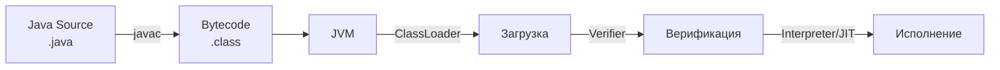
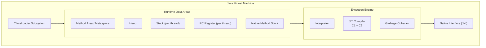
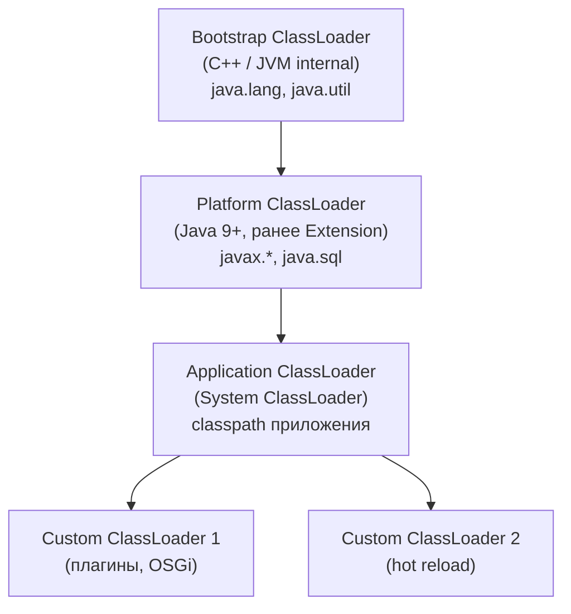
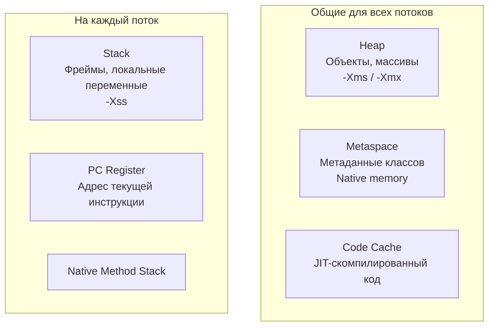
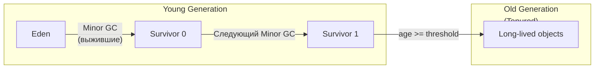
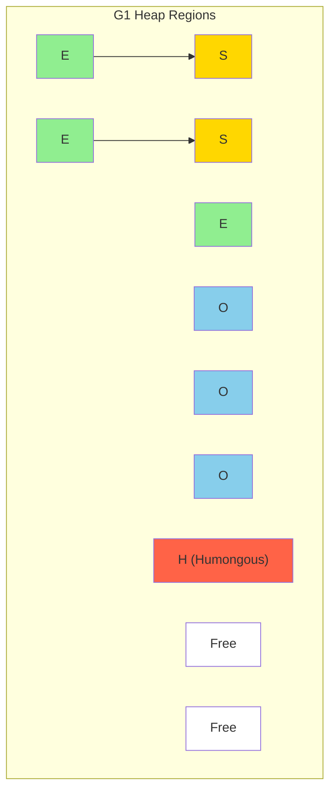
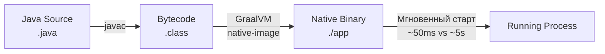

# Вопросы на собеседовании: `JVM`

Полное покрытие `JVM`: архитектура, модель памяти, `Garbage Collection`, `JIT`-компиляция, `ClassLoader`, диагностика, флаги для production, `GraalVM` и native images.

## Полезные ссылки

### Официальная документация

- [JVM Specification (SE 21)](https://docs.oracle.com/javase/specs/jvms/se21/html/) — спецификация виртуальной машины
- [Java Garbage Collection Tuning Guide](https://docs.oracle.com/en/java/javase/21/gctuning/) — руководство по настройке GC
- [JVM Tool Interface (JVMTI)](https://docs.oracle.com/en/java/javase/21/docs/specs/jvmti.html) — спецификация инструментирования
- [Baeldung - JVM Parameters](https://www.baeldung.com/jvm-parameters) — обзор важнейших параметров JVM
- [Baeldung - JVM Garbage Collectors](https://www.baeldung.com/jvm-garbage-collectors) — обзор сборщиков мусора
- [Baeldung - Tiered Compilation](https://www.baeldung.com/jvm-tiered-compilation) — многоуровневая компиляция

## Содержание

- [Полезные ссылки](#полезные-ссылки)
- [See also](#see-also)

**Архитектура JVM**
- [Q1. (!) Что такое JVM и зачем она нужна?](#q1--что-такое-jvm-и-зачем-она-нужна)
- [Q2. (!) Из каких компонентов состоит JVM?](#q2--из-каких-компонентов-состоит-jvm)
- [Q3. Что такое байткод и как JVM его выполняет?](#q3-что-такое-байткод-и-как-jvm-его-выполняет)
- [Q4. Чем отличаются JVM, JRE и JDK?](#q4-чем-отличаются-jvm-jre-и-jdk)

**JIT-компиляция и GraalVM**
- [Q5. (!) Что такое JIT-компиляция и как она работает?](#q5--что-такое-jit-компиляция-и-как-она-работает)
- [Q6. Что такое Tiered Compilation?](#q6-что-такое-tiered-compilation)
- [Q7. Что такое GraalVM и AOT-компиляция?](#q7-что-такое-graalvm-и-aot-компиляция)

**ClassLoader**
- [Q8. (!) Как работает иерархия ClassLoader в JVM?](#q8--как-работает-иерархия-classloader-в-jvm)
- [Q9. Что такое принцип делегирования ClassLoader?](#q9-что-такое-принцип-делегирования-classloader)
- [Q10. Когда нужен кастомный ClassLoader?](#q10-когда-нужен-кастомный-classloader)

**Модель памяти JVM**
- [Q11. (!) Какие области памяти существуют в JVM?](#q11--какие-области-памяти-существуют-в-jvm)
- [Q12. (!) Что такое Stack и Heap и чем они отличаются?](#q12--что-такое-stack-и-heap-и-чем-они-отличаются)
- [Q13. Что такое Metaspace и чем он заменил PermGen?](#q13-что-такое-metaspace-и-чем-он-заменил-permgen)
- [Q14. Что происходит при нехватке памяти в Heap?](#q14-что-происходит-при-нехватке-памяти-в-heap)

**Garbage Collection — основы**
- [Q15. (!) Что такое Garbage Collection и зачем он нужен?](#q15--что-такое-garbage-collection-и-зачем-он-нужен)
- [Q16. (!) Что такое Generational Garbage Collection?](#q16--что-такое-generational-garbage-collection)
- [Q17. (!) Что означает Stop-The-World?](#q17--что-означает-stop-the-world)
- [Q18. Когда объект становится пригодным для GC?](#q18-когда-объект-становится-пригодным-для-gc)
- [Q19. (!) В чём разница между Strong, Weak, Soft и Phantom ссылками?](#q19--в-чём-разница-между-strong-weak-soft-и-phantom-ссылками)
- [Q20. Можно ли запустить GC из кода? Стоит ли?](#q20-можно-ли-запустить-gc-из-кода-стоит-ли)
- [Q21. Пригодны ли циклические ссылки для GC?](#q21-пригодны-ли-циклические-ссылки-для-gc)

**Сборщики мусора**
- [Q22. (!) Какие сборщики мусора доступны в HotSpot JVM?](#q22--какие-сборщики-мусора-доступны-в-hotspot-jvm)
- [Q23. (!) Как работает G1 Garbage Collector?](#q23--как-работает-g1-garbage-collector)
- [Q24. (!) Как работает ZGC?](#q24--как-работает-zgc)
- [Q25. Как работает Shenandoah?](#q25-как-работает-shenandoah)
- [Q26. Как выбрать сборщик мусора для production?](#q26-как-выбрать-сборщик-мусора-для-production)

**Настройка и флаги JVM**
- [Q27. (!) Какие флаги JVM наиболее важны для production?](#q27--какие-флаги-jvm-наиболее-важны-для-production)
- [Q28. Как настроить размер Heap?](#q28-как-настроить-размер-heap)
- [Q29. (!) Как уменьшить GC-паузы?](#q29--как-уменьшить-gc-паузы)
- [Q30. Как JVM работает в контейнерах Docker/Kubernetes?](#q30-как-jvm-работает-в-контейнерах-dockerkubernetes)

**Диагностика и мониторинг**
- [Q31. (!) Какие инструменты доступны для диагностики JVM?](#q31--какие-инструменты-доступны-для-диагностики-jvm)
- [Q32. Что такое Heap Dump и Thread Dump?](#q32-что-такое-heap-dump-и-thread-dump)
- [Q33. Как диагностировать утечку памяти в Java?](#q33-как-диагностировать-утечку-памяти-в-java)
- [Q34. Что такое Java Flight Recorder и JFR Events?](#q34-что-такое-java-flight-recorder-и-jfr-events)

**Прочие вопросы**
- [Q35. Есть ли деструктор в Java?](#q35-есть-ли-деструктор-в-java)
- [Q36. Можно ли воскресить объект после finalize?](#q36-можно-ли-воскресить-объект-после-finalize)
- [Q37. Что такое Escape Analysis и скалярная замена?](#q37-что-такое-escape-analysis-и-скалярная-замена)

**GraalVM Native Image и AOT**
- [Q38. (!) Как работает GraalVM Native Image и каковы ограничения?](#q38-как-работает-graalvm-native-image-и-каковы-ограничения)
- [Q39. Как JIT-компилятор обнаруживает "горячие" методы?](#q39-как-jit-компилятор-обнаруживает-горячие-методы)
- [Q40. Что такое AOT-компиляция в контексте Spring Boot 3?](#q40-что-такое-aot-компиляция-в-контексте-spring-boot-3)

---

## Q1. (!) Что такое `JVM` и зачем она нужна?

**`JVM`** (`Java Virtual Machine`) — виртуальная машина, которая выполняет `Java`-байткод. Главный принцип — **Write Once, Run Anywhere**: один и тот же `.class`-файл работает на любой платформе, где есть `JVM`.

Основные функции `JVM`:
- **Загрузка классов** — `ClassLoader` находит и загружает `.class`-файлы
- **Верификация байткода** — проверка корректности и безопасности
- **Исполнение** — интерпретация или `JIT`-компиляция в нативный код
- **Управление памятью** — автоматическое выделение и освобождение (`GC`)
- **Управление потоками** — маппинг `Java`-потоков на потоки ОС



На собеседовании важно подчеркнуть, что `JVM` — это **спецификация**, а `HotSpot`, `OpenJ9`, `GraalVM` — **реализации**.

## Q2. (!) Из каких компонентов состоит `JVM`?



| Компонент | Назначение |
|-----------|-----------|
| `ClassLoader` | Загрузка, линковка и инициализация классов |
| `Method Area` / `Metaspace` | Метаданные классов, таблицы методов, `constant pool` |
| `Heap` | Хранение всех объектов; область работы `GC` |
| `Stack` | Фреймы вызовов: локальные переменные, операнды, адреса возврата |
| `PC Register` | Адрес текущей выполняемой инструкции для каждого потока |
| `Interpreter` | Построчное выполнение байткода |
| `JIT Compiler` | Компиляция «горячих» методов в нативный код |
| `GC` | Автоматическое освобождение памяти от недостижимых объектов |

## Q3. Что такое байткод и как `JVM` его выполняет?

**Байткод** — промежуточное представление программы в виде инструкций `JVM`. Генерируется компилятором `javac` из исходного кода `.java` в файлы `.class`.

```java
// Исходный код
public int add(int a, int b) {
    return a + b;
}

// Байткод (вывод javap -c):
// 0: iload_1
// 1: iload_2
// 2: iadd
// 3: ireturn
```

Просмотр байткода:

```java
// Команда для дизассемблирования
// javap -c -p MyClass.class
// javap -v MyClass.class  — подробный вывод с constant pool
```

Процесс исполнения: `ClassLoader` загружает байткод -> `Verifier` проверяет корректность -> `Interpreter` начинает выполнение -> `JIT` компилирует «горячие» методы (по счётчику вызовов, обычно ~10 000 для `C2`).

## Q4. Чем отличаются `JVM`, `JRE` и `JDK`?

| Компонент | Что включает | Для кого |
|-----------|-------------|----------|
| **`JVM`** | Виртуальная машина: `ClassLoader`, `GC`, `JIT` | Среда выполнения |
| **`JRE`** | `JVM` + стандартная библиотека (`rt.jar`) | Запуск приложений |
| **`JDK`** | `JRE` + `javac`, `javap`, `jcmd`, `jstack`, `jmap`, `jfr` | Разработка |

С `Java 11` Oracle поставляет только `JDK` — отдельной поставки `JRE` больше нет. Модульная система `JPMS` (`Java 9+`) позволяет создавать минимальный `runtime` через `jlink`.

## Q5. (!) Что такое `JIT`-компиляция и как она работает?

**`JIT`** (`Just-In-Time`) — компиляция байткода в нативный машинный код **во время выполнения** программы. `JVM` начинает с интерпретации, а затем компилирует часто вызываемые методы (hot spots) для ускорения.

В `HotSpot JVM` два компилятора:
- **`C1`** (Client) — быстрая компиляция с базовыми оптимизациями; хорош для быстрого старта
- **`C2`** (Server) — агрессивные оптимизации (инлайнинг, escape analysis, loop unrolling); максимальная производительность

Основные оптимизации `JIT`:
- **Инлайнинг** (method inlining) — встраивание тела метода в вызывающий код
- **Escape Analysis** — определение, выходит ли объект за пределы метода
- **Loop unrolling** — развёртывание циклов
- **Dead code elimination** — удаление недостижимого кода
- **Branch prediction** — оптимизация условных переходов

```java
// JIT-оптимизация: инлайнинг
// До:
public int calculate(int x) {
    return multiply(x, 2);  // вызов метода
}
private int multiply(int a, int b) {
    return a * b;
}

// После инлайнинга JIT-компилятором:
// calculate(x) → x * 2  (прямая операция, без вызова)
```

Флаги для наблюдения за `JIT`:

```java
// Логирование компиляции
// -XX:+PrintCompilation
// -XX:+UnlockDiagnosticVMOptions -XX:+PrintInlining
```

## Q6. Что такое `Tiered Compilation`?

**Tiered Compilation** (многоуровневая компиляция) — стратегия, при которой `JVM` использует оба компилятора (`C1` и `C2`) последовательно. Включена по умолчанию с `Java 8`.

5 уровней компиляции:
- **Level 0** — интерпретация
- **Level 1** — `C1` без профилирования (простые методы)
- **Level 2** — `C1` с лёгким профилированием
- **Level 3** — `C1` с полным профилированием
- **Level 4** — `C2` с агрессивными оптимизациями

```java
// Типичный путь: Level 0 → Level 3 → Level 4
// Отключение tiered compilation:
// -XX:-TieredCompilation
// Порог компиляции C2:
// -XX:CompileThreshold=10000
```

Практический эффект: быстрый старт (за счёт `C1`) + максимальная производительность после прогрева (за счёт `C2`). Это важно для микросервисов, где холодный старт критичен.

## Q7. Что такое `GraalVM` и `AOT`-компиляция?

**`GraalVM`** — универсальная виртуальная машина от Oracle, которая может выступать:
- Как замена `C2`-компилятора в `HotSpot` (Graal JIT)
- Как платформа для `AOT`-компиляции (native image)

**`AOT`** (`Ahead-of-Time`) компиляция — трансляция в нативный код **до запуска**, в отличие от `JIT`:

| Характеристика | `JIT` | `AOT` (Native Image) |
|---------------|-------|---------------------|
| Время старта | Медленнее (прогрев) | Быстрый (~50 мс) |
| Пиковая производительность | Выше (адаптивные оптимизации) | Ниже |
| Потребление памяти | Выше | Ниже (нет JIT, метаданных) |
| Применение | Долгоживущие сервисы | Serverless, CLI-утилиты |

```java
// Сборка native image (GraalVM)
// native-image -jar myapp.jar
// Spring Boot + GraalVM:
// ./mvnw -Pnative native:compile
```

Подробнее о применении в Spring Boot — в [вопросах по Spring Boot](../frameworks/spring/spring-boot-interview.md).

## Q8. (!) Как работает иерархия `ClassLoader` в `JVM`?

`ClassLoader` отвечает за загрузку `.class`-файлов в `JVM`. Иерархия основана на принципе делегирования (parent-first):



| `ClassLoader` | Что загружает | Путь |
|--------------|--------------|------|
| `Bootstrap` | Ядро `Java` (`java.lang.*`, `java.util.*`) | `$JAVA_HOME/lib` |
| `Platform` | Модули платформы (`java.sql`, `javax.crypto`) | `$JAVA_HOME/lib` |
| `Application` | Классы приложения и зависимости | `-classpath` / `-cp` |

Этапы загрузки класса: **Loading** (поиск и чтение байтов) -> **Linking** (verification, preparation, resolution) -> **Initialization** (выполнение `static`-блоков и инициализация `static`-полей).

## Q9. Что такое принцип делегирования `ClassLoader`?

**Parent-first delegation** — перед загрузкой класса `ClassLoader` делегирует запрос родителю. Только если родитель не нашёл класс, загрузчик пытается загрузить его сам.

```java
// Упрощённая логика ClassLoader.loadClass()
protected Class<?> loadClass(String name) throws ClassNotFoundException {
    // 1. Проверяем кэш — уже загружен?
    Class<?> c = findLoadedClass(name);
    if (c == null) {
        try {
            // 2. Делегируем родителю
            c = parent.loadClass(name);
        } catch (ClassNotFoundException e) {
            // 3. Родитель не нашёл — грузим сами
            c = findClass(name);
        }
    }
    return c;
}
```

Зачем это нужно:
- **Безопасность** — невозможно подменить `java.lang.String` через пользовательский загрузчик
- **Единственность** — один класс загружается один раз
- **Изоляция** — разные загрузчики могут загружать разные версии одного класса (например, в application серверах)

Типичные ошибки: `ClassNotFoundException` (класс не найден вообще), `NoClassDefFoundError` (класс найден при компиляции, но не найден в runtime), `ClassCastException` при разных `ClassLoader` (два «одинаковых» класса из разных загрузчиков несовместимы).

## Q10. Когда нужен кастомный `ClassLoader`?

Типичные сценарии:
- **Плагин-системы** — загрузка кода из внешних JAR без перезапуска (например, `OSGi`)
- **Hot reload** — перезагрузка изменённых классов в dev-среде (Spring DevTools)
- **Изоляция зависимостей** — разные версии одной библиотеки для разных модулей
- **Загрузка из нестандартных источников** — сеть, БД, шифрованные архивы

```java
public class PluginClassLoader extends ClassLoader {
    private final Path pluginDir;

    public PluginClassLoader(Path pluginDir, ClassLoader parent) {
        super(parent);
        this.pluginDir = pluginDir;
    }

    @Override
    protected Class<?> findClass(String name) throws ClassNotFoundException {
        Path classFile = pluginDir.resolve(
            name.replace('.', '/') + ".class"
        );
        try {
            byte[] bytes = Files.readAllBytes(classFile);
            return defineClass(name, bytes, 0, bytes.length);
        } catch (IOException e) {
            throw new ClassNotFoundException(name, e);
        }
    }
}
```

Важно: кастомный `ClassLoader` может вызвать утечку `Metaspace`, если загруженные классы не выгружаются (классы выгружаются только при сборке мусора от самого `ClassLoader`).

## Q11. (!) Какие области памяти существуют в `JVM`?



| Область | Scope | Содержимое | Ключевые флаги |
|---------|-------|-----------|----------------|
| `Heap` | Общая | Объекты, массивы | `-Xms`, `-Xmx` |
| `Metaspace` | Общая | Метаданные классов | `-XX:MaxMetaspaceSize` |
| `Code Cache` | Общая | Нативный код от `JIT` | `-XX:ReservedCodeCacheSize` |
| `Stack` | Per-thread | Фреймы вызовов | `-Xss` (по умолчанию 512KB-1MB) |
| `PC Register` | Per-thread | Адрес текущей инструкции | — |
| `Direct Memory` | Off-heap | `ByteBuffer.allocateDirect()` | `-XX:MaxDirectMemorySize` |

Подробнее об анализе потребления памяти — в [вопросах по управлению памятью](../performance/memory-management-interview.md).

## Q12. (!) Что такое `Stack` и `Heap` и чем они отличаются?

| Характеристика | `Stack` | `Heap` |
|---------------|---------|--------|
| Что хранит | Примитивы, ссылки, фреймы вызовов | Объекты, массивы |
| Scope | Per-thread (приватный) | Общий для всех потоков |
| Размер | Фиксированный (`-Xss`) | Динамический (`-Xms` / `-Xmx`) |
| Скорость доступа | Быстрый (LIFO) | Медленнее (поиск по ссылке) |
| Ошибка переполнения | `StackOverflowError` | `OutOfMemoryError` |
| Управление | Автоматическое (LIFO) | `Garbage Collector` |

```java
public void example() {
    int x = 42;               // x — в Stack (примитив)
    String s = "hello";        // s (ссылка) — в Stack, объект String — в Heap
    List<String> list = new ArrayList<>(); // list (ссылка) — Stack, ArrayList — Heap
    list.add(s);               // внутри ArrayList ссылка на тот же String в Heap
}
// При выходе из метода — фрейм Stack удаляется,
// объекты в Heap живут, пока на них есть ссылки
```

`StackOverflowError` чаще всего возникает при бесконечной рекурсии; `OutOfMemoryError: Java heap space` — при создании слишком большого количества объектов.

## Q13. Что такое `Metaspace` и чем он заменил `PermGen`?

**`PermGen`** (Permanent Generation, до `Java 8`) — фиксированная область в `Heap` для метаданных классов. Часто приводила к `OutOfMemoryError: PermGen space`, особенно при частом `hot deploy`.

**`Metaspace`** (с `Java 8`) — хранит те же метаданные, но в **нативной памяти** ОС:

| Свойство | `PermGen` | `Metaspace` |
|----------|----------|------------|
| Расположение | Часть `Heap` | Нативная память ОС |
| Размер | Фиксированный (`-XX:MaxPermSize`) | Динамический, растёт по запросу |
| Лимит | Обязателен | Опциональный (`-XX:MaxMetaspaceSize`) |
| `GC` | `Full GC` | `Metadata GC Threshold` |

```java
// Настройка Metaspace
// -XX:MetaspaceSize=128m        — порог для срабатывания GC метаданных
// -XX:MaxMetaspaceSize=512m     — жёсткий лимит (рекомендуется в production)

// Мониторинг Metaspace
// jcmd <pid> VM.metaspace
```

Утечка `Metaspace` возникает при многократном `hot deploy` (например, в `Tomcat`), когда старые `ClassLoader` не выгружаются из-за удержания ссылок.

## Q14. Что происходит при нехватке памяти в `Heap`?

Когда `JVM` не может выделить память для нового объекта:

1. Запускается `Minor GC` (сборка `Young Generation`)
2. Если места всё ещё нет — запускается `Full GC` (сборка всего `Heap`)
3. Если после `Full GC` памяти не хватает — выбрасывается `OutOfMemoryError`

Типы `OutOfMemoryError`:

```java
// Недостаточно Heap
java.lang.OutOfMemoryError: Java heap space

// GC работает слишком долго (>98% времени — GC, <2% освобождается)
java.lang.OutOfMemoryError: GC overhead limit exceeded

// Не хватает Metaspace
java.lang.OutOfMemoryError: Metaspace

// Не хватает нативной памяти для потоков
java.lang.OutOfMemoryError: unable to create new native thread

// Не хватает direct memory
java.lang.OutOfMemoryError: Direct buffer memory
```

Рекомендации: всегда включать `-XX:+HeapDumpOnOutOfMemoryError -XX:HeapDumpPath=/tmp/heapdump.hprof` в production для посмертного анализа.

## Q15. (!) Что такое `Garbage Collection` и зачем он нужен?

**`Garbage Collection`** (`GC`) — автоматическое освобождение памяти от объектов, которые больше не достижимы из корневых ссылок (`GC Roots`).

**`GC Roots`** — начальные точки обхода графа объектов:
- Локальные переменные и параметры методов в стеках потоков
- Активные потоки (`Thread` objects)
- Статические переменные загруженных классов
- Ссылки из `JNI`

Базовый алгоритм: **Mark-and-Sweep**:
1. **Mark** — обход графа от `GC Roots`, пометка достижимых объектов
2. **Sweep** — освобождение памяти недостижимых объектов
3. **Compact** (опционально) — уплотнение, устранение фрагментации

Преимущества: нет ручного `malloc`/`free`; отсутствие `dangling pointer`; автоматическое предотвращение утечек. Недостатки: `STW`-паузы; непредсказуемость; потребление `CPU` и памяти на работу `GC`.

## Q16. (!) Что такое `Generational Garbage Collection`?

Основан на **гипотезе поколений**: большинство объектов живут очень недолго (infant mortality). `Heap` делится на поколения:



| Область | Назначение | Тип GC | Характеристика |
|---------|-----------|--------|---------------|
| `Eden` | Создание новых объектов | `Minor GC` | Быстрый, частый |
| `Survivor` (S0, S1) | Промежуточное хранение | `Minor GC` | Copy-collection |
| `Old Generation` | Долгоживущие объекты | `Major/Full GC` | Редкий, долгий |

`Minor GC` происходит при заполнении `Eden`; объекты перемещаются в `Survivor`. После N циклов (по умолчанию 15, настраивается `-XX:MaxTenuringThreshold`) объект промотируется в `Old Generation`.

## Q17. (!) Что означает `Stop-The-World`?

**`Stop-The-World`** (`STW`) — пауза, во время которой `JVM` останавливает **все** потоки приложения для безопасного выполнения `GC`. Во время `STW`:

- Потоки приложения замораживаются в **safepoint**
- `GC` выполняет маркировку / копирование / компактирование
- После завершения потоки возобновляются

Влияние на приложение: рост latency, таймауты, дёрганье UI. Для latency-критичных приложений (`<10 мс p99`) `STW`-паузы — главная проблема.

Способы минимизации:
- Использование `ZGC` или `Shenandoah` (паузы `<1 мс`)
- Настройка `-XX:MaxGCPauseMillis` для `G1`
- Уменьшение количества живых объектов в `Old Generation`
- Мониторинг: `GC`-логи (`-Xlog:gc*`), [инструменты наблюдаемости](../monitoring/observability-interview.md)

## Q18. Когда объект становится пригодным для `GC`?

Объект пригоден для `GC`, когда он **недостижим** из `GC Roots` — нет ни одной цепочки ссылок от корневых объектов до него.

Типичные сценарии:

```java
// 1. Обнуление ссылки
Object obj = new Object();
obj = null;  // объект пригоден для GC

// 2. Выход из области видимости
void method() {
    Object local = new Object();
}  // local выходит из scope — объект пригоден для GC

// 3. Переназначение ссылки
Object obj = new Object();  // первый объект
obj = new Object();          // первый объект пригоден для GC

// 4. Изоляция (island of isolation)
class Node { Node next; }
Node a = new Node();
Node b = new Node();
a.next = b;
b.next = a;
a = null;
b = null;  // циклическая структура недостижима — оба пригодны для GC
```

Важно: `GC` определяет достижимость от `GC Roots`, а не считает ссылки (reference counting). Поэтому циклические ссылки **не** являются проблемой.

## Q19. (!) В чём разница между `Strong`, `Weak`, `Soft` и `Phantom` ссылками?

| Тип ссылки | Класс | Когда собирается GC | Типичное применение |
|-----------|-------|-------------------|-------------------|
| `Strong` | прямая ссылка | Никогда (пока достижима) | Обычный код |
| `Soft` | `SoftReference<T>` | При нехватке памяти | Кэши |
| `Weak` | `WeakReference<T>` | При следующем `GC` | `WeakHashMap`, listeners |
| `Phantom` | `PhantomReference<T>` | После `finalize` | Очистка ресурсов, `Cleaner` |

```java
// Soft — кэширование: объект живёт, пока хватает памяти
SoftReference<byte[]> cache = new SoftReference<>(new byte[1024 * 1024]);
byte[] data = cache.get(); // может вернуть null, если GC собрал

// Weak — не мешает GC
WeakReference<Object> weak = new WeakReference<>(new Object());
// После GC: weak.get() == null

// WeakHashMap — ключи на weak-ссылках
WeakHashMap<Object, String> map = new WeakHashMap<>();
Object key = new Object();
map.put(key, "value");
key = null;  // после GC запись удалится из map

// Phantom — для finalization-замены (через ReferenceQueue)
ReferenceQueue<Object> queue = new ReferenceQueue<>();
PhantomReference<Object> phantom = new PhantomReference<>(new Object(), queue);
// phantom.get() всегда возвращает null
// объект появится в queue после finalize
```

На собеседовании важно знать: `SoftReference` гарантированно очищается **перед** `OutOfMemoryError`; `WeakReference` очищается при **любом** `GC`.

## Q20. Можно ли запустить `GC` из кода? Стоит ли?

```java
System.gc();             // «подсказка» JVM запустить GC
Runtime.getRuntime().gc(); // эквивалент
```

`System.gc()` — это только **рекомендация**; `JVM` может проигнорировать вызов. В production его обычно **отключают** флагом:

```java
// Отключение System.gc()
// -XX:+DisableExplicitGC
```

Когда `System.gc()` может быть полезен:
- В бенчмарках (для предсказуемого состояния памяти)
- При работе с `DirectByteBuffer` (off-heap память)
- В тестах

В production `System.gc()` вызывает `Full GC` с длинной `STW`-паузой — это антипаттерн.

## Q21. Пригодны ли циклические ссылки для `GC`?

Да. `GC` в `JVM` использует **tracing** (обход от `GC Roots`), а не **reference counting** (подсчёт ссылок). Если вся циклическая структура недостижима из `GC Roots`, все объекты в цикле собираются.

```java
// node1 → node2 → node3 → node1 (цикл)
node1 = null;
node2 = null;
node3 = null;
// Все три объекта недостижимы из GC Roots — будут собраны
```

Это отличие от языков с reference counting (например, `CPython`), где циклы требуют отдельного детектора.

## Q22. (!) Какие сборщики мусора доступны в `HotSpot JVM`?

| Сборщик | Флаг | Паузы | `Heap` | Доступность |
|---------|------|-------|--------|------------|
| **Serial** | `-XX:+UseSerialGC` | Длинные, STW | Малый | Все версии |
| **Parallel** | `-XX:+UseParallelGC` | Средние, STW | Средний | Все, default до Java 8 |
| **G1** | `-XX:+UseG1GC` | Управляемые | Большой | Java 7+, default с Java 9 |
| **ZGC** | `-XX:+UseZGC` | `<1 мс` | До 16 TB | Java 15+ (production) |
| **Shenandoah** | `-XX:+UseShenandoahGC` | `<10 мс` | Большой | Java 12+ (OpenJDK) |

`CMS` (`Concurrent Mark-Sweep`) удалён в `Java 14`.

```java
// Определить текущий GC:
// java -XX:+PrintFlagsFinal -version 2>&1 | grep UseGC
// или: jcmd <pid> VM.flags
```

## Q23. (!) Как работает `G1 Garbage Collector`?

**`G1`** (Garbage First) — регионарный сборщик, по умолчанию с `Java 9`. Делит `Heap` на равные **регионы** (обычно 2048 штук, размер 1-32 MB).



Каждый регион может быть `Eden`, `Survivor`, `Old` или `Humongous` (для объектов > 50% региона).

Фазы `G1`:
1. **Young GC** — собирает `Eden` и `Survivor` регионы (`STW`)
2. **Concurrent Marking** — параллельно с приложением маркирует живые объекты
3. **Mixed GC** — собирает `Young` + часть `Old` регионов с наибольшим количеством мусора («Garbage First»)

```java
// Ключевые флаги G1
// -XX:+UseG1GC
// -XX:MaxGCPauseMillis=200         — целевая пауза (мс)
// -XX:G1HeapRegionSize=16m         — размер региона
// -XX:InitiatingHeapOccupancyPercent=45  — порог запуска concurrent marking
```

## Q24. (!) Как работает `ZGC`?

**`ZGC`** — сборщик со сверхнизкими паузами (обычно `<1 мс`), не зависящими от размера `Heap`. Поддерживает `Heap` до **16 TB**.

Ключевые механизмы:
- **Colored pointers** — метаданные хранятся в самих указателях (использует биты адреса)
- **Load barriers** — проверка и коррекция указателей при чтении
- **Concurrent relocation** — перемещение объектов параллельно с работой приложения

С `Java 21` доступен **Generational `ZGC`** (`-XX:+UseZGC -XX:+ZGenerational`), который разделяет `Heap` на поколения, улучшая производительность для типичных нагрузок.

```java
// Включение ZGC
// -XX:+UseZGC

// Generational ZGC (Java 21+)
// -XX:+UseZGC -XX:+ZGenerational

// ZGC автоматически определяет Heap — можно задать:
// -Xmx16g
// -XX:SoftMaxHeapSize=8g  — мягкий лимит (ZGC попытается не превышать)
```

`ZGC` — лучший выбор для latency-критичных приложений (торговые платформы, real-time системы) с `Java 17+`.

## Q25. Как работает `Shenandoah`?

**`Shenandoah`** — регионарный сборщик с низкими паузами, доступен в `OpenJDK` с `Java 12`. Как и `ZGC`, выполняет большую часть работы конкурентно.

Отличие от `G1`: `Shenandoah` выполняет **конкурентную компактацию** (перемещение объектов без `STW`), используя **forwarding pointers** (дополнительное слово в заголовке каждого объекта).

Отличие от `ZGC`: не использует colored pointers, работает с обычными указателями; немного выше overhead на forwarding pointer; доступен в `OpenJDK`, но **не в Oracle JDK**.

```java
// Включение Shenandoah
// -XX:+UseShenandoahGC

// Режим работы:
// -XX:ShenandoahGCMode=normal    — конкурентный (default)
// -XX:ShenandoahGCMode=iu        — incremental update
// -XX:ShenandoahGCMode=passive   — STW (для отладки)
```

## Q26. Как выбрать сборщик мусора для production?

Критерии выбора:

| Критерий | Рекомендация |
|----------|-------------|
| Latency `<10 мс` p99 | `ZGC` или `Shenandoah` |
| Throughput (batch, ETL) | `Parallel GC` |
| Универсальный (API, web) | `G1` (default) |
| Малый `Heap` (`<256 MB`) | `Serial GC` |
| Контейнеры с малой памятью | `Serial` или `G1` с настройкой |

Процесс выбора:
1. Начать с `G1` (default) — он подходит для 80% задач
2. Измерить `GC`-паузы и throughput через `GC`-логи
3. Если паузы неприемлемы — перейти на `ZGC`
4. Для batch/throughput — попробовать `Parallel GC`

Подробнее о настройке производительности — в [вопросах по JVM Performance Tuning](../performance/jvm-performance-tuning-interview.md).

## Q27. (!) Какие флаги `JVM` наиболее важны для production?

```java
// === Память ===
-Xms4g -Xmx4g                        // Heap: начальный = максимальный (избежать resize)
-XX:MaxMetaspaceSize=512m             // Лимит Metaspace
-XX:MaxDirectMemorySize=256m          // Лимит direct memory (NIO)

// === Garbage Collector ===
-XX:+UseG1GC                          // или -XX:+UseZGC
-XX:MaxGCPauseMillis=200              // Целевая пауза (G1)

// === Диагностика OOM ===
-XX:+HeapDumpOnOutOfMemoryError       // Дамп при OOM
-XX:HeapDumpPath=/var/log/app/heapdump.hprof
-XX:+ExitOnOutOfMemoryError           // Завершить процесс при OOM

// === GC-логирование (Java 9+) ===
-Xlog:gc*:file=/var/log/app/gc.log:time,level,tags:filecount=5,filesize=50m

// === Кодировка ===
-Dfile.encoding=UTF-8

// === Контейнеры ===
-XX:+UseContainerSupport              // Учитывать cgroup-лимиты (default с Java 10)
-XX:MaxRAMPercentage=75.0             // % от RAM контейнера вместо -Xmx
```

Антипаттерн: задавать `-Xmx` больше memory limit контейнера — `JVM` будет убита `OOM Killer` ОС.

## Q28. Как настроить размер `Heap`?

Основные флаги:

```java
-Xms2g    // Начальный размер Heap
-Xmx2g    // Максимальный размер Heap (рекомендуется = -Xms)
-Xmn512m  // Размер Young Generation (обычно 1/4 - 1/3 от -Xmx)
```

Рекомендации:
- **`-Xms` = `-Xmx`** — избежать дорогого resize в runtime
- **Не более 75%** RAM хоста/контейнера (остальное — `Metaspace`, `Code Cache`, direct memory, стеки потоков, ОС)
- Мониторинг: если `GC` занимает >5-10% времени (`GC overhead`) — возможно, нужно увеличить `Heap` или оптимизировать аллокации

```java
// Пример для контейнера с 4 GB RAM:
-XX:MaxRAMPercentage=75.0    // JVM возьмёт ~3 GB под Heap
// или явно:
-Xms3g -Xmx3g
```

Когда увеличивать `Heap`:
- Частые `OutOfMemoryError: Java heap space`
- `GC overhead limit exceeded`
- Высокая доля `Full GC` в логах

Когда **уменьшать**: слишком длинные `GC`-паузы (особенно при `Parallel`/`G1`).

## Q29. (!) Как уменьшить `GC`-паузы?

1. **Выбор сборщика**: `ZGC` / `Shenandoah` для минимальных пауз
2. **Настройка `G1`**: `-XX:MaxGCPauseMillis=100` (снизить целевую паузу)
3. **Уменьшение аллокаций**: меньше объектов — меньше работы для `GC`
4. **Object pooling** с осторожностью (для тяжёлых объектов: соединения, буферы)
5. **Избегать `Humongous` объектов** в `G1` (объекты > 50% региона)
6. **Настройка поколений**: `-XX:MaxTenuringThreshold` — как быстро объекты уходят в `Old Gen`

```java
// Пример: минимизация пауз с G1
-XX:+UseG1GC
-XX:MaxGCPauseMillis=100
-XX:G1HeapRegionSize=16m
-XX:ParallelGCThreads=8
-XX:ConcGCThreads=4
-XX:InitiatingHeapOccupancyPercent=35

// Пример: ZGC для субмиллисекундных пауз
-XX:+UseZGC
-Xmx8g
```

Мониторинг пауз: анализ `GC`-логов через [GCEasy](https://gceasy.io/) или [GCViewer](https://github.com/chewiebug/GCViewer).

## Q30. Как `JVM` работает в контейнерах `Docker`/`Kubernetes`?

С `Java 10+` `JVM` учитывает `cgroup`-лимиты контейнера (флаг `-XX:+UseContainerSupport` включён по умолчанию).

Основные проблемы и решения:

| Проблема | Решение |
|----------|---------|
| `JVM` не видит лимит памяти | Обновить `Java` >= 10; `-XX:+UseContainerSupport` |
| `OOM Killer` от ОС | `-XX:MaxRAMPercentage=75.0` вместо `-Xmx` больше лимита |
| Неправильное количество CPU | `-XX:ActiveProcessorCount=N` при необходимости |
| Долгий старт | `CDS` (Class Data Sharing), `AppCDS`, или `GraalVM` native image |

```java
// Dockerfile — пример
// ENV JAVA_OPTS="-XX:MaxRAMPercentage=75.0 \
//   -XX:+UseZGC \
//   -XX:+HeapDumpOnOutOfMemoryError \
//   -XX:HeapDumpPath=/tmp/heapdump.hprof \
//   -Xlog:gc*:file=/tmp/gc.log:time"
// ENTRYPOINT ["java", "$JAVA_OPTS", "-jar", "app.jar"]
```

Подробнее о контейнеризации — в [вопросах по Docker](../devops/docker-interview.md) и [Kubernetes](../devops/kubernetes-interview.md).

## Q31. (!) Какие инструменты доступны для диагностики `JVM`?

| Инструмент | Назначение | Тип |
|-----------|-----------|-----|
| `jcmd` | Универсальный: дампы, `GC`, `JFR`, флаги | CLI (в JDK) |
| `jstack` | Thread dump | CLI (в JDK) |
| `jmap` | Heap dump, гистограмма объектов | CLI (в JDK) |
| `jstat` | Статистика `GC`, компиляции | CLI (в JDK) |
| `jconsole` | Мониторинг через `JMX` | GUI (в JDK) |
| `VisualVM` | Профилирование, дампы, мониторинг | GUI (отдельно) |
| `Java Mission Control` | `JFR`-анализ, мониторинг | GUI (в JDK) |
| `async-profiler` | CPU/allocation profiling, flame graphs | CLI/GUI |
| `Eclipse MAT` | Анализ heap dump | GUI |

```java
// Примеры использования jcmd:
// jcmd <pid> VM.flags           — текущие JVM-флаги
// jcmd <pid> GC.heap_info       — информация о Heap
// jcmd <pid> Thread.print       — thread dump
// jcmd <pid> GC.heap_dump /tmp/dump.hprof  — heap dump
// jcmd <pid> JFR.start duration=60s filename=recording.jfr
```

Подробнее в [вопросах по профилированию приложений](../performance/application-profiling-interview.md).

## Q32. Что такое `Heap Dump` и `Thread Dump`?

**`Heap Dump`** — снимок всех объектов в `Heap` на момент создания. Используется для анализа утечек памяти и оптимизации.

**`Thread Dump`** — снимок состояния всех потоков (стек вызовов, состояние, блокировки). Используется для диагностики deadlock, высокой загрузки CPU, зависших потоков.

```java
// Heap Dump
// jcmd <pid> GC.heap_dump /tmp/heapdump.hprof
// jmap -dump:format=b,file=/tmp/heapdump.hprof <pid>
// Автоматически при OOM: -XX:+HeapDumpOnOutOfMemoryError

// Thread Dump
// jcmd <pid> Thread.print
// jstack <pid>
// kill -3 <pid>   (SIGQUIT — не убивает процесс, выводит dump в stdout)
```

Инструменты анализа:
- **`Eclipse MAT`** — анализ `Heap Dump` (Dominator Tree, Leak Suspects)
- **`fastthread.io`** — онлайн-анализ `Thread Dump`
- **`Java Mission Control`** — анализ записей `JFR`

## Q33. Как диагностировать утечку памяти в `Java`?

Утечка памяти в `Java` — когда объекты остаются достижимыми из `GC Roots`, но фактически больше не нужны приложению.

Типичные причины:
- Коллекции, растущие без ограничения (кэш без `eviction`)
- Статические коллекции / `static Map`
- Listener-ы и callback-и без deregistration
- Незакрытые ресурсы (`Connection`, `InputStream`)
- Утечки `ClassLoader` (hot deploy)
- `ThreadLocal` без `remove()`

Алгоритм диагностики:
1. Включить `-XX:+HeapDumpOnOutOfMemoryError`
2. Мониторить `Old Gen` — если непрерывно растёт, есть утечка
3. Снять `Heap Dump` через `jcmd`
4. Открыть в `Eclipse MAT` -> «Leak Suspects» или «Dominator Tree»
5. Найти объекты с аномально большим retained size
6. Проследить цепочку ссылок до `GC Root`

```java
// Пример утечки: ThreadLocal без remove()
private static final ThreadLocal<List<byte[]>> cache = new ThreadLocal<>();

public void process() {
    cache.set(new ArrayList<>());
    cache.get().add(new byte[1024 * 1024]); // 1 MB
    // cache.remove() не вызван!
    // В thread pool поток переиспользуется — данные копятся
}
```

## Q34. Что такое `Java Flight Recorder` и `JFR Events`?

**`Java Flight Recorder`** (`JFR`) — встроенный в `JVM` механизм профилирования с минимальным overhead (обычно `<2%`). Доступен бесплатно с `Java 11` (OpenJDK).

`JFR` записывает **события** (events): `GC`-паузы, аллокации, загрузка классов, блокировки, `I/O`, компиляция `JIT` и др.

```java
// Запуск записи JFR
// При старте:
// -XX:StartFlightRecording=duration=300s,filename=app.jfr
//
// На работающем процессе:
// jcmd <pid> JFR.start duration=60s filename=recording.jfr
// jcmd <pid> JFR.dump filename=recording.jfr
// jcmd <pid> JFR.stop

// Анализ: открыть .jfr в Java Mission Control (JMC)
```

Программный API `JFR` (`Java 9+`):

```java
// Создание пользовательского JFR-события
@jdk.jfr.Label("Order Processing")
@jdk.jfr.Category("Business")
public class OrderEvent extends jdk.jfr.Event {
    @jdk.jfr.Label("Order ID")
    long orderId;
    @jdk.jfr.Label("Duration ms")
    long durationMs;
}

// Использование:
OrderEvent event = new OrderEvent();
event.begin();
processOrder(orderId);
event.orderId = orderId;
event.durationMs = elapsed;
event.commit();
```

`JFR` — рекомендуемый инструмент для production-мониторинга, поскольку он встроен в `JVM` и не требует агентов. Подробнее — в [вопросах по метрикам и трейсингу](../monitoring/metrics-tracing-interview.md).

## Q35. Есть ли деструктор в `Java`?

В `Java` **нет деструкторов** в стиле `C++`. Управление памятью полностью возложено на `GC`.

Для освобождения ресурсов (файлы, соединения, сокеты) используется паттерн `try-with-resources` с `AutoCloseable`:

```java
// Правильный подход (Java 7+)
try (var conn = dataSource.getConnection();
     var stmt = conn.prepareStatement(sql);
     var rs = stmt.executeQuery()) {
    while (rs.next()) {
        process(rs);
    }
}  // conn, stmt, rs закрываются автоматически

// Устаревший подход
public class LegacyResource {
    @Override
    protected void finalize() throws Throwable {
        // НЕ рекомендуется! Deprecated с Java 9
        // Нет гарантии вызова; проблемы с производительностью
        cleanup();
    }
}
```

Замена `finalize` (с `Java 9`): `java.lang.ref.Cleaner` — безопаснее, но тоже без гарантий своевременного вызова. Лучшая практика — **всегда** использовать `try-with-resources`.

## Q36. Можно ли воскресить объект после `finalize`?

Да, технически в методе `finalize()` можно присвоить `this` статическому полю, и объект снова станет достижимым:

```java
public class Zombie {
    static Zombie instance;

    @Override
    protected void finalize() {
        instance = this;  // «воскрешение»
    }
}

// Zombie z = new Zombie();
// z = null; System.gc();
// Zombie.instance != null — объект «воскрес»
// Повторное обнуление: Zombie.instance = null; System.gc();
// finalize() НЕ вызовется повторно — объект собран окончательно
```

`finalize()` гарантированно вызывается **максимум один раз**. Этот трюк — антипаттерн; `finalize()` deprecated с `Java 9`.

## Q37. Что такое `Escape Analysis` и скалярная замена?

**`Escape Analysis`** — оптимизация `JIT`-компилятора `C2`, которая определяет, «убегает» ли объект за пределы метода или потока.

Если объект **не убегает**, `JIT` может применить:
- **Scalar replacement** — разложить объект на отдельные поля в регистрах/стеке (без аллокации в `Heap`)
- **Stack allocation** — разместить объект на стеке (фактически через scalar replacement)
- **Lock elision** — убрать синхронизацию, если объект не разделяется между потоками

```java
// Пример: объект Point не убегает из метода
public int sumCoordinates() {
    Point p = new Point(3, 4);  // JIT может НЕ создавать объект в Heap
    return p.x + p.y;           // scalar replacement: просто 3 + 4
}

// Результат: нет аллокации → нет нагрузки на GC → быстрее
```

```java
// Флаги (включены по умолчанию):
// -XX:+DoEscapeAnalysis
// -XX:+EliminateAllocations
// -XX:+EliminateLocks
```

Практическое значение: объекты-обёртки (`Optional`, `Iterator`, маленькие `DTO`) часто элиминируются `JIT`-компилятором, поэтому «много мелких объектов» — не всегда проблема для производительности. Подробнее о концепциях оптимизации — в [вопросах по Java Concurrency](../programming-languages/java/java-concurrency-interview.md).

## Q38. (!) Как работает GraalVM Native Image и каковы ограничения?

**GraalVM Native Image** — инструмент компиляции Java-приложения в нативный бинарник заранее (AOT — Ahead-Of-Time). Результат: исполняемый файл без JVM, запускается за миллисекунды.

**Как это работает:**



`native-image` выполняет **closed-world analysis** — статически анализирует весь граф достижимых классов и методов, затем компилирует их в нативный код. Всё что не достижимо статически — не включается.

**Запуск native image:**
```bash
# Сборка (требует GraalVM JDK)
./gradlew nativeCompile

# Результат
./build/native/nativeCompile/app   # ~50-100 MB, запускается за ~50ms
```

**Spring Boot 3 + GraalVM Native:**
```xml
<!-- pom.xml -->
<parent>
    <groupId>org.springframework.boot</groupId>
    <artifactId>spring-boot-starter-parent</artifactId>
    <version>3.2.0</version>
</parent>

<plugin>
    <groupId>org.graalvm.buildtools</groupId>
    <artifactId>native-maven-plugin</artifactId>
</plugin>
```

**Ограничения Native Image:**
| Ограничение | Причина | Решение |
|-------------|---------|---------|
| Рефлексия | Закрытый мир не знает runtime-типов | `@RegisterForReflection`, hints |
| Dynamic proxies | Proxy создаётся в runtime | GraalVM proxy configuration |
| Classloading | Нельзя загрузить классы в runtime | Переписать код |
| JNI | Нативные вызовы требуют конфигурации | JNI configuration file |
| Serialization | `ObjectInputStream` читает произвольные классы | `@RegisterForSerialization` |

**Spring AOT и hints:**
```java
// Регистрация класса для рефлексии в native image
@Configuration
@ImportRuntimeHints(MyRuntimeHints.class)
public class AppConfig { }

class MyRuntimeHints implements RuntimeHintsRegistrar {
    @Override
    public void registerHints(RuntimeHints hints, ClassLoader classLoader) {
        hints.reflection()
            .registerType(MyDto.class, MemberCategory.INVOKE_DECLARED_CONSTRUCTORS,
                MemberCategory.DECLARED_FIELDS);
        hints.resources().registerPattern("templates/*.html");
    }
}
```

**Когда использовать Native Image:**
- Serverless / Lambda — холодный старт критичен
- CLI-инструменты — нужен мгновенный запуск
- Микросервисы с частым масштабированием

**Когда НЕ использовать:**
- Долгоживущие сервисы с высоким throughput — JIT C2 даст лучший throughput после прогрева
- Активное использование рефлексии (сложные фреймворки AOI, Groovy scripts)

## Q39. Как JIT-компилятор обнаруживает "горячие" методы?

`HotSpot JVM` считает **invocation counter** и **backedge counter** для каждого метода:

```
Порог компиляции C1 (клиентский): -XX:CompileThreshold=1500 (Tiered: ~2000)
Порог компиляции C2 (серверный):  -XX:CompileThreshold=10000 (Tiered: ~15000)
```

**Tiered Compilation (5 уровней):**

| Уровень | Режим | Порог | Когда |
|---------|-------|-------|-------|
| 0 | Интерпретация | — | Первые вызовы |
| 1 | C1 без профилирования | ~2000 | Быстрая компиляция |
| 2 | C1 с частичным профилем | — | Переходный |
| 3 | C1 с полным профилем | ~15000 | Сбор данных для C2 |
| 4 | C2 (агрессивные оптимизации) | — | Горячие методы в prod |

```java
// Диагностика: какие методы скомпилировал JIT
// Флаг: -XX:+PrintCompilation
// Вывод:
// 71    1       3       java.lang.String::hashCode (55 bytes)
// 73    2       4       com.app.OrderService::process (120 bytes)
//        ^tier  ^method

// async-profiler покажет flame graph JIT-компиляции:
// ./profiler.sh -e cpu -d 30 -f profile.html <PID>
```

**Деоптимизация (deoptimization):**
```bash
# JIT может отменить оптимизацию если допущение нарушено
# Например: мономорфный вызов стал полиморфным → C2 деоптимизирует
# Диагностика:
-XX:+TraceDeoptimization     # логировать деоптимизации
-XX:+PrintDeoptimizationDetails
```

**Практика:** warm-up в prod критичен — первые 10-30 секунд после деплоя p99 latency хуже, так как JIT ещё не прогрел горячие пути. Решение: `readiness probe` в Kubernetes откладывает трафик до прогрева.

## Q40. Что такое AOT-компиляция в контексте Spring Boot 3?

**Spring AOT** (Ahead-Of-Time) — новая фаза сборки в Spring Boot 3, которая анализирует контекст Spring и генерирует код инициализации заранее, а не в runtime.

**Два режима использования:**

1. **AOT для JVM** — ускоряет старт на обычной JVM (не native)
2. **AOT для Native Image** — обязателен для GraalVM Native

```bash
# Сборка с AOT
./mvnw spring-boot:process-aot

# Что генерируется:
# target/spring-aot/main/sources/
#   com/app/AppContextInitializer.java   ← сгенерированный код инициализации
#   com/app/BeanDefinitions.java         ← статические bean definitions
```

**Что AOT делает автоматически:**
- Вычисляет `@Conditional` условия во время сборки
- Генерирует proxy-классы статически (не через `java.lang.reflect.Proxy`)
- Регистрирует hints для рефлексии и ресурсов
- Вычисляет `@Value` placeholder types

**Ограничение:** AOT предполагает, что конфигурация среды не изменится после сборки. `@Profile` и `@ConditionalOnProperty` вычисляются один раз при сборке — не в runtime.

```java
// Проверить корректность AOT-сборки:
./mvnw -Pnative spring-boot:build-image   // через Buildpacks
./mvnw -Pnative native:compile            // напрямую
```

Spring AOT + GraalVM Native — это будущее serverless Java, но для классических enterprise-сервисов обычный JIT на JVM остаётся эффективнее по throughput.

---

## See also

- [Java Core](../programming-languages/java/java-core-interview.md) — основы языка, типы данных, ООП
- [Java Concurrency](../programming-languages/java/java-concurrency-interview.md) — многопоточность, модель памяти, happens-before
- [JVM Performance Tuning](../performance/jvm-performance-tuning-interview.md) — GC-флаги, JIT warm-up, контейнерный тюнинг
- [Memory Management](../performance/memory-management-interview.md) — heap/stack, GC roots, off-heap, false sharing
- [Application Profiling](../performance/application-profiling-interview.md) — JFR, async-profiler, flame graphs, heap dumps
- [Spring Boot](../frameworks/spring/spring-boot-interview.md) — startup time, AOT, GraalVM native images

- [AI Agents](../ai-ml/ai-agents-interview.md)
- [Embeddings](../ai-ml/embeddings-interview.md)
- [LLM Basics](../ai-ml/llm-basics-interview.md)
- [LLM Integration Patterns](../ai-ml/llm-integration-patterns-interview.md)
- [MLOps](../ai-ml/mlops-interview.md)
- [Model Serving](../ai-ml/model-serving-interview.md)
