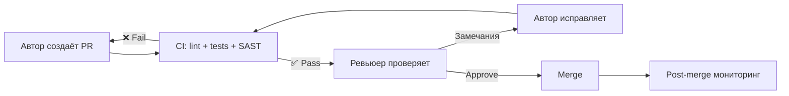
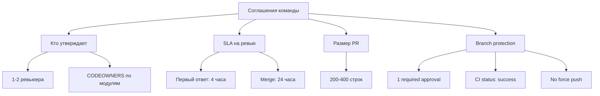
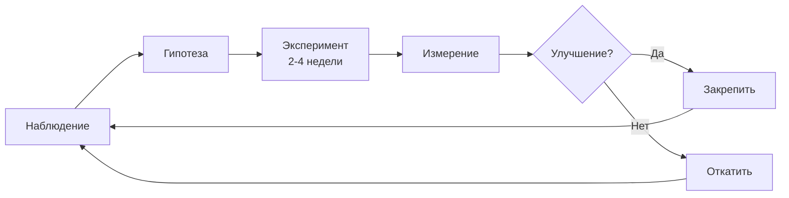
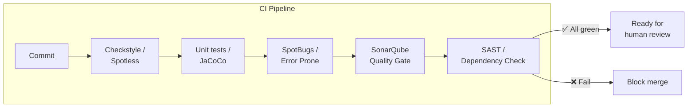
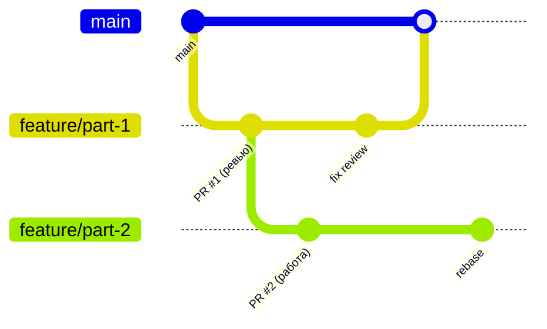
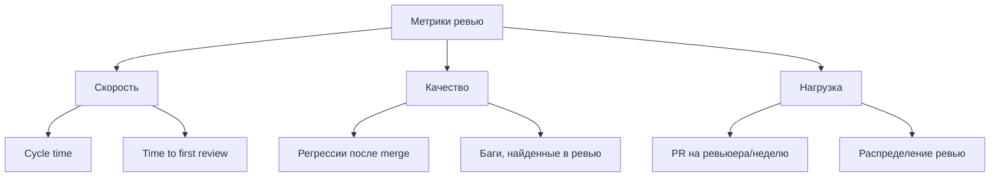
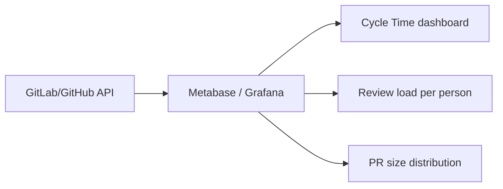

# Вопросы на собеседовании: Практики `code review`

Практики `code review` — один из ключевых процессов инженерной культуры. На собеседованиях уровня `Senior / Tech Lead` ожидают не только знание «что проверять», но и умение **выстроить процесс**, измерить его эффективность, обучить команду и масштабировать на распределённые команды. В этом файле — 40 вопросов с практическими ответами, примерами кода и диаграммами.

## Полезные ссылки

### Официальная документация

- [Google Code Review Guide](https://google.github.io/eng-practices/review/) — каноническое руководство по ревью
- [Best Practices for Code Review — Atlassian](https://www.atlassian.com/agile/software-development/code-reviews) — практики ревью в Agile
- [Introduction to Checkstyle — Baeldung](https://www.baeldung.com/checkstyle-java) — настройка `Checkstyle` для Java
- [Intro to SpotBugs — Baeldung](https://www.baeldung.com/spotbugs-detect-bugs-code) — статический анализ байткода
- [Code Analysis with SonarQube — Baeldung](https://www.baeldung.com/sonar-qube) — quality gates и метрики
- [Introduction to ArchUnit — Baeldung](https://www.baeldung.com/java-archunit-intro) — архитектурные тесты
- [Clean Coding in Java — Baeldung](https://www.baeldung.com/java-clean-code) — принципы чистого кода

## Содержание

- [Полезные ссылки](#полезные-ссылки)
- [See also](#see-also)

**Основы и принципы**
- [Q1. (!) Какие практики делают code review эффективным?](#q1--какие-практики-делают-code-review-эффективным)
- [Q2. (!) Какой чек-лист использовать при ревью?](#q2--какой-чек-лист-использовать-при-ревью)
- [Q3. В чём суть Google Code Review Standard?](#q3-в-чём-суть-google-code-review-standard)
- [Q4. Как избежать «ревью ради галочки»?](#q4-как-избежать-ревью-ради-галочки)
- [Q5. (!) Ревью и качество комментариев (тон, язык)?](#q5--ревью-и-качество-комментариев-тон-язык)

**Процесс и организация**
- [Q6. (!) Как организовать процесс ревью в команде?](#q6--как-организовать-процесс-ревью-в-команде)
- [Q7. Как ввести ревью в команду, где его не было?](#q7-как-ввести-ревью-в-команду-где-его-не-было)
- [Q8. Как внедрить ревью в legacy-проект?](#q8-как-внедрить-ревью-в-legacy-проект)
- [Q9. Как эволюционировать практики ревью в команде?](#q9-как-эволюционировать-практики-ревью-в-команде)
- [Q10. Ревью по слоям (архитектор, тимлид, разработчик)?](#q10-ревью-по-слоям-архитектор-тимлид-разработчик)

**Автоматизация и инструменты**
- [Q11. (!) Роль автоматизации в практиках ревью?](#q11--роль-автоматизации-в-практиках-ревью)
- [Q12. (!) Как настроить статический анализ в CI pipeline?](#q12--как-настроить-статический-анализ-в-ci-pipeline)
- [Q13. Какие инструменты использовать для ревью (GitHub, GitLab, Gerrit)?](#q13-какие-инструменты-использовать-для-ревью-github-gitlab-gerrit)
- [Q14. Как использовать ArchUnit для автоматического контроля архитектуры?](#q14-как-использовать-archunit-для-автоматического-контроля-архитектуры)
- [Q15. Как настроить CODEOWNERS для автоматического назначения ревьюеров?](#q15-как-настроить-codeowners-для-автоматического-назначения-ревьюеров)

**Асинхронность и распределённые команды**
- [Q16. (!) Как практиковать асинхронное ревью?](#q16--как-практиковать-асинхронное-ревью)
- [Q17. Практики ревью для распределённой команды?](#q17-практики-ревью-для-распределённой-команды)
- [Q18. Как совмещать ревью с другими обязанностями?](#q18-как-совмещать-ревью-с-другими-обязанностями)
- [Q19. Ротация ревьюеров и нагрузка?](#q19-ротация-ревьюеров-и-нагрузка)
- [Q20. Как практиковать ревью без блокировки разработки?](#q20-как-практиковать-ревью-без-блокировки-разработки)

**Роли, джуниоры и онбординг**
- [Q21. Практики ревью для джуниоров (как ревьюить, как получать ревью)?](#q21-практики-ревью-для-джуниоров-как-ревьюить-как-получать-ревью)
- [Q22. (!) Pair programming vs code review?](#q22--pair-programming-vs-code-review)
- [Q23. Как совмещать ревью с онбордингом новых сотрудников?](#q23-как-совмещать-ревью-с-онбордингом-новых-сотрудников)

**Специальные случаи (security, миграции, hotfix)**
- [Q24. (!) Практики ревью безопасности (security review)?](#q24--практики-ревью-безопасности-security-review)
- [Q25. Как ревьюить конфигурацию и инфраструктуру?](#q25-как-ревьюить-конфигурацию-и-инфраструктуру)
- [Q26. Ревью документации и API-контрактов?](#q26-ревью-документации-и-api-контрактов)
- [Q27. Практики ревью для срочных hotfix?](#q27-практики-ревью-для-срочных-hotfix)
- [Q28. (!) Практики ревью для миграций и изменений схемы?](#q28--практики-ревью-для-миграций-и-изменений-схемы)
- [Q29. Ревью и контрактное тестирование (Spring Cloud Contract, Pact)?](#q29-ревью-и-контрактное-тестирование-spring-cloud-contract-pact)

**Метрики, compliance и кросс-команды**
- [Q30. (!) Как измерять эффективность практик ревью?](#q30--как-измерять-эффективность-практик-ревью)
- [Q31. Ревью и compliance (аудит, трассируемость)?](#q31-ревью-и-compliance-аудит-трассируемость)
- [Q32. Практики ревью для кросс-командных изменений?](#q32-практики-ревью-для-кросс-командных-изменений)

**Современные практики**
- [Q33. (!) Как составить эффективный чек-лист для code review?](#q33--как-составить-эффективный-чек-лист-для-code-review)
- [Q34. Async vs sync code review: когда что применять?](#q34-async-vs-sync-code-review-когда-что-применять)
- [Q35. (!) AI-assisted code review: инструменты, плюсы и минусы?](#q35--ai-assisted-code-review-инструменты-плюсы-и-минусы)
- [Q36. Оптимальный размер Pull Request и работа с большими изменениями?](#q36-оптимальный-размер-pull-request-и-работа-с-большими-изменениями)
- [Q37. (!) Как выстроить культуру конструктивного feedback в команде?](#q37--как-выстроить-культуру-конструктивного-feedback-в-команде)
- [Q38. Reviewer fatigue: как избежать выгорания ревьюеров?](#q38-reviewer-fatigue-как-избежать-выгорания-ревьюеров)
- [Q39. Security-focused code review: что искать и как использовать OWASP?](#q39-security-focused-code-review-что-искать-и-как-использовать-owasp)
- [Q40. (!) Метрики code review: cycle time, defect rate и другие?](#q40--метрики-code-review-cycle-time-defect-rate-и-другие)

## Шаблон leadership-ответа

Для вопросов уровня lead лучше отвечать через операционную рамку:

1. **Процесс:** правила и `SLA` команды.
2. **Люди:** как обучаете и распределяете нагрузку.
3. **Измерение:** по каким метрикам видно, что практика работает.

---

## Q1. (!) Какие практики делают code review эффективным?

(!) Какие практики делают code review эффективным?

Эффективное ревью строится на нескольких принципах, которые можно измерить и масштабировать:

**Ключевые практики:**
- Малый объём `PR` — 200-400 строк диффа. Google рекомендует ещё меньше: большинство `CL` (changelist) содержат до 100 строк
- Чёткое описание `PR` — что сделано, зачем, как тестировали, ссылка на тикет
- Автоматизация стиля и тестов в `CI` — ревьюер не тратит время на форматирование
- `SLA` на первое реагирование — например, 4 часа
- Фокус на логике, тестах, безопасности — стиль делегируется линтерам
- Конструктивная обратная связь — тон, формулировки, разделение `must fix` и `nit`

**Измеримые результаты:** `cycle time` (время от открытия `PR` до merge) и доля `PR` с регрессиями после merge — ключевые метрики.



**Практика:** зафиксировать в `README` или `Confluence`: максимальный размер `PR`, `SLA` «первый ответ за 4 часа», чек-лист для ревьюера. В branch protection — обязательный 1 approve и зелёный `CI` перед merge. Ретро по «пропущенным багам» помогает скорректировать чек-лист.

## Q2. (!) Какой чек-лист использовать при ревью?

Чек-лист по приоритетам (от критичного к желательному):

| Приоритет | Что проверяем | Кто/что помогает |
|-----------|---------------|------------------|
| 1. Корректность | Логика, граничные случаи, `NPE`, race conditions | Ревьюер + тесты |
| 2. Тесты | Покрытие изменений, качество assertions | Ревьюер + `JaCoCo` |
| 3. Безопасность | Инъекции, утечка данных, небезопасные `API` | `SAST` + ревьюер |
| 4. Архитектура | Границы модулей, зависимости, `SOLID` | `ArchUnit` + ревьюер |
| 5. Читаемость | Имена, сложность, комментарии | Ревьюер |
| 6. Стиль | Форматирование, импорты | `Checkstyle` / `Spotless` |

Пример шаблона `PR` в `GitHub`:

```markdown
## Описание
<!-- Что сделано и зачем -->

## Тикет
<!-- Ссылка на Jira/YouTrack -->

## Чек-лист автора
- [ ] Добавлены/обновлены тесты
- [ ] Нет секретов в коде
- [ ] API обратно совместим
- [ ] Документация обновлена (если нужно)

## Как тестировать
<!-- Шаги для ревьюера -->
```

Чек-лист можно хранить в шаблоне `PR` (`GitHub` — `.github/PULL_REQUEST_TEMPLATE.md`, `GitLab` — `.gitlab/merge_request_templates/`). Команда согласовывает пункты и пересматривает на ретро.

## Q3. В чём суть Google Code Review Standard?

Согласно [Google Engineering Practices](https://google.github.io/eng-practices/review/reviewer/standard.html), основной принцип ревью:

> Ревьюер должен approve изменение, если оно **улучшает общее здоровье кодовой базы**, даже если изменение не идеально.

Ключевые идеи:
- **Не стремиться к идеалу** — если код лучше, чем был, его можно принять
- **Не блокировать прогресс** — разработчики теряют мотивацию, если каждый `PR` превращается в бесконечную дискуссию
- **Разделять «must fix» и «nit»** — блокирующие замечания vs. рекомендации
- **Функциональность, сложность, тесты** — три главных фокуса ревьюера

Google особенно предостерегает от **over-engineering**: ревьюер должен следить, чтобы код не был более обобщённым, чем нужно сейчас. «Код должен решать сегодняшнюю задачу, а не гипотетическую будущую».

## Q4. Как избежать «ревью ради галочки»?

Критерии approve должны быть содержательными: не «посмотрел», а «проверил логику, тесты, безопасность по чек-листу». Признаки формального ревью:

- Approve через минуту после открытия `PR` на 500 строк
- Отсутствие комментариев в 100% случаев
- Все `PR` approve с первого раза (нереально при нормальном ревью)

**Как бороться:**
- Автоматизация снимает рутину — ревьюер тратит время на то, что важно
- Культура: ревью — часть качества продукта, а не формальность
- На ретро обсуждать примеры пропущенных багов и улучшать процесс
- Метрика «среднее время до approve» — слишком быстро = подозрительно
- Тимлид не давит на «быстрее approve», а на «проверять по делу»
- Периодический аудит: выбрать случайный `PR` и обсудить на ретро

## Q5. (!) Ревью и качество комментариев (тон, язык)?

Тон комментариев напрямую влияет на культуру в команде. Google рекомендует:

**Хорошие формулировки:**

| Плохо | Хорошо |
|-------|--------|
| «Ты неправильно сделал» | «Здесь возможен `NPE`, стоит добавить проверку» |
| «Это ужасно» | «Можно упростить, если вынести в отдельный метод» |
| «Почему не через `Stream`?» | «Nit: можно переписать через `Stream`, будет читаемее» |

**Категоризация комментариев:**
- **`[must fix]`** — блокирует merge, есть баг или уязвимость
- **`[suggestion]`** / **`[nit]`** — рекомендация, не блокирует
- **`[question]`** — вопрос для понимания, не претензия
- **`[praise]`** — похвала за хорошее решение (важно для мотивации!)

Образцы хороших комментариев в документации команды помогают новым ревьюерам. Язык — единый в команде (русский/английский).

## Q6. (!) Как организовать процесс ревью в команде?



**Что зафиксировать в документации:**
- Кто может approve (ротация или по владению модулем)
- Критерии approve: зелёный `CI`, нет блокирующих замечаний
- `SLA` на ревью — первый ответ 4 часа, merge 24 часа
- Максимальный объём `PR` — 200-400 строк
- Обязательность тестов для нового кода

**Защита веток в `GitHub` / `GitLab`:** merge только после approve и зелёного `CI`. На ретро обсуждать очередь ревью, задержки и перегруженных ревьюеров.

## Q7. Как ввести ревью в команду, где его не было?

Поэтапный подход — ключ к успеху. Резкое внедрение вызовет сопротивление.

**Фаза 1 (2-4 недели): Пилот**
- Обязательный 1 approve для ветки `main`
- Максимальный размер `PR` — 300 строк
- Тимлид и сеньоры — первые ревьюеры и образец тона
- Только `must fix` замечания, никакого nit-picking

**Фаза 2 (месяц 2): Расширение**
- Добавить `CI` с линтерами (`Checkstyle`, `Spotless`)
- Ввести шаблон `PR` с описанием и чек-листом
- Начать ротацию ревьюеров

**Фаза 3 (месяц 3+): Зрелость**
- `SLA` на ревью, метрики `cycle time`
- Обсуждение процесса на ретро
- `SAST` и quality gates в `SonarQube`

При сопротивлении — объяснить выгоды: меньше багов в проде, обмен контекстом, bus factor. Показать примеры хороших комментариев и быстрых циклов.

## Q8. Как внедрить ревью в legacy-проект?

Начать с новых изменений и критичных областей — не требовать ревью всего legacy сразу.

**Стратегия «Boy Scout Rule»:** каждый `PR` оставляет код чуть лучше, чем нашёл. Добавлять тесты в том же `PR`, где меняется legacy-код.

```java
// Пример: при ревью legacy-кода обращать внимание на типичные проблемы
public class OrderService {
    // ❌ legacy-паттерн: нет валидации, нет тестов
    public void processOrder(Map<String, Object> params) {
        String id = (String) params.get("id"); // ClassCastException?
        // ... 200 строк бизнес-логики
    }
    
    // ✅ при касании модуля — рефакторинг + тесты
    public OrderResult processOrder(OrderRequest request) {
        Objects.requireNonNull(request, "request must not be null");
        validate(request);
        // ... структурированная логика
    }
}
```

**Практики для legacy:**
- Чек-лист с фокусом на корректности и тестах (не стиле)
- Постепенно расширять зоны ревью по мере касания модулей
- Legacy без тестов ревьюить с повышенным вниманием к граничным случаям
- Документировать стандарты и «как мы ревьюим»
- Подробнее о работе с legacy — в [вопросах по техническому долгу](../code-quality/technical-debt-interview.md)

## Q9. Как эволюционировать практики ревью в команде?

Эволюция — не разовая реформа, а итерации: попробовали, измерили, скорректировали.



**Примеры экспериментов:**
- Изменить `SLA` с 24 на 4 часа — замерить `cycle time`
- Уменьшить размер `PR` с 500 до 300 строк — замерить число итераций
- Ввести категоризацию комментариев — замерить время до merge
- Попробовать парное ревью для сложных `PR`

Регулярно обсуждать на ретро: что мешает, что улучшить. Собирать обратную связь от авторов и ревьюеров. Тимлид и сеньоры — драйверы улучшений.

## Q10. Ревью по слоям (архитектор, тимлид, разработчик)?

Для критичных изменений (архитектура, безопасность, публичный `API`) можно ввести многоуровневое ревью:

| Уровень | Фокус | Когда нужен |
|---------|-------|-------------|
| Разработчик | Логика, тесты, читаемость | Каждый `PR` |
| Тимлид | Дизайн, границы модулей, `SLA` | `PR` в core-модули |
| Архитектор | Системные решения, `API`-контракты | Межсервисные изменения |
| Security | `OWASP`, секреты, authz | Платежи, авторизация |

Не обязательно для каждого `PR` — только для областей по соглашению. Два ревьюера часто достаточно; третий — только при явной необходимости. При обсуждении архитектуры важно дополнить ответ явными trade-offs и привязкой к измеримым `SLO/SLI`.

## Q11. (!) Роль автоматизации в практиках ревью?

Автоматизация снимает с ревьюера рутину и делает ревью предсказуемым:

| Задача | Инструмент | Что делает |
|--------|-----------|------------|
| Стиль кода | `Checkstyle`, `Spotless`, `EditorConfig` | Форматирование, импорты |
| Баги | `SpotBugs`, `Error Prone` | Типичные ошибки в байткоде |
| Quality gate | `SonarQube` | Покрытие, дублирование, сложность |
| Безопасность | `SAST`, `Dependabot`, `Snyk` | Уязвимости кода и зависимостей |
| Тесты | `JUnit` + `JaCoCo` | Покрытие изменений |
| Архитектура | `ArchUnit` | Правила слоёв и зависимостей |



**Принцип:** красный `CI` блокирует merge. Ревьюер не комментирует форматирование — только логику, тесты, безопасность и архитектуру. При новом правиле в линтере — добавить в `CI` и убрать из ручного чек-листа. Подробнее о настройке pipeline — в [вопросах по дизайну CI/CD pipeline](../cicd/pipeline-design-interview.md).

## Q12. (!) Как настроить статический анализ в CI pipeline?

Пример `build.gradle` с `Checkstyle`, `SpotBugs` и `JaCoCo`:

```java
// build.gradle (Groovy DSL)
plugins {
    id 'java'
    id 'checkstyle'
    id 'com.github.spotbugs' version '6.0.7'
    id 'jacoco'
    id 'org.sonarqube' version '5.0.0.4638'
}

checkstyle {
    toolVersion = '10.14.0'
    configFile = file("${rootDir}/config/checkstyle/checkstyle.xml")
    maxWarnings = 0 // zero tolerance в CI
}

spotbugs {
    effort = 'max'
    reportLevel = 'medium'
    excludeFilter = file("${rootDir}/config/spotbugs/exclude.xml")
}

jacoco {
    toolVersion = '0.8.11'
}

jacocoTestReport {
    reports {
        xml.required = true // для SonarQube
    }
}

jacocoTestCoverageVerification {
    violationRules {
        rule {
            limit {
                minimum = 0.80 // минимум 80% покрытия
            }
        }
    }
}

// Quality gate: тесты + покрытие + статический анализ
check.dependsOn jacocoTestCoverageVerification
```

**`SonarQube` Quality Gate** — набор условий для merge:
- Покрытие нового кода >= 80%
- Дублирование < 3%
- Нет блокирующих/критических issues
- Security hotspots reviewed

## Q13. Какие инструменты использовать для ревью (GitHub, GitLab, Gerrit)?

| Критерий | `GitHub` | `GitLab` | `Gerrit` |
|----------|----------|----------|----------|
| UI ревью | `PR` + inline-комментарии | `MR` + inline-комментарии | Патч-сеты |
| Approve | 1+ approve | 1+ approve | +1/+2 голоса |
| `CI` интеграция | `GitHub Actions` | `GitLab CI` | Jenkins / любой |
| Branch protection | Да | Да | Строгий workflow |
| `CODEOWNERS` | Да | Да | Плагины |
| Compliance | Audit log (Enterprise) | Audit events | Полная трассировка |

**`GitHub / GitLab`** — удобно для большинства команд, встроенная экосистема. **`Gerrit`** — строгий workflow (submit только после +2), подходит для open source и строгого compliance.

Выбор по экосистеме (что уже используете) и по требованиям (compliance, трассируемость). Инструмент должен поддерживать: approve, комментарии по строкам, блокировку merge до выполнения критериев и интеграцию с `CI`.

## Q14. Как использовать ArchUnit для автоматического контроля архитектуры?

`ArchUnit` позволяет выразить архитектурные правила как тесты — они запускаются в `CI` и блокируют merge при нарушении:

```java
@AnalyzeClasses(packages = "com.example.app")
class ArchitectureTest {

    // Контроль слоёв: service не зависит от controller
    @ArchTest
    static final ArchRule layerRule = layeredArchitecture()
        .consideringAllDependencies()
        .layer("Controller").definedBy("..controller..")
        .layer("Service").definedBy("..service..")
        .layer("Repository").definedBy("..repository..")
        .whereLayer("Controller").mayNotBeAccessedByAnyLayer()
        .whereLayer("Service").mayOnlyBeAccessedByLayers("Controller")
        .whereLayer("Repository").mayOnlyBeAccessedByLayers("Service");

    // Запрет циклических зависимостей между пакетами
    @ArchTest
    static final ArchRule noCycles = slices()
        .matching("com.example.app.(*)..")
        .should().beFreeOfCycles();

    // Репозитории не должны вызывать REST-клиенты
    @ArchTest
    static final ArchRule repositoryRule = noClasses()
        .that().resideInAPackage("..repository..")
        .should().dependOnClassesThat()
        .resideInAPackage("..client..");
}
```

При ревью `PR`, затрагивающего архитектуру модулей, `ArchUnit`-тест упадёт автоматически — ревьюеру не нужно вручную проверять зависимости.

## Q15. Как настроить CODEOWNERS для автоматического назначения ревьюеров?

`CODEOWNERS` (`.github/CODEOWNERS` или `.gitlab/CODEOWNERS`) — файл, который автоматически назначает ревьюеров по путям файлов:

```
# .github/CODEOWNERS

# Инфраструктура — команда DevOps
/infrastructure/    @team-devops
*.yml               @team-devops
Dockerfile          @team-devops

# Security-критичные модули
/src/main/java/com/example/auth/    @security-team @tech-lead
/src/main/java/com/example/payment/ @security-team @tech-lead

# API-контракты — архитектор
/api/               @architect
*.proto             @architect

# Всё остальное — любой из core-команды
*                   @team-backend
```

**Практики:**
- Не делать одного человека владельцем всего — это узкое место
- Использовать команды (`@team-*`), а не людей
- Комбинировать с branch protection: `require review from Code Owners`
- Пересматривать `CODEOWNERS` при изменении структуры команды

## Q16. (!) Как практиковать асинхронное ревью?

Асинхронное ревью — норма для распределённых команд и стандартный подход в remote-first компаниях.

**Практики:**
- Ясное описание `PR` и контекст — ревьюер не должен гадать «что это и зачем»
- Ревьюер смотрит в своё время и оставляет комментарии пакетом (не по одному)
- Автор отвечает в течение рабочего дня
- При срочности — явно пометить `[URGENT]` и написать в чат команды
- При несогласии — короткий созвон вместо длинной переписки

**`SLA` для асинхронного ревью:**
- Первый ответ: 4 часа рабочего времени
- Каждая итерация: 1 рабочий день
- Срочные `PR`: 2 часа

Метрика `time to first review` — ключевой показатель здоровья асинхронного процесса. Если `SLA` регулярно нарушается — сигнал перегрузки или проблем с приоритизацией.

## Q17. Практики ревью для распределённой команды?

Ключевые отличия распределённых команд — часовые пояса, языковые барьеры и отсутствие неформального контекста.

**Практики:**
- Ротация ревьюеров по часовым поясам — хотя бы один ревьюер в доступности в течение 4 часов
- В шаблоне `PR` обязательные поля: ссылка на тикет, что сделано, как тестировали
- Ревьюеры по ротации (`round-robin`) или по владению модулем
- Сложные `PR` (архитектура, спорные решения) — 15-минутный созвон после первого раунда комментариев
- `ADR` и архитектурные гайды в `Confluence` снижают вопросы «а почему так?»
- Видео-разбор сложных `PR` по запросу ускоряет обратную связь

## Q18. Как совмещать ревью с другими обязанностями?

Ревью — часть работы, а не «отвлечение от задач». Но без структуры оно съедает время:

**Практики:**
- В календаре блоки «`Code review`» по 30-60 минут 2 раза в день
- Малые `PR` ревьюить быстрее — это стимул для авторов делать маленькие `PR`
- Несколько людей, способных ревьюить каждый модуль, снимают узкое место
- При очереди > 5 `PR` на человека — тимлид перераспределяет
- Культура «ревью в приоритете» уменьшает время ожидания

**Метрики перегрузки:**
- `PR` в ожидании ревью > 24 часа
- Один ревьюер обрабатывает > 50% всех `PR`
- Среднее время до первого комментария > `SLA`

## Q19. Ротация ревьюеров и нагрузка?

Ротация снимает узкие места и распределяет знания по команде:

- **`Round-robin`** — простая ротация, каждый следующий `PR` — следующему ревьюеру
- **По владению модулем** — owner модуля + случайный второй ревьюер (для обмена знаниями)
- **Weighted** — учитывает текущую нагрузку (у кого меньше `PR` в очереди)

**Анти-паттерны:**
- Один «главный ревьюер» — bus factor = 1
- Ревью только тимлидом — узкое место + нет обмена знаниями
- Ревью только сеньорами — джуниоры не развиваются как ревьюеры

Метрики «кто сколько ревьюит» помогают балансировать нагрузку. На ретро обсуждать перегрузку ревьюеров.

## Q20. Как практиковать ревью без блокировки разработки?

- Малые `PR` — быстрее ревьюить (10-15 минут vs. час)
- Несколько ревьюеров — нет узкого места
- `SLA` на первое реагирование — предсказуемость
- Автор переключается на другую задачу, пока ждёт ревью
- Stacked PRs — автор создаёт следующий `PR` поверх текущего, не дожидаясь merge



При блокировке — эскалировать: «ждём ревью 2 дня, нужен второй ревьюер или приоритет».

## Q21. Практики ревью для джуниоров (как ревьюить, как получать ревью)?

**Получать ревью (джуниор как автор):**
- Малые `PR`, ясное описание
- Не воспринимать замечания как личную критику — это обучение
- Задавать вопросы, если комментарий непонятен
- Перед `PR` — self-review по чек-листу

**Ревьюить (джуниор как ревьюер):**
- Фокус на читаемости и простых проверках
- Сложную логику и архитектуру проверяет сеньор
- Задавать вопросы «почему так?» — это полезно и автору, и ревьюеру

**Парное ревью (джуниор + сеньор):** сеньор показывает, на что обращать внимание, джуниор учится паттернам ревью. Обратная связь по качеству ревью — часть развития.

## Q22. (!) Pair programming vs code review?

| Критерий | `Pair programming` | `Code review` |
|----------|--------------------|---------------|
| Когда | В реальном времени | Асинхронно |
| Обратная связь | Мгновенная | С задержкой |
| Масштабируемость | 2 человека | Любое число ревьюеров |
| Обмен знаниями | Глубокий | Средний |
| Подходит для | Сложные задачи, онбординг | Распределённые команды |
| Документирование | Нет артефактов | Комментарии в `PR` |

**Когда комбинировать:** парная работа над ядром или сложной логикой, затем ревью результата для фиксации решений и расширения аудитории. На собеседовании важно показать, что вы понимаете trade-offs и выбираете подход по контексту, а не «по привычке».

## Q23. Как совмещать ревью с онбордингом новых сотрудников?

Ревью — один из лучших инструментов онбординга:

- **Неделя 1-2:** новичок читает `PR` коллег, задаёт вопросы (пассивное ревью)
- **Неделя 3-4:** парное ревью с ментором — новичок комментирует, ментор дополняет
- **Месяц 2+:** самостоятельное ревью с фокусом на знакомых модулях

**Для `PR` новичка:**
- Ментор — обязательный ревьюер первые 2-3 месяца
- Развёрнутые комментарии с пояснениями «почему так принято в проекте»
- Ссылки на `ADR`, гайды, примеры в кодовой базе
- Не перегружать замечаниями — выделить 2-3 главных на первых `PR`

## Q24. (!) Практики ревью безопасности (security review)?

Для областей с повышенными рисками (аутентификация, платежи, персональные данные):

**Чек-лист по `OWASP` Top 10:**

```java
// ❌ SQL-инъекция через конкатенацию
public List<User> findUsers(String name) {
    String sql = "SELECT * FROM users WHERE name = '" + name + "'";
    return jdbcTemplate.query(sql, rowMapper);
}

// ✅ Параметризованный запрос
public List<User> findUsers(String name) {
    return jdbcTemplate.query(
        "SELECT * FROM users WHERE name = ?",
        rowMapper,
        name
    );
}
```

```java
// ❌ Утечка секретов в логах
log.info("Processing payment with card: {}", cardNumber);

// ✅ Маскирование чувствительных данных
log.info("Processing payment with card: ****{}", 
    cardNumber.substring(cardNumber.length() - 4));
```

**Процесс security review:**
- Автоматизация: `SAST` (например, `SonarQube` security rules), проверка зависимостей (`Dependabot`, `Snyk`)
- При необходимости привлечение security-специалиста
- Критичные находки блокируют merge до исправления
- Модель угроз и `least privilege` — часть ревью для auth-модулей

## Q25. Как ревьюить конфигурацию и инфраструктуру?

Конфигурация (`YAML`, `properties`, `Terraform`) и `IaC` тоже проходят ревью:

```java
// application.yml — что проверять при ревью:

// ✅ Секреты через env vars, не в конфиге
spring:
  datasource:
    password: ${DB_PASSWORD}  // ✅
    # password: qwerty123     // ❌ секрет в репозитории!

// ✅ Разные значения для разных окружений
server:
  port: ${SERVER_PORT:8080}

// ✅ Таймауты и пулы — не дефолтные значения для прода
spring:
  datasource:
    hikari:
      maximum-pool-size: ${HIKARI_MAX_POOL:10}
      connection-timeout: ${HIKARI_TIMEOUT:30000}
```

**Чек-лист для конфигурации:**
- Нет секретов в репозитории (пароли, токены, ключи)
- Влияние на окружения — не сломает ли прод?
- План отката — можно ли быстро вернуть?
- Линтеры для конфигов в `CI` (`YAML lint`, `terraform validate`)

## Q26. Ревью документации и API-контрактов?

Документация (`README`, `API` docs, runbooks) и контракты (`OpenAPI`, `gRPC`) ревьюятся на:

- **Актуальность** — соответствует ли коду?
- **Обратная совместимость** — не ломает ли клиентов?
- **Версионирование** — правильно ли обновлена версия `API`?
- **Полнота** — все новые эндпоинты описаны?

```java
// Пример: при изменении контроллера — обязательно обновить OpenAPI
@Operation(summary = "Получить пользователя по ID",
    description = "Возвращает данные пользователя. Требует роль USER.")
@ApiResponse(responseCode = "200", description = "Пользователь найден")
@ApiResponse(responseCode = "404", description = "Пользователь не найден")
@GetMapping("/users/{id}")
public ResponseEntity<UserDto> getUser(@PathVariable Long id) {
    return userService.findById(id)
        .map(ResponseEntity::ok)
        .orElse(ResponseEntity.notFound().build());
}
```

Контрактное тестирование (`Pact`, `Spring Cloud Contract`) автоматизирует часть проверок — см. также [Интеграционное тестирование](../testing/integration-testing-interview.md).

## Q27. Практики ревью для срочных hotfix?

Соглашение по уровням срочности:

| Уровень | Ревью | Пример |
|---------|-------|--------|
| P0 — прод лежит | Post-merge ревью в течение 24 ч | Откат миграции |
| P1 — деградация | 1 быстрый approve до merge | Утечка памяти |
| P2 — обычный баг | Стандартный процесс | UI-баг |

**Правила для hotfix:**
- Hotfix до 50 строк может идти с упрощённым ревью
- Критичные области (безопасность, деньги) — минимум один быстрый approve
- Post-merge ревью обязателен — не «забыть»
- Документировать исключения
- После инцидента — постмортем и при необходимости ужесточить правила

## Q28. (!) Практики ревью для миграций и изменений схемы?

Миграции БД — одна из самых рискованных областей для ревью, потому что откат может быть невозможен.

**Чек-лист для миграций:**
- Идемпотентность — можно ли запустить повторно?
- Обратная совместимость — работает ли старая версия приложения с новой схемой?
- Время выполнения — не заблокирует ли таблицу на проде?
- План отката — есть ли `down`-миграция?

```java
// Пример Flyway-миграции — что проверять при ревью
// V2025.04.11__add_email_index.sql

-- ✅ Конкурентный индекс — не блокирует таблицу
CREATE INDEX CONCURRENTLY IF NOT EXISTS idx_users_email 
    ON users (email);

-- ❌ Опасно: блокирует таблицу на время создания индекса
-- CREATE INDEX idx_users_email ON users (email);

-- ✅ Добавление колонки с дефолтом (PostgreSQL 11+: мгновенно)
ALTER TABLE users ADD COLUMN IF NOT EXISTS status VARCHAR(20) 
    DEFAULT 'ACTIVE';

-- ❌ Опасно: удаление колонки без проверки зависимостей
-- ALTER TABLE users DROP COLUMN old_field;
```

**Ревьюер** — человек с опытом БД; при рисках — привлечь `DBA`. Тестировать на копии данных перед выкаткой на прод. В команде — согласованные практики: `Flyway` / `Liquibase`, именование, порядок.

## Q29. Ревью и контрактное тестирование (Spring Cloud Contract, Pact)?

При изменении `API` между сервисами ревью должен проверять, что контракты не нарушены. Автоматизация через контрактное тестирование:

```java
// Producer-side: Spring Cloud Contract верификация
@SpringBootTest(webEnvironment = SpringBootTest.WebEnvironment.MOCK)
@AutoConfigureMockMvc
@AutoConfigureStubRunner(
    stubsMode = StubRunnerProperties.StubsMode.LOCAL,
    ids = "com.example:user-service:+:stubs:8080"
)
class UserContractVerifierTest extends UserServiceBase {
    // Тесты генерируются автоматически из контрактов
    // в src/test/resources/contracts/
}
```

```java
// Consumer-side: использование стабов
@SpringBootTest
@AutoConfigureStubRunner(
    stubsMode = StubRunnerProperties.StubsMode.LOCAL,
    ids = "com.example:user-service:+:stubs:8080"
)
class OrderServiceContractTest {

    @Autowired
    private UserClient userClient;

    @Test
    void shouldGetUserFromStub() {
        UserDto user = userClient.getUser(1L);
        assertThat(user.getName()).isEqualTo("John");
    }
}
```

**При ревью `PR` с изменением `API`:**
- Обновлены ли контракты?
- Пройдут ли тесты у потребителей?
- Обратная совместимость — добавление полей ОК, удаление — breaking change

## Q30. (!) Как измерять эффективность практик ревью?

**Ключевые метрики:**

| Метрика | Цель | Красный флаг |
|---------|------|--------------|
| `Cycle time` (PR open → merge) | < 24 часов | > 3 дней |
| `Time to first review` | < 4 часов | > 1 дня |
| Кол-во итераций | 1-2 | > 4 |
| Размер `PR` | 200-400 строк | > 1000 строк |
| Доля `PR` с регрессиями | < 5% | > 15% |
| Покрытие ревью | 100% | < 90% |



**Цель** — не «больше замечаний», а меньше дефектов в проде при приемлемом времени ревью. Метрики обсуждать на ретро и использовать для улучшения процесса: уменьшение размера `PR`, ускорение первого ответа, балансировка нагрузки.

## Q31. Ревью и compliance (аудит, трассируемость)?

В регулируемых отраслях (финтех, медицина, PCI DSS) ревью — часть audit trail:

**Требования compliance:**
- Кто утвердил и когда — логируется инструментом (`GitHub` / `GitLab` / `Gerrit`)
- Запрет `self-merge` — автор не может approve свой `PR`
- Separation of duties — разработчик != деплоер
- Сохранение логов ревью для аудиторов (экспорт при необходимости)
- Обязательный approve от определённых ролей (security, DBA)

```java
// Пример branch protection в GitHub API (для автоматизации)
// PUT /repos/{owner}/{repo}/branches/{branch}/protection
{
    "required_pull_request_reviews": {
        "required_approving_review_count": 2,
        "dismiss_stale_reviews": true,
        "require_code_owner_reviews": true,
        "require_last_push_approval": true
    },
    "required_status_checks": {
        "strict": true,
        "contexts": ["ci/tests", "ci/sonar", "ci/security"]
    },
    "enforce_admins": true,
    "restrictions": null
}
```

Документирование процесса ревью и критериев в соответствии с требованиями compliance. `Gerrit` особенно удобен для compliance благодаря детальной истории голосов.

## Q32. Практики ревью для кросс-командных изменений?

Изменения, затрагивающие несколько команд, требуют координации:

**Процесс:**
1. **До `PR`:** согласовать подход с затронутыми командами (в `ADR` или обсуждении)
2. **В описании `PR`:** явно указать impact на другие команды
3. **Ревьюеры:** минимум один approve от каждой затронутой команды или владельца области
4. **Коммуникация:** уведомление в каналах команд при крупных изменениях

**Инструменты:**
- `CODEOWNERS` автоматически подтягивает ревьюеров по путям
- Общие репозитории — согласованные правила ревью и владение модулями
- `RFC` или `ADR` для крупных кросс-командных решений перед кодом

**Анти-паттерны:**
- `PR` на 2000 строк в общий модуль без предупреждения
- Изменение `API`-контракта без согласования с потребителями
- Merge без approve от затронутой команды «потому что срочно»

## Q33. (!) Как составить эффективный чек-лист для code review?

**Принципы хорошего чек-листа:**
- Короткий (5-10 пунктов) и конкретный — длинные чек-листы игнорируют
- Разделён на приоритеты: «обязательно» vs «желательно»
- Хранится в репозитории (`.github/PULL_REQUEST_TEMPLATE.md`)
- Обновляется на ретро по итогам пропущенных дефектов

**Пример двухуровневого чек-листа:**

```markdown
## Чек-лист автора PR (заполняет перед открытием)
- [ ] Тесты написаны и проходят локально
- [ ] Нет секретов и credentials в коде
- [ ] Описание PR объясняет «зачем», не «что»
- [ ] Связан тикет/задача
- [ ] Размер PR ≤ 400 строк (иначе — разбить)

## Чек-лист ревьюера
### Обязательно (блокирует merge)
- [ ] Логика корректна, граничные случаи обработаны
- [ ] Нет SQL-инъекций / XSS / незащищённых данных
- [ ] Изменения покрыты тестами
- [ ] API-контракт обратно совместим (или breaking change обоснован)

### Желательно (nit, не блокирует)
- [ ] Названия методов/переменных читаемы
- [ ] Комментарии объясняют «почему», не «что»
- [ ] Нет дублирования кода
```

**Автоматизация через PR template в GitHub/GitLab:** файл `.github/PULL_REQUEST_TEMPLATE.md` автоматически подставляется в описание нового PR.

**Ротация чек-листа:** после каждого инцидента добавлять пункт — «проверять X». Раз в квартал удалять пункты, которые никто не нарушал — они уже в культуре.

## Q34. Async vs sync code review: когда что применять?

**Синхронное ревью** — встреча или звонок: автор и ревьюер просматривают код вместе в реальном времени.

**Асинхронное ревью** — ревьюер смотрит PR самостоятельно и оставляет комментарии.

**Сравнение:**

| Критерий | Sync | Async |
|----------|------|-------|
| Скорость обратной связи | Мгновенно | Часы/дни |
| Контекст | Передаётся голосом | Должен быть в описании PR |
| Нарушение фокуса | Высокое (нужно встречаться) | Низкое (каждый в своё время) |
| Распределённые команды | Сложно (таймзоны) | Идеально |
| Применимость | Сложный, рискованный код | Стандартные изменения |

**Когда выбирать sync:**
- Сложная архитектурная идея, которую сложно объяснить текстом
- Конфликт мнений в комментариях — быстрее обсудить голосом
- Онбординг джуниора — обучающее ревью
- Срочный hotfix в production

**Когда выбирать async:**
- Стандартные feature-PR (основной поток)
- Распределённые команды с разными таймзонами
- Когда ревьюер глубоко погружён в другую задачу
- PR с хорошим описанием и понятными тестами

**Гибридный подход:** async по умолчанию. Если комментариев >5 итераций без прогресса — переключиться на sync.

## Q35. (!) AI-assisted code review: инструменты, плюсы и минусы?

**Основные инструменты:**

| Инструмент | Что делает | Интеграция |
|-----------|-----------|-----------|
| GitHub Copilot Code Review | Анализирует PR, предлагает улучшения | GitHub |
| CodeRabbit | AI-ревью с резюме PR и line-level комментариями | GitHub, GitLab |
| Qodo (ex Codium) | Генерирует тесты и анализирует PR | GitHub, GitLab |
| SonarQube AI | Обнаруживает security hotspots и code smells | CI/CD |
| Cursor / Claude в IDE | Локальный AI-ревью перед созданием PR | IDE |

**Плюсы AI-ревью:**
- **Скорость** — мгновенный первый проход без ожидания ревьюера
- **Консистентность** — не зависит от настроения и опыта ревьюера
- **Покрытие** — ловит типичные баги (NPE, SQL injection, отсутствие проверки прав)
- **Разгрузка** — ревьюер-человек фокусируется на архитектуре и бизнес-логике
- **Онбординг** — AI объясняет паттерны и даёт ссылки на документацию

**Минусы AI-ревью:**
- **Галлюцинации** — может предложить неработающее решение уверенным тоном
- **Нет бизнес-контекста** — не знает, почему именно так написано
- **Over-commenting** — много шума о незначительных вещах
- **False sense of security** — команда расслабляется, думая что AI всё найдёт
- **Privacy** — код отправляется во внешний сервис (риск утечки)

**Best practices:**
- AI-ревью как первый проход в CI (блокирует, если находит security-issue)
- Human review обязателен для merge — AI только помогает, не заменяет
- Настраивать prompt/конфиг AI-инструмента под стиль команды
- Периодически проверять, что AI не пропускает реальные баги

## Q36. Оптимальный размер Pull Request и работа с большими изменениями?

**Эмпирические данные о размере PR:**

| Размер (строки диффа) | Вероятность нахождения дефекта | Рекомендация |
|----------------------|-------------------------------|-------------|
| < 200 | Высокая | Идеальный PR |
| 200-400 | Средняя | Приемлемо |
| 400-800 | Низкая | Разбить если возможно |
| > 800 | Очень низкая | Обязательно разбить |

**Стратегии разбивки больших изменений:**

**1. Stacked PRs (вертикальная нарезка):**
```
PR #1: Добавить сущность + миграция БД
PR #2: Repository + Service слой
PR #3: Controller + DTO
PR #4: Тесты интеграции
```
Каждый PR сливается в предыдущий, не в main. Поддерживается в GitHub (stacked PRs) и Graphite.

**2. Feature Flags для больших фич:**
```java
// Фича в проде, но за флагом — PR маленькие
@Service
public class CheckoutService {
    private final FeatureFlagService featureFlags;

    public CheckoutResult checkout(Cart cart, User user) {
        if (featureFlags.isEnabled("new-checkout-flow", user)) {
            return newCheckoutService.checkout(cart, user);
        }
        return legacyCheckoutService.checkout(cart, user);
    }
}
```

**3. Branch-by-abstraction:** сначала ввести абстракцию, потом менять реализацию под флагом.

**4. Strangler Fig Pattern:** постепенно заменять модули, не трогая остальное.

**Правило «boy scout»:** если PR слишком большой из-за рефакторинга — вынести рефакторинг в отдельный PR без изменения поведения.

## Q37. (!) Как выстроить культуру конструктивного feedback в команде?

**Принципы конструктивного ревью:**

**1. Критикуйте код, не автора:**
```
❌ "Ты неправильно обработал ошибку"
✅ "Здесь ошибка может быть проглочена — стоит добавить логирование/пробросить выше"
```

**2. Префиксы для комментариев (Conventional Comments):**

| Префикс | Смысл | Блокирует merge? |
|---------|-------|-----------------|
| `nit:` | Незначительное, не критично | Нет |
| `suggestion:` | Идея для улучшения | Нет |
| `question:` | Хочу понять, зачем так | Нет |
| `issue:` | Проблема, которую нужно исправить | Да |
| `blocker:` | Критическая проблема | Да |
| `praise:` | Отметить хорошее решение | — |

**3. Задавать вопросы вместо утверждений:**
```
❌ "Это неправильно, нужно использовать Optional"
✅ "Что думаешь насчёт Optional здесь? Это защитит от NPE в случае X"
```

**4. Хвалить хорошее:** `praise:` помогает людям понимать, что работает хорошо.

**5. Ревью нормы команды в Team Agreement:**
- Максимальное количество итераций до sync-звонка
- SLA на первый ответ (4 часа, 1 рабочий день)
- Кто имеет право блокировать (только `blocker:` комментарии)
- Как разрешать разногласия (голосование, Tech Lead решает)

**Признаки токсичной культуры ревью:** >3 итераций на мелких PR, автор боится открывать PR, ревьюер пишет лекции вместо конкретных замечаний.

## Q38. Reviewer fatigue: как избежать выгорания ревьюеров?

**Признаки reviewer fatigue:**
- Approve без реальной проверки («LGTM» после 30 секунд на 500 строк)
- Ревьюер затягивает ответ или «пропускает» PR
- Снижение качества комментариев — только стилистика, не логика
- Жалобы на «постоянно приходится ревьюить»

**Системные решения:**

**1. Ротация ревьюеров через CODEOWNERS:**
```
# Ротация через список — каждый PR назначается следующему
/src/payment/ @user1 @user2 @user3  # GitHub выбирает случайно
```

**2. Ограничение параллельных PR на одного ревьюера:**
```
# Метрика: PR in review per person
# Если у ревьюера > 3 открытых PR — не назначать новые
```

**3. Временные бюджеты:**
- Договорённость: ревью занимает не более 2 часов в день
- Выделенное время для ревью (например, утро с 10 до 11)
- Защита deep work времени: ревью не прерывает задачи без предупреждения

**4. Уменьшение объёма ревью через автоматизацию:**
- Всё, что можно автоматизировать (стиль, покрытие, security) — автоматизировать
- AI-assisted pre-review — первый проход делает AI, человек проверяет только важное

**5. Распределение знаний:**
- Разрушать silos — один ревьюер не должен быть единственным экспертом в модуле
- Rotating reviewer — иногда назначать «не эксперта» для передачи знаний

**KPI:** отслеживать `PRs reviewed per person per week` и `time to first review` — равномерное распределение и быстрый response.

## Q39. Security-focused code review: что искать и как использовать OWASP?

**OWASP Top 10** — основа security checklist для ревью. Для Java/Spring наиболее релевантны:

**1. Injection (SQL, JPQL, Command):**
```java
// ПЛОХО — SQL injection
String query = "SELECT * FROM users WHERE name = '" + input + "'";

// ХОРОШО — параметризованный запрос
String query = "SELECT * FROM users WHERE name = ?";
jdbcTemplate.query(query, new Object[]{input}, ...);

// ХОРОШО — Spring Data
userRepository.findByName(input);  // безопасно из коробки
```

**2. Broken Authentication:**
- Проверять: пароли хешируются `BCrypt`/`Argon2` (не MD5/SHA1)
- Токены имеют `expiry`, хранятся безопасно, есть logout
- Нет хранения паролей в логах

**3. Sensitive Data Exposure:**
```java
// ПЛОХО — PII в логах
log.info("User {} with SSN {} logged in", user.getName(), user.getSsn());

// ХОРОШО — маскирование
log.info("User {} logged in", user.getId());
```

**4. XXE / Unsafe Deserialization:**
```java
// ПЛОХО — unsafe XML parsing
DocumentBuilderFactory factory = DocumentBuilderFactory.newInstance();
// factory.setFeature(XMLConstants.FEATURE_SECURE_PROCESSING, true) — ЗАБЫЛИ!

// ХОРОШО
factory.setFeature("http://apache.org/xml/features/disallow-doctype-decl", true);
```

**5. Missing Authorization:**
```java
// ПЛОХО — нет проверки прав
@GetMapping("/orders/{id}")
public Order getOrder(@PathVariable Long id) {
    return orderRepository.findById(id).orElseThrow();
    // Любой авторизованный пользователь видит любой заказ!
}

// ХОРОШО
@GetMapping("/orders/{id}")
public Order getOrder(@PathVariable Long id, @AuthenticationPrincipal User user) {
    Order order = orderRepository.findById(id).orElseThrow();
    if (!order.getUserId().equals(user.getId())) {
        throw new AccessDeniedException("Not your order");
    }
    return order;
}
```

**Security review checklist:**
- [ ] Нет хардкодированных секретов (`grep -r "password\s*=" src/`)
- [ ] Все входные данные валидируются и санируются
- [ ] Авторизация проверяется на уровне ресурса, не только роли
- [ ] Зависимости актуальны (`./gradlew dependencyCheckAnalyze`)
- [ ] Нет чувствительных данных в логах и exception messages
- [ ] HTTPS, secure cookies, CSRF-protection включены

**Инструменты:** SpotBugs + FindSecBugs, OWASP Dependency-Check, Semgrep, Snyk в CI.

## Q40. (!) Метрики code review: cycle time, defect rate и другие?

**Ключевые метрики эффективности ревью:**

**1. Cycle Time (время от открытия PR до merge):**

```
Cycle Time = Review Wait Time + Active Review Time + Fix Time
```
- Целевое значение: < 24 часа для большинства PR
- Если > 3 дней — процесс заблокирован (мало ревьюеров, большие PR)

**2. Time to First Review:**
- Время от создания PR до первого содержательного комментария
- Целевое: ≤ 4 рабочих часа (SLA команды)
- Мониторить через GitHub Insights, GitLab Analytics

**3. Review Iteration Count:**
- Среднее количество циклов «комментарий → исправление» до approve
- 1-2 итерации — норма; >4 — PR слишком большой или требования нечёткие

**4. Defect Escape Rate:**
```
Defect Escape Rate = Баги, найденные в проде / (Баги в ревью + Баги в проде) * 100%
```
- Косвенно показывает эффективность ревью и тестов
- Снижение = ревью работает

**5. Review Coverage:**
- Доля PR с минимум 1 реальным замечанием (не только «LGTM»)
- Слишком высокий (>80%) → ревьюеры перегружены
- Слишком низкий (<20%) → ревью формально

**6. PR Size Distribution:**
- Доля PR с < 400 строк диффа
- Цель: ≥ 80% PR должны быть «малыми»

**Дашборд метрик:**



**Как собирать:** GitHub Actions + webhook → ClickHouse/PostgreSQL → Grafana. Или готовые решения: LinearB, Swarmia, Jellyfish.

**Важно:** метрики — инструмент улучшения, не KPI разработчиков. Нельзя премировать за «больше комментариев» или штрафовать за «медленное ревью» — это разрушает культуру.

## See also

- [Code review](../code-quality/code-review-interview.md) — базовые вопросы по code review
- [Лидерство в команде](team-leadership-interview.md) — управление командой и процессами
- [Поведенческое интервью](../behavioral/behavioral-interview.md) — STAR-формат для ответов о code review и конфликтах в ревью
- [Технический долг](../code-quality/technical-debt-interview.md) — стратегии работы с техдолгом
- [Дизайн CI/CD pipeline](../cicd/pipeline-design-interview.md) — автоматизация сборки и деплоя
- [Стратегии тестирования](../testing/test-strategies-interview.md) — пирамида тестов и подходы
- [Паттерны рефакторинга](../code-quality/refactoring-patterns-interview.md) — рефакторинг при ревью

- [Оценка и планирование](estimations-planning-interview.md)
- [Менторство инженеров](mentoring-interview.md)
- [Лидерство в команде](team-leadership-interview.md)
- [Проведение технических интервью](tech-interviewing-interview.md)
- [Технические решения](technical-decisions-interview.md)
