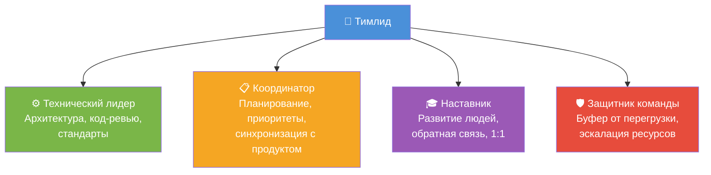
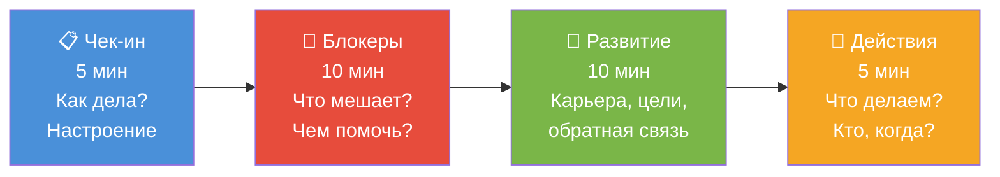
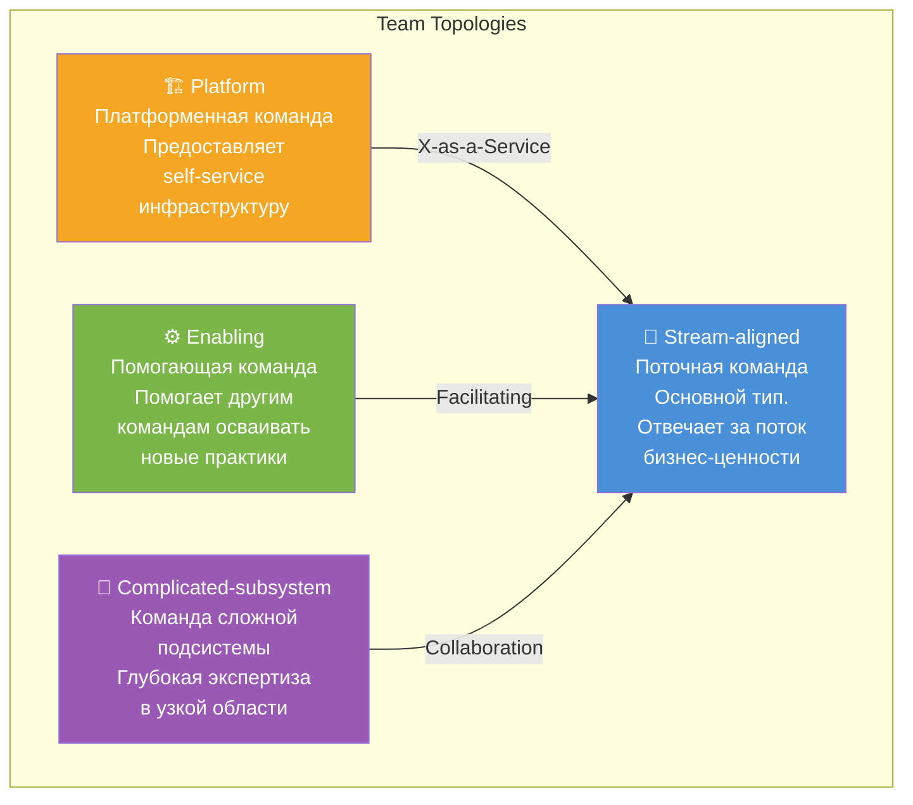
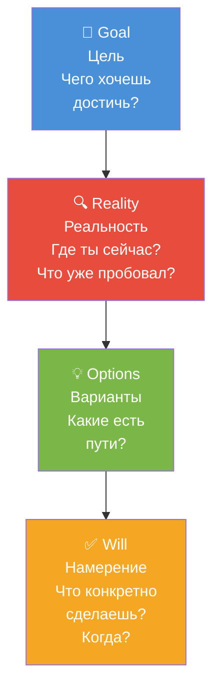
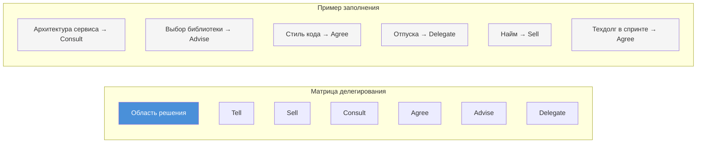
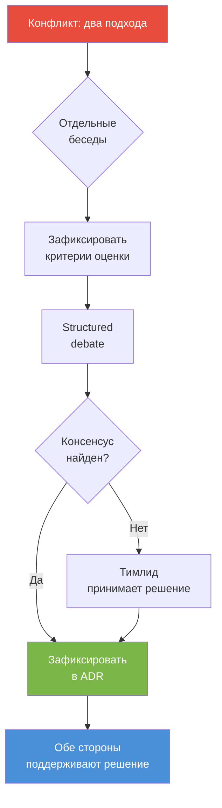
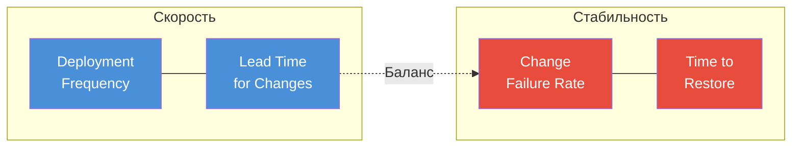

# Вопросы на собеседовании: Лидерство в команде

Глубокие ответы по лидерству в команде: роли, топологии команд, делегирование, 1:1, GROW-модель, обратная связь, конфликты, приоритизация, развитие людей.

**Лидерство в команде** — ключевая компетенция для тимлида и техлида. На собеседованиях оценивают не только знание теории, но и умение применять практики в реальных ситуациях: как строить команду, решать конфликты, делегировать и развивать людей. Этот файл охватывает все основные темы с практическими сценариями и диаграммами.

## Полезные ссылки

### Официальная документация

- [The Manager's Path (O'Reilly)](https://www.oreilly.com/library/view/the-managers-path/9781491973882/)
- [Team Topologies](https://teamtopologies.com/)
- [Top Spring Framework Interview Questions](https://www.baeldung.com/spring-interview-questions) -- технические вопросы для оценки команды
- [Clean Coding in Java](https://www.baeldung.com/java-clean-code) -- принципы чистого кода для code review и стандартов команды

## Содержание

- [Полезные ссылки](#полезные-ссылки)
- [See also](#see-also)

**Роли и основы лидерства**
- [Q1. (!) Чем лидер команды отличается от менеджера?](#q1--чем-лидер-команды-отличается-от-менеджера)
- [Q2. (!) Какие роли бывают у лидера технической команды?](#q2--какие-роли-бывают-у-лидера-технической-команды)
- [Q18. Как балансировать «техническую» и «управленческую» работу?](#q18-как-балансировать-техническую-и-управленческую-работу)
- [Q25. Как развиваться как лидер команды?](#q25-как-развиваться-как-лидер-команды)
- [Q28. (!) Какие типы команд выделяет Team Topologies?](#q28--какие-типы-команд-выделяет-team-topologies)

**1:1, обратная связь и мотивация**
- [Q4. (!) Как проводить 1:1 с разработчиками?](#q4--как-проводить-11-с-разработчиками)
- [Q5. (!) Как давать обратную связь подчинённым?](#q5--как-давать-обратную-связь-подчинённым)
- [Q7. Как мотивировать команду?](#q7-как-мотивировать-команду)
- [Q13. Как строить доверие в команде?](#q13-как-строить-доверие-в-команде)
- [Q26. Как проводить эффективные 1:1?](#q26-как-проводить-эффективные-11)
- [Q29. (!) Что такое GROW-модель и как её применять на 1:1?](#q29--что-такое-grow-модель-и-как-её-применять-на-11)

**Задачи, приоритеты и делегирование**
- [Q3. Как распределять задачи в команде?](#q3-как-распределять-задачи-в-команде)
- [Q8. Как выстраивать приоритеты и защищать команду от перегрузки?](#q8-как-выстраивать-приоритеты-и-защищать-команду-от-перегрузки)
- [Q9. (!) Как делегировать технические решения?](#q9--как-делегировать-технические-решения)
- [Q27. Как делегировать задачи без потери качества?](#q27-как-делегировать-задачи-без-потери-качества)
- [Q30. (!) Как построить матрицу делегирования?](#q30--как-построить-матрицу-делегирования)

**Конфликты и сложные ситуации**
- [Q6. Как разрешать конфликты в команде?](#q6-как-разрешать-конфликты-в-команде)
- [Q14. Как справляться с низкой производительностью члена команды?](#q14-как-справляться-с-низкой-производительностью-члена-команды)
- [Q19. Как эскалировать проблемы наверх?](#q19-как-эскалировать-проблемы-наверх)
- [Q23. Роль лидера при инцидентах и постмортемах?](#q23-роль-лидера-при-инцидентах-и-постмортемах)
- [Q24. Как принимать решение о найме и увольнении?](#q24-как-принимать-решение-о-найме-и-увольнении)
- [Q31. Сценарий: два сеньора не могут договориться об архитектуре — ваши действия?](#q31-сценарий-два-сеньора-не-могут-договориться-об-архитектуре--ваши-действия)

**Развитие команды и онбординг**
- [Q10. Как развивать джуниоров в команде?](#q10-как-развивать-джуниоров-в-команде)
- [Q15. Онбординг новых членов команды?](#q15-онбординг-новых-членов-команды)
- [Q16. Как удерживать знания в команде (документация, ротация)?](#q16-как-удерживать-знания-в-команде-документация-ротация)
- [Q22. Как формировать культуру качества и ownership?](#q22-как-формировать-культуру-качества-и-ownership)
- [Q32. Сценарий: ключевой разработчик хочет уйти — что делать?](#q32-сценарий-ключевой-разработчик-хочет-уйти--что-делать)

**Процессы и метрики**
- [Q11. Как проводить ретроспективы?](#q11-как-проводить-ретроспективы)
- [Q12. Как коммуницировать с продуктом и стейкхолдерами?](#q12-как-коммуницировать-с-продуктом-и-стейкхолдерами)
- [Q17. Удалённая и гибридная команда: особенности лидерства?](#q17-удалённая-и-гибридная-команда-особенности-лидерства)
- [Q20. (!) Метрики эффективности команды?](#q20--метрики-эффективности-команды)
- [Q21. Как проводить оценку производительности (performance review)?](#q21-как-проводить-оценку-производительности-performance-review)
- [Q33. Как выбрать и внедрить DORA-метрики в команде?](#q33-как-выбрать-и-внедрить-dora-метрики-в-команде)

**1-on-1 и OKR/KPI**
- [Q34. Как структурировать 1-on-1 встречи: периодичность, темы, формат?](#q34-как-структурировать-1-on-1-встречи-периодичность-темы-формат)
- [Q35. OKR и KPI для инженерных команд: как ставить и измерять?](#q35-okr-и-kpi-для-инженерных-команд-как-ставить-и-измерять)

**Распределённые команды и психологическая безопасность**
- [Q36. Distributed-first команды: async-коммуникация и timezone overlap?](#q36-distributed-first-команды-async-коммуникация-и-timezone-overlap)
- [Q37. Психологическая безопасность: что это и как создать в команде?](#q37-психологическая-безопасность-что-это-и-как-создать-в-команде)

**Техдолг, метрики и конфликты**
- [Q38. Как объяснить технический долг бизнесу и стейкхолдерам?](#q38-как-объяснить-технический-долг-бизнесу-и-стейкхолдерам)
- [Q39. Engineering Metrics: DORA и SPACE framework?](#q39-engineering-metrics-dora-и-space-framework)
- [Q40. Как разрешать конфликты в команде: техники и эскалация?](#q40-как-разрешать-конфликты-в-команде-техники-и-эскалация)

## Q1. (!) Чем лидер команды отличается от менеджера?

Коротко: **менеджер** — это формальная должность с полномочиями (найм, увольнение, оценки, бюджет), а **лидерство** — это поведение, за которым идут по доверию и убеждению, а не по приказу. Можно быть менеджером без лидерства (люди подчиняются, но не верят) и лидером без должности (за тобой идут, хотя власти у тебя нет). В роли тимлида эти два аспекта обычно совмещаются, и сильный тимлид опирается на лидерство, а формальные рычаги держит в резерве.

| Аспект | Лидер | Менеджер |
|--------|-------|----------|
| Источник влияния | Доверие, экспертиза | Формальная власть |
| Фокус | Видение, развитие людей | Процессы, контроль |
| Стиль | Вдохновляет, ведёт за собой | Планирует, организует |
| Ответственность | Культура, техническое направление | Оценки, бюджет, найм |
| Как влиять без власти | Код-ревью, стандарты, фасилитация | — |

**Как это видно на практике.** Лидерство проявляется в том, что люди сами приходят за советом и добровольно следуют твоим техническим решениям — не потому что обязаны, а потому что доверяют экспертизе. Менеджмент виден в формальных процессах: оценки, отпуска, эскалации.

**Как влиять без формальной власти.** Тимлид без полномочий всё равно ведёт команду — через [код-ревью](code-review-practices-interview.md), предложение и защиту стандартов, фасилитацию совместных решений. Когда добавляется формальная власть, к этому подключаются 1:1, приоритизация и защита команды перед стейкхолдерами. Ключевой смысл: формальная власть расширяет набор инструментов, но не заменяет доверие — если люди следуют только из-за должности, это управление, а не лидерство.

> **Что хочет услышать интервьюер:** понимание, что лидерство — это не должность, а поведение. Примеры из опыта, где вы влияли без формальной власти.

## Q2. (!) Какие роли бывают у лидера технической команды?

Тимлид одновременно носит четыре «шляпы», и сложность роли именно в том, чтобы переключаться между ними по ситуации, а не залипать в одной (чаще всего — в технической, потому что она привычнее).



Баланс ролей напрямую зависит от размера команды: чем она больше, тем меньше остаётся времени на код и тем больше его уходит на людей и координацию — это естественный сдвиг, а не признак «выпадения из техники».

**Как меняется баланс с ростом команды:**
- **3–5 человек** — тимлид совмещает все 4 роли, пишет код 50–70 % времени.
- **6–10 человек** — часть технических решений делегируется сеньорам, код падает до 20–40 %.
- **10+ человек** — стоит выделить отдельного архитектора и часть 1:1 отдать лидам подкоманд, код 10–20 %.

**Подводный камень.** Если роли не зафиксированы явно, возникает антипаттерн «все ждут решения от лидера» — команда стопорится на каждой мелочи. Чтобы этого избежать, зафиксируйте зоны ответственности письменно: `RACI` или чек-лист в `README`.

## Q3. Как распределять задачи в команде?

Распределение задач — это баланс четырёх факторов, которые часто тянут в разные стороны: навыки и интересы людей, текущая нагрузка, развитие (сложные задачи дают тем, кто растёт) и ротация «нелюбимых» задач. Решая, кому что отдать, тимлид постоянно выбирает между «отдать тому, кто сделает быстрее» и «отдать тому, кто на этом вырастет».

**Что важно соблюдать:**
- **Прозрачность.** На планировании или в канбане видно, кто за что отвечает — это снимает ощущение несправедливости.
- **Защита от перегрузки.** При перегрузке — перераспределить задачи или эскалировать сроки, а не молча копить.
- **Снижение bus factor.** Не закреплять критичный модуль за одним человеком без дублирования знаний, иначе его болезнь или уход останавливают разработку.

**Как это работает на практике.** На планировании задачи берут в добровольном порядке с учётом приоритета, а тимлид следит, чтобы нагрузка была равномерной и не возникало «узких мест» (один человек на критичном модуле). Для онбординга и развития работают пары «опытный + растущий» на одной задаче или код-ревью с разбором. Ротация по доменам (`frontend`/`backend`/инфраструктура) снижает bus factor — знания о системе перестают концентрироваться в одной голове.

## Q4. (!) Как проводить 1:1 с разработчиками?

1:1 — это регулярная личная встреча с сотрудником (раз в 1–2 недели, фиксированное время, конфиденциально), которая существует НЕ для статуса по задачам (его берут на стендапе), а для разговора о человеке: что мешает, чего он хочет, как растёт. Главная ошибка — превратить её в отчёт; тогда теряется единственное пространство, где можно поговорить о развитии и проблемах вне давления дедлайнов.

**Фреймворк 1:1 встречи (30-60 минут):**



**Ключевые вопросы по блокам:**

| Блок | Примеры вопросов |
|------|-----------------|
| Чек-ин | «Что на этой неделе было самым полезным/сложным?» |
| Блокеры | «Есть ли что-то, что замедляет тебя?» |
| Развитие | «Над чем хочешь расти в следующем квартале?» |
| Действия | «Что нужно от меня до следующей встречи?» |

**Как сделать 1:1 рабочими, а не формальными:**
- **Фиксировать в календаре и не отменять без крайней необходимости** — отмена читается сотрудником как «я для тебя не важен».
- **Записывать итоги и действия** (в тетради или личном пространстве), а на следующей 1:1 первым делом проверять выполнение договорённостей — иначе встреча превращается в болтовню без последствий.
- **Для разговоров о развитии** опираться на GROW-модель (см. Q29), чтобы сотрудник сам нашёл путь, а не получил готовый ответ.

> **Антипаттерн:** превращать 1:1 в статус-митинг. Если сотрудник начинает с отчёта о задачах — мягко переключить: «Это мы видим на стендапе. Как ты себя чувствуешь в проекте?»

## Q5. (!) Как давать обратную связь подчинённым?

Хорошая обратная связь конкретна и своевременна: не «ты плохо работаешь» (оценка личности, вызывает защитную реакцию), а «в последнем `PR` было N замечаний по качеству, давай разберём» (факт о поведении, с которым можно работать). Чем ближе к ситуации, тем точнее обе стороны помнят детали.

**Модель `SBI`** разделяет три части и убирает оценочность:
- **`Situation`** — конкретный контекст: когда и где это было.
- **`Behavior`** — наблюдаемое поведение, а не интерпретация мотивов.
- **`Impact`** — последствие для команды/продукта, объясняющее, почему это важно.

Разделяйте обратную связь по результатам (что вышло) и по развитию (куда расти) — это разные разговоры. Позитивную обратную связь давайте так же явно, как корректирующую: без неё человек не понимает, что именно стоит повторять. При серьёзных проблемах фиксируйте договорённости письменно и планируйте улучшения с конкретными шагами.

**Пример по `SBI`.** «На прошлой неделе в `PR` по модулю X (`Situation`) замечания по тестам не были закрыты до merge (`Behavior`), из-за этого регрессия в проде (`Impact`). Давай договоримся: перед merge все комментарии ревью закрываем». Позитив по той же схеме: «В этом спринте твой рефакторинг модуля Y сильно упростил поддержку — спасибо». Ключевые договорённости записывайте и проверяйте на следующей 1:1.

## Q6. Как разрешать конфликты в команде?

Ключевая идея разрешения конфликта — перейти от позиций («я хочу X») к интересам («почему мне важен X»). На уровне позиций стороны несовместимы, а на уровне интересов почти всегда находится общая цель. Поэтому первый шаг — выяснить позиции без обвинений, а затем докопаться до того, что за ними стоит.

**Порядок действий:**
- Сфокусироваться на интересах и целях, а не на позициях — это единственный способ найти решение, которое устроит обоих.
- Предложить варианты: компромисс, делегирование решения третьему (например, архитектору), эскалация.
- Не быть «судьёй», а фасилитировать диалог — навязанное решение саботируется.
- Если конфликт повторяется или затрагивает многих, привлечь `HR` или вышестоящего менеджера.

**Как это выглядит на практике.** Сначала выслушать каждого по отдельности («что важно для тебя в этой ситуации?»), затем общая встреча с фокусом на интересах («какую цель мы хотим достичь вместе?»). Возможные развязки: развести стороны по разным задачам/модулям; решение принимает архитектор или третий; при тупике — эскалация на вышестоящего. Результат обязательно зафиксировать (кто что делает); при повторении — `HR` для медиации или смены ролей.

## Q7. Как мотивировать команду?

Главное про мотивацию инженеров: деньги — гигиенический фактор (их недостаток демотивирует, но их избыток не мотивирует на длинной дистанции), а реальная вовлечённость держится на трёх внутренних драйверах из модели Дэниела Пинка — **автономия** (свобода в выборе как делать), **мастерство** (рост в профессии) и **цель** (смысл работы). Задача тимлида — понять, какой из них важнее для конкретного человека, и опираться на него.

**Что в зоне влияния тимлида:**
- Осмысленные задачи и признание; отсутствие микроменеджмента (он убивает автономию).
- Прозрачность целей и приоритетов; участие команды в обсуждении не только «что», но и «как».
- Защита от выгорания: реалистичные сроки и отказ от лишних задач.

Материальная мотивация — в зоне `HR` и компании; тимлид влияет на мотивацию через содержание работы и климат, а не через зарплаты.

**Как применять.** На 1:1 уточняйте, что человеку важно: автономия в выборе решений, рост в технологиях или влияние на продукт. Раздавайте задачи под это: тому, кому важно мастерство, — сложные технические задачи; кому важна цель — задачи с видимым результатом для пользователей. Публично благодарите за вклад (на ретро, в чате). При перегрузке говорите «нет» стейкхолдерам или сдвигайте сроки, а не нагружайте команду сверх меры — выгоревший человек демотивирован надолго.

## Q8. Как выстраивать приоритеты и защищать команду от перегрузки?

Защита команды от перегрузки сводится к одному принципу: ёмкость команды конечна, и каждое новое «да» означает чьё-то «нет». Тимлид делает этот размен явным, а не молча перегружает людей. Приоритеты согласовываются с продуктом и стейкхолдерами по критериям ценность / срочность / зависимости, а объём спринта или квартала держится реалистичным — нельзя обещать больше, чем команда сделает с качеством.

**Главный приём — предлагать выбор, а не жаловаться.** При перегрузке говорите не «мы не успеваем», а «да, но тогда сдвинем X» — это переводит разговор из жалобы в управленческое решение, которое принимает стейкхолдер. Буфер на техдолг и непредвиденное закладывайте в план заранее.

**Как это выглядит на планировании.** Показывайте capacity (сколько story points или задач реально берём) и не добавляйте сверх лимита без сдвига других задач. Рабочие формулировки: «Можем взять A, но тогда B переедет на следующий спринт» или «Чтобы сделать A и B в срок, нужен ещё один разработчик». 10–20 % спринта оставляйте на долг и непредвиденное. На срочный запрос отвечайте встречным вопросом: «Что снимаем с текущего спринта?»

## Q9. (!) Как делегировать технические решения?

Делегировать решение — не то же самое, что отдать задачу. Это передача права принимать решение в рамках чётко обозначенных границ: что человек решает сам, а что согласовывает с лидером или архитектором. Ключевое условие — после передачи доверять и не перерешивать за людей без необходимости, иначе делегирование превращается в имитацию, и человек перестаёт брать ответственность.

Главная мысль — делегирование не бинарно («сам решай» или «делай как я сказал»), а имеет градации. Модель Юргена Аппело раскладывает их на семь уровней — от полного контроля лидера до полного доверия:

**Уровни делегирования (модель Юргена Аппело):**

| Уровень | Название | Пример |
|---------|----------|--------|
| 1 | Расскажи (Tell) | «Используй PostgreSQL для этого сервиса» |
| 2 | Продай (Sell) | «Я рекомендую PostgreSQL, потому что...» |
| 3 | Посоветуйся (Consult) | «Какую БД выбрать? Вот мои мысли...» |
| 4 | Согласуй (Agree) | «Давай вместе решим, какую БД» |
| 5 | Предоставь (Advise) | «Выбери БД, но я дам совет если попросишь» |
| 6 | Узнай (Inquire) | «Выбери БД и расскажи мне о решении» |
| 7 | Делегируй (Delegate) | «Выбери БД — я доверяю» |

**Как применять.** Зафиксируйте границы явно: «Выбор библиотеки для модуля X — за тобой, граница — не тянуть новые runtime-зависимости без обсуждения» (уровень 5–6). Крупные решения (архитектура сервиса, смена БД) держите на уровне 3–4 — там цена ошибки выше, и совместное обсуждение оправдано. Если делегированное решение оказалось неудачным, делайте разбор «что узнали, что сделать иначе» без публичного осуждения и записывайте урок в ретро или `ADR` — иначе человек перестанет рисковать и принимать решения вообще.

> **Правило:** уровень делегирования зависит от опыта человека и критичности решения. Джуниору на критичном модуле — уровень 2-3; сеньору на знакомой задаче — уровень 6-7.

## Q10. Как развивать джуниоров в команде?

Развитие джуниора — это управляемое усложнение задач: начинать с понятных, с чётким описанием и ожидаемым результатом, и постепенно поднимать планку, добавляя неопределённости. Слишком простые задачи не развивают, слишком сложные — демотивируют; искусство в том, чтобы держать задачу чуть выше текущего уровня.

**Что ускоряет рост:**
- **Передача знаний через работу** — парное программирование и код-ревью с разбором, а не просто «исправь».
- **Ментор из команды** и регулярная обратная связь на 1:1.
- **Документация, онбординг-чеклист, доступ к курсам и конференциям.**
- **Реалистичные ожидания** — не требовать сеньорского уровня сразу, явно хвалить прогресс и терпеливо разбирать ошибки.

**Как это выглядит.** Первые задачи — с чётким описанием и ожидаемым результатом; затем задачи с неочевидным решением, но с возможностью спросить ментора. В код-ревью пишите не только «исправь», но и «предлагаю так, потому что…» — джуниор учится из объяснения, а не из приказа. На 1:1 спрашивайте: «Что было сложнее всего? Над чем хочешь порасти?» Выделяйте время на курсы и конференции, а после — краткий разбор с командой (lightning talk), чтобы знание закрепилось через пересказ. При ошибках разбор без обвинений: «Как бы ты сделал в следующий раз?»

## Q11. Как проводить ретроспективы?

Ретроспектива — регулярная встреча (раз в спринт или раз в 2 недели, фиксированная длительность), где команда смотрит на свой процесс и решает, что менять. Базовая структура: что прошло хорошо → что улучшить → действия на следующий цикл. Главная ценность ретро не в обсуждении, а в действиях с владельцем и дедлайном — без них ретро вырождается в «поговорили и забыли».

**Два условия, без которых ретро не работает:**
- **Безопасность.** Фасилитировать так, чтобы говорили все и без обвинений — иначе люди молчат, и реальные проблемы не всплывают.
- **Замыкание цикла.** Действия проверять на следующей ретро первым пунктом, иначе команда перестаёт верить, что что-то меняется.

**Как проводить.** Фиксируйте время (например, час в конце спринта) и не отменяйте без крайней необходимости. В начале напомните правило: «без обвинений, фокус на процессе и системе, а не на людях». Ведите по вопросам: «Что было хорошо?», «Что улучшить?», «Что сделаем по-другому?». Действия записывайте с владельцем и дедлайном. Меняйте формат (Start / Stop / Continue, морская звезда, ретро по ролям) — однообразие снижает вовлечённость, и ответы становятся дежурными.

## Q12. Как коммуницировать с продуктом и стейкхолдерами?

Главное правило общения с продуктом и бизнесом — переводить техническое на язык их интересов: не «у нас плохой код», а «фичи выходят медленнее и дороже». Стейкхолдеру важны сроки, деньги и риски, а не внутренние детали реализации, поэтому объясняйте ограничения без жаргона и всегда предлагайте варианты по осям сроки / объём / качество.

**Что снимает большинство конфликтов:**
- **Регулярные синки и прозрачность** статуса и блокеров — сюрпризы разрушают доверие быстрее всего.
- **Не обещать нереалистичное**, а о рисках предупреждать заранее, пока ещё есть пространство для манёвра.
- **Документировать договорённости** (сроки, приоритеты), чтобы избежать «а мы думали иначе».

**Как это звучит на практике.** Вместо «рефакторинг модуля X» — «чтобы добавлять фичи в модуль X быстрее, нужно 2 спринта на рефакторинг; без этого каждая фича там будет +3 дня». При рисках: «Есть риск сдвига релиза из-за Y; варианты: сдвинуть на неделю или урезать scope Z». Договорённости пишите в тикете или протоколе встречи, и при расхождении ссылайтесь на запись. Регулярный статус (раз в неделю или в спринт) — что сделано, что в работе, какие блокеры.

## Q13. Как строить доверие в команде?

Доверие строится действиями, а не декларациями, и медленно — а разрушается одним невыполненным обещанием. Поэтому фундамент один: последовательность между словами и делами. Если лидер говорит одно, а делает другое, никакие правильные слова про «открытость» не помогут.

**Из чего складывается доверие:**
- **Надёжность** — выполнять обещания, быть предсказуемым.
- **Прозрачность** решений и приоритетов; умение признавать ошибки.
- **Делегирование без микроменеджмента** — доверять людям в зоне их ответственности.
- **Защита и справедливость** — прикрывать команду от необоснованного давления, ровно распределять нагрузку и признание.

**Как это проявляется.** Пообещал «разберусь с доступом» — сделай и отчитайся. Ошибся — скажи прямо: «Я неправильно оценил сроки, извиняюсь; вот что делаем дальше». При эскалации не перекладывай вину на команду: «мы столкнулись с…», а не «они не сделали» — лидер берёт ответственность на себя. Справедливость в распределении: не отдавать одному все «интересные» задачи, а другому — только рутину; учитывать пожелания и ротировать.

## Q14. Как справляться с низкой производительностью члена команды?

Главная ошибка при низкой производительности — сразу давить или увольнять. Сначала нужно понять причину, потому что лечение зависит от диагноза: проблема с навыками лечится обучением, с мотивацией — разговором о смысле и условиях, с личными обстоятельствами — гибкостью и поддержкой, с неясными ожиданиями — их проговариванием. Бить по симптому, не зная причины, бесполезно.

**Последовательность действий:**
- **Обратная связь** с конкретными примерами и планом улучшений — без конкретики человек не понимает, что менять.
- **Поддержка** (обучение, менторинг) — дать шанс исправиться, а не только зафиксировать проблему.
- **Зафиксировать ожидания и сроки.** При отсутствии прогресса — `PIP` (`Performance Improvement Plan`) с чёткими измеримыми критериями.
- **Документировать** разговоры и действия — это нужно и для честности процесса, и юридически.

**Как это работает.** Увольнение — крайняя мера после того, как варианты исчерпаны, и обязательно по согласованию с `HR`. На 1:1 не избегайте сложных тем: «Я заметил, что последние N `PR` требуют много итераций ревью; давай разберём, что мешает». `PIP` — это письменный план с целями, сроками и критериями успеха плюс регулярные чек-ины; при улучшении план снимается, при отсутствии прогресса — эскалация с `HR`. Смысл `PIP` не «подготовить увольнение», а дать чёткую и честную последнюю возможность исправиться.

## Q15. Онбординг новых членов команды?

Цель онбординга — как можно быстрее довести нового человека до первого самостоятельного результата (первый merge), потому что именно он даёт ощущение «я часть команды» и снимает тревогу. Всё остальное — инструменты ради этой цели.

**Из чего складывается хороший онбординг:**
- **Подготовка инфраструктуры** — чек-лист доступов, рабочее место, документация по проекту и процессам, чтобы человек не тратил первую неделю на «выбить доступ к Git».
- **Ментор из команды** и понятные первые задачи с быстрой обратной связью.
- **Социализация** — знакомство с командой и стейкхолдерами, экскурс по кодовой базе и архитектуре.
- **Замыкание петли** — регулярные чек-ины в первые недели и сбор обратной связи по онбордингу, чтобы улучшать процесс для следующих.

**Как это устроено на практике.** Онбординг-чеклист в `Confluence`/`Notion`: доступы (Git, `CI`, `Jira`), локальный запуск проекта, ключевые документы (`README`, `ADR`). Ментор — один конкретный человек из команды на первые 2–4 недели (когда «ответственны все» — не отвечает никто). Первая задача — небольшая, с чётким описанием и код-ревью с разбором. На 1-й неделе — экскурс по коду и архитектуре (встреча или запись). Чек-ины с тимлидом: 1-я неделя — каждый день, 2–4-я — раз в 2–3 дня. Через месяц соберите обратную связь: «Что было непонятно? Что улучшить в онбординге?» — пока память свежа.

## Q16. Как удерживать знания в команде (документация, ротация)?

Удержание знаний — это в первую очередь борьба с **bus factor**: числом людей, после потери которых проект встанет. Если критичный модуль знает один человек, bus factor равен 1, и его уход или болезнь — прямой риск для бизнеса. Поэтому знание нужно либо записать (документация), либо размножить по головам (ротация и парная работа).

**Два канала передачи знаний:**
- **Зафиксировать письменно** — архитектура, ключевые решения (`ADR`), runbooks для инцидентов.
- **Размножить через людей** — ротация по областям и задачам, чтобы не было «единственного эксперта»; код-ревью и парное программирование как естественная передача знаний.

**Как это поддерживать.** `ADR` — для значимых решений (выбор БД, архитектура сервиса); runbooks — для инцидентов (как перезапустить, как откатить). Ротация: не закреплять критичный модуль за одним человеком, ставить пары «опытный + новый» на задачи в этой области. При уходе сотрудника — организованная передача дел (встречи, список контактов и владений) и обновление `README` и runbooks. На ретро регулярно задавайте вопрос: «Где знания сосредоточены в одном человеке? Как снизить bus factor?» — и закрепляйте ответственность за актуальность базы знаний (`Confluence`, `Notion`), иначе документация устаревает и становится бесполезной.

## Q17. Удалённая и гибридная команда: особенности лидерства?

Ключевой сдвиг при удалённой работе — управлять по результату, а не по присутствию. В офисе видно, кто «на месте»; удалённо это невозможно и вредно (микроменеджмент через мониторинг убивает доверие). Поэтому в основе — явные критерии «готово» для задач и доверие. Удалёнка ломает два механизма, которые в офисе работают сами: спонтанную коммуникацию (нет коридорных разговоров) и неформальную связь между людьми — их приходится воссоздавать намеренно.

**Что выстраивается осознанно:**
- **Коммуникация** — регулярные синки (видео) плюс асинхронные каналы (чаты, документы) с ясными ожиданиями по времени ответа.
- **Неформальное общение** — кофе-звонки, каналы для нерабочего, чтобы команда не распалась на изолированных исполнителей.
- **Внимание к человеку** — онбординг и 1:1 удалённо не менее, а более важны; отдельный фокус на выгорании и изоляции, которые удалённо труднее заметить.

**Как это устроено.** Стендап в видео с камерами; статус и блокеры — в чате или тикетах. Договоритесь о времени ответа (например, в течение рабочего дня на сообщения в чате), чтобы async не превращался в «никто не отвечает». Критерии «готово» прописывайте в тикете, чтобы не зависеть от «подойди, покажу». Неформально: канал для нерабочего общения, раз в неделю «кофе-звонок» без повестки. 1:1 и онбординг не отменяйте; при риске выгорания или изоляции прямо спрашивайте на 1:1: «Как нагрузка? Есть ли ощущение оторванности?»

## Q18. Как балансировать «техническую» и «управленческую» работу?

Главный конфликт этой роли: код требует длинных непрерывных блоков (контекст-свитчинг убивает продуктивность инженера), а работа с людьми — реактивная и фрагментирует день. Если их не разделять в календаре, люди вытесняют код полностью, потому что чужие запросы всегда кажутся срочнее собственной задачи. Поэтому ключ — защищать блоки на «глубокую работу» так же жёстко, как встречи.

**Принципы баланса:**
- **Доля кода падает с ростом команды** — и это нормально: при 10+ людях управление просто требует больше времени.
- **Критичный код и архитектуру лидер сохраняет за собой** — не ради контроля, а чтобы не терять технический контекст и оставаться авторитетным в решениях.
- **Делегирование рутины и части решений** освобождает время на то, что не делегируется (1:1, приоритизация, защита команды).

**Как организовать.** В календаре резервируйте блоки: 2–3 часа в неделю на код и ревью одним куском (не размазывать по 15 минут); 1:1 в фиксированные слоты; планирование и ретро — по спринту. При команде от 5 человек доля «люди» растёт — делегируйте часть ревью и технических решений джуниорам и мидлам с последующей проверкой. Критичный модуль и архитектурные решения оставляйте за собой; рутину (мелкие баги, конфиги) отдавайте. На ретро задавайте себе вопрос: «Достаточно ли я был доступен команде? Не съела ли рутина всё время?»

## Q19. Как эскалировать проблемы наверх?

Эскалация — это не признание поражения и не жалоба, а инструмент: запрос ресурса, решения или видимости, который команда не может обеспечить сама. Главное — тайминг: эскалировать вовремя, когда ещё можно повлиять на исход, а не постфактум, когда «всё сломалось». Поздняя эскалация выглядит хуже самой проблемы.

**Что делает эскалацию эффективной:**
- **Конкретика вместо эмоций** — чётко: в чём проблема, что уже сделано, что именно нужно от руководства (решение, люди, сроки).
- **Варианты, а не только жалоба** — приходить с «A или B?», а не с «у нас всё плохо», чтобы руководителю было что решать.
- **Документировать** эскалации, а после решения давать обратную связь команде, чтобы люди видели результат.
- **Не как угроза** — эскалация снимает блокеры, а не давит на коллег.

**Шаблон эскалации.** «Проблема: [одно предложение]. Что сделали: [список]. Что нужно от вас: [решение / ресурсы / сроки]. Варианты: A — …, B — …». Письменно (email, документ), чтобы не потерялось. Эскалируйте при блокере дольше N дней или при риске срыва сроков — не ждите последнего дня. После решения коротко сообщите команде: «По вопросу X договорились: …». Не эскалируйте «они плохо работают» без конкретики; эскалируйте «нужен ещё один разработчик на модуль X к дате Y» — конкретный запрос с измеримым результатом.

## Q20. (!) Метрики эффективности команды?

Метрики команды стоит мерить по трём измерениям, потому что одного мало: **доставка** (velocity, lead time, количество релизов), **качество** (баги в проде, покрытие тестами, регрессии) и **удовлетворённость** (опросы, ретро). Если смотреть только на скорость, команда начнёт жертвовать качеством; если только на качество — замедлится. Баланс измерений и удерживает от перекоса.

**Главный принцип — метрика как инструмент улучшения, а не наказания.** Как только метрика становится целью или `KPI` для оценки людей, она перестаёт измерять реальность: команда начинает оптимизировать саму цифру (закон Гудхарта). Поэтому избегайте легко накручиваемых метрик и обсуждайте с командой, какие из них вообще релевантны.

**Как применять.** Velocity и lead time нужны для планирования и улучшения процесса, а не как `KPI` «больше — лучше» — иначе команда просто завышает оценки. Качество (баги в проде, регрессии после релиза) направляет фокус на тесты и ревью. Удовлетворённость снимайте короткими опросами после спринта или на ретро: «что улучшить в процессе?» На ретро обсуждайте метрики вместе: «Что для нас важно? Как мы можем на это повлиять?» Не наказывайте за «плохие» цифры — используйте их как повод искать причины и договариваться о действиях.

## Q21. Как проводить оценку производительности (performance review)?

Performance review должен опираться на факты, а не на впечатления: проекты, код-ревью, обратная связь коллег, достижение заранее согласованных целей. Это защищает и сотрудника от субъективности, и лидера от споров. Два правила делают оценку справедливой: критерии прозрачны и известны заранее (человек не должен узнавать о требованиях в момент оценки), а оценка результата отделена от разговора о развитии — иначе обратная связь о росте звучит как критика.

**Частая ловушка — recency bias:** оценивать по последним неделям, а не по всему периоду. Чтобы её избежать, собирайте примеры (успехи и области роста) на протяжении всего квартала, а не вспоминайте в последний момент.

**Как применять.** Связь с компенсацией и карьерой — по политике компании: тимлид готовит ввод, а итоговое решение часто за вышестоящим менеджером. Ведите оценку диалогом, опираясь на конкретные примеры. Цели на следующий период делайте измеримыми и согласованными, записывайте и возвращайтесь к ним на следующей оценке — иначе review превращается в разовый ритуал без последствий.

## Q22. Как формировать культуру качества и ownership?

Культуру качества нельзя продекларировать — её задают через то, что лидер делает сам и что система пропускает. Команда копирует поведение лидера, а не его слова: если сам пишешь тесты, делаешь ревью и документируешь — это становится нормой; если требуешь, но не делаешь — лозунгом. А поскольку люди следуют пути наименьшего сопротивления, качество должно быть встроено в процесс: код без ревью и тестов просто не попадает в main.

**Что формирует культуру:**
- **Личный пример** — ревью, тесты, документация со стороны лидера.
- **Явные ожидания** — определение «готово» (DoD) и критерии приёмки, чтобы «качественно» не означало у каждого своё.
- **Качество, встроенное в процесс** — нет ревью и тестов → код не в main.
- **Безвинные постмортемы** — разбор системных причин, а не поиск виноватого, иначе люди начинают скрывать проблемы.
- **Признание** тех, кто поднимает качество, и обсуждение качества на ретро.

**Про ownership.** Это закрепление областей за людьми (с ротацией и парным владением критичных мест), чтобы у каждого участка был ответственный, который думает о нём в долгую, а не просто «закрывает тикеты». Фиксируйте «кто за что отвечает» в `README` или `Confluence`; при смене владельца — передача и обновление документации. На ретро отмечайте: «кто поднял качество на этой итерации?» — и благодарите публично, чтобы поведение закреплялось.

## Q23. Роль лидера при инцидентах и постмортемах?

У лидера во время инцидента одна задача — создать условия, чтобы инженеры могли спокойно чинить: взять на себя координацию, коммуникацию со стейкхолдерами и защиту команды от отвлечений (бесконечных «ну что там?»). Сам лидер обычно не пишет фикс — он расчищает пространство для тех, кто пишет. Критично не давить на «виноватого»: в стрессе человек, которого ищут крайним, теряет способность думать, а сокрытие деталей ради самозащиты только удлиняет инцидент.

**Постмортем — про систему, а не про людей.** Цель — не наказать, а понять, почему система позволила ошибке привести к инциденту, и что в ней поменять. Blameless-культура здесь не доброта, а инженерный прагматизм: только при ней люди честно рассказывают, что произошло на самом деле.

**Как вести.** На постмортеме два вопроса: «Что произошло?» и «Что мы сделаем, чтобы не повторилось?» Действия — с владельцем и дедлайном; на следующей ретро проверить выполнение, иначе те же инциденты повторяются. При эскалации стейкхолдерам формулируйте «у нас инцидент, работаем над восстановлением», а не «кто-то сломал» — это и защищает команду, и держит фокус на решении.

## Q24. Как принимать решение о найме и увольнении?

Найм и увольнение — самые дорогие решения лидера, и оба требуют структуры, чтобы не опираться на интуицию. Цена ошибки несимметрична: неправильный найм — это месяцы зря и токсичность в команде, поэтому при найме лучше перестраховаться («не уверен — нет»).

**Найм** строится на чётком профиле роли и критериях «да/нет», известных до интервью. Участвуйте в техническом и культурном интервью, а несколько независимых интервьюеров снижают субъективность одного мнения. Решение принимается совместно с `HR`, при необходимости — с вышестоящим.

**Увольнение** — это финал процесса, а не импульс: ему предшествуют обратная связь, `PIP` и исчерпание вариантов исправиться. Обязательны согласование с `HR` и юристами и корректное оформление.

**Как применять.** Решение об увольнении тяжёлое — лидер должен быть уверен и в обоснованности, и в процессе, поэтому документируйте обратную связь, `PIP` и итоги. Увольнение проводите корректно и конфиденциально, а после — поддержите команду (без обсуждения деталей ухода человека), потому что оставшиеся примеряют ситуацию на себя и судят о справедливости лидера.

## Q25. Как развиваться как лидер команды?

Базовая установка: лидерство — это навык, а не врождённое качество, и его развивают целенаправленно, как любой навык. Главная сложность в том, что у лидера почти нет естественной обратной связи о своей работе (подчинённые редко критикуют начальника напрямую), поэтому её приходится добывать осознанно.

**Источники роста:**
- **Обратная связь** от команды и коллег (`360`) — единственный способ увидеть свои слепые зоны.
- **Теория** — курсы и книги по менеджменту и лидерству.
- **Внешний взгляд** — ментор или коуч среди более опытных лидеров.
- **Рефлексия** — ретро по собственным действиям: что сработало, что нет.
- **Эксперименты** с форматами встреч, делегированием, обратной связью.

**Как применять.** На 1:1 прямо спрашивайте у команды: «Что я могу делать иначе?» — это снимает барьер и даёт честный сигнал. Раз в квартал — саморефлексия: «Где я перегрузил команду? Где недодал контекста?» Курсы и книги внедряйте по одному приёму за раз (иначе ничего не приживётся), а ментора среди тимлидов или вышестоящего менеджера используйте для разбора конкретных сложных ситуаций.

## Q26. Как проводить эффективные 1:1?

Эффективная 1:1 держится на одном различении: это встреча сотрудника, а не лидера. Лидер задаёт вопросы и слушает, а повестку наполняет сотрудник — что мешает, чего хочет, что нужно от руководителя. Как только лидер начинает использовать слот для своих апдейтов и контроля по задачам, встреча превращается в статус-отчёт и теряет смысл (статус есть на стендапе).

**Что делает 1:1 эффективной:**
- **Регулярность и неприкосновенность** — раз в 1–2 недели, фиксированное время, не отменять без крайней необходимости.
- **Фокус на человеке** — развитие, карьера, обратная связь в обе стороны, а не разбор тикетов.
- **Подготовка без формализма** — наметить темы, но не превращать в чек-лист.
- **Замыкание** — записывать договорённости и проверять их на следующей встрече.

**Как вести.** 30–60 минут в календаре, не отменять без крайней необходимости. Рабочие вопросы: «Что на этой неделе было самым полезным/сложным?», «Есть ли блокеры?», «Над чем хочешь развиваться в следующем квартале?», «Что нужно от меня?» Статус по задачам оставьте стендапу; на 1:1 — про человека и развитие. Итоги и действия фиксируйте (в тетради или личном пространстве), а на следующей 1:1 первым делом проверяйте выполнение договорённостей — иначе встреча не влияет ни на что.

## Q27. Как делегировать задачи без потери качества?

Делегирование без потери качества держится на двух балансах. Первый — уровень задачи: чуть выше текущего уровня сотрудника, чтобы он рос, но не утонул. Второй и главный — баланс между доверием и контролем: контроль смещается с процесса на результат. Вы чётко задаёте ожидания, критерии готовности и сроки на входе, остаётесь доступны для вопросов, но не перехватываете задачу при первых сложностях. Именно перехват — самая частая ошибка: он экономит сегодня, но лишает человека опыта и приучает звать вас при каждой трудности.

**Из чего состоит делегирование:**
- **Чёткий контракт на входе** — что сделать, критерии «готово», дедлайн.
- **Доступность без вмешательства** — помогать разобраться, а не делать за человека.
- **Ревью результата и обратная связь** — это не контроль ради контроля, а часть обучения.
- **Документирование решений** — чтобы в следующий раз не объяснять с нуля.

**Как это выглядит.** В тикете или устной договорённости — что нужно, критерии «готово», дедлайн. «Если застрянешь — пиши; задачу не перехватываю, но помогу разобраться». Ревью кода и результата обязательно, с конкретной обратной связью: «здесь хорошо, здесь можно так в следующий раз». Для повторяющихся задач решение записывайте в `README` или `ADR`, чтобы человек опирался на документ. Подробнее о матрице делегирования — в Q30.

## Q28. (!) Какие типы команд выделяет Team Topologies?

**Team Topologies** (Мэтью Скелтон и Мануэль Пайс) — фреймворк организации команд для быстрой доставки ценности. Его центральная идея — **закон Конвея наоборот**: структура систем повторяет структуру команд, поэтому, чтобы получить нужную архитектуру, проектируют не код, а команды и способы их взаимодействия. Фреймворк сводит всё многообразие к 4 типам команд и 3 типам взаимодействий, и каждой команде назначается ровно один тип, чтобы избежать размытой ответственности.

**4 типа команд:**



**3 типа взаимодействий:**

| Тип | Описание | Когда применять |
|-----|----------|-----------------|
| Collaboration | Тесная совместная работа | При освоении новой области, временно |
| X-as-a-Service | Потребление сервиса через API | Платформа предоставляет ready-to-use инструменты |
| Facilitating | Помощь и обучение | Enabling-команда помогает stream-aligned |

**Зачем это тимлиду.** Главная ценность модели — назвать вещи своими именами: определив тип своей команды, вы понимаете, чего от неё ждать и какие взаимодействия для неё нормальны. Большинство продуктовых команд — stream-aligned (отвечают за поток ценности от и до). Тревожный сигнал — когда stream-aligned команда тратит много времени на помощь другим: де-факто она работает как enabling или platform, но без явного статуса, ресурсов и метрик. Формализация типа снимает это скрытое напряжение. На собеседовании показывайте не пересказ книги, а понимание, как тип команды влияет на процессы, найм и метрики.

> **Что хочет услышать интервьюер:** не пересказ книги, а понимание, как топология влияет на вашу работу. Пример: «Моя команда была stream-aligned, но мы тратили 30% времени на помощь другим — мы выделили платформенную подкоманду».

## Q29. (!) Что такое GROW-модель и как её применять на 1:1?

**GROW** — коучинговая модель из четырёх шагов (Goal → Reality → Options → Will), которая помогает человеку самому найти решение, а не получить готовое от лидера. Её ценность в том, что решение, к которому сотрудник пришёл сам, он реально выполняет и берёт за него ответственность — в отличие от навязанного. Поэтому GROW особенно силён на 1:1: вместо «делай так» лидер задаёт вопросы и ведёт по этапам.



**Пример диалога на 1:1 (сотрудник хочет вырасти в архитектора):**

| Этап | Вопрос тимлида | Ответ сотрудника |
|------|----------------|-----------------|
| **Goal** | «Какой результат ты хочешь через 6 месяцев?» | «Хочу уметь проектировать сервисы с нуля» |
| **Reality** | «Что уже умеешь? Где чувствуешь пробелы?» | «Знаю паттерны, но не уверен в выборе БД и интеграциях» |
| **Options** | «Какие варианты видишь для закрытия пробелов?» | «Курс по System Design, взять задачу по новому сервису, ментор» |
| **Will** | «Что сделаешь первым? К какой дате?» | «Начну курс на этой неделе, попрошу задачу по сервису X» |

**Когда применять GROW:**
- Карьерное развитие сотрудника
- Разбор сложной ситуации, когда сотрудник «застрял»
- Помощь в принятии решения без навязывания своего мнения
- На [поведенческом интервью](../behavioral/behavioral-interview.md) часто спрашивают про коучинговые подходы

> **Антипаттерн:** пропускать этап Options и сразу давать готовое решение. Цель GROW — чтобы сотрудник сам нашёл путь; ваша задача — задавать правильные вопросы.

## Q30. (!) Как построить матрицу делегирования?

**Матрица делегирования** (Delegation Board) — таблица, в которой для каждой области решений явно зафиксирован уровень делегирования (семь уровней из Q9). Она лечит два частых сбоя: «все ждут решения от тимлида» (узкое место в одном человеке) и «непонятно, кто вообще решает» (паралич). Главная её ценность — делает неявные ожидания видимыми: вместо догадок «можно ли мне это решать» каждый смотрит в матрицу.



**Как внедрить:**

1. **Выписать области решений** — архитектура, инструменты, процессы, отпуска, найм, техдолг
2. **Обсудить с командой** уровень делегирования для каждой области (см. уровни в Q9)
3. **Зафиксировать на доске** (физической или в `Confluence`)
4. **Пересматривать раз в квартал** — по мере роста команды и доверия уровни сдвигаются вправо

Обратите внимание на шаг 4: уровни не статичны — по мере роста доверия и зрелости команды они сдвигаются вправо (к делегированию). Матрица фиксирует не «как есть навсегда», а текущую точку, и сам факт регулярного пересмотра — сигнал команде, что лидер готов отпускать контроль.

**Практика:** при онбординге нового сотрудника матрица сразу показывает, какие решения он может принимать сам, — это снижает неопределённость и ускоряет адаптацию (см. Q15).

> **Что хочет услышать интервьюер:** конкретный пример, как вы распределяли полномочия. «У нас была доска делегирования: выбор библиотек — на сеньорах, архитектурные решения — обсуждаем вместе, отпуска — полностью на людях».

## Q31. Сценарий: два сеньора не могут договориться об архитектуре — ваши действия?

**Ситуация:** два опытных разработчика продвигают разные подходы к архитектуре нового сервиса. Обсуждение зашло в тупик, команда разделилась.

**Главная идея ответа:** не выбирать «правого» по авторитету и не уходить от решения, а перевести спор мнений в спор по критериям. Когда оба подхода оцениваются по одной согласованной шкале (latency, сложность поддержки, time-to-market), субъективное «мне так нравится» уступает место объективному сравнению, и часто оказывается, что конфликт ложный.

**Пошаговый алгоритм действий:**

1. **Отдельные беседы** — выслушать каждого: «Почему ты считаешь подход A лучше? Какие риски видишь в B?»
2. **Фиксация критериев** — вместе определить, по каким критериям оцениваем (производительность, сложность поддержки, time-to-market, знакомство команды)
3. **Structured debate** — организовать встречу: каждый за 15 минут представляет подход по единым критериям; команда задаёт вопросы
4. **Попытка гибрида** — часто конфликт ложный: можно взять сильные стороны обоих подходов
5. **Решение** — если консенсус не найден, тимлид принимает решение и объясняет причины
6. **`ADR`** — зафиксировать решение, аргументы «за» и «против», контекст



**Самый тонкий момент — после решения.** Если консенсуса не было, «проигравшая» сторона может тихо саботировать. Снять это помогает признание вклада обоих, обоснование выбора и возможность вернуться к вопросу: «Мы выслушали оба подхода, решили идти с A по причинам X, Y. Если через 2 спринта увидим проблемы — пересмотрим. Спасибо обоим за качественный анализ». Принцип «не навсегда, а пересмотрим по данным» превращает проигрыш в отложенную проверку гипотезы. Подробнее о конфликтах — в Q6.

## Q32. Сценарий: ключевой разработчик хочет уйти — что делать?

**Ситуация:** сильный сеньор, единственный эксперт по критичному модулю, сообщает о намерении уйти.

**Главная идея ответа:** реакция зрелого лидера двухслойная. Сначала — человеческий слой: понять причины и проверить, обратимо ли решение, без давления и паники. Затем, если уход неизбежен, — инженерный слой: спокойно и системно передать знания, снизив bus factor. Паника или обида тут — худшее, что можно сделать: они и решение не изменят, и команду напугают.

**Немедленные действия (первые 24-48 часов):**

1. **Понять причины** — на 1:1 без давления: «Что повлияло на решение? Есть ли что-то, что мы можем изменить?»
2. **Оценить, обратимо ли** — если проблема в задачах/росте/компенсации — обсудить варианты. Если решение окончательное — не давить
3. **Не паниковать публично** — команда не должна ощутить панику лидера

**Если уход неизбежен — план передачи знаний:**

| Неделя | Действие |
|--------|----------|
| 1 | Список всех областей ответственности; начало документации |
| 2-3 | Парное программирование с преемником на критичных модулях |
| 3-4 | Преемник ведёт задачи самостоятельно, уходящий — на ревью |
| 4+ | Обновление runbooks, `ADR`, передача контактов |

**Системные выводы (предотвращение в будущем):**
- Снижать bus factor: ротация по модулям, парное владение (см. Q16)
- Регулярно спрашивать на 1:1 об удовлетворённости (Q4, Q26)
- Документировать критичные знания до того, как человек решит уйти

> **Что хочет услышать интервьюер:** зрелую реакцию без паники. Уважение к решению человека + системный подход к минимизации рисков. Пример: «Когда у меня уходил ключевой разработчик, мы за 3 недели передали знания двум людям, обновили документацию и наладили парное владение модулем».

## Q33. Как выбрать и внедрить DORA-метрики в команде?

**DORA-метрики** (DevOps Research and Assessment) — четыре метрики, которые в многолетнем исследовании оказались статистическими предикторами эффективности доставки ПО и бизнес-результата. Их сила в балансе: две измеряют **скорость** (Deployment Frequency, Lead Time), две — **стабильность** (Change Failure Rate, Time to Restore). Это намеренно: если гнаться только за скоростью, растёт частота отказов, а только за стабильностью — падает темп. Здоровая команда улучшает обе оси одновременно, и исследование DORA показало, что лучшие команды не выбирают между скоростью и надёжностью, а получают то и другое.

| Метрика | Что измеряет | Elite | High | Medium | Low |
|---------|-------------|-------|------|--------|-----|
| **Deployment Frequency** | Как часто деплоим | По требованию | Раз в неделю | Раз в месяц | Реже |
| **Lead Time for Changes** | От коммита до прода | < 1 часа | < 1 недели | < 1 месяца | > 1 месяца |
| **Change Failure Rate** | % деплоев с откатом | 0-15% | 16-30% | 31-45% | > 45% |
| **Time to Restore** | Время восстановления | < 1 часа | < 1 дня | < 1 недели | > 1 недели |



**Как внедрить:**

1. **Начните с измерения** — автоматизируйте сбор (из `CI/CD`, Git, инцидент-трекера)
2. **Покажите команде** — на ретро, без обвинений: «Вот наши цифры, вот куда хотим»
3. **Выберите одну метрику для улучшения** — не все сразу
4. **Экспериментируйте** — автотесты для снижения Change Failure Rate, trunk-based development для Lead Time
5. **Пересматривайте** — раз в квартал

**Где границы DORA.** Эти метрики описывают эффективность процесса доставки, но ничего не говорят о ценности для пользователя и о состоянии команды. Поэтому DORA дополняет, а не заменяет бизнес-метрики и метрики удовлетворённости (см. Q20): можно деплоить быстро и стабильно совершенно не то, что нужно бизнесу. Подробнее о процессах доставки — в [вопросах по микросервисной архитектуре](../architecture/microservices-interview.md).

> **Антипаттерн:** использовать DORA как `KPI` для наказания. Метрики — инструмент улучшения системы, не оценки людей.

## Q34. Как структурировать 1-on-1 встречи: периодичность, темы, формат?

**1-on-1** — регулярная личная встреча лидера с каждым членом команды. Главное правило, из которого вытекает всё остальное: это встреча **сотрудника**, а не менеджера — повестку определяет он. Менеджер здесь — фасилитатор и слушатель, а не докладчик. Стоит нарушить это правило (превратить в свой статус-апдейт), и встреча мгновенно теряет ценность.

**Периодичность:**

| Ситуация | Частота |
|---------|---------|
| Новый сотрудник (первые 3 месяца) | Еженедельно |
| Устоявшаяся команда | Раз в 1–2 недели |
| Удалённая команда | Еженедельно (нет коридорных разговоров) |
| Кризис/конфликт | Чаще, пока не разрешится |

**Структура 30-минутного 1-on-1:**

```
5 мин  — Как дела? (настроение, энергия, что беспокоит)
15 мин — Повестка сотрудника (его темы, проблемы, вопросы)
5 мин  — Повестка лидера (обратная связь, важные новости)
5 мин  — Карьера и развитие (раз в месяц углублённо)
```

**Темы для 1-on-1:**
- Текущие задачи: есть ли блокеры, помощь нужна?
- Настроение и мотивация: что даёт энергию, что забирает
- Карьерные цели: куда хочет развиваться, что нужно?
- Обратная связь в обе стороны: что лидер делает хорошо/плохо?
- Идеи и инициативы: что бы изменил в процессах, инструментах

**Анти-паттерны 1-on-1** (каждый из них убивает доверие, на котором держится встреча):
- **Статус-отчёт** («что сделал на этой неделе?») — для этого есть стендап; здесь это вытесняет разговор о человеке.
- **Откладывать или отменять** — прямой сигнал «ты не приоритет», даже если так не задумано.
- **Только говорить, не слушать** — встреча сотрудника превращается в монолог лидера.
- **Не фиксировать договорённости** — к следующей встрече их забудут, и доверие к процессу падает.

**Инструменты:** Notion/Confluence с шаблоном встречи, Lattice, 15Five — нужны не сами по себе, а чтобы договорённости и темы не терялись между встречами.

## Q35. OKR и KPI для инженерных команд: как ставить и измерять?

**OKR** (Objectives and Key Results) — фреймворк целеполагания, который связывает вдохновляющую цель с измеримым прогрессом, чтобы команда понимала и куда идёт, и как поймёт, что дошла:
- **Objective** — качественная амбициозная цель, отвечающая на «куда мы хотим» («стать самой надёжной платформой»).
- **Key Results** — измеримые результаты, отвечающие на «как поймём, что добрались»; именно цифры делают Objective проверяемым, а не лозунгом.

**Пример OKR для инженерной команды:**

```
Objective: Повысить надёжность Orders Service
Key Results:
  KR1: Снизить p99 latency с 800ms до 200ms к концу Q2
  KR2: Достичь SLO 99.9% availability (сейчас 99.5%)
  KR3: MTTD (Mean Time to Detect) инцидентов < 5 минут
  KR4: Change Failure Rate < 5% (сейчас 12%)
```

**KPI** (Key Performance Indicators) — операционные показатели «здоровья» системы, которые мониторят постоянно. В отличие от OKR (направлены на изменение, на рывок), KPI отвечают за стабильность: их нужно держать в норме, а не «улучшать на 30 %»:

| KPI для инженерной команды | Что измеряет |
|---------------------------|-------------|
| Deployment Frequency | Сколько деплоев в день/неделю |
| Lead Time for Changes | От коммита до production |
| Time to First Review | Скорость code review |
| Test Coverage (новый код) | Качество кода |
| Bug Escape Rate | Баги, дошедшие до prod |
| On-Call Incident Rate | Нагрузка дежурного |

**Разница OKR vs KPI:**

| | OKR | KPI |
|-|-----|-----|
| Горизонт | Квартал | Непрерывно |
| Цель | Улучшение, рост | Здоровье системы |
| Количество | 3–5 Objectives, 3–5 KR каждый | Много, по всем аспектам |
| Амбициозность | 60–70% выполнения — норма | Нужно выполнять 100% |

**Практика:** OKR ставятся совместно с командой, а не спускаются сверху, — иначе у людей нет причастности и цели остаются бумажкой. Амбициозность OKR закладывается намеренно: 60–70 % выполнения — это норма, а стабильные 100 % означают, что цели поставили слишком осторожно. KPI мониторятся на дашбордах, и их нельзя превращать в инструмент наказания: как только за KPI начинают карать, команда оптимизирует цифру, а не реальность (закон Гудхарта), и метрика теряет смысл.

## Q36. Distributed-first команды: async-коммуникация и timezone overlap?

**Распределённая команда** — команда, участники которой находятся в разных локациях или часовых поясах. Ключевое следствие: синхронное время (когда все онлайн одновременно) становится дефицитным ресурсом, поэтому distributed-first команды строятся вокруг **async-first** принципа — по умолчанию работаем асинхронно, а синхронные встречи бережём для того, что без них не решить. Это не «удалёнка с теми же привычками», а другая модель: письменная коммуникация и документация становятся первичными, а встречи — исключением.

**Async-first принципы:**

| Принцип | Реализация |
|---------|-----------|
| Документируй решения | ADR, Confluence, не только Slack |
| Используй async каналы по умолчанию | Email/Jira/Confluence вместо встречи |
| Структурируй сообщения | TL;DR в начале, контекст, вопрос/решение в конце |
| Устанавливай SLA на ответ | «Отвечу в течение 4 часов рабочего дня» |
| Видеозапись важных встреч | Коллеги из другого TZ могут посмотреть позже |

**Timezone overlap:**

```
Москва (UTC+3) + Лондон (UTC+1) + Нью-Йорк (UTC-4):
  Пересечение: 14:00–17:00 MSK = 11:00–14:00 London = 07:00–10:00 NY
  → Планировать синхронные встречи в этот промежуток
```

**Инструменты:**
- **World Time Buddy / Every Time Zone** — планирование встреч
- **Loom** — асинхронные видеосообщения вместо встречи
- **Notion / Confluence** — документация как single source of truth
- **Linear / Jira** — статусы задач без необходимости спрашивать в чате

**Риски и как бороться:**

| Риск | Решение |
|------|---------|
| Изоляция удалённых участников | Намеренный async-check-in в общем канале |
| Потеря контекста | Всё важное — письменно в документ |
| Усталость от видеозвонков | Встречи только когда async не работает |
| Разный опыт «офис vs удалёнка» | Либо все удалённо, либо у каждого хорошее оборудование |

## Q37. Психологическая безопасность: что это и как создать в команде?

**Психологическая безопасность** (термин Эми Эдмондсон) — общее убеждение в команде, что за высказывание идеи, вопроса, сомнения или признание ошибки человека не накажут и не унизят. Это не про «всем комфортно» и не про отсутствие требований, а про безопасность брать межличностный риск: сказать «я не понимаю», «я ошибся», «я не согласен».

**Почему критична.** В исследовании Google Project Aristotle (2016), где искали, что отличает лучшие команды, психологическая безопасность оказалась **главным предиктором** эффективности — важнее состава, опыта или ресурсов. Логика прямая: без неё люди молчат о проблемах и не задают вопросов, ошибки всплывают поздно, а инновации не рождаются, потому что новая идея — это всегда риск выглядеть глупо.

**Признаки высокой психологической безопасности:**
- Люди признают ошибки публично, без страха осуждения
- Джуниоры задают вопросы сеньорам без стеснения
- Несогласие с решением лидера — нормально
- Плохие новости доносятся быстро, не замалчиваются

**Как создать:**

1. **Лидер показывает пример уязвимости:**
   «Я ошибся в оценке этой задачи — вот что я понял»

2. **Реагировать на ошибки как на обучение:**
   Постмортемы без blame, с фокусом на системные причины

3. **Явно поощрять несогласие:**
   «Кто видит риски в этом плане?» — на каждом планировании

4. **Не прерывать и не обесценивать:**
   Дать высказаться до конца, не говорить «это очевидно»

5. **Разделять safety и performance standards:**
   Психологическая безопасность ≠ отсутствие стандартов качества

**Инструменты измерения:**
- **Опрос Amy Edmondson (7 вопросов)** — регулярный пульс-чек
- Анонимный ретро-формат (FunRetro, Parabol) — люди честнее

## Q38. Как объяснить технический долг бизнесу и стейкхолдерам?

Главное правило: бизнес не покупает «качество кода» — он покупает скорость, надёжность и деньги. Поэтому технический долг нельзя продавать как технический долг; его нужно переводить в то, что бизнес чувствует напрямую: фичи выходят медленнее, инциденты бьют по выручке, найм дорожает. Нетехническим стейкхолдерам нужны бизнес-метафоры и конкретные цифры, а не рассказ про «плохой код».

**Метафора «финансового долга»:**
> «Технический долг — как кредит. Мы взяли быстрое решение сейчас, но каждый спринт платим проценты в виде замедленной разработки. Если не погашать — проценты растут».

**Перевод в бизнес-метрики:**

| Технический индикатор | Бизнес-последствие |
|----------------------|-------------------|
| Lead Time for Changes +30% | Фичи выходят медленнее |
| Change Failure Rate 15% | Инциденты после каждого деплоя → потери выручки |
| Время онбординга нового разработчика 3 месяца | Дорогой найм, медленный рост команды |
| 40% времени команды — поддержка инцидентов | Ноль времени на продуктовые задачи |

**Формат презентации для стейкхолдеров:**

```
1. Текущее состояние: "Вот наши DORA-метрики за квартал"
2. Влияние на бизнес: "Из-за этого мы задерживаем X фичей в квартал"
3. Предложение: "15% времени команды на погашение долга → через 2 квартала 
   сократим lead time вдвое"
4. ROI: "Текущая стоимость инцидентов: N часов × ставка + репутация"
```

**Ключевой принцип:** говорить о долге не как о техническом долге, а как о **операционном риске** или **замедлителе скорости доставки**.

## Q39. Engineering Metrics: DORA и SPACE framework?

Коротко: **DORA** измеряет здоровье процесса доставки (скорость + стабильность), а **SPACE** — продуктивность разработчиков шире, чем «сколько кода». Их часто путают, но они отвечают на разные вопросы: DORA — «как хорошо мы доставляем», SPACE — «насколько здорова и продуктивна сама команда». Сильный ответ — показать, что одной DORA мало, потому что она ничего не говорит о выгорании и удовлетворённости.

**DORA Metrics** (DevOps Research and Assessment) — четыре метрики скорости и стабильности:

| Метрика | Elite-командa | High | Medium | Low |
|---------|-------------|------|--------|-----|
| Deployment Frequency | Несколько раз в день | Раз в неделю | Раз в месяц | Реже |
| Lead Time for Changes | < 1 часа | 1 день – 1 неделя | 1–6 месяцев | > 6 мес |
| Change Failure Rate | < 5% | 10–15% | 16–30% | > 30% |
| Time to Restore | < 1 часа | < 1 дня | 1 день – 1 неделя | > 1 недели |

**SPACE Framework** (GitHub/Microsoft, 2021) — многомерная модель продуктивности разработчиков. Её главный тезис: продуктивность нельзя свести к одной цифре, поэтому SPACE смотрит сразу с пяти углов, и для честной картины берут метрики хотя бы из 2–3 измерений (одна метрика всегда обманывает):

| Измерение | Что включает |
|-----------|-------------|
| **S**atisfaction | Удовлетворённость, благополучие, NPS разработчика |
| **P**erformance | Качество и надёжность результатов (не скорость) |
| **A**ctivity | Кол-во деплоев, PR, commits (осторожно — vanity metrics) |
| **C**ommunication | Интеграция, документация, code review quality |
| **E**fficiency | Flow state, время без прерываний, WIP |

**Почему SPACE лучше «velocity»:**
- Velocity (story points) — легко манипулировать, не коррелирует с бизнес-ценностью
- SPACE смотрит на продуктивность с нескольких углов, не только скорость

**Практика внедрения:**
1. Начинай с DORA — данные из CI/CD, измеримо, понятно
2. Добавляй SPACE постепенно — Developer Survey раз в квартал
3. Не публикуй метрики per-person — демотивирует, вызывает gaming

## Q40. Как разрешать конфликты в команде: техники и эскалация?

Первый шаг разрешения — правильно классифицировать конфликт, потому что у разных типов разные лекарства: технический спор решается данными и критериями, а межличностный — разговором и слушанием, и наоборот применять их бессмысленно.

**Типы конфликтов в инженерной команде:**

| Тип | Пример | Подход |
|-----|--------|--------|
| Технический (архитектура) | «REST vs gRPC» | RFC/ADR с критериями решения |
| Ресурсный | «Кто берёт эту задачу» | Прозрачный backlog и распределение |
| Межличностный | «Не воспринимают мои идеи» | 1-on-1, активное слушание |
| Культурный | Разные ожидания по качеству | Явные стандарты, DoD |

**Техника ненасильственного общения (NVC)** для межличностных конфликтов разводит факты и оценки, чтобы человек не уходил в защиту. Четыре шага идут строго по порядку — от безоценочного факта к конкретной просьбе:
1. **Наблюдение** без оценки: «На последних трёх ревью ты блокировал PR более 3 дней» (факт, а не «ты тормозишь команду»).
2. **Чувства**: «Я чувствую, что это тормозит команду» (говорю о своём восприятии, не обвиняю).
3. **Потребности**: «Нам нужен предсказуемый процесс ревью» (что стоит за моими чувствами).
4. **Просьба**: «Можем договориться: если не успеваешь за день — напиши предварительный фидбек?» (конкретное действие, а не упрёк).

**Алгоритм разрешения технического конфликта:**

```
1. Сформулируй критерии решения (не мнения)
   «Нам важны: latency, стоимость поддержки, скорость разработки»

2. Каждая сторона обосновывает по критериям
   «gRPC выигрывает по latency, но требует protobuf на всех клиентах»

3. Попробуй spike/PoC — данные вместо мнений

4. Если консенсус не достигнут — лидер принимает решение с объяснением
```

**Эскалация:**

| Уровень | Когда | Кому |
|---------|-------|------|
| 1-on-1 с участниками | Сначала | Лидер разговаривает с каждым |
| Совместная встреча | Не помогло | Лидер как медиатор |
| Эскалация вверх | Системная проблема | Engineering Manager / VP |
| HR | Личный конфликт с нарушением норм | HR + менеджер |

**Правило:** разрешать конфликт как можно ближе к его источнику, эскалировать только если уровень ниже не справляется.

## See also

- [Практики code review](code-review-practices-interview.md) — вопросы по практикам code review
- [Поведенческое интервью](../behavioral/behavioral-interview.md) — STAR-формат и ситуационные вопросы
- [Design Patterns](../design-patterns/design-patterns-interview.md) — вопросы по паттернам проектирования
- [Микросервисная архитектура](../architecture/microservices-interview.md) — архитектура микросервисов
- [Технический долг](../code-quality/technical-debt-interview.md) — управление техдолгом в команде
- [Дизайн пайплайнов](../cicd/pipeline-design-interview.md) — DevOps и инженерные практики

- [Разрешение конфликтов](conflict-resolution-interview.md)
- [Оценка и планирование](estimations-planning-interview.md)
- [Менторство инженеров](mentoring-interview.md)
- [Проведение технических интервью](tech-interviewing-interview.md)
- [Технические решения](technical-decisions-interview.md)
