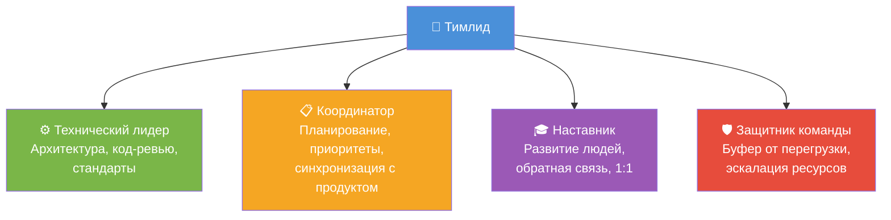
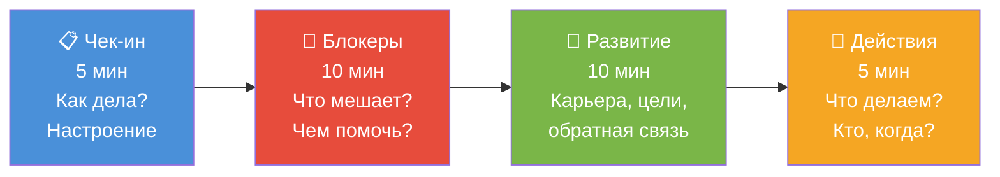
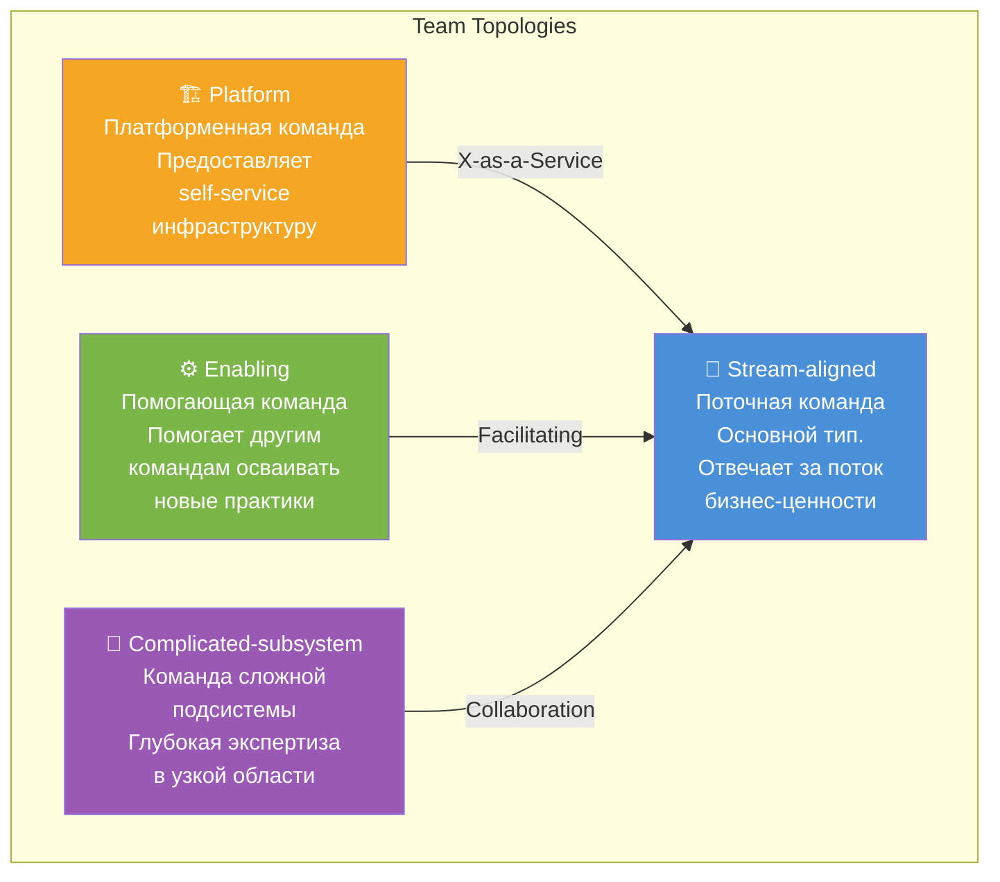
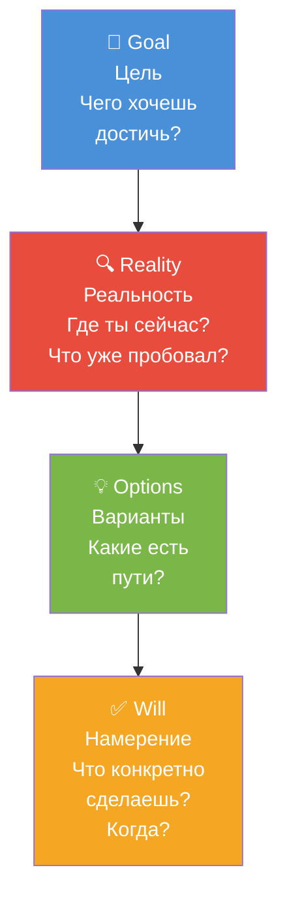
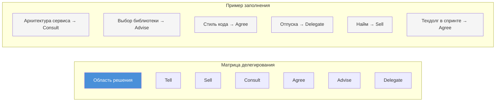
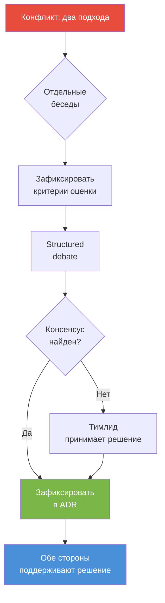
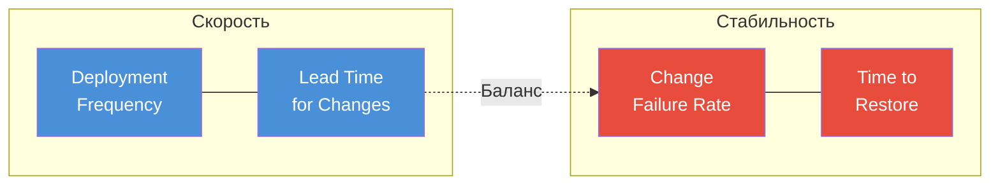

# Вопросы на собеседовании: Лидерство в команде

Глубокие ответы по лидерству в команде: роли, топологии команд, делегирование, 1:1, GROW-модель, обратная связь, конфликты, приоритизация, развитие людей.

Дата последнего обновления: 2026-04-13

**Лидерство в команде** — ключевая компетенция для тимлида и техлида. На собеседованиях оценивают не только знание теории, но и умение применять практики в реальных ситуациях: как строить команду, решать конфликты, делегировать и развивать людей. Этот файл охватывает все основные темы с практическими сценариями и диаграммами.

## Полезные ссылки

### Официальная документация

- [The Manager's Path (O'Reilly)](https://www.oreilly.com/library/view/the-managers-path/9781491973882/)
- [Team Topologies](https://teamtopologies.com/)
- [Top Spring Framework Interview Questions](https://www.baeldung.com/spring-interview-questions) -- технические вопросы для оценки команды
- [Clean Coding in Java](https://www.baeldung.com/java-clean-code) -- принципы чистого кода для code review и стандартов команды

## Содержание

- [Полезные ссылки](#полезные-ссылки)
- [See also](#see-also)

**Роли и основы лидерства**
- [Q1. (!) Чем лидер команды отличается от менеджера?](#q1--чем-лидер-команды-отличается-от-менеджера)
- [Q2. (!) Какие роли бывают у лидера технической команды?](#q2--какие-роли-бывают-у-лидера-технической-команды)
- [Q18. Как балансировать «техническую» и «управленческую» работу?](#q18-как-балансировать-техническую-и-управленческую-работу)
- [Q25. Как развиваться как лидер команды?](#q25-как-развиваться-как-лидер-команды)
- [Q28. (!) Какие типы команд выделяет Team Topologies?](#q28--какие-типы-команд-выделяет-team-topologies)

**1:1, обратная связь и мотивация**
- [Q4. (!) Как проводить 1:1 с разработчиками?](#q4--как-проводить-11-с-разработчиками)
- [Q5. (!) Как давать обратную связь подчинённым?](#q5--как-давать-обратную-связь-подчинённым)
- [Q7. Как мотивировать команду?](#q7-как-мотивировать-команду)
- [Q13. Как строить доверие в команде?](#q13-как-строить-доверие-в-команде)
- [Q26. Как проводить эффективные 1:1?](#q26-как-проводить-эффективные-11)
- [Q29. (!) Что такое GROW-модель и как её применять на 1:1?](#q29--что-такое-grow-модель-и-как-её-применять-на-11)

**Задачи, приоритеты и делегирование**
- [Q3. Как распределять задачи в команде?](#q3-как-распределять-задачи-в-команде)
- [Q8. Как выстраивать приоритеты и защищать команду от перегрузки?](#q8-как-выстраивать-приоритеты-и-защищать-команду-от-перегрузки)
- [Q9. (!) Как делегировать технические решения?](#q9--как-делегировать-технические-решения)
- [Q27. Как делегировать задачи без потери качества?](#q27-как-делегировать-задачи-без-потери-качества)
- [Q30. (!) Как построить матрицу делегирования?](#q30--как-построить-матрицу-делегирования)

**Конфликты и сложные ситуации**
- [Q6. Как разрешать конфликты в команде?](#q6-как-разрешать-конфликты-в-команде)
- [Q14. Как справляться с низкой производительностью члена команды?](#q14-как-справляться-с-низкой-производительностью-члена-команды)
- [Q19. Как эскалировать проблемы наверх?](#q19-как-эскалировать-проблемы-наверх)
- [Q23. Роль лидера при инцидентах и постмортемах?](#q23-роль-лидера-при-инцидентах-и-постмортемах)
- [Q24. Как принимать решение о найме и увольнении?](#q24-как-принимать-решение-о-найме-и-увольнении)
- [Q31. Сценарий: два сеньора не могут договориться об архитектуре — ваши действия?](#q31-сценарий-два-сеньора-не-могут-договориться-об-архитектуре--ваши-действия)

**Развитие команды и онбординг**
- [Q10. Как развивать джуниоров в команде?](#q10-как-развивать-джуниоров-в-команде)
- [Q15. Онбординг новых членов команды?](#q15-онбординг-новых-членов-команды)
- [Q16. Как удерживать знания в команде (документация, ротация)?](#q16-как-удерживать-знания-в-команде-документация-ротация)
- [Q22. Как формировать культуру качества и ownership?](#q22-как-формировать-культуру-качества-и-ownership)
- [Q32. Сценарий: ключевой разработчик хочет уйти — что делать?](#q32-сценарий-ключевой-разработчик-хочет-уйти--что-делать)

**Процессы и метрики**
- [Q11. Как проводить ретроспективы?](#q11-как-проводить-ретроспективы)
- [Q12. Как коммуницировать с продуктом и стейкхолдерами?](#q12-как-коммуницировать-с-продуктом-и-стейкхолдерами)
- [Q17. Удалённая и гибридная команда: особенности лидерства?](#q17-удалённая-и-гибридная-команда-особенности-лидерства)
- [Q20. (!) Метрики эффективности команды?](#q20--метрики-эффективности-команды)
- [Q21. Как проводить оценку производительности (performance review)?](#q21-как-проводить-оценку-производительности-performance-review)
- [Q33. Как выбрать и внедрить DORA-метрики в команде?](#q33-как-выбрать-и-внедрить-dora-метрики-в-команде)

**1-on-1 и OKR/KPI**
- [Q34. Как структурировать 1-on-1 встречи: периодичность, темы, формат?](#q34-как-структурировать-1-on-1-встречи-периодичность-темы-формат)
- [Q35. OKR и KPI для инженерных команд: как ставить и измерять?](#q35-okr-и-kpi-для-инженерных-команд-как-ставить-и-измерять)

**Распределённые команды и психологическая безопасность**
- [Q36. Distributed-first команды: async-коммуникация и timezone overlap?](#q36-distributed-first-команды-async-коммуникация-и-timezone-overlap)
- [Q37. Психологическая безопасность: что это и как создать в команде?](#q37-психологическая-безопасность-что-это-и-как-создать-в-команде)

**Техдолг, метрики и конфликты**
- [Q38. Как объяснить технический долг бизнесу и стейкхолдерам?](#q38-как-объяснить-технический-долг-бизнесу-и-стейкхолдерам)
- [Q39. Engineering Metrics: DORA и SPACE framework?](#q39-engineering-metrics-dora-и-space-framework)
- [Q40. Как разрешать конфликты в команде: техники и эскалация?](#q40-как-разрешать-конфликты-в-команде-техники-и-эскалация)

## Q1. (!) Чем лидер команды отличается от менеджера?

**Лидер** — тот, за кем идут по убеждению и доверию; фокус на цели, вдохновении и развитии людей. **Менеджер** — роль с формальными полномочиями (найм, увольнение, оценки, бюджет). В практике тимлид часто совмещает оба аспекта.

| Аспект | Лидер | Менеджер |
|--------|-------|----------|
| Источник влияния | Доверие, экспертиза | Формальная власть |
| Фокус | Видение, развитие людей | Процессы, контроль |
| Стиль | Вдохновляет, ведёт за собой | Планирует, организует |
| Ответственность | Культура, техническое направление | Оценки, бюджет, найм |
| Как влиять без власти | Код-ревью, стандарты, фасилитация | — |

**Практика:** лидерство проявляется в том, что люди сами обращаются за советом и следуют техническим решениям; менеджмент — в формальных процессах (оценка, отпуска, эскалации). Тимлид без формальной власти влияет через [код-ревью](code-review-practices-interview.md), предложение стандартов и фасилитацию решений; с формальной властью добавляются 1:1, приоритизация и защита команды перед стейкхолдерами.

> **Что хочет услышать интервьюер:** понимание, что лидерство — это не должность, а поведение. Примеры из опыта, где вы влияли без формальной власти.

## Q2. (!) Какие роли бывают у лидера технической команды?

Четыре ключевые роли тимлида:



В зависимости от размера команды и организации тимлид совмещает или делегирует часть ролей.

**Практика по размеру команды:**
- **3-5 человек** — тимлид совмещает все 4 роли, пишет код 50-70% времени
- **6-10 человек** — делегирует часть технических решений сеньорам, код 20-40%
- **10+ человек** — выделять архитектора, делегировать часть 1:1 лидам подкоманд, код 10-20%

Явно зафиксировать, кто за что отвечает (`RACI` или чек-лист в `README`), чтобы не было «все ждут от лидера».

## Q3. Как распределять задачи в команде?

Учитывать: навыки и интересы людей; нагрузку и баланс; развитие (давать сложные задачи тем, кто растёт); ротацию «нелюбимых» задач. Распределение прозрачно: на планировании или в канбане видно, кто за что отвечает. При перегрузке — перераспределение или эскалация сроков. Не закреплять за одним человеком критичный модуль без дублирования знаний.

Практика: на планировании задачи берут в добровольном порядке с учётом приоритета; тимлид следит, чтобы нагрузка была равномерной и не было «узких мест» (один человек на критичном модуле). Для онбординга и развития — пары «опытный + растущий» на одной задаче или код-ревью с разбором. Ротация по доменам (`frontend / backend`/инфраструктура) снижает bus factor.

## Q4. (!) Как проводить 1:1 с разработчиками?

Регулярные встречи (раз в 1–2 недели), фиксированное время, конфиденциальность. 1:1 — не статус по задачам (это на стендапе), а про человека и развитие.

**Фреймворк 1:1 встречи (30-60 минут):**



**Ключевые вопросы по блокам:**

| Блок | Примеры вопросов |
|------|-----------------|
| Чек-ин | «Что на этой неделе было самым полезным/сложным?» |
| Блокеры | «Есть ли что-то, что замедляет тебя?» |
| Развитие | «Над чем хочешь расти в следующем квартале?» |
| Действия | «Что нужно от меня до следующей встречи?» |

**Практика:** фиксировать в календаре; не отменять без крайней необходимости. Итоги и действия записывать (в тетради или личном пространстве), на следующей 1:1 первым делом — проверить выполнение договорённостей. Для структурирования разговоров о развитии используйте GROW-модель (см. Q29).

> **Антипаттерн:** превращать 1:1 в статус-митинг. Если сотрудник начинает с отчёта о задачах — мягко переключить: «Это мы видим на стендапе. Как ты себя чувствуешь в проекте?»

## Q5. (!) Как давать обратную связь подчинённым?

Своевременно (близко к ситуации) и конкретно: не «ты плохо работаешь», а «в последнем `PR` было N замечаний по качеству, давай разберём». Модель `SBI`: `Situation`, `Behavior`, `Impact`. Разделять обратную связь по результатам и по развитию. Позитивную обратную связь тоже давать явно. При серьёзных проблемах — документировать и планировать улучшения с чёткими шагами.

**Практика:** формулировать `SBI`: «На прошлой неделе в `PR` по модулю X (`Situation`) замечания по тестам не были учтены до merge (`Behavior`), из-за этого регрессия в проде (`Impact`). Давай договоримся: перед merge все комментарии ревью закрываем». Позитив: «В этом спринте твой рефакторинг модуля Y сильно упростил поддержку — спасибо». Записывать ключевые договорённости и на следующей 1:1 проверять выполнение.

## Q6. Как разрешать конфликты в команде?

Выяснить позиции сторон (отдельно или вместе), без обвинений. Сфокусироваться на интересах и целях, а не на позициях. Предложить варианты решения (компромисс, делегирование решения третьему, эскалация). Избегать «судьи»; способствовать диалогу. Если конфликт повторяется или затрагивает многих — привлечь `HR` или вышестоящего менеджера.

**Практика:** сначала выслушать каждого по отдельности («что важно для тебя в этой ситуации?»), затем общая встреча с фокусом на интересах («какую цель мы хотим достичь вместе?»). Варианты: развести по разным задачам/модулям; решение принимает архитектор/третий; эскалация на вышестоящего при тупике. Результат зафиксировать (кто что делает); при повторении — привлечь `HR` для медиации или смены ролей.

## Q7. Как мотивировать команду?

Понимать мотиваторы людей (автономия, мастерство, цель — по Д. Пинку). Давать осмысленные задачи и признание; избегать микроменеджмента. Прозрачность целей и приоритетов; участие команды в обсуждении «как» и «что». Защищать от выгорания (реалистичные сроки, отказ от лишних задач). Материальная мотивация — в зоне `HR` и компании; тимлид влияет через содержание работы и климат.

**Практика:** на 1:1 уточнять, что человеку важно (автономия в выборе решений, рост в технологиях, влияние на продукт). Давать задачи с учётом этого: тому, кому важно мастерство — сложные технические задачи; кому важна цель — видимость результата для пользователей. Публично благодарить за вклад (на ретро, в чате). При перегрузке — говорить «нет» стейкхолдерам или сдвигать сроки, а не нагружать команду сверх меры.

## Q8. Как выстраивать приоритеты и защищать команду от перегрузки?

Приоритеты согласовывать с продуктом и стейкхолдерами; критерии — ценность, срочность, зависимости. Делать объём спринта/квартала реалистичным: не обещать больше, чем команда может сделать с качеством. При перегрузке — говорить «нет» или «да, но тогда сдвинем X»; предлагать выбор, а не только жаловаться. Буфер на долг и непредвиденное закладывать в планирование.

**Практика:** на планировании показывать capacity (сколько story points или задач реально берём) и не добавлять сверх лимита без сдвига других задач. Формулировки: «Можем взять A, но тогда B перенесётся на следующий спринт» или «Чтобы сделать A и B в срок, нужен ещё один разработчик». 10–20% спринта закладывать на долг и непредвиденное. При срочном запросе — явно спрашивать: «Что снимаем с текущего спринта?»

## Q9. (!) Как делегировать технические решения?

Чётко передать контекст и границы: что решает команда/человек, что согласовывается с лидером или архитектором. Доверять в рамках границ; не перерешивать за людей без необходимости.

**Уровни делегирования (модель Юргена Аппело):**

| Уровень | Название | Пример |
|---------|----------|--------|
| 1 | Расскажи (Tell) | «Используй PostgreSQL для этого сервиса» |
| 2 | Продай (Sell) | «Я рекомендую PostgreSQL, потому что...» |
| 3 | Посоветуйся (Consult) | «Какую БД выбрать? Вот мои мысли...» |
| 4 | Согласуй (Agree) | «Давай вместе решим, какую БД» |
| 5 | Предоставь (Advise) | «Выбери БД, но я дам совет если попросишь» |
| 6 | Узнай (Inquire) | «Выбери БД и расскажи мне о решении» |
| 7 | Делегируй (Delegate) | «Выбери БД — я доверяю» |

**Практика:** зафиксировать границы: «Выбор библиотеки для модуля X — за тобой, граница — не тянуть новые runtime-зависимости без обсуждения» (уровень 5-6). Крупные решения (архитектура сервиса, смена БД) — уровень 3-4. При неудаче: разбор «что узнали, что сделать иначе», без публичного осуждения; записать урок в ретро или `ADR`.

> **Правило:** уровень делегирования зависит от опыта человека и критичности решения. Джуниору на критичном модуле — уровень 2-3; сеньору на знакомой задаче — уровень 6-7.

## Q10. Как развивать джуниоров в команде?

Давать задачи по уровню с постепенным усложнением; парное программирование и код-ревью с разбором. Назначить ментора из команды; регулярная обратная связь и 1:1. Документация и онбординг-чеклист; доступ к курсам и конференциям. Не ожидать сеньорского уровня сразу; явно хвалить прогресс и терпеливо разбирать ошибки.

**Практика:** первые задачи — с чётким описанием и ожидаемым результатом; затем задачи с неочевидным решением, но с возможностью спросить ментора. В код-ревью не только «исправь», но и «предлагаю так, потому что…». На 1:1 спрашивать: «Что было сложнее всего? Над чем хочешь порасти?» Выделять время на курсы/конференции; после — краткий разбор с командой (lightning talk). При ошибках — разбор без обвинений: «Как бы ты сделал в следующий раз?»

## Q11. Как проводить ретроспективы?

Регулярно (раз в спринт или раз в 2 недели), фиксированная длительность. Формат: что прошло хорошо, что улучшить, действия на следующий цикл. Фасилитировать так, чтобы говорили все; без обвинений. Действия — с владельцем и дедлайном; проверять на следующей ретро. Вариации формата (Start / Stop / Continue, морская звезда и т.д.) для разнообразия.

**Практика:** фиксировать время (например, 1 час в конце спринта); не отменять без крайней необходимости. В начале — напомнить правила: «без обвинений, фокус на процессе и системе». Вопросы: «Что было хорошо?», «Что улучшить?», «Что сделаем по-другому?». Действия записывать с владельцем и дедлайном; на следующей ретро первым пунктом — проверка выполнения действий. Менять формат (Start / Stop / Continue, ретро по ролям) для вовлечённости.

## Q12. Как коммуницировать с продуктом и стейкхолдерами?

Ясный язык: объяснять технические ограничения и риски без жаргона; предлагать варианты (сроки, объём, качество). Регулярные синки (встречи, отчёты); прозрачность статуса и блокеров. Не обещать нереалистичное; при рисках — предупреждать заранее. Документировать договорённости (сроки, приоритеты) чтобы избежать «а мы думали иначе».

**Практика:** вместо «рефакторинг модуля X» — «чтобы добавлять фичи в модуль X быстрее, нужно 2 спринта на рефакторинг; без этого каждая фича там будет +3 дня». При рисках: «Есть риск сдвига релиза из-за Y; варианты: сдвинуть на неделю или урезать scope Z». Договорённости писать в тикете или в протоколе встречи; при расхождении — ссылка на запись. Регулярный статус (раз в неделю или в спринт) — что сделано, что в работе, блокеры.

## Q13. Как строить доверие в команде?

Честность и последовательность; выполнять обещания. Прозрачность решений и приоритетов; признавать ошибки. Доверять людям в зоне их ответственности; не микроменеджировать. Защищать команду от необоснованного давления; справедливо распределять нагрузку и признание. Доверие строится со временем через действия, а не декларации.

**Практика:** если пообещал «разберусь с доступом» — сделать и отчитаться. При ошибке: «Я неправильно оценил сроки, извиняюсь; вот что делаем дальше». Не перекладывать вину на команду при эскалации; формулировать «мы столкнулись с…», а не «они не сделали». Справедливость: не давать одному все «интересные» задачи, а другому — только рутину; ротация и учёт пожеланий при распределении.

## Q14. Как справляться с низкой производительностью члена команды?

Сначала понять причины: навыки, мотивация, личные обстоятельства, неясные ожидания. Обратная связь с конкретными примерами и планом улучшений; поддержка (обучение, менторинг). Зафиксировать ожидания и сроки; при отсутствии прогресса — `PIP` (`Performance Improvement Plan`) с чёткими критериями. Документировать разговоры и действия.

**Практика:** увольнение — крайняя мера после исчерпания вариантов; согласование с `HR`. На 1:1 не избегать сложных тем: «Я заметил, что последние N `PR` требуют много итераций ревью; давай разберём, что мешает». `PIP` — письменный план с целями, сроками и критериями успеха; регулярные чек-ины; при улучшении — снять `PIP`, при отсутствии прогресса — эскалация с `HR`.

## Q15. Онбординг новых членов команды?

Чек-лист: доступы, рабочее место, документация по проекту и процессам. Ментор из команды; первые задачи — понятные и с быстрой обратной связью. Знакомство с командой и стейкхолдерами; экскурс по кодовой базе и архитектуре. Регулярные чек-ины в первые недели; сбор обратной связи по онбордингу для улучшения процесса.

**Практика:** онбординг-чеклист в `Confluence / Notion`: доступы (Git, `CI`, `Jira`), локальный запуск проекта, ключевые документы (`README`, `ADR`). Ментор — один человек из команды на первые 2–4 недели. Первая задача — небольшая, с чётким описанием; код-ревью с разбором. На 1-й неделе — экскурс по коду и архитектуре (встреча или запись). Чек-ины с тимлидом: 1-я неделя — каждый день, 2–4-я — раз в 2–3 дня. Через месяц — обратная связь: «Что было непонятно? Что улучшить в онбординге?»

## Q16. Как удерживать знания в команде (документация, ротация)?

Документировать архитектуру, ключевые решения (`ADR`), runbooks. Ротация по областям и задачам, чтобы не было «единственного эксперта». Код-ревью и парное программирование как передача знаний. При уходе человека — передача дел и обновление документации. База знаний (`Confluence`, `Notion`) с актуальным контентом; ответственность за обновление закреплена.

**Практика:** `ADR` для значимых решений (выбор БД, архитектура сервиса); runbooks для инцидентов (как перезапустить, как откатить). Ротация: не закреплять критичный модуль за одним человеком; пары «опытный + новый» на задачах в этой области. При уходе: передача дел (встречи, список контактов и владений), обновление `README` и runbooks. В ретро обсуждать: «Где знания сосредоточены в одном человеке? Как снизить bus factor?»

## Q17. Удалённая и гибридная команда: особенности лидерства?

Регулярные синки (видео); асинхронная коммуникация (чаты, документы) с ясными ожиданиями по ответам. Доверие и результат вместо «присутствия»; явные критерии выполнения задач. Неформальное общение (кофе-звонки, каналы для нерабочего) для сплочённости. Онбординг и 1:1 не менее важны удалённо; внимание к выгоранию и изоляции.

**Практика:** стендап в видео с камерами; статус и блокеры в чате или в тикетах. Договориться о времени ответа (например, в течение рабочего дня на сообщения в чате). Критерии «готово» для задач — явно в тикете, чтобы не зависеть от «подойди, покажу». Неформально: канал для нерабочего общения, раз в неделю «кофе-звонок» без повестки. 1:1 и онбординг не отменять; при выгорании или изоляции — спрашивать на 1:1: «Как нагрузка? Есть ли ощущение оторванности?»

## Q18. Как балансировать «техническую» и «управленческую» работу?

Зависит от размера команды и организации. Часть времени — код, ревью, архитектура; часть — 1:1, планирование, коммуникация. При росте команды управленческая доля растёт; критичный код и ревью лидер может сохранять для контекста. Делегирование технических решений и рутины освобождает время. Явно планировать блоки на «глубокую работу» и на людей.

**Практика:** в календаре зарезервировать блоки: 2–3 часа в неделю на код и ревью (не размазывать по 15 минут); 1:1 в фиксированные слоты; планирование и ретро — в спринте. При команде 5+ человек доля «люди» растёт — делегировать часть ревью и технических решений джуниорам/мидлам с проверкой. Критичный модуль или архитектурные решения оставлять за собой для контекста; рутину (мелкие баги, конфиги) делегировать. На ретро спрашивать себя: «Достаточно ли я был доступен команде? Не съела ли рутина всё время?»

## Q19. Как эскалировать проблемы наверх?

Эскалировать вовремя: не когда «всё сломалось», а когда нужны ресурсы, решения или видимость. Чётко описать проблему, что уже сделано, что нужно от руководства (решение, люди, сроки). Предлагать варианты, а не только жаловаться. Документировать эскалации; после решения — обратная связь команде. Не использовать эскалацию как угрозу; использовать для снятия блокеров.

**Практика:** формат эскалации: «Проблема: [одно предложение]. Что сделали: [список]. Что нужно от вас: [решение / ресурсы / сроки]. Варианты: A — …, B — …». Письменно (email, документ) — чтобы не терялось. Эскалировать при блокере дольше N дней или при риске срыва сроков; не ждать до последнего дня. После решения — кратко сообщить команде: «По вопросу X договорились: …». Не эскалировать «они плохо работают» без конкретики; эскалировать «нужен ещё один разработчик на модуль X к дате Y».

## Q20. (!) Метрики эффективности команды?

Примеры: доставка (velocity, lead time, количество релизов); качество (баги в проде, покрытие тестами, регрессии); удовлетворённость (опросы, ретро). Метрики — инструмент улучшения, не наказания. Избегать метрик, которые легко «накрутить» в ущерб качеству. Обсуждать с командой, какие метрики релевантны и как их улучшать.

**Практика:** velocity и lead time — для планирования и улучшения процесса; не использовать как `KPI` «больше — лучше» (иначе завышают оценки). Качество: количество багов в проде, регрессий после релиза — для фокуса на тестах и ревью. Удовлетворённость: короткие опросы после спринта или ретро; «что улучшить в процессе?» На ретро обсуждать метрики с командой: «Что для нас важно? Как мы можем повлиять на это?» Не наказывать за «плохие» цифры; использовать для поиска причин и действий.

## Q21. Как проводить оценку производительности (performance review)?

На основе фактов: проекты, код-ревью, обратная связь коллег, достижение целей. Критерии прозрачны и известны заранее. Разделять оценку результата и развитие; давать конкретные примеры. Обсуждение в диалоге; цели на следующий период согласовать.

**Практика:** связь с компенсацией и карьерой — по политике компании; тимлид готовит ввод, решение может быть за вышестоящим менеджером. Готовить примеры за квартал (успехи, области роста); не опираться только на последние недели. Цели на следующий период — измеримые и согласованные; записать и вернуться к ним на следующей оценке.

## Q22. Как формировать культуру качества и ownership?

Личный пример: ревью, тесты, документация. Ожидания явно сформулированы (определение «готово», критерии приёмки). Не принимать в main код без ревью и тестов; постмортемы без вины — разбор системных причин. Признавать тех, кто поднимает качество; обсуждать качество на ретро.

**Практика:** ownership — закрепление областей за людьми при ротации и парном владении критичных мест. В `README` или `Confluence` — «кто за что отвечает»; при смене владельца — передача и обновление документации. На ретро — «кто поднял качество на этой итерации?» и благодарность в команде.

## Q23. Роль лидера при инцидентах и постмортемах?

Во время инцидента: координация, коммуникация со стейкхолдерами, защита команды от отвлечений. Не давить на «виноватого»; фокус на восстановлении и сборе фактов. Постмортем: фасилитировать без обвинений; выявить причины и действия; документировать и следить за выполнением действий.

**Практика:** культура «улучшаем систему, а не ищем виноватых» — ответственность лидера. На постмортеме: «Что произошло? Что мы сделаем, чтобы не повторилось?» Действия — с владельцем и дедлайном; на следующей ретро проверить выполнение. При эскалации стейкхолдерам формулировать «у нас инцидент, работаем над восстановлением», а не «кто-то сломал».

## Q24. Как принимать решение о найме и увольнении?

Найм: участие в интервью (техническое, культурное); чёткие критерии и роли в интервью-процессе; решение совместно с `HR` и при необходимости с вышестоящим. Увольнение: после обратной связи, `PIP` и исчерпания вариантов; согласование с `HR` и юридическими; корректное оформление.

**Практика:** решение об увольнении тяжёлое; лидер должен быть уверен в обоснованности и процессе. Документировать обратную связь, `PIP` и итоги; при увольнении — корректно и конфиденциально; после — поддержка команды (без обсуждения деталей ухода). На найме — чёткий профиль роли и критерии «да/нет»; несколько интервьюеров снижают субъективность.

## Q25. Как развиваться как лидер команды?

Обратная связь от команды и коллег (`360`); курсы и книги по менеджменту и лидерству. Ментор или коуч среди более опытных лидеров; ретро по своим действиям. Экспериментировать с форматами встреч, делегированием, обратной связью. Рефлексия: что сработало, что нет.

**Практика:** лидерство — навык, его можно развивать целенаправленно. На 1:1 спрашивать у команды: «Что я могу делать иначе?» Раз в квартал — саморефлексия: «Где я перегрузил команду? Где недодал контекста?» Курсы и книги — с применением в практике (один приём за раз); ментор среди тимлидов или вышестоящего менеджера для разбора сложных ситуаций.

## Q26. Как проводить эффективные 1:1?

Регулярность (раз в 1–2 недели); фиксированное время; фокус на собеседнике (как дела, что мешает, что нужно от тебя). Готовить темы, но не превращать в отчёт. Обсуждать развитие, карьеру, обратную связь. Записывать договорённости и действия. 1:1 — пространство для диалога, а не для статус-отчёта.

**Практика:** 30–60 минут в календаре; не отменять без крайней необходимости. Вопросы: «Что на этой неделе было самым полезным/сложным?», «Есть ли блокеры?», «Над чем хочешь развиваться в следующем квартале?», «Что нужно от меня?» Статус по задачам — на стендапе; на 1:1 — про человека и развитие. Итоги и действия записывать (в тетради или личном пространстве); на следующей 1:1 — проверить выполнение договорённостей.

## Q27. Как делегировать задачи без потери качества?

Выбирать задачу по уровню сотрудника (чуть выше текущего для роста). Чётко описать ожидания, критерии готовности и сроки. Быть доступным для вопросов; не перехватывать задачу при первых сложностях. Ревью результата и обратная связь — часть делегирования. Документировать решения для следующих раз.

**Практика:** в тикете или в устной договорённости: что нужно сделать, критерии «готово», дедлайн. «Если застрянешь — пиши; не перехватываю задачу, но помогу разобраться». Ревью кода и результата — обязательно; обратная связь: «здесь хорошо, здесь можно так в следующий раз». При повторяющихся задачах — записать решение в `README` или `ADR`, чтобы следующий раз человек мог опереться на документ. Подробнее о матрице делегирования — в Q30.

## Q28. (!) Какие типы команд выделяет Team Topologies?

**Team Topologies** (Мэтью Скелтон и Мануэль Пайс) — фреймворк организации команд для быстрой доставки ценности. Выделяет 4 типа команд и 3 типа взаимодействий.

**4 типа команд:**



**3 типа взаимодействий:**

| Тип | Описание | Когда применять |
|-----|----------|-----------------|
| Collaboration | Тесная совместная работа | При освоении новой области, временно |
| X-as-a-Service | Потребление сервиса через API | Платформа предоставляет ready-to-use инструменты |
| Facilitating | Помощь и обучение | Enabling-команда помогает stream-aligned |

**Практика для тимлида:** определите, к какому типу относится ваша команда. Большинство продуктовых команд — stream-aligned. Если ваша команда тратит много времени на помощь другим — возможно, она де-факто enabling или platform, и это стоит формализовать. На собеседовании покажите, что понимаете, как тип команды влияет на процессы, найм и метрики.

> **Что хочет услышать интервьюер:** не пересказ книги, а понимание, как топология влияет на вашу работу. Пример: «Моя команда была stream-aligned, но мы тратили 30% времени на помощь другим — мы выделили платформенную подкоманду».

## Q29. (!) Что такое GROW-модель и как её применять на 1:1?

**GROW** — коучинговая модель для структурирования разговоров о развитии и решении проблем. Особенно эффективна на 1:1, когда нужно помочь сотруднику самому найти решение, а не давать готовый ответ.



**Пример диалога на 1:1 (сотрудник хочет вырасти в архитектора):**

| Этап | Вопрос тимлида | Ответ сотрудника |
|------|----------------|-----------------|
| **Goal** | «Какой результат ты хочешь через 6 месяцев?» | «Хочу уметь проектировать сервисы с нуля» |
| **Reality** | «Что уже умеешь? Где чувствуешь пробелы?» | «Знаю паттерны, но не уверен в выборе БД и интеграциях» |
| **Options** | «Какие варианты видишь для закрытия пробелов?» | «Курс по System Design, взять задачу по новому сервису, ментор» |
| **Will** | «Что сделаешь первым? К какой дате?» | «Начну курс на этой неделе, попрошу задачу по сервису X» |

**Когда применять GROW:**
- Карьерное развитие сотрудника
- Разбор сложной ситуации, когда сотрудник «застрял»
- Помощь в принятии решения без навязывания своего мнения
- На [поведенческом интервью](../behavioral/behavioral-interview.md) часто спрашивают про коучинговые подходы

> **Антипаттерн:** пропускать этап Options и сразу давать готовое решение. Цель GROW — чтобы сотрудник сам нашёл путь; ваша задача — задавать правильные вопросы.

## Q30. (!) Как построить матрицу делегирования?

**Матрица делегирования** (Delegation Board) — визуальный инструмент для явного распределения полномочий в команде. Помогает избежать ситуации, когда «все ждут решения от тимлида» или «непонятно, кто решает».



**Как внедрить:**

1. **Выписать области решений** — архитектура, инструменты, процессы, отпуска, найм, техдолг
2. **Обсудить с командой** уровень делегирования для каждой области (см. уровни в Q9)
3. **Зафиксировать на доске** (физической или в `Confluence`)
4. **Пересматривать раз в квартал** — по мере роста команды и доверия уровни сдвигаются вправо

**Практика:** при онбординге нового сотрудника матрица делегирования сразу показывает, какие решения он может принимать сам. Это снижает неопределённость и ускоряет адаптацию (см. Q15).

> **Что хочет услышать интервьюер:** конкретный пример, как вы распределяли полномочия. «У нас была доска делегирования: выбор библиотек — на сеньорах, архитектурные решения — обсуждаем вместе, отпуска — полностью на людях».

## Q31. Сценарий: два сеньора не могут договориться об архитектуре — ваши действия?

**Ситуация:** два опытных разработчика продвигают разные подходы к архитектуре нового сервиса. Обсуждение зашло в тупик, команда разделилась.

**Пошаговый алгоритм действий:**

1. **Отдельные беседы** — выслушать каждого: «Почему ты считаешь подход A лучше? Какие риски видишь в B?»
2. **Фиксация критериев** — вместе определить, по каким критериям оцениваем (производительность, сложность поддержки, time-to-market, знакомство команды)
3. **Structured debate** — организовать встречу: каждый за 15 минут представляет подход по единым критериям; команда задаёт вопросы
4. **Попытка гибрида** — часто конфликт ложный: можно взять сильные стороны обоих подходов
5. **Решение** — если консенсус не найден, тимлид принимает решение и объясняет причины
6. **`ADR`** — зафиксировать решение, аргументы «за» и «против», контекст



**Практика:** после принятия решения важно, чтобы «проигравшая» сторона не саботировала. Формулировка: «Мы выслушали оба подхода, решили идти с A по причинам X, Y. Если через 2 спринта увидим проблемы — пересмотрим. Спасибо обоим за качественный анализ». Подробнее о конфликтах — в Q6.

## Q32. Сценарий: ключевой разработчик хочет уйти — что делать?

**Ситуация:** сильный сеньор, единственный эксперт по критичному модулю, сообщает о намерении уйти.

**Немедленные действия (первые 24-48 часов):**

1. **Понять причины** — на 1:1 без давления: «Что повлияло на решение? Есть ли что-то, что мы можем изменить?»
2. **Оценить, обратимо ли** — если проблема в задачах/росте/компенсации — обсудить варианты. Если решение окончательное — не давить
3. **Не паниковать публично** — команда не должна ощутить панику лидера

**Если уход неизбежен — план передачи знаний:**

| Неделя | Действие |
|--------|----------|
| 1 | Список всех областей ответственности; начало документации |
| 2-3 | Парное программирование с преемником на критичных модулях |
| 3-4 | Преемник ведёт задачи самостоятельно, уходящий — на ревью |
| 4+ | Обновление runbooks, `ADR`, передача контактов |

**Системные выводы (предотвращение в будущем):**
- Снижать bus factor: ротация по модулям, парное владение (см. Q16)
- Регулярно спрашивать на 1:1 об удовлетворённости (Q4, Q26)
- Документировать критичные знания до того, как человек решит уйти

> **Что хочет услышать интервьюер:** зрелую реакцию без паники. Уважение к решению человека + системный подход к минимизации рисков. Пример: «Когда у меня уходил ключевой разработчик, мы за 3 недели передали знания двум людям, обновили документацию и наладили парное владение модулем».

## Q33. Как выбрать и внедрить DORA-метрики в команде?

**DORA-метрики** (DevOps Research and Assessment) — четыре ключевые метрики, предсказывающие эффективность доставки ПО:

| Метрика | Что измеряет | Elite | High | Medium | Low |
|---------|-------------|-------|------|--------|-----|
| **Deployment Frequency** | Как часто деплоим | По требованию | Раз в неделю | Раз в месяц | Реже |
| **Lead Time for Changes** | От коммита до прода | < 1 часа | < 1 недели | < 1 месяца | > 1 месяца |
| **Change Failure Rate** | % деплоев с откатом | 0-15% | 16-30% | 31-45% | > 45% |
| **Time to Restore** | Время восстановления | < 1 часа | < 1 дня | < 1 недели | > 1 недели |



**Как внедрить:**

1. **Начните с измерения** — автоматизируйте сбор (из `CI/CD`, Git, инцидент-трекера)
2. **Покажите команде** — на ретро, без обвинений: «Вот наши цифры, вот куда хотим»
3. **Выберите одну метрику для улучшения** — не все сразу
4. **Экспериментируйте** — автотесты для снижения Change Failure Rate, trunk-based development для Lead Time
5. **Пересматривайте** — раз в квартал

**Связь с другими метриками:** DORA дополняет, а не заменяет бизнес-метрики и метрики удовлетворённости команды (см. Q20). Подробнее о процессах доставки — в [вопросах по микросервисной архитектуре](../architecture/microservices-interview.md).

> **Антипаттерн:** использовать DORA как `KPI` для наказания. Метрики — инструмент улучшения системы, не оценки людей.

---

---

## Q34. Как структурировать 1-on-1 встречи: периодичность, темы, формат?

**1-on-1** — регулярная личная встреча лидера с каждым членом команды. Главное правило: это встреча **сотрудника**, не менеджера — он устанавливает повестку.

**Периодичность:**

| Ситуация | Частота |
|---------|---------|
| Новый сотрудник (первые 3 месяца) | Еженедельно |
| Устоявшаяся команда | Раз в 1–2 недели |
| Удалённая команда | Еженедельно (нет коридорных разговоров) |
| Кризис/конфликт | Чаще, пока не разрешится |

**Структура 30-минутного 1-on-1:**

```
5 мин  — Как дела? (настроение, энергия, что беспокоит)
15 мин — Повестка сотрудника (его темы, проблемы, вопросы)
5 мин  — Повестка лидера (обратная связь, важные новости)
5 мин  — Карьера и развитие (раз в месяц углублённо)
```

**Темы для 1-on-1:**
- Текущие задачи: есть ли блокеры, помощь нужна?
- Настроение и мотивация: что даёт энергию, что забирает
- Карьерные цели: куда хочет развиваться, что нужно?
- Обратная связь в обе стороны: что лидер делает хорошо/плохо?
- Идеи и инициативы: что бы изменил в процессах, инструментах

**Анти-паттерны 1-on-1:**
- Превращать в статус-отчёт («что сделал на этой неделе?») — для этого есть стендап
- Откладывать или отменять — сигнал, что сотрудник не важен
- Только говорить, не слушать
- Не фиксировать договорённости — к следующей встрече забудут

**Инструменты:** Notion/Confluence с шаблоном встречи, Lattice, 15Five.

---

## Q35. OKR и KPI для инженерных команд: как ставить и измерять?

**OKR** (Objectives and Key Results) — фреймворк целеполагания:
- **Objective** — качественная амбициозная цель («стать самой надёжной платформой»)
- **Key Results** — измеримые результаты, по которым понятно, достигнута ли цель

**Пример OKR для инженерной команды:**

```
Objective: Повысить надёжность Orders Service
Key Results:
  KR1: Снизить p99 latency с 800ms до 200ms к концу Q2
  KR2: Достичь SLO 99.9% availability (сейчас 99.5%)
  KR3: MTTD (Mean Time to Detect) инцидентов < 5 минут
  KR4: Change Failure Rate < 5% (сейчас 12%)
```

**KPI** (Key Performance Indicators) — операционные показатели для мониторинга состояния:

| KPI для инженерной команды | Что измеряет |
|---------------------------|-------------|
| Deployment Frequency | Сколько деплоев в день/неделю |
| Lead Time for Changes | От коммита до production |
| Time to First Review | Скорость code review |
| Test Coverage (новый код) | Качество кода |
| Bug Escape Rate | Баги, дошедшие до prod |
| On-Call Incident Rate | Нагрузка дежурного |

**Разница OKR vs KPI:**

| | OKR | KPI |
|-|-----|-----|
| Горизонт | Квартал | Непрерывно |
| Цель | Улучшение, рост | Здоровье системы |
| Количество | 3–5 Objectives, 3–5 KR каждый | Много, по всем аспектам |
| Амбициозность | 60–70% выполнения — норма | Нужно выполнять 100% |

**Практика:** OKR ставятся совместно с командой, не спускаются сверху. KPI мониторятся на дашбордах. Не используй KPI как инструмент наказания — демотивирует.

---

## Q36. Distributed-first команды: async-коммуникация и timezone overlap?

**Распределённая команда** — команда, в которой участники находятся в разных локациях или часовых поясах.

**Async-first принципы:**

| Принцип | Реализация |
|---------|-----------|
| Документируй решения | ADR, Confluence, не только Slack |
| Используй async каналы по умолчанию | Email/Jira/Confluence вместо встречи |
| Структурируй сообщения | TL;DR в начале, контекст, вопрос/решение в конце |
| Устанавливай SLA на ответ | «Отвечу в течение 4 часов рабочего дня» |
| Видеозапись важных встреч | Коллеги из другого TZ могут посмотреть позже |

**Timezone overlap:**

```
Москва (UTC+3) + Лондон (UTC+1) + Нью-Йорк (UTC-4):
  Пересечение: 14:00–17:00 MSK = 11:00–14:00 London = 07:00–10:00 NY
  → Планировать синхронные встречи в этот промежуток
```

**Инструменты:**
- **World Time Buddy / Every Time Zone** — планирование встреч
- **Loom** — асинхронные видеосообщения вместо встречи
- **Notion / Confluence** — документация как single source of truth
- **Linear / Jira** — статусы задач без необходимости спрашивать в чате

**Риски и как бороться:**

| Риск | Решение |
|------|---------|
| Изоляция удалённых участников | Намеренный async-check-in в общем канале |
| Потеря контекста | Всё важное — письменно в документ |
| Усталость от видеозвонков | Встречи только когда async не работает |
| Разный опыт «офис vs удалёнка» | Либо все удалённо, либо у каждого хорошее оборудование |

---

## Q37. Психологическая безопасность: что это и как создать в команде?

**Психологическая безопасность** (Amy Edmondson, Google Project Aristotle) — убеждение членов команды, что они не будут наказаны за высказывание идей, вопросов, опасений или признание ошибок.

**Почему критична:** Google Aristotle (2016) — главный предиктор эффективности команды.

**Признаки высокой психологической безопасности:**
- Люди признают ошибки публично, без страха осуждения
- Джуниоры задают вопросы сеньорам без стеснения
- Несогласие с решением лидера — нормально
- Плохие новости доносятся быстро, не замалчиваются

**Как создать:**

1. **Лидер показывает пример уязвимости:**
   «Я ошибся в оценке этой задачи — вот что я понял»

2. **Реагировать на ошибки как на обучение:**
   Постмортемы без blame, с фокусом на системные причины

3. **Явно поощрять несогласие:**
   «Кто видит риски в этом плане?» — на каждом планировании

4. **Не прерывать и не обесценивать:**
   Дать высказаться до конца, не говорить «это очевидно»

5. **Разделять safety и performance standards:**
   Психологическая безопасность ≠ отсутствие стандартов качества

**Инструменты измерения:**
- **Опрос Amy Edmondson (7 вопросов)** — регулярный пульс-чек
- Анонимный ретро-формат (FunRetro, Parabol) — люди честнее

---

## Q38. Как объяснить технический долг бизнесу и стейкхолдерам?

Нетехнические стейкхолдеры не понимают «плохой код». Нужны бизнес-метафоры и конкретные цифры.

**Метафора «финансового долга»:**
> «Технический долг — как кредит. Мы взяли быстрое решение сейчас, но каждый спринт платим проценты в виде замедленной разработки. Если не погашать — проценты растут».

**Перевод в бизнес-метрики:**

| Технический индикатор | Бизнес-последствие |
|----------------------|-------------------|
| Lead Time for Changes +30% | Фичи выходят медленнее |
| Change Failure Rate 15% | Инциденты после каждого деплоя → потери выручки |
| Время онбординга нового разработчика 3 месяца | Дорогой найм, медленный рост команды |
| 40% времени команды — поддержка инцидентов | Ноль времени на продуктовые задачи |

**Формат презентации для стейкхолдеров:**

```
1. Текущее состояние: "Вот наши DORA-метрики за квартал"
2. Влияние на бизнес: "Из-за этого мы задерживаем X фичей в квартал"
3. Предложение: "15% времени команды на погашение долга → через 2 квартала 
   сократим lead time вдвое"
4. ROI: "Текущая стоимость инцидентов: N часов × ставка + репутация"
```

**Ключевой принцип:** говорить о долге не как о техническом долге, а как о **операционном риске** или **замедлителе скорости доставки**.

---

## Q39. Engineering Metrics: DORA и SPACE framework?

**DORA Metrics** (DevOps Research and Assessment) — четыре метрики скорости и стабильности:

| Метрика | Elite-командa | High | Medium | Low |
|---------|-------------|------|--------|-----|
| Deployment Frequency | Несколько раз в день | Раз в неделю | Раз в месяц | Реже |
| Lead Time for Changes | < 1 часа | 1 день – 1 неделя | 1–6 месяцев | > 6 мес |
| Change Failure Rate | < 5% | 10–15% | 16–30% | > 30% |
| Time to Restore | < 1 часа | < 1 дня | 1 день – 1 неделя | > 1 недели |

**SPACE Framework** (GitHub/Microsoft, 2021) — многомерная модель продуктивности разработчиков:

| Измерение | Что включает |
|-----------|-------------|
| **S**atisfaction | Удовлетворённость, благополучие, NPS разработчика |
| **P**erformance | Качество и надёжность результатов (не скорость) |
| **A**ctivity | Кол-во деплоев, PR, commits (осторожно — vanity metrics) |
| **C**ommunication | Интеграция, документация, code review quality |
| **E**fficiency | Flow state, время без прерываний, WIP |

**Почему SPACE лучше «velocity»:**
- Velocity (story points) — легко манипулировать, не коррелирует с бизнес-ценностью
- SPACE смотрит на продуктивность с нескольких углов, не только скорость

**Практика внедрения:**
1. Начинай с DORA — данные из CI/CD, измеримо, понятно
2. Добавляй SPACE постепенно — Developer Survey раз в квартал
3. Не публикуй метрики per-person — демотивирует, вызывает gaming

---

## Q40. Как разрешать конфликты в команде: техники и эскалация?

**Типы конфликтов в инженерной команде:**

| Тип | Пример | Подход |
|-----|--------|--------|
| Технический (архитектура) | «REST vs gRPC» | RFC/ADR с критериями решения |
| Ресурсный | «Кто берёт эту задачу» | Прозрачный backlog и распределение |
| Межличностный | «Не воспринимают мои идеи» | 1-on-1, активное слушание |
| Культурный | Разные ожидания по качеству | Явные стандарты, DoD |

**Техника ненасильственного общения (NVC):**
1. **Наблюдение** без оценки: «На последних трёх ревью ты блокировал PR более 3 дней»
2. **Чувства**: «Я чувствую, что это тормозит команду»
3. **Потребности**: «Нам нужен предсказуемый процесс ревью»
4. **Просьба**: «Можем договориться: если не успеваешь за день — напиши предварительный фидбек?»

**Алгоритм разрешения технического конфликта:**

```
1. Сформулируй критерии решения (не мнения)
   «Нам важны: latency, стоимость поддержки, скорость разработки»

2. Каждая сторона обосновывает по критериям
   «gRPC выигрывает по latency, но требует protobuf на всех клиентах»

3. Попробуй spike/PoC — данные вместо мнений

4. Если консенсус не достигнут — лидер принимает решение с объяснением
```

**Эскалация:**

| Уровень | Когда | Кому |
|---------|-------|------|
| 1-on-1 с участниками | Сначала | Лидер разговаривает с каждым |
| Совместная встреча | Не помогло | Лидер как медиатор |
| Эскалация вверх | Системная проблема | Engineering Manager / VP |
| HR | Личный конфликт с нарушением норм | HR + менеджер |

**Правило:** разрешать конфликт как можно ближе к его источнику, эскалировать только если уровень ниже не справляется.

## See also

- [Практики code review](code-review-practices-interview.md) — вопросы по практикам code review
- [Поведенческое интервью](../behavioral/behavioral-interview.md) — STAR-формат и ситуационные вопросы
- [Design Patterns](../design-patterns/design-patterns-interview.md) — вопросы по паттернам проектирования
- [Микросервисная архитектура](../architecture/microservices-interview.md) — архитектура микросервисов
- [Технический долг](../code-quality/technical-debt-interview.md) — управление техдолгом в команде
- [Дизайн пайплайнов](../cicd/pipeline-design-interview.md) — DevOps и инженерные практики

- [[code-review-practices-interview|Практики code review]]
- [[conflict-resolution-interview|Разрешение конфликтов]]
- [[estimations-planning-interview|Оценка и планирование]]
- [[mentoring-interview|Менторство инженеров]]
- [[tech-interviewing-interview|Проведение технических интервью]]
- [[technical-decisions-interview|Технические решения]]
