# Вопросы на собеседовании: `Logging`

Подробные ответы по логированию: `SLF4J`, `Logback`, `MDC`, структурированные логи, `ELK`, трассировка, безопасность.

## Полезные ссылки

### Официальная документация

- [Java Logging (java.util.logging)](https://docs.oracle.com/en/java/javase/17/docs/api/java.logging/java/util/logging/package-summary.html)
- [SLF4J Manual](https://www.slf4j.org/manual.html)
- [Logback Documentation](https://logback.qos.ch/manual/)
- [Log4j2 Documentation](https://logging.apache.org/log4j/2.x/)
- [Logstash Logback Encoder](https://github.com/logfellow/logstash-logback-encoder)
- [Spring Boot Logging](https://docs.spring.io/spring-boot/docs/current/reference/html/features.html#features.logging)
- [A Guide To Logback](https://www.baeldung.com/logback) — полное руководство по Logback
- [Introduction to SLF4J](https://www.baeldung.com/slf4j-with-log4j2-logback) — SLF4J с Log4j2 и Logback
- [Java Logging with Mapped Diagnostic Context (MDC)](https://www.baeldung.com/mdc-in-log4j-2-logback) — MDC для обогащения логов
- [Structured Logging in Spring Boot](https://www.baeldung.com/spring-boot-structured-logging) — структурированные логи в Spring Boot

## Содержание

- [Полезные ссылки](#полезные-ссылки)
- [See also](#see-also)

**Основы и типы логов**
- [Q1. (!) Какие существуют фреймворки логирования в `Java`?](#q1--какие-существуют-фреймворки-логирования-в-java)
- [Q2. Из каких частей состоит система журналирования `Log4j`?](#q2-из-каких-частей-состоит-система-журналирования-log4j)
- [Q3. Что такое `Logger` и как его создать?](#q3-что-такое-logger-и-как-его-создать)
- [Q4. Что такое `Appender` и какие типы существуют?](#q4-что-такое-appender-и-какие-типы-существуют)
- [Q5. Что такое `Layout` / `Encoder` и как настроить формат?](#q5-что-такое-layout--encoder-и-как-настроить-формат)
- [Q6. (!) Перечислите уровни журналирования и когда какой использовать?](#q6--перечислите-уровни-журналирования-и-когда-какой-использовать)
- [Q7. Какие существуют способы конфигурирования логирования?](#q7-какие-существуют-способы-конфигурирования-логирования)

**SLF4J, MDC, структурирование**
- [Q8. (!) Зачем использовать `SLF4J` вместо прямого вызова `Log4j` или `Logback`?](#q8--зачем-использовать-slf4j-вместо-прямого-вызова-log4j-или-logback)
- [Q9. (!) Что такое `MDC` и как его использовать?](#q9--что-такое-mdc-и-как-его-использовать)
- [Q10. (!) Что такое структурированное логирование (`JSON`)?](#q10--что-такое-структурированное-логирование-json)
- [Q11. Как настроить ротацию лог-файлов (`RollingFileAppender`)?](#q11-как-настроить-ротацию-лог-файлов-rollingfileappender)
- [Q12. (!) Почему параметризованные вызовы логгера предпочтительнее конкатенации?](#q12--почему-параметризованные-вызовы-логгера-предпочтительнее-конкатенации)
- [Q13. Что такое асинхронный аппендер и когда его использовать?](#q13-что-такое-асинхронный-аппендер-и-когда-его-использовать)

**Трассировка, безопасность, интеграция**
- [Q14. (!) Как связать логи с распределённой трассировкой?](#q14--как-связать-логи-с-распределённой-трассировкой)
- [Q15. Как не логировать чувствительные данные?](#q15-как-не-логировать-чувствительные-данные)
- [Q16. Чем `Logback` отличается от `Log4j2`?](#q16-чем-logback-отличается-от-log4j2)
- [Q17. Как уменьшить объём логов от сторонних библиотек?](#q17-как-уменьшить-объём-логов-от-сторонних-библиотек)
- [Q18. (!) Что такое `correlation id` и как его использовать в микросервисах?](#q18--что-такое-correlation-id-и-как-его-использовать-в-микросервисах)
- [Q19. Как логировать исключения правильно?](#q19-как-логировать-исключения-правильно)
- [Q20. (!) Как интегрировать логи с `ELK`?](#q20--как-интегрировать-логи-с-elk)
- [Q21. Что такое `Markers` в `SLF4J`/`Logback` и когда их использовать?](#q21-что-такое-markers-в-slf4jlogback-и-когда-их-использовать)
- [Q22. Как настроить уровни логирования по окружению (`dev`/`prod`)?](#q22-как-настроить-уровни-логирования-по-окружению-devprod)
- [Q23. Что такое `log sampling` и когда его применять?](#q23-что-такое-log-sampling-и-когда-его-применять)
- [Q24. Как логировать в многопоточном и асинхронном коде?](#q24-как-логировать-в-многопоточном-и-асинхронном-коде)
- [Q25. Что такое `Fluent API` в `Log4j2`?](#q25-что-такое-fluent-api-в-log4j2)
- [Q26. Как не раздувать логи при высокой нагрузке?](#q26-как-не-раздувать-логи-при-высокой-нагрузке)
- [Q27. Как интегрировать логи с метриками (`Micrometer`, `Prometheus`)?](#q27-как-интегрировать-логи-с-метриками-micrometer-prometheus)
- [Q28. Что такое `log aggregation` и зачем он нужен?](#q28-что-такое-log-aggregation-и-зачем-он-нужен)
- [Q29. Как обеспечить консистентность формата логов в микросервисах?](#q29-как-обеспечить-консистентность-формата-логов-в-микросервисах)
- [Q30. Как логировать в реактивных стеках (`WebFlux`, `Project Reactor`)?](#q30-как-логировать-в-реактивных-стеках-webflux-project-reactor)

**EFK, MDC в thread pools, уровни логирования**
- [Q31. (!) Как настроить EFK-стек (Elasticsearch, Fluent Bit, Kibana)?](#q31-как-настроить-efk-стек-elasticsearch-fluent-bit-kibana)
- [Q32. Как правильно использовать MDC в многопоточном коде с thread pools?](#q32-как-правильно-использовать-mdc-в-многопоточном-коде-с-thread-pools)
- [Q33. Какие best practices по уровням логирования в production?](#q33-какие-best-practices-по-уровням-логирования-в-production)

**Log4j2 async, Spring Boot auto-config, тестирование**
- [Q34. (!) Чем Log4j2 async loggers отличаются от Logback AsyncAppender?](#q34--чем-log4j2-async-loggers-отличаются-от-logback-asyncappender)
- [Q35. Как работает Spring Boot Logging Auto-configuration?](#q35-как-работает-spring-boot-logging-auto-configuration)
- [Q36. Что такое ECS Layout и зачем он нужен?](#q36-что-такое-ecs-layout-и-зачем-он-нужен)
- [Q37. Как тестировать логирование с MemoryAppender в unit-тестах?](#q37-как-тестировать-логирование-с-memoryappender-в-unit-тестах)
- [Q38. Как использовать StructuredArguments для обогащения JSON-логов?](#q38-как-использовать-structuredarguments-для-обогащения-json-логов)
- [Q39. Как работает Log4j2 garbage-free logging?](#q39-как-работает-log4j2-garbage-free-logging)
- [Q40. Как настроить Graylog / GELF для приёма логов из Java?](#q40-как-настроить-graylog--gelf-для-приёма-логов-из-java)
- [Q41. Что такое Log Appender для Kafka и когда его применять?](#q41-что-такое-log-appender-для-kafka-и-когда-его-применять)

## Q1. (!) Какие существуют фреймворки логирования в `Java`?

В `Java` существует несколько фреймворков логирования, каждый со своей нишей:

| Фреймворк | Роль | Особенности |
|-----------|------|-------------|
| `java.util.logging` (JUL) | Стандартный в JDK | Базовый, без внешних зависимостей, слабая гибкость |
| `Log4j 1.x` | Историческая библиотека | Устарела, EOL с 2015 года |
| `Log4j2` | Современная замена `Log4j` | Async loggers, plugin-архитектура, поддержка `YAML`/`JSON` конфигов |
| `Logback` | Преемник `Log4j 1.x` | Нативная реализация `SLF4J`, дефолт в `Spring Boot` |
| `SLF4J` | Фасад (API) | Абстракция над реализациями, позволяет переключать бэкенд без смены кода |

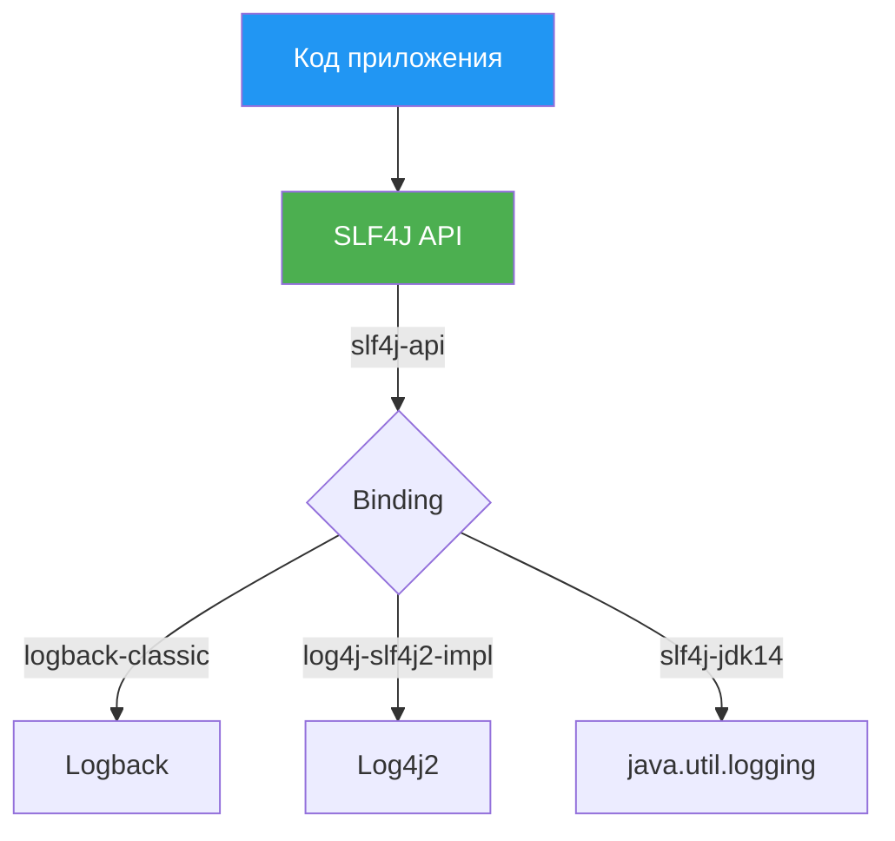

Пример подключения `SLF4J` + `Logback` в `Spring Boot` (зависимости уже включены в `spring-boot-starter`):

```java
import org.slf4j.Logger;
import org.slf4j.LoggerFactory;

public class OrderService {
    // Каноничный способ создания логгера
    private static final Logger log = LoggerFactory.getLogger(OrderService.class);

    public void processOrder(Long orderId) {
        log.info("Processing order id={}", orderId);
    }
}
```

На собеседовании важно подчеркнуть: всегда используем `SLF4J` API в коде, никогда не импортируем классы конкретной реализации (`ch.qos.logback`, `org.apache.logging.log4j`).

## Q2. Из каких частей состоит система журналирования `Log4j`?

Система журналирования состоит из трёх основных компонентов (общих для `Log4j`, `Log4j2` и `Logback`):

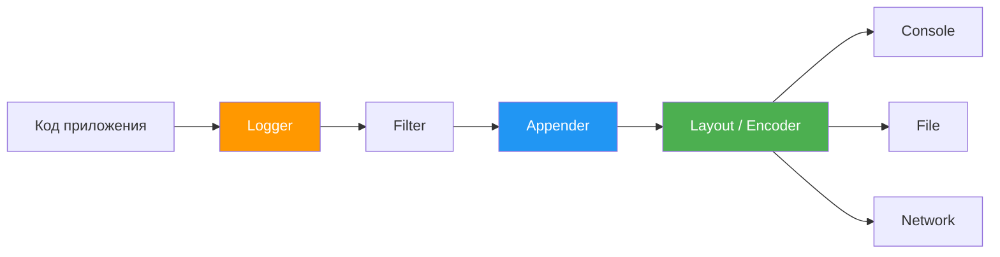

1. **`Logger`** -- создаёт лог-записи, связан с именем (обычно FQCN класса) и уровнем. Образует иерархию: `com.example.service` наследует настройки от `com.example`, затем от `ROOT`.

2. **`Appender`** -- доставляет лог-записи в назначение: консоль, файл, сеть, БД. К одному логгеру можно привязать несколько аппендеров.

3. **`Layout` / `Encoder`** -- форматирует запись перед выводом: `PatternLayout`, `JsonLayout`, `LogstashEncoder`.

4. **`Filter`** -- дополнительная фильтрация записей по маркерам, уровням, содержимому.

## Q3. Что такое `Logger` и как его создать?

`Logger` -- компонент, отвечающий за создание лог-записей. Каждый логгер привязан к имени (обычно полное имя класса) и уровню логирования.

```java
import org.slf4j.Logger;
import org.slf4j.LoggerFactory;

public class UserService {
    // Вариант 1: явное указание класса (рекомендуется)
    private static final Logger log = LoggerFactory.getLogger(UserService.class);

    // Вариант 2: через Lombok
    // @Slf4j  -- генерирует поле log автоматически

    public User findById(Long id) {
        log.debug("Looking up user id={}", id);
        User user = repository.findById(id).orElse(null);
        if (user == null) {
            log.warn("User not found: id={}", id);
        }
        return user;
    }
}
```

**Иерархия логгеров:** `com.example.service.UserService` наследует уровень от `com.example.service`, затем от `com.example`, затем от `ROOT`. Это позволяет задать `DEBUG` для одного пакета, а для всего приложения -- `INFO`.

## Q4. Что такое `Appender` и какие типы существуют?

`Appender` -- компонент, отвечающий за доставку лог-записей в назначение. Основные типы:

| Appender | Назначение | Когда использовать |
|----------|-----------|-------------------|
| `ConsoleAppender` | stdout/stderr | Dev, контейнеры (Docker) |
| `FileAppender` | Один файл | Простые приложения |
| `RollingFileAppender` | Файлы с ротацией | Prod (по размеру или дате) |
| `AsyncAppender` | Обёртка, пишет асинхронно | Высокая нагрузка |
| `SocketAppender` | TCP/UDP | Прямая отправка в `Logstash` |

Пример конфигурации нескольких аппендеров в `logback-spring.xml`:

```xml
<configuration>
    <!-- Console для dev -->
    <appender name="CONSOLE" class="ch.qos.logback.core.ConsoleAppender">
        <encoder>
            <pattern>%d{HH:mm:ss.SSS} [%thread] %-5level %logger{36} - %msg%n</pattern>
        </encoder>
    </appender>

    <!-- Файл с ротацией для prod -->
    <appender name="FILE" class="ch.qos.logback.core.rolling.RollingFileAppender">
        <file>logs/app.log</file>
        <rollingPolicy class="ch.qos.logback.core.rolling.TimeBasedRollingPolicy">
            <fileNamePattern>logs/app.%d{yyyy-MM-dd}.log</fileNamePattern>
            <maxHistory>30</maxHistory>
            <totalSizeCap>1GB</totalSizeCap>
        </rollingPolicy>
        <encoder>
            <pattern>%d{ISO8601} [%thread] %-5level %logger{36} - %msg%n</pattern>
        </encoder>
    </appender>

    <root level="INFO">
        <appender-ref ref="CONSOLE"/>
        <appender-ref ref="FILE"/>
    </root>
</configuration>
```

## Q5. Что такое `Layout` / `Encoder` и как настроить формат?

`Layout` (в `Log4j`) или `Encoder` (в `Logback`) определяет формат вывода лог-записей. В `Logback` используются `Encoder`, а не `Layout` напрямую.

Основные спецификаторы `PatternLayout`:

| Спецификатор | Значение | Пример вывода |
|-------------|----------|---------------|
| `%d{ISO8601}` | Дата и время | `2026-04-11T14:30:00.123` |
| `%level` / `%-5level` | Уровень (с паддингом) | `INFO ` |
| `%thread` | Имя потока | `http-nio-8080-exec-1` |
| `%logger{36}` | Имя логгера (сокращённое) | `c.e.s.UserService` |
| `%msg` | Сообщение | `Processing order id=42` |
| `%X{traceId}` | Поле из MDC | `abc-123-def` |
| `%n` | Перенос строки | |
| `%ex` | Stack trace | |

```xml
<!-- Формат для dev: читаемый -->
<pattern>%d{HH:mm:ss.SSS} %highlight(%-5level) [%thread] %cyan(%logger{36}) - %msg%n</pattern>

<!-- Формат для prod: с MDC полями -->
<pattern>%d{ISO8601} %-5level [%thread] [traceId=%X{traceId}] %logger{36} - %msg%n</pattern>
```

## Q6. (!) Перечислите уровни журналирования и когда какой использовать?

Уровни от наименее до наиболее критичного:

| Уровень | Когда использовать | Пример |
|---------|-------------------|--------|
| `TRACE` | Максимальная детализация, пошаговая отладка | Вход/выход из метода, значения переменных |
| `DEBUG` | Отладочная информация для разработки | SQL-запросы, HTTP-ответы, промежуточные данные |
| `INFO` | Значимые бизнес-события | Старт приложения, обработка заказа, логин пользователя |
| `WARN` | Потенциальные проблемы, не ошибки | Fallback на дефолт, устаревший API, retry |
| `ERROR` | Ошибки, требующие внимания | Недоступность внешнего сервиса, невалидные данные |
| `FATAL` | Критическое, приложение не может работать | Только в `Log4j2`; в `SLF4J` нет `FATAL` |

```java
public class PaymentService {
    private static final Logger log = LoggerFactory.getLogger(PaymentService.class);

    public PaymentResult process(Payment payment) {
        log.debug("Processing payment: amount={}, currency={}", 
                  payment.getAmount(), payment.getCurrency());

        try {
            PaymentResult result = gateway.charge(payment);
            log.info("Payment processed: orderId={}, status={}", 
                     payment.getOrderId(), result.getStatus());
            return result;
        } catch (PaymentGatewayException e) {
            log.error("Payment failed: orderId={}, reason={}", 
                      payment.getOrderId(), e.getMessage(), e);
            throw e;
        }
    }
}
```

**Best practices по уровням:**
- **`DEBUG` отключён в prod** -- иначе объём логов взрывается
- **`INFO`** -- основной рабочий уровень в prod; логировать бизнес-события, не технические детали
- **`WARN`** -- ситуации, которые можно переждать, но надо мониторить
- **`ERROR`** -- всегда с полным стек-трейсом; должен триггерить алерт

## Q7. Какие существуют способы конфигурирования логирования?

| Способ | Файл | Когда использовать |
|--------|------|--------------------|
| `logback.xml` | Classpath | Базовая конфигурация `Logback` |
| `logback-spring.xml` | Classpath | `Spring Boot` -- поддержка `<springProfile>` |
| `application.yml` | Classpath | Быстрая настройка уровней через `logging.level.*` |
| Программно | Java-код | Динамическое изменение уровней в runtime |
| Системные свойства | JVM args | `-Dlogging.level.root=DEBUG` |

```yaml
# application.yml -- быстрая настройка уровней
logging:
  level:
    root: INFO
    com.example.myapp: DEBUG
    org.hibernate.SQL: WARN
    org.springframework: WARN
  file:
    name: logs/app.log
  pattern:
    console: "%d{HH:mm:ss} %-5level [%thread] %logger{36} - %msg%n"
```

Для продвинутой конфигурации (несколько аппендеров, фильтры, профили) используют `logback-spring.xml`. Подробнее о конфигурации по окружениям -- см. Q22.

## Q8. (!) Зачем использовать `SLF4J` вместо прямого вызова `Log4j` или `Logback`?

`SLF4J` -- фасад (API) над реализациями логирования. Код зависит только от абстракции, а реализацию подключают через classpath.

**Преимущества:**
1. **Независимость от реализации** -- можно переключить `Logback` на `Log4j2` без изменения кода
2. **Единый API для всех зависимостей** -- все библиотеки используют один фасад
3. **Параметризованные вызовы** -- экономия CPU при отключённом уровне

```java
// ПРАВИЛЬНО: SLF4J API
import org.slf4j.Logger;
import org.slf4j.LoggerFactory;

private static final Logger log = LoggerFactory.getLogger(MyService.class);
log.info("User {} logged in from {}", username, ipAddress);

// НЕПРАВИЛЬНО: прямая зависимость на реализацию
import org.apache.logging.log4j.LogManager;  // привязка к Log4j2
import ch.qos.logback.classic.Logger;        // привязка к Logback
```

Переключение реализации -- только изменение зависимостей в `build.gradle`:

```groovy
// Logback (дефолт в Spring Boot)
implementation 'ch.qos.logback:logback-classic'

// Переключение на Log4j2
implementation 'org.apache.logging.log4j:log4j-slf4j2-impl'
```

## Q9. (!) Что такое `MDC` и как его использовать?

`MDC` (`Mapped Diagnostic Context`) -- потоковое хранилище ключ-значение (`ThreadLocal`), привязанное к текущему потоку. Значения из `MDC` автоматически добавляются в каждую запись лога.

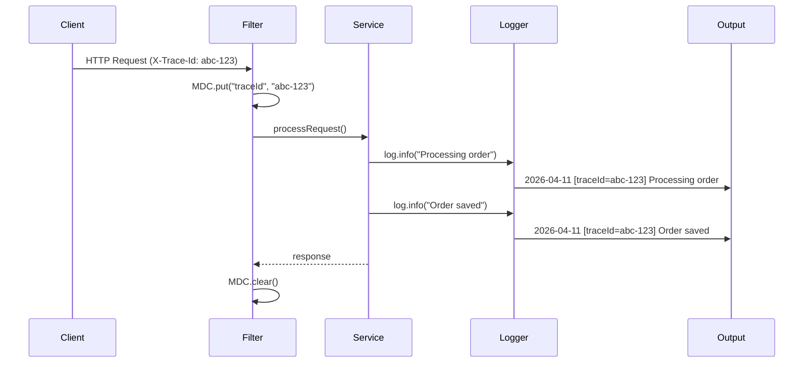

**Пример: фильтр для `traceId` в `Spring Boot`:**

```java
import org.slf4j.MDC;
import jakarta.servlet.*;
import jakarta.servlet.http.HttpServletRequest;
import java.io.IOException;
import java.util.UUID;

@Component
@Order(Ordered.HIGHEST_PRECEDENCE)
public class TraceIdFilter implements Filter {

    @Override
    public void doFilter(ServletRequest req, ServletResponse res, FilterChain chain)
            throws IOException, ServletException {
        HttpServletRequest httpReq = (HttpServletRequest) req;
        
        String traceId = httpReq.getHeader("X-Trace-Id");
        if (traceId == null || traceId.isBlank()) {
            traceId = UUID.randomUUID().toString();
        }

        MDC.put("traceId", traceId);
        try {
            chain.doFilter(req, res);
        } finally {
            MDC.clear();  // обязательно очищать!
        }
    }
}
```

**Конфигурация `Logback` для вывода MDC:**

```xml
<pattern>%d{ISO8601} %-5level [%thread] [traceId=%X{traceId}] %logger{36} - %msg%n</pattern>
```

**Передача MDC в пуле потоков (TaskDecorator для `@Async`):**

```java
@Configuration
@EnableAsync
public class AsyncConfig implements AsyncConfigurer {

    @Override
    public Executor getAsyncExecutor() {
        ThreadPoolTaskExecutor executor = new ThreadPoolTaskExecutor();
        executor.setTaskDecorator(runnable -> {
            Map<String, String> mdc = MDC.getCopyOfContextMap();
            return () -> {
                if (mdc != null) {
                    MDC.setContextMap(mdc);
                }
                try {
                    runnable.run();
                } finally {
                    MDC.clear();
                }
            };
        });
        executor.initialize();
        return executor;
    }
}
```

Подробнее о трассировке в [[metrics-tracing-interview|вопросах по метрикам и трейсингу]].

## Q10. (!) Что такое структурированное логирование (`JSON`)?

Структурированное логирование -- вывод логов в формате `JSON` с фиксированным набором полей. Позволяет машинную обработку, поиск и агрегацию в `ELK`, `Splunk`, `Loki`.

**Обычный лог (текстовый):**
```
2026-04-11 14:30:00.123 INFO [http-nio-8080-exec-1] c.e.OrderService - Order processed: orderId=42
```

**Структурированный лог (JSON):**
```json
{
  "@timestamp": "2026-04-11T14:30:00.123Z",
  "level": "INFO",
  "thread": "http-nio-8080-exec-1",
  "logger": "com.example.OrderService",
  "message": "Order processed",
  "orderId": 42,
  "traceId": "abc-123-def",
  "spanId": "span-456",
  "service": "order-service",
  "env": "prod"
}
```

**Настройка `Logback` с `LogstashEncoder`:**

Зависимость:
```groovy
implementation 'net.logstash.logback:logstash-logback-encoder:7.4'
```

Конфигурация `logback-spring.xml`:
```xml
<configuration>
    <!-- Dev: читаемый формат в консоль -->
    <springProfile name="dev">
        <appender name="CONSOLE" class="ch.qos.logback.core.ConsoleAppender">
            <encoder>
                <pattern>%d{HH:mm:ss.SSS} %highlight(%-5level) [%thread] %cyan(%logger{36}) - %msg%n</pattern>
            </encoder>
        </appender>
        <root level="DEBUG">
            <appender-ref ref="CONSOLE"/>
        </root>
    </springProfile>

    <!-- Prod: JSON для ELK -->
    <springProfile name="prod">
        <appender name="JSON" class="ch.qos.logback.core.ConsoleAppender">
            <encoder class="net.logstash.logback.encoder.LogstashEncoder">
                <includeMdcKeyName>traceId</includeMdcKeyName>
                <includeMdcKeyName>spanId</includeMdcKeyName>
                <includeMdcKeyName>userId</includeMdcKeyName>
                <customFields>{"service":"order-service","env":"prod"}</customFields>
            </encoder>
        </appender>
        <root level="INFO">
            <appender-ref ref="JSON"/>
        </root>
    </springProfile>
</configuration>
```

**Добавление кастомных полей в лог-запись:**

```java
import net.logstash.logback.argument.StructuredArguments;
import static net.logstash.logback.argument.StructuredArguments.*;

log.info("Order processed: {}, {}", 
         keyValue("orderId", 42), 
         keyValue("amount", 99.99));
// JSON: {"message":"Order processed: orderId=42, amount=99.99","orderId":42,"amount":99.99}
```

## Q11. Как настроить ротацию лог-файлов (`RollingFileAppender`)?

`RollingFileAppender` автоматически создаёт новые файлы по времени или размеру и удаляет старые.

```xml
<appender name="ROLLING" class="ch.qos.logback.core.rolling.RollingFileAppender">
    <file>logs/app.log</file>
    
    <rollingPolicy class="ch.qos.logback.core.rolling.SizeAndTimeBasedRollingPolicy">
        <!-- Новый файл каждый день -->
        <fileNamePattern>logs/app.%d{yyyy-MM-dd}.%i.log.gz</fileNamePattern>
        <!-- Максимум 100MB на файл -->
        <maxFileSize>100MB</maxFileSize>
        <!-- Хранить 30 дней -->
        <maxHistory>30</maxHistory>
        <!-- Общий лимит 5GB -->
        <totalSizeCap>5GB</totalSizeCap>
    </rollingPolicy>
    
    <encoder>
        <pattern>%d{ISO8601} %-5level [%thread] %logger{36} - %msg%n</pattern>
    </encoder>
</appender>
```

**Ключевые параметры:**
- `maxFileSize` -- при достижении создаётся новый файл (индекс `%i`)
- `maxHistory` -- число ротированных файлов/дней для хранения
- `totalSizeCap` -- общий лимит на все файлы; при превышении удаляются самые старые
- `.gz` в `fileNamePattern` -- автоматическое сжатие архивных файлов

## Q12. (!) Почему параметризованные вызовы логгера предпочтительнее конкатенации?

```java
// ПЛОХО: конкатенация выполняется ВСЕГДА, даже если уровень DEBUG отключён
log.debug("User " + user.getName() + " performed action " + action);

// ХОРОШО: подстановка происходит ТОЛЬКО если DEBUG включён
log.debug("User {} performed action {}", user.getName(), action);

// ДЛЯ ТЯЖЁЛЫХ ОПЕРАЦИЙ: лямбда (Log4j2 или SLF4J 2.0+)
log.atDebug().log("Expensive data: {}", () -> expensiveToString(data));

// АЛЬТЕРНАТИВА: проверка уровня (SLF4J 1.x)
if (log.isDebugEnabled()) {
    log.debug("Expensive: {}", expensiveToString(data));
}
```

**Почему это важно:**
- Конкатенация вызывает `toString()` и выделяет память **каждый раз**
- При параметризации `SLF4J` проверяет уровень **до** форматирования
- В hot path экономия может быть существенной (тысячи вызовов/сек)

## Q13. Что такое асинхронный аппендер и когда его использовать?

Асинхронный аппендер помещает лог-записи во внутреннюю очередь и записывает в назначение в отдельном потоке. Поток приложения не блокируется на I/O.

```xml
<appender name="ASYNC" class="ch.qos.logback.classic.AsyncAppender">
    <!-- Размер очереди (по умолчанию 256) -->
    <queueSize>1024</queueSize>
    <!-- При заполнении >80% очереди отбрасывать TRACE/DEBUG -->
    <discardingThreshold>20</discardingThreshold>
    <!-- Не включать caller info (дорого) -->
    <includeCallerData>false</includeCallerData>
    <!-- Обёрнутый аппендер -->
    <appender-ref ref="FILE"/>
</appender>

<root level="INFO">
    <appender-ref ref="ASYNC"/>
</root>
```

**Trade-offs:**

| Плюс | Минус |
|------|-------|
| Не блокирует бизнес-поток | При краше теряются записи из очереди |
| Сглаживает пики I/O | Дополнительная память под очередь |
| Повышает throughput | При переполнении отбрасывает записи |

**Когда использовать:** высокая нагрузка, допустима потеря нескольких записей при краше. Для критичных логов (аудит, финансы) -- синхронный аппендер.

## Q14. (!) Как связать логи с распределённой трассировкой?

В [[microservices-interview|микросервисной архитектуре]] каждый запрос проходит через несколько сервисов. Для корреляции логов используют `traceId` и `spanId`.

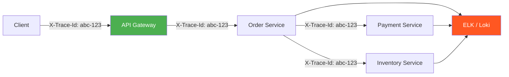

**Реализация с `Spring Boot` + `Micrometer Tracing`:**

```yaml
# application.yml
management:
  tracing:
    sampling:
      probability: 1.0  # 100% трассировки (для dev)
```

```java
// traceId и spanId автоматически попадают в MDC
// через Micrometer Tracing (бывший Spring Cloud Sleuth)
log.info("Payment processed for order={}", orderId);
// Вывод: 2026-04-11 INFO [traceId=abc-123, spanId=def-456] Payment processed for order=42
```

**Ручная передача в `RestTemplate` / `WebClient`:**

```java
@Bean
public RestTemplate restTemplate(RestTemplateBuilder builder) {
    return builder
        .additionalInterceptors((request, body, execution) -> {
            String traceId = MDC.get("traceId");
            if (traceId != null) {
                request.getHeaders().set("X-Trace-Id", traceId);
            }
            return execution.execute(request, body);
        })
        .build();
}
```

Стандарты заголовков: W3C `traceparent`, B3 (`X-B3-TraceId`, `X-B3-SpanId`). Подробнее в [[observability-interview|вопросах по наблюдаемости]].

## Q15. Как не логировать чувствительные данные?

Чувствительные данные (пароли, токены, номера карт, персональные данные) не должны попадать в логи.

```java
// ПЛОХО: пароль в логах
log.info("User login: username={}, password={}", username, password);

// ХОРОШО: не логировать чувствительные данные
log.info("User login: username={}", username);

// ХОРОШО: маскировка
log.info("Card processed: last4={}", card.getLast4Digits());
```

**Кастомный маскирующий Layout в `Logback`:**

```java
public class MaskingPatternLayout extends PatternLayout {
    private Pattern multilinePattern;
    private List<String> maskPatterns = new ArrayList<>();

    public void addMaskPattern(String pattern) {
        maskPatterns.add(pattern);
        multilinePattern = Pattern.compile(
            String.join("|", maskPatterns), Pattern.MULTILINE);
    }

    @Override
    public String doLayout(ILoggingEvent event) {
        return maskMessage(super.doLayout(event));
    }

    private String maskMessage(String message) {
        if (multilinePattern == null) return message;
        StringBuilder sb = new StringBuilder(message);
        Matcher matcher = multilinePattern.matcher(sb);
        while (matcher.find()) {
            if (matcher.group().length() > 4) {
                sb.replace(matcher.start(), matcher.end(),
                    "****" + matcher.group().substring(matcher.group().length() - 4));
            }
        }
        return sb.toString();
    }
}
```

**Рекомендации:**
- Allowlist полей для `JSON`-логирования (не blacklist)
- В тестах проверять, что чувствительные данные не попадают в логи
- Переопределять `toString()` у DTO с чувствительными полями
- Использовать аннотации маскировки (`@Masked`, `@Sensitive`) в собственных фреймворках

## Q16. Чем `Logback` отличается от `Log4j2`?

| Критерий | `Logback` | `Log4j2` |
|----------|-----------|----------|
| Связь с `SLF4J` | Нативная реализация | Адаптер `log4j-slf4j2-impl` |
| Дефолт в `Spring Boot` | Да | Нет (можно переключить) |
| Async loggers | `AsyncAppender` (обёртка) | Нативные async loggers (LMAX Disruptor) |
| Конфигурация | XML, Groovy | XML, JSON, YAML, Properties |
| Производительность | Хорошая | Лучше (async loggers, garbage-free) |
| Плагины | Ограничено | Плагинная архитектура |
| Перезагрузка конфига | Автоматическая | Автоматическая |
| Vulnerability | Нет (не было Log4Shell) | Log4Shell (CVE-2021-44228) -- исправлена в 2.17+ |

**Переключение на `Log4j2` в `Spring Boot`:**

```groovy
// build.gradle
configurations.all {
    exclude group: 'org.springframework.boot', module: 'spring-boot-starter-logging'
}
implementation 'org.springframework.boot:spring-boot-starter-log4j2'
```

## Q17. Как уменьшить объём логов от сторонних библиотек?

Задать уровень логирования по пакету библиотеки:

```xml
<!-- logback-spring.xml -->
<logger name="org.springframework" level="WARN"/>
<logger name="org.hibernate" level="WARN"/>
<logger name="com.zaxxer.hikari" level="WARN"/>
<logger name="org.apache.kafka" level="WARN"/>

<!-- SQL-запросы только в dev -->
<springProfile name="dev">
    <logger name="org.hibernate.SQL" level="DEBUG"/>
    <logger name="org.hibernate.type.descriptor.sql" level="TRACE"/>
</springProfile>
```

Эквивалент в `application.yml`:

```yaml
logging:
  level:
    org.springframework: WARN
    org.hibernate: WARN
    com.zaxxer.hikari: WARN
    org.apache.kafka: WARN
```

## Q18. (!) Что такое `correlation id` и как его использовать в микросервисах?

`Correlation id` (или `traceId`) -- уникальный идентификатор, проходящий через все сервисы в рамках одного пользовательского запроса. Позволяет отфильтровать все логи одного запроса в [[elasticsearch-interview|Elasticsearch]] / `Kibana`.

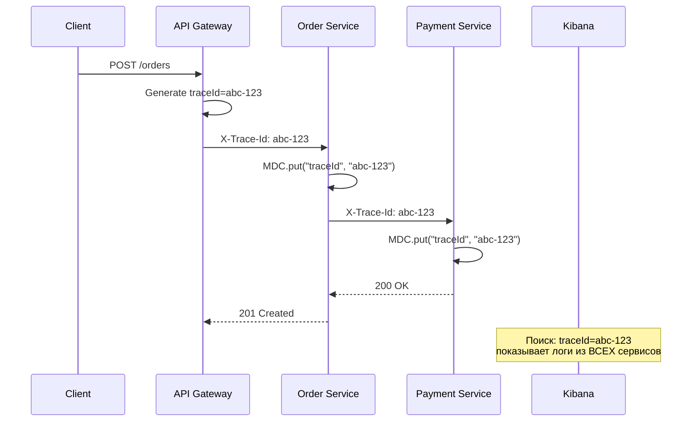

**Реализация `WebClient` filter для проброса `traceId`:**

```java
@Bean
public WebClient webClient() {
    return WebClient.builder()
        .filter((request, next) -> {
            String traceId = MDC.get("traceId");
            if (traceId != null) {
                request = ClientRequest.from(request)
                    .header("X-Trace-Id", traceId)
                    .build();
            }
            return next.exchange(request);
        })
        .build();
}
```

## Q19. Как логировать исключения правильно?

```java
// ПРАВИЛЬНО: исключение как последний аргумент -- полный stack trace
log.error("Failed to process order id={}", orderId, exception);

// НЕПРАВИЛЬНО: теряется stack trace
log.error("Error: " + exception.getMessage());

// НЕПРАВИЛЬНО: дублирование -- лог + rethrow на каждом уровне
try {
    service.process(data);
} catch (Exception e) {
    log.error("Failed", e);  // логируем здесь...
    throw e;                  // ...и выше снова логируем -- дубль
}

// ПРАВИЛЬНО: логировать один раз на верхнем уровне
// Или: логировать на нижнем уровне и оборачивать в unchecked
```

**Паттерн для `@ControllerAdvice` -- единая точка логирования ошибок:**

```java
@RestControllerAdvice
public class GlobalExceptionHandler {

    private static final Logger log = LoggerFactory.getLogger(GlobalExceptionHandler.class);

    @ExceptionHandler(Exception.class)
    public ResponseEntity<ErrorResponse> handleException(Exception e, HttpServletRequest req) {
        String traceId = MDC.get("traceId");
        log.error("Unhandled exception: uri={}, traceId={}", req.getRequestURI(), traceId, e);
        
        return ResponseEntity.status(500)
            .body(new ErrorResponse("Internal error", traceId));
    }
}
```

## Q20. (!) Как интегрировать логи с `ELK`?

`ELK` стек (`Elasticsearch`, `Logstash`, `Kibana`) -- стандартное решение для централизованного сбора и поиска логов.

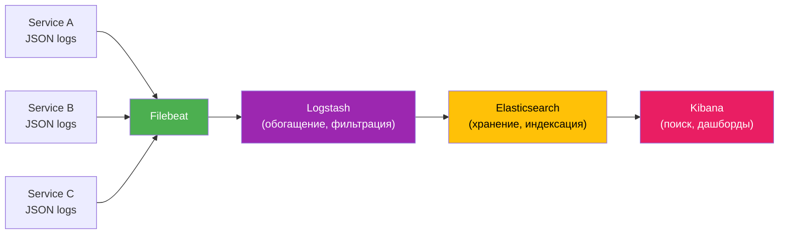

**Полный pipeline:**

1. **Приложение** пишет `JSON`-логи (`LogstashEncoder`) в stdout или файл
2. **Filebeat** (агент) собирает логи и отправляет в `Logstash` или напрямую в `Elasticsearch`
3. **Logstash** (опционально) -- обогащение, фильтрация, трансформация
4. **Elasticsearch** -- индексирует и хранит
5. **Kibana** -- поиск по `traceId:abc-123`, `level:ERROR`, дашборды

**Конфигурация Filebeat:**

```yaml
# filebeat.yml
filebeat.inputs:
  - type: container
    paths:
      - /var/log/containers/*.log
    json.keys_under_root: true
    json.add_error_key: true

output.elasticsearch:
  hosts: ["http://elasticsearch:9200"]
  index: "app-logs-%{+yyyy.MM.dd}"
```

**Альтернативы ELK:**
- `Grafana Loki` + `Promtail` -- легковесный, label-based (не full-text индексация)
- `Splunk` -- enterprise решение
- Cloud-native: AWS CloudWatch, GCP Cloud Logging, Azure Monitor

Подробнее о `Elasticsearch` -- в [[elasticsearch-interview|вопросах по Elasticsearch]].

## Q21. Что такое `Markers` в `SLF4J`/`Logback` и когда их использовать?

`Markers` -- именованные метки, привязываемые к лог-записи. Позволяют фильтровать и маршрутизировать логи по категории.

```java
import org.slf4j.Marker;
import org.slf4j.MarkerFactory;

public class AuditService {
    private static final Logger log = LoggerFactory.getLogger(AuditService.class);
    private static final Marker AUDIT = MarkerFactory.getMarker("AUDIT");
    private static final Marker SECURITY = MarkerFactory.getMarker("SECURITY");

    public void logUserAction(String userId, String action) {
        log.info(AUDIT, "User {} performed action: {}", userId, action);
    }

    public void logLoginAttempt(String userId, boolean success) {
        log.info(SECURITY, "Login attempt: userId={}, success={}", userId, success);
    }
}
```

**Фильтрация по маркеру -- аудит в отдельный файл:**

```xml
<appender name="AUDIT_FILE" class="ch.qos.logback.core.rolling.RollingFileAppender">
    <file>logs/audit.log</file>
    <filter class="ch.qos.logback.core.filter.EvaluatorFilter">
        <evaluator class="ch.qos.logback.classic.boolex.OnMarkerEvaluator">
            <marker>AUDIT</marker>
        </evaluator>
        <onMatch>ACCEPT</onMatch>
        <onMismatch>DENY</onMismatch>
    </filter>
    <rollingPolicy class="ch.qos.logback.core.rolling.TimeBasedRollingPolicy">
        <fileNamePattern>logs/audit.%d{yyyy-MM-dd}.log</fileNamePattern>
        <maxHistory>365</maxHistory>
    </rollingPolicy>
    <encoder>
        <pattern>%d{ISO8601} %msg%n</pattern>
    </encoder>
</appender>
```

## Q22. Как настроить уровни логирования по окружению (`dev`/`prod`)?

`Spring Boot` поддерживает профили в `logback-spring.xml` через `<springProfile>`:

```xml
<configuration>
    <springProfile name="dev">
        <root level="DEBUG">
            <appender-ref ref="CONSOLE"/>
        </root>
        <logger name="org.hibernate.SQL" level="DEBUG"/>
        <logger name="com.example.myapp" level="DEBUG"/>
    </springProfile>

    <springProfile name="prod">
        <root level="INFO">
            <appender-ref ref="JSON"/>
        </root>
        <logger name="org.springframework" level="WARN"/>
        <logger name="org.hibernate" level="WARN"/>
    </springProfile>
</configuration>
```

Альтернатива через `application-{profile}.yml`:

```yaml
# application-dev.yml
logging:
  level:
    root: DEBUG
    com.example: DEBUG
    org.hibernate.SQL: DEBUG

# application-prod.yml
logging:
  level:
    root: INFO
    org.springframework: WARN
```

**Динамическое изменение уровня в runtime** через `Spring Boot Actuator`:

```bash
# Посмотреть текущий уровень
curl http://localhost:8080/actuator/loggers/com.example.myapp

# Изменить уровень без рестарта
curl -X POST http://localhost:8080/actuator/loggers/com.example.myapp \
  -H 'Content-Type: application/json' \
  -d '{"configuredLevel": "DEBUG"}'
```

## Q23. Что такое `log sampling` и когда его применять?

`Log sampling` -- выборочная запись логов (например, каждый N-й запрос или 1% записей) при высокой нагрузке.

```java
// Простой sampling: каждый 100-й запрос
private final AtomicLong counter = new AtomicLong();

public void processRequest(Request req) {
    long count = counter.incrementAndGet();
    if (count % 100 == 0) {
        log.info("Processing request (sampled 1/100): type={}", req.getType());
    }
    // ... обработка
}
```

**Кастомный `TurboFilter` в `Logback` для sampling:**

```java
public class SamplingFilter extends TurboFilter {
    private int rate = 100;
    private final AtomicLong counter = new AtomicLong();

    @Override
    public FilterReply decide(Marker marker, ch.qos.logback.classic.Logger logger,
                              Level level, String format, Object[] params, Throwable t) {
        // ERROR и WARN всегда пропускать
        if (level.isGreaterOrEqual(Level.WARN)) {
            return FilterReply.NEUTRAL;
        }
        return counter.incrementAndGet() % rate == 0 
            ? FilterReply.NEUTRAL 
            : FilterReply.DENY;
    }

    public void setRate(int rate) { this.rate = rate; }
}
```

**Правило:** `ERROR` и `AUDIT` -- без выборки, всегда 100%. Sampling только для `INFO`/`DEBUG`.

## Q24. Как логировать в многопоточном и асинхронном коде?

`MDC` основан на `ThreadLocal` -- при переключении потока контекст теряется.

```java
// ПРОБЛЕМА: MDC теряется в CompletableFuture
MDC.put("traceId", "abc-123");
CompletableFuture.supplyAsync(() -> {
    // MDC.get("traceId") == null!  <-- потерян
    log.info("Processing async");  // лог без traceId
    return result;
});

// РЕШЕНИЕ: передать MDC вручную
Map<String, String> mdc = MDC.getCopyOfContextMap();
CompletableFuture.supplyAsync(() -> {
    if (mdc != null) MDC.setContextMap(mdc);
    try {
        log.info("Processing async");  // теперь с traceId
        return result;
    } finally {
        MDC.clear();
    }
});
```

**Утилита-обёртка для `Runnable`/`Callable`:**

```java
public class MdcRunnable implements Runnable {
    private final Runnable delegate;
    private final Map<String, String> mdc;

    public MdcRunnable(Runnable delegate) {
        this.delegate = delegate;
        this.mdc = MDC.getCopyOfContextMap();
    }

    @Override
    public void run() {
        if (mdc != null) MDC.setContextMap(mdc);
        try {
            delegate.run();
        } finally {
            MDC.clear();
        }
    }
}

// Использование
executor.submit(new MdcRunnable(() -> processOrder(orderId)));
```

Для реактивных стеков см. Q30 и [[spring-webflux-interview|вопросы по WebFlux]].

## Q25. Что такое `Fluent API` в `Log4j2`?

`Fluent API` -- цепочечный стиль вызова логгера, позволяющий условное вычисление сообщений через лямбды:

```java
// Log4j2 Fluent API
import org.apache.logging.log4j.LogManager;
import org.apache.logging.log4j.Logger;

Logger log = LogManager.getLogger(MyService.class);

// Лямбда вычисляется ТОЛЬКО при включённом DEBUG
log.atDebug()
   .withLocation()
   .log("Expensive computation: {}", () -> expensiveToString(data));

// С исключением
log.atError()
   .withThrowable(exception)
   .log("Failed to process order={}", orderId);
```

```java
// SLF4J 2.0+ Fluent API
log.atDebug()
   .setMessage("Processing data: {}")
   .addArgument(() -> expensiveToString(data))
   .log();

// С маркером
log.atInfo()
   .addMarker(MarkerFactory.getMarker("AUDIT"))
   .setMessage("User {} performed action {}")
   .addArgument(userId)
   .addArgument(action)
   .log();
```

## Q26. Как не раздувать логи при высокой нагрузке?

**Чеклист для контроля объёма логов:**

```java
// 1. Поднять уровень шумных пакетов
// logging.level.org.hibernate=WARN

// 2. Не логировать в горячих циклах
for (Item item : items) {
    // ПЛОХО: тысячи записей
    // log.debug("Processing item={}", item.getId());
    process(item);
}
// ХОРОШО: одна запись с итогом
log.info("Processed {} items", items.size());

// 3. Параметризованные вызовы (не конкатенация)
log.debug("Data: {}", data);  // а не "Data: " + data

// 4. Rate limiting для повторяющихся ошибок
private final RateLimiter logRateLimiter = RateLimiter.create(1.0); // 1 msg/sec
if (logRateLimiter.tryAcquire()) {
    log.error("Connection failed: host={}", host, e);
}

// 5. Не логировать большие объекты
log.debug("Response: size={}, status={}", response.length(), response.getStatus());
// а не log.debug("Response: {}", response.getBody());
```

**Операционные метрики:** мониторить `ingestion lag` в системе сбора и стоимость хранения. Первыми под нож идут шумные `INFO`, а не `ERROR`.

## Q27. Как интегрировать логи с метриками (`Micrometer`, `Prometheus`)?

Логи и [[metrics-tracing-interview|метрики]] -- два разных канала наблюдаемости. Но их можно связать:

```java
@Component
public class ErrorLogMetrics {
    private final Counter errorCounter;

    public ErrorLogMetrics(MeterRegistry registry) {
        this.errorCounter = Counter.builder("log.errors.total")
            .description("Total number of ERROR log events")
            .register(registry);
    }

    // Кастомный Logback Appender для подсчёта ошибок
    // Альтернатива: использовать LogbackMetrics из Micrometer
}
```

**Автоматические метрики логов через `Micrometer`:**

```java
// Spring Boot Actuator + Micrometer автоматически экспортирует
// logback_events_total{level="error"} -- счётчик лог-записей по уровням
// Доступно из коробки через LogbackMetrics
```

```yaml
# application.yml
management:
  metrics:
    tags:
      application: order-service
  endpoints:
    web:
      exposure:
        include: prometheus
```

## Q28. Что такое `log aggregation` и зачем он нужен?

В [[distributed-systems-interview|распределённых системах]] логи размазаны по десяткам узлов. `Log aggregation` -- централизованный сбор всех логов в одно хранилище для поиска и анализа.

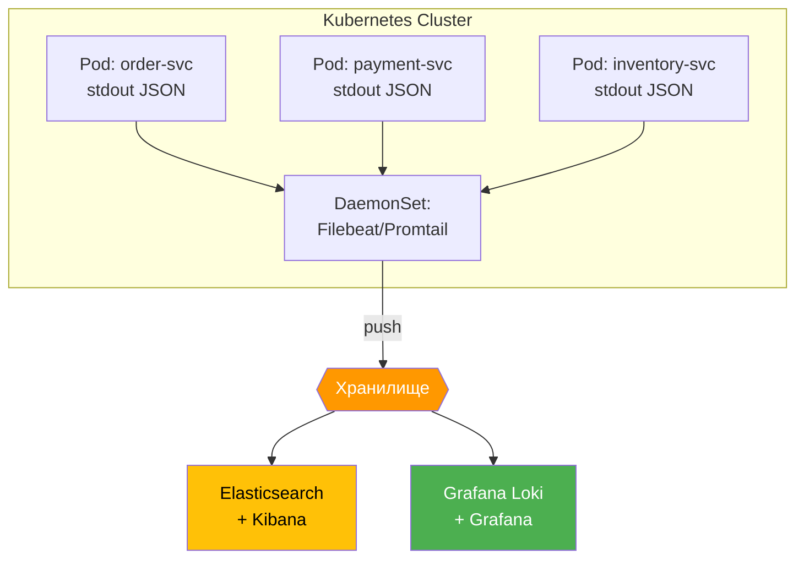

**Компоненты:**
- **Агенты сбора:** `Filebeat`, `Fluentd`, `Promtail`, `Vector`
- **Транспорт/обогащение:** `Logstash`, `Fluentd`
- **Хранилище:** `Elasticsearch`, `Loki`, `Splunk`
- **UI:** `Kibana`, `Grafana`
- **Корреляция:** `traceId` / `correlation id` для связи записей одного запроса

Без `traceId` расследование инцидента в распределённой системе остаётся крайне медленным -- это антипаттерн.

## Q29. Как обеспечить консистентность формата логов в микросервисах?

**Подход: shared-конфигурация через библиотеку:**

```java
// Общая библиотека logging-starter
@Configuration
public class LoggingAutoConfiguration {

    @Bean
    public Filter traceIdFilter() {
        return new TraceIdFilter();  // единый MDC фильтр
    }
}
```

```xml
<!-- shared logback-base.xml (include в каждом сервисе) -->
<included>
    <appender name="JSON" class="ch.qos.logback.core.ConsoleAppender">
        <encoder class="net.logstash.logback.encoder.LogstashEncoder">
            <includeMdcKeyName>traceId</includeMdcKeyName>
            <includeMdcKeyName>spanId</includeMdcKeyName>
            <includeMdcKeyName>userId</includeMdcKeyName>
            <customFields>{"env":"${ENV:-dev}"}</customFields>
            <!-- Единый набор обязательных полей -->
            <fieldNames>
                <timestamp>@timestamp</timestamp>
                <version>[ignore]</version>
            </fieldNames>
        </encoder>
    </appender>
</included>
```

```xml
<!-- logback-spring.xml в каждом сервисе -->
<configuration>
    <include resource="logback-base.xml"/>
    <root level="INFO">
        <appender-ref ref="JSON"/>
    </root>
</configuration>
```

**Обязательные поля контракта:** `@timestamp`, `level`, `logger`, `message`, `service`, `env`, `traceId`. Документировать контракт и версию формата; при изменении -- обратная совместимость.

**Проверка в CI:** валидировать JSON-схему логов и наличие обязательных полей.

## Q30. Как логировать в реактивных стеках (`WebFlux`, `Project Reactor`)?

В реактивных цепочках выполнение переключается между потоками; `MDC` (`ThreadLocal`) не передаётся автоматически. Подробнее о реактивном программировании -- в [[spring-webflux-interview|вопросах по WebFlux]].

```java
// ПРОБЛЕМА: MDC теряется при переключении потока
Mono.just(order)
    .flatMap(this::processPayment)    // может выполниться в другом потоке
    .doOnNext(r -> log.info("Done"))  // MDC пуст -- нет traceId
    .subscribe();
```

**Решение 1: `contextWrite` + `Hooks` (рекомендуется для `Spring Boot 3+`):**

```java
// WebFilter кладёт traceId в Reactor Context
@Component
public class TraceWebFilter implements WebFilter {
    @Override
    public Mono<Void> filter(ServerWebExchange exchange, WebFilterChain chain) {
        String traceId = exchange.getRequest().getHeaders()
            .getFirst("X-Trace-Id");
        if (traceId == null) traceId = UUID.randomUUID().toString();

        String finalTraceId = traceId;
        return chain.filter(exchange)
            .contextWrite(ctx -> ctx.put("traceId", finalTraceId));
    }
}
```

```java
// Хук для копирования Reactor Context в MDC
Hooks.onEachOperator("mdc", 
    Operators.lift((scannable, subscriber) -> new CoreSubscriber<Object>() {
        @Override
        public void onSubscribe(Subscription s) {
            copyToMdc(subscriber.currentContext());
            subscriber.onSubscribe(s);
        }

        @Override
        public void onNext(Object o) {
            copyToMdc(subscriber.currentContext());
            subscriber.onNext(o);
        }
        // ... onError, onComplete аналогично

        @Override
        public Context currentContext() {
            return subscriber.currentContext();
        }

        private void copyToMdc(Context ctx) {
            if (ctx.hasKey("traceId")) {
                MDC.put("traceId", ctx.get("traceId"));
            }
        }
    })
);
```

**Решение 2: явная передача traceId в сообщении (проще, но менее гибко):**

```java
Mono.deferContextual(ctx -> {
    String traceId = ctx.getOrDefault("traceId", "N/A");
    log.info("Processing order, traceId={}", traceId);
    return processOrder(order);
});
```

## Q31. (!) Как настроить EFK-стек (Elasticsearch, Fluent Bit, Kibana)?

**EFK** — замена ELK: вместо `Logstash` используется **`Fluent Bit`** (легче, написан на C, потребляет ~1 MB RAM против ~500 MB у Logstash). Популярен в Kubernetes-средах.

**Архитектура EFK:**
```
[Java App] → stdout/stderr → [Fluent Bit DaemonSet] → [Elasticsearch] → [Kibana]
```

**Шаг 1: настройка приложения для JSON в stdout**

```xml
<!-- logback-spring.xml -->
<configuration>
    <appender name="STDOUT" class="ch.qos.logback.core.ConsoleAppender">
        <encoder class="net.logstash.logback.encoder.LogstashEncoder">
            <includeMdcKeyName>traceId</includeMdcKeyName>
            <includeMdcKeyName>spanId</includeMdcKeyName>
            <includeMdcKeyName>userId</includeMdcKeyName>
            <customFields>{"app":"order-service","env":"prod"}</customFields>
        </encoder>
    </appender>
    <root level="INFO">
        <appender-ref ref="STDOUT"/>
    </root>
</configuration>
```

**Шаг 2: Fluent Bit ConfigMap (Kubernetes)**

```yaml
apiVersion: v1
kind: ConfigMap
metadata:
  name: fluent-bit-config
data:
  fluent-bit.conf: |
    [SERVICE]
        Flush        5
        Daemon       Off
        Log_Level    warn
        Parsers_File parsers.conf

    [INPUT]
        Name             tail
        Path             /var/log/containers/*.log
        Parser           docker
        Tag              kube.*
        Refresh_Interval 5
        Mem_Buf_Limit    50MB
        Skip_Long_Lines  On

    [FILTER]
        Name                kubernetes
        Match               kube.*
        Kube_URL            https://kubernetes.default.svc:443
        Merge_Log           On
        Keep_Log            Off
        K8S-Logging.Parser  On
        K8S-Logging.Exclude On

    [OUTPUT]
        Name            es
        Match           *
        Host            elasticsearch
        Port            9200
        Logstash_Format On
        Logstash_Prefix app-logs
        Retry_Limit     False
        tls             Off
```

**Шаг 3: индексный шаблон в Kibana**

После запуска EFK в Kibana создают Index Pattern `app-logs-*`, затем ищут по полям:
```
traceId: "4bf92f3577b34da6a3ce929d0e0e4736" AND level: "ERROR"
```

**Преимущества EFK vs ELK:**
| Критерий | ELK (Logstash) | EFK (Fluent Bit) |
|----------|---------------|-----------------|
| RAM | ~500 MB | ~1-10 MB |
| CPU | высокий | низкий |
| Конфигурация | Grok patterns | Lua/SQL filters |
| K8s интеграция | требует агент | нативный DaemonSet |
| Throughput | до 10K/s | до 200K/s |

## Q32. Как правильно использовать MDC в многопоточном коде с thread pools?

`MDC` (`Mapped Diagnostic Context`) хранит данные в `ThreadLocal`, что создаёт проблемы при асинхронном выполнении — в новом потоке `MDC` пустой.

**Проблема:**
```java
ExecutorService executor = Executors.newFixedThreadPool(4);

MDC.put("traceId", "abc-123");
executor.submit(() -> {
    // MDC.get("traceId") == null! ThreadLocal не передаётся в другой поток
    log.info("Processing in thread pool");
});
```

**Решение 1: явная копия MDC**
```java
Map<String, String> mdcContext = MDC.getCopyOfContextMap();

executor.submit(() -> {
    if (mdcContext != null) {
        MDC.setContextMap(mdcContext);  // восстанавливаем MDC
    }
    try {
        log.info("Processing with traceId={}", MDC.get("traceId"));
    } finally {
        MDC.clear();  // обязательно! иначе утечка в пул
    }
});
```

**Решение 2: `MDCTaskDecorator` для Spring Boot (рекомендуется)**
```java
@Configuration
public class AsyncConfig implements AsyncConfigurer {

    @Override
    public Executor getAsyncExecutor() {
        ThreadPoolTaskExecutor executor = new ThreadPoolTaskExecutor();
        executor.setCorePoolSize(4);
        executor.setMaxPoolSize(8);
        executor.setTaskDecorator(new MdcTaskDecorator());  // ключевой момент
        executor.initialize();
        return executor;
    }
}

public class MdcTaskDecorator implements TaskDecorator {
    @Override
    public Runnable decorate(Runnable runnable) {
        Map<String, String> contextMap = MDC.getCopyOfContextMap();
        return () -> {
            try {
                if (contextMap != null) MDC.setContextMap(contextMap);
                runnable.run();
            } finally {
                MDC.clear();
            }
        };
    }
}
```

**Решение 3: MDC в Project Reactor (WebFlux)**
```java
// Использовать Reactor Context вместо MDC
Mono.just(order)
    .contextWrite(Context.of("traceId", traceId))
    .flatMap(o -> Mono.deferContextual(ctx -> {
        MDC.put("traceId", ctx.getOrDefault("traceId", "unknown"));
        return processOrderReactive(o);
    }))
    .doFinally(signal -> MDC.clear());
```

**Что обязательно помнить:**
- Всегда вызывать `MDC.clear()` после задачи (иначе ThreadLocal утечёт через пул)
- В Kubernetes логи агрегируются по pod, поэтому `traceId` в MDC + JSON-логи = возможность сквозного поиска

## Q33. Какие best practices по уровням логирования в production?

Правильный выбор уровня логирования критичен: слишком много — перегрузка диска и Kibana, слишком мало — невозможно расследовать инциденты.

**Эталонная таблица:**

| Уровень | Когда использовать | Пример |
|---------|-------------------|--------|
| `ERROR` | Необработанная ошибка, требует вмешательства | Exception в бизнес-логике, недоступен DB |
| `WARN` | Ожидаемая проблема, система деградирует | Retry #3, circuit breaker open, SLA на грани |
| `INFO` | Ключевые бизнес-события | Заказ создан, платёж подтверждён, сервис запущен |
| `DEBUG` | Техническая отладка (off в prod) | SQL-запросы, HTTP headers, входящие payload |
| `TRACE` | Детальный flow (off всегда в prod) | Каждая итерация цикла, байты сетевого пакета |

**Конфигурация по окружениям:**
```yaml
# application-prod.yml
logging:
  level:
    root: WARN
    com.company.app: INFO
    com.company.app.security: WARN
    org.springframework: WARN
    org.hibernate.SQL: ERROR        # не логировать SQL в prod
    org.hibernate.type: OFF

# application-dev.yml
logging:
  level:
    root: INFO
    com.company.app: DEBUG
    org.hibernate.SQL: DEBUG
    org.hibernate.type.descriptor.sql: TRACE
```

**Типичные ошибки:**
```java
// ПЛОХО: ERROR на ожидаемую ситуацию
catch (EntityNotFoundException e) {
    log.error("Entity not found", e);   // это WARN или INFO
}

// ХОРОШО:
catch (EntityNotFoundException e) {
    log.warn("Entity not found: id={}", id);   // бизнес-ошибка → WARN
}

// ПЛОХО: DEBUG с дорогой строковой конкатенацией
log.debug("Request body: " + requestBody.toString());  // toString() вызывается всегда

// ХОРОШО: параметризованный вызов (toString() только если уровень активен)
log.debug("Request body: {}", requestBody);
```

**Динамическое изменение уровня в runtime (Spring Boot Actuator):**
```bash
# Изменить уровень без рестарта
curl -X POST http://localhost:8080/actuator/loggers/com.company.app \
  -H "Content-Type: application/json" \
  -d '{"configuredLevel": "DEBUG"}'

# Проверить текущий уровень
curl http://localhost:8080/actuator/loggers/com.company.app
```

Это мощный инструмент для расследования инцидентов в production без редеплоя.

## Q34. (!) Чем Log4j2 async loggers отличаются от Logback AsyncAppender?

`Log4j2` предоставляет нативные **async loggers** на основе `LMAX Disruptor` — lock-free ring buffer. `Logback` имеет только `AsyncAppender` (обёртку), который менее эффективен.

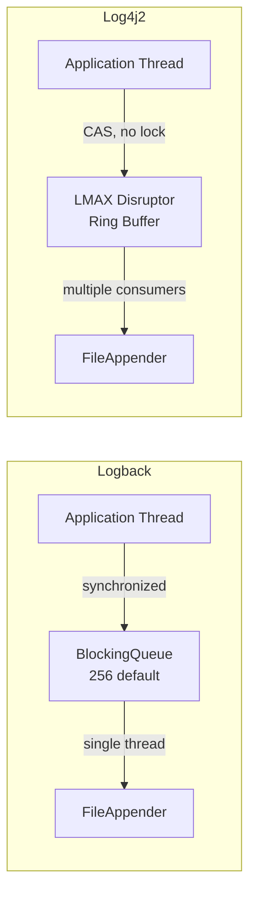

Конфигурация `Log4j2` async loggers (`log4j2.xml`):

```xml
<?xml version="1.0" encoding="UTF-8"?>
<Configuration status="WARN">
    <Appenders>
        <RollingFile name="RollingFile"
                     fileName="logs/app.log"
                     filePattern="logs/app.%d{yyyy-MM-dd}.%i.log.gz">
            <JsonLayout compact="true" eventEol="true"
                        includeStacktrace="true" stacktraceAsString="true">
                <KeyValuePair key="service" value="${env:APP_NAME:-unknown}"/>
            </JsonLayout>
            <SizeBasedTriggeringPolicy size="100 MB"/>
            <DefaultRolloverStrategy max="30"/>
        </RollingFile>
    </Appenders>

    <Loggers>
        <!-- Все логгеры асинхронны -->
        <AsyncRoot level="INFO" includeLocation="false">
            <AppenderRef ref="RollingFile"/>
        </AsyncRoot>

        <!-- Конкретный пакет — тоже асинхронный -->
        <AsyncLogger name="com.myapp" level="DEBUG" additivity="false">
            <AppenderRef ref="RollingFile"/>
        </AsyncLogger>
    </Loggers>
</Configuration>
```

Режим **All Async** (самый быстрый) — через системное свойство:

```bash
-Dlog4j2.contextSelector=org.apache.logging.log4j.core.async.AsyncLoggerContextSelector
```

Производительность сравнение:

| Реализация | Throughput (ops/s) | Latency p99 |
|------------|-------------------|-------------|
| `Logback` синхронный | ~260K | ~1-10 мс |
| `Logback AsyncAppender` | ~1M | ~0.1 мс |
| `Log4j2 AsyncLogger` | ~18M | ~< 1 мкс |

Переключение в `Spring Boot`:

```groovy
// build.gradle
configurations.all {
    exclude group: 'org.springframework.boot', module: 'spring-boot-starter-logging'
}
implementation 'org.springframework.boot:spring-boot-starter-log4j2'
```

## Q35. Как работает Spring Boot Logging Auto-configuration?

`Spring Boot` автоматически конфигурирует логирование через `LoggingSystem` абстракцию при старте.

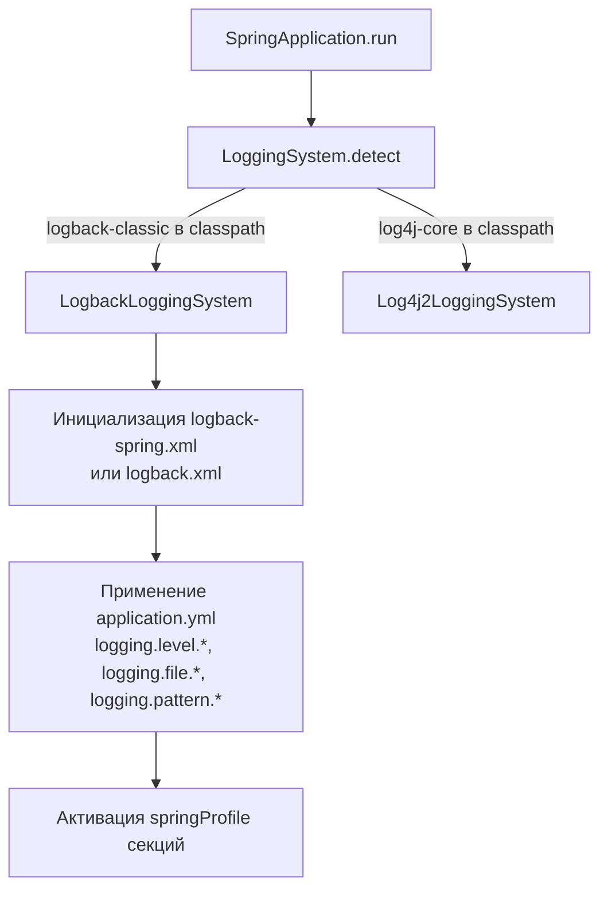

Порядок поиска конфиг-файлов (`Logback`):
1. `logback-spring.xml` — **рекомендуется**: поддерживает `<springProfile>`, `<springProperty>`
2. `logback.xml` — стандартный, без Spring-расширений

Ключевые свойства `application.yml`:

```yaml
logging:
  # Уровни по пакетам
  level:
    root: INFO
    com.myapp: DEBUG
    org.hibernate.SQL: WARN

  # Файл лога
  file:
    name: /var/log/myapp/app.log
    # или path: /var/log/myapp/  → spring.log

  # Паттерны (override defaults)
  pattern:
    console: "%d{HH:mm:ss.SSS} %-5level [%thread] %logger{36} - %msg%n"
    file: "%d{ISO8601} %-5level [%thread] [%X{traceId}] %logger{36} - %msg%n"

  # Цвета в консоли (dev)
  charset:
    console: UTF-8

  # Structured logging (Spring Boot 3.4+)
  structured:
    format:
      console: ecs   # logstash, ecs, gelf
```

Structured logging из коробки (`Spring Boot 3.4+`):

```yaml
# Без доп. зависимостей — встроенный JSON
logging:
  structured:
    format:
      console: logstash
```

При старте `Spring Boot` выводит `[main]` логи до инициализации вашего конфига — это нормально; после загрузки `ApplicationContext` используется ваш конфиг.

## Q36. Что такое ECS Layout и зачем он нужен?

`ECS` (Elastic Common Schema) — стандартизированный формат полей для всей экосистемы `Elastic` (Elasticsearch, APM, Security). `ECS Layout` гарантирует совместимость логов с `Kibana Discover`, `Elastic APM` и готовыми дашбордами.

```json
{
  "@timestamp": "2026-04-13T12:00:00.123Z",
  "log.level": "ERROR",
  "log.logger": "com.myapp.service.OrderService",
  "message": "Order processing failed",
  "service.name": "order-service",
  "service.version": "1.2.3",
  "service.environment": "prod",
  "trace.id": "4bf92f3577b34da6a3ce929d0e0e4736",
  "span.id": "00f067aa0ba902b7",
  "error.type": "com.myapp.exception.PaymentException",
  "error.message": "Payment gateway timeout",
  "error.stack_trace": "..."
}
```

Настройка с `ecs-logging-java`:

```groovy
// build.gradle
implementation 'co.elastic.logging:logback-ecs-encoder:1.6.0'
```

```xml
<!-- logback-spring.xml -->
<appender name="ECS_CONSOLE" class="ch.qos.logback.core.ConsoleAppender">
    <encoder class="co.elastic.logging.logback.EcsEncoder">
        <serviceName>${APP_NAME:-unknown}</serviceName>
        <serviceVersion>${APP_VERSION:-0.0.0}</serviceVersion>
        <serviceEnvironment>${SPRING_PROFILES_ACTIVE:-dev}</serviceEnvironment>
        <includeOrigin>false</includeOrigin>
    </encoder>
</appender>
```

Преимущества `ECS` перед кастомным `LogstashEncoder`:
- Автоматически совместим с готовыми `Kibana` дашбордами
- `Elastic APM` автоматически коррелирует логи с трейсами через `trace.id`
- Стандарт полей — меньше сюрпризов при смене сервисов

## Q37. Как тестировать логирование с MemoryAppender в unit-тестах?

Тестирование логирования позволяет убедиться, что критичные события логируются на нужном уровне и чувствительные данные не попадают в логи.

**Реализация `MemoryAppender`:**

```java
import ch.qos.logback.classic.Level;
import ch.qos.logback.classic.Logger;
import ch.qos.logback.classic.spi.ILoggingEvent;
import ch.qos.logback.core.read.ListAppender;
import org.slf4j.LoggerFactory;

public class MemoryAppender extends ListAppender<ILoggingEvent> {

    public void reset() {
        this.list.clear();
    }

    public boolean contains(String substring, Level level) {
        return this.list.stream()
            .anyMatch(e -> e.getFormattedMessage().contains(substring)
                && e.getLevel().equals(level));
    }

    public boolean containsExactMessage(String message, Level level) {
        return this.list.stream()
            .anyMatch(e -> e.getFormattedMessage().equals(message)
                && e.getLevel().equals(level));
    }

    public long countByLevel(Level level) {
        return this.list.stream()
            .filter(e -> e.getLevel().equals(level))
            .count();
    }
}
```

**Использование в тестах:**

```java
@ExtendWith(MockitoExtension.class)
class PaymentServiceLoggingTest {

    private MemoryAppender memoryAppender;

    @BeforeEach
    void setUp() {
        memoryAppender = new MemoryAppender();
        memoryAppender.start();

        Logger logger = (Logger) LoggerFactory.getLogger(PaymentService.class);
        logger.addAppender(memoryAppender);
        logger.setLevel(Level.DEBUG);
    }

    @AfterEach
    void tearDown() {
        Logger logger = (Logger) LoggerFactory.getLogger(PaymentService.class);
        logger.detachAppender(memoryAppender);
    }

    @Test
    void shouldLogPaymentSuccessAtInfoLevel() {
        paymentService.processPayment(validRequest());

        assertThat(memoryAppender.contains("Payment processed", Level.INFO)).isTrue();
    }

    @Test
    void shouldNotLogCreditCardNumber() {
        paymentService.processPayment(requestWithCard("4111111111111111"));

        boolean cardInLogs = memoryAppender.list.stream()
            .anyMatch(e -> e.getFormattedMessage().contains("4111111111111111"));
        assertThat(cardInLogs)
            .as("Credit card number should not appear in logs")
            .isFalse();
    }

    @Test
    void shouldLogErrorOnGatewayFailure() {
        doThrow(new GatewayException("timeout")).when(gateway).charge(any());

        assertThatThrownBy(() -> paymentService.processPayment(validRequest()))
            .isInstanceOf(GatewayException.class);

        assertThat(memoryAppender.contains("Payment failed", Level.ERROR)).isTrue();
    }
}
```

**Альтернатива: `@SpringBootTest` + `OutputCaptureExtension`:**

```java
@SpringBootTest
@ExtendWith(OutputCaptureExtension.class)
class OrderServiceIntegrationLoggingTest {

    @Test
    void shouldIncludeTraceIdInJsonLogs(CapturedOutput output) {
        orderService.createOrder(new OrderRequest("user-1", 99.99));

        // Для JSON-логов проверяем структуру
        assertThat(output.getOut())
            .contains("\"level\":\"INFO\"")
            .contains("\"message\":\"Order created\"");
    }
}
```

`MemoryAppender` — для unit-тестов отдельного класса; `OutputCaptureExtension` — для интеграционных тестов с проверкой реального формата вывода.

## Q38. Как использовать StructuredArguments для обогащения JSON-логов?

`StructuredArguments` из `logstash-logback-encoder` позволяет добавлять произвольные поля в `JSON`-лог помимо строки сообщения.

```java
import net.logstash.logback.argument.StructuredArguments;
import static net.logstash.logback.argument.StructuredArguments.*;
import static net.logstash.logback.marker.Markers.*;

@Slf4j
@Service
public class OrderService {

    // keyValue — поле в JSON И в текстовом сообщении
    public void createOrder(OrderRequest req) {
        log.info("Order created {}", keyValue("orderId", req.getId()));
        // JSON: {"message":"Order created orderId=12345","orderId":"12345"}
    }

    // value — только в строке сообщения (без отдельного JSON-поля)
    public void logOrderStatus(String orderId, String status) {
        log.info("Order {} status changed to {}", value("orderId", orderId), value("status", status));
        // JSON: {"message":"Order 12345 status changed to CONFIRMED"}
        // Отдельных полей orderId/status в JSON нет — используйте keyValue вместо этого
    }

    // entries — добавить Map как набор полей
    public void logWithContext(Map<String, Object> context) {
        log.info("Processing {}", entries(context));
        // JSON: {"message":"Processing ...","key1":"val1","key2":"val2"}
    }

    // Markers — для маршрутизации и фильтрации
    public void logAuditEvent(String userId, String action) {
        log.info(append("userId", userId).and(append("action", action)),
            "Audit event");
        // JSON: {"message":"Audit event","userId":"u-123","action":"DELETE_ORDER"}
    }
}
```

**Разница `keyValue` vs `append`:**

| Метод | Влияние на строку сообщения | JSON поле |
|-------|-----------------------------|-----------|
| `keyValue("k", v)` | `k=v` добавляется в строку | Да |
| `value("k", v)` | `v` добавляется в строку | Нет |
| `append("k", v)` (Marker) | Не влияет | Да |
| `entries(map)` | Нет | Все ключи map |

**Best practice:** использовать `keyValue` для полей, которые нужны и в читаемом тексте и в `JSON`; `append` через `Markers` — для полей только в машинном формате (userId, sessionId в каждой записи через MDC удобнее).

## Q39. Как работает Log4j2 garbage-free logging?

`Garbage-free logging` в `Log4j2` минимизирует создание объектов в `heap`, снижая давление на `GC`. Особенно важно для `latency-sensitive` приложений.

Обычный цикл логирования создаёт объекты:

```
log.info("User {} placed order {}", userId, orderId)
  → new Object[]{userId, orderId}   // varargs array
  → StringBuilder для форматирования
  → String результата
  → LogEvent объект
```

В `Log4j2 garbage-free` режиме используются:
- **Thread-local object pool** для `LogEvent` и `StringBuilder`
- **Direct encoding** — пишет напрямую в буфер без промежуточных строк
- **Reusable buffer** — `ByteBuffer` переиспользуется между записями

Включение в `log4j2.xml`:

```xml
<Configuration status="WARN">
    <Properties>
        <!-- Включить garbage-free режим -->
        <Property name="log4j2.garbagefreeThreadContextMap">true</Property>
        <Property name="log4j2.enableDirectEncoders">true</Property>
    </Properties>
    <Appenders>
        <RollingFile name="RollingFile" fileName="logs/app.log"
                     filePattern="logs/app.%d{yyyy-MM-dd}.%i.log.gz"
                     immediateFlush="false"><!-- false для max throughput -->
            <PatternLayout pattern="%d{ISO8601} %-5level [%t] %logger{36} - %msg%n"/>
            <SizeBasedTriggeringPolicy size="100 MB"/>
        </RollingFile>
    </Appenders>
</Configuration>
```

Системные свойства для полного garbage-free:

```bash
-Dlog4j2.garbagefreeThreadContextMap=true
-Dlog4j2.enableDirectEncoders=true
-Dlog4j2.initialReusableMsgSize=128
-Dlog4j2.maxReusableMsgSize=518
```

Ограничения: не все `Appender` и `Layout` поддерживают garbage-free (например, `JsonLayout` не поддерживает; используйте `JsonTemplateLayout`).

Когда критично: финансовые приложения, игровые серверы, high-frequency trading — где паузы GC недопустимы.

## Q40. Как настроить Graylog / GELF для приёма логов из Java?

`Graylog` — альтернативная платформа централизованного логирования, использует протокол `GELF` (Graylog Extended Log Format).

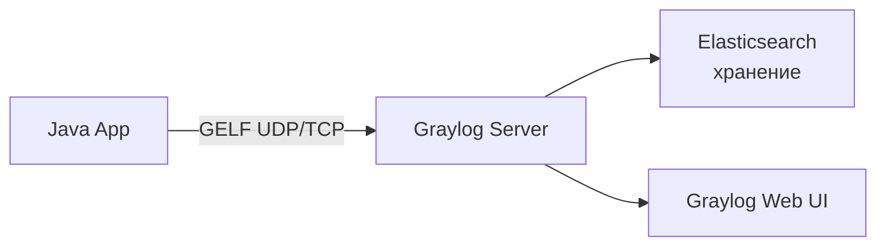

`GELF` — компактный `JSON`-формат с обязательными полями: `version`, `host`, `short_message`, `timestamp`.

Настройка через `logback-gelf`:

```groovy
// build.gradle
implementation 'de.siegmar:logback-gelf:6.0.1'
```

```xml
<!-- logback-spring.xml -->
<appender name="GELF" class="de.siegmar.logbackgelf.GelfUdpAppender">
    <graylogHost>graylog.internal</graylogHost>
    <graylogPort>12201</graylogPort>

    <layout class="de.siegmar.logbackgelf.GelfLayout">
        <includeRawMessage>false</includeRawMessage>
        <includeLevelName>true</includeLevelName>
        <includeMdcData>true</includeMdcData>

        <!-- Статические поля -->
        <staticField class="de.siegmar.logbackgelf.PatternGelfMessageAssembler$StaticField">
            <name>service</name>
            <value>${APP_NAME:-unknown}</value>
        </staticField>
    </layout>
</appender>

<!-- Async для надёжности -->
<appender name="ASYNC_GELF" class="ch.qos.logback.classic.AsyncAppender">
    <queueSize>2048</queueSize>
    <neverBlock>true</neverBlock>
    <appender-ref ref="GELF"/>
</appender>

<springProfile name="prod">
    <root level="INFO">
        <appender-ref ref="ASYNC_GELF"/>
    </root>
</springProfile>
```

`GELF` vs `LogstashEncoder`:

| Критерий | `GELF` (Graylog) | `LogstashEncoder` (ELK) |
|----------|-----------------|------------------------|
| Формат | `GELF JSON` + chunking | `JSON` (кастомный) |
| Транспорт | UDP/TCP прямо на Graylog | Через Filebeat/Logstash |
| Потеря данных | Возможна при UDP | Буферизация на агенте |
| Настройка | Проще | Гибче |

Рекомендация для production: TCP `GELF` + async appender; UDP — только если потеря допустима.

## Q41. Что такое Log Appender для Kafka и когда его применять?

`Kafka Appender` — отправка лог-записей напрямую в топик `Kafka`, минуя промежуточные файлы и агенты.

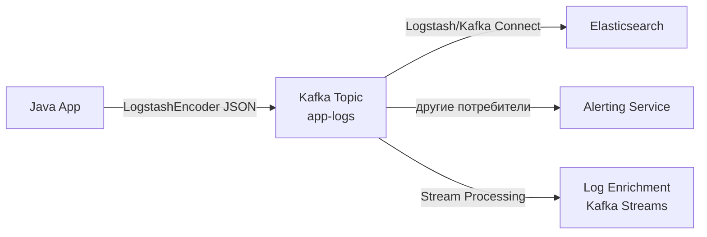

Конфигурация с `logback-kafka-appender`:

```groovy
// build.gradle
implementation 'com.github.danielwegener:logback-kafka-appender:0.2.0-RC2'
implementation 'net.logstash.logback:logstash-logback-encoder:7.4'
```

```xml
<!-- logback-spring.xml -->
<appender name="KAFKA" class="com.github.danielwegener.logback.kafka.KafkaAppender">
    <encoder class="net.logstash.logback.encoder.LogstashEncoder">
        <customFields>{"service":"${APP_NAME}","env":"${APP_ENV}"}</customFields>
    </encoder>

    <!-- Топик -->
    <topic>app-logs</topic>

    <!-- Ключ партиционирования — по имени сервиса -->
    <keyingStrategy class="com.github.danielwegener.logback.kafka.keying.HostNameKeyingStrategy"/>

    <deliveryStrategy class="com.github.danielwegener.logback.kafka.delivery.AsynchronousDeliveryStrategy"/>

    <!-- Kafka producer properties -->
    <producerConfig>bootstrap.servers=kafka:9092</producerConfig>
    <producerConfig>acks=0</producerConfig><!-- fire-and-forget для логов -->
    <producerConfig>linger.ms=100</producerConfig>
    <producerConfig>batch.size=16384</producerConfig>
    <producerConfig>compression.type=lz4</producerConfig>
</appender>

<!-- Fallback при недоступности Kafka -->
<appender name="FAILOVER" class="ch.qos.logback.core.FileAppender">
    <file>/var/log/myapp/fallback.log</file>
    <encoder class="net.logstash.logback.encoder.LogstashEncoder"/>
</appender>

<springProfile name="prod">
    <root level="INFO">
        <appender-ref ref="KAFKA"/>
        <appender-ref ref="FAILOVER"/><!-- дублирование -->
    </root>
</springProfile>
```

Когда применять:

| Сценарий | Kafka Appender | Filebeat → ELK |
|----------|---------------|----------------|
| Высокая нагрузка (>100K logs/s) | Хорошо | Ограничено |
| Real-time обработка логов | Да (stream processing) | Нет |
| Сложная маршрутизация | Kafka routing | Logstash filter |
| Надёжность при потере агента | Kafka retention | Нет |
| Простота настройки | Сложнее | Проще |

Риски: `Kafka Appender` с `acks=0` — это fire-and-forget; потеря логов при перегрузке брокера возможна. Для критичных аудит-логов используйте `acks=1` или стандартный подход через агент.

---

## See also

- [[logging-strategies-interview|Стратегии логирования]] — архитектурные решения: sampling, retention, централизованная агрегация, стоимость хранения логов
- [[metrics-tracing-interview|Метрики и трейсинг]] — `Prometheus`, `Micrometer`, `OpenTelemetry`: как метрики и трейсы дополняют логи
- [[observability-interview|Observability]] — три столпа наблюдаемости (логи, метрики, трейсы), `SLI`/`SLO`/`SLA`, `OpenTelemetry Collector`
- [[microservices-interview|Микросервисы]] — паттерны, где structured logging и correlation ID критически важны для диагностики
- [[spring-boot-interview|Spring Boot]] — `logback-spring.xml`, `spring.profiles`, `Logstash Logback Encoder`, `Actuator`
- [[elasticsearch-interview|Elasticsearch]] — хранение, индексирование и поиск по логам; mapping, ILM политики
- [[kubernetes-interview|Kubernetes]] — `stdout`/`stderr` стратегия в pod, Fluentd/Fluent Bit, агрегация логов в кластере

- [[ai-agents-interview|AI Agents]]
- [[embeddings-interview|Embeddings]]
- [[llm-basics-interview|LLM Basics]]
- [[llm-integration-patterns-interview|LLM Integration Patterns]]
- [[mlops-interview|MLOps]]
- [[model-serving-interview|Model Serving]]
