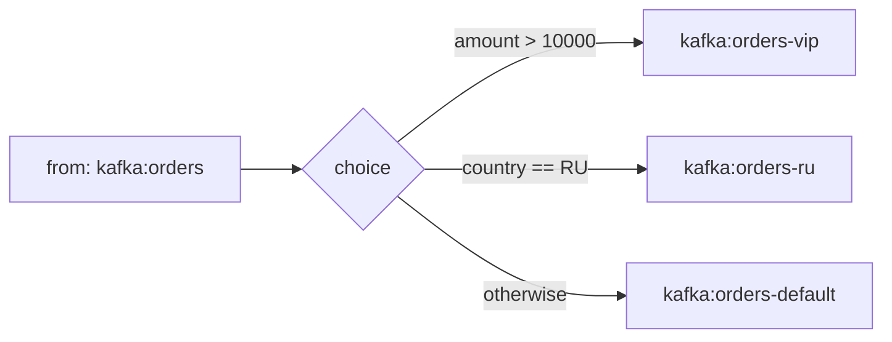
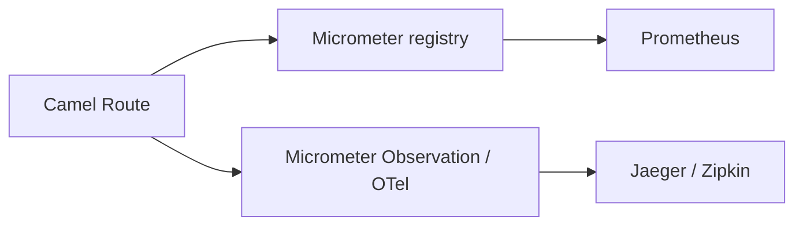

# Вопросы на собеседовании: `Apache Camel`

`Apache Camel` — это open-source интеграционный фреймворк, который реализует каталог Enterprise Integration Patterns (EIP) поверх 300+ готовых компонентов: от файлов и HTTP до Kafka, JMS и облачных API. На собеседованиях по messaging/integration его спрашивают, чтобы проверить, понимаете ли вы маршрутизацию сообщений, модель `Exchange`, обработку ошибок и trade-offs между «оркестратором интеграций» и брокером сообщений.

Дата последнего обновления: 2026-06-25

## Полезные ссылки

### Официальная документация

- [Apache Camel — официальный сайт](https://camel.apache.org/) — компоненты, EIP, DSL, релизы (актуальная ветка — Camel 4.x на JDK 17+)
- [Camel: User Manual](https://camel.apache.org/manual/) — концепции: `CamelContext`, маршруты, `Exchange`
- [Camel: Enterprise Integration Patterns](https://camel.apache.org/components/latest/eips/enterprise-integration-patterns.html) — список реализованных EIP
- [Camel: Saga EIP](https://camel.apache.org/components/latest/eips/saga-eip.html) — Saga/LRA
- [Enterprise Integration Patterns (Hohpe & Woolf)](https://www.enterpriseintegrationpatterns.com/) — первоисточник каталога паттернов
- [Baeldung: Apache Camel](https://www.baeldung.com/apache-camel-intro) — туториал
- [Baeldung: Apache Camel with Spring Boot](https://www.baeldung.com/apache-camel-spring-boot) — интеграция со Spring Boot

## Содержание

- [Полезные ссылки](#полезные-ссылки)

**Основы и модель**
- [Q1. (!) Что такое Apache Camel и какую задачу он решает](#q1--что-такое-apache-camel-и-какую-задачу-он-решает)
- [Q2. (!) Что такое CamelContext, Route, Endpoint и Component](#q2--что-такое-camelcontext-route-endpoint-и-component)
- [Q3. Что такое Exchange и Message; чем headers отличаются от properties и body](#q3-что-такое-exchange-и-message-чем-headers-отличаются-от-properties-и-body)
- [Q4. Что такое RouteBuilder и какие есть DSL (Java/XML/YAML)](#q4-что-такое-routebuilder-и-какие-есть-dsl-javaxmlyaml)
- [Q5. Как устроен URI эндпоинта; consumer vs producer](#q5-как-устроен-uri-эндпоинта-consumer-vs-producer)

**Enterprise Integration Patterns**
- [Q6. (!) Как работает Content-Based Router (choice/when/otherwise)](#q6--как-работает-content-based-router-choicewhenotherwise)
- [Q7. Splitter и Aggregator: чем отличаются и как собирают результат](#q7-splitter-и-aggregator-чем-отличаются-и-как-собирают-результат)
- [Q8. Чем отличаются `Multicast`, `Recipient List` и `Dynamic Router`?](#q8-чем-отличаются-multicast-recipient-list-и-dynamic-router)
- [Q9. Wire Tap и Message Filter](#q9-wire-tap-и-message-filter)

**Надёжность и обработка ошибок**
- [Q10. (!) Как обрабатывать ошибки: onException, DeadLetterChannel, doTry/doCatch](#q10--как-обрабатывать-ошибки-onexception-deadletterchannel-dotrydocatch)
- [Q11. Как работает RedeliveryPolicy](#q11-как-работает-redeliverypolicy)
- [Q12. Что такое Saga EIP и как реализуется LRA](#q12-что-такое-saga-eip-и-как-реализуется-lra)

**Интеграция, тестирование, эксплуатация**
- [Q13. Как Camel интегрируется со Spring Boot](#q13-как-camel-интегрируется-со-spring-boot)
- [Q14. (!) Camel vs Spring Integration vs Kafka: когда что выбирать](#q14--camel-vs-spring-integration-vs-kafka-когда-что-выбирать)
- [Q15. Как тестировать маршруты: CamelTestSupport, AdviceWith, Mock](#q15-как-тестировать-маршруты-cameltestsupport-advicewith-mock)
- [Q16. Type converters и observability (Micrometer, tracing)](#q16-type-converters-и-observability-micrometer-tracing)

- [See also](#see-also)

## Q1. (!) Что такое Apache Camel и какую задачу он решает

`Apache Camel` — интеграционный фреймворк для соединения разнородных систем по единому API. Он берёт на себя «клей» между протоколами и форматами: вы описываете маршрут сообщения, а Camel занимается транспортом, преобразованием типов и применением паттернов интеграции.

Ключевые свойства:

- **Реализация EIP.** Camel — это исполняемая версия каталога Enterprise Integration Patterns (Hohpe & Woolf): Content-Based Router, Splitter, Aggregator и т.д. — это не абстракции из книги, а готовые DSL-конструкции.
- **300+ компонентов.** Из коробки есть коннекторы к файлам, HTTP/REST, JMS/AMQP, Kafka, базам данных, SFTP, почте, облачным сервисам (AWS S3/SQS/SNS, Azure) и многому другому.
- **Маршрут как первоклассная сущность.** Логика «откуда взять — что сделать — куда отправить» описывается декларативно через DSL.

Главная ценность — единообразие: подключить новый протокол означает поменять URI эндпоинта, а не переписывать инфраструктурный код.

**Итог:** Camel — это оркестратор интеграций и «медиатор» между системами, а не брокер сообщений. Он не хранит сообщения долго и не является транспортом сам по себе — он маршрутизирует и преобразует то, что течёт через него.

## Q2. (!) Что такое CamelContext, Route, Endpoint и Component

Это четыре базовых строительных блока, и на собеседовании важно не путать их уровни.

- **`CamelContext`** — runtime-система Camel, контейнер, который связывает всё вместе: маршруты, компоненты, эндпоинты, type converters, error handlers. Жизненный цикл (`start()`/`stop()`) — на нём.
- **`Route`** — маршрут: цепочка обработки от одного `from(...)` (источник) через шаги до одного или нескольких `to(...)` (получателей).
- **`Component`** — фабрика эндпоинтов для конкретного протокола (`file`, `http`, `kafka`, `jms`). Имя компонента — это схема в URI.
- **`Endpoint`** — конкретный канал, через который сообщение входит или выходит, заданный URI (`file:/data/in`, `kafka:orders`).

```text
CamelContext
 ├── Route 1: from("file:/in") → process → to("kafka:orders")
 ├── Route 2: from("kafka:orders") → ...
 ├── Components: file, kafka, http, ...
 └── TypeConverters, ErrorHandlers
```

**Подвох:** один `Component` (например `kafka`) порождает много `Endpoint` (по одному на топик/настройку). Component — singleton-фабрика, Endpoint — конкретный адрес.

## Q3. Что такое Exchange и Message; чем headers отличаются от properties и body

`Exchange` — это контейнер, который Camel создаёт при поступлении сообщения и проносит через весь маршрут. Внутри него живут `Message` и метаданные.

Структура `Message`:

- **`body`** — полезная нагрузка (тело). Может быть `String`, `byte[]`, POJO, поток — что угодно.
- **`headers`** — пара ключ-значение, живущая в пределах одного `Message` (передаётся между шагами, часто маппится в HTTP-заголовки / JMS-properties на транспорте).
- **`attachments`** — вложения (например для email/SOAP).

У `Exchange` отдельно есть:

- **`properties`** — метаданные уровня всего `Exchange`, живут от начала до конца маршрута (шире по времени жизни, чем headers).
- **`exchangePattern`** (MEP) — `InOnly` (fire-and-forget) или `InOut` (request-reply).

| Что | Уровень | Время жизни | Типичное применение |
|-----|---------|-------------|---------------------|
| `body` | Message | сообщение | полезная нагрузка |
| `headers` | Message | пока живёт текущий Message | маршрутизация, метаданные, маппинг в транспортные заголовки |
| `properties` | Exchange | весь маршрут целиком | сквозной контекст, временные флаги |

```java
public void process(Exchange exchange) {
    String body = exchange.getIn().getBody(String.class);
    Object orderId = exchange.getIn().getHeader("orderId");
    exchange.setProperty("startedAt", System.currentTimeMillis());
}
```

**Важный нюанс про In/Out:** исторически были `getIn()` и `getOut()`. В современном Camel рекомендуется писать результат обратно в `getMessage()` (он же `getIn()`), а `getOut()` считается legacy и может «съесть» headers, если использовать неаккуратно. Для request-reply ответ кладётся в то же сообщение.

## Q4. Что такое RouteBuilder и какие есть DSL (Java/XML/YAML)

`RouteBuilder` — базовый класс, в котором определяются маршруты: вы наследуетесь от него и переопределяете метод `configure()`.

**Java DSL** — самый мощный вариант (fluent API, доступны все фичи):

```java
public class OrderRoute extends RouteBuilder {
    @Override
    public void configure() {
        from("file:/data/in?noop=true")
            .routeId("order-import")
            .log("Получен файл: ${header.CamelFileName}")
            .unmarshal().json(Order.class)
            .to("kafka:orders");
    }
}
```

**XML DSL** — конфигурация без перекомпиляции (удобно, когда правят интеграторы):

```xml
<route id="order-import">
    <from uri="file:/data/in?noop=true"/>
    <to uri="kafka:orders"/>
</route>
```

**YAML DSL** — компактный декларативный вариант (популярен в Camel K / cloud-native сценариях):

```yaml
- route:
    id: order-import
    from:
      uri: "file:/data/in?noop=true"
      steps:
        - to:
            uri: "kafka:orders"
```

| DSL | Плюсы | Минусы |
|-----|-------|--------|
| Java | все фичи, рефакторинг, типобезопасность | требует компиляции |
| XML | правки без пересборки, привычно интеграторам | многословно, нет полноты Java-фич |
| YAML | компактно, cloud-native (Camel K) | ограниченнее Java, чувствителен к отступам |

**Итог:** для приложений на JVM по умолчанию берут Java DSL; XML/YAML — когда нужна декларативная конфигурация без перекомпиляции.

## Q5. Как устроен URI эндпоинта; consumer vs producer

Эндпоинт задаётся URI вида `схема:контекстный-путь?опции`:

```text
file:/data/in?noop=true&delay=5000
 │     │              │
 │     │              └── опции (query-параметры эндпоинта)
 │     └── контекстный путь (зависит от компонента)
 └── схема = имя компонента
```

Один и тот же эндпоинт работает в двух ролях:

- **Consumer** — когда стоит в `from(...)`: эндпоинт читает входящие сообщения и инициирует маршрут (опрашивает файлы, слушает топик Kafka, принимает HTTP-запрос).
- **Producer** — когда стоит в `to(...)`: эндпоинт отправляет сообщение наружу (пишет файл, публикует в Kafka, делает HTTP-вызов).

Различают также:

- **Polling consumer** — Camel сам опрашивает источник по таймеру (`file`, `ftp`, `quartz`).
- **Event-driven consumer** — источник сам пушит сообщения (`jms`, `kafka`, входящий `http`).

**Подвох с опциями:** опции эндпоинта влияют на его идентичность. `kafka:orders?groupId=a` и `kafka:orders?groupId=b` — это разные эндпоинты, и Camel закэширует их по полному URI.

## Q6. (!) Как работает Content-Based Router (choice/when/otherwise)

Content-Based Router — это маршрутизация по содержимому сообщения. В Camel он выражается конструкцией `choice().when(...).otherwise()`.

```java
from("kafka:orders")
    .choice()
        .when(simple("${body.amount} > 10000"))
            .to("kafka:orders-vip")
        .when(header("country").isEqualTo("RU"))
            .to("kafka:orders-ru")
        .otherwise()
            .to("kafka:orders-default")
    .end();
```

Ключевые моменты:

- Условие проверяется по содержимому: body, header, property — через язык выражений (`simple`, `jsonpath`, `xpath`, `groovy`).
- Срабатывает **первый** подошедший `when` (как `switch` без проваливания) — порядок важен.
- `otherwise()` — ветка по умолчанию; без неё непопавшее сообщение просто проходит дальше по маршруту.
- `.end()` закрывает блок `choice`.



**Подвох:** забыть `.end()` — тогда последующие шаги маршрута ошибочно попадут внутрь блока `choice`. Это классическая ошибка на code-review.

## Q7. Splitter и Aggregator: чем отличаются и как собирают результат

Это парные EIP: один разбивает сообщение, другой собирает обратно.

**Splitter (`split`)** разбивает входящее сообщение на части и обрабатывает каждую отдельно. В отличие от Multicast, splitter **изменяет** входящее сообщение (работает с его частями).

```java
from("file:/data/orders.csv")
    .split(body().tokenize("\n"))   // каждая строка — отдельный Exchange
        .to("bean:lineProcessor")
    .end();
```

Опции splitter: `parallelProcessing()` (параллельная обработка частей), `streaming()` (потоковая разбивка без загрузки всего в память), `stopOnException()`, `aggregationStrategy(...)` (как собрать результаты частей обратно).

**Aggregator (`aggregate`)** собирает несколько сообщений в одно по ключу корреляции и `AggregationStrategy`:

```java
from("kafka:events")
    .aggregate(header("orderId"), new GroupedBodyAggregationStrategy())
        .completionSize(10)             // собрать по 10 сообщений
        .completionTimeout(5000)        // или по таймауту
        .to("bean:batchProcessor")
    .end();
```

| | Splitter | Aggregator |
|---|----------|------------|
| Направление | 1 → N | N → 1 |
| Корреляция | не нужна | по `correlationExpression` |
| Условие завершения | конец итерации | `completionSize` / `completionTimeout` / predicate |
| Состояние | stateless | stateful (буфер, нужен `AggregationRepository` для надёжности) |

**Подвох:** Aggregator по умолчанию держит буфер в памяти. Для надёжности (переживания рестарта) нужен персистентный `AggregationRepository` (JDBC, Redis и т.п.) — иначе при падении недособранные группы теряются.

## Q8. Чем отличаются `Multicast`, `Recipient List` и `Dynamic Router`?

Все три рассылают сообщение нескольким получателям, но различаются тем, **откуда берётся список получателей**.

| Паттерн | Список получателей | Когда выбирать |
|---------|--------------------|----------------|
| **Multicast** | задан статически в маршруте (`multicast().to(a).to(b)`) | получатели известны на этапе написания |
| **Recipient List** | вычисляется из сообщения (`recipientList(header("targets"))`) | список зависит от содержимого |
| **Dynamic Router** | вычисляется итеративно, шаг за шагом, до `null` | следующий получатель зависит от результата предыдущего |

```java
// Multicast — статика, можно с параллелизмом и aggregationStrategy
from("direct:start")
    .multicast().parallelProcessing()
        .to("kafka:audit").to("http:billing");

// Recipient List — динамика из header
from("direct:start")
    .recipientList(header("recipients"));  // напр. "kafka:a,kafka:b"

// Dynamic Router — повторный вызов бина, пока тот не вернёт null
from("direct:start")
    .dynamicRouter(method(SlipRouter.class, "route"));
```

Нюансы:

- **Multicast** по умолчанию отдаёт наружу последний ответ; для сборки нескольких ответов нужен `aggregationStrategy`. Отличие от splitter: multicast **не меняет** исходное сообщение — каждому получателю уходит копия.
- **Recipient List** разбирает строку получателей (разделитель настраивается).
- **Dynamic Router** реализует Routing Slip с обратной связью: бин возвращает следующий эндпоинт, пока не вернёт `null`.

**Итог:** статичный fan-out → Multicast; список из данных → Recipient List; маршрут «решается на ходу» → Dynamic Router.

## Q9. Wire Tap и Message Filter

**Wire Tap** — копия сообщения уходит в side-канал (для аудита/мониторинга), **не прерывая** основной поток. Главное свойство: tap асинхронный и не влияет на основной маршрут.

```java
from("kafka:orders")
    .wireTap("kafka:audit")   // копия в аудит, основной поток идёт дальше
    .to("bean:orderProcessor");
```

Поскольку wire tap по умолчанию работает в InOnly и асинхронно, ошибка или задержка в side-канале не тормозит и не валит основную обработку.

**Message Filter** — пропускает дальше только сообщения, удовлетворяющие предикату; остальные отбрасывает.

```java
from("kafka:events")
    .filter(simple("${body.type} == 'PAYMENT'"))
        .to("bean:paymentHandler")
    .end();
```

| | Wire Tap | Filter |
|---|----------|--------|
| Что делает | дублирует сообщение в side-канал | пропускает/отбрасывает по условию |
| Основной поток | не прерывается | отброшенные дальше не идут |
| Режим | асинхронный (InOnly) | синхронный в основном маршруте |

**Подвох:** wire tap по умолчанию шлёт копию сообщения; если в side-канале изменить body, основной поток это не затронет (другой `Exchange`). Это удобно, но люди иногда ждут «общего» сообщения — его нет.

## Q10. (!) Как обрабатывать ошибки: onException, DeadLetterChannel, doTry/doCatch

Camel даёт три уровня обработки ошибок — важно понимать, когда какой.

**1. `onException` — обработчик по типу исключения (route- или context-уровень).** Самый частый способ. Ловит конкретный тип, поддерживает redelivery, можно пометить ошибку как обработанную (`handled(true)`).

```java
onException(IOException.class)
    .maximumRedeliveries(3)
    .redeliveryDelay(1000)
    .handled(true)
    .to("kafka:orders-dlq")
    .log("Сдались после ретраев: ${exception.message}");
```

**2. `DeadLetterChannel` — стратегия error handler по умолчанию для «непереваренных» сообщений.** После исчерпания ретраев сообщение уходит в dead-letter эндпоинт, маршрут продолжает работать дальше.

```java
errorHandler(deadLetterChannel("kafka:dlq")
    .maximumRedeliveries(5)
    .redeliveryDelay(2000));
```

Альтернатива — `defaultErrorHandler()` (ретраит, но при провале пробрасывает исключение наверх, без DLQ) и `noErrorHandler()`.

**3. `doTry/doCatch/doFinally` — локальный try-catch прямо в DSL.** Java-эквивалент try-catch-finally для одного участка маршрута, когда ошибку надо обработать «здесь и сейчас», а не глобально.

```java
from("direct:risky")
    .doTry()
        .to("http:flaky-service")
    .doCatch(HttpOperationFailedException.class)
        .to("bean:fallback")
    .doFinally()
        .to("bean:cleanup")
    .end();
```

| Механизм | Область | Ретраи | Типичный кейс |
|----------|---------|--------|---------------|
| `onException` | route/context | да | сквозная политика по типу ошибки |
| `DeadLetterChannel` | error handler | да | «недоставленные» → DLQ |
| `doTry/doCatch` | локальный блок | нет | обработать ошибку прямо в участке |

**Подвох с `handled`:** `handled(true)` гасит исключение (Exchange считается успешным), `continued(true)` — продолжает маршрут с места после ошибки. Если оставить дефолт, исключение пробросится дальше согласно error handler.

## Q11. Как работает RedeliveryPolicy

`RedeliveryPolicy` управляет повторными попытками доставки при ошибке — для `onException`, `DeadLetterChannel` и `defaultErrorHandler`.

Ключевые параметры:

- `maximumRedeliveries` — сколько раз повторять (0 = без ретраев, -1 = бесконечно).
- `redeliveryDelay` — пауза между попытками (мс).
- `backOffMultiplier` + `useExponentialBackOff` — экспоненциальный рост задержки.
- `maximumRedeliveryDelay` — потолок задержки при backoff.
- `collisionAvoidanceFactor` / `useCollisionAvoidance` — джиттер, чтобы не ретраить «толпой».
- `retriesExhaustedLogLevel`, `retryAttemptedLogLevel` — уровни логирования.
- `asyncDelayedRedelivery()` — ретраи без блокировки потока.

```java
onException(ConnectException.class)
    .maximumRedeliveries(5)
    .redeliveryDelay(1000)
    .backOffMultiplier(2)            // 1s, 2s, 4s, 8s...
    .useExponentialBackOff()
    .maximumRedeliveryDelay(30000)
    .handled(true)
    .to("kafka:dlq");
```

**Важно:** по умолчанию redelivery — **синхронный** (поток блокируется на `redeliveryDelay`). На больших задержках это исчерпывает thread pool. Решение — `asyncDelayedRedelivery()` или вынести ретраи на уровень брокера. Также redelivery повторяет весь участок начиная с точки ошибки, поэтому шаги должны быть идемпотентными.

## Q12. Что такое Saga EIP и как реализуется LRA

Saga EIP в Camel реализует распределённую транзакцию как последовательность локальных действий, каждое из которых имеет **компенсирующее** действие на случай отката. Это замена 2PC там, где честная распределённая транзакция невозможна (микросервисы, разные хранилища).

Две реализации Saga Service:

- **`InMemorySagaService`** — базовая, без удалённого распространения контекста и без гарантий при падении приложения. Для простых/локальных сценариев.
- **`LRASagaService`** — полноценная, на основе спецификации MicroProfile **LRA** (Long-Running Action). Поддерживает распространение контекста между сервисами (через HTTP-заголовок `Long-Running-Action`) и даёт гарантии согласованности при сбоях. Требует внешнего LRA-координатора (например Narayana).

```java
from("direct:placeOrder")
    .saga()
        .compensation("direct:cancelOrder")   // что делать при откате
        .completion("direct:confirmOrder")     // что делать при успехе
    .to("direct:reserveStock")
    .to("direct:chargePayment");
```

Режимы propagation совпадают с транзакционными: `REQUIRED` (по умолчанию — присоединиться к saga или создать новую), `MANDATORY`, `SUPPORTS`, `REQUIRES_NEW`, `NOT_SUPPORTED`, `NEVER`.

**Критичный нюанс:** компенсирующие действия **обязаны быть идемпотентными** — координатор может вызвать их более одного раза при аномальном завершении saga. Если компенсация не идемпотентна, повторный вызов испортит данные.

**Итог:** Saga даёт eventual consistency без распределённой блокировки. Цена — нужно написать компенсацию на каждый шаг и сделать её идемпотентной; для межсервисного распространения контекста нужен LRA-координатор.

## Q13. Как Camel интегрируется со Spring Boot

Интеграция идёт через стартер `camel-spring-boot-starter`. Он поднимает автоконфигурацию: создаёт `CamelContext` как Spring-бин, автоматически регистрирует все `RouteBuilder`-бины и стартует контекст вместе с приложением.

```xml
<dependency>
    <groupId>org.apache.camel.springboot</groupId>
    <artifactId>camel-spring-boot-starter</artifactId>
</dependency>
```

```java
@Component
public class MyRoute extends RouteBuilder {
    @Override
    public void configure() {
        from("timer:hello?period=5000")
            .setBody(constant("Привет из Camel"))
            .to("log:greeting");
    }
}
```

Что даёт стартер:

- **Автоконфиг `CamelContext`** — не нужно создавать вручную; конфигурируется через `camel.*` в `application.yml`.
- **Автоподхват маршрутов** — любой `@Component extends RouteBuilder` регистрируется сам.
- **`ProducerTemplate` как бин** — можно `@Autowired` для отправки сообщений в эндпоинты.
- **Компонентные стартеры** — отдельные `camel-<component>-starter` (например `camel-kafka-starter`) добавляют нужный коннектор.
- **Health checks / Actuator** — Camel интегрируется с Spring Boot Actuator (`/actuator/health` учитывает состояние контекста и маршрутов).

```java
@Autowired
private ProducerTemplate template;

public void send(Order order) {
    template.sendBody("direct:placeOrder", order);
}
```

**Подвох:** версии Camel и Spring Boot должны быть совместимы (BOM `camel-spring-boot-bom`). Camel 4.x требует JDK 17+ и идёт в паре со Spring Boot 3.x. Несовместимые версии — частая причина загадочных ошибок автоконфигурации.

## Q14. (!) Camel vs Spring Integration vs Kafka: когда что выбирать

Частый вопрос-ловушка: эти три вещи находятся на **разных уровнях** и не являются прямыми заменами друг друга.

| | Apache Camel | Spring Integration | Apache Kafka |
|---|--------------|--------------------|--------------|
| Что это | интеграционный фреймворк (медиатор/роутер) | интеграционный фреймворк внутри Spring | распределённая платформа event streaming |
| Уровень | оркестрация интеграций | оркестрация интеграций | транспорт/хранилище сообщений |
| Коннекторы | 300+ компонентов | ~50–60 адаптеров | сам брокер (Camel/SI к нему подключаются) |
| DSL | Java/XML/YAML, отдельный от Spring | Java DSL/аннотации/XML, родной Spring | нет DSL, это брокер |
| Хранит сообщения | нет (маршрутизирует) | нет | да (лог с ретеншеном) |
| Когда брать | много протоколов, DSL-first, не только Spring | уже всё на Spring Boot, декларативно | нужен durable event streaming, реплей, высокая пропускная способность |

Как это сочетается:

- Camel и Kafka — не конкуренты: Camel **подключается** к Kafka компонентом `camel-kafka`. Kafka — транспорт, Camel — маршрутизация/преобразование вокруг него.
- Camel vs Spring Integration — оба интеграционные. Camel сильнее по широте коннекторов и DSL-first подходу; Spring Integration выигрывает, когда стек уже целиком на Spring и нужна декларативная конфигурация в его стиле.

**Итог:**

- **Camel** — «швейцарский нож» интеграций: много протоколов, EIP, DSL, не привязан к Spring.
- **Spring Integration** — то же, но «по-спринговому», если вы уже all-in на Spring Boot.
- **Kafka** — это брокер/стриминг-платформа; Camel и Spring Integration к нему подключаются, а не заменяют.

Ошибка кандидата — сказать «Camel вместо Kafka»: Camel не хранит сообщения и не даёт durable-лог с реплеем.

## Q15. Как тестировать маршруты: CamelTestSupport, AdviceWith, Mock

Camel даёт развитую инфраструктуру тестирования маршрутов.

**`CamelTestSupport`** — базовый класс для unit-тестов вне Spring. Даёт `ProducerTemplate` для отправки, `getMockEndpoint(...)` и `expectedBodiesReceived(...)` для проверки результата.

```java
class OrderRouteTest extends CamelTestSupport {
    @Override
    protected RouteBuilder createRouteBuilder() {
        return new OrderRoute();
    }

    @Test
    void shouldRouteToKafka() throws Exception {
        MockEndpoint mock = getMockEndpoint("mock:result");
        mock.expectedMessageCount(1);
        mock.expectedBodiesReceived("{\"id\":1}");

        template.sendBody("direct:start", "{\"id\":1}");

        mock.assertIsSatisfied();
    }
}
```

**Mock endpoint** — «шпион», который записывает прошедшие сообщения и позволяет задавать ожидания (количество, тела, заголовки, порядок).

**`AdviceWith`** — подмена частей реального маршрута в тесте: заменить реальные эндпоинты на mock, не трогая код маршрута. Ключевые приёмы — `mockEndpoints()` и `mockEndpointsAndSkip(...)` (подменить и не вызывать реальный эндпоинт).

```java
AdviceWith.adviceWith(context, "order-import", in ->
    in.mockEndpointsAndSkip("kafka:orders"));   // не пишем в реальную Kafka
```

**В Spring Boot** используют `@SpringBootTest` + `@CamelSpringBootTest` (исторически `@CamelSpringBootRunner`), `@MockEndpoints` для авто-подмены и `@EndpointInject` для инъекции mock-эндпоинта.

**Подвох:** при использовании `AdviceWith` маршрут нужно «адвайзить» до старта контекста (или не автостартовать его), иначе изменения не применятся. В JUnit 5 для этого ставят `isUseAdviceWith()` → `true`.

## Q16. Type converters и observability (Micrometer, tracing)

**Type converters** — механизм автоматического приведения типов body между шагами. Когда вы пишете `getBody(String.class)`, а внутри лежит `InputStream`, Camel сам найдёт зарегистрированный конвертер. Это избавляет маршруты от ручного boilerplate-преобразования.

- Из коробки идут сотни конвертеров (`String` ↔ `byte[]`, `InputStream` → `String`, и т.д.).
- Свой конвертер регистрируется аннотацией `@Converter` на статическом методе; Camel находит их через TypeConverter registry.

```java
@Converter
public class OrderConverter {
    @Converter
    public static Order toOrder(String json) {
        return parse(json);
    }
}
```

**Observability.** Camel интегрируется с современным стеком наблюдаемости:

- **Micrometer** (компонент/стартер `camel-micrometer`) — метрики маршрутов: количество обработанных Exchange, время, ошибки. Они уходят в Prometheus/Grafana через Micrometer registry.
- **Tracing** — современный путь через Micrometer Observation / OpenTelemetry: стартер `camel-observation-starter` и аннотация `@CamelObservation` настраивают генерацию метрик и трейсов; спаны экспортируются в Jaeger/Zipkin. Также есть `camel-opentelemetry` для прямой интеграции с OTel.
- **Health checks** — через Spring Boot Actuator состояние `CamelContext` и маршрутов попадает в `/actuator/health`.



**Итог:** type converters снимают ручное преобразование типов, а связка Micrometer + Observation/OpenTelemetry даёт метрики и распределённый трейсинг маршрутов «из коробки» — критично для отладки интеграций в проде.

---

## See also

- [Apache Kafka](kafka-interview.md) — брокер/стриминг, к которому Camel подключается компонентом `camel-kafka`
- [RabbitMQ](rabbitmq-interview.md) — AMQP-брокер; типичный транспорт под маршрутами Camel
- [Сравнение брокеров сообщений](message-brokers-comparison-interview.md) — где Camel в ландшафте messaging и чем отличается от брокеров
- [NATS](nats-interview.md) — лёгкий messaging-транспорт, ещё один вариант под интеграцию
- [Spring Integration](../frameworks/spring/spring-integration-interview.md) — конкурирующий интеграционный фреймворк в экосистеме Spring (см. Q14)
- [Event-Driven паттерны](../architecture/event-driven-patterns-interview.md) — EIP и event-driven архитектура, фундамент под Camel
