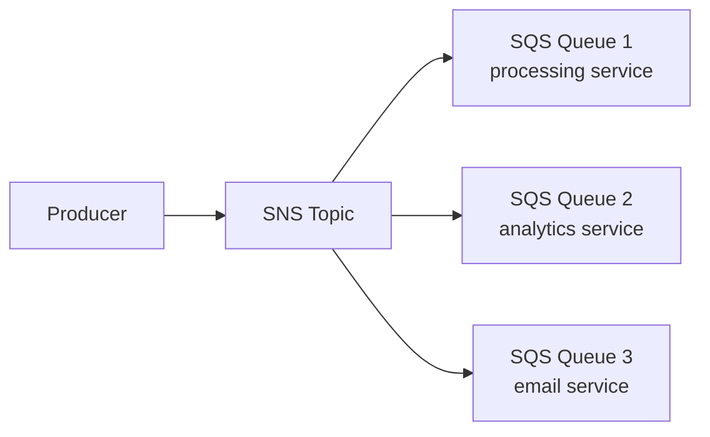

# Вопросы на собеседовании: `AWS SQS и SNS`

**SQS (Simple Queue Service)** — управляемая очередь сообщений (point-to-point). **SNS (Simple Notification Service)** — управляемый pub/sub (один-ко-многим). Используются вместе для событийных (event-driven) AWS-архитектур. **EventBridge** — современная альтернатива для сложной маршрутизации событий.

## Полезные ссылки

### Официальная документация и авторитетные источники

- [AWS SQS Documentation](https://docs.aws.amazon.com/sqs/)
- [AWS SNS Documentation](https://docs.aws.amazon.com/sns/)
- [AWS EventBridge Documentation](https://docs.aws.amazon.com/eventbridge/)
- [SQS Best Practices](https://docs.aws.amazon.com/AWSSimpleQueueService/latest/SQSDeveloperGuide/sqs-best-practices.html)

## Содержание

- [Полезные ссылки](#полезные-ссылки)
- [See also](#see-also)

**SQS базовые**
- [Q1. (!) Что такое SQS?](#q1--что-такое-sqs)
- [Q2. (!) Чем отличаются Standard и FIFO очереди?](#q2--чем-отличаются-standard-и-fifo-очереди)
- [Q3. (!) Каков жизненный цикл сообщения (send → receive → delete)?](#q3--каков-жизненный-цикл-сообщения-send--receive--delete)
- [Q4. (!) Что такое visibility timeout?](#q4--что-такое-visibility-timeout)
- [Q5. Чем long polling отличается от short polling?](#q5-чем-long-polling-отличается-от-short-polling)

**SQS advanced**
- [Q6. (!) Что такое Dead Letter Queue (DLQ)?](#q6--что-такое-dead-letter-queue-dlq)
- [Q7. Что такое message attributes?](#q7-что-такое-message-attributes)
- [Q8. (!) Как в FIFO-очередях работают дедупликация и message groups?](#q8--как-в-fifo-очередях-работают-дедупликация-и-message-groups)
- [Q9. Что такое delay queues?](#q9-что-такое-delay-queues)
- [Q10. Какой лимит на размер сообщения?](#q10-какой-лимит-на-размер-сообщения)

**SNS базовые**
- [Q11. (!) Что такое SNS?](#q11--что-такое-sns)
- [Q12. (!) Чем различаются типы топиков SNS (Standard и FIFO)?](#q12--чем-различаются-типы-топиков-sns-standard-и-fifo)
- [Q13. Какие бывают протоколы подписки?](#q13-какие-бывают-протоколы-подписки)
- [Q14. (!) Как работает фильтрация сообщений в SNS?](#q14--как-работает-фильтрация-сообщений-в-sns)

**Combined patterns**
- [Q15. (!) Как устроен паттерн fanout (SNS → SQS)?](#q15--как-устроен-паттерн-fanout-sns--sqs)
- [Q16. (!) Как связать SNS и Lambda?](#q16--как-связать-sns-и-lambda)
- [Q17. Как Lambda триггерится от SQS?](#q17-как-lambda-триггерится-от-sqs)

**EventBridge**
- [Q18. (!) Чем EventBridge отличается от SQS/SNS?](#q18--чем-eventbridge-отличается-от-sqssns)
- [Q19. Что такое rules, schemas и replay в EventBridge?](#q19-что-такое-rules-schemas-и-replay-в-eventbridge)

**Production**
- [Q20. (!) Когда выбирать SQS, SNS, EventBridge или Kafka?](#q20--когда-выбирать-sqs-sns-eventbridge-или-kafka)
- [Q21. Как устроено ценообразование SQS и SNS?](#q21-как-устроено-ценообразование-sqs-и-sns)
- [Q22. Какие частые проблемы и как их избежать?](#q22-какие-частые-проблемы-и-как-их-избежать)

## Q1. (!) Что такое SQS?

**Amazon SQS (Simple Queue Service)** — полностью управляемая очередь сообщений по принципу point-to-point: продьюсер кладёт сообщение, один консьюмер его забирает и удаляет. Это один из старейших сервисов AWS (с 2006 года), и вся инфраструктура брокера (серверы, репликация, хранение) спрятана за API — своих очередей держать не нужно.

**Почему это удобно:**
- **Управляемость** — нет серверов очередей, патчей и капасити-планирования; есть только три вызова: `SendMessage`, `ReceiveMessage`, `DeleteMessage`.
- **Высокая доступность** — каждое сообщение реплицируется по нескольким зонам доступности (AZ), поэтому очередь переживает отказ зоны.
- **Масштабирование без лимита** — пропускная способность Standard растёт автоматически под нагрузку.
- **Оплата по факту** — $0.40 за миллион запросов, без фиксированной платы за простой.

**Два типа очередей:**
- **Standard** — высокая пропускная способность, доставка at-least-once, порядок best-effort.
- **FIFO** — строгий порядок и exactly-once ценой ограниченного throughput.

**Сценарии применения:**
- Развязка (decoupling) микросервисов — продьюсер не ждёт консьюмера.
- Фоновая обработка задач воркерами на EC2 или Lambda.
- Буферизация пиков трафика: всплеск в чёрную пятницу гасится очередью, а не падением сервиса оформления.
- Интеграция между сервисами AWS.

**Подводный камень:** Standard может переупорядочить и продублировать сообщения, поэтому консьюмеры обязаны быть идемпотентными. Строгий порядок и exactly-once — это уже FIFO.

## Q2. (!) Чем отличаются Standard и FIFO очереди?

Разница в трёх свойствах: гарантии доставки, порядок и пропускная способность. Standard жертвует порядком и точностью ради неограниченного throughput; FIFO даёт строгий порядок и exactly-once, но упирается в лимит сообщений в секунду.

| Критерий | Standard | FIFO |
|----------|----------|------|
| Доставка | At-least-once | **Exactly-once** |
| Порядок | Best-effort, **возможна перестановка** | **Строгий FIFO** |
| Пропускная способность | **Неограниченная** | 300 msg/sec (3000 с батчингом) |
| Стоимость | $0.40/M | $0.50/M |
| Суффикс | `.fifo` обязателен в имени | — |
| Дедупликация | Нет (обрабатываешь сам) | Встроенная (окно 5 минут) |
| Message Groups | Нет | Да (параллельная обработка внутри FIFO) |

**Как выбрать:**
- **Standard** — дефолт для большинства задач, если консьюмер идемпотентен и переживёт случайный дубль или перестановку.
- **FIFO** — когда дубликат или нарушение порядка приводят к ошибке: финансовые операции, обработка событий одной сущности по порядку.

**Эмпирическое правило:** начинай со Standard; переходи на FIFO, только когда порядок или exactly-once реально критичны — за них платишь и деньгами, и потолком пропускной способности.

## Q3. (!) Каков жизненный цикл сообщения (send → receive → delete)?

Ключевая идея: получение и удаление — это два разных шага. ReceiveMessage не удаляет сообщение, а лишь прячет его на время обработки; убирает его из очереди только явный DeleteMessage. Поэтому потеря сообщения при падении консьюмера невозможна — оно вернётся.

```
1. Producer → SendMessage → SQS
2. SQS stores message (durably, replicated)
3. Consumer → ReceiveMessage → SQS
4. SQS marks message "in-flight" (invisible)
5. Consumer processes message
6. Consumer → DeleteMessage → SQS removes message
```

Если консьюмер **не удалил** сообщение в пределах visibility timeout (упал, завис, не успел), оно снова становится видимым и **доставляется повторно** — другому консьюмеру или тому же.

**Главное правило:** вызывай DeleteMessage только **после успешной обработки**. Удалишь раньше — потеряешь сообщение при сбое; не удалишь вовсе — получишь дубликат после истечения таймаута.

## Q4. (!) Что такое visibility timeout?

**Visibility timeout** — это окно (по умолчанию 30 секунд), на которое сообщение становится **невидимым** для остальных консьюмеров сразу после того, как один из них его получил (receive). Смысл — дать консьюмеру время обработать и удалить сообщение, не отдавая его параллельно другим. Если он не успел и не удалил — окно истекает, сообщение снова видно и уходит на повторную доставку.

```
T=0:  Consumer A receives message X
T=0-30s: X invisible, A processing
T=30s: If A не deleted X → visible again, может быть received by B
T=30s: A finally deletes X → too late, B already processing
       → DUPLICATE PROCESSING
```

Здесь A удалил сообщение слишком поздно: окно уже истекло, B успел получить копию — отсюда дублирующая обработка. **Поэтому visibility timeout всегда ставят с запасом — больше ожидаемого времени обработки.**

```python
sqs.create_queue(QueueName='my-queue', Attributes={'VisibilityTimeout': '300'})
```

**Heartbeating** — если время обработки заранее неизвестно, продлевай видимость прямо во время работы, чтобы окно не истекло на долгой задаче:
```python
sqs.change_message_visibility(QueueUrl=..., ReceiptHandle=..., VisibilityTimeout=600)
```

## Q5. Чем long polling отличается от short polling?

Разница в том, как ReceiveMessage ведёт себя на пустой очереди. Short polling отвечает мгновенно (часто пустым результатом), а long polling держит соединение и ждёт, пока сообщение появится. Это влияет и на стоимость, и на полноту выборки.

**Short polling (по умолчанию):**
- Возвращает результат сразу, даже если очередь пуста — а значит на пустой очереди клиент крутит цикл из пустых ответов.
- Опрашивает лишь часть SQS-серверов, поэтому может вернуть «пусто», хотя сообщения есть на других серверах.
- Много API-вызовов вхолостую = выше счёт.

**Long polling:**
- Ждёт до **20 секунд** появления сообщения — один вызов вместо сотен пустых.
- Опрашивает все SQS-серверы, поэтому возвращает сообщение, как только оно появилось.
- Меньше API-вызовов и ниже latency доставки.

```python
sqs.receive_message(
    QueueUrl=...,
    WaitTimeSeconds=20  # long polling
)
```

**Рекомендация:** включай long polling почти всегда (`WaitTimeSeconds` от 1 до 20) — он одновременно дешевле и быстрее, потому что убирает холостой опрос пустой очереди.

## Q6. (!) Что такое Dead Letter Queue (DLQ)?

**DLQ** — отдельная очередь, куда SQS складывает «ядовитые» сообщения, которые **не удалось обработать** заданное число раз подряд. Без неё сбойное сообщение крутилось бы в основной очереди бесконечно (или потерялось), отравляя обработку; DLQ изолирует его, чтобы разобраться вручную, а здоровый поток шёл дальше.

```
Main Queue
  ↓ message processed (failed N times)
DLQ
  ↓ manual investigation
```

**Настройка:**
```python
sqs.set_queue_attributes(
    QueueUrl='main-queue',
    Attributes={
        'RedrivePolicy': json.dumps({
            'deadLetterTargetArn': dlq_arn,
            'maxReceiveCount': 5
        })
    }
)
```

`maxReceiveCount` — это число получений: после 5 неудачных receive (то есть сообщение прочитали, но так и не удалили) SQS сам перемещает его в DLQ.

**Зачем нужна DLQ:**
- Разбор сбоев — видно, какие именно сообщения и почему падают.
- Повторная обработка (replay): после фикса бага сообщения из DLQ можно вернуть в основную очередь.
- Алерт по глубине DLQ — рост означает проблему в обработке.

**Рекомендация:** DLQ обязательна для любой production-очереди — иначе ядовитое сообщение либо теряется, либо бесконечно блокирует обработку.

## Q7. Что такое message attributes?

**Message attributes** — структурированные метаданные, которые едут рядом с сообщением, **отдельно от тела (body)**. Их можно прочитать, не разбирая body, поэтому маршрутизация и фильтрация работают по атрибутам без парсинга полезной нагрузки.

```python
sqs.send_message(
    QueueUrl=...,
    MessageBody='order data...',
    MessageAttributes={
        'OrderType': {'StringValue': 'priority', 'DataType': 'String'},
        'OrderValue': {'StringValue': '1000', 'DataType': 'Number'}
    }
)
```

**Зачем нужны:**
- Фильтрация — фильтры подписок SNS (FilterPolicy) матчат именно по атрибутам.
- Маршрутизация — направить сообщение по типу, не открывая body.
- Лёгкий доступ к метаданным без десериализации тела.

**Лимит:** 10 атрибутов на сообщение.

## Q8. (!) Как в FIFO-очередях работают дедупликация и message groups?

Это два механизма FIFO, решающие разные задачи: дедупликация защищает от повторной отправки одного и того же сообщения, а message groups определяют, что внутри очереди упорядочено, а что может идти параллельно.

**Дедупликация** — гарантирует exactly-once в пределах окна:
- Окно дедупликации — **5 минут**: повторная отправка с тем же ключом в этом окне отбрасывается.
- Ключ задаётся двумя способами:
  - **На основе содержимого** — SQS сам берёт хеш тела (body); одинаковые тела считаются дублем.
  - **Явно через** `MessageDeduplicationId` — когда тела могут совпадать, но это разные события.

```python
sqs.send_message(
    QueueUrl='my-queue.fifo',
    MessageBody='order',
    MessageDeduplicationId='order-12345'  # dedup key
)
```

**Message Groups** — порядок там, где нужно, параллелизм там, где можно:
- `MessageGroupId` = единица упорядочивания и параллелизма.
- Внутри одной группы — **строгий FIFO**; между разными группами сообщения обрабатываются **параллельно**.
- Идея: брать естественный ключ (например, ID клиента) как group ID — события одного клиента идут по порядку, а разные клиенты не блокируют друг друга.

```python
sqs.send_message(
    QueueUrl=...,
    MessageBody='order',
    MessageGroupId='customer-12345'  # ordered per customer
)
```

**Пропускная способность FIFO масштабируется через группы:** лимит 300 msg/sec считается на группу, поэтому чем больше разных group ID, тем выше суммарный throughput. Один общий group ID для всего — частая ошибка: он сериализует всю очередь в один поток.

## Q9. Что такое delay queues?

**Delay** позволяет отложить момент, когда сообщение станет видимым консьюмеру: оно уже в очереди, но «прорастает» только спустя заданную задержку. Это отличается от visibility timeout — задержка применяется при отправке, до первого получения.

**Задержка на уровне очереди** — действует на все сообщения:
```python
sqs.create_queue(Attributes={'DelaySeconds': '900'})  # 15 min
```

**Задержка на уровне отдельного сообщения** — только для Standard-очередей:
```python
sqs.send_message(
    QueueUrl=...,
    MessageBody='retry me later',
    DelaySeconds=300  # 5 min
)
```

**Максимальная задержка:** 15 минут.

**Сценарии применения:**
- Отложенный повтор (retry) — вернуть сбойную задачу через паузу, а не сразу.
- Обработка по расписанию — выполнить чуть позже момента отправки.
- Сглаживание нагрузки (rate limiting) — разнести сообщения во времени.

## Q10. Какой лимит на размер сообщения?

**Максимальный размер одного сообщения — 256 КБ** (тело плюс атрибуты). Это жёсткое ограничение SQS, поэтому крупные полезные нагрузки нельзя класть напрямую.

**Что делать с большими payload-ами:** применяй **Extended Client Library** — паттерн claim-check: само тело (body) кладётся в S3, а в SQS едет только ссылка на объект. Консьюмер по ссылке достаёт данные из S3.

```python
# Conceptually
s3.put_object(Bucket='msg-bucket', Key='msg-123', Body=large_payload)
sqs.send_message(MessageBody=json.dumps({'s3_ref': 's3://msg-bucket/msg-123'}))
```

Extended Client Library делает это автоматически.

## Q11. (!) Что такое SNS?

**Amazon SNS (Simple Notification Service)** — управляемый сервис обмена сообщениями по модели pub/sub (один-ко-многим). В отличие от SQS, где сообщение забирает один консьюмер, в SNS одна публикация доставляется **всем подписчикам сразу**.

**Паттерн:** publisher публикует в topic → SNS веером рассылает копию каждому subscriber-у. Publisher не знает, кто и сколько подписчиков, — это и есть развязка.

**Типы подписчиков (куда SNS умеет доставлять):**
- HTTP/HTTPS endpoints (вебхуки)
- Email
- SMS
- Mobile push (iOS, Android)
- SQS-очереди
- Lambda-функции
- Kinesis Data Firehose

**Сценарии применения:** push-уведомления, fanout одного события на несколько систем, рассылка событий множеству независимых подписчиков.

## Q12. (!) Чем различаются типы топиков SNS (Standard и FIFO)?

Как и у SQS, выбор — это компромисс между порядком/точностью и пропускной способностью. Но у FIFO-топика есть важное ограничение по подписчикам.

| Standard SNS | FIFO SNS |
|--------------|----------|
| At-least-once | **Exactly-once** |
| Порядок best-effort | **Строгий порядок** |
| Высокая пропускная способность | Ниже пропускная способность |
| Все типы подписчиков | **Только SQS FIFO**-подписчики |

**Ключевое ограничение:** FIFO-топик умеет доставлять только в FIFO SQS-очереди — ни email, ни Lambda, ни HTTP к нему не подключишь. Поэтому FIFO SNS почти всегда идёт в паре с FIFO SQS, образуя сквозной упорядоченный pipeline с дедупликацией от публикации до обработки.

## Q13. Какие бывают протоколы подписки?

Протокол подписки задаёт, **куда** SNS доставит сообщение. Один topic может одновременно иметь подписчиков разных протоколов — например, и SQS-очередь, и Lambda, и email.

```python
# HTTPS endpoint
sns.subscribe(TopicArn=topic_arn, Protocol='https', Endpoint='https://my.api/webhook')

# SQS queue
sns.subscribe(TopicArn=topic_arn, Protocol='sqs', Endpoint=queue_arn)

# Lambda
sns.subscribe(TopicArn=topic_arn, Protocol='lambda', Endpoint=function_arn)

# Email
sns.subscribe(TopicArn=topic_arn, Protocol='email', Endpoint='alice@example.com')

# SMS
sns.subscribe(TopicArn=topic_arn, Protocol='sms', Endpoint='+1234567890')
```

**Подтверждение подписки:** для HTTP/email/SMS требуется confirmation — SNS шлёт на endpoint запрос, и подписка активируется только после явного согласия. Это защита от рассылки на чужой адрес. Для SQS и Lambda подтверждение не нужно — доступ регулируется IAM-политиками.

## Q14. (!) Как работает фильтрация сообщений в SNS?

**Фильтрация сообщений (FilterPolicy)** позволяет подписчику получать не всё подряд из топика, а только сообщения, чьи атрибуты совпадают с его фильтром. SNS проверяет атрибуты публикации на стороне сервиса и доставляет сообщение подписчику лишь при совпадении — лишний трафик до консьюмера просто не доходит.

```python
sns.subscribe(
    TopicArn=topic_arn,
    Protocol='sqs',
    Endpoint=queue_arn,
    Attributes={
        'FilterPolicy': json.dumps({
            'event_type': ['order_created', 'order_updated'],
            'priority': ['high']
        })
    }
)
```

Publisher отправляет с атрибутами:
```python
sns.publish(
    TopicArn=topic_arn,
    Message='Order data',
    MessageAttributes={
        'event_type': {'DataType': 'String', 'StringValue': 'order_created'},
        'priority': {'DataType': 'String', 'StringValue': 'high'}
    }
)
```

**Зачем это нужно:** один topic с фильтрами на подписках заменяет десяток узких топиков. Подписчик получает только нужные ему события, маршрутизация остаётся на стороне SNS, а добавление нового получателя не требует менять publisher.

## Q15. (!) Как устроен паттерн fanout (SNS → SQS)?

Fanout — это связка, где SNS-топик публикует событие сразу в несколько SQS-очередей, по одной на каждого потребителя. Так получают и широковещательность SNS, и буферизацию с надёжной обработкой от SQS: SNS разносит копии, а каждая очередь сглаживает нагрузку своего консьюмера.



**Один publish** → SNS кладёт копию сообщения в несколько SQS-очередей.

**Почему именно так, а не SNS напрямую к консьюмерам:**
- **Развязка** publisher-ов и consumer-ов — продьюсер не знает о получателях.
- **Своя очередь у каждого подписчика** — сервисы обрабатывают события в своём темпе и не мешают друг другу; медленный консьюмер не тормозит остальных.
- **Своя DLQ на каждую очередь** — у каждого потребителя независимая стратегия retry и изоляция сбоев.
- **Новый подписчик добавляется без изменения кода** publisher-а — достаточно подписать ещё одну очередь.

**Это стандартный паттерн** событийной (event-driven) архитектуры в AWS.

## Q16. (!) Как связать SNS и Lambda?

Lambda подписывается на SNS-топик напрямую: при публикации SNS асинхронно вызывает функцию и передаёт сообщение в `event`. Очередь между ними не нужна — SNS сам инициирует вызов.

```python
# Lambda subscribed к SNS topic
def handler(event, context):
    for record in event['Records']:
        message = json.loads(record['Sns']['Message'])
        process(message)
```

**Вызов асинхронный:** SNS публикует и не ждёт ответа, Lambda обрабатывает сообщение в фоне.

**Сценарии применения:**
- Реакция на событие: уведомление → Lambda → обработка.
- Fanout на несколько функций — одна публикация запускает сразу несколько Lambda, у каждой своя логика.

**Подводный камень:** при ошибке Lambda делает несколько повторов, но после исчерпания попыток сообщение **теряется**, если не настроена DLQ на самой функции. Для асинхронных вызовов DLQ задаётся отдельно — не забудь её повесить.

## Q17. Как Lambda триггерится от SQS?

Здесь направление обратное Q16: не SNS зовёт Lambda, а сама Lambda через event source mapping **автоматически опрашивает** SQS-очередь (доступно с 2018 года) и вызывает функцию батчами сообщений. Свой воркер-поллер писать не нужно — это делает runtime Lambda.

```yaml
Events:
  MyQueueTrigger:
    Type: SQS
    Properties:
      Queue: !GetAtt MyQueue.Arn
      BatchSize: 10
```

**Масштабирование конкурентности:**
- Lambda сама поднимает число параллельных воркеров под глубину очереди.
- По умолчанию — до 1000 одновременных вызовов.
- Чтобы не выесть весь лимит аккаунта одной очередью, ставят **reserved concurrency**.

**Подводный камень:** visibility timeout очереди должен быть **значительно больше** таймаута Lambda — рекомендуется 6×. Иначе сообщение станет видимым раньше, чем функция закончит, и уйдёт на повторную обработку, пока первая ещё идёт → дубликаты.

Подробнее — в [AWS Lambda](../cloud/aws-lambda-interview.md).

## Q18. (!) Чем EventBridge отличается от SQS/SNS?

**EventBridge** (бывший CloudWatch Events) — это шина событий (event bus): не просто доставка, а маршрутизация событий по содержимому с богатой фильтрацией. SQS — это очередь воркеров, SNS — широковещательный fanout, а EventBridge — слой умной маршрутизации над ними, заточенный под интеграцию сервисов.

| Сервис | Паттерн | Лучше всего для |
|---------|---------|----------|
| **SQS** | Очередь (point-to-point) | Очереди воркеров |
| **SNS** | Pub/sub | Fanout-уведомления |
| **EventBridge** | Шина событий + сложная маршрутизация | События между сервисами, SaaS-интеграции |

**Что EventBridge даёт сверх SNS:**
- **Schema registry** — реестр схем событий с генерацией кода под типобезопасность.
- **Event replay** — архив событий, который можно перепроиграть для восстановления или тестов.
- **100+ готовых SaaS-интеграций** (Stripe, Shopify, Auth0 и др.) — события извне без своих вебхуков.
- **Мощная фильтрация по rule patterns** — маршрутизация по любому полю события, а не только по атрибутам.
- **Cross-account доставка** — события между разными AWS-аккаунтами.

**Компромисс — цена:** EventBridge стоит $1 за миллион событий против $0.50 у SNS, то есть вдвое дороже. Платишь за маршрутизацию, схемы и replay.

К **2025 году** EventBridge стал **выбором по умолчанию** для новых событийных систем; SNS остаётся там, где нужен простой дешёвый fanout.

## Q19. Что такое rules, schemas и replay в EventBridge?

Это три кита EventBridge. **Rules** решают, какие события куда отправить; **schema registry** описывает форму событий; **archive + replay** хранит историю для повторной обработки.

**Rules (правила)** — матчат событие по pattern и направляют его одной или нескольким целям (targets). Pattern проверяет содержимое события, а не только тип — можно отфильтровать, например, по сумме заказа.

```json
{
  "source": ["custom.orders"],
  "detail-type": ["Order Created"],
  "detail": {
    "amount": [{"numeric": [">", 1000]}]
  }
}
```

**Targets (цели):** одно правило может разослать событие сразу нескольким целям — Lambda, SQS, SNS, Kinesis, Step Functions, ECS task и т.д.

**Schema registry** — хранит схемы событий и генерирует по ним код (TypeScript, Java), чтобы работать с событиями типобезопасно, а не парсить сырой JSON.

**Archive + replay** — архивирует прошедшие события и позволяет перепроиграть их позже: восстановить состояние после инцидента или прогнать на них новую логику при тестировании.

## Q20. (!) Когда выбирать SQS, SNS, EventBridge или Kafka?

Коротко: SQS — рабочая очередь для одного потребителя, SNS — широковещание на многих, EventBridge — умная маршрутизация и интеграции, Kafka/Kinesis — стриминг с перемоткой и высокой пропускной. Схема ниже сводит выбор к нескольким вопросам.

```
Need point-to-point queue с processing?
  → SQS

Need notify multiple subscribers (fanout)?
  → SNS (или SNS → SQS)

Need complex routing, schemas, SaaS integration?
  → EventBridge

Need stream processing, replay, high throughput, ordering?
  → Kafka (MSK) или Kinesis

Microservices on AWS, simple events?
  → EventBridge

Existing Kafka ecosystem?
  → Kafka
```

**Эмпирическое правило (современный AWS-native-стек):** EventBridge как шина событий между сервисами + SQS как рабочие очереди под каждым консьюмером. Kafka берут, когда уже есть его экосистема или нужен долгий лог с перемоткой и очень высокий throughput.

## Q21. Как устроено ценообразование SQS и SNS?

Все три сервиса тарифицируются по числу операций, без платы за простой. Но у каждого своя ставка, а у SNS поверх неё ещё и стоимость доставки.

**SQS** — за запросы:
- $0.40 за миллион запросов (Standard)
- $0.50 за миллион (FIFO)
- Free tier: 1 миллион запросов в месяц

**SNS** — за публикации плюс доставка:
- $0.50 за миллион publish-ей
- сверху — стоимость доставки, зависящая от протокола
- Email: $2 за 100K
- SMS: ~$0.00645 за сообщение (US, варьируется)

**EventBridge:**
- $1 за миллион событий
- плюс затраты на scheduler

**Скрытая статья расходов:** исходящий трафик AWS (data transfer out) — особенно межрегиональный; его легко упустить в расчётах.

**Оптимизация:** батчинг — до 10 сообщений за один API-вызов. Это и есть главный рычаг снижения счёта, потому что платишь за число запросов.

## Q22. Какие частые проблемы и как их избежать?

Большинство инцидентов с SQS/SNS сводятся к трём корням: потеря сообщений, дубликаты и неконтролируемая стоимость. Список ниже — типичные грабли по этим темам.

1. **Нет DLQ** — сбойные сообщения теряются или вечно крутятся в очереди.
2. **Слишком короткий visibility timeout** — сообщение становится видимым до конца обработки → дубликаты.
3. **Не включён long polling** — масса пустых вызовов раздувает счёт.
4. **Слишком агрессивный polling** — то же самое: лишние запросы = лишние деньги.
5. **Консьюмеры не идемпотентны** — at-least-once неизбежно даёт дубли, и без идемпотентности они ломают данные.
6. **Захардкоженные credentials** вместо IAM-ролей — дыра в безопасности.
7. **Кросс-региональный трафик** — дорого по data transfer и медленно по latency.
8. **Сообщения > 256 КБ** без Extended Client — отправка падает на лимите.
9. **Неверное понимание FIFO-порядка** — забыли, что порядок только внутри group ID, и получили либо хаос, либо сериализацию всего в один поток.
10. **Нет мониторинга** глубины очереди и возраста самого старого сообщения — деградацию замечают, когда уже поздно.

**Рекомендации:**
- CloudWatch-алармы на глубину очереди и возраст самого старого сообщения — ранний сигнал отставания консьюмера.
- DLQ обязательна для любой production-очереди.
- Делай консьюмеры идемпотентными — это страховка от неизбежных дубликатов.
- Доступ только через IAM-роли, а не статические ключи.

## See also

- [Apache Kafka](kafka-interview.md) — alternative
- [RabbitMQ](rabbitmq-interview.md) — другой alternative
- [NATS](nats-interview.md) — lightweight alternative
- [Apache Pulsar](pulsar-interview.md) — cloud-native alternative
- [Message Brokers Comparison](message-brokers-comparison-interview.md) — overview
- [AWS](../cloud/aws-interview.md) — context
- [AWS Lambda](../cloud/aws-lambda-interview.md) — common consumer
- [Serverless](../cloud/serverless-interview.md) — SQS triggers
- [Event-driven Patterns](../architecture/event-driven-patterns-interview.md) — concepts
- [Микросервисы](../architecture/microservices-interview.md) — decoupling
- [Saga Pattern](../architecture/saga-pattern-interview.md) — SQS for sagas
- [Resilience Patterns](../architecture/resilience-patterns-interview.md) — retries, DLQ

- [Сравнение Message Brokers](message-brokers-comparison-interview.md)
- [NATS](nats-interview.md)
- [Apache Pulsar](pulsar-interview.md)
- [RabbitMQ](rabbitmq-interview.md)
- [Redpanda](redpanda-interview.md)
