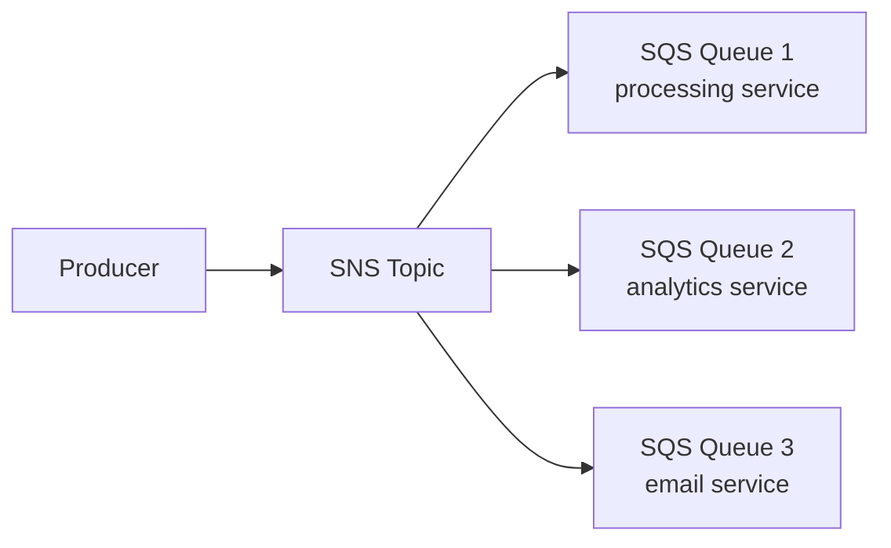

# Вопросы на собеседовании: `AWS SQS и SNS`

**SQS (Simple Queue Service)** — управляемая очередь сообщений (point-to-point). **SNS (Simple Notification Service)** — управляемый pub/sub (один-ко-многим). Используются вместе для событийных (event-driven) AWS-архитектур. **EventBridge** — современная альтернатива для сложной маршрутизации событий.

## Полезные ссылки

### Официальная документация и авторитетные источники

- [AWS SQS Documentation](https://docs.aws.amazon.com/sqs/)
- [AWS SNS Documentation](https://docs.aws.amazon.com/sns/)
- [AWS EventBridge Documentation](https://docs.aws.amazon.com/eventbridge/)
- [SQS Best Practices](https://docs.aws.amazon.com/AWSSimpleQueueService/latest/SQSDeveloperGuide/sqs-best-practices.html)

## Содержание

- [Полезные ссылки](#полезные-ссылки)
- [See also](#see-also)

**SQS базовые**
- [Q1. (!) Что такое SQS?](#q1--что-такое-sqs)
- [Q2. (!) Standard vs FIFO queues?](#q2--standard-vs-fifo-queues)
- [Q3. (!) Message lifecycle (send → receive → delete)?](#q3--message-lifecycle-send--receive--delete)
- [Q4. (!) Visibility timeout?](#q4--visibility-timeout)
- [Q5. Long polling vs Short polling?](#q5-long-polling-vs-short-polling)

**SQS advanced**
- [Q6. (!) Dead Letter Queue (DLQ)?](#q6--dead-letter-queue-dlq)
- [Q7. Message attributes?](#q7-message-attributes)
- [Q8. (!) FIFO queues — deduplication, message groups?](#q8--fifo-queues--deduplication-message-groups)
- [Q9. Delay queues?](#q9-delay-queues)
- [Q10. Message size limit?](#q10-message-size-limit)

**SNS базовые**
- [Q11. (!) Что такое SNS?](#q11--что-такое-sns)
- [Q12. (!) Topic types (Standard vs FIFO)?](#q12--topic-types-standard-vs-fifo)
- [Q13. Subscription protocols?](#q13-subscription-protocols)
- [Q14. (!) SNS message filtering?](#q14--sns-message-filtering)

**Combined patterns**
- [Q15. (!) Fanout pattern (SNS → SQS)?](#q15--fanout-pattern-sns--sqs)
- [Q16. (!) SNS + Lambda?](#q16--sns--lambda)
- [Q17. SQS → Lambda triggers?](#q17-sqs--lambda-triggers)

**EventBridge**
- [Q18. (!) EventBridge vs SQS/SNS?](#q18--eventbridge-vs-sqssns)
- [Q19. EventBridge rules, schemas, replay?](#q19-eventbridge-rules-schemas-replay)

**Production**
- [Q20. (!) When SQS vs SNS vs EventBridge vs Kafka?](#q20--when-sqs-vs-sns-vs-eventbridge-vs-kafka)
- [Q21. Pricing (SQS, SNS)?](#q21-pricing-sqs-sns)
- [Q22. Какие частые проблемы?](#q22-какие-частые-проблемы)

## Q1. (!) Что такое SQS?

(!) Что такое SQS?

**Amazon SQS (Simple Queue Service)** — полностью управляемый сервис очередей сообщений. Один из старейших сервисов AWS (с 2006 года).

**Особенности:**
- **Полностью управляемый** — никакой инфраструктуры
- **Высокодоступный** — распределён по зонам доступности (AZ)
- **Оплата за запрос** — $0.40 за миллион запросов
- **Неограниченное масштабирование**
- **Два типа** — Standard (высокая пропускная способность) и FIFO (порядок)

**Применения:**
- Развязка (decoupling) микросервисов
- Фоновая обработка задач
- Буферизация для пиков трафика
- Интеграция между сервисами AWS

## Q2. (!) Standard vs FIFO queues?

| Критерий | Standard | FIFO |
|----------|----------|------|
| Доставка | At-least-once | **Exactly-once** |
| Порядок | Best-effort, **возможна перестановка** | **Строгий FIFO** |
| Пропускная способность | **Неограниченная** | 300 msg/sec (3000 с батчингом) |
| Стоимость | $0.40/M | $0.50/M |
| Суффикс | `.fifo` обязателен в имени | — |
| Дедупликация | Нет (обрабатываешь сам) | Встроенная (окно 5 минут) |
| Message Groups | Нет | Да (параллельная обработка внутри FIFO) |

**Standard** — для большинства случаев (идемпотентная обработка).
**FIFO** — когда критичны **строгий порядок** и **exactly-once** (финансы, упорядоченность).

## Q3. (!) Message lifecycle (send → receive → delete)?

```
1. Producer → SendMessage → SQS
2. SQS stores message (durably, replicated)
3. Consumer → ReceiveMessage → SQS
4. SQS marks message "in-flight" (invisible)
5. Consumer processes message
6. Consumer → DeleteMessage → SQS removes message
```

**Если consumer не удаляет** сообщение в пределах visibility timeout → оно снова становится видимым и **доставляется повторно**.

**Важно:** **удалять только после успешной обработки**.

## Q4. (!) Visibility timeout?

**Visibility timeout** — период (по умолчанию 30 сек), в течение которого сообщение **невидимо** для других consumer-ов после получения (receive).

```
T=0:  Consumer A receives message X
T=0-30s: X invisible, A processing
T=30s: If A не deleted X → visible again, может быть received by B
T=30s: A finally deletes X → too late, B already processing
       → DUPLICATE PROCESSING
```

**Ставь visibility timeout > ожидаемого времени обработки**.

```python
sqs.create_queue(QueueName='my-queue', Attributes={'VisibilityTimeout': '300'})
```

**Heartbeating** — продлевай видимость во время обработки:
```python
sqs.change_message_visibility(QueueUrl=..., ReceiptHandle=..., VisibilityTimeout=600)
```

## Q5. Long polling vs Short polling?

**Short polling (по умолчанию):**
- Возвращает результат сразу (даже если очередь пуста)
- Опрашивает лишь часть SQS-серверов (может пропустить сообщения)
- Больше API-вызовов = выше стоимость

**Long polling:**
- Ждёт до **20 сек** появления сообщения
- Опрашивает все SQS-серверы
- Меньше API-вызовов
- **Рекомендуется**

```python
sqs.receive_message(
    QueueUrl=...,
    WaitTimeSeconds=20  # long polling
)
```

**Почти всегда используй long polling** — дешевле и быстрее (без постоянного опроса).

## Q6. (!) Dead Letter Queue (DLQ)?

**DLQ** — отдельная очередь для сообщений, которые **не удалось обработать** несколько раз подряд.

```
Main Queue
  ↓ message processed (failed N times)
DLQ
  ↓ manual investigation
```

**Настройка:**
```python
sqs.set_queue_attributes(
    QueueUrl='main-queue',
    Attributes={
        'RedrivePolicy': json.dumps({
            'deadLetterTargetArn': dlq_arn,
            'maxReceiveCount': 5
        })
    }
)
```

После 5 попыток получения (receive) → SQS перемещает сообщение в DLQ.

**Сценарии использования:**
- Разбор сбоев
- Повторная обработка (replay) после исправления бага
- Алерт по глубине DLQ

**DLQ обязательна** для production-очередей.

## Q7. Message attributes?

**Attributes** — метаданные в сообщении (отдельно от тела body).

```python
sqs.send_message(
    QueueUrl=...,
    MessageBody='order data...',
    MessageAttributes={
        'OrderType': {'StringValue': 'priority', 'DataType': 'String'},
        'OrderValue': {'StringValue': '1000', 'DataType': 'Number'}
    }
)
```

**Сценарии использования:**
- Фильтрация (фильтры подписок SNS используют их)
- Маршрутизация
- Метаданные без парсинга тела (body)

**Лимит:** 10 атрибутов на сообщение.

## Q8. (!) FIFO queues — deduplication, message groups?

**Дедупликация:**
- Встроенное окно (5 минут)
- Два способа:
  - **На основе содержимого** (хеш тела body) — автоматически
  - **Явный** `MessageDeduplicationId`

```python
sqs.send_message(
    QueueUrl='my-queue.fifo',
    MessageBody='order',
    MessageDeduplicationId='order-12345'  # dedup key
)
```

**Message Groups:**
- Group ID = единица параллельной обработки
- **FIFO внутри группы**, параллельно между группами

```python
sqs.send_message(
    QueueUrl=...,
    MessageBody='order',
    MessageGroupId='customer-12345'  # ordered per customer
)
```

**Пропускная способность** растёт с числом message groups (300 msg/sec на группу).

## Q9. Delay queues?

**Delay** — отложить появление (видимость) сообщения.

**Задержка на уровне очереди** (все сообщения):
```python
sqs.create_queue(Attributes={'DelaySeconds': '900'})  # 15 min
```

**Задержка на уровне сообщения** (только Standard):
```python
sqs.send_message(
    QueueUrl=...,
    MessageBody='retry me later',
    DelaySeconds=300  # 5 min
)
```

**Максимальная задержка:** 15 минут.

**Сценарии использования:**
- Повтор (retry) через некоторое время
- Отложенная обработка по расписанию
- Ограничение частоты (rate limiting)

## Q10. Message size limit?

**Максимальный размер сообщения:** **256 КБ**.

**Для больших:** используй **Extended Client Library** — тело (body) хранится в S3, в SQS-сообщении лежит ссылка.

```python
# Conceptually
s3.put_object(Bucket='msg-bucket', Key='msg-123', Body=large_payload)
sqs.send_message(MessageBody=json.dumps({'s3_ref': 's3://msg-bucket/msg-123'}))
```

Extended Client Library делает это автоматически.

## Q11. (!) Что такое SNS?

**Amazon SNS (Simple Notification Service)** — управляемый pub/sub-messaging.

**Паттерн:** publisher → topic → множество subscriber-ов.

**Типы подписчиков:**
- HTTP/HTTPS endpoints
- Email
- SMS
- Mobile push (iOS, Android)
- SQS-очереди
- Lambda-функции
- Kinesis Data Firehose

**Использование:** уведомления, fanout, события для множества подписчиков.

## Q12. (!) Topic types (Standard vs FIFO)?

| Standard SNS | FIFO SNS |
|--------------|----------|
| At-least-once | **Exactly-once** |
| Порядок best-effort | **Строгий порядок** |
| Высокая пропускная способность | Ниже пропускная способность |
| Все типы подписчиков | **Только SQS FIFO**-подписчики |

**FIFO SNS** обычно используется с FIFO SQS — полностью упорядоченный pipeline с дедупликацией.

## Q13. Subscription protocols?

```python
# HTTPS endpoint
sns.subscribe(TopicArn=topic_arn, Protocol='https', Endpoint='https://my.api/webhook')

# SQS queue
sns.subscribe(TopicArn=topic_arn, Protocol='sqs', Endpoint=queue_arn)

# Lambda
sns.subscribe(TopicArn=topic_arn, Protocol='lambda', Endpoint=function_arn)

# Email
sns.subscribe(TopicArn=topic_arn, Protocol='email', Endpoint='alice@example.com')

# SMS
sns.subscribe(TopicArn=topic_arn, Protocol='sms', Endpoint='+1234567890')
```

**Требуется подтверждение (confirmation)** для HTTP/email/SMS.

## Q14. (!) SNS message filtering?

**Фильтрация сообщений** — чтобы подписчики получали только подходящие (matching) сообщения.

```python
sns.subscribe(
    TopicArn=topic_arn,
    Protocol='sqs',
    Endpoint=queue_arn,
    Attributes={
        'FilterPolicy': json.dumps({
            'event_type': ['order_created', 'order_updated'],
            'priority': ['high']
        })
    }
)
```

Publisher отправляет с атрибутами:
```python
sns.publish(
    TopicArn=topic_arn,
    Message='Order data',
    MessageAttributes={
        'event_type': {'DataType': 'String', 'StringValue': 'order_created'},
        'priority': {'DataType': 'String', 'StringValue': 'high'}
    }
)
```

**Эффект:** подписчик получает только подходящие сообщения → эффективная маршрутизация без множества отдельных topic-ов.

## Q15. (!) Fanout pattern (SNS → SQS)?



**Один publish** → SNS рассылает сообщение в несколько SQS-очередей.

**Преимущества:**
- **Развязка (decoupling)** publisher-ов и consumer-ов
- **У каждого подписчика** своя очередь (независимая обработка)
- **DLQ на каждого подписчика** (разные стратегии retry)
- **Добавление подписчиков без изменения кода**

**Стандартный паттерн** для событийной (event-driven) архитектуры AWS.

## Q16. (!) SNS + Lambda?

```python
# Lambda subscribed к SNS topic
def handler(event, context):
    for record in event['Records']:
        message = json.loads(record['Sns']['Message'])
        process(message)
```

**Асинхронный вызов** — SNS публикует, Lambda обрабатывает.

**Сценарии использования:**
- Уведомление → Lambda → обработка
- Fanout на несколько Lambda (одно событие запускает много функций)

**Подвох:** если Lambda падает — выполняется retry, после исчерпания попыток → DLQ (нужно настроить).

## Q17. SQS → Lambda triggers?

Lambda **автоматически опрашивает** SQS-очередь (с 2018 года):

```yaml
Events:
  MyQueueTrigger:
    Type: SQS
    Properties:
      Queue: !GetAtt MyQueue.Arn
      BatchSize: 10
```

**Масштабирование конкурентности:**
- Lambda масштабируется под нагрузку SQS
- До 1000 одновременных вызовов (по умолчанию)
- **Reserved concurrency** — чтобы ограничить

**Подвох:** SQS visibility timeout должен быть **>> Lambda timeout** (рекомендуется 6x).

Подробнее — в [AWS Lambda](../cloud/aws-lambda-interview.md).

## Q18. (!) EventBridge vs SQS/SNS?

**EventBridge** (бывший CloudWatch Events) — современная шина событий (event bus).

| Сервис | Паттерн | Лучше всего для |
|---------|---------|----------|
| **SQS** | Очередь (point-to-point) | Очереди воркеров |
| **SNS** | Pub/sub | Fanout-уведомления |
| **EventBridge** | Шина событий + сложная маршрутизация | События между сервисами, SaaS-интеграции |

**Преимущества EventBridge:**
- **Schema registry** (реестр схем)
- **Повтор событий (event replay)**
- **100+ SaaS-интеграций** (Stripe, Shopify, Auth0, ...)
- **Мощная фильтрация** (rule patterns)
- **События между аккаунтами (cross-account)**

**Стоимость EventBridge:** $1 за миллион событий (против $0.50 у SNS). Но **функциональности больше**.

В **2025 году** — EventBridge стал **выбором по умолчанию** для новых событийных систем.

## Q19. EventBridge rules, schemas, replay?

**Rules** (правила) — сопоставляют события и направляют их к targets (целям).

```json
{
  "source": ["custom.orders"],
  "detail-type": ["Order Created"],
  "detail": {
    "amount": [{"numeric": [">", 1000]}]
  }
}
```

**Targets (цели):** Lambda, SQS, SNS, Kinesis, Step Functions, ECS task и т.д.

**Schema registry** — хранит схемы событий, генерирует код (TypeScript, Java).

**Archive + replay** — хранит события для повтора (восстановление, тестирование).

## Q20. (!) When SQS vs SNS vs EventBridge vs Kafka?

```
Need point-to-point queue с processing?
  → SQS

Need notify multiple subscribers (fanout)?
  → SNS (или SNS → SQS)

Need complex routing, schemas, SaaS integration?
  → EventBridge

Need stream processing, replay, high throughput, ordering?
  → Kafka (MSK) или Kinesis

Microservices on AWS, simple events?
  → EventBridge

Existing Kafka ecosystem?
  → Kafka
```

**Современный AWS-native-подход:** EventBridge для событий + SQS для рабочих очередей.

## Q21. Pricing (SQS, SNS)?

**SQS:**
- $0.40 за миллион запросов (Standard)
- $0.50 за миллион (FIFO)
- Free tier: 1 миллион запросов/месяц

**SNS:**
- $0.50 за миллион publish-ей
- + стоимость доставки (зависит от протокола)
- Email: $2 за 100K
- SMS: ~$0.00645 за сообщение (US, варьируется)

**EventBridge:**
- $1 за миллион событий
- + затраты на scheduler

**Скрытая статья расходов:** **исходящий трафик AWS (data transfer out)**.

**Оптимизация:** батчевые операции (10 сообщений на один API-вызов).

## Q22. Какие частые проблемы?

1. **Нет DLQ** — сбойные сообщения теряются
2. **Visibility timeout слишком короткий** — дубликаты
3. **Long polling не используется** — высокая стоимость
4. **Слишком агрессивный polling** — высокая стоимость
5. **Нет идемпотентности** в consumer-ах — дубликаты вызывают проблемы
6. **Захардкоженные credentials** вместо IAM-ролей
7. **Кросс-региональный трафик** — дорого и медленно
8. **Размер сообщения > 256 КБ** без Extended Client
9. **FIFO-порядок** понят неверно — критичен group ID
10. **Нет мониторинга** глубины очереди и возраста самого старого сообщения

**Best practice:**
- CloudWatch-алармы на глубину очереди и возраст самого старого сообщения
- DLQ обязательна
- Идемпотентные consumer-ы
- IAM-роли, а не ключи

## See also

- [Apache Kafka](kafka-interview.md) — alternative
- [RabbitMQ](rabbitmq-interview.md) — другой alternative
- [NATS](nats-interview.md) — lightweight alternative
- [Apache Pulsar](pulsar-interview.md) — cloud-native alternative
- [Message Brokers Comparison](message-brokers-comparison-interview.md) — overview
- [AWS](../cloud/aws-interview.md) — context
- [AWS Lambda](../cloud/aws-lambda-interview.md) — common consumer
- [Serverless](../cloud/serverless-interview.md) — SQS triggers
- [Event-driven Patterns](../architecture/event-driven-patterns-interview.md) — concepts
- [Микросервисы](../architecture/microservices-interview.md) — decoupling
- [Saga Pattern](../architecture/saga-pattern-interview.md) — SQS for sagas
- [Resilience Patterns](../architecture/resilience-patterns-interview.md) — retries, DLQ

- [Сравнение Message Brokers](message-brokers-comparison-interview.md)
- [NATS](nats-interview.md)
- [Apache Pulsar](pulsar-interview.md)
- [RabbitMQ](rabbitmq-interview.md)
- [Redpanda](redpanda-interview.md)
