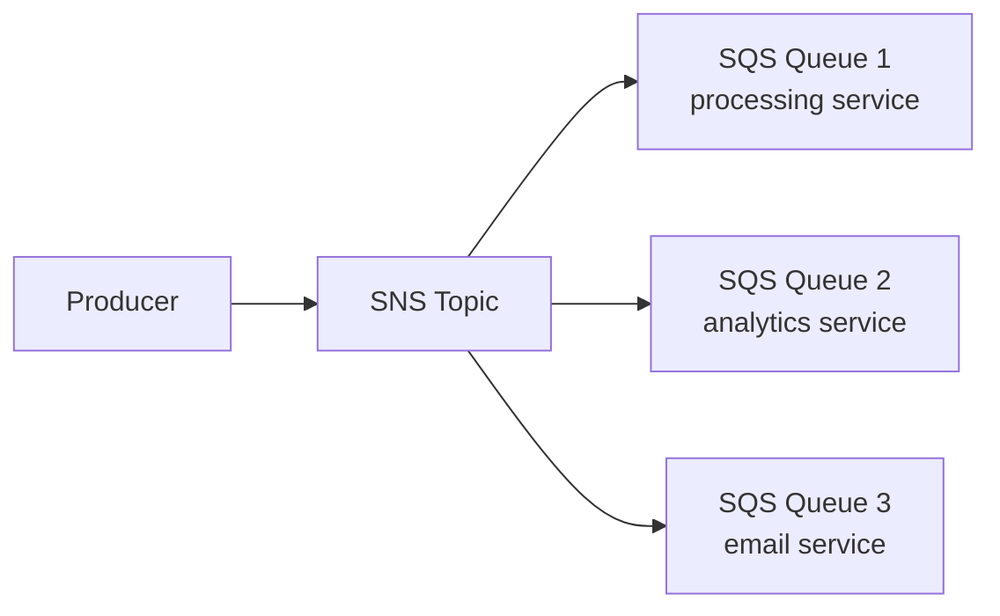

# Вопросы на собеседовании: `AWS SQS и SNS`

**SQS (Simple Queue Service)** — managed message queue (point-to-point). **SNS (Simple Notification Service)** — managed pub/sub (one-to-many). Используются вместе для **event-driven** AWS architectures. **EventBridge** — modern alternative для complex event routing.

## Полезные ссылки

### Официальная документация и авторитетные источники

- [AWS SQS Documentation](https://docs.aws.amazon.com/sqs/)
- [AWS SNS Documentation](https://docs.aws.amazon.com/sns/)
- [AWS EventBridge Documentation](https://docs.aws.amazon.com/eventbridge/)
- [SQS Best Practices](https://docs.aws.amazon.com/AWSSimpleQueueService/latest/SQSDeveloperGuide/sqs-best-practices.html)

## Содержание

- [Полезные ссылки](#полезные-ссылки)
- [See also](#see-also)

**SQS базовые**
- [Q1. (!) Что такое SQS?](#q1--что-такое-sqs)
- [Q2. (!) Standard vs FIFO queues?](#q2--standard-vs-fifo-queues)
- [Q3. (!) Message lifecycle (send → receive → delete)?](#q3--message-lifecycle-send--receive--delete)
- [Q4. (!) Visibility timeout?](#q4--visibility-timeout)
- [Q5. Long polling vs Short polling?](#q5-long-polling-vs-short-polling)

**SQS advanced**
- [Q6. (!) Dead Letter Queue (DLQ)?](#q6--dead-letter-queue-dlq)
- [Q7. Message attributes?](#q7-message-attributes)
- [Q8. (!) FIFO queues — deduplication, message groups?](#q8--fifo-queues--deduplication-message-groups)
- [Q9. Delay queues?](#q9-delay-queues)
- [Q10. Message size limit?](#q10-message-size-limit)

**SNS базовые**
- [Q11. (!) Что такое SNS?](#q11--что-такое-sns)
- [Q12. (!) Topic types (Standard vs FIFO)?](#q12--topic-types-standard-vs-fifo)
- [Q13. Subscription protocols?](#q13-subscription-protocols)
- [Q14. (!) SNS message filtering?](#q14--sns-message-filtering)

**Combined patterns**
- [Q15. (!) Fanout pattern (SNS → SQS)?](#q15--fanout-pattern-sns--sqs)
- [Q16. (!) SNS + Lambda?](#q16--sns--lambda)
- [Q17. SQS → Lambda triggers?](#q17-sqs--lambda-triggers)

**EventBridge**
- [Q18. (!) EventBridge vs SQS/SNS?](#q18--eventbridge-vs-sqssns)
- [Q19. EventBridge rules, schemas, replay?](#q19-eventbridge-rules-schemas-replay)

**Production**
- [Q20. (!) When SQS vs SNS vs EventBridge vs Kafka?](#q20--when-sqs-vs-sns-vs-eventbridge-vs-kafka)
- [Q21. Pricing (SQS, SNS)?](#q21-pricing-sqs-sns)
- [Q22. Какие частые проблемы?](#q22-какие-частые-проблемы)

## Q1. (!) Что такое SQS?

(!) Что такое SQS?

**Amazon SQS (Simple Queue Service)** — fully managed message queue service. Один из oldest AWS services (с 2006).

**Особенности:**
- **Fully managed** — no infrastructure
- **Highly available** — distributed across AZs
- **Pay-per-request** — $0.40 per million requests
- **Unlimited scale**
- **Two types** — Standard (high throughput) и FIFO (ordering)

**Применения:**
- Decoupling microservices
- Background job processing
- Buffering для traffic spikes
- Integration между AWS services

## Q2. (!) Standard vs FIFO queues?

| Критерий | Standard | FIFO |
|----------|----------|------|
| Delivery | At-least-once | **Exactly-once** |
| Order | Best-effort, **may reorder** | **Strict FIFO** |
| Throughput | **Unlimited** | 300 msg/sec (3000 с batching) |
| Cost | $0.40/M | $0.50/M |
| Suffix | `.fifo` обязательно в имени | — |
| Deduplication | No (handle yourself) | Built-in (5-min window) |
| Message Groups | No | Yes (parallel processing within FIFO) |

**Standard** — для most cases (idempotent processing).
**FIFO** — когда **строгий order** и **exactly-once** critical (financial, ordering).

## Q3. (!) Message lifecycle (send → receive → delete)?

```
1. Producer → SendMessage → SQS
2. SQS stores message (durably, replicated)
3. Consumer → ReceiveMessage → SQS
4. SQS marks message "in-flight" (invisible)
5. Consumer processes message
6. Consumer → DeleteMessage → SQS removes message
```

**Если consumer не deletes** within visibility timeout → message becomes visible again, **redelivered**.

**Important:** **delete только после successful processing**.

## Q4. (!) Visibility timeout?

**Visibility timeout** — period (default 30 sec) during which message **invisible** к other consumers после receive.

```
T=0:  Consumer A receives message X
T=0-30s: X invisible, A processing
T=30s: If A не deleted X → visible again, может быть received by B
T=30s: A finally deletes X → too late, B already processing
       → DUPLICATE PROCESSING
```

**Set visibility timeout > expected processing time**.

```python
sqs.create_queue(QueueName='my-queue', Attributes={'VisibilityTimeout': '300'})
```

**Heartbeating** — extend visibility while processing:
```python
sqs.change_message_visibility(QueueUrl=..., ReceiptHandle=..., VisibilityTimeout=600)
```

## Q5. Long polling vs Short polling?

**Short polling (default):**
- Returns immediately (даже если queue empty)
- Polls subset SQS servers (may miss messages)
- More API calls = more cost

**Long polling:**
- Wait up to **20 sec** для message arrival
- Polls all SQS servers
- Fewer API calls
- **Recommended**

```python
sqs.receive_message(
    QueueUrl=...,
    WaitTimeSeconds=20  # long polling
)
```

**Almost always use long polling** — cheaper, faster (no constant polling).

## Q6. (!) Dead Letter Queue (DLQ)?

**DLQ** — separate queue для messages that **failed processing** multiple times.

```
Main Queue
  ↓ message processed (failed N times)
DLQ
  ↓ manual investigation
```

**Setup:**
```python
sqs.set_queue_attributes(
    QueueUrl='main-queue',
    Attributes={
        'RedrivePolicy': json.dumps({
            'deadLetterTargetArn': dlq_arn,
            'maxReceiveCount': 5
        })
    }
)
```

После 5 receive attempts → SQS moves к DLQ.

**Use cases:**
- Investigate failures
- Replay после fixing bug
- Alert on DLQ depth

**DLQ обязательна** для production queues.

## Q7. Message attributes?

**Attributes** — metadata в message (separate from body).

```python
sqs.send_message(
    QueueUrl=...,
    MessageBody='order data...',
    MessageAttributes={
        'OrderType': {'StringValue': 'priority', 'DataType': 'String'},
        'OrderValue': {'StringValue': '1000', 'DataType': 'Number'}
    }
)
```

**Use cases:**
- Filtering (SNS subscription filters use them)
- Routing
- Metadata без parsing body

**Limit:** 10 attributes per message.

## Q8. (!) FIFO queues — deduplication, message groups?

**Deduplication:**
- Built-in window (5 minutes)
- Two methods:
  - **Content-based** (hash body) — auto
  - **Explicit** `MessageDeduplicationId`

```python
sqs.send_message(
    QueueUrl='my-queue.fifo',
    MessageBody='order',
    MessageDeduplicationId='order-12345'  # dedup key
)
```

**Message Groups:**
- Group ID = parallel processing unit
- **FIFO within group**, parallel between groups

```python
sqs.send_message(
    QueueUrl=...,
    MessageBody='order',
    MessageGroupId='customer-12345'  # ordered per customer
)
```

**Throughput** scales с number of message groups (300 msg/sec per group).

## Q9. Delay queues?

**Delay** — postpone message visibility.

**Queue-level delay** (all messages):
```python
sqs.create_queue(Attributes={'DelaySeconds': '900'})  # 15 min
```

**Per-message delay** (Standard only):
```python
sqs.send_message(
    QueueUrl=...,
    MessageBody='retry me later',
    DelaySeconds=300  # 5 min
)
```

**Max delay:** 15 minutes.

**Use cases:**
- Retry after some time
- Schedule processing
- Rate limiting

## Q10. Message size limit?

**Max message size:** **256 KB**.

**For larger:** use **Extended Client Library** — body в S3, reference в SQS message.

```python
# Conceptually
s3.put_object(Bucket='msg-bucket', Key='msg-123', Body=large_payload)
sqs.send_message(MessageBody=json.dumps({'s3_ref': 's3://msg-bucket/msg-123'}))
```

Extended Client library handles это automatically.

## Q11. (!) Что такое SNS?

**Amazon SNS (Simple Notification Service)** — managed pub/sub messaging.

**Pattern:** publisher → topic → multiple subscribers.

**Subscriber types:**
- HTTP/HTTPS endpoints
- Email
- SMS
- Mobile push (iOS, Android)
- SQS queues
- Lambda functions
- Kinesis Data Firehose

**Использование:** notifications, fanout, multi-subscriber events.

## Q12. (!) Topic types (Standard vs FIFO)?

| Standard SNS | FIFO SNS |
|--------------|----------|
| At-least-once | **Exactly-once** |
| Best-effort ordering | **Strict ordering** |
| High throughput | Lower throughput |
| All subscriber types | **Only SQS FIFO** subscribers |

**FIFO SNS** обычно used с FIFO SQS — full ordered + dedup pipeline.

## Q13. Subscription protocols?

```python
# HTTPS endpoint
sns.subscribe(TopicArn=topic_arn, Protocol='https', Endpoint='https://my.api/webhook')

# SQS queue
sns.subscribe(TopicArn=topic_arn, Protocol='sqs', Endpoint=queue_arn)

# Lambda
sns.subscribe(TopicArn=topic_arn, Protocol='lambda', Endpoint=function_arn)

# Email
sns.subscribe(TopicArn=topic_arn, Protocol='email', Endpoint='alice@example.com')

# SMS
sns.subscribe(TopicArn=topic_arn, Protocol='sms', Endpoint='+1234567890')
```

**Confirmation required** для HTTP/email/SMS.

## Q14. (!) SNS message filtering?

**Filter messages** so subscribers получают только matching messages.

```python
sns.subscribe(
    TopicArn=topic_arn,
    Protocol='sqs',
    Endpoint=queue_arn,
    Attributes={
        'FilterPolicy': json.dumps({
            'event_type': ['order_created', 'order_updated'],
            'priority': ['high']
        })
    }
)
```

Publisher sends с attributes:
```python
sns.publish(
    TopicArn=topic_arn,
    Message='Order data',
    MessageAttributes={
        'event_type': {'DataType': 'String', 'StringValue': 'order_created'},
        'priority': {'DataType': 'String', 'StringValue': 'high'}
    }
)
```

**Эффект:** subscriber получает только matching messages → efficient routing без множества topics.

## Q15. (!) Fanout pattern (SNS → SQS)?



**Один publish** → SNS distributes к multiple SQS queues.

**Преимущества:**
- **Decoupling** publishers и consumers
- **Each subscriber** имеет own queue (independent processing)
- **DLQ per subscriber** (different retry strategies)
- **Add subscribers без code changes**

**Standard pattern** для AWS event-driven architecture.

## Q16. (!) SNS + Lambda?

```python
# Lambda subscribed к SNS topic
def handler(event, context):
    for record in event['Records']:
        message = json.loads(record['Sns']['Message'])
        process(message)
```

**Async invocation** — SNS publishes, Lambda processes.

**Use cases:**
- Notification → Lambda → process
- Multi-Lambda fanout (one event triggers many functions)

**Подвох:** if Lambda fails — retried, after retries → DLQ (must configure).

## Q17. SQS → Lambda triggers?

Lambda **automatically polls** SQS queue (с 2018):

```yaml
Events:
  MyQueueTrigger:
    Type: SQS
    Properties:
      Queue: !GetAtt MyQueue.Arn
      BatchSize: 10
```

**Concurrency scaling:**
- Lambda scales к match SQS load
- Up to 1000 concurrent (default)
- **Reserved concurrency** to limit

**Подвох:** SQS visibility timeout должен быть **>> Lambda timeout** (recommend 6x).

Подробнее — в [AWS Lambda](../cloud/aws-lambda-interview.md).

## Q18. (!) EventBridge vs SQS/SNS?

**EventBridge** (formerly CloudWatch Events) — modern event bus.

| Service | Pattern | Best for |
|---------|---------|----------|
| **SQS** | Queue (point-to-point) | Worker queues |
| **SNS** | Pub/sub | Fanout notifications |
| **EventBridge** | Event bus + complex routing | Cross-service events, SaaS integrations |

**EventBridge advantages:**
- **Schema registry**
- **Event replay**
- **100+ SaaS integrations** (Stripe, Shopify, Auth0, ...)
- **Powerful filtering** (rule patterns)
- **Cross-account events**

**EventBridge cost:** $1 per million events (vs SNS $0.50). Но **more functionality**.

В **2025** — EventBridge **default** для new event-driven systems.

## Q19. EventBridge rules, schemas, replay?

**Rules** — match events, route к targets.

```json
{
  "source": ["custom.orders"],
  "detail-type": ["Order Created"],
  "detail": {
    "amount": [{"numeric": [">", 1000]}]
  }
}
```

**Targets:** Lambda, SQS, SNS, Kinesis, Step Functions, ECS task, etc.

**Schema registry** — store event schemas, generate code (TypeScript, Java).

**Archive + replay** — keep events для replay (recovery, testing).

## Q20. (!) When SQS vs SNS vs EventBridge vs Kafka?

```
Need point-to-point queue с processing?
  → SQS

Need notify multiple subscribers (fanout)?
  → SNS (или SNS → SQS)

Need complex routing, schemas, SaaS integration?
  → EventBridge

Need stream processing, replay, high throughput, ordering?
  → Kafka (MSK) или Kinesis

Microservices on AWS, simple events?
  → EventBridge

Existing Kafka ecosystem?
  → Kafka
```

**Modern AWS-native:** EventBridge для events + SQS для work queues.

## Q21. Pricing (SQS, SNS)?

**SQS:**
- $0.40 per million requests (Standard)
- $0.50 per million (FIFO)
- Free tier: 1 million requests/month

**SNS:**
- $0.50 per million publishes
- + delivery cost (per protocol)
- Email: $2 per 100K
- SMS: ~$0.00645 per (US, varies)

**EventBridge:**
- $1 per million events
- + scheduler costs

**Hidden cost:** **AWS data transfer out**.

**Optimization:** batch operations (10 messages per API call).

## Q22. Какие частые проблемы?

1. **No DLQ** — failed messages потеряны
2. **Visibility timeout слишком короткий** — duplicates
3. **Long polling не used** — high cost
4. **Polling too aggressive** — high cost
5. **No idempotency** в consumers — duplicates cause issues
6. **Hardcoded credentials** instead IAM roles
7. **Cross-region traffic** — expensive, slow
8. **Message size > 256 KB** без Extended Client
9. **FIFO ordering** misunderstood — group ID critical
10. **No monitoring** на queue depth, age oldest message

**Best practice:**
- CloudWatch alarms на queue depth и oldest message age
- DLQ obligatory
- Idempotent consumers
- IAM roles, не keys

## See also

- [Apache Kafka](kafka-interview.md) — alternative
- [RabbitMQ](rabbitmq-interview.md) — другой alternative
- [NATS](nats-interview.md) — lightweight alternative
- [Apache Pulsar](pulsar-interview.md) — cloud-native alternative
- [Message Brokers Comparison](message-brokers-comparison-interview.md) — overview
- [AWS](../cloud/aws-interview.md) — context
- [AWS Lambda](../cloud/aws-lambda-interview.md) — common consumer
- [Serverless](../cloud/serverless-interview.md) — SQS triggers
- [Event-driven Patterns](../architecture/event-driven-patterns-interview.md) — concepts
- [Микросервисы](../architecture/microservices-interview.md) — decoupling
- [Saga Pattern](../architecture/saga-pattern-interview.md) — SQS for sagas
- [Resilience Patterns](../architecture/resilience-patterns-interview.md) — retries, DLQ

- [Сравнение Message Brokers](message-brokers-comparison-interview.md)
- [NATS](nats-interview.md)
- [Apache Pulsar](pulsar-interview.md)
- [RabbitMQ](rabbitmq-interview.md)
- [Redpanda](redpanda-interview.md)
