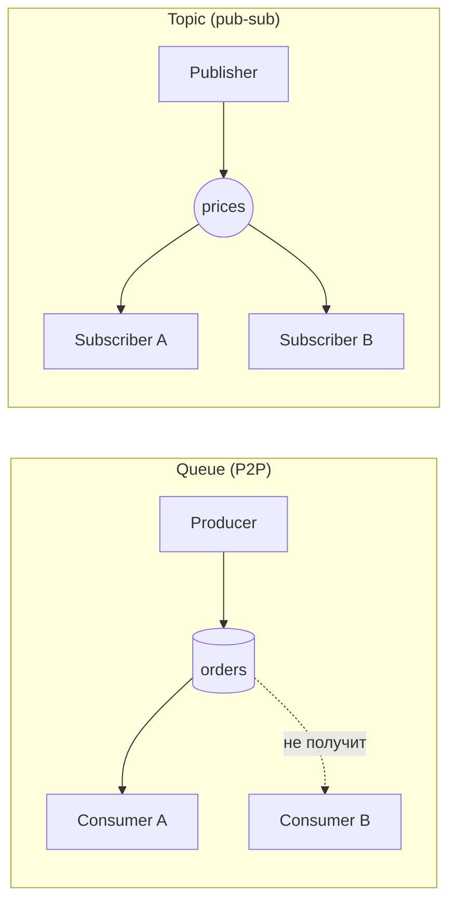
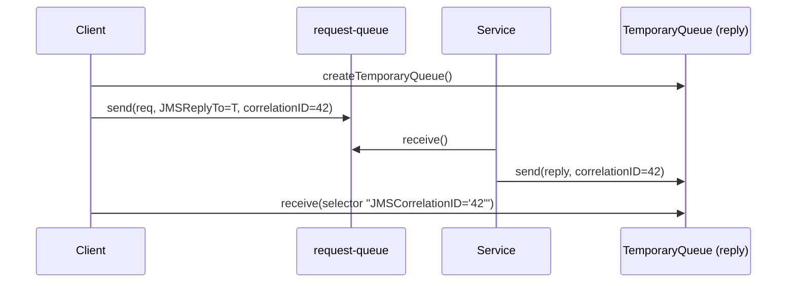

# Вопросы на собеседовании: `JMS и ActiveMQ`

JMS (Java Message Service) — это стандартный vendor-neutral API для асинхронного обмена сообщениями в Java-приложениях, а ActiveMQ — одна из самых распространённых его реализаций (брокер). На собеседованиях эту пару спрашивают, чтобы проверить, понимаете ли вы модель queue/topic, гарантии доставки (acknowledge, transacted, persistence) и где JMS-брокер уместнее лог-ориентированной Kafka.

Дата последнего обновления: 2026-06-25

## Полезные ссылки

### Официальная документация

- [Jakarta Messaging Specification](https://jakarta.ee/specifications/messaging/) — официальная спецификация (бывш. JMS), `jakarta.jms`
- [Apache ActiveMQ Classic](https://activemq.apache.org/components/classic/) — документация классического брокера (OpenWire, KahaDB)
- [Apache ActiveMQ Artemis](https://activemq.apache.org/components/artemis/) — документация нового брокера (CORE, append-only journal)
- [Spring Framework: JMS](https://docs.spring.io/spring-framework/reference/integration/jms.html) — `JmsTemplate`, `@JmsListener`, контейнеры
- [Spring Boot: JMS](https://docs.spring.io/spring-boot/reference/messaging/jms.html) — авто-конфигурация ActiveMQ/Artemis
- [Baeldung: JMS и ActiveMQ](https://www.baeldung.com/spring-jms) — туториал

## Содержание

- [Полезные ссылки](#полезные-ссылки)
- [See also](#see-also)

**JMS как спецификация и базовая модель**
- [Q1. (!) Что такое JMS и почему его называют vendor-neutral API?](#q1--что-такое-jms-и-почему-его-называют-vendor-neutral-api)
- [Q2. В чём разница между `jakarta.jms` (JMS 3.0) и `javax.jms` (JMS 2.0)?](#q2-в-чём-разница-между-jakartajms-jms-30-и-javaxjms-jms-20)
- [Q3. (!) Queue (P2P) vs Topic (pub-sub): в чём принципиальная разница?](#q3--queue-p2p-vs-topic-pub-sub-в-чём-принципиальная-разница)
- [Q4. Какие объекты участвуют в JMS API: `ConnectionFactory`, `Connection`, `Session`, `Producer`, `Consumer`?](#q4-какие-объекты-участвуют-в-jms-api-connectionfactory-connection-session-producer-consumer)
- [Q5. Какие типы сообщений определяет JMS?](#q5-какие-типы-сообщений-определяет-jms)

**Гарантии доставки и подписки**
- [Q6. (!) Какие acknowledgement modes есть в JMS и чем они отличаются?](#q6--какие-acknowledgement-modes-есть-в-jms-и-чем-они-отличаются)
- [Q7. Что такое transacted session и чем она лучше `CLIENT_ACKNOWLEDGE`?](#q7-что-такое-transacted-session-и-чем-она-лучше-client_acknowledge)
- [Q8. Что такое durable subscription и зачем она нужна?](#q8-что-такое-durable-subscription-и-зачем-она-нужна)
- [Q9. Что такое message selectors и какой у них синтаксис?](#q9-что-такое-message-selectors-и-какой-у-них-синтаксис)
- [Q10. Как работают приоритеты, TTL и persistence (`PERSISTENT`/`NON_PERSISTENT`)?](#q10-как-работают-приоритеты-ttl-и-persistence-persistentnon_persistent)

**ActiveMQ как брокер**
- [Q11. (!) ActiveMQ Classic vs Artemis: в чём различия?](#q11--activemq-classic-vs-artemis-в-чём-различия)
- [Q12. Как устроены DLQ и redelivery в ActiveMQ?](#q12-как-устроены-dlq-и-redelivery-в-activemq)

**Spring JMS и интеграция**
- [Q13. (!) Как организован Spring JMS: `JmsTemplate`, `@JmsListener`, контейнеры?](#q13--как-организован-spring-jms-jmstemplate-jmslistener-контейнеры)
- [Q14. Как реализовать request-reply поверх JMS?](#q14-как-реализовать-request-reply-поверх-jms)

**Выбор технологии**
- [Q15. (!) JMS-брокер vs Kafka: когда что выбирать?](#q15--jms-брокер-vs-kafka-когда-что-выбирать)
- [Q16. Какие типичные подвохи и антипаттерны при работе с JMS?](#q16-какие-типичные-подвохи-и-антипаттерны-при-работе-с-jms)

## Q1. (!) Что такое JMS и почему его называют vendor-neutral API?

JMS (Java Message Service) — это **стандартный API**, а не брокер. Он описывает интерфейсы (`ConnectionFactory`, `Session`, `MessageProducer`, `Message` и т.д.), через которые Java-приложение отправляет и принимает сообщения, не привязываясь к конкретной реализации брокера.

Суть «vendor-neutral»: код пишется против интерфейсов `jakarta.jms.*`, а конкретный брокер (ActiveMQ, IBM MQ, Artemis, Solace) подключается как зависимость и реализует эти интерфейсы. Смена брокера в идеале сводится к замене `ConnectionFactory` и конфигурации, без переписывания бизнес-логики.

```java
// Код не зависит от того, какой брокер за ConnectionFactory
ConnectionFactory factory = /* ActiveMQ, IBM MQ, Artemis... */;
try (JMSContext ctx = factory.createContext()) {
    Queue queue = ctx.createQueue("orders");
    ctx.createProducer().send(queue, "order-42");
}
```

Подвох на собеседовании: JMS — это спецификация Java/Jakarta EE. Она не определяет wire-протокол, поэтому два разных JMS-брокера несовместимы по сети между собой — переносим только клиентский код, а не сами сообщения «по проводу».

**Итог:** JMS — контракт уровня API; брокер — реализация. Это даёт переносимость кода ценой отсутствия сетевой совместимости брокеров.

## Q2. В чём разница между `jakarta.jms` (JMS 3.0) и `javax.jms` (JMS 2.0)?

Это **в первую очередь смена namespace из-за перехода Java EE → Jakarta EE**, а не функциональный скачок. Oracle сохранил права на бренд `javax`, поэтому при передаче спецификации в Eclipse Foundation все пакеты переименовали в `jakarta`.

| Аспект | JMS 2.0 (`javax.jms`) | Jakarta Messaging 3.0 (`jakarta.jms`) |
|--------|----------------------|----------------------------------------|
| Пакет | `javax.jms.*` | `jakarta.jms.*` |
| API/семантика | — | функционально эквивалентна 2.0 |
| Связка | старый Java EE / Spring Boot 2.x | Jakarta EE 9+ / Spring Boot 3.x |
| Артефакт | `javax.jms:javax.jms-api` | `jakarta.jms:jakarta.jms-api:3.0.x` |

Ключевая мысль: Jakarta Messaging 3.0 функционально равна JMS 2.0 — изменились только имена пакетов и констант. Например, `javax.jms.Connection` стал `jakarta.jms.Connection`.

При миграции реального кода обычно достаточно переписать `import`-ы (часто автоматически, например рецептом OpenRewrite `javax.jms` → `jakarta.jms`) и обновить зависимости. Полноценная новизна была раньше — в JMS 2.0: упрощённый API `JMSContext` (объединил `Connection` + `Session`), shared subscriptions, delivery delay.

**Вывод:** `javax → jakarta` — это переименование под Jakarta EE; реальная функциональная веха («новый» простой API) появилась ещё в JMS 2.0.

## Q3. (!) Queue (P2P) vs Topic (pub-sub): в чём принципиальная разница?

JMS поддерживает две модели доставки (домена):

- **Queue (Point-to-Point)** — у сообщения **ровно один** получатель. Если на очередь подписано несколько консьюмеров, брокер раздаёт сообщения между ними (load balancing, competing consumers). Сообщение хранится, пока кто-то его не заберёт.
- **Topic (Publish-Subscribe)** — сообщение доставляется **всем** активным подписчикам (fan-out). По умолчанию подписчик получает только то, что было опубликовано, пока он подключён.



| Критерий | Queue (P2P) | Topic (pub-sub) |
|----------|-------------|------------------|
| Доставка | одному консьюмеру | всем подписчикам |
| Несколько консьюмеров | делят нагрузку | каждый получает копию |
| Сообщение без получателя | ждёт в очереди | теряется (если подписка не durable) |
| Типовой кейс | задачи, команды, work queue | события, нотификации, broadcast |

Подвох: на пустом topic без активных подписчиков сообщения **просто теряются**. Чтобы топик «накапливал» сообщения для отключённого подписчика, нужна durable subscription (см. Q8).

**Итог:** queue — «один забирает», topic — «все получают»; выбор домена диктуется тем, команда это или событие.

## Q4. Какие объекты участвуют в JMS API: `ConnectionFactory`, `Connection`, `Session`, `Producer`, `Consumer`?

Классический (до JMS 2.0) набор объектов выстраивается иерархией: тяжёлые/общие — выше, лёгкие/частые — ниже.

- **`ConnectionFactory`** — фабрика соединений, обычно берётся из JNDI или конфигурируется как бин. Thread-safe, создаётся один раз.
- **`Connection`** — физическое соединение с брокером (TCP). Дорогое, thread-safe, переиспользуется. По умолчанию создаётся в режиме `stopped` — нужно вызвать `connection.start()`, чтобы начать получать сообщения.
- **`Session`** — единица работы для отправки/приёма; задаёт acknowledge mode и транзакционность. **Не thread-safe** — один `Session` на поток.
- **`MessageProducer` / `MessageConsumer`** — отправитель/получатель, привязаны к конкретному `Destination` (queue/topic).

```java
ConnectionFactory factory = new ActiveMQConnectionFactory("tcp://localhost:61616");
Connection connection = factory.createConnection();
connection.start();                               // важно: иначе consumer молчит
Session session = connection.createSession(false, Session.AUTO_ACKNOWLEDGE);
Queue queue = session.createQueue("orders");
MessageProducer producer = session.createProducer(queue);
producer.send(session.createTextMessage("order-42"));
```

В JMS 2.0 всё упрощается до `JMSContext` (объединяет `Connection` + `Session`) и `JMSProducer`/`JMSConsumer`, что заметно сокращает boilerplate.

**Вывод:** запоминаем правила thread-safety (`ConnectionFactory`/`Connection` — да, `Session` — нет) и про обязательный `connection.start()` на стороне приёма.

## Q5. Какие типы сообщений определяет JMS?

JMS определяет базовый `Message` (только заголовки + свойства, без тела) и **пять подтипов** по типу payload:

| Тип | Тело | Когда использовать |
|-----|------|--------------------|
| `TextMessage` | `String` | текст, JSON, XML — самый частый выбор |
| `ObjectMessage` | сериализуемый Java-объект | обмен внутри одной экосистемы Java |
| `BytesMessage` | сырой `byte[]` | бинарные данные, интеграция с внешним форматом |
| `MapMessage` | пары имя-значение (`String` → примитив) | структурированные поля без общего класса |
| `StreamMessage` | поток примитивов по порядку | последовательное чтение типизированных значений |

`StreamMessage` похож на `BytesMessage`, но дополнительно хранит порядок и типы записанных примитивов (читается строго по порядку и типам). `MapMessage` — доступ по имени, порядок записей не определён.

Подвох — `ObjectMessage`: он завязан на Java-сериализацию, требует наличия одинаковых классов на обеих сторонах и потенциально опасен (десериализация недоверенного payload). На практике предпочитают `TextMessage` с JSON/XML — это переносимо между языками и безопаснее.

**Итог:** в 90% случаев берут `TextMessage` (JSON); `ObjectMessage` избегают из-за tight coupling по классам и рисков десериализации.

## Q6. (!) Какие acknowledgement modes есть в JMS и чем они отличаются?

Acknowledge mode задаётся при создании `Session` и определяет, **когда сообщение считается «обработанным»** и удаляется брокером. Для нетранзакционной сессии есть три режима:

- **`AUTO_ACKNOWLEDGE`** — сессия подтверждает автоматически: при успешном возврате из `receive()` или после успешного завершения `onMessage()` у `MessageListener`. Просто, но если упасть в середине обработки — возможна потеря/повтор по краю.
- **`CLIENT_ACKNOWLEDGE`** — приложение само вызывает `message.acknowledge()`. Можно отложить подтверждение до завершения всей обработки. Важный нюанс: `acknowledge()` подтверждает **все** сообщения, полученные с момента прошлого вызова, а не одно.
- **`DUPS_OK_ACKNOWLEDGE`** — «ленивое» пакетное подтверждение для повышения throughput. При сбое провайдера возможны **дубликаты**, поэтому подходит только консьюмерам, толерантным к повторной доставке (идемпотентным).

```java
// CLIENT_ACKNOWLEDGE: ack только после успешной бизнес-логики
Session session = connection.createSession(false, Session.CLIENT_ACKNOWLEDGE);
Message msg = consumer.receive();
process(msg);             // если упадём здесь — сообщение придёт повторно
msg.acknowledge();        // подтверждает ВСЕ с прошлого ack
```

**Вывод:** `AUTO` — для простых кейсов, `CLIENT` — когда нужен контроль момента ack, `DUPS_OK` — ради throughput при идемпотентной обработке. Для атомарности «получил → обработал → подтвердил» лучше transacted session (Q7).

## Q7. Что такое transacted session и чем она лучше `CLIENT_ACKNOWLEDGE`?

Transacted session создаётся флагом `transacted=true`; в ней acknowledge mode **игнорируется** — подтверждение происходит автоматически при `session.commit()`. Все отправки и приёмы внутри сессии объединяются в локальную транзакцию.

- `commit()` — атомарно фиксирует все отправленные сообщения (они становятся видимыми) и подтверждает все полученные.
- `rollback()` — отменяет отправки и инициирует **redelivery** всех полученных сообщений.

```java
Session session = connection.createSession(true, Session.SESSION_TRANSACTED);
try {
    Message in = consumer.receive();
    producer.send(buildReply(in));   // отправка
    saveToDb(in);                    // бизнес-логика
    session.commit();                // всё или ничего
} catch (Exception e) {
    session.rollback();              // сообщения вернутся в очередь
}
```

Преимущество перед `CLIENT_ACKNOWLEDGE`: транзакция охватывает **и приём, и отправку** одной атомарной единицей — нельзя «случайно» отправить ответ, но не подтвердить вход. Это локальная JMS-транзакция (один ресурс). Если нужно атомарно с БД, используют XA/распределённые транзакции через `JtaTransactionManager`, но это дороже и сложнее.

**Итог:** transacted session = атомарность пачки операций в рамках брокера; `CLIENT_ACKNOWLEDGE` управляет только моментом ack приёма.

## Q8. Что такое durable subscription и зачем она нужна?

Durable subscription — это **долговечная подписка на topic**, которая переживает отключение подписчика. Обычный (non-durable) подписчик topic получает только сообщения, опубликованные пока он онлайн; если он отключился — всё, что прилетело в это время, для него потеряно.

Durable-подписчик регистрируется парой `clientID` + `subscriptionName`. Брокер запоминает эту подписку и **накапливает** сообщения, пока подписчик offline; при переподключении тот получает всё пропущенное.

```java
connection.setClientID("billing-service");        // обязателен для durable
Session session = connection.createSession(false, Session.AUTO_ACKNOWLEDGE);
Topic topic = session.createTopic("prices");
MessageConsumer sub = session.createDurableSubscriber(topic, "price-sub");
// ...позже отписаться окончательно:
session.unsubscribe("price-sub");
```

Подвохи:
- В JMS 1.1 durable-подписка **эксклюзивна** (одно соединение с данным `clientID`/`subscriptionName`) — нельзя балансировать поток между несколькими консьюмерами. JMS 2.0 добавил **shared durable subscriptions** (`createSharedDurableConsumer`), что снимает это ограничение.
- Накопленные сообщения занимают место на брокере — «забытая» durable-подписка может незаметно раздуть хранилище. Ненужные подписки надо явно удалять через `unsubscribe()`.

**Вывод:** durable subscription нужна, чтобы подписчик topic не терял события во время простоя; в JMS 2.0 появились shared-варианты для масштабирования.

## Q9. Что такое message selectors и какой у них синтаксис?

Message selector — это **серверный фильтр**, заданный строкой при создании консьюмера. Брокер доставляет подписчику только те сообщения, чьи заголовки/свойства удовлетворяют выражению. Фильтрация на стороне брокера экономит сеть и CPU клиента.

Синтаксис — подмножество условных выражений **SQL92**: операторы сравнения, `AND/OR/NOT`, `BETWEEN`, `IN`, `LIKE`, `IS NULL`.

```java
// Только сообщения с приоритетом > 4 и типом 'urgent'
String selector = "JMSPriority > 4 AND type = 'urgent' AND region IN ('eu','us')";
MessageConsumer consumer = session.createConsumer(queue, selector);
```

Селектор работает по **JMS-заголовкам** (`JMSPriority`, `JMSType`, `JMSCorrelationID` и т.д.) и **свойствам сообщения** (произвольные `setStringProperty`/`setIntProperty`), но **не по телу** сообщения. Поэтому всё, по чему хотите фильтровать, нужно класть в свойства при отправке.

Подвохи:
- Сложные селекторы на больших очередях дают нагрузку на брокер — он перебирает сообщения.
- Сообщения, не подошедшие ни под один селектор на queue, остаются лежать в очереди и могут её забивать.

**Итог:** селекторы — это SQL92-фильтр по заголовкам/свойствам (не по телу), удобный для маршрутизации, но требующий аккуратности по производительности.

## Q10. Как работают приоритеты, TTL и persistence (`PERSISTENT`/`NON_PERSISTENT`)?

Это три ключевых параметра доставки, задаваемых при отправке (на `producer` или в перегрузке `send`).

- **Приоритет** — целое `0..9` (0 — низший, 9 — высший), по умолчанию 4. Брокер **может** доставлять более приоритетные раньше, но строгая упорядоченность по приоритету не гарантируется спецификацией — это «best effort».
- **TTL (time-to-live)** — время жизни в миллисекундах. По истечении сообщение становится «протухшим» (expired) и обычно уходит в специальную очередь (`ActiveMQ.DLQ` / expiry-destination) или отбрасывается. `0` означает «бессрочно».
- **Delivery mode**:
  - `PERSISTENT` (по умолчанию) — брокер пишет сообщение в долговременное хранилище (журнал) перед подтверждением отправителю; переживает рестарт брокера ценой fsync/диска.
  - `NON_PERSISTENT` — сообщение держится только в памяти; быстрее, но теряется при падении брокера.

```java
producer.send(
    message,
    DeliveryMode.PERSISTENT,   // или NON_PERSISTENT
    7,                          // приоритет
    60_000L                     // TTL = 60 секунд
);
```

Подвох: `PERSISTENT` сам по себе **не гарантирует** end-to-end надёжность, если консьюмер использует `AUTO_ACKNOWLEDGE` и падает в обработке — для надёжности persistence сочетают с transacted/`CLIENT_ACKNOWLEDGE` и DLQ.

**Вывод:** приоритет — подсказка брокеру, TTL — срок годности, persistence — про переживание рестарта брокера; надёжность достигается их комбинацией с ack-стратегией.

## Q11. (!) ActiveMQ Classic vs Artemis: в чём различия?

Это два разных брокера под одним зонтиком Apache ActiveMQ. **Classic** — исторический «первый» ActiveMQ. **Artemis** — новый брокер на базе пожертвованного Red Hat кода **HornetQ**, с прицелом на производительность; это будущая основа линейки.

| Аспект | ActiveMQ Classic | ActiveMQ Artemis |
|--------|------------------|------------------|
| Происхождение | оригинальный ActiveMQ | кодовая база HornetQ |
| I/O-модель | традиционная, блокирующая | асинхронная, non-blocking |
| Хранилище | KahaDB (журнал + индекс) | append-only journal (без отдельного индекса) |
| Внутренняя модель | всё транслируется в OpenWire | нативная address-модель, без lossy-конверсии |
| Нативный протокол | OpenWire | CORE (быстрейший для JVM-JVM) |
| JMS | JMS 1.1 (+ частичная поддержка JMS 2.0) | полноценная JMS 2.0 (JMSContext, shared subscriptions) |
| Производительность | проверенная, предсказуемая | выше при правильном тюнинге |

Ключевые моменты для собеседования:
- Classic **OpenWire-центричен**: любой входящий протокол (AMQP, MQTT, STOMP) конвертируется в OpenWire и обратно — это добавляет латентность и может терять свойства, не маппящиеся между протоколами.
- Artemis обрабатывает протоколы нативно против внутренней address-модели — AMQP-сообщение остаётся AMQP на всём жизненном цикле.
- Производительность Artemis выше за счёт асинхронной архитектуры, но **плохо затюненный** Artemis (журнал на shared-диске, недонастроенный paging/thread pool) может проиграть хорошо настроенному Classic.

**Итог:** Artemis — производительнее и архитектурно современнее (это стратегическое направление), Classic — зрелый и предсказуемый; выбор часто упирается в существующую эксплуатацию и тюнинг.

## Q12. Как устроены DLQ и redelivery в ActiveMQ?

Когда консьюмер не смог обработать сообщение (исключение, rollback транзакции), брокер пытается **доставить его повторно** согласно `RedeliveryPolicy`. После исчерпания попыток сообщение признаётся «ядовитым» (poison) и отправляется в **Dead Letter Queue (DLQ)** — по умолчанию `ActiveMQ.DLQ`.

Параметры `RedeliveryPolicy` (ActiveMQ Classic):

- `maximumRedeliveries` — сколько раз повторять (по умолчанию 6); после превышения → poison ACK → DLQ.
- `initialRedeliveryDelay` — задержка перед первым повтором.
- `useExponentialBackOff` + `backOffMultiplier` — экспоненциальный рост задержки. Например, при multiplier=3: 1с, 3с, 9с…
- `maximumRedeliveryDelay` — потолок задержки (важно при backoff).

```java
RedeliveryPolicy policy = connection.getRedeliveryPolicy();
policy.setMaximumRedeliveries(5);
policy.setInitialRedeliveryDelay(1000);
policy.setUseExponentialBackOff(true);
policy.setBackOffMultiplier(2);
policy.setMaximumRedeliveryDelay(5 * 60_000); // потолок 5 минут
```

Подвохи:
- `maximumRedeliveries = -1` (бесконечно) **без задержки** создаёт tight loop — CPU 100% и блокировка остальных сообщений. Если нужны бесконечные ретраи — обязательно с backoff и `maximumRedeliveryDelay`.
- Без `maximumRedeliveryDelay` экспоненциальный backoff может разогнаться до часов — обычно ограничивают 5–10 минутами.
- Сообщения в DLQ надо **мониторить и разбирать** — иначе они копятся незаметно.

**Вывод:** redelivery + DLQ — встроенный механизм отказоустойчивости; ключ к стабильности — ограниченные ретраи с backoff и потолком задержки + мониторинг DLQ.

## Q13. (!) Как организован Spring JMS: `JmsTemplate`, `@JmsListener`, контейнеры?

Spring прячет JMS-boilerplate за несколькими абстракциями.

- **`JmsTemplate`** — синхронная отправка/приём по аналогии с `JdbcTemplate`. Метод `convertAndSend()` сериализует объект через `MessageConverter` (по умолчанию — `SimpleMessageConverter`; часто подключают JSON через `MappingJackson2MessageConverter`).
- **`@JmsListener`** — единственная аннотация, превращающая метод бина в JMS-эндпоинт (асинхронный приём). Включается через `@EnableJms`.
- **`DefaultMessageListenerContainer` (DMLC)** — стандартный контейнер слушателей: управляет пулом потоков, конкурентностью (`concurrency`), транзакциями и восстановлением соединения.
- **`DefaultJmsListenerContainerFactory`** — фабрика контейнеров, которую использует `@JmsListener`.

```java
@Configuration
@EnableJms
class JmsConfig {
    @Bean
    DefaultJmsListenerContainerFactory jmsListenerContainerFactory(ConnectionFactory cf) {
        var factory = new DefaultJmsListenerContainerFactory();
        factory.setConnectionFactory(cf);
        factory.setConcurrency("3-10");          // от 3 до 10 параллельных консьюмеров
        return factory;
    }
}

@Component
class OrderListener {
    @JmsListener(destination = "orders", selector = "type = 'urgent'")
    public void onOrder(String body) {
        // обработка
    }
}
```

В Spring Boot многое авто-конфигурируется: при наличии ActiveMQ/Artemis на classpath поднимается `ConnectionFactory`, `JmsTemplate` и `DefaultJmsListenerContainerFactory`. Если объявить бины `MessageConverter`, `DestinationResolver` или `ExceptionListener` — Boot подхватит их автоматически.

**Итог:** `JmsTemplate` — отправка, `@JmsListener` + DMLC — приём; конкурентность и транзакции настраиваются на фабрике контейнеров, а Spring Boot минимизирует ручную конфигурацию.

## Q14. Как реализовать request-reply поверх JMS?

JMS асинхронен по природе, но паттерн request-reply (синхронный «запрос-ответ») реализуется через два заголовка: **`JMSReplyTo`** и **`JMSCorrelationID`**.

Канонический рецепт (рекомендованный ActiveMQ):

1. Клиент при старте создаёт **временную очередь** (`TemporaryQueue`) и консьюмера на неё. Временная очередь живёт, пока живо `Connection`.
2. В запрос клиент кладёт `JMSReplyTo = временная очередь` и уникальный `JMSCorrelationID`.
3. Сервис («replier») обрабатывает запрос и шлёт ответ в очередь из `JMSReplyTo`, копируя тот же `JMSCorrelationID`.
4. Клиент по `JMSCorrelationID` сопоставляет ответ с конкретным запросом (используя селектор).



```java
TemporaryQueue replyTo = session.createTemporaryQueue();
TextMessage request = session.createTextMessage("get-price");
request.setJMSReplyTo(replyTo);
String corrId = UUID.randomUUID().toString();
request.setJMSCorrelationID(corrId);
producer.send(requestQueue, request);

MessageConsumer replyConsumer =
    session.createConsumer(replyTo, "JMSCorrelationID = '" + corrId + "'");
Message reply = replyConsumer.receive(5000); // ждём ответ с таймаутом
```

Подвохи: одна `TemporaryQueue` на клиента (а не на запрос) — переиспользуем; обязательно ставить **таймаут** на `receive`, чтобы не зависнуть навсегда. В Spring это инкапсулировано в `JmsTemplate.sendAndReceive(...)` и `JmsMessagingTemplate.convertSendAndReceive(...)`.

**Вывод:** request-reply = временная очередь в `JMSReplyTo` + `JMSCorrelationID` для сопоставления; всегда с таймаутом, чтобы не повиснуть.

## Q15. (!) JMS-брокер vs Kafka: когда что выбирать?

Главное концептуальное различие: **JMS-брокер удаляет сообщение после подтверждения (broker-centric ack)**, а **Kafka — это append-only лог, где сообщения хранятся заданное время и читаются по offset (consumer-centric)**.

| Критерий | JMS-брокер (ActiveMQ) | Kafka |
|----------|------------------------|-------|
| Модель хранения | очередь/тема; сообщение живёт до обработки | distributed log; хранится по retention |
| Отслеживание прогресса | брокер знает, что доставлено | консьюмер хранит offset сам |
| Replay сообщений | не предусмотрен (сообщение исчезает) | штатный (перемотал offset — перечитал) |
| Доставка | один консьюмер забирает (queue) | партиции, много consumer groups |
| Селекторы/фильтры | да (SQL92 на брокере) | нет (фильтрует консьюмер) |
| Масштаб throughput | хорош, но требует тюнинга | заточен под очень высокий поток |
| Транзакции/приоритеты/TTL | богатый набор из коробки | проще, без приоритетов сообщений |
| Типовой кейс | enterprise messaging, команды, транзакционные системы | event streaming, лог-агрегация, real-time |

Когда **JMS-брокер**:
- Нужны строгие гарантии доставки, транзакции, приоритеты, TTL, селекторы.
- Классический enterprise integration, очереди задач, request-reply, умеренный объём.

Когда **Kafka**:
- Высокий поток данных, event-driven архитектура, потоковая обработка.
- Нужен replay, несколько независимых потребителей одного потока, горизонтальное масштабирование.

Подвох: «Kafka вместо MQ всегда» — антипаттерн. Для очереди команд с приоритетами, TTL и серверной фильтрацией JMS-брокер проще и выразительнее; Kafka не имеет приоритетов сообщений и серверных селекторов.

**Итог:** JMS — «сообщение исчезает после обработки, богатые гарантии»; Kafka — «лог с replay и масштабом». Выбор по тому, нужны ли replay/streaming/масштаб или транзакции/приоритеты/фильтрация.

## Q16. Какие типичные подвохи и антипаттерны при работе с JMS?

Подборка граблей, которые любят спрашивать на senior-собеседовании:

- **Забыли `connection.start()`** — продюсер работает, а консьюмер «молча» ничего не получает (соединение по умолчанию stopped).
- **Шарят `Session` между потоками** — `Session`, `MessageProducer`, `MessageConsumer` **не thread-safe**. Нужен пул соединений (`PooledConnectionFactory`/`CachingConnectionFactory`) или сессия-на-поток.
- **Создают `Connection`/`Session` на каждое сообщение** — это дорого; без кэширования убивает throughput. В Spring используют `CachingConnectionFactory`.
- **`AUTO_ACKNOWLEDGE` + падение в обработке** — сообщение уже подтверждено брокером в момент успешного `onMessage`, но если упасть до этого — поведение по краю зависит от деталей; для надёжности берут transacted/`CLIENT_ACKNOWLEDGE` + DLQ.
- **`ObjectMessage`** — tight coupling по классам и риск небезопасной десериализации; предпочитают `TextMessage` + JSON.
- **Бесконечные ретраи без backoff** (`maximumRedeliveries=-1`, нулевая задержка) — tight loop, 100% CPU, блокировка очереди.
- **Забытые durable-подписки** — копят сообщения и раздувают хранилище; неиспользуемые надо `unsubscribe()`.
- **Не мониторят DLQ** — «ядовитые» сообщения накапливаются молча.
- **Тяжёлые селекторы на больших очередях** — нагрузка на брокер; фильтрация не бесплатна.
- **Ожидание строгого FIFO при нескольких консьюмерах** — competing consumers нарушают порядок; для строгого порядка нужен один консьюмер или message groups.

**Вывод:** большинство проблем — про lifecycle/thread-safety объектов, правильную ack-стратегию с DLQ и осознанный выбор типа сообщения; держите эти грабли в голове на проде.

---

## See also

- [Apache Kafka](kafka-interview.md) — лог-ориентированный брокер: партиции, offset, replay, consumer groups (контраст с JMS-моделью)
- [RabbitMQ](rabbitmq-interview.md) — AMQP-брокер с exchange/routing key; альтернативная модель маршрутизации сообщений
- [Сравнение брокеров сообщений](message-brokers-comparison-interview.md) — обзорное сравнение Kafka/RabbitMQ/ActiveMQ/SQS и критерии выбора
- [AWS SQS и SNS](aws-sqs-sns-interview.md) — managed-очереди и pub-sub в облаке как альтернатива self-hosted ActiveMQ
- [Spring Messaging](../frameworks/spring/spring-messaging-interview.md) — абстракции Spring для обмена сообщениями, `@JmsListener`, конвертеры
- [Event-driven паттерны](../architecture/event-driven-patterns-interview.md) — архитектурный контекст: события, очереди и пабсаб в распределённых системах
- [Apache Camel](apache-camel-interview.md) — интеграционный фреймворк поверх JMS и других транспортов (EIP-паттерны)
