# Вопросы на собеседовании: `Apache Kafka`

Полное покрытие `Apache Kafka` для интервью: архитектура кластера, топики и партиции, `Producer` / `Consumer`, `Consumer Groups`, репликация и отказоустойчивость, гарантии доставки, `Spring Kafka`, `Kafka Streams`, `KRaft`, мониторинг и администрирование.

**`Apache Kafka`** — распределённая платформа потоковой обработки данных, де-факто стандарт для event-driven архитектур. Знание Kafka — обязательное требование для backend/platform-инженеров, особенно в контексте [микросервисов](../architecture/microservices-interview.md) и [event-driven паттернов](../architecture/event-driven-patterns-interview.md).

## Полезные ссылки

### Официальная документация

- [Apache Kafka Documentation](https://kafka.apache.org/documentation/) — полная документация
- [Kafka APIs](https://kafka.apache.org/documentation/#api) — описание всех API
- [KRaft Overview](https://developer.confluent.io/learn/kraft/) — Kafka без ZooKeeper
- [Confluent Schema Registry](https://docs.confluent.io/platform/current/schema-registry/index.html) — Schema Registry документация

### Статьи Baeldung

- [Intro to Apache Kafka with Spring](https://www.baeldung.com/spring-kafka) — Spring Kafka интеграция
- [Kafka Streams With Spring Boot](https://www.baeldung.com/spring-boot-kafka-streams) — Kafka Streams + Spring Boot
- [Kafka Streams vs. Kafka Consumer](https://www.baeldung.com/java-kafka-streams-vs-kafka-consumer) — сравнение подходов обработки
- [Exactly Once Processing in Kafka with Java](https://www.baeldung.com/kafka-exactly-once) — exactly-once семантика
- [Manage Kafka Consumer Groups](https://www.baeldung.com/kafka-manage-consumer-groups) — управление consumer groups
- [Understanding Kafka Consumer Offset](https://www.baeldung.com/kafka-consumer-offset) — управление оффсетами
- [Ensuring Message Ordering in Kafka](https://www.baeldung.com/kafka-message-ordering) — гарантии порядка сообщений

## Содержание

- [Полезные ссылки](#полезные-ссылки)
- [See also](#see-also)

**Основы Kafka**
- [Q1. (!) Что такое `Apache Kafka` и для чего он используется?](#q1--что-такое-apache-kafka-и-для-чего-он-используется)
- [Q2. (!) Какие основные компоненты `Apache Kafka`?](#q2--какие-основные-компоненты-apache-kafka)
- [Q3. Что такое `Topic`?](#q3-что-такое-topic)
- [Q4. Что такое `ZooKeeper` и какова его роль в `Kafka`?](#q4-что-такое-zookeeper-и-какова-его-роль-в-kafka)
- [Q5. (!) Что такое `KRaft` и зачем он нужен?](#q5--что-такое-kraft-и-зачем-он-нужен)

**Partitions и Offsets**
- [Q6. (!) Что такое `Partition` и как она устроена?](#q6--что-такое-partition-и-как-она-устроена)
- [Q7. Что такое `Offset`?](#q7-что-такое-offset)
- [Q8. (!) Как обеспечить порядок сообщений в `Kafka`?](#q8--как-обеспечить-порядок-сообщений-в-kafka)
- [Q9. Как выбирается `Partition` при отправке сообщения?](#q9-как-выбирается-partition-при-отправке-сообщения)

**Producer**
- [Q10. (!) Что такое `Producer` и как он работает?](#q10--что-такое-producer-и-как-он-работает)
- [Q11. (!) Что означает параметр `acks` у `Producer`?](#q11--что-означает-параметр-acks-у-producer)
- [Q12. Что такое идемпотентный `Producer`?](#q12-что-такое-идемпотентный-producer)
- [Q13. Как настроить батчинг и сжатие у `Producer`?](#q13-как-настроить-батчинг-и-сжатие-у-producer)

**Consumer и Consumer Groups**
- [Q14. (!) Что такое `Consumer` и `Consumer Group`?](#q14--что-такое-consumer-и-consumer-group)
- [Q15. (!) Как происходит `Rebalance`?](#q15--как-происходит-rebalance)
- [Q16. В чём разница между auto-commit и manual commit?](#q16-в-чём-разница-между-auto-commit-и-manual-commit)
- [Q17. Что такое `Cooperative Sticky Assignor`?](#q17-что-такое-cooperative-sticky-assignor)

**Репликация и отказоустойчивость**
- [Q18. (!) Как работает репликация в `Kafka`?](#q18--как-работает-репликация-в-kafka)
- [Q19. (!) Что такое `ISR`, `OSR` и `High Watermark`?](#q19--что-такое-isr-osr-и-high-watermark)
- [Q20. Что произойдёт при падении Leader-брокера?](#q20-что-произойдёт-при-падении-leader-брокера)
- [Q21. Что такое `Unclean Leader Election`?](#q21-что-такое-unclean-leader-election)

**Гарантии доставки**
- [Q22. (!) Какие семантики доставки поддерживает `Kafka`?](#q22--какие-семантики-доставки-поддерживает-kafka)
- [Q23. (!) Как реализовать `Exactly-Once` семантику?](#q23--как-реализовать-exactly-once-семантику)
- [Q24. Что такое транзакции в `Kafka`?](#q24-что-такое-транзакции-в-kafka)

**Spring Kafka**
- [Q25. (!) Как интегрировать `Kafka` со `Spring Boot`?](#q25--как-интегрировать-kafka-со-spring-boot)
- [Q26. Как настроить `Producer` в `Spring Kafka`?](#q26-как-настроить-producer-в-spring-kafka)
- [Q27. (!) Как настроить `Consumer` с `@KafkaListener`?](#q27--как-настроить-consumer-с-kafkalistener)
- [Q28. Как обрабатывать ошибки в `Spring Kafka`?](#q28-как-обрабатывать-ошибки-в-spring-kafka)
- [Q29. Как тестировать `Kafka` в `Spring Boot`?](#q29-как-тестировать-kafka-в-spring-boot)

**Kafka Streams**
- [Q30. (!) Что такое `Kafka Streams`?](#q30--что-такое-kafka-streams)
- [Q31. Какие основные абстракции в `Kafka Streams`?](#q31-какие-основные-абстракции-в-kafka-streams)
- [Q32. Как использовать `Kafka Streams` в `Spring Boot`?](#q32-как-использовать-kafka-streams-в-spring-boot)

**Kafka Connect**
- [Q33. Что такое `Kafka Connect`?](#q33-что-такое-kafka-connect)
- [Q34. В чём разница между `Source` и `Sink Connector`?](#q34-в-чём-разница-между-source-и-sink-connector)

**Schema Registry**
- [Q35. (!) Зачем нужен `Schema Registry`?](#q35--зачем-нужен-schema-registry)

**Производительность и мониторинг**
- [Q36. (!) Что такое `Consumer Lag` и как его измерить?](#q36--что-такое-consumer-lag-и-как-его-измерить)
- [Q37. Какие ключевые метрики `Kafka` нужно мониторить?](#q37-какие-ключевые-метрики-kafka-нужно-мониторить)
- [Q38. Как масштабировать `Kafka`-кластер?](#q38-как-масштабировать-kafka-кластер)

**Безопасность**
- [Q39. Как обеспечить безопасность в `Kafka`?](#q39-как-обеспечить-безопасность-в-kafka)

**Паттерны и практики**
- [Q40. (!) Что такое `Dead Letter Queue` (DLQ) в `Kafka`?](#q40--что-такое-dead-letter-queue-dlq-в-kafka)
- [Q41. (!) Как спроектировать правильную топологию топиков?](#q41--как-спроектировать-правильную-топологию-топиков)
- [Q42. В чём разница между `Kafka` и `RabbitMQ`?](#q42-в-чём-разница-между-kafka-и-rabbitmq)
- [Q43. Какие паттерны retry применяются с `Kafka`?](#q43-какие-паттерны-retry-применяются-с-kafka)
- [Q44. (!) Какие практические советы для production-использования `Kafka`?](#q44--какие-практические-советы-для-production-использования-kafka)

**Продвинутые темы**
- [Q45. (!) Как работает `Consumer Group Rebalancing` и что такое `Static Membership`?](#q45--как-работает-consumer-group-rebalancing-и-что-такое-static-membership)
- [Q46. (!) Что такое `Log Compaction` и как работает `__consumer_offsets`?](#q46--что-такое-log-compaction-и-как-работает-__consumer_offsets)
- [Q47. Как `Schema Registry` хранит схемы и обеспечивает совместимость?](#q47-как-schema-registry-хранит-схемы-и-обеспечивает-совместимость)
- [Q48. (!) Как реализовать `Exactly-Once` с помощью транзакций `Kafka` и `idempotent producer`?](#q48--как-реализовать-exactly-once-с-помощью-транзакций-kafka-и-idempotent-producer)
- [Q49. Что такое `Kafka Streams State Store` и как реализовать `stateful`-обработку?](#q49-что-такое-kafka-streams-state-store-и-как-реализовать-stateful-обработку)
- [Q50. Как организовать мониторинг `__consumer_offsets` и `Consumer Lag` алертинг?](#q50-как-организовать-мониторинг-__consumer_offsets-и-consumer-lag-алертинг)

---

## Q1. (!) Что такое `Apache Kafka` и для чего он используется?

`Apache Kafka` — распределённый коммит-лог, который ведёт себя как платформа потоковой обработки данных по модели `publish-subscribe`. В отличие от классической очереди, Kafka не удаляет сообщение после прочтения, а хранит его на диске заданное время — поэтому несколько независимых потребителей читают один и тот же поток, а при сбое можно «перемотать» offset назад и переиграть события. Отсюда три её главных свойства: высокая пропускная способность, отказоустойчивость за счёт репликации и низкая задержка.

**Основные сценарии использования:**
- **Event Streaming** — обмен событиями между [микросервисами](../architecture/microservices-interview.md)
- **Data Pipeline** — перенос данных между системами (CDC, ETL)
- **Log Aggregation** — централизованный сбор логов (см. [Observability](../monitoring/observability-interview.md))
- **Stream Processing** — обработка данных в реальном времени (`Kafka Streams`, `Apache Flink`)
- **Event Sourcing** — хранение потока событий как источника истины

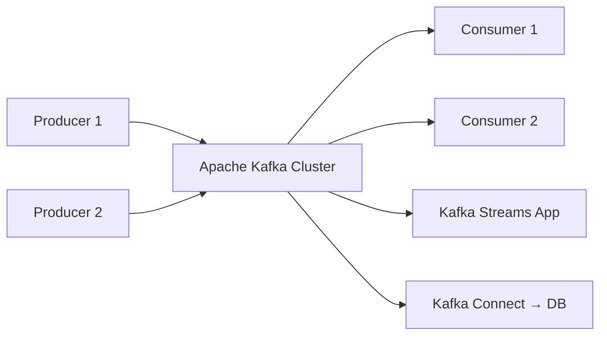

**На собеседовании** ключевой акцент: Kafka — это не просто очередь сообщений, а **распределённый коммит-лог** с гарантиями хранения и воспроизведения. Эта формулировка сразу объясняет, почему здесь возможны replay, event sourcing и несколько групп потребителей одного потока.

## Q2. (!) Какие основные компоненты `Apache Kafka`?

Kafka — это набор слабосвязанных компонентов: брокеры хранят данные, координатор управляет кластером, а клиентские библиотеки (Producer, Consumer, Streams, Connect) работают поверх них. Понимание ролей помогает отвечать на любой следующий вопрос — где живут данные, кто их пишет и кто координирует.

| Компонент | Описание |
|-----------|----------|
| `Broker` | Сервер Kafka, хранит данные и обслуживает клиентов |
| `Topic` | Логический канал для категоризации сообщений |
| `Partition` | Физическое разделение топика, обеспечивает параллелизм |
| `Producer` | Отправляет сообщения в топики |
| `Consumer` | Читает сообщения из топиков |
| `Consumer Group` | Группа потребителей, распределяющих между собой партиции |
| `ZooKeeper` / `KRaft Controller` | Координация кластера и хранение метаданных |
| `Kafka Connect` | Фреймворк интеграции с внешними системами |
| `Kafka Streams` | Библиотека потоковой обработки данных |
| `Schema Registry` | Управление схемами данных (`Avro`, `Protobuf`, `JSON Schema`) |

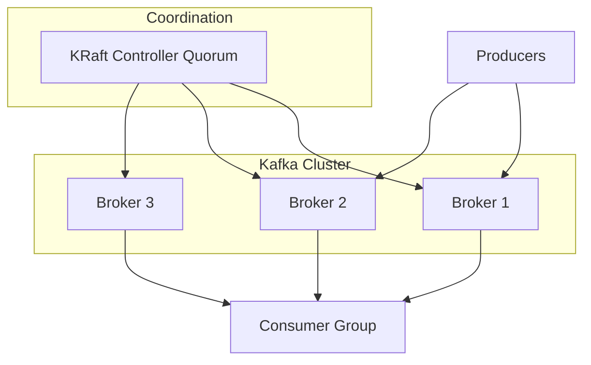

## Q3. Что такое `Topic`?

`Topic` — именованный канал, в который `Producer` публикует сообщения, а `Consumer` из него читает. Удобная аналогия — таблица в базе данных: топик группирует однотипные события, но физически это не одна запись, а распределённый по партициям лог.

**Ключевые характеристики:**
- Имя топика — уникальный строковый идентификатор
- Топик делится на одну или несколько `Partition` — именно партиции дают параллелизм и упорядоченность
- Сообщения хранятся ограниченное время (`retention.ms`, по умолчанию 7 дней) или до лимита по размеру (`retention.bytes`); чтение не удаляет их
- Топик может быть `compacted` — тогда Kafka хранит только последнее значение по каждому ключу (см. Q46)

```bash
# Создание топика
kafka-topics.sh --bootstrap-server localhost:9092 \
  --create --topic orders \
  --partitions 12 --replication-factor 3

# Просмотр информации о топике
kafka-topics.sh --bootstrap-server localhost:9092 \
  --describe --topic orders
```

**Naming convention:** используйте чёткую структуру, например `<domain>.<entity>.<event>`: `shop.orders.created`.

## Q4. Что такое `ZooKeeper` и какова его роль в `Kafka`?

`ZooKeeper` — внешний распределённый координатор, который в классической архитектуре Kafka хранил состояние кластера и обеспечивал согласованность между брокерами. Сами данные сообщений в ZooKeeper никогда не лежали — только метаданные и управляющая информация.

**За что отвечал:**
- Хранение метаданных кластера (список брокеров, топиков, партиций)
- Выборы лидера контроллера
- Управление `ACL` и конфигурацией
- Хранение информации о `Consumer Group` (в старых версиях)

**Почему от него ушли:** ZooKeeper — отдельный кластер, который нужно разворачивать, мониторить и обновлять; он же стал узким местом при росте числа партиций. Поэтому начиная с Kafka 3.3+ `ZooKeeper` помечен deprecated, а с Kafka 4.0 полностью заменён на `KRaft` (см. Q5).

## Q5. (!) Что такое `KRaft` и зачем он нужен?

`KRaft` (`Kafka Raft`) — встроенный в Kafka механизм консенсуса, который полностью заменяет `ZooKeeper`. Идея проста: вместо отдельного координатора метаданные кластера сами становятся обычным логом — они хранятся во внутреннем топике `__cluster_metadata` и реплицируются между контроллерами по протоколу `Raft`. Kafka использует свою же модель «лог + репликация» для управления собой.

**Почему это лучше `ZooKeeper`:**
- **Нет внешней зависимости** — не нужно поднимать и сопровождать отдельный кластер
- **Быстрое восстановление** — новый контроллер не вычитывает всё состояние заново, а догоняет лог метаданных, как обычный consumer
- **Масштабируемость** — поддержка миллионов партиций (раньше упирались в ZooKeeper)
- **Единый механизм безопасности** на весь стек
- **Меньше операционной сложности** — на один компонент для мониторинга и обновления меньше

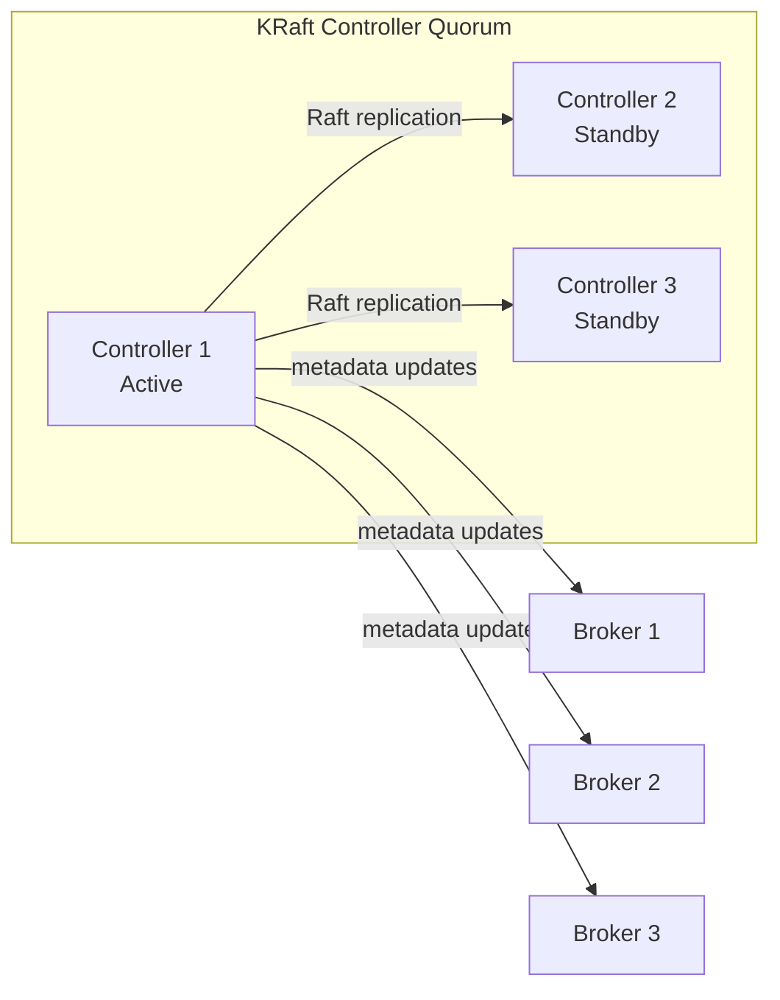

## Q6. (!) Что такое `Partition` и как она устроена?

`Partition` — основная единица параллелизма и хранения в Kafka. Физически это упорядоченный append-only лог на диске брокера: новые записи всегда дописываются в конец, а уже записанные не меняются. Именно деление топика на партиции позволяет одновременно писать и читать с разных брокеров — но платой за это становится то, что порядок гарантируется только внутри одной партиции, а не по топику целиком.

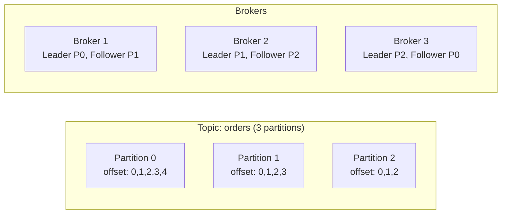

**Ключевые свойства:**
- Порядок гарантируется **только внутри одной партиции**
- Каждая партиция имеет одного `Leader` и 0+ `Follower`
- Максимальный параллелизм `Consumer Group` = количество партиций
- Количество партиций можно увеличить, но **нельзя уменьшить**

**Как выбрать число партиций?** Это компромисс: партиций должно хватать на нужный параллелизм, но избыток дорого обходится.
- Формула: `max(T/P, T/C)`, где T — целевой throughput, P — throughput одного producer, C — throughput одного consumer
- Типичный диапазон: 6–30 партиций для среднего топика
- Чем больше партиций, тем больше открытых файлов на брокере и дольше rebalance и leader election — поэтому «на всякий случай» завышать число не стоит

## Q7. Что такое `Offset`?

`Offset` — порядковый номер сообщения внутри партиции, который монотонно растёт и никогда не переиспользуется. Важно: offset уникален только в пределах своей партиции, а не топика. Consumer хранит свою позицию в логе как offset и по нему понимает, с какого места продолжить чтение после рестарта или rebalance.

**Типы offset:**
- **Current offset** — позиция следующего сообщения, которое вернёт `poll()`
- **Committed offset** — позиция, подтверждённая consumer'ом (сохранена в `__consumer_offsets`)
- **Log-end offset (LEO)** — позиция последнего записанного сообщения
- **High Watermark (HW)** — позиция последнего сообщения, реплицированного на все ISR

**Стратегии начала чтения** (`auto.offset.reset`):
- `earliest` — с самого начала
- `latest` — только новые сообщения
- `none` — ошибка, если нет сохранённого offset

## Q8. (!) Как обеспечить порядок сообщений в `Kafka`?

Главное правило: порядок в Kafka гарантируется **только внутри одной партиции**, глобального порядка по всему топику нет. Поэтому задача сводится к тому, чтобы связанные между собой сообщения попадали в одну партицию.

Способы обеспечить порядок там, где он нужен:

1. **Один ключ → одна партиция:** сообщения с одинаковым ключом всегда идут в одну партицию. На практике это и есть рабочий приём — например, ключом берут `customerId` или `orderId`, и события одной сущности упорядочены, а разные сущности параллелятся.
2. **Одна партиция на топик:** даёт строгий глобальный порядок, но убивает параллелизм — применимо только для низконагруженных потоков.
3. **`max.in.flight.requests.per.connection = 1`** — предотвращает перестановку сообщений при retry. Лучшая альтернатива — идемпотентный producer (Q12): он сохраняет порядок даже при нескольких параллельных запросах в полёте.

```java
// Все заказы одного клиента попадут в одну партицию
kafkaTemplate.send("orders", customerId, orderEvent);
```

> На собеседовании часто спрашивают: «Можно ли обеспечить глобальный порядок?» — ответ: только при одной партиции, что убивает масштабируемость.

## Q9. Как выбирается `Partition` при отправке сообщения?

Producer сам решает, в какую партицию положить запись, до отправки на брокер. Логика зависит от того, задан ли ключ и используется ли кастомный partitioner.

| Сценарий | Стратегия |
|----------|-----------|
| Указан ключ | `hash(key) % numPartitions` (по умолчанию `Murmur2`) |
| Нет ключа (Kafka < 2.4) | Round-robin |
| Нет ключа (Kafka ≥ 2.4) | Sticky partitioning (в рамках batch) |
| Указан partition явно | Используется указанная партиция |
| Custom Partitioner | Реализация интерфейса `Partitioner` |

```java
public class OrderPartitioner implements Partitioner {
    @Override
    public int partition(String topic, Object key, byte[] keyBytes,
                         Object value, byte[] valueBytes, Cluster cluster) {
        List<PartitionInfo> partitions = cluster.partitionsForTopic(topic);
        // Своя логика распределения
        return Math.abs(key.hashCode()) % partitions.size();
    }
}
```

## Q10. (!) Что такое `Producer` и как он работает?

`Producer` — клиент, который отправляет сообщения в топики Kafka. Ключевая деталь: producer не шлёт каждое сообщение по сети сразу. Он сериализует запись, выбирает партицию, копит сообщения в батчи по партициям (`RecordAccumulator`), а отдельный `Sender Thread` отправляет готовые батчи на брокеры. Эта буферизация — главный источник высокой пропускной способности Kafka.

Внутренняя архитектура producer'а:

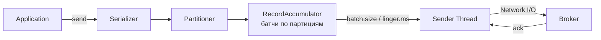

**Ключевые параметры:**

| Параметр | Описание | Рекомендация |
|----------|----------|--------------|
| `acks` | Кол-во подтверждений | `all` для надёжности |
| `retries` | Число повторов | `Integer.MAX_VALUE` |
| `batch.size` | Размер батча (bytes) | 16384–65536 |
| `linger.ms` | Задержка перед отправкой | 5–100 |
| `compression.type` | Сжатие | `lz4` или `zstd` |
| `enable.idempotence` | Идемпотентность | `true` (по умолчанию c Kafka 3.0) |

## Q11. (!) Что означает параметр `acks` у `Producer`?

`acks` — главный рычаг компромисса между надёжностью и задержкой. Он определяет, сколько реплик должны подтвердить запись, прежде чем producer сочтёт её успешной.

| Значение | Поведение | Надёжность | Задержка |
|----------|-----------|------------|----------|
| `acks=0` | Не ждёт подтверждения | Минимальная (fire-and-forget) | Минимальная |
| `acks=1` | Ждёт подтверждения от Leader | Средняя (потеря при сбое Leader) | Средняя |
| `acks=all` (или `-1`) | Ждёт подтверждения от всех ISR | Максимальная | Максимальная |

**Подводный камень `acks=1`:** Leader подтвердил запись, но не успел реплицировать её на followers и упал — сообщение потеряно. `acks=all` закрывает этот сценарий, дожидаясь репликации.

**Рекомендация для production:** `acks=all` + `min.insync.replicas=2` + `replication.factor=3`. Связка работает вместе: `acks=all` ждёт все ISR, а `min.insync.replicas=2` требует, чтобы в ISR было минимум две реплики — иначе запись отклоняется. В итоге данные переживают падение одного брокера из трёх.

## Q12. Что такое идемпотентный `Producer`?

Идемпотентный producer решает классическую проблему: producer отправил сообщение, брокер его записал, но ответ-подтверждение потерялся в сети — и producer по retry шлёт дубль. Без идемпотентности так в логе появляются повторы. С ней Kafka присваивает каждому producer уникальный `Producer ID` (PID) и нумерует сообщения внутри партиции (sequence number), поэтому брокер распознаёт и отбрасывает повторную запись.

```java
// Включение идемпотентности
Properties props = new Properties();
props.put(ProducerConfig.ENABLE_IDEMPOTENCE_CONFIG, true); // по умолчанию true с Kafka 3.0
props.put(ProducerConfig.ACKS_CONFIG, "all");              // обязательно для идемпотентности
props.put(ProducerConfig.RETRIES_CONFIG, Integer.MAX_VALUE);
```

**Как это работает:**
1. Producer получает `PID` при инициализации
2. Каждое сообщение получает `sequence number`
3. Broker отклоняет дубликаты (одинаковые PID + sequence)
4. Гарантируется порядок даже при `max.in.flight.requests.per.connection = 5`

## Q13. Как настроить батчинг и сжатие у `Producer`?

Батчинг и сжатие — два главных рычага пропускной способности producer'а. Оба работают на снижение числа сетевых запросов и объёма передаваемых байт.

**Батчинг** — Producer накапливает сообщения в буфере и отправляет их пачками. Меньше отдельных запросов к брокеру — выше throughput, но за счёт небольшой задержки (`linger.ms`):

```java
props.put(ProducerConfig.BATCH_SIZE_CONFIG, 32768);     // 32 KB
props.put(ProducerConfig.LINGER_MS_CONFIG, 20);          // ждать до 20 мс
props.put(ProducerConfig.BUFFER_MEMORY_CONFIG, 67108864); // 64 MB буфер
```

**Сжатие** — уменьшает объём данных при передаче и хранении; сжимается весь батч целиком, поэтому крупные батчи сжимаются эффективнее. Выбор алгоритма — компромисс между нагрузкой на CPU и степенью сжатия:

| Алгоритм | CPU | Степень сжатия | Скорость |
|----------|-----|----------------|----------|
| `none` | — | — | Максимальная |
| `gzip` | Высокая | Лучшая | Медленная |
| `snappy` | Низкая | Хорошая | Быстрая |
| `lz4` | Низкая | Хорошая | Очень быстрая |
| `zstd` | Средняя | Отличная | Быстрая |

**Рекомендация:** `lz4` для баланса скорости и сжатия, `zstd` для максимального сжатия.

## Q14. (!) Что такое `Consumer` и `Consumer Group`?

`Consumer` читает сообщения из партиций топика. `Consumer Group` — группа потребителей с общим `group.id`, которые делят между собой работу: каждая партиция назначается **ровно одному** consumer внутри группы. Это и есть механизм масштабирования чтения в Kafka — добавляя consumer'ов в группу, мы распараллеливаем обработку, а Kafka сама раскидывает партиции между ними.

Ключевая идея — два уровня:
- **внутри группы** партиции делятся (масштабирование, конкурентное чтение);
- **между группами** чтение независимо — каждая группа получает полную копию потока (broadcast). Так один топик одновременно питает, например, сервис аналитики и сервис нотификаций.

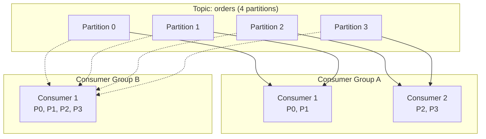

**Правила:**
- Если consumers > partitions → лишние consumers простаивают
- Если consumers < partitions → один consumer обрабатывает несколько партиций
- Разные `Consumer Group` читают **независимо** (каждая получает все сообщения)

## Q15. (!) Как происходит `Rebalance`?

`Rebalance` — процесс перераспределения партиций между потребителями группы. Он нужен, чтобы при изменении состава группы или топика партиции всегда были закреплены ровно за одним живым consumer'ом. Цена rebalance — пауза в обработке, поэтому важно понимать, что его запускает и как минимизировать downtime.

**Что запускает rebalance:**
- Добавление / удаление consumer из группы
- Подписка consumer на новый топик
- Добавление партиций в топик
- Превышение `session.timeout.ms` (пропали heartbeat'ы) или `max.poll.interval.ms` (consumer слишком долго обрабатывал и не вызвал `poll()`)

**Протоколы rebalance:**

| Протокол | Описание | Плюсы | Минусы |
|----------|----------|-------|--------|
| Eager | Все consumer отпускают все партиции, затем переназначение | Простота | Stop-the-world |
| Cooperative (Incremental) | Постепенный rebalance, отпускаются только перемещаемые партиции | Минимальный downtime | Сложнее |

**Стратегии назначения (Assignor):**
- `RangeAssignor` — по диапазонам (по умолчанию)
- `RoundRobinAssignor` — равномерное распределение
- `StickyAssignor` — минимизация перемещений
- `CooperativeStickyAssignor` — cooperative + sticky (рекомендуемый)

## Q16. В чём разница между auto-commit и manual commit?

Вопрос на самом деле о гарантиях доставки. Момент коммита offset определяет, что произойдёт при падении consumer'а: потеряется ли необработанное сообщение или обработается повторно. Auto-commit коммитит по таймеру (потенциально *до* фактической обработки), manual commit — там, где это решит код.

| Аспект | Auto-commit | Manual commit |
|--------|-------------|---------------|
| Настройка | `enable.auto.commit=true` | `enable.auto.commit=false` |
| Когда коммит | По таймеру (`auto.commit.interval.ms`) | Вызовом `commitSync()` / `commitAsync()` |
| Гарантия | At-most-once (может потерять) | At-least-once (при коммите после обработки) |
| Контроль | Минимальный | Полный |

```java
// Manual commit — at-least-once
while (true) {
    ConsumerRecords<String, String> records = consumer.poll(Duration.ofMillis(100));
    for (ConsumerRecord<String, String> record : records) {
        processRecord(record);
    }
    consumer.commitSync(); // коммит после успешной обработки
}
```

## Q17. Что такое `Cooperative Sticky Assignor`?

`CooperativeStickyAssignor` — стратегия назначения партиций, которая делает rebalance почти бесшовным. Обычный (eager) rebalance — это «stop-the-world»: все consumer'ы отпускают все партиции и ждут нового назначения. Cooperative-вариант устроен иначе:
1. Минимизирует перемещения — за consumer'ом остаются те же партиции, что и были (sticky)
2. Использует cooperative протокол — отпускаются только те партиции, которые реально переезжают; остальные продолжают обрабатываться
3. Результат: **rebalance без остановки** для большинства consumer'ов при стабильном составе группы — это рекомендуемый assignor для production

```yaml
# application.yml для Spring Kafka
spring:
  kafka:
    consumer:
      properties:
        partition.assignment.strategy: org.apache.kafka.clients.consumer.CooperativeStickyAssignor
```

## Q18. (!) Как работает репликация в `Kafka`?

Репликация — основа отказоустойчивости Kafka. Каждая партиция хранится в нескольких копиях на разных брокерах (`replication.factor`). Одна реплика назначается `Leader` — через неё идёт вся запись и чтение, остальные `Followers` лишь догоняют её, постоянно вычитывая новые записи. Если брокер с Leader падает, одна из синхронных реплик становится новым Leader — данные не теряются (см. Q20).

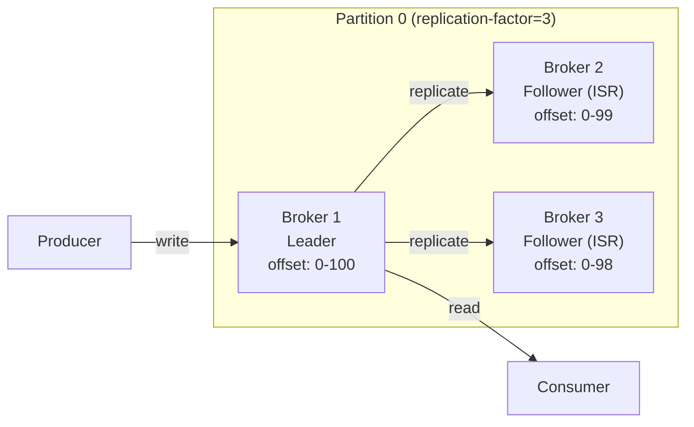

**Правила:**
- **Только Leader** обслуживает запись и чтение (Kafka < 2.4; с 2.4 followers могут обслуживать чтение при настройке `replica.selector.class`)
- Followers постоянно fetch'ат данные у Leader
- Если Follower отстаёт — он выпадает из ISR

## Q19. (!) Что такое `ISR`, `OSR` и `High Watermark`?

Эти три понятия описывают, какие данные Kafka считает «надёжно записанными» и доступными для чтения.

**`ISR` (In-Sync Replicas)** — набор реплик, которые успевают за Leader. Сообщение считается committed (надёжным), только когда оно записано на все реплики из ISR — поэтому потеря одного брокера из ISR не приводит к потере данных.

**`OSR` (Out-of-Sync Replicas)** — реплики, отставшие от Leader более чем на `replica.lag.time.max.ms` (по умолчанию 30 сек). Они временно выпадают из ISR и не учитываются при подтверждении записи, пока не догонят Leader.

**`High Watermark (HW)`** — offset последнего сообщения, реплицированного на все ISR. Consumer может читать только до HW — это гарантирует, что он никогда не увидит запись, которая ещё не закреплена на репликах и может пропасть при сбое Leader.

```
Leader:     [0] [1] [2] [3] [4] [5] [6]    ← LEO = 7
Follower 1: [0] [1] [2] [3] [4] [5]        ← LEO = 6 (ISR)
Follower 2: [0] [1] [2] [3]                ← LEO = 4 (OSR — отстал)
                              ↑
                        High Watermark = 6
```

**`min.insync.replicas`** — минимальное число ISR для принятия записи при `acks=all`. Если ISR < `min.insync.replicas`, broker вернёт `NotEnoughReplicasException`.

## Q20. Что произойдёт при падении Leader-брокера?

При падении брокера, который был Leader для каких-то партиций, Kafka автоматически выбирает им замену из синхронных реплик — клиенты лишь на короткое время видят ошибку и переключаются на нового Leader.

Последовательность:
1. `Controller` обнаруживает, что брокер недоступен (через heartbeat)
2. Controller выбирает нового Leader из ISR — у синхронной реплики данные актуальны, поэтому потери нет
3. Метаданные обновляются в metadata log (KRaft) или ZooKeeper
4. Producers и Consumers получают обновлённые метаданные и переключаются на нового Leader
5. Если ISR пуст (ни одной синхронной реплики не осталось), поведение зависит от `unclean.leader.election.enable` — здесь как раз встаёт выбор между доступностью и сохранностью данных (см. Q21)

**Время восстановления** (failover) обычно составляет несколько секунд.

## Q21. Что такое `Unclean Leader Election`?

`Unclean Leader Election` — выбор нового Leader из реплик, **не входящих в ISR** (т.е. отставших). Возникает в критической ситуации: упали все синхронные реплики, и остались только отставшие. Это прямой выбор из CAP-теоремы — пожертвовать целостностью ради доступности или наоборот. Управляется параметром `unclean.leader.election.enable`.

| Значение | Поведение |
|----------|-----------|
| `true` | Допускается выбор отставшей реплики → доступность выше, но **возможна потеря данных** |
| `false` (по умолчанию) | Партиция остаётся недоступной, пока ISR-реплика не вернётся → **данные не теряются** |

**Рекомендация:** `false` для финансовых и критичных данных, `true` для систем, где доступность важнее целостности.

## Q22. (!) Какие семантики доставки поддерживает `Kafka`?

Семантика доставки отвечает на вопрос «что будет с сообщением при сбое»: может ли оно потеряться, продублироваться или гарантированно обработается ровно раз. Выбор — это компромисс между надёжностью и накладными расходами, и определяется он настройками `acks`, момента коммита offset и наличием транзакций.

| Семантика | Описание | Реализация |
|-----------|----------|------------|
| **At-most-once** | Сообщение может потеряться, но не дублируется | `acks=0` или auto-commit до обработки |
| **At-least-once** | Сообщение не теряется, но может дублироваться | `acks=all` + commit после обработки |
| **Exactly-once** | Сообщение доставлено и обработано ровно один раз | Идемпотентный producer + транзакции |

**Выбор семантики** зависит от требований:
- Метрики, логи → `at-most-once` (допустимы потери)
- Заказы, платежи → `at-least-once` + идемпотентная обработка на стороне consumer
- Финансовые транзакции → `exactly-once` (Kafka Transactions)

## Q23. (!) Как реализовать `Exactly-Once` семантику?

`Exactly-once` достигается не одной настройкой, а связкой из трёх частей, каждая закрывает свой источник дублей или потерь:
1. **Идемпотентный Producer** (`enable.idempotence=true`) — убирает дубликаты от retry на стороне producer (Q12)
2. **Транзакционный Producer** (`transactional.id`) — делает связку «прочитал → обработал → записал и закоммитил offset» атомарной: либо всё фиксируется, либо ничего
3. **Consumer с `isolation.level=read_committed`** — читает только сообщения завершённых транзакций, не видя промежуточных/откатанных записей

```java
// Транзакционный producer — exactly-once
Properties props = new Properties();
props.put(ProducerConfig.TRANSACTIONAL_ID_CONFIG, "order-processor-1");
props.put(ProducerConfig.ENABLE_IDEMPOTENCE_CONFIG, true);

KafkaProducer<String, String> producer = new KafkaProducer<>(props);
producer.initTransactions();

try {
    producer.beginTransaction();
    producer.send(new ProducerRecord<>("output-topic", key, value));
    // Коммит consumer offsets внутри транзакции
    producer.sendOffsetsToTransaction(offsets, consumerGroupMetadata);
    producer.commitTransaction();
} catch (Exception e) {
    producer.abortTransaction();
}
```

**Ограничения:** Exactly-once работает только **внутри Kafka** (read-process-write). Для внешних систем нужна идемпотентность на стороне приёмника.

## Q24. Что такое транзакции в `Kafka`?

Транзакции дают атомарность нескольким операциям записи: producer может за один коммит записать сообщения в разные топики/партиции и одновременно зафиксировать consumer offsets — либо всё применяется, либо ничего. Именно это делает возможной exactly-once семантику в паттерне consume-transform-produce.

**Компоненты:**
- `Transaction Coordinator` — брокер, управляющий транзакцией
- `__transaction_state` — внутренний топик для хранения состояния транзакций
- `transactional.id` — уникальный идентификатор producer'а (сохраняется при рестартах)

**Жизненный цикл:**
1. `initTransactions()` — регистрация в координаторе
2. `beginTransaction()` — начало транзакции
3. `send()` — отправка сообщений
4. `sendOffsetsToTransaction()` — привязка consumer offsets
5. `commitTransaction()` / `abortTransaction()` — завершение

## Q25. (!) Как интегрировать `Kafka` со `Spring Boot`?

`spring-kafka` прячет низкоуровневый `KafkaProducer`/`KafkaConsumer` за привычными Spring-абстракциями: отправка — через `KafkaTemplate`, приём — через декларативный `@KafkaListener`, а конфигурация в основном задаётся в `application.yml`. Поэтому для базовой интеграции достаточно добавить зависимость и описать сериализаторы и group-id.

**Зависимость:**
```groovy
// build.gradle
implementation 'org.springframework.kafka:spring-kafka'
```

**Минимальная конфигурация** в `application.yml`:
```yaml
spring:
  kafka:
    bootstrap-servers: localhost:9092
    producer:
      key-serializer: org.apache.kafka.common.serialization.StringSerializer
      value-serializer: org.springframework.kafka.support.serializer.JsonSerializer
    consumer:
      group-id: my-service
      auto-offset-reset: earliest
      key-deserializer: org.apache.kafka.common.serialization.StringDeserializer
      value-deserializer: org.springframework.kafka.support.serializer.JsonDeserializer
      properties:
        spring.json.trusted.packages: "com.myapp.events"
```

**Основные абстракции Spring Kafka:**
- `KafkaTemplate` — отправка сообщений (обёртка над `KafkaProducer`)
- `@KafkaListener` — аннотация для consumer'ов
- `ProducerFactory` / `ConsumerFactory` — фабрики для конфигурации
- `KafkaListenerContainerFactory` — управление контейнером listener'ов

## Q26. Как настроить `Producer` в `Spring Kafka`?

Producer в Spring Kafka собирается из двух бинов: `ProducerFactory` хранит конфигурацию и создаёт низкоуровневый клиент, а `KafkaTemplate` — тонкая обёртка для отправки. Прикладной код работает только с `KafkaTemplate`, а надёжность (`acks=all`, идемпотентность) задаётся один раз в фабрике.

```java
@Configuration
public class KafkaProducerConfig {

    @Bean
    public ProducerFactory<String, OrderEvent> producerFactory() {
        Map<String, Object> props = new HashMap<>();
        props.put(ProducerConfig.BOOTSTRAP_SERVERS_CONFIG, "localhost:9092");
        props.put(ProducerConfig.KEY_SERIALIZER_CLASS_CONFIG, StringSerializer.class);
        props.put(ProducerConfig.VALUE_SERIALIZER_CLASS_CONFIG, JsonSerializer.class);
        props.put(ProducerConfig.ACKS_CONFIG, "all");
        props.put(ProducerConfig.ENABLE_IDEMPOTENCE_CONFIG, true);
        return new DefaultKafkaProducerFactory<>(props);
    }

    @Bean
    public KafkaTemplate<String, OrderEvent> kafkaTemplate() {
        return new KafkaTemplate<>(producerFactory());
    }
}

@Service
@RequiredArgsConstructor
public class OrderEventProducer {
    private final KafkaTemplate<String, OrderEvent> kafkaTemplate;

    public CompletableFuture<SendResult<String, OrderEvent>> send(OrderEvent event) {
        return kafkaTemplate.send("orders", event.getOrderId(), event);
    }
}
```

## Q27. (!) Как настроить `Consumer` с `@KafkaListener`?

`@KafkaListener` превращает обычный метод в consumer: Spring сам поднимает контейнер, ведёт poll-loop, десериализует сообщения и вызывает метод. Разработчику остаётся только бизнес-логика. Можно принимать одно сообщение или сразу батч (`List<ConsumerRecord>`), а через `@Header` доставать метаданные — партицию, offset и т.п.

```java
@Component
@Slf4j
public class OrderEventConsumer {

    @KafkaListener(
        topics = "orders",
        groupId = "order-processor",
        containerFactory = "kafkaListenerContainerFactory"
    )
    public void consume(
            @Payload OrderEvent event,
            @Header(KafkaHeaders.RECEIVED_PARTITION) int partition,
            @Header(KafkaHeaders.OFFSET) long offset) {

        log.info("Received order {} from partition {} at offset {}",
                event.getOrderId(), partition, offset);
        processOrder(event);
    }

    // Batch listener
    @KafkaListener(topics = "events", groupId = "batch-processor")
    public void consumeBatch(List<ConsumerRecord<String, String>> records) {
        log.info("Received batch of {} records", records.size());
        records.forEach(this::processRecord);
    }
}
```

**Настройка `ConsumerFactory`:**
```java
@Bean
public ConcurrentKafkaListenerContainerFactory<String, OrderEvent>
        kafkaListenerContainerFactory() {
    ConcurrentKafkaListenerContainerFactory<String, OrderEvent> factory =
        new ConcurrentKafkaListenerContainerFactory<>();
    factory.setConsumerFactory(consumerFactory());
    factory.setConcurrency(3); // количество потоков
    factory.getContainerProperties().setAckMode(AckMode.MANUAL_IMMEDIATE);
    return factory;
}
```

## Q28. Как обрабатывать ошибки в `Spring Kafka`?

Центральный механизм — `DefaultErrorHandler` (Spring Kafka 2.8+). Он перехватывает исключение из listener'а, повторяет обработку по заданному backoff, а после исчерпания попыток передаёт сообщение recoverer'у — обычно `DeadLetterPublishingRecoverer`, который отправляет его в DLT. Важная деталь: часть исключений (например, ошибки десериализации или валидации) бессмысленно ретраить — их помечают как non-retryable, чтобы сразу отправлять в DLT.

```java
@Bean
public DefaultErrorHandler errorHandler(KafkaTemplate<String, Object> kafkaTemplate) {
    // Retry 3 раза с backoff 1 секунда
    var backoff = new FixedBackOff(1000L, 3);

    // Dead Letter Topic для необрабатываемых сообщений
    var recoverer = new DeadLetterPublishingRecoverer(kafkaTemplate,
        (record, ex) -> new TopicPartition(record.topic() + ".DLT", record.partition()));

    var handler = new DefaultErrorHandler(recoverer, backoff);

    // Не ретраить для определённых исключений
    handler.addNotRetryableExceptions(
        DeserializationException.class,
        ValidationException.class
    );

    return handler;
}
```

**Стратегии обработки ошибок:**
- **Retry** — повторная обработка с backoff
- **DLT (Dead Letter Topic)** — отправка в отдельный топик для анализа
- **Skip** — пропуск проблемного сообщения
- **Stop** — остановка consumer

## Q29. Как тестировать `Kafka` в `Spring Boot`?

Есть два подхода, и выбор между ними — компромисс «скорость против реалистичности».

**1. `EmbeddedKafka`** (spring-kafka-test) — лёгкий брокер прямо в JVM теста. Быстро стартует, но это не настоящая Kafka, поэтому не все нюансы (версии брокера, поведение под нагрузкой) воспроизводятся точно:
```java
@SpringBootTest
@EmbeddedKafka(partitions = 1, topics = {"orders"})
class OrderEventConsumerTest {

    @Autowired
    private EmbeddedKafkaBroker embeddedKafka;

    @Autowired
    private KafkaTemplate<String, String> kafkaTemplate;

    @Test
    void shouldConsumeOrderEvent() throws Exception {
        kafkaTemplate.send("orders", "order-1", "{\"id\": \"order-1\"}");

        // Verify consumer received the message
        await().atMost(10, TimeUnit.SECONDS)
               .untilAsserted(() -> verify(orderService).processOrder(any()));
    }
}
```

**2. `Testcontainers`** — запускает настоящую Kafka в Docker-контейнере. Старт медленнее, зато тест работает против реального брокера той же версии, что и в production:
```java
@SpringBootTest
@Testcontainers
class KafkaIntegrationTest {

    @Container
    static KafkaContainer kafka = new KafkaContainer(
        DockerImageName.parse("confluentinc/cp-kafka:7.6.0")
    );

    @DynamicPropertySource
    static void overrideProperties(DynamicPropertyRegistry registry) {
        registry.add("spring.kafka.bootstrap-servers", kafka::getBootstrapServers);
    }
}
```

## Q30. (!) Что такое `Kafka Streams`?

`Kafka Streams` — клиентская библиотека для потоковой обработки прямо поверх Kafka. Её главное отличие от `Apache Flink` или `Spark Streaming` в том, что это не отдельный кластер, а обычная зависимость в вашем Java-приложении: оно читает из топиков, обрабатывает и пишет обратно, а масштабируется простым запуском новых инстансов. Под капотом Kafka Streams использует те же consumer group и партиции, поэтому параллелизм и отказоустойчивость достаются «бесплатно» от самой Kafka.

**Ключевые особенности:**
- **Без внешней инфраструктуры** — только Kafka
- **Exactly-once** обработка из коробки
- **Stateful** операции с локальным хранилищем (`RocksDB`)
- **Горизонтальное масштабирование** — запускаем больше инстансов
- **Fault tolerance** — state-store реплицируется через changelog-топики

| Kafka Consumer API | Kafka Streams |
|-------------------|---------------|
| Низкоуровневый poll-loop | Высокоуровневый DSL |
| Stateless | Stateful (KTable, state stores) |
| Ручное управление offset | Автоматическое |
| Нет join/aggregate | Полноценные join, aggregate, windowing |

## Q31. Какие основные абстракции в `Kafka Streams`?

В основе Kafka Streams лежит ключевая двойственность «поток ↔ таблица»: одни и те же данные можно видеть как бесконечную ленту событий (`KStream`) или как актуальный снимок состояния по ключам (`KTable`). Понимание этой пары — фундамент для join'ов и агрегаций.

- **`KStream`** — бесконечный поток записей (insert-only): каждая запись — новое событие, ничего не перезаписывает
- **`KTable`** — changelog-таблица (upsert по ключу): новая запись с тем же ключом обновляет значение, как строка в БД
- **`GlobalKTable`** — KTable, целиком реплицированная на все инстансы (удобно для join'а со справочниками без копартиционирования)
- **`State Store`** — локальное хранилище состояния (по умолчанию RocksDB), где живут результаты агрегаций (см. Q49)
- **Windowing** — группировка событий по времени (`Tumbling`, `Hopping`, `Sliding`, `Session`)

```java
StreamsBuilder builder = new StreamsBuilder();

KStream<String, OrderEvent> orders = builder.stream("orders");

// Фильтрация + трансформация
KStream<String, OrderEvent> highValue = orders
    .filter((key, order) -> order.getAmount() > 1000)
    .mapValues(order -> order.withStatus("HIGH_PRIORITY"));

// Агрегация — подсчёт заказов по клиенту
KTable<String, Long> orderCounts = orders
    .groupBy((key, order) -> order.getCustomerId())
    .count(Materialized.as("order-counts-store"));

// Запись результатов
highValue.to("high-value-orders");
orderCounts.toStream().to("order-statistics");
```

## Q32. Как использовать `Kafka Streams` в `Spring Boot`?

```java
@Configuration
@EnableKafkaStreams
public class KafkaStreamsConfig {

    @Bean(name = KafkaStreamsDefaultConfiguration.DEFAULT_STREAMS_CONFIG_BEAN_NAME)
    public KafkaStreamsConfiguration kStreamsConfig() {
        Map<String, Object> props = new HashMap<>();
        props.put(StreamsConfig.APPLICATION_ID_CONFIG, "order-stream-app");
        props.put(StreamsConfig.BOOTSTRAP_SERVERS_CONFIG, "localhost:9092");
        props.put(StreamsConfig.DEFAULT_KEY_SERDE_CLASS_CONFIG, Serdes.StringSerde.class);
        props.put(StreamsConfig.DEFAULT_VALUE_SERDE_CLASS_CONFIG, Serdes.StringSerde.class);
        props.put(StreamsConfig.PROCESSING_GUARANTEE_CONFIG, StreamsConfig.EXACTLY_ONCE_V2);
        return new KafkaStreamsConfiguration(props);
    }

    @Bean
    public KStream<String, String> kStream(StreamsBuilder streamsBuilder) {
        KStream<String, String> stream = streamsBuilder.stream("input-topic");

        stream.filter((key, value) -> value != null && !value.isEmpty())
              .mapValues(value -> value.toUpperCase())
              .to("output-topic");

        return stream;
    }
}
```

## Q33. Что такое `Kafka Connect`?

`Kafka Connect` — фреймворк для интеграции Kafka с внешними системами без написания кода. Вместо того чтобы писать свой producer/consumer для каждой БД или хранилища, вы настраиваете готовый **коннектор** через конфиг. Connect берёт на себя масштабирование, отслеживание прогресса (offsets) и обработку сбоев, поэтому это стандартный способ строить ETL/CDC-пайплайны вокруг Kafka.

**Режимы работы:**
- **Standalone** — один процесс (для разработки)
- **Distributed** — кластер воркеров (для production)

**Популярные коннекторы:**
- `Debezium` — CDC из баз данных (`PostgreSQL`, `MySQL`, `MongoDB`)
- `JDBC Source/Sink` — чтение/запись через JDBC
- `Elasticsearch Sink` — индексация в [Elasticsearch](../databases/elasticsearch-interview.md)
- `S3 Sink` — сохранение в S3
- `FileStream` — работа с файлами

## Q34. В чём разница между `Source` и `Sink Connector`?

Разница только в направлении потока данных относительно Kafka. Source тянет данные *в* Kafka, Sink выгружает *из* Kafka наружу — мнемоника «источник наполняет, сток опустошает».

| Тип | Направление | Пример |
|-----|------------|--------|
| **Source Connector** | Внешняя система → Kafka | Debezium CDC, JDBC Source |
| **Sink Connector** | Kafka → Внешняя система | Elasticsearch Sink, S3 Sink |

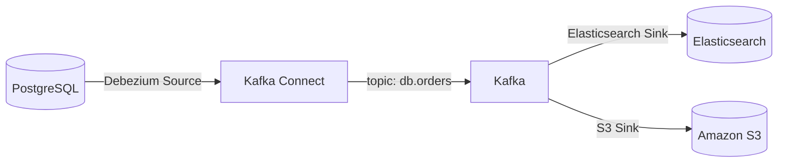

## Q35. (!) Зачем нужен `Schema Registry`?

`Schema Registry` — централизованное хранилище схем сообщений (`Avro`, `Protobuf`, `JSON Schema`). Проблема, которую он решает: в event-driven системе producer и consumer развиваются независимо, и стоит producer'у поменять формат сообщения — consumer'ы ломаются. Registry навязывает контракт: при публикации новой версии схемы он проверяет её совместимость по заданному правилу и отклоняет несовместимое изменение ещё до того, как «битые» данные попадут в топик.

**Режимы совместимости** определяют, какие изменения схемы разрешены:
- `BACKWARD` — новая схема может читать данные старой (можно удалять поля, добавлять с default); сначала обновляют consumer'ов
- `FORWARD` — старая схема может читать данные новой (можно добавлять поля, удалять optional); сначала обновляют producer'ов
- `FULL` — совместимость в обе стороны (только самые безопасные изменения)
- `NONE` — без проверок, любые изменения на свой риск

**Зачем на собеседовании:** показывает понимание проблем эволюции контрактов в [event-driven архитектуре](../architecture/event-driven-patterns-interview.md).

## Q36. (!) Что такое `Consumer Lag` и как его измерить?

`Consumer Lag` — разница между последним записанным offset (LEO) и последним committed offset consumer'а. По сути это «сколько сообщений ждут обработки» — главный индикатор здоровья consumer'а. Стабильный нулевой lag означает, что consumer успевает за producer'ом; растущий lag — сигнал, что обработка не справляется с потоком и скоро начнётся отставание данных.

```
LEO (Log End Offset):        150
Committed Offset:            120
Consumer Lag:                 30 сообщений
```

**Способы измерения:**
1. **CLI:** `kafka-consumer-groups.sh --describe --group my-group`
2. **JMX-метрики:** `kafka.consumer:type=consumer-fetch-manager-metrics,client-id=*`
3. **Burrow** — LinkedIn tool для мониторинга lag
4. **Prometheus + kafka-exporter** — экспорт метрик для [Grafana](../monitoring/metrics-tracing-interview.md)

**Что делать при растущем lag:**
- Увеличить количество consumer'ов (до числа партиций)
- Оптимизировать обработку сообщений
- Увеличить `max.poll.records`
- Проверить backpressure и GC-паузы

## Q37. Какие ключевые метрики `Kafka` нужно мониторить?

Метрики делятся на две группы: со стороны приложения главное — consumer lag (успеваем ли читать), со стороны кластера — здоровье репликации и контроллера (не теряем ли данные). Несколько метрик ниже — это «красные флаги», ненулевое значение которых почти всегда означает инцидент.

| Метрика | Что показывает | Порог тревоги |
|---------|---------------|---------------|
| Consumer Lag | Отставание consumer'а | Растёт > 5 мин |
| `UnderReplicatedPartitions` | Партиции с недостаточной репликацией | > 0 |
| `ActiveControllerCount` | Количество активных контроллеров | ≠ 1 |
| `OfflinePartitionsCount` | Недоступные партиции | > 0 |
| Request latency (p99) | Задержка запросов | > 100 мс |
| `BytesInPerSec` / `BytesOutPerSec` | Throughput брокера | Зависит от SLA |
| `ISRShrinks` / `ISRExpands` | Изменения ISR | Частые shrink = проблема |
| JVM Heap Usage | Память брокера | > 80% |

**Инструменты мониторинга:**
- `Prometheus` + `Grafana` + `kafka-exporter`
- `Confluent Control Center`
- `AKHQ` / `Kafka UI` / `Kafdrop`

## Q38. Как масштабировать `Kafka`-кластер?

Масштабирование Kafka идёт по двум осям, и важно понимать, что именно упирается в потолок. Если не хватает ёмкости или пропускной способности кластера — масштабируют брокеры; если не успевают читать — consumer'ов и партиции.

**Горизонтальное масштабирование:**
1. **Добавление брокеров** — увеличивает суммарную ёмкость и throughput, но существующие партиции не переедут сами — нужен reassignment
2. **Увеличение партиций** — поднимает потолок параллелизма чтения (consumer'ов в группе не может быть больше, чем партиций)
3. **Добавление consumer'ов** — ускоряет обработку, но только до числа партиций; дальше новые consumer'ы простаивают

**Вертикальное масштабирование:**
- Увеличение RAM (page cache)
- Быстрые SSD-диски
- Увеличение сетевой пропускной способности

```bash
# Reassignment партиций на новые брокеры
kafka-reassign-partitions.sh --bootstrap-server localhost:9092 \
  --reassignment-json-file reassignment.json \
  --execute
```

**Ограничения:**
- Партиции нельзя уменьшить
- Reassignment — ресурсоёмкий процесс (throttle через `--throttle`)
- Больше партиций → дольше rebalance и leader election

## Q39. Как обеспечить безопасность в `Kafka`?

Безопасность Kafka строится из трёх независимых слоёв, отвечающих на разные вопросы: шифрование (никто не подслушает трафик), аутентификация (кто ты) и авторизация (что тебе можно). Полноценная защита включает все три — например, `SASL_SSL` сочетает шифрование транспорта и проверку личности.

| Уровень | Механизм | Описание |
|---------|----------|----------|
| Транспорт | `SSL/TLS` | Шифрование данных в пути |
| Аутентификация | `SASL` (PLAIN, SCRAM, GSSAPI, OAUTHBEARER) | Проверка личности клиента |
| Авторизация | `ACL` | Контроль доступа к топикам/группам |
| Шифрование данных | Encryption at rest | Шифрование на уровне дисков |

```yaml
# Spring Boot — SSL + SASL
spring:
  kafka:
    properties:
      security.protocol: SASL_SSL
      sasl.mechanism: SCRAM-SHA-256
      sasl.jaas.config: >
        org.apache.kafka.common.security.scram.ScramLoginModule required
        username="myuser" password="mypassword";
    ssl:
      trust-store-location: classpath:kafka.truststore.jks
      trust-store-password: changeit
```

## Q40. (!) Что такое `Dead Letter Queue` (DLQ) в `Kafka`?

`Dead Letter Queue` (DLQ) или `Dead Letter Topic` (DLT) — отдельный топик, куда отправляются сообщения, которые не удалось обработать после всех попыток retry. Зачем это нужно: без DLT «ядовитое» сообщение (poison message) либо навсегда блокирует партицию бесконечными ретраями, либо просто молча теряется. DLT снимает дилемму — проблемная запись убирается из основного потока, обработка продолжается, а сообщение сохраняется для разбора и повторного запуска.

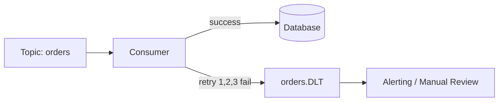

**Реализация в Spring Kafka:**
```java
@Bean
public DefaultErrorHandler errorHandler(KafkaTemplate<String, Object> template) {
    var recoverer = new DeadLetterPublishingRecoverer(template);
    return new DefaultErrorHandler(recoverer, new FixedBackOff(1000L, 3));
}
```

**Рекомендации:**
- Сохранять оригинальные headers (topic, partition, offset, exception) — без них непонятно, откуда и почему пришло сообщение
- Мониторить DLT — алерт при появлении сообщений (DLT не должен молча копиться)
- Реализовать механизм replay из DLT — починили причину, переиграли накопившееся

## Q41. (!) Как спроектировать правильную топологию топиков?

Хорошая топология топиков напрямую вытекает из свойств Kafka: порядок живёт в партиции, а партиция выбирается по ключу. Поэтому решения о топиках и ключах — это решения о масштабируемости, упорядоченности и эволюции контрактов.

**Принципы проектирования:**

1. **Один event-type — один топик** — не мешать разнородные события, иначе consumer'ы вынуждены фильтровать чужое и теряют чёткий контракт
2. **Naming convention:** `<domain>.<entity>.<event>`, например `shop.order.created` — единый шаблон делает топики самодокументируемыми
3. **Ключ сообщения = entity ID** — обеспечивает порядок событий одной сущности и равномерное распределение по партициям
4. **Retention** — под SLA: 7 дней для обычных потоков, бесконечный (или compaction) для event-sourcing
5. **Compacted topics** — для справочников и current state, где важно только последнее значение по ключу

**Анти-паттерны:**
- Один «mega-topic» для всех событий
- Использование topic-per-consumer
- Частая смена числа партиций
- Отсутствие schema evolution стратегии

## Q42. В чём разница между `Kafka` и `RabbitMQ`?

Корень всех различий — модель хранения. Kafka это **лог**: сообщение остаётся в топике после прочтения, поэтому возможны replay и несколько независимых групп потребителей. RabbitMQ это **брокер очередей**: сообщение удаляется после подтверждения (ACK), зато доступна гибкая маршрутизация через exchange. Всё остальное в таблице — следствия этого выбора.

| Аспект | Kafka | RabbitMQ |
|--------|-------|----------|
| Модель | Distributed commit log | Message broker (AMQP) |
| Хранение | На диске, retention-based | Удаление после ACK |
| Порядок | В пределах партиции | В пределах очереди |
| Throughput | Очень высокий (млн msg/sec) | Средний (тыс. msg/sec) |
| Consumer model | Pull (poll) | Push + Pull |
| Replay | Да (перемотка offset) | Нет (сообщение удаляется) |
| Routing | По ключу → партиция | Exchange → routing key → queue |
| Протокол | Kafka Protocol (binary) | AMQP, MQTT, STOMP |
| Use case | Event streaming, data pipeline | Task queue, RPC, routing |

**Когда Kafka:** высокий throughput, event-sourcing, data pipeline, replay нужен.
**Когда RabbitMQ:** task queues, сложный routing, request-reply, низкие объёмы.

## Q43. Какие паттерны retry применяются с `Kafka`?

Главная сложность retry в Kafka — порядок: пока consumer повторяет одно сообщение, вся партиция стоит. Отсюда два класса решений. Blocking retry прост, но останавливает обработку; non-blocking retry через отдельные топики не блокирует партицию ценой потери строгого порядка.

**1. Blocking Retry** — повторная обработка прямо в consumer'е. Просто, но на время ретраев partition заблокирована — остальные сообщения ждут:
```java
@RetryableTopic(
    attempts = "3",
    backoff = @Backoff(delay = 1000, multiplier = 2),
    dltStrategy = DltStrategy.FAIL_ON_ERROR
)
@KafkaListener(topics = "orders")
public void consume(OrderEvent event) {
    processOrder(event); // может бросить исключение
}
```

**2. Non-Blocking Retry (Retry Topics)** — Spring Kafka переносит сбойное сообщение в отдельный retry-топик и сразу идёт дальше, поэтому основная партиция не простаивает; для каждой попытки заводится свой топик:
```
orders → orders-retry-0 → orders-retry-1 → orders-DLT
```

**3. Manual Retry** — отправка в retry-топик с задержкой:
- Используйте `ScheduledExecutorService` или Kafka timestamp для delayed retry

**Рекомендация:** `@RetryableTopic` в Spring Kafka — самый удобный вариант для non-blocking retry.

## Q44. (!) Какие практические советы для production-использования `Kafka`?

Сводный чек-лист по слоям. За каждой рекомендацией стоит уже разобранный механизм — связка `acks=all` + `min.insync.replicas=2` + `RF=3` для сохранности данных, manual commit для at-least-once, cooperative assignor против долгих rebalance, consumer lag как главный сигнал здоровья.

**Конфигурация кластера:**
- `replication.factor = 3`, `min.insync.replicas = 2`
- Минимум 3 брокера (лучше нечётное число)
- Выделенные диски для Kafka log (не shared с OS)
- Page cache — основной механизм производительности, выделяйте RAM

**Producer:**
- `acks=all` + `enable.idempotence=true`
- Используйте сжатие (`lz4` / `zstd`)
- Всегда указывайте ключ для порядка

**Consumer:**
- `enable.auto.commit=false` + manual commit после обработки
- `CooperativeStickyAssignor` для минимизации rebalance
- Настройте DLT для необрабатываемых сообщений
- `max.poll.records` и `max.poll.interval.ms` под ваш SLA

**Мониторинг:**
- Consumer lag — главная метрика
- `UnderReplicatedPartitions` → алерт
- Мониторьте JVM-метрики брокеров
- Используйте [distributed tracing](../monitoring/observability-interview.md) с `spring-kafka` + `Micrometer`

**Операции:**
- Автоматизируйте partition reassignment при добавлении брокеров
- Тестируйте failover-сценарии
- Используйте `KRaft` (Kafka 4.0+) — избавьтесь от ZooKeeper
- Schema Registry для эволюции контрактов

## Q45. (!) Как работает `Consumer Group Rebalancing` и что такое `Static Membership`?

**Consumer Group Rebalancing** — процесс перераспределения партиций между потребителями в группе. Происходит при:
- Добавлении нового consumer в группу
- Падении или уходе consumer (heartbeat timeout)
- Изменении числа партиций топика
- Изменении подписки consumer-а

**Фазы Rebalance (Eager Rebalance — старый алгоритм):**

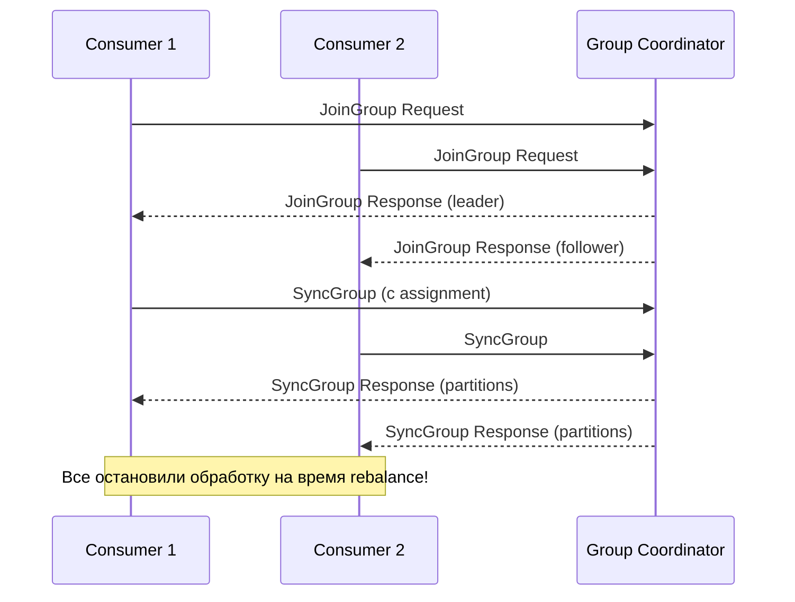

**Проблема Eager Rebalance:** в фазе JoinGroup все consumer'ы отдают все свои партиции и ждут нового назначения — на это время обработка во всей группе встаёт. Это и есть «stop-the-world», который особенно болезнен при частых деплоях или нестабильной сети.

**Cooperative Sticky Rebalance (Incremental Rebalance)** — ответ на эту проблему:
- Перераспределяются только реально переезжающие партиции
- Незатронутые consumer'ы продолжают работать без паузы
- Конфигурация: `partition.assignment.strategy=CooperativeStickyAssignor`

**Static Membership (`group.instance.id`)** решает другую боль — лишний rebalance при обычном рестарте/деплое consumer'а:

```yaml
spring:
  kafka:
    consumer:
      group-id: my-group
      properties:
        group.instance.id: "consumer-instance-1"  # уникальный статический ID
        session.timeout.ms: 60000   # даём больше времени на рестарт
```

Со статическим ID consumer при перезапуске **переиспользует** прежнее членство в группе, и если он вернулся до истечения `session.timeout.ms`, его партиции никуда не передавались — rebalance просто не нужен. Это особенно ценно для stateful Kafka Streams приложений: за инстансом сохраняется тот же набор партиций, а значит и локальные state store не приходится восстанавливать из changelog.

**Параметры влияющие на rebalance:**

| Параметр | Описание | Типичное значение |
|----------|----------|-------------------|
| `heartbeat.interval.ms` | Частота heartbeat consumer-а | 3000 |
| `session.timeout.ms` | Таймаут до объявления consumer мёртвым | 30000–60000 |
| `max.poll.interval.ms` | Макс. время между poll() вызовами | 300000 (5 мин) |
| `group.instance.id` | Статический ID для Static Membership | Имя pod/instance |

## Q46. (!) Что такое `Log Compaction` и как работает `__consumer_offsets`?

**Log Compaction** — альтернативная политика очистки топика, при которой Kafka хранит только **последнее значение для каждого ключа**, а устаревшие версии по тому же ключу удаляет. Это принципиально иной подход, чем `retention.ms`: обычное удаление выбрасывает старые сообщения по времени независимо от содержимого, а compaction смотрит на ключ и сохраняет актуальное состояние сколь угодно долго. Благодаря этому compacted-топик превращается в «таблицу последних значений» — основа для current-state потоков и восстановления состояния.

```
До compaction:
[K1:v1] [K2:v1] [K1:v2] [K3:v1] [K2:v2] [K1:v3]

После compaction:
[K2:v2] [K3:v1] [K1:v3]
```

**Настройка:**

```bash
# Создать топик с compaction
kafka-topics.sh --create \
  --topic user-profiles \
  --config cleanup.policy=compact \
  --config min.cleanable.dirty.ratio=0.5 \
  --config segment.ms=3600000

# Tombstone: null-value удаляет ключ из compacted log
kafka-console-producer.sh --topic user-profiles \
  --property "parse.key=true" \
  --property "key.separator=:" <<< "user:123:null"
```

**Применение:**
- `Event Sourcing` snapshot — только последнее состояние объекта
- Справочники (конфигурации, курсы валют) — всегда актуальное значение
- CDC (Change Data Capture) — полный snapshot + дельта изменений

**`__consumer_offsets` топик:**

Committed offsets хранятся не где-то отдельно, а в самой Kafka — во внутреннем топике `__consumer_offsets`. Это удачный пример того, как Kafka использует собственные механизмы: топик compacted, поэтому по каждой тройке `(group, topic, partition)` остаётся только актуальный offset, а нагрузку по группам распределяет хеширование `group_id` по 50 партициям.

```
Topic: __consumer_offsets
Partitions: 50 (по умолчанию)
Cleanup policy: compact

Ключ: [group_id, topic, partition]
Значение: [offset, metadata, timestamp]
```

**Как Kafka определяет партицию для группы:**

```
partition = hash(group_id) % 50
```

Coordinator брокер — тот, кто является лидером соответствующей партиции `__consumer_offsets`.

```bash
# Просмотр committed offsets напрямую
kafka-consumer-groups.sh \
  --bootstrap-server localhost:9092 \
  --group my-group \
  --describe

# GROUP  TOPIC     PARTITION  CURRENT-OFFSET  LOG-END-OFFSET  LAG
# my-grp orders    0          1500            1510            10
# my-grp orders    1          2300            2300            0
```

**Compaction для `__consumer_offsets`:** при commit нового offset старый удаляется из топика — хранится только актуальный offset для каждой `(group, topic, partition)` тройки.

## Q47. Как `Schema Registry` хранит схемы и обеспечивает совместимость?

`Schema Registry` (Confluent) — централизованное хранилище схем сообщений, обеспечивающее контрактную совместимость между producer'ами и consumer'ами. Ключевая идея экономии: в сам топик пишется не полная схема, а лишь её короткий `schema_id`; полное определение лежит в Registry и подтягивается по id. Producer регистрирует схему и получает id, consumer по этому id запрашивает схему и десериализует данные.

**Архитектура:**

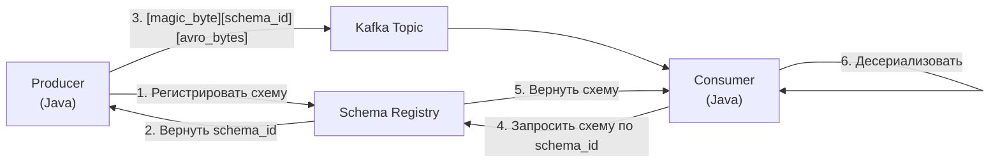

**Формат сообщения с Avro:**

```
Bytes: [0x00][schema_id 4 bytes][avro encoded payload]
```

**Регистрация схемы:**

```java
// Maven: confluent avro-serializer
<dependency>
    <groupId>io.confluent</groupId>
    <artifactId>kafka-avro-serializer</artifactId>
</dependency>

// application.yml
spring:
  kafka:
    producer:
      key-serializer: org.apache.kafka.common.serialization.StringSerializer
      value-serializer: io.confluent.kafka.serializers.KafkaAvroSerializer
    consumer:
      value-deserializer: io.confluent.kafka.serializers.KafkaAvroDeserializer
    properties:
      schema.registry.url: http://schema-registry:8081
      specific.avro.reader: true
```

**Уровни совместимости:**

| Уровень | Описание | Пример допустимого изменения |
|---------|----------|------------------------------|
| `BACKWARD` | Новая схема читает данные старой | Добавить поле с default |
| `FORWARD` | Старая схема читает данные новой | Удалить опциональное поле |
| `FULL` | Оба направления | Только безопасные изменения |
| `NONE` | Без проверок | Любые изменения |
| `BACKWARD_TRANSITIVE` | Backward относительно всех версий | Строгий контроль |

```bash
# Установить совместимость для субъекта
curl -X PUT http://schema-registry:8081/config/orders-value \
  -H "Content-Type: application/json" \
  -d '{"compatibility": "BACKWARD"}'

# Проверить совместимость перед деплоем
curl -X POST http://schema-registry:8081/compatibility/subjects/orders-value/versions/latest \
  -H "Content-Type: application/json" \
  -d '{"schema": "{\"type\":\"record\",\"name\":\"Order\",...}"}'
```

**Именование субъектов:**
- `TopicNameStrategy` (default): `<topic>-key`, `<topic>-value`
- `RecordNameStrategy`: по имени Avro record
- `TopicRecordNameStrategy`: `<topic>-<record_name>`

## Q48. (!) Как реализовать `Exactly-Once` с помощью транзакций `Kafka` и `idempotent producer`?

Это практический разбор Q23. Exactly-once собирается слоями: идемпотентный producer убирает дубликаты внутри одной партиции, транзакции делают атомарной запись в несколько партиций вместе с коммитом offset, а `read_committed` на стороне consumer прячет неподтверждённые записи. Каждый слой добавляет небольшой overhead — это и есть плата за самую строгую гарантию.

**Три уровня гарантий:**

| Уровень | Конфигурация | Риск |
|---------|-------------|------|
| At-most-once | `acks=0`, auto-commit | Потеря сообщений |
| At-least-once | `acks=all`, manual commit | Дубликаты |
| Exactly-once | Транзакции + `enable.idempotence` | Overhead |

**Idempotent Producer:**

```yaml
spring:
  kafka:
    producer:
      properties:
        enable.idempotence: true   # автоматически: acks=all, retries=MAX_INT
        max.in.flight.requests.per.connection: 5  # до 5 in-flight
```

Брокер присваивает Producer `PID` (Producer ID) и `sequence number`. Дублированные записи с одинаковым PID+sequence отвергаются.

**Транзакционный Producer (Exactly-Once Semantics):**

```java
// Конфигурация
props.put(ProducerConfig.TRANSACTIONAL_ID_CONFIG, "my-transactional-id");
props.put(ProducerConfig.ENABLE_IDEMPOTENCE_CONFIG, true);

KafkaProducer<String, String> producer = new KafkaProducer<>(props);
producer.initTransactions();

try {
    producer.beginTransaction();

    // Читаем из одного топика, пишем в другой (consume-transform-produce)
    producer.send(new ProducerRecord<>("output-topic", key, processedValue));

    // Commit offsets как часть транзакции
    producer.sendOffsetsToTransaction(currentOffsets, consumerGroupMetadata);

    producer.commitTransaction();
} catch (ProducerFencedException | OutOfOrderSequenceException e) {
    producer.close(); // non-recoverable
} catch (KafkaException e) {
    producer.abortTransaction();
}
```

**Consumer-side: читать только committed:**

```yaml
spring:
  kafka:
    consumer:
      properties:
        isolation.level: read_committed  # пропускать uncommitted записи
```

**EOS в Kafka Streams:**

```yaml
spring:
  kafka:
    streams:
      properties:
        processing.guarantee: exactly_once_v2  # Kafka 2.5+
```

`exactly_once_v2` использует одну транзакцию на партицию (vs одна на task в v1) — меньше overhead.

## Q49. Что такое `Kafka Streams State Store` и как реализовать `stateful`-обработку?

**State Store** — локальное хранилище (RocksDB или in-memory) при экземпляре Kafka Streams, в котором живёт состояние между сообщениями. Оно нужно любой stateful-операции: чтобы посчитать агрегат, сделать join или окно, приложению надо где-то держать промежуточный результат. Главный вопрос — что будет с этим состоянием при падении инстанса; ответ Kafka Streams в том, что каждый store зеркалируется в compacted changelog-топик, из которого состояние полностью восстанавливается после рестарта.

**Типы State Store:**

| Тип | Реализация | Персистентность |
|-----|-----------|----------------|
| Persistent (default) | RocksDB | Да (changelog топик) |
| In-memory | ConcurrentHashMap | Нет |
| Versioned | RocksDB + версии | Да |

**Changelog топик:** Kafka Streams автоматически создаёт backing топик для каждого State Store с `cleanup.policy=compact`. При рестарте приложение восстанавливает state из changelog.

**Пример: подсчёт заказов по категории (aggregation):**

```java
@Bean
public KStream<String, Order> orderStream(StreamsBuilder builder) {
    // Читаем из топика
    KStream<String, Order> orders = builder.stream("orders");

    // Группируем по категории и считаем
    KTable<String, Long> ordersByCategory = orders
        .groupBy((key, order) -> order.getCategory())
        .count(Materialized.as("orders-by-category-store"));

    // Интерактивный запрос к State Store (из другого потока/REST)
    ordersByCategory.toStream().to("orders-count-output");

    return orders;
}

// REST endpoint для interactive query
@RestController
public class StateQueryController {
    @Autowired
    private KafkaStreams kafkaStreams;

    @GetMapping("/count/{category}")
    public Long getCategoryCount(@PathVariable String category) {
        ReadOnlyKeyValueStore<String, Long> store =
            kafkaStreams.store(
                StoreQueryParameters.fromNameAndType(
                    "orders-by-category-store",
                    QueryableStoreTypes.keyValueStore()
                )
            );
        return store.get(category);
    }
}
```

**Windowed Aggregation:**

```java
// Скользящее окно: заказы за последние 5 минут
KTable<Windowed<String>, Long> windowedCounts = orders
    .groupBy((k, v) -> v.getCategory())
    .windowedBy(TimeWindows.ofSizeWithNoGrace(Duration.ofMinutes(5)))
    .count(Materialized.as("windowed-orders-store"));
```

**Standby Replicas:** для High Availability State Store реплицируется на другие экземпляры:

```yaml
spring:
  kafka:
    streams:
      properties:
        num.standby.replicas: 1  # 1 standby replica для каждого state store
```

## Q50. Как организовать мониторинг `__consumer_offsets` и `Consumer Lag` алертинг?

**Consumer Lag** = `log-end-offset - committed-offset` — ключевая метрика здоровья системы. Грамотный мониторинг строится в два шага: сначала надёжно вычислить lag (через CLI, `AdminClient` или Micrometer-метрики), затем повесить на него алерт с порогами и временем срабатывания (`for`), чтобы реагировать на устойчивое отставание, а не на разовые всплески.

**Инструменты мониторинга:**

```bash
# 1. kafka-consumer-groups.sh (базовый)
kafka-consumer-groups.sh \
  --bootstrap-server kafka:9092 \
  --group my-group \
  --describe

# 2. Программный мониторинг через AdminClient
AdminClient admin = AdminClient.create(props);
Map<TopicPartition, OffsetAndMetadata> offsets =
    admin.listConsumerGroupOffsets("my-group")
         .partitionsToOffsetAndMetadata().get();

// Получить log-end-offsets
Map<TopicPartition, Long> endOffsets =
    admin.listOffsets(offsets.keySet().stream()
        .collect(Collectors.toMap(tp -> tp, tp -> OffsetSpec.latest())))
    .all().get()
    .entrySet().stream()
    .collect(Collectors.toMap(Map.Entry::getKey, e -> e.getValue().offset()));

// Lag = end - committed
offsets.forEach((tp, meta) -> {
    long lag = endOffsets.get(tp) - meta.offset();
    System.out.printf("Partition %s: lag=%d%n", tp, lag);
});
```

**Micrometer + Spring Kafka метрики:**

```yaml
management:
  metrics:
    tags:
      application: my-service
```

Метрики доступны автоматически:
- `kafka.consumer.fetch.manager.records.lag` — текущий lag
- `kafka.consumer.fetch.manager.records.lag.max` — максимальный lag
- `kafka.producer.record.send.rate` — скорость отправки

**Алертинг (пример для Victoria Metrics / Prometheus):**

```yaml
# PrometheusRule / alertmanager rule
groups:
  - name: kafka-consumer-lag
    rules:
      - alert: KafkaConsumerHighLag
        expr: kafka_consumer_fetch_manager_records_lag_max > 10000
        for: 5m
        labels:
          severity: warning
        annotations:
          summary: "Consumer lag высокий ({{ $value }} messages)"

      - alert: KafkaConsumerCriticalLag
        expr: kafka_consumer_fetch_manager_records_lag_max > 100000
        for: 2m
        labels:
          severity: critical
```

**AKHQ** — веб-интерфейс для просмотра лага в реальном времени: `http://akhq.<stand>.detmir-infra.ru`

**Причины роста лага:**
1. Consumer слишком медленно обрабатывает — увеличьте параллелизм (больше partition + consumer-инстансов)
2. `max.poll.records` слишком велик — уменьшите или оптимизируйте обработку
3. Downstream-зависимость (БД, внешний API) — circuit breaker, async processing
4. GC паузы в JVM — настройка heap и GC-алгоритма

---

## See also

- [Распределённые системы](../architecture/distributed-systems-interview.md) — CAP, репликация, отказоустойчивость, консенсус
- [Event-driven паттерны](../architecture/event-driven-patterns-interview.md) — Outbox, Saga, Event Sourcing, CQRS
- [Микросервисы](../architecture/microservices-interview.md) — асинхронная коммуникация, сервисная шина событий
- [Spring Cloud](../frameworks/spring/spring-cloud-interview.md) — Spring Cloud Stream, интеграция с Kafka в облачных приложениях
- [Стратегии кэширования](../architecture/caching-strategies-interview.md) — взаимодействие кэша и event-driven пайплайнов
- [CQRS и Event Sourcing](../architecture/cqrs-event-sourcing-interview.md) — применение Kafka как журнала событий в event sourcing
- [RxJava / Reactive](../reactive/rxjava-interview.md) — сравнение реактивных потоков и Kafka Streams
- [Kubernetes](../devops/kubernetes-interview.md) — деплой Kafka в Kubernetes, Strimzi Operator
- [Docker и контейнеризация](../devops/docker-interview.md) — контейнеризация Kafka-брокеров

- [AWS SQS и SNS](aws-sqs-sns-interview.md)
- [Сравнение Message Brokers](message-brokers-comparison-interview.md)
- [NATS](nats-interview.md)
- [Apache Pulsar](pulsar-interview.md)
- [RabbitMQ](rabbitmq-interview.md)
- [Redpanda](redpanda-interview.md)
- [Шпаргалка: Apache Kafka для Java](../../development/messaging/kafka/kafka.md) — теория
- [JMS и ActiveMQ](jms-activemq-interview.md) — классический брокерный обмен с ack/transacted-session против лога Kafka
