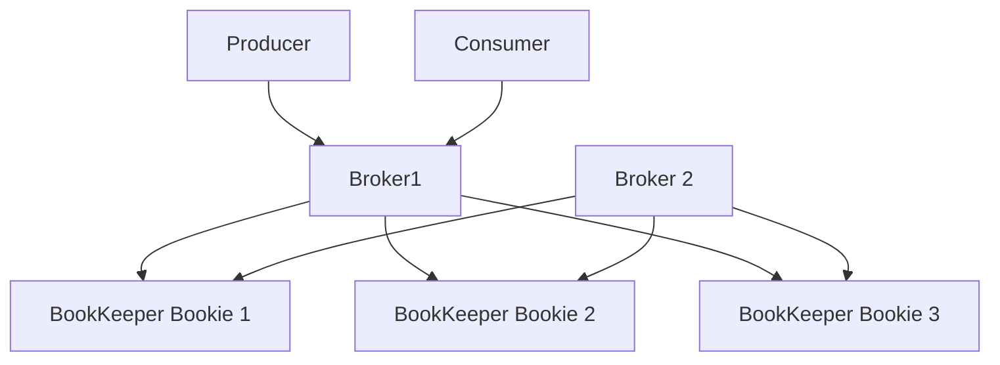

# Вопросы на собеседовании: `Apache Pulsar`

`Apache Pulsar` — cloud-native распределённая платформа для messaging и streaming. Создана в **Yahoo!** (2013), открыта в 2016, стала top-level проектом Apache в 2018. Главные отличия от Kafka: **раздельные compute и storage** (через BookKeeper), встроенная **multi-tenancy**, нативная **geo-replication**, **Pulsar Functions** (compute).

## Полезные ссылки

### Официальная документация и авторитетные источники

- [Apache Pulsar Documentation](https://pulsar.apache.org/docs/)
- [Pulsar Architecture](https://pulsar.apache.org/docs/concepts-architecture-overview/)
- [Apache BookKeeper](https://bookkeeper.apache.org/)
- [Pulsar vs Kafka](https://streamnative.io/blog/apache-pulsar-vs-apache-kafka)
- [StreamNative](https://streamnative.io/) — коммерческий Pulsar

## Содержание

- [Полезные ссылки](#полезные-ссылки)
- [See also](#see-also)

**Базовые понятия**
- [Q1. (!) Что такое Apache Pulsar?](#q1--что-такое-apache-pulsar)
- [Q2. (!) Pulsar vs Kafka — основные отличия?](#q2--pulsar-vs-kafka--основные-отличия)
- [Q3. Cloud-native — что это значит?](#q3-cloud-native--что-это-значит)

**Архитектура**
- [Q4. (!) Brokers + Bookies (separated compute/storage)?](#q4--brokers--bookies-separated-computestorage)
- [Q5. (!) Apache BookKeeper?](#q5--apache-bookkeeper)
- [Q6. ZooKeeper / Oxia роль?](#q6-zookeeper--oxia-роль)
- [Q7. Topics, segments, ledgers?](#q7-topics-segments-ledgers)

**Модели подписок**
- [Q8. (!) Subscription types (Exclusive, Shared, Failover, Key_Shared)?](#q8--subscription-types-exclusive-shared-failover-key_shared)
- [Q9. (!) Чем Shared отличается от Kafka consumer group?](#q9--чем-shared-отличается-от-kafka-consumer-group)

**Multi-tenancy**
- [Q10. (!) Tenants, namespaces, topics?](#q10--tenants-namespaces-topics)
- [Q11. Resource isolation между tenants?](#q11-resource-isolation-между-tenants)

**Geo-replication**
- [Q12. (!) Geo-replication в Pulsar?](#q12--geo-replication-в-pulsar)
- [Q13. Replicated subscriptions?](#q13-replicated-subscriptions)

**Functions и коннекторы**
- [Q14. (!) Pulsar Functions — что это?](#q14--pulsar-functions--что-это)
- [Q15. Pulsar IO (connectors)?](#q15-pulsar-io-connectors)

**Storage**
- [Q16. (!) Tiered storage (S3, GCS)?](#q16--tiered-storage-s3-gcs)
- [Q17. Topic compaction?](#q17-topic-compaction)

**Совместимость**
- [Q18. (!) Kafka-on-Pulsar (KoP)?](#q18--kafka-on-pulsar-kop)
- [Q19. AMQP-on-Pulsar (AoP)?](#q19-amqp-on-pulsar-aop)

**Production**
- [Q20. (!) Когда выбрать Pulsar над Kafka?](#q20--когда-выбрать-pulsar-над-kafka)
- [Q21. Какие минусы Pulsar?](#q21-какие-минусы-pulsar)
- [Q22. Кто использует Pulsar?](#q22-кто-использует-pulsar)

## Q1. (!) Что такое Apache Pulsar?

(!) Что такое Apache Pulsar?

**Apache Pulsar** — распределённая платформа для messaging и streaming.

**Создана в Yahoo!** под внутренние нужды (2013), открыта в 2016, стала top-level проектом Apache в 2018.

**Ключевые особенности:**
- **Раздельные compute и storage** (Brokers + BookKeeper)
- **Встроенная multi-tenancy**
- **Нативная geo-replication**
- **Pulsar Functions** (лёгкий compute)
- **Tiered storage** (offload в S3)
- **Несколько типов подписок** (гибче, чем consumer-группы Kafka)
- **И messaging, и streaming** (семантика очереди + лога)

**Применения:** event streaming, микросервисы, IoT, multi-region приложения.

## Q2. (!) Pulsar vs Kafka — основные отличия?

| Критерий | Pulsar | Kafka |
|----------|--------|-------|
| Архитектура | Compute (Brokers) + Storage (BookKeeper) разделены | Compute + Storage совмещены на brokers |
| Multi-tenancy | **Встроенная** (tenants, namespaces) | Вручную (через ACL, отдельные кластеры) |
| Geo-replication | **Нативная** | MirrorMaker (отдельный инструмент) |
| Типы подписок | 4 типа (Exclusive, Shared, Failover, Key_Shared) | Только consumer-группы |
| Tiered storage | **Встроенный** (S3, GCS) | KIP-405 (новее, менее зрелый) |
| Functions / streams | Pulsar Functions (встроенные) | Kafka Streams (внешняя библиотека) |
| Масштабирование compute | Brokers stateless, масштабируются отдельно от storage | Нужен rebalance партиций |
| Зрелость | Ниже, чем у Kafka | Максимально зрелый |
| Распространённость | Меньше | Огромная |
| Операционная сложность | Выше (больше компонентов) | Концептуально проще |

**Pulsar** — современная архитектура, но рынком **доминирует Kafka**.

## Q3. Cloud-native — что это значит?

Что значит **«cloud-native»** для Pulsar:
- **Brokers stateless** — легко добавляются и убираются
- **Storage отдельно** (BookKeeper) — независимое масштабирование
- **Дружелюбен к контейнерам** (деплой в Kubernetes через Pulsar Operator)
- **Tiered storage** — холодные данные в объектном хранилище (S3, дёшево)
- **Multi-tenant** — один кластер под много сценариев

**Наследие Kafka:** brokers совмещают compute и storage. Добавление мощности = rebalance партиций (медленно).

## Q4. (!) Brokers + Bookies (separated compute/storage)?



**Brokers:**
- **Stateless** — обслуживают соединения producer/consumer
- Логика маршрутизации
- Масштабируются **горизонтально без rebalancing**
- Легко добавлять и убирать

**Bookies (узлы BookKeeper):**
- Постоянное хранилище
- Реплицированные записи (настраиваемый Q)
- Масштабируются независимо от brokers

**Эффект:**
- Добавляем brokers → обрабатываем больше соединений (без перемещения данных)
- Добавляем bookies → больше storage (без изменений в brokers)

В отличие от Kafka, где broker = compute + storage = rebalance-ад при масштабировании.

## Q5. (!) Apache BookKeeper?

**Apache BookKeeper** — распределённая система хранения логов. Уровнем ниже, чем Pulsar.

**Понятия:**
- **Bookies** — узлы хранения
- **Ledgers** — append-only последовательность записей (entries)
- **Ensembles** — группа bookies, хранящих ledger

**Репликация:**
- **Ensemble size (E)** — всего bookies на ledger
- **Quorum write (Q_w)** — сколько bookies должны подтвердить запись
- **Quorum read (Q_r)** — сколько bookies должны подтвердить чтение

```
E=3, Q_w=2: 3 replicas, write needs 2 acks
```

**Строгая согласованность (strong consistency)** благодаря quorum writes.

**Изначально создан под HA для Hadoop NameNode**. Сейчас используется в Pulsar, DistributedLog, Salesforce, Twitter.

## Q6. ZooKeeper / Oxia роль?

**ZooKeeper** исторически использовался в Pulsar для:
- Метаданных кластера
- Владения топиками (topic ownership)
- Обнаружения сервисов (service discovery)
- Координации

**Oxia** (с Pulsar 3.0+) — новый сервис метаданных, заменяющий ZooKeeper.
- Выше производительность
- Заточен под Pulsar
- Меньше операционной сложности

В **2025** — переход с ZK на Oxia для новых развёртываний.

## Q7. Topics, segments, ledgers?

**Topic** = поток сообщений (как topic в Kafka).

```
persistent://tenant/namespace/topic
```

**Segment** = кусок данных топика (= ledger в BookKeeper).

```
Topic → Segment 1 (ledger 1, bookies A,B,C)
     → Segment 2 (ledger 2, bookies B,C,D)
     → Segment 3 (ledger 3, bookies A,C,D)
```

**Каждый segment** может лежать на разных bookies → **распределяется** автоматически.

**В сравнении с партициями Kafka:**
- Партиция Kafka = хранение на одном broker (без автоматического распределения)
- Данные топика Pulsar = распределены по bookies из коробки

## Q8. (!) Subscription types (Exclusive, Shared, Failover, Key_Shared)?

**4 типа подписок:**

**Exclusive** — один consumer на подписку (как очередь).
```
Consumer A connects → only A receives messages
```

**Failover** — один активный consumer + резервный (standby). Если активный отключается → следующий перехватывает.
```
Active consumer → all messages
Standby consumer → standby
```

**Shared** — несколько consumers, **с балансировкой нагрузки** (round-robin).
```
Consumer A, B, C → each gets 1/3 messages
```

**Key_Shared** — несколько consumers, упорядочивание по ключу.
```
key="user1" → always consumer A
key="user2" → always consumer B
```

**В сравнении с Kafka:** в Kafka есть только consumer-группа (~ похожа на Failover с распределением по партициям).

## Q9. (!) Чем Shared отличается от Kafka consumer group?

**Consumer-группа Kafka:**
- Каждая партиция назначена ОДНОМУ consumer
- **Максимальный параллелизм** = число партиций
- Consumers больше, чем партиций = **простаивающие consumers**

**Pulsar Shared:**
- Каждое сообщение направляется ЛЮБОМУ consumer в подписке
- Добавление consumers = больше параллелизма (без rebalance!)
- **Нет понятия партиции** для количества consumers

**Эффект:**
- Pulsar Shared масштабирует consumers **независимо** от партиционирования
- Kafka требует **планировать партиции** заранее

**Trade-off:** Pulsar Shared не даёт гарантий упорядочивания по ключу (для этого используйте Key_Shared).

## Q10. (!) Tenants, namespaces, topics?

```
persistent://tenant/namespace/topic
```

**Tenant** = изоляция верхнего уровня (например, `marketing`, `engineering`).
**Namespace** = группировка внутри tenant (`marketing/campaigns`).
**Topic** = собственно поток.

**Сценарий (multi-tenant SaaS):**
```
acme-corp/orders/created
acme-corp/orders/cancelled
beta-corp/orders/created
```

**Политики на уровне tenant:**
- Квоты ресурсов (storage, throughput)
- Аутентификация, ACL
- Срок хранения (retention)
- Geo-replication

**Один кластер Pulsar** под много сценариев. В Kafka — обычно несколько кластеров.

## Q11. Resource isolation между tenants?

```bash
# Set resource quota
pulsar-admin namespaces set-backlog-quota acme-corp/orders \
  --limit 10G \
  --policy producer_request_hold

# Set throughput limit
pulsar-admin namespaces set-publish-rate acme-corp/orders \
  --msg-publish-rate 10000

# Set max consumers
pulsar-admin namespaces set-max-consumers-per-subscription acme-corp/orders 50
```

**Жёсткая изоляция (hard):** broker принудительно соблюдает квоты — один tenant не может повлиять на других.

**Мягкая изоляция (soft):** продвинутый вариант — закрепление brokers/bookies за конкретными tenants.

## Q12. (!) Geo-replication в Pulsar?

**Нативная multi-region** репликация.

```bash
# Topic replicated к multiple clusters
pulsar-admin namespaces set-clusters acme-corp/orders \
  --clusters us-east,eu-west,ap-northeast
```

**Асинхронная репликация** между кластерами. Producers пишут в локальный кластер, данные реплицируются асинхронно.

**В сравнении с Kafka:**
- Kafka: отдельный инструмент **MirrorMaker**
- Pulsar: встроено, проще в эксплуатации

**Сценарии:**
- Аварийное восстановление (disaster recovery)
- Multi-region приложения (низкая локальная latency)
- Комплаенс (резидентность данных)

## Q13. Replicated subscriptions?

**Cross-region** репликация состояния подписки.

**Сценарий:** consumer переключается (failover) на другой регион — состояние (offsets) остаётся согласованным.

```bash
pulsar-admin topics set-replicated-subscription \
  persistent://tenant/ns/topic my-subscription
```

**Pulsar отслеживает** позицию offset глобально → consumer в eu-west продолжает с того места, где остановился consumer в us-east.

Мощный механизм для **active-active** multi-region конфигураций.

## Q14. (!) Pulsar Functions — что это?

**Pulsar Functions** — лёгкий слой compute. Обрабатывает сообщения без внешней системы (Spark, Flink).

```python
def process(input):
    return input.upper()
```

```bash
pulsar-admin functions create \
  --inputs persistent://tenant/ns/raw \
  --output persistent://tenant/ns/processed \
  --classname my_module.process
```

**Языки:** Java, Python, Go.

**Режимы:**
- **Local** (запуск внутри pulsar broker)
- **Cluster** (отдельные pods в K8s)

**Сценарии:**
- Фильтрация, преобразования
- Маршрутизация
- Обогащение (enrichment)
- Оконные агрегации (ограниченно)

**Не подходит для:** сложной потоковой обработки — в этом случае используйте Flink/Spark.

## Q15. Pulsar IO (connectors)?

**Pulsar IO** = готовые коннекторы к внешним системам.

```bash
# Create source connector (read from Kafka)
pulsar-admin sources create \
  --tenant public --namespace default \
  --name kafka-source \
  --source-type kafka \
  --destination-topic-name persistent://public/default/from-kafka

# Create sink connector (write to Postgres)
pulsar-admin sinks create \
  --tenant public --namespace default \
  --name pg-sink \
  --sink-type jdbc-postgres \
  --inputs persistent://public/default/orders
```

**Коннекторы:** Kafka, Postgres, MongoDB, Cassandra, Elasticsearch, Redis, S3 и т. д.

Аналог **Kafka Connect**, интегрированный в Pulsar.

## Q16. (!) Tiered storage (S3, GCS)?

**Встроенный offloading** старых ledgers в объектное хранилище.

```bash
pulsar-admin namespaces set-offload-policies acme-corp/orders \
  --offload-driver aws-s3 \
  --bucket my-pulsar-offload \
  --offload-after-threshold 100G
```

После 100 GB на BookKeeper → старые данные перемещаются в S3.

**Чтение:** Pulsar **прозрачно** читает из S3, если данные выгружены. Медленнее, но дёшево.

**Экономия:** S3 ~ $0.023/GB против SSD $0.10+. **В 5–10 раз дешевле** при длительном retention.

В **Kafka** — KIP-405 (Tiered Storage) вводит похожее (с Kafka 3.6+, менее зрелое).

## Q17. Topic compaction?

**Compaction** — хранить только **последнее сообщение на ключ**.

```bash
pulsar-admin topics compact persistent://tenant/ns/topic
```

**Сценарии:**
- **Актуальное состояние** объектов (профили пользователей, конфиги)
- Реестр схем (schema registry)
- Compaction уменьшает объём хранилища

**Compacted-топики** можно переиграть (replay) как актуальный снапшот.

## Q18. (!) Kafka-on-Pulsar (KoP)?

**KoP** — Pulsar broker, выставляющий наружу **Kafka wire protocol**.

**Эффект:** Kafka-клиенты (producers, consumers, Kafka Streams) общаются с Pulsar **без изменений кода**.

```
Kafka Producer → Pulsar (KoP) → Pulsar storage
```

**Сценарий:** постепенная миграция Kafka → Pulsar. Развернуть Pulsar с KoP, переключать клиентов один за другим.

Изначально проект StreamNative, теперь плагин Apache Pulsar.

## Q19. AMQP-on-Pulsar (AoP)?

**Та же идея для AMQP** (протокол RabbitMQ).

**Клиенты RabbitMQ** общаются с Pulsar.

Встречается реже, чем KoP. Миграции с RabbitMQ менее частые.

## Q20. (!) Когда выбрать Pulsar над Kafka?

**Выбирай Pulsar когда:**
- Нужна **multi-tenancy** (SaaS, внутренняя платформа)
- Нужна нативная **geo-replication** (multi-region приложения)
- **Нужно масштабировать compute и storage раздельно**
- **Длительный retention** с дешёвым хранилищем (tiered в S3)
- Раздражает сложность Kafka MirrorMaker
- Нужны **разные паттерны подписок**
- Важна современная cloud-native архитектура

**Не выбирай когда:**
- Уже глубоко вложились в Kafka
- Нужна **огромная экосистема** (у Kafka она больше)
- Меньший масштаб (Kafka проще в эксплуатации)
- У команды нет опыта с Pulsar
- Нужна максимальная совместимость (Kafka — стандарт)

## Q21. Какие минусы Pulsar?

1. **Операционная сложность** — больше компонентов (brokers + bookies + ZK/Oxia)
2. **Меньшее сообщество и экосистема** по сравнению с Kafka
3. **Меньше документации и статей в блогах**
4. **Меньше качественных клиентских библиотек** (Java — лучший, остальные слабее)
5. **Меньше обкатан** на экстремальных масштабах
6. **Более крутая кривая обучения**
7. **Больше багов / меньше стабильности**, чем у Kafka (субъективно, улучшается)
8. **Меньше интеграций с внешними инструментами** (у Kafka их больше)
9. **Слабее потоковая обработка** — есть интеграция с Flink, но Kafka Streams зрелее

## Q22. Кто использует Pulsar?

- **Yahoo!** (создатель) — внутренний messaging, IoT
- **Tencent** — множество сценариев
- **Splunk** — внутренняя инфраструктура
- **Verizon Media** (Yahoo)
- **Iterable** (маркетинг)
- **Iconectiv** (телеком)
- **Salesforce** — часть сервисов
- **Comcast** — часть сервисов

**Распространённость** растёт, но **сильно отстаёт от Kafka** по доле рынка. Ниша — cloud-native, multi-tenant системы.

В **2025** — нишевый, но растущий игрок в области messaging.

## See also

- [Apache Kafka](kafka-interview.md) — главный конкурент
- [NATS](nats-interview.md) — другая альтернатива
- [RabbitMQ](rabbitmq-interview.md) — enterprise-messaging
- [Message Brokers Comparison](message-brokers-comparison-interview.md) — обзор
- [Kafka Streams](../data-engineering/kafka-streams-interview.md) — в сравнении с Pulsar Functions
- [Apache Flink](../data-engineering/apache-flink-interview.md) — потоковая обработка
- [Event-driven Patterns](../architecture/event-driven-patterns-interview.md) — контекст
- [Микросервисы](../architecture/microservices-interview.md) — основной сценарий
- [Stream Processing](../data-engineering/stream-processing-interview.md) — контекст
- [Распределённые системы](../architecture/distributed-systems-interview.md) — BookKeeper, репликация
- [Scalability Patterns](../architecture/scalability-patterns-interview.md) — раздельные storage и compute
- [Caching](../architecture/caching-strategies-interview.md) — для ускорения
- [Saga Pattern](../architecture/saga-pattern-interview.md) — для хореографических саг

- [Apache Kafka](kafka-interview.md)
- [Сравнение Message Brokers](message-brokers-comparison-interview.md)
- [NATS](nats-interview.md)
- [RabbitMQ](rabbitmq-interview.md)
- [Redpanda](redpanda-interview.md)
