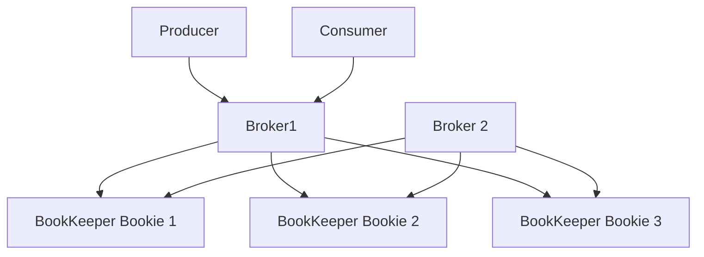

# Вопросы на собеседовании: `Apache Pulsar`

`Apache Pulsar` — cloud-native distributed messaging + streaming platform. Создан **Yahoo!** (2013), open-sourced 2016, Apache top-level 2018. Главные differentiators vs Kafka: **separated compute and storage** (через BookKeeper), **multi-tenancy** built-in, **geo-replication** native, **Pulsar Functions** (compute).

Дата последнего обновления: 2026-04-19

## Полезные ссылки

### Официальная документация и авторитетные источники

- [Apache Pulsar Documentation](https://pulsar.apache.org/docs/)
- [Pulsar Architecture](https://pulsar.apache.org/docs/concepts-architecture-overview/)
- [Apache BookKeeper](https://bookkeeper.apache.org/)
- [Pulsar vs Kafka](https://streamnative.io/blog/apache-pulsar-vs-apache-kafka)
- [StreamNative](https://streamnative.io/) — commercial Pulsar

## Содержание

- [Полезные ссылки](#полезные-ссылки)
- [See also](#see-also)

**Базовые понятия**
- [Q1. (!) Что такое Apache Pulsar?](#q1--что-такое-apache-pulsar)
- [Q2. (!) Pulsar vs Kafka — основные отличия?](#q2--pulsar-vs-kafka--основные-отличия)
- [Q3. Cloud-native — что это значит?](#q3-cloud-native--что-это-значит)

**Архитектура**
- [Q4. (!) Brokers + Bookies (separated compute/storage)?](#q4--brokers--bookies-separated-computestorage)
- [Q5. (!) Apache BookKeeper?](#q5--apache-bookkeeper)
- [Q6. ZooKeeper / Oxia роль?](#q6-zookeeper--oxia-роль)
- [Q7. Topics, segments, ledgers?](#q7-topics-segments-ledgers)

**Subscription модели**
- [Q8. (!) Subscription types (Exclusive, Shared, Failover, Key_Shared)?](#q8--subscription-types-exclusive-shared-failover-key_shared)
- [Q9. (!) Чем Shared отличается от Kafka consumer group?](#q9--чем-shared-отличается-от-kafka-consumer-group)

**Multi-tenancy**
- [Q10. (!) Tenants, namespaces, topics?](#q10--tenants-namespaces-topics)
- [Q11. Resource isolation между tenants?](#q11-resource-isolation-между-tenants)

**Geo-replication**
- [Q12. (!) Geo-replication в Pulsar?](#q12--geo-replication-в-pulsar)
- [Q13. Replicated subscriptions?](#q13-replicated-subscriptions)

**Functions и connectors**
- [Q14. (!) Pulsar Functions — что это?](#q14--pulsar-functions--что-это)
- [Q15. Pulsar IO (connectors)?](#q15-pulsar-io-connectors)

**Storage**
- [Q16. (!) Tiered storage (S3, GCS)?](#q16--tiered-storage-s3-gcs)
- [Q17. Topic compaction?](#q17-topic-compaction)

**Compatibility**
- [Q18. (!) Kafka-on-Pulsar (KoP)?](#q18--kafka-on-pulsar-kop)
- [Q19. AMQP-on-Pulsar (AoP)?](#q19-amqp-on-pulsar-aop)

**Production**
- [Q20. (!) Когда выбрать Pulsar над Kafka?](#q20--когда-выбрать-pulsar-над-kafka)
- [Q21. Какие минусы Pulsar?](#q21-какие-минусы-pulsar)
- [Q22. Кто использует Pulsar?](#q22-кто-использует-pulsar)

## Q1. (!) Что такое Apache Pulsar?

**Apache Pulsar** — distributed messaging + streaming platform.

**Создан в Yahoo!** для internal needs (2013), open-sourced 2016, Apache top-level 2018.

**Ключевые особенности:**
- **Separated compute and storage** (Brokers + BookKeeper)
- **Built-in multi-tenancy**
- **Native geo-replication**
- **Pulsar Functions** (lightweight compute)
- **Tiered storage** (offload к S3)
- **Multiple subscription types** (more flexible than Kafka groups)
- **Both messaging + streaming** (queue + log semantics)

**Применения:** event streaming, microservices, IoT, multi-region apps.

## Q2. (!) Pulsar vs Kafka — основные отличия?

| Критерий | Pulsar | Kafka |
|----------|--------|-------|
| Architecture | Compute (Brokers) + Storage (BookKeeper) separated | Compute + Storage colocated на brokers |
| Multi-tenancy | **Built-in** (tenants, namespaces) | Manual (через ACLs, separate clusters) |
| Geo-replication | **Native** | MirrorMaker (separate tool) |
| Subscription types | 4 types (Exclusive, Shared, Failover, Key_Shared) | Consumer groups only |
| Tiered storage | **Built-in** (S3, GCS) | KIP-405 (newer, less mature) |
| Functions / streams | Pulsar Functions (built-in) | Kafka Streams (external library) |
| Compute scaling | Brokers stateless, scale separate from storage | Need rebalance partitions |
| Maturity | Less than Kafka | Most mature |
| Adoption | Smaller | Huge |
| Operational complexity | Higher (more components) | Simpler conceptually |

**Pulsar** — modern architecture, but **Kafka dominates** market.

## Q3. Cloud-native — что это значит?

**"Cloud-native"** для Pulsar:
- **Brokers stateless** — can be added/removed easily
- **Storage separate** (BookKeeper) — independent scaling
- **Container-friendly** (Kubernetes deployments via Pulsar Operator)
- **Tiered storage** — cold data в object storage (S3, cheap)
- **Multi-tenant** — one cluster для many use cases

**Kafka legacy:** brokers do compute + storage. Adding capacity = rebalancing partitions (slow).

## Q4. (!) Brokers + Bookies (separated compute/storage)?



**Brokers:**
- **Stateless** — handle producer/consumer connections
- Routing logic
- Scale **horizontally без rebalancing**
- Easy to add/remove

**Bookies (BookKeeper nodes):**
- Persistent storage
- Replicated writes (configurable Q)
- Scale independently от brokers

**Эффект:**
- Add brokers → handle more connections (no data movement)
- Add bookies → more storage (no broker change)

vs Kafka где broker = compute + storage = rebalance hell при scaling.

## Q5. (!) Apache BookKeeper?

**Apache BookKeeper** — distributed log storage system. Lower-level than Pulsar.

**Concepts:**
- **Bookies** — storage nodes
- **Ledgers** — append-only sequence entries
- **Ensembles** — group bookies хранящих ledger

**Replication:**
- **Ensemble size (E)** — total bookies для ledger
- **Quorum write (Q_w)** — bookies must ack write
- **Quorum read (Q_r)** — bookies must ack read

```
E=3, Q_w=2: 3 replicas, write needs 2 acks
```

**Strong consistency** благодаря quorum writes.

**Originally designed для Hadoop NameNode HA**. Now used in Pulsar, DistributedLog, Salesforce, Twitter.

## Q6. ZooKeeper / Oxia роль?

**ZooKeeper** historically used by Pulsar для:
- Cluster metadata
- Topic ownership
- Service discovery
- Coordination

**Oxia** (с Pulsar 3.0+) — new metadata service replacing ZooKeeper.
- Better performance
- Pulsar-specific
- Less ops complexity

В **2025** — переход с ZK к Oxia для new deployments.

## Q7. Topics, segments, ledgers?

**Topic** = stream messages (как Kafka topic).

```
persistent://tenant/namespace/topic
```

**Segment** = chunk topic data (= ledger в BookKeeper).

```
Topic → Segment 1 (ledger 1, bookies A,B,C)
     → Segment 2 (ledger 2, bookies B,C,D)
     → Segment 3 (ledger 3, bookies A,C,D)
```

**Каждый segment** может быть на different bookies → **distributed** automatically.

**vs Kafka partitions:**
- Kafka partition = single broker storage (no automatic distribution)
- Pulsar topic data = distributed across bookies из коробки

## Q8. (!) Subscription types (Exclusive, Shared, Failover, Key_Shared)?

**4 subscription types:**

**Exclusive** — single consumer per subscription (queue-like).
```
Consumer A connects → only A receives messages
```

**Failover** — single active consumer + standby. Если active disconnects → next takes over.
```
Active consumer → all messages
Standby consumer → standby
```

**Shared** — multiple consumers, **load-balanced** (round-robin).
```
Consumer A, B, C → each gets 1/3 messages
```

**Key_Shared** — multiple consumers, ordered per key.
```
key="user1" → always consumer A
key="user2" → always consumer B
```

**vs Kafka:** Kafka only has consumer group (~ Failover-like с partition distribution).

## Q9. (!) Чем Shared отличается от Kafka consumer group?

**Kafka consumer group:**
- Each partition assigned к ONE consumer
- **Max parallelism** = number partitions
- Adding consumers > partitions = **idle consumers**

**Pulsar Shared:**
- Each message routed к ANY consumer in subscription
- Adding consumers = more parallelism (no rebalance!)
- **No partition concept** для consumer count

**Эффект:**
- Pulsar Shared scales consumers **independently** of partitioning
- Kafka requires **partition planning** upfront

**Trade-off:** Pulsar Shared не gives ordering guarantees per key (use Key_Shared для that).

## Q10. (!) Tenants, namespaces, topics?

```
persistent://tenant/namespace/topic
```

**Tenant** = top-level isolation (e.g., `marketing`, `engineering`).
**Namespace** = grouping within tenant (`marketing/campaigns`).
**Topic** = actual stream.

**Use case (multi-tenant SaaS):**
```
acme-corp/orders/created
acme-corp/orders/cancelled
beta-corp/orders/created
```

**Per-tenant policies:**
- Resource quotas (storage, throughput)
- Auth, ACLs
- Retention
- Geo-replication

**Single Pulsar cluster** для many use cases. Vs Kafka — multiple clusters обычно.

## Q11. Resource isolation между tenants?

```bash
# Set resource quota
pulsar-admin namespaces set-backlog-quota acme-corp/orders \
  --limit 10G \
  --policy producer_request_hold

# Set throughput limit
pulsar-admin namespaces set-publish-rate acme-corp/orders \
  --msg-publish-rate 10000

# Set max consumers
pulsar-admin namespaces set-max-consumers-per-subscription acme-corp/orders 50
```

**Hard isolation:** broker enforces quotas — one tenant can't impact others.

**Soft isolation:** advanced — assign brokers/bookies к specific tenants.

## Q12. (!) Geo-replication в Pulsar?

**Native multi-region** replication.

```bash
# Topic replicated к multiple clusters
pulsar-admin namespaces set-clusters acme-corp/orders \
  --clusters us-east,eu-west,ap-northeast
```

**Async replication** между clusters. Producers write к local cluster, async replicated.

**Vs Kafka:**
- Kafka: separate **MirrorMaker** tool
- Pulsar: built-in, simpler ops

**Use cases:**
- Disaster recovery
- Multi-region apps (low latency local)
- Compliance (data residency)

## Q13. Replicated subscriptions?

**Cross-region** subscription state replication.

**Use case:** consumer fails over к другой region — state (offsets) consistent.

```bash
pulsar-admin topics set-replicated-subscription \
  persistent://tenant/ns/topic my-subscription
```

**Pulsar tracks** offset position globally → consumer in eu-west picks up where us-east consumer left off.

Powerful для **active-active** multi-region setups.

## Q14. (!) Pulsar Functions — что это?

**Pulsar Functions** — lightweight compute layer. Process messages without external system (Spark, Flink).

```python
def process(input):
    return input.upper()
```

```bash
pulsar-admin functions create \
  --inputs persistent://tenant/ns/raw \
  --output persistent://tenant/ns/processed \
  --classname my_module.process
```

**Languages:** Java, Python, Go.

**Modes:**
- **Local** (run в pulsar broker)
- **Cluster** (separate K8s pods)

**Use cases:**
- Filtering, transformations
- Routing
- Enrichment
- Window aggregations (limited)

**Не для:** complex stream processing — use Flink/Spark в этом случае.

## Q15. Pulsar IO (connectors)?

**Pulsar IO** = pre-built connectors к external systems.

```bash
# Create source connector (read from Kafka)
pulsar-admin sources create \
  --tenant public --namespace default \
  --name kafka-source \
  --source-type kafka \
  --destination-topic-name persistent://public/default/from-kafka

# Create sink connector (write to Postgres)
pulsar-admin sinks create \
  --tenant public --namespace default \
  --name pg-sink \
  --sink-type jdbc-postgres \
  --inputs persistent://public/default/orders
```

**Connectors:** Kafka, Postgres, MongoDB, Cassandra, Elasticsearch, Redis, S3, etc.

Аналог **Kafka Connect**, integrated в Pulsar.

## Q16. (!) Tiered storage (S3, GCS)?

**Built-in offloading** старых ledgers к object storage.

```bash
pulsar-admin namespaces set-offload-policies acme-corp/orders \
  --offload-driver aws-s3 \
  --bucket my-pulsar-offload \
  --offload-after-threshold 100G
```

После 100 GB на BookKeeper → old data movement к S3.

**Reads:** Pulsar **transparently** reads from S3 если data offloaded. Slower, но cheap.

**Cost saving:** S3 ~ $0.023/GB vs SSD $0.10+. **5-10x cheaper** для long retention.

В **Kafka** — KIP-405 (Tiered Storage) introduces similar (с Kafka 3.6+, less mature).

## Q17. Topic compaction?

**Compaction** — keep only **latest message per key**.

```bash
pulsar-admin topics compact persistent://tenant/ns/topic
```

**Use case:**
- **Latest state** of objects (user profiles, configs)
- Schema registry
- Compaction reduces storage size

**Compacted topics** can be replayed как latest snapshot.

## Q18. (!) Kafka-on-Pulsar (KoP)?

**KoP** — Pulsar broker exposing **Kafka wire protocol**.

**Effect:** Kafka clients (producers, consumers, Kafka Streams) talk к Pulsar **without code changes**.

```
Kafka Producer → Pulsar (KoP) → Pulsar storage
```

**Use case:** migrate Kafka → Pulsar gradually. Deploy Pulsar with KoP, switch clients один за другим.

Originally StreamNative project, now Apache Pulsar plugin.

## Q19. AMQP-on-Pulsar (AoP)?

**Same idea для AMQP** (RabbitMQ protocol).

**RabbitMQ clients** talk к Pulsar.

Less common than KoP. RabbitMQ migrations less frequent.

## Q20. (!) Когда выбрать Pulsar над Kafka?

**Выбирай Pulsar когда:**
- **Multi-tenancy** требуется (SaaS, internal platform)
- **Geo-replication** native (multi-region apps)
- **Need compute и storage scale separately**
- **Long retention** with cheap storage (tiered к S3)
- Hate Kafka MirrorMaker complexity
- Want **multiple subscription patterns**
- Modern cloud-native architecture matters

**Не выбирай когда:**
- Already invested в Kafka deeply
- Need **massive ecosystem** (Kafka has more)
- Smaller scale (Kafka simpler ops)
- Team has no Pulsar experience
- Need maximum compatibility (Kafka standard)

## Q21. Какие минусы Pulsar?

1. **Operational complexity** — больше components (brokers + bookies + ZK/Oxia)
2. **Smaller community / ecosystem** vs Kafka
3. **Less documentation, blog posts**
4. **Fewer client libraries** quality (Java best, others weaker)
5. **Less battle-tested** at extreme scale
6. **Higher learning curve**
7. **More bugs / less stability** than Kafka (subjective, improving)
8. **Less integration с external tools** (Kafka has more)
9. **Stream processing weaker** — Flink integration, but Kafka Streams more mature

## Q22. Кто использует Pulsar?

- **Yahoo!** (creator) — internal messaging, IoT
- **Tencent** — multiple use cases
- **Splunk** — internal infrastructure
- **Verizon Media** (Yahoo)
- **Iterable** (marketing)
- **Iconectiv** (telecom)
- **Salesforce** — some services
- **Comcast** — some services

**Adoption** растёт но **far behind Kafka** market share. Niche для cloud-native, multi-tenant systems.

В **2025** — niche but growing player в messaging space.

---

## See also

- [Apache Kafka](kafka-interview.md) — main конкурент
- [NATS](nats-interview.md) — другая alternative
- [RabbitMQ](rabbitmq-interview.md) — enterprise messaging
- [Message Brokers Comparison](message-brokers-comparison-interview.md) — overview
- [Kafka Streams](../data-engineering/kafka-streams-interview.md) — vs Pulsar Functions
- [Apache Flink](../data-engineering/apache-flink-interview.md) — stream processing
- [Event-driven Patterns](../architecture/event-driven-patterns-interview.md) — context
- [Микросервисы](../architecture/microservices-interview.md) — primary use case
- [Stream Processing](../data-engineering/stream-processing-interview.md) — context
- [Распределённые системы](../architecture/distributed-systems-interview.md) — BookKeeper, replication
- [Scalability Patterns](../architecture/scalability-patterns-interview.md) — separated storage/compute
- [Caching](../architecture/caching-strategies-interview.md) — для acceleration
- [Saga Pattern](../architecture/saga-pattern-interview.md) — for choreographed sagas

- [[aws-sqs-sns-interview|AWS SQS и SNS]]
- [[kafka-interview|Apache Kafka]]
- [[message-brokers-comparison-interview|Сравнение Message Brokers]]
- [[nats-interview|NATS]]
- [[rabbitmq-interview|RabbitMQ]]
- [[redpanda-interview|Redpanda]]
