# Вопросы на собеседовании: `RabbitMQ`

Полное покрытие `RabbitMQ` для интервью: `AMQP`-протокол, типы `exchange`, очереди и их свойства, подтверждения доставки, `Dead Letter Queue`, `Publisher Confirms`, кластеризация, `quorum queues`, `Spring AMQP`, основные паттерны и мониторинг.

Дата последнего обновления: 2026-04-13

**`RabbitMQ`** — брокер сообщений, реализующий протокол `AMQP 0-9-1`. Широко применяется в [микросервисных](../architecture/microservices-interview.md) и [event-driven](../architecture/event-driven-patterns-interview.md) архитектурах для надёжной асинхронной коммуникации между сервисами.

## Полезные ссылки

### Официальная документация

- [RabbitMQ Tutorials](https://www.rabbitmq.com/tutorials) — официальные туториалы по всем паттернам
- [AMQP 0-9-1 Model Explained](https://www.rabbitmq.com/tutorials/amqp-concepts) — концепции протокола
- [RabbitMQ Reliability Guide](https://www.rabbitmq.com/docs/reliability) — гарантии доставки и надёжность
- [Quorum Queues](https://www.rabbitmq.com/docs/quorum-queues) — современный тип HA-очередей

### Статьи Baeldung

- [Introduction to RabbitMQ](https://www.baeldung.com/rabbitmq) — введение в RabbitMQ
- [RabbitMQ vs Kafka](https://www.baeldung.com/rabbitmq-vs-kafka) — детальное сравнение двух брокеров
- [Messaging Using Spring AMQP](https://www.baeldung.com/spring-amqp) — интеграция с Spring
- [RabbitMQ Dead Letter Exchanges](https://www.baeldung.com/rabbitmq-dead-letter-exchanges) — настройка DLX/DLQ
- [Publisher Confirms with Spring AMQP](https://www.baeldung.com/spring-amqp-publisher-confirms) — подтверждения публикации
- [Exchanges, Queues, and Bindings in RabbitMQ](https://www.baeldung.com/java-rabbitmq-exchanges-queues-bindings) — exchanges, очереди и bindings
- [Channels and Connections in RabbitMQ](https://www.baeldung.com/java-rabbitmq-channels-connections) — управление соединениями
- [Error Handling with Spring AMQP](https://www.baeldung.com/spring-amqp-error-handling) — обработка ошибок и retry

## Содержание

- [Полезные ссылки](#полезные-ссылки)
- [See also](#see-also)

**Основы AMQP**
- [Q1. (!) Что такое RabbitMQ и протокол AMQP?](#q1--что-такое-rabbitmq-и-протокол-amqp)
- [Q2. (!) Из каких компонентов состоит модель AMQP?](#q2--из-каких-компонентов-состоит-модель-amqp)
- [Q3. Что такое Virtual Host (vhost)?](#q3-что-такое-virtual-host-vhost)
- [Q4. Что такое Channel и зачем он нужен?](#q4-что-такое-channel-и-зачем-он-нужен)

**Exchanges**
- [Q5. (!) Какие типы Exchange существуют в RabbitMQ?](#q5--какие-типы-exchange-существуют-в-rabbitmq)
- [Q6. Как работает Direct Exchange?](#q6-как-работает-direct-exchange)
- [Q7. Как работает Fanout Exchange?](#q7-как-работает-fanout-exchange)
- [Q8. (!) Как работает Topic Exchange?](#q8--как-работает-topic-exchange)
- [Q9. Как работает Headers Exchange?](#q9-как-работает-headers-exchange)
- [Q10. Что такое Default Exchange?](#q10-что-такое-default-exchange)

**Queues**
- [Q11. (!) Какие свойства у очереди в RabbitMQ?](#q11--какие-свойства-у-очереди-в-rabbitmq)
- [Q12. Что такое durable queue и persistent message?](#q12-что-такое-durable-queue-и-persistent-message)
- [Q13. Что такое exclusive и auto-delete очередь?](#q13-что-такое-exclusive-и-auto-delete-очередь)
- [Q14. Как настроить TTL для сообщений и очереди?](#q14-как-настроить-ttl-для-сообщений-и-очереди)
- [Q15. Что такое максимальная длина очереди (max-length)?](#q15-что-такое-максимальная-длина-очереди-max-length)

**Bindings и Routing**
- [Q16. (!) Что такое Binding и Routing Key?](#q16--что-такое-binding-и-routing-key)
- [Q17. Можно ли привязать несколько очередей к одному Exchange?](#q17-можно-ли-привязать-несколько-очередей-к-одному-exchange)

**Acknowledgements**
- [Q18. (!) Что такое acknowledgement (ack) в RabbitMQ?](#q18--что-такое-acknowledgement-ack-в-rabbitmq)
- [Q19. Чем отличаются nack и reject?](#q19-чем-отличаются-nack-и-reject)
- [Q20. (!) В чём разница между auto-ack и manual ack?](#q20--в-чём-разница-между-auto-ack-и-manual-ack)
- [Q21. Что такое Publisher Confirms?](#q21-что-такое-publisher-confirms)
- [Q22. Чем Publisher Confirms отличаются от транзакций AMQP?](#q22-чем-publisher-confirms-отличаются-от-транзакций-amqp)

**Dead Letter Queue**
- [Q23. (!) Что такое Dead Letter Exchange (DLX) и DLQ?](#q23--что-такое-dead-letter-exchange-dlx-и-dlq)
- [Q24. При каких условиях сообщение попадает в DLQ?](#q24-при-каких-условиях-сообщение-попадает-в-dlq)
- [Q25. Как реализовать retry с использованием DLX и TTL?](#q25-как-реализовать-retry-с-использованием-dlx-и-ttl)

**QoS и Prefetch**
- [Q26. (!) Что такое prefetch count и QoS?](#q26--что-такое-prefetch-count-и-qos)
- [Q27. Как prefetch влияет на производительность и нагрузку?](#q27-как-prefetch-влияет-на-производительность-и-нагрузку)

**Кластеризация и High Availability**
- [Q28. (!) Как работает кластеризация в RabbitMQ?](#q28--как-работает-кластеризация-в-rabbitmq)
- [Q29. Что такое Mirrored Queues (Classic HA)?](#q29-что-такое-mirrored-queues-classic-ha)
- [Q30. (!) Что такое Quorum Queues и чем они лучше Mirrored?](#q30--что-такое-quorum-queues-и-чем-они-лучше-mirrored)
- [Q31. Что такое Federation и Shovel в RabbitMQ?](#q31-что-такое-federation-и-shovel-в-rabbitmq)

**Spring AMQP**
- [Q32. (!) Что такое Spring AMQP и RabbitTemplate?](#q32--что-такое-spring-amqp-и-rabbittemplate)
- [Q33. Как объявить очередь и exchange через Spring AMQP?](#q33-как-объявить-очередь-и-exchange-через-spring-amqp)
- [Q34. (!) Как настроить @RabbitListener?](#q34--как-настроить-rabbitlistener)
- [Q35. Как настроить retry-логику в Spring AMQP?](#q35-как-настроить-retry-логику-в-spring-amqp)

**Паттерны**
- [Q36. (!) Какие основные паттерны обмена сообщениями реализуются в RabbitMQ?](#q36--какие-основные-паттерны-обмена-сообщениями-реализуются-в-rabbitmq)
- [Q37. Как реализовать паттерн RPC через RabbitMQ?](#q37-как-реализовать-паттерн-rpc-через-rabbitmq)

**Мониторинг**
- [Q38. Как осуществляется мониторинг RabbitMQ через Management Plugin?](#q38-как-осуществляется-мониторинг-rabbitmq-через-management-plugin)
- [Q39. Какие метрики RabbitMQ наиболее важны?](#q39-какие-метрики-rabbitmq-наиболее-важны)

**RabbitMQ vs Kafka**
- [Q40. (!) В чём принципиальные отличия RabbitMQ от Kafka?](#q40--в-чём-принципиальные-отличия-rabbitmq-от-kafka)
- [Q41. Когда выбрать RabbitMQ, а когда Kafka?](#q41-когда-выбрать-rabbitmq-а-когда-kafka)

---

## Q1. (!) Что такое RabbitMQ и протокол AMQP?

**`RabbitMQ`** — брокер сообщений с открытым исходным кодом, реализующий протокол `AMQP 0-9-1` (Advanced Message Queuing Protocol). Написан на `Erlang`, что обеспечивает высокую отказоустойчивость и конкурентность.

**`AMQP`** — бинарный протокол уровня приложения для асинхронного обмена сообщениями. Ключевые характеристики:
- **Надёжность** — подтверждения доставки на уровне протокола
- **Маршрутизация** — гибкая маршрутизация через exchange и binding
- **Безопасность** — `TLS`, `SASL`-аутентификация
- **Совместимость** — стандартизованный протокол, независимый от реализации

`RabbitMQ` также поддерживает `STOMP`, `MQTT`, `AMQP 1.0` через плагины.

---

## Q2. (!) Из каких компонентов состоит модель AMQP?

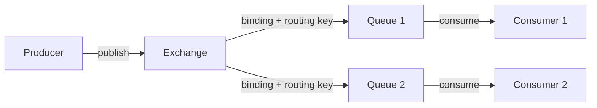

**Компоненты:**

| Компонент | Описание |
|-----------|----------|
| `Producer` | Публикует сообщения в `exchange` |
| `Exchange` | Принимает сообщения от `producer` и маршрутизирует в очереди |
| `Queue` | Буфер для хранения сообщений до получения `consumer` |
| `Binding` | Правило связи между `exchange` и `queue` |
| `Consumer` | Получает сообщения из очереди |
| `Channel` | Виртуальное соединение внутри `AMQP`-коннекшна |
| `Virtual Host` | Логическое разделение ресурсов брокера |

---

## Q3. Что такое Virtual Host (vhost)?

**`Virtual Host`** (`vhost`) — логическая изоляция ресурсов внутри одного `RabbitMQ`-сервера. Аналог баз данных в `PostgreSQL`.

- Каждый `vhost` имеет свои `exchange`, `queue`, `binding`, пользователей и права доступа
- По умолчанию создаётся `vhost` `/`
- Позволяет разным приложениям использовать один брокер без пересечения ресурсов

```java
// Подключение к конкретному vhost
ConnectionFactory factory = new ConnectionFactory();
factory.setVirtualHost("/my-app");
```

---

## Q4. Что такое Channel и зачем он нужен?

**`Channel`** — виртуальное соединение (`lightweight connection`) поверх физического `AMQP`-соединения (`Connection`).

**Зачем нужен:**
- Создание TCP-соединения дорого; `channel` позволяет мультиплексировать несколько логических потоков по одному TCP-соединению
- Каждый поток/поток должен работать с отдельным `channel` (не thread-safe)
- В одном `Connection` можно открыть тысячи `channel`

**Жизненный цикл:** `Connection` → открытие `Channel` → операции → закрытие `Channel`.

---

## Q5. (!) Какие типы Exchange существуют в RabbitMQ?

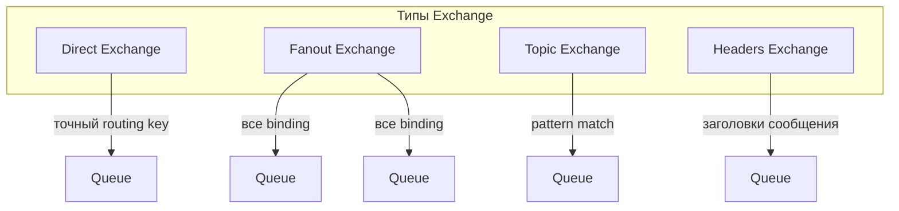

| Тип | Маршрутизация | Применение |
|-----|---------------|------------|
| `direct` | Точное совпадение `routing key` | Простая очередь задач |
| `fanout` | Всем привязанным очередям | Pub/Sub, рассылки |
| `topic` | Паттерн с `*` и `#` | Логи по категориям, события |
| `headers` | По заголовкам сообщения | Сложная маршрутизация без `routing key` |

---

## Q6. Как работает Direct Exchange?

**`Direct Exchange`** маршрутизирует сообщение в очередь, у которой `binding key` точно совпадает с `routing key` сообщения.

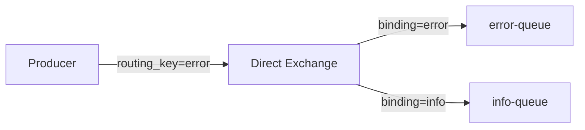

```java
// Объявление direct exchange
channel.exchangeDeclare("logs.direct", "direct", true);
// Привязка очереди
channel.queueBind("error-queue", "logs.direct", "error");
// Публикация
channel.basicPublish("logs.direct", "error", null, body);
```

Если `routing key` не совпадает ни с одним `binding` — сообщение отбрасывается (или уходит в `alternate exchange`).

---

## Q7. Как работает Fanout Exchange?

**`Fanout Exchange`** игнорирует `routing key` и рассылает каждое сообщение во все привязанные очереди. Используется для broadcast/Pub-Sub.

```java
channel.exchangeDeclare("notifications", "fanout", true);
// Привязка без routing key
channel.queueBind("mobile-queue", "notifications", "");
channel.queueBind("email-queue",  "notifications", "");
channel.queueBind("sms-queue",    "notifications", "");

// Публикация (routing key игнорируется)
channel.basicPublish("notifications", "", null, body);
```

Каждый подписчик получает собственную копию сообщения.

---

## Q8. (!) Как работает Topic Exchange?

**`Topic Exchange`** маршрутизирует сообщения по паттерну `routing key`, используя специальные символы:
- `*` — заменяет ровно одно слово
- `#` — заменяет ноль или более слов

Слова в `routing key` разделяются точкой: `region.service.severity`.

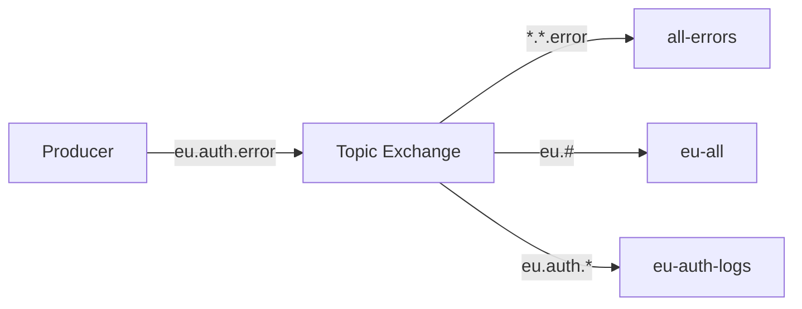

```java
channel.exchangeDeclare("logs.topic", "topic", true);
channel.queueBind("all-errors",   "logs.topic", "*.*.error");
channel.queueBind("eu-all",       "logs.topic", "eu.#");
channel.queueBind("eu-auth-logs", "logs.topic", "eu.auth.*");

// Сообщение "eu.auth.error" попадёт во все три очереди
channel.basicPublish("logs.topic", "eu.auth.error", null, body);
```

---

## Q9. Как работает Headers Exchange?

**`Headers Exchange`** маршрутизирует по заголовкам сообщения (`AMQP message headers`), игнорируя `routing key`.

При привязке задаётся аргумент `x-match`:
- `all` — все указанные заголовки должны совпадать
- `any` — хватит совпадения хотя бы одного заголовка

```java
Map<String, Object> bindingArgs = new HashMap<>();
bindingArgs.put("x-match", "all");
bindingArgs.put("format", "pdf");
bindingArgs.put("type", "report");

channel.queueBind("pdf-reports", "docs.exchange", "", bindingArgs);

// Публикация с заголовками
AMQP.BasicProperties props = new AMQP.BasicProperties.Builder()
    .headers(Map.of("format", "pdf", "type", "report"))
    .build();
channel.basicPublish("docs.exchange", "", props, body);
```

Используется редко — `Topic Exchange` гибче и проще.

---

## Q10. Что такое Default Exchange?

**`Default Exchange`** (`""`) — системный `direct exchange` без имени, существующий по умолчанию. Каждая очередь автоматически привязывается к нему с `routing key` равным имени очереди.

```java
// Прямая отправка в очередь "task-queue" без явного объявления exchange
channel.basicPublish("", "task-queue", null, body);
```

Удобен для простых случаев, но скрывает маршрутизацию — в продакшне лучше явно объявлять `exchange`.

---

## Q11. (!) Какие свойства у очереди в RabbitMQ?

| Свойство | Тип | Описание |
|----------|-----|----------|
| `durable` | boolean | Очередь переживает перезапуск брокера |
| `exclusive` | boolean | Очередь используется только текущим соединением и удаляется при его закрытии |
| `autoDelete` | boolean | Очередь удаляется, когда последний `consumer` отписывается |
| `arguments` | Map | Дополнительные параметры: `x-message-ttl`, `x-max-length`, `x-dead-letter-exchange` и др. |

```java
Map<String, Object> args = new HashMap<>();
args.put("x-message-ttl", 60000);       // TTL 60 секунд
args.put("x-max-length", 10000);         // макс. 10 000 сообщений
args.put("x-dead-letter-exchange", "dlx");

channel.queueDeclare(
    "my-queue",
    true,   // durable
    false,  // exclusive
    false,  // autoDelete
    args
);
```

---

## Q12. Что такое durable queue и persistent message?

**`durable queue`** — очередь, которая сохраняется при перезапуске `RabbitMQ`. Без `durable=true` очередь и все её сообщения теряются при рестарте.

**`persistent message`** — сообщение с `deliveryMode=2`, которое записывается на диск. Для гарантии сохранности нужны оба условия:

```java
// Persistent message
AMQP.BasicProperties props = new AMQP.BasicProperties.Builder()
    .deliveryMode(2) // persistent
    .build();

channel.basicPublish("my-exchange", "key", props, body);
```

> Важно: `durable` очередь без `persistent` сообщений не гарантирует сохранность — сообщения из памяти теряются при падении.

---

## Q13. Что такое exclusive и auto-delete очередь?

**`exclusive`** очередь:
- Доступна только создавшему её `Connection`
- Удаляется автоматически при закрытии `Connection`
- Используется для временных очередей ответов в RPC-паттернах

**`auto-delete`** очередь:
- Удаляется, когда все `consumer` отписались
- Если `consumer` не было вообще — не удаляется немедленно (ждёт хотя бы одного)
- Используется для динамических подписок

---

## Q14. Как настроить TTL для сообщений и очереди?

**TTL на уровне очереди** — все сообщения в очереди получают одно время жизни:

```java
Map<String, Object> args = new HashMap<>();
args.put("x-message-ttl", 30000); // 30 секунд
channel.queueDeclare("ttl-queue", true, false, false, args);
```

**TTL на уровне сообщения** — индивидуальное время жизни:

```java
AMQP.BasicProperties props = new AMQP.BasicProperties.Builder()
    .expiration("30000") // строка в миллисекундах
    .build();
channel.basicPublish("", "ttl-queue", props, body);
```

**TTL самой очереди** (`x-expires`) — очередь удаляется, если не используется N миллисекунд:

```java
args.put("x-expires", 300000); // удалить очередь через 5 минут бездействия
```

При истечении TTL сообщение либо отбрасывается, либо роутится в `DLX`.

---

## Q15. Что такое максимальная длина очереди (max-length)?

Ограничивает количество сообщений или объём в байтах:

```java
args.put("x-max-length", 1000);           // максимум 1000 сообщений
args.put("x-max-length-bytes", 1048576);  // максимум 1 МБ
args.put("x-overflow", "drop-head");      // при переполнении: удалить самое старое (default)
// или
args.put("x-overflow", "reject-publish"); // отклонить новое сообщение
```

При `drop-head` и наличии `DLX` удалённые сообщения маршрутизируются в dead letter очередь.

---

## Q16. (!) Что такое Binding и Routing Key?

**`Binding`** — правило связи между `Exchange` и `Queue`. Определяет, какие сообщения из `exchange` попадут в данную очередь.

**`Routing Key`** — строка-ключ, которую `producer` указывает при публикации. `Exchange` использует её для маршрутизации (кроме `fanout`).

```mermaid
graph LR
    E[Exchange] -->|binding key = "order.created"| Q1[orders-queue]
    E -->|binding key = "payment.*"| Q2[payments-queue]
    E -->|binding key = "#"| Q3[audit-queue]
```

**Binding Key** в `direct` exchange — точная строка. В `topic` exchange — паттерн с `*` и `#`. В `fanout` — игнорируется.

---

## Q17. Можно ли привязать несколько очередей к одному Exchange?

Да, это один из ключевых механизмов маршрутизации. Один `exchange` может быть привязан к неограниченному количеству очередей с разными `binding key`.

Также поддерживается привязка **нескольких exchange** друг к другу (exchange-to-exchange bindings), что позволяет строить сложные топологии маршрутизации.

---

## Q18. (!) Что такое acknowledgement (ack) в RabbitMQ?

**`Acknowledgement`** (`ack`) — подтверждение от `consumer` о том, что сообщение успешно обработано. До получения `ack` сообщение остаётся в состоянии `unacked` и не удаляется из очереди.

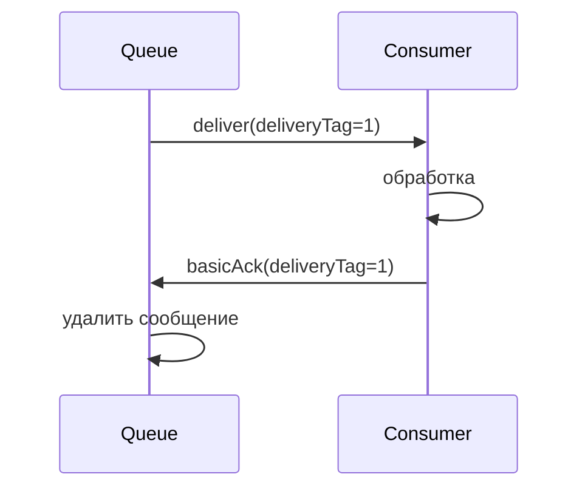

Если `consumer` упал без `ack` — сообщение переходит обратно в `ready` и будет доставлено другому `consumer`.

```java
channel.basicConsume("my-queue", false, (consumerTag, delivery) -> {
    try {
        process(delivery.getBody());
        channel.basicAck(delivery.getEnvelope().getDeliveryTag(), false);
    } catch (Exception e) {
        channel.basicNack(delivery.getEnvelope().getDeliveryTag(), false, true);
    }
}, consumerTag -> {});
```

Параметр `multiple=true` в `basicAck` подтверждает все сообщения до указанного `deliveryTag`.

---

## Q19. Чем отличаются nack и reject?

| Метод | Параметры | Описание |
|-------|-----------|----------|
| `basicAck` | `deliveryTag, multiple` | Успешная обработка |
| `basicNack` | `deliveryTag, multiple, requeue` | Неуспешно, можно переотправить несколько |
| `basicReject` | `deliveryTag, requeue` | Неуспешно, только одно сообщение |

`requeue=true` — сообщение возвращается в очередь (риск бесконечного цикла).  
`requeue=false` — сообщение отбрасывается или роутится в `DLX`.

Основное отличие `nack` от `reject` — поддержка параметра `multiple` для массового отклонения.

---

## Q20. (!) В чём разница между auto-ack и manual ack?

**`auto-ack`** (`autoAck=true`):
- Брокер считает сообщение обработанным сразу после доставки
- Максимальная скорость, но нет гарантий обработки
- При падении `consumer` сообщение теряется

**`manual ack`** (`autoAck=false`):
- `Consumer` явно вызывает `basicAck` / `basicNack` / `basicReject`
- Гарантирует at-least-once доставку
- Требует правильной обработки ошибок

> В продакшне всегда используйте `manual ack` для надёжной обработки.

---

## Q21. Что такое Publisher Confirms?

**`Publisher Confirms`** — механизм подтверждения от брокера к `producer` о том, что сообщение принято и сохранено (в очереди или на диске).

```java
channel.confirmSelect(); // включить режим подтверждений

// Синхронный вариант
channel.basicPublish("exchange", "key", null, body);
if (!channel.waitForConfirms(5000)) {
    throw new RuntimeException("Message not confirmed");
}

// Асинхронный вариант (лучше для производительности)
channel.addConfirmListener(
    (deliveryTag, multiple) -> log.info("Confirmed: {}", deliveryTag),
    (deliveryTag, multiple) -> log.warn("Nacked: {}", deliveryTag)
);
channel.basicPublish("exchange", "key", null, body);
```

`Publisher Confirms` несовместимы с транзакциями на одном `channel`.

---

## Q22. Чем Publisher Confirms отличаются от транзакций AMQP?

| Аспект | `Publisher Confirms` | Транзакции (`txSelect`) |
|--------|---------------------|------------------------|
| Производительность | Высокая (асинхронно) | Низкая (синхронно, блокирует) |
| Семантика | At-least-once | At-least-once |
| Батч | Да | Да (`txCommit`) |
| Rollback | Нет | Да (`txRollback`) |
| Рекомендуется | Да | Нет (устарело) |

Транзакции в `AMQP` снижают производительность в 250 раз по сравнению с `Publisher Confirms`. Используйте `Publisher Confirms`.

---

## Q23. (!) Что такое Dead Letter Exchange (DLX) и DLQ?

**`DLX`** (`Dead Letter Exchange`) — специальный `exchange`, куда брокер маршрутизирует сообщения, которые не могут быть обработаны.

**`DLQ`** (`Dead Letter Queue`) — очередь, привязанная к `DLX`, которая собирает «мёртвые» сообщения.

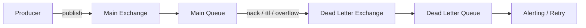

Настройка:
```java
// Объявляем DLX и DLQ
channel.exchangeDeclare("dlx", "direct", true);
channel.queueDeclare("dlq", true, false, false, null);
channel.queueBind("dlq", "dlx", "dead");

// Основная очередь с указанием DLX
Map<String, Object> args = new HashMap<>();
args.put("x-dead-letter-exchange", "dlx");
args.put("x-dead-letter-routing-key", "dead");
channel.queueDeclare("main-queue", true, false, false, args);
```

---

## Q24. При каких условиях сообщение попадает в DLQ?

Сообщение становится «мёртвым» в трёх случаях:

1. **Rejected** — `consumer` вызвал `basicReject` или `basicNack` с `requeue=false`
2. **TTL истёк** — время жизни сообщения или очереди истекло
3. **Queue overflow** — очередь достигла `x-max-length` и политика — `drop-head`

В DLX-сообщение добавляется заголовок `x-death` с информацией о причине, количестве смертей и исходной очереди.

---

## Q25. Как реализовать retry с использованием DLX и TTL?

Паттерн **delayed retry** через `DLX` и `TTL`:

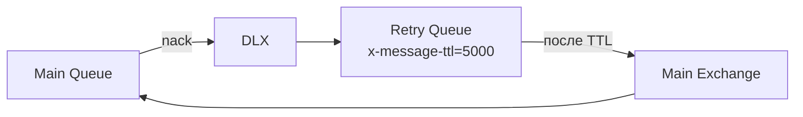

```java
// Retry Queue — задержка 5 секунд, после истечения TTL → обратно в main exchange
Map<String, Object> retryArgs = new HashMap<>();
retryArgs.put("x-message-ttl", 5000);
retryArgs.put("x-dead-letter-exchange", "main-exchange");
retryArgs.put("x-dead-letter-routing-key", "main-key");
channel.queueDeclare("retry-queue", true, false, false, retryArgs);
channel.queueBind("retry-queue", "dlx", "retry");

// При ошибке в consumer
channel.basicNack(deliveryTag, false, false); // requeue=false → в DLX → retry-queue
```

Для ограничения числа попыток используют заголовок `x-death[count]`.

---

## Q26. (!) Что такое prefetch count и QoS?

**`Prefetch count`** (`basicQos`) — максимальное количество сообщений `unacked`, которые брокер отправит `consumer` до получения `ack`.

```java
// Consumer получит не более 10 сообщений без подтверждения
channel.basicQos(10);
```

**Без prefetch** (`prefetchCount=0`) — брокер отправит все доступные сообщения сразу, перегружая `consumer`.

**С prefetchCount=1** — честное распределение (fair dispatch): каждый `consumer` получает новое сообщение только после обработки предыдущего.

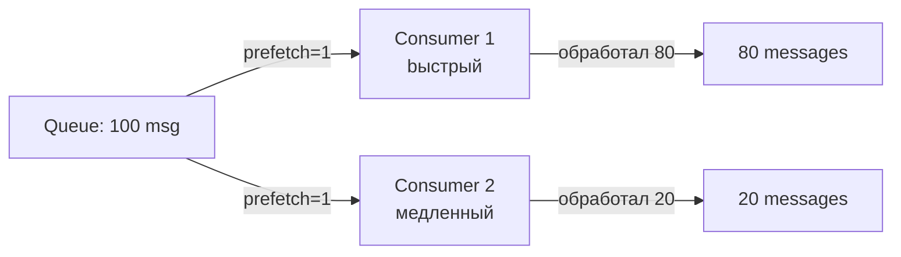

---

## Q27. Как prefetch влияет на производительность и нагрузку?

| `prefetchCount` | Поведение | Применение |
|-----------------|-----------|------------|
| `0` | Без ограничений, все сообщения сразу | Не рекомендуется |
| `1` | Строго по одному, fair dispatch | Долгие задачи, неравномерная нагрузка |
| `10–100` | Хороший баланс | Большинство случаев |
| Высокий (>100) | Высокий throughput | Быстрая обработка, батчи |

`prefetchCount` на уровне `channel` (`global=false`) — каждый `consumer` на канале получает свой лимит. С `global=true` — общий лимит для всего канала.

---

## Q28. (!) Как работает кластеризация в RabbitMQ?

Кластер `RabbitMQ` — несколько узлов (`node`), объединённых в единое логическое целое:

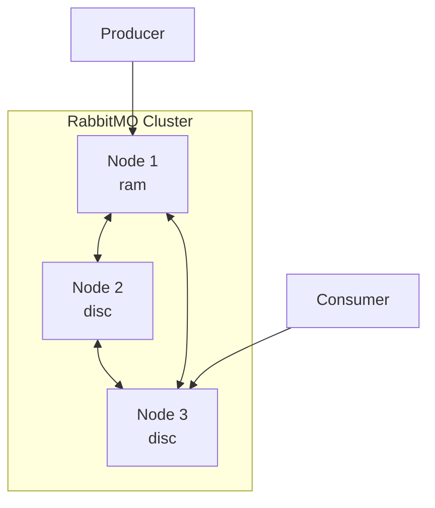

**Что реплицируется:**
- Метаданные: `exchange`, `binding`, `vhost`, пользователи, политики
- Очереди **НЕ реплицируются** по умолчанию (только на одном узле)

**Типы узлов:**
- `disc` — хранит метаданные на диске (минимум один в кластере)
- `ram` — хранит только в памяти (быстрее, но не переживает рестарт)

**Network partition** — кластер может расщепиться на несколько частей; стратегии: `ignore`, `pause-minority`, `autoheal`.

---

## Q29. Что такое Mirrored Queues (Classic HA)?

**`Mirrored Queues`** (устаревший механизм, Classic HA) — очереди с зеркалами на нескольких узлах кластера.

- Один узел — **master** (принимает все операции)
- Остальные — **slaves** (зеркала, синхронизируются с master)
- При падении master — один из slaves становится новым master

**Проблемы Mirrored Queues:**
- Высокая нагрузка на сеть при синхронизации
- Потенциальная потеря сообщений при split-brain
- `RabbitMQ 3.13` объявил их устаревшими в пользу `Quorum Queues`

---

## Q30. (!) Что такое Quorum Queues и чем они лучше Mirrored?

**`Quorum Queues`** — современный тип реплицированных очередей на основе алгоритма **Raft** (как в `etcd`, `Consul`).

| Характеристика | Mirrored Queues | Quorum Queues |
|----------------|-----------------|---------------|
| Алгоритм | Custom | Raft |
| Гарантии | Слабее | Stronger (majority) |
| Split-brain | Уязвим | Устойчив |
| Производительность | Ниже | Выше |
| Поддержка | Deprecated | Recommended |
| Статус | Устарел в 3.9 | Рекомендован с 3.9 |

```java
// Spring AMQP: объявление Quorum Queue
@Bean
public Queue quorumQueue() {
    return QueueBuilder.durable("my-quorum-queue")
        .quorum()
        .build();
}
```

`Quorum Queues` гарантируют консистентность при наличии большинства (`quorum`) узлов. Не поддерживают `x-message-ttl`, `priority queues`.

---

## Q31. Что такое Federation и Shovel в RabbitMQ?

**`Federation`** — плагин для связи `exchange` или `queue` между разными брокерами (в разных датацентрах). Сообщения перемещаются только при наличии `consumer`.

**`Shovel`** — плагин для непрерывного перекачивания сообщений из одной очереди в другую (в том числе на удалённом брокере). Полезен для:
- Миграции сообщений
- Репликации между датацентрами
- Переброски из `DLQ` после починки

Разница: `Federation` — логическая связь exchange/queue; `Shovel` — явное перемещение сообщений.

---

## Q32. (!) Что такое Spring AMQP и RabbitTemplate?

**`Spring AMQP`** — абстракция Spring для работы с `AMQP`-брокерами. Состоит из двух модулей:
- `spring-amqp` — базовые абстракции (не зависит от `RabbitMQ`)
- `spring-rabbit` — реализация для `RabbitMQ`

**`RabbitTemplate`** — основной класс для отправки и синхронного получения сообщений:

```java
@Autowired
private RabbitTemplate rabbitTemplate;

// Отправка
rabbitTemplate.convertAndSend("my-exchange", "routing.key", myObject);

// Синхронный запрос (RPC)
MyResponse response = (MyResponse) rabbitTemplate.convertSendAndReceive(
    "rpc-exchange", "rpc-key", request
);
```

**`MessageConverter`** (по умолчанию `SimpleMessageConverter`) преобразует объекты в/из `AMQP Message`. Рекомендуется `Jackson2JsonMessageConverter` для JSON.

---

## Q33. Как объявить очередь и exchange через Spring AMQP?

```java
@Configuration
public class RabbitMQConfig {

    @Bean
    public TopicExchange ordersExchange() {
        return ExchangeBuilder.topicExchange("orders.exchange")
            .durable(true)
            .build();
    }

    @Bean
    public Queue ordersQueue() {
        return QueueBuilder.durable("orders.queue")
            .withArgument("x-dead-letter-exchange", "orders.dlx")
            .withArgument("x-message-ttl", 60000)
            .build();
    }

    @Bean
    public Binding ordersBinding(Queue ordersQueue, TopicExchange ordersExchange) {
        return BindingBuilder
            .bind(ordersQueue)
            .to(ordersExchange)
            .with("order.#");
    }

    @Bean
    public MessageConverter messageConverter() {
        return new Jackson2JsonMessageConverter();
    }

    @Bean
    public AmqpTemplate amqpTemplate(ConnectionFactory connectionFactory) {
        RabbitTemplate template = new RabbitTemplate(connectionFactory);
        template.setMessageConverter(messageConverter());
        return template;
    }
}
```

---

## Q34. (!) Как настроить @RabbitListener?

```java
@Component
public class OrderListener {

    // Простой listener
    @RabbitListener(queues = "orders.queue")
    public void handleOrder(Order order) {
        orderService.process(order);
    }

    // С доступом к заголовкам и метаданным
    @RabbitListener(queues = "orders.queue")
    public void handleWithHeaders(
        @Payload Order order,
        @Header(AmqpHeaders.DELIVERY_TAG) long deliveryTag,
        @Header(AmqpHeaders.RECEIVED_ROUTING_KEY) String routingKey,
        Channel channel) throws IOException {
        try {
            orderService.process(order);
            channel.basicAck(deliveryTag, false);
        } catch (Exception e) {
            channel.basicNack(deliveryTag, false, false); // в DLQ
        }
    }

    // Динамическое объявление очереди и exchange
    @RabbitListener(bindings = @QueueBinding(
        value = @Queue(value = "dynamic.queue", durable = "true"),
        exchange = @Exchange(value = "topic.exchange", type = ExchangeTypes.TOPIC),
        key = "order.#"
    ))
    public void handleDynamic(Order order) {
        orderService.process(order);
    }
}
```

**`SimpleMessageListenerContainer`** vs **`DirectMessageListenerContainer`**:
- `Simple` — пул потоков, каждый consumer в отдельном thread
- `Direct` — каждый consumer в thread amqp-library, меньше overhead

---

## Q35. Как настроить retry-логику в Spring AMQP?

**Stateless retry** (через `Spring Retry`):

```yaml
spring:
  rabbitmq:
    listener:
      simple:
        retry:
          enabled: true
          initial-interval: 1000
          max-attempts: 3
          multiplier: 2.0
          max-interval: 10000
        acknowledge-mode: auto
```

**Stateful retry** (с отслеживанием состояния, для `manual ack`):

```java
@Bean
public SimpleRabbitListenerContainerFactory rabbitListenerContainerFactory(
    ConnectionFactory connectionFactory,
    MessageConverter converter) {
    SimpleRabbitListenerContainerFactory factory = new SimpleRabbitListenerContainerFactory();
    factory.setConnectionFactory(connectionFactory);
    factory.setMessageConverter(converter);
    factory.setAcknowledgeMode(AcknowledgeMode.MANUAL);

    RetryInterceptorBuilder<?> builder = RetryInterceptorBuilder.stateless()
        .maxAttempts(3)
        .backOffOptions(1000, 2.0, 10000)
        .recoverer(new RejectAndDontRequeueRecoverer()); // в DLQ после исчерпания попыток
    factory.setAdviceChain(builder.build());
    return factory;
}
```

---

## Q36. (!) Какие основные паттерны обмена сообщениями реализуются в RabbitMQ?

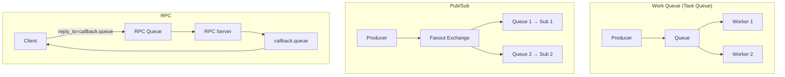

| Паттерн | Exchange | Описание |
|---------|----------|----------|
| Work Queue | Default/Direct | Распределение задач между workers |
| Pub/Sub | Fanout | Рассылка событий всем подписчикам |
| Routing | Direct | Маршрутизация по типу события |
| Topic | Topic | Гибкая маршрутизация по паттерну |
| RPC | Default | Синхронный запрос/ответ через очереди |
| Delayed | DLX + TTL | Отложенные сообщения |

---

## Q37. Как реализовать паттерн RPC через RabbitMQ?

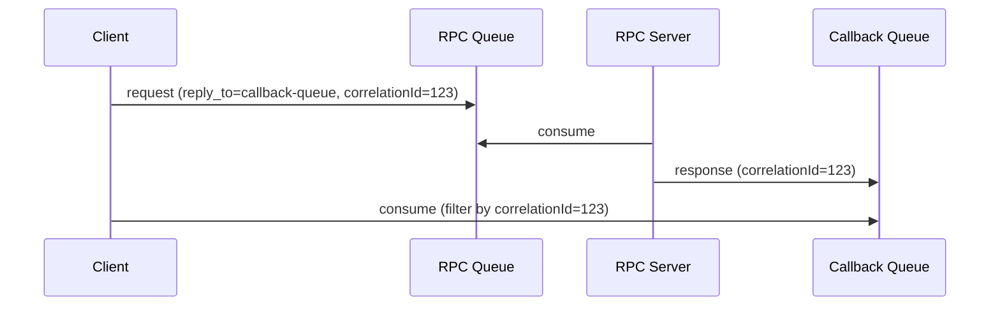

```java
// Клиент
String correlationId = UUID.randomUUID().toString();
String replyQueueName = channel.queueDeclare().getQueue();

AMQP.BasicProperties props = new AMQP.BasicProperties.Builder()
    .correlationId(correlationId)
    .replyTo(replyQueueName)
    .build();

channel.basicPublish("", "rpc-queue", props, request.getBytes());

// Ожидание ответа с matching correlationId
BlockingQueue<String> response = new ArrayBlockingQueue<>(1);
channel.basicConsume(replyQueueName, true, (consumerTag, delivery) -> {
    if (correlationId.equals(delivery.getProperties().getCorrelationId())) {
        response.offer(new String(delivery.getBody()));
    }
}, tag -> {});

return response.poll(10, TimeUnit.SECONDS);
```

В `Spring AMQP` используйте `rabbitTemplate.convertSendAndReceive()`.

---

## Q38. Как осуществляется мониторинг RabbitMQ через Management Plugin?

**Management Plugin** предоставляет:
- Web UI: `http://localhost:15672`
- HTTP API: `http://localhost:15672/api/`
- CLI: `rabbitmqadmin`

**Ключевые страницы UI:**
- **Overview** — общее состояние кластера, connections, channels, queues
- **Queues** — глубина очередей, скорость publish/consume/ack
- **Connections/Channels** — активные соединения
- **Admin** — пользователи, vhost, политики

```bash
# Просмотр очередей через CLI
rabbitmqadmin list queues name messages consumers

# Экспорт конфигурации
rabbitmqadmin export config.json
```

Для продакшн-мониторинга рекомендуется интеграция с `Prometheus` через плагин `rabbitmq_prometheus`.

---

## Q39. Какие метрики RabbitMQ наиболее важны?

| Метрика | Описание | Тревожный порог |
|---------|----------|-----------------|
| `queue_messages_ready` | Кол-во сообщений, готовых к доставке | Растёт > N |
| `queue_messages_unacknowledged` | Кол-во `unacked` сообщений | Растёт долго |
| `queue_consumers` | Количество активных consumers | = 0 |
| `connection_count` | Кол-во активных соединений | Близко к лимиту |
| `channel_count` | Кол-во каналов | Слишком высокое |
| `disk_free` | Свободное место на диске | < `disk_free_limit` |
| `mem_used` | Использование памяти | > `vm_memory_high_watermark` |
| `publish_rate` | Скорость публикации (msg/s) | — |
| `deliver_ack_rate` | Скорость подтверждённой доставки | Ниже publish rate |

При достижении `vm_memory_high_watermark` (по умолчанию 40% RAM) брокер включает **flow control** и блокирует publishers.

---

## Q40. (!) В чём принципиальные отличия RabbitMQ от Kafka?

| Характеристика | `RabbitMQ` | `Apache Kafka` |
|----------------|------------|----------------|
| Модель | Push (broker → consumer) | Pull (consumer тянет) |
| Хранение | Сообщения удаляются после ack | Лог хранится N дней |
| Порядок | В рамках одной очереди | В рамках партиции |
| Replay | Нет (только DLQ) | Да (любой offset) |
| Маршрутизация | Гибкая (exchange, binding) | По топику/партиции |
| Пропускная способность | Умеренная (100K msg/s) | Очень высокая (1M+ msg/s) |
| Latency | Низкая (<1ms) | Чуть выше (batch) |
| Consumer groups | Конкуренция или подписка | Независимые группы |
| Протокол | `AMQP`, `STOMP`, `MQTT` | Собственный |
| Use case | Задачи, RPC, сложная маршрутизация | Стриминг, аналитика, event log |

---

## Q41. Когда выбрать RabbitMQ, а когда Kafka?

**Выбирайте `RabbitMQ` когда:**
- Нужна сложная маршрутизация сообщений (topic patterns, headers)
- Важна низкая задержка для отдельных сообщений
- Нужен паттерн Work Queue с равномерным распределением нагрузки
- Требуется RPC через messaging
- Разные типы сообщений с разными получателями
- Команда знакома с `AMQP`; интеграция через `STOMP` / `MQTT`
- Объём сообщений умеренный, не требуется долгосрочное хранение

**Выбирайте `Kafka` когда:**
- Нужен event log с возможностью replay
- Очень высокий throughput (миллионы событий/сек)
- Событийная история важна для аналитики или audit trail
- Нужна интеграция с Big Data / stream processing (`Flink`, `Spark`)
- Multiple independent consumer groups читают один поток
- Долгосрочное хранение событий

> Оба инструмента могут сосуществовать в одной системе: `Kafka` — для event streaming, `RabbitMQ` — для task queues и RPC.

---

## See also

- [Apache Kafka](kafka-interview.md) — альтернативный брокер для event streaming
- [Распределённые системы](../architecture/distributed-systems-interview.md) — CAP-теорема, консистентность, отказоустойчивость
- [Spring Boot](../frameworks/spring/spring-boot-interview.md) — основы Spring Boot для интеграции
- [Микросервисная архитектура](../architecture/microservices-interview.md) — паттерны коммуникации между сервисами
- [Event-driven паттерны](../architecture/event-driven-patterns-interview.md) — паттерны асинхронного взаимодействия
- [Стратегии кэширования](../architecture/caching-strategies-interview.md) — дополняет паттерны обмена данными
- [Паттерны согласованности](../architecture/consistency-patterns-interview.md) — гарантии доставки и идемпотентность

- [[aws-sqs-sns-interview|AWS SQS и SNS]]
- [[kafka-interview|Apache Kafka]]
- [[message-brokers-comparison-interview|Сравнение Message Brokers]]
- [[nats-interview|NATS]]
- [[pulsar-interview|Apache Pulsar]]
- [[redpanda-interview|Redpanda]]
