# Вопросы на собеседовании: `RabbitMQ`

Полное покрытие `RabbitMQ` для интервью: `AMQP`-протокол, типы `exchange`, очереди и их свойства, подтверждения доставки, `Dead Letter Queue`, `Publisher Confirms`, кластеризация, `quorum queues`, `Spring AMQP`, основные паттерны и мониторинг.

**`RabbitMQ`** — брокер сообщений, реализующий протокол `AMQP 0-9-1`. Широко применяется в [микросервисных](../architecture/microservices-interview.md) и [event-driven](../architecture/event-driven-patterns-interview.md) архитектурах для надёжной асинхронной коммуникации между сервисами.

## Полезные ссылки

### Официальная документация

- [RabbitMQ Tutorials](https://www.rabbitmq.com/tutorials) — официальные туториалы по всем паттернам
- [AMQP 0-9-1 Model Explained](https://www.rabbitmq.com/tutorials/amqp-concepts) — концепции протокола
- [RabbitMQ Reliability Guide](https://www.rabbitmq.com/docs/reliability) — гарантии доставки и надёжность
- [Quorum Queues](https://www.rabbitmq.com/docs/quorum-queues) — современный тип HA-очередей

### Статьи Baeldung

- [Introduction to RabbitMQ](https://www.baeldung.com/rabbitmq) — введение в RabbitMQ
- [RabbitMQ vs Kafka](https://www.baeldung.com/rabbitmq-vs-kafka) — детальное сравнение двух брокеров
- [Messaging Using Spring AMQP](https://www.baeldung.com/spring-amqp) — интеграция с Spring
- [RabbitMQ Dead Letter Exchanges](https://www.baeldung.com/rabbitmq-dead-letter-exchanges) — настройка DLX/DLQ
- [Publisher Confirms with Spring AMQP](https://www.baeldung.com/spring-amqp-publisher-confirms) — подтверждения публикации
- [Exchanges, Queues, and Bindings in RabbitMQ](https://www.baeldung.com/java-rabbitmq-exchanges-queues-bindings) — exchanges, очереди и bindings
- [Channels and Connections in RabbitMQ](https://www.baeldung.com/java-rabbitmq-channels-connections) — управление соединениями
- [Error Handling with Spring AMQP](https://www.baeldung.com/spring-amqp-error-handling) — обработка ошибок и retry

## Содержание

- [Полезные ссылки](#полезные-ссылки)
- [See also](#see-also)

**Основы AMQP**
- [Q1. (!) Что такое RabbitMQ и протокол AMQP?](#q1--что-такое-rabbitmq-и-протокол-amqp)
- [Q2. (!) Из каких компонентов состоит модель AMQP?](#q2--из-каких-компонентов-состоит-модель-amqp)
- [Q3. Что такое Virtual Host (vhost)?](#q3-что-такое-virtual-host-vhost)
- [Q4. Что такое Channel и зачем он нужен?](#q4-что-такое-channel-и-зачем-он-нужен)

**Exchanges**
- [Q5. (!) Какие типы Exchange существуют в RabbitMQ?](#q5--какие-типы-exchange-существуют-в-rabbitmq)
- [Q6. Как работает Direct Exchange?](#q6-как-работает-direct-exchange)
- [Q7. Как работает Fanout Exchange?](#q7-как-работает-fanout-exchange)
- [Q8. (!) Как работает Topic Exchange?](#q8--как-работает-topic-exchange)
- [Q9. Как работает Headers Exchange?](#q9-как-работает-headers-exchange)
- [Q10. Что такое Default Exchange?](#q10-что-такое-default-exchange)

**Queues**
- [Q11. (!) Какие свойства у очереди в RabbitMQ?](#q11--какие-свойства-у-очереди-в-rabbitmq)
- [Q12. Что такое durable queue и persistent message?](#q12-что-такое-durable-queue-и-persistent-message)
- [Q13. Что такое exclusive и auto-delete очередь?](#q13-что-такое-exclusive-и-auto-delete-очередь)
- [Q14. Как настроить TTL для сообщений и очереди?](#q14-как-настроить-ttl-для-сообщений-и-очереди)
- [Q15. Что такое максимальная длина очереди (max-length)?](#q15-что-такое-максимальная-длина-очереди-max-length)

**Bindings и Routing**
- [Q16. (!) Что такое Binding и Routing Key?](#q16--что-такое-binding-и-routing-key)
- [Q17. Можно ли привязать несколько очередей к одному Exchange?](#q17-можно-ли-привязать-несколько-очередей-к-одному-exchange)

**Acknowledgements**
- [Q18. (!) Что такое acknowledgement (ack) в RabbitMQ?](#q18--что-такое-acknowledgement-ack-в-rabbitmq)
- [Q19. Чем отличаются nack и reject?](#q19-чем-отличаются-nack-и-reject)
- [Q20. (!) В чём разница между auto-ack и manual ack?](#q20--в-чём-разница-между-auto-ack-и-manual-ack)
- [Q21. Что такое Publisher Confirms?](#q21-что-такое-publisher-confirms)
- [Q22. Чем Publisher Confirms отличаются от транзакций AMQP?](#q22-чем-publisher-confirms-отличаются-от-транзакций-amqp)

**Dead Letter Queue**
- [Q23. (!) Что такое Dead Letter Exchange (DLX) и DLQ?](#q23--что-такое-dead-letter-exchange-dlx-и-dlq)
- [Q24. При каких условиях сообщение попадает в DLQ?](#q24-при-каких-условиях-сообщение-попадает-в-dlq)
- [Q25. Как реализовать retry с использованием DLX и TTL?](#q25-как-реализовать-retry-с-использованием-dlx-и-ttl)

**QoS и Prefetch**
- [Q26. (!) Что такое prefetch count и QoS?](#q26--что-такое-prefetch-count-и-qos)
- [Q27. Как prefetch влияет на производительность и нагрузку?](#q27-как-prefetch-влияет-на-производительность-и-нагрузку)

**Кластеризация и High Availability**
- [Q28. (!) Как работает кластеризация в RabbitMQ?](#q28--как-работает-кластеризация-в-rabbitmq)
- [Q29. Что такое Mirrored Queues (Classic HA)?](#q29-что-такое-mirrored-queues-classic-ha)
- [Q30. (!) Что такое Quorum Queues и чем они лучше Mirrored?](#q30--что-такое-quorum-queues-и-чем-они-лучше-mirrored)
- [Q31. Что такое Federation и Shovel в RabbitMQ?](#q31-что-такое-federation-и-shovel-в-rabbitmq)

**Spring AMQP**
- [Q32. (!) Что такое Spring AMQP и RabbitTemplate?](#q32--что-такое-spring-amqp-и-rabbittemplate)
- [Q33. Как объявить очередь и exchange через Spring AMQP?](#q33-как-объявить-очередь-и-exchange-через-spring-amqp)
- [Q34. (!) Как настроить @RabbitListener?](#q34--как-настроить-rabbitlistener)
- [Q35. Как настроить retry-логику в Spring AMQP?](#q35-как-настроить-retry-логику-в-spring-amqp)

**Паттерны**
- [Q36. (!) Какие основные паттерны обмена сообщениями реализуются в RabbitMQ?](#q36--какие-основные-паттерны-обмена-сообщениями-реализуются-в-rabbitmq)
- [Q37. Как реализовать паттерн RPC через RabbitMQ?](#q37-как-реализовать-паттерн-rpc-через-rabbitmq)

**Мониторинг**
- [Q38. Как осуществляется мониторинг RabbitMQ через Management Plugin?](#q38-как-осуществляется-мониторинг-rabbitmq-через-management-plugin)
- [Q39. Какие метрики RabbitMQ наиболее важны?](#q39-какие-метрики-rabbitmq-наиболее-важны)

**RabbitMQ vs Kafka**
- [Q40. (!) В чём принципиальные отличия RabbitMQ от Kafka?](#q40--в-чём-принципиальные-отличия-rabbitmq-от-kafka)
- [Q41. Когда выбрать RabbitMQ, а когда Kafka?](#q41-когда-выбрать-rabbitmq-а-когда-kafka)

---

## Q1. (!) Что такое RabbitMQ и протокол AMQP?

**`RabbitMQ`** — брокер сообщений с открытым исходным кодом, реализующий протокол `AMQP 0-9-1` (Advanced Message Queuing Protocol). Написан на `Erlang`, что обеспечивает высокую отказоустойчивость и конкурентность.

**`AMQP`** — бинарный протокол уровня приложения для асинхронного обмена сообщениями. Ключевые характеристики:
- **Надёжность** — подтверждения доставки на уровне протокола
- **Маршрутизация** — гибкая маршрутизация через exchange и binding
- **Безопасность** — `TLS`, `SASL`-аутентификация
- **Совместимость** — стандартизованный протокол, независимый от реализации

`RabbitMQ` также поддерживает `STOMP`, `MQTT`, `AMQP 1.0` через плагины.

> [!mcq]
> - [ ] RabbitMQ реализует протокол MQTT и написан на Go, что обеспечивает высокую конкурентность. | MQTT — дополнительный протокол через плагин (`rabbitmq_mqtt`), не основной; язык реализации — Erlang/OTP, не Go. ❌ ПОСЛЕДСТВИЕ: разработчик ищет Go-исходники RabbitMQ ради pull request, не находит, переходит на NATS/Kafka из-за фантомного «уже Go»-стека — ломая существующие интеграции.
> - [ ] RabbitMQ реализует протокол STOMP и написан на Java, что обеспечивает широкую экосистему. | STOMP поддерживается через плагин (`rabbitmq_stomp`), не нативно; язык реализации — Erlang, не Java. ❌ ПОСЛЕДСТВИЕ: команда планирует JVM-tuning для broker (Heap, GC) и обнаруживает после деплоя BEAM-VM (Erlang) — все JMX-инструменты бесполезны, диагностика идёт через `rabbitmq-diagnostics` CLI.
> - [ ] RabbitMQ реализует протокол AMQP 1.0 и написан на Rust, что обеспечивает высокую производительность. | Нативный протокол — AMQP 0-9-1; AMQP 1.0 — плагин `rabbitmq_amqp1_0`. Rust не имеет отношения к реализации. ❌ ПОСЛЕДСТВИЕ: разработчик настраивает клиент на AMQP 1.0 с расчётом на нативную поддержку, забывает включить плагин — connection refused, инцидент при первом нагрузочном тесте.
> - [x] RabbitMQ реализует протокол AMQP 0-9-1 и написан на Erlang/OTP, что обеспечивает высокую отказоустойчивость и кластеризацию out-of-the-box. | AMQP 0-9-1 — основной wire-protocol; Erlang создан для telecom систем (требование 99.999% uptime), его supervision trees делают broker устойчивым к сбоям отдельных процессов. ✓ ПРИМЕНЯТЬ: для distributed event bus с топологией exchange→queue (Booking.com, Wolt order pipeline); для MQTT/STOMP/AMQP 1.0 — включать плагины. 📋 ПРАВИЛО: «AMQP 0-9-1 native, на Erlang/OTP; всё остальное — через плагины». 🔗 См. Q2 (компоненты AMQP), Q3 (Virtual Host), Q11 (свойства очереди).

> [!mcq]
> - [ ] `AMQP 0.9.1` и `AMQP 1.0` — две версии одного протокола с обратной совместимостью wire-формата. | Версии несовместимы на уровне wire-формата: 0.9.1 фиксирует topology (exchange/queue/binding), 1.0 — peer-to-peer модель без exchange. Клиент 0.9.1 не подключится к endpoint 1.0. ❌ ПОСЛЕДСТВИЕ: команда мигрирует на «новую версию» 1.0 без переписывания клиента — все publisher/consumer падают с handshake error, downtime до отката.
> - [x] `AMQP 0.9.1` (нативный в RabbitMQ) и `AMQP 1.0` — разные wire-протоколы; 1.0 включается отдельным плагином `rabbitmq_amqp1_0`. | Ключевая особенность: 0.9.1 — нативный протокол с моделью exchange/queue/binding; 1.0 — стандарт OASIS с другой моделью узлов и links. ✓ ПРИМЕНЯТЬ: Wolt event bus — internal services на AMQP 0.9.1; интеграция с Azure Service Bus через `rabbitmq_amqp1_0` плагин. 📋 ПРАВИЛО: «0.9.1 native, 1.0 plugin». 🔗 См. Q2, Q3.
> - [ ] `AMQP 1.0` отличается от 0.9.1 только новым форматом сериализации заголовков. | Различия фундаментальные: 1.0 убирает exchange/queue из протокола, использует links и nodes, поддерживает symmetric peer-to-peer. ❌ ПОСЛЕДСТВИЕ: разработчик переходит на 1.0 ожидая drop-in replacement — обнаруживает что вся routing-семантика отсутствует, переписывает producer с нуля.
> - [ ] RabbitMQ нативно поддерживает обе версии AMQP одновременно на одном порту 5672 без плагинов. | По умолчанию на 5672 работает только 0.9.1; для 1.0 нужно включить плагин `rabbitmq_amqp1_0`. ❌ ПОСЛЕДСТВИЕ: команда тестирует 1.0 client на свежем broker — connection refused, тратит часы на debug TLS вместо включения плагина.

---

## Q2. (!) Из каких компонентов состоит модель AMQP?

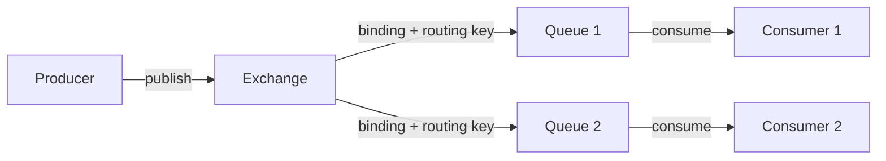

**Компоненты:**

| Компонент | Описание |
|-----------|----------|
| `Producer` | Публикует сообщения в `exchange` |
| `Exchange` | Принимает сообщения от `producer` и маршрутизирует в очереди |
| `Queue` | Буфер для хранения сообщений до получения `consumer` |
| `Binding` | Правило связи между `exchange` и `queue` |
| `Consumer` | Получает сообщения из очереди |
| `Channel` | Виртуальное соединение внутри `AMQP`-коннекшна |
| `Virtual Host` | Логическое разделение ресурсов брокера |

> [!mcq]
> - [ ] Producer публикует сообщения напрямую в Queue, минуя Exchange, через указание имени очереди. | В AMQP Producer всегда публикует в Exchange; даже direct-publish в named queue работает через Default Exchange (безымянный direct), что под капотом — тот же Exchange. ❌ ПОСЛЕДСТВИЕ: разработчик думает что обходит маршрутизацию, не настраивает binding — на staging работает (default exchange), на prod падает с `404 NOT_FOUND` потому что named exchange не существует.
> - [ ] Consumer получает сообщения напрямую от Producer через Binding без участия Exchange. | Binding связывает Exchange и Queue (не Producer и Consumer); Consumer подписывается на Queue. Точка-в-точку между Producer и Consumer в AMQP отсутствует. ❌ ПОСЛЕДСТВИЕ: команда проектирует архитектуру по принципу «Producer→Consumer» прямо, теряет преимущества AMQP (multiple consumers per queue, durability, persistent messages) — реализует Kafka-like message-passing вручную.
> - [ ] Exchange публикует сообщения напрямую в Consumer, минуя Queue, при наличии активного Binding. | Exchange никогда не доставляет сообщения потребителю напрямую — всегда через промежуточную Queue (буферизация, durability, prefetch). ❌ ПОСЛЕДСТВИЕ: разработчик ожидает push-семантику без буфера — после рестарта consumer теряет все «не пришедшие» сообщения, business operations требуют ручного восстановления через бизнес-логику.
> - [x] Producer публикует в Exchange → Exchange маршрутизирует через Binding в одну или несколько Queue → Consumer читает из Queue. | Это полная цепочка AMQP-модели: Channel мультиплексирует Connection, Exchange определяет тип маршрутизации (direct/topic/fanout/headers), Binding с routing key связывает Exchange и Queue. ✓ ПРИМЕНЯТЬ: типичная микросервисная архитектура (Order → orderExchange → [paymentQueue, shippingQueue, notificationsQueue]); Wolt event-driven order pipeline. 📋 ПРАВИЛО: «Producer→Exchange→Binding→Queue→Consumer — всегда через Exchange, Consumer на Queue». 🔗 См. Q1 (AMQP), Q5 (типы Exchange), Q16 (Binding), Q18 (ack).

> [!mcq]
> - [ ] `Virtual Host` — это просто имя префикса для очередей внутри одного namespace, как тег для группировки. | Vhost — это полная изоляция: отдельные exchange/queue/binding/permissions, не префикс. Разные vhost не видят ресурсы друг друга даже под admin-пользователем без explicit grant. ❌ ПОСЛЕДСТВИЕ: команда полагается на «префиксы» в одном vhost — staging-сообщения попадают в prod-очередь из-за ошибки в routing key, реальный инцидент с тестовыми данными в боевом контуре.
> - [x] `Virtual Host` обеспечивает multitenancy: полная изоляция exchange/queue/binding/permissions, как отдельная база в PostgreSQL. | Это критичный механизм для shared-cluster scenarios: один RabbitMQ обслуживает несколько команд, каждая в своём vhost с отдельными правами. ✓ ПРИМЕНЯТЬ: Booking.com shared rabbit-cluster — vhost `/payments`, `/orders`, `/notifications` с раздельными permissions; команда payments физически не может прочитать orders. 📋 ПРАВИЛО: «Vhost = tenant boundary». 🔗 См. Q3, Q1.
> - [ ] Compoнента `Connection` входит в саму AMQP-модель и эквивалентна `Channel` для маршрутизации. | Connection — это TCP-уровень транспорт, не часть AMQP-модели маршрутизации; Channel мультиплексируется поверх Connection. AMQP-модель оперирует Producer/Exchange/Queue/Consumer/Binding. ❌ ПОСЛЕДСТВИЕ: разработчик создаёт по Connection на сообщение «для изоляции» — broker исчерпывает file descriptors на 5K coннекций, весь cluster падает.
> - [ ] `Binding` создаётся автоматически для каждой пары Exchange-Queue при первом publish с подходящим routing key. | Binding создаётся явно через `queueBind` (или declarative в Spring AMQP) и не возникает «по факту» publish. Без binding сообщение из exchange теряется. ❌ ПОСЛЕДСТВИЕ: команда забывает declare binding на новом env — producer публикует, broker молча dropped messages, инцидент находят через сутки по мёртвым consumers.

---

## Q3. Что такое Virtual Host (vhost)?

**`Virtual Host`** (`vhost`) — логическая изоляция ресурсов внутри одного `RabbitMQ`-сервера. Аналог баз данных в `PostgreSQL`.

- Каждый `vhost` имеет свои `exchange`, `queue`, `binding`, пользователей и права доступа
- По умолчанию создаётся `vhost` `/`
- Позволяет разным приложениям использовать один брокер без пересечения ресурсов

```java
// Подключение к конкретному vhost
ConnectionFactory factory = new ConnectionFactory();
factory.setVirtualHost("/my-app");
```

> [!mcq]
> - [ ] Virtual Host — это физически отдельный сервер RabbitMQ, изолирующий данные разных приложений на уровне ОС. | Vhost — логическая, не физическая изоляция; все vhost работают в одном процессе Erlang VM (BEAM), share resources (memory/disk/CPU). ❌ ПОСЛЕДСТВИЕ: команда планирует «по vhost на сервис» ради hardware-isolation — после деплоя видит общий процесс на 200% CPU, performance issue одного vhost кладёт все остальные.
> - [ ] Virtual Host — это механизм репликации очередей между узлами кластера для обеспечения HA. | Репликация — отдельный механизм: Classic Mirrored Queues (legacy) или Quorum Queues (recommended); vhost занимается изоляцией, не replication. ❌ ПОСЛЕДСТВИЕ: разработчик настраивает vhost-per-team ради «надёжности», после crash master-ноды теряет все сообщения — потому что vhost ≠ replicated queue.
> - [ ] Virtual Host — это псевдоним для конкретного Exchange, позволяющий маршрутизировать сообщения по имени хоста. | Vhost — изолированное namespace с собственными Exchange/Queue/Binding/permissions, не псевдоним; routing идёт внутри vhost через Exchange. ❌ ПОСЛЕДСТВИЕ: разработчик пытается «прокидывать» сообщения между vhost через alias — нет такого механизма; для cross-vhost нужен Shovel/Federation плагин, что добавляет сложность.
> - [x] Virtual Host — логическое разделение ресурсов в одном RabbitMQ-сервере: каждый vhost изолирует свои `exchange`, `queue`, `binding` и `permissions`, аналог schema в СУБД. | По умолчанию `/`; `rabbitmqctl add_vhost /payments` создаёт изолированное пространство — namespace + ACL. ✓ ПРИМЕНЯТЬ: один кластер на несколько команд (`/team-a`, `/team-b`), staging+prod в одном broker (`/staging`, `/prod`); каждая команда имеет свой user с правами только на свой vhost. 📋 ПРАВИЛО: «vhost = логический namespace с изоляцией ресурсов и прав, не replication и не alias». 🔗 См. Q1 (AMQP), Q2 (модель), Q4 (Channel).

---

## Q4. Что такое Channel и зачем он нужен?

**`Channel`** — виртуальное соединение (`lightweight connection`) поверх физического `AMQP`-соединения (`Connection`).

**Зачем нужен:**
- Создание TCP-соединения дорого; `channel` позволяет мультиплексировать несколько логических потоков по одному TCP-соединению
- Каждый поток/поток должен работать с отдельным `channel` (не thread-safe)
- В одном `Connection` можно открыть тысячи `channel`

**Жизненный цикл:** `Connection` → открытие `Channel` → операции → закрытие `Channel`.

> [!mcq]
> - [ ] Channel — физическое TCP-соединение к брокеру; каждый поток обязан использовать один Channel = одно Connection. | Channel — виртуальное (логическое) соединение поверх единого TCP Connection; мультиплексирование позволяет тысячи Channel на одном TCP без overhead. ❌ ПОСЛЕДСТВИЕ: разработчик создаёт Connection per request, исчерпывает file descriptors на 5K connections, broker валится с `too_many_connections`, alert на дежурстве.
> - [ ] Channel — очередь сообщений внутри Connection, буферизующая данные до подтверждения. | Channel — не очередь, а логический канал для AMQP-команд (publish, consume, declare); буферизация — на уровне Queue в broker. ❌ ПОСЛЕДСТВИЕ: разработчик пишет recovery-логику с расчётом на «Channel buffers messages» — после connection drop теряет все «pending» publishes, потому что Channel ничего не буферизует.
> - [ ] Channel — компонент балансировки нагрузки, распределяющий сообщения между несколькими Connection. | Load balancing в RabbitMQ — через `prefetch_count` и multiple consumers на одной Queue; Channel выполняет mux/demux, не routing решения. ❌ ПОСЛЕДСТВИЕ: команда меняет количество Channels пытаясь повлиять на распределение нагрузки, ничего не происходит — нужен `basic.qos` на consumer.
> - [x] Channel — виртуальное соединение поверх одного TCP Connection, позволяющее мультиплексировать сотни/тысячи AMQP-операций без overhead дополнительных TCP. | Один Connection содержит до 2047 Channels (по умолчанию); Channel НЕ thread-safe — должен использоваться строго одним потоком. ✓ ПРИМЕНЯТЬ: thread-per-channel в high-throughput consumer-приложениях; пул Channels (Spring AMQP `CachingConnectionFactory`) для веб-приложений с прокси `RabbitTemplate`. 📋 ПРАВИЛО: «Channel = виртуальный канал, мультиплекс TCP, НЕ thread-safe — один поток на Channel». 🔗 См. Q2 (AMQP-модель), Q26 (prefetch), Q32 (Spring AMQP).

---

## Q5. (!) Какие типы Exchange существуют в RabbitMQ?

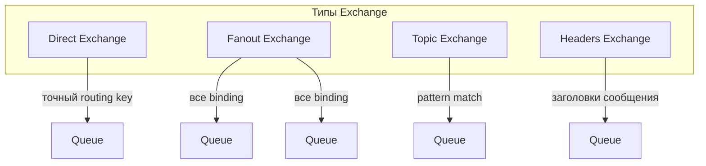

| Тип | Маршрутизация | Применение |
|-----|---------------|------------|
| `direct` | Точное совпадение `routing key` | Простая очередь задач |
| `fanout` | Всем привязанным очередям | Pub/Sub, рассылки |
| `topic` | Паттерн с `*` и `#` | Логи по категориям, события |
| `headers` | По заголовкам сообщения | Сложная маршрутизация без `routing key` |

> [!mcq]
> - [ ] Direct Exchange маршрутизирует по паттерну с `*` и `#`, Fanout — всем привязанным очередям, Topic — по точному совпадению, Headers — по заголовкам. | Direct и Topic перепутаны: Topic использует wildcards (`*` — одно слово, `#` — ноль или более), Direct требует точного совпадения routing key. ❌ ПОСЛЕДСТВИЕ: разработчик настраивает order pipeline на Direct с routing keys `order.created.*`, ни одно сообщение не доставляется — строгий match не срабатывает на multi-segment.
> - [ ] Direct Exchange маршрутизирует всем привязанным очередям, Fanout — по точному совпадению, Topic — по паттерну, Headers — по заголовкам. | Direct и Fanout перепутаны: Fanout broadcast'ит во все привязанные очереди игнорируя routing key, Direct делает строгий match. ❌ ПОСЛЕДСТВИЕ: команда настраивает payment notifications на Direct ожидая broadcast — только одна очередь получает сообщение, остальные подписчики не реагируют.
> - [ ] Direct Exchange маршрутизирует по заголовкам сообщения, Fanout — всем привязанным очередям, Topic — по паттерну, Headers — по точному routing key. | Direct и Headers перепутаны: Headers использует `x-match: all/any` по headers, Direct — по точному routing key. ❌ ПОСЛЕДСТВИЕ: разработчик пишет фильтрацию по custom headers на Direct, передаёт routing key в свойствах сообщения — сообщения теряются (Direct не смотрит headers).
> - [x] Direct — точное совпадение routing key; Fanout — все привязанные очереди (broadcast); Topic — паттерн с `*` (одно слово) и `#` (ноль или более); Headers — `x-match: all/any` по заголовкам. | Четыре типа покрывают разные модели маршрутизации: точечная (Direct), broadcast (Fanout), иерархическая (Topic), мета-данные (Headers). ✓ ПРИМЕНЯТЬ: Topic для логов `app.service.level`; Fanout для notifications/cache invalidation; Direct для task queues; Headers — редко, для сложной маршрутизации без routing key (legacy миграции). 📋 ПРАВИЛО: «Direct=exact, Fanout=broadcast, Topic=wildcards `*`/`#`, Headers=x-match по заголовкам». 🔗 См. Q6-Q9 (типы Exchange детально), Q16 (Binding/Routing key).

> [!mcq]
> - [ ] Тип Topic Exchange лучше всего подходит для простой очереди задач, где каждое сообщение обрабатывается одним worker. | Для простой очереди задач обычно используется Direct Exchange или Default Exchange, а не Topic, который предназначен для гибкой маршрутизации по паттернам.
> - [ ] Тип Fanout Exchange лучше всего подходит для маршрутизации по категориям логов с фильтрацией по сервису и уровню. | Fanout не поддерживает фильтрацию — он рассылает всем. Для маршрутизации по категориям логов используется Topic Exchange с паттернами вроде `service.level`.
> - [x] Тип Fanout Exchange лучше всего подходит для рассылки уведомлений всем подписчикам системы одновременно. | Fanout игнорирует routing key и отправляет копию каждого сообщения во все привязанные очереди — это идеальный паттерн для broadcast/Pub-Sub уведомлений.
> - [ ] Тип Headers Exchange лучше всего подходит для Work Queue с равномерным распределением задач между workers. | Headers Exchange используется для сложной маршрутизации по атрибутам сообщения, а Work Queue реализуется через Direct или Default Exchange с несколькими consumers.

---

## Q6. Как работает Direct Exchange?

**`Direct Exchange`** маршрутизирует сообщение в очередь, у которой `binding key` точно совпадает с `routing key` сообщения.

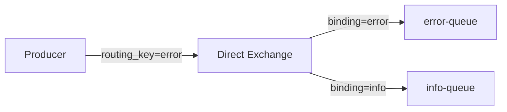

```java
// Объявление direct exchange
channel.exchangeDeclare("logs.direct", "direct", true);
// Привязка очереди
channel.queueBind("error-queue", "logs.direct", "error");
// Публикация
channel.basicPublish("logs.direct", "error", null, body);
```

Если `routing key` не совпадает ни с одним `binding` — сообщение отбрасывается (или уходит в `alternate exchange`).

> [!mcq]
> - [ ] `Direct Exchange` маршрутизирует во все очереди, у которых `binding key` НАЧИНАЕТСЯ с `routing key` (prefix-match). | Это семантика `Topic` с wildcard `#`, не `Direct`; `Direct` сравнивает строки строго побайтово через AMQP-метод `basic.publish`. ❌ ПОСЛЕДСТВИЕ: команда биндит queue по `order` ожидая ловить `order.created`/`order.paid` — ни одно сообщение не доставляется, debug 6 часов до осознания что нужен `Topic`.
> - [x] `Direct Exchange` маршрутизирует в очередь, у которой `binding key` ТОЧНО совпадает с `routing key` сообщения (string equality). | Строгое сравнение строк; при отсутствии match сообщение отбрасывается или уходит в `alternate exchange`. ✓ ПРИМЕНЯТЬ: log-router с тремя очередями `error`/`warn`/`info` и binding key равным level — typical pattern в Wolt-like логировании. 📋 ПРАВИЛО: «`Direct` = exact string equality, никаких wildcards». 🔗 См. Q5, Q7, Q16.
> - [ ] `Direct Exchange` маршрутизирует во все привязанные очереди независимо от `routing key` (broadcast). | Это поведение `Fanout`, который игнорирует `routing key`; `Direct` всегда фильтрует по нему. ❌ ПОСЛЕДСТВИЕ: разработчик настраивает payment-notifications через `Direct` с пустым routing key, ожидая broadcast — только одна очередь получает сообщение, mobile/email/sms uneven coverage, клиенты пропускают уведомления о списаниях.
> - [ ] `Direct Exchange` маршрутизирует по `AMQP headers` сообщения, игнорируя `routing key`. | Это `Headers Exchange` с аргументом `x-match=all/any`; `Direct` смотрит только на `routing key`. ❌ ПОСЛЕДСТВИЕ: junior пишет фильтрацию по custom headers через `Direct`, передаёт metadata в properties.headers — сообщения уходят в catch-all queue, business-логика по типу события не работает.

---

## Q7. Как работает Fanout Exchange?

**`Fanout Exchange`** игнорирует `routing key` и рассылает каждое сообщение во все привязанные очереди. Используется для broadcast/Pub-Sub.

```java
channel.exchangeDeclare("notifications", "fanout", true);
// Привязка без routing key
channel.queueBind("mobile-queue", "notifications", "");
channel.queueBind("email-queue",  "notifications", "");
channel.queueBind("sms-queue",    "notifications", "");

// Публикация (routing key игнорируется)
channel.basicPublish("notifications", "", null, body);
```

Каждый подписчик получает собственную копию сообщения.

> [!mcq]
> - [ ] `Fanout Exchange` маршрутизирует только в ту очередь, чей `binding key` совпадает с `routing key` сообщения. | Это поведение `Direct`; `Fanout` принципиально игнорирует `routing key`, его binding-key вообще не используется при маршрутизации. ❌ ПОСЛЕДСТВИЕ: разработчик мигрирует с `Direct` на `Fanout` ради «broadcast», оставляет старые routing keys в публикациях — сообщения дублируются на все очереди вместо selective delivery, downstream-сервисы получают чужие события и падают на неожиданных payload.
> - [ ] `Fanout Exchange` маршрутизирует по паттерну `routing key` с использованием wildcards `*` и `#`. | Wildcards `*`/`#` — фича только `Topic Exchange`; `Fanout` вообще не анализирует `routing key` (всегда broadcast). ❌ ПОСЛЕДСТВИЕ: команда биндит queue по `notifications.*` к `Fanout`, ожидая фильтрацию — сообщения улетают и в очереди с другим binding pattern, audit-queue получает personal data, GDPR-инцидент.
> - [ ] `Fanout Exchange` маршрутизирует по заголовкам сообщения с аргументом `x-match=any/all`. | Это `Headers Exchange`; `Fanout` не использует ни headers, ни routing key — всё broadcast по списку bindings. ❌ ПОСЛЕДСТВИЕ: разработчик ставит `x-match=all` в bindingArgs к `Fanout` exchange — параметр молча игнорируется, ожидаемая фильтрация не работает, integration tests зелёные локально, prod ловит лавину ненужных событий.
> - [x] `Fanout Exchange` игнорирует `routing key` и рассылает копию сообщения во ВСЕ привязанные очереди (broadcast/Pub-Sub). | Каждый подписчик получает собственную копию; этот тип — основа event-broadcast топологий. ✓ ПРИМЕНЯТЬ: `user.registered` → email/sms/analytics/CRM через 4 очереди, привязанные к одному `Fanout`; cache-invalidation broadcast в Booking.com. 📋 ПРАВИЛО: «`Fanout` = broadcast, routing key игнорируется, queues per subscriber». 🔗 См. Q5, Q6, Q36.

---

## Q8. (!) Как работает Topic Exchange?

**`Topic Exchange`** маршрутизирует сообщения по паттерну `routing key`, используя специальные символы:
- `*` — заменяет ровно одно слово
- `#` — заменяет ноль или более слов

Слова в `routing key` разделяются точкой: `region.service.severity`.

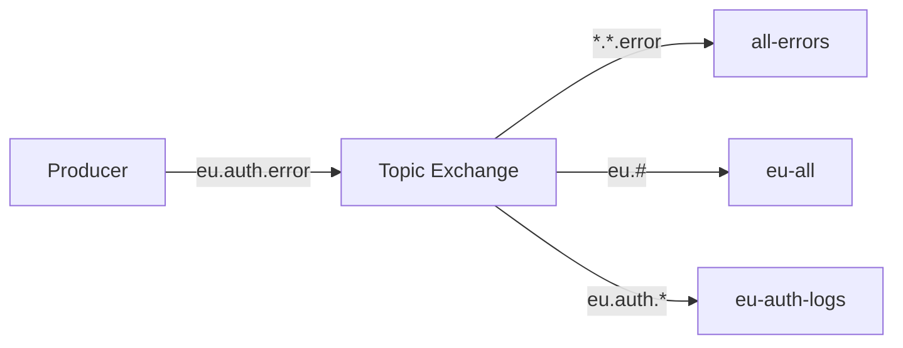

```java
channel.exchangeDeclare("logs.topic", "topic", true);
channel.queueBind("all-errors",   "logs.topic", "*.*.error");
channel.queueBind("eu-all",       "logs.topic", "eu.#");
channel.queueBind("eu-auth-logs", "logs.topic", "eu.auth.*");

// Сообщение "eu.auth.error" попадёт во все три очереди
channel.basicPublish("logs.topic", "eu.auth.error", null, body);
```

> [!mcq]
> - [ ] В Topic Exchange `*` заменяет ноль или более слов, а `#` заменяет ровно одно слово. | Наоборот: `*` ровно одно слово, `#` ноль или более; путаница — классический gotcha на собеседовании. ❌ ПОСЛЕДСТВИЕ: разработчик настраивает binding `logs.*` ожидая получить и `logs`, и `logs.error.critical` — пустая queue в production, диагностика занимает дни.
> - [ ] В Topic Exchange символ `*` заменяет любой символ в слове (glob-стиль), а `#` используется для именования Exchange. | Topic работает с целыми словами через `.`, не glob-символами; `#` — wildcard для слов, не часть имени Exchange. ❌ ПОСЛЕДСТВИЕ: разработчик пишет binding `error*` думая «совпадёт с error/errors/errored» — Topic смотрит на word boundary, всё не работает.
> - [ ] В Topic Exchange символы `*` и `#` используются только в routing key при публикации, но не в binding key. | Наоборот: wildcards в binding key (queue.bind), publisher указывает конкретный routing key без wildcards. ❌ ПОСЛЕДСТВИЕ: разработчик публикует с routing key `*.error` ожидая broadcast по всем сервисам — буквальный routing key `*.error` ни с чем не совпадает кроме literal binding.
> - [x] В Topic Exchange `*` (звёздочка) заменяет ровно одно слово, а `#` (решётка) — ноль или более слов; используются в **binding key**, не в routing key publisher'а. | Точные правила: `eu.#` совпадает с `eu`, `eu.auth`, `eu.auth.error`; `*.*.error` — только с трёхсловными `X.Y.error`; routing key publisher всегда конкретный (`eu.auth.error`). ✓ ПРИМЕНЯТЬ: `logs.#` для catch-all сервиса; `*.error` для cross-service error monitoring; `payment.*.success` для конкретной бизнес-фазы. 📋 ПРАВИЛО: «`*` = ровно 1 слово, `#` = 0+ слов; wildcards в binding, конкретика в routing». 🔗 См. Q5 (типы Exchange), Q9 (Topic Exchange), Q16 (Binding).

> [!mcq]
> - [ ] Паттерн `eu.#` в binding key совпадёт только с routing key равным точно `eu`. | Паттерн `eu.#` совпадает с `eu`, `eu.auth`, `eu.auth.error` — любая строка с префиксом `eu` и опциональными слов после; `#` — zero or more. ❌ ПОСЛЕДСТВИЕ: разработчик ожидает что `eu.#` фильтрует только префикс — получает все европейские события включая `eu.user.deleted`, GDPR-нарушение по халатности.
> - [ ] Паттерн `*.*.error` в binding key совпадёт с routing key `eu.error`, состоящим из двух слов. | `*.*.error` требует ровно ТРИ слова (`X.Y.error`); `eu.error` — два слова, не подходит. ❌ ПОСЛЕДСТВИЕ: команда настраивает alert на `*.*.error`, упускает критические события `app.error` (сторонний сервис из 2 segments) — alert молчит несколько часов.
> - [ ] Паттерн `eu.auth.*` в binding key совпадёт с routing key `eu.auth.error.critical`, состоящим из четырёх слов. | `*` — ровно одно слово; `eu.auth.*` принимает только `eu.auth.X` (три segments), четыре segments игнорируются. ❌ ПОСЛЕДСТВИЕ: разработчик хочет получить все auth-события, использует `eu.auth.*` — теряет `eu.auth.token.expired`, инцидент expired-tokens не диагностируется.
> - [x] Паттерн `*.*.error` в binding key совпадёт с routing key `eu.auth.error` ровно из трёх слов. | `*.*.error`: каждая `*` — одно слово (`eu`, `auth`), `error` — литерал; всего 3 segment match. ✓ ПРИМЕНЯТЬ: для cross-service error tracking (`*.*.error` → ошибки во всех 2-уровневых service.module архитектурах); более гибко — `#.error` (любая глубина). 📋 ПРАВИЛО: «звёздочка = одно слово (3 segments в `*.*.error`); решётка = вариативная глубина». 🔗 См. Q8 (Topic подробно), Q16 (Binding/Routing key).

> [!mcq]
> - [ ] Если несколько `binding pattern` совпадают с одним `routing key`, `Topic Exchange` доставит сообщение только в одну очередь — выбирается binding, созданный первым. | `Topic` дублирует сообщение во ВСЕ совпавшие очереди (overlapping bindings — ключевая фича для fan-out + audit); порядок создания binding роли не играет. ❌ ПОСЛЕДСТВИЕ: команда полагается на «первый match» при настройке audit-bindings — audit-queue не получает события, потому что считается «второй»; compliance-инцидент через 3 месяца на квартальном auditе.
> - [ ] Паттерн `#` (только решётка) в `binding key` совпадает только с пустым `routing key`. | `#` (zero or more words) совпадает с ЛЮБЫМ routing key, включая многословные `a.b.c.d` — это catch-all паттерн. ❌ ПОСЛЕДСТВИЕ: разработчик использует `#` для «дефолт-fallback» queue, ожидая ловить только unmatched события — реально получает копию ВСЕХ сообщений из exchange, очередь распухает на терабайт за сутки, диск забит.
> - [x] Паттерн `#` совпадает с любым `routing key` (catch-all); при overlapping bindings одно сообщение дублируется во все совпавшие очереди — это и есть основа fan-out через `Topic`. | Catch-all + overlapping = базовые механики Topic для audit/observability. ✓ ПРИМЕНЯТЬ: Booking.com — `audit.#` catch-all queue для compliance + `payment.*.success` для бизнес-логики; одно `payment.eu.success` идёт в обе. 📋 ПРАВИЛО: «`#` ловит всё; overlapping = duplicate delivery (фича, не баг)». 🔗 См. Q5, Q16, Q17.
> - [ ] `Topic Exchange` поддерживает кастомные wildcards (например, `?` для одного символа) через аргумент `x-pattern-syntax`. | AMQP-спецификация фиксирует ровно два wildcard'а (`*` и `#`); никаких кастомных синтаксисов нет, аргумента `x-pattern-syntax` не существует. ❌ ПОСЛЕДСТВИЕ: разработчик ищет в документации `x-pattern-syntax` для регулярок, тратит день на поиск несуществующей фичи; в итоге пишет post-filtering в consumer, теряя CPU и нарушая SLA.

---

## Q9. Как работает Headers Exchange?

**`Headers Exchange`** маршрутизирует по заголовкам сообщения (`AMQP message headers`), игнорируя `routing key`.

При привязке задаётся аргумент `x-match`:
- `all` — все указанные заголовки должны совпадать
- `any` — хватит совпадения хотя бы одного заголовка

```java
Map<String, Object> bindingArgs = new HashMap<>();
bindingArgs.put("x-match", "all");
bindingArgs.put("format", "pdf");
bindingArgs.put("type", "report");

channel.queueBind("pdf-reports", "docs.exchange", "", bindingArgs);

// Публикация с заголовками
AMQP.BasicProperties props = new AMQP.BasicProperties.Builder()
    .headers(Map.of("format", "pdf", "type", "report"))
    .build();
channel.basicPublish("docs.exchange", "", props, body);
```

Используется редко — `Topic Exchange` гибче и проще.

> [!mcq]
> - [ ] `Headers Exchange` маршрутизирует по `routing key` с точным совпадением, а `x-match` определяет чувствительность к регистру. | `Headers` полностью игнорирует routing key, маршрутизация идёт по `AMQP message headers`; `x-match` управляет логикой `all`/`any`, а не case-sensitivity. ❌ ПОСЛЕДСТВИЕ: команда передаёт routing key в `Headers Exchange` ожидая фильтрацию — exchange игнорирует его, все сообщения идут во все привязанные очереди (по сути fanout), конфигурация безопасности рушится.
> - [x] `Headers Exchange` маршрутизирует по `AMQP headers`, где `x-match=all` требует совпадения ВСЕХ указанных заголовков, а `x-match=any` — хотя бы одного. | При привязке через `bindingArgs` задаются заголовки-критерии + `x-match`; routing key игнорируется. ✓ ПРИМЕНЯТЬ: legacy-маршрутизация PDF/Word/XML репортов по `format` + `type` headers (`x-match=all`); современный код предпочитает `Topic` за простоту настройки. 📋 ПРАВИЛО: «`Headers` = match по headers; `x-match=all` = AND, `x-match=any` = OR». 🔗 См. Q5, Q6, Q10.
> - [ ] `Headers Exchange` поддерживает wildcards `*` и `#` в значениях заголовков, аналогично `Topic Exchange`. | `Headers` сравнивает только ТОЧНЫЕ значения заголовков (string/number equality); wildcards `*`/`#` — фича `Topic`, в Headers они трактуются как обычные literal-символы. ❌ ПОСЛЕДСТВИЕ: разработчик пишет `bindingArgs.put("region", "eu.*")` ожидая wildcard match — exchange ищет header со значением буквальной строки `eu.*`, ни одно сообщение не доставляется, debug два дня.
> - [ ] `x-match=all` означает «достаточно одного совпадения заголовка», а `x-match=any` — «все должны совпасть». | Значения перепутаны (классический gotcha): `all` = AND (все заголовки должны совпасть), `any` = OR (достаточно одного). ❌ ПОСЛЕДСТВИЕ: команда настраивает фильтр критичных alerts с `x-match=all` ожидая «достаточно одного триггера» — реально alert срабатывает только при совпадении всех условий, p0-инциденты молчат.

---

## Q10. Что такое Default Exchange?

**`Default Exchange`** (`""`) — системный `direct exchange` без имени, существующий по умолчанию. Каждая очередь автоматически привязывается к нему с `routing key` равным имени очереди.

```java
// Прямая отправка в очередь "task-queue" без явного объявления exchange
channel.basicPublish("", "task-queue", null, body);
```

Удобен для простых случаев, но скрывает маршрутизацию — в продакшне лучше явно объявлять `exchange`.

> [!mcq]
> - [ ] `Default Exchange` — это `Fanout` без имени, автоматически рассылающий сообщения во все очереди при пустом `routing key`. | `Default` — `Direct`, не `Fanout`; routing key = имя очереди, сообщение попадает в КОНКРЕТНУЮ очередь, не во все. ❌ ПОСЛЕДСТВИЕ: разработчик публикует через default exchange с пустым routing key ожидая broadcast — сообщения уходят в очередь с пустым именем (если есть) или dropped, downstream-сервисы не получают ничего, тихая потеря событий.
> - [ ] `Default Exchange` — это `Topic` без имени, маршрутизирующий по паттерну, равному имени очереди. | `Default` — `Direct` (точное совпадение строк), без wildcards `*`/`#`; нельзя использовать паттерны типа `orders.*` в routing key. ❌ ПОСЛЕДСТВИЕ: команда публикует через `""` с routing key `orders.*` ожидая Topic-семантику — буквальная строка `orders.*` ни с одной очередью не совпадает, сообщения отбрасываются, payment-flow ломается.
> - [x] `Default Exchange` — это системный `Direct Exchange` без имени (`""`), к которому КАЖДАЯ очередь автоматически привязана с `binding key` = имя очереди. | `basicPublish("", "my-queue", ...)` доставляет напрямую в `my-queue`; удобно для прототипов, но скрывает маршрутизацию — в production предпочитают явные exchange. ✓ ПРИМЕНЯТЬ: Spring AMQP `RabbitTemplate.convertAndSend("queue-name", payload)` без exchange использует именно default — типично для simple Work Queue в job-runner'ах. 📋 ПРАВИЛО: «`Default` = `Direct` без имени; routing key = имя очереди». 🔗 См. Q5, Q6, Q36.
> - [ ] `Default Exchange` — это `Headers Exchange` без имени, маршрутизирующий по заголовку `x-queue-name`, равному имени очереди. | `Default` — `Direct`, не `Headers`; маршрутизация по routing key, не по headers; никакого `x-queue-name` header в AMQP-спецификации нет. ❌ ПОСЛЕДСТВИЕ: разработчик передаёт `properties.headers` с `x-queue-name` ожидая роутинга — header молча игнорируется, default exchange всё равно смотрит на routing key, сообщения теряются или попадают не туда.

---

## Q11. (!) Какие свойства у очереди в RabbitMQ?

| Свойство | Тип | Описание |
|----------|-----|----------|
| `durable` | boolean | Очередь переживает перезапуск брокера |
| `exclusive` | boolean | Очередь используется только текущим соединением и удаляется при его закрытии |
| `autoDelete` | boolean | Очередь удаляется, когда последний `consumer` отписывается |
| `arguments` | Map | Дополнительные параметры: `x-message-ttl`, `x-max-length`, `x-dead-letter-exchange` и др. |

> [!mcq]
> - [ ] `durable=true` означает, что очередь доступна только текущему Connection и удаляется при его закрытии. | Это описание `exclusive=true`, не `durable`; durable — про переживание рестарта брокера, не про привязку к Connection. ❌ ПОСЛЕДСТВИЕ: разработчик ставит `durable=true` для temporary очереди ожидая cleanup при disconnect — очередь остаётся forever, в RabbitMQ накапливаются сотни zombie-queues, mgmt UI тормозит.
> - [ ] `autoDelete=true` означает, что очередь записывает все сообщения на диск для защиты от потери данных. | `autoDelete` управляет lifecycle очереди (удаляется после отписки всех consumers), не персистентностью; для персистентности — `deliveryMode=2` на каждом message + `durable=true` на queue. ❌ ПОСЛЕДСТВИЕ: команда настраивает `autoDelete=true` для critical orders ожидая «защиту от потери» — после рестарта broker queue теряется со всеми сообщениями, заказы не обрабатываются.
> - [ ] `exclusive=true` означает, что очередь удаляется, когда последний consumer отписывается. | Это описание `autoDelete`; `exclusive` — про привязку к одному Connection (queue видна только одному Connection и удаляется при его закрытии). ❌ ПОСЛЕДСТВИЕ: разработчик ставит `exclusive=true` ожидая «удаление после consumer disconnect» — connection держится pool'ом, queue не очищается, broker заполнен мертвыми очередями.
> - [x] `durable=true` — очередь переживает перезапуск брокера; `exclusive=true` — очередь видна только текущему Connection и удаляется при его закрытии; `autoDelete=true` — удаляется после отписки последнего consumer'а. | Три независимых свойства: durable про восстановление, exclusive про privacy, autoDelete про cleanup; persistence сообщений — отдельно через `deliveryMode=2`. ✓ ПРИМЕНЯТЬ: для critical orders — `durable=true` + `deliveryMode=2`; для RPC reply queues — `exclusive=true` + `autoDelete=true`; для broadcast notifications — `autoDelete=true`. 📋 ПРАВИЛО: «durable=рестарт, exclusive=Connection, autoDelete=consumer; persistence сообщений отдельно через deliveryMode=2». 🔗 См. Q12 (durable + persistent), Q13 (exclusive/auto-delete), Q29 (Mirrored Queues HA).

> [!mcq]
> - [ ] `Classic mirrored queue` и `quorum queue` — это синонимы для одного механизма репликации в RabbitMQ 3.8+. | Это два разных механизма: classic mirrored (deprecated в 3.8+, удалён в 4.0) использовал async master-slave репликацию; quorum queue использует Raft consensus с majority-acks. Семантика и failover-поведение разные. ❌ ПОСЛЕДСТВИЕ: команда мигрирует на 4.0 без замены mirrored на quorum — все HA-очереди исчезают при upgrade, downtime до восстановления topology.
> - [x] `Quorum queue` (3.8+) использует Raft с majority-ack; `classic mirrored` — async master-slave, deprecated и удалён в RabbitMQ 4.0. | Это критичное архитектурное различие: quorum даёт строгие гарантии при network partition (CP), mirrored страдал от split-brain. ✓ ПРИМЕНЯТЬ: Wolt order pipeline — все critical queues на `x-queue-type=quorum` с 3 репликами; consumer ack обязателен. 📋 ПРАВИЛО: «3.8+ → quorum, mirrored = legacy». 🔗 См. Q12, Q13.
> - [ ] `Quorum queue` поддерживает все features classic mirrored, включая priority queues, exclusive flag и lazy mode. | Quorum имеет ограничения: нет priority queues, нет exclusive (только durable), нет per-message TTL до 3.10, отдельная семантика memory/disk. ❌ ПОСЛЕДСТВИЕ: команда мигрирует priority-queue на quorum — обнаруживает что приоритеты игнорируются, все сообщения обрабатываются FIFO, SLA на VIP-заказы рушится.
> - [ ] Replication factor для `quorum queue` задаётся через свойство `durable=true` при объявлении очереди. | Replication factor задаётся через `x-quorum-initial-group-size` в arguments (default = 3); `durable` тут просто обязателен. Реплики автоматически распределяются по узлам кластера. ❌ ПОСЛЕДСТВИЕ: разработчик ставит `durable=true` ожидая HA — очередь создаётся как single-node, упал узел — данные потеряны до recovery, нет failover.

```java
Map<String, Object> args = new HashMap<>();
args.put("x-message-ttl", 60000);       // TTL 60 секунд
args.put("x-max-length", 10000);         // макс. 10 000 сообщений
args.put("x-dead-letter-exchange", "dlx");

channel.queueDeclare(
    "my-queue",
    true,   // durable
    false,  // exclusive
    false,  // autoDelete
    args
);
```

---

## Q12. Что такое durable queue и persistent message?

**`durable queue`** — очередь, которая сохраняется при перезапуске `RabbitMQ`. Без `durable=true` очередь и все её сообщения теряются при рестарте.

**`persistent message`** — сообщение с `deliveryMode=2`, которое записывается на диск. Для гарантии сохранности нужны оба условия:

```java
// Persistent message
AMQP.BasicProperties props = new AMQP.BasicProperties.Builder()
    .deliveryMode(2) // persistent
    .build();

channel.basicPublish("my-exchange", "key", props, body);
```

> Важно: `durable` очередь без `persistent` сообщений не гарантирует сохранность — сообщения из памяти теряются при падении.

> [!mcq]
> - [ ] Durable queue достаточно для гарантии сохранности сообщений при перезапуске — persistent message не требуется. | Durable queue только гарантирует выживание самой очереди при рестарте. Если сообщения не имеют deliveryMode=2 (persistent), они хранятся в памяти и теряются при падении брокера.
> - [ ] Persistent message достаточно для гарантии сохранности при перезапуске — durable queue не требуется. | Persistent message записывается на диск, но если очередь не durable, она удаляется при рестарте брокера вместе со всеми сообщениями. Нужны оба условия одновременно.
> - [ ] Durable queue и persistent message гарантируют мгновенную доставку сообщений без задержки на запись. | Durable queue и persistent message обеспечивают надёжность, но не скорость. Запись на диск неизбежно добавляет латентность по сравнению с хранением только в памяти.
> - [x] Для гарантии сохранности сообщений при перезапуске нужны оба условия: durable queue и persistent message (deliveryMode=2). | Именно так: durable queue переживает рестарт брокера, а persistent message (deliveryMode=2) гарантирует запись на диск. Только вместе они обеспечивают at-least-once при падении.

---

## Q13. Что такое exclusive и auto-delete очередь?

**`exclusive`** очередь:
- Доступна только создавшему её `Connection`
- Удаляется автоматически при закрытии `Connection`
- Используется для временных очередей ответов в RPC-паттернах

**`auto-delete`** очередь:
- Удаляется, когда все `consumer` отписались
- Если `consumer` не было вообще — не удаляется немедленно (ждёт хотя бы одного)
- Используется для динамических подписок

> [!mcq]
> - [ ] `exclusive` очередь удаляется, когда все consumers отписались, и используется для динамических подписок. | Это описание `auto-delete`; `exclusive` привязана к одному `Connection` и удаляется при его закрытии, независимо от consumers. ❌ ПОСЛЕДСТВИЕ: разработчик ставит `exclusive=true` на shared queue для broadcast-подписки — второй сервис в другом Connection падает с `RESOURCE_LOCKED: queue is exclusive to another connection`, integration ломается на старте.
> - [ ] `auto-delete` очередь доступна только создавшему её `Connection` и используется для temporary RPC reply queues. | Это описание `exclusive`; `auto-delete` НЕ ограничивает доступ по Connection — другие соединения могут подписываться. ❌ ПОСЛЕДСТВИЕ: команда ставит `auto-delete=true` для RPC reply-queue ожидая Connection-isolation — другой клиент с тем же queue name перехватывает ответы, RPC отдаёт чужие данные, payment-конфирмация уходит к другому пользователю.
> - [ ] `exclusive` очередь переживает перезапуск брокера и используется для сохранения истории сообщений. | `exclusive` — temporary конструкция, привязанная к Connection; не переживает ни закрытие Connection, ни рестарт брокера; для сохранности — `durable=true` + `deliveryMode=2`. ❌ ПОСЛЕДСТВИЕ: разработчик ставит `exclusive=true` для критичной audit-queue — после рестарта брокера все события audit-trail исчезают, compliance-нарушение, штраф регулятора.
> - [x] `exclusive` очередь удаляется при закрытии создавшего её `Connection`, `auto-delete` — когда отписался ПОСЛЕДНИЙ consumer (после хотя бы одного). | Два независимых триггера удаления: `exclusive` = Connection lifetime, `auto-delete` = consumer lifecycle. ✓ ПРИМЕНЯТЬ: `exclusive=true` + `auto-delete=true` для RPC reply-queues в Spring AMQP `convertSendAndReceive`; `auto-delete=true` без exclusive для динамических подписок multiple consumers. 📋 ПРАВИЛО: «`exclusive` = Connection-bound, `auto-delete` = последний consumer ушёл». 🔗 См. Q11, Q12, Q37.

---

## Q14. Как настроить TTL для сообщений и очереди?

**TTL на уровне очереди** — все сообщения в очереди получают одно время жизни:

```java
Map<String, Object> args = new HashMap<>();
args.put("x-message-ttl", 30000); // 30 секунд
channel.queueDeclare("ttl-queue", true, false, false, args);
```

**TTL на уровне сообщения** — индивидуальное время жизни:

```java
AMQP.BasicProperties props = new AMQP.BasicProperties.Builder()
    .expiration("30000") // строка в миллисекундах
    .build();
channel.basicPublish("", "ttl-queue", props, body);
```

**TTL самой очереди** (`x-expires`) — очередь удаляется, если не используется N миллисекунд:

```java
args.put("x-expires", 300000); // удалить очередь через 5 минут бездействия
```

При истечении TTL сообщение либо отбрасывается, либо роутится в `DLX`.

> [!mcq]
> - [ ] TTL на уровне сообщения задаётся через аргумент x-message-ttl в виде числа миллисекунд, а TTL очереди — через поле expiration в AMQP-свойствах. | Всё наоборот: x-message-ttl в аргументах queueDeclare задаёт TTL для всех сообщений в очереди, а expiration (строка!) в BasicProperties — TTL конкретного сообщения.
> - [x] TTL на уровне очереди задаётся через x-message-ttl в аргументах queueDeclare, а TTL конкретного сообщения — через expiration в BasicProperties. | Точное описание двух механизмов: x-message-ttl в Map-аргументах при объявлении очереди применяется ко всем сообщениям, а expiration в AMQP BasicProperties — к конкретному сообщению. Оба значения в миллисекундах, но expiration передаётся как строка.
> - [ ] TTL на уровне очереди задаётся через x-expires в аргументах queueDeclare, а TTL сообщений применить невозможно. | x-expires — это TTL самой очереди (когда она удаляется при бездействии), а не TTL сообщений. TTL сообщений задаётся через x-message-ttl или expiration в BasicProperties.
> - [ ] TTL для сообщений применяется только при использовании DLX — без него истёкшие сообщения остаются в очереди навсегда. | TTL работает независимо от DLX. При истечении TTL сообщение либо отбрасывается (если DLX не настроен), либо маршрутизируется в DLX. DLX не является обязательным условием работы TTL.

---

## Q15. Что такое максимальная длина очереди (max-length)?

Ограничивает количество сообщений или объём в байтах:

```java
args.put("x-max-length", 1000);           // максимум 1000 сообщений
args.put("x-max-length-bytes", 1048576);  // максимум 1 МБ
args.put("x-overflow", "drop-head");      // при переполнении: удалить самое старое (default)
// или
args.put("x-overflow", "reject-publish"); // отклонить новое сообщение
```

При `drop-head` и наличии `DLX` удалённые сообщения маршрутизируются в dead letter очередь.

> [!mcq]
> - [ ] При переполнении с `x-overflow=drop-head` удаляется САМОЕ НОВОЕ сообщение (только что опубликованное). | `drop-head` удаляет HEAD очереди — самое СТАРОЕ (FIFO-голова); для отклонения новых нужен `reject-publish`. ❌ ПОСЛЕДСТВИЕ: команда ставит `drop-head` для high-priority alerts ожидая «защиту свежих» — реально теряются именно свежие p0-инциденты, на доске остаются week-old warnings, on-call молчит.
> - [ ] При переполнении с `x-overflow=reject-publish` удаляется самое старое сообщение из очереди. | `reject-publish` ОТКЛОНЯЕТ новые публикации (publisher получает `nack` или `basic.return` при `mandatory=true`), существующие сообщения не трогаются. ❌ ПОСЛЕДСТВИЕ: разработчик настраивает `reject-publish` ожидая ротацию старых событий — publisher молча получает `nack` без `confirms`, события теряются на старте, audit log пустой.
> - [x] `drop-head` (default) удаляет самое СТАРОЕ; `reject-publish` ОТКЛОНЯЕТ новые публикации (`nack` publisher'у); `drop-head` + DLX направит удалённые в dead letter. | Два режима overflow с противоположной семантикой: `drop-head` жертвует историей, `reject-publish` защищает её ценой backpressure. ✓ ПРИМЕНЯТЬ: `drop-head` для telemetry (важна свежесть); `reject-publish` + Publisher Confirms для critical orders (потеря недопустима). 📋 ПРАВИЛО: «`drop-head` = FIFO old out; `reject-publish` = new in not allowed». 🔗 См. Q14, Q21, Q23.
> - [ ] `x-max-length` ограничивает объём очереди в БАЙТАХ, а `x-max-length-bytes` — количество сообщений. | Всё наоборот: `x-max-length` = количество сообщений (штук), `x-max-length-bytes` = объём в байтах; параметры независимы и работают одновременно. ❌ ПОСЛЕДСТВИЕ: команда настраивает `x-max-length=1048576` думая «1 МБ» — реально лимит 1М сообщений, очередь распухает до десятков ГБ, диск брокера переполнен, узел падает в flow-control.

---

## Q16. (!) Что такое Binding и Routing Key?

**`Binding`** — правило связи между `Exchange` и `Queue`. Определяет, какие сообщения из `exchange` попадут в данную очередь.

**`Routing Key`** — строка-ключ, которую `producer` указывает при публикации. `Exchange` использует её для маршрутизации (кроме `fanout`).

```mermaid
graph LR
    E[Exchange] -->|binding key = "order.created"| Q1[orders-queue]
    E -->|binding key = "payment.*"| Q2[payments-queue]
    E -->|binding key = "#"| Q3[audit-queue]
```

**Binding Key** в `direct` exchange — точная строка. В `topic` exchange — паттерн с `*` и `#`. В `fanout` — игнорируется.

> [!mcq]
> - [ ] `Binding` — это правило связи между `Producer` и `Exchange`, определяющее, какие сообщения exchange принимает от данного producer. | `Binding` связывает `Exchange` и `Queue`, не Producer/Exchange; Producer вообще не имеет постоянной связи с Exchange — он просто публикует в момент `basicPublish`. ❌ ПОСЛЕДСТВИЕ: разработчик ищет API «зарегистрировать producer'а в exchange» по аналогии с Kafka topic permissions, тратит день на несуществующую фичу — в RabbitMQ ACL делается через vhost-permissions, не через bindings.
> - [ ] `Routing Key` — это атрибут очереди, определяющий, какие типы сообщений она принимает от exchange. | `Routing Key` — атрибут сообщения, передаётся publisher'ом в `basicPublish`; у очереди есть только `binding key` (связан через `queueBind`), который exchange сравнивает с routing key сообщения. ❌ ПОСЛЕДСТВИЕ: команда настраивает «routing key очереди» через UI Management plugin — изменения не применяются (поля нет), ожидаемая фильтрация не работает, события идут не туда.
> - [x] `Binding` — правило связи `Exchange ↔ Queue` (создаётся через `queueBind`), а `Routing Key` — строка в сообщении, которую `Exchange` сравнивает с `binding key` для выбора целевых очередей. | Два разных понятия: binding key — атрибут связи, routing key — атрибут сообщения; в `Direct` точное равенство, в `Topic` паттерн match, в `Fanout` игнорируются. ✓ ПРИМЕНЯТЬ: order pipeline в Wolt — `queueBind("orders.eu", "orders.exchange", "order.eu.*")`, publisher шлёт `routingKey="order.eu.created"` → match по binding pattern. 📋 ПРАВИЛО: «`Binding` = Exchange↔Queue rule; `Routing Key` = атрибут сообщения». 🔗 См. Q5, Q6, Q17.
> - [ ] `Routing Key` — это уникальный идентификатор сообщения в очереди, используемый для дедупликации при повторной доставке. | `Routing Key` — ключ маршрутизации, не identifier; для идентификации сообщения — `messageId`/`correlationId` в `BasicProperties`; для дедупликации consumer должен сам поддерживать idempotency. ❌ ПОСЛЕДСТВИЕ: команда строит дедупликацию по routing key — все сообщения одного типа имеют одинаковый routing key, дедупликация удаляет валидные дубликаты, бизнес теряет orders, support отвечает «технический сбой».

> [!mcq]
> - [ ] В topic exchange `*` матчит ноль или больше слов, а `#` — ровно одно слово в routing key. | Семантика обратная: `*` — РОВНО одно слово (между точками), `#` — ноль или больше слов. ❌ ПОСЛЕДСТВИЕ: команда биндит queue по `logs.*` ожидая `logs.error.payment` — сообщение не приходит, debug-сессия 4 часа.
> - [x] В topic exchange `*` матчит ровно одно слово, `#` — ноль или больше слов; при overlapping bindings одно сообщение может попасть в несколько очередей. | Точная семантика wildcards + множественная доставка. ✓ ПРИМЕНЯТЬ: Booking events `booking.*.created` для одного слова региона + `audit.#` catch-all для аудита; одно событие идёт и в business queue, и в audit. 📋 ПРАВИЛО: «`*` = one word, `#` = zero+ words, overlap = duplicate delivery». 🔗 См. Q8, Q17.
> - [ ] При overlapping bindings RabbitMQ доставляет сообщение только в одну очередь — выбирается первая совпавшая по порядку создания binding. | RabbitMQ дублирует сообщение во ВСЕ совпавшие очереди (это и есть смысл fan-out через bindings); порядок создания binding роли не играет. ❌ ПОСЛЕДСТВИЕ: разработчик полагается на «первый match» — audit-queue не получает события, потому что считается «второй», compliance-инцидент.
> - [ ] Routing key и binding key должны полностью совпадать в topic exchange — wildcards работают только в Headers Exchange. | Wildcards `*` и `#` — фундамент именно topic exchange; Headers Exchange использует match по заголовкам без routing key. ❌ ПОСЛЕДСТВИЕ: junior пытается матчить headers через `*` в `topic`-exchange, всё работает, переходит на `headers`-exchange — wildcards игнорируются, вся маршрутизация ломается.

---

## Q17. Можно ли привязать несколько очередей к одному Exchange?

Да, это один из ключевых механизмов маршрутизации. Один `exchange` может быть привязан к неограниченному количеству очередей с разными `binding key`.

Также поддерживается привязка **нескольких exchange** друг к другу (exchange-to-exchange bindings), что позволяет строить сложные топологии маршрутизации.

> [!mcq]
> - [ ] Один `exchange` может быть привязан только к ОДНОЙ очереди с уникальным `binding key` для предотвращения дублирования. | `RabbitMQ` не накладывает такого ограничения; exchange может биндиться к десяткам/сотням очередей, в том числе с одинаковыми `binding key` — это и есть основа fan-out семантики. ❌ ПОСЛЕДСТВИЕ: архитектор строит broadcast-уведомления через N отдельных exchange (по одному на подписчика) для «уникальности bindings» — кластер засоряется тысячами exchange, mgmt UI тормозит, `pause-minority` heal-up в кластере занимает часы.
> - [ ] `Exchange-to-exchange binding` позволяет consumer читать сообщения напрямую из exchange без промежуточной очереди. | E2E binding соединяет Exchange↔Exchange для composable routing; consumer всё равно читает из `Queue` через `basicConsume` — exchange сам по себе не хранит сообщения. ❌ ПОСЛЕДСТВИЕ: разработчик пытается подписаться на exchange через `basicConsume("my-exchange", ...)` — получает `NOT_FOUND: no queue`, тратит день на перепроектирование, обнаруживает что нужна обычная queue.
> - [x] Один `exchange` может быть привязан к неограниченному числу очередей и к другим exchange через `exchange-to-exchange binding` (`exchangeBind`). | Множественные bindings → fan-out к N очередям; E2E bindings → построение composable топологий (например, audit-tap к main flow). ✓ ПРИМЕНЯТЬ: Booking.com — главный `events.exchange` с E2E binding к `audit.exchange` (catch-all `#`); все события автоматически дублируются в audit без знания publisher'а. 📋 ПРАВИЛО: «N queues per exchange + E2E bindings = composable топология». 🔗 См. Q5, Q6, Q16.
> - [ ] `Exchange-to-exchange binding` возможен только для `Fanout Exchange` и не поддерживается для `Direct` или `Topic`. | E2E binding работает для ВСЕХ типов: `Direct`, `Topic`, `Fanout`, `Headers`; тип exchange влияет на логику маршрутизации (точная/паттерн/broadcast/headers), не на возможность связи. ❌ ПОСЛЕДСТВИЕ: команда мигрирует topology с `Topic`+E2E на `Fanout`+E2E «потому что только fanout поддерживает» — теряет всю pattern-routing логику, audit-queue получает копии всех сообщений вместо selective tap.

---

## Q18. (!) Что такое acknowledgement (ack) в RabbitMQ?

**`Acknowledgement`** (`ack`) — подтверждение от `consumer` о том, что сообщение успешно обработано. До получения `ack` сообщение остаётся в состоянии `unacked` и не удаляется из очереди.

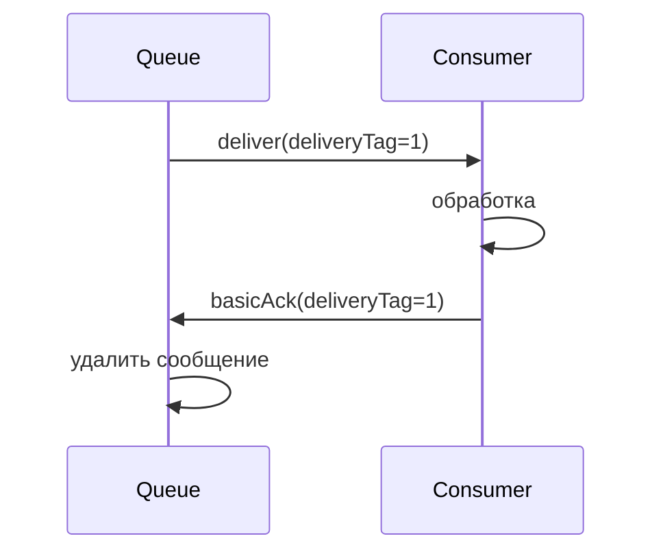

Если `consumer` упал без `ack` — сообщение переходит обратно в `ready` и будет доставлено другому `consumer`.

```java
channel.basicConsume("my-queue", false, (consumerTag, delivery) -> {
    try {
        process(delivery.getBody());
        channel.basicAck(delivery.getEnvelope().getDeliveryTag(), false);
    } catch (Exception e) {
        channel.basicNack(delivery.getEnvelope().getDeliveryTag(), false, true);
    }
}, consumerTag -> {});
```

Параметр `multiple=true` в `basicAck` подтверждает все сообщения до указанного `deliveryTag`.

> [!mcq]
> - [ ] До получения `ack` сообщение удаляется из очереди, но хранится в буфере брокера на случай повторной доставки. | Брокер хранит сообщение в очереди в состоянии `unacked`, а не в отдельном буфере; удаление происходит только после `ack`. ❌ ПОСЛЕДСТВИЕ: команда строит мониторинг по `messages_ready` и не видит unacked-задержку; consumer завис, очередь "пустая", но сообщения копятся в `unacknowledged`.
> - [ ] При падении `consumer` без `ack` сообщение теряется и брокер не пытается доставить его другому consumer. | Без `ack` сообщение возвращается в `ready` и доставляется другому consumer (at-least-once). Потеря возможна только при `auto-ack`. ❌ ПОСЛЕДСТВИЕ: payment processor падает посреди обработки — оплата теряется без следа; reconciliation с банком расходится на тысячи транзакций в день.
> - [x] До получения `ack` сообщение остаётся в `unacked`; при падении consumer оно возвращается в `ready` и доставляется другому. | Базовая семантика at-least-once в `RabbitMQ`. ✓ ПРИМЕНЯТЬ: Wolt order pipeline — manual ack после записи заказа в БД; при OOMKilled у consumer заказ автоматически перевыдан другому поду. 📋 ПРАВИЛО: «No ack — back to ready». 🔗 См. Q20, Q24.
> - [ ] Параметр `multiple=true` в `basicAck` подтверждает только следующее сообщение после указанного `deliveryTag`. | `multiple=true` подтверждает ВСЕ сообщения до и включая `deliveryTag`, что позволяет батчевое подтверждение. ❌ ПОСЛЕДСТВИЕ: программист ожидает «следующее» поведение — после ack часть сообщений уже подтверждена, но при retry он dispatch их снова, дубли в downstream системе.

> [!mcq]
> - [ ] При обработке отравленного сообщения (битый JSON) безопаснее всего вызывать `basicNack` с `requeue=true`, чтобы не терять данные. | `requeue=true` возвращает poison message в ту же очередь — следующая попытка вызовет ту же ошибку, и так бесконечно. ❌ ПОСЛЕДСТВИЕ: один сбойный payload забивает consumer на 100% CPU, лаг растёт лавиной, остальные сообщения копятся часами.
> - [ ] Брокер автоматически отслеживает количество redelivery и после N попыток отправляет сообщение в DLQ независимо от настроек consumer. | Брокер не считает попытки автоматически: client должен сам читать `x-death`/`redelivered` и принимать решение `nack(requeue=false)`. ❌ ПОСЛЕДСТВИЕ: команда полагается на «авто-DLQ» — багованное сообщение зацикливается, наблюдается бесконечный redelivery, мониторинг redelivery rate показывает аномалию слишком поздно.
> - [ ] Флаг `redelivered=true` в `Envelope` означает, что сообщение уже было успешно обработано предыдущим consumer. | `redelivered=true` означает «было выдано ранее, но не получило ack» — обработка прервалась или nack-нулась; не равно «успешной обработке». ❌ ПОСЛЕДСТВИЕ: разработчик трактует флаг как «дубликат обработанного» и пропускает сообщение — заказ теряется, клиент не получает товар.
> - [x] Для poison message используют `basicNack` с `requeue=false` (или счётчик попыток в `x-death`) — сообщение уходит в DLX без зацикливания. | Защита от бесконечного retry-loop: либо явный одноразовый отказ, либо лимит на основе `x-death[count]`. ✓ ПРИМЕНЯТЬ: Booking.com payment events — после 3 попыток (по `x-death`) consumer делает `nack(false, false)`, сообщение оседает в DLQ под алерт. 📋 ПРАВИЛО: «Poison → DLX, never requeue». 🔗 См. Q19, Q23.

---

## Q19. Чем отличаются nack и reject?

| Метод | Параметры | Описание |
|-------|-----------|----------|
| `basicAck` | `deliveryTag, multiple` | Успешная обработка |
| `basicNack` | `deliveryTag, multiple, requeue` | Неуспешно, можно переотправить несколько |
| `basicReject` | `deliveryTag, requeue` | Неуспешно, только одно сообщение |

`requeue=true` — сообщение возвращается в очередь (риск бесконечного цикла).  
`requeue=false` — сообщение отбрасывается или роутится в `DLX`.

Основное отличие `nack` от `reject` — поддержка параметра `multiple` для массового отклонения.

> [!mcq]
> - [ ] `basicReject` поддерживает параметр `multiple` для массового отклонения, а `basicNack` — нет. | Наоборот: `basicNack` принимает `multiple`, а `basicReject` отклоняет только одно сообщение по `deliveryTag`. ❌ ПОСЛЕДСТВИЕ: developer делает batch-обработку через `reject` — оборачивает в цикл, channel захлёбывается из-за тысяч round-trip RPC; throughput падает в 50 раз.
> - [ ] `requeue=true` всегда безопаснее, потому что сообщение возвращается в очередь и не теряется. | `requeue=true` создаёт риск poison message loop: сбойное сообщение бесконечно возвращается, нагружая consumer. ❌ ПОСЛЕДСТВИЕ: kafka-style событие с битым JSON падает в parser, requeue=true — consumer крутит CPU 100% на одном сообщении, лаг растёт лавиной.
> - [ ] При `requeue=false` сообщение удаляется из очереди и не попадает в `DLX` ни при каких условиях. | При `requeue=false` сообщение направляется в `DLX`, если очередь сконфигурирована с `x-dead-letter-exchange`; иначе отбрасывается. ❌ ПОСЛЕДСТВИЕ: команда настроила DLX, но ожидает что reject «удалит» сообщение — DLQ переполняется, alerts срабатывают на ничего не значащий поток.
> - [x] `basicNack` поддерживает `multiple` для массового отклонения; `basicReject` работает только с одним сообщением. | Это единственное функциональное отличие; обе операции принимают `requeue`. ✓ ПРИМЕНЯТЬ: Booking.com booking pipeline — при сбое сериализатора батч из 100 unacked отклоняется одной командой `nack(tag, multiple=true, requeue=false)` в DLQ. 📋 ПРАВИЛО: «Nack = batch, Reject = single». 🔗 См. Q18, Q24.

---

## Q20. (!) В чём разница между auto-ack и manual ack?

**`auto-ack`** (`autoAck=true`):
- Брокер считает сообщение обработанным сразу после доставки
- Максимальная скорость, но нет гарантий обработки
- При падении `consumer` сообщение теряется

**`manual ack`** (`autoAck=false`):
- `Consumer` явно вызывает `basicAck` / `basicNack` / `basicReject`
- Гарантирует at-least-once доставку
- Требует правильной обработки ошибок

> В продакшне всегда используйте `manual ack` для надёжной обработки.

> [!mcq]
> - [ ] `auto-ack` гарантирует at-least-once: брокер ждёт ответа TCP-уровня от consumer перед удалением сообщения. | `auto-ack` удаляет сообщение сразу при отправке через socket, без подтверждения обработки; это at-most-once. ❌ ПОСЛЕДСТВИЕ: order service с auto-ack — JVM упала после `read()` но до `process()`; заказ потерян, клиент получил списание без отгрузки.
> - [ ] `manual ack` снижает throughput в десятки раз и подходит только для критичных систем с малым потоком. | Overhead manual ack минимален (доли мс на ack-RPC); современные consumer держат >50K msg/s с manual ack + prefetch. ❌ ПОСЛЕДСТВИЕ: команда выбирает auto-ack «ради скорости» в обычном CRUD — теряет сообщения при rolling restart, чинит инцидент неделю.
> - [ ] При `manual ack` брокер автоматически отправляет повторный `ack` каждую секунду, чтобы не было таймаутов. | Брокер не шлёт автоматических `ack`; consumer обязан явно вызывать `basicAck`. Существует `consumer_timeout` (30 мин по умолчанию), после которого канал закрывается. ❌ ПОСЛЕДСТВИЕ: long-running ETL-обработчик ждёт 1 час на одно сообщение — channel закрывается, все unacked возвращаются в очередь, бесконечный retry-loop.
> - [x] `auto-ack` — at-most-once (риск потери); `manual ack` — at-least-once с явным вызовом `basicAck`/`basicNack`. | Точная семантика: контроль обработки в обмен на overhead RPC. ✓ ПРИМЕНЯТЬ: Wolt courier-tracking events с auto-ack (потеря OK, важна скорость); orders/payments — manual ack. 📋 ПРАВИЛО: «Money = manual, telemetry = auto». 🔗 См. Q18, Q21.

> [!mcq]
> - [ ] При manual ack `prefetch` опционален: брокер сам ограничивает поток через TCP backpressure до уровня, который consumer успевает обрабатывать. | Без `prefetch` (или с `prefetch=0` — unlimited) брокер по AMQP-протоколу льёт ВСЕ unacked-сообщения consumer-у сразу же; TCP backpressure не помогает на уровне очереди. ❌ ПОСЛЕДСТВИЕ: consumer стартует, читает 2M unacked сообщений из retry-queue в память, JVM heap взрывается через 10 секунд, OOM-loop, очередь не разгружается часами.
> - [ ] `prefetch=1` всегда оптимально для manual ack: гарантирует строгий порядок и нулевой риск OOM. | `prefetch=1` сильно режет throughput (RTT на каждое сообщение); оптимум обычно 10–250 в зависимости от длительности обработки. ❌ ПОСЛЕДСТВИЕ: команда копирует «best practice prefetch=1» из tutorial в high-throughput billing pipeline, latency ack-RPC становится bottleneck, throughput падает с 50K до 2K msg/s.
> - [x] Для manual ack `prefetch` обязателен (иначе брокер пушит всю очередь consumer-у); типичное значение 50–250 балансирует throughput и память. | Без prefetch ack-модель ломается на больших очередях. ✓ ПРИМЕНЯТЬ: order-service `prefetch=100` + manual ack — стабильная обработка при backlog 10M. 📋 ПРАВИЛО: «manual ack без prefetch = бомба замедленного действия». 🔗 См. Q26, Q27.
> - [ ] При auto-ack значение `prefetch` критически важно, а при manual ack игнорируется брокером полностью. | Ровно наоборот: `prefetch` ограничивает unacked-сообщения, поэтому он значим именно при manual ack. При auto-ack сообщение «ack» сразу при доставке и unacked не накапливается. ❌ ПОСЛЕДСТВИЕ: разработчик ставит огромный prefetch для auto-ack ожидая ускорения, не получает эффекта, тратит неделю на профилирование.

---

## Q21. Что такое Publisher Confirms?

**`Publisher Confirms`** — механизм подтверждения от брокера к `producer` о том, что сообщение принято и сохранено (в очереди или на диске).

```java
channel.confirmSelect(); // включить режим подтверждений

// Синхронный вариант
channel.basicPublish("exchange", "key", null, body);
if (!channel.waitForConfirms(5000)) {
    throw new RuntimeException("Message not confirmed");
}

// Асинхронный вариант (лучше для производительности)
channel.addConfirmListener(
    (deliveryTag, multiple) -> log.info("Confirmed: {}", deliveryTag),
    (deliveryTag, multiple) -> log.warn("Nacked: {}", deliveryTag)
);
channel.basicPublish("exchange", "key", null, body);
```

`Publisher Confirms` несовместимы с транзакциями на одном `channel`.

> [!mcq]
> - [ ] Без `Publisher Confirms` `RabbitMQ` всё равно гарантирует доставку сообщения, потому что использует TCP. | TCP гарантирует доставку байтов до брокера, но НЕ persistence на диск или маршрутизацию в очередь; сообщение может быть потеряно при crash брокера до flush. ❌ ПОСЛЕДСТВИЕ: publisher confirms отключены — message потерян при crash брокера до flush на disk; e-commerce orders теряются молча, audit log пустой.
> - [ ] `confirmSelect()` нужно вызывать перед каждым `basicPublish`, иначе подтверждения не работают. | `confirmSelect()` переключает `channel` в confirm-mode один раз; все последующие publish получают подтверждения. ❌ ПОСЛЕДСТВИЕ: разработчик вызывает `confirmSelect` в loop — ловит `IllegalStateException: Cannot transition to confirm-mode again`, channel закрывается, все publish зависают.
> - [x] Брокер шлёт `basic.ack` producer-у после того, как сообщение принято в очередь (или сохранено на диск для durable). | Это и есть гарантия публикации (replicates Raft / disk write). ✓ ПРИМЕНЯТЬ: Booking.com booking-confirmation events — async confirm listener + outbox table; producer ретраит publish при `nack` или таймауте. 📋 ПРАВИЛО: «Confirm = broker accepted». 🔗 См. Q22, Q12.
> - [ ] Асинхронный `ConfirmListener` блокирует publisher thread до получения подтверждения. | Асинхронный listener — non-blocking callback на отдельном thread; publisher продолжает работу. Блокирующая семантика — у `waitForConfirms`. ❌ ПОСЛЕДСТВИЕ: команда ожидает блокировку и не делает back-pressure — наполняет канал миллионами unconfirmed pending, OOM в JVM на producer-стороне.

> [!mcq]
> - [x] Для гарантии маршрутизации нужно использовать `mandatory=true` + `ReturnListener`; иначе unroutable сообщение получит `ack` и потеряется. | Confirms покрывают только «accepted by broker»; routability — отдельная проблема, решается через `basic.return`. ✓ ПРИМЕНЯТЬ: Wolt notification dispatcher — `RabbitTemplate.setMandatory(true)` + `setReturnsCallback` логирует unroutable и отправляет в alert-queue. 📋 ПРАВИЛО: «Confirm ≠ routed, mandatory + return». 🔗 См. Q22, Q24.
> - [ ] Если очередь не существует на момент publish, брокер пришлёт `basic.nack` и producer узнает о проблеме. | Без `mandatory=true` сообщение для несуществующей очереди молча dropped и producer всё равно получит `ack` (брокер «принял»). ❌ ПОСЛЕДСТВИЕ: сервис публикует в неправильный routing key, видит зелёные ack, но consumer ничего не получает; инцидент находят через сутки по упавшему revenue.
> - [ ] `Publisher Confirms` гарантируют, что хотя бы один consumer обработал сообщение. | Confirms подтверждают только приём брокером, никак не consumption; для end-to-end гарантии нужны consumer ack + idempotent processing. ❌ ПОСЛЕДСТВИЕ: producer считает publish успешным «end-to-end», не строит outbox/retry для consumer-side сбоев — потери при downstream-багах.
> - [ ] При получении `nack` от брокера сообщение автоматически переотправляется библиотекой через `BackoffPolicy`. | Reaction на `nack` — ответственность application-кода: библиотека лишь сообщает о статусе, retry реализует разработчик через outbox/buffer. ❌ ПОСЛЕДСТВИЕ: команда не пишет retry-логику — при перегрузке брокера часть `nack` сообщений теряется без следа, аналитика расходится с ops-данными.

---

## Q22. Чем Publisher Confirms отличаются от транзакций AMQP?

| Аспект | `Publisher Confirms` | Транзакции (`txSelect`) |
|--------|---------------------|------------------------|
| Производительность | Высокая (асинхронно) | Низкая (синхронно, блокирует) |
| Семантика | At-least-once | At-least-once |
| Батч | Да | Да (`txCommit`) |
| Rollback | Нет | Да (`txRollback`) |
| Рекомендуется | Да | Нет (устарело) |

Транзакции в `AMQP` снижают производительность в 250 раз по сравнению с `Publisher Confirms`. Используйте `Publisher Confirms`.

> [!mcq]
> - [ ] AMQP-транзакции обеспечивают распределённый XA-протокол между брокером и producer. | AMQP `tx.*` — это локальные на канале транзакции (publish/ack), не XA, не двухфазный коммит между разными ресурсами. ❌ ПОСЛЕДСТВИЕ: архитектор обещает atomicity «БД + RabbitMQ» через `tx.*` — реально ничего не атомарно; обновление БД success, publish fail — события теряются.
> - [x] Транзакции снижают throughput в ~250 раз из-за блокирующего `tx.commit`; `Publisher Confirms` — асинхронны. | Точное практическое сравнение из benchmarks команды RabbitMQ. ✓ ПРИМЕНЯТЬ: high-throughput event bus в Wolt — confirm-mode + async listener; transactions используются только в legacy-коде на 1990s AMQP-libs. 📋 ПРАВИЛО: «Confirms async > tx blocking». 🔗 См. Q21, Q23.
> - [ ] `Publisher Confirms` поддерживают rollback через `confirm.rollback`, что упрощает обработку ошибок. | В confirm-mode нет rollback; есть только `ack` или `nack` от брокера. Rollback существует только в `tx.*`. ❌ ПОСЛЕДСТВИЕ: разработчик ищет `confirm.rollback` в API, тратит часы; ошибочно ловит `nack` как rollback и не реализует retry, теряет сообщения.
> - [ ] Транзакции и `Publisher Confirms` можно безопасно комбинировать на одном канале для двойной надёжности. | Несовместимы: одновременное использование вызывает ошибку канала (`PRECONDITION_FAILED`). ❌ ПОСЛЕДСТВИЕ: попытка совместить — channel exception, все publishers падают, downtime до рестарта приложения.

---

## Q23. (!) Что такое Dead Letter Exchange (DLX) и DLQ?

**`DLX`** (`Dead Letter Exchange`) — специальный `exchange`, куда брокер маршрутизирует сообщения, которые не могут быть обработаны.

**`DLQ`** (`Dead Letter Queue`) — очередь, привязанная к `DLX`, которая собирает «мёртвые» сообщения.

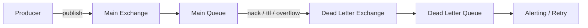

Настройка:
```java
// Объявляем DLX и DLQ
channel.exchangeDeclare("dlx", "direct", true);
channel.queueDeclare("dlq", true, false, false, null);
channel.queueBind("dlq", "dlx", "dead");

// Основная очередь с указанием DLX
Map<String, Object> args = new HashMap<>();
args.put("x-dead-letter-exchange", "dlx");
args.put("x-dead-letter-routing-key", "dead");
channel.queueDeclare("main-queue", true, false, false, args);
```

> [!mcq]
> - [ ] `DLX` — отдельный системный exchange `amq.dlx`, который автоматически создаётся для каждой очереди. | `DLX` — обычный пользовательский exchange, который объявляется явно через `exchangeDeclare` и привязывается через `x-dead-letter-exchange` в args очереди. ❌ ПОСЛЕДСТВИЕ: команда не объявляет DLX — все сообщения с reject теряются молча, инцидент находят через неделю по падению revenue.
> - [x] `DLX` — обычный exchange, привязанный к очереди через аргумент `x-dead-letter-exchange`; `DLQ` — очередь, биндованная к этому exchange. | Стандартная топология; DLX/DLQ создаются вручную и являются обычными AMQP-объектами. ✓ ПРИМЕНЯТЬ: Wolt order pipeline — `orders.dlx` + `orders.dlq` со встроенным мониторингом глубины DLQ; alert при глубине > 100. 📋 ПРАВИЛО: «DLX = regular exchange, opt-in». 🔗 См. Q24, Q25.
> - [ ] При попадании в `DLX` сообщение теряет оригинальные headers и routing key. | Сообщение сохраняет тело и headers; `RabbitMQ` добавляет служебный header `x-death` с историей. ❌ ПОСЛЕДСТВИЕ: команда ожидает чистое сообщение — пишет код парсинга `x-death`, ломается при неожиданных полях, операционная отладка усложняется.
> - [ ] `DLQ` обязана находиться на том же узле кластера, что и основная очередь. | `DLQ` — обычная очередь, может быть mirrored/quorum, на любом узле. ❌ ПОСЛЕДСТВИЕ: архитектор делает все DLQ на одном узле «для дешевизны» — узел падает, теряются все мёртвые сообщения и история инцидентов.

> [!mcq]
> - [ ] При dead-letter routing key исходного сообщения сохраняется как есть, и `x-dead-letter-routing-key` игнорируется. | По умолчанию routing key наследуется, но если задан `x-dead-letter-routing-key` — он перекрывает оригинал. ❌ ПОСЛЕДСТВИЕ: разработчик настроил DLX с одной очередью под несколько routing keys, не указал override — сообщения с key `payments.failed` не bind-ятся в DLQ с фиксированным `dead`, теряются.
> - [ ] Если основная очередь — `quorum`, она не может использовать DLX из-за ограничений Raft-репликации. | Quorum Queues полностью поддерживают DLX (через `x-dead-letter-strategy=at-least-once`), это рекомендованная конфигурация. ❌ ПОСЛЕДСТВИЕ: команда мигрирует на quorum и удаляет DLX «потому что несовместимы» — теряет audit trail сбоев, инциденты невозможно восстановить.
> - [ ] DLX срабатывает синхронно: producer ждёт подтверждения, что сообщение успешно сохранено в DLQ, перед получением `ack`. | Dead-lettering — фоновый процесс брокера, никак не связан с подтверждением publisher; producer уже давно получил `ack` к моменту dead-letter. ❌ ПОСЛЕДСТВИЕ: SRE строит SLO на «publish→DLQ latency» через publisher confirm — метрика бессмысленна, реальный лаг dead-letter скрыт.
> - [x] Заголовок `x-death` — массив записей с `count`, `reason` (`rejected`/`expired`/`maxlen`), `queue`, `time`; используется для лимита retry-попыток. | Это первоисточник для anti-poison логики и observability. ✓ ПРИМЕНЯТЬ: Booking.com payment retry — consumer читает `x-death[0].count`, при `>= 5` шлёт `nack(false, false)` в parking-lot queue для ручного разбора. 📋 ПРАВИЛО: «x-death = retry counter». 🔗 См. Q24, Q25.

---

## Q24. При каких условиях сообщение попадает в DLQ?

Сообщение становится «мёртвым» в трёх случаях:

1. **Rejected** — `consumer` вызвал `basicReject` или `basicNack` с `requeue=false`
2. **TTL истёк** — время жизни сообщения или очереди истекло
3. **Queue overflow** — очередь достигла `x-max-length` и политика — `drop-head`

В DLX-сообщение добавляется заголовок `x-death` с информацией о причине, количестве смертей и исходной очереди.

> [!mcq]
> - [ ] Сообщение попадает в DLQ при `basicNack` с `requeue=true` после превышения числа попыток. | `requeue=true` возвращает в ту же очередь — в DLQ направляет ТОЛЬКО `requeue=false`. Лимит попыток брокер не считает сам. ❌ ПОСЛЕДСТВИЕ: разработчик строит retry на `requeue=true` — poison message циркулирует бесконечно, consumer CPU 100%, alert не срабатывает.
> - [ ] Сообщение dead-letter-ится только при истечении TTL очереди, но не при `nack` или overflow. | Это три независимых триггера: reject/nack(false), TTL (msg или queue), max-length overflow с `drop-head`. ❌ ПОСЛЕДСТВИЕ: команда ставит TTL «на всякий случай» и не настраивает overflow — очередь растёт до диск-фейла, broker уходит в flow-control.
> - [x] Три триггера: `reject`/`nack` с `requeue=false`, истечение TTL, и `max-length` overflow с политикой `drop-head`. | Полный набор условий из официальной документации. ✓ ПРИМЕНЯТЬ: Booking.com — payment retry-loop через DLX (reject+ttl), audit overflow-drops для capacity planning. 📋 ПРАВИЛО: «Reject, expire, overflow». 🔗 См. Q23, Q25.
> - [ ] Если у очереди не настроен `x-dead-letter-exchange`, отклонённые сообщения автоматически идут в `amq.default`. | При отсутствии настройки сообщения отбрасываются и теряются — никакого fallback на default exchange нет. ❌ ПОСЛЕДСТВИЕ: разработчик надеется на «безопасный fallback» — сотни тысяч rejected сообщений теряются, recovery после bug-fix невозможен.

---

## Q25. Как реализовать retry с использованием DLX и TTL?

Паттерн **delayed retry** через `DLX` и `TTL`:

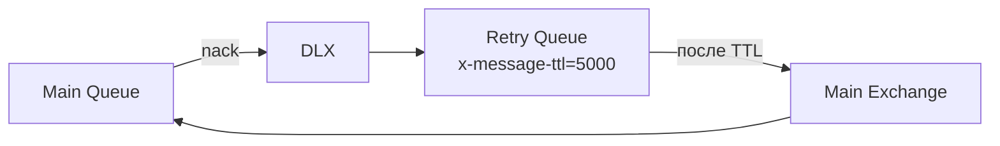

```java
// Retry Queue — задержка 5 секунд, после истечения TTL → обратно в main exchange
Map<String, Object> retryArgs = new HashMap<>();
retryArgs.put("x-message-ttl", 5000);
retryArgs.put("x-dead-letter-exchange", "main-exchange");
retryArgs.put("x-dead-letter-routing-key", "main-key");
channel.queueDeclare("retry-queue", true, false, false, retryArgs);
channel.queueBind("retry-queue", "dlx", "retry");

// При ошибке в consumer
channel.basicNack(deliveryTag, false, false); // requeue=false → в DLX → retry-queue
```

Для ограничения числа попыток используют заголовок `x-death[count]`.

> [!mcq]
> - [ ] Достаточно поставить `requeue=true` с задержкой через `Thread.sleep` в consumer для реализации delayed retry. | `Thread.sleep` блокирует thread consumer, держит prefetch и channel; не масштабируется и не переживает рестарт. ❌ ПОСЛЕДСТВИЕ: 1000 retry-сообщений по 5 секунд — все consumer threads спят, остальные сообщения копятся, queue lag растёт линейно.
> - [x] `Main Queue` → DLX → `retry-queue` с `x-message-ttl` → DLX `retry-queue` → main exchange (через `x-dead-letter-exchange`). | Классический паттерн delayed retry без блокировки consumer и без потери при рестарте. ✓ ПРИМЕНЯТЬ: Wolt notifications — failed push notifications делают delay 5s/30s/5min retry-tier через TTL queues. 📋 ПРАВИЛО: «TTL-queue = delay primitive». 🔗 См. Q14, Q23.
> - [ ] Плагин `rabbitmq_delayed_message_exchange` работает идентично паттерну DLX+TTL и заменяем по производительности. | Плагин использует Mnesia/Khepri и хранит отложенные сообщения отдельно — паттерн DLX+TTL предпочтительнее для high-throughput; плагин даёт per-message delay. ❌ ПОСЛЕДСТВИЕ: команда ставит плагин в high-volume сервис — Mnesia взрывается на 10М delayed messages, broker OOM.
> - [ ] Заголовок `x-death` обновляется только при первом dead-letter, поэтому считать попытки в нём нельзя. | `x-death` — массив записей: каждый dead-letter добавляет новую или инкрементирует `count` в существующей. ❌ ПОСЛЕДСТВИЕ: разработчик ставит лимит на `x-death[0].count` всегда «1» — retry бесконечен, DLQ переполняется только когда консультант извне находит баг.

---

## Q26. (!) Что такое prefetch count и QoS?

**`Prefetch count`** (`basicQos`) — максимальное количество сообщений `unacked`, которые брокер отправит `consumer` до получения `ack`.

```java
// Consumer получит не более 10 сообщений без подтверждения
channel.basicQos(10);
```

**Без prefetch** (`prefetchCount=0`) — брокер отправит все доступные сообщения сразу, перегружая `consumer`.

**С prefetchCount=1** — честное распределение (fair dispatch): каждый `consumer` получает новое сообщение только после обработки предыдущего.

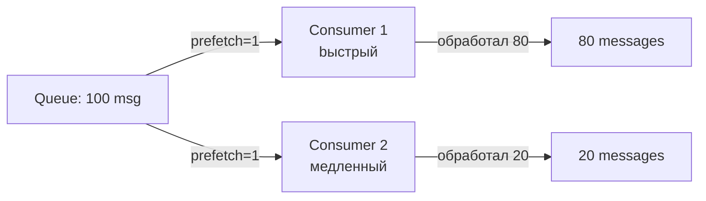

> [!mcq]
> - [ ] `prefetchCount=0` означает один сообщение за раз и обеспечивает fair dispatch. | `prefetchCount=0` = БЕЗ ограничений, брокер шлёт всё сразу; fair dispatch — это именно `prefetchCount=1`. ❌ ПОСЛЕДСТВИЕ: разработчик ожидает «безопасный default 0», получает все 100K сообщений на один consumer; OOM на JVM, остальные consumers простаивают.
> - [ ] `basicQos` действует на уровне connection, поэтому одного вызова достаточно на всё приложение. | Действует на уровне `channel` (или per-consumer); каждый channel требует отдельной настройки. ❌ ПОСЛЕДСТВИЕ: микросервис с 10 каналами — у 9 prefetch=unlimited, один consumer всё забирает; load skew, sla нарушается на peak hours.
> - [x] `prefetchCount` — лимит unacked сообщений на canal/consumer; контролирует баланс throughput vs fair dispatch. | Точное определение `basicQos` из спецификации AMQP. ✓ ПРИМЕНЯТЬ: Wolt order workers — prefetch=20 (короткие задачи); ETL workers с тяжёлыми расчётами — prefetch=1. 📋 ПРАВИЛО: «Heavy work = low prefetch». 🔗 См. Q27, Q34.
> - [ ] Высокий `prefetchCount` всегда улучшает производительность, потому что снижает round-trips. | На очень высоких значениях растёт memory footprint consumer и rebalancing penalty при смерти consumer (все unacked перевыдаются). ❌ ПОСЛЕДСТВИЕ: prefetch=10000 на тяжёлых сообщениях — consumer падает, 10K сообщений возвращаются в ready, downstream HikariCP захлёбывается, cascade failure.

> [!mcq]
> - [ ] `basicQos(10, true)` (global=true) задаёт лимит 10 unacked на каждого consumer канала, как и `global=false`. | Семантика противоположная: `global=true` — лимит 10 на ВЕСЬ канал суммарно; `global=false` — 10 на каждого consumer отдельно. ❌ ПОСЛЕДСТВИЕ: разработчик ожидает per-consumer лимит, выставил `global=true` — на канале с 5 consumer-ами throughput в 5 раз ниже плана, latency растёт.
> - [ ] Изменить `prefetchCount` для уже подписанного consumer можно только через переподключение канала. | `basicQos` можно вызывать в любой момент; новое значение применяется к последующим dispatch. ❌ ПОСЛЕДСТВИЕ: команда дропает соединение «чтобы поменять prefetch» — все unacked возвращаются в ready, происходит redelivery storm на downstream.
> - [x] `global=false` (default в AMQP 0-9-1) — лимит на каждого consumer; `global=true` — общий лимит на канал, делится между всеми consumer-ами. | Это и есть ключевое различие, важно при многопоточных consumer-ах на одном канале. ✓ ПРИМЕНЯТЬ: Spring `SimpleMessageListenerContainer` использует один канал на consumer — обе семантики совпадают; `DirectMessageListenerContainer` с shared channel — внимательно с `global=true`. 📋 ПРАВИЛО: «global=true → channel-wide». 🔗 См. Q27, Q34.
> - [ ] Quorum Queues игнорируют `prefetchCount`, потому что fair dispatch обеспечивается Raft-логом. | Quorum Queues полностью соблюдают `basicQos`; Raft отвечает за репликацию, не за flow control к consumer. ❌ ПОСЛЕДСТВИЕ: миграция на quorum «без настройки prefetch» — consumer перегружается burst-ом сообщений, GC pause, рестарт под, redelivery, лавинный эффект.

---

## Q27. Как prefetch влияет на производительность и нагрузку?

| `prefetchCount` | Поведение | Применение |
|-----------------|-----------|------------|
| `0` | Без ограничений, все сообщения сразу | Не рекомендуется |
| `1` | Строго по одному, fair dispatch | Долгие задачи, неравномерная нагрузка |
| `10–100` | Хороший баланс | Большинство случаев |
| Высокий (>100) | Высокий throughput | Быстрая обработка, батчи |

`prefetchCount` на уровне `channel` (`global=false`) — каждый `consumer` на канале получает свой лимит. С `global=true` — общий лимит для всего канала.

> [!mcq]
> - [ ] `prefetchCount=0` означает «по одному сообщению за раз», как самая безопасная настройка для всех воркеров. | На самом деле `0` означает unlimited — брокер шлёт consumer'у сразу всё. Безопасное значение — `1`. ❌ ПОСЛЕДСТВИЕ: image-processing воркер с долгой задачей хватает 50k jobs в RAM, OOMKilled через 30 секунд, очередь стопорится.
> - [x] `prefetchCount=1` даёт fair dispatch для долгих неравномерных задач, а `10–100` — баланс throughput/latency для большинства сервисов. | Низкий prefetch распределяет долгие задачи, средний даёт батчинг. ✓ ПРИМЕНЯТЬ: Wolt image resize — `prefetch=1`; обычный order processor — `prefetch=20`. 📋 ПРАВИЛО: «Долго → 1, быстро → 50». 🔗 См. Q26.
> - [ ] `global=true` означает, что лимит применяется ко всем каналам соединения, а не к одному. | `global=true` — лимит на весь канал (не connection); `global=false` — на каждого consumer канала. AMQP 0-9-1 differs from 0-10. ❌ ПОСЛЕДСТВИЕ: разработчик ожидает connection-wide throttling, выставляет `global=true`, но второй канал того же connection продолжает hammer'ить — flood downstream.
> - [ ] При высоком `prefetchCount` (>100) consumer перестаёт получать новые сообщения, пока не подтвердит все. | Брокер шлёт до prefetch unacked одновременно, но consumer обрабатывает их параллельно/по мере готовности. Throughput возрастает. ❌ ПОСЛЕДСТВИЕ: SRE видит низкий throughput, поднимает `prefetch=500`, ожидая ускорения, но получает наоборот memory pressure и GC pauses в JVM consumer'е.

---

## Q28. (!) Как работает кластеризация в RabbitMQ?

Кластер `RabbitMQ` — несколько узлов (`node`), объединённых в единое логическое целое:

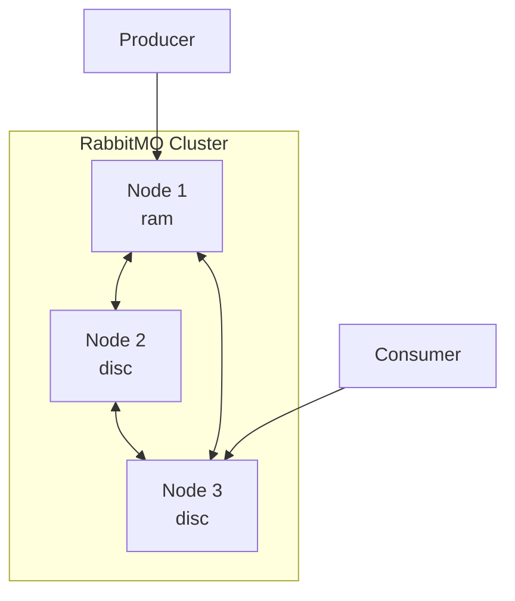

**Что реплицируется:**
- Метаданные: `exchange`, `binding`, `vhost`, пользователи, политики
- Очереди **НЕ реплицируются** по умолчанию (только на одном узле)

**Типы узлов:**
- `disc` — хранит метаданные на диске (минимум один в кластере)
- `ram` — хранит только в памяти (быстрее, но не переживает рестарт)

**Network partition** — кластер может расщепиться на несколько частей; стратегии: `ignore`, `pause-minority`, `autoheal`.

> [!mcq]
> - [ ] Все очереди в кластере автоматически реплицируются между всеми узлами для отказоустойчивости. | По умолчанию очередь живёт ТОЛЬКО на одном узле (master); реплика требует Quorum или Mirrored politik. Реплицируются лишь metadata. ❌ ПОСЛЕДСТВИЕ: e-commerce платформа считает что cluster = HA, узел с `orders.queue` падает, очередь недоступна до восстановления — orders не процессятся 30 минут.
> - [ ] `ram`-узлы быстрее работают и переживают рестарт благодаря репликации в `disc`-узлах. | `ram` хранит метаданные только в RAM; при рестарте они теряются и узел синхронизируется с disc-узлами. Сами очереди при рестарте всё равно теряют non-durable сообщения. ❌ ПОСЛЕДСТВИЕ: оператор перезагружает все узлы поочерёдно, считает что данные сохранены, но non-durable очереди и transient метаданные теряются.
> - [x] Метаданные (exchanges, bindings, vhosts) реплицируются на все узлы; стратегия `pause-minority` корректно обрабатывает split-brain, останавливая меньшинство. | Базовая модель кластеризации — replicated metadata + per-queue master. ✓ ПРИМЕНЯТЬ: Booking.com 3-node cluster с `pause-minority` для безопасности при network partition. 📋 ПРАВИЛО: «Metadata everywhere, queue on one». 🔗 См. Q29, Q30.
> - [ ] Стратегия `ignore` при network partition безопаснее, чем `pause-minority`, потому что не останавливает обработку. | `ignore` приводит к split-brain: обе части продолжают принимать сообщения, после восстановления данные расходятся. `pause-minority` — рекомендуемый default. ❌ ПОСЛЕДСТВИЕ: финансовая система с `ignore` после network partition имеет два независимых set of orders, при reconciliation двойные списания на $200k.

> [!mcq]
> - [ ] `autoheal` — самая безопасная стратегия split-brain: после восстановления сети обе части атомарно мерджат сообщения без потерь. | `autoheal` выбирает «победителя» (часть с большим числом клиентов) и `restart`-ит проигравшую сторону, теряя её unacked и transient данные. Никакого atomic-merge сообщений нет. ❌ ПОСЛЕДСТВИЕ: команда выбирает `autoheal` ради «автоматичности», после partition теряет половину payment events, реконсилирует базу руками три дня.
> - [ ] При partition стратегии `ignore` обе части кластера автоматически блокируют публикацию до восстановления, чтобы избежать split-brain. | `ignore` ничего не блокирует — обе части продолжают работать независимо как два отдельных кластера; это и есть классический split-brain. ❌ ПОСЛЕДСТВИЕ: dev-стенд с `ignore` (default до 3.x) — после flapping сети две половины принимают дублирующие orders, тестовые данные расходятся, QA не воспроизводит баги.
> - [x] При чётном числе узлов `pause-minority` может остановить весь кластер при partition 2-vs-2; для надёжного quorum нужен нечётный размер (3, 5, 7). | Чётный кластер не имеет majority при равном split. ✓ ПРИМЕНЯТЬ: production 3-node или 5-node с `pause-minority` + Quorum Queues; не делайте 2 или 4 узла. 📋 ПРАВИЛО: «odd nodes для quorum, even = риск total stop». 🔗 См. Q30.
> - [ ] `cluster_partition_handling` влияет только на classic mirrored queues; для Quorum Queues стратегия игнорируется. | Quorum Queues используют собственный Raft-консенсус (всегда majority), но `cluster_partition_handling` всё равно применяется к metadata и classic queues в том же кластере. ❌ ПОСЛЕДСТВИЕ: оператор переходит на Quorum, оставляет `ignore` ради простоты, metadata расходится при partition, exchange/binding частично применяются на разных узлах.

---

## Q29. Что такое Mirrored Queues (Classic HA)?

**`Mirrored Queues`** (устаревший механизм, Classic HA) — очереди с зеркалами на нескольких узлах кластера.

- Один узел — **master** (принимает все операции)
- Остальные — **slaves** (зеркала, синхронизируются с master)
- При падении master — один из slaves становится новым master

**Проблемы Mirrored Queues:**
- Высокая нагрузка на сеть при синхронизации
- Потенциальная потеря сообщений при split-brain
- `RabbitMQ 3.13` объявил их устаревшими в пользу `Quorum Queues`

> [!mcq]
> - [ ] Mirrored Queues надёжнее Quorum Queues, так как используют синхронную репликацию на все slaves. | Mirrored используют custom-протокол со слабыми гарантиями и уязвимы к split-brain; Quorum используют Raft с majority-quorum. ❌ ПОСЛЕДСТВИЕ: команда поднимает новый кластер на RabbitMQ 4.x с Mirrored — feature недоступна, миграция критичных очередей блокирует production rollout на неделю.
> - [x] Mirrored Queues deprecated с RabbitMQ 3.9 и удалены в 4.x; новые проекты должны использовать Quorum Queues или Streams. | Чёткая миграционная стратегия: classic-HA → quorum. ✓ ПРИМЕНЯТЬ: Booking.com мигрировал с mirrored на quorum для order pipeline; в Spring AMQP — `QueueBuilder.durable("q").quorum().build()`. 📋 ПРАВИЛО: «Mirrored — legacy, Quorum — modern». 🔗 См. Q30.
> - [ ] При падении master в mirrored queue новый master всегда содержит все сообщения, отправленные publisher'ом. | Без publisher confirms сообщения, ещё не реплицированные на slave, теряются при failover. Eventually consistent replication. ❌ ПОСЛЕДСТВИЕ: банковский сервис теряет 50 платежей при failover master node, customers видят deducted money без booking confirmation.
> - [ ] Slave-узлы в mirrored queue могут принимать publish-операции для распределения нагрузки. | Все операции (publish/consume) идут через master; slaves только зеркалируют — это bottleneck. ❌ ПОСЛЕДСТВИЕ: архитектор планирует горизонтальное масштабирование за счёт mirrored slaves, нагрузка не распределяется, throughput остаётся прежним при удвоенной cost.

> [!mcq]
> - [ ] При split-brain в Mirrored Queues каждая партиция продолжает обслуживать клиентов, и сообщения автоматически объединяются после восстановления связи. | Mirrored использует политику `pause_minority` или `autoheal`: при split-brain меньшинство либо отключается, либо одна сторона теряет данные при autoheal. ❌ ПОСЛЕДСТВИЕ: архитектор планирует «multi-master writes» для multi-DC mirror — после network partition теряет до 30% сообщений, реконсиляция вручную.
> - [ ] Параметр `ha-sync-mode=automatic` гарантирует, что новый slave мгновенно принимает все сообщения и сразу готов к failover. | Синхронизация slave — длительный процесс копирования всей очереди; в это время очередь блокируется (`automatic`) или работает без полной replica (`manual`). ❌ ПОСЛЕДСТВИЕ: оператор добавляет slave в горячую очередь с миллионами сообщений — `automatic` блокирует publish/consume на 20 минут, downtime на peak hours.
> - [x] Mirrored Queues используют eventually-consistent репликацию: при failover unacked сообщения, не достигшие slave, теряются — Quorum через Raft majority устраняет эту дыру. | Это фундаментальная дельта в гарантиях: classic mirror = best-effort, quorum = strong via majority. ✓ ПРИМЕНЯТЬ: financial settlement — миграция на quorum 3-node с `mandatory=true`+confirms; mirrored оставлен только для метрик/телеметрии. 📋 ПРАВИЛО: «Mirror = eventual, Quorum = majority». 🔗 См. Q30.
> - [ ] Mirrored Queues автоматически переключают consumer на новый master после failover без потери connection. | Connection к старому master падает; client получает `connection.close` и должен переподключиться через recovery-механизм (Spring AMQP делает это автоматически, raw AMQP — нет). ❌ ПОСЛЕДСТВИЕ: legacy-сервис на голом amqp-client без recovery — после failover навсегда отключается от очереди, требуется перезапуск пода.

---

## Q30. (!) Что такое Quorum Queues и чем они лучше Mirrored?

**`Quorum Queues`** — современный тип реплицированных очередей на основе алгоритма **Raft** (как в `etcd`, `Consul`).

| Характеристика | Mirrored Queues | Quorum Queues |
|----------------|-----------------|---------------|
| Алгоритм | Custom | Raft |
| Гарантии | Слабее | Stronger (majority) |
| Split-brain | Уязвим | Устойчив |
| Производительность | Ниже | Выше |
| Поддержка | Deprecated | Recommended |
| Статус | Устарел в 3.9 | Рекомендован с 3.9 |

```java
// Spring AMQP: объявление Quorum Queue
@Bean
public Queue quorumQueue() {
    return QueueBuilder.durable("my-quorum-queue")
        .quorum()
        .build();
}
```

`Quorum Queues` гарантируют консистентность при наличии большинства (`quorum`) узлов. Не поддерживают `x-message-ttl`, `priority queues`.

> [!mcq]
> - [ ] Quorum Queues поддерживают полный набор функций классических очередей, включая priority и per-message TTL. | Quorum НЕ поддерживают priority queues и per-message TTL (только per-queue TTL). ❌ ПОСЛЕДСТВИЕ: команда мигрирует priority queue trading-системы на quorum, теряет приоритизацию VIP-клиентов, retail orders блокируют high-frequency flow.
> - [ ] Quorum Queues работают на двух узлах кластера, обеспечивая active-passive failover. | Raft требует majority quorum: минимум 3 узла (4-replica для tolerance 1). На 2-узловом кластере при потере одного узла теряется quorum. ❌ ПОСЛЕДСТВИЕ: стартап разворачивает 2-node cluster для экономии, при первом обслуживании одного узла очередь становится unavailable, заказы простаивают.
> - [x] Quorum Queues используют Raft consensus с majority-quorum, обеспечивают stronger consistency и устойчивы к split-brain в отличие от Mirrored. | Современный production-default для критичных очередей. ✓ ПРИМЕНЯТЬ: financial trading с `QueueBuilder.durable("trades").quorum().build()` на 5-node кластере. 📋 ПРАВИЛО: «Raft majority — strong consistency». 🔗 См. Q29, Q31.
> - [ ] Quorum Queues идентичны по производительности Streams и подходят для event sourcing с replay-семантикой. | Streams — отдельный append-only тип для event log с replay; Quorum — replicated FIFO без replay. Разные use-cases. ❌ ПОСЛЕДСТВИЕ: архитектор выбирает quorum для audit log, через год нужно перепрослушать события — невозможно, требуется миграция данных в Streams или Kafka.

> [!mcq]
> - [ ] Quorum Queues всегда быстрее Mirrored, потому что Raft параллелит запись на все реплики асинхронно. | Quorum синхронно ждёт подтверждения от majority перед `ack` — на маленьких сообщениях он медленнее classic non-mirrored, но даёт сильные гарантии. ❌ ПОСЛЕДСТВИЕ: команда мигрирует high-throughput telemetry «ради скорости», получает падение throughput в 2 раза и рост latency p99 на 40 ms.
> - [ ] Quorum Queues хранят все сообщения только в памяти ради скорости, как и lazy queues. | Quorum пишет лог Raft на диск (durable by design); это противоположность памяти-only. Lazy — отдельная политика для classic. ❌ ПОСЛЕДСТВИЕ: архитектор полагается на «in-memory speed» — после рестарта pod сообщения на месте (что хорошо), но performance hypothesis не оправдывается, capacity planning сломан.
> - [ ] При потере connectivity у одного из 3 узлов quorum-кластера очередь становится недоступной до восстановления. | 3-node Raft переживает потерю 1 узла (majority = 2): очередь продолжает работать, leader переизбирается за секунды. ❌ ПОСЛЕДСТВИЕ: SRE паникует во время node restart — пытается «починить» кластер вручную, ломает реальный quorum, тогда уже downtime.
> - [x] Quorum tolerance: `2N+1` узлов выдерживают потерю `N`; типичный production — 3 узла (failure 1) или 5 узлов (failure 2), 2-узловой кластер не работает. | Это фундаментальный закон Raft, нужно учитывать при проектировании топологии. ✓ ПРИМЕНЯТЬ: Wolt critical-events — 3 quorum-узла в одном AZ + cluster federation между AZ; capacity planning от replica factor. 📋 ПРАВИЛО: «Tolerance = N, nodes = 2N+1». 🔗 См. Q29, Q31.

---

## Q31. Что такое Federation и Shovel в RabbitMQ?

**`Federation`** — плагин для связи `exchange` или `queue` между разными брокерами (в разных датацентрах). Сообщения перемещаются только при наличии `consumer`.

**`Shovel`** — плагин для непрерывного перекачивания сообщений из одной очереди в другую (в том числе на удалённом брокере). Полезен для:
- Миграции сообщений
- Репликации между датацентрами
- Переброски из `DLQ` после починки

Разница: `Federation` — логическая связь exchange/queue; `Shovel` — явное перемещение сообщений.

> [!mcq]
> - [ ] Federation и Shovel — это синонимы для одного механизма репликации между датацентрами. | Federation работает на уровне exchange/queue (логическая связь, lazy pull при наличии consumer); Shovel — явный transfer message-by-message. Разные модели. ❌ ПОСЛЕДСТВИЕ: SRE выбирает Federation для миграции из DLQ, ожидая push-семантику, сообщения не перемещаются без consumer на target side, простой 12 часов.
> - [x] Federation — логическая связь exchange/queue между брокерами с lazy-pull; Shovel — explicit message transfer для миграции и DLQ-replay. | Чёткое разделение по use-case. ✓ ПРИМЕНЯТЬ: Booking.com — Federation для cross-DC event flow, Shovel для одноразовой миграции legacy кластера. 📋 ПРАВИЛО: «Federation — link, Shovel — move». 🔗 См. Q31.
> - [ ] Shovel требует отдельного брокера-посредника, а Federation работает point-to-point. | Оба — плагины самого RabbitMQ, не требуют посредников; конфигурируются на одном из узлов. ❌ ПОСЛЕДСТВИЕ: команда тратит спринт на проектирование middle-broker для Shovel, теряет время — feature plug-and-play.
> - [ ] Federation создаёт полную копию очередей source-брокера на target-брокере, удваивая хранилище. | Federation подтягивает сообщения по необходимости (только при наличии consumer на target); полной копии нет. ❌ ПОСЛЕДСТВИЕ: оператор видит «удвоение storage» в плане ёмкости, заказывает излишний storage на $50k/year, реальное использование — единицы процентов.

---

## Q32. (!) Что такое Spring AMQP и RabbitTemplate?

**`Spring AMQP`** — абстракция Spring для работы с `AMQP`-брокерами. Состоит из двух модулей:
- `spring-amqp` — базовые абстракции (не зависит от `RabbitMQ`)
- `spring-rabbit` — реализация для `RabbitMQ`

**`RabbitTemplate`** — основной класс для отправки и синхронного получения сообщений:

```java
@Autowired
private RabbitTemplate rabbitTemplate;

// Отправка
rabbitTemplate.convertAndSend("my-exchange", "routing.key", myObject);

// Синхронный запрос (RPC)
MyResponse response = (MyResponse) rabbitTemplate.convertSendAndReceive(
    "rpc-exchange", "rpc-key", request
);
```

**`MessageConverter`** (по умолчанию `SimpleMessageConverter`) преобразует объекты в/из `AMQP Message`. Рекомендуется `Jackson2JsonMessageConverter` для JSON.

> [!mcq]
> - [ ] `SimpleMessageConverter` по умолчанию умеет сериализовать любые POJO в JSON через рефлексию. | `SimpleMessageConverter` использует Java serialization для unknown типов; для JSON нужен явно `Jackson2JsonMessageConverter`. ❌ ПОСЛЕДСТВИЕ: разработчик отправляет `Order` POJO, payload — Java-serialized binary, non-Java consumer (Python/Go) не может десериализовать, integration ломается.
> - [x] `RabbitTemplate.convertSendAndReceive()` реализует синхронный RPC через временные reply-queues и `correlationId`. | Inbuilt RPC через AMQP. ✓ ПРИМЕНЯТЬ: legacy-интеграция Spring-сервиса с monolith через RabbitMQ RPC; современный код предпочитает HTTP/gRPC. 📋 ПРАВИЛО: «Spring AMQP RPC = sendAndReceive + correlationId». 🔗 См. Q32, Q37.
> - [ ] `spring-amqp` зависит от `spring-rabbit` и автоматически подключает RabbitMQ-driver при импорте. | Зависимость обратная: `spring-rabbit` зависит от `spring-amqp` (абстракции). `spring-amqp` сам по себе не требует RabbitMQ. ❌ ПОСЛЕДСТВИЕ: разработчик пишет интеграцию с другим AMQP-брокером (Qpid), импортирует `spring-rabbit` и получает RabbitMQ-only классы, рефакторинг недели.
> - [ ] `RabbitTemplate.convertAndSend()` блокируется до получения ack от брокера для гарантии доставки. | По умолчанию метод non-blocking; гарантию даёт publisher confirms (`setConfirmCallback`) или transaction. ❌ ПОСЛЕДСТВИЕ: команда полагается на «синхронность» convertAndSend, broker недоступен — сообщения молча уходят в локальный buffer, при OOM сервиса orders теряются без error log.

> [!mcq]
> - [ ] `convertAndSend(obj)` и `send(message)` идентичны по результату — оба используют `MessageConverter` для сериализации. | `send(Message)` принимает уже готовый `Message` (byte[] body + properties); `MessageConverter` НЕ применяется. `convertAndSend(obj)` — единственный метод, который вызывает converter. ❌ ПОСЛЕДСТВИЕ: разработчик меняет `convertAndSend` на `send` для «оптимизации», передаёт `Message` с raw POJO body — ClassCastException у consumer, потому что converter не отработал.
> - [x] `convertAndSend(obj)` пропускает объект через `MessageConverter` (Jackson → JSON byte[]); `send(message)` отправляет готовый `Message` без конвертации. | Точное разделение API. ✓ ПРИМЕНЯТЬ: 99% случаев — `convertAndSend` с `Jackson2JsonMessageConverter`; `send` нужен для нестандартных payload (Avro, protobuf вручную). 📋 ПРАВИЛО: «POJO → convertAndSend, готовый Message → send». 🔗 См. Q33.
> - [ ] При замене `SimpleMessageConverter` на `Jackson2JsonMessageConverter` consumer получает заголовок `__TypeId__` и Spring автоматически восстанавливает класс, даже если он отличается у producer/consumer. | По умолчанию Jackson-converter добавляет `__TypeId__` с FQN класса producer-а; consumer по этому FQN ищет ТОТ ЖЕ класс. Разные пакеты → ClassNotFoundException. Нужен `DefaultClassMapper` с явным маппингом или `setTypePrecedence(TYPE_ID)`. ❌ ПОСЛЕДСТВИЕ: микросервис A отправляет `com.a.Order`, сервис B имеет `com.b.Order` с тем же payload — ClassNotFoundException, integration ломается на проде.
> - [ ] `RabbitTemplate` потокобезопасен для всех операций, включая `setConfirmCallback`, и может конфигурироваться runtime из любого потока. | Send/receive thread-safe, но изменение callbacks/конфигурации после первой отправки приводит к undefined behavior; `RabbitTemplate` рассчитан на singleton + immutable конфиг после старта. ❌ ПОСЛЕДСТВИЕ: команда динамически меняет `setConfirmCallback` под нагрузкой ради feature-flag, race condition теряет confirm-события, paymen-сервис не видит publisher-failures.

---

## Q33. Как объявить очередь и exchange через Spring AMQP?

```java
@Configuration
public class RabbitMQConfig {

    @Bean
    public TopicExchange ordersExchange() {
        return ExchangeBuilder.topicExchange("orders.exchange")
            .durable(true)
            .build();
    }

    @Bean
    public Queue ordersQueue() {
        return QueueBuilder.durable("orders.queue")
            .withArgument("x-dead-letter-exchange", "orders.dlx")
            .withArgument("x-message-ttl", 60000)
            .build();
    }

    @Bean
    public Binding ordersBinding(Queue ordersQueue, TopicExchange ordersExchange) {
        return BindingBuilder
            .bind(ordersQueue)
            .to(ordersExchange)
            .with("order.#");
    }

    @Bean
    public MessageConverter messageConverter() {
        return new Jackson2JsonMessageConverter();
    }

    @Bean
    public AmqpTemplate amqpTemplate(ConnectionFactory connectionFactory) {
        RabbitTemplate template = new RabbitTemplate(connectionFactory);
        template.setMessageConverter(messageConverter());
        return template;
    }
}
```

> [!mcq]
> - [ ] Spring AMQP автоматически создаёт очереди и bindings, объявленные в коде, даже если они уже существуют с другими параметрами. | При расхождении параметров (durable, auto-delete, x-arguments) брокер бросает `PRECONDITION_FAILED` — очередь не пересоздаётся. ❌ ПОСЛЕДСТВИЕ: разработчик меняет TTL в коде с 60s на 600s, deploy крашится при старте — `inequivalent arg` от broker; orders.queue нужно вручную удалять для apply changes.
> - [x] Декларация Queue/Exchange/Binding через `@Bean` идемпотентна — Spring AMQP создаёт их при старте через `RabbitAdmin`, если ещё нет. | Auto-declaration via RabbitAdmin. ✓ ПРИМЕНЯТЬ: Wolt order pipeline — `QueueBuilder.durable("orders.queue").withArgument("x-dead-letter-exchange", "orders.dlx").build()` создаётся при первом коннекте. 📋 ПРАВИЛО: «Bean → declare on startup». 🔗 См. Q33, Q34.
> - [ ] `Jackson2JsonMessageConverter` использует Java сериализацию как fallback для неизвестных типов. | Jackson строго JSON; для unknown типов кидает `MessageConversionException`, без fallback. ❌ ПОСЛЕДСТВИЕ: legacy сообщения в binary-формате попадают в очередь, consumer падает с `MessageConversionException`, очередь блокируется на эти сообщения.
> - [ ] `BindingBuilder.bind(queue).to(exchange).with("order.#")` работает одинаково для всех типов exchange. | Routing key с wildcards (`#`, `*`) работает только для Topic exchange; для Direct это literal match без wildcards, для Fanout key игнорируется. ❌ ПОСЛЕДСТВИЕ: разработчик объявляет binding `order.#` к Direct exchange, ожидает wildcard, сообщения с `order.created` не доставляются — match только на literal `order.#`.

---

## Q34. (!) Как настроить @RabbitListener?

```java
@Component
public class OrderListener {

    // Простой listener
    @RabbitListener(queues = "orders.queue")
    public void handleOrder(Order order) {
        orderService.process(order);
    }

    // С доступом к заголовкам и метаданным
    @RabbitListener(queues = "orders.queue")
    public void handleWithHeaders(
        @Payload Order order,
        @Header(AmqpHeaders.DELIVERY_TAG) long deliveryTag,
        @Header(AmqpHeaders.RECEIVED_ROUTING_KEY) String routingKey,
        Channel channel) throws IOException {
        try {
            orderService.process(order);
            channel.basicAck(deliveryTag, false);
        } catch (Exception e) {
            channel.basicNack(deliveryTag, false, false); // в DLQ
        }
    }

    // Динамическое объявление очереди и exchange
    @RabbitListener(bindings = @QueueBinding(
        value = @Queue(value = "dynamic.queue", durable = "true"),
        exchange = @Exchange(value = "topic.exchange", type = ExchangeTypes.TOPIC),
        key = "order.#"
    ))
    public void handleDynamic(Order order) {
        orderService.process(order);
    }
}
```

**`SimpleMessageListenerContainer`** vs **`DirectMessageListenerContainer`**:
- `Simple` — пул потоков, каждый consumer в отдельном thread
- `Direct` — каждый consumer в thread amqp-library, меньше overhead

> [!mcq]
> - [ ] При выбросе exception в `@RabbitListener` сообщение всегда попадает в DLQ автоматически без дополнительной настройки. | Без `RejectAndDontRequeueRecoverer` или DLX-конфигурации сообщение по умолчанию requeue'ится — infinite loop. ❌ ПОСЛЕДСТВИЕ: payment processor получает poison message с unparseable JSON, бесконечно его перевыдаёт, CPU 100%, остальные сообщения не процессятся 6 часов до ручного intervention.
> - [ ] `@RabbitListener` поддерживает только один queue per method, иначе компиляция падает. | `queues = {"q1", "q2"}` — несколько очередей в одном listener абсолютно валидно. ❌ ПОСЛЕДСТВИЕ: команда дублирует методы для каждой очереди, кодовая база разрастается, поддержка сложнее, бизнес-логика copy-paste.
> - [x] `DirectMessageListenerContainer` имеет меньший overhead (consumer thread = AMQP thread), но `Simple` стабильнее под изменчивой нагрузкой. | Trade-off latency vs стабильность. ✓ ПРИМЕНЯТЬ: Direct для high-throughput streaming с предсказуемой нагрузкой; Simple для большинства order-pipeline в Spring Boot. 📋 ПРАВИЛО: «Direct — fast, Simple — safe». 🔗 См. Q34, Q35.
> - [ ] Параметры `concurrency` и `maxConcurrency` в `@RabbitListener` указывают количество одновременных сообщений в обработке. | Эти параметры — количество consumer-threads (потоков), каждый из которых обрабатывает по `prefetchCount` сообщений. ❌ ПОСЛЕДСТВИЕ: разработчик ставит `concurrency=100` ожидая 100 одновременных сообщений, получает 100 idle threads + prefetch=1, throughput тот же, RAM выше.

> [!mcq]
> - [ ] `concurrency = "5-10"` в `@RabbitListener` означает 5 потоков для read и 10 для ack — отдельные пулы для разделения IO и CPU. | Формат `min-max` — это нижняя/верхняя граница ОДНОГО общего пула consumer-threads, который Spring масштабирует под нагрузкой; разделения read/ack нет. ❌ ПОСЛЕДСТВИЕ: команда тюнит «отдельный ack pool» через `concurrency = "5-10"`, не получает эффекта, тратит спринт на ложную гипотезу.
> - [x] `concurrency = "5-10"` задаёт min/max consumer-потоков; реальный throughput = `threads × prefetch`, а `acknowledge-mode=manual` отключает auto-ack Spring и требует Channel.basicAck/basicNack в коде. | Точная семантика concurrency + ack-mode. ✓ ПРИМЕНЯТЬ: payment listener `concurrency = "3-10"` + `acknowledge-mode=manual` + явный `basicAck` после успешной транзакции. 📋 ПРАВИЛО: «throughput = threads × prefetch; manual ack требует Channel в сигнатуре». 🔗 См. Q20, Q26.
> - [ ] При `acknowledge-mode=none` Spring требует, чтобы listener возвращал `boolean` для подтверждения обработки. | `acknowledge-mode=none` соответствует `auto-ack=true` на AMQP-уровне: брокер вообще не ждёт подтверждения, возвращаемое значение метода игнорируется. ❌ ПОСЛЕДСТВИЕ: разработчик возвращает `false` ожидая requeue, сообщение всё равно удаляется из очереди (autoAck=true), потеря событий незаметна без потери метрик.
> - [ ] `acknowledge-mode=auto` означает то же, что и AMQP `auto-ack=true` — брокер удаляет сообщение сразу при доставке. | `acknowledge-mode=auto` (default Spring) — это НЕ AMQP auto-ack: Spring сам делает ack ПОСЛЕ успешного return метода и nack/reject при exception (`auto-ack=false` на AMQP-уровне). Это at-least-once. AMQP auto-ack — это `acknowledge-mode=none`. ❌ ПОСЛЕДСТВИЕ: junior читает «auto = автоматический = небезопасный» как в AMQP, переключает критичный listener на `manual` без понимания, забывает basicAck, очередь распухает unacked.

---

## Q35. Как настроить retry-логику в Spring AMQP?

**Stateless retry** (через `Spring Retry`):

```yaml
spring:
  rabbitmq:
    listener:
      simple:
        retry:
          enabled: true
          initial-interval: 1000
          max-attempts: 3
          multiplier: 2.0
          max-interval: 10000
        acknowledge-mode: auto
```

**Stateful retry** (с отслеживанием состояния, для `manual ack`):

```java
@Bean
public SimpleRabbitListenerContainerFactory rabbitListenerContainerFactory(
    ConnectionFactory connectionFactory,
    MessageConverter converter) {
    SimpleRabbitListenerContainerFactory factory = new SimpleRabbitListenerContainerFactory();
    factory.setConnectionFactory(connectionFactory);
    factory.setMessageConverter(converter);
    factory.setAcknowledgeMode(AcknowledgeMode.MANUAL);

    RetryInterceptorBuilder<?> builder = RetryInterceptorBuilder.stateless()
        .maxAttempts(3)
        .backOffOptions(1000, 2.0, 10000)
        .recoverer(new RejectAndDontRequeueRecoverer()); // в DLQ после исчерпания попыток
    factory.setAdviceChain(builder.build());
    return factory;
}
```

> [!mcq]
> - [ ] Stateless retry полностью эквивалентен stateful — выбор не влияет на гарантии, только на performance. | Stateless блокирует thread на время backoff, stateful возвращает в очередь между попытками. Для долгих backoff stateless блокирует consumer, stateful — нет. ❌ ПОСЛЕДСТВИЕ: команда выбирает stateless с `max-interval=10min`, под нагрузкой все consumer threads заняты sleep, queue depth растёт, downstream сервис падает.
> - [x] `RejectAndDontRequeueRecoverer` после исчерпания retry-попыток отправляет сообщение в DLQ через `basicReject(requeue=false)`. | Стандартная стратегия poison-message handling. ✓ ПРИМЕНЯТЬ: Spring Boot order processor с retry 3x exponential backoff и DLQ для analyst review через Grafana alert. 📋 ПРАВИЛО: «Retry exhausted → DLQ, never loop». 🔗 См. Q23, Q35.
> - [ ] `acknowledge-mode: auto` совместим с stateful retry без потерь сообщений. | Stateful retry требует `MANUAL` ack для отслеживания deliveryTag между попытками; с `auto` сообщение acknowledge'ится при первой доставке. ❌ ПОСЛЕДСТВИЕ: разработчик настраивает stateful retry с auto-ack, при exception сообщение уже подтверждено брокеру, retry выполняется in-memory без durability — при падении pod сообщение теряется.
> - [ ] Backoff multiplier 2.0 означает удвоение количества попыток после каждой неудачи. | Multiplier — это коэффициент роста интервала между попытками: 1s, 2s, 4s, 8s. Количество попыток фиксировано `max-attempts`. ❌ ПОСЛЕДСТВИЕ: разработчик ожидает «эскалирующее количество попыток», получает interval 60s между попытками, retry-buffer переполнен, latency для critical orders deteriorate.

---

## Q36. (!) Какие основные паттерны обмена сообщениями реализуются в RabbitMQ?

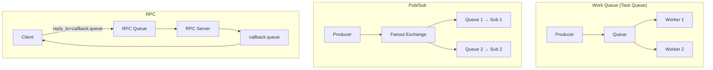

| Паттерн | Exchange | Описание |
|---------|----------|----------|
| Work Queue | Default/Direct | Распределение задач между workers |
| Pub/Sub | Fanout | Рассылка событий всем подписчикам |
| Routing | Direct | Маршрутизация по типу события |
| Topic | Topic | Гибкая маршрутизация по паттерну |
| RPC | Default | Синхронный запрос/ответ через очереди |
| Delayed | DLX + TTL | Отложенные сообщения |

> [!mcq]
> - [ ] Pub/Sub в RabbitMQ реализуется через одну shared queue — все подписчики читают из неё параллельно. | Pub/Sub требует Fanout exchange + отдельную queue per subscriber; одна shared queue даёт competing consumers (Work Queue), а не Pub/Sub. ❌ ПОСЛЕДСТВИЕ: команда строит notification fan-out из одной очереди, каждое уведомление получает только один из 5 сервисов вместо всех — email, sms, push systems пропускают события случайным образом.
> - [x] Delayed-pattern в RabbitMQ реализуется через DLX + per-message TTL или плагин `rabbitmq_delayed_message_exchange`. | Два проверенных способа. ✓ ПРИМЕНЯТЬ: Wolt order timeout — `setExpiration("60000")` + DLX для cancellation; для variable delays лучше delayed-exchange plugin. 📋 ПРАВИЛО: «Delay = TTL+DLX или plugin». 🔗 См. Q23, Q25, Q36.
> - [ ] RPC pattern в RabbitMQ обеспечивает порядок ответов соответствующий порядку запросов автоматически. | Ответы могут приходить в любом порядке; для матчинга нужен `correlationId` per request. ❌ ПОСЛЕДСТВИЕ: разработчик parsel'ит ответы в FIFO order, при concurrent RPC получает ответ для request A в slot для request B, бизнес-логика обрабатывает чужие данные.
> - [ ] Work Queue pattern требует Topic exchange для распределения задач между workers. | Work Queue использует default exchange (или Direct) с одной очередью и несколькими consumer'ами; competition built-in. ❌ ПОСЛЕДСТВИЕ: junior пытается реализовать task distribution через Topic с pattern matching, получает duplicated dispatch — каждый task'у обрабатывают несколько workers, billing dublicate charges.

> [!mcq]
> - [ ] Competing Consumers и Pub/Sub — синонимы: оба обозначают «несколько consumer'ов читают одну очередь». | Competing Consumers = одна очередь + несколько consumer (каждое сообщение одному); Pub/Sub = одна публикация + несколько очередей через fanout (каждое сообщение всем). Это противоположности по semantics. ❌ ПОСЛЕДСТВИЕ: тимлид путает термины, пишет «pub/sub workers» в дизайне, разработчик строит fanout с N очередями вместо одной shared — ресурсы кластера x N, дубликаты обработок.
> - [x] Competing Consumers (одна очередь, N consumer'ов — load balance) применяется для масштабирования обработки; Pub/Sub (fanout, N очередей) — для нотификации нескольких подсистем об одном событии. | Разные задачи требуют разных паттернов. ✓ ПРИМЕНЯТЬ: order processing — Competing Consumers (масштаб); user.registered → email/sms/analytics — Pub/Sub (fanout broadcast). 📋 ПРАВИЛО: «load balance = одна queue, broadcast = много queues». 🔗 См. Q7, Q26.
> - [ ] Work Queue (Task Queue) и Competing Consumers — разные паттерны: Work Queue гарантирует FIFO-обработку, Competing Consumers — нет. | Work Queue и Competing Consumers — это одно и то же (синонимы); в обоих случаях при N consumer'ах FIFO глобально не гарантируется (consumer-A может обработать N+1 раньше, чем consumer-B обработает N). ❌ ПОСЛЕДСТВИЕ: разработчик ожидает strict ordering от «Work Queue», получает out-of-order при scale-out, бизнес-логика принимает payment до order — race-condition в проде.
> - [ ] Pub/Sub в RabbitMQ автоматически дедуплицирует одинаковые сообщения, чтобы каждый подписчик получил только уникальные события. | Никакой автоматической дедупликации нет; consumer обязан сам обеспечивать idempotency (по messageId/businessKey). ❌ ПОСЛЕДСТВИЕ: при retry publisher (network blip) каждый из 5 подписчиков получает дубликат, email-сервис шлёт 2 одинаковых письма, sms — 2 SMS, клиент пишет в support.

---

## Q37. Как реализовать паттерн RPC через RabbitMQ?

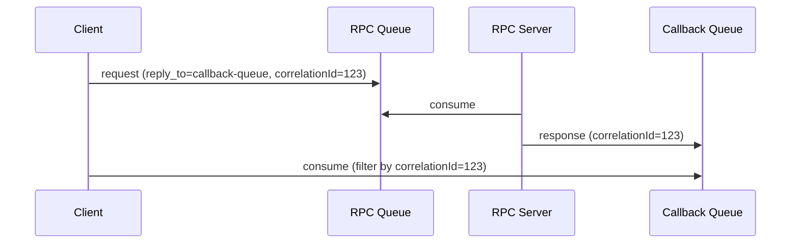

```java
// Клиент
String correlationId = UUID.randomUUID().toString();
String replyQueueName = channel.queueDeclare().getQueue();

AMQP.BasicProperties props = new AMQP.BasicProperties.Builder()
    .correlationId(correlationId)
    .replyTo(replyQueueName)
    .build();

channel.basicPublish("", "rpc-queue", props, request.getBytes());

// Ожидание ответа с matching correlationId
BlockingQueue<String> response = new ArrayBlockingQueue<>(1);
channel.basicConsume(replyQueueName, true, (consumerTag, delivery) -> {
    if (correlationId.equals(delivery.getProperties().getCorrelationId())) {
        response.offer(new String(delivery.getBody()));
    }
}, tag -> {});

return response.poll(10, TimeUnit.SECONDS);
```

В `Spring AMQP` используйте `rabbitTemplate.convertSendAndReceive()`.

> [!mcq]
> - [ ] `correlationId` опционален, если каждый клиент создаёт уникальную reply-queue. | Даже с уникальной reply-queue нужен correlationId: один клиент может иметь несколько одновременных RPC-вызовов через одну reply-queue. ❌ ПОСЛЕДСТВИЕ: SPA отправляет 3 параллельных RPC-вызова, ответы приходят в random order, UI показывает результаты не для тех запросов — wrong product details для wrong product card.
> - [x] Клиент создаёт временную reply-queue, передаёт её имя в `replyTo` и фильтрует ответы по `correlationId`. | Базовый AMQP RPC паттерн. ✓ ПРИМЕНЯТЬ: legacy synchronous integration через RabbitMQ; в Spring AMQP — `rabbitTemplate.convertSendAndReceive()` инкапсулирует этот workflow. 📋 ПРАВИЛО: «replyTo + correlationId — RPC core». 🔗 См. Q32, Q36, Q37.
> - [ ] RPC через RabbitMQ обеспечивает synchronous behavior быстрее чем HTTP REST благодаря binary protocol AMQP. | Round-trip через RabbitMQ обычно медленнее HTTP (extra hop через broker); RPC через MQ выбирают за features (load balancing, async delivery), не за latency. ❌ ПОСЛЕДСТВИЕ: архитектор мигрирует latency-critical API с REST на RabbitMQ RPC «для скорости», получает p99 latency 200ms вместо 30ms — SLA нарушен.
> - [ ] При timeout RPC-вызова сообщение автоматически удаляется из RPC queue без обработки сервером. | Сообщение уже у server'а в обработке (или ожидает); client timeout не отменяет server-side processing — at-least-once. ❌ ПОСЛЕДСТВИЕ: client timeout 5s, server обрабатывает 10s и завершает payment; client уже сделал retry, дублированное списание у customer'а на $500.

---

## Q38. Как осуществляется мониторинг RabbitMQ через Management Plugin?

**Management Plugin** предоставляет:
- Web UI: `http://localhost:15672`
- HTTP API: `http://localhost:15672/api/`
- CLI: `rabbitmqadmin`

**Ключевые страницы UI:**
- **Overview** — общее состояние кластера, connections, channels, queues
- **Queues** — глубина очередей, скорость publish/consume/ack
- **Connections/Channels** — активные соединения
- **Admin** — пользователи, vhost, политики

```bash
# Просмотр очередей через CLI
rabbitmqadmin list queues name messages consumers

# Экспорт конфигурации
rabbitmqadmin export config.json
```

Для продакшн-мониторинга рекомендуется интеграция с `Prometheus` через плагин `rabbitmq_prometheus`.

> [!mcq]
> - [ ] Management Plugin рекомендуется как основной production-monitoring tool для high-load кластеров. | Management UI хранит metrics in-memory с overhead на каждый узел; для production — Prometheus + Grafana через `rabbitmq_prometheus`. ❌ ПОСЛЕДСТВИЕ: в кластере с 10k очередей Management UI начинает потреблять 2GB RAM на узле, вызывает GC pauses, throughput падает на 30%.
> - [x] HTTP API на порту 15672 (`/api/queues`, `/api/overview`) позволяет автоматизировать мониторинг и алертинг через скрипты или Prometheus. | Программный access к metadata. ✓ ПРИМЕНЯТЬ: Booking.com SRE — кастомные Grafana dashboards через `rabbitmq_prometheus`, alerting на queue depth и unacked count. 📋 ПРАВИЛО: «UI для людей, API для систем». 🔗 См. Q38, Q39.
> - [ ] `rabbitmqadmin` — это REST-клиент, требующий установки отдельной утилиты Erlang. | `rabbitmqadmin` — Python-скрипт, поставляется с Management Plugin (download с UI), Erlang не нужен. ❌ ПОСЛЕДСТВИЕ: SRE строит CI-пайплайн с установкой Erlang на gitlab-runner для администрирования RabbitMQ, инфраструктура раздувается, билды по 5 минут.
> - [ ] Management Plugin включён по умолчанию во всех релизах RabbitMQ начиная с 3.0. | Плагин не активен по умолчанию; включается командой `rabbitmq-plugins enable rabbitmq_management`. ❌ ПОСЛЕДСТВИЕ: команда деплоит свежий RabbitMQ в Kubernetes, удивляется отсутствию UI на 15672, тратит час на debugging вместо одной строки в helm-chart.

---

## Q39. Какие метрики RabbitMQ наиболее важны?

| Метрика | Описание | Тревожный порог |
|---------|----------|-----------------|
| `queue_messages_ready` | Кол-во сообщений, готовых к доставке | Растёт > N |
| `queue_messages_unacknowledged` | Кол-во `unacked` сообщений | Растёт долго |
| `queue_consumers` | Количество активных consumers | = 0 |
| `connection_count` | Кол-во активных соединений | Близко к лимиту |
| `channel_count` | Кол-во каналов | Слишком высокое |
| `disk_free` | Свободное место на диске | < `disk_free_limit` |
| `mem_used` | Использование памяти | > `vm_memory_high_watermark` |
| `publish_rate` | Скорость публикации (msg/s) | — |
| `deliver_ack_rate` | Скорость подтверждённой доставки | Ниже publish rate |

При достижении `vm_memory_high_watermark` (по умолчанию 40% RAM) брокер включает **flow control** и блокирует publishers.

> [!mcq]
> - [ ] Главная метрика — `publish_rate`; пока publishers пишут, всё ок. | Без `unacked` и `consumers` мониторинга consumer-зависание остаётся незамеченным. ❌ ПОСЛЕДСТВИЕ: тихий рост unacked.
> - [x] Следить за связкой `queue_messages_ready` + `queue_messages_unacknowledged` + `queue_consumers`; рост ready при consumers=0 — главный сигнал. | Эти три метрики показывают backpressure и пропажу consumers, главные причины аварий. ✓ ПРИМЕНЯТЬ: alert при ready растёт и consumers=0. 📋 ПРАВИЛО: «Ready+Unacked+Consumers — триада здоровья очереди». 🔗 См. Q39.
> - [ ] Достаточно `disk_free` и `mem_used`; они покрывают все аварии брокера. | Инфраструктурные метрики не показывают логических проблем (зависший consumer, медленный ack). ❌ ПОСЛЕДСТВИЕ: пропуск backlog'а.
> - [ ] Контролировать только `connection_count` и `channel_count`; они отражают нагрузку. | Соединения могут быть в норме при остановленной обработке сообщений. ❌ ПОСЛЕДСТВИЕ: ложный «зелёный» статус.

---

## Q40. (!) В чём принципиальные отличия RabbitMQ от Kafka?

| Характеристика | `RabbitMQ` | `Apache Kafka` |
|----------------|------------|----------------|
| Модель | Push (broker → consumer) | Pull (consumer тянет) |
| Хранение | Сообщения удаляются после ack | Лог хранится N дней |
| Порядок | В рамках одной очереди | В рамках партиции |
| Replay | Нет (только DLQ) | Да (любой offset) |
| Маршрутизация | Гибкая (exchange, binding) | По топику/партиции |
| Пропускная способность | Умеренная (100K msg/s) | Очень высокая (1M+ msg/s) |
| Latency | Низкая (<1ms) | Чуть выше (batch) |
| Consumer groups | Конкуренция или подписка | Независимые группы |
| Протокол | `AMQP`, `STOMP`, `MQTT` | Собственный |
| Use case | Задачи, RPC, сложная маршрутизация | Стриминг, аналитика, event log |

> [!mcq]
> - [ ] `RabbitMQ` хранит сообщения как лог N дней с replay по offset, как Kafka. | Это модель Kafka; в RabbitMQ сообщения удаляются после `ack`. ❌ ПОСЛЕДСТВИЕ: ожидание replay, которого нет.
> - [ ] Оба брокера используют pull-модель: consumer тянет сообщения сам. | RabbitMQ — push (broker пушит consumer'у через prefetch), а Kafka — pull. ❌ ПОСЛЕДСТВИЕ: неверная настройка backpressure.
> - [x] `RabbitMQ` — push-модель с гибкой маршрутизацией через exchange/binding и удалением после `ack`; `Kafka` — pull-модель с persistent log и replay по offset. | Push+exchange+ack vs pull+log+offset — фундаментальная разница в дизайне и use-case. ✓ ПРИМЕНЯТЬ: RabbitMQ для task queue/RPC, Kafka для event streaming. 📋 ПРАВИЛО: «Rabbit пушит и забывает, Kafka хранит и реплеит». 🔗 См. Q40.
> - [ ] Главное отличие — RabbitMQ поддерживает `AMQP`, а Kafka не поддерживает протоколы вообще. | Kafka использует свой протокол; разница не в наличии протокола, а в модели хранения и доставки. ❌ ПОСЛЕДСТВИЕ: неверный архитектурный выбор.

> [!mcq]
> - [ ] RabbitMQ гарантирует total ordering всех сообщений во всём кластере, Kafka — только partial ordering внутри партиции. | RabbitMQ даёт ordering только в пределах одной очереди и одного consumer'а; при N consumer'ах на очередь или sharding по очередям global order теряется. Kafka — strict order внутри партиции. По факту обе системы дают partial ordering. ❌ ПОСЛЕДСТВИЕ: архитектор выбирает RabbitMQ ради «total order» для финансовых событий, на проде scale-out до 5 consumer'ов ломает порядок, дублирующие списания.
> - [ ] Replay в Kafka работает только пока сообщения не прочитаны хотя бы одним consumer-group; после первого ack сообщение удаляется как в RabbitMQ. | Kafka хранит сообщения в логе по retention (`log.retention.hours`/`log.retention.bytes`) НЕЗАВИСИМО от чтения; любая consumer-group может перечитать с любого offset, пока retention не истёк. ❌ ПОСЛЕДСТВИЕ: команда поднимает новую analytics-consumer-group через месяц, ожидает прочитать историю — все события удалены retention'ом 7 дней (default), backfill из БД руками две недели.
> - [x] Kafka даёт ordering ТОЛЬКО внутри партиции и поддерживает replay по offset (retention-based); RabbitMQ ordering — в пределах очереди+single consumer, retention отсутствует (delete on ack). | Точная семантика порядка и retention. ✓ ПРИМЕНЯТЬ: Kafka для event-sourcing/audit log с replay; RabbitMQ для task queue без необходимости replay. 📋 ПРАВИЛО: «Kafka = retention+offset, Rabbit = ack+delete; ordering у обоих partial». 🔗 См. Q41.
> - [ ] Retention в Kafka контролируется consumer'ом: пока group не закоммитила offset, сообщение хранится; после коммита удаляется. | Retention — это broker-level настройка по времени или размеру лога; offsets consumer'ов независимы от удаления. Старые сообщения удаляются даже если не прочитаны. ❌ ПОСЛЕДСТВИЕ: SRE считает что offline consumer «защищает» данные, оставляет critical analytics-pipeline в downtime неделю, при возврате обнаруживает что 70% сегментов retention'ом удалены.

---

## Q41. Когда выбрать RabbitMQ, а когда Kafka?

**Выбирайте `RabbitMQ` когда:**
- Нужна сложная маршрутизация сообщений (topic patterns, headers)
- Важна низкая задержка для отдельных сообщений
- Нужен паттерн Work Queue с равномерным распределением нагрузки
- Требуется RPC через messaging
- Разные типы сообщений с разными получателями
- Команда знакома с `AMQP`; интеграция через `STOMP` / `MQTT`
- Объём сообщений умеренный, не требуется долгосрочное хранение

**Выбирайте `Kafka` когда:**
- Нужен event log с возможностью replay
- Очень высокий throughput (миллионы событий/сек)
- Событийная история важна для аналитики или audit trail
- Нужна интеграция с Big Data / stream processing (`Flink`, `Spark`)
- Multiple independent consumer groups читают один поток
- Долгосрочное хранение событий

> Оба инструмента могут сосуществовать в одной системе: `Kafka` — для event streaming, `RabbitMQ` — для task queues и RPC.

> [!mcq]
> - [ ] Выбирайте `RabbitMQ` для миллионов событий/сек и долгого хранения с replay. | Это сценарий Kafka; throughput RabbitMQ ограничен ~100K msg/s, replay не поддерживается. ❌ ПОСЛЕДСТВИЕ: упор throughput брокера.
> - [x] Выбирайте `RabbitMQ` для task queues, RPC и сложной маршрутизации; `Kafka` — для event log, replay и высокого throughput. | Эти use-case'ы напрямую соответствуют сильным сторонам каждого брокера. ✓ ПРИМЕНЯТЬ: orchestration jobs → Rabbit, event sourcing → Kafka. 📋 ПРАВИЛО: «Rabbit — задачи, Kafka — события». 🔗 См. Q41.
> - [ ] `Kafka` лучше для синхронного RPC через messaging с низкой latency на одно сообщение. | Kafka оптимизирована под batch-throughput, не под per-message RPC; latency выше из-за batching. ❌ ПОСЛЕДСТВИЕ: тормозящий RPC.
> - [ ] Обоих использовать одновременно нельзя — это дублирование инфраструктуры. | На практике брокеры дополняют друг друга: Kafka для event streaming, Rabbit для task queues. ❌ ПОСЛЕДСТВИЕ: натягивание одного на чужой use-case.

---

## See also

- [Apache Kafka](kafka-interview.md) — альтернативный брокер для event streaming
- [Распределённые системы](../architecture/distributed-systems-interview.md) — CAP-теорема, консистентность, отказоустойчивость
- [Spring Boot](../frameworks/spring/spring-boot-interview.md) — основы Spring Boot для интеграции
- [Микросервисная архитектура](../architecture/microservices-interview.md) — паттерны коммуникации между сервисами
- [Event-driven паттерны](../architecture/event-driven-patterns-interview.md) — паттерны асинхронного взаимодействия
- [Стратегии кэширования](../architecture/caching-strategies-interview.md) — дополняет паттерны обмена данными
- [Паттерны согласованности](../architecture/consistency-patterns-interview.md) — гарантии доставки и идемпотентность

- [AWS SQS и SNS](aws-sqs-sns-interview.md)
- [Apache Kafka](kafka-interview.md)
- [Сравнение Message Brokers](message-brokers-comparison-interview.md)
- [NATS](nats-interview.md)
- [Apache Pulsar](pulsar-interview.md)
- [Redpanda](redpanda-interview.md)
- [Шпаргалка: RabbitMQ для Java](../../development/messaging/rabbitmq/rabbitmq.md) — теория
