# Вопросы на собеседовании: `RabbitMQ`

Полное покрытие `RabbitMQ` для интервью: `AMQP`-протокол, типы `exchange`, очереди и их свойства, подтверждения доставки, `Dead Letter Queue`, `Publisher Confirms`, кластеризация, `quorum queues`, `Spring AMQP`, основные паттерны и мониторинг.

**`RabbitMQ`** — брокер сообщений, реализующий протокол `AMQP 0-9-1`. Широко применяется в [микросервисных](../architecture/microservices-interview.md) и [event-driven](../architecture/event-driven-patterns-interview.md) архитектурах для надёжной асинхронной коммуникации между сервисами.

## Полезные ссылки

### Официальная документация

- [RabbitMQ Tutorials](https://www.rabbitmq.com/tutorials) — официальные туториалы по всем паттернам
- [AMQP 0-9-1 Model Explained](https://www.rabbitmq.com/tutorials/amqp-concepts) — концепции протокола
- [RabbitMQ Reliability Guide](https://www.rabbitmq.com/docs/reliability) — гарантии доставки и надёжность
- [Quorum Queues](https://www.rabbitmq.com/docs/quorum-queues) — современный тип HA-очередей

### Статьи Baeldung

- [Introduction to RabbitMQ](https://www.baeldung.com/rabbitmq) — введение в RabbitMQ
- [RabbitMQ vs Kafka](https://www.baeldung.com/rabbitmq-vs-kafka) — детальное сравнение двух брокеров
- [Messaging Using Spring AMQP](https://www.baeldung.com/spring-amqp) — интеграция с Spring
- [RabbitMQ Dead Letter Exchanges](https://www.baeldung.com/rabbitmq-dead-letter-exchanges) — настройка DLX/DLQ
- [Publisher Confirms with Spring AMQP](https://www.baeldung.com/spring-amqp-publisher-confirms) — подтверждения публикации
- [Exchanges, Queues, and Bindings in RabbitMQ](https://www.baeldung.com/java-rabbitmq-exchanges-queues-bindings) — exchanges, очереди и bindings
- [Channels and Connections in RabbitMQ](https://www.baeldung.com/java-rabbitmq-channels-connections) — управление соединениями
- [Error Handling with Spring AMQP](https://www.baeldung.com/spring-amqp-error-handling) — обработка ошибок и retry

## Содержание

- [Полезные ссылки](#полезные-ссылки)
- [See also](#see-also)

**Основы AMQP**
- [Q1. (!) Что такое RabbitMQ и протокол AMQP?](#q1--что-такое-rabbitmq-и-протокол-amqp)
- [Q2. (!) Из каких компонентов состоит модель AMQP?](#q2--из-каких-компонентов-состоит-модель-amqp)
- [Q3. Что такое Virtual Host (vhost)?](#q3-что-такое-virtual-host-vhost)
- [Q4. Что такое Channel и зачем он нужен?](#q4-что-такое-channel-и-зачем-он-нужен)

**Exchanges**
- [Q5. (!) Какие типы Exchange существуют в RabbitMQ?](#q5--какие-типы-exchange-существуют-в-rabbitmq)
- [Q6. Как работает Direct Exchange?](#q6-как-работает-direct-exchange)
- [Q7. Как работает Fanout Exchange?](#q7-как-работает-fanout-exchange)
- [Q8. (!) Как работает Topic Exchange?](#q8--как-работает-topic-exchange)
- [Q9. Как работает Headers Exchange?](#q9-как-работает-headers-exchange)
- [Q10. Что такое Default Exchange?](#q10-что-такое-default-exchange)

**Queues**
- [Q11. (!) Какие свойства у очереди в RabbitMQ?](#q11--какие-свойства-у-очереди-в-rabbitmq)
- [Q12. Что такое durable queue и persistent message?](#q12-что-такое-durable-queue-и-persistent-message)
- [Q13. Что такое exclusive и auto-delete очередь?](#q13-что-такое-exclusive-и-auto-delete-очередь)
- [Q14. Как настроить TTL для сообщений и очереди?](#q14-как-настроить-ttl-для-сообщений-и-очереди)
- [Q15. Что такое максимальная длина очереди (max-length)?](#q15-что-такое-максимальная-длина-очереди-max-length)

**Bindings и Routing**
- [Q16. (!) Что такое Binding и Routing Key?](#q16--что-такое-binding-и-routing-key)
- [Q17. Можно ли привязать несколько очередей к одному Exchange?](#q17-можно-ли-привязать-несколько-очередей-к-одному-exchange)

**Acknowledgements**
- [Q18. (!) Что такое acknowledgement (ack) в RabbitMQ?](#q18--что-такое-acknowledgement-ack-в-rabbitmq)
- [Q19. Чем отличаются nack и reject?](#q19-чем-отличаются-nack-и-reject)
- [Q20. (!) В чём разница между auto-ack и manual ack?](#q20--в-чём-разница-между-auto-ack-и-manual-ack)
- [Q21. Что такое Publisher Confirms?](#q21-что-такое-publisher-confirms)
- [Q22. Чем Publisher Confirms отличаются от транзакций AMQP?](#q22-чем-publisher-confirms-отличаются-от-транзакций-amqp)

**Dead Letter Queue**
- [Q23. (!) Что такое Dead Letter Exchange (DLX) и DLQ?](#q23--что-такое-dead-letter-exchange-dlx-и-dlq)
- [Q24. При каких условиях сообщение попадает в DLQ?](#q24-при-каких-условиях-сообщение-попадает-в-dlq)
- [Q25. Как реализовать retry с использованием DLX и TTL?](#q25-как-реализовать-retry-с-использованием-dlx-и-ttl)

**QoS и Prefetch**
- [Q26. (!) Что такое prefetch count и QoS?](#q26--что-такое-prefetch-count-и-qos)
- [Q27. Как prefetch влияет на производительность и нагрузку?](#q27-как-prefetch-влияет-на-производительность-и-нагрузку)

**Кластеризация и High Availability**
- [Q28. (!) Как работает кластеризация в RabbitMQ?](#q28--как-работает-кластеризация-в-rabbitmq)
- [Q29. Что такое Mirrored Queues (Classic HA)?](#q29-что-такое-mirrored-queues-classic-ha)
- [Q30. (!) Что такое Quorum Queues и чем они лучше Mirrored?](#q30--что-такое-quorum-queues-и-чем-они-лучше-mirrored)
- [Q31. Что такое Federation и Shovel в RabbitMQ?](#q31-что-такое-federation-и-shovel-в-rabbitmq)

**Spring AMQP**
- [Q32. (!) Что такое Spring AMQP и RabbitTemplate?](#q32--что-такое-spring-amqp-и-rabbittemplate)
- [Q33. Как объявить очередь и exchange через Spring AMQP?](#q33-как-объявить-очередь-и-exchange-через-spring-amqp)
- [Q34. (!) Как настроить @RabbitListener?](#q34--как-настроить-rabbitlistener)
- [Q35. Как настроить retry-логику в Spring AMQP?](#q35-как-настроить-retry-логику-в-spring-amqp)

**Паттерны**
- [Q36. (!) Какие основные паттерны обмена сообщениями реализуются в RabbitMQ?](#q36--какие-основные-паттерны-обмена-сообщениями-реализуются-в-rabbitmq)
- [Q37. Как реализовать паттерн RPC через RabbitMQ?](#q37-как-реализовать-паттерн-rpc-через-rabbitmq)

**Мониторинг**
- [Q38. Как мониторить RabbitMQ через Management Plugin?](#q38-как-мониторить-rabbitmq-через-management-plugin)
- [Q39. Какие метрики RabbitMQ наиболее важны?](#q39-какие-метрики-rabbitmq-наиболее-важны)

**RabbitMQ vs Kafka**
- [Q40. (!) В чём принципиальные отличия RabbitMQ от Kafka?](#q40--в-чём-принципиальные-отличия-rabbitmq-от-kafka)
- [Q41. Когда выбрать RabbitMQ, а когда Kafka?](#q41-когда-выбрать-rabbitmq-а-когда-kafka)

---

## Q1. (!) Что такое RabbitMQ и протокол AMQP?

**`RabbitMQ`** — это брокер сообщений с открытым исходным кодом, который реализует протокол `AMQP 0-9-1` (Advanced Message Queuing Protocol). Producer-ы кладут сообщения в брокер, consumer-ы их забирают, а брокер берёт на себя хранение, маршрутизацию и гарантии доставки между ними.

Написан на `Erlang/OTP` — языке, созданном для телеком-систем с требованием почти непрерывной работы. Отсюда два практических следствия: брокер устойчив к сбоям отдельных процессов (supervision trees) и легко собирается в кластер. Обратная сторона — диагностируется он не JVM-инструментами, а `rabbitmq-diagnostics`; Java-тюнинг (Heap, GC) к нему неприменим.

**`AMQP 0-9-1`** — бинарный протокол прикладного уровня для асинхронного обмена сообщениями. Что он даёт:
- **Надёжность** — подтверждения доставки встроены в сам протокол (`ack` от consumer-а, `Publisher Confirms` от брокера).
- **Гибкая маршрутизация** — сообщение публикуется не в очередь напрямую, а в `exchange`, который по правилам `binding` решает, в какие очереди его положить.
- **Безопасность** — `TLS` для шифрования канала, `SASL` для аутентификации.
- **Совместимость** — это открытый стандарт, не привязанный к конкретной реализации.

Помимо `AMQP 0-9-1`, через плагины `RabbitMQ` поддерживает `STOMP`, `MQTT` и `AMQP 1.0` — но это дополнительные протоколы, а не основной.

---

## Q2. (!) Из каких компонентов состоит модель AMQP?

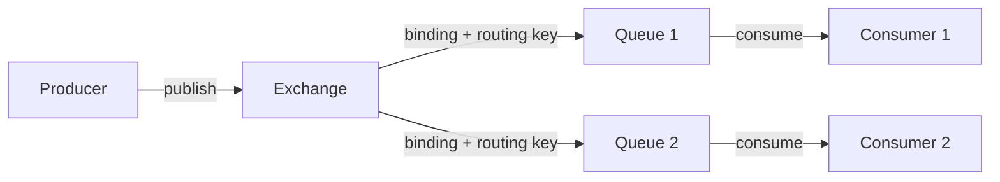

Ключевая идея модели: producer **никогда не пишет в очередь напрямую**. Он публикует сообщение в `exchange`, а тот по правилам `binding` раскладывает его по очередям. Это и есть источник гибкости `AMQP` — связь «кто отправил» и «кто получит» развязана.

| Компонент | Роль |
|-----------|----------|
| `Producer` | Публикует сообщения в `exchange` (не в очередь) |
| `Exchange` | Принимает сообщения и маршрутизирует их в очереди по `binding` |
| `Queue` | Буфер: хранит сообщения, пока их не заберёт `consumer` |
| `Binding` | Правило связи `exchange → queue` (с каким `routing key`) |
| `Consumer` | Читает сообщения из очереди |
| `Channel` | Лёгкое логическое соединение внутри одного `AMQP`-коннекшна |
| `Virtual Host` | Логическая изоляция ресурсов брокера друг от друга |

---

## Q3. Что такое Virtual Host (vhost)?

**`Virtual Host`** (`vhost`) — логическая изоляция ресурсов внутри одного `RabbitMQ`-сервера. Хорошая аналогия — отдельная база данных внутри `PostgreSQL`: один физический сервер, но независимые пространства имён.

- Каждый `vhost` держит собственные `exchange`, `queue`, `binding`, пользователей и права доступа. Очередь `orders` в `/app-a` и очередь `orders` в `/app-b` — это разные очереди.
- По умолчанию создаётся `vhost` `/`.
- **Сценарий применения:** несколько приложений (или окружений — dev/stage) делят один брокер, но не видят и не задевают ресурсы друг друга. Права выдаются на конкретный `vhost`.

```java
// Подключение к конкретному vhost
ConnectionFactory factory = new ConnectionFactory();
factory.setVirtualHost("/my-app");
```

---

## Q4. Что такое Channel и зачем он нужен?

**`Channel`** — лёгкое логическое соединение поверх одного физического TCP-соединения (`Connection`). Все операции `AMQP` (publish, consume, declare) идут через `channel`, а не напрямую через `Connection`.

**Зачем он нужен.** Открытие TCP-соединения — дорогая операция (handshake, TLS, FD на сервере). Если бы каждому потоку приложения требовался свой `Connection`, брокер быстро упёрся бы в лимит сокетов. `Channel` решает это через мультиплексирование: одно TCP-соединение несёт множество независимых логических потоков.

**Подводные камни:**
- `Channel` **не thread-safe**: каждый поток приложения должен работать со своим `channel`, иначе данные перемешаются.
- В одном `Connection` можно открыть тысячи `channel` — это дёшево, в отличие от самих соединений.

**Жизненный цикл:** открыть `Connection` → открыть `Channel` → выполнять операции → закрыть `Channel` → (при завершении) закрыть `Connection`.

---

## Q5. (!) Какие типы Exchange существуют в RabbitMQ?

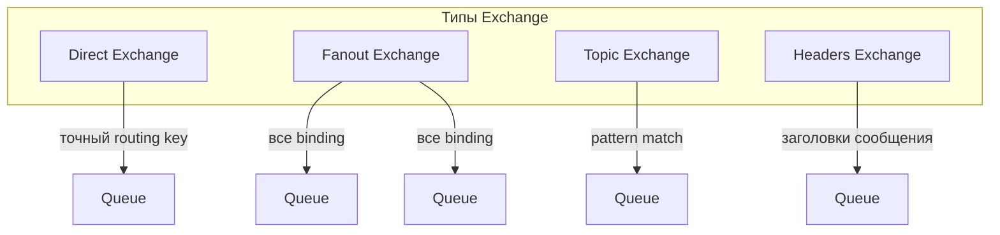

Тип `exchange` определяет **алгоритм маршрутизации** — как именно брокер решает, в какие очереди положить сообщение. Всего их четыре, и отличаются они только этим правилом выбора очередей:

| Тип | По чему маршрутизирует | Когда применять |
|-----|---------------|------------|
| `direct` | Точное совпадение `routing key` с `binding key` | Простая очередь задач, маршрутизация по типу события |
| `fanout` | Игнорирует ключ, шлёт во **все** привязанные очереди | Pub/Sub, broadcast-рассылки |
| `topic` | Паттерн `routing key` с `*` и `#` | Логи по категориям, события с иерархией |
| `headers` | По заголовкам сообщения, а не по `routing key` | Маршрутизация по нескольким атрибутам сразу |

На практике 90% задач закрываются `direct`, `fanout` и `topic`; `headers` нужен редко.

---

## Q6. Как работает Direct Exchange?

**`Direct Exchange`** доставляет сообщение в те очереди, у которых `binding key` **точно совпадает** (посимвольно) с `routing key` сообщения. Никаких паттернов — только строгое равенство строк.

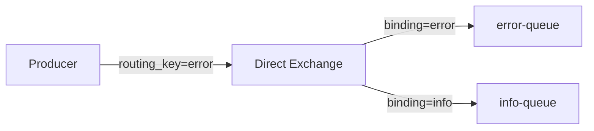

```java
// Объявление direct exchange
channel.exchangeDeclare("logs.direct", "direct", true);
// Привязка очереди
channel.queueBind("error-queue", "logs.direct", "error");
// Публикация
channel.basicPublish("logs.direct", "error", null, body);
```

Если `routing key` не совпал ни с одним `binding`, сообщение по умолчанию **просто отбрасывается** (его никто не получит, и producer об этом не узнает). Чтобы такие сообщения не терялись, очереди-«заглушки» назначают через `alternate exchange`. Несколько очередей могут иметь один и тот же `binding key` — тогда сообщение получит каждая из них.

---

## Q7. Как работает Fanout Exchange?

**`Fanout Exchange`** полностью игнорирует `routing key` и копирует каждое сообщение во **все** привязанные к нему очереди. Это самый быстрый тип маршрутизации — брокеру не нужно ничего сравнивать.

**Сценарий применения:** broadcast и Pub/Sub, когда одно событие должно одновременно дойти до нескольких независимых подписчиков. Классический пример — уведомление, которое надо отправить и в push, и на email, и по SMS.

```java
channel.exchangeDeclare("notifications", "fanout", true);
// Привязка без routing key
channel.queueBind("mobile-queue", "notifications", "");
channel.queueBind("email-queue",  "notifications", "");
channel.queueBind("sms-queue",    "notifications", "");

// Публикация (routing key игнорируется)
channel.basicPublish("notifications", "", null, body);
```

Каждая привязанная очередь получает собственную копию сообщения — подписчики не конкурируют за него, а обрабатывают независимо.

---

## Q8. (!) Как работает Topic Exchange?

**`Topic Exchange`** — это `direct` с поддержкой шаблонов: очереди подписываются не на точный ключ, а на **паттерн**. `Routing key` разбивается на слова, разделённые точкой (`region.service.severity`), и в `binding key` можно использовать два спецсимвола:
- `*` — заменяет ровно **одно** слово;
- `#` — заменяет **ноль или более** слов.

Это даёт иерархическую маршрутизацию: одно событие может одновременно попасть и в узкую очередь («ошибки auth в Европе»), и в широкую («всё из Европы»), и в сквозную («все ошибки»). Ниже один и тот же ключ `eu.auth.error` совпадает с тремя разными биндингами:

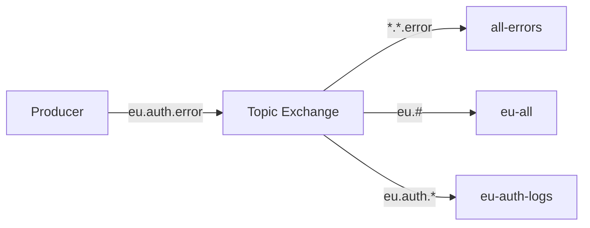

```java
channel.exchangeDeclare("logs.topic", "topic", true);
channel.queueBind("all-errors",   "logs.topic", "*.*.error");
channel.queueBind("eu-all",       "logs.topic", "eu.#");
channel.queueBind("eu-auth-logs", "logs.topic", "eu.auth.*");

// Сообщение "eu.auth.error" попадёт во все три очереди
channel.basicPublish("logs.topic", "eu.auth.error", null, body);
```

---

## Q9. Как работает Headers Exchange?

**`Headers Exchange`** маршрутизирует не по `routing key` (он игнорируется), а по **заголовкам сообщения** (`AMQP message headers`). Полезен, когда решение о доставке зависит сразу от нескольких атрибутов, которые неудобно ужать в одну строку-ключ.

Логику совпадения задаёт аргумент `x-match` при привязке:
- `all` — должны совпасть **все** указанные заголовки (логическое И);
- `any` — достаточно совпадения **хотя бы одного** (логическое ИЛИ).

```java
Map<String, Object> bindingArgs = new HashMap<>();
bindingArgs.put("x-match", "all");
bindingArgs.put("format", "pdf");
bindingArgs.put("type", "report");

channel.queueBind("pdf-reports", "docs.exchange", "", bindingArgs);

// Публикация с заголовками
AMQP.BasicProperties props = new AMQP.BasicProperties.Builder()
    .headers(Map.of("format", "pdf", "type", "report"))
    .build();
channel.basicPublish("docs.exchange", "", props, body);
```

**Подводный камень:** на практике применяется редко. `Topic Exchange` покрывает большинство сценариев маршрутизации, читается проще и работает быстрее, поэтому `headers` берут только когда атрибутов действительно много и они не складываются в иерархический ключ.

---

## Q10. Что такое Default Exchange?

**`Default Exchange`** (`""`) — безымянный системный `direct exchange`, который существует всегда. Его особенность: **каждая** очередь автоматически привязана к нему с `binding key`, равным имени самой очереди. Поэтому, публикуя в `""` с `routing key = "task-queue"`, вы фактически отправляете сообщение прямо в очередь `task-queue` без явного объявления `exchange` и `binding`.

```java
// Прямая отправка в очередь "task-queue" без явного объявления exchange
channel.basicPublish("", "task-queue", null, body);
```

**Компромисс:** удобен для быстрых прототипов и простых очередей задач, но скрывает маршрутизацию (имя очереди жёстко вшито в код producer-а). В продакшне обычно объявляют свой `exchange` явно — так топологию видно и её легко менять, не трогая отправителей.

---

## Q11. (!) Какие свойства у очереди в RabbitMQ?

У очереди есть три булевых флага, определяющих её время жизни, и расширяемая карта `arguments` для тонкой настройки. Флаги задаются при объявлении и **неизменяемы**: чтобы поменять их, очередь придётся удалить и пересоздать.

| Свойство | Тип | Что делает |
|----------|-----|----------|
| `durable` | boolean | Очередь (как объект) переживает перезапуск брокера. Без неё пропадает само определение очереди |
| `exclusive` | boolean | Очередь видна только создавшему её `Connection` и удаляется при его закрытии |
| `autoDelete` | boolean | Очередь удаляется автоматически, когда от неё отписался последний `consumer` |
| `arguments` | Map | Расширенные параметры: `x-message-ttl`, `x-max-length`, `x-dead-letter-exchange`, `x-queue-type` и др. |

```java
Map<String, Object> args = new HashMap<>();
args.put("x-message-ttl", 60000);       // TTL 60 секунд
args.put("x-max-length", 10000);         // макс. 10 000 сообщений
args.put("x-dead-letter-exchange", "dlx");

channel.queueDeclare(
    "my-queue",
    true,   // durable
    false,  // exclusive
    false,  // autoDelete
    args
);
```

---

## Q12. Что такое durable queue и persistent message?

Это два **разных** уровня сохранности, и для надёжности нужны оба сразу — частая путаница на собеседовании.

**`durable queue`** — флаг очереди. Гарантирует, что переживёт перезапуск брокера само **определение очереди** (её имя, свойства, биндинги). Без `durable=true` после рестарта очередь придётся объявлять заново.

**`persistent message`** — свойство **сообщения** (`deliveryMode=2`). Заставляет брокер записать сообщение на диск, а не держать только в памяти.

Эти флаги независимы, и работают они лишь в паре:

```java
// Persistent message
AMQP.BasicProperties props = new AMQP.BasicProperties.Builder()
    .deliveryMode(2) // persistent
    .build();

channel.basicPublish("my-exchange", "key", props, body);
```

> **Подводный камень:** `durable` очередь без `persistent`-сообщений ничего не гарантирует — переживёт рестарт сама очередь, но её содержимое (оставшееся только в памяти) пропадёт. Обратное тоже бесполезно: `persistent`-сообщение в не-`durable` очереди исчезнет вместе с очередью.

---

## Q13. Что такое exclusive и auto-delete очередь?

Обе очереди — временные и удаляются автоматически, но триггеры удаления у них разные: `exclusive` смотрит на соединение, `auto-delete` — на consumer-ов.

**`exclusive`** очередь:
- Видна **только** создавшему её `Connection` (другие соединения к ней не подключатся);
- удаляется автоматически при закрытии этого `Connection`;
- **Сценарий применения:** временные reply-очереди в RPC, где ответ нужен только текущему клиенту.

**`auto-delete`** очередь:
- Удаляется, когда от неё отписался **последний** `consumer`;
- если consumer-ов не было вообще ни разу — очередь не удаляется сразу, а ждёт первого подключения;
- **Сценарий применения:** динамические подписки, живущие ровно столько, сколько есть слушатели.

---

## Q14. Как настроить TTL для сообщений и очереди?

`TTL` (time-to-live) ограничивает время жизни. Его можно задать на трёх уровнях, и важно их не путать: два управляют временем жизни **сообщений**, а третий — самой **очереди**.

**1. TTL на уровне очереди** (`x-message-ttl`) — единое время жизни для всех сообщений в этой очереди:

```java
Map<String, Object> args = new HashMap<>();
args.put("x-message-ttl", 30000); // 30 секунд
channel.queueDeclare("ttl-queue", true, false, false, args);
```

**2. TTL на уровне сообщения** (`expiration`) — индивидуальный срок для конкретного сообщения. Если заданы оба, действует **меньший** из двух:

```java
AMQP.BasicProperties props = new AMQP.BasicProperties.Builder()
    .expiration("30000") // строка в миллисекундах
    .build();
channel.basicPublish("", "ttl-queue", props, body);
```

**3. TTL самой очереди** (`x-expires`) — удаляет **очередь целиком**, если ею не пользуются (нет consumer-ов и обращений) N миллисекунд:

```java
args.put("x-expires", 300000); // удалить очередь через 5 минут бездействия
```

Когда у сообщения истекает TTL, оно по умолчанию отбрасывается; но если на очереди настроен `DLX`, протухшее сообщение уходит туда — это база для паттерна отложенного retry (см. Q25).

---

## Q15. Что такое максимальная длина очереди (max-length)?

`max-length` ограничивает размер очереди — по числу сообщений или по объёму в байтах. Это защита от неограниченного роста очереди, когда producer-ы пишут быстрее, чем consumer-ы успевают читать. Ключевой выбор — что делать при переполнении, его задаёт `x-overflow`:

```java
args.put("x-max-length", 1000);           // максимум 1000 сообщений
args.put("x-max-length-bytes", 1048576);  // максимум 1 МБ
args.put("x-overflow", "drop-head");      // при переполнении: удалить самое старое (default)
// или
args.put("x-overflow", "reject-publish"); // отклонить новое сообщение
```

Разница принципиальна: `drop-head` жертвует **старыми** данными ради приёма свежих (подходит для метрик, где важна актуальность), а `reject-publish` отказывает **новым** и сохраняет уже принятые (подходит для задач, которые нельзя терять). При `drop-head` и настроенном `DLX` вытесненные сообщения не пропадают, а уходят в dead letter очередь.

---

## Q16. (!) Что такое Binding и Routing Key?

Это две стороны одной маршрутизации — их легко спутать, поэтому важно различать «кто настраивает» и «когда применяется».

**`Binding`** — правило связи `Exchange → Queue`, которое настраивает **администратор/приложение** при объявлении топологии. Оно говорит: «сообщения с таким-то `binding key` из этого exchange класть в эту очередь».

**`Routing Key`** — строка-ключ, которую указывает **producer** в момент публикации каждого сообщения. `Exchange` сравнивает её с `binding key` всех биндингов и так решает, куда направить сообщение (исключение — `fanout`, который ключ игнорирует).

```mermaid
graph LR
    E[Exchange] -->|binding key = "order.created"| Q1[orders-queue]
    E -->|binding key = "payment.*"| Q2[payments-queue]
    E -->|binding key = "#"| Q3[audit-queue]
```

Как трактуется `binding key`, зависит от типа exchange: в `direct` — это точная строка для посимвольного сравнения, в `topic` — паттерн с `*` и `#`, а в `fanout` он вообще игнорируется.

---

## Q17. Можно ли привязать несколько очередей к одному Exchange?

Да — и это один из ключевых механизмов маршрутизации в `AMQP`. Один `exchange` можно привязать к неограниченному числу очередей, причём с разными `binding key`: одно сообщение тогда размножается во все очереди, чей биндинг подошёл. На этом и строятся Pub/Sub (`fanout`) и иерархическая маршрутизация (`topic`).

Более того, привязывать друг к другу можно и **сами exchange** (exchange-to-exchange bindings). Это позволяет собирать многоступенчатые топологии — например, общий «входной» exchange, раскидывающий поток по нескольким специализированным exchange ниже.

---

## Q18. (!) Что такое acknowledgement (ack) в RabbitMQ?

**`Acknowledgement`** (`ack`) — сигнал от consumer-а брокеру: «сообщение обработано, можешь его удалять». Это краеугольный механизм надёжности: пока `ack` не пришёл, брокер считает сообщение незавершённым.

Логика такая: брокер доставляет сообщение и переводит его в состояние `unacked` — оно по-прежнему числится за consumer-ом и **не удаляется**. Удалит его брокер только после `basicAck`.

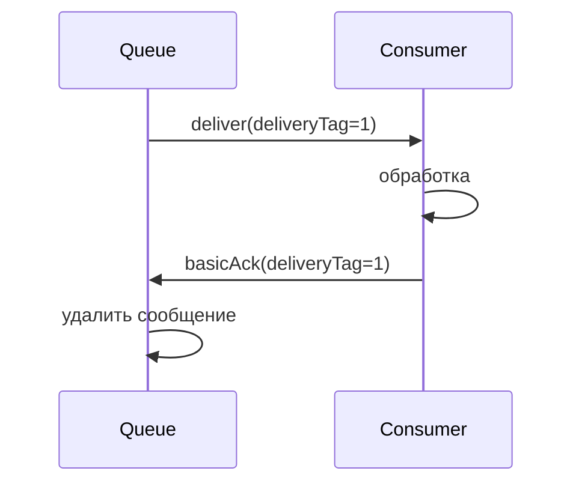

Именно это даёт устойчивость к падению consumer-а: если он упал (или закрылось соединение) до отправки `ack`, брокер возвращает «зависшее» `unacked`-сообщение обратно в состояние `ready` и передаёт его другому consumer-у. Сообщение не теряется — отсюда гарантия at-least-once.

```java
channel.basicConsume("my-queue", false, (consumerTag, delivery) -> {
    try {
        process(delivery.getBody());
        channel.basicAck(delivery.getEnvelope().getDeliveryTag(), false);
    } catch (Exception e) {
        channel.basicNack(delivery.getEnvelope().getDeliveryTag(), false, true);
    }
}, consumerTag -> {});
```

**Нюанс:** `deliveryTag` — это порядковый номер доставки в рамках канала, не глобальный ID сообщения. Параметр `multiple=true` в `basicAck` подтверждает разом все сообщения с `deliveryTag` меньше или равным указанному — удобно для батч-подтверждения.

---

## Q19. Чем отличаются nack и reject?

Оба метода сообщают брокеру о **неуспешной** обработке. Разница между ними — в одном параметре: `nack` умеет отклонять пачку сообщений, `reject` — только одно.

| Метод | Параметры | Назначение |
|-------|-----------|----------|
| `basicAck` | `deliveryTag, multiple` | Успешная обработка — сообщение удаляется |
| `basicNack` | `deliveryTag, multiple, requeue` | Неуспех; может отклонить пачку (`multiple`) — расширение RabbitMQ |
| `basicReject` | `deliveryTag, requeue` | Неуспех; только одно сообщение (стандарт AMQP) |

Ключевой для обоих — параметр `requeue`, он решает судьбу отклонённого сообщения:
- `requeue=true` — вернуть в очередь и попробовать снова. **Подводный камень:** если ошибка стабильная (например, битые данные), это создаёт бесконечный цикл переобработки.
- `requeue=false` — сообщение не возвращается: либо отбрасывается, либо уходит в `DLX` (если он настроен). Обычно правильный выбор для «ядовитых» сообщений.

---

## Q20. (!) В чём разница между auto-ack и manual ack?

Разница в том, **в какой момент** брокер считает сообщение доставленным — и отсюда вытекает компромисс между скоростью и надёжностью.

**`auto-ack`** (`autoAck=true`) — брокер считает сообщение обработанным сразу, как только отправил его в сеть, не дожидаясь подтверждения.
- **Плюс:** максимальная скорость, нет round-trip на подтверждение.
- **Минус:** никаких гарантий. Если consumer упадёт во время обработки (или сообщение не дойдёт), оно уже удалено из очереди и **теряется безвозвратно**. Это семантика at-most-once.

**`manual ack`** (`autoAck=false`) — consumer сам решает, когда подтвердить, явно вызывая `basicAck` / `basicNack` / `basicReject` после обработки.
- **Плюс:** гарантия at-least-once — упавшее сообщение вернётся в очередь (см. Q18).
- **Минус:** медленнее и требует аккуратной обработки ошибок (иначе можно зависнуть на `unacked` или зациклить requeue).

> **Рекомендация:** в продакшне для любой значимой обработки используйте `manual ack`. `auto-ack` оправдан только там, где потеря отдельных сообщений допустима (метрики, логи best-effort).

---

## Q21. Что такое Publisher Confirms?

**`Publisher Confirms`** — подтверждение в обратную сторону: брокер сообщает **producer-у**, что принял сообщение и взял на себя ответственность за него (положил в очередь или записал на диск). Это зеркало consumer-ского `ack`: тот закрывает «последнюю милю» (брокер → consumer), а Publisher Confirms — «первую» (producer → брокер). Без них producer не знает, дошло ли сообщение вообще.

```java
channel.confirmSelect(); // включить режим подтверждений

// Синхронный вариант
channel.basicPublish("exchange", "key", null, body);
if (!channel.waitForConfirms(5000)) {
    throw new RuntimeException("Message not confirmed");
}

// Асинхронный вариант (лучше для производительности)
channel.addConfirmListener(
    (deliveryTag, multiple) -> log.info("Confirmed: {}", deliveryTag),
    (deliveryTag, multiple) -> log.warn("Nacked: {}", deliveryTag)
);
channel.basicPublish("exchange", "key", null, body);
```

**Нюанс:** синхронный `waitForConfirms` прост, но блокирует поток на каждом сообщении — на потоке это убивает throughput. Асинхронный `ConfirmListener` подтверждает пачками и не блокирует publish, поэтому в нагруженных сценариях предпочтительнее. `Publisher Confirms` и транзакции `AMQP` нельзя включить на одном `channel` одновременно.

---

## Q22. Чем Publisher Confirms отличаются от транзакций AMQP?

Оба механизма решают одну задачу — убедиться, что брокер принял сообщение, — но платят за это по-разному. Транзакции блокируют producer на каждом `txCommit`, а Publisher Confirms работают асинхронно.

| Аспект | `Publisher Confirms` | Транзакции (`txSelect`) |
|--------|---------------------|------------------------|
| Производительность | Высокая (можно асинхронно) | Низкая (синхронный блокирующий commit) |
| Семантика | At-least-once | At-least-once |
| Батч | Да | Да (`txCommit`) |
| Rollback | Нет | Да (`txRollback`) |
| Рекомендуется | Да | Нет (фактически устарело) |

**Эмпирическое правило:** единственное реальное преимущество транзакций — возможность `txRollback`, но за неё платят падением пропускной способности примерно в **250 раз**. Поэтому в подавляющем большинстве случаев выбирают `Publisher Confirms`; транзакции `AMQP` считаются устаревшими.

---

## Q23. (!) Что такое Dead Letter Exchange (DLX) и DLQ?

`DLX` и `DLQ` — это «карантин» для сообщений, которые не удалось обработать. Без него такие сообщения либо теряются (отбрасываются), либо застревают в бесконечном requeue. DLX даёт третий путь — отложить их в сторону, чтобы разобрать позже.

**`DLX`** (`Dead Letter Exchange`) — обычный `exchange`, который назначается очереди как «запасной выход». Брокер автоматически переправляет в него сообщения, ставшие «мёртвыми».

**`DLQ`** (`Dead Letter Queue`) — очередь, привязанная к этому `DLX`. Именно она копит мёртвые сообщения; дальше на неё вешают алертинг, ручной разбор или retry.

Технически `DLX` — это не отдельная сущность, а связка: на основной очереди ставят аргумент `x-dead-letter-exchange`, и любой `exchange` становится для неё dead-letter-приёмником.

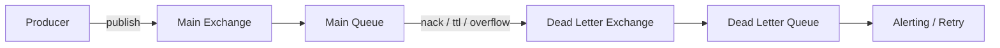

Настройка:
```java
// Объявляем DLX и DLQ
channel.exchangeDeclare("dlx", "direct", true);
channel.queueDeclare("dlq", true, false, false, null);
channel.queueBind("dlq", "dlx", "dead");

// Основная очередь с указанием DLX
Map<String, Object> args = new HashMap<>();
args.put("x-dead-letter-exchange", "dlx");
args.put("x-dead-letter-routing-key", "dead");
channel.queueDeclare("main-queue", true, false, false, args);
```

---

## Q24. При каких условиях сообщение попадает в DLQ?

Брокер объявляет сообщение «мёртвым» и отправляет в `DLX` ровно в трёх случаях:

1. **Rejected** — consumer вызвал `basicReject` или `basicNack` с `requeue=false`, то есть явно отказался обрабатывать (см. Q19).
2. **TTL истёк** — у сообщения или очереди закончилось время жизни (см. Q14).
3. **Queue overflow** — очередь упёрлась в `x-max-length` с политикой `drop-head`, и сообщение вытеснено как самое старое (см. Q15).

**Полезный нюанс:** при каждой «смерти» брокер дописывает в сообщение заголовок `x-death` — с причиной, исходной очередью и **счётчиком смертей**. По этому счётчику в DLQ можно понять, сколько раз сообщение уже отбраковывалось, и, например, ограничить число retry-попыток.

---

## Q25. Как реализовать retry с использованием DLX и TTL?

Идея паттерна **delayed retry**: при ошибке сообщение не возвращают в очередь сразу (это даёт мгновенный бесполезный повтор), а отправляют в отдельную retry-очередь с заданным `TTL`. Сообщение «отлёживается» там нужное время, затем по истечении TTL через `DLX` возвращается в основной exchange — и попадает на повторную обработку уже с задержкой.

Получается замкнутый цикл `main → DLX → retry-queue (TTL) → main exchange → main`, где TTL retry-очереди и есть пауза между попытками:

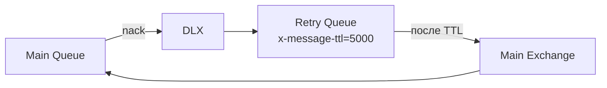

```java
// Retry Queue — задержка 5 секунд, после истечения TTL → обратно в main exchange
Map<String, Object> retryArgs = new HashMap<>();
retryArgs.put("x-message-ttl", 5000);
retryArgs.put("x-dead-letter-exchange", "main-exchange");
retryArgs.put("x-dead-letter-routing-key", "main-key");
channel.queueDeclare("retry-queue", true, false, false, retryArgs);
channel.queueBind("retry-queue", "dlx", "retry");

// При ошибке в consumer
channel.basicNack(deliveryTag, false, false); // requeue=false → в DLX → retry-queue
```

**Подводный камень:** без ограничения попыток такой цикл крутится бесконечно. Чтобы его остановить, в consumer-е проверяют счётчик из заголовка `x-death[count]`: превысил порог — отправляем сообщение в «финальную» DLQ для ручного разбора, а не на новый круг retry.

---

## Q26. (!) Что такое prefetch count и QoS?

**`Prefetch count`** (`basicQos`) — потолок числа `unacked`-сообщений, которые брокер «раздаст в кредит» consumer-у, не дожидаясь подтверждений. По сути это управление **обратным давлением (backpressure)**: брокер не заваливает медленного consumer-а работой, которую тот не успевает разгребать.

```java
// Consumer получит не более 10 сообщений без подтверждения
channel.basicQos(10);
```

Почему это важно при нескольких consumer-ах. По умолчанию брокер раздаёт сообщения round-robin, не глядя на занятость. Если один consumer быстрый, а другой медленный, без prefetch медленному «налипнет» полная пачка, и быстрый будет простаивать.

**`prefetchCount=0`** — без ограничений: брокер отправляет всё сразу, перегружая consumer-а и память.

**`prefetchCount=1`** — честное распределение (fair dispatch): consumer получает следующее сообщение только после `ack` предыдущего. Так свободный consumer всегда забирает работу первым — нагрузка раскладывается по фактической скорости, а не поровну. На диаграмме быстрый воркер успевает обработать 80 сообщений, медленный — 20:

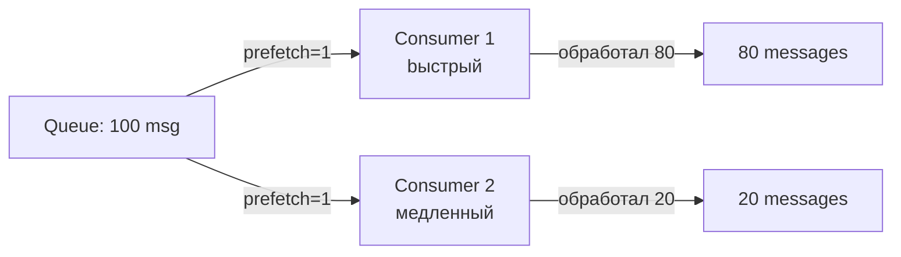

---

## Q27. Как prefetch влияет на производительность и нагрузку?

Значение `prefetchCount` — это компромисс между **throughput** и **равномерностью**: чем оно выше, тем меньше сетевых round-trip-ов (быстрее), но тем неравномернее распределяется нагрузка и больше сообщений «зависает» у одного consumer-а при его падении.

| `prefetchCount` | Поведение | Когда применять |
|-----------------|-----------|------------|
| `0` | Без ограничений, все сообщения сразу | Не рекомендуется — риск перегрузки |
| `1` | Строго по одному, fair dispatch | Долгие задачи, сильно неравномерная нагрузка |
| `10–100` | Баланс throughput и честности | Большинство случаев |
| Высокий (>100) | Максимальный throughput | Быстрая обработка коротких задач, батчи |

**Нюанс про область действия.** При `global=false` (по умолчанию) лимит применяется к **каждому consumer-у** канала отдельно. При `global=true` — это общий потолок на весь `channel`, который consumer-ы делят между собой.

---

## Q28. (!) Как работает кластеризация в RabbitMQ?

Кластер `RabbitMQ` — это несколько узлов (`node`), которые делят общее пространство имён и выглядят для клиента как единый брокер. Главное, что нужно понимать на собеседовании: кластеризация по умолчанию решает **масштабирование и общую топологию**, но **не отказоустойчивость очередей**.

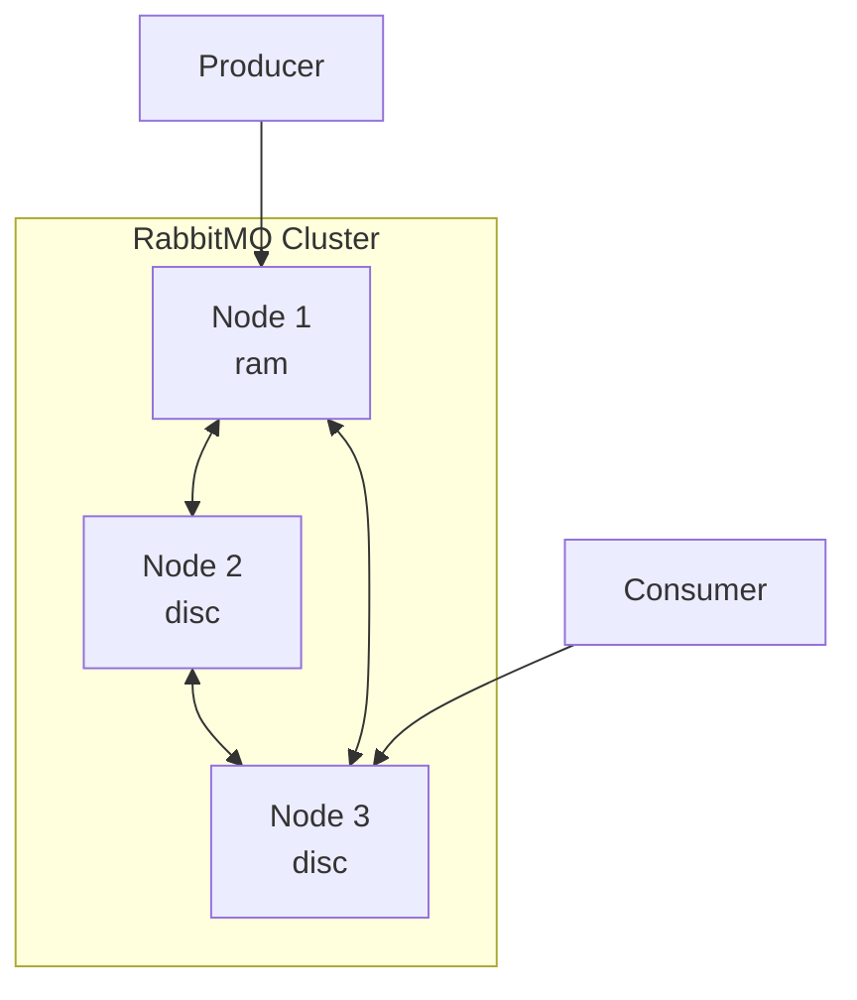

**Что реплицируется, а что нет** — это ключевой момент:
- **Метаданные реплицируются** на все узлы: `exchange`, `binding`, `vhost`, пользователи, политики. Поэтому к любому узлу можно подключиться и увидеть одну и ту же топологию.
- **Содержимое очередей по умолчанию НЕ реплицируется**: каждая classic-очередь физически живёт на **одном** узле. Если этот узел упадёт, очередь и её сообщения станут недоступны. Чтобы это исправить, нужны реплицированные очереди — `Quorum Queues` (см. Q30).

**Типы узлов:**
- `disc` — хранит метаданные на диске; в кластере нужен минимум один такой, иначе после полного рестарта топология потеряется.
- `ram` — держит метаданные только в памяти: операции с топологией быстрее, но узел не переживает рестарт самостоятельно.

**Подводный камень — network partition (split-brain).** При обрыве связи кластер может расщепиться на части, которые продолжают работать независимо и расходятся в данных. Поведение задаётся стратегией: `ignore` (ничего не делать), `pause-minority` (меньшая часть замирает — обычно безопасный выбор) или `autoheal` (после восстановления связи выбрать «победителя» и откатить остальных).

---

## Q29. Что такое Mirrored Queues (Classic HA)?

**`Mirrored Queues`** (Classic HA) — исторически первый способ сделать очередь отказоустойчивой: её содержимое зеркалируется на несколько узлов кластера. Решает проблему из Q28 (одна очередь = один узел), но делает это ненадёжно — поэтому и устарел.

Как устроено:
- один узел — **master**, через него идут все операции с очередью;
- остальные — **slaves** (зеркала), которые непрерывно синхронизируются с master;
- при падении master одно из зеркал автоматически становится новым master.

**Почему от них отказались (минусы):**
- **Высокая нагрузка на сеть** — каждое сообщение копируется на все зеркала.
- **Риск потери сообщений при split-brain** — у механизма нет строгого консенсуса, поэтому при расхождении узлов данные могут быть утеряны при выборе нового master.
- Из-за этих проблем `RabbitMQ` объявил Mirrored Queues устаревшими (deprecated) ещё в `3.9` в пользу `Quorum Queues`; `3.13` стала последней веткой с их поддержкой, а полностью удалены они были в `4.0`.

---

## Q30. (!) Что такое Quorum Queues и чем они лучше Mirrored?

**`Quorum Queues`** — современный, рекомендуемый тип реплицированных очередей. Их главное преимущество над Mirrored — в основе лежит проверенный алгоритм консенсуса **Raft** (тот же, что в `etcd` и `Consul`), а не самописная схема репликации.

Что это даёт на практике: запись считается зафиксированной, только когда её подтвердило **большинство** узлов (quorum). Поэтому при split-brain меньшая часть кластера просто перестаёт принимать записи и данные не расходятся — это и есть устойчивость, которой не хватало Mirrored Queues.

| Характеристика | Mirrored Queues | Quorum Queues |
|----------------|-----------------|---------------|
| Алгоритм | Custom | Raft |
| Гарантии | Слабее | Stronger (majority) |
| Split-brain | Уязвим | Устойчив |
| Производительность | Ниже | Выше |
| Поддержка | Deprecated | Recommended |
| Статус | Устарел в 3.9 | Рекомендован с 3.9 |

```java
// Spring AMQP: объявление Quorum Queue
@Bean
public Queue quorumQueue() {
    return QueueBuilder.durable("my-quorum-queue")
        .quorum()
        .build();
}
```

**Компромисс:** за надёжность платят функциональностью. `Quorum Queues` не поддерживают часть возможностей classic-очередей — в частности `x-message-ttl` на уровне очереди и `priority queues`. Если эти фичи критичны, приходится либо обходить их, либо оставаться на classic-очередях без HA.

---

## Q31. Что такое Federation и Shovel в RabbitMQ?

Оба плагина связывают **разные брокеры** (например, в разных датацентрах) — в отличие от кластеризации, которая объединяет узлы в одном. Разница между ними — в уровне абстракции.

**`Federation`** — «прозрачная» связь на уровне `exchange` или `queue`: локальный exchange как бы расширяется на удалённый брокер, и сообщения подтягиваются с него **по запросу** — только когда на этой стороне есть consumer. Это декларативный, слабосвязанный способ.

**`Shovel`** — низкоуровневая «труба»: непрерывно вычитывает сообщения из конкретной очереди-источника и перекладывает в конкретный пункт назначения (в том числе на удалённом брокере). Сценарии применения:
- разовая миграция сообщений между брокерами;
- репликация потока между датацентрами;
- переброска накопившихся сообщений из `DLQ` обратно в обработку после починки бага.

**Кратко:** `Federation` — это логическая связь exchange/queue «по требованию»; `Shovel` — явное, точечное перемещение сообщений из A в B.

---

## Q32. (!) Что такое Spring AMQP и RabbitTemplate?

**`Spring AMQP`** — это слой Spring над `AMQP`, который прячет низкоуровневый API клиента (ручное управление `Connection`/`Channel`, сериализацию, retry) за идиоматичными Spring-абстракциями. Разбит на два модуля:
- `spring-amqp` — брокеро-независимые абстракции (`Message`, `MessageConverter`, `AmqpTemplate`);
- `spring-rabbit` — конкретная реализация для `RabbitMQ`.

**`RabbitTemplate`** — центральный класс для **отправки** и синхронного запроса-ответа. Он аналог `JdbcTemplate`: берёт на себя получение канала из пула, отправку и обработку ошибок, оставляя вам только бизнес-вызов.

```java
@Autowired
private RabbitTemplate rabbitTemplate;

// Отправка
rabbitTemplate.convertAndSend("my-exchange", "routing.key", myObject);

// Синхронный запрос (RPC)
MyResponse response = (MyResponse) rabbitTemplate.convertSendAndReceive(
    "rpc-exchange", "rpc-key", request
);
```

**`MessageConverter`** превращает Java-объект в байты `AMQP Message` и обратно. По умолчанию стоит `SimpleMessageConverter`, который использует Java-сериализацию — её **не стоит применять** для межсервисного обмена (хрупкая, небезопасная, привязана к classpath). **Рекомендация:** подключите `Jackson2JsonMessageConverter`, тогда сообщения едут в JSON — читаемо, переносимо между языками и версиями.

---

## Q33. Как объявить очередь и exchange через Spring AMQP?

Топологию (`exchange`, `queue`, `binding`) в Spring AMQP объявляют **декларативно — как `@Bean`-ы**. При старте контекста `RabbitAdmin` находит эти бины и автоматически создаёт соответствующие объекты в брокере (если их ещё нет). Удобные билдеры `ExchangeBuilder`, `QueueBuilder`, `BindingBuilder` делают объявление читаемым; обратите внимание на `MessageConverter` и `RabbitTemplate` — без явного конвертера сообщения по умолчанию поедут Java-сериализацией (см. Q32).

```java
@Configuration
public class RabbitMQConfig {

    @Bean
    public TopicExchange ordersExchange() {
        return ExchangeBuilder.topicExchange("orders.exchange")
            .durable(true)
            .build();
    }

    @Bean
    public Queue ordersQueue() {
        return QueueBuilder.durable("orders.queue")
            .withArgument("x-dead-letter-exchange", "orders.dlx")
            .withArgument("x-message-ttl", 60000)
            .build();
    }

    @Bean
    public Binding ordersBinding(Queue ordersQueue, TopicExchange ordersExchange) {
        return BindingBuilder
            .bind(ordersQueue)
            .to(ordersExchange)
            .with("order.#");
    }

    @Bean
    public MessageConverter messageConverter() {
        return new Jackson2JsonMessageConverter();
    }

    @Bean
    public AmqpTemplate amqpTemplate(ConnectionFactory connectionFactory) {
        RabbitTemplate template = new RabbitTemplate(connectionFactory);
        template.setMessageConverter(messageConverter());
        return template;
    }
}
```

---

## Q34. (!) Как настроить @RabbitListener?

`@RabbitListener` — декларативный способ объявить consumer-а: помечаете метод аннотацией с именем очереди, а Spring сам поднимает listener-контейнер, вычитывает сообщения, конвертирует тело в аргумент метода и вызывает его на каждое сообщение. Ниже три типовых варианта — от простейшего до случая с ручным `ack` и динамическим объявлением топологии прямо на listener-е:

```java
@Component
public class OrderListener {

    // Простой listener
    @RabbitListener(queues = "orders.queue")
    public void handleOrder(Order order) {
        orderService.process(order);
    }

    // С доступом к заголовкам и метаданным
    @RabbitListener(queues = "orders.queue")
    public void handleWithHeaders(
        @Payload Order order,
        @Header(AmqpHeaders.DELIVERY_TAG) long deliveryTag,
        @Header(AmqpHeaders.RECEIVED_ROUTING_KEY) String routingKey,
        Channel channel) throws IOException {
        try {
            orderService.process(order);
            channel.basicAck(deliveryTag, false);
        } catch (Exception e) {
            channel.basicNack(deliveryTag, false, false); // в DLQ
        }
    }

    // Динамическое объявление очереди и exchange
    @RabbitListener(bindings = @QueueBinding(
        value = @Queue(value = "dynamic.queue", durable = "true"),
        exchange = @Exchange(value = "topic.exchange", type = ExchangeTypes.TOPIC),
        key = "order.#"
    ))
    public void handleDynamic(Order order) {
        orderService.process(order);
    }
}
```

**Какой контейнер под капотом — `SimpleMessageListenerContainer` или `DirectMessageListenerContainer`:**
- `Simple` (по умолчанию) — держит собственный пул потоков, каждый consumer работает в отдельном thread. Гибче в настройке (динамическое изменение числа consumer-ов), но с дополнительным overhead на передачу сообщений между потоками.
- `Direct` — обрабатывает сообщения прямо в потоке amqp-клиента, без промежуточного пула. Меньше overhead и латентность, но число consumer-ов фиксированное.

---

## Q35. Как настроить retry-логику в Spring AMQP?

В Spring AMQP есть два режима retry, и важно понимать разницу. **Stateless retry** — самый частый: повторы крутятся **в памяти** consumer-а, между ними сообщение не возвращается в брокер. Настраивается одним блоком в `application.yml`:

```yaml
spring:
  rabbitmq:
    listener:
      simple:
        retry:
          enabled: true
          initial-interval: 1000
          max-attempts: 3
          multiplier: 2.0
          max-interval: 10000
        acknowledge-mode: auto
```

**Stateful retry** — счётчик попыток хранится не в памяти, а привязан к сообщению (по его ID), и сообщение реально возвращается в брокер между попытками. Нужен для `manual ack` и для сценариев, где между ретраями есть транзакции. Обратите внимание на `recoverer`: `RejectAndDontRequeueRecoverer` после исчерпания попыток отправляет сообщение в `DLQ`, а не зацикливает его:

```java
@Bean
public SimpleRabbitListenerContainerFactory rabbitListenerContainerFactory(
    ConnectionFactory connectionFactory,
    MessageConverter converter) {
    SimpleRabbitListenerContainerFactory factory = new SimpleRabbitListenerContainerFactory();
    factory.setConnectionFactory(connectionFactory);
    factory.setMessageConverter(converter);
    factory.setAcknowledgeMode(AcknowledgeMode.MANUAL);

    RetryInterceptorBuilder<?> builder = RetryInterceptorBuilder.stateless()
        .maxAttempts(3)
        .backOffOptions(1000, 2.0, 10000)
        .recoverer(new RejectAndDontRequeueRecoverer()); // в DLQ после исчерпания попыток
    factory.setAdviceChain(builder.build());
    return factory;
}
```

---

## Q36. (!) Какие основные паттерны обмена сообщениями реализуются в RabbitMQ?

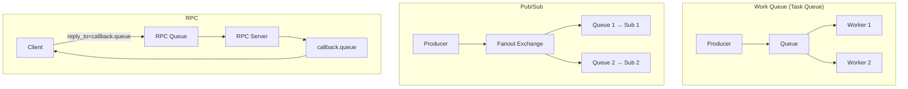

Все паттерны `RabbitMQ` — это, по сути, комбинации уже знакомых кирпичиков: тип `exchange` + способ потребления. Различаются они тем, как именно сообщение «размножается» и кто его получает.

| Паттерн | Exchange | Суть |
|---------|----------|----------|
| Work Queue | Default/Direct | Одна очередь, несколько worker-ов конкурируют — задача достаётся **одному** |
| Pub/Sub | Fanout | Событие копируется **всем** подписчикам |
| Routing | Direct | Подписка на конкретные типы события по точному ключу |
| Topic | Topic | Гибкая подписка по паттерну ключа |
| RPC | Default | Синхронный запрос/ответ поверх двух очередей |
| Delayed | DLX + TTL | Отложенная доставка через «отлёживание» в retry-очереди (Q25) |

**Ключевое различие:** в Work Queue сообщение получает **один** из worker-ов (распределение нагрузки), а в Pub/Sub — **каждый** подписчик (рассылка). Это прямое следствие того, конкурируют consumer-ы за одну очередь или у каждого своя.

---

## Q37. Как реализовать паттерн RPC через RabbitMQ?

RPC поверх очередей строится на двух деталях: **`reply_to`** и **`correlationId`**. Клиент создаёт временную reply-очередь, кладёт её имя в свойство `reply_to` запроса, а в `correlationId` — уникальный идентификатор. Сервер обрабатывает запрос и отправляет ответ в очередь из `reply_to`, копируя тот же `correlationId`. Клиент по этому id сопоставляет пришедший ответ с конкретным запросом — это нужно, потому что в одну reply-очередь могут прилетать ответы на несколько параллельных запросов.

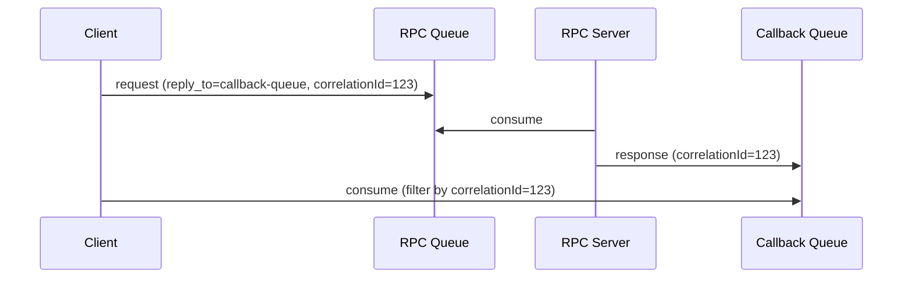

```java
// Клиент
String correlationId = UUID.randomUUID().toString();
String replyQueueName = channel.queueDeclare().getQueue();

AMQP.BasicProperties props = new AMQP.BasicProperties.Builder()
    .correlationId(correlationId)
    .replyTo(replyQueueName)
    .build();

channel.basicPublish("", "rpc-queue", props, request.getBytes());

// Ожидание ответа с matching correlationId
BlockingQueue<String> response = new ArrayBlockingQueue<>(1);
channel.basicConsume(replyQueueName, true, (consumerTag, delivery) -> {
    if (correlationId.equals(delivery.getProperties().getCorrelationId())) {
        response.offer(new String(delivery.getBody()));
    }
}, tag -> {});

return response.poll(10, TimeUnit.SECONDS);
```

В `Spring AMQP` всю эту механику (временная очередь, `correlationId`, ожидание ответа) скрывает один вызов `rabbitTemplate.convertSendAndReceive()` — вручную её писать не нужно.

**Подводный камень:** синхронный RPC через брокер противоречит идее асинхронного messaging — клиент блокируется в ожидании ответа, добавляется лишний сетевой хоп, а таймауты надо обрабатывать явно. Для синхронных вызовов часто уместнее прямой HTTP/gRPC; RPC-over-AMQP берут, когда уже есть брокер и нужна его маршрутизация или развязка от адресов сервисов.

---

## Q38. Как мониторить RabbitMQ через Management Plugin?

**Management Plugin** — штатный инструмент наблюдения за брокером. Он даёт три точки входа под разные задачи:
- **Web UI** (`http://localhost:15672`) — интерактивный дашборд для ручного разбора инцидентов;
- **HTTP API** (`http://localhost:15672/api/`) — те же данные в JSON для автоматизации и интеграций;
- **CLI** `rabbitmqadmin` — скрипты, экспорт/импорт конфигурации.

**Ключевые страницы UI:**
- **Overview** — общее здоровье кластера: узлы, connections, channels, суммарные очереди;
- **Queues** — самое важное при отладке: глубина каждой очереди и скорости publish / consume / ack (по их соотношению видно, успевают ли consumer-ы);
- **Connections/Channels** — активные соединения и каналы (помогает ловить утечки channel-ов);
- **Admin** — пользователи, `vhost`, политики.

```bash
# Просмотр очередей через CLI
rabbitmqadmin list queues name messages consumers

# Экспорт конфигурации
rabbitmqadmin export config.json
```

**Рекомендация для продакшна:** Management UI хорош для ручного разбора, но для постоянного мониторинга и алертинга подключают плагин `rabbitmq_prometheus` — он отдаёт метрики в `Prometheus`, поверх которого строят дашборды (Grafana) и правила оповещений.

---

## Q39. Какие метрики RabbitMQ наиболее важны?

Метрики удобно сгруппировать по тому, о чём они сигналят: пропускная способность, ресурсы узла и здоровье consumer-ов.

| Метрика | Что показывает | Тревожный признак |
|---------|----------|-----------------|
| `queue_messages_ready` | Сообщения, готовые к доставке (ждут consumer-а) | Устойчиво растёт > N — consumer-ы не успевают |
| `queue_messages_unacknowledged` | Сообщения `unacked` (взяты, но не подтверждены) | Долго держится высоким — consumer завис на обработке |
| `queue_consumers` | Активные consumer-ы очереди | `= 0` — очередь некому читать |
| `connection_count` | Активные соединения | Близко к лимиту — утечка connection-ов |
| `channel_count` | Открытые каналы | Аномально высокое — каналы не закрываются |
| `disk_free` | Свободное место на диске | `< disk_free_limit` — брокер заблокирует publish |
| `mem_used` | Использование памяти | `> vm_memory_high_watermark` — включится flow control |
| `publish_rate` | Скорость публикации (msg/s) | — (базовая для сравнения) |
| `deliver_ack_rate` | Скорость подтверждённой доставки | Стабильно ниже `publish_rate` — очередь будет расти |

**Главное правило диагностики:** если `publish_rate` устойчиво превышает `deliver_ack_rate`, очередь неизбежно растёт — нужно добавлять consumer-ов или ускорять обработку. А при достижении `vm_memory_high_watermark` (по умолчанию 40% RAM) брокер включает **flow control**: притормаживает или блокирует publishers, чтобы не упасть по памяти.

---

## Q40. (!) В чём принципиальные отличия RabbitMQ от Kafka?

Главное различие в одной фразе: **`RabbitMQ` — это умная очередь, `Kafka` — это распределённый лог.** В `RabbitMQ` сообщение существует, пока его не заберут и не подтвердят, после чего оно исчезает. В `Kafka` сообщения пишутся в неизменяемый лог и хранятся заданное время независимо от того, кто их прочитал, — поэтому возможен replay. Из этой разницы вытекают почти все остальные строки таблицы:

| Характеристика | `RabbitMQ` | `Apache Kafka` |
|----------------|------------|----------------|
| Модель | Push (broker → consumer) | Pull (consumer тянет) |
| Хранение | Сообщения удаляются после ack | Лог хранится N дней |
| Порядок | В рамках одной очереди | В рамках партиции |
| Replay | Нет (только DLQ) | Да (любой offset) |
| Маршрутизация | Гибкая (exchange, binding) | По топику/партиции |
| Пропускная способность | Умеренная (100K msg/s) | Очень высокая (1M+ msg/s) |
| Latency | Низкая (<1ms) | Чуть выше (batch) |
| Consumer groups | Конкуренция или подписка | Независимые группы |
| Протокол | `AMQP`, `STOMP`, `MQTT` | Собственный |
| Use case | Задачи, RPC, сложная маршрутизация | Стриминг, аналитика, event log |

---

## Q41. Когда выбрать RabbitMQ, а когда Kafka?

Короткий ориентир: **`RabbitMQ` — когда важно, как сообщение доставить (маршрутизация, очереди задач, RPC); `Kafka` — когда важно, что сообщения остаются в истории (replay, поток событий, аналитика).** Детальнее по сценариям:

**Выбирайте `RabbitMQ` когда:**
- Нужна сложная маршрутизация сообщений (topic patterns, headers)
- Важна низкая задержка для отдельных сообщений
- Нужен паттерн Work Queue с равномерным распределением нагрузки
- Требуется RPC через messaging
- Разные типы сообщений с разными получателями
- Команда знакома с `AMQP`; интеграция через `STOMP` / `MQTT`
- Объём сообщений умеренный, не требуется долгосрочное хранение

**Выбирайте `Kafka` когда:**
- Нужен event log с возможностью replay
- Очень высокий throughput (миллионы событий/сек)
- Событийная история важна для аналитики или audit trail
- Нужна интеграция с Big Data / stream processing (`Flink`, `Spark`)
- Multiple independent consumer groups читают один поток
- Долгосрочное хранение событий

> Оба инструмента могут сосуществовать в одной системе: `Kafka` — для event streaming, `RabbitMQ` — для task queues и RPC.

---

## See also

- [Apache Kafka](kafka-interview.md) — альтернативный брокер для event streaming
- [Распределённые системы](../architecture/distributed-systems-interview.md) — CAP-теорема, консистентность, отказоустойчивость
- [Spring Boot](../frameworks/spring/spring-boot-interview.md) — основы Spring Boot для интеграции
- [Микросервисная архитектура](../architecture/microservices-interview.md) — паттерны коммуникации между сервисами
- [Event-driven паттерны](../architecture/event-driven-patterns-interview.md) — паттерны асинхронного взаимодействия
- [Стратегии кэширования](../architecture/caching-strategies-interview.md) — дополняет паттерны обмена данными
- [Паттерны согласованности](../architecture/consistency-patterns-interview.md) — гарантии доставки и идемпотентность

- [AWS SQS и SNS](aws-sqs-sns-interview.md)
- [Apache Kafka](kafka-interview.md)
- [Сравнение Message Brokers](message-brokers-comparison-interview.md)
- [NATS](nats-interview.md)
- [Apache Pulsar](pulsar-interview.md)
- [Redpanda](redpanda-interview.md)
- [Шпаргалка: RabbitMQ для Java](../../development/messaging/rabbitmq/rabbitmq.md) — теория
