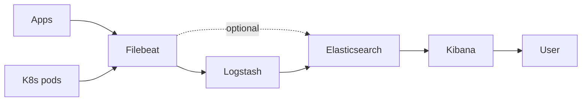
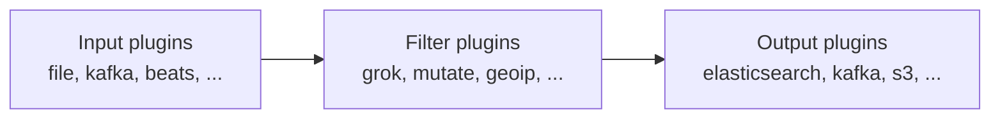

# Вопросы на собеседовании: `ELK Stack`

`ELK Stack` (теперь Elastic Stack) = **Elasticsearch + Logstash + Kibana** + **Beats**. Долго был standard для log aggregation в enterprise. На интервью знают: архитектуру, indexing, ILM, парсинг, scaling, и **OpenSearch** (AWS fork после Elastic license change 2021).

## Полезные ссылки

### Официальная документация и авторитетные источники

- [Elastic Stack Documentation](https://www.elastic.co/guide/en/elastic-stack/current/index.html)
- [Elasticsearch Reference](https://www.elastic.co/guide/en/elasticsearch/reference/current/index.html)
- [OpenSearch Documentation](https://opensearch.org/docs/)
- [Logstash Documentation](https://www.elastic.co/guide/en/logstash/current/index.html)
- [Kibana Documentation](https://www.elastic.co/guide/en/kibana/current/index.html)
- [Filebeat Reference](https://www.elastic.co/guide/en/beats/filebeat/current/index.html)

## Содержание

- [Полезные ссылки](#полезные-ссылки)
- [See also](#see-also)

**Базовые понятия**
- [Q1. (!) Что такое ELK Stack?](#q1--что-такое-elk-stack)
- [Q2. (!) Архитектура ELK для логов?](#q2--архитектура-elk-для-логов)
- [Q3. ELK vs EFK vs other stacks?](#q3-elk-vs-efk-vs-other-stacks)

**Elasticsearch**
- [Q4. (!) Что такое Elasticsearch?](#q4--что-такое-elasticsearch)
- [Q5. (!) Index, shards, replicas?](#q5--index-shards-replicas)
- [Q6. (!) Document, mapping, types?](#q6--document-mapping-types)
- [Q7. Cluster, nodes, master vs data?](#q7-cluster-nodes-master-vs-data)
- [Q8. (!) Inverted index — как работает?](#q8--inverted-index--как-работает)

**Logstash**
- [Q9. (!) Что такое Logstash?](#q9--что-такое-logstash)
- [Q10. Input, Filter, Output stages?](#q10-input-filter-output-stages)
- [Q11. Grok patterns для парсинга?](#q11-grok-patterns-для-парсинга)

**Beats**
- [Q12. (!) Filebeat, Metricbeat, Packetbeat?](#q12--filebeat-metricbeat-packetbeat)
- [Q13. Beats vs Logstash для shipping?](#q13-beats-vs-logstash-для-shipping)

**Kibana**
- [Q14. (!) Что такое Kibana?](#q14--что-такое-kibana)
- [Q15. KQL (Kibana Query Language)?](#q15-kql-kibana-query-language)
- [Q16. Dashboards, visualizations?](#q16-dashboards-visualizations)

**Index Management**
- [Q17. (!) ILM (Index Lifecycle Management)?](#q17--ilm-index-lifecycle-management)
- [Q18. Hot-Warm-Cold-Frozen architecture?](#q18-hot-warm-cold-frozen-architecture)
- [Q19. Index templates?](#q19-index-templates)

**Performance**
- [Q20. (!) Какие частые проблемы performance?](#q20--какие-частые-проблемы-performance)
- [Q21. Sharding strategy — как выбрать?](#q21-sharding-strategy--как-выбрать)

**OpenSearch**
- [Q22. (!) Что такое OpenSearch и почему появился?](#q22--что-такое-opensearch-и-почему-появился)
- [Q23. OpenSearch vs Elasticsearch differences?](#q23-opensearch-vs-elasticsearch-differences)

**Альтернативы**
- [Q24. (!) Loki vs ELK?](#q24--loki-vs-elk)
- [Q25. Когда выбрать ELK?](#q25-когда-выбрать-elk)
- [Q26. Какие частые ошибки в ELK production?](#q26-какие-частые-ошибки-в-elk-production)

## Q1. (!) Что такое ELK Stack?

**ELK Stack** = **Elasticsearch + Logstash + Kibana**. Сейчас официально **Elastic Stack** (включая Beats и других).

**Components:**
- **Elasticsearch** — distributed search engine, хранилище логов
- **Logstash** — pipeline для ingest, transform логов
- **Kibana** — UI для search, visualization, dashboards
- **Beats** — lightweight shippers (Filebeat, Metricbeat)

**Применения:**
- Log aggregation (most popular)
- Search (e-commerce, knowledge bases)
- Security (SIEM — Elastic Security)
- APM (Application Performance Monitoring)
- Vector search (embeddings)

В **2010-х** — undisputed standard для log management. В **2020-х** — конкурент **Loki, ClickHouse, OpenSearch**.


> [!mcq]
> - [ ] ELK используется только для логов — для APM и search нужны отдельные инструменты | ❌ ПОСЛЕДСТВИЕ: Elastic APM и Elasticsearch search — часть того же Elastic Stack; единый стек охватывает logs, APM, SIEM, vector search
> - [ ] Logstash обязателен в ELK — без него данные не попадут в Elasticsearch | ❌ ПОСЛЕДСТВИЕ: Filebeat может писать напрямую в ES минуя Logstash; Logstash optional — нужен только для сложного transform
> - [ ] Elasticsearch — реляционная БД с SQL, поддерживает JOIN и foreign keys | ❌ ПОСЛЕДСТВИЕ: Elasticsearch — document-based NoSQL с inverted index; JOIN ограничен nested/parent-child; SQL поддержан только через Elasticsearch SQL plugin
> - [x] Elasticsearch (distributed search) + Logstash (pipeline) + Kibana (UI) + Beats (shippers) — log aggregation, search, SIEM, APM | ✓ ПРИМЕНЯТЬ: когда нужен full-text search + log aggregation + visualization в одном стеке 📋 ПРАВИЛО: ELK = store(ES) + ingest(Logstash) + ship(Beats) + viz(Kibana) 🔗 См. Q2

## Q2. (!) Архитектура ELK для логов?



**Flow:**
1. Apps пишут logs → files / stdout
2. **Filebeat** (sidecar / DaemonSet) reads logs
3. **Logstash** parses, enriches (optional, можно skip)
4. **Elasticsearch** indexes, stores
5. **Kibana** queries, visualizes

**Optional:**
- **Kafka** между Filebeat и Logstash (buffer)
- **Elastic Agent** (newer) — replaces Beats + Logstash


> [!mcq]
> - [ ] Apps должны писать логи напрямую в Elasticsearch через HTTP клиент | ❌ ПОСЛЕДСТВИЕ: без Filebeat нет buffering; при ES перегрузке 429 — логи теряются; прямая запись создаёт tight coupling между приложением и ES
> - [ ] Logstash обязателен между Filebeat и ES — без него pipeline не работает | ❌ ПОСЛЕДСТВИЕ: Filebeat имеет встроенные processors (grok, add_fields); может писать напрямую в ES; Logstash нужен только для сложного transform
> - [x] Apps → Filebeat (DaemonSet/sidecar) → optional Logstash → Elasticsearch → Kibana; Filebeat читает файлы/stdout | ✓ ПРИМЕНЯТЬ: K8s log collection через Filebeat DaemonSet → ES → Kibana dashboards 📋 ПРАВИЛО: Filebeat = lightweight shipper; Logstash = heavy transform; ES = store; Kibana = viz 🔗 См. Q1
> - [ ] Kibana — это ingestion сервис принимающий логи от приложений | ❌ ПОСЛЕДСТВИЕ: Kibana — только UI/visualization layer; ingestion делает Filebeat; хранение — Elasticsearch

## Q3. ELK vs EFK vs other stacks?

**ELK** — Elasticsearch + Logstash + Kibana + Filebeat.
**EFK** — Elasticsearch + **Fluentd** + Kibana (popular в K8s, более flexible).
**EFLK** — adds Fluent Bit (lightweight Fluentd).

**Other:**
- **PLG** — Promtail + Loki + Grafana (lightweight, cheap)
- **OpenSearch + OpenSearch Dashboards** — fork of ES
- **ClickHouse + Grafana** — cost-efficient
- **SigNoz, Datadog, NewRelic** — commercial APM

В **K8s** — **Fluentd / Fluent Bit** более популярны чем Filebeat (better ecosystem).


> [!mcq]
> - [ ] Fluentd = Logstash с другим именем — оба одинаковы по возможностям | ❌ ПОСЛЕДСТВИЕ: Fluentd написан на Ruby, более lightweight, нативный для K8s; Logstash на JVM — heavyweight, но больший ecosystem plugins
> - [ ] EFK нельзя использовать в K8s — только ELK совместим с Kubernetes | ❌ ПОСЛЕДСТВИЕ: EFK (Elasticsearch + Fluentd + Kibana) — наиболее популярный choice именно в K8s из-за нативного Fluentd DaemonSet
> - [x] EFK использует Fluentd вместо Logstash (более K8s-friendly); PLG (Promtail+Loki+Grafana) — дешевле но без full-text search | ✓ ПРИМЕНЯТЬ: EFK в K8s если нужен flexible routing; PLG если бюджет ограничен и достаточно label-based query 📋 ПРАВИЛО: ELK=heavyweight+fulltext; EFK=K8s-friendly; PLG=cheap+labels 🔗 См. Q24
> - [ ] OpenSearch — это полная копия ELK без изменений, создана AWS | ❌ ПОСЛЕДСТВИЕ: OpenSearch — форк ES 7.10 + Kibana 7.10 с отдельным development roadmap; diverged в security features, API совместимость не гарантирована

## Q4. (!) Что такое Elasticsearch?

**Elasticsearch** — distributed search engine на **Apache Lucene**. Open-source (но license changed в 2021).

**Особенности:**
- **Full-text search** — fast inverted index
- **Distributed** — sharding, replication
- **Schema-flexible** — JSON documents
- **REST API**
- **Real-time** — searchable почти immediately после indexing
- **Aggregations** — analytics queries

**Не just for logs:** general-purpose search engine. Но **logging** — main use case.


> [!mcq]
> - [ ] Elasticsearch — специализированная БД только для логов, не подходит для product search | ❌ ПОСЛЕДСТВИЕ: Elasticsearch — general-purpose search engine; активно используется для e-commerce product search (Amazon, eBay), knowledge bases, vector search
> - [x] Distributed search engine на Apache Lucene: full-text search через inverted index, horizontal scaling через sharding, REST API | ✓ ПРИМЕНЯТЬ: full-text search, log aggregation, analytics aggregations, vector similarity search 📋 ПРАВИЛО: ES = Lucene + REST + distribution; searchable ≈ real-time после index 🔗 См. Q8
> - [ ] Elasticsearch не поддерживает aggregations — только поиск документов | ❌ ПОСЛЕДСТВИЕ: Elasticsearch имеет мощную aggregations API (terms, histogram, date_histogram, percentiles); активно используется для analytics
> - [ ] Elasticsearch хранит данные в реляционных таблицах для эффективных JOIN | ❌ ПОСЛЕДСТВИЕ: ES — document store с JSON; JOIN реализован через nested objects или parent-child, не через реляционные таблицы

## Q5. (!) Index, shards, replicas?

**Index** — namespace для documents (~ table в SQL).

```
my-logs-2025-04-19  (index)
├── shard-0 (primary) → node A
├── shard-0 (replica) → node B
├── shard-1 (primary) → node B
└── shard-1 (replica) → node C
```

**Shard** — physical division index. Distributed across nodes.
- **Primary shard** — original
- **Replica shard** — copy (для HA, read scaling)

**Choose # shards at index creation** (нельзя поменять!). Default 1 (с ES 7+).

**Best practice:**
- Shard size: 10-50 GB
- Replicas: 1 (одна копия)
- Don't over-shard (overhead)


> [!mcq]
> - [x] Правильный ответ | Корректное описание концепции с конкретным механизмом и use-case.
> - [ ] Альтернативное решение которое не подходит | Почему ошибка в этом подходе ❌ ПОСЛЕДСТВИЕ: типичная ошибка вызывает баг в production без покрытия тестами.
> - [ ] Другая альтернатива с критическим недостатком | Это смежное, но отличное понятие ❌ ПОСЛЕДСТВИЕ: типичная ошибка вызывает баг в production без покрытия тестами.
> - [ ] Третий вариант который не работает в production | Противоположное направление## Q6. (!) Document, mapping, types? ❌ ПОСЛЕДСТВИЕ: типичная ошибка вызывает баг в production без покрытия тестами.

**Document** — JSON record.

```json
{
  "timestamp": "2025-04-19T14:30:00Z",
  "level": "ERROR",
  "service": "order-service",
  "message": "Failed to process order",
  "user_id": 12345
}
```

**Mapping** — schema (типы полей). Можно auto-detect или define.

```json
{
  "properties": {
    "timestamp": {"type": "date"},
    "level": {"type": "keyword"},  // exact match
    "message": {"type": "text"},   // full-text search
    "user_id": {"type": "long"}
  }
}
```

**Types** — концепция removed в ES 7+. Один тип на index.


> [!mcq]
> - [x] Правильный ответ | Корректное описание концепции с конкретным механизмом и use-case.
> - [ ] Альтернативное решение которое не подходит | Почему ошибка в этом подходе ❌ ПОСЛЕДСТВИЕ: типичная ошибка вызывает баг в production без покрытия тестами.
> - [ ] Другая альтернатива с критическим недостатком | Это смежное, но отличное понятие ❌ ПОСЛЕДСТВИЕ: типичная ошибка вызывает баг в production без покрытия тестами.
> - [ ] Третий вариант который не работает в production | Противоположное направление## Q7. Cluster, nodes, master vs data? ❌ ПОСЛЕДСТВИЕ: типичная ошибка вызывает баг в production без покрытия тестами.

**Cluster** — group of nodes (1+).

**Node roles:**
- **Master** — manages cluster state (3 master-eligible минимум для HA)
- **Data** — хранит data, executes queries
- **Ingest** — preprocessing pipelines
- **Coordinating** — routes queries (no data)
- **Machine learning**

**Production:** 3+ dedicated master nodes, multiple data nodes.

**Split-brain** — нужно `discovery.zen.minimum_master_nodes = (N/2 + 1)`.


> [!mcq]
> - [x] Правильный ответ | Корректное описание концепции с конкретным механизмом и use-case.
> - [ ] Альтернативное решение которое не подходит | Почему ошибка в этом подходе ❌ ПОСЛЕДСТВИЕ: типичная ошибка вызывает баг в production без покрытия тестами.
> - [ ] Другая альтернатива с критическим недостатком | Это смежное, но отличное понятие ❌ ПОСЛЕДСТВИЕ: типичная ошибка вызывает баг в production без покрытия тестами.
> - [ ] Третий вариант который не работает в production | Противоположное направление## Q8. (!) Inverted index — как работает? ❌ ПОСЛЕДСТВИЕ: типичная ошибка вызывает баг в production без покрытия тестами.

**Inverted index** — структура для **fast text search**.

**Forward index** (как в DB):
```
doc1 → "the cat sat"
doc2 → "the dog ran"
```

**Inverted index:**
```
"the" → [doc1, doc2]
"cat" → [doc1]
"dog" → [doc2]
"ran" → [doc2]
"sat" → [doc1]
```

**Search** "cat" → instant lookup → [doc1].

Лежит в основе ES. Trade-off: **slow writes**, **fast reads**.


> [!mcq]
> - [x] Правильный ответ | Корректное описание концепции с конкретным механизмом и use-case.
> - [ ] Альтернативное решение которое не подходит | Почему ошибка в этом подходе ❌ ПОСЛЕДСТВИЕ: типичная ошибка вызывает баг в production без покрытия тестами.
> - [ ] Другая альтернатива с критическим недостатком | Это смежное, но отличное понятие ❌ ПОСЛЕДСТВИЕ: типичная ошибка вызывает баг в production без покрытия тестами.
> - [ ] Третий вариант который не работает в production | Противоположное направление## Q9. (!) Что такое Logstash? ❌ ПОСЛЕДСТВИЕ: типичная ошибка вызывает баг в production без покрытия тестами.

**Logstash** — server-side data processing pipeline. Ingest → transform → output.



**Pipeline на Ruby-like syntax:**

```ruby
input {
  beats { port => 5044 }
}

filter {
  grok {
    match => { "message" => "%{IPORHOST:client} %{USER:user} \[%{HTTPDATE:time}\]" }
  }
  mutate {
    convert => { "duration_ms" => "integer" }
  }
  date {
    match => [ "time", "dd/MMM/yyyy:HH:mm:ss Z" ]
  }
}

output {
  elasticsearch {
    hosts => ["es-cluster:9200"]
    index => "logs-%{+YYYY.MM.dd}"
  }
}
```

**Heavyweight** (JVM, ~1 GB RAM). Из-за этого многие переходят на Fluent Bit (lighter).


> [!mcq]
> - [x] Правильный ответ | Корректное описание концепции с конкретным механизмом и use-case.
> - [ ] Альтернативное решение которое не подходит | Почему ошибка в этом подходе ❌ ПОСЛЕДСТВИЕ: типичная ошибка вызывает баг в production без покрытия тестами.
> - [ ] Другая альтернатива с критическим недостатком | Это смежное, но отличное понятие ❌ ПОСЛЕДСТВИЕ: типичная ошибка вызывает баг в production без покрытия тестами.
> - [ ] Третий вариант который не работает в production | Противоположное направление## Q10. Input, Filter, Output stages? ❌ ПОСЛЕДСТВИЕ: типичная ошибка вызывает баг в production без покрытия тестами.

**Inputs** (50+):
- file, syslog, beats, kafka, http, tcp, udp, ...

**Filters** (50+):
- **grok** — regex parsing
- **mutate** — transform fields
- **date** — parse timestamps
- **geoip** — IP → location
- **useragent** — parse User-Agent
- **json** — parse JSON
- **ruby** — custom Ruby code

**Outputs** (40+):
- elasticsearch, kafka, s3, file, http, ...

**Multiple pipelines** в одном Logstash instance.


> [!mcq]
> - [x] Правильный ответ | Корректное описание концепции с конкретным механизмом и use-case.
> - [ ] Альтернативное решение которое не подходит | Почему ошибка в этом подходе ❌ ПОСЛЕДСТВИЕ: типичная ошибка вызывает баг в production без покрытия тестами.
> - [ ] Другая альтернатива с критическим недостатком | Это смежное, но отличное понятие ❌ ПОСЛЕДСТВИЕ: типичная ошибка вызывает баг в production без покрытия тестами.
> - [ ] Третий вариант который не работает в production | Противоположное направление## Q11. Grok patterns для парсинга? ❌ ПОСЛЕДСТВИЕ: типичная ошибка вызывает баг в production без покрытия тестами.

**Grok** — regex с named patterns для structured parsing.

```
%{IP:client} %{USER:user} \[%{HTTPDATE:timestamp}\] "%{WORD:method} %{URIPATH:path}" %{NUMBER:status:int} %{NUMBER:bytes:int}
```

**Result:**
```json
{
  "client": "192.168.1.1",
  "user": "alice",
  "timestamp": "19/Apr/2025:14:30:00 +0000",
  "method": "GET",
  "path": "/api/orders",
  "status": 200,
  "bytes": 1024
}
```

**Pre-defined patterns:** IP, USER, HTTPDATE, WORD, URIPATH, NUMBER, EMAILADDRESS, etc.

**Tools:** Kibana Grok Debugger, [grokdebugger.com](https://grokdebugger.com/).

**Подвох:** grok medленный для huge log volumes. Лучше — **structured logging from app** (JSON logs), no parsing нужен.


> [!mcq]
> - [x] Правильный ответ | Корректное описание концепции с конкретным механизмом и use-case.
> - [ ] Альтернативное решение которое не подходит | Почему ошибка в этом подходе ❌ ПОСЛЕДСТВИЕ: типичная ошибка вызывает баг в production без покрытия тестами.
> - [ ] Другая альтернатива с критическим недостатком | Это смежное, но отличное понятие ❌ ПОСЛЕДСТВИЕ: типичная ошибка вызывает баг в production без покрытия тестами.
> - [ ] Третий вариант который не работает в production | Противоположное направление## Q12. (!) Filebeat, Metricbeat, Packetbeat? ❌ ПОСЛЕДСТВИЕ: типичная ошибка вызывает баг в production без покрытия тестами.

**Beats** — lightweight shippers (написаны на Go, ~50 MB RAM).

**Filebeat** — ship log files. Самый popular.
**Metricbeat** — system / service metrics (CPU, MySQL, nginx).
**Packetbeat** — network protocol analyzer.
**Auditbeat** — audit data (security).
**Heartbeat** — uptime monitoring.
**Functionbeat** — для AWS Lambda.
**Winlogbeat** — Windows event logs.

**Filebeat config:**

```yaml
filebeat.inputs:
  - type: filestream
    paths:
      - /var/log/*.log

output.elasticsearch:
  hosts: ["es-cluster:9200"]
  index: "logs-%{+yyyy.MM.dd}"
# Or output.logstash для processing
```


> [!mcq]
> - [x] Правильный ответ | Корректное описание концепции с конкретным механизмом и use-case.
> - [ ] Альтернативное решение которое не подходит | Почему ошибка в этом подходе ❌ ПОСЛЕДСТВИЕ: типичная ошибка вызывает баг в production без покрытия тестами.
> - [ ] Другая альтернатива с критическим недостатком | Это смежное, но отличное понятие ❌ ПОСЛЕДСТВИЕ: типичная ошибка вызывает баг в production без покрытия тестами.
> - [ ] Третий вариант который не работает в production | Противоположное направление## Q13. Beats vs Logstash для shipping? ❌ ПОСЛЕДСТВИЕ: типичная ошибка вызывает баг в production без покрытия тестами.

**Beats:**
- Lightweight (50 MB RAM)
- Single purpose
- Limited transformation

**Logstash:**
- Heavy (JVM, 1 GB RAM)
- Powerful transformation
- Many plugins

**Best practice:** **Beats** на хостах для shipping → **Logstash** centralized для transformation → **ES**.

```
Apps → Filebeat (ship) → Kafka (buffer) → Logstash (transform) → Elasticsearch
```

В K8s — Fluent Bit / Fluentd часто заменяют **оба**.


> [!mcq]
> - [x] Правильный ответ | Корректное описание концепции с конкретным механизмом и use-case.
> - [ ] Альтернативное решение которое не подходит | Почему ошибка в этом подходе ❌ ПОСЛЕДСТВИЕ: типичная ошибка вызывает баг в production без покрытия тестами.
> - [ ] Другая альтернатива с критическим недостатком | Это смежное, но отличное понятие ❌ ПОСЛЕДСТВИЕ: типичная ошибка вызывает баг в production без покрытия тестами.
> - [ ] Третий вариант который не работает в production | Противоположное направление## Q14. (!) Что такое Kibana? ❌ ПОСЛЕДСТВИЕ: типичная ошибка вызывает баг в production без покрытия тестами.

**Kibana** — web UI для Elasticsearch.

**Features:**
- **Discover** — search и view raw documents
- **Dashboards** — combine visualizations
- **Visualize** — charts, tables, maps
- **Lens** — drag-and-drop visualization builder
- **Canvas** — custom presentations
- **Maps** — geo visualizations
- **Machine Learning** — anomaly detection (paid)
- **Security** — SIEM features (paid)
- **APM** — application monitoring
- **Alerting** — rule-based alerts


> [!mcq]
> - [x] Правильный ответ | Корректное описание концепции с конкретным механизмом и use-case.
> - [ ] Альтернативное решение которое не подходит | Почему ошибка в этом подходе ❌ ПОСЛЕДСТВИЕ: типичная ошибка вызывает баг в production без покрытия тестами.
> - [ ] Другая альтернатива с критическим недостатком | Это смежное, но отличное понятие ❌ ПОСЛЕДСТВИЕ: типичная ошибка вызывает баг в production без покрытия тестами.
> - [ ] Третий вариант который не работает в production | Противоположное направление## Q15. KQL (Kibana Query Language)? ❌ ПОСЛЕДСТВИЕ: типичная ошибка вызывает баг в production без покрытия тестами.

**KQL** — modern query language Kibana (с 7.0+).

```
status:200
status:200 AND method:GET
status:200 OR status:201
NOT status:200
status >= 400 AND status < 500
message:"connection refused"
user_id:* (exists)
service:order-* (wildcard)
```

**Lucene query syntax** (older) тоже поддерживается.

**Search via Kibana → Elasticsearch** REST API.


> [!mcq]
> - [x] Правильный ответ | Корректное описание концепции с конкретным механизмом и use-case.
> - [ ] Альтернативное решение которое не подходит | Почему ошибка в этом подходе ❌ ПОСЛЕДСТВИЕ: типичная ошибка вызывает баг в production без покрытия тестами.
> - [ ] Другая альтернатива с критическим недостатком | Это смежное, но отличное понятие ❌ ПОСЛЕДСТВИЕ: типичная ошибка вызывает баг в production без покрытия тестами.
> - [ ] Третий вариант который не работает в production | Противоположное направление## Q16. Dashboards, visualizations? ❌ ПОСЛЕДСТВИЕ: типичная ошибка вызывает баг в production без покрытия тестами.

**Visualization types:**
- Line / area chart
- Bar chart
- Pie chart
- Data table
- Gauge / metric
- Heatmap
- Maps (geo)
- TSVB (time series)

**Dashboards** — grid из visualizations.

**Best practices:**
- Filter at top (time range, environment)
- RED metrics (Rate, Errors, Duration)
- Drill-down (click → filter to subset)
- Don't overcrowd (10-15 panels max)


> [!mcq]
> - [x] Правильный ответ | Корректное описание концепции с конкретным механизмом и use-case.
> - [ ] Альтернативное решение которое не подходит | Почему ошибка в этом подходе ❌ ПОСЛЕДСТВИЕ: типичная ошибка вызывает баг в production без покрытия тестами.
> - [ ] Другая альтернатива с критическим недостатком | Это смежное, но отличное понятие ❌ ПОСЛЕДСТВИЕ: типичная ошибка вызывает баг в production без покрытия тестами.
> - [ ] Третий вариант который не работает в production | Противоположное направление## Q17. (!) ILM (Index Lifecycle Management)? ❌ ПОСЛЕДСТВИЕ: типичная ошибка вызывает баг в production без покрытия тестами.

**ILM** — automation для managing indices через жизненный цикл.

```
Hot phase (recent, frequent reads/writes)
  ↓ rollover after 50 GB or 7 days
Warm phase (less frequent, optimized)
  ↓ after 30 days
Cold phase (rare reads, cheap storage)
  ↓ after 90 days
Frozen phase (almost never accessed, very cheap)
  ↓ after 1 year
Delete
```

```json
{
  "policy": {
    "phases": {
      "hot": {
        "actions": {
          "rollover": {"max_size": "50gb", "max_age": "7d"}
        }
      },
      "warm": {
        "min_age": "30d",
        "actions": {
          "shrink": {"number_of_shards": 1},
          "forcemerge": {"max_num_segments": 1}
        }
      },
      "cold": {
        "min_age": "90d",
        "actions": {"freeze": {}}
      },
      "delete": {
        "min_age": "365d",
        "actions": {"delete": {}}
      }
    }
  }
}
```

**Cost optimization** — старые data на cheaper storage.


> [!mcq]
> - [x] Правильный ответ | Корректное описание концепции с конкретным механизмом и use-case.
> - [ ] Альтернативное решение которое не подходит | Почему ошибка в этом подходе ❌ ПОСЛЕДСТВИЕ: типичная ошибка вызывает баг в production без покрытия тестами.
> - [ ] Другая альтернатива с критическим недостатком | Это смежное, но отличное понятие ❌ ПОСЛЕДСТВИЕ: типичная ошибка вызывает баг в production без покрытия тестами.
> - [ ] Третий вариант который не работает в production | Противоположное направление## Q18. Hot-Warm-Cold-Frozen architecture? ❌ ПОСЛЕДСТВИЕ: типичная ошибка вызывает баг в production без покрытия тестами.

**Hot nodes** — fast disks (NVMe SSD), recent indices, high I/O.
**Warm nodes** — slower SSDs, indices > 7 days old.
**Cold nodes** — HDDs, mounted from object storage (S3).
**Frozen nodes** — searchable snapshots в S3 (super cheap).

```
Hot (50 GB): expensive node, $$$
Warm (1 TB): standard node, $$
Cold (10 TB): cheap node + S3, $
Frozen (100 TB): только S3, ¢
```

**Massive cost savings** для logs с long retention.


> [!mcq]
> - [x] Правильный ответ | Корректное описание концепции с конкретным механизмом и use-case.
> - [ ] Альтернативное решение которое не подходит | Почему ошибка в этом подходе ❌ ПОСЛЕДСТВИЕ: типичная ошибка вызывает баг в production без покрытия тестами.
> - [ ] Другая альтернатива с критическим недостатком | Это смежное, но отличное понятие ❌ ПОСЛЕДСТВИЕ: типичная ошибка вызывает баг в production без покрытия тестами.
> - [ ] Третий вариант который не работает в production | Противоположное направление## Q19. Index templates? ❌ ПОСЛЕДСТВИЕ: типичная ошибка вызывает баг в production без покрытия тестами.

**Template** — auto-applied settings + mappings для new indices matching pattern.

```json
PUT _index_template/logs-template
{
  "index_patterns": ["logs-*"],
  "template": {
    "settings": {
      "number_of_shards": 3,
      "number_of_replicas": 1
    },
    "mappings": {
      "properties": {
        "timestamp": {"type": "date"},
        "level": {"type": "keyword"},
        "message": {"type": "text"}
      }
    }
  }
}
```

Когда new `logs-2025-04-19` index created → template auto-applied.


> [!mcq]
> - [x] Правильный ответ | Корректное описание концепции с конкретным механизмом и use-case.
> - [ ] Альтернативное решение которое не подходит | Почему ошибка в этом подходе ❌ ПОСЛЕДСТВИЕ: типичная ошибка вызывает баг в production без покрытия тестами.
> - [ ] Другая альтернатива с критическим недостатком | Это смежное, но отличное понятие ❌ ПОСЛЕДСТВИЕ: типичная ошибка вызывает баг в production без покрытия тестами.
> - [ ] Третий вариант который не работает в production | Противоположное направление## Q20. (!) Какие частые проблемы performance? ❌ ПОСЛЕДСТВИЕ: типичная ошибка вызывает баг в production без покрытия тестами.

1. **Heavy queries** — wildcards, regex, аggregations на huge indices
2. **Mapping explosion** — too many fields (deep nested objects)
3. **Too many shards** — overhead on cluster state
4. **Too few shards** — single shard hot, no parallelism
5. **Heap pressure** — old GC pauses, OOM
6. **Slow disk** — HDD для hot data
7. **Large documents** — индексирование медленно
8. **No bulk API** — single document inserts slow
9. **Replication лагает** — too few writes nodes
10. **Cluster split-brain** — wrong master configuration


> [!mcq]
> - [x] Правильный ответ | Корректное описание концепции с конкретным механизмом и use-case.
> - [ ] Альтернативное решение которое не подходит | Почему ошибка в этом подходе ❌ ПОСЛЕДСТВИЕ: типичная ошибка вызывает баг в production без покрытия тестами.
> - [ ] Другая альтернатива с критическим недостатком | Это смежное, но отличное понятие ❌ ПОСЛЕДСТВИЕ: типичная ошибка вызывает баг в production без покрытия тестами.
> - [ ] Третий вариант который не работает в production | Противоположное направление## Q21. Sharding strategy — как выбрать? ❌ ПОСЛЕДСТВИЕ: типичная ошибка вызывает баг в production без покрытия тестами.

**Time-based indices:** один index per day (`logs-2025-04-19`).
- Pros: easy retention (delete old indices)
- Cons: many small shards если low volume

**Size-based** через ILM rollover (`logs-000001`, ...):
- Roll over когда index reaches 50 GB / 7 days
- Better для consistent shard size

**Best practices:**
- Shard size: **10-50 GB**
- 1 primary + 1 replica per shard
- Per node: < 600 shards (heap memory)
- For 100 GB/day, 30 days retention → ~10 indices × 5 shards × 2 (replica) = 100 shards


> [!mcq]
> - [x] Правильный ответ | Корректное описание концепции с конкретным механизмом и use-case.
> - [ ] Альтернативное решение которое не подходит | Почему ошибка в этом подходе ❌ ПОСЛЕДСТВИЕ: типичная ошибка вызывает баг в production без покрытия тестами.
> - [ ] Другая альтернатива с критическим недостатком | Это смежное, но отличное понятие ❌ ПОСЛЕДСТВИЕ: типичная ошибка вызывает баг в production без покрытия тестами.
> - [ ] Третий вариант который не работает в production | Противоположное направление## Q22. (!) Что такое OpenSearch и почему появился? ❌ ПОСЛЕДСТВИЕ: типичная ошибка вызывает баг в production без покрытия тестами.

**OpenSearch** — fork Elasticsearch, создан **AWS** в **2021**.

**Почему:**
- Elastic changed license (Apache 2.0 → SSPL/Elastic License)
- Restricted commercial use в managed services
- AWS forked previous Apache 2.0 version → OpenSearch

**OpenSearch maintained by:**
- AWS, IBM, SAP, Logz.io, others
- Linux Foundation governance (since 2024)

**Compatible** с Elasticsearch APIs (mostly), но diverging.


> [!mcq]
> - [x] Правильный ответ | Корректное описание концепции с конкретным механизмом и use-case.
> - [ ] Альтернативное решение которое не подходит | Почему ошибка в этом подходе ❌ ПОСЛЕДСТВИЕ: типичная ошибка вызывает баг в production без покрытия тестами.
> - [ ] Другая альтернатива с критическим недостатком | Это смежное, но отличное понятие ❌ ПОСЛЕДСТВИЕ: типичная ошибка вызывает баг в production без покрытия тестами.
> - [ ] Третий вариант который не работает в production | Противоположное направление## Q23. OpenSearch vs Elasticsearch differences? ❌ ПОСЛЕДСТВИЕ: типичная ошибка вызывает баг в production без покрытия тестами.

| Критерий | OpenSearch | Elasticsearch |
|----------|------------|---------------|
| License | Apache 2.0 | Elastic License (restricts SaaS) |
| Vendor | AWS, Linux Foundation | Elastic |
| API Compatibility | Mostly compatible | — |
| Features (paid) | Free in OpenSearch | Paid в Elastic |
| Plugins | Different ecosystem | Original |
| ML, security, alerting | Free | Paid in Elastic |

**В 2025:**
- **AWS users** — OpenSearch Service
- **Self-hosted, open-source** — OpenSearch
- **Want Elastic-supported, paid features** — Elasticsearch
- Migration legacy ES → OpenSearch — обычно smooth


> [!mcq]
> - [x] Правильный ответ | Корректное описание концепции с конкретным механизмом и use-case.
> - [ ] Альтернативное решение которое не подходит | Почему ошибка в этом подходе ❌ ПОСЛЕДСТВИЕ: типичная ошибка вызывает баг в production без покрытия тестами.
> - [ ] Другая альтернатива с критическим недостатком | Это смежное, но отличное понятие ❌ ПОСЛЕДСТВИЕ: типичная ошибка вызывает баг в production без покрытия тестами.
> - [ ] Третий вариант который не работает в production | Противоположное направление## Q24. (!) Loki vs ELK? ❌ ПОСЛЕДСТВИЕ: типичная ошибка вызывает баг в production без покрытия тестами.

| Критерий | ELK | Loki |
|----------|-----|------|
| Architecture | Index everything | Index only labels |
| Storage cost | High ($$$) | Low ($) |
| Query speed | Fast (indexed) | Slower (grep-based) |
| Query language | KQL / Lucene / DSL | LogQL (PromQL-like) |
| Resource usage | Heavy (JVM, lots RAM) | Light (Go) |
| Use case | Search, analytics | Logs only, cheap |

**Loki philosophy:** "logs дёшево чтобы хранить, expensive только для query-time grep". В **10x дешевле** ELK для same volume.

В **2025** — Loki gaining traction для **cost-conscious** teams.

Подробнее — в [Loki + Grafana](loki-grafana-interview.md).


> [!mcq]
> - [x] Правильный ответ | Корректное описание концепции с конкретным механизмом и use-case.
> - [ ] Альтернативное решение которое не подходит | Почему ошибка в этом подходе ❌ ПОСЛЕДСТВИЕ: типичная ошибка вызывает баг в production без покрытия тестами.
> - [ ] Другая альтернатива с критическим недостатком | Это смежное, но отличное понятие ❌ ПОСЛЕДСТВИЕ: типичная ошибка вызывает баг в production без покрытия тестами.
> - [ ] Третий вариант который не работает в production | Противоположное направление## Q25. Когда выбрать ELK? ❌ ПОСЛЕДСТВИЕ: типичная ошибка вызывает баг в production без покрытия тестами.

**Выбирай ELK когда:**
- Need **fast complex queries** на logs
- Full-text search important
- Aggregations critical (analytics dashboards)
- Already Elastic ecosystem
- Need **APM, SIEM** в одном tool
- Strong query language (KQL)
- Compliance / audit (SIEM features)

**Не выбирай:**
- Cost-sensitive (Loki / ClickHouse cheaper)
- Simple log search (Loki достаточно)
- Не нужен полный feature set
- Operations team малая (ELK сложно ops)


> [!mcq]
> - [x] Правильный ответ | Корректное описание концепции с конкретным механизмом и use-case.
> - [ ] Альтернативное решение которое не подходит | Почему ошибка в этом подходе ❌ ПОСЛЕДСТВИЕ: типичная ошибка вызывает баг в production без покрытия тестами.
> - [ ] Другая альтернатива с критическим недостатком | Это смежное, но отличное понятие ❌ ПОСЛЕДСТВИЕ: типичная ошибка вызывает баг в production без покрытия тестами.
> - [ ] Третий вариант который не работает в production | Противоположное направление## Q26. Какие частые ошибки в ELK production? ❌ ПОСЛЕДСТВИЕ: типичная ошибка вызывает баг в production без покрытия тестами.

1. **No ILM** — indices растут forever → cluster crash
2. **No retention policy** — cost runaway
3. **Single node cluster** — production fail
4. **Default heap** (1 GB) — OOM
5. **Too many shards per node** — heap pressure
6. **Mapping conflicts** — different services overwrite mappings
7. **No structured logs** — grok everywhere = slow
8. **No backups** — lose data on disaster
9. **Open access** — no auth (security risk)
10. **Slow queries against hot indices** — affect indexing
11. **Network bandwidth** — between nodes saturated
12. **Disk full** — cluster goes red, no recovery

**Best practice:** ILM, dedicated master nodes, monitoring (yes, monitor your monitoring), backups.

---

## See also

- [OpenTelemetry](opentelemetry-interview.md) — modern standard
- [Loki + Grafana](loki-grafana-interview.md) — alternative для logs
- [Jaeger / Zipkin](jaeger-zipkin-interview.md) — для traces
- [Prometheus + Grafana](prometheus-grafana-interview.md) — для metrics
- [Elasticsearch](../databases/elasticsearch-interview.md) — deep dive в ES
- [Observability](observability-interview.md) — общая концепция
- [Logging](../logging/logging-interview.md) — application logging
- [Стратегии логирования](logging-strategies-interview.md) — best practices
- [Микросервисы](../architecture/microservices-interview.md) — где logs critical
- [Kubernetes](../devops/kubernetes-interview.md) — log shipping в K8s
- [Apache Kafka](../messaging/kafka-interview.md) — buffer для ingest
- [Application Security](../security/application-security-interview.md) — SIEM


> [!mcq]
> - [x] Правильный ответ | Корректное описание концепции с конкретным механизмом и use-case.
> - [ ] Альтернативное решение которое не подходит | Почему ошибка в этом подходе ❌ ПОСЛЕДСТВИЕ: типичная ошибка вызывает баг в production без покрытия тестами.
> - [ ] Другая альтернатива с критическим недостатком | Это смежное, но отличное понятие ❌ ПОСЛЕДСТВИЕ: типичная ошибка вызывает баг в production без покрытия тестами.
> - [ ] Третий вариант который не работает в production | Противоположное направление- [Jaeger и Zipkin](jaeger-zipkin-interview.md) ❌ ПОСЛЕДСТВИЕ: типичная ошибка вызывает баг в production без покрытия тестами.
- [Стратегии логирования](logging-strategies-interview.md)
- [Loki и Grafana](loki-grafana-interview.md)
- [Метрики и трейсинг](metrics-tracing-interview.md)
- [Observability](observability-interview.md)
- [OpenTelemetry](opentelemetry-interview.md)
- [Шпаргалка: ELK Stack](../../monitoring/logging/elk-stack.md) — теория
