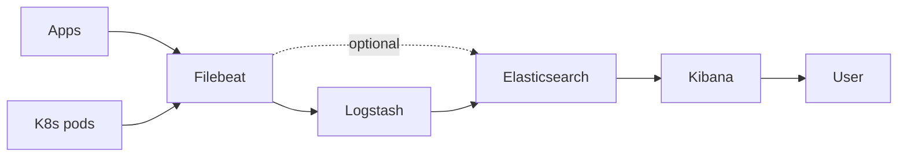
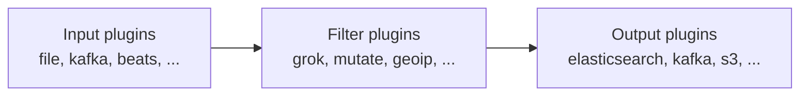

# Вопросы на собеседовании: `ELK Stack`

`ELK Stack` (теперь Elastic Stack) = **Elasticsearch + Logstash + Kibana** + **Beats**. Долго был стандартом для агрегации логов в enterprise. На интервью спрашивают: архитектуру, индексацию, ILM, парсинг, масштабирование и **OpenSearch** (форк от AWS после смены лицензии Elastic в 2021).

## Полезные ссылки

### Официальная документация и авторитетные источники

- [Elastic Stack Documentation](https://www.elastic.co/guide/en/elastic-stack/current/index.html)
- [Elasticsearch Reference](https://www.elastic.co/guide/en/elasticsearch/reference/current/index.html)
- [OpenSearch Documentation](https://opensearch.org/docs/)
- [Logstash Documentation](https://www.elastic.co/guide/en/logstash/current/index.html)
- [Kibana Documentation](https://www.elastic.co/guide/en/kibana/current/index.html)
- [Filebeat Reference](https://www.elastic.co/guide/en/beats/filebeat/current/index.html)

## Содержание

- [Полезные ссылки](#полезные-ссылки)
- [See also](#see-also)

**Базовые понятия**
- [Q1. (!) Что такое ELK Stack?](#q1--что-такое-elk-stack)
- [Q2. (!) Архитектура ELK для логов?](#q2--архитектура-elk-для-логов)
- [Q3. ELK vs EFK vs other stacks?](#q3-elk-vs-efk-vs-other-stacks)

**Elasticsearch**
- [Q4. (!) Что такое Elasticsearch?](#q4--что-такое-elasticsearch)
- [Q5. (!) Index, shards, replicas?](#q5--index-shards-replicas)
- [Q6. (!) Document, mapping, types?](#q6--document-mapping-types)
- [Q7. Cluster, nodes, master vs data?](#q7-cluster-nodes-master-vs-data)
- [Q8. (!) Inverted index — как работает?](#q8--inverted-index--как-работает)

**Logstash**
- [Q9. (!) Что такое Logstash?](#q9--что-такое-logstash)
- [Q10. Input, Filter, Output stages?](#q10-input-filter-output-stages)
- [Q11. Grok patterns для парсинга?](#q11-grok-patterns-для-парсинга)

**Beats**
- [Q12. (!) Filebeat, Metricbeat, Packetbeat?](#q12--filebeat-metricbeat-packetbeat)
- [Q13. Beats vs Logstash для shipping?](#q13-beats-vs-logstash-для-shipping)

**Kibana**
- [Q14. (!) Что такое Kibana?](#q14--что-такое-kibana)
- [Q15. KQL (Kibana Query Language)?](#q15-kql-kibana-query-language)
- [Q16. Dashboards, visualizations?](#q16-dashboards-visualizations)

**Index Management**
- [Q17. (!) ILM (Index Lifecycle Management)?](#q17--ilm-index-lifecycle-management)
- [Q18. Hot-Warm-Cold-Frozen architecture?](#q18-hot-warm-cold-frozen-architecture)
- [Q19. Index templates?](#q19-index-templates)

**Performance**
- [Q20. (!) Какие частые проблемы performance?](#q20--какие-частые-проблемы-performance)
- [Q21. Sharding strategy — как выбрать?](#q21-sharding-strategy--как-выбрать)

**OpenSearch**
- [Q22. (!) Что такое OpenSearch и почему появился?](#q22--что-такое-opensearch-и-почему-появился)
- [Q23. OpenSearch vs Elasticsearch differences?](#q23-opensearch-vs-elasticsearch-differences)

**Альтернативы**
- [Q24. (!) Loki vs ELK?](#q24--loki-vs-elk)
- [Q25. Когда выбрать ELK?](#q25-когда-выбрать-elk)
- [Q26. Какие частые ошибки в ELK production?](#q26-какие-частые-ошибки-в-elk-production)

## Q1. (!) Что такое ELK Stack?

(!) Что такое ELK Stack?

**ELK Stack** = **Elasticsearch + Logstash + Kibana**. Сейчас официально **Elastic Stack** (включая Beats и прочее).

**Компоненты:**
- **Elasticsearch** — распределённый поисковый движок, хранилище логов
- **Logstash** — pipeline для приёма (ingest) и трансформации логов
- **Kibana** — UI для поиска, визуализации и дашбордов
- **Beats** — лёгкие shippers (Filebeat, Metricbeat)

**Применения:**
- Агрегация логов (самое популярное)
- Поиск (e-commerce, базы знаний)
- Безопасность (SIEM — Elastic Security)
- APM (Application Performance Monitoring)
- Векторный поиск (embeddings)

В **2010-х** — безусловный стандарт для управления логами. В **2020-х** — конкурент **Loki, ClickHouse, OpenSearch**.

## Q2. (!) Архитектура ELK для логов?

(!) Архитектура ELK для логов?



**Поток:**
1. Приложения пишут логи → в файлы / stdout
2. **Filebeat** (sidecar / DaemonSet) читает логи
3. **Logstash** парсит и обогащает (опционально, можно пропустить)
4. **Elasticsearch** индексирует и хранит
5. **Kibana** выполняет запросы и визуализирует

**Опционально:**
- **Kafka** между Filebeat и Logstash (буфер)
- **Elastic Agent** (более новый) — заменяет Beats + Logstash

## Q3. ELK vs EFK vs other stacks?

ELK vs EFK vs other stacks?

**ELK** — Elasticsearch + Logstash + Kibana + Filebeat.
**EFK** — Elasticsearch + **Fluentd** + Kibana (популярен в K8s, более гибкий).
**EFLK** — добавляет Fluent Bit (лёгкий Fluentd).

**Прочие:**
- **PLG** — Promtail + Loki + Grafana (лёгкий, дешёвый)
- **OpenSearch + OpenSearch Dashboards** — форк ES
- **ClickHouse + Grafana** — экономичный по стоимости
- **SigNoz, Datadog, NewRelic** — коммерческий APM

В **K8s** — **Fluentd / Fluent Bit** популярнее, чем Filebeat (лучше экосистема).

## Q4. (!) Что такое Elasticsearch?

(!) Что такое Elasticsearch?

**Elasticsearch** — распределённый поисковый движок на базе **Apache Lucene**. Open-source (но лицензия сменилась в 2021).

**Особенности:**
- **Полнотекстовый поиск** — быстрый inverted index
- **Распределённость** — шардирование, репликация
- **Гибкая схема** — JSON-документы
- **REST API**
- **Real-time** — данные доступны для поиска почти сразу после индексации
- **Агрегации** — аналитические запросы

**Не только для логов:** это универсальный поисковый движок. Но **логирование** — основной сценарий использования.

## Q5. (!) Index, shards, replicas?

(!) Index, shards, replicas?

**Index** — пространство имён для документов (~ таблица в SQL).

```
my-logs-2025-04-19  (index)
├── shard-0 (primary) → node A
├── shard-0 (replica) → node B
├── shard-1 (primary) → node B
└── shard-1 (replica) → node C
```

**Shard** — физическое деление индекса. Распределяется по узлам.
- **Primary shard** — оригинал
- **Replica shard** — копия (для HA и масштабирования чтения)

**Число шардов выбирается при создании индекса** (поменять нельзя!). По умолчанию 1 (с ES 7+).

**Хорошая практика:**
- Размер шарда: 10–50 ГБ
- Реплик: 1 (одна копия)
- Не переусердствуйте с шардами (накладные расходы)

## Q6. (!) Document, mapping, types?

**Document** — JSON-запись.

```json
{
  "timestamp": "2025-04-19T14:30:00Z",
  "level": "ERROR",
  "service": "order-service",
  "message": "Failed to process order",
  "user_id": 12345
}
```

**Mapping** — схема (типы полей). Можно определить вручную или дать определить автоматически.

```json
{
  "properties": {
    "timestamp": {"type": "date"},
    "level": {"type": "keyword"},  // exact match
    "message": {"type": "text"},   // full-text search
    "user_id": {"type": "long"}
  }
}
```

**Types** — концепция удалена в ES 7+. Один тип на индекс.

## Q7. Cluster, nodes, master vs data?

**Cluster** — группа узлов (1+).

**Роли узлов:**
- **Master** — управляет состоянием кластера (минимум 3 master-eligible узла для HA)
- **Data** — хранит данные, выполняет запросы
- **Ingest** — конвейеры предобработки
- **Coordinating** — маршрутизирует запросы (без данных)
- **Machine learning**

**В продакшене:** 3+ выделенных master-узла, несколько data-узлов.

**Split-brain** — нужно `discovery.zen.minimum_master_nodes = (N/2 + 1)`.

## Q8. (!) Inverted index — как работает?

**Inverted index** — структура для **быстрого текстового поиска**.

**Forward index** (как в БД):
```
doc1 → "the cat sat"
doc2 → "the dog ran"
```

**Inverted index:**
```
"the" → [doc1, doc2]
"cat" → [doc1]
"dog" → [doc2]
"ran" → [doc2]
"sat" → [doc1]
```

**Поиск** "cat" → мгновенный lookup → [doc1].

Лежит в основе ES. Компромисс: **медленная запись**, **быстрое чтение**.

## Q9. (!) Что такое Logstash?

**Logstash** — серверный конвейер обработки данных. Ingest → transform → output.



**Конвейер на Ruby-подобном синтаксисе:**

```ruby
input {
  beats { port => 5044 }
}

filter {
  grok {
    match => { "message" => "%{IPORHOST:client} %{USER:user} \[%{HTTPDATE:time}\]" }
  }
  mutate {
    convert => { "duration_ms" => "integer" }
  }
  date {
    match => [ "time", "dd/MMM/yyyy:HH:mm:ss Z" ]
  }
}

output {
  elasticsearch {
    hosts => ["es-cluster:9200"]
    index => "logs-%{+YYYY.MM.dd}"
  }
}
```

**Тяжеловесный** (JVM, ~1 ГБ RAM). Из-за этого многие переходят на Fluent Bit (легче).

## Q10. Input, Filter, Output stages?

**Inputs** (50+):
- file, syslog, beats, kafka, http, tcp, udp, ...

**Filters** (50+):
- **grok** — парсинг по regex
- **mutate** — трансформация полей
- **date** — разбор временных меток
- **geoip** — IP → местоположение
- **useragent** — разбор User-Agent
- **json** — разбор JSON
- **ruby** — произвольный код на Ruby

**Outputs** (40+):
- elasticsearch, kafka, s3, file, http, ...

**Несколько конвейеров** в одном инстансе Logstash.

## Q11. Grok patterns для парсинга?

**Grok** — regex с именованными паттернами для структурированного парсинга.

```
%{IP:client} %{USER:user} \[%{HTTPDATE:timestamp}\] "%{WORD:method} %{URIPATH:path}" %{NUMBER:status:int} %{NUMBER:bytes:int}
```

**Результат:**
```json
{
  "client": "192.168.1.1",
  "user": "alice",
  "timestamp": "19/Apr/2025:14:30:00 +0000",
  "method": "GET",
  "path": "/api/orders",
  "status": 200,
  "bytes": 1024
}
```

**Готовые паттерны:** IP, USER, HTTPDATE, WORD, URIPATH, NUMBER, EMAILADDRESS и т. д.

**Инструменты:** Kibana Grok Debugger, [grokdebugger.com](https://grokdebugger.com/).

**Подвох:** grok медленный на больших объёмах логов. Лучше — **структурированное логирование из приложения** (JSON-логи), тогда парсинг не нужен.

## Q12. (!) Filebeat, Metricbeat, Packetbeat?

**Beats** — лёгкие shippers (написаны на Go, ~50 МБ RAM).

**Filebeat** — отгрузка лог-файлов. Самый популярный.
**Metricbeat** — системные / сервисные метрики (CPU, MySQL, nginx).
**Packetbeat** — анализатор сетевых протоколов.
**Auditbeat** — данные аудита (безопасность).
**Heartbeat** — мониторинг доступности (uptime).
**Functionbeat** — для AWS Lambda.
**Winlogbeat** — журналы событий Windows.

**Конфиг Filebeat:**

```yaml
filebeat.inputs:
  - type: filestream
    paths:
      - /var/log/*.log

output.elasticsearch:
  hosts: ["es-cluster:9200"]
  index: "logs-%{+yyyy.MM.dd}"
# Or output.logstash для processing
```

## Q13. Beats vs Logstash для shipping?

**Beats:**
- Лёгкий (50 МБ RAM)
- Узкоспециализированный
- Ограниченная трансформация

**Logstash:**
- Тяжёлый (JVM, 1 ГБ RAM)
- Мощная трансформация
- Множество плагинов

**Хорошая практика:** **Beats** на хостах для отгрузки → **Logstash** централизованно для трансформации → **ES**.

```
Apps → Filebeat (ship) → Kafka (buffer) → Logstash (transform) → Elasticsearch
```

В K8s — Fluent Bit / Fluentd часто заменяют **оба** компонента.

## Q14. (!) Что такое Kibana?

**Kibana** — веб-интерфейс для Elasticsearch.

**Возможности:**
- **Discover** — поиск и просмотр исходных документов
- **Dashboards** — сборка дашбордов из визуализаций
- **Visualize** — графики, таблицы, карты
- **Lens** — конструктор визуализаций drag-and-drop
- **Canvas** — кастомные презентации
- **Maps** — гео-визуализации
- **Machine Learning** — обнаружение аномалий (платно)
- **Security** — SIEM-возможности (платно)
- **APM** — мониторинг приложений
- **Alerting** — алерты по правилам

## Q15. KQL (Kibana Query Language)?

**KQL** — современный язык запросов Kibana (с 7.0+).

```
status:200
status:200 AND method:GET
status:200 OR status:201
NOT status:200
status >= 400 AND status < 500
message:"connection refused"
user_id:* (exists)
service:order-* (wildcard)
```

**Синтаксис запросов Lucene** (более старый) тоже поддерживается.

**Поиск через Kibana → REST API Elasticsearch**.

## Q16. Dashboards, visualizations?

**Типы визуализаций:**
- Линейный / area-график
- Столбчатая диаграмма
- Круговая диаграмма
- Таблица данных
- Gauge / метрика
- Heatmap (тепловая карта)
- Maps (гео)
- TSVB (временные ряды)

**Dashboards** — сетка из визуализаций.

**Хорошие практики:**
- Фильтры сверху (диапазон времени, окружение)
- RED-метрики (Rate, Errors, Duration)
- Drill-down (клик → фильтрация до подмножества)
- Не перегружайте (10–15 панелей максимум)

## Q17. (!) ILM (Index Lifecycle Management)?

**ILM** — автоматизация управления индексами на протяжении их жизненного цикла.

```
Hot phase (recent, frequent reads/writes)
  ↓ rollover after 50 GB or 7 days
Warm phase (less frequent, optimized)
  ↓ after 30 days
Cold phase (rare reads, cheap storage)
  ↓ after 90 days
Frozen phase (almost never accessed, very cheap)
  ↓ after 1 year
Delete
```

```json
{
  "policy": {
    "phases": {
      "hot": {
        "actions": {
          "rollover": {"max_size": "50gb", "max_age": "7d"}
        }
      },
      "warm": {
        "min_age": "30d",
        "actions": {
          "shrink": {"number_of_shards": 1},
          "forcemerge": {"max_num_segments": 1}
        }
      },
      "cold": {
        "min_age": "90d",
        "actions": {"freeze": {}}
      },
      "delete": {
        "min_age": "365d",
        "actions": {"delete": {}}
      }
    }
  }
}
```

**Оптимизация стоимости** — старые данные на более дешёвом хранилище.

## Q18. Hot-Warm-Cold-Frozen architecture?

**Hot-узлы** — быстрые диски (NVMe SSD), свежие индексы, высокий I/O.
**Warm-узлы** — медленнее SSD, индексы старше 7 дней.
**Cold-узлы** — HDD, монтируются из объектного хранилища (S3).
**Frozen-узлы** — searchable snapshots в S3 (очень дёшево).

```
Hot (50 GB): expensive node, $$$
Warm (1 TB): standard node, $$
Cold (10 TB): cheap node + S3, $
Frozen (100 TB): только S3, ¢
```

**Колоссальная экономия** для логов с долгим сроком хранения.

## Q19. Index templates?

**Template** — настройки и mappings, автоматически применяемые к новым индексам, совпадающим с паттерном.

```json
PUT _index_template/logs-template
{
  "index_patterns": ["logs-*"],
  "template": {
    "settings": {
      "number_of_shards": 3,
      "number_of_replicas": 1
    },
    "mappings": {
      "properties": {
        "timestamp": {"type": "date"},
        "level": {"type": "keyword"},
        "message": {"type": "text"}
      }
    }
  }
}
```

Когда создаётся новый индекс `logs-2025-04-19` → шаблон применяется автоматически.

## Q20. (!) Какие частые проблемы performance?

1. **Тяжёлые запросы** — wildcards, regex, агрегации на огромных индексах
2. **Mapping explosion** — слишком много полей (глубоко вложенные объекты)
3. **Слишком много шардов** — накладные расходы на состояние кластера
4. **Слишком мало шардов** — единственный шард перегружен, нет параллелизма
5. **Давление на heap** — затяжные паузы GC, OOM
6. **Медленный диск** — HDD под hot-данные
7. **Крупные документы** — индексация идёт медленно
8. **Нет bulk API** — вставка документов по одному медленная
9. **Репликация отстаёт** — слишком мало узлов под запись
10. **Cluster split-brain** — неверная конфигурация master-узлов

## Q21. Sharding strategy — как выбрать?

**Индексы по времени:** один индекс в день (`logs-2025-04-19`).
- Плюсы: простой retention (удалять старые индексы)
- Минусы: много мелких шардов при низком объёме

**По размеру** через ILM rollover (`logs-000001`, ...):
- Переключение, когда индекс достигает 50 ГБ / 7 дней
- Лучше для стабильного размера шарда

**Хорошие практики:**
- Размер шарда: **10–50 ГБ**
- 1 primary + 1 replica на шард
- На узел: < 600 шардов (heap-память)
- Для 100 ГБ/день и retention 30 дней → ~10 индексов × 5 шардов × 2 (реплика) = 100 шардов

## Q22. (!) Что такое OpenSearch и почему появился?

**OpenSearch** — форк Elasticsearch, создан **AWS** в **2021**.

**Почему:**
- Elastic сменил лицензию (Apache 2.0 → SSPL/Elastic License)
- Ограничил коммерческое использование в managed-сервисах
- AWS форкнул предыдущую версию под Apache 2.0 → OpenSearch

**OpenSearch поддерживают:**
- AWS, IBM, SAP, Logz.io и другие
- Управление под Linux Foundation (с 2024)

**Совместим** с API Elasticsearch (в основном), но расходится с ним.

## Q23. OpenSearch vs Elasticsearch differences?

| Критерий | OpenSearch | Elasticsearch |
|----------|------------|---------------|
| Лицензия | Apache 2.0 | Elastic License (ограничивает SaaS) |
| Вендор | AWS, Linux Foundation | Elastic |
| Совместимость API | В основном совместим | — |
| Платные фичи | Бесплатны в OpenSearch | Платны в Elastic |
| Плагины | Своя экосистема | Оригинальная |
| ML, безопасность, alerting | Бесплатно | Платно в Elastic |

**В 2025:**
- **Пользователям AWS** — OpenSearch Service
- **Self-hosted, open-source** — OpenSearch
- **Нужны платные фичи с поддержкой Elastic** — Elasticsearch
- Миграция legacy ES → OpenSearch — обычно проходит гладко

## Q24. (!) Loki vs ELK?

| Критерий | ELK | Loki |
|----------|-----|------|
| Архитектура | Индексирует всё | Индексирует только метки (labels) |
| Стоимость хранения | Высокая ($$$) | Низкая ($) |
| Скорость запросов | Быстрая (по индексу) | Медленнее (на основе grep) |
| Язык запросов | KQL / Lucene / DSL | LogQL (похож на PromQL) |
| Потребление ресурсов | Тяжёлое (JVM, много RAM) | Лёгкое (Go) |
| Сценарий | Поиск, аналитика | Только логи, дёшево |

**Философия Loki:** «хранить логи дёшево, дорого только grep во время запроса». В **10 раз дешевле** ELK при том же объёме.

В **2025** — Loki набирает популярность у команд, **экономящих на затратах**.

Подробнее — в [Loki + Grafana](loki-grafana-interview.md).

## Q25. Когда выбрать ELK?

**Выбирай ELK, когда:**
- Нужны **быстрые сложные запросы** по логам
- Важен полнотекстовый поиск
- Критичны агрегации (аналитические дашборды)
- Уже есть экосистема Elastic
- Нужны **APM, SIEM** в одном инструменте
- Нужен мощный язык запросов (KQL)
- Compliance / аудит (SIEM-возможности)

**Не выбирай, когда:**
- Чувствительность к стоимости (Loki / ClickHouse дешевле)
- Простой поиск по логам (хватит Loki)
- Не нужен весь набор фич
- Команда эксплуатации маленькая (ELK сложен в обслуживании)

## Q26. Какие частые ошибки в ELK production?

1. **Нет ILM** — индексы растут бесконечно → крах кластера
2. **Нет политики retention** — расходы выходят из-под контроля
3. **Кластер из одного узла** — провал в продакшене
4. **Heap по умолчанию** (1 ГБ) — OOM
5. **Слишком много шардов на узел** — давление на heap
6. **Конфликты mapping** — разные сервисы перезаписывают mappings
7. **Нет структурированных логов** — grok повсюду = медленно
8. **Нет бэкапов** — потеря данных при сбое
9. **Открытый доступ** — нет аутентификации (риск безопасности)
10. **Медленные запросы к hot-индексам** — влияют на индексацию
11. **Пропускная способность сети** — насыщена трафиком между узлами
12. **Заполнен диск** — кластер уходит в red, восстановления нет

**Хорошая практика:** ILM, выделенные master-узлы, мониторинг (да, мониторьте свой мониторинг), бэкапы.

## See also

- [OpenTelemetry](opentelemetry-interview.md) — modern standard
- [Loki + Grafana](loki-grafana-interview.md) — alternative для logs
- [Jaeger / Zipkin](jaeger-zipkin-interview.md) — для traces
- [Prometheus + Grafana](prometheus-grafana-interview.md) — для metrics
- [Elasticsearch](../databases/elasticsearch-interview.md) — deep dive в ES
- [Observability](observability-interview.md) — общая концепция
- [Logging](../logging/logging-interview.md) — application logging
- [Стратегии логирования](logging-strategies-interview.md) — best practices
- [Микросервисы](../architecture/microservices-interview.md) — где logs critical
- [Kubernetes](../devops/kubernetes-interview.md) — log shipping в K8s
- [Apache Kafka](../messaging/kafka-interview.md) — buffer для ingest
- [Application Security](../security/application-security-interview.md) — SIEM

- [Стратегии логирования](logging-strategies-interview.md)
- [Loki и Grafana](loki-grafana-interview.md)
- [Метрики и трейсинг](metrics-tracing-interview.md)
- [Observability](observability-interview.md)
- [OpenTelemetry](opentelemetry-interview.md)
- [Шпаргалка: ELK Stack](../../monitoring/logging/elk-stack.md) — теория
