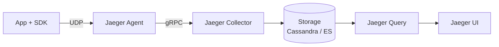
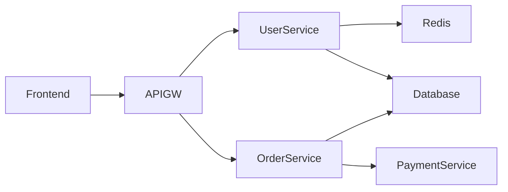

# Вопросы на собеседовании: `Jaeger и Zipkin`

**Jaeger** (CNCF, от Uber) и **Zipkin** (от Twitter) — основные open-source бэкенды для distributed tracing. Принимают spans, хранят, визуализируют. С появлением **OpenTelemetry** оба эволюционировали к OTLP. Альтернативы: **Tempo** (Grafana), **SigNoz**, vendor SaaS (Datadog, Honeycomb).

## Полезные ссылки

### Официальная документация и авторитетные источники

- [Jaeger Documentation](https://www.jaegertracing.io/docs/)
- [Zipkin Documentation](https://zipkin.io/)
- [Tempo Documentation (Grafana)](https://grafana.com/docs/tempo/)
- [Distributed Tracing in Practice (book)](https://www.oreilly.com/library/view/distributed-tracing-in/9781492056621/)
- [SigNoz Documentation](https://signoz.io/docs/)

## Содержание

- [Полезные ссылки](#полезные-ссылки)
- [See also](#see-also)

**Базовые понятия**
- [Q1. (!) Что такое distributed tracing?](#q1--что-такое-distributed-tracing)
- [Q2. (!) Span, trace, context — recap?](#q2--span-trace-context--recap)
- [Q3. Зачем нужен tracing backend?](#q3-зачем-нужен-tracing-backend)

**Jaeger**
- [Q4. (!) Что такое Jaeger?](#q4--что-такое-jaeger)
- [Q5. (!) Jaeger architecture (Agent, Collector, Query, UI)?](#q5--jaeger-architecture-agent-collector-query-ui)
- [Q6. (!) Storage backends (Cassandra, Elasticsearch, Kafka)?](#q6--storage-backends-cassandra-elasticsearch-kafka)
- [Q7. Jaeger v2 (с OTel)?](#q7-jaeger-v2-с-otel)

**Zipkin**
- [Q8. (!) Что такое Zipkin?](#q8--что-такое-zipkin)
- [Q9. Zipkin architecture?](#q9-zipkin-architecture)
- [Q10. (!) Jaeger vs Zipkin?](#q10--jaeger-vs-zipkin)

**Storage и scaling**
- [Q11. (!) Storage costs — почему traces дорогие?](#q11--storage-costs--почему-traces-дорогие)
- [Q12. Sampling strategies?](#q12-sampling-strategies)
- [Q13. Retention policies?](#q13-retention-policies)

**UI и querying**
- [Q14. (!) Jaeger UI — какие views?](#q14--jaeger-ui--какие-views)
- [Q15. Service map?](#q15-service-map)
- [Q16. Comparison view (compare traces)?](#q16-comparison-view-compare-traces)

**Альтернативы**
- [Q17. (!) Grafana Tempo?](#q17--grafana-tempo)
- [Q18. SigNoz, Aspecto, Lightstep?](#q18-signoz-aspecto-lightstep)
- [Q19. Cloud SaaS (Datadog APM, NewRelic, Honeycomb)?](#q19-cloud-saas-datadog-apm-newrelic-honeycomb)

**Migration / OpenTelemetry**
- [Q20. (!) Как migrate от Jaeger к OTel?](#q20--как-migrate-от-jaeger-к-otel)
- [Q21. Можно ли отправлять OTLP в Jaeger?](#q21-можно-ли-отправлять-otlp-в-jaeger)

**Production**
- [Q22. (!) Какой backend выбрать?](#q22--какой-backend-выбрать)
- [Q23. Какие частые проблемы?](#q23-какие-частые-проблемы)

## Q1. (!) Что такое distributed tracing?

(!) Что такое distributed tracing?

**Distributed tracing** — отслеживание запроса по мере того, как он проходит через **множество сервисов**.

```
User → API Gateway → Service A → Service B → Database
                  → Service C → Cache
```

Каждый шаг = **span**. Все spans одного запроса = **trace**.

**Зачем:**
- Где находится bottleneck? (медленный endpoint)
- Где запрос упал?
- Карта зависимостей между сервисами
- Планирование ёмкости (capacity planning)
- Разбивка latency по каждому сервису

## Q2. (!) Span, trace, context — recap?

**Trace** — все spans одного запроса (связаны через trace_id).
**Span** — одна операция (HTTP-вызов, DB-запрос, функция).
**Context** — идентификаторы (trace_id, span_id, parent_span_id, решение о sampling).

```
Trace abc123
├── Span 1 (root): GET /orders/123 (200ms total)
│   ├── Span 2: SELECT FROM orders (15ms)
│   ├── Span 3: SELECT FROM users (10ms)
│   └── Span 4: POST /payment (170ms)
│       └── Span 5: SELECT FROM accounts (5ms)
```

У spans есть **timestamps, duration, attributes, events, status**.

Подробнее — в [OpenTelemetry](opentelemetry-interview.md).

## Q3. Зачем нужен tracing backend?

**Приложения генерируют spans** → их нужно где-то хранить, запрашивать и визуализировать.

**Tracing backend** делает следующее:
- **Принимает** spans (через OTLP, Jaeger Thrift, Zipkin HTTP)
- **Индексирует** для быстрого поиска (по trace_id, сервису, времени, ...)
- **Хранит** в базе данных (Cassandra, Elasticsearch, ClickHouse)
- Предоставляет **Query** API
- Даёт **UI** для визуализации

**Без backend:** spans лежат в памяти приложения — теряются при рестарте.

## Q4. (!) Что такое Jaeger?

**Jaeger** — open-source платформа для distributed tracing от **Uber** (2017). Проект уровня **CNCF graduated** (2019).

**Особенности:**
- Вдохновлён статьёй Google Dapper
- Production-ready, масштабируется до миллионов spans/sec
- Несколько storage-бэкендов на выбор
- Богатый UI с картами сервисов
- Встроенная поддержка OpenTelemetry

**Сценарии:** distributed tracing для микросервисов, отладка latency, анализ зависимостей.

## Q5. (!) Jaeger architecture (Agent, Collector, Query, UI)?



**Компоненты:**

**Jaeger Agent** (deprecated в Jaeger v2):
- DaemonSet на хосте
- Принимает spans от приложений через UDP (низкий overhead)
- Пересылает в Collector

**Jaeger Collector:**
- Принимает spans (gRPC, HTTP, OTLP)
- Валидация, обработка
- Пишет в хранилище

**Jaeger Query:**
- Читает из хранилища
- Предоставляет REST/gRPC API

**Jaeger UI:**
- Веб-интерфейс
- Поиск, просмотр trace'ов, карта сервисов

**В Jaeger v2 (2024+)** — Agent **deprecated**. Приложения отправляют данные прямо в Collector через OTLP.

## Q6. (!) Storage backends (Cassandra, Elasticsearch, Kafka)?

| Backend | Плюсы | Минусы |
|---------|------|------|
| **Cassandra** | Высокий write-throughput, масштабируется | Сложная эксплуатация |
| **Elasticsearch** | Богатые возможности запросов | Прожорлив по памяти, дорогой |
| **OpenSearch** | То же, что и ES | То же, что и ES |
| **Kafka** | Буфер между Collector и хранилищем | Не постоянное хранилище |
| **ClickHouse** (Jaeger v2) | Быстрый, выгодный по цене | Интеграция новее |
| **Memory** | Быстрый старт, без настройки | Теряется при рестарте, только для dev |

**Production:** Cassandra или Elasticsearch (у большинства).

**В 2025** — растёт adoption **ClickHouse** (быстрее, дешевле).

## Q7. Jaeger v2 (с OTel)?

**Jaeger v2** (2024) — крупный переписанный релиз на базе OpenTelemetry Collector.

**Ключевые изменения:**
- Построен на фреймворке OTel Collector
- **Нет Jaeger Agent** (deprecated)
- **OTLP как нативный протокол**
- Проще добавлять receivers, processors, exporters
- Хранилище ClickHouse (лучше соотношение цена/производительность)

В **2025** Jaeger v2 — рекомендуемый. v1 — в maintenance mode.

## Q8. (!) Что такое Zipkin?

**Zipkin** — open-source система трассировки от **Twitter** (2012). Одна из первых популярных tracing-систем.

**Особенности:**
- Простая установка (single JAR)
- Инструментирование на базе HTTP
- B3 propagation headers (появились раньше W3C Trace Context)

**Статус в 2025:** разработка менее активная, чем у Jaeger. Многие проекты мигрировали на Jaeger / OTel.

## Q9. Zipkin architecture?

```
App (Brave / Zipkin libs) → HTTP/Kafka → Zipkin Server → Storage
                                                              ↓
                                                            UI
```

Проще, чем Jaeger:
- Один Zipkin Server (вместо раздельных Collector + Query)
- Хранилище: in-memory (по умолчанию), MySQL, Cassandra, Elasticsearch

**Brave** — Java-библиотека для инструментирования под Zipkin.

## Q10. (!) Jaeger vs Zipkin?

| Критерий | Jaeger | Zipkin |
|----------|--------|--------|
| Возраст | 2017 | 2012 |
| Создатель | Uber | Twitter |
| CNCF | Graduated | Нет |
| Активность | Активный | Maintenance |
| Хранилище | Cassandra, ES, ClickHouse | MySQL, Cassandra, ES |
| Протокол | gRPC, HTTP, OTLP | HTTP (B3) |
| UI | Современный, удобнее | Проще |
| Карта сервисов | Встроенная | Через DependencyLinker |
| Adoption | Выше (2025) | Ниже |

**В 2025** для новых проектов — **Jaeger** или **OTel + Tempo / SigNoz**. Zipkin — для legacy.

## Q11. (!) Storage costs — почему traces дорогие?

Каждый запрос → несколько spans → индексируются по trace_id, сервису, времени, атрибутам.

**1000 RPS × 10 spans/запрос × 1 KB/span = 10 MB/сек = 864 GB/день.**

**Стоимость хранения:** Cassandra/ES под терабайты — это большие $$$.

**Способы снизить:**
- **Sampling** (head + tail) — сокращение на 99%
- **Короткий retention** (7-30 дней вместо «вечно»)
- **Сжатие** spans
- **ClickHouse** вместо ES (в 10 раз дешевле для тех же данных)
- **Tail sampling** — оставлять важное (ошибки, медленные), отбрасывать обычное

В **2025** почти все системы сэмплируют до **1-10%** trace'ов.

## Q12. Sampling strategies?

**Head sampling** (в приложении):
- **Probabilistic** — случайные `1%`
- **Rate limiting** — не более 100 trace'ов/сек
- **Adaptive** — подстройка частоты сэмплирования под трафик

**Tail sampling** (в Collector):
- **Всегда сэмплировать ошибки** (status code 5xx)
- **Всегда сэмплировать медленные** (> 1 сек)
- **Сэмплировать 5% обычных**

**Комбинация** — лучший вариант для production.

```yaml
# Jaeger Collector adaptive sampling
adaptive_sampling:
  default_strategy:
    probabilistic_sampling:
      sampling_rate: 0.01  # 1% baseline
  per_service_strategies:
    - service: critical-service
      probabilistic_sampling:
        sampling_rate: 0.1  # 10% для critical
```

## Q13. Retention policies?

**Типичный retention:** 7-30 дней.

**Короче:** dev (1-3 дня).
**Дольше:** требования комплаенса (90 дней+).

**С учётом стоимости:**
- Hot storage (свежее, доступно для запросов): 7 дней
- Cold storage (в архиве, запросы дорогие): 30+ дней

Cassandra TTL, Elasticsearch ILM (Index Lifecycle Management) — автоматически чистят старые данные.

## Q14. (!) Jaeger UI — какие views?

**Search (поиск):**
- По сервису, операции, тегам
- По временному диапазону
- По минимальной длительности (поиск медленных)
- Лимит: количество trace'ов / период

**Trace view (просмотр trace'а):**
- Timeline всех spans
- Иерархия (parent-child)
- Детали span (attributes, logs, errors)

**Trace comparison (сравнение):**
- Сравнение двух trace'ов бок о бок
- Видны различия

**System architecture (архитектура системы):**
- Карта зависимостей между сервисами
- Генерируется автоматически из trace'ов

**Monitor (новое):**
- Статистика по сервисам (request rate, error rate, p95 latency) — RED-метрики

## Q15. Service map?

**Service dependency graph** — визуализация, автоматически построенная из trace'ов.



**Использование:**
- Визуализация архитектуры
- Поиск неожиданных зависимостей
- Выявление hot paths
- Обнаружение циклов

В Jaeger строится автоматически. В Datadog, Honeycomb — тоже.

## Q16. Comparison view (compare traces)?

Сравнение двух trace'ов (например, медленного и обычного):
- Видны различия в структуре spans
- Сравнение latency
- Поиск регрессии

Полезно для отладки производительности.

## Q17. (!) Grafana Tempo?

**Grafana Tempo** — tracing-бэкенд от Grafana. Серьёзный конкурент Jaeger.

**Особенности:**
- **На базе object storage** (S3, GCS, Azure Blob) — **очень дешёвое** хранилище
- **Оптимизирован по стоимости** под миллиарды spans
- Индексирует ТОЛЬКО trace_id (нет поиска по атрибутам, как в Jaeger)
- **В связке с Loki + Mimir** = полный стек Grafana
- OTel native

**Trade-off:**
- Плюсы: дёшево, масштабируемо
- Минусы: ограниченный поиск (нужен trace_id, а не поиск по атрибутам)

**Workflow:** Tempo + Loki — находишь лог с trace_id → ищешь trace в Tempo. **TraceQL** (с 2023) добавил язык запросов.

В **2025** Tempo популярен в экосистеме Grafana (Loki + Tempo + Mimir + Grafana).

## Q18. SigNoz, Aspecto, Lightstep?

**SigNoz** — open-source полноценный APM (traces + metrics + logs). На базе ClickHouse. Self-hosted альтернатива Datadog. Растущая популярность.

**Aspecto** — managed-платформа на OTel (ориентирована на разработчиков).

**Lightstep** (куплен ServiceNow в 2021) — трассировка уровня enterprise.

**Honeycomb** — пионер «wide events», мощный язык запросов. Парадигма, отличная от традиционного APM.

## Q19. Cloud SaaS (Datadog APM, NewRelic, Honeycomb)?

| Vendor | Плюсы | Минусы |
|--------|------|------|
| **Datadog** | Полный APM, интеграции, UI | **Дорого** (~$30/host) |
| **New Relic** | Оплата за объём ingest, проще | Меньше возможностей |
| **Honeycomb** | Лучший UX для исследования данных | Менее отполированный GUI |
| **Splunk APM** | Enterprise, много возможностей | Дорого |
| **AWS X-Ray** | Дёшево, если только AWS | Ограниченный функционал |

**Плюсы SaaS:**
- Нет эксплуатации (ops)
- Отполированный UI
- Авто-корреляция traces ↔ logs ↔ metrics
- Алертинг

**Минусы SaaS:**
- **Очень дорого** на масштабе
- Vendor lock-in (но OTel его снизил)
- Данные уходят за пределы вашего окружения

В **2025** тренд: **OTel + self-hosted (Tempo, SigNoz)** ради снижения затрат. **Гибрид:** сэмплированные данные в Datadog ради UX, полные данные — в self-hosted.

## Q20. (!) Как migrate от Jaeger к OTel?

**До:** Jaeger client SDK в коде.

```java
import io.jaegertracing.Tracer;
Tracer tracer = new Configuration("my-service").getTracer();
```

**После:** OTel SDK + OTLP exporter в Jaeger Collector (который принимает OTLP).

```java
import io.opentelemetry.api.trace.Tracer;
Tracer tracer = GlobalOpenTelemetry.getTracer("my-service");
```

**Шаги:**
1. Заменить Jaeger client SDK на OTel SDK
2. Настроить OTel exporter на OTLP endpoint
3. Настроить Jaeger Collector на приём OTLP (нативно в v2)
4. Убедиться, что trace'ы отображаются корректно

**Auto-instrumentation:** Java-agent заменяет библиотеки Jaeger.

## Q21. Можно ли отправлять OTLP в Jaeger?

**Да!** Jaeger Collector принимает OTLP (gRPC + HTTP) нативно (начиная с Jaeger v1.35+).

```yaml
# Apps export OTLP
exporters:
  otlp:
    endpoint: jaeger-collector:4317

# Jaeger Collector listens на OTLP
```

В **Jaeger v2** OTLP — **нативный протокол**. Никакого overhead на конвертацию.

## Q22. (!) Какой backend выбрать?

**Дерево решений:**

```
Бюджет ограничен, want self-host?
  → Jaeger v2 + ClickHouse (best balance)
  → или Tempo + S3 (cheapest)
  → или SigNoz (full APM, single tool)

Already Grafana stack?
  → Tempo + Loki + Mimir + Grafana

Want full APM, ready to pay?
  → Datadog (best UI, most integrations)
  → Honeycomb (best query exploration)

Vendor-lock-in OK?
  → Cloud-native (X-Ray, Cloud Trace, Application Insights)

Legacy Zipkin already?
  → Stay or migrate к Jaeger v2
```

**В 2025** для новых проектов:
- **Self-host:** Jaeger v2 (зрелый) или SigNoz (набирает обороты)
- **SaaS:** Datadog (отполированность) или Honeycomb (UX)

## Q23. Какие частые проблемы?

1. **Взрывной рост хранилища** — без sampling быстро уходишь в терабайты
2. **Медленные запросы** — Jaeger UI тормозит на больших датасетах
3. **Пропавшие spans** — сломан context propagation (особенно в async)
4. **Несогласованные атрибуты** — разные сервисы используют разные имена
5. **Нет алертинга** — у самого Jaeger нет алертинга (нужен Prometheus + метрики по trace'ам)
6. **Hot partitions** в Cassandra — неудачный partition key
7. **Высокая кардинальность** убивает производительность
8. **Нет tail sampling** в production — слишком много данных
9. **Retention старых данных** — забыли выставить TTL
10. **Сетевая полоса** — отправка всех trace'ов → дорого

## See also

- [OpenTelemetry](opentelemetry-interview.md) — современный стандарт
- [Loki + Grafana](loki-grafana-interview.md) — для логов
- [ELK Stack](elk-stack-interview.md) — альтернатива для логов
- [Prometheus + Grafana](prometheus-grafana-interview.md) — для метрик
- [Observability](observability-interview.md) — общая концепция
- [Метрики и трейсинг](metrics-tracing-interview.md) — базовые понятия
- [Микросервисы](../architecture/microservices-interview.md) — где трассировка критична
- [Kubernetes](../devops/kubernetes-interview.md) — Jaeger в K8s
- [Cloud-native Patterns](../cloud/cloud-native-patterns-interview.md) — столп observability
- [Cassandra](../databases/cassandra-interview.md) — хранилище Jaeger
- [Elasticsearch](../databases/elasticsearch-interview.md) — хранилище Jaeger
- [Performance Testing](../performance/performance-testing-interview.md) — найти медленные пути

- [Стратегии логирования](logging-strategies-interview.md)
- [Loki и Grafana](loki-grafana-interview.md)
- [Метрики и трейсинг](metrics-tracing-interview.md)
- [Observability](observability-interview.md)
- [OpenTelemetry](opentelemetry-interview.md)
