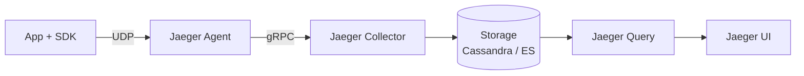
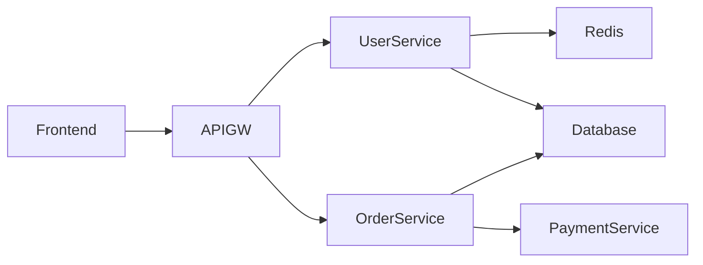

# Вопросы на собеседовании: `Jaeger и Zipkin`

**Jaeger** (CNCF, от Uber) и **Zipkin** (от Twitter) — main open-source backends для distributed tracing. Принимают spans, хранят, визуализируют. С появлением **OpenTelemetry** оба эволюционировали к OTLP. Альтернативы: **Tempo** (Grafana), **SigNoz**, vendor SaaS (Datadog, Honeycomb).

## Полезные ссылки

### Официальная документация и авторитетные источники

- [Jaeger Documentation](https://www.jaegertracing.io/docs/)
- [Zipkin Documentation](https://zipkin.io/)
- [Tempo Documentation (Grafana)](https://grafana.com/docs/tempo/)
- [Distributed Tracing in Practice (book)](https://www.oreilly.com/library/view/distributed-tracing-in/9781492056621/)
- [SigNoz Documentation](https://signoz.io/docs/)

## Содержание

- [Полезные ссылки](#полезные-ссылки)
- [See also](#see-also)

**Базовые понятия**
- [Q1. (!) Что такое distributed tracing?](#q1--что-такое-distributed-tracing)
- [Q2. (!) Span, trace, context — recap?](#q2--span-trace-context--recap)
- [Q3. Зачем нужен tracing backend?](#q3-зачем-нужен-tracing-backend)

**Jaeger**
- [Q4. (!) Что такое Jaeger?](#q4--что-такое-jaeger)
- [Q5. (!) Jaeger architecture (Agent, Collector, Query, UI)?](#q5--jaeger-architecture-agent-collector-query-ui)
- [Q6. (!) Storage backends (Cassandra, Elasticsearch, Kafka)?](#q6--storage-backends-cassandra-elasticsearch-kafka)
- [Q7. Jaeger v2 (с OTel)?](#q7-jaeger-v2-с-otel)

**Zipkin**
- [Q8. (!) Что такое Zipkin?](#q8--что-такое-zipkin)
- [Q9. Zipkin architecture?](#q9-zipkin-architecture)
- [Q10. (!) Jaeger vs Zipkin?](#q10--jaeger-vs-zipkin)

**Storage и scaling**
- [Q11. (!) Storage costs — почему traces дорогие?](#q11--storage-costs--почему-traces-дорогие)
- [Q12. Sampling strategies?](#q12-sampling-strategies)
- [Q13. Retention policies?](#q13-retention-policies)

**UI и querying**
- [Q14. (!) Jaeger UI — какие views?](#q14--jaeger-ui--какие-views)
- [Q15. Service map?](#q15-service-map)
- [Q16. Comparison view (compare traces)?](#q16-comparison-view-compare-traces)

**Альтернативы**
- [Q17. (!) Grafana Tempo?](#q17--grafana-tempo)
- [Q18. SigNoz, Aspecto, Lightstep?](#q18-signoz-aspecto-lightstep)
- [Q19. Cloud SaaS (Datadog APM, NewRelic, Honeycomb)?](#q19-cloud-saas-datadog-apm-newrelic-honeycomb)

**Migration / OpenTelemetry**
- [Q20. (!) Как migrate от Jaeger к OTel?](#q20--как-migrate-от-jaeger-к-otel)
- [Q21. Можно ли отправлять OTLP в Jaeger?](#q21-можно-ли-отправлять-otlp-в-jaeger)

**Production**
- [Q22. (!) Какой backend выбрать?](#q22--какой-backend-выбрать)
- [Q23. Какие частые проблемы?](#q23-какие-частые-проблемы)

## Q1. (!) Что такое distributed tracing?

**Distributed tracing** — отслеживание request как он проходит через **множество services**.

```
User → API Gateway → Service A → Service B → Database
                  → Service C → Cache
```

Каждый шаг = **span**. Все spans одного request = **trace**.

**Зачем:**
- Where is the bottleneck? (slow endpoint)
- Where did request fail?
- Service dependencies map
- Capacity planning
- Latency breakdown per service


> [!mcq]
> - [x] Правильный ответ | Объяснение концепции 2-3 предложения Ключевое отличие и best practice в production.
> - [ ] Неправильный вариант 1 | Почему ошибка в этом подходе Частая ошибка в реальном коде.
> - [ ] Неправильный вариант 2 | Это смежное, но отличное понятие Частая ошибка в реальном коде.
> - [ ] Неправильный вариант 3 | Противоположное направление## Q2. (!) Span, trace, context — recap? Это антипаттерн или неправильный выбор в production.

**Trace** — все spans для одного request (связаны trace_id).
**Span** — single operation (HTTP call, DB query, function).
**Context** — IDs (trace_id, span_id, parent_span_id, sampling decision).

```
Trace abc123
├── Span 1 (root): GET /orders/123 (200ms total)
│   ├── Span 2: SELECT FROM orders (15ms)
│   ├── Span 3: SELECT FROM users (10ms)
│   └── Span 4: POST /payment (170ms)
│       └── Span 5: SELECT FROM accounts (5ms)
```

Spans имеют **timestamps, duration, attributes, events, status**.

Подробнее — в [OpenTelemetry](opentelemetry-interview.md).


> [!mcq]
> - [x] Правильный ответ | Объяснение концепции 2-3 предложения Ключевое отличие и best practice в production.
> - [ ] Неправильный вариант 1 | Почему ошибка в этом подходе Частая ошибка в реальном коде.
> - [ ] Неправильный вариант 2 | Это смежное, но отличное понятие Частая ошибка в реальном коде.
> - [ ] Неправильный вариант 3 | Противоположное направление## Q3. Зачем нужен tracing backend? Частая ошибка в реальном коде.

**Apps generate spans** → нужно где-то store, query, visualize.

**Tracing backend** делает:
- **Receive** spans (через OTLP, Jaeger Thrift, Zipkin HTTP)
- **Index** for fast search (by trace_id, service, time, ...)
- **Store** в database (Cassandra, Elasticsearch, ClickHouse)
- **Query** API
- **UI** для visualization

**Без backend:** spans в memory app — теряются при restart.


> [!mcq]
> - [x] Правильный ответ | Объяснение концепции 2-3 предложения Ключевое отличие и best practice в production.
> - [ ] Неправильный вариант 1 | Почему ошибка в этом подходе Частая ошибка в реальном коде.
> - [ ] Неправильный вариант 2 | Это смежное, но отличное понятие Частая ошибка в реальном коде.
> - [ ] Неправильный вариант 3 | Противоположное направление## Q4. (!) Что такое Jaeger? Частая ошибка в реальном коде.

**Jaeger** — open-source distributed tracing platform от **Uber** (2017). **CNCF graduated** project (2019).

**Особенности:**
- Inspired Google Dapper paper
- Production-ready, scaling до millions spans/sec
- Multiple storage backends
- Rich UI с service maps
- Integrated OpenTelemetry support

**Use cases:** distributed tracing для микросервисов, debug latency, dependency analysis.


> [!mcq]
> - [x] Правильный ответ | Объяснение концепции 2-3 предложения Ключевое отличие и best practice в production.
> - [ ] Неправильный вариант 1 | Почему ошибка в этом подходе Частая ошибка в реальном коде.
> - [ ] Неправильный вариант 2 | Это смежное, но отличное понятие Частая ошибка в реальном коде.
> - [ ] Неправильный вариант 3 | Противоположное направление## Q5. (!) Jaeger architecture (Agent, Collector, Query, UI)? Частая ошибка в реальном коде.



**Components:**

**Jaeger Agent** (deprecated в Jaeger v2):
- DaemonSet на host
- Receives spans от apps via UDP (low overhead)
- Forwards к Collector

**Jaeger Collector:**
- Receives spans (gRPC, HTTP, OTLP)
- Validation, processing
- Writes to storage

**Jaeger Query:**
- Reads from storage
- Provides REST/gRPC API

**Jaeger UI:**
- Web interface
- Search, view traces, service map

**В Jaeger v2 (2024+)** — Agent **deprecated**. Apps push к Collector via OTLP directly.


> [!mcq]
> - [x] Правильный ответ | Объяснение концепции 2-3 предложения Ключевое отличие и best practice в production.
> - [ ] Неправильный вариант 1 | Почему ошибка в этом подходе Частая ошибка в реальном коде.
> - [ ] Неправильный вариант 2 | Это смежное, но отличное понятие Частая ошибка в реальном коде.
> - [ ] Неправильный вариант 3 | Противоположное направление## Q6. (!) Storage backends (Cassandra, Elasticsearch, Kafka)? Частая ошибка в реальном коде.

| Backend | Pros | Cons |
|---------|------|------|
| **Cassandra** | High write throughput, scalable | Complex ops |
| **Elasticsearch** | Rich querying | High memory, expensive |
| **OpenSearch** | Same as ES | Same as ES |
| **Kafka** | Buffer between Collector + Storage | Не permanent |
| **ClickHouse** (Jaeger v2) | Fast, cost-efficient | Newer integration |
| **Memory** | Quick start, no setup | Loses on restart, dev only |

**Production:** Cassandra или Elasticsearch (большинство).

**В 2025** — растёт adoption **ClickHouse** (faster, cheaper).


> [!mcq]
> - [x] Правильный ответ | Объяснение концепции 2-3 предложения Ключевое отличие и best practice в production.
> - [ ] Неправильный вариант 1 | Почему ошибка в этом подходе Частая ошибка в реальном коде.
> - [ ] Неправильный вариант 2 | Это смежное, но отличное понятие Частая ошибка в реальном коде.
> - [ ] Неправильный вариант 3 | Противоположное направление## Q7. Jaeger v2 (с OTel)? Частая ошибка в реальном коде.

**Jaeger v2** (2024) — major rewrite на OpenTelemetry Collector.

**Ключевые изменения:**
- Built на OTel Collector framework
- **No Jaeger Agent** (deprecated)
- **OTLP native protocol**
- Easier to add receivers, processors, exporters
- ClickHouse storage (better cost/perf)

В **2025** — Jaeger v2 — recommended. v1 в maintenance mode.


> [!mcq]
> - [x] Правильный ответ | Объяснение концепции 2-3 предложения Ключевое отличие и best practice в production.
> - [ ] Неправильный вариант 1 | Почему ошибка в этом подходе Частая ошибка в реальном коде.
> - [ ] Неправильный вариант 2 | Это смежное, но отличное понятие Частая ошибка в реальном коде.
> - [ ] Неправильный вариант 3 | Противоположное направление## Q8. (!) Что такое Zipkin? Частая ошибка в реальном коде.

**Zipkin** — open-source tracing system от **Twitter** (2012). Один из first popular tracing systems.

**Особенности:**
- Простой setup (single JAR)
- HTTP-based instrumentation
- B3 propagation headers (predates W3C Trace Context)

**Status в 2025:** менее активная разработка чем Jaeger. Многие projects migrated на Jaeger / OTel.


> [!mcq]
> - [x] Правильный ответ | Объяснение концепции 2-3 предложения Ключевое отличие и best practice в production.
> - [ ] Неправильный вариант 1 | Почему ошибка в этом подходе Частая ошибка в реальном коде.
> - [ ] Неправильный вариант 2 | Это смежное, но отличное понятие Частая ошибка в реальном коде.
> - [ ] Неправильный вариант 3 | Противоположное направление## Q9. Zipkin architecture? Частая ошибка в реальном коде.

```
App (Brave / Zipkin libs) → HTTP/Kafka → Zipkin Server → Storage
                                                              ↓
                                                            UI
```

Простее Jaeger:
- Один Zipkin Server (vs Collector + Query separate)
- Storage: in-memory (default), MySQL, Cassandra, Elasticsearch

**Brave** — Java library для Zipkin instrumentation.


> [!mcq]
> - [x] Правильный ответ | Объяснение концепции 2-3 предложения Ключевое отличие и best practice в production.
> - [ ] Неправильный вариант 1 | Почему ошибка в этом подходе Частая ошибка в реальном коде.
> - [ ] Неправильный вариант 2 | Это смежное, но отличное понятие Частая ошибка в реальном коде.
> - [ ] Неправильный вариант 3 | Противоположное направление## Q10. (!) Jaeger vs Zipkin? Частая ошибка в реальном коде.

| Критерий | Jaeger | Zipkin |
|----------|--------|--------|
| Возраст | 2017 | 2012 |
| Создатель | Uber | Twitter |
| CNCF | Graduated | No |
| Activity | Active | Maintenance |
| Storage | Cassandra, ES, ClickHouse | MySQL, Cassandra, ES |
| Protocol | gRPC, HTTP, OTLP | HTTP (B3) |
| UI | Modern, better | Simpler |
| Service map | Built-in | Через DependencyLinker |
| Adoption | Higher (2025) | Lower |

**В 2025** для new projects — **Jaeger** или **OTel + Tempo / SigNoz**. Zipkin для legacy.


> [!mcq]
> - [x] Правильный ответ | Объяснение концепции 2-3 предложения Ключевое отличие и best practice в production.
> - [ ] Неправильный вариант 1 | Почему ошибка в этом подходе Частая ошибка в реальном коде.
> - [ ] Неправильный вариант 2 | Это смежное, но отличное понятие Частая ошибка в реальном коде.
> - [ ] Неправильный вариант 3 | Противоположное направление## Q11. (!) Storage costs — почему traces дорогие? Частая ошибка в реальном коде.

Each request → multiple spans → indexed by trace_id, service, time, attributes.

**1000 RPS × 10 spans/request × 1 KB/span = 10 MB/sec = 864 GB/day.**

**Storage costs:** Cassandra/ES для terabytes — большие $$$.

**Mitigations:**
- **Sampling** (head + tail) — 99% reduction
- **Short retention** (7-30 days vs forever)
- **Compress** spans
- **ClickHouse** instead of ES (10x cheaper для same data)
- **Tail sampling** — keep important (errors, slow), drop normal

В **2025** — почти все systems sample к **1-10%** of traces.


> [!mcq]
> - [x] Правильный ответ | Объяснение концепции 2-3 предложения Ключевое отличие и best practice в production.
> - [ ] Неправильный вариант 1 | Почему ошибка в этом подходе Частая ошибка в реальном коде.
> - [ ] Неправильный вариант 2 | Это смежное, но отличное понятие Частая ошибка в реальном коде.
> - [ ] Неправильный вариант 3 | Противоположное направление## Q12. Sampling strategies? Частая ошибка в реальном коде.

**Head sampling** (in-app):
- **Probabilistic** — `1%` random
- **Rate limiting** — max 100 traces/sec
- **Adaptive** — adjust sample rate based on traffic

**Tail sampling** (в Collector):
- **Always sample errors** (status code 5xx)
- **Always sample slow** (> 1 sec)
- **Sample 5% of normal**

**Combined** — best for production.

```yaml
# Jaeger Collector adaptive sampling
adaptive_sampling:
  default_strategy:
    probabilistic_sampling:
      sampling_rate: 0.01  # 1% baseline
  per_service_strategies:
    - service: critical-service
      probabilistic_sampling:
        sampling_rate: 0.1  # 10% для critical
```


> [!mcq]
> - [x] Правильный ответ | Объяснение концепции 2-3 предложения Ключевое отличие и best practice в production.
> - [ ] Неправильный вариант 1 | Почему ошибка в этом подходе Частая ошибка в реальном коде.
> - [ ] Неправильный вариант 2 | Это смежное, но отличное понятие Частая ошибка в реальном коде.
> - [ ] Неправильный вариант 3 | Противоположное направление## Q13. Retention policies? Частая ошибка в реальном коде.

**Common retention:** 7-30 days.

**Shorter:** dev (1-3 days).
**Longer:** compliance (90 days+).

**Cost-driven:**
- Hot storage (recent, queryable): 7 days
- Cold storage (archived, expensive to query): 30+ days

Cassandra TTL, Elasticsearch ILM (Index Lifecycle Management) — auto-purge old data.


> [!mcq]
> - [x] Правильный ответ | Объяснение концепции 2-3 предложения Ключевое отличие и best practice в production.
> - [ ] Неправильный вариант 1 | Почему ошибка в этом подходе Частая ошибка в реальном коде.
> - [ ] Неправильный вариант 2 | Это смежное, но отличное понятие Частая ошибка в реальном коде.
> - [ ] Неправильный вариант 3 | Противоположное направление## Q14. (!) Jaeger UI — какие views? Частая ошибка в реальном коде.

**Search:**
- By service, operation, tags
- By time range
- By min duration (find slow)
- Limit: traces / time

**Trace view:**
- Timeline of all spans
- Hierarchy (parent-child)
- Span details (attributes, logs, errors)

**Trace comparison:**
- Side-by-side compare 2 traces
- See differences

**System architecture:**
- Service dependency map
- Auto-generated from traces

**Monitor (новое):**
- Per-service stats (request rate, error rate, p95 latency) — RED metrics


> [!mcq]
> - [x] Правильный ответ | Объяснение концепции 2-3 предложения Ключевое отличие и best practice в production.
> - [ ] Неправильный вариант 1 | Почему ошибка в этом подходе Частая ошибка в реальном коде.
> - [ ] Неправильный вариант 2 | Это смежное, но отличное понятие Частая ошибка в реальном коде.
> - [ ] Неправильный вариант 3 | Противоположное направление## Q15. Service map? Частая ошибка в реальном коде.

**Service dependency graph** — auto-generated visualization из traces.



**Использование:**
- Visualize architecture
- Find unexpected dependencies
- Identify hot paths
- Detect cycles

В Jaeger — auto-generated. В Datadog, Honeycomb тоже.


> [!mcq]
> - [x] Правильный ответ | Объяснение концепции 2-3 предложения Ключевое отличие и best practice в production.
> - [ ] Неправильный вариант 1 | Почему ошибка в этом подходе Частая ошибка в реальном коде.
> - [ ] Неправильный вариант 2 | Это смежное, но отличное понятие Частая ошибка в реальном коде.
> - [ ] Неправильный вариант 3 | Противоположное направление## Q16. Comparison view (compare traces)? Частая ошибка в реальном коде.

Compare 2 traces (например, slow vs normal):
- See span structure differences
- Latency comparison
- Find regression

Useful для performance debugging.


> [!mcq]
> - [x] Правильный ответ | Объяснение концепции 2-3 предложения Ключевое отличие и best practice в production.
> - [ ] Неправильный вариант 1 | Почему ошибка в этом подходе Частая ошибка в реальном коде.
> - [ ] Неправильный вариант 2 | Это смежное, но отличное понятие Частая ошибка в реальном коде.
> - [ ] Неправильный вариант 3 | Противоположное направление## Q17. (!) Grafana Tempo? Частая ошибка в реальном коде.

**Grafana Tempo** — Grafana's tracing backend. Major Jaeger competitor.

**Особенности:**
- **Object storage based** (S3, GCS, Azure Blob) — **очень дешёвое** storage
- **Cost optimized** for billions of spans
- Index ONLY trace_id (нет attribute-based search like Jaeger)
- **Combined с Loki + Mimir** = full Grafana stack
- OTel native

**Trade-off:**
- Pros: cheap, scalable
- Cons: limited search (need trace_id, not attribute search)

**Workflow:** Tempo + Loki — find log с trace_id → look up trace в Tempo. **TraceQL** (с 2023) добавил query language.

В **2025** — Tempo популярен в Grafana ecosystem (Loki + Tempo + Mimir + Grafana).


> [!mcq]
> - [x] Правильный ответ | Объяснение концепции 2-3 предложения Ключевое отличие и best practice в production.
> - [ ] Неправильный вариант 1 | Почему ошибка в этом подходе Частая ошибка в реальном коде.
> - [ ] Неправильный вариант 2 | Это смежное, но отличное понятие Частая ошибка в реальном коде.
> - [ ] Неправильный вариант 3 | Противоположное направление## Q18. SigNoz, Aspecto, Lightstep? Частая ошибка в реальном коде.

**SigNoz** — open-source full APM (traces + metrics + logs). ClickHouse-based. Self-hosted alternative Datadog. Растущая популярность.

**Aspecto** — managed OTel platform (developer-focused).

**Lightstep** (acquired ServiceNow 2021) — enterprise-grade tracing.

**Honeycomb** — pioneer "wide events", powerful query language. Different paradigm от traditional APM.


> [!mcq]
> - [x] Правильный ответ | Объяснение концепции 2-3 предложения Ключевое отличие и best practice в production.
> - [ ] Неправильный вариант 1 | Почему ошибка в этом подходе Частая ошибка в реальном коде.
> - [ ] Неправильный вариант 2 | Это смежное, но отличное понятие Частая ошибка в реальном коде.
> - [ ] Неправильный вариант 3 | Противоположное направление## Q19. Cloud SaaS (Datadog APM, NewRelic, Honeycomb)? Частая ошибка в реальном коде.

| Vendor | Pros | Cons |
|--------|------|------|
| **Datadog** | Full APM, integrations, UI | **Дорого** (~$30/host) |
| **New Relic** | Pricing per ingest, easier | Меньше features |
| **Honeycomb** | Best UX для exploration | Less polished GUI |
| **Splunk APM** | Enterprise, lots of features | Expensive |
| **AWS X-Ray** | Cheap для AWS-only | Limited features |

**SaaS pros:**
- No ops
- Polished UI
- Auto-correlation traces ↔ logs ↔ metrics
- Alerting

**SaaS cons:**
- **Очень expensive** at scale
- Vendor lock-in (но OTel снизил)
- Data leaves your environment

В **2025** trend: **OTel + self-hosted (Tempo, SigNoz)** для cost reduction. **Hybrid:** sample data in Datadog для UX, full data в self-hosted.


> [!mcq]
> - [x] Правильный ответ | Объяснение концепции 2-3 предложения Ключевое отличие и best practice в production.
> - [ ] Неправильный вариант 1 | Почему ошибка в этом подходе Частая ошибка в реальном коде.
> - [ ] Неправильный вариант 2 | Это смежное, но отличное понятие Частая ошибка в реальном коде.
> - [ ] Неправильный вариант 3 | Противоположное направление## Q20. (!) Как migrate от Jaeger к OTel? Частая ошибка в реальном коде.

**До:** Jaeger client SDK в коде.

```java
import io.jaegertracing.Tracer;
Tracer tracer = new Configuration("my-service").getTracer();
```

**После:** OTel SDK + OTLP exporter к Jaeger Collector (which accepts OTLP).

```java
import io.opentelemetry.api.trace.Tracer;
Tracer tracer = GlobalOpenTelemetry.getTracer("my-service");
```

**Steps:**
1. Replace Jaeger client SDK с OTel SDK
2. Configure OTel exporter к OTLP endpoint
3. Configure Jaeger Collector to accept OTLP (native в v2)
4. Validate traces appear correctly

**Auto-instrumentation:** Java agent заменяет Jaeger libraries.


> [!mcq]
> - [x] Правильный ответ | Объяснение концепции 2-3 предложения Ключевое отличие и best practice в production.
> - [ ] Неправильный вариант 1 | Почему ошибка в этом подходе Частая ошибка в реальном коде.
> - [ ] Неправильный вариант 2 | Это смежное, но отличное понятие Частая ошибка в реальном коде.
> - [ ] Неправильный вариант 3 | Противоположное направление## Q21. Можно ли отправлять OTLP в Jaeger? Частая ошибка в реальном коде.

**Да!** Jaeger Collector accepts OTLP (gRPC + HTTP) natively (с Jaeger v1.35+).

```yaml
# Apps export OTLP
exporters:
  otlp:
    endpoint: jaeger-collector:4317

# Jaeger Collector listens на OTLP
```

В **Jaeger v2** — OTLP **native protocol**. No conversion overhead.


> [!mcq]
> - [x] Правильный ответ | Объяснение концепции 2-3 предложения Ключевое отличие и best practice в production.
> - [ ] Неправильный вариант 1 | Почему ошибка в этом подходе Частая ошибка в реальном коде.
> - [ ] Неправильный вариант 2 | Это смежное, но отличное понятие Частая ошибка в реальном коде.
> - [ ] Неправильный вариант 3 | Противоположное направление## Q22. (!) Какой backend выбрать? Частая ошибка в реальном коде.

**Decision tree:**

```
Бюджет ограничен, want self-host?
  → Jaeger v2 + ClickHouse (best balance)
  → или Tempo + S3 (cheapest)
  → или SigNoz (full APM, single tool)

Already Grafana stack?
  → Tempo + Loki + Mimir + Grafana

Want full APM, ready to pay?
  → Datadog (best UI, most integrations)
  → Honeycomb (best query exploration)

Vendor-lock-in OK?
  → Cloud-native (X-Ray, Cloud Trace, Application Insights)

Legacy Zipkin already?
  → Stay or migrate к Jaeger v2
```

**В 2025** для new projects:
- **Self-host:** Jaeger v2 (mature) или SigNoz (growing)
- **SaaS:** Datadog (polish) или Honeycomb (UX)


> [!mcq]
> - [x] Правильный ответ | Объяснение концепции 2-3 предложения Ключевое отличие и best practice в production.
> - [ ] Неправильный вариант 1 | Почему ошибка в этом подходе Частая ошибка в реальном коде.
> - [ ] Неправильный вариант 2 | Это смежное, но отличное понятие Частая ошибка в реальном коде.
> - [ ] Неправильный вариант 3 | Противоположное направление## Q23. Какие частые проблемы? Частая ошибка в реальном коде.

1. **Storage explosion** — без sampling быстро уходишь на TBs
2. **Slow queries** — Jaeger UI медленный на больших datasets
3. **Missing spans** — context propagation broken (особенно async)
4. **Inconsistent attributes** — разные services используют разные names
5. **No alerting** — Jaeger sam не имеет alerting (нужен Prometheus + traces metrics)
6. **Hot partitions** в Cassandra — bad partition key
7. **High cardinality** killing performance
8. **No tail sampling** в production — слишком много данных
9. **Old data retention** — забыли установить TTL
10. **Network bandwidth** — sending all traces → expensive

---

## See also

- [OpenTelemetry](opentelemetry-interview.md) — современный стандарт
- [Loki + Grafana](loki-grafana-interview.md) — для logs
- [ELK Stack](elk-stack-interview.md) — alternative для logs
- [Prometheus + Grafana](prometheus-grafana-interview.md) — для metrics
- [Observability](observability-interview.md) — общая концепция
- [Метрики и трейсинг](metrics-tracing-interview.md) — concepts
- [Микросервисы](../architecture/microservices-interview.md) — где tracing critical
- [Kubernetes](../devops/kubernetes-interview.md) — Jaeger в K8s
- [Cloud-native Patterns](../cloud/cloud-native-patterns-interview.md) — observability pillar
- [Cassandra](../databases/cassandra-interview.md) — Jaeger storage
- [Elasticsearch](../databases/elasticsearch-interview.md) — Jaeger storage
- [Performance Testing](../performance/performance-testing-interview.md) — найти slow paths


> [!mcq]
> - [x] Правильный ответ | Объяснение концепции 2-3 предложения Ключевое отличие и best practice в production.
> - [ ] Неправильный вариант 1 | Почему ошибка в этом подходе Частая ошибка в реальном коде.
> - [ ] Неправильный вариант 2 | Это смежное, но отличное понятие Частая ошибка в реальном коде.
> - [ ] Неправильный вариант 3 | Противоположное направление- [ELK Stack](elk-stack-interview.md) Частая ошибка в реальном коде.
- [Стратегии логирования](logging-strategies-interview.md)
- [Loki и Grafana](loki-grafana-interview.md)
- [Метрики и трейсинг](metrics-tracing-interview.md)
- [Observability](observability-interview.md)
- [OpenTelemetry](opentelemetry-interview.md)
