# Вопросы на собеседовании: Стратегии логирования

Комплексное руководство по вопросам собеседования на тему стратегий логирования для `Senior Java Developer`.

Дата последнего обновления: 2026-04-13

## Полезные ссылки

### Официальная документация

- [SLF4J](https://www.slf4j.org/)
- [Logback Documentation](https://logback.qos.ch/documentation.html)
- [Spring Boot Logging Reference](https://docs.spring.io/spring-boot/reference/features/logging.html)
- [Logstash Logback Encoder](https://github.com/logfellow/logstash-logback-encoder)
- [OpenTelemetry Java](https://opentelemetry.io/docs/languages/java/)
- [Introduction to Java Logging](https://www.baeldung.com/java-logging-intro) — обзор фреймворков логирования в Java
- [Send the Logs of a Java App to the Elastic Stack (ELK)](https://www.baeldung.com/java-application-logs-to-elastic-stack) — отправка логов в ELK
- [Structured Logging in Spring Boot](https://www.baeldung.com/spring-boot-structured-logging) — структурированные логи в Spring Boot
- [An Introduction to ELK Stack](https://www.baeldung.com/ops/elk) — введение в ELK Stack

## Содержание

- [Полезные ссылки](#полезные-ссылки)
- [Роль документа в связке interview](#роль-документа-в-связке-interview)
- [See also](#see-also)

**Основы стратегий логирования**
- [Q1. (!) Что такое стратегия логирования и из чего она состоит?](#q1-что-такое-стратегия-логирования-и-из-чего-она-состоит)
- [Q2. Как выбрать уровни логирования по окружению (dev vs prod)?](#q2-как-выбрать-уровни-логирования-по-окружению-dev-vs-prod)
- [Q19. Как настроить логирование по компонентам (пакетам)?](#q19-как-настроить-логирование-по-компонентам-пакетам)
- [Q25. (!) Как выбрать стратегию логирования для нового микросервиса?](#q25-как-выбрать-стратегию-логирования-для-нового-микросервиса)

**Структурированное логирование и формат**
- [Q3. (!) Что такое структурированное логирование (JSON) и когда его применять?](#q3-что-такое-структурированное-логирование-json-и-когда-его-применять)
- [Q11. Как обеспечить консистентность формата логов в микросервисах?](#q11-как-обеспечить-консистентность-формата-логов-в-микросервисах)
- [Q17. Как логировать исключения правильно (stack trace, контекст)?](#q17-как-логировать-исключения-правильно-stack-trace-контекст)
- [Q18. Что такое Markers в SLF4J/Logback и когда их использовать?](#q18-что-такое-markers-в-slf4jlogback-и-когда-их-использовать)
- [Q26. Что такое структурированное логирование и зачем JSON?](#q26-что-такое-структурированное-логирование-и-зачем-json)

**Correlation ID и трассировка**
- [Q5. (!) Что такое correlation id и как его использовать в микросервисах?](#q5-что-такое-correlation-id-и-как-его-использовать-в-микросервисах)
- [Q6. Как связать логи с распределённой трассировкой (traceId, spanId)?](#q6-как-связать-логи-с-распределённой-трассировкой-traceid-spanid)
- [Q7. (!) Что такое MDC и как его применять в многопоточном коде?](#q7-что-такое-mdc-и-как-его-применять-в-многопоточном-коде)
- [Q29. Что такое correlation ID и зачем он в логах?](#q29-что-такое-correlation-id-и-зачем-он-в-логах)
- [Q30. Как связать логи с метриками и трейсами для расследования?](#q30-как-связать-логи-с-метриками-и-трейсами-для-расследования)

**Ротация, хранение и агрегация**
- [Q4. Как организовать ротацию и хранение лог-файлов?](#q4-как-организовать-ротацию-и-хранение-лог-файлов)
- [Q12. (!) Что такое log aggregation и зачем он нужен?](#q12-что-такое-log-aggregation-и-зачем-он-нужен)
- [Q13. (!) Как интегрировать логи с ELK (Elasticsearch, Logstash, Kibana)?](#q13-как-интегрировать-логи-с-elk-elasticsearch-logstash-kibana)
- [Q16. Что такое retention политика для логов и как её задать?](#q16-что-такое-retention-политика-для-логов-и-как-её-задать)
- [Q24. Что такое централизованное логирование и какие риски?](#q24-что-такое-централизованное-логирование-и-какие-риски)
- [Q27. Как организовать ротацию и хранение логов?](#q27-как-организовать-ротацию-и-хранение-логов)

**Безопасность и оптимизация**
- [Q8. Как не логировать чувствительные данные (пароли, токены)?](#q8-как-не-логировать-чувствительные-данные-пароли-токены)
- [Q9. Что такое log sampling и когда его применять?](#q9-что-такое-log-sampling-и-когда-его-применять)
- [Q10. Как уменьшить объём логов от сторонних библиотек?](#q10-как-уменьшить-объём-логов-от-сторонних-библиотек)
- [Q20. Как не раздувать логи при высокой нагрузке?](#q20-как-не-раздувать-логи-при-высокой-нагрузке)
- [Q28. Как не логировать чувствительные данные (PII, пароли)?](#q28-как-не-логировать-чувствительные-данные-pii-пароли)

**Асинхронность, реактивность и интеграция**
- [Q14. Что такое асинхронный аппендер и когда его использовать?](#q14-что-такое-асинхронный-аппендер-и-когда-его-использовать)
- [Q15. Как логировать в реактивных стеках (WebFlux, Project Reactor)?](#q15-как-логировать-в-реактивных-стеках-webflux-project-reactor)
- [Q21. Что такое audit log и чем он отличается от application log?](#q21-что-такое-audit-log-и-чем-он-отличается-от-application-log)
- [Q22. Как логировать в многопоточном и асинхронном коде?](#q22-как-логировать-в-многопоточном-и-асинхронном-коде)
- [Q23. Как интегрировать логи с метриками (Micrometer, Prometheus)?](#q23-как-интегрировать-логи-с-метриками-micrometer-prometheus)

**Kubernetes, Loki и продвинутые темы**
- [Q31. Как собирать логи в Kubernetes с Fluentd / Fluent Bit?](#q31-как-собирать-логи-в-kubernetes-с-fluentd--fluent-bit)
- [Q32. Что такое Grafana Loki и чем он отличается от ELK?](#q32-что-такое-grafana-loki-и-чем-он-отличается-от-elk)
- [Q33. Как динамически менять уровень логирования без рестарта (Actuator, JMX)?](#q33-как-динамически-менять-уровень-логирования-без-рестарта-actuator-jmx)
- [Q34. Как реализовать rate-limiting логов при шторме ошибок?](#q34-как-реализовать-rate-limiting-логов-при-шторме-ошибок)
- [Q35. Как связать distributed tracing с логами через traceId в OpenTelemetry?](#q35-как-связать-distributed-tracing-с-логами-через-traceid-в-opentelemetry)
- [Q36. Как логировать производительность (performance logging) без деградации?](#q36-как-логировать-производительность-performance-logging-без-деградации)
- [Q37. Как соблюдать GDPR при логировании (PII, маскирование, аудит)?](#q37-как-соблюдать-gdpr-при-логировании-pii-маскирование-аудит)
- [Q38. Как тестировать стратегию логирования в Spring Boot?](#q38-как-тестировать-стратегию-логирования-в-spring-boot)

## Роль документа в связке interview

Этот файл фокусируется на стратегии: как выбирать формат логов, политику хранения, sampling, безопасность и стоимость.
Для инструментальных вопросов и быстрых «как настроить» используйте [файл по логированию](../logging/logging-interview.md).
Для связи логов с метриками и трейсами смотрите [Метрики и трейсинг](metrics-tracing-interview.md) и [Observability](observability-interview.md).

## Как отвечать на вопросы про logging strategy

Хороший ответ обычно состоит из трёх частей: **когда применять**, **какой trade-off**, **как проверять в проде**.
Для проверки называйте конкретику: p95 latency сервиса, объём логов/день, доля потерянных логов, время расследования инцидента.

## Стратегии и уровни

## Q1. (!) Что такое стратегия логирования и из чего она состоит?

Стратегия логирования — набор решений: какие события логировать, на каком уровне (`DEBUG`, `INFO`, `WARN`, `ERROR`); куда писать (консоль, файл, `ELK`); формат (текст, `JSON`); контекст (correlation id, `traceId`); ротация и retention; маскирование чувствительных данных.

Состоит из:
- **Уровни по пакетам/окружению** — что логировать в dev vs prod
- **Формат вывода** — текст для разработки, `JSON` для prod
- **Назначение** — файлы, stdout, агрегация
- **Политика хранения** — retention, sampling при высокой нагрузке
- **Контекст** — `MDC`, correlation id, `traceId`
- **Безопасность** — маскирование PII, паролей, токенов

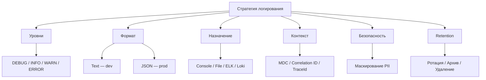

**Практика:** зафиксировать в `README` или в отдельном документе: уровни по умолчанию для prod (`INFO / WARN`); формат (`JSON` в prod); список полей в структурированном логе (service, `traceId`, timestamp, level, message); правила маскирования (пароли, токены); retention по окружениям. При онбординге разработчик получает единый конфиг `Logback` и соглашения по именованию сообщений.

## Q2. Как выбрать уровни логирования по окружению (dev vs prod)?

В dev: чаще `DEBUG` или `INFO` для детальной отладки; вывод в консоль; можно человекочитаемый формат. В prod: `INFO` или `WARN` по умолчанию; `JSON` для парсинга и минимизация объёма для снижения затрат и шума.

Конфигурация `Spring Boot` через `application.yml`:

```yaml
# application-dev.yml
logging:
  level:
    root: INFO
    com.myapp: DEBUG
    org.springframework: INFO
    org.hibernate.SQL: DEBUG
  pattern:
    console: "%d{HH:mm:ss.SSS} [%thread] %-5level %logger{36} - %msg%n"

# application-prod.yml
logging:
  level:
    root: WARN
    com.myapp: INFO
    org.springframework: WARN
    org.hibernate: WARN
```

В `logback-spring.xml` — разделение по профилю:

```xml
<configuration>
    <springProfile name="dev">
        <root level="DEBUG">
            <appender-ref ref="CONSOLE" />
        </root>
    </springProfile>

    <springProfile name="prod">
        <root level="INFO">
            <appender-ref ref="JSON_FILE" />
        </root>
        <logger name="org.springframework" level="WARN" />
        <logger name="org.hibernate" level="WARN" />
    </springProfile>
</configuration>
```

В [Spring Boot](../frameworks/spring/spring-boot-interview.md) профили активируются через `spring.profiles.active` или переменную окружения `SPRING_PROFILES_ACTIVE`.

## Q3. (!) Что такое структурированное логирование (JSON) и когда его применять?

Структурированное логирование — запись полей в машиночитаемом формате (`JSON`), а не в виде одной строки. Плюсы: удобный поиск и агрегация в `ELK`, `Loki`; фильтрация по полям; связь с метриками.

Пример нестуктурированного лога:

```
2026-04-11 10:15:32 INFO  OrderService - Order created: orderId=12345, userId=67890
```

Тот же лог в структурированном `JSON` формате:

```json
{
  "@timestamp": "2026-04-11T10:15:32.456Z",
  "level": "INFO",
  "logger": "com.myapp.service.OrderService",
  "message": "Order created",
  "service": "order-service",
  "traceId": "abc123def456",
  "spanId": "789xyz",
  "orderId": 12345,
  "userId": 67890,
  "env": "prod"
}
```

Настройка в `logback-spring.xml` с `LogstashEncoder`:

```xml
<configuration>
    <appender name="JSON_CONSOLE" class="ch.qos.logback.core.ConsoleAppender">
        <encoder class="net.logstash.logback.encoder.LogstashEncoder">
            <customFields>
                {"service":"order-service","env":"${SPRING_PROFILES_ACTIVE}"}
            </customFields>
            <includeMdcKeyName>traceId</includeMdcKeyName>
            <includeMdcKeyName>spanId</includeMdcKeyName>
            <includeMdcKeyName>correlationId</includeMdcKeyName>
        </encoder>
    </appender>

    <springProfile name="prod">
        <root level="INFO">
            <appender-ref ref="JSON_CONSOLE" />
        </root>
    </springProfile>
</configuration>
```

Зависимость в `build.gradle`:

```groovy
implementation 'net.logstash.logback:logstash-logback-encoder:7.4'
```

Применять в prod при централизованном сборе логов. В dev можно оставить текстовый формат для читаемости.

## Q4. Как организовать ротацию и хранение лог-файлов?

Ротация — смена файла по размеру или времени (`RollingFileAppender` в `Logback`).

Конфигурация `logback-spring.xml` с ротацией:

```xml
<appender name="ROLLING_FILE" class="ch.qos.logback.core.rolling.RollingFileAppender">
    <file>/var/log/myapp/application.log</file>

    <rollingPolicy class="ch.qos.logback.core.rolling.SizeAndTimeBasedRollingPolicy">
        <!-- Ротация по дате и размеру -->
        <fileNamePattern>/var/log/myapp/application.%d{yyyy-MM-dd}.%i.log.gz</fileNamePattern>
        <!-- Максимальный размер одного файла -->
        <maxFileSize>100MB</maxFileSize>
        <!-- Сколько дней хранить -->
        <maxHistory>30</maxHistory>
        <!-- Общий лимит на все файлы -->
        <totalSizeCap>3GB</totalSizeCap>
    </rollingPolicy>

    <encoder class="net.logstash.logback.encoder.LogstashEncoder" />
</appender>
```

Хранение: на диске узла с ограничением по месту; отправка в центральное хранилище (`ELK`, `Loki`, облако) с последующим удалением локальных файлов. `Retention` в агрегаторе задаётся отдельно (индексы `Elasticsearch`, политики в `Loki`).

В [Docker](../devops/docker-interview.md) и [Kubernetes](../devops/kubernetes-interview.md) приложение пишет в stdout, а сбором логов занимается платформа (`Fluentd`, `Filebeat` как DaemonSet).

## Q5. (!) Что такое correlation id и как его использовать в микросервисах?

`Correlation ID` — уникальный идентификатор запроса, передаваемый по всей цепочке вызовов (от шлюза до всех микросервисов). В логах каждого сервиса записывается один и тот же id; в агрегаторе можно отфильтровать все логи по одному запросу.

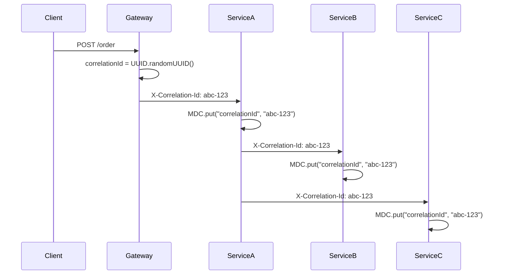

Реализация фильтра для `Spring Boot`:

```java
@Component
@Order(Ordered.HIGHEST_PRECEDENCE)
public class CorrelationIdFilter extends OncePerRequestFilter {

    private static final String CORRELATION_HEADER = "X-Correlation-Id";

    @Override
    protected void doFilterInternal(HttpServletRequest request,
                                     HttpServletResponse response,
                                     FilterChain chain) throws ServletException, IOException {
        String correlationId = request.getHeader(CORRELATION_HEADER);
        if (correlationId == null || correlationId.isBlank()) {
            correlationId = UUID.randomUUID().toString();
        }

        MDC.put("correlationId", correlationId);
        response.setHeader(CORRELATION_HEADER, correlationId);

        try {
            chain.doFilter(request, response);
        } finally {
            MDC.remove("correlationId");
        }
    }
}
```

Передача при вызове другого сервиса через `RestClient`:

```java
@Configuration
public class RestClientConfig {

    @Bean
    public RestClient restClient(RestClient.Builder builder) {
        return builder
            .requestInterceptor((request, body, execution) -> {
                String correlationId = MDC.get("correlationId");
                if (correlationId != null) {
                    request.getHeaders().set("X-Correlation-Id", correlationId);
                }
                return execution.execute(request, body);
            })
            .build();
    }
}
```

## Q6. Как связать логи с распределённой трассировкой (traceId, spanId)?

`OpenTelemetry` и `Micrometer Tracing` (замена `Sleuth` в `Spring Boot 3`) автоматически добавляют `traceId` и `spanId` в `MDC`. При использовании структурированного логирования эти поля попадают в каждую запись.

Конфигурация `Spring Boot 3` + `Micrometer Tracing`:

```yaml
# application.yml
management:
  tracing:
    sampling:
      probability: 1.0  # 100% сэмплирование для dev, снизить в prod

logging:
  pattern:
    # traceId и spanId автоматически в MDC
    console: "%d{HH:mm:ss.SSS} [%thread] [%X{traceId:-},%X{spanId:-}] %-5level %logger{36} - %msg%n"
```

Зависимости в `build.gradle`:

```groovy
implementation 'io.micrometer:micrometer-tracing-bridge-otel'
implementation 'io.opentelemetry:opentelemetry-exporter-otlp'
```

В `ELK` или `Grafana` можно перейти от трейса к логам по `traceId` и наоборот. Подробнее о трассировке в [Метрики и трейсинг](metrics-tracing-interview.md).

## Q7. (!) Что такое MDC и как его применять в многопоточном коде?

`MDC` (`Mapped Diagnostic Context`) — потоковая карта ключ-значение, доступная логгеру при записи. Используют для `correlationId`, `traceId`, `userId`.

Базовое использование `MDC`:

```java
@Slf4j
public class OrderService {

    public void processOrder(String orderId, String userId) {
        MDC.put("orderId", orderId);
        MDC.put("userId", userId);
        try {
            log.info("Processing order");        // orderId и userId попадут в лог
            validateOrder(orderId);
            log.info("Order validated");
        } finally {
            MDC.clear();                         // обязательно очищать
        }
    }
}
```

В многопоточном коде `MDC` привязан к потоку и не копируется автоматически. Решение — `TaskDecorator`:

```java
@Component
public class MdcTaskDecorator implements TaskDecorator {

    @Override
    public Runnable decorate(Runnable runnable) {
        // Захватываем MDC-контекст в вызывающем потоке
        Map<String, String> contextMap = MDC.getCopyOfContextMap();
        return () -> {
            try {
                if (contextMap != null) {
                    MDC.setContextMap(contextMap);  // Восстанавливаем в рабочем потоке
                }
                runnable.run();
            } finally {
                MDC.clear();
            }
        };
    }
}

@Configuration
@EnableAsync
public class AsyncConfig {

    @Bean
    public Executor taskExecutor(MdcTaskDecorator decorator) {
        ThreadPoolTaskExecutor executor = new ThreadPoolTaskExecutor();
        executor.setCorePoolSize(5);
        executor.setMaxPoolSize(10);
        executor.setTaskDecorator(decorator);   // Применяем декоратор
        executor.initialize();
        return executor;
    }
}
```

В `logback-spring.xml` добавляем поля `MDC` в паттерн:

```xml
<pattern>%d{ISO8601} [%thread] [%X{correlationId}] [%X{userId}] %-5level %logger{36} - %msg%n</pattern>
```

С `LogstashEncoder` все ключи `MDC` попадают в `JSON` автоматически.

## Q8. Как не логировать чувствительные данные (пароли, токены)?

Подходы:

1. **Не передавать** чувствительные данные в лог — логировать только факт («авторизация выполнена»)
2. **Маскирование** — кастомный `PatternLayout` в `Logback`
3. **Структурированные поля** — не включать чувствительные ключи
4. **Код-ревью и линтеры** — проверять паттерны

Кастомный `Converter` для маскирования в `Logback`:

```java
public class MaskingConverter extends ClassicConverter {

    private static final Pattern CARD_PATTERN =
        Pattern.compile("\\b(\\d{4})\\d{8,12}(\\d{4})\\b");
    private static final Pattern TOKEN_PATTERN =
        Pattern.compile("(token|password|secret|apiKey)=([^\\s,}]+)", Pattern.CASE_INSENSITIVE);

    @Override
    public String convert(ILoggingEvent event) {
        String message = event.getFormattedMessage();
        message = CARD_PATTERN.matcher(message).replaceAll("$1****$2");
        message = TOKEN_PATTERN.matcher(message).replaceAll("$1=***");
        return message;
    }
}
```

Подключение в `logback-spring.xml`:

```xml
<configuration>
    <conversionRule conversionWord="maskedMsg"
                    converterClass="com.myapp.logging.MaskingConverter" />

    <appender name="CONSOLE" class="ch.qos.logback.core.ConsoleAppender">
        <encoder>
            <pattern>%d{ISO8601} %-5level %logger{36} - %maskedMsg%n</pattern>
        </encoder>
    </appender>
</configuration>
```

## Q9. Что такое log sampling и когда его применять?

`Log sampling` — запись только части сообщений (например, каждый 100-й `DEBUG` или 1% запросов) для снижения объёма при высокой нагрузке.

Кастомный `TurboFilter` в `Logback` для сэмплирования:

```java
public class SamplingTurboFilter extends TurboFilter {

    private int sampleRate = 100;  // логировать каждый N-й
    private final AtomicLong counter = new AtomicLong();

    @Override
    public FilterReply decide(Marker marker, Logger logger,
                               Level level, String format,
                               Object[] params, Throwable t) {
        // ERROR и WARN всегда записываем
        if (level.isGreaterOrEqual(Level.WARN)) {
            return FilterReply.NEUTRAL;
        }
        // DEBUG/INFO — сэмплируем
        if (counter.incrementAndGet() % sampleRate == 0) {
            return FilterReply.NEUTRAL;
        }
        return FilterReply.DENY;
    }

    public void setSampleRate(int sampleRate) {
        this.sampleRate = sampleRate;
    }
}
```

```xml
<configuration>
    <turboFilter class="com.myapp.logging.SamplingTurboFilter">
        <sampleRate>100</sampleRate>
    </turboFilter>
</configuration>
```

Применять когда полный объём логов не нужен или слишком дорог (хранилище, `ELK`). Риск: пропуск важных событий; комбинировать с гарантированной записью `ERROR` и выборочным `INFO`.

## Q10. Как уменьшить объём логов от сторонних библиотек?

В `logback-spring.xml` задают уровень по имени пакета:

```xml
<configuration>
    <!-- Свой код — INFO (DEBUG при отладке) -->
    <logger name="com.myapp" level="INFO" />

    <!-- Spring Framework — только предупреждения -->
    <logger name="org.springframework" level="WARN" />
    <logger name="org.springframework.web" level="WARN" />

    <!-- Hibernate — только ошибки и SQL при отладке -->
    <logger name="org.hibernate" level="WARN" />
    <logger name="org.hibernate.SQL" level="WARN" />

    <!-- Apache HTTP Client -->
    <logger name="org.apache.http" level="WARN" />

    <!-- Netty -->
    <logger name="io.netty" level="WARN" />

    <!-- Kafka -->
    <logger name="org.apache.kafka" level="WARN" />

    <root level="INFO">
        <appender-ref ref="CONSOLE" />
    </root>
</configuration>
```

Эквивалент в `application.yml` для [Spring Boot](../frameworks/spring/spring-boot-interview.md):

```yaml
logging:
  level:
    root: INFO
    com.myapp: INFO
    org.springframework: WARN
    org.hibernate: WARN
    org.apache.kafka: WARN
    io.netty: WARN
```

В prod по умолчанию оставлять `WARN` для сторонних библиотек, поднимать уровень только при отладке.

## Q11. Как обеспечить консистентность формата логов в микросервисах?

Единый формат достигается через общий конфиг или шаблон.

Пример общей `JSON`-схемы для всех сервисов:

```json
{
  "@timestamp": "ISO8601",
  "level": "INFO|WARN|ERROR|DEBUG",
  "logger": "fully.qualified.ClassName",
  "message": "Human-readable message",
  "service": "order-service",
  "version": "1.2.3",
  "env": "prod",
  "traceId": "hex-string",
  "spanId": "hex-string",
  "correlationId": "uuid",
  "userId": "optional",
  "stack_trace": "optional, only for errors"
}
```

Подходы к распространению конфига:

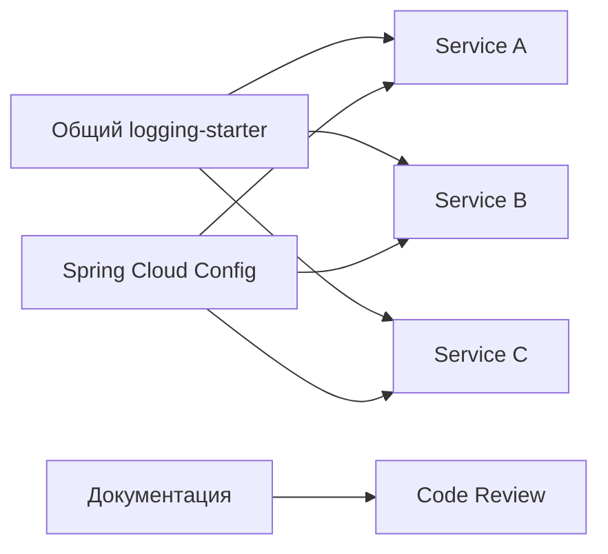

1. **Общий Spring Boot Starter** — артефакт с `logback-spring.xml` и `LogstashEncoder`
2. **Spring Cloud Config** — единый конфиг для всех сервисов
3. **Документированные соглашения** — имена полей, уровни для типовых событий
4. **Code Review** — проверка соответствия стандарту

## Q12. (!) Что такое log aggregation и зачем он нужен?

`Log aggregation` — сбор логов со всех узлов в единое хранилище для централизованного поиска, анализа и мониторинга.

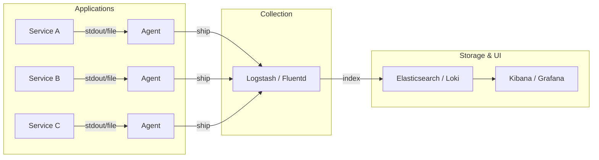

Основные стеки:
- **ELK** (`Elasticsearch` + `Logstash` + `Kibana`) — классика, мощный полнотекстовый поиск
- **PLG** (`Promtail` + `Loki` + `Grafana`) — легковеснее, индексирует только метки
- **Облачные** — `CloudWatch`, `Datadog`, `Splunk`

Агенты (`Filebeat`, `Fluentd`, `Promtail`) или прямой вывод приложения отправляют логи в агрегатор. Подробнее о связи с метриками в [Метрики и трейсинг](metrics-tracing-interview.md).

## Q13. (!) Как интегрировать логи с ELK (Elasticsearch, Logstash, Kibana)?

Полный пайплайн от приложения до дашборда:

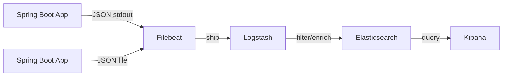

Конфигурация `Filebeat` (`filebeat.yml`):

```yaml
filebeat.inputs:
  - type: container
    paths:
      - /var/lib/docker/containers/*/*.log
    processors:
      - decode_json_fields:
          fields: ["message"]
          target: ""
          overwrite_keys: true

output.logstash:
  hosts: ["logstash:5044"]
```

Конфигурация `Logstash` (pipeline):

```ruby
input {
  beats {
    port => 5044
  }
}

filter {
  # Парсинг JSON если не распарсен Filebeat
  if ![level] {
    json {
      source => "message"
    }
  }

  # Добавление geo-данных, обогащение
  mutate {
    remove_field => ["agent", "ecs", "host"]
  }
}

output {
  elasticsearch {
    hosts => ["elasticsearch:9200"]
    index => "logs-%{[service]}-%{+YYYY.MM.dd}"
  }
}
```

Альтернативный подход — **Loki** (легче для `Kubernetes`):

```yaml
# promtail-config.yml
server:
  http_listen_port: 9080

clients:
  - url: http://loki:3100/loki/api/v1/push

scrape_configs:
  - job_name: containers
    static_configs:
      - targets: [localhost]
        labels:
          job: app-logs
          __path__: /var/log/myapp/*.log
    pipeline_stages:
      - json:
          expressions:
            level: level
            service: service
            traceId: traceId
      - labels:
          level:
          service:
```

Рекомендация: приложение пишет в stdout (`JSON`), сбор — агентом для гибкости и отказоустойчивости.

## Q14. Что такое асинхронный аппендер и когда его использовать?

Асинхронный аппендер — запись логов в буфер, отдельный поток сбрасывает буфер в целевой аппендер (файл, сеть). Снижает задержку в потоке приложения.

```xml
<configuration>
    <appender name="FILE" class="ch.qos.logback.core.rolling.RollingFileAppender">
        <file>/var/log/myapp/application.log</file>
        <rollingPolicy class="ch.qos.logback.core.rolling.TimeBasedRollingPolicy">
            <fileNamePattern>/var/log/myapp/application.%d{yyyy-MM-dd}.log.gz</fileNamePattern>
            <maxHistory>7</maxHistory>
        </rollingPolicy>
        <encoder class="net.logstash.logback.encoder.LogstashEncoder" />
    </appender>

    <appender name="ASYNC_FILE" class="ch.qos.logback.classic.AsyncAppender">
        <!-- Размер очереди (по умолчанию 256) -->
        <queueSize>1024</queueSize>
        <!-- При переполнении: 0 = не отбрасывать ничего -->
        <discardingThreshold>0</discardingThreshold>
        <!-- Не блокировать при полной очереди -->
        <neverBlock>true</neverBlock>
        <!-- Включить caller data (дороже, но полезно для отладки) -->
        <includeCallerData>false</includeCallerData>
        <appender-ref ref="FILE" />
    </appender>

    <root level="INFO">
        <appender-ref ref="ASYNC_FILE" />
    </root>
</configuration>
```

| Параметр | Описание | Рекомендация prod |
|---|---|---|
| `queueSize` | Размер буфера | 1024-4096 |
| `discardingThreshold` | Порог отбрасывания | 0 для критичных логов |
| `neverBlock` | Не блокировать при полной очереди | `true` |
| `includeCallerData` | Включать информацию о вызывающем | `false` (дорого) |

Минусы: при падении процесса часть логов в буфере может потеряться.

## Q15. Как логировать в реактивных стеках (WebFlux, Project Reactor)?

В реактивном коде выполнение переходит между потоками; `MDC` привязан к потоку и теряется.

Решение через `contextWrite` в `Reactor`:

```java
@Slf4j
@RestController
public class OrderController {

    @GetMapping("/orders/{id}")
    public Mono<Order> getOrder(@PathVariable String id) {
        return orderService.findById(id)
            .doOnEach(signal -> {
                // Извлекаем контекст и устанавливаем в MDC
                if (!signal.isOnComplete()) {
                    signal.getContextView()
                        .getOrEmpty("correlationId")
                        .ifPresent(cid -> MDC.put("correlationId", (String) cid));
                    log.info("Processing order {}", id);
                    MDC.clear();
                }
            })
            .contextWrite(ctx ->
                ctx.put("correlationId", UUID.randomUUID().toString()));
    }
}
```

Утилитный класс для удобства:

```java
public class ReactiveLogUtils {

    public static <T> Consumer<Signal<T>> logOnNext(Consumer<T> action) {
        return signal -> {
            if (signal.isOnNext()) {
                try (var ignored = setMdcFromContext(signal.getContextView())) {
                    action.accept(signal.get());
                }
            }
        };
    }

    private static MDC.MDCCloseable setMdcFromContext(ContextView ctx) {
        ctx.getOrEmpty("traceId")
            .ifPresent(v -> MDC.put("traceId", v.toString()));
        return MDC.putCloseable("reactive", "true");
    }
}
```

Подробнее о реактивном программировании в [Spring WebFlux](../frameworks/spring/spring-webflux-interview.md).

## Q16. Что такое retention политика для логов и как её задать?

`Retention` — как долго хранить логи.

Задаётся на нескольких уровнях:

| Уровень | Механизм | Пример |
|---|---|---|
| Локально (узел) | `Logback maxHistory`, `totalSizeCap` | 7 дней, 3 GB макс |
| `Elasticsearch` | `ILM` (Index Lifecycle Management) | hot → warm → cold → delete |
| `Loki` | `retention_period` | 30 дней |
| Облако | Политики сервиса | `CloudWatch` retention |

Пример `Elasticsearch ILM` политики:

```json
{
  "policy": {
    "phases": {
      "hot": {
        "actions": {
          "rollover": {
            "max_size": "50gb",
            "max_age": "1d"
          }
        }
      },
      "warm": {
        "min_age": "7d",
        "actions": {
          "shrink": { "number_of_shards": 1 },
          "forcemerge": { "max_num_segments": 1 }
        }
      },
      "delete": {
        "min_age": "30d",
        "actions": {
          "delete": {}
        }
      }
    }
  }
}
```

Учитывать регуляторные требования и затраты на хранилище; критичные логи (audit) хранить дольше.

## Q17. Как логировать исключения правильно (stack trace, контекст)?

Использовать параметр исключения в логгере — `SLF4J` передаёт stack trace правильно:

```java
// Правильно — stack trace попадёт в лог
log.error("Failed to process order orderId={}", orderId, exception);

// Неправильно — теряется stack trace
log.error("Failed: " + exception.getMessage());

// Неправильно — stack trace в отдельной строке, ломает парсинг
log.error("Failed to process order");
exception.printStackTrace();
```

Добавление контекста через `MDC` перед логированием:

```java
@Slf4j
public class PaymentService {

    public void processPayment(PaymentRequest request) {
        MDC.put("orderId", request.getOrderId());
        MDC.put("userId", request.getUserId());
        MDC.put("amount", String.valueOf(request.getAmount()));
        try {
            gateway.charge(request);
        } catch (PaymentGatewayException e) {
            // Контекст из MDC автоматически попадёт в JSON лог
            log.error("Payment failed for gateway={}", request.getGateway(), e);
            throw e;
        } finally {
            MDC.clear();
        }
    }
}
```

В структурированном формате `LogstashEncoder` пишет stack trace в отдельное поле `stack_trace`, что удобно для поиска в `Kibana`.

## Q18. Что такое Markers в SLF4J/Logback и когда их использовать?

`Markers` — метки для категоризации записей. Позволяют фильтровать логи по маркеру в конфигурации или в `ELK`.

```java
@Slf4j
public class AuditService {

    private static final Marker AUDIT = MarkerFactory.getMarker("AUDIT");
    private static final Marker SECURITY = MarkerFactory.getMarker("SECURITY");

    public void logUserLogin(String userId, String ip) {
        log.info(AUDIT, "User login userId={} ip={}", userId, ip);
    }

    public void logAccessDenied(String userId, String resource) {
        log.warn(SECURITY, "Access denied userId={} resource={}", userId, resource);
    }
}
```

Маршрутизация по маркеру в `logback-spring.xml`:

```xml
<configuration>
    <appender name="AUDIT_FILE" class="ch.qos.logback.core.rolling.RollingFileAppender">
        <file>/var/log/myapp/audit.log</file>
        <!-- Фильтр: только записи с маркером AUDIT -->
        <filter class="ch.qos.logback.core.filter.EvaluatorFilter">
            <evaluator class="ch.qos.logback.classic.boolex.OnMarkerEvaluator">
                <marker>AUDIT</marker>
            </evaluator>
            <onMatch>ACCEPT</onMatch>
            <onMismatch>DENY</onMismatch>
        </filter>
        <rollingPolicy class="ch.qos.logback.core.rolling.TimeBasedRollingPolicy">
            <fileNamePattern>/var/log/myapp/audit.%d{yyyy-MM-dd}.log</fileNamePattern>
            <maxHistory>365</maxHistory>
        </rollingPolicy>
        <encoder class="net.logstash.logback.encoder.LogstashEncoder" />
    </appender>

    <root level="INFO">
        <appender-ref ref="CONSOLE" />
        <appender-ref ref="AUDIT_FILE" />
    </root>
</configuration>
```

Trade-off: чем больше маркеров, тем выше сложность конфигов; начинайте с 2-3 категорий (`AUDIT`, `SECURITY`, `BUSINESS`).

## Q19. Как настроить логирование по компонентам (пакетам)?

В `Logback` задают уровень по имени логгера (обычно имя пакета или класса). Иерархия: дочерние пакеты наследуют уровень родителя.

```xml
<configuration>
    <!-- Корневой уровень -->
    <root level="INFO">
        <appender-ref ref="CONSOLE" />
    </root>

    <!-- Свой код — можно DEBUG при отладке -->
    <logger name="com.myapp.service" level="INFO" />
    <logger name="com.myapp.controller" level="INFO" />

    <!-- Конкретный класс — точечная отладка -->
    <logger name="com.myapp.service.PaymentService" level="DEBUG" />

    <!-- Сторонние библиотеки — минимум -->
    <logger name="org.springframework" level="WARN" />
    <logger name="org.hibernate" level="WARN" />
</configuration>
```

Динамическая смена уровня в рантайме через `Spring Boot Actuator`:

```bash
# Просмотр текущего уровня
curl http://localhost:8080/actuator/loggers/com.myapp.service

# Установка DEBUG для конкретного пакета
curl -X POST http://localhost:8080/actuator/loggers/com.myapp.service \
  -H 'Content-Type: application/json' \
  -d '{"configuredLevel": "DEBUG"}'
```

Антипаттерн: включать `DEBUG` на корневом логгере в production ради одной проблемы — повышайте уровень точечно по пакету.

## Q20. Как не раздувать логи при высокой нагрузке?

Меры по приоритету:

```java
// 1. Параметризованные вызовы — НЕ конкатенация
log.debug("User {} ordered {}", userId, orderId);        // правильно
log.debug("User " + userId + " ordered " + orderId);     // неправильно — строка создаётся всегда

// 2. Guard-условие для дорогих вычислений
if (log.isDebugEnabled()) {
    log.debug("Full payload: {}", serializeToJson(payload));  // сериализация только если DEBUG
}

// 3. Rate-limited логирование для повторяющихся ошибок
private final RateLimiter logLimiter = RateLimiter.create(1.0);  // 1 раз/сек

public void handleEvent(Event event) {
    try {
        process(event);
    } catch (Exception e) {
        if (logLimiter.tryAcquire()) {
            log.error("Processing failed eventType={}", event.getType(), e);
        }
    }
}
```

| Мера | Эффект | Когда применять |
|---|---|---|
| Параметризация | Избежать аллокации строк | Всегда |
| Sampling | Снизить объём в N раз | Высокая нагрузка, `DEBUG`/`INFO` |
| Async appender | Не блокировать бизнес-поток | Запись в файл/сеть |
| Уровни библиотек | Убрать шум | Всегда в prod |
| Rate limiting | Не заливать при шторме ошибок | Error storms |

Операционный критерий: контролируйте расход хранилища и `ingestion lag` до и после включения sampling/async.

## Q21. Что такое audit log и чем он отличается от application log?

`Audit log` — запись действий пользователей и системных событий для соответствия и расследований (кто, что, когда).

| Аспект | Application Log | Audit Log |
|---|---|---|
| Цель | Отладка, мониторинг | Соответствие, расследования |
| Что записывать | Всё для диагностики | Действия и изменения данных |
| Retention | 7-30 дней | Месяцы-годы |
| Формат | Свободный | Строгая схема |
| Доступ | Разработчики, ops | Security, compliance |
| Изменяемость | Можно удалять | Immutable (append-only) |

Реализация через отдельный логгер с маркером:

```java
@Slf4j
public class AuditLogger {

    private static final Logger auditLog = LoggerFactory.getLogger("AUDIT");

    public static void log(String userId, String action, String resource, String result) {
        auditLog.info("userId={} action={} resource={} result={} timestamp={}",
            userId, action, resource, result, Instant.now());
    }
}

// Использование
AuditLogger.log(currentUser.getId(), "DELETE", "order/12345", "SUCCESS");
```

## Q22. Как логировать в многопоточном и асинхронном коде?

`MDC` привязан к потоку; при передаче работы в другой поток контекст не копируется.

Три уровня решения:

```java
// 1. TaskDecorator для @Async (см. Q7)

// 2. CompletableFuture — ручная передача MDC
public CompletableFuture<Result> processAsync(Request request) {
    Map<String, String> mdcContext = MDC.getCopyOfContextMap();
    return CompletableFuture.supplyAsync(() -> {
        try {
            if (mdcContext != null) MDC.setContextMap(mdcContext);
            return doProcess(request);
        } finally {
            MDC.clear();
        }
    }, executor);
}

// 3. Обёртка для ExecutorService
public class MdcAwareExecutor implements Executor {
    private final Executor delegate;

    public MdcAwareExecutor(Executor delegate) {
        this.delegate = delegate;
    }

    @Override
    public void execute(Runnable command) {
        Map<String, String> ctx = MDC.getCopyOfContextMap();
        delegate.execute(() -> {
            try {
                if (ctx != null) MDC.setContextMap(ctx);
                command.run();
            } finally {
                MDC.clear();
            }
        });
    }
}
```

Критично для надёжности: любое решение по `MDC` в async-коде должно сопровождаться тестом на потерю контекста.

## Q23. Как интегрировать логи с метриками (Micrometer, Prometheus)?

Логи и метрики — разные каналы; связь по общим полям (например, `traceId`).

Счётчик ошибок через кастомный `Appender`:

```java
@Component
public class MetricsAppender extends AppenderBase<ILoggingEvent> {

    private final Counter errorCounter;
    private final Counter warnCounter;

    public MetricsAppender(MeterRegistry registry) {
        this.errorCounter = Counter.builder("log.events")
            .tag("level", "ERROR")
            .register(registry);
        this.warnCounter = Counter.builder("log.events")
            .tag("level", "WARN")
            .register(registry);
    }

    @Override
    protected void append(ILoggingEvent event) {
        if (event.getLevel() == Level.ERROR) {
            errorCounter.increment();
        } else if (event.getLevel() == Level.WARN) {
            warnCounter.increment();
        }
    }
}
```

В `Grafana` — запросы к логам (`Loki`) и метрикам (`Prometheus`) в одном дашборде:

```promql
# Количество ERROR логов за 5 минут
rate(log_events_total{level="ERROR", service="order-service"}[5m])
```

```logql
# LogQL запрос в Loki
{service="order-service"} |= "ERROR" | json | traceId != ""
```

Бизнес-события: логировать и увеличивать метрику для единого представления. Подробнее в [Метрики и трейсинг](metrics-tracing-interview.md).

## Q24. Что такое централизованное логирование и какие риски?

Централизованное логирование — сбор логов всех узлов в одно хранилище (`ELK`, `Loki`).

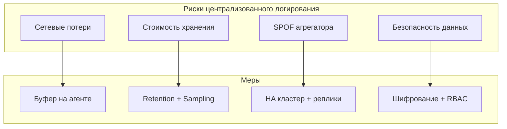

Меры защиты:

1. **Буферизация на агенте** — `Filebeat` хранит позицию чтения, при восстановлении сети дочитывает
2. **Retention политики** — автоматическое удаление старых данных (см. Q16)
3. **High Availability** — кластер `Elasticsearch` с репликами
4. **Контроль доступа** — `RBAC` в `Kibana`, шифрование в transit и at rest

Риск-ориентированный подход: заранее определите поведение при недоступности агрегатора (буферизация, деградация, потеря логов).

## Q25. (!) Как выбрать стратегию логирования для нового микросервиса?

Чеклист при запуске нового сервиса:

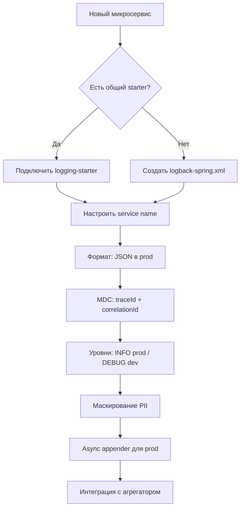

Пример полного `logback-spring.xml` для нового сервиса:

```xml
<?xml version="1.0" encoding="UTF-8"?>
<configuration>
    <springProperty scope="context" name="APP_NAME" source="spring.application.name" />
    <springProperty scope="context" name="APP_ENV" source="spring.profiles.active" defaultValue="dev" />

    <!-- Консольный аппендер для dev -->
    <appender name="CONSOLE" class="ch.qos.logback.core.ConsoleAppender">
        <encoder>
            <pattern>%d{HH:mm:ss.SSS} [%thread] [%X{traceId:-}] [%X{correlationId:-}] %-5level %logger{36} - %msg%n</pattern>
        </encoder>
    </appender>

    <!-- JSON аппендер для prod -->
    <appender name="JSON_CONSOLE" class="ch.qos.logback.core.ConsoleAppender">
        <encoder class="net.logstash.logback.encoder.LogstashEncoder">
            <customFields>{"service":"${APP_NAME}","env":"${APP_ENV}"}</customFields>
            <fieldNames>
                <timestamp>@timestamp</timestamp>
                <version>[ignore]</version>
            </fieldNames>
        </encoder>
    </appender>

    <!-- Async обёртка -->
    <appender name="ASYNC_JSON" class="ch.qos.logback.classic.AsyncAppender">
        <queueSize>2048</queueSize>
        <discardingThreshold>0</discardingThreshold>
        <neverBlock>true</neverBlock>
        <appender-ref ref="JSON_CONSOLE" />
    </appender>

    <!-- Dev профиль -->
    <springProfile name="dev">
        <root level="INFO">
            <appender-ref ref="CONSOLE" />
        </root>
        <logger name="com.myapp" level="DEBUG" />
    </springProfile>

    <!-- Prod профиль -->
    <springProfile name="prod">
        <root level="INFO">
            <appender-ref ref="ASYNC_JSON" />
        </root>
        <logger name="org.springframework" level="WARN" />
        <logger name="org.hibernate" level="WARN" />
        <logger name="org.apache.kafka" level="WARN" />
    </springProfile>
</configuration>
```

Практический выбор стратегии подтверждают метриками: объём логов/день, latency сервиса и MTTR по инцидентам.

## Q26. Что такое структурированное логирование и зачем JSON?

По сути это продолжение Q3, но с акцентом на rollout-стратегию. `JSON` нужен не только для формата, а для управляемой схемы полей между сервисами: одинаковые ключи, одинаковые типы, предсказуемые дашборды.

План поэтапной миграции на `JSON`:

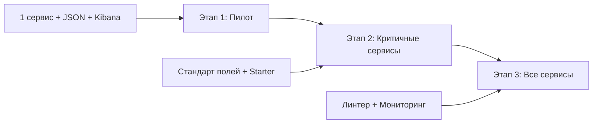

1. **Пилот** — один сервис переводим на `JSON`, проверяем парсинг в `Kibana`/`Grafana`
2. **Стандарт** — фиксируем обязательные поля (`service`, `traceId`, `env`, `version`), создаём starter
3. **Масштабирование** — все сервисы, мониторинг доли непарсимых событий

Пример добавления кастомных бизнес-полей через `StructuredArgument`:

```java
import static net.logstash.logback.argument.StructuredArguments.*;

log.info("Order created {}  {} {}",
    keyValue("orderId", orderId),
    keyValue("amount", amount),
    keyValue("currency", "RUB"));
```

Результат в `JSON`:

```json
{
  "message": "Order created orderId=12345 amount=999.99 currency=RUB",
  "orderId": "12345",
  "amount": 999.99,
  "currency": "RUB"
}
```

## Q27. Как организовать ротацию и хранение логов?

Ротация на узле: `Logback` с `RollingFileAppender` (по размеру или дате). В контейнерных средах приложение пишет в stdout, ротацией управляет `Docker`/`Kubernetes`.

Конфигурация ротации `Docker`:

```json
{
  "log-driver": "json-file",
  "log-opts": {
    "max-size": "100m",
    "max-file": "5"
  }
}
```

Конфигурация `Loki` retention:

```yaml
# loki-config.yml
compactor:
  retention_enabled: true

limits_config:
  retention_period: 720h  # 30 дней

schema_config:
  configs:
    - from: 2024-01-01
      store: tsdb
      object_store: s3
      schema: v13
```

Стоимость и объём управляются sampling или сокращением уровня детализации для старых логов.

## Q28. Как не логировать чувствительные данные (PII, пароли)?

Не включать пароли, токены, персональные данные в формат сообщений.

Маскирование с `LogstashEncoder` через `MaskingJsonGeneratorDecorator`:

```xml
<encoder class="net.logstash.logback.encoder.LogstashEncoder">
    <jsonGeneratorDecorator class="net.logstash.logback.mask.MaskingJsonGeneratorDecorator">
        <!-- Маскировать значения по имени поля -->
        <valueMasker class="net.logstash.logback.mask.RegexValueMasker">
            <regex>password|token|secret|apiKey|authorization</regex>
            <mask>***</mask>
        </valueMasker>
        <!-- Маскировать по пути JSON -->
        <pathMasker>
            <path>creditCard</path>
            <mask>****</mask>
        </pathMasker>
    </jsonGeneratorDecorator>
</encoder>
```

Аннотация `@ToString.Exclude` для Lombok:

```java
@Data
public class UserRequest {
    private String username;

    @ToString.Exclude  // Не попадёт в toString() → не попадёт в лог
    private String password;

    @ToString.Exclude
    private String creditCard;
}
```

Политика и обучение команды обязательны — технические меры не заменяют осознанного подхода к тому, что писать в лог.

## Q29. Что такое correlation ID и зачем он в логах?

`Correlation ID` (или `traceId`) — идентификатор, передаваемый по цепочке вызовов. В логах каждого сервиса записывается один и тот же `ID`.

В `Spring Boot 3` с `Micrometer Tracing` — `traceId` добавляется в `MDC` автоматически:

```yaml
# application.yml
spring:
  application:
    name: order-service

management:
  tracing:
    sampling:
      probability: 1.0

logging:
  pattern:
    level: "%5p [${spring.application.name},%X{traceId:-},%X{spanId:-}]"
```

Результат в логах:

```
2026-04-11 10:15:32  INFO [order-service,abc123def456,789xyz] OrderService - Order created
2026-04-11 10:15:32  INFO [order-service,abc123def456,111aaa] PaymentService - Payment processed
```

Для кастомного `Correlation ID` (если `traceId` не подходит) — см. фильтр в Q5.

## Q30. Как связать логи с метриками и трейсами для расследования?

Один `traceId` в логах, в трейсах и (через exemplars) в метриках.

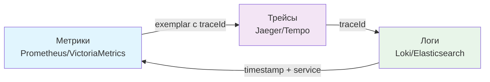

Последовательность расследования инцидента:

1. **Метрики** показывают аномалию (рост p99 latency, увеличение error rate)
2. **Трейсы** за аномальный период — находим проблемный трейс
3. **Логи** по `traceId` — видим полную картину по всем сервисам

Пример в `Grafana` — `LogQL` запрос по `traceId` из трейса:

```logql
{service="order-service"} | json | traceId="abc123def456"
```

Exemplars в `Micrometer` для связи метрик с трейсами:

```java
@Bean
public TimedAspect timedAspect(MeterRegistry registry) {
    return new TimedAspect(registry);
}

@Timed(value = "order.processing.time", extraTags = {"type", "create"})
public Order createOrder(OrderRequest request) {
    // exemplar с traceId добавляется автоматически
    return orderRepository.save(mapToEntity(request));
}
```

Финальная проверка стратегии: переход «метрика -> трейс -> лог» должен занимать минуты и быть воспроизводимым для on-call. Подробнее о полной [наблюдаемости систем](observability-interview.md).

## Q31. Как собирать логи в Kubernetes с Fluentd / Fluent Bit?

В `Kubernetes` приложения пишут в `stdout`/`stderr`; сбор логов — задача платформы.

```mermaid
graph LR
    subgraph Node
        POD1[Pod A<br/>stdout JSON] --> CRUN[Container Runtime]
        POD2[Pod B<br/>stdout JSON] --> CRUN
        CRUN --> FILE[/var/log/containers/*.log]
        FILE --> DAEMON[Fluent Bit DaemonSet]
    end
    DAEMON --> ES[Elasticsearch]
    DAEMON --> LOKI[Loki]
```

Паттерны развёртывания агентов:

| Паттерн | Когда | Инструмент |
|---------|-------|------------|
| `DaemonSet` | Стандарт, один агент на узел | `Fluent Bit`, `Filebeat` |
| `Sidecar` | Нужна своя конфигурация на pod | `Fluent Bit` sidecar |
| Прямая отправка | Простые сценарии | `LogstashEncoder` → `Logstash` TCP |

Пример `DaemonSet` конфигурации `Fluent Bit` для `Kubernetes`:

```yaml
# fluent-bit-config.yaml (ConfigMap)
[INPUT]
    Name             tail
    Path             /var/log/containers/*.log
    Parser           docker
    Tag              kube.<namespace_name>.<pod_name>.<container_name>
    Refresh_Interval 5
    Mem_Buf_Limit    50MB

[FILTER]
    Name                kubernetes
    Match               kube.*
    Kube_URL            https://kubernetes.default.svc:443
    Merge_Log           On
    Keep_Log            Off
    # Добавляет поля: kubernetes.namespace, kubernetes.pod_name, kubernetes.labels
    K8S-Logging.Exclude On

[OUTPUT]
    Name            loki
    Match           *
    Host            loki.monitoring.svc
    Port            3100
    Labels          job=fluentbit, namespace=$kubernetes['namespace_name']
    Label_Keys      $level,$service
    Remove_Keys     kubernetes,stream
```

Рекомендация: приложение пишет только в `stdout` в формате `JSON`; агент (`Fluent Bit`) делает обогащение (добавляет namespace, pod name, labels) — разделение ответственности.

## Q32. Что такое Grafana Loki и чем он отличается от ELK?

`Grafana Loki` — система хранения логов, оптимизированная для меток (`labels`), а не для полнотекстового поиска.

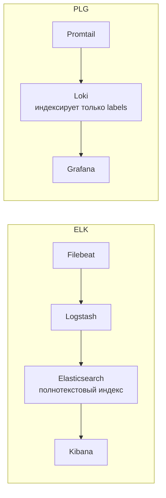

Сравнение стеков:

| Критерий | `ELK` (Elasticsearch) | `PLG` (Loki) |
|----------|----------------------|-------------|
| Индексирование | Полнотекстовое | Только labels |
| Стоимость хранения | Высокая | Низкая (~10x дешевле) |
| Поиск по содержимому | Быстрый | Медленнее (grep по чанкам) |
| Интеграция с Grafana | Через плагин | Нативная |
| Память агента | ~500 MB (Logstash) | ~1-10 MB (Promtail) |
| Идеален для | Аудит, сложные запросы | Kubernetes, микросервисы |

Конфигурация `Loki` retention + storage:

```yaml
# loki-config.yml
compactor:
  retention_enabled: true

limits_config:
  retention_period: 720h   # 30 дней по умолчанию
  # Дольше для audit-логов — задаётся per-stream через stream selectors

schema_config:
  configs:
    - from: 2024-01-01
      store: tsdb
      object_store: s3
      schema: v13
      index:
        prefix: loki_index_
        period: 24h
```

`LogQL` запросы в `Grafana`:

```logql
# Все ERROR за последний час с traceId
{service="order-service", env="prod"} |= "ERROR" | json | traceId != ""

# Rate ошибок по сервису
rate({env="prod"} |= "ERROR" [5m])
```

Выбор: `ELK` — если нужен полнотекстовый поиск по payload и сложные агрегации; `Loki` — если приоритет cost-эффективность и интеграция с `Grafana`/`Prometheus`.

## Q33. Как динамически менять уровень логирования без рестарта (Actuator, JMX)?

В production нельзя перезапускать сервис ради включения `DEBUG`. Три способа смены уровня без деплоя:

**1. Spring Boot Actuator (рекомендуется):**

```bash
# Просмотр текущего уровня пакета
curl http://localhost:8080/actuator/loggers/com.myapp.service

# Установка DEBUG без рестарта
curl -X POST http://localhost:8080/actuator/loggers/com.myapp.service \
  -H 'Content-Type: application/json' \
  -d '{"configuredLevel": "DEBUG"}'

# Сброс к исходному значению
curl -X POST http://localhost:8080/actuator/loggers/com.myapp.service \
  -H 'Content-Type: application/json' \
  -d '{"configuredLevel": null}'
```

Требуется открыть endpoint в конфигурации:

```yaml
management:
  endpoints:
    web:
      exposure:
        include: loggers
  endpoint:
    loggers:
      enabled: true
```

**2. JMX (для не-HTTP приложений):**

```java
// LoggerContext через JMX
MBeanServer mbs = ManagementFactory.getPlatformMBeanServer();
// Logback регистрирует MBean: ch.qos.logback.classic:Name=default,Type=ch.qos.logback.classic.jmx.JMXConfigurator
// Инструменты: jconsole, jmxterm
```

**3. Программное изменение (крайний случай):**

```java
@RestController
@RequestMapping("/admin/logging")
public class LogLevelController {

    @PostMapping
    public void setLevel(@RequestParam String logger, @RequestParam String level) {
        LoggerContext context = (LoggerContext) LoggerFactory.getILoggerFactory();
        context.getLogger(logger).setLevel(Level.toLevel(level));
    }
}
```

Важно: изменение через `Actuator` не сохраняется при рестарте — это временная мера для расследования. После инцидента уровень возвращают обратно.

## Q34. Как реализовать rate-limiting логов при шторме ошибок?

При шторме ошибок (error storm) сотни тысяч однотипных `ERROR`-записей перегружают хранилище и маскируют реальную проблему.

Подходы:

**1. `RateLimiter` из Guava (простой счётчик):**

```java
@Slf4j
@Service
public class ExternalApiClient {

    // Не более 1 ERROR-лога в секунду для одного типа ошибки
    private final RateLimiter errorLogLimiter = RateLimiter.create(1.0);

    public Response callApi(Request req) {
        try {
            return httpClient.send(req);
        } catch (IOException e) {
            if (errorLogLimiter.tryAcquire()) {
                log.error("External API unavailable: host={}", req.getHost(), e);
            } else {
                // Счётчик без stack trace — не теряем информацию
                log.warn("External API error (rate-limited): host={}", req.getHost());
            }
            throw new ServiceUnavailableException(e);
        }
    }
}
```

**2. Дедупликация через `TurboFilter` в Logback:**

```java
public class DeduplicatingTurboFilter extends TurboFilter {

    private final Cache<String, Long> recentMessages =
        Caffeine.newBuilder()
            .expireAfterWrite(30, TimeUnit.SECONDS)
            .maximumSize(1000)
            .build();

    @Override
    public FilterReply decide(Marker marker, Logger logger,
                               Level level, String format,
                               Object[] params, Throwable t) {
        if (!level.isGreaterOrEqual(Level.ERROR)) {
            return FilterReply.NEUTRAL;
        }
        // Ключ дедупликации — logger + format
        String key = logger.getName() + "|" + format;
        Long lastSeen = recentMessages.getIfPresent(key);
        if (lastSeen != null) {
            return FilterReply.DENY;  // уже логировали недавно
        }
        recentMessages.put(key, System.currentTimeMillis());
        return FilterReply.NEUTRAL;
    }
}
```

Регистрация в `logback-spring.xml`:

```xml
<turboFilter class="com.myapp.logging.DeduplicatingTurboFilter"/>
```

**3. Метрика вместо лога для высокочастотных событий:**

```java
// Не логируем каждую ошибку — считаем метрику
meterRegistry.counter("api.errors", "host", host).increment();
// Раз в минуту — один агрегированный лог
```

Правило: `ERROR` всегда без rate-limiting, если это уникальное событие; rate-limiting только для повторяющихся ошибок одного типа.

## Q35. Как связать distributed tracing с логами через traceId в OpenTelemetry?

`OpenTelemetry` — стандарт для трассировки, метрик и логов. При правильной настройке `traceId` автоматически попадает во все логи.

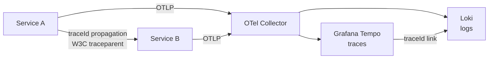

Настройка `Spring Boot 3` + `Micrometer Tracing` + `OpenTelemetry`:

```groovy
// build.gradle
implementation 'io.micrometer:micrometer-tracing-bridge-otel'
implementation 'io.opentelemetry:opentelemetry-exporter-otlp'
```

```yaml
# application.yml
management:
  tracing:
    sampling:
      probability: 0.1   # 10% в prod, 100% в dev

spring:
  application:
    name: order-service

logging:
  pattern:
    # traceId и spanId автоматически в MDC через Micrometer
    level: "%5p [${spring.application.name:},%X{traceId:-},%X{spanId:-}]"
```

`traceId` в MDC автоматически попадает в `JSON`-лог через `LogstashEncoder`:

```json
{
  "@timestamp": "2026-04-13T12:00:00Z",
  "level": "INFO",
  "message": "Order created",
  "traceId": "4bf92f3577b34da6a3ce929d0e0e4736",
  "spanId": "00f067aa0ba902b7",
  "service": "order-service"
}
```

В `Grafana`: переход от трейса к логам — через кнопку «Logs» в `Tempo`, запрос `{service="order-service"} | json | traceId="4bf92f3577b34da6a3ce929d0e0e4736"`.

Заголовки propagation:
- `W3C Trace Context` (`traceparent`, `tracestate`) — современный стандарт
- `B3` (`X-B3-TraceId`, `X-B3-SpanId`) — исторический формат `Zipkin`/`Sleuth`

## Q36. Как логировать производительность (performance logging) без деградации?

Наивное логирование в hot path деградирует производительность: каждый `log.debug(...)` — это вычисление строки, запись в буфер, потенциальный I/O.

Паттерны безопасного performance logging:

**1. Логирование только медленных операций (latency threshold):**

```java
@Slf4j
@Component
public class SlowQueryLogger {

    private static final long SLOW_QUERY_THRESHOLD_MS = 200;

    public <T> T executeWithLogging(String operation, Supplier<T> action) {
        long start = System.currentTimeMillis();
        try {
            return action.get();
        } finally {
            long elapsed = System.currentTimeMillis() - start;
            if (elapsed > SLOW_QUERY_THRESHOLD_MS) {
                log.warn("Slow operation: name={} elapsed={}ms", operation, elapsed);
            } else if (log.isDebugEnabled()) {
                log.debug("Operation: name={} elapsed={}ms", operation, elapsed);
            }
        }
    }
}
```

**2. Аннотация `@Timed` + метрика вместо лога:**

```java
@Timed(value = "payment.process", percentiles = {0.5, 0.95, 0.99})
public PaymentResult processPayment(PaymentRequest req) {
    // Детали производительности — в метрики, не в логи
    return gateway.charge(req);
}
```

**3. Batch logging — агрегация в памяти:**

```java
@Scheduled(fixedDelay = 60_000)  // каждую минуту
public void flushStats() {
    log.info("Processing stats: count={} avgMs={} p99Ms={}",
        counter.getAndSet(0), avgLatency.get(), p99Latency.get());
}
```

**Измеримые показатели влияния логирования:**

| Сценарий | Влияние на latency |
|----------|--------------------|
| `log.debug(...)` при отключённом DEBUG | < 10 нс (только проверка уровня) |
| Конкатенация строк при отключённом DEBUG | 50-500 нс (toString() выполняется) |
| Синхронная запись в файл | 1-10 мс (блокирующий I/O) |
| Async appender, очередь не полна | < 1 мкс |
| Async appender, очередь полна | блокировка до 100 мс |

Ключевое правило: параметризованные вызовы + async appender + `DEBUG` отключён в prod = нулевой overhead от логирования.

## Q37. Как соблюдать GDPR при логировании (PII, маскирование, аудит)?

`GDPR` (General Data Protection Regulation) требует защиты персональных данных (PII): имена, email, IP, номера карт не должны храниться без необходимости.

Стратегии:

**1. Allowlist полей для структурированных логов:**

```java
// Никогда не логировать: password, email, phone, SSN, creditCard, token
// Логировать безопасно: userId (внутренний ID), orderId, traceId, action

// НЕЛЬЗЯ:
log.info("User login: email={} password={}", email, password);

// МОЖНО:
log.info("User login: userId={} success={}", user.getId(), success);
```

**2. `@ToString.Exclude` и `@JsonIgnore` для защиты на уровне класса:**

```java
@Data
@Builder
public class UserProfile {
    private Long id;
    private String username;

    @ToString.Exclude   // не попадёт в log.info("User: {}", user)
    private String email;

    @ToString.Exclude
    private String phoneNumber;
}
```

**3. Маскирование через `MaskingJsonGeneratorDecorator` (logstash-logback-encoder):**

```xml
<encoder class="net.logstash.logback.encoder.LogstashEncoder">
    <jsonGeneratorDecorator
        class="net.logstash.logback.mask.MaskingJsonGeneratorDecorator">
        <valueMasker class="net.logstash.logback.mask.RegexValueMasker">
            <!-- Маскировать по именам полей -->
            <regex>(?i)(password|token|secret|apiKey|authorization)</regex>
            <mask>***MASKED***</mask>
        </valueMasker>
        <!-- Маскировать номера карт -->
        <valueMasker class="net.logstash.logback.mask.RegexValueMasker">
            <regex>\b\d{13,19}\b</regex>
            <mask>****-****-****-XXXX</mask>
        </valueMasker>
    </jsonGeneratorDecorator>
</encoder>
```

**4. Retention и право на удаление:**

| Тип данных | Retention | Основание |
|-----------|-----------|-----------|
| Технические логи (без PII) | 30 дней | Внутренняя политика |
| Audit logs (userId, action) | 1 год | Compliance |
| Логи с PII | Минимально необходимо | GDPR Art. 5(e) |

Правило: если сомневаетесь, логировать ли поле — не логируйте. Регулятор штрафует за наличие, а не за отсутствие данных.

## Q38. Как тестировать стратегию логирования в Spring Boot?

Тестирование логирования — часть контракта сервиса: важно убедиться, что критичные события логируются и чувствительные данные не утекают.

**1. `MemoryAppender` для unit-тестов:**

```java
public class MemoryAppender extends ListAppender<ILoggingEvent> {

    public void reset() {
        this.list.clear();
    }

    public boolean contains(String string, Level level) {
        return this.list.stream()
            .anyMatch(event -> event.getMessage().contains(string)
                && event.getLevel().equals(level));
    }

    public int countEventsForLogger(String loggerName) {
        return (int) this.list.stream()
            .filter(event -> event.getLoggerName().contains(loggerName))
            .count();
    }
}

@ExtendWith(MockitoExtension.class)
class OrderServiceLoggingTest {

    private MemoryAppender memoryAppender;

    @BeforeEach
    void setUp() {
        memoryAppender = new MemoryAppender();
        memoryAppender.start();
        Logger logger = (Logger) LoggerFactory.getLogger(OrderService.class);
        logger.addAppender(memoryAppender);
        logger.setLevel(Level.DEBUG);
    }

    @Test
    void shouldLogOrderCreation() {
        orderService.createOrder(new OrderRequest("user-123", 99.99));
        assertThat(memoryAppender.contains("Order created", Level.INFO)).isTrue();
    }

    @Test
    void shouldNotLogSensitiveData() {
        orderService.processPayment(new PaymentRequest("user-123", "4111111111111111"));
        boolean cardInLogs = memoryAppender.list.stream()
            .anyMatch(e -> e.getFormattedMessage().contains("4111111111111111"));
        assertThat(cardInLogs).isFalse();
    }
}
```

**2. `@SpringBootTest` с `OutputCaptureExtension`:**

```java
@SpringBootTest
@ExtendWith(OutputCaptureExtension.class)
class OrderControllerLoggingIntegrationTest {

    @Test
    void shouldIncludeTraceIdInLogs(CapturedOutput output) {
        webTestClient.post().uri("/orders")
            .header("X-Trace-Id", "test-trace-123")
            .bodyValue(orderRequest)
            .exchange()
            .expectStatus().isCreated();

        assertThat(output.getOut()).contains("test-trace-123");
    }
}
```

**3. Проверка отсутствия чувствительных полей в JSON-логах:**

```java
@Test
void jsonLogShouldNotContainPassword(CapturedOutput output) {
    authService.login("user@example.com", "my-secret-password");
    assertThat(output.getOut()).doesNotContain("my-secret-password");
    assertThat(output.getOut()).doesNotContain("user@example.com");
}
```

Тестирование логирования добавляют в регрессионный набор — особенно для аутентификации, платежей и персональных данных.

---

## See also

- [Logging](../logging/logging-interview.md) — инструментальные вопросы: `SLF4J`, `Logback`, `MDC`, настройка аппендеров и энкодеров
- [Метрики и трейсинг](metrics-tracing-interview.md) — как метрики и трейсы дополняют логи в полной observability-картине
- [Observability](observability-interview.md) — три столпа (логи, метрики, трейсы), `SLI`/`SLO`/`SLA`, алертинг
- [Распределённые системы](../architecture/distributed-systems-interview.md) — correlation ID, fault tolerance, сценарии потери сообщений
- [Микросервисы](../architecture/microservices-interview.md) — где централизованное логирование обязательно и как его организовать
- [Spring Boot](../frameworks/spring/spring-boot-interview.md) — конфигурация `logback-spring.xml`, профили, `spring-boot-starter-logging`
- [Kubernetes](../devops/kubernetes-interview.md) — `stdout`/`stderr` стратегия, Fluentd/Fluent Bit, агрегация логов в кластере

- [[elk-stack-interview|ELK Stack]]
- [[jaeger-zipkin-interview|Jaeger и Zipkin]]
- [[loki-grafana-interview|Loki и Grafana]]
- [[metrics-tracing-interview|Метрики и трейсинг]]
- [[observability-interview|Observability]]
- [[opentelemetry-interview|OpenTelemetry]]
