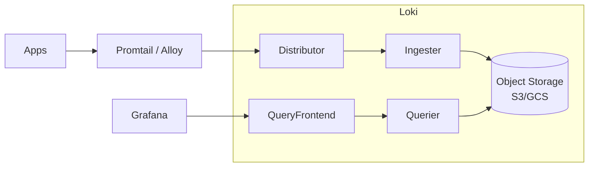

# Вопросы на собеседовании: `Loki и Grafana`

`Grafana Loki` — log aggregation от Grafana Labs (с 2018). **"Like Prometheus, but for logs"** — индексирует только labels, raw logs хранятся compressed. Намного дешевле ELK. **PLG stack** = Promtail + Loki + Grafana. Часто комбинируется с **Tempo** (traces) + **Mimir** (metrics) = full Grafana stack.

## Полезные ссылки

### Официальная документация и авторитетные источники

- [Grafana Loki Documentation](https://grafana.com/docs/loki/latest/)
- [LogQL Documentation](https://grafana.com/docs/loki/latest/logql/)
- [Grafana Documentation](https://grafana.com/docs/grafana/latest/)
- [Promtail Documentation](https://grafana.com/docs/loki/latest/clients/promtail/)
- [Grafana Alloy](https://grafana.com/docs/alloy/latest/) — successor to Promtail
- [Grafana LGTM stack](https://grafana.com/oss/) — Loki + Grafana + Tempo + Mimir

## Содержание

- [Полезные ссылки](#полезные-ссылки)
- [See also](#see-also)

**Базовые понятия**
- [Q1. (!) Что такое Loki?](#q1--что-такое-loki)
- [Q2. (!) Loki philosophy — "index labels, not content"?](#q2--loki-philosophy--index-labels-not-content)
- [Q3. (!) PLG (Promtail + Loki + Grafana) vs ELK?](#q3--plg-promtail--loki--grafana-vs-elk)

**Архитектура**
- [Q4. (!) Loki components?](#q4--loki-components)
- [Q5. Storage backends (S3, GCS, Cassandra)?](#q5-storage-backends-s3-gcs-cassandra)
- [Q6. (!) Streams и chunks в Loki?](#q6--streams-и-chunks-в-loki)
- [Q7. Monolithic vs Microservices vs Simple Scalable mode?](#q7-monolithic-vs-microservices-vs-simple-scalable-mode)

**Labels и индексация**
- [Q8. (!) Что такое labels в Loki?](#q8--что-такое-labels-в-loki)
- [Q9. (!) Cardinality — главная проблема?](#q9--cardinality--главная-проблема)
- [Q10. Static vs dynamic labels?](#q10-static-vs-dynamic-labels)

**LogQL**
- [Q11. (!) LogQL — query language?](#q11--logql--query-language)
- [Q12. Log stream selectors?](#q12-log-stream-selectors)
- [Q13. Filter expressions?](#q13-filter-expressions)
- [Q14. (!) Metric queries (LogQL → metrics)?](#q14--metric-queries-logql--metrics)

**Log shipping**
- [Q15. (!) Promtail vs Alloy vs Fluent Bit?](#q15--promtail-vs-alloy-vs-fluent-bit)
- [Q16. Pipeline stages в Promtail?](#q16-pipeline-stages-в-promtail)
- [Q17. K8s log discovery?](#q17-k8s-log-discovery)

**Grafana**
- [Q18. (!) Что такое Grafana?](#q18--что-такое-grafana)
- [Q19. Datasources в Grafana?](#q19-datasources-в-grafana)
- [Q20. Dashboards, panels, variables?](#q20-dashboards-panels-variables)
- [Q21. Alerting в Grafana?](#q21-alerting-в-grafana)
- [Q22. (!) Explore mode для troubleshooting?](#q22--explore-mode-для-troubleshooting)

**Full Grafana stack (LGTM)**
- [Q23. (!) Loki + Grafana + Tempo + Mimir?](#q23--loki--grafana--tempo--mimir)
- [Q24. Correlation logs ↔ traces ↔ metrics?](#q24-correlation-logs--traces--metrics)

**Production**
- [Q25. (!) Cost comparison Loki vs ELK?](#q25--cost-comparison-loki-vs-elk)
- [Q26. Какие частые проблемы в Loki production?](#q26-какие-частые-проблемы-в-loki-production)
- [Q27. (!) Когда выбрать Loki?](#q27--когда-выбрать-loki)
- [Q28. Когда не выбирать Loki?](#q28-когда-не-выбирать-loki)

## Q1. (!) Что такое Loki?

(!) Что такое Loki?

**Grafana Loki** — open-source log aggregation от **Grafana Labs** (с 2018).

**Slogan:** "Like Prometheus, but for logs."

**Ключевая идея:** **не индексировать** текст логов, **только labels**. Raw logs хранятся compressed в object storage (S3, GCS).

**Преимущества:**
- **10x cheaper** чем ELK
- **Simpler ops**
- Tightly integrated с Prometheus (same labels)
- Scales к petabytes легко

**Недостатки:**
- Slower full-text search (grep-based)
- Слабее aggregations
- Less mature ecosystem

## Q2. (!) Loki philosophy — "index labels, not content"?

**Traditional (ELK):**
```
Index every word from log line
→ Fast search, but expensive storage + indexing CPU
```

**Loki:**
```
Index only labels: {app="my-app", env="prod", level="error"}
Store raw log lines compressed
Search: filter by labels first → grep through compressed chunks
→ Cheap storage, slower full-text search
```

**Trade-off:**
- ELK: **index everything** = fast search, expensive
- Loki: **index labels only** = cheap, slower text search

**Для большинства log queries** — labels достаточно (filter by service/env). Full-text grep — secondary use case.

## Q3. (!) PLG (Promtail + Loki + Grafana) vs ELK?

| Критерий | PLG (Loki) | ELK |
|----------|-----------|-----|
| Storage cost | $ (object storage) | $$$ (Elasticsearch) |
| Resource usage | Low (Go) | High (JVM) |
| Search speed | Slower (grep) | Fast (indexed) |
| Full-text query | Slower | Fast |
| Aggregations | Limited | Powerful |
| Operational complexity | Lower | Higher |
| Ecosystem | Growing | Mature |
| Best for | Cost-conscious, simple use cases | Complex search, analytics |

**Выбор:** simple log troubleshooting → Loki. Complex SIEM, analytics → ELK.

## Q4. (!) Loki components?



**Components:**
- **Distributor** — receives logs, validates, forwards к Ingester
- **Ingester** — buffers logs, builds chunks, writes к storage
- **Querier** — handles queries, fetches chunks, filters
- **Query Frontend** — query splitting, caching
- **Compactor** — compacts indices в storage
- **Index Gateway** — index queries (newer)

**Single-binary mode** для small deployments.

## Q5. Storage backends (S3, GCS, Cassandra)?

**Loki поддерживает:**
- **S3** (AWS) — most common
- **GCS** (Google)
- **Azure Blob**
- **Filesystem** (dev only)
- **Cassandra** (legacy schemas)
- **DynamoDB / BigTable** (для index, schema v11)

**TSDB (newer, schema v13)** — modern index format, cheaper.

В **2025** для production — **S3-compatible object storage** + TSDB схема.

## Q6. (!) Streams и chunks в Loki?

**Stream** — unique combination labels:
```
{app="my-app", env="prod", level="error"} → stream A
{app="my-app", env="prod", level="info"} → stream B
{app="other-app", env="prod"} → stream C
```

**Chunk** — compressed log lines из одного stream, написанные за period (~ 5-15 min) или size (~ 1.5 MB).

**Storage:**
```
s3://loki-bucket/chunks/<stream-hash>/<start-end-timestamp>
```

**Index** — knows which chunks contain logs для labels matching query.

## Q7. Monolithic vs Microservices vs Simple Scalable mode?

**Monolithic (single binary):**
- Все components в одном process
- Easy deploy
- До ~100 GB/day

**Simple Scalable Deployment (SSD):**
- 2 binaries: Read + Write
- Recommended для **most production** workloads
- До ~few TB/day

**Microservices:**
- Каждый component separate
- Maximum flexibility / scaling
- For **massive** scale (10+ TB/day)

В **2025** — **SSD mode** для majority workloads.

## Q8. (!) Что такое labels в Loki?

**Labels** = key-value pairs идентифицируют log stream.

```
{job="my-app", env="prod", region="us-east", level="error"}
```

**Source:**
- Static (config)
- Dynamic (extracted from log content)
- Kubernetes labels (auto)

**Используются для:**
- **Stream selection** (filter logs by labels)
- **Indexing** (только labels indexed)
- **Aggregation** (group by labels)

## Q9. (!) Cardinality — главная проблема?

**Cardinality** = number of unique label combinations.

**Bad:** `{user_id="123"}` — millions of unique IDs → millions of streams → blow up index.

**Good:** `{service="api", env="prod"}` — bounded set.

**Rules:**
- **Don't use high-cardinality fields as labels** (user_id, request_id, IP)
- **Aim for** < 10K total streams per tenant
- **Few labels** (< 10), bounded values

**Если нужен поиск по user_id:** put в log line content, search через `|=` filter:
```logql
{service="api"} |= "user_id=123"
```

**Cardinality blowup** = №1 cause production issues с Loki.

## Q10. Static vs dynamic labels?

**Static labels** — известны в config (job, env).

**Dynamic labels** — extracted from log content в Promtail pipeline.

```yaml
# Bad — extract user_id as label (high cardinality)
- regex:
    expression: 'user_id=(?P<user_id>\d+)'
- labels:
    user_id:

# Good — keep user_id в content, не как label
```

**Best practice:** только bounded fields как labels.

## Q11. (!) LogQL — query language?

**LogQL** — Loki's query language. Inspired by **PromQL**.

**Basic structure:**
```
{label_selector} | filter_expression
```

**Examples:**
```
# All logs from app
{app="my-app"}

# Filter by content
{app="my-app"} |= "error"

# Multi-conditions
{app="my-app", env="prod"} |= "error" != "timeout"

# Regex
{app="my-app"} |~ "user_id=\d{6}"

# Parse JSON
{app="my-app"} | json | level="error"
```

## Q12. Log stream selectors?

**Stream selector** — `{label="value"}`. Filter streams (which to read).

**Operators:**
- `=` — equal
- `!=` — not equal
- `=~` — regex match
- `!~` — regex not match

```
{app="my-app"}                           # equal
{app=~"my-.*"}                           # regex
{app="my-app", env=~"prod|staging"}      # multiple
{env!="dev"}                             # not equal
```

**Performance:** stream selectors **сильно** влияют на speed. Точнее — быстрее.

## Q13. Filter expressions?

После selector — **line filters**:

```
{app="my-app"}
  |= "error"           # contains "error"
  != "timeout"         # doesn't contain "timeout"
  |~ "user_id=\d+"     # regex match
  !~ "internal-debug"  # regex doesn't match
```

**Parser stages:**
```
{app="my-app"} | json                       # parse JSON
{app="my-app"} | logfmt                      # parse logfmt
{app="my-app"} | regexp "(?P<level>\w+)"     # extract via regex
{app="my-app"} | json | level="error"        # filter on extracted field
```

## Q14. (!) Metric queries (LogQL → metrics)?

**Logs → metrics** — LogQL aggregations.

```
# Rate of errors
rate({app="my-app"} |= "error" [5m])

# Top services by log volume
topk(5, sum by (service) (rate({env="prod"}[5m])))

# Quantile of extracted duration
quantile_over_time(0.95, {app="api"} | json | unwrap duration_ms [5m])

# Count errors per minute
sum by (service) (count_over_time({env="prod"} |= "error" [1m]))
```

Это даёт **Prometheus-style metrics из logs**. Можно использовать в Grafana dashboards и alerting.

## Q15. (!) Promtail vs Alloy vs Fluent Bit?

**Promtail** — official Loki agent (Go).
- Lightweight (~50 MB RAM)
- Service discovery (K8s)
- Pipeline stages для parsing

**Grafana Alloy** (с 2024) — successor Promtail.
- Multi-protocol (Loki, Tempo, Mimir, Prometheus, OTLP)
- Component-based config (HCL-like)
- Replaces Grafana Agent + Promtail

**Fluent Bit** — alternative (CNCF).
- Lightweight (5 MB RAM)
- Multi-output (Loki, ES, Kafka)
- Production-grade

**Vector** (Datadog OSS) — modern alternative, fast Rust-based.

В **2025** — **Alloy** для Grafana stack. **Fluent Bit** для multi-vendor scenarios.

## Q16. Pipeline stages в Promtail?

**Stages:**
- **regex** / **json** / **logfmt** — parse
- **labels** — extract labels
- **template** — modify
- **timestamp** — parse timestamp
- **output** — modify log line
- **drop** — drop matching logs
- **multiline** — combine multi-line entries (stack traces)

```yaml
pipeline_stages:
  - json:
      expressions:
        level: level
        msg: message
  - labels:
      level:
  - timestamp:
      source: timestamp
      format: RFC3339
```

## Q17. K8s log discovery?

**Promtail / Alloy в K8s** auto-discover pods через K8s API:

```yaml
scrape_configs:
  - job_name: kubernetes-pods
    kubernetes_sd_configs:
      - role: pod
    relabel_configs:
      - source_labels: [__meta_kubernetes_namespace]
        target_label: namespace
      - source_labels: [__meta_kubernetes_pod_name]
        target_label: pod
      - source_labels: [__meta_kubernetes_pod_label_app]
        target_label: app
```

**Logs из container logs** (`/var/log/pods/...`).

**Alternative:** every pod stdout → DaemonSet collector reads.

## Q18. (!) Что такое Grafana?

**Grafana** — open-source visualization platform. Dashboards + alerting для observability data.

**Datasources:** 100+ supported:
- Prometheus, Loki, Tempo, Mimir
- Elasticsearch, OpenSearch
- InfluxDB, Graphite
- PostgreSQL, MySQL
- CloudWatch, Datadog, NewRelic
- And many more

**Standard tool** для observability dashboards.

## Q19. Datasources в Grafana?

```yaml
datasources:
  - name: Prometheus
    type: prometheus
    url: http://prometheus:9090
  - name: Loki
    type: loki
    url: http://loki:3100
  - name: Tempo
    type: tempo
    url: http://tempo:3200
```

Один Grafana → много datasources → unified visualization.

**Mixed datasources в одном dashboard** — например, latency metric (Prometheus) + related logs (Loki) + trace (Tempo).

## Q20. Dashboards, panels, variables?

**Dashboard** = collection of panels.

**Panel types:**
- Time series (line, area, bar)
- Stat (single value)
- Gauge
- Table
- Logs panel
- Heatmap
- Pie chart
- World map

**Variables** — dropdowns в dashboard для dynamic filtering:
```
${env}      → values from query (env labels)
${service}  → multi-select services
```

Один dashboard работает для **разных environments** через variables.

**Provisioning:** dashboards as code (JSON) committed в git.

## Q21. Alerting в Grafana?

**Unified Alerting** (Grafana 8+):
- Alert rules definable across multiple datasources
- Notification channels (Slack, PagerDuty, email, webhook)
- Routing, silencing, inhibition

```yaml
- name: HighErrorRate
  query: rate(http_errors_total[5m]) > 10
  for: 5m
  labels:
    severity: critical
  annotations:
    summary: "High error rate detected"
```

**Alertmanager** (Prometheus) — alternative.

## Q22. (!) Explore mode для troubleshooting?

**Explore** — ad-hoc query mode (vs dashboards).

**Use case:** debugging incident.

```
1. Open Explore с Loki datasource
2. {app="my-app", env="prod"} |= "error"
3. See logs over time
4. Click trace_id → switch к Tempo datasource
5. See full distributed trace
```

**Split view** — query 2 datasources side-by-side.

**Drill-down** — clickable trace_ids → link к Tempo.

## Q23. (!) Loki + Grafana + Tempo + Mimir?

**LGTM Stack** = Grafana's full observability stack.

| Tool | Назначение | "Like" |
|------|-----------|--------|
| **Loki** | Logs | ELK |
| **Grafana** | Visualization | — |
| **Tempo** | Traces | Jaeger |
| **Mimir** | Metrics | Prometheus (long-term storage) |
| **Pyroscope** | Profiles | (continuous profiling) |
| **Beyla** / **Faro** | Auto-instrumentation, RUM | — |

**Все** open-source, **все** label-based, **все** на object storage (S3) для cheap.

**Эпохальный** альтернатива expensive vendor stacks.

## Q24. Correlation logs ↔ traces ↔ metrics?

**Workflow:**

1. Spike в latency (metrics from Prometheus)
2. → Click trace_id в Grafana → see slow trace в Tempo
3. → Click trace_id → search Loki для logs с этим trace_id
4. → See ERROR log message → understand root cause

**Setup:** include `trace_id` в logs, include `service.name` consistently across.

```python
logger.info("Processing", extra={"trace_id": current_span.context.trace_id})
```

В Grafana — **derived fields** позволяют clickable trace_id в logs panel.

## Q25. (!) Cost comparison Loki vs ELK?

**Example:** 1 TB logs/day, 7 days retention.

**ELK:**
- Storage: 7 TB × $0.10/GB/month = $700/month
- Compute (3 data nodes): $1500/month
- License (Elastic paid features): $$$
- **Total: $2200+/month**

**Loki:**
- Storage: 7 TB × S3 ($0.023/GB) = $160/month
- Compute (smaller, Go): $300/month
- **Total: $460/month**

**~5x cheaper.**

Real-world: enterprise reports save **70-90%** moving к Loki.

**Cost trade-off:** queries slower (особенно full-text grep).

## Q26. Какие частые проблемы в Loki production?

1. **High cardinality labels** — index blow up
2. **Slow queries** — broad time range + grep
3. **Tenant isolation** — single tenant abuses cluster
4. **Object storage costs** — list/read operations добавляются
5. **Out-of-order ingestion** — older Loki не accepted (newer OK)
6. **Chunk size tuning** — too small = high overhead
7. **Retention misconfig** — забыли set TTL → costs grow
8. **Promtail config errors** — silent log loss
9. **No alerting** на ingestion failures

## Q27. (!) Когда выбрать Loki?

**Выбирай Loki когда:**
- **Cost** important
- Already use **Grafana** + **Prometheus**
- Logs largely **structured** (JSON, key-value)
- Filter mostly by **labels**
- K8s ecosystem
- Operational simplicity matters

**Best fit:** modern cloud-native shop, K8s, microservices, cost-conscious.

## Q28. Когда не выбирать Loki?

**Не выбирай Loki когда:**
- Need **complex full-text search** на all logs
- Heavy **aggregations / analytics**
- Compliance / SIEM features required
- Already deeply ELK
- Need **APM** в одном tool

**Alternative:** ELK для search-heavy, **ClickHouse** для analytics-heavy, **SigNoz** для full APM.

## See also

- [OpenTelemetry](opentelemetry-interview.md) — modern standard
- [ELK Stack](elk-stack-interview.md) — alternative для logs
- [Jaeger / Zipkin](jaeger-zipkin-interview.md) — для traces (alternative Tempo)
- [Prometheus + Grafana](prometheus-grafana-interview.md) — для metrics (alternative Mimir)
- [Observability](observability-interview.md) — общая концепция
- [Logging](../logging/logging-interview.md) — application logging
- [Стратегии логирования](logging-strategies-interview.md) — best practices
- [Микросервисы](../architecture/microservices-interview.md) — где Loki shines
- [Kubernetes](../devops/kubernetes-interview.md) — log discovery
- [Cloud-native Patterns](../cloud/cloud-native-patterns-interview.md) — observability
- [Caching](../architecture/caching-strategies-interview.md) — для query performance

- [Jaeger и Zipkin](jaeger-zipkin-interview.md)
- [Стратегии логирования](logging-strategies-interview.md)
- [Метрики и трейсинг](metrics-tracing-interview.md)
- [Observability](observability-interview.md)
- [OpenTelemetry](opentelemetry-interview.md)
