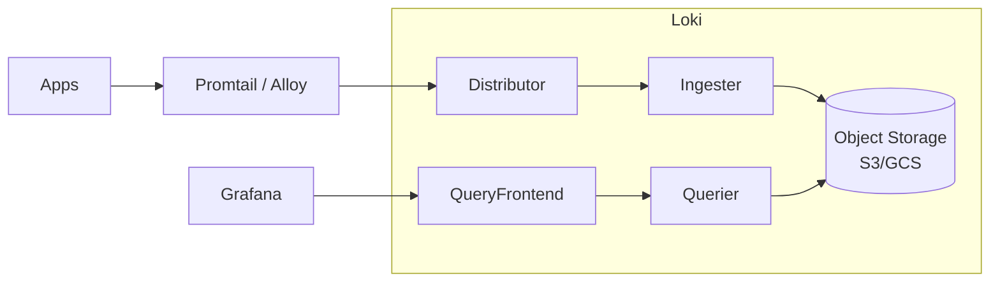

# Вопросы на собеседовании: `Loki и Grafana`

`Grafana Loki` — система агрегации логов от Grafana Labs (с 2018). **«Like Prometheus, but for logs»** — индексирует только labels, сырые логи хранятся в сжатом виде. Намного дешевле ELK. **PLG stack** = Promtail + Loki + Grafana. Часто комбинируется с **Tempo** (трейсы) + **Mimir** (метрики) = полный Grafana stack.

## Полезные ссылки

### Официальная документация и авторитетные источники

- [Grafana Loki Documentation](https://grafana.com/docs/loki/latest/)
- [LogQL Documentation](https://grafana.com/docs/loki/latest/logql/)
- [Grafana Documentation](https://grafana.com/docs/grafana/latest/)
- [Promtail Documentation](https://grafana.com/docs/loki/latest/clients/promtail/)
- [Grafana Alloy](https://grafana.com/docs/alloy/latest/) — successor to Promtail
- [Grafana LGTM stack](https://grafana.com/oss/) — Loki + Grafana + Tempo + Mimir

## Содержание

- [Полезные ссылки](#полезные-ссылки)
- [See also](#see-also)

**Базовые понятия**
- [Q1. (!) Что такое Loki?](#q1--что-такое-loki)
- [Q2. (!) Философия Loki — «индексировать labels, а не содержимое»?](#q2--философия-loki--индексировать-labels-а-не-содержимое)
- [Q3. (!) PLG-стек (Promtail + Loki + Grafana) против ELK?](#q3--plg-стек-promtail--loki--grafana-против-elk)

**Архитектура**
- [Q4. (!) Из каких компонентов состоит Loki?](#q4--из-каких-компонентов-состоит-loki)
- [Q5. Какие хранилища поддерживает Loki (S3, GCS, Cassandra)?](#q5-какие-хранилища-поддерживает-loki-s3-gcs-cassandra)
- [Q6. (!) Что такое streams и chunks в Loki?](#q6--что-такое-streams-и-chunks-в-loki)
- [Q7. Чем отличаются режимы Monolithic, Microservices и Simple Scalable?](#q7-чем-отличаются-режимы-monolithic-microservices-и-simple-scalable)

**Labels и индексация**
- [Q8. (!) Что такое labels в Loki?](#q8--что-такое-labels-в-loki)
- [Q9. (!) Почему кардинальность — главная проблема Loki?](#q9--почему-кардинальность--главная-проблема-loki)
- [Q10. Чем отличаются статические и динамические labels?](#q10-чем-отличаются-статические-и-динамические-labels)

**LogQL**
- [Q11. (!) Что такое LogQL — язык запросов Loki?](#q11--что-такое-logql--язык-запросов-loki)
- [Q12. Что такое селекторы streams в LogQL?](#q12-что-такое-селекторы-streams-в-logql)
- [Q13. Что такое фильтрующие выражения в LogQL?](#q13-что-такое-фильтрующие-выражения-в-logql)
- [Q14. (!) Как из логов получить метрики (metric queries в LogQL)?](#q14--как-из-логов-получить-метрики-metric-queries-в-logql)

**Log shipping**
- [Q15. (!) Чем отличаются Promtail, Alloy и Fluent Bit?](#q15--чем-отличаются-promtail-alloy-и-fluent-bit)
- [Q16. Что такое pipeline stages в Promtail?](#q16-что-такое-pipeline-stages-в-promtail)
- [Q17. Как работает обнаружение логов в Kubernetes?](#q17-как-работает-обнаружение-логов-в-kubernetes)

**Grafana**
- [Q18. (!) Что такое Grafana?](#q18--что-такое-grafana)
- [Q19. Что такое datasources в Grafana и как их настраивают?](#q19-что-такое-datasources-в-grafana-и-как-их-настраивают)
- [Q20. Что такое dashboards, panels и variables?](#q20-что-такое-dashboards-panels-и-variables)
- [Q21. Как устроен алертинг в Grafana?](#q21-как-устроен-алертинг-в-grafana)
- [Q22. (!) Зачем нужен режим Explore при разборе инцидентов?](#q22--зачем-нужен-режим-explore-при-разборе-инцидентов)

**Full Grafana stack (LGTM)**
- [Q23. (!) Что такое стек Loki + Grafana + Tempo + Mimir?](#q23--что-такое-стек-loki--grafana--tempo--mimir)
- [Q24. Как связать между собой логи, трейсы и метрики?](#q24-как-связать-между-собой-логи-трейсы-и-метрики)

**Production**
- [Q25. (!) Насколько Loki дешевле ELK?](#q25--насколько-loki-дешевле-elk)
- [Q26. Какие частые проблемы у Loki в production?](#q26-какие-частые-проблемы-у-loki-в-production)
- [Q27. (!) Когда стоит выбирать Loki?](#q27--когда-стоит-выбирать-loki)
- [Q28. Когда Loki выбирать не стоит?](#q28-когда-loki-выбирать-не-стоит)

## Q1. (!) Что такое Loki?

**Grafana Loki** — open-source-система агрегации логов от **Grafana Labs** (с 2018). Главная её идея в одном слогане: **«Like Prometheus, but for logs»** — устроена как Prometheus, но для логов.

В чём суть. Loki **не индексирует текст логов**, а индексирует **только labels** (метки вроде `app`, `env`, `level`). Сами строки логов хранятся как сжатые блоки в object storage (S3, GCS) и не разбираются на слова. Поэтому индекс получается крошечным, а основная масса данных лежит в самом дешёвом хранилище.

**Что это даёт:**
- **В ~10 раз дешевле**, чем ELK, — нет огромного полнотекстового индекса.
- **Проще в эксплуатации** — меньше движущихся частей, чем у Elasticsearch.
- **Те же labels, что у Prometheus** — метрики и логи описываются одинаково, легко сопоставлять.
- **Масштабируется до петабайтов** за счёт object storage.

**Чем приходится платить:**
- **Полнотекстовый поиск медленнее** — это, по сути, grep по сжатым блокам, а не обращение к индексу.
- **Агрегации слабее**, чем в Elasticsearch.
- **Экосистема менее зрелая.**

**Эмпирическое правило:** Loki выигрывает там, где логи фильтруются преимущественно по labels (сервис, окружение, уровень), а тяжёлый текстовый поиск — редкий сценарий.

## Q2. (!) Философия Loki — «индексировать labels, а не содержимое»?

Суть философии Loki в одной фразе: **индексировать только метаданные строки (labels), а не её текст.** Это противоположность подходу ELK — и именно отсюда вытекает вся разница в цене и скорости.

**Традиционный подход (ELK):**
```
Index every word from log line
→ Fast search, but expensive storage + indexing CPU
```
Elasticsearch строит инвертированный индекс по **каждому слову** — поиск молниеносный, но индекс огромен, и CPU на индексацию уходит много.

**Loki:**
```
Index only labels: {app="my-app", env="prod", level="error"}
Store raw log lines compressed
Search: filter by labels first → grep through compressed chunks
→ Cheap storage, slower full-text search
```
Loki индексирует **только labels**. Запрос сначала по индексу labels отбирает нужные блоки, а затем грепает по их распакованному содержимому. Индекс мал, хранилище дёшево — но текстовый поиск медленнее.

**Компромисс:**
- ELK: **индексировать всё** — быстрый поиск, но дорого.
- Loki: **индексировать только labels** — дёшево, но текстовый поиск медленнее.

**Почему это работает на практике:** большинству запросов по логам хватает фильтрации по labels (по сервису, окружению, уровню) — это сразу сужает выборку до нужных блоков. Полнотекстовый grep по сырому тексту остаётся вторичным сценарием.

## Q3. (!) PLG-стек (Promtail + Loki + Grafana) против ELK?

**PLG** — это стек Grafana для логов: **Promtail** собирает логи, **Loki** хранит и индексирует, **Grafana** показывает. Прямая альтернатива **ELK** (Elasticsearch + Logstash + Kibana). Различие сводится к одному: Loki индексирует только labels, Elasticsearch — весь текст. Из этого вытекает вся таблица.

| Критерий | PLG (Loki) | ELK |
|----------|-----------|-----|
| Стоимость хранения | $ (object storage) | $$$ (Elasticsearch) |
| Потребление ресурсов | Низкое (Go) | Высокое (JVM) |
| Скорость поиска | Медленнее (grep) | Быстрая (по индексу) |
| Полнотекстовый запрос | Медленнее | Быстрый |
| Агрегации | Ограниченные | Мощные |
| Сложность эксплуатации | Ниже | Выше |
| Экосистема | Растущая | Зрелая |
| Лучше всего для | Экономия бюджета, простые сценарии | Сложный поиск, аналитика |

**Как выбрать:** простой разбор логов с фильтрацией по labels и важной экономией → Loki. Сложный полнотекстовый поиск, SIEM, тяжёлая аналитика → ELK.

## Q4. (!) Из каких компонентов состоит Loki?

Loki — это набор слабосвязанных компонентов, через которые лог проходит по двум путям: **запись** (Distributor → Ingester → Storage) и **чтение** (Query Frontend → Querier → Storage). В крупных развёртываниях каждый компонент масштабируется независимо, в маленьких — все собраны в один процесс.



**Путь записи:**
- **Distributor** — точка входа: принимает логи, валидирует, шардирует и раздаёт их Ingester'ам.
- **Ingester** — буферизует входящие строки в памяти, упаковывает их в сжатые chunks и периодически сбрасывает в object storage.

**Путь чтения:**
- **Query Frontend** — фронт запросов: разбивает большой запрос на части, распараллеливает и кэширует результаты.
- **Querier** — исполнитель: достаёт chunks из хранилища и фильтрует строки по запросу.

**Фоновые компоненты:**
- **Compactor** — уплотняет и дедуплицирует индексы в хранилище, чтобы они не разрастались.
- **Index Gateway** — обслуживает запросы к индексу (более новый компонент, снимает нагрузку с Querier).

**Single-binary mode** — все эти компоненты запущены в одном процессе; подходит для небольших развёртываний.

## Q5. Какие хранилища поддерживает Loki (S3, GCS, Cassandra)?

Loki разделяет два вида данных — **chunks** (сами сжатые логи) и **index** (что в каких chunks лежит). Под них можно подключать разные бэкенды, но в современных схемах оба обычно живут в одном object storage.

**Для chunks (object storage):**
- **S3** (AWS) — самый распространённый вариант.
- **GCS** (Google).
- **Azure Blob.**
- **Filesystem** — только для разработки и тестов.

**Для индекса (исторически отдельные базы):**
- **Cassandra** — legacy-схемы.
- **DynamoDB / BigTable** — для индекса в схеме v11.

**TSDB (schema v13)** — современный формат индекса: компактнее и дешевле, индекс хранится в том же object storage, отдельная база под него больше не нужна.

**Рекомендация на 2025:** для production — **S3-совместимый object storage** плюс схема **TSDB**.

## Q6. (!) Что такое streams и chunks в Loki?

Это две базовые единицы хранения. **Stream** — логический поток логов с одинаковым набором labels; **chunk** — физический сжатый блок данных внутри одного stream. Понимание этой пары объясняет, почему так важна кардинальность.

**Stream** — уникальная комбинация labels. Каждый отдельный набор меток образует свой поток:
```
{app="my-app", env="prod", level="error"} → stream A
{app="my-app", env="prod", level="info"} → stream B
{app="other-app", env="prod"} → stream C
```

**Chunk** — сжатые строки логов из одного stream, накопленные за период (~5–15 мин) или до размера (~1.5 MB), после чего chunk закрывается и сбрасывается в хранилище.

**Где лежит chunk:**
```
s3://loki-bucket/chunks/<stream-hash>/<start-end-timestamp>
```

**Index** связывает одно с другим: по labels из запроса он находит, какие именно chunks нужно достать и распаковать. Чем больше уникальных streams — тем больше index, отсюда и проблема кардинальности (см. Q9).

## Q7. Чем отличаются режимы Monolithic, Microservices и Simple Scalable?

Loki разворачивается в трёх режимах — это компромисс между простотой и масштабируемостью. Это один и тот же набор компонентов (см. Q4), по-разному упакованный в процессы. Выбор диктуется объёмом логов в сутки.

**Monolithic (single binary):**
- Все компоненты в одном процессе.
- Простое развёртывание.
- До ~100 GB/день.

**Simple Scalable Deployment (SSD):**
- Два бинарника с разделением ролей: Read и Write.
- Золотая середина: масштабируется лучше монолита, но проще микросервисов.
- Рекомендуется для **большинства production**-нагрузок, держит до нескольких TB/день.

**Microservices:**
- Каждый компонент масштабируется отдельно.
- Максимальная гибкость и масштабирование ценой сложности эксплуатации.
- Для **очень больших** масштабов (10+ TB/день).

**Рекомендация на 2025:** **SSD mode** для большинства нагрузок — он покрывает почти все реальные объёмы без накладных расходов микросервисов.

## Q8. (!) Что такое labels в Loki?

**Labels** — пары ключ-значение, которые идентифицируют log stream. Это единственное, что Loki индексирует, поэтому labels — центральное понятие всей системы.

```
{job="my-app", env="prod", region="us-east", level="error"}
```

**Откуда берутся labels:**
- **Статические** — заданы в конфиге (job, env).
- **Динамические** — извлекаются из содержимого строки в pipeline агента.
- **Kubernetes labels** — проставляются автоматически при сборе логов из подов.

**Для чего нужны labels:**
- **Выбор stream** — фильтрация логов по меткам в селекторе `{...}`.
- **Индексация** — индексируются только labels, поэтому именно от них зависит размер индекса.
- **Агрегация** — группировка результатов по меткам (`by (...)`).

Поскольку labels одновременно и индекс, и единица группировки, выбор «что делать label'ом» прямо влияет на стоимость и скорость — отсюда проблема кардинальности (см. Q9).

## Q9. (!) Почему кардинальность — главная проблема Loki?

**Кардинальность (cardinality)** — число уникальных комбинаций labels, то есть число streams. Это проблема №1 в эксплуатации Loki, потому что каждый уникальный набор меток порождает отдельный stream и отдельную запись в индексе. Чем больше streams — тем больше индекс, тем медленнее запись и запросы.

**Плохо:** `{user_id="123"}` — миллионы уникальных ID порождают миллионы streams и раздувают индекс до неработоспособности.

**Хорошо:** `{service="api", env="prod"}` — ограниченное, предсказуемое множество значений.

**Правила:**
- **Не делайте label'ами поля с высокой кардинальностью** — user_id, request_id, IP, trace_id.
- **Держитесь в пределах < 10K streams на tenant** суммарно.
- **Мало меток** (< 10) и каждая — с ограниченным набором значений.

**Если поиск по user_id всё-таки нужен:** не выносите его в label, а оставьте в тексте строки и ищите фильтром `|=` — это не плодит streams:
```logql
{service="api"} |= "user_id=123"
```

**Подводные камни:** раздувание кардинальности (cardinality blowup) — причина №1 production-проблем с Loki. Один неосторожный динамический label способен положить кластер.

## Q10. Чем отличаются статические и динамические labels?

Разница — в источнике метки, и от этого зависит риск кардинальности.

**Static labels** — заданы в конфиге заранее (job, env). Их значения известны и ограничены, поэтому они безопасны.

**Dynamic labels** — извлекаются из содержимого строки прямо в pipeline агента (Promtail/Alloy). Они опасны: если вытащить в label поле с непредсказуемым множеством значений, кардинальность взрывается.

```yaml
# Bad — extract user_id as label (high cardinality)
- regex:
    expression: 'user_id=(?P<user_id>\d+)'
- labels:
    user_id:

# Good — keep user_id в content, не как label
```
В «плохом» примере `user_id` становится динамическим label'ом — на каждого пользователя свой stream. В «хорошем» он остаётся в тексте строки и ищется фильтром.

**Рекомендация:** делать label'ами только поля с заведомо ограниченным набором значений; всё остальное оставлять в содержимом строки.

## Q11. (!) Что такое LogQL — язык запросов Loki?

**LogQL** — язык запросов Loki, синтаксически вдохновлённый **PromQL**. Любой запрос начинается с обязательного селектора по labels (он выбирает streams), а дальше идут опциональные фильтры и парсеры строк.

**Базовая структура:**
```
{label_selector} | filter_expression
```
Сначала `{...}` сужает выборку до нужных streams по индексу, затем фильтры просеивают сами строки. Без селектора по labels запрос невозможен — это ключевое отличие от полнотекстового поиска.

**Примеры:**
```
# All logs from app
{app="my-app"}

# Filter by content
{app="my-app"} |= "error"

# Multi-conditions
{app="my-app", env="prod"} |= "error" != "timeout"

# Regex
{app="my-app"} |~ "user_id=\d{6}"

# Parse JSON
{app="my-app"} | json | level="error"
```

## Q12. Что такое селекторы streams в LogQL?

**Stream selector** — это `{label="value"}`: он определяет, какие streams вообще читать. Это первый и самый важный шаг запроса, потому что он работает по индексу и сразу отсекает лишние данные.

**Операторы сопоставления:**
- `=` — равно.
- `!=` — не равно.
- `=~` — совпадение по regex.
- `!~` — несовпадение по regex.

```
{app="my-app"}                           # equal
{app=~"my-.*"}                           # regex
{app="my-app", env=~"prod|staging"}      # multiple
{env!="dev"}                             # not equal
```

**Влияние на производительность:** селектор **сильно** влияет на скорость — он определяет, сколько chunks придётся распаковать. Чем точнее селектор, тем меньше данных читается и тем быстрее запрос.

## Q13. Что такое фильтрующие выражения в LogQL?

После селектора идут **line filters** — они просеивают уже выбранные строки по содержимому (это и есть тот самый grep):

```
{app="my-app"}
  |= "error"           # contains "error"
  != "timeout"         # doesn't contain "timeout"
  |~ "user_id=\d+"     # regex match
  !~ "internal-debug"  # regex doesn't match
```

**Стадии парсинга (parsers)** идут после фильтров строк — они разбирают структуру строки и достают из неё поля, по которым потом можно фильтровать:
```
{app="my-app"} | json                       # parse JSON
{app="my-app"} | logfmt                      # parse logfmt
{app="my-app"} | regexp "(?P<level>\w+)"     # extract via regex
{app="my-app"} | json | level="error"        # filter on extracted field
```
Важно: фильтрация по `|= "error"` дешевле, чем по распарсенному полю, поэтому простые подстроки лучше отсекать фильтром строки **до** парсинга — это уменьшает объём данных для разбора.

## Q14. (!) Как из логов получить метрики (metric queries в LogQL)?

LogQL умеет превращать поток логов в числовые ряды: если обернуть лог-запрос в функцию вроде `rate`, `count_over_time` или `quantile_over_time` с временным окном `[...]`, на выходе получится метрика в стиле Prometheus. Это позволяет считать графики и алерты прямо по логам, не имея отдельной метрики.

```
# Rate of errors
rate({app="my-app"} |= "error" [5m])

# Top services by log volume
topk(5, sum by (service) (rate({env="prod"}[5m])))

# Quantile of extracted duration
quantile_over_time(0.95, {app="api"} | json | unwrap duration_ms [5m])

# Count errors per minute
sum by (service) (count_over_time({env="prod"} |= "error" [1m]))
```

Это даёт **метрики в стиле Prometheus из логов**. Их можно использовать в Grafana-дашбордах и алертинге.

## Q15. (!) Чем отличаются Promtail, Alloy и Fluent Bit?

Это агенты, которые собирают логи и отправляют их в Loki. Различаются они широтой охвата: от узкого «только Loki» (Promtail) до универсального мультивендорного (Fluent Bit, Vector).

**Promtail** — официальный агент Loki (Go).
- Лёгкий (~50 MB RAM).
- Умеет service discovery в K8s.
- Pipeline stages для парсинга строк.
- Заточен под Loki и только под него.

**Grafana Alloy** (с 2024) — официальный преемник Promtail.
- Мультипротокольный: Loki, Tempo, Mimir, Prometheus, OTLP — один агент на все сигналы.
- Конфиг на основе компонентов (HCL-подобный).
- Объединяет в себе Grafana Agent + Promtail; именно его Grafana теперь рекомендует.

**Fluent Bit** — независимая альтернатива (проект CNCF).
- Очень лёгкий (~5 MB RAM).
- Несколько выходов: Loki, Elasticsearch, Kafka и др.
- Зрелый, production-grade, не привязан к одному вендору.

**Vector** (OSS от Datadog) — современная альтернатива на Rust: быстрый, с богатым языком трансформаций.

**Рекомендация на 2025:** **Alloy** — если вы в Grafana-стеке; **Fluent Bit** — если нужен агент, не завязанный на одного вендора (несколько разных приёмников).

## Q16. Что такое pipeline stages в Promtail?

**Pipeline stages** — это упорядоченная цепочка обработки каждой строки лога на стороне агента, до отправки в Loki. Строка проходит стадии по очереди: сначала парсится, потом из неё извлекаются нужные поля, корректируется время и т.д.

**Основные стадии:**
- **regex / json / logfmt** — распарсить строку и достать поля.
- **labels** — повысить извлечённое поле до label (осторожно с кардинальностью!).
- **template** — преобразовать значение.
- **timestamp** — взять время события из самой строки, а не из момента приёма.
- **output** — переписать саму строку лога.
- **drop** — отбросить подходящие под условие строки (не слать в Loki).
- **multiline** — склеить многострочную запись в одну (например, stack trace).

```yaml
pipeline_stages:
  - json:
      expressions:
        level: level
        msg: message
  - labels:
      level:
  - timestamp:
      source: timestamp
      format: RFC3339
```

## Q17. Как работает обнаружение логов в Kubernetes?

В Kubernetes агент (Promtail/Alloy) не нужно настраивать на каждый под вручную: он сам опрашивает K8s API, находит поды и через `relabel_configs` превращает их метаданные (namespace, имя пода, label `app`) в labels Loki.

```yaml
scrape_configs:
  - job_name: kubernetes-pods
    kubernetes_sd_configs:
      - role: pod
    relabel_configs:
      - source_labels: [__meta_kubernetes_namespace]
        target_label: namespace
      - source_labels: [__meta_kubernetes_pod_name]
        target_label: pod
      - source_labels: [__meta_kubernetes_pod_label_app]
        target_label: app
```

**Откуда читаются строки:** из файлов логов контейнеров на ноде (`/var/log/pods/...`), куда kubelet складывает stdout/stderr подов.

**Типичная схема развёртывания:** агент крутится как DaemonSet — по одному на ноду — и собирает stdout всех подов этой ноды.

## Q18. (!) Что такое Grafana?

**Grafana** — open-source-платформа визуализации: дашборды и алертинг поверх любых observability-данных. Сама она ничего не хранит — она подключается к внешним источникам (datasources) и рисует данные из них.

**Datasources** — поддерживается 100+ типов, поэтому Grafana и стала стандартом: одна панель видит данные из совершенно разных систем.
- Prometheus, Loki, Tempo, Mimir — родной стек Grafana.
- Elasticsearch, OpenSearch.
- InfluxDB, Graphite.
- PostgreSQL, MySQL.
- CloudWatch, Datadog, NewRelic.
- И многие другие.

Именно за счёт этой универсальности Grafana — **стандартный инструмент** для observability-дашбордов вне зависимости от того, что под капотом хранит метрики и логи.

## Q19. Что такое datasources в Grafana и как их настраивают?

**Datasource** — это подключение к конкретному источнику данных (его тип и URL). Источники описываются декларативно и обычно хранятся как код (provisioning), а не настраиваются руками в UI.

```yaml
datasources:
  - name: Prometheus
    type: prometheus
    url: http://prometheus:9090
  - name: Loki
    type: loki
    url: http://loki:3100
  - name: Tempo
    type: tempo
    url: http://tempo:3200
```

Одна Grafana подключает много datasources и сводит их в единую визуализацию.

**Зачем это нужно:** в одном дашборде можно смешивать источники — например, метрику latency (Prometheus) рядом со связанными логами (Loki) и трейсом (Tempo). Это и есть основа корреляции сигналов (см. Q24).

## Q20. Что такое dashboards, panels и variables?

Это три уровня устройства Grafana-дашборда: **dashboard** — набор **panels** (панелей), а **variables** делают его параметризуемым.

**Dashboard** — набор панелей на одной странице.

**Panel (панель)** — отдельный график или виджет. Типы:
- Time series (линия, область, бары).
- Stat (одно крупное значение).
- Gauge (шкала).
- Table (таблица).
- Logs panel (панель логов).
- Heatmap (тепловая карта).
- Pie chart (круговая).
- World map (карта).

**Variables (переменные)** — выпадающие списки в шапке дашборда для динамической фильтрации. Их значения часто подтягиваются прямо из labels:
```
${env}      → values from query (env labels)
${service}  → multi-select services
```
Благодаря переменным один и тот же дашборд переиспользуется для **разных окружений и сервисов** — не нужно копировать его под каждый stage.

**Provisioning:** дашборды хранят как код (JSON) в git, а не настраивают кликами — так их можно версионировать и катить через CI.

## Q21. Как устроен алертинг в Grafana?

С Grafana 8+ работает **Unified Alerting** — единая система правил поверх всех datasources, заменившая разрозненный алертинг прошлых версий. Её сила в том, что правило можно строить по любому источнику — хоть по метрике Prometheus, хоть по запросу LogQL к Loki.

**Что умеет:**
- Задавать alert rules сразу по нескольким datasources.
- Слать уведомления в разные каналы: Slack, PagerDuty, email, webhook.
- Маршрутизировать (routing), заглушать (silencing) и подавлять (inhibition) оповещения.

```yaml
- name: HighErrorRate
  query: rate(http_errors_total[5m]) > 10
  for: 5m
  labels:
    severity: critical
  annotations:
    summary: "High error rate detected"
```

**Alertmanager** (из экосистемы Prometheus) — альтернативный движок доставки оповещений, который Grafana тоже умеет использовать.

## Q22. (!) Зачем нужен режим Explore при разборе инцидентов?

**Explore** — режим разовых, исследовательских запросов в противовес заранее собранным дашбордам. Дашборд отвечает на известные вопросы, а Explore — для ситуации «что-то сломалось, и я ещё не знаю, что именно искать».

**Типичный сценарий — разбор инцидента:**

```
1. Open Explore с Loki datasource
2. {app="my-app", env="prod"} |= "error"
3. See logs over time
4. Click trace_id → switch к Tempo datasource
5. See full distributed trace
```

**Чем удобен Explore:**
- **Split view** — два datasource бок о бок (например, логи Loki слева и трейс Tempo справа).
- **Drill-down по trace_id** — ссылка из лога ведёт прямо в Tempo, к полному распределённому трейсу. Так за пару кликов проходишь путь «ошибка в логе → конкретный медленный трейс», не переключая инструменты.

## Q23. (!) Что такое стек Loki + Grafana + Tempo + Mimir?

**LGTM Stack** — полный observability-стек от Grafana, закрывающий все три сигнала (логи, трейсы, метрики) плюс визуализацию. Название — аббревиатура четырёх продуктов.

| Инструмент | Назначение | «Аналог» |
|------|-----------|--------|
| **Loki** | Логи | ELK |
| **Grafana** | Визуализация | — |
| **Tempo** | Трейсы | Jaeger |
| **Mimir** | Метрики | Prometheus (долгосрочное хранение) |
| **Pyroscope** | Профили | (continuous profiling) |
| **Beyla** / **Faro** | Авто-инструментирование, RUM | — |

**Что объединяет весь стек:** все компоненты open-source, все построены на единой модели labels и все хранят данные в object storage (S3). Общие labels позволяют легко связывать сигналы между собой, а дешёвое хранилище — резко снизить стоимость.

Итог — экономичная альтернатива дорогим вендорским observability-платформам, собранная из совместимых частей.

## Q24. Как связать между собой логи, трейсы и метрики?

Идея корреляции в том, чтобы сквозной идентификатор (`trace_id`) и единое имя сервиса (`service.name`) были во всех трёх сигналах — тогда от метрики можно за пару кликов дойти до конкретной строки лога. Без общего ключа три сигнала остаются тремя несвязанными окнами.

**Типичный путь расследования:**

1. Всплеск latency (метрики из Prometheus).
2. → Кликаем trace_id в Grafana → видим медленный trace в Tempo.
3. → Кликаем trace_id → ищем в Loki логи с этим trace_id.
4. → Видим ERROR-сообщение в логе → понимаем root cause.

**Что нужно настроить:** прокидывать `trace_id` в каждую строку лога и единообразно проставлять `service.name` во всех системах — иначе связывать будет нечем.

```python
logger.info("Processing", extra={"trace_id": current_span.context.trace_id})
```

Финальный штрих: в Grafana механизм **derived fields** распознаёт `trace_id` в строке лога и делает его кликабельной ссылкой в panel логов — той самой, что ведёт в Tempo.

## Q25. (!) Насколько Loki дешевле ELK?

Главный аргумент в пользу Loki — стоимость, и разница хорошо видна на конкретном расчёте. Экономия складывается из двух частей: дешёвое object storage вместо дисков Elasticsearch и более лёгкий compute (Go против JVM).

**Пример:** 1 TB логов/день, retention 7 дней.

**ELK:**
- Хранение: 7 TB × $0.10/GB/мес = $700/мес.
- Compute (3 data-ноды): $1500/мес.
- Лицензия (платные фичи Elastic): $$$.
- **Итого: $2200+/мес.**

**Loki:**
- Хранение: 7 TB × S3 ($0.023/GB) = $160/мес.
- Compute (компактнее, Go): $300/мес.
- **Итого: $460/мес.**

В этом примере — **примерно в 5 раз дешевле**. На практике enterprise-компании сообщают об экономии **70–90%** при переходе на Loki.

**Компромисс:** за дешевизну платят скоростью запросов, особенно полнотекстового grep по большому диапазону времени.

## Q26. Какие частые проблемы у Loki в production?

Большинство граблей в Loki сводятся к двум темам — кардинальность (раздувает индекс) и неаккуратная эксплуатация (потеря логов, неконтролируемые расходы). Вот характерный список:

1. **Labels с высокой кардинальностью** — раздувание индекса, причина №1 (см. Q9).
2. **Медленные запросы** — широкий временной диапазон вместе с grep по тексту.
3. **Изоляция tenant** — один tenant своими запросами перегружает кластер.
4. **Стоимость object storage** — растёт не только за хранение, но и за операции list/read.
5. **Out-of-order ingestion** — старые версии не принимали логи задним числом (в новых это разрешено).
6. **Подбор размера chunk** — слишком маленький chunk даёт высокий overhead на метаданные.
7. **Неверный retention** — забыли выставить TTL, данные копятся, расходы растут.
8. **Ошибки в конфиге Promtail** — логи теряются тихо, без явной ошибки.
9. **Нет алертинга на сбои ingestion** — узнаёшь о потере логов, только когда они уже понадобились.

## Q27. (!) Когда стоит выбирать Loki?

Коротко: Loki — ваш выбор, когда логи фильтруются по labels, а бюджет и простота эксплуатации важнее богатства полнотекстового поиска.

**Выбирайте Loki, когда:**
- Важна **стоимость** хранения и эксплуатации.
- Уже используете **Grafana** и **Prometheus** — Loki ложится в тот же стек и те же labels.
- Логи в основном **структурированные** (JSON, key-value), их легко фильтровать по полям.
- Фильтрация идёт преимущественно по **labels**, а не полнотекстовым поиском.
- Вы в экосистеме **Kubernetes** (готовый service discovery).
- Важна простота эксплуатации.

**Идеальный профиль:** современная cloud-native-команда — K8s, микросервисы, ограниченный бюджет на observability.

## Q28. Когда Loki выбирать не стоит?

Зеркало предыдущего вопроса: там, где основная нагрузка — это полнотекстовый поиск и тяжёлая аналитика, слабые стороны Loki перевешивают экономию. В этих случаях лучше взять специализированный инструмент.

**Не выбирайте Loki, когда:**
- Нужен **сложный полнотекстовый поиск** по всему массиву логов.
- Требуются тяжёлые **агрегации и аналитика**.
- Нужны функции **compliance / SIEM**.
- Команда уже глубоко завязана на ELK.
- Хочется получить **APM** в том же инструменте.

**Чем заменить под задачу:** **ELK** — под нагрузку на поиск; **ClickHouse** — под тяжёлую аналитику; **SigNoz** — когда нужен полноценный APM.

## See also

- [OpenTelemetry](opentelemetry-interview.md) — modern standard
- [ELK Stack](elk-stack-interview.md) — alternative для logs
- [Jaeger / Zipkin](jaeger-zipkin-interview.md) — для traces (alternative Tempo)
- [Prometheus + Grafana](prometheus-grafana-interview.md) — для metrics (alternative Mimir)
- [Observability](observability-interview.md) — общая концепция
- [Logging](../logging/logging-interview.md) — application logging
- [Стратегии логирования](logging-strategies-interview.md) — best practices
- [Микросервисы](../architecture/microservices-interview.md) — где Loki shines
- [Kubernetes](../devops/kubernetes-interview.md) — log discovery
- [Cloud-native Patterns](../cloud/cloud-native-patterns-interview.md) — observability
- [Caching](../architecture/caching-strategies-interview.md) — для query performance

- [Jaeger и Zipkin](jaeger-zipkin-interview.md)
- [Стратегии логирования](logging-strategies-interview.md)
- [Метрики и трейсинг](metrics-tracing-interview.md)
- [Observability](observability-interview.md)
- [OpenTelemetry](opentelemetry-interview.md)
