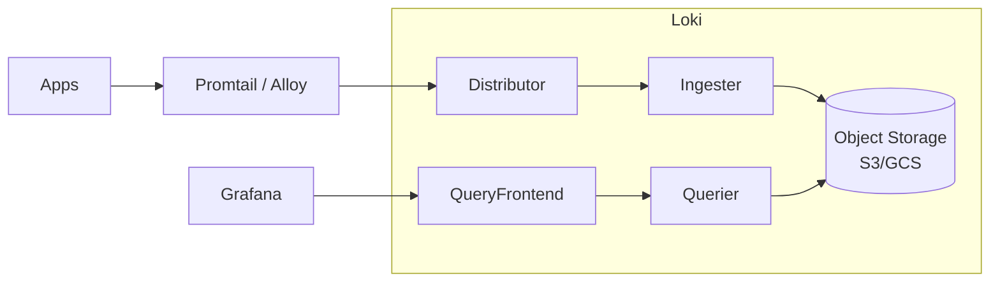

# Вопросы на собеседовании: `Loki и Grafana`

`Grafana Loki` — система агрегации логов от Grafana Labs (с 2018). **«Like Prometheus, but for logs»** — индексирует только labels, сырые логи хранятся в сжатом виде. Намного дешевле ELK. **PLG stack** = Promtail + Loki + Grafana. Часто комбинируется с **Tempo** (трейсы) + **Mimir** (метрики) = полный Grafana stack.

## Полезные ссылки

### Официальная документация и авторитетные источники

- [Grafana Loki Documentation](https://grafana.com/docs/loki/latest/)
- [LogQL Documentation](https://grafana.com/docs/loki/latest/logql/)
- [Grafana Documentation](https://grafana.com/docs/grafana/latest/)
- [Promtail Documentation](https://grafana.com/docs/loki/latest/clients/promtail/)
- [Grafana Alloy](https://grafana.com/docs/alloy/latest/) — successor to Promtail
- [Grafana LGTM stack](https://grafana.com/oss/) — Loki + Grafana + Tempo + Mimir

## Содержание

- [Полезные ссылки](#полезные-ссылки)
- [See also](#see-also)

**Базовые понятия**
- [Q1. (!) Что такое Loki?](#q1--что-такое-loki)
- [Q2. (!) Loki philosophy — "index labels, not content"?](#q2--loki-philosophy--index-labels-not-content)
- [Q3. (!) PLG (Promtail + Loki + Grafana) vs ELK?](#q3--plg-promtail--loki--grafana-vs-elk)

**Архитектура**
- [Q4. (!) Loki components?](#q4--loki-components)
- [Q5. Storage backends (S3, GCS, Cassandra)?](#q5-storage-backends-s3-gcs-cassandra)
- [Q6. (!) Streams и chunks в Loki?](#q6--streams-и-chunks-в-loki)
- [Q7. Monolithic vs Microservices vs Simple Scalable mode?](#q7-monolithic-vs-microservices-vs-simple-scalable-mode)

**Labels и индексация**
- [Q8. (!) Что такое labels в Loki?](#q8--что-такое-labels-в-loki)
- [Q9. (!) Cardinality — главная проблема?](#q9--cardinality--главная-проблема)
- [Q10. Static vs dynamic labels?](#q10-static-vs-dynamic-labels)

**LogQL**
- [Q11. (!) LogQL — query language?](#q11--logql--query-language)
- [Q12. Log stream selectors?](#q12-log-stream-selectors)
- [Q13. Filter expressions?](#q13-filter-expressions)
- [Q14. (!) Metric queries (LogQL → metrics)?](#q14--metric-queries-logql--metrics)

**Log shipping**
- [Q15. (!) Promtail vs Alloy vs Fluent Bit?](#q15--promtail-vs-alloy-vs-fluent-bit)
- [Q16. Pipeline stages в Promtail?](#q16-pipeline-stages-в-promtail)
- [Q17. K8s log discovery?](#q17-k8s-log-discovery)

**Grafana**
- [Q18. (!) Что такое Grafana?](#q18--что-такое-grafana)
- [Q19. Datasources в Grafana?](#q19-datasources-в-grafana)
- [Q20. Dashboards, panels, variables?](#q20-dashboards-panels-variables)
- [Q21. Alerting в Grafana?](#q21-alerting-в-grafana)
- [Q22. (!) Explore mode для troubleshooting?](#q22--explore-mode-для-troubleshooting)

**Full Grafana stack (LGTM)**
- [Q23. (!) Loki + Grafana + Tempo + Mimir?](#q23--loki--grafana--tempo--mimir)
- [Q24. Correlation logs ↔ traces ↔ metrics?](#q24-correlation-logs--traces--metrics)

**Production**
- [Q25. (!) Cost comparison Loki vs ELK?](#q25--cost-comparison-loki-vs-elk)
- [Q26. Какие частые проблемы в Loki production?](#q26-какие-частые-проблемы-в-loki-production)
- [Q27. (!) Когда выбрать Loki?](#q27--когда-выбрать-loki)
- [Q28. Когда не выбирать Loki?](#q28-когда-не-выбирать-loki)

## Q1. (!) Что такое Loki?

(!) Что такое Loki?

**Grafana Loki** — open-source-система агрегации логов от **Grafana Labs** (с 2018).

**Слоган:** «Like Prometheus, but for logs».

**Ключевая идея:** **не индексировать** текст логов, **только labels**. Сырые логи хранятся в сжатом виде в object storage (S3, GCS).

**Преимущества:**
- **В 10 раз дешевле**, чем ELK
- **Проще в эксплуатации**
- Тесно интегрирован с Prometheus (те же labels)
- Легко масштабируется до петабайтов

**Недостатки:**
- Медленнее полнотекстовый поиск (на основе grep)
- Слабее агрегации
- Менее зрелая экосистема

## Q2. (!) Loki philosophy — "index labels, not content"?

**Традиционный подход (ELK):**
```
Index every word from log line
→ Fast search, but expensive storage + indexing CPU
```

**Loki:**
```
Index only labels: {app="my-app", env="prod", level="error"}
Store raw log lines compressed
Search: filter by labels first → grep through compressed chunks
→ Cheap storage, slower full-text search
```

**Компромисс:**
- ELK: **индексировать всё** = быстрый поиск, дорого
- Loki: **индексировать только labels** = дёшево, медленнее текстовый поиск

**Для большинства запросов по логам** labels достаточно (фильтрация по service/env). Полнотекстовый grep — вторичный сценарий использования.

## Q3. (!) PLG (Promtail + Loki + Grafana) vs ELK?

| Критерий | PLG (Loki) | ELK |
|----------|-----------|-----|
| Стоимость хранения | $ (object storage) | $$$ (Elasticsearch) |
| Потребление ресурсов | Низкое (Go) | Высокое (JVM) |
| Скорость поиска | Медленнее (grep) | Быстрая (по индексу) |
| Полнотекстовый запрос | Медленнее | Быстрый |
| Агрегации | Ограниченные | Мощные |
| Сложность эксплуатации | Ниже | Выше |
| Экосистема | Растущая | Зрелая |
| Лучше всего для | Экономия бюджета, простые сценарии | Сложный поиск, аналитика |

**Выбор:** простой разбор логов → Loki. Сложный SIEM, аналитика → ELK.

## Q4. (!) Loki components?



**Компоненты:**
- **Distributor** — принимает логи, валидирует, перенаправляет в Ingester
- **Ingester** — буферизует логи, формирует chunks, записывает в storage
- **Querier** — обрабатывает запросы, извлекает chunks, фильтрует
- **Query Frontend** — разбиение запросов, кэширование
- **Compactor** — уплотняет индексы в storage
- **Index Gateway** — запросы к индексу (более новый компонент)

**Single-binary mode** — для небольших развёртываний.

## Q5. Storage backends (S3, GCS, Cassandra)?

**Loki поддерживает:**
- **S3** (AWS) — самый распространённый
- **GCS** (Google)
- **Azure Blob**
- **Filesystem** (только для dev)
- **Cassandra** (legacy-схемы)
- **DynamoDB / BigTable** (для индекса, schema v11)

**TSDB (более новый, schema v13)** — современный формат индекса, дешевле.

В **2025** для production — **S3-совместимый object storage** + схема TSDB.

## Q6. (!) Streams и chunks в Loki?

**Stream** — уникальная комбинация labels:
```
{app="my-app", env="prod", level="error"} → stream A
{app="my-app", env="prod", level="info"} → stream B
{app="other-app", env="prod"} → stream C
```

**Chunk** — сжатые строки логов из одного stream, накопленные за период (~ 5–15 мин) или по размеру (~ 1.5 MB).

**Хранение:**
```
s3://loki-bucket/chunks/<stream-hash>/<start-end-timestamp>
```

**Index** — знает, какие chunks содержат логи для labels, подходящих под запрос.

## Q7. Monolithic vs Microservices vs Simple Scalable mode?

**Monolithic (single binary):**
- Все компоненты в одном процессе
- Простое развёртывание
- До ~100 GB/день

**Simple Scalable Deployment (SSD):**
- 2 бинарника: Read + Write
- Рекомендуется для **большинства production**-нагрузок
- До нескольких TB/день

**Microservices:**
- Каждый компонент отдельно
- Максимальная гибкость / масштабирование
- Для **очень больших** масштабов (10+ TB/день)

В **2025** — **SSD mode** для большинства нагрузок.

## Q8. (!) Что такое labels в Loki?

**Labels** = пары ключ-значение, идентифицирующие log stream.

```
{job="my-app", env="prod", region="us-east", level="error"}
```

**Источник:**
- Статические (из конфига)
- Динамические (извлекаются из содержимого лога)
- Kubernetes labels (автоматически)

**Используются для:**
- **Выбора stream** (фильтрация логов по labels)
- **Индексации** (индексируются только labels)
- **Агрегации** (группировка по labels)

## Q9. (!) Cardinality — главная проблема?

**Cardinality** (кардинальность) = число уникальных комбинаций labels.

**Плохо:** `{user_id="123"}` — миллионы уникальных ID → миллионы streams → раздувание индекса.

**Хорошо:** `{service="api", env="prod"}` — ограниченное множество.

**Правила:**
- **Не используйте поля с высокой кардинальностью как labels** (user_id, request_id, IP)
- **Стремитесь** к < 10K streams на tenant суммарно
- **Мало labels** (< 10), ограниченные значения

**Если нужен поиск по user_id:** кладите его в содержимое строки лога и ищите через фильтр `|=`:
```logql
{service="api"} |= "user_id=123"
```

**Cardinality blowup** (раздувание кардинальности) = причина №1 production-проблем с Loki.

## Q10. Static vs dynamic labels?

**Static labels** — известны в конфиге (job, env).

**Dynamic labels** — извлекаются из содержимого лога в Promtail pipeline.

```yaml
# Bad — extract user_id as label (high cardinality)
- regex:
    expression: 'user_id=(?P<user_id>\d+)'
- labels:
    user_id:

# Good — keep user_id в content, не как label
```

**Best practice:** в качестве labels — только поля с ограниченным набором значений.

## Q11. (!) LogQL — query language?

**LogQL** — язык запросов Loki. Вдохновлён **PromQL**.

**Базовая структура:**
```
{label_selector} | filter_expression
```

**Примеры:**
```
# All logs from app
{app="my-app"}

# Filter by content
{app="my-app"} |= "error"

# Multi-conditions
{app="my-app", env="prod"} |= "error" != "timeout"

# Regex
{app="my-app"} |~ "user_id=\d{6}"

# Parse JSON
{app="my-app"} | json | level="error"
```

## Q12. Log stream selectors?

**Stream selector** — `{label="value"}`. Отбирает streams (какие читать).

**Операторы:**
- `=` — равно
- `!=` — не равно
- `=~` — совпадение по regex
- `!~` — несовпадение по regex

```
{app="my-app"}                           # equal
{app=~"my-.*"}                           # regex
{app="my-app", env=~"prod|staging"}      # multiple
{env!="dev"}                             # not equal
```

**Производительность:** stream selectors **сильно** влияют на скорость. Чем точнее — тем быстрее.

## Q13. Filter expressions?

После selector идут **line filters** (фильтры строк):

```
{app="my-app"}
  |= "error"           # contains "error"
  != "timeout"         # doesn't contain "timeout"
  |~ "user_id=\d+"     # regex match
  !~ "internal-debug"  # regex doesn't match
```

**Parser stages (стадии парсинга):**
```
{app="my-app"} | json                       # parse JSON
{app="my-app"} | logfmt                      # parse logfmt
{app="my-app"} | regexp "(?P<level>\w+)"     # extract via regex
{app="my-app"} | json | level="error"        # filter on extracted field
```

## Q14. (!) Metric queries (LogQL → metrics)?

**Логи → метрики** — через агрегации LogQL.

```
# Rate of errors
rate({app="my-app"} |= "error" [5m])

# Top services by log volume
topk(5, sum by (service) (rate({env="prod"}[5m])))

# Quantile of extracted duration
quantile_over_time(0.95, {app="api"} | json | unwrap duration_ms [5m])

# Count errors per minute
sum by (service) (count_over_time({env="prod"} |= "error" [1m]))
```

Это даёт **метрики в стиле Prometheus из логов**. Их можно использовать в Grafana-дашбордах и алертинге.

## Q15. (!) Promtail vs Alloy vs Fluent Bit?

**Promtail** — официальный агент Loki (Go).
- Лёгкий (~50 MB RAM)
- Service discovery (K8s)
- Pipeline stages для парсинга

**Grafana Alloy** (с 2024) — преемник Promtail.
- Мультипротокольный (Loki, Tempo, Mimir, Prometheus, OTLP)
- Конфиг на основе компонентов (HCL-подобный)
- Заменяет Grafana Agent + Promtail

**Fluent Bit** — альтернатива (CNCF).
- Лёгкий (5 MB RAM)
- Несколько выходов (Loki, ES, Kafka)
- Production-grade

**Vector** (Datadog OSS) — современная альтернатива, быстрый, на Rust.

В **2025** — **Alloy** для Grafana stack. **Fluent Bit** для мультивендорных сценариев.

## Q16. Pipeline stages в Promtail?

**Стадии:**
- **regex** / **json** / **logfmt** — парсинг
- **labels** — извлечение labels
- **template** — изменение
- **timestamp** — парсинг timestamp
- **output** — изменение строки лога
- **drop** — отбрасывание подходящих логов
- **multiline** — объединение многострочных записей (stack traces)

```yaml
pipeline_stages:
  - json:
      expressions:
        level: level
        msg: message
  - labels:
      level:
  - timestamp:
      source: timestamp
      format: RFC3339
```

## Q17. K8s log discovery?

**Promtail / Alloy в K8s** автоматически обнаруживают pods через K8s API:

```yaml
scrape_configs:
  - job_name: kubernetes-pods
    kubernetes_sd_configs:
      - role: pod
    relabel_configs:
      - source_labels: [__meta_kubernetes_namespace]
        target_label: namespace
      - source_labels: [__meta_kubernetes_pod_name]
        target_label: pod
      - source_labels: [__meta_kubernetes_pod_label_app]
        target_label: app
```

**Логи берутся из container logs** (`/var/log/pods/...`).

**Альтернатива:** stdout каждого pod → читает DaemonSet-коллектор.

## Q18. (!) Что такое Grafana?

**Grafana** — open-source-платформа визуализации. Дашборды + алертинг для observability-данных.

**Datasources:** поддерживается 100+:
- Prometheus, Loki, Tempo, Mimir
- Elasticsearch, OpenSearch
- InfluxDB, Graphite
- PostgreSQL, MySQL
- CloudWatch, Datadog, NewRelic
- И многие другие

**Стандартный инструмент** для observability-дашбордов.

## Q19. Datasources в Grafana?

```yaml
datasources:
  - name: Prometheus
    type: prometheus
    url: http://prometheus:9090
  - name: Loki
    type: loki
    url: http://loki:3100
  - name: Tempo
    type: tempo
    url: http://tempo:3200
```

Одна Grafana → много datasources → единая визуализация.

**Смешанные datasources в одном дашборде** — например, метрика latency (Prometheus) + связанные логи (Loki) + trace (Tempo).

## Q20. Dashboards, panels, variables?

**Dashboard** = набор панелей.

**Типы панелей:**
- Time series (линия, область, бары)
- Stat (одно значение)
- Gauge
- Table
- Logs panel
- Heatmap
- Pie chart
- World map

**Variables** — выпадающие списки в дашборде для динамической фильтрации:
```
${env}      → values from query (env labels)
${service}  → multi-select services
```

Один дашборд работает для **разных окружений** через variables.

**Provisioning:** дашборды как код (JSON), закоммиченные в git.

## Q21. Alerting в Grafana?

**Unified Alerting** (Grafana 8+):
- Alert rules можно задавать сразу для нескольких datasources
- Каналы уведомлений (Slack, PagerDuty, email, webhook)
- Маршрутизация, заглушение (silencing), подавление (inhibition)

```yaml
- name: HighErrorRate
  query: rate(http_errors_total[5m]) > 10
  for: 5m
  labels:
    severity: critical
  annotations:
    summary: "High error rate detected"
```

**Alertmanager** (Prometheus) — альтернатива.

## Q22. (!) Explore mode для troubleshooting?

**Explore** — режим ad-hoc-запросов (в противовес дашбордам).

**Сценарий:** разбор инцидента.

```
1. Open Explore с Loki datasource
2. {app="my-app", env="prod"} |= "error"
3. See logs over time
4. Click trace_id → switch к Tempo datasource
5. See full distributed trace
```

**Split view** — запросы к 2 datasources бок о бок.

**Drill-down** — кликабельные trace_id → переход в Tempo.

## Q23. (!) Loki + Grafana + Tempo + Mimir?

**LGTM Stack** = полный observability-стек от Grafana.

| Инструмент | Назначение | «Аналог» |
|------|-----------|--------|
| **Loki** | Логи | ELK |
| **Grafana** | Визуализация | — |
| **Tempo** | Трейсы | Jaeger |
| **Mimir** | Метрики | Prometheus (долгосрочное хранение) |
| **Pyroscope** | Профили | (continuous profiling) |
| **Beyla** / **Faro** | Авто-инструментирование, RUM | — |

**Все** open-source, **все** на основе labels, **все** на object storage (S3) — ради дешевизны.

**Эпохальная** альтернатива дорогим вендорским стекам.

## Q24. Correlation logs ↔ traces ↔ metrics?

**Сценарий работы:**

1. Всплеск latency (метрики из Prometheus)
2. → Кликаем trace_id в Grafana → видим медленный trace в Tempo
3. → Кликаем trace_id → ищем в Loki логи с этим trace_id
4. → Видим ERROR-сообщение в логе → понимаем root cause

**Настройка:** добавляйте `trace_id` в логи и единообразно проставляйте `service.name` во всех системах.

```python
logger.info("Processing", extra={"trace_id": current_span.context.trace_id})
```

В Grafana **derived fields** делают trace_id кликабельным в logs panel.

## Q25. (!) Cost comparison Loki vs ELK?

**Пример:** 1 TB логов/день, retention 7 дней.

**ELK:**
- Хранение: 7 TB × $0.10/GB/мес = $700/мес
- Compute (3 data-ноды): $1500/мес
- Лицензия (платные фичи Elastic): $$$
- **Итого: $2200+/мес**

**Loki:**
- Хранение: 7 TB × S3 ($0.023/GB) = $160/мес
- Compute (компактнее, Go): $300/мес
- **Итого: $460/мес**

**Примерно в 5 раз дешевле.**

На практике: enterprise-компании сообщают об экономии **70–90%** при переходе на Loki.

**Цена компромисса:** запросы медленнее (особенно полнотекстовый grep).

## Q26. Какие частые проблемы в Loki production?

1. **Labels с высокой кардинальностью** — раздувание индекса
2. **Медленные запросы** — широкий временной диапазон + grep
3. **Изоляция tenant** — один tenant перегружает кластер
4. **Стоимость object storage** — добавляются операции list/read
5. **Out-of-order ingestion** — старый Loki не принимал (в новых версиях OK)
6. **Подбор размера chunk** — слишком маленький = высокий overhead
7. **Неверный retention** — забыли выставить TTL → расходы растут
8. **Ошибки в конфиге Promtail** — тихая потеря логов
9. **Нет алертинга** на сбои ingestion

## Q27. (!) Когда выбрать Loki?

**Выбирай Loki, когда:**
- Важна **стоимость**
- Уже используете **Grafana** + **Prometheus**
- Логи в основном **структурированные** (JSON, key-value)
- Фильтрация преимущественно по **labels**
- Экосистема K8s
- Важна простота эксплуатации

**Лучше всего подходит:** современная cloud-native-команда, K8s, микросервисы, экономия бюджета.

## Q28. Когда не выбирать Loki?

**Не выбирай Loki, когда:**
- Нужен **сложный полнотекстовый поиск** по всем логам
- Тяжёлые **агрегации / аналитика**
- Требуются фичи compliance / SIEM
- Уже глубоко завязаны на ELK
- Нужен **APM** в одном инструменте

**Альтернативы:** ELK для нагрузки на поиск, **ClickHouse** для тяжёлой аналитики, **SigNoz** для полноценного APM.

## See also

- [OpenTelemetry](opentelemetry-interview.md) — modern standard
- [ELK Stack](elk-stack-interview.md) — alternative для logs
- [Jaeger / Zipkin](jaeger-zipkin-interview.md) — для traces (alternative Tempo)
- [Prometheus + Grafana](prometheus-grafana-interview.md) — для metrics (alternative Mimir)
- [Observability](observability-interview.md) — общая концепция
- [Logging](../logging/logging-interview.md) — application logging
- [Стратегии логирования](logging-strategies-interview.md) — best practices
- [Микросервисы](../architecture/microservices-interview.md) — где Loki shines
- [Kubernetes](../devops/kubernetes-interview.md) — log discovery
- [Cloud-native Patterns](../cloud/cloud-native-patterns-interview.md) — observability
- [Caching](../architecture/caching-strategies-interview.md) — для query performance

- [Jaeger и Zipkin](jaeger-zipkin-interview.md)
- [Стратегии логирования](logging-strategies-interview.md)
- [Метрики и трейсинг](metrics-tracing-interview.md)
- [Observability](observability-interview.md)
- [OpenTelemetry](opentelemetry-interview.md)
