# Вопросы на собеседовании: Метрики и трейсинг

Комплексное руководство по вопросам собеседования на тему метрик и трейсинга для `Senior Java Developer`.

**Метрики и трейсинг** — два из трёх столпов наблюдаемости (observability) наряду с логированием. Вопросы по этой теме регулярно встречаются на собеседованиях для senior-позиций, так как работа с `Prometheus`, `Micrometer`, `OpenTelemetry`, `Jaeger` и `Grafana` — повседневная задача в микросервисной архитектуре. Подробнее о наблюдаемости в целом — в [вопросах по Observability](observability-interview.md).

## Полезные ссылки

### Официальная документация

- [OpenTelemetry Documentation](https://opentelemetry.io/docs/) — стандарт инструментирования
- [Prometheus Documentation](https://prometheus.io/docs/) — система мониторинга
- [Micrometer Documentation](https://micrometer.io/docs) — фасад метрик для Java
- [Grafana Documentation](https://grafana.com/docs/) — визуализация и дашборды
- [Jaeger Documentation](https://www.jaegertracing.io/docs/) — распределённая трассировка
- [Spring Boot Actuator](https://docs.spring.io/spring-boot/docs/current/reference/html/actuator.html) — эндпоинты мониторинга
- [Monitor a Spring Boot App Using Prometheus](https://www.baeldung.com/spring-boot-prometheus) — интеграция Spring Boot с Prometheus
- [Quick Guide to Micrometer](https://www.baeldung.com/micrometer) — обзор Micrometer: метрики для JVM
- [Spring Cloud - Tracing Services with Zipkin](https://www.baeldung.com/tracing-services-with-zipkin) — трассировка с Zipkin и Spring Cloud
- [OpenTelemetry Setup in Spring Boot Application](https://www.baeldung.com/spring-boot-opentelemetry-setup) — настройка OpenTelemetry в Spring Boot

## Содержание

- [Полезные ссылки](#полезные-ссылки)
- [See also](#see-also)

**Основы: метрики vs логи vs трейсы**
- [Q1. (!) Чем метрики отличаются от логов и трейсов?](#q1--чем-метрики-отличаются-от-логов-и-трейсов)
- [Q19. Что такое RED и USE методологии для метрик?](#q19-что-такое-red-и-use-методологии-для-метрик)
- [Q25. Как выбрать между метриками и трейсами для отладки?](#q25-как-выбрать-между-метриками-и-трейсами-для-отладки)
- [Q26. Что такое RED-метрики и USE-метрики?](#q26-что-такое-red-метрики-и-use-метрики)

**Prometheus и Micrometer**
- [Q2. (!) Что такое Prometheus и как он собирает метрики?](#q2--что-такое-prometheus-и-как-он-собирает-метрики)
- [Q3. (!) Что такое Micrometer и как он связан с Prometheus?](#q3--что-такое-micrometer-и-как-он-связан-с-prometheus)
- [Q4. (!) Какие типы метрик бывают (counter, gauge, histogram, summary)?](#q4--какие-типы-метрик-бывают-counter-gauge-histogram-summary)
- [Q10. Как интегрировать Micrometer с Spring Boot?](#q10-как-интегрировать-micrometer-с-spring-boot)
- [Q11. Что такое экспоненциальные гистограммы в метриках?](#q11-что-такое-экспоненциальные-гистограммы-в-метриках)
- [Q12. Как настроить метрики JVM (память, потоки, GC)?](#q12-как-настроить-метрики-jvm-память-потоки-gc)
- [Q13. Что такое custom metrics и когда их добавлять?](#q13-что-такое-custom-metrics-и-когда-их-добавлять)
- [Q17. (!) Что такое cardinality метрик и почему она важна?](#q17--что-такое-cardinality-метрик-и-почему-она-важна)
- [Q20. Как экспортировать метрики в Prometheus из Java?](#q20-как-экспортировать-метрики-в-prometheus-из-java)

**Распределённая трассировка**
- [Q5. (!) Что такое распределённая трассировка и зачем она нужна?](#q5--что-такое-распределённая-трассировка-и-зачем-она-нужна)
- [Q6. (!) Что такое OpenTelemetry и как он связан с трассировкой?](#q6--что-такое-opentelemetry-и-как-он-связан-с-трассировкой)
- [Q7. Что такое span и trace в трассировке?](#q7-что-такое-span-и-trace-в-трассировке)
- [Q8. Как передать контекст трассировки между микросервисами?](#q8-как-передать-контекст-трассировки-между-микросервисами)
- [Q15. Что такое Jaeger и Zipkin и чем они отличаются?](#q15-что-такое-jaeger-и-zipkin-и-чем-они-отличаются)
- [Q16. Как настроить трассировку в Spring Boot (OpenTelemetry)?](#q16-как-настроить-трассировку-в-spring-boot-opentelemetry)
- [Q23. Что такое traceId и spanId и как они связаны?](#q23-что-такое-traceid-и-spanid-и-как-они-связаны)

**Sampling и оптимизация**
- [Q9. Что такое sampling в трассировке и когда его применять?](#q9-что-такое-sampling-в-трассировке-и-когда-его-применять)
- [Q24. Как уменьшить объём данных трассировки в prod?](#q24-как-уменьшить-объём-данных-трассировки-в-prod)
- [Q27. Как уменьшить объём и стоимость хранения трейсов в production?](#q27-как-уменьшить-объём-и-стоимость-хранения-трейсов-в-production)
- [Q28. Что такое sampling в трассировке и когда его применять?](#q28-что-такое-sampling-в-трассировке-и-когда-его-применять)

**Связь метрик и трейсов, алертинг**
- [Q14. (!) Как связать метрики и трейсы (например, в Grafana)?](#q14--как-связать-метрики-и-трейсы-например-в-grafana)
- [Q18. Как метрики и трейсы помогают при инцидентах?](#q18-как-метрики-и-трейсы-помогают-при-инцидентах)
- [Q21. Что такое exemplars и зачем они нужны?](#q21-что-такое-exemplars-и-зачем-они-нужны)
- [Q22. Как настроить алерты по метрикам (Prometheus, Alertmanager)?](#q22-как-настроить-алерты-по-метрикам-prometheus-alertmanager)
- [Q29. Как связать метрики приложения с бизнес-метриками?](#q29-как-связать-метрики-приложения-с-бизнес-метриками)
- [Q30. Как организовать алертинг по метрикам и трейсам?](#q30-как-организовать-алертинг-по-метрикам-и-трейсам)

**W3C TraceContext, Zipkin, бизнес-метрики**
- [Q31. (!) Что такое W3C TraceContext и зачем это стандарт?](#q31--что-такое-w3c-tracecontext-и-зачем-это-стандарт)
- [Q32. Как настроить Micrometer с кастомными тегами для бизнес-метрик?](#q32-как-настроить-micrometer-с-кастомными-тегами-для-бизнес-метрик)
- [Q33. Как интегрировать Zipkin в Spring Boot приложение?](#q33-как-интегрировать-zipkin-в-spring-boot-приложение)

**Расширенные темы: Micrometer, OpenTelemetry, SLI/SLO**
- [Q34. (!) Какие типы инструментов предоставляет Micrometer — Counter, Gauge, Timer, DistributionSummary?](#q34--какие-типы-инструментов-предоставляет-micrometer--counter-gauge-timer-distributionsummary)
- [Q35. Что такое OpenTelemetry Collector и как его использовать?](#q35-что-такое-opentelemetry-collector-и-как-его-использовать)
- [Q36. (!) Что такое SLI, SLO и SLA — определения, расчёт, error budget?](#q36--что-такое-sli-slo-и-sla--определения-расчёт-error-budget)
- [Q37. Как работает tail-based sampling в трассировке?](#q37-как-работает-tail-based-sampling-в-трассировке)
- [Q38. Что такое Exemplars и как они связывают метрики с трейсами?](#q38-что-такое-exemplars-и-как-они-связывают-метрики-с-трейсами)
- [Q39. (!) Что такое проблема высокой кардинальности в метриках и как её избежать?](#q39--что-такое-проблема-высокой-кардинальности-в-метриках-и-как-её-избежать)
- [Q40. Как реализовать context propagation в distributed tracing — W3C TraceContext и B3?](#q40-как-реализовать-context-propagation-в-distributed-tracing--w3c-tracecontext-и-b3)
- [Q41. Какие SLI использовать для разных типов сервисов?](#q41-какие-sli-использовать-для-разных-типов-сервисов)

## Метрики

## Q1. (!) Чем метрики отличаются от логов и трейсов?

Это три разных сигнала наблюдаемости, и различаются они тем, на какой вопрос отвечают. Коротко: метрики говорят «что происходит в целом», трейсы — «где в одном запросе ушло время», логи — «что именно случилось в конкретный момент».

- **Метрики** — агрегированные числа во времени (счётчики, gauge, гистограммы). Малый объём, дёшево хранить долго; основа для алертов и дашбордов. Отвечают на «насколько плохо», но не «почему».
- **Логи** — дискретные события с текстом и контекстом. Большой объём; для отладки и аудита конкретных случаев. Дают детали, но по ним тяжело увидеть общую картину.
- **Трейсы** — цепочка операций (spans) одного запроса по мере прохождения через сервисы. Показывают задержки по узлам и зависимости между вызовами. Отвечают на «где именно медленно».

Сигналы не заменяют, а дополняют друг друга и связаны общим `traceId`: по метрике видишь проблему, по трейсу — какой участок виноват, по логам (отфильтрованным по тому же `traceId`) — детали.

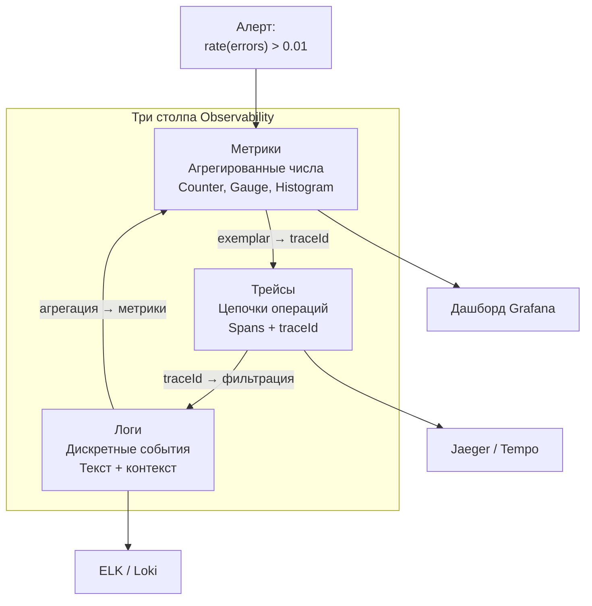

**Типичный сценарий расследования инцидента:** алерт по метрике (например, рост ошибок) -> открыть трейсы за период -> найти медленные/ошибочные запросы по `traceId` -> по `traceId` отфильтровать логи и локализовать причину. Подробнее о стратегиях логирования — в [вопросах по логированию](logging-strategies-interview.md).

## Q2. (!) Что такое Prometheus и как он собирает метрики?

**Prometheus** — система мониторинга с **pull-моделью**: не приложения шлют метрики, а сам `Prometheus` периодически опрашивает (scrape) их `HTTP`-эндпоинты (обычно `/actuator/prometheus` в `Spring Boot`). Метрики приходят в простом текстовом формате, складываются в локальную БД временных рядов (TSDB), а читаются запросами на языке `PromQL`.

Почему именно pull, а не push: `Prometheus` сам знает, какие цели должен опрашивать, поэтому пропавшая цель сразу видна (scrape не удался = инстанс «лёг»), нет проблемы с забытыми источниками, а нагрузку на сбор контролирует сам сервер.

- **Плюсы:** простой формат экспозиции; мощный `PromQL`; нативная интеграция с `Grafana` и `Alertmanager`.
- **Минусы:** pull неудобен для short-lived задач и динамических сред — в `Kubernetes` это решает Service Discovery (автообнаружение целей).

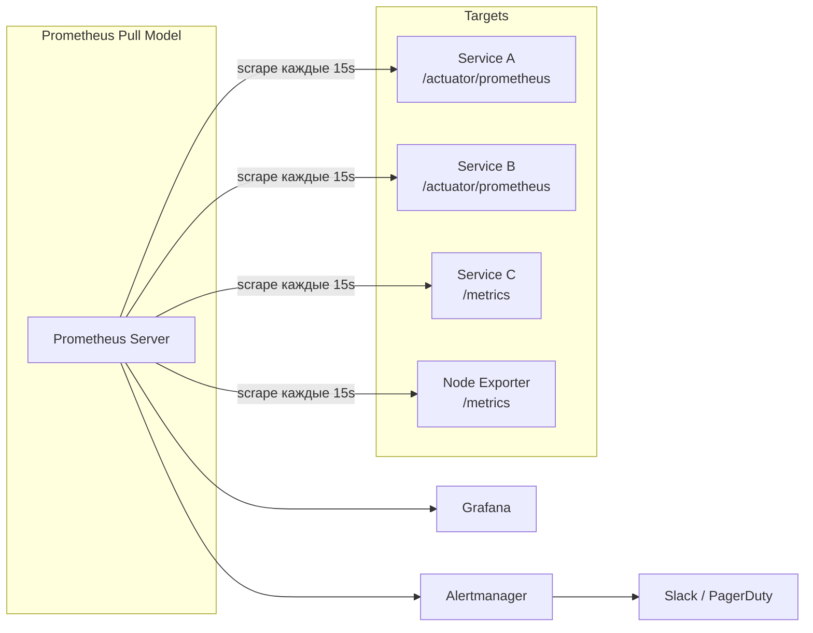

**Пример конфигурации `prometheus.yml`:**

```yaml
global:
  scrape_interval: 15s
  evaluation_interval: 15s

rule_files:
  - "alert_rules.yml"

alerting:
  alertmanagers:
    - static_configs:
        - targets: ['alertmanager:9093']

scrape_configs:
  - job_name: 'spring-boot-apps'
    metrics_path: '/actuator/prometheus'
    scrape_interval: 15s
    # Статическая конфигурация
    static_configs:
      - targets: ['order-service:8080', 'payment-service:8080']
        labels:
          env: 'production'

  # Kubernetes Service Discovery
  - job_name: 'kubernetes-pods'
    kubernetes_sd_configs:
      - role: pod
    relabel_configs:
      - source_labels: [__meta_kubernetes_pod_annotation_prometheus_io_scrape]
        action: keep
        regex: true
      - source_labels: [__meta_kubernetes_pod_annotation_prometheus_io_path]
        action: replace
        target_label: __metrics_path__
        regex: (.+)
```

В [Kubernetes](../devops/kubernetes-interview.md) используют `ServiceMonitor` (`Prometheus Operator`) или аннотации на `Pods` / `Service` для автообнаружения целей.

## Q3. (!) Что такое Micrometer и как он связан с Prometheus?

`Micrometer` — это фасад для метрик в `Java`, такой же, как `SLF4J` для логов. Код регистрирует счётчики, gauge и таймеры через единый API `Micrometer`, не зная, куда они уедут; конкретный бэкенд подключается отдельной зависимостью-биндингом. Это значит, что сменить `Prometheus` на `Datadog` или `InfluxDB` можно без правок бизнес-кода — меняется только зависимость.

Связь с `Prometheus`: биндинг `micrometer-registry-prometheus` берёт зарегистрированные метрики и отдаёт их в текстовом формате `Prometheus`, который тот scrape'ит. В [Spring Boot](../frameworks/spring/spring-boot-interview.md) `Micrometer` включён по умолчанию: достаточно добавить эту зависимость, и эндпоинт `/actuator/prometheus` даёт готовый экспорт.

**Зависимости в `build.gradle`:**

```groovy
dependencies {
    implementation 'org.springframework.boot:spring-boot-starter-actuator'
    implementation 'io.micrometer:micrometer-registry-prometheus'
}
```

**Конфигурация в `application.yml`:**

```yaml
management:
  endpoints:
    web:
      exposure:
        include: prometheus, health, info, metrics
  metrics:
    tags:
      application: ${spring.application.name}
    distribution:
      percentiles-histogram:
        http.server.requests: true
      sla:
        http.server.requests: 100ms, 500ms, 1s, 5s
```

**Пример регистрации кастомных метрик:**

```java
@Service
@RequiredArgsConstructor
public class PaymentService {

    private final MeterRegistry registry;

    private Counter paymentSuccessCounter;
    private Counter paymentFailureCounter;
    private Timer paymentProcessingTimer;
    private AtomicInteger activePayments = new AtomicInteger(0);

    @PostConstruct
    void initMetrics() {
        paymentSuccessCounter = Counter.builder("payments.completed")
                .tag("status", "success")
                .description("Число успешных платежей")
                .register(registry);

        paymentFailureCounter = Counter.builder("payments.completed")
                .tag("status", "failure")
                .description("Число неуспешных платежей")
                .register(registry);

        paymentProcessingTimer = Timer.builder("payments.processing.duration")
                .description("Время обработки платежа")
                .publishPercentiles(0.5, 0.95, 0.99)
                .register(registry);

        Gauge.builder("payments.active", activePayments, AtomicInteger::get)
                .description("Число платежей в обработке")
                .register(registry);
    }

    public PaymentResult processPayment(PaymentRequest request) {
        activePayments.incrementAndGet();
        try {
            return paymentProcessingTimer.record(() -> {
                PaymentResult result = doProcess(request);
                if (result.isSuccess()) {
                    paymentSuccessCounter.increment();
                } else {
                    paymentFailureCounter.increment();
                }
                return result;
            });
        } finally {
            activePayments.decrementAndGet();
        }
    }
}
```

Метрики `JVM`, `HTTP` и пулов появятся автоматически — их не надо регистрировать руками. Главное правило при регистрации своих метрик: не давать лейблам высокую cardinality (уникальные значения по `user_id` и т.п.) — это раздувает число временных рядов в `Prometheus` (подробнее — Q17).

## Q4. (!) Какие типы метрик бывают (counter, gauge, histogram, summary)?

Четыре базовых типа, и выбор между ними определяется характером величины: монотонно растёт она или может падать, и нужно ли видеть распределение значений, а не одно число.

| Тип | Описание | Пример | Micrometer API |
|-----|----------|--------|----------------|
| **Counter** | Монотонно растущее значение | Число запросов, ошибок | `Counter` |
| **Gauge** | Текущее значение (может расти и падать) | Размер очереди, память | `Gauge` |
| **Histogram** | Распределение значений по бакетам | Латентность запросов | `Timer`, `DistributionSummary` |
| **Summary** | Квантили на стороне приложения | Латентность (не агрегируемо) | Не рекомендуется в Prometheus |

```java
@Component
@RequiredArgsConstructor
public class MetricsExamples {

    private final MeterRegistry registry;

    // Counter — монотонно растёт
    public void countRequest(String endpoint) {
        registry.counter("http.requests.total",
                "endpoint", endpoint,
                "method", "GET"
        ).increment();
    }

    // Gauge — текущее значение
    public void registerQueueGauge(BlockingQueue<?> queue) {
        Gauge.builder("queue.size", queue, BlockingQueue::size)
                .tag("queue", "orders")
                .register(registry);
    }

    // Timer (Histogram) — распределение времени
    public <T> T measureDuration(String name, Supplier<T> action) {
        return Timer.builder(name)
                .publishPercentiles(0.5, 0.95, 0.99)
                .publishPercentileHistogram()
                .register(registry)
                .record(action);
    }

    // DistributionSummary — распределение размеров (не время)
    public void recordPayloadSize(int bytes) {
        DistributionSummary.builder("http.response.size")
                .baseUnit("bytes")
                .publishPercentiles(0.5, 0.95)
                .register(registry)
                .record(bytes);
    }
}
```

Главное различие между `Histogram` и `Summary` — где считаются квантили. `Histogram` хранит счётчики по корзинам (buckets) и общую сумму, а сами квантили вычисляются уже на сервере через `PromQL` (`histogram_quantile`). `Summary` считает квантили прямо в приложении и отдаёт готовое число.

Почему в `Prometheus` предпочитают `Histogram`: квантили `Summary` неагрегируемы. Нельзя усреднить p99 двух инстансов и получить общий p99 сервиса — это математически неверно. Бакеты `Histogram` складываются между инстансами без потерь, поэтому общий квантиль по всему сервису считается корректно.

## Q5. (!) Что такое распределённая трассировка и зачем она нужна?

Распределённая трассировка — это запись полной цепочки операций (spans) одного запроса, пока он проходит через несколько сервисов. Каждый шаг (HTTP-вызов, запрос к БД, отправка в очередь) фиксируется со своим временем, и в итоге виден весь путь запроса как дерево.

Зачем она нужна: в [микросервисах](../architecture/microservices-interview.md) без трассировки видна только латентность на входе («запрос занял 2 секунды»), а вся цепочка внутренних вызовов — «чёрный ящик». Трассировка вскрывает этот ящик и показывает, какой именно сервис или какая БД съели время, то есть позволяет точечно найти узкое место вместо угадывания.

```mermaid
gantt
    title Trace: POST /api/orders (traceId: abc123)
    dateFormat X
    axisFormat %s ms

    section API Gateway
    Входящий HTTP запрос        :a1, 0, 350

    section Order Service
    Валидация заказа            :a2, 10, 50
    Сохранение в БД             :a3, 50, 150
    Вызов Payment Service       :a4, 150, 300

    section Payment Service
    Обработка платежа           :a5, 160, 280
    Вызов Bank API              :a6, 180, 260

    section Bank API
    Авторизация карты           :a7, 190, 250
```

**Инструменты:** бэкенды для хранения и просмотра трейсов — `Jaeger`, `Zipkin`, `Tempo`; стандарт инструментирования кода — `OpenTelemetry`.

**Сценарий применения:** при инциденте по высокой латентности открываешь трейсы за период -> отбираешь медленные запросы -> по дереву spans сразу видишь, какой сервис или БД даёт задержку.

## Q6. (!) Что такое OpenTelemetry и как он связан с трассировкой?

`OpenTelemetry` (OTel) — открытый стандарт и набор `SDK / API` для всех трёх сигналов: трассировки, метрик и логов. Его идея — инструментировать код один раз через вендоронезависимый API, а конкретный бэкенд выбирать на этапе экспорта. Меняешь бэкенд (`Jaeger`, `Zipkin`, облачный сервис) — код не трогаешь.

Что `OpenTelemetry` делает для трассировки:

- генерирует spans и trace context (`traceId`, `spanId`);
- передаёт контекст между сервисами — через `HTTP`-заголовки, `gRPC` metadata, заголовки сообщений;
- экспортирует собранные трейсы в бэкенд (`Jaeger`, `Zipkin` и др.).

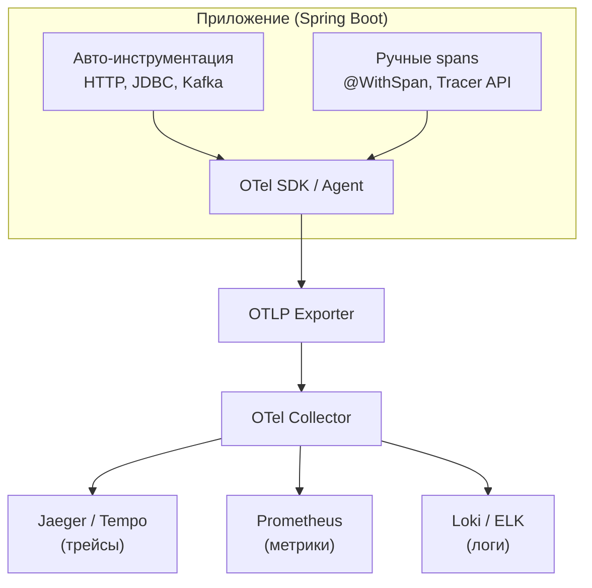

**Пример кастомного span через OpenTelemetry API:**

```java
@Service
@RequiredArgsConstructor
public class InventoryService {

    private final Tracer tracer;

    public boolean checkAvailability(String productId, int quantity) {
        Span span = tracer.spanBuilder("inventory.checkAvailability")
                .setAttribute("product.id", productId)
                .setAttribute("requested.quantity", quantity)
                .startSpan();

        try (Scope scope = span.makeCurrent()) {
            boolean available = queryWarehouse(productId, quantity);
            span.setAttribute("result.available", available);
            return available;
        } catch (Exception e) {
            span.setStatus(StatusCode.ERROR, e.getMessage());
            span.recordException(e);
            throw e;
        } finally {
            span.end();
        }
    }
}
```

**Пример с аннотацией `@WithSpan` (Spring Boot + OTel):**

```java
@Service
public class NotificationService {

    @WithSpan("notification.send")
    public void sendNotification(
            @SpanAttribute("notification.type") String type,
            @SpanAttribute("notification.recipient") String recipient) {
        // Span создаётся автоматически с указанными атрибутами
        doSend(type, recipient);
    }
}
```

## Q7. Что такое span и trace в трассировке?

`Span` — это одна операция: HTTP-вызов, запрос к БД, отправка в Kafka. У span есть имя, время начала и длительность, атрибуты и ссылка на родителя. `Trace` — это всё дерево spans одного запроса, объединённых общим `traceId`. Один запрос от клиента до ответа может породить десятки spans в разных сервисах.

Связь между ними иерархическая: span может иметь дочерние spans (вложенные вызовы), и по этому дереву виден полный путь запроса и время на каждом уровне — от корневого входящего HTTP до самого глубокого обращения к БД.

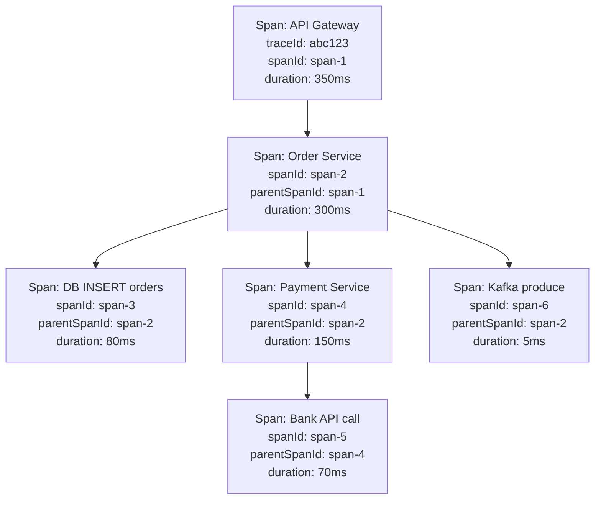

**Сценарий применения:** в `Jaeger / Zipkin` по `traceId` открывают дерево spans — корневой span обычно входящий `HTTP`, дочерние — вызовы к БД и другим сервисам. Длительность каждого span сразу показывает узкое место, а атрибуты (`http.method`, `db.statement`) позволяют фильтровать и искать нужные трейсы.

## Q8. Как передать контекст трассировки между микросервисами?

Чтобы spans из разных сервисов склеились в один trace, между сервисами нужно передавать trace context — `traceId`, `spanId` родителя и флаги sampling. Передаётся он в `HTTP`-заголовках по стандарту `W3C Trace Context`: заголовки `traceparent` (обязательный, с самим контекстом) и `tracestate` (опциональный, для вендор-специфичных данных).

Механика проста и работает по принципу inject/extract: вызывающая сторона (клиент или шлюз) создаёт корневой span и инжектирует контекст в исходящие заголовки; принимающий сервис извлекает контекст из заголовков и создаёт дочерний span, продолжающий тот же trace.

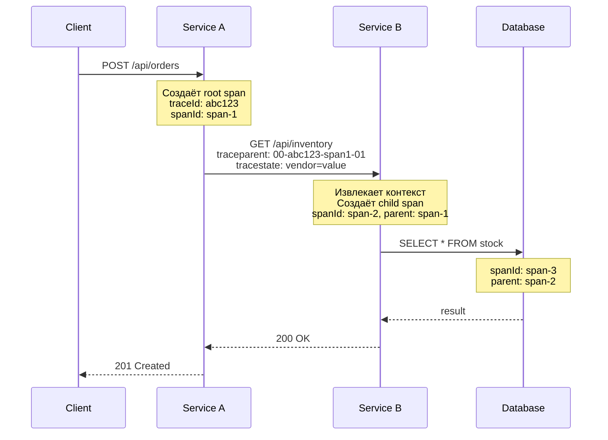

**Пример W3C `traceparent` заголовка:**

```
traceparent: 00-4bf92f3577b34da6a3ce929d0e0e4736-00f067aa0ba902b7-01
             ^^-^^^^^^^^^^^^^^^^^^^^^^^^^^^^^^^^-^^^^^^^^^^^^^^^^-^^
             |  trace-id (32 hex)                 parent-id (16)  flags
             version                                              (01 = sampled)
```

**Конфигурация пропагации в Spring Boot:**

```yaml
# application.yml
management:
  tracing:
    propagation:
      type: w3c  # или b3 для совместимости с Zipkin
    sampling:
      probability: 1.0  # 100% в dev, 0.1 в prod
```

На практике руками это писать почти не нужно: `OpenTelemetry` автоматически инжектирует и извлекает контекст для `RestTemplate`, `WebClient`, `Feign`, `gRPC` и `Kafka`. Контекст приходится прокидывать вручную только там, где запрос уходит в свой пул потоков или через нестандартный транспорт.

## Q9. Что такое sampling в трассировке и когда его применять?

`Sampling` — это решение, записывать ли конкретный trace или отбросить. Нужен он потому, что при высокой нагрузке сохранять все трейсы нереально: это дорого по хранению и трафику, а большинство «нормальных» успешных запросов для отладки бесполезны. Sampling оставляет репрезентативную или диагностически ценную часть.

Три основных стратегии различаются тем, в какой момент и по какому критерию принимается решение:

| Тип | Когда решение | Плюсы | Минусы |
|-----|---------------|-------|--------|
| **Head-based** | В начале трейса | Простой, предсказуемый overhead | Можно пропустить ошибочные трейсы |
| **Tail-based** | В конце трейса | Сохраняет ошибки и выбросы | Нужен Collector, буферизация |
| **Rate-limiting** | По квоте (N/сек) | Контролируемая нагрузка | Может пропустить важное |

```java
// Конфигурация sampling в OpenTelemetry Java SDK
@Configuration
public class TracingConfig {

    @Bean
    public SdkTracerProvider tracerProvider() {
        return SdkTracerProvider.builder()
                // Head-based: 10% трейсов в production
                .setSampler(Sampler.traceIdRatioBased(0.1))
                // Или ParentBased — уважает решение родителя
                // .setSampler(Sampler.parentBased(Sampler.traceIdRatioBased(0.1)))
                .addSpanProcessor(BatchSpanProcessor.builder(
                        OtlpGrpcSpanExporter.builder()
                                .setEndpoint("http://otel-collector:4317")
                                .build()
                ).build())
                .build();
    }
}
```

**Эмпирическое правило:** в dev держат 100% — нужна полная картина для отладки. В prod ставят 1-10% head-based либо tail-based (сохранять только ошибки и медленные). Во время инцидента sampling rate временно повышают, чтобы не упустить детали.

## Q10. Как интегрировать Micrometer с Spring Boot?

Интеграция почти бесплатная: `Micrometer` уже идёт в `spring-boot-starter-actuator`, поэтому нужно лишь добавить зависимость-биндинг `micrometer-registry-prometheus` и открыть эндпоинт в конфиге. После этого метрики `JVM`, `HTTP`, пулов соединений и т.д. начинают собираться сами, без единой строки кода.

**Полная конфигурация:**

```yaml
# application.yml
spring:
  application:
    name: order-service

management:
  endpoints:
    web:
      exposure:
        include: prometheus, health, info, metrics
  endpoint:
    health:
      show-details: when-authorized
  metrics:
    tags:
      application: ${spring.application.name}
      env: ${ENVIRONMENT:dev}
    distribution:
      percentiles-histogram:
        http.server.requests: true
      percentiles:
        http.server.requests: 0.5, 0.95, 0.99
      sla:
        http.server.requests: 100ms, 500ms, 1s
    enable:
      jvm: true
      process: true
      system: true
```

**Пример кастомной метрики с `@Timed`:**

```java
@RestController
@RequestMapping("/api/orders")
public class OrderController {

    @Timed(value = "orders.create",
           description = "Время создания заказа",
           percentiles = {0.5, 0.95, 0.99})
    @PostMapping
    public ResponseEntity<OrderResponse> createOrder(@RequestBody OrderRequest request) {
        // Timer автоматически замеряет время выполнения метода
        return ResponseEntity.ok(orderService.create(request));
    }
}

// Для работы @Timed нужен бин TimedAspect:
@Configuration
public class MetricsConfig {
    @Bean
    public TimedAspect timedAspect(MeterRegistry registry) {
        return new TimedAspect(registry);
    }
}
```

В результате эндпоинт `/actuator/prometheus` отдаёт все метрики в текстовом формате, который `Prometheus` scrape'ит при опросе.

## Q11. Что такое экспоненциальные гистограммы в метриках?

Экспоненциальная гистограмма — это гистограмма, у которой границы бакетов растут по экспоненте (1, 2, 4, 8, ...), а не задаются вручную фиксированным списком. Смысл такой раскладки в том, что латентность обычно имеет огромный разброс — от единиц миллисекунд до секунд. Линейная сетка бакетов либо потеряет точность на малых значениях, либо потребует сотни бакетов. Экспоненциальная сетка покрывает весь диапазон малым числом бакетов, сохраняя относительную точность на каждом масштабе. Поэтому в `Prometheus` и `OpenTelemetry` их используют для эффективного хранения и агрегации.

```java
// Настройка экспоненциальной гистограммы в Micrometer
@Configuration
public class HistogramConfig {

    @Bean
    MeterRegistryCustomizer<PrometheusMeterRegistry> histogramCustomizer() {
        return registry -> registry.config().meterFilter(
            new MeterFilter() {
                @Override
                public DistributionStatisticConfig configure(
                        Meter.Id id, DistributionStatisticConfig config) {
                    if (id.getName().startsWith("http.server.requests")) {
                        return DistributionStatisticConfig.builder()
                                .percentilesHistogram(true)
                                // Экспоненциальные бакеты для широкого диапазона
                                .minimumExpectedValue(Duration.ofMillis(1).toNanos())
                                .maximumExpectedValue(Duration.ofSeconds(30).toNanos())
                                .build()
                                .merge(config);
                    }
                    return config;
                }
            }
        );
    }
}
```

**Компромисс:** альтернатива — фиксированные бакеты, заданные вручную под известный диапазон; они проще, но негибки. Экспоненциальные выигрывают, когда диапазон широкий, а число бакетов хочется держать малым. В большинстве случаев ручная настройка не нужна: `Micrometer Timer` по умолчанию подбирает разумное распределение бакетов сам.

## Q12. Как настроить метрики JVM (память, потоки, GC)?

Специально настраивать почти нечего: в `Spring Boot` с `Micrometer` метрики `JVM` включаются автоматически — память, потоки, загрузка классов, GC. За это отвечают binder'ы, которые регистрируются при старте. Эндпоинт `/actuator/prometheus` сразу отдаёт `jvm_memory_used_bytes`, `jvm_threads_live_threads`, `jvm_gc_*` и др. Работа сводится не к сбору, а к построению дашбордов и алертов поверх готовых метрик.

**Пример Grafana dashboard JSON (панель JVM Memory):**

```json
{
  "panels": [
    {
      "title": "JVM Heap Memory",
      "type": "timeseries",
      "datasource": "Prometheus",
      "targets": [
        {
          "expr": "jvm_memory_used_bytes{area=\"heap\", application=\"$app\"}",
          "legendFormat": "{{id}} used"
        },
        {
          "expr": "jvm_memory_max_bytes{area=\"heap\", application=\"$app\"}",
          "legendFormat": "{{id}} max"
        }
      ],
      "fieldConfig": {
        "defaults": {
          "unit": "bytes",
          "thresholds": {
            "steps": [
              { "value": 0, "color": "green" },
              { "value": 0.8, "color": "yellow" },
              { "value": 0.9, "color": "red" }
            ]
          }
        }
      }
    },
    {
      "title": "GC Pause Duration",
      "type": "timeseries",
      "targets": [
        {
          "expr": "rate(jvm_gc_pause_seconds_sum{application=\"$app\"}[5m]) / rate(jvm_gc_pause_seconds_count{application=\"$app\"}[5m])",
          "legendFormat": "{{action}} {{cause}} avg"
        }
      ],
      "fieldConfig": { "defaults": { "unit": "s" } }
    },
    {
      "title": "Live Threads",
      "type": "stat",
      "targets": [
        {
          "expr": "jvm_threads_live_threads{application=\"$app\"}",
          "legendFormat": "Live threads"
        }
      ]
    }
  ],
  "templating": {
    "list": [
      {
        "name": "app",
        "type": "query",
        "query": "label_values(jvm_memory_used_bytes, application)"
      }
    ]
  }
}
```

**PromQL для ключевых алертов по JVM:**

```promql
# Heap utilization > 85%
jvm_memory_used_bytes{area="heap"} / jvm_memory_max_bytes{area="heap"} > 0.85

# GC паузы > 500ms
rate(jvm_gc_pause_seconds_sum[5m]) / rate(jvm_gc_pause_seconds_count[5m]) > 0.5

# Thread deadlock
jvm_threads_deadlocked_threads > 0
```

Подробнее о профилировании JVM — в [вопросах по JVM Performance Tuning](../performance/jvm-performance-tuning-interview.md).

## Q13. Что такое custom metrics и когда их добавлять?

`Custom` metrics — это метрики, которые приложение определяет само под свою предметную область: счётчик заказов, размер очереди задач, бизнес-события. Стандартные метрики (`JVM`, `HTTP`) отвечают на вопрос «здоров ли процесс», но ничего не знают о бизнес-логике. Свои метрики добавляют ровно тогда, когда стандартных не хватает, чтобы поставить алерт или сделать анализ — например, нужно следить за долей отклонённых платежей или ростом очереди.

```java
@Component
@RequiredArgsConstructor
public class BusinessMetrics {

    private final MeterRegistry registry;

    // Счётчик бизнес-событий с лейблами
    public void recordOrderCreated(String region, String paymentMethod) {
        registry.counter("business.orders.created",
                "region", region,
                "payment_method", paymentMethod
        ).increment();
    }

    // Gauge для отслеживания размера очереди
    public void registerQueueMetrics(BlockingQueue<?> queue, String queueName) {
        Gauge.builder("queue.size", queue, BlockingQueue::size)
                .tag("queue", queueName)
                .description("Текущий размер очереди " + queueName)
                .register(registry);
    }

    // FunctionCounter — для значений, которые только растут
    public void registerProcessedMessages(AtomicLong counter, String topic) {
        FunctionCounter.builder("kafka.messages.processed", counter, AtomicLong::get)
                .tag("topic", topic)
                .register(registry);
    }

    // Timer с SLA-бакетами
    public Timer createSlaTimer(String operation) {
        return Timer.builder("business." + operation + ".duration")
                .publishPercentiles(0.5, 0.95, 0.99)
                .serviceLevelObjectives(
                        Duration.ofMillis(100),
                        Duration.ofMillis(500),
                        Duration.ofSeconds(1)
                )
                .register(registry);
    }
}
```

**Подводные камни:** главная ошибка — высокая cardinality. Не вешать на метрику лейблы с уникальными значениями (по пользователю или запросу). Хорошие лейблы имеют малое и конечное множество значений: `status`, `endpoint`, `error_type`, `region`.

## Q14. (!) Как связать метрики и трейсы (например, в Grafana)?

Связать их можно на двух уровнях. Слабая связь — по времени и лейблам: в `Grafana` на одном дашборде рядом стоят запросы к `Prometheus` (метрики) и к `Jaeger / Tempo` (трейсы), и инженер вручную сопоставляет всплеск на графике с трейсами за тот же момент. Сильная связь — через `Exemplars`: это прямые ссылки от конкретной точки метрики к конкретному trace. По клику на пик на графике `Grafana` сразу открывает именно тот трейс, который дал этот выброс, без ручного поиска.

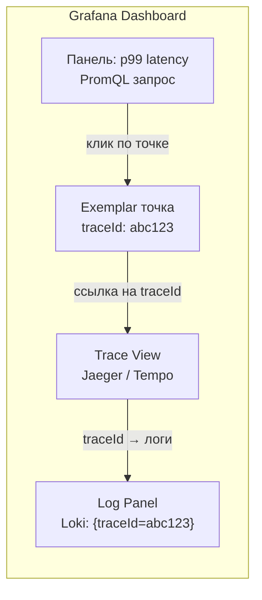

**Конфигурация Grafana datasources для корреляции:**

```yaml
# grafana/provisioning/datasources/datasources.yml
apiVersion: 1
datasources:
  - name: Prometheus
    type: prometheus
    url: http://prometheus:9090
    jsonData:
      exemplarTraceIdDestinations:
        - name: traceID
          datasourceUid: tempo

  - name: Tempo
    type: tempo
    uid: tempo
    url: http://tempo:3200
    jsonData:
      tracesToLogs:
        datasourceUid: loki
        tags: ['service.name']
        mappedTags: [{ key: 'service.name', value: 'app' }]
        filterByTraceID: true

  - name: Loki
    type: loki
    url: http://loki:3100
    jsonData:
      derivedFields:
        - datasourceUid: tempo
          matcherRegex: "traceId=(\\w+)"
          name: TraceID
          url: "$${__value.raw}"
```

**Сценарий применения:** при расследовании инцидента — открыть дашборд -> клик по пику на графике p99 -> переход к трейсу по exemplar -> по `traceId` отфильтровать логи в `Loki / ELK`. Так за пару кликов проходишь путь метрика -> трейс -> лог, не теряя контекст.

## Q15. Что такое Jaeger и Zipkin и чем они отличаются?

`Jaeger` и `Zipkin` — это бэкенды для хранения и отображения трейсов: приложение шлёт им spans, а они дают UI для просмотра дерева запроса. Разница в зрелости и функциях: `Zipkin` проще и легче, появился раньше (Twitter, 2012), но беднее по возможностям; `Jaeger` полнофункциональнее — более развитый UI, adaptive sampling, тесная интеграция с `Kubernetes`. Принципиально важно, что оба принимают данные через `OpenTelemetry`, поэтому выбор бэкенда не привязывает к инструментации.

**Jaeger в Docker Compose (production-ready):**

```yaml
# docker-compose.yml
version: "3.8"
services:
  jaeger:
    image: jaegertracing/all-in-one:1.54
    ports:
      - "16686:16686"   # Jaeger UI
      - "4317:4317"     # OTLP gRPC
      - "4318:4318"     # OTLP HTTP
    environment:
      - COLLECTOR_OTLP_ENABLED=true
      - SPAN_STORAGE_TYPE=elasticsearch
      - ES_SERVER_URLS=http://elasticsearch:9200
      - ES_INDEX_PREFIX=jaeger
      - ES_TAGS_AS_FIELDS_ALL=true

  # Для production лучше использовать отдельные компоненты:
  # jaeger-collector, jaeger-query, jaeger-agent

  otel-collector:
    image: otel/opentelemetry-collector-contrib:0.96.0
    ports:
      - "4317:4317"
    volumes:
      - ./otel-collector-config.yml:/etc/otelcol-contrib/config.yaml

  elasticsearch:
    image: docker.elastic.co/elasticsearch/elasticsearch:8.12.0
    environment:
      - discovery.type=single-node
      - xpack.security.enabled=false
    ports:
      - "9200:9200"
```

**Конфигурация OTel Collector:**

```yaml
# otel-collector-config.yml
receivers:
  otlp:
    protocols:
      grpc:
        endpoint: 0.0.0.0:4317
      http:
        endpoint: 0.0.0.0:4318

processors:
  batch:
    timeout: 5s
    send_batch_size: 1024
  tail_sampling:
    decision_wait: 10s
    policies:
      - name: errors
        type: status_code
        status_code: { status_codes: [ERROR] }
      - name: slow-traces
        type: latency
        latency: { threshold_ms: 1000 }
      - name: probabilistic
        type: probabilistic
        probabilistic: { sampling_percentage: 10 }

exporters:
  otlp/jaeger:
    endpoint: jaeger:4317
    tls:
      insecure: true
  prometheus:
    endpoint: 0.0.0.0:8889

service:
  pipelines:
    traces:
      receivers: [otlp]
      processors: [batch, tail_sampling]
      exporters: [otlp/jaeger]
    metrics:
      receivers: [otlp]
      processors: [batch]
      exporters: [prometheus]
```

**Как выбирать:** обычно по экосистеме (`Kubernetes` — чаще `Jaeger`; нужен легковесный вариант — `Zipkin`) или по облаку (`Tempo`, `Datadog`, `AWS X-Ray`). Ключевой момент: приложение экспортирует в одном формате (`OTLP`), поэтому бэкенд меняется без переписывания инструментации — достаточно перенаправить экспортёр.

## Q16. Как настроить трассировку в Spring Boot (OpenTelemetry)?

Есть два подхода, и выбор между ними — это компромисс между «не трогать код» и «контролировать всё из приложения»:

1. **`OpenTelemetry Java Agent`** — zero-code: агент подключается через `-javaagent` и инструментирует библиотеки автоматически, код вообще не меняется.
2. **`Spring Boot` starter с `Micrometer Tracing`** — трассировка живёт внутри приложения как зависимость; больше контроля, но инструментация частично на тебе.

**Подход 1: OTel Java Agent (рекомендуемый):**

```dockerfile
FROM eclipse-temurin:21-jre
COPY target/app.jar /app.jar
# Скачать OTel Agent
ADD https://github.com/open-telemetry/opentelemetry-java-instrumentation/releases/download/v2.2.0/opentelemetry-javaagent.jar /otel-agent.jar

ENV JAVA_TOOL_OPTIONS="-javaagent:/otel-agent.jar"
ENV OTEL_SERVICE_NAME=order-service
ENV OTEL_EXPORTER_OTLP_ENDPOINT=http://otel-collector:4317
ENV OTEL_TRACES_SAMPLER=parentbased_traceidratio
ENV OTEL_TRACES_SAMPLER_ARG=0.1
ENV OTEL_METRICS_EXPORTER=prometheus
ENV OTEL_LOGS_EXPORTER=none

ENTRYPOINT ["java", "-jar", "/app.jar"]
```

**Подход 2: Spring Boot Starter (Micrometer Tracing + OTel):**

```groovy
// build.gradle
dependencies {
    implementation 'org.springframework.boot:spring-boot-starter-actuator'
    implementation 'io.micrometer:micrometer-tracing-bridge-otel'
    implementation 'io.opentelemetry:opentelemetry-exporter-otlp'
}
```

```yaml
# application.yml
management:
  tracing:
    sampling:
      probability: 1.0  # dev: 100%, prod: 0.1
    propagation:
      type: w3c
  otlp:
    tracing:
      endpoint: http://otel-collector:4318/v1/traces
```

**Кастомный span в бизнес-логике:**

```java
@Service
@RequiredArgsConstructor
public class OrderService {

    private final ObservationRegistry observationRegistry;

    public Order createOrder(OrderRequest request) {
        return Observation.createNotStarted("order.create", observationRegistry)
                .lowCardinalityKeyValue("order.type", request.getType())
                .highCardinalityKeyValue("order.id", request.getId())
                .observe(() -> {
                    // Бизнес-логика внутри span
                    Order order = buildOrder(request);
                    validateOrder(order);
                    return saveOrder(order);
                });
    }
}
```

## Q17. (!) Что такое cardinality метрик и почему она важна?

`Cardinality` — это число уникальных комбинаций значений лейблов одной метрики. Важна она потому, что `Prometheus` хранит **отдельный временной ряд на каждую комбинацию лейблов**. Добавил лейбл с миллионом значений — получил миллион рядов из одной метрики. Это бьёт по памяти (ряды держатся в RAM), по скорости запросов и по диску. Неконтролируемый рост cardinality — самая частая причина падения `Prometheus`, поэтому за ней следят жёстче, чем за самими значениями.

```java
// ПЛОХО: высокая cardinality — user_id может иметь миллионы значений
registry.counter("api.requests", "user_id", userId); // НЕ ДЕЛАТЬ!

// ПЛОХО: URL с path-параметрами
registry.counter("http.requests", "uri", "/api/users/12345"); // НЕ ДЕЛАТЬ!

// ХОРОШО: ограниченное множество значений
registry.counter("api.requests",
    "endpoint", "/api/orders",   // ограниченный набор эндпоинтов
    "method", "POST",            // GET, POST, PUT, DELETE
    "status", "200"              // ~10 статусов
);

// ХОРОШО: использовать MeterFilter для нормализации URI
@Bean
MeterRegistryCustomizer<MeterRegistry> uriNormalizer() {
    return registry -> registry.config().meterFilter(
        MeterFilter.replaceTagValues("uri", actualUri -> {
            // /api/users/123 → /api/users/{id}
            if (actualUri.matches("/api/users/\\d+")) {
                return "/api/users/{id}";
            }
            return actualUri;
        })
    );
}
```

**Эмпирическое правило:** при добавлении метрики прикинь, сколько уникальных комбинаций лейблов возможно. Если множество значений хотя бы одного лейбла растёт неограниченно (ID пользователя, заказа, URL с параметрами) — лейбл убирают или нормализуют. Cardinality лейблов **перемножается**: `cardinality = V1 * V2 * ... * Vn`, где `Vi` — число уникальных значений i-го лейбла. Поэтому даже несколько «безобидных» лейблов вместе могут дать взрыв.

## Q18. Как метрики и трейсы помогают при инцидентах?

У них разные роли, и работают они в связке. Метрики отвечают на «что и где» в масштабе: алерт срабатывает на аномалию (рост ошибок, латентности), а дашборд показывает, какой сервис или эндпоинт деградировал. Но метрики агрегированы и не объясняют причину конкретного сбоя. Тут подключаются трейсы: они показывают путь конкретного запроса и точное место, где возникла задержка или ошибка. Метрики локализуют проблему до сервиса, трейсы — до строки в цепочке вызовов.

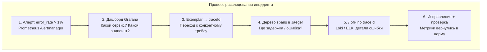

**Что связывает их в один поток:** `Exemplars` в `Grafana` — они позволяют от точки на графике метрики перейти прямо к трейсу, который её породил, без ручного поиска по времени. Подробнее о процессе расследования инцидентов — в [вопросах по Observability](observability-interview.md).

## Q19. Что такое RED и USE методологии для метрик?

Это две методологии, которые отвечают на вопрос «какие метрики снимать в первую очередь», но смотрят с разных сторон. **RED** смотрит со стороны запроса (сервиса), **USE** — со стороны ресурса. На практике их используют вместе: RED показывает, что пользователю плохо, USE — почему (какой ресурс упёрся).

- **RED** (для сервисов): `Rate` (запросы/сек), `Errors` (доля ошибок), `Duration` (латентность).
- **USE** (для ресурсов): `Utilization` (загрузка), `Saturation` (насыщенность/очереди), `Errors` (ошибки на уровне ресурса).

**PromQL для RED-метрик:**

```promql
# Rate — запросы в секунду
rate(http_server_requests_seconds_count{application="order-service"}[5m])

# Errors — доля 5xx ошибок
sum(rate(http_server_requests_seconds_count{status=~"5.."}[5m]))
/
sum(rate(http_server_requests_seconds_count[5m]))

# Duration — p99 латентность
histogram_quantile(0.99,
  sum(rate(http_server_requests_seconds_bucket{application="order-service"}[5m])) by (le)
)
```

**PromQL для USE-метрик:**

```promql
# Utilization — загрузка CPU
process_cpu_usage{application="order-service"}

# Saturation — длина очереди пула потоков
tomcat_threads_busy_threads / tomcat_threads_config_max_threads

# Errors — ошибки GC
rate(jvm_gc_pause_seconds_count{action="end of major GC"}[5m])
```

## Q20. Как экспортировать метрики в Prometheus из Java?

Поскольку `Prometheus` работает по pull-модели, экспорт сводится к одному: приложение открывает `HTTP`-эндпоинт, который отдаёт метрики в текстовом формате `Prometheus`, а сервер сам их забирает. В `Spring Boot` для этого достаточно зависимости `micrometer-registry-prometheus` — она поднимает эндпоинт `/actuator/prometheus`.

**Пример вывода `/actuator/prometheus`:**

```
# HELP http_server_requests_seconds Duration of HTTP server request handling
# TYPE http_server_requests_seconds histogram
http_server_requests_seconds_bucket{method="GET",uri="/api/orders",status="200",le="0.1"} 1523
http_server_requests_seconds_bucket{method="GET",uri="/api/orders",status="200",le="0.5"} 1891
http_server_requests_seconds_bucket{method="GET",uri="/api/orders",status="200",le="1.0"} 1900
http_server_requests_seconds_bucket{method="GET",uri="/api/orders",status="200",le="+Inf"} 1905
http_server_requests_seconds_count{method="GET",uri="/api/orders",status="200"} 1905
http_server_requests_seconds_sum{method="GET",uri="/api/orders",status="200"} 234.56

# HELP jvm_memory_used_bytes The amount of used memory
# TYPE jvm_memory_used_bytes gauge
jvm_memory_used_bytes{area="heap",id="G1 Eden Space"} 52428800
jvm_memory_used_bytes{area="heap",id="G1 Old Gen"} 104857600
```

**ServiceMonitor для Kubernetes (Prometheus Operator):**

```yaml
apiVersion: monitoring.coreos.com/v1
kind: ServiceMonitor
metadata:
  name: order-service
  labels:
    release: prometheus
spec:
  selector:
    matchLabels:
      app: order-service
  endpoints:
    - port: http
      path: /actuator/prometheus
      interval: 15s
```

**Граничный случай:** для short-lived задач (cron, batch), которые завершаются раньше, чем их успеют scrape'ить, pull не подходит — для них есть `Pushgateway`: задача push'ит метрики сама, а `Prometheus` забирает их уже с него. В [Kubernetes](../devops/kubernetes-interview.md) цели обнаруживаются автоматически через `ServiceMonitor` или аннотации на `Pods`.

## Q21. Что такое exemplars и зачем они нужны?

`Exemplar` — это «образец» одного наблюдения, прикреплённый к метрике и хранящий ссылку на trace (`traceId` и `spanId`). Метрика агрегирована и сама по себе не говорит, какой конкретно запрос дал всплеск. Exemplar закрывает эту дыру: увидев скачок на графике, по нему сразу переходишь к конкретному трейсу, который этот скачок вызвал, и видишь причину. Это и есть мост от агрегированных метрик к детальным трейсам.

**Включение exemplars в Spring Boot:**

```java
@Configuration
public class ExemplarConfig {

    // Exemplars включаются автоматически при наличии:
    // 1. micrometer-registry-prometheus
    // 2. micrometer-tracing-bridge-otel (или brave)
    // 3. Активной трассировки

    // Для PrometheusMeterRegistry нужен SpanContextSupplier:
    @Bean
    public PrometheusMeterRegistry prometheusMeterRegistry(
            PrometheusConfig config, Clock clock) {
        return new PrometheusMeterRegistry(config, new CollectorRegistry(), clock,
                new DefaultExemplarSampler(spanContextSupplier()));
    }
}
```

**Пример exemplar в формате Prometheus:**

```
# Exemplar прикреплён к бакету гистограммы:
http_server_requests_seconds_bucket{method="POST",uri="/api/orders",le="0.5"} 120 # {trace_id="abc123def456"} 0.48 1712345678.000
```

**Что нужно для работы:** поддержка появилась в `Prometheus` 2.26+, есть в `OpenTelemetry` и `Grafana`. Чтобы exemplars стали кликабельными, на панели `Grafana` с гистограммой включают опцию «Exemplars» и указывают источник трейсов (`Tempo`/`Jaeger`).

## Q22. Как настроить алерты по метрикам (Prometheus, Alertmanager)?

Алертинг разделён на два компонента с чёткими ролями. `Prometheus` отвечает за **оценку условий**: правила на `PromQL` периодически вычисляются, и когда условие держится дольше `for`, алерт переходит в состояние firing. `Alertmanager` отвечает за **доставку**: группирует похожие алерты, дедуплицирует их, применяет маршрутизацию по severity и шлёт в каналы (Slack, PagerDuty, email). Такое разделение нужно, чтобы один и тот же сбой не превратился в сотню одинаковых уведомлений.

**Пример правил алертов (`alert_rules.yml`):**

```yaml
groups:
  - name: application-alerts
    rules:
      # Высокая доля ошибок
      - alert: HighErrorRate
        expr: |
          sum(rate(http_server_requests_seconds_count{status=~"5.."}[5m])) by (application)
          /
          sum(rate(http_server_requests_seconds_count[5m])) by (application)
          > 0.01
        for: 5m
        labels:
          severity: critical
        annotations:
          summary: "Высокая доля ошибок в {{ $labels.application }}"
          description: "Доля 5xx ошибок: {{ $value | humanizePercentage }}"
          runbook: "https://wiki.internal/runbooks/high-error-rate"
          dashboard: "https://grafana.internal/d/app-overview?var-app={{ $labels.application }}"

      # Высокая латентность
      - alert: HighLatency
        expr: |
          histogram_quantile(0.99,
            sum(rate(http_server_requests_seconds_bucket[5m])) by (le, application)
          ) > 2
        for: 5m
        labels:
          severity: warning
        annotations:
          summary: "p99 латентность > 2s в {{ $labels.application }}"

      # Heap Memory > 85%
      - alert: HighHeapUsage
        expr: |
          jvm_memory_used_bytes{area="heap"}
          / jvm_memory_max_bytes{area="heap"}
          > 0.85
        for: 10m
        labels:
          severity: warning
```

**Конфигурация Alertmanager:**

```yaml
# alertmanager.yml
global:
  resolve_timeout: 5m
  slack_api_url: 'https://hooks.slack.com/services/xxx'

route:
  group_by: ['alertname', 'application']
  group_wait: 30s
  group_interval: 5m
  repeat_interval: 4h
  receiver: 'slack-notifications'
  routes:
    - match:
        severity: critical
      receiver: 'pagerduty'
    - match:
        severity: warning
      receiver: 'slack-notifications'

receivers:
  - name: 'slack-notifications'
    slack_configs:
      - channel: '#alerts'
        title: '{{ .GroupLabels.alertname }}'
        text: '{{ range .Alerts }}{{ .Annotations.summary }}{{ end }}'

  - name: 'pagerduty'
    pagerduty_configs:
      - service_key: '<PAGERDUTY_KEY>'
```

## Q23. Что такое traceId и spanId и как они связаны?

Это два идентификатора разного масштаба. `traceId` — идентификатор всего trace, то есть одного запроса через всю систему; он один и тот же для всех spans этого запроса и служит «ключом», по которому трейс собирается из кусочков. `spanId` — идентификатор одной операции (span), у каждого span свой.

Дерево строится через ссылку на родителя: каждый span хранит `parentSpanId` — `spanId` того span, внутри которого он вызван. Корневой span (входящий запрос) родителя не имеет. Так из плоского набора spans с общим `traceId` восстанавливается иерархия вызовов.

**Добавление traceId в логи (Logback + MDC):**

```xml
<!-- logback-spring.xml -->
<configuration>
    <appender name="JSON" class="ch.qos.logback.core.ConsoleAppender">
        <encoder class="net.logstash.logback.encoder.LogstashEncoder">
            <includeMdcKeyName>traceId</includeMdcKeyName>
            <includeMdcKeyName>spanId</includeMdcKeyName>
        </encoder>
    </appender>

    <!-- Или текстовый формат с traceId -->
    <appender name="CONSOLE" class="ch.qos.logback.core.ConsoleAppender">
        <encoder>
            <pattern>%d{HH:mm:ss.SSS} [%thread] %-5level %logger{36} [traceId=%X{traceId}, spanId=%X{spanId}] - %msg%n</pattern>
        </encoder>
    </appender>

    <root level="INFO">
        <appender-ref ref="JSON"/>
    </root>
</configuration>
```

**Пример лога с traceId:**

```
14:23:45.123 [http-nio-8080-exec-1] INFO  c.e.OrderController [traceId=4bf92f3577b34da6, spanId=00f067aa0ba902b7] - Creating order for user 42
14:23:45.234 [http-nio-8080-exec-1] INFO  c.e.PaymentService  [traceId=4bf92f3577b34da6, spanId=a3ce929d0e0e4736] - Processing payment
```

По `traceId` можно отфильтровать все логи одного запроса в `ELK / Loki` — подробнее в [вопросах по логированию](logging-strategies-interview.md).

## Q24. Как уменьшить объём данных трассировки в prod?

Объём трейсов растёт линейно с трафиком, поэтому в prod его сбивают сразу с нескольких сторон:

1. **Sampling** — записывать только часть трейсов (самый сильный рычаг; подробнее — Q9, Q37).
2. **Ограничение атрибутов и размера событий** — не тащить в span тяжёлые поля (тело запроса, длинные SQL).
3. **Сокращение retention** — хранить raw-трейсы дни, а не месяцы.
4. **Отключение инструментации** для неважных компонентов, которые только зашумляют.

**Конфигурация tail-based sampling в OTel Collector:**

```yaml
processors:
  tail_sampling:
    decision_wait: 10s
    num_traces: 100000
    expected_new_traces_per_sec: 1000
    policies:
      # Всегда сохранять ошибочные трейсы
      - name: errors-policy
        type: status_code
        status_code:
          status_codes: [ERROR]

      # Сохранять медленные трейсы (> 1s)
      - name: latency-policy
        type: latency
        latency:
          threshold_ms: 1000

      # 5% всех остальных
      - name: probabilistic-policy
        type: probabilistic
        probabilistic:
          sampling_percentage: 5

  # Ограничить размер атрибутов
  attributes:
    actions:
      - key: http.request.body
        action: delete  # Не записывать тело запроса
      - key: db.statement
        action: hash    # Хешировать SQL (для безопасности)

  # Лимит span событий
  span:
    limits:
      max_attributes: 32
      max_events: 16
```

**Компромисс:** всё это балансирует полноту для отладки против затрат. В prod часто достаточно tail-based sampling — он сохраняет именно то, что ценно (ошибки и выбросы по латентности), и отбрасывает «нормальные» успешные трейсы. Во время инцидента sampling временно повышают.

## Q25. Как выбрать между метриками и трейсами для отладки?

Правило простое: метрики отвечают на агрегированные вопросы «что и насколько» (какой сервис деградировал, какой тренд), трейсы — на точечные «почему именно этот запрос» (где в цепочке вызовов задержка или ошибка). Метрики — точка входа в расследование, трейсы — углубление в конкретный случай.

| Вопрос | Инструмент |
|--------|-----------|
| Какой сервис деградировал? | Метрики (дашборд, алерт) |
| Какой эндпоинт медленный? | Метрики (p99 по endpoint) |
| Почему конкретный запрос медленный? | Трейс (дерево spans) |
| Где в цепочке вызовов ошибка? | Трейс (span с ошибкой) |
| Каков тренд за неделю? | Метрики (PromQL range query) |
| Что произошло с запросом пользователя X? | Трейс + логи (по traceId) |

**Типичный поток:** метрики показывают рост латентности на сервисе A -> открываем трейсы за период -> в медленных трейсах видим, что задержка в вызове к БД или к сервису B. `Exemplars` сокращают этот путь — позволяют перейти к конкретному трейсу прямо с точки на графике.

## Q26. Что такое RED-метрики и USE-метрики?

Это два набора «обязательного минимума» метрик, разделённых по объекту наблюдения. `RED` смотрит на **сервис глазами клиента**: `Rate` (запросов в секунду), `Errors` (доля ошибок), `Duration` (задержка, p50/p99). `USE` смотрит на **ресурс** (`CPU`, диск, сеть): `Utilization` (утилизация), `Saturation` (насыщенность — очереди и ожидание), `Errors` (ошибки ресурса). RED говорит, страдает ли пользователь; USE — упёрся ли какой-то ресурс. Вместе они закрывают и симптом, и причину.

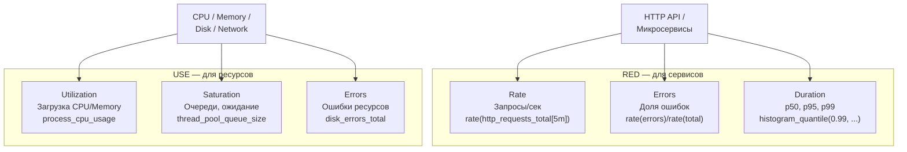

**Как снимать на практике:** оба набора согласуются с golden signals из SRE-практики. В `Micrometer` `Rate` и `Errors` берут из `Timer` и счётчиков с лейблом outcome, `Duration` — из гистограммы латентности. `USE` по `JVM` дают binder'ы памяти, потоков и `GC`; по инфраструктуре — `node_exporter` и `cAdvisor`.

## Q27. Как уменьшить объём и стоимость хранения трейсов в production?

Стоимость складывается из объёма данных и срока хранения, и каждую стратегия бьёт по своему слагаемому:

1. **Sampling** — самый сильный рычаг по объёму: head-based (процент) или tail-based (сохранять по ошибкам/латентности).
2. **Фильтрация атрибутов** — уменьшает размер каждого трейса: не записывать тело запроса, хешировать SQL.
3. **Retention policy** — бьёт по сроку: raw-трейсы 7-14 дней, агрегаты дольше.
4. **Агрегация в метрики** — старые трейсы конвертируют в span metrics: теряем детали отдельных запросов, но сохраняем статистику дёшево.

**Пример span metrics в OTel Collector (трейсы -> метрики):**

```yaml
connectors:
  spanmetrics:
    histogram:
      explicit:
        buckets: [10ms, 50ms, 100ms, 500ms, 1s, 5s]
    dimensions:
      - name: http.method
      - name: http.status_code
      - name: service.name

service:
  pipelines:
    traces:
      receivers: [otlp]
      processors: [batch, tail_sampling]
      exporters: [otlp/jaeger, spanmetrics]
    metrics/spanmetrics:
      receivers: [spanmetrics]
      exporters: [prometheus]
```

**Рекомендация:** в prod предпочтителен tail-based sampling — он сохраняет именно диагностически ценное (ошибки и выбросы по латентности) и отбрасывает «нормальные» успешные трейсы. Так стоимость падает, но возможность расследовать инциденты остаётся.

## Q28. Что такое sampling в трассировке и когда его применять?

`Sampling` — это решение, какие трейсы сохранять, а какие отбросить, чтобы не платить за хранение всех. Ключевое различие — момент принятия решения. `Head-based`: решаем в начале трейса, ещё не зная исхода (например, оставить случайные 10% запросов) — дёшево, но можно случайно выбросить ошибочный запрос. `Tail-based`: решаем в конце, когда исход известен, и поэтому можем прицельно сохранить все трейсы с ошибками или медленные.

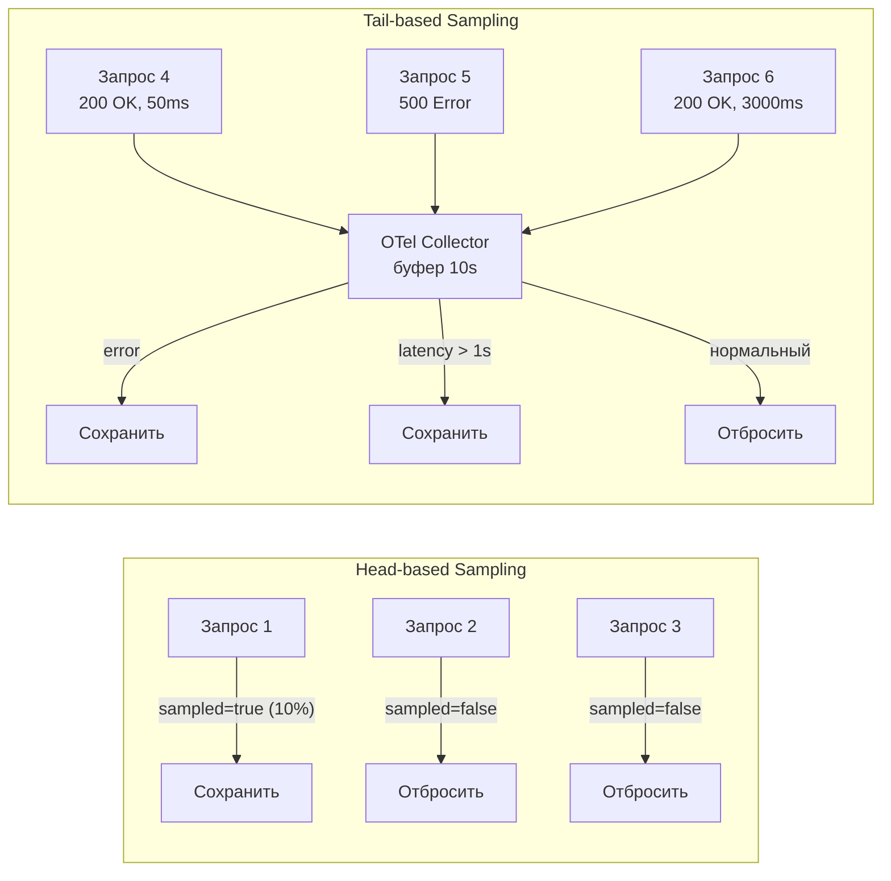

**Где настраивается:** в dev обычно 100% для полной отладки; в prod — долевой head-based или tail-based. Head-based задаётся в `OpenTelemetry` через `Sampler` (`ParentBased`, `RateLimiting`) на стороне приложения. Tail-based живёт на коллекторе (`Jaeger / Tempo`, OTel Collector) и решает по атрибутам трейса (status=error, duration>threshold) — потому что только там доступна картина всего завершённого трейса.

## Q29. Как связать метрики приложения с бизнес-метриками?

Технические метрики (`RPS`, latency, ошибки) показывают здоровье системы, бизнес-метрики (конверсия, заказы, отказы платежей) — здоровье продукта. Связывать их полезно, потому что технический сбой почти всегда бьёт по бизнесу, и видеть это на одном экране быстрее, чем сопоставлять два дашборда вручную. Связь делают через:

- **общие теги** (`region`, `payment_method`) — чтобы фильтровать обе группы метрик одинаково;
- **совмещённые дашборды** «технические + бизнес» — рост latency и падение конверсии видны рядом;
- **алерты по бизнес-метрикам** — иногда падение заказов замечаешь раньше, чем рост 5xx.

```java
@Service
@RequiredArgsConstructor
public class CheckoutService {

    private final MeterRegistry registry;

    public CheckoutResult checkout(Cart cart) {
        Timer.Sample sample = Timer.start(registry);
        try {
            CheckoutResult result = processCheckout(cart);

            // Бизнес-метрики
            registry.counter("business.checkout.completed",
                    "region", cart.getRegion(),
                    "payment_method", cart.getPaymentMethod()
            ).increment();

            registry.summary("business.order.amount",
                    "region", cart.getRegion()
            ).record(result.getTotalAmount());

            return result;
        } catch (PaymentException e) {
            // Бизнес-метрика: отказ платежа
            registry.counter("business.checkout.failed",
                    "region", cart.getRegion(),
                    "reason", e.getReason()
            ).increment();
            throw e;
        } finally {
            sample.stop(Timer.builder("business.checkout.duration")
                    .tag("region", cart.getRegion())
                    .register(registry));
        }
    }
}
```

**PromQL для бизнес-дашборда:**

```promql
# Конверсия за последний час
sum(rate(business_checkout_completed_total[1h]))
/
sum(rate(business_cart_created_total[1h]))

# Revenue rate (рублей в минуту)
sum(rate(business_order_amount_sum[5m])) by (region)
```

## Q30. Как организовать алертинг по метрикам и трейсам?

Алертят почти всегда по метрикам — это пороги по latency, error rate и доступности. Трейсы для алертов используют редко (например, рост доли медленных трейсов), потому что они дороги и точечны: их роль — не поднять тревогу, а объяснить уже поднятую. Поэтому стандартная схема — алерт по метрике, а в теле алерта ссылка на пример трейса. Каналы доставки: `Alertmanager` -> `PagerDuty`, `Slack`, email.

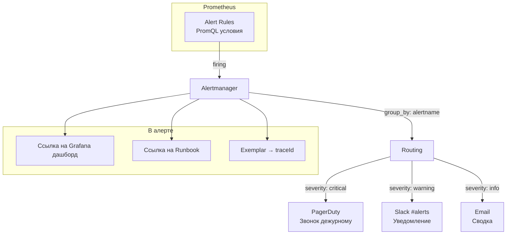

**Рекомендации:** в алерт класть ссылку на дашборд и пример трейса (exemplar), а в описание — `Runbook`, чтобы дежурный начал чинить, а не разбираться. Главный враг — шум: его глушат малым числом порогов, агрегацией и условием подтверждения (`for`, например 2 из 3 точек), иначе на алерты перестают реагировать. На стороне `Alertmanager` помогают группировка по `alertname` и лейблам, inhibition (не слать вторичные при сработавшем корневом) и silence на время плановых работ.

## Q31. (!) Что такое W3C TraceContext и зачем это стандарт?

**W3C TraceContext** — это стандарт HTTP-заголовков для передачи контекста трассировки между сервисами. Проблема, которую он решает: до него каждая система носила контекст в своих заголовках — `X-B3-TraceId` (Zipkin), `X-Amzn-Trace-Id` (AWS), `uber-trace-id` (Jaeger). Как только запрос пересекал границу между системами с разными форматами, контекст терялся, и трейс обрывался. Единый стандарт даёт общий язык, на котором любой сервис понимает контекст любого другого.

Стандарт определяет два заголовка:

```
# traceparent: version-traceId-parentSpanId-flags
traceparent: 00-4bf92f3577b34da6a3ce929d0e0e4736-00f067aa0ba902b7-01

# tracestate: vendor-specific data (опционально)
tracestate: vendor1=opaqueValue1,vendor2=opaqueValue2
```

Разбивка `traceparent`:
- `00` — версия (всегда 00)
- `4bf92f3577b34da6a3ce929d0e0e4736` — 128-bit trace ID
- `00f067aa0ba902b7` — parent span ID
- `01` — флаги (`01` = sampled, `00` = не sampled)

**Как OpenTelemetry работает с W3C TraceContext в Java:**

```java
// OpenTelemetry автоматически инжектирует и извлекает traceparent
// при использовании HTTP-инструментирования

// Вручную: inject context в исходящий запрос
TextMapPropagator propagator = openTelemetry.getPropagators().getTextMapPropagator();
propagator.inject(Context.current(), headers, (h, key, value) -> h.add(key, value));

// Вручную: extract context из входящего запроса
Context extractedContext = propagator.extract(Context.current(), request, 
    (req, key) -> req.getHeader(key));
```

**Конфигурация Spring Boot с OpenTelemetry agent:**
```yaml
# application.yml
management:
  tracing:
    propagation:
      type: w3c   # или b3, b3_multi
```

**Почему это важно:** при смешивании вендоров (AWS -> Kubernetes -> on-prem) именно `W3C TraceContext` обеспечивает сквозную трассировку без обрывов на стыках. `OpenTelemetry` использует `W3C` по умолчанию начиная с Java SDK 1.x, поэтому в современном стеке стандарт работает «из коробки».

## Q32. Как настроить Micrometer с кастомными тегами для бизнес-метрик?

Стандартных метрик `JVM` и `HTTP` хватает для здоровья процесса, но SLO часто формулируются в бизнес-терминах (доля успешных заказов, время оформления), а такие метрики приложение заводит само. `Micrometer` даёт для этого простой API — `Counter`, `Timer`, `DistributionSummary` с произвольными тегами:

```java
@Component
@RequiredArgsConstructor
public class OrderMetrics {
    private final MeterRegistry registry;

    // Counter — монотонно растущий счётчик
    private Counter orderPlaced;
    private Counter orderFailed;

    // DistributionSummary — распределение значений (например, сумма заказа)
    private DistributionSummary orderAmount;

    // Timer — время выполнения с гистограммой
    private Timer checkoutTimer;

    @PostConstruct
    public void init() {
        orderPlaced = Counter.builder("orders.placed")
            .tag("region", "ru")
            .description("Количество размещённых заказов")
            .register(registry);

        orderFailed = Counter.builder("orders.failed")
            .tag("region", "ru")
            .tag("reason", "payment_declined")
            .register(registry);

        orderAmount = DistributionSummary.builder("orders.amount.rub")
            .publishPercentiles(0.5, 0.95, 0.99)
            .publishPercentileHistogram()
            .register(registry);

        checkoutTimer = Timer.builder("checkout.duration")
            .publishPercentiles(0.5, 0.95, 0.99)
            .publishPercentileHistogram()
            .sla(Duration.ofMillis(200), Duration.ofMillis(500))
            .register(registry);
    }

    public void recordOrder(double amount) {
        orderPlaced.increment();
        orderAmount.record(amount);
    }

    public <T> T timeCheckout(Supplier<T> supplier) {
        return checkoutTimer.record(supplier);
    }
}
```

**Динамические теги (Gauge с lambda):**
```java
// Gauge — текущее значение (очередь, активные сессии)
Gauge.builder("orders.queue.size", orderQueue, Queue::size)
    .tag("priority", "high")
    .register(registry);
```

**PromQL для бизнес-метрик:**
```promql
# Error rate заказов за последние 5 минут
rate(orders_failed_total[5m]) / rate(orders_placed_total[5m])

# p99 времени оформления заказа
histogram_quantile(0.99, rate(checkout_duration_seconds_bucket[5m]))

# Средняя сумма заказа
rate(orders_amount_rub_sum[5m]) / rate(orders_amount_rub_count[5m])
```

**Ключевой принцип:** не использовать высококардинальные теги (`userId`, `orderId`) — они взорвут TSDB (см. Q17, Q39). В теги идут только статические или enum-подобные значения: `region`, `status`, `product_category`. Если нужна аналитика по конкретному пользователю — это уровень логов или событий, а не метрик.

## Q33. Как интегрировать Zipkin в Spring Boot приложение?

**Zipkin** — один из первых open-source бэкендов для распределённой трассировки (Twitter, 2012). Сегодня его редко подключают «напрямую»: чаще приложение инструментируют через `OpenTelemetry`, а в `Zipkin` отправляют через `Zipkin exporter`. Ниже — оба пути для `Spring Boot 3`.

**Spring Boot 3 + Micrometer Tracing + Zipkin:**
```xml
<!-- pom.xml -->
<dependency>
    <groupId>io.micrometer</groupId>
    <artifactId>micrometer-tracing-bridge-brave</artifactId>
</dependency>
<dependency>
    <groupId>io.zipkin.reporter2</groupId>
    <artifactId>zipkin-reporter-brave</artifactId>
</dependency>
```

```yaml
# application.yml
management:
  tracing:
    sampling:
      probability: 1.0   # 100% в dev, 0.1 в prod
  zipkin:
    tracing:
      endpoint: http://zipkin:9411/api/v2/spans
```

**OpenTelemetry → Zipkin exporter (альтернатива):**
```xml
<dependency>
    <groupId>io.opentelemetry</groupId>
    <artifactId>opentelemetry-exporter-zipkin</artifactId>
</dependency>
```

```java
ZipkinSpanExporter zipkinExporter = ZipkinSpanExporter.builder()
    .setEndpoint("http://zipkin:9411/api/v2/spans")
    .build();

SdkTracerProvider tracerProvider = SdkTracerProvider.builder()
    .addSpanProcessor(BatchSpanProcessor.builder(zipkinExporter).build())
    .setSampler(Sampler.traceIdRatioBased(0.1))  // 10% sampling
    .build();
```

**Что проверять в Zipkin UI:**
- Service dependency graph — кто кого вызывает
- Waterfall view — где время теряется (DB? HTTP? serialization?)
- Error traces — `tags["error"] = true`
- Медленные трейсы: сортировка по duration

**Zipkin vs Jaeger:** `Zipkin` проще в настройке и легче, `Jaeger` богаче по UI и поддерживает adaptive sampling. Если стек строится вокруг `OpenTelemetry`, предпочтительнее `Jaeger` или `Grafana Tempo` — они лучше интегрированы с OTel-экосистемой.

## Q34. (!) Какие типы инструментов предоставляет Micrometer — Counter, Gauge, Timer, DistributionSummary?

**Micrometer** — фасад метрик для JVM-приложений (аналог `SLF4J` для логов), абстрагирующий код от конкретного бэкенда (`Prometheus`, `Datadog`, `InfluxDB`). Выбор инструмента определяется природой величины: монотонно она растёт или может падать, нужно ли одно число или распределение, и измеряем мы время или произвольное значение.

**Counter — монотонно возрастающий счётчик:**

```java
// Счётчик запросов, ошибок, обработанных сообщений
Counter ordersPlaced = Counter.builder("orders.placed.total")
    .tag("region", "ru")
    .tag("channel", "web")
    .description("Total number of placed orders")
    .register(registry);

ordersPlaced.increment();          // +1
ordersPlaced.increment(5.0);       // +5

// PromQL: rate(orders_placed_total[5m]) — скорость создания заказов
```

**Gauge — текущее значение (может убывать):**

```java
// Размер очереди, число активных соединений, объём памяти
Gauge.builder("orders.queue.size", orderQueue, Queue::size)
    .tag("priority", "high")
    .register(registry);

// Для volatile значений — AtomicInteger
AtomicInteger activeUsers = registry.gauge(
    "users.active",
    new AtomicInteger(0)
);
activeUsers.incrementAndGet();  // при входе
activeUsers.decrementAndGet();  // при выходе
```

**Timer — измерение времени и количества вызовов:**

```java
Timer checkoutTimer = Timer.builder("checkout.duration")
    .tag("payment_method", "card")
    .description("Time to complete checkout")
    .publishPercentiles(0.5, 0.95, 0.99)       // перцентили в памяти
    .publishPercentileHistogram()                // для Prometheus histogram
    .sla(Duration.ofMillis(200), Duration.ofSeconds(1))  // SLO buckets
    .register(registry);

// Использование
checkoutTimer.record(() -> processCheckout());              // sync
checkoutTimer.record(Duration.ofMillis(150));               // manual

// Или через аннотацию
@Timed(value = "checkout.duration", percentiles = {0.95, 0.99})
public void checkout() { ... }

// PromQL: histogram_quantile(0.99, rate(checkout_duration_seconds_bucket[5m]))
```

**DistributionSummary — распределение числовых значений (не время):**

```java
// Размер запросов/ответов, суммы заказов, размеры файлов
DistributionSummary orderAmount = DistributionSummary
    .builder("orders.amount")
    .tag("currency", "RUB")
    .baseUnit("rubles")
    .publishPercentiles(0.5, 0.95)
    .register(registry);

orderAmount.record(1500.0);   // сумма конкретного заказа
orderAmount.record(350.0);

// PromQL:
// rate(orders_amount_rubles_sum[5m]) / rate(orders_amount_rubles_count[5m])
// → средняя сумма заказа за 5 минут
```

**LongTaskTimer — для длительных задач (batch jobs):**

```java
// Для задач, которые могут длиться минуты/часы
LongTaskTimer batchTimer = LongTaskTimer.builder("batch.import.active")
    .register(registry);

LongTaskTimer.Sample sample = batchTimer.start();
try {
    runBatchImport();
} finally {
    sample.stop();
}
// Gauge: batch_import_active_tasks_current — сколько batch задач активно
```

## Q35. Что такое OpenTelemetry Collector и как его использовать?

**OpenTelemetry Collector** — это отдельный процесс-посредник между приложениями и бэкендами мониторинга, работающий по схеме receivers -> processors -> exporters: принимает телеметрию (трейсы, метрики, логи), обрабатывает её и экспортирует в нужные системы. Смысл этой прослойки в том, чтобы приложения не знали о конкретных бэкендах: они шлют всё в один Collector, а маршрутизацию, батчинг, sampling и фильтрацию он берёт на себя — и менять их можно без передеплоя приложений.

**Архитектура:**

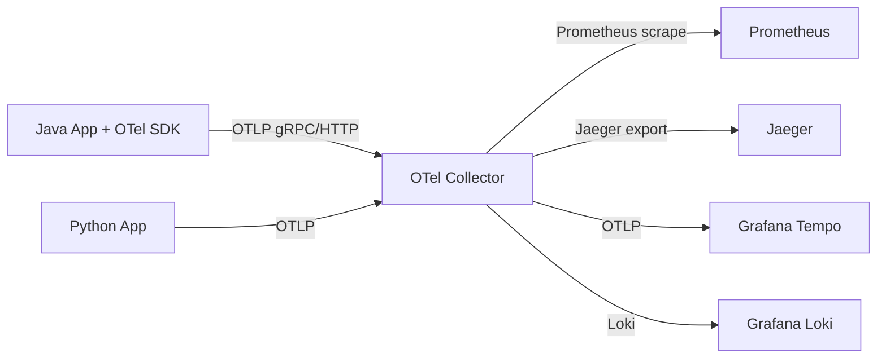

**Конфигурация Collector (otel-collector-config.yaml):**

```yaml
receivers:
  otlp:
    protocols:
      grpc:
        endpoint: 0.0.0.0:4317
      http:
        endpoint: 0.0.0.0:4318
  prometheus:              # также может скрейпить Prometheus метрики
    config:
      scrape_configs:
        - job_name: 'my-app'
          static_configs:
            - targets: ['app:8080']

processors:
  batch:                   # буферизует для эффективной отправки
    timeout: 5s
    send_batch_size: 512
  memory_limiter:          # защита от OOM
    limit_mib: 512
  resource:                # добавляем атрибуты ко всем сигналам
    attributes:
      - action: insert
        key: deployment.environment
        value: production

exporters:
  jaeger:
    endpoint: jaeger:14250
    tls:
      insecure: true
  prometheusremotewrite:
    endpoint: http://prometheus:9090/api/v1/write
  loki:
    endpoint: http://loki:3100/loki/api/v1/push

service:
  pipelines:
    traces:
      receivers: [otlp]
      processors: [memory_limiter, batch, resource]
      exporters: [jaeger]
    metrics:
      receivers: [otlp, prometheus]
      processors: [batch]
      exporters: [prometheusremotewrite]
    logs:
      receivers: [otlp]
      processors: [batch]
      exporters: [loki]
```

**Spring Boot → OTel Collector:**

```yaml
# application.yml — Java Agent автоматически отправляет в Collector
management:
  otlp:
    tracing:
      endpoint: http://otel-collector:4318/v1/traces
    metrics:
      export:
        url: http://otel-collector:4318/v1/metrics
```

**Преимущества Collector vs прямая отправка:**
- Один endpoint для всех сигналов (трейсы + метрики + логи)
- Можно менять бэкенды без перекомпиляции приложения
- Батчинг, сжатие, retry встроены
- Tail-based sampling реализуется на Collector уровне
- Фильтрация чувствительных данных (PII scrubbing)

## Q36. (!) Что такое SLI, SLO и SLA — определения, расчёт, error budget?

Это три уровня одной и той же идеи «насколько надёжен сервис», от измерения к цели и к обязательству:

- **SLI (Service Level Indicator)** — измеримый показатель качества: конкретная метрика, например доля успешных запросов. Это **факт**, что сервис показывает сейчас.
- **SLO (Service Level Objective)** — целевое значение SLI, внутреннее обязательство команды («availability >= 99.9%»). Это **цель**.
- **SLA (Service Level Agreement)** — юридическое соглашение с клиентом, обычно слабее SLO с запасом. Это **обещание наружу** с последствиями за нарушение.

SLO ставят строже SLA намеренно: команда должна узнать о деградации и среагировать раньше, чем нарушит договор с клиентом.

**Типичная связь:** SLA ≤ SLO ≤ 100%

```
SLI: availability = успешные_запросы / все_запросы = 99.95%
SLO: availability >= 99.9%  (внутренняя цель)
SLA: availability >= 99.5%  (договор с клиентом)
```

**Расчёт availability SLI в PromQL:**

```promql
# SLI: доля успешных HTTP запросов (не 5xx) за 30 дней
(
  sum(rate(http_requests_total{status!~"5.."}[30d]))
  /
  sum(rate(http_requests_total[30d]))
) * 100

# Текущий SLO burn rate (скорость сжигания error budget)
sum(rate(http_requests_total{status=~"5.."}[1h]))
/
sum(rate(http_requests_total[1h]))
```

**Error Budget — бюджет ошибок.** Это «допустимое количество ненадёжности»: разница между 100% и SLO. Если SLO = 99.9%, то 0.1% времени сервис имеет право быть недоступным — и это нормально, а не повод для героизма. Пока бюджет не исчерпан, команда спокойно катит фичи; как только исчерпан — приоритет смещается на надёжность. Бюджет превращает спор «деплоить или не деплоить» в объективное число.

```
SLO = 99.9%  →  Error Budget = 0.1% от времени в месяц

Минут в месяце: 30 * 24 * 60 = 43 200 минут
Error Budget (минуты): 43 200 * 0.001 = 43.2 минуты

Если сервис упал на 50 минут → бюджет превышен →
нельзя выпускать новые фичи до следующего месяца
```

**Error Budget Policy:**

| Статус бюджета | Действие |
|---------------|----------|
| > 50% осталось | Нормальный режим разработки |
| 10-50% осталось | Тормозим рискованные деплои |
| < 10% осталось | Только hotfix, reliability работа |
| 0% (исчерпан) | Freeze деплоев до конца периода |

**Многоуровневые SLO:**

```yaml
# Разные SLO для разных сценариев
slos:
  - name: checkout_availability
    sli: rate(http_requests_total{endpoint="/checkout",status!~"5.."}[28d])
        / rate(http_requests_total{endpoint="/checkout"}[28d])
    objective: 99.9    # 99.9% availability

  - name: checkout_latency
    sli: histogram_quantile(0.99,
           rate(http_request_duration_seconds_bucket{endpoint="/checkout"}[28d]))
    objective: 2.0     # p99 < 2 секунды (в секундах)

  - name: catalog_freshness
    sli: time() - catalog_last_updated_timestamp_seconds
    objective: 300     # данные не старше 5 минут
```

**Alerting на burn rate (Google SRE подход):**

```yaml
# Алерт: сжигаем бюджет в 14x быстрее нормы (1 час окно)
alert: HighErrorBudgetBurnRate
expr: |
  (
    sum(rate(http_requests_total{status=~"5.."}[1h]))
    / sum(rate(http_requests_total[1h]))
  ) > 14 * (1 - 0.999)
for: 2m
labels:
  severity: critical
```

## Q37. Как работает tail-based sampling в трассировке?

Чтобы понять tail-based, его проще всего противопоставить head-based — разница ровно в моменте решения.

**Head-based sampling** принимает решение о записи в начале запроса, на корневом span'е. Это быстро и не требует памяти, но решение слепое: результат запроса (ошибка он или нет, быстрый или медленный) ещё неизвестен, поэтому ценные ошибочные трейсы попадают в общую лотерею и могут быть отброшены.

```java
// Head-based: 10% запросов пишем
Sampler headSampler = Sampler.traceIdRatioBased(0.1);
// Проблема: медленные и ошибочные запросы попадают в те же 10%
// и могут быть отброшены
```

**Tail-based sampling** принимает решение **после** завершения всего трейса, когда исход уже известен. За это знание платят буферизацией: Collector держит span'ы в памяти, ждёт сборки трейса (`decision_wait`), а затем по политикам решает. Зато можно гарантированно сохранить все ошибки и медленные запросы, а семплировать только «нормальные».

**Реализация через OTel Collector:**

```yaml
# Tail Sampling Processor в OTel Collector
processors:
  tail_sampling:
    decision_wait: 10s        # ждём 10 сек сборки всего трейса
    num_traces: 100000        # буфер трейсов в памяти
    expected_new_traces_per_sec: 1000
    policies:
      # Политика 1: все ошибки — записываем 100%
      - name: errors-policy
        type: status_code
        status_code: {status_codes: [ERROR]}

      # Политика 2: медленные запросы > 500ms — записываем 100%
      - name: slow-traces-policy
        type: latency
        latency: {threshold_ms: 500}

      # Политика 3: остальные — 5% семплинг
      - name: baseline-policy
        type: probabilistic
        probabilistic: {sampling_percentage: 5}
```

**Сравнение head vs tail sampling:**

| Аспект | Head-based | Tail-based |
|--------|-----------|------------|
| Когда решаем | В начале запроса | После завершения |
| Ошибки | Могут быть отброшены | Всегда сохраняются |
| Медленные запросы | Могут быть отброшены | Можно сохранять |
| Память | Минимальная | Нужен буфер (GB) |
| Latency решения | 0ms | 5-30 секунд |
| Сложность | Простая | Высокая |
| Реализация | SDK | OTel Collector |

**Когда использовать tail-based sampling:**
- Высоконагруженные сервисы, где хранить все трейсы дорого
- Нужно гарантированно сохранять все аномальные запросы
- Есть OTel Collector в инфраструктуре

## Q38. Что такое Exemplars и как они связывают метрики с трейсами?

**Exemplar** — это конкретный образец одного наблюдения внутри метрики, к которому прикреплена ссылка на трейс (`traceId`). Метрика агрегирована и обезличена: она знает, что p99 вырос до 5 секунд, но не знает, какой именно запрос это был. Exemplar решает эту фундаментальную проблему — он сохраняет «улику» от одного из наблюдений, попавших в этот всплеск, и позволяет перейти от точки на графике к трейсу, который её объясняет.

**Пример сценария:** на графике p99 latency = 5 секунд -> клик по точке -> exemplar содержит `traceId` -> открываем трейс -> видим конкретный медленный запрос и где в нём ушло время.

**Как это работает в Prometheus:**

```
# Обычный Histogram bucket в Prometheus format
http_request_duration_seconds_bucket{le="0.5"} 1234

# С Exemplar — добавляется traceId к конкретному наблюдению
http_request_duration_seconds_bucket{le="0.5"} 1234 # {traceId="abc123",spanId="def456"} 0.48 1686000000
```

**Включение Exemplars в Spring Boot + Micrometer:**

```yaml
# application.yml
management:
  metrics:
    distribution:
      percentiles-histogram:
        http.server.requests: true   # включаем histogram (нужен для exemplars)
  prometheus:
    metrics:
      export:
        exemplars-sampling: true    # включаем exemplars
```

```java
// Ручное добавление exemplar с текущим traceId
Timer.builder("checkout.duration")
    .publishPercentileHistogram()
    .register(registry)
    .record(() -> {
        // Micrometer автоматически берёт traceId из OpenTelemetry context
        processCheckout();
    });
```

**Конфигурация Prometheus для хранения Exemplars:**

```yaml
# prometheus.yml
global:
  scrape_interval: 15s

# Включаем OpenMetrics формат (нужен для exemplars)
scrape_configs:
  - job_name: 'spring-app'
    static_configs:
      - targets: ['app:8080']
    # OpenMetrics content type для exemplars
    scrape_protocols: [OpenMetricsText1.0.0, PrometheusText0.0.4]
```

**Использование в Grafana:**

В Grafana панели с histogram метрикой → кнопка "Exemplars" → точки на графике становятся кликабельными → открывается Tempo/Jaeger с конкретным трейсом.

**Связка Prometheus + Grafana Tempo через Exemplars:**

```yaml
# Grafana datasource: Prometheus → Tempo correlation
datasources:
  - name: Prometheus
    type: prometheus
    url: http://prometheus:9090
    jsonData:
      exemplarTraceIdDestinations:
        - name: traceId
          datasourceUid: tempo-uid   # UID Tempo datasource
```

## Q39. (!) Что такое проблема высокой кардинальности в метриках и как её избежать?

**Кардинальность** — это количество уникальных комбинаций значений тегов (labels) метрики. Проблема в том, что TSDB (`Prometheus`) хранит отдельный временной ряд на каждую такую комбинацию. Кардинальности тегов перемножаются, поэтому добавление одного тега с большим множеством значений даёт не линейный, а взрывной рост числа рядов — а с ним рост памяти, замедление запросов и риск OOM. Это самая частая причина, по которой `Prometheus` падает.

**Проблема:**

```java
// ПЛОХО: userId как тег — миллионы уникальных значений!
Counter.builder("api.requests")
    .tag("userId", request.getUserId())      // 10M пользователей = 10M временных рядов
    .tag("orderId", request.getOrderId())    // ещё хуже: новый orderId на каждый запрос
    .register(registry);
```

```
Prometheus хранит данные как time series:
api_requests_total{userId="user-1"} ...
api_requests_total{userId="user-2"} ...
...
api_requests_total{userId="user-10000000"} ...

10M time series × 24 samples/час × 30 дней = сотни GB → OOM / медленные запросы
```

**Как избежать высокой кардинальности:**

```java
// ХОРОШО: только статические или enum-подобные теги
Counter.builder("api.requests")
    .tag("endpoint", "/api/orders")          // конечное множество
    .tag("method", "POST")                   // GET, POST, PUT, DELETE
    .tag("status_class", "2xx")              // 2xx, 4xx, 5xx
    .tag("region", "ru")                     // ru, kz, by
    .tag("user_tier", "premium")             // free, basic, premium
    .register(registry);

// Для per-user аналитики — используй логи или события, не метрики
log.info("User {} placed order {}", userId, orderId);  // в Kibana/Loki
```

**Правила хорошей кардинальности:**

| Тег | Кардинальность | Допустимость |
|-----|----------------|--------------|
| `method` (HTTP) | 4-5 | Отлично |
| `status_code` | ~20 | Хорошо |
| `endpoint` | 50-500 | Приемлемо |
| `region` | 5-20 | Отлично |
| `customer_tier` | 3-5 | Отлично |
| `userId` | Миллионы | Никогда |
| `requestId` | Миллионы | Никогда |
| `orderId` | Миллионы | Никогда |

**Обнаружение проблемы:**

```promql
# Найти метрики с наибольшим числом time series
topk(10, count by (__name__)({__name__=~".+"}))

# Найти метрику с высококардинальным тегом
count by (endpoint) (http_requests_total) > 1000
```

**Защитные меры:**

```java
// Micrometer: ограничить число допустимых значений тега
registry.config().meterFilter(
    MeterFilter.maximumAllowableTags(
        "http.server.requests", "uri", 100,
        // uri с кардинальностью > 100 → заменяется на "other"
        MeterFilter.deny()
    )
);
```

## Q40. Как реализовать context propagation в distributed tracing — W3C TraceContext и B3?

**Context propagation** — это механизм, который переносит trace context (`traceId`, `spanId` родителя, решение о sampling) между сервисами через HTTP-заголовки или заголовки сообщений. Без него каждый сервис начинал бы новый, не связанный трейс, и склеить путь запроса было бы невозможно. Существуют два основных формата заголовков — современный `W3C TraceContext` и старый `B3` (Zipkin); ниже — оба, а также Baggage и типичные ошибки.

**W3C TraceContext (рекомендуемый стандарт, RFC 7234):**

```http
# HTTP заголовки W3C TraceContext
traceparent: 00-4bf92f3577b34da6a3ce929d0e0e4736-00f067aa0ba902b7-01
             ^^                                                        
             version (00)                                              
                ^^^^^^^^^^^^^^^^^^^^^^^^^^^^^^^^                       
                traceId (128-bit hex)                                  
                                        ^^^^^^^^^^^^^^^^               
                                        parentSpanId (64-bit hex)      
                                                                 ^^    
                                                                 flags (01 = sampled)

tracestate: vendor1=value1,vendor2=value2   # vendor-specific данные
```

**B3 Propagation (Zipkin формат):**

```http
# Multi-header B3 (старый формат, Zipkin, Brave)
X-B3-TraceId: 4bf92f3577b34da6a3ce929d0e0e4736
X-B3-SpanId: 00f067aa0ba902b7
X-B3-ParentSpanId: 00f067aa0ba902b7
X-B3-Sampled: 1

# Single-header B3 (компактный)
b3: 4bf92f3577b34da6a3ce929d0e0e4736-00f067aa0ba902b7-1
```

**Настройка propagation в Spring Boot + OTel:**

```yaml
# application.yml
management:
  tracing:
    propagation:
      type: w3c    # или b3, b3_multi, aws_xray
```

```java
// Ручная настройка через Java SDK
OpenTelemetrySdk otel = OpenTelemetrySdk.builder()
    .setPropagators(ContextPropagators.create(
        TextMapPropagator.composite(
            W3CTraceContextPropagator.getInstance(),     // W3C (основной)
            W3CBaggagePropagator.getInstance(),          // W3C Baggage
            B3Propagator.injectingSingleHeader()          // B3 для legacy систем
        )
    ))
    .build();
```

**Baggage — передача произвольных данных через контекст.** Если trace context отвечает на «кто я в дереве», то baggage переносит вместе с ним прикладные пары ключ-значение (например, `userId`, `region`), доступные всем сервисам вниз по цепочке без явной передачи в параметрах. Полезно для сквозного контекста, но злоупотреблять не стоит: baggage едет в каждом заголовке и раздувает запросы.

```java
// Установить baggage в начале запроса
Baggage baggage = Baggage.builder()
    .put("userId", "user-123")
    .put("region", "ru")
    .build();
Context contextWithBaggage = baggage.storeInContext(Context.current());

// Получить baggage в другом сервисе (автоматически передаётся через заголовки)
String userId = Baggage.fromContext(Context.current()).getEntryValue("userId");
```

**HTTP заголовок Baggage:**

```http
baggage: userId=user-123,region=ru
```

**Подводные камни.** Чаще всего трейс «обрывается» там, где контекст не передаётся автоматически — при уходе в свой пул потоков или нестандартный транспорт:

| Проблема | Причина | Решение |
|---------|---------|---------|
| Трейс обрывается | Async executor не копирует контекст | `ContextPropagatingExecutorService` |
| Трейс обрывается на Kafka | Producer не добавляет заголовки | OTel Kafka instrumentation |
| Смешанные форматы | Legacy B3, новые W3C | Composite propagator |

```java
// Проброс контекста через Executor (Spring ThreadPool)
@Bean
public Executor tracingExecutor(Tracer tracer) {
    return new ContextPropagatingExecutorService(
        Executors.newFixedThreadPool(10)
    );
}
```

## Q41. Какие SLI использовать для разных типов сервисов?

Универсального набора SLI нет: показатель должен отражать то, что важно пользователю именно этого сервиса. Для синхронного API это доступность и латентность, а для конвейера данных эти метрики бессмысленны — там важна свежесть данных. Поэтому Google SRE выделяет несколько категорий сервисов, и для каждой — свой набор SLI.

**1. Request-driven (REST/gRPC сервисы):**

```promql
# Availability SLI
sum(rate(http_requests_total{status!~"5.."}[5m]))
/ sum(rate(http_requests_total[5m]))

# Latency SLI (p99 < 500ms)
histogram_quantile(0.99,
  rate(http_request_duration_seconds_bucket[5m])) < 0.5

# Error rate SLI
rate(http_requests_total{status=~"5.."}[5m])
/ rate(http_requests_total[5m]) < 0.001  # < 0.1% ошибок
```

**2. Data pipeline (Kafka consumers, batch jobs):**

```promql
# Freshness SLI — свежесть данных
time() - kafka_consumer_last_poll_timestamp_seconds < 30  # < 30 сек отставание

# Throughput SLI — успешная обработка сообщений
rate(messages_processed_total{status="success"}[5m])
/ rate(messages_received_total[5m]) > 0.999

# Correctness SLI — процент верно обработанных записей
1 - (rate(records_failed_validation_total[1h])
     / rate(records_processed_total[1h]))
```

**3. Storage (БД, кэш):**

```promql
# Durability SLI — процент успешных записей
rate(db_write_operations_total{status="success"}[5m])
/ rate(db_write_operations_total[5m])

# Read latency SLI
histogram_quantile(0.99,
  rate(db_query_duration_seconds_bucket[5m])) < 0.1  # < 100ms

# Cache hit rate SLI
rate(cache_hits_total[5m])
/ (rate(cache_hits_total[5m]) + rate(cache_misses_total[5m])) > 0.9
```

**4. Background workers (отчёты, нотификации):**

```promql
# Completion SLI — завершаем задачи в срок
sum(batch_jobs_completed_on_time_total)
/ sum(batch_jobs_total) > 0.95  # 95% задач выполнены вовремя

# Email delivery SLI
rate(notifications_delivered_total[1h])
/ rate(notifications_sent_total[1h]) > 0.98
```

**Матрица SLI по типам сервисов:**

| Тип сервиса | Основные SLI | Типичные SLO |
|-------------|-------------|--------------|
| REST API | Availability, Latency p99 | 99.9%, < 500ms |
| GraphQL | Availability, Latency p95, Error rate | 99.5%, < 1s |
| Kafka Consumer | Freshness, Throughput | lag < 30s, > 99.9% |
| Batch Job | Completion rate, Duration | > 95%, < 2h |
| Кэш (Redis) | Hit rate, Latency | > 90%, < 10ms |
| БД | Durability, Read latency | 99.999%, < 100ms |

**Ключевые принципы выбора SLI:**
1. SLI должен отражать пользовательский опыт, а не внутренние метрики
2. Не более 3-5 SLI на сервис — иначе сложно приоритизировать
3. SLI должен быть измерим прямо сейчас (не "когда-нибудь настроим")
4. Синтетические мониторы (blackbox probes) дополняют SLI, но не заменяют их

## See also

- [Observability](observability-interview.md) — три столпа наблюдаемости, `SLI`/`SLO`/`SLA`, алертинг, `RED`/`USE` методы, `OpenTelemetry` Collector
- [Стратегии логирования](logging-strategies-interview.md) — как связать логи с метриками: sampling, retention, централизованная агрегация
- [Logging](../logging/logging-interview.md) — инструментальный слой: `MDC`, `traceId` в логах, связка логов с трейсами через `Logback`
- [Микросервисная архитектура](../architecture/microservices-interview.md) — паттерны, где метрики и трейсы обязательны: circuit breaker, bulkhead, saga
- [Spring Boot](../frameworks/spring/spring-boot-interview.md) — `Micrometer`, `Actuator`, `/actuator/prometheus`, интеграция с `OpenTelemetry` Java agent
- [Kubernetes](../devops/kubernetes-interview.md) — `Prometheus Operator`, `kube-state-metrics`, `ServiceMonitor`, сбор метрик в кластере

- [Jaeger и Zipkin](jaeger-zipkin-interview.md)
- [Стратегии логирования](logging-strategies-interview.md)
- [Loki и Grafana](loki-grafana-interview.md)
- [Observability](observability-interview.md)
- [OpenTelemetry](opentelemetry-interview.md)
