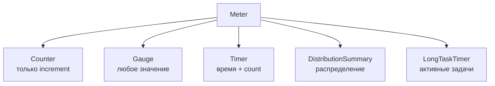

# Вопросы на собеседовании: `Micrometer`

`Micrometer` — библиотека инструментирования метрик для JVM, аналог `SLF4J` для метрик: предоставляет единый API и работает с 25+ мониторинговыми системами. Активно используется в `Spring Boot` начиная с версии 2.0 и спрашивается на собеседованиях в контексте observability.

Дата последнего обновления: 2026-04-20

## Полезные ссылки

### Официальная документация

- [Micrometer Concepts](https://docs.micrometer.io/micrometer/reference/concepts.html) — официальный гайд по концепциям
- [Micrometer Spring Boot](https://docs.micrometer.io/micrometer/reference/implementations/prometheus.html) — интеграция с Prometheus
- [Baeldung: Micrometer](https://www.baeldung.com/micrometer) — практическое введение

## Содержание

- [Полезные ссылки](#полезные-ссылки)
- [See also](#see-also)

**Основы и архитектура**
- [Q1. (!) Что такое Micrometer и зачем он нужен?](#q1-что-такое-micrometer-и-зачем-он-нужен)
- [Q2. Что такое MeterRegistry?](#q2-что-такое-meterregistry)
- [Q3. Как работает CompositeMeterRegistry?](#q3-как-работает-compositemeterregistry)

**Типы метрик**
- [Q4. (!) Какие типы метрик поддерживает Micrometer?](#q4-какие-типы-метрик-поддерживает-micrometer)
- [Q5. (!) Как работает Counter?](#q5-как-работает-counter)
- [Q6. (!) Как работает Gauge?](#q6-как-работает-gauge)
- [Q7. (!) Как работает Timer?](#q7-как-работает-timer)
- [Q8. Что такое DistributionSummary?](#q8-что-такое-distributionsummary)
- [Q9. Когда использовать LongTaskTimer?](#q9-когда-использовать-longtasktimer)

**Теги и именование**
- [Q10. (!) Что такое Tags и зачем они нужны?](#q10-что-такое-tags-и-зачем-они-нужны)
- [Q11. Какие соглашения по именованию метрик?](#q11-какие-соглашения-по-именованию-метрик)

**Spring Boot интеграция**
- [Q12. (!) Как Micrometer интегрирован в Spring Boot?](#q12-как-micrometer-интегрирован-в-spring-boot)
- [Q13. Какие метрики Spring Boot регистрирует автоматически?](#q13-какие-метрики-spring-boot-регистрирует-автоматически)
- [Q14. Как создать кастомную метрику в Spring Boot?](#q14-как-создать-кастомную-метрику-в-spring-boot)
- [Q15. Что такое аннотация @Timed?](#q15-что-такое-аннотация-timed)

**Гистограммы и перцентили**
- [Q16. (!) Как настроить перцентили и гистограммы?](#q16-как-настроить-перцентили-и-гистограммы)
- [Q17. Что такое SLO (Service Level Objective) в Micrometer?](#q17-что-такое-slo-service-level-objective-в-micrometer)

**Фильтры и Prometheus**
- [Q18. Что такое MeterFilter?](#q18-что-такое-meterfilter)
- [Q19. (!) Как настроить экспорт метрик в Prometheus?](#q19-как-настроить-экспорт-метрик-в-prometheus)
- [Q20. Что такое MeterBinder?](#q20-что-такое-meterbinder)

## Q1. (!) Что такое Micrometer и зачем он нужен?

(!) Что такое Micrometer и зачем он нужен?

`Micrometer` — это фасад (facade) поверх клиентских библиотек метрик для популярных мониторинговых систем. Аналог `SLF4J` для метрик: пишешь код один раз — подключаешь любой бэкенд.

**Поддерживаемые системы:**
- `Prometheus`, `Grafana`
- `Datadog`, `New Relic`, `Dynatrace`
- `CloudWatch`, `Stackdriver`
- `InfluxDB`, `Graphite`, `JMX`
- `OpenTelemetry Protocol (OTLP)` и ещё 20+

**Почему не писать напрямую в Prometheus?**
- Vendor lock-in: если переходишь на Datadog — переписываешь весь код инструментирования
- С Micrometer меняешь только зависимость и конфигурацию

```java
// С Micrometer — один код, любой бэкенд
Counter counter = Counter.builder("orders.created")
    .tag("region", "eu-west")
    .register(registry);
counter.increment();
```

**Итог:** Micrometer = SLF4J для метрик. Пиши инструментирование один раз, меняй бэкенды конфигурацией.

## Q2. Что такое MeterRegistry?

`MeterRegistry` — центральный компонент Micrometer. Отвечает за:
- хранение всех зарегистрированных метрик
- публикацию метрик в мониторинговую систему

**Основные реализации:**

| Реализация | Назначение |
|---|---|
| `SimpleMeterRegistry` | In-memory, для тестов |
| `PrometheusMeterRegistry` | Экспорт в Prometheus |
| `DatadogMeterRegistry` | Экспорт в Datadog |
| `CompositeMeterRegistry` | Публикация в несколько систем |
| `Metrics.globalRegistry` | Статический глобальный реестр |

```java
// Получение из Spring context
@Autowired
MeterRegistry registry;

// Или статически (не рекомендуется в Spring)
Metrics.globalRegistry.counter("my.counter").increment();
```

## Q3. Как работает CompositeMeterRegistry?

`CompositeMeterRegistry` агрегирует несколько `MeterRegistry` и публикует метрики во все сразу.

```java
CompositeMeterRegistry composite = new CompositeMeterRegistry();
composite.add(new SimpleMeterRegistry());
composite.add(new PrometheusMeterRegistry(PrometheusConfig.DEFAULT));

Counter counter = composite.counter("requests");
counter.increment(); // записывается в оба реестра
```

**В Spring Boot:** `CompositeMeterRegistry` создаётся автоматически, если в classpath несколько `MeterRegistry` реализаций.

## Q4. (!) Какие типы метрик поддерживает Micrometer?

| Тип | Описание | Когда использовать |
|---|---|---|
| `Counter` | Монотонно возрастающий счётчик | Количество запросов, ошибок, событий |
| `Gauge` | Мгновенное значение | Размер очереди, количество соединений, использование памяти |
| `Timer` | Время выполнения + счётчик | Латентность операций, HTTP-запросы |
| `DistributionSummary` | Распределение значений | Размер payload, размер файлов |
| `LongTaskTimer` | Активные долгие задачи | Batch-задачи, фоновые процессы |
| `FunctionCounter` | Обёртка над monotonic function | Метрики из внешних объектов |



## Q5. (!) Как работает Counter?

`Counter` — монотонно возрастающее число. Можно только **увеличивать** (decrement не поддерживается).

```java
// Создание
Counter counter = Counter.builder("http.requests")
    .description("Total HTTP requests")
    .tag("method", "GET")
    .tag("status", "200")
    .register(registry);

// Использование
counter.increment();           // +1
counter.increment(5);          // +5
double total = counter.count(); // получить значение
```

**Fluent API через MeterRegistry:**
```java
registry.counter("cache.misses", "cache", "users").increment();
```

**Важно:** `Counter` сбрасывается при перезапуске приложения — Prometheus считает `rate()` для динамики.

## Q6. (!) Как работает Gauge?

`Gauge` — мгновенный снимок значения. Micrometer сам опрашивает объект при каждом сборе метрик.

```java
// Привязка к коллекции (авто-обновление размера)
List<String> queue = new ArrayList<>();
registry.gaugeCollectionSize("queue.size", Tags.of("name", "orders"), queue);

// Привязка к AtomicInteger
AtomicInteger activeConnections = new AtomicInteger(0);
Gauge.builder("connections.active", activeConnections, AtomicInteger::get)
    .register(registry);

// Привязка через лямбду
Gauge.builder("cache.size", cache, c -> c.size())
    .register(registry);
```

**Отличие от Counter:**
- `Counter` — накапливает, Prometheus вычисляет `rate()`
- `Gauge` — текущее значение, Prometheus использует напрямую

## Q7. (!) Как работает Timer?

`Timer` измеряет задержку и частоту событий. Автоматически записывает **время** и **количество**.

```java
Timer timer = Timer.builder("http.request.duration")
    .description("HTTP request processing time")
    .tag("endpoint", "/api/orders")
    .publishPercentiles(0.5, 0.95, 0.99)  // p50, p95, p99
    .register(registry);

// Вариант 1: запись вручную
timer.record(Duration.ofMillis(150));

// Вариант 2: обёртка вокруг кода
timer.record(() -> processRequest());

// Вариант 3: Timer.Sample для сложных случаев
Timer.Sample sample = Timer.start(registry);
// ... долгая операция ...
sample.stop(timer);
```

**Что хранит Timer:**
- `count` — количество событий
- `totalTime` — суммарное время
- `max` — максимальное время
- перцентили (если настроены)

## Q8. Что такое DistributionSummary?

`DistributionSummary` похож на `Timer`, но для **произвольных числовых значений** (не времени).

```java
DistributionSummary summary = DistributionSummary.builder("request.payload.size")
    .baseUnit("bytes")
    .publishPercentiles(0.5, 0.95)
    .register(registry);

summary.record(1024);    // размер запроса в байтах
summary.record(512);

double mean = summary.mean();
double count = summary.count();
```

**Использование:** размер payload, количество строк в batch, размер файлов загрузки.

## Q9. Когда использовать LongTaskTimer?

`LongTaskTimer` подходит для **долго выполняющихся задач**, где нужно знать текущий статус в процессе.

```java
LongTaskTimer taskTimer = LongTaskTimer.builder("batch.job")
    .register(registry);

LongTaskTimer.Sample sample = taskTimer.start();
try {
    // долгий процесс (минуты, часы)
    processBatch();
} finally {
    sample.stop();
}

// Пока задача выполняется, можно получить:
taskTimer.activeTasks();     // количество активных задач
taskTimer.duration(SECONDS); // суммарное время активных задач
```

**Отличие от Timer:** обычный `Timer` записывает только после завершения; `LongTaskTimer` отдаёт метрики **в процессе** выполнения.

## Q10. (!) Что такое Tags и зачем они нужны?

`Tags` — пары ключ-значение для многомерных метрик. Позволяют срезать данные по разным измерениям.

```java
// Тег при создании метрики
Counter.builder("http.requests")
    .tag("method", "POST")
    .tag("status", "500")
    .tag("endpoint", "/api/orders")
    .register(registry);
```

**Общие теги (common tags)** — добавляются ко всем метрикам реестра:
```java
registry.config()
    .commonTags("application", "order-service")
    .commonTags("region", "eu-west-1")
    .commonTags("version", "1.2.3");
```

В Spring Boot через `application.yml`:
```yaml
management:
  metrics:
    tags:
      application: ${spring.application.name}
      environment: production
```

**Важно по кардинальности:** не используй в тегах значения с высокой кардинальностью (user ID, request ID) — это взорвёт количество временных рядов в мониторинге.

## Q11. Какие соглашения по именованию метрик?

Micrometer использует **dot-separated** имена: `http.requests.total`, `jvm.memory.used`.

При экспорте каждый бэкенд конвертирует формат автоматически:
- Prometheus: `http_requests_total` (snake_case)
- Datadog: `http.requests.total` (dot-notation)
- Graphite: `http.requests.total`

```java
// Правильно — dot-notation
Counter.builder("orders.created").register(registry);
Counter.builder("payment.failed").register(registry);

// Неправильно — snake_case (для Micrometer)
Counter.builder("orders_created").register(registry);
```

**Рекомендуемые суффиксы** (Prometheus naming convention):
- `_total` — для счётчиков (Counter)
- `_seconds` — для времени (Timer)
- `_bytes` — для размеров

## Q12. (!) Как Micrometer интегрирован в Spring Boot?

Spring Boot 2.0+ включает Micrometer через `spring-boot-starter-actuator`. При добавлении реализации (например, `micrometer-registry-prometheus`) Spring Boot **автоматически**:

1. Создаёт `MeterRegistry` (или `CompositeMeterRegistry` если несколько)
2. Регистрирует JVM-метрики
3. Инструментирует HTTP-запросы
4. Добавляет метрики пулов соединений (HikariCP, Tomcat)

**Зависимости:**
```xml
<dependency>
    <groupId>org.springframework.boot</groupId>
    <artifactId>spring-boot-starter-actuator</artifactId>
</dependency>
<dependency>
    <groupId>io.micrometer</groupId>
    <artifactId>micrometer-registry-prometheus</artifactId>
</dependency>
```

**Конфигурация:**
```yaml
management:
  endpoints:
    web:
      exposure:
        include: health,info,metrics,prometheus
  metrics:
    export:
      prometheus:
        enabled: true
```

`MeterRegistry` доступен через `@Autowired`:
```java
@Service
public class OrderService {
    private final Counter orderCounter;

    public OrderService(MeterRegistry registry) {
        this.orderCounter = registry.counter("orders.created");
    }

    public void createOrder() {
        orderCounter.increment();
        // ...
    }
}
```

## Q13. Какие метрики Spring Boot регистрирует автоматически?

Spring Boot через `MeterBinder` авто-регистрирует:

**JVM:**
- `jvm.memory.used` / `jvm.memory.max` — heap/non-heap по регионам
- `jvm.gc.pause` — время GC пауз
- `jvm.threads.live` / `jvm.threads.daemon`
- `jvm.classes.loaded`

**HTTP (Spring MVC / WebFlux):**
- `http.server.requests` — по методу, URI, статусу, исключению

**HikariCP (connection pool):**
- `hikaricp.connections.active` / `hikaricp.connections.idle`
- `hikaricp.connections.acquire` — время получения соединения

**Tomcat:**
- `tomcat.threads.busy` / `tomcat.threads.current`
- `tomcat.sessions.active.current`

**Logback:**
- `logback.events` — по уровню (ERROR, WARN, INFO...)

**Cache (Caffeine, EhCache):**
- `cache.gets` / `cache.puts` / `cache.evictions`

## Q14. Как создать кастомную метрику в Spring Boot?

**Вариант 1: инжекция MeterRegistry в конструктор (рекомендуется):**
```java
@Service
public class PaymentService {
    private final Counter successCounter;
    private final Counter failureCounter;
    private final Timer processingTimer;

    public PaymentService(MeterRegistry registry) {
        this.successCounter = Counter.builder("payments")
            .tag("status", "success")
            .register(registry);
        this.failureCounter = Counter.builder("payments")
            .tag("status", "failure")
            .register(registry);
        this.processingTimer = Timer.builder("payment.processing.time")
            .register(registry);
    }

    public PaymentResult process(Payment payment) {
        return processingTimer.record(() -> {
            try {
                PaymentResult result = doProcess(payment);
                successCounter.increment();
                return result;
            } catch (Exception e) {
                failureCounter.increment();
                throw e;
            }
        });
    }
}
```

**Вариант 2: через `MeterBinder` (для переиспользуемой инструментации):**
```java
@Component
public class OrderQueueMetrics implements MeterBinder {
    private final BlockingQueue<Order> queue;

    @Override
    public void bindTo(MeterRegistry registry) {
        Gauge.builder("orders.queue.size", queue, Queue::size)
            .description("Current order queue depth")
            .register(registry);
    }
}
```

## Q15. Что такое аннотация @Timed?

`@Timed` — аннотация для автоматической инструментации методов через AOP.

```java
@RestController
public class OrderController {

    @GetMapping("/orders/{id}")
    @Timed(value = "orders.get",
           description = "Time to get order by ID",
           percentiles = {0.5, 0.95, 0.99},
           histogram = true)
    public Order getOrder(@PathVariable Long id) {
        return orderService.findById(id);
    }
}
```

**Требование:** нужен бин `TimedAspect`:
```java
@Bean
public TimedAspect timedAspect(MeterRegistry registry) {
    return new TimedAspect(registry);
}
```

**Ограничение:** как любой AOP proxy — не работает при self-invocation (подробнее в [Spring AOP](../frameworks/spring/spring-aop-interview.md)).

## Q16. (!) Как настроить перцентили и гистограммы?

`Timer` и `DistributionSummary` поддерживают вычисление перцентилей на стороне клиента или сервера.

**Client-side percentiles** (вычисляются в приложении):
```java
Timer.builder("http.request.duration")
    .publishPercentiles(0.5, 0.95, 0.99)  // p50, p95, p99
    .register(registry);
```
- Плюс: не требует поддержки от бэкенда
- Минус: нельзя агрегировать по инстансам

**Histogram (server-side percentiles):**
```java
Timer.builder("http.request.duration")
    .publishPercentileHistogram(true)  // отдаёт buckets, Prometheus вычисляет histogram_quantile()
    .register(registry);
```
- Плюс: можно агрегировать по инстансам
- Минус: требует поддержки в Prometheus

**Через `application.yml`:**
```yaml
management:
  metrics:
    distribution:
      percentiles:
        http.server.requests: 0.5,0.95,0.99
      percentiles-histogram:
        http.server.requests: true
      slo:
        http.server.requests: 50ms,100ms,200ms,500ms
```

## Q17. Что такое SLO (Service Level Objective) в Micrometer?

SLO — заданные пороги для гистограммы. Micrometer создаёт bucket для каждого порога, позволяя отслеживать процент запросов, укладывающихся в цель.

```java
Timer.builder("http.request.duration")
    .serviceLevelObjectives(
        Duration.ofMillis(50),
        Duration.ofMillis(100),
        Duration.ofMillis(200)
    )
    .register(registry);
```

В Prometheus это превращается в:
```
http_request_duration_seconds_bucket{le="0.05"} 1234
http_request_duration_seconds_bucket{le="0.10"} 5678
http_request_duration_seconds_bucket{le="0.20"} 9012
```

**Запрос в PromQL:**
```promql
# Процент запросов быстрее 100ms
rate(http_request_duration_seconds_bucket{le="0.10"}[5m])
  / rate(http_request_duration_seconds_count[5m])
```

## Q18. Что такое MeterFilter?

`MeterFilter` — interceptor для кастомизации метрик при регистрации: переименование, фильтрация, добавление тегов, ограничение кардинальности.

```java
@Bean
public MeterRegistryCustomizer<MeterRegistry> metricsCustomizer() {
    return registry -> registry.config()
        // запретить метрики по паттерну
        .meterFilter(MeterFilter.deny(id -> 
            id.getName().startsWith("jvm.buffer")))
        // ограничить кардинальность тега uri
        .meterFilter(MeterFilter.maximumAllowableTags(
            "http.server.requests", "uri", 100, MeterFilter.deny()))
        // добавить тег ко всем метрикам
        .commonTags("env", "production");
}
```

**Встроенные фильтры:**
- `MeterFilter.deny()` — запрещает регистрацию
- `MeterFilter.accept()` — разрешает явно
- `MeterFilter.ignoreTags(...)` — удаляет теги
- `MeterFilter.maximumAllowableTags(...)` — ограничивает кардинальность

## Q19. (!) Как настроить экспорт метрик в Prometheus?

**1. Зависимости:**
```xml
<dependency>
    <groupId>io.micrometer</groupId>
    <artifactId>micrometer-registry-prometheus</artifactId>
</dependency>
```

**2. application.yml:**
```yaml
management:
  endpoints:
    web:
      exposure:
        include: prometheus
  metrics:
    export:
      prometheus:
        enabled: true
    tags:
      application: ${spring.application.name}
```

**3. Endpoint:** `GET /actuator/prometheus` — возвращает метрики в формате text/plain для Prometheus.

**4. prometheus.yml (настройка scraping):**
```yaml
scrape_configs:
  - job_name: 'spring-app'
    metrics_path: '/actuator/prometheus'
    static_configs:
      - targets: ['localhost:8080']
    scrape_interval: 15s
```

**Итог:** Spring Boot + `micrometer-registry-prometheus` → endpoint `/actuator/prometheus` → Prometheus scrapes → Grafana визуализирует.

## Q20. Что такое MeterBinder?

`MeterBinder` — SPI для переиспользуемых инструментирований. Spring Boot использует его для авто-регистрации JVM, HikariCP, Caffeine и других метрик.

```java
@Component
public class DatabaseHealthMetrics implements MeterBinder {
    private final DataSource dataSource;

    @Override
    public void bindTo(MeterRegistry registry) {
        Gauge.builder("db.pool.active", dataSource,
                ds -> ((HikariDataSource) ds).getHikariPoolMXBean().getActiveConnections())
            .description("Active DB connections")
            .register(registry);

        Gauge.builder("db.pool.idle", dataSource,
                ds -> ((HikariDataSource) ds).getHikariPoolMXBean().getIdleConnections())
            .description("Idle DB connections")
            .register(registry);
    }
}
```

**Преимущество:** `MeterBinder` бины Spring Boot подхватывает автоматически. Не нужно вручную вызывать `bindTo()`.

## See also

- [Observability](observability-interview.md) — три столпа наблюдаемости: метрики, логи, трейсинг
- [Prometheus и Grafana](prometheus-grafana-interview.md) — Prometheus scraping, PromQL, Grafana дашборды
- [OpenTelemetry](opentelemetry-interview.md) — стандарт CNCF для трассировки, метрик и логов
- [Spring Boot Actuator](../frameworks/spring/spring-boot-actuator-interview.md) — health checks, info, metrics endpoint
- [Spring Boot](../frameworks/spring/spring-boot-interview.md) — auto-configuration, starter dependencies
- [Spring AOP](../frameworks/spring/spring-aop-interview.md) — механизм @Timed annotation (AOP proxy)
- [JVM Performance Tuning](../performance/jvm-performance-tuning-interview.md) — JVM метрики: GC, heap, threads
- [Database Performance](../performance/database-performance-interview.md) — метрики пулов соединений HikariCP
- [Jaeger и Zipkin](jaeger-zipkin-interview.md) — распределённый трейсинг рядом с метриками
- [Шпаргалка: Micrometer](../../monitoring/metrics/micrometer.md) — теория
