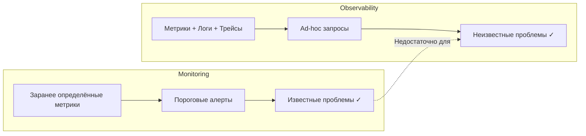
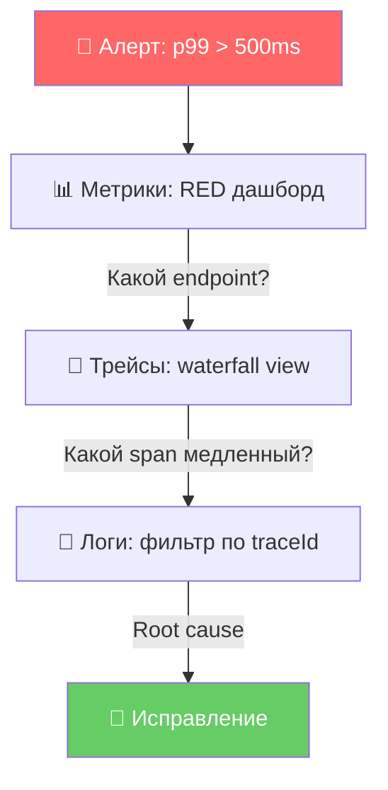
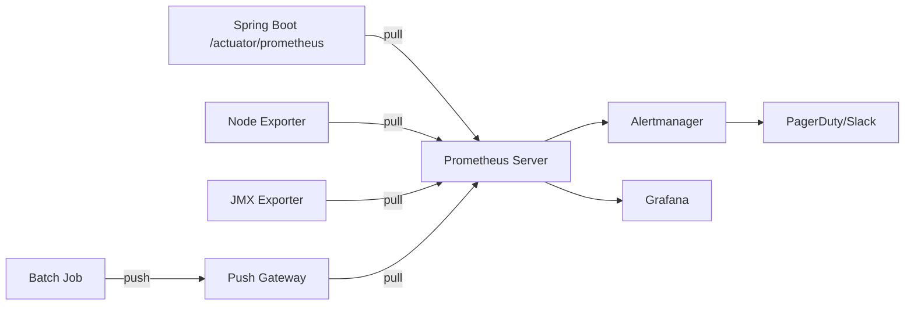
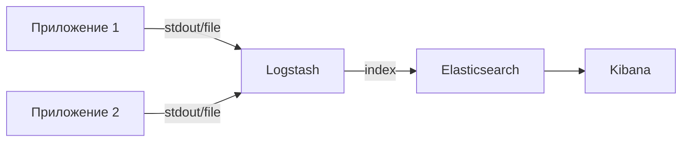
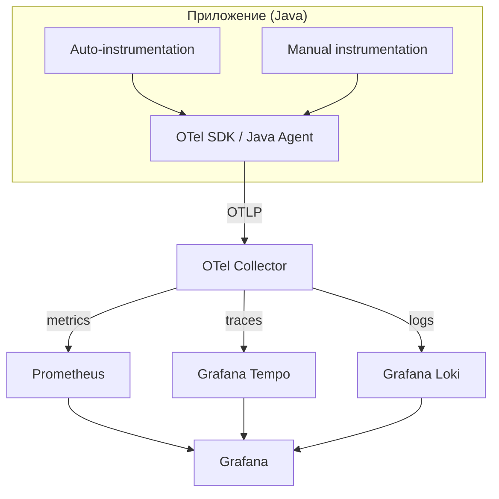
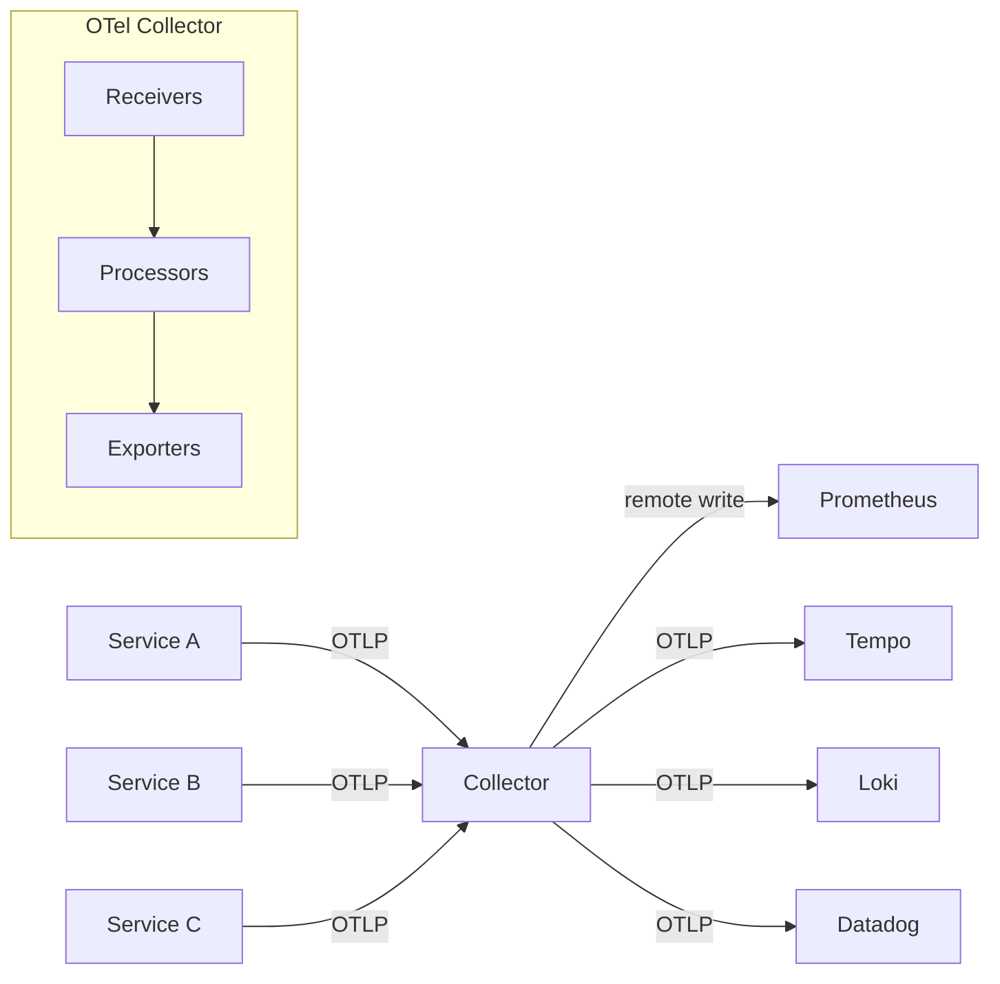
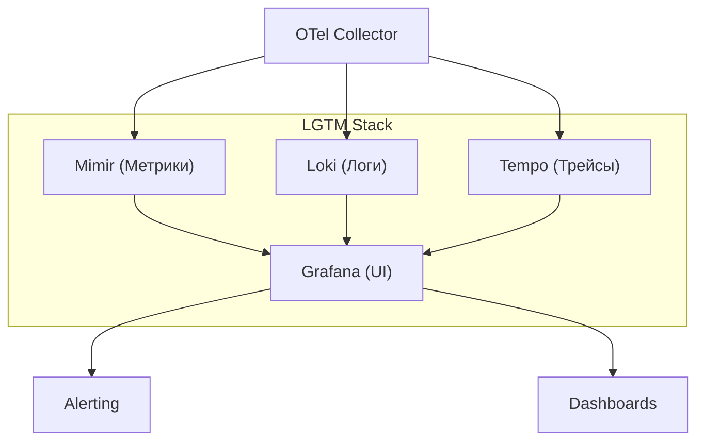
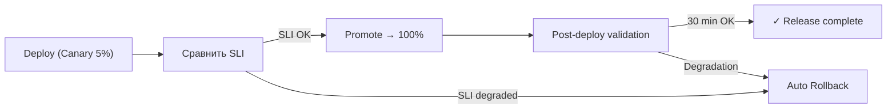

# Вопросы на собеседовании: `Observability`

Практичные вопросы и ответы по observability для `Senior Java Developer`: три столпа (логи, метрики, трейсы), `OpenTelemetry`, `Prometheus`, `Grafana`, distributed tracing, structured logging, `SLI`/`SLO`/`SLA`, алертинг и работа в production.

## Полезные ссылки

### Официальная документация

- [OpenTelemetry](https://opentelemetry.io/docs/) — спецификация и SDK для телеметрии
- [OpenTelemetry Java](https://opentelemetry.io/docs/languages/java/) — Java SDK и auto-instrumentation
- [Prometheus](https://prometheus.io/docs/introduction/overview/) — система мониторинга и TSDB
- [Grafana](https://grafana.com/docs/) — визуализация и дашборды
- [Micrometer](https://micrometer.io/docs) — фасад метрик для JVM-приложений
- [Elastic Stack (ELK)](https://www.elastic.co/guide/index.html) — агрегация и поиск логов
- [Jaeger](https://www.jaegertracing.io/docs/) — distributed tracing backend
- [Grafana Loki](https://grafana.com/docs/loki/latest/) — лёгкая система агрегации логов
- [Grafana Tempo](https://grafana.com/docs/tempo/latest/) — backend для трейсов
- [Observability With Spring Boot](https://www.baeldung.com/spring-boot-3-observability) — observability в Spring Boot 3 через Micrometer
- [OpenTelemetry Setup in Spring Boot Application](https://www.baeldung.com/spring-boot-opentelemetry-setup) — настройка OpenTelemetry в Spring Boot
- [Observability in Distributed Systems](https://www.baeldung.com/distributed-systems-observability) — концепции observability для микросервисов
- [Working With OpenTelemetry Collector](https://www.baeldung.com/java-opentelemetry-collector) — работа с OpenTelemetry Collector

## Содержание

- [Полезные ссылки](#полезные-ссылки)
- [See also](#see-also)

**Основы и философия**
- [Q1. (!) Как коротко объяснить observability и отличие от мониторинга?](#q1--как-коротко-объяснить-observability-и-отличие-от-мониторинга)
- [Q2. Как построить сильный ответ на вопрос по observability?](#q2-как-построить-сильный-ответ-на-вопрос-по-observability)
- [Q3. (!) Как связаны три столпа observability?](#q3--как-связаны-три-столпа-observability)

**Метрики и Prometheus**
- [Q4. (!) Какие метрики критичны для backend-сервиса?](#q4--какие-метрики-критичны-для-backend-сервиса)
- [Q5. (!) Что такое RED и USE методы и когда какой применять?](#q5--что-такое-red-и-use-методы-и-когда-какой-применять)
- [Q6. Как устроен Prometheus и его модель данных?](#q6-как-устроен-prometheus-и-его-модель-данных)
- [Q7. Какие типы метрик есть в Prometheus и когда какой использовать?](#q7-какие-типы-метрик-есть-в-prometheus-и-когда-какой-использовать)
- [Q8. (!) Что такое cardinality и почему она опасна?](#q8--что-такое-cardinality-и-почему-она-опасна)
- [Q9. Как подключить Prometheus-метрики в Spring Boot приложении?](#q9-как-подключить-prometheus-метрики-в-spring-boot-приложении)

**Логи и агрегация**
- [Q10. (!) Что такое structured logging и зачем он нужен?](#q10--что-такое-structured-logging-и-зачем-он-нужен)
- [Q11. Как устроен ELK-стек и чем отличается EFK?](#q11-как-устроен-elk-стек-и-чем-отличается-efk)
- [Q12. Как настроить structured logging в Spring Boot?](#q12-как-настроить-structured-logging-в-spring-boot)

**Distributed Tracing**
- [Q13. (!) Как работает distributed tracing и из чего состоит трейс?](#q13--как-работает-distributed-tracing-и-из-чего-состоит-трейс)
- [Q14. Чем отличаются Jaeger и Zipkin?](#q14-чем-отличаются-jaeger-и-zipkin)
- [Q15. Как организовать связку traceId между логами и трейсами?](#q15-как-организовать-связку-traceid-между-логами-и-трейсами)
- [Q16. Что такое exemplars и когда они реально полезны?](#q16-что-такое-exemplars-и-когда-они-реально-полезны)

**OpenTelemetry**
- [Q17. (!) Что такое OpenTelemetry и почему это стандарт де-факто?](#q17--что-такое-opentelemetry-и-почему-это-стандарт-де-факто)
- [Q18. Как устроена архитектура OpenTelemetry?](#q18-как-устроена-архитектура-opentelemetry)
- [Q19. Как инструментировать Java-приложение с помощью OpenTelemetry?](#q19-как-инструментировать-java-приложение-с-помощью-opentelemetry)
- [Q20. Что такое OpenTelemetry Collector и зачем он нужен?](#q20-что-такое-opentelemetry-collector-и-зачем-он-нужен)

**Grafana и визуализация**
- [Q21. Как устроен стек Grafana и что входит в LGTM?](#q21-как-устроен-стек-grafana-и-что-входит-в-lgtm)
- [Q22. Как проектировать эффективные дашборды?](#q22-как-проектировать-эффективные-дашборды)

**SLO/SLI/SLA и алертинг**
- [Q23. (!) Как объяснить SLI, SLO, SLA и error budget на практике?](#q23--как-объяснить-sli-slo-sla-и-error-budget-на-практике)
- [Q24. (!) Как проектировать алертинг без alert fatigue?](#q24--как-проектировать-алертинг-без-alert-fatigue)
- [Q25. Что такое burn rate alerting и чем оно лучше threshold-алертов?](#q25-что-такое-burn-rate-alerting-и-чем-оно-лучше-threshold-алертов)

**Sampling и стоимость**
- [Q26. Какие стратегии sampling существуют для трейсов?](#q26-какие-стратегии-sampling-существуют-для-трейсов)
- [Q27. Как управлять стоимостью логов и трейсов?](#q27-как-управлять-стоимостью-логов-и-трейсов)

**Production и операционные практики**
- [Q28. Как запускать observability в production без перегруза системы?](#q28-как-запускать-observability-в-production-без-перегруза-системы)
- [Q29. Как выбрать стек observability под команду и бюджет?](#q29-как-выбрать-стек-observability-под-команду-и-бюджет)
- [Q30. Как observability помогает в инциденте и постмортеме?](#q30-как-observability-помогает-в-инциденте-и-постмортеме)
- [Q31. Как внедрять observability в CI/CD и релизный процесс?](#q31-как-внедрять-observability-в-cicd-и-релизный-процесс)

**Anti-patterns и зрелость**
- [Q32. (!) Какие anti-patterns в observability встречаются чаще всего?](#q32--какие-anti-patterns-в-observability-встречаются-чаще-всего)
- [Q33. Как оценить зрелость observability в команде?](#q33-как-оценить-зрелость-observability-в-команде)

**OpenTelemetry Collector и профилирование**
- [Q34. OpenTelemetry Collector: архитектура, pipeline и processors?](#q34-opentelemetry-collector-архитектура-pipeline-и-processors)
- [Q35. Что такое Continuous Profiling и как его делают (Pyroscope, Grafana Phlare, eBPF)?](#q35-что-такое-continuous-profiling-и-как-его-делают-pyroscope-grafana-phlare-ebpf)

**Chaos Engineering и Alert Fatigue**
- [Q36. Chaos Engineering и Observability: как связаны?](#q36-chaos-engineering-и-observability-как-связаны)
- [Q37. Alert Fatigue: причины, как бороться, стратегии silencing?](#q37-alert-fatigue-причины-как-бороться-стратегии-silencing)

**Runbook и FinOps**
- [Q38. Что включать в Runbook для автоматизации реакции на инцидент?](#q38-что-включать-в-runbook-для-автоматизации-реакции-на-инцидент)
- [Q39. FinOps и Observability: стоимость телеметрии и sampling для снижения затрат?](#q39-finops-и-observability-стоимость-телеметрии-и-sampling-для-снижения-затрат)
- [Q40. Synthetic Monitoring: что это и когда нужно?](#q40-synthetic-monitoring-что-это-и-когда-нужно)

**Micrometer Observation API**
- [Q41. (!) Что такое Micrometer Observation API и какую проблему он решает?](#q41--что-такое-micrometer-observation-api-и-какую-проблему-он-решает)
- [Q42. Как работают ObservationRegistry и ObservationHandler?](#q42-как-работают-observationregistry-и-observationhandler)

## Q1. (!) Как коротко объяснить observability и отличие от мониторинга?

Главное отличие — в типе вопросов, на которые система может ответить. `Monitoring` отвечает на заранее известные вопросы («вышли ли мы за порог?»), а `observability` позволяет расследовать сценарии, которые вы не предусмотрели заранее («почему именно этот поток запросов деградировал?»).

Короткая формула для собеседования:
- мониторинг = detection (заметили проблему),
- observability = detection + diagnosis (заметили **и** можем докопаться до причины).

Ключевое свойство observable-системы — возможность задавать произвольные вопросы о её внутреннем состоянии, не деплоя новый код под каждую новую гипотезу. Именно это отличает observability от набора заранее заведённых дашбордов: вы не угадывали заранее, какой разрез данных понадобится.

Сам термин пришёл из теории управления: система observable, если по её внешним выходам можно восстановить внутреннее состояние. В software это значит, что телеметрии (метрики, логи, трейсы) достаточно, чтобы реконструировать, что происходило внутри, не подключаясь дебаггером к проду.



## Q2. Как построить сильный ответ на вопрос по observability?

Рабочий шаблон на 40-60 секунд:
1. **Симптом:** "растёт p99 latency и error rate".
2. **Путь диагностики:** "дашборд RED -> trace -> логи по traceId".
3. **Решение:** "ограничили cardinality метрик, поправили retry, снизили tail latency".
4. **Валидация:** "p99 с 900ms до 280ms, 5xx с 2.8% до 0.4%".

Именно измеримый результат отличает сильный senior-ответ от теории.

## Q3. (!) Как связаны три столпа observability?

Три столпа — это три взаимодополняющих сигнала телеметрии, каждый отвечает на свой класс вопросов. По отдельности они дают неполную картину, ценность появляется именно на стыке.

| Столп | Отвечает на вопрос | Примеры |
|-------|-------------------|---------|
| **Метрики** | «Что происходит массово?» (агрегаты, тренды) | `request_rate`, `error_rate`, `cpu_usage` |
| **Трейсы** | «Где в цепочке задержка?» (путь запроса) | `Span`, `TraceId`, waterfall |
| **Логи** | «Почему это произошло?» (детали события) | stack trace, бизнес-события |

Логика разделения: метрики дёшевы и показывают проблему статистически, но не говорят, какой конкретно запрос виноват; трейсы показывают путь одного запроса по сервисам, но не содержат деталей; логи содержат детали (исключение, параметры), но в них утонешь без точки входа. Поэтому сигналы используют по цепочке.

**Типичный путь диагностики:** метрика-алерт даёт сигнал, что что-то не так и в каком сервисе → trace показывает, в каком именно span ушло время → логи по `traceId` объясняют root cause.



Связка работает только при наличии единого контекста (`traceId`), который пронизывает все три сигнала.

## Q4. (!) Какие метрики критичны для backend-сервиса?

Критичные метрики backend-сервиса делятся на три слоя — от «что видит пользователь» до «почему ресурсам плохо» и «что это значит для бизнеса». Минимальный набор:

- **`RED` (что видит пользователь):** `request_rate`, `error_rate`, `request_duration` (p50/p95/p99) — здоровье сервиса с точки зрения входящего трафика.
- **Saturation (что с ресурсами):** `cpu`, `memory`, queue depth, pool utilization — насколько близко к пределу. Растущая saturation предсказывает деградацию RED ещё до того, как пользователи её заметят.
- **Бизнес-метрики (что это значит):** успешные оплаты, конверсия, отказ транзакций — переводят технические числа в реальный impact.

```java
// Пример кастомной бизнес-метрики с Micrometer
@Component
public class PaymentMetrics {
    private final Counter successfulPayments;
    private final Counter failedPayments;
    private final Timer paymentDuration;

    public PaymentMetrics(MeterRegistry registry) {
        this.successfulPayments = Counter.builder("payments.success")
            .description("Number of successful payments")
            .tag("currency", "RUB")
            .register(registry);
        this.failedPayments = Counter.builder("payments.failed")
            .description("Number of failed payments")
            .tag("reason", "unknown")
            .register(registry);
        this.paymentDuration = Timer.builder("payments.duration")
            .description("Payment processing time")
            .publishPercentiles(0.5, 0.95, 0.99)
            .register(registry);
    }

    public void recordSuccess(Duration duration) {
        successfulPayments.increment();
        paymentDuration.record(duration);
    }
}
```

**Подводный камень:** только технические метрики без бизнес-контекста. CPU может быть в норме, а оплаты при этом не проходят — без бизнес-метрики такой инцидент остаётся незамеченным, пока не придёт жалоба от пользователей.

## Q5. (!) Что такое RED и USE методы и когда какой применять?

Это два дополняющих друг друга фреймворка «минимально достаточного набора метрик». Различаются объектом наблюдения: **RED смотрит на сервис глазами клиента, USE — на ресурс глазами инженера**. На практике их применяют вместе.

**RED** (Tom Wilkie, Weaveworks) — для сервисов, обрабатывающих запросы:
- **R**ate — количество запросов в секунду
- **E**rrors — количество/доля ошибок
- **D**uration — распределение latency (гистограмма)

**USE** (Brendan Gregg) — для инфраструктурных ресурсов (CPU, память, диск, сеть):
- **U**tilization — процент использования ресурса
- **S**aturation — очередь ожидающих (queue depth)
- **E**rrors — ошибки ресурса (disk I/O errors, packet drops)

| Метод | Когда применять | Пример |
|-------|----------------|--------|
| `RED` | Application-level мониторинг | HTTP endpoints, gRPC сервисы |
| `USE` | Infrastructure-level мониторинг | CPU, memory, connection pools |

Практический совет: начинайте с `RED` для сервисов, добавляйте `USE` для ресурсов, подключайте бизнес-метрики для product-контекста.

```java
// RED-метрики автоматически через Spring Boot Actuator + Micrometer
// application.yml
// management:
//   endpoints:
//     web:
//       exposure:
//         include: prometheus,health,info
//   metrics:
//     distribution:
//       percentiles-histogram:
//         http.server.requests: true    # гистограмма latency
//       slo:
//         http.server.requests: 50ms,100ms,200ms,500ms
```

## Q6. Как устроен Prometheus и его модель данных?

`Prometheus` — это pull-based система мониторинга со встроенной TSDB (time-series database). «Pull-based» значит, что сервер сам периодически ходит на endpoint каждого приложения и забирает (scrape) метрики по HTTP, а не приложения шлют их сами. Это даёт встроенный health-check (target недоступен → сразу видно) и упрощает control: лимиты и фильтры применяются централизованно на сервере.

Ключевые компоненты:
- **Prometheus Server** — скрейпит метрики по HTTP, хранит в TSDB, выполняет `PromQL`-запросы
- **Exporters** — адаптеры для систем без нативной поддержки метрик (JMX exporter, node_exporter): переводят их состояние в формат Prometheus
- **Alertmanager** — маршрутизация, дедупликация и группировка алертов
- **Push Gateway** — мост для short-lived jobs (batch, cron), которые завершаются раньше, чем сервер успеет их заскрейпить



Модель данных: каждая time series — это уникальная комбинация имени метрики и набора лейблов:

```
http_requests_total{method="GET", handler="/api/users", status="200"} 12345
```

Пример конфигурации `prometheus.yml`:

```yaml
global:
  scrape_interval: 15s
  evaluation_interval: 15s

rule_files:
  - "alerts/*.yml"

alerting:
  alertmanagers:
    - static_configs:
        - targets: ['alertmanager:9093']

scrape_configs:
  - job_name: 'spring-boot-app'
    metrics_path: '/actuator/prometheus'
    scrape_interval: 10s
    static_configs:
      - targets: ['app1:8080', 'app2:8080']
    # В Kubernetes — используйте kubernetes_sd_configs
```

## Q7. Какие типы метрик есть в Prometheus и когда какой использовать?

Prometheus различает четыре типа метрик. Выбор типа определяется не данными, а тем, как метрику потом будут считать в PromQL — например, к `Counter` применяют `rate()`, а к `Gauge` нет.

| Тип | Описание | Когда использовать | Пример |
|-----|----------|-------------------|--------|
| `Counter` | Монотонно растущее значение (только вверх, сброс при рестарте) | Количество запросов, ошибок | `http_requests_total` |
| `Gauge` | Значение, которое может расти и падать | Температура, текущие соединения | `jvm_memory_used_bytes` |
| `Histogram` | Распределение значений по бакетам | Latency, размер ответа | `http_request_duration_seconds` |
| `Summary` | Квантили, посчитанные на стороне клиента | Когда нужны точные квантили для одного инстанса | `rpc_duration_seconds` |

**`Histogram` vs `Summary`** — частый вопрос на собеседовании. Суть в том, **кто и когда считает квантили**: histogram отдаёт сырые бакеты, и квантиль вычисляет сервер при запросе; summary считает квантиль на клиенте заранее.

| Аспект | `Histogram` | `Summary` |
|--------|------------|-----------|
| Агрегация | Можно агрегировать между инстансами | Нельзя агрегировать квантили |
| Вычисление | Квантили считает сервер (PromQL) | Квантили считает клиент |
| Точность | Зависит от выбора бакетов | Точные для одного инстанса |
| Рекомендация | **Предпочтительнее** в большинстве случаев | Редко нужен |

**Эмпирическое правило:** в распределённой системе почти всегда нужен `Histogram` — посчитать p99 по всему сервису можно только если квантиль считается из агрегируемых бакетов на сервере. У summary квантили с разных инстансов нельзя сложить (среднее от квантилей — не квантиль), поэтому он годится лишь для одного инстанса с жёсткими требованиями к точности.

```java
// Histogram в Micrometer — автоматически создаёт бакеты
Timer.builder("order.processing.time")
    .publishPercentileHistogram()          // Prometheus histogram
    .minimumExpectedValue(Duration.ofMillis(1))
    .maximumExpectedValue(Duration.ofSeconds(10))
    .register(registry);
```

## Q8. (!) Что такое cardinality и почему она опасна?

**Cardinality** — это количество уникальных комбинаций лейблов для метрики. Опасна она потому, что каждая уникальная комбинация лейблов — это **отдельная time series** в TSDB со своим индексом и буфером в памяти. Один неудачный лейбл умножает число серий и может положить Prometheus.

Пример взрыва cardinality:

```
# Безопасно: ~20 уникальных time series
http_requests_total{method="GET", status="200", handler="/api/users"}

# ОПАСНО: миллионы time series!
http_requests_total{method="GET", status="200", user_id="12345678"}
```

Почему это критично:
- Память `Prometheus` растёт линейно с числом time series — каждая серия держит индекс и активный буфер
- Запросы по метрикам с высокой cardinality тормозят или OOM-ят сервер
- На практике ≥ 100K time series на один инстанс уже проблема

Корень проблемы — лейблы с неограниченным множеством значений. `status` принимает горстку значений (`200`, `404`, `500`) — это безопасно. `user_id` принимает миллионы — это бомба: каждый новый пользователь создаёт новую серию навсегда.

Правила контроля cardinality:
1. **Никогда** не используйте в лейблах поля с неограниченным набором значений: `userId`, `requestId`, `sessionId`, `email`, `IP`
2. Проверяйте cardinality заранее: `count by (__name__)({__name__=~".+"})` в PromQL
3. Используйте `relabel_configs` для дропа ненужных лейблов на этапе scrape
4. Установите `sample_limit` в `scrape_configs`

```yaml
# prometheus.yml — защита от cardinality explosion
scrape_configs:
  - job_name: 'app'
    sample_limit: 10000   # максимум time series с одного target
    metric_relabel_configs:
      - source_labels: [__name__]
        regex: 'go_.*'    # дропаем ненужные go-метрики
        action: drop
```

## Q9. Как подключить Prometheus-метрики в Spring Boot приложении?

Подключение сводится к трём шагам: добавить зависимости, открыть endpoint, при необходимости — описать кастомные метрики. Базовый набор RED- и JVM-метрик появляется автоматически, без единой строки кода.

```groovy
// build.gradle
dependencies {
    implementation 'org.springframework.boot:spring-boot-starter-actuator'
    implementation 'io.micrometer:micrometer-registry-prometheus'
}
```

```yaml
# application.yml
management:
  endpoints:
    web:
      exposure:
        include: prometheus,health,info,metrics
  metrics:
    tags:
      application: ${spring.application.name}  # общий лейбл для всех метрик
    distribution:
      percentiles-histogram:
        http.server.requests: true
      slo:
        http.server.requests: 50ms,100ms,250ms,500ms,1s
```

Что получаете автоматически (out of the box):
- `http_server_requests_seconds` — RED-метрики для всех HTTP endpoints
- `jvm_memory_*`, `jvm_gc_*` — JVM метрики
- `hikaricp_*` — метрики connection pool
- `spring_data_repository_*` — метрики репозиториев (если Spring Data)

Кастомные метрики добавляются через `MeterRegistry`:

```java
@Service
@RequiredArgsConstructor
public class OrderService {
    private final MeterRegistry meterRegistry;

    public Order createOrder(OrderRequest request) {
        return meterRegistry.timer("orders.create",
                "type", request.getType().name())
            .record(() -> doCreateOrder(request));
    }
}
```

## Q10. (!) Что такое structured logging и зачем он нужен?

**Structured logging** — это запись логов в машиночитаемом формате (обычно `JSON`) с явными полями, вместо произвольной текстовой строки. Нужен он потому, что в распределённой системе логи не читают глазами построчно — их грузят в систему агрегации (`Elasticsearch`, `Loki`) и ищут по полям. По плоскому тексту нельзя надёжно отфильтровать «все ошибки пользователя 12345» — по полю `userId` это один запрос.

Сравнение:

```
# Неструктурированный лог — сложно парсить, невозможно фильтровать
2026-04-11 10:15:32 ERROR OrderService - Failed to create order for user 12345: timeout

# Структурированный лог — легко искать, фильтровать, агрегировать
{
  "timestamp": "2026-04-11T10:15:32.456Z",
  "level": "ERROR",
  "logger": "com.app.OrderService",
  "message": "Failed to create order",
  "userId": 12345,
  "orderId": "ORD-789",
  "error": "timeout",
  "traceId": "abc123def456",
  "spanId": "span789",
  "service": "order-service",
  "duration_ms": 5023
}
```

Преимущества structured logging:
- **Поиск и фильтрация** в `Elasticsearch`/`Loki` по конкретным полям
- **Корреляция** с трейсами через `traceId`/`spanId`
- **Агрегация** — COUNT по `error`, GROUP BY `userId`
- **Алертинг** на конкретные паттерны

Ключевые правила:
1. Всегда включайте `traceId` и `spanId` в лог-контекст
2. Не логируйте PII (Personal Identifiable Information) в открытом виде
3. Используйте фиксированное сообщение + поля, а не string interpolation
4. Уровни: `ERROR` — требует действия, `WARN` — внимание, `INFO` — бизнес-события, `DEBUG` — только локально

## Q11. Как устроен ELK-стек и чем отличается EFK?

Это два варианта одного конвейера «сбор → хранение → просмотр логов», различаются только средним звеном — агентом сбора. **ELK** = `Elasticsearch` (хранение и поиск) + `Logstash` (сбор и обработка) + `Kibana` (UI). **EFK** заменяет `Logstash` на `Fluentd`/`Fluent Bit`. Хранилище (`Elasticsearch`) и UI (`Kibana`) общие.

**ELK** = `Elasticsearch` + `Logstash` + `Kibana`:



**EFK** = `Elasticsearch` + `Fluentd`/`Fluent Bit` + `Kibana`:

| Компонент | ELK (`Logstash`) | EFK (`Fluentd`/`Fluent Bit`) |
|-----------|-----------------|------------------------------|
| Язык | JRuby (JVM) | C + Ruby / чистый C |
| Потребление RAM | 500MB-1GB+ | 30-50MB (`Fluent Bit`) |
| Плагины | Богатая экосистема | Богатая экосистема |
| Kubernetes | Тяжеловат | Де-факто стандарт в K8s |

Главное отличие агентов — вес: `Fluent Bit` написан на C и ест десятки МБ против сотен МБ у JVM-ного `Logstash`, поэтому EFK стал де-факто стандартом в Kubernetes, где агент крутится на каждой ноде.

Альтернатива обоим стекам — **Grafana Loki**. Он переворачивает подход `Elasticsearch`: не индексирует содержимое логов, только метки (как Prometheus метрики):
- Не индексирует содержимое логов (только лейблы) — дешевле в 10-50x
- Использует тот же язык запросов `LogQL` (похож на `PromQL`)
- Нативная интеграция с `Grafana`

Когда что выбирать:
- `ELK` — нужен полнотекстовый поиск по логам, большие объёмы аналитики
- `Loki` — бюджет ограничен, логи нужны для troubleshooting, а не аналитики
- `EFK` — `Kubernetes`-native окружение, нужен лёгкий агент

## Q12. Как настроить structured logging в Spring Boot?

Начиная со `Spring Boot 3.4` есть встроенная поддержка structured logging:

```yaml
# application.yml (Spring Boot 3.4+)
logging:
  structured:
    format:
      console: ecs   # Elastic Common Schema
    # Альтернативы: logstash, gelf
```

Для более ранних версий — через `Logback` + `logstash-logback-encoder`:

```xml
<!-- logback-spring.xml -->
<configuration>
    <appender name="JSON" class="ch.qos.logback.core.ConsoleAppender">
        <encoder class="net.logstash.logback.encoder.LogstashEncoder">
            <includeMdcKeyName>traceId</includeMdcKeyName>
            <includeMdcKeyName>spanId</includeMdcKeyName>
            <customFields>
                {"service":"order-service","env":"${ENV:-dev}"}
            </customFields>
        </encoder>
    </appender>

    <root level="INFO">
        <appender-ref ref="JSON"/>
    </root>
</configuration>
```

Добавление контекста через `MDC` (Mapped Diagnostic Context):

```java
import org.slf4j.MDC;

@RestController
public class OrderController {

    @PostMapping("/orders")
    public Order createOrder(@RequestBody OrderRequest request) {
        MDC.put("userId", request.getUserId());
        MDC.put("orderType", request.getType().name());
        try {
            log.info("Creating order");  // userId и orderType попадут в JSON
            return orderService.create(request);
        } finally {
            MDC.clear();
        }
    }
}
```

При использовании `OpenTelemetry` — `traceId`/`spanId` добавляются в `MDC` автоматически через `opentelemetry-logback-mdc` или Java agent.

## Q13. (!) Как работает distributed tracing и из чего состоит трейс?

**Distributed tracing** отслеживает путь одного запроса через множество сервисов и собирает его в единую картину. Решает главную боль микросервисов: «запрос медленный, но в каком из десяти сервисов он застрял?». Работает за счёт сквозного идентификатора (`traceId`), который передаётся вместе с запросом и связывает все вызванные операции в одно дерево.

Основные понятия:
- **Trace** — полный путь одного запроса через систему (дерево span'ов)
- **Span** — единица работы в одном сервисе (HTTP-вызов, запрос к БД, обращение к кэшу)
- **TraceId** — уникальный идентификатор трейса (128 бит в W3C формате), общий для всех span'ов запроса
- **SpanId** — уникальный идентификатор span'а
- **Parent SpanId** — ссылка на родительский span; именно она выстраивает span'ы в дерево
- **Baggage** — пользовательские данные (например, tenant id), пробрасываемые через все сервисы вместе с контекстом



```mermaid
gantt
    title Distributed Trace: POST /api/orders
    dateFormat X
    axisFormat %L ms

    section API Gateway
    gateway.request           :0, 350

    section Order Service
    order.createOrder         :20, 300
    order.validateRequest     :30, 50

    section Payment Service
    payment.charge            :90, 150

    section Database
    db.insertOrder            :250, 70
```

Формат контекста `W3C Trace Context` (стандарт):

```
traceparent: 00-4bf92f3577b34da6a3ce929d0e0e4736-00f067aa0ba902b7-01
              |  |                                |                  |
              v  v                                v                  v
           version  trace-id (128 bit)        parent-id (64 bit)   flags
```

Этот заголовок автоматически передаётся между сервисами через HTTP headers, Kafka headers, gRPC metadata.

## Q14. Чем отличаются Jaeger и Zipkin?

Оба — open-source backend'ы для distributed tracing: принимают span'ы, хранят их и дают UI для просмотра трейсов. Различия в основном в зрелости, экосистеме и эксплуатации, а не в концепции. Основные отличия:

| Аспект | `Jaeger` | `Zipkin` |
|--------|---------|---------|
| Автор | Uber → CNCF | Twitter |
| Язык | Go | Java |
| Хранение | `Elasticsearch`, `Cassandra`, `Kafka`, `Badger` | `Elasticsearch`, `Cassandra`, MySQL, in-memory |
| Adaptive sampling | Да (встроенный) | Нет (только фиксированный) |
| UI | Более функциональный, DAG view | Простой, удобный |
| OpenTelemetry | Нативная поддержка OTLP | Требует Zipkin exporter |
| Масштабирование | Лучше для крупных систем | Проще для малых |

На практике сейчас оба уступают место `Grafana Tempo`, который:
- Принимает данные через `OTLP` (протокол `OpenTelemetry`)
- Не требует индексации (поиск по `traceId`)
- Значительно дешевле в хранении (object storage: S3, GCS)
- Нативно интегрирован с `Grafana`

## Q15. Как организовать связку traceId между логами и трейсами?

Цель связки — переходить от «вижу медленный span в трейсе» к «вижу конкретное исключение в логе» за один клик, без ручного перебора логов по времени. Для этого общий `traceId` должен пронизывать оба сигнала. Что нужно сделать:

1. Включить `OpenTelemetry` auto/manual instrumentation — она и генерирует контекст трейса
2. Пробрасывать контекст между сервисами и async-цепочками (иначе в фоновом потоке `traceId` теряется)
3. Писать `traceId` и `spanId` в structured logs (`JSON`) — обычно через `MDC`
4. В UI (`Grafana`/`Kibana`) настроить переход лог ↔ trace по этому полю

```java
// С OpenTelemetry Java Agent — traceId/spanId добавляются в MDC автоматически
// Запуск: java -javaagent:opentelemetry-javaagent.jar -jar app.jar

// Логи автоматически содержат:
// {"message":"Order created","traceId":"abc123","spanId":"def456",...}

// Для ручного добавления (без agent):
import io.opentelemetry.api.trace.Span;

public void processOrder(Order order) {
    Span currentSpan = Span.current();
    MDC.put("traceId", currentSpan.getSpanContext().getTraceId());
    MDC.put("spanId", currentSpan.getSpanContext().getSpanId());

    log.info("Processing order {}", order.getId());
}
```

В `Grafana` настраивается переход Logs → Traces через derived fields:

```
# В datasource Loki → Derived Fields:
Name: traceId
Regex: "traceId":"(\w+)"
Internal link → Tempo datasource
```

Проверка готовности: можно за 1-2 клика перейти от алерта к конкретному stack trace.

## Q16. Что такое exemplars и когда они реально полезны?

`Exemplar` — это «мостик» от агрегированной метрики к конкретному трейсу: образец `traceId`, прикреплённый к точке гистограммы. Он закрывает слабое место метрик — их анонимность. Метрика говорит «p99 подскочил до 2с», но не говорит, *какой именно* запрос столько занял; exemplar даёт ссылку на реальный медленный трейс прямо с графика. Особенно полезно при редких всплесках latency, когда нужно быстро найти «плохой» запрос среди тысяч нормальных.

```java
// Micrometer с поддержкой exemplars (Spring Boot 3+)
// Exemplar автоматически привязывает traceId к каждому наблюдению гистограммы

// В Prometheus это выглядит так:
// http_server_requests_seconds_bucket{method="GET",uri="/api/orders",le="0.5"} 1234
//   # {trace_id="abc123"} 0.487 1617802000.000
```

Когда польза максимальна:
- Есть гистограммы latency
- Есть трассировка с достаточным sampling
- Команда реально расследует инциденты через метрики
- Используете `Grafana` 9+ с поддержкой exemplars на графиках

В `Grafana` exemplars отображаются как кликабельные точки на графике — клик открывает трейс в `Tempo`/`Jaeger`.

## Q17. (!) Что такое OpenTelemetry и почему это стандарт де-факто?

`OpenTelemetry` (`OTel`) — это vendor-neutral фреймворк для сбора, обработки и экспорта телеметрии (метрики, логи, трейсы). Стандартом де-факто он стал потому, что решил главную боль рынка — vendor lock-in: раньше переход с одного APM на другой означал переинструментировать весь код, теперь инструментация едина, а backend меняется одной настройкой экспортёра. Сам OTel — результат слияния `OpenTracing` и `OpenCensus` под эгидой `CNCF`, то есть консолидация двух конкурировавших стандартов в один.

Почему это стандарт:
- **Vendor-neutral** — один SDK, экспорт в любой backend (`Prometheus`, `Jaeger`, `Datadog`, `New Relic`)
- **Единый контекст** — `traceId` связывает метрики, логи и трейсы
- **Автоинструментация** — Java agent без изменения кода
- **CNCF Graduated** — поддержка от всех major vendors
- **W3C Trace Context** — стандартизированный формат передачи контекста



## Q18. Как устроена архитектура OpenTelemetry?

Архитектура построена вокруг разделения **API и SDK** — ключевой приём OTel. Код приложения (и библиотек) зависит только от лёгкого стабильного API; вся «тяжёлая» логика — экспорт, sampling, батчинг — живёт в SDK и подключается на старте. Благодаря этому библиотека может быть инструментирована, но если приложение не подключило SDK, инструментация просто превращается в no-op и ничего не стоит.

**API** — стабильный интерфейс для инструментации кода:
- `Tracer` — создание span'ов
- `Meter` — создание метрик
- `Logger` — структурированные логи (в разработке)

**SDK** — реализация API с конфигурацией экспорта, sampling, обработки:
- `SpanProcessor` — батчинг и отправка span'ов
- `SpanExporter` — куда отправлять (OTLP, Jaeger, Zipkin)
- `Sampler` — какой процент трейсов сохранять

**Auto-instrumentation** — Java agent, который инструментирует:
- HTTP-клиенты (`HttpClient`, `OkHttp`, `RestTemplate`, `WebClient`)
- JDBC-драйверы
- Kafka producer/consumer
- gRPC, Redis, MongoDB и другие
- Servlet/Spring MVC контроллеры

**Протокол `OTLP`** (OpenTelemetry Protocol) — единый бинарный протокол для отправки всех типов телеметрии. Поддерживает gRPC и HTTP/protobuf.

## Q19. Как инструментировать Java-приложение с помощью OpenTelemetry?

Есть три способа, от «ноль изменений в коде» до полного ручного контроля. На практике их комбинируют: agent даёт базовое покрытие фреймворков «из коробки», а ручные span'ы добавляют для важной бизнес-логики, которую agent не видит.

**Вариант 1: Java Agent (zero-code)** — agent на старте через bytecode-инструментацию оборачивает популярные библиотеки (HTTP, JDBC, Kafka). Код не трогаем вообще.

```bash
# Скачиваем agent
curl -LO https://github.com/open-telemetry/opentelemetry-java-instrumentation/releases/latest/download/opentelemetry-javaagent.jar

# Запускаем приложение
java -javaagent:opentelemetry-javaagent.jar \
  -Dotel.service.name=order-service \
  -Dotel.exporter.otlp.endpoint=http://otel-collector:4317 \
  -Dotel.metrics.exporter=prometheus \
  -Dotel.logs.exporter=otlp \
  -jar app.jar
```

**Вариант 2: Spring Boot Starter (конфигурация через application.yml)**

```groovy
// build.gradle
dependencies {
    implementation 'io.opentelemetry.instrumentation:opentelemetry-spring-boot-starter:2.12.0'
}
```

```yaml
# application.yml
otel:
  service:
    name: order-service
  exporter:
    otlp:
      endpoint: http://otel-collector:4317
```

**Вариант 3: Manual instrumentation (для кастомных span'ов)**

```java
import io.opentelemetry.api.GlobalOpenTelemetry;
import io.opentelemetry.api.trace.Span;
import io.opentelemetry.api.trace.Tracer;
import io.opentelemetry.context.Scope;

@Service
public class OrderService {
    private final Tracer tracer = GlobalOpenTelemetry.getTracer("order-service");

    public Order processOrder(OrderRequest request) {
        Span span = tracer.spanBuilder("processOrder")
            .setAttribute("order.type", request.getType().name())
            .setAttribute("order.items.count", request.getItems().size())
            .startSpan();

        try (Scope scope = span.makeCurrent()) {
            Order order = validateAndCreate(request);
            span.setAttribute("order.id", order.getId());
            return order;
        } catch (Exception e) {
            span.setStatus(StatusCode.ERROR, e.getMessage());
            span.recordException(e);
            throw e;
        } finally {
            span.end();
        }
    }
}
```

С `@WithSpan` аннотацией (требует agent или Spring starter):

```java
@Service
public class PaymentService {

    @WithSpan("chargePayment")
    public PaymentResult charge(
            @SpanAttribute("payment.amount") BigDecimal amount,
            @SpanAttribute("payment.currency") String currency) {
        // span создаётся автоматически
        return gateway.charge(amount, currency);
    }
}
```

## Q20. Что такое OpenTelemetry Collector и зачем он нужен?

`OTel Collector` — это прокси/агрегатор телеметрии между приложениями и backend'ами. Идея в том, чтобы вынести всю логику обработки и маршрутизации телеметрии из приложений в отдельный процесс. Приложение шлёт сырые данные в одну точку (Collector по OTLP) и забывает о них; куда, как и сколько отправлять дальше — забота Collector. Это развязывает приложение и инфраструктуру наблюдаемости.



Пайплайн Collector: **Receivers → Processors → Exporters**

Пример конфигурации:

```yaml
# otel-collector-config.yaml
receivers:
  otlp:
    protocols:
      grpc:
        endpoint: 0.0.0.0:4317
      http:
        endpoint: 0.0.0.0:4318

processors:
  batch:
    timeout: 5s
    send_batch_size: 1024
  memory_limiter:
    check_interval: 1s
    limit_mib: 512
  attributes:
    actions:
      - key: environment
        value: production
        action: upsert

exporters:
  otlp/tempo:
    endpoint: tempo:4317
    tls:
      insecure: true
  prometheus:
    endpoint: 0.0.0.0:8889
  loki:
    endpoint: http://loki:3100/loki/api/v1/push

service:
  pipelines:
    traces:
      receivers: [otlp]
      processors: [memory_limiter, batch]
      exporters: [otlp/tempo]
    metrics:
      receivers: [otlp]
      processors: [memory_limiter, batch]
      exporters: [prometheus]
    logs:
      receivers: [otlp]
      processors: [memory_limiter, attributes, batch]
      exporters: [loki]
```

Зачем Collector, а не прямой экспорт:
- **Буферизация** — приложение не блокируется при недоступности backend
- **Обработка** — фильтрация, добавление атрибутов, tail-based sampling
- **Роутинг** — одна точка для отправки в несколько backends
- **Изоляция** — смена backend не требует передеплоя приложений

## Q21. Как устроен стек Grafana и что входит в LGTM?

**LGTM** — это open-source observability stack от `Grafana Labs`, закрывающий все три столпа одним связным набором инструментов с общим UI. Аббревиатура — это четыре продукта по столпам: метрики, логи, трейсы плюс единая визуализация.

| Компонент | Назначение | Язык запросов |
|-----------|-----------|---------------|
| **L**oki | Агрегация логов | `LogQL` |
| **G**rafana | Визуализация и дашборды | — |
| **T**empo | Хранение трейсов | `TraceQL` |
| **M**imir | Long-term storage метрик (Prometheus-совместимый) | `PromQL` |



Преимущества `LGTM` над `ELK`:
- Единый UI для всех сигналов
- `Loki` значительно дешевле `Elasticsearch` (индексирует только лейблы)
- Нативная корреляция между метриками, логами и трейсами
- `Tempo` не требует индексации — хранит трейсы в object storage

## Q22. Как проектировать эффективные дашборды?

Главный принцип: дашборд — инструмент для ответа на конкретный вопрос во время инцидента, а не витрина всех доступных метрик. Поэтому его проектируют сверху вниз — от «всё ли в порядке в целом» к деталям, и каждый уровень отвечает своей аудитории и стадии расследования (по Brad Buehler / Grafana Labs).

**Уровни дашбордов:**
1. **Overview / Service Map** — общая здоровье системы, SLO compliance
2. **Service-level** — RED-метрики конкретного сервиса
3. **Debug** — детальные метрики для расследования

**Правила:**
- Каждый дашборд отвечает на один вопрос
- Первый ряд — ключевые SLI (зелёный/красный статус)
- Time range по умолчанию — последние 1-6 часов (не "last 24h")
- Используйте template variables (`$service`, `$environment`)
- Добавляйте ссылки на runbook и связанные дашборды

**Типичная структура service-дашборда:**

```
┌─────────────────────────────────────────────┐
│  SLO Status: 99.95% ✓    Error Budget: 72%  │
├──────────────┬──────────────┬───────────────┤
│ Request Rate │  Error Rate  │   Latency     │
│   (R.E.D.)   │              │  p50/p95/p99  │
├──────────────┴──────────────┴───────────────┤
│         Saturation: CPU / Memory / Pools    │
├─────────────────────────────────────────────┤
│         Business Metrics: Orders / Revenue  │
└─────────────────────────────────────────────┘
```

## Q23. (!) Как объяснить SLI, SLO, SLA и error budget на практике?

Эти три понятия выстроены в цепочку «измеряю → ставлю цель → обещаю клиенту»: SLI — то, что меряем; SLO — цель, которую ставим себе по этому SLI; SLA — внешнее обещание, обычно слабее SLO. Error budget — производная от SLO: сколько деградации мы можем себе позволить, оставаясь в цели.

| Термин | Определение | Пример |
|--------|------------|--------|
| `SLI` (Service Level Indicator) | Измеритель качества сервиса (число) | Доля успешных запросов (2xx/3xx) |
| `SLO` (Service Level Objective) | Внутренняя цель по SLI | 99.9% успешности за 30 дней |
| `SLA` (Service Level Agreement) | Контракт с клиентом (юридический) | 99.5% uptime, иначе кредиты |
| `Error budget` | Допустимая доля деградации (= 100% − SLO) | 0.1% = 43.2 мин/мес downtime |

Ключевая разница `SLO` vs `SLA`:
- `SLO` — внутренний ориентир, строже `SLA`
- `SLA` — внешний контракт с финансовыми последствиями
- Типично: `SLO` = 99.9%, `SLA` = 99.5%

Практический смысл error budget — он превращает надёжность в управляемый ресурс и снимает вечный спор «фичи против стабильности». Пока бюджет есть, можно рисковать и катить фичи быстро; когда исчерпан — команда замораживает risky-релизы и переключается на работу над надёжностью. Решение принимается по числу, а не по интуиции.

Типичные `SLI` для backend-сервиса:
- **Availability** — доля успешных запросов
- **Latency** — доля запросов быстрее порога (p99 < 500ms)
- **Correctness** — доля запросов с корректным результатом
- **Freshness** — данные не старше N секунд

```
# PromQL: SLI — доля успешных запросов за 30 дней
sum(rate(http_requests_total{status=~"2.."}[30d]))
/
sum(rate(http_requests_total[30d]))
```

## Q24. (!) Как проектировать алертинг без alert fatigue?

Alert fatigue — это когда дежурный перестаёт верить алертам из-за их количества и шума, и в итоге пропускает настоящий инцидент. Лечится это одним сдвигом мышления: алертить не на симптомы внутри системы, а на то, что реально болит у пользователя. Принципы:

- Алертить по **пользовательскому impact**, а не по шумным низкоуровневым метрикам (высокий CPU сам по себе — не проблема, пока пользователи не страдают)
- Разделять severity: `page` (разбудить) / `ticket` (рабочий день) / `info` (FYI)
- Добавлять **runbook** к каждому алерту — чтобы разбуженный дежурный знал, что делать
- Делать **dedup** и **suppression** (группировать связанные алерты, чтобы один инцидент не порождал лавину уведомлений)

**Правило: каждый page-алерт должен требовать немедленного человеческого действия.** Если на алерт можно не реагировать — это не page.

Структура хорошего алерта:
```yaml
# Prometheus alerting rule
groups:
  - name: slo-alerts
    rules:
      - alert: HighErrorRate
        expr: |
          sum(rate(http_requests_total{status=~"5.."}[5m]))
          /
          sum(rate(http_requests_total[5m])) > 0.01
        for: 5m
        labels:
          severity: page
          team: backend
        annotations:
          summary: "Error rate > 1% для {{ $labels.service }}"
          description: "Текущий error rate: {{ $value | humanizePercentage }}"
          runbook: "https://wiki.example.com/runbooks/high-error-rate"
          dashboard: "https://grafana.example.com/d/svc-overview"
```

Anti-pattern: сотни алертов "на всякий случай", которые никто не обслуживает. Каждый неработающий алерт снижает доверие ко всему алертингу.

## Q25. Что такое burn rate alerting и чем оно лучше threshold-алертов?

**Burn rate** — скорость расходования error budget относительно «нормы». Норма — это расход, при котором бюджета хватит ровно на весь период SLO: если burn rate = 1, бюджет закончится точно к концу окна; если burn rate = 10, он сгорит в 10 раз быстрее, то есть проблема серьёзная и требует немедленной реакции. Алерт ставят не на абсолютный error rate, а на скорость его прожигания.

Преимущество перед threshold-алертами:
- Учитывает **скорость деградации**, а не абсолютное значение
- Меньше false positives — кратковременный всплеск ошибок не вызывает page
- Привязан к `SLO` — алерт срабатывает, когда бюджет реально под угрозой

Типичная multi-window стратегия (Google SRE Book):

| Burn rate | Окно | Severity | Смысл |
|-----------|------|----------|-------|
| 14.4x | 1 час (5 мин short) | Page | Бюджет кончится за 2 дня |
| 6x | 6 часов (30 мин short) | Page | Бюджет кончится за 5 дней |
| 1x | 3 дня (6 часов short) | Ticket | Расходуем бюджет нормально |

```
# PromQL: burn rate для SLO 99.9% за 30 дней
# Быстрый burn (1-часовое окно)
(
  1 - (sum(rate(http_requests_total{status=~"2.."}[1h]))
       / sum(rate(http_requests_total[1h])))
) / 0.001 > 14.4
```

## Q26. Какие стратегии sampling существуют для трейсов?

Хранить 100% трейсов в production слишком дорого, при этом 99% трейсов одинаковы и неинтересны. Sampling решает дилемму «стоимость против полноты»: оставить как можно меньше трейсов, не потеряв важные (ошибки, медленные запросы). Стратегии различаются тем, **когда** принимается решение — на входе или после завершения трейса:

| Стратегия | Описание | Плюсы | Минусы |
|-----------|----------|-------|--------|
| **Head-based** | Решение на входе (вероятностный %), до того как ясен исход | Простота, предсказуемость, не нужна буферизация | Может выбросить интересные трейсы — на входе ещё неизвестно, что запрос упадёт |
| **Tail-based** | Решение после завершения трейса, когда известны исход и latency | Сохраняет именно ошибки и медленные | Требует буферизации всех span'ов трейса — дорого по памяти |
| **Rate limiting** | N трейсов в секунду | Предсказуемый объём | Теряет данные при всплесках |
| **Adaptive** | Динамический % на основе нагрузки | Балансирует стоимость и покрытие | Сложность настройки |

Рекомендация для production:
1. **Head-based** с 10-20% для обычного трафика
2. **Always sample** ошибки (`status_code >= 500`) и медленные запросы (> SLO)
3. **Tail-based** в `OTel Collector` для финальной фильтрации

```yaml
# OTel Collector — tail-based sampling
processors:
  tail_sampling:
    decision_wait: 10s
    policies:
      - name: errors
        type: status_code
        status_code: {status_codes: [ERROR]}
      - name: slow-requests
        type: latency
        latency: {threshold_ms: 1000}
      - name: probabilistic
        type: probabilistic
        probabilistic: {sampling_percentage: 10}
```

## Q27. Как управлять стоимостью логов и трейсов?

Стоимость observability растёт быстрее трафика, и без управления она легко съедает заметную долю инфра-бюджета. Главная идея экономии — платить за свежесть и детальность только там, где это реально нужно, и резать объём как можно раньше (на агенте, до отправки в хранилище). Рабочие рычаги:

1. **Tiered retention** — горячее/тёплое/холодное хранение (свежие данные нужны быстро и часто, старые — редко и можно медленно):
   - Hot (SSD): последние 3-7 дней — быстрый поиск
   - Warm (HDD): 30 дней — медленнее, дешевле
   - Cold (S3/GCS): 90-365 дней — архив, compliance

2. **Фильтрация на уровне агента**:
   - Drop health-check логов (`/actuator/health`, `/healthz`)
   - Не собирать `DEBUG`/`TRACE` в production
   - Фильтрация по severity в `OTel Collector`

3. **Sampling стратегии** (см. Q26)

4. **Оптимизация индексации**:
   - `Loki`: индексирует только лейблы, не содержимое
   - `Elasticsearch`: используйте `ILM` (Index Lifecycle Management)

5. **Отчётность**: стоимость наблюдаемости должна быть видна рядом с SLA/SLO, иначе оптимизация не приоритизируется.

Практический ориентир: стоимость observability — 5-15% от стоимости инфраструктуры приложения. Если больше — пора оптимизировать.

## Q28. Как запускать observability в production без перегруза системы?

Сама телеметрия потребляет CPU, память и сеть, поэтому плохо настроенная observability способна уронить тот сервис, который призвана наблюдать. Базовое правило — сбор телеметрии не должен влиять на основной поток обработки запросов: отправка асинхронна, изолирована по ресурсам и деградирует мягко при проблемах с backend. Ключевые практики:

- **Sampling** для трейсов (базовый процент + всегда сохранять ошибки)
- **Разумные уровни логирования**: `INFO`/`WARN` по умолчанию, `DEBUG` — точечно через dynamic log level в runtime
- **Контроль cardinality** меток (см. Q8)
- **Асинхронная отправка** телеметрии с backpressure — чтобы экспорт не блокировал обработку запроса
- **Отдельный пул потоков** для экспорта телеметрии (изоляция от основного пула)
- **Circuit breaker** на отправку: при недоступности backend телеметрия дропается, а не копится в памяти до OOM

```java
// Пример: динамическое изменение уровня логирования через Actuator
// POST /actuator/loggers/com.app.OrderService
// {"configuredLevel": "DEBUG"}

// Через 30 минут вернуть обратно:
// POST /actuator/loggers/com.app.OrderService
// {"configuredLevel": "INFO"}
```

Нужен баланс: слишком мало данных ломает расследования, слишком много данных ломает бюджет и latency.

## Q29. Как выбрать стек observability под команду и бюджет?

Главный компромисс при выборе — **self-hosted против managed**: первый дешевле по лицензиям, но требует людей на эксплуатацию; второй дороже, зато снимает операционную нагрузку. Поэтому выбор определяется не «лучшим» инструментом, а размером команды, бюджетом и тем, есть ли кому поддерживать стек.

| Сценарий | Рекомендация |
|----------|-------------|
| Small team, low budget | `Prometheus` + `Grafana` + `Loki` + `Tempo` (LGTM) |
| Enterprise, multi-team | Managed: `Datadog`, `New Relic`, `Dynatrace` |
| Гибрид | Метрики self-hosted (`Prometheus`/`Mimir`), логи/трейсы managed |
| Kubernetes-native | `LGTM` + `OTel Collector` + `Grafana Alloy` |
| Legacy + Cloud | `ELK` для логов + `Prometheus` для метрик |

Критерии выбора:
- **Стоимость владения** (TCO): self-hosted требует FTE на поддержку
- **Зрелость команды**: managed проще, но дороже
- **Интеграции**: `OTel`-совместимость — обязательна
- **Vendor lock-in**: `OpenTelemetry` минимизирует зависимость от backend
- **Требования по хранению**: compliance, retention period

## Q30. Как observability помогает в инциденте и постмортеме?

Observability сокращает два ключевых времени: MTTD (как быстро заметили) и MTTR (как быстро починили). Во время инцидента она ведёт инженера от симптома к причине по тем же трём столпам; в постмортеме — даёт фактический таймлайн вместо догадок «по памяти». Разберём оба этапа.

**Во время инцидента:**
1. Фиксируем impact по SLI/бизнес-метрикам — «сколько пользователей затронуто»
2. Локализуем деградацию по trace/service map — "какой сервис виноват"
3. Подтверждаем причину логами — "конкретная ошибка"
4. Проверяем корреляцию с деплоем/изменением конфигурации

**В постмортеме:**
- Формируем **timeline** инцидента по данным observability
- Добавляем контрольные метрики и алерты, чтобы ловить проблему раньше
- Закрываем пробелы в runbook
- Фиксируем preventative actions с дедлайнами

Формат timeline:
```
10:15 — Алерт: error rate > 1% (order-service)
10:17 — Дашборд: p99 latency 2.3s (обычно 200ms)
10:19 — Trace: span payment.charge → timeout 5s
10:22 — Логи: "Connection refused: payment-gateway:443"
10:25 — Причина: certificate expired на payment-gateway
10:28 — Fix: обновлён сертификат, restart
10:32 — Recovery: error rate < 0.1%, p99 = 180ms
```

## Q31. Как внедрять observability в CI/CD и релизный процесс?

Идея — превратить телеметрию из «послеаварийного» инструмента в часть контура релиза: пусть данные observability сами решают, безопасен ли деплой, и откатывают его без человека. Тогда плохой релиз ловится за минуты автоматикой, а не за часы по жалобам. Что для этого делают:

- На **pre-prod** проверять, что новые endpoints вообще отдают обязательные метрики/логи/трейсы
- При **canary** автоматически сравнивать SLI новой и старой версии
- **Rollback** по guardrail-метрикам (error rate, latency) — без ручного вмешательства
- Хранить связь release → dashboard → trace samples, чтобы по каждому релизу был быстрый доступ к его телеметрии



Пример guardrail-проверки:

```yaml
# Argo Rollouts — analysis template
apiVersion: argoproj.io/v1alpha1
kind: AnalysisTemplate
spec:
  metrics:
    - name: error-rate
      provider:
        prometheus:
          address: http://prometheus:9090
          query: |
            sum(rate(http_requests_total{status=~"5..",app="{{args.service}}",version="{{args.version}}"}[5m]))
            /
            sum(rate(http_requests_total{app="{{args.service}}",version="{{args.version}}"}[5m]))
      successCondition: result[0] < 0.01
      interval: 60s
      count: 5
```

Так observability становится частью качества релиза, а не "послерелизной задачей".

## Q32. (!) Какие anti-patterns в observability встречаются чаще всего?

Большинство провалов observability сводятся к двум корневым ошибкам: собирать данные без цели (отсюда расходы и шум) и собирать их без контекста для корреляции (отсюда невозможность диагностики). Ниже — самые частые антипаттерны и как их закрывать.

| Anti-pattern | Проблема | Решение |
|-------------|----------|---------|
| «Собираем всё подряд» | Огромные расходы, шум | Определить SLI, собирать целенаправленно |
| Логи без структуры | Невозможно искать и фильтровать | Structured logging (JSON) |
| Логи без `traceId` | Нет корреляции с трейсами | `OpenTelemetry` + MDC |
| High cardinality лейблы | OOM Prometheus, медленные запросы | Никогда `userId`/`requestId` в лейблах |
| Алертинг без runbook | Инцидент = паника, долгий MTTR | Runbook обязателен для page-алертов |
| Нет бизнес-метрик | Непонятен impact на пользователей | Добавить: конверсия, оплаты, отказы |
| Copy-paste дашборды | Дрифт, никто не поддерживает | Dashboard-as-code (Grafonnet, Terraform) |
| `DEBUG` в production | Огромный объём логов, деградация I/O | Dynamic log levels через Actuator |
| Все метрики — `Gauge` | Потеря данных при scrape gaps | Использовать `Counter` для rate-метрик |

## Q33. Как оценить зрелость observability в команде?

Зрелость измеряют не количеством дашбордов, а тем, насколько быстро и уверенно команда отвечает на вопрос «что сейчас сломалось и почему». Шкала ниже описывает путь от пассивных графиков к проактивному предотвращению проблем — каждый уровень добавляет новую способность поверх предыдущего.

| Уровень | Описание | Признаки |
|---------|----------|----------|
| **L1** | Базовый мониторинг | Есть графики, нет actionable алертов |
| **L2** | SLO-driven | Определены SLI/SLO, есть runbooks |
| **L3** | Корреляция | Кросс-функциональная диагностика метрики+логи+трейсы |
| **L4** | Встроенная | Observability в SDLC, CI/CD guardrails, auto-rollback |
| **L5** | Проактивная | Anomaly detection, capacity planning, chaos engineering |

Практический критерий зрелости: **MTTD** (Mean Time to Detect) и **MTTR** (Mean Time to Resolve) снижаются, а не растут вместе с масштабом системы.

Чек-лист для самооценки:
- [ ] Все сервисы экспортируют RED-метрики
- [ ] Structured logging с `traceId` во всех сервисах
- [ ] Distributed tracing покрывает все inter-service вызовы
- [ ] SLO определены для критичных сервисов
- [ ] Алерты имеют runbooks и severity levels
- [ ] Дашборды организованы по уровням (overview → service → debug)
- [ ] Observability проверяется в CI/CD pipeline
- [ ] Команда проводит регулярные "observability reviews"

---

---

## Q34. OpenTelemetry Collector: архитектура, pipeline и processors?

**OpenTelemetry Collector** — независимый компонент для получения, обработки и экспорта телеметрии (метрики, логи, трейсы). Избавляет от необходимости конфигурировать каждый SDK для каждого backend.

**Архитектура Collector:**

```
[Receivers]  →  [Processors]  →  [Exporters]
    ↑                                 ↓
OTLP, Jaeger,              Prometheus, Jaeger,
Prometheus,                OTLP, Loki, Tempo,
Fluent Bit, ...            Elasticsearch, ...
```

**Pipeline в конфигурации:**

```yaml
# otel-collector-config.yaml
receivers:
  otlp:
    protocols:
      grpc:
        endpoint: 0.0.0.0:4317
      http:
        endpoint: 0.0.0.0:4318
  prometheus:
    config:
      scrape_configs:
        - job_name: 'myapp'
          static_configs:
            - targets: ['localhost:8080']

processors:
  batch:              # Буферизация для снижения нагрузки на backend
    timeout: 5s
    send_batch_size: 1000
  memory_limiter:     # Ограничение памяти Collector
    limit_mib: 512
  filter/errors:      # Фильтрация трейсов только с ошибками (tail sampling)
    traces:
      span:
        - 'status.code == STATUS_CODE_ERROR'
  resource:           # Добавление атрибутов ко всем данным
    attributes:
      - key: environment
        value: production
        action: insert

exporters:
  otlp:
    endpoint: tempo:4317  # Grafana Tempo
  prometheus:
    endpoint: "0.0.0.0:8889"
  loki:
    endpoint: http://loki:3100/loki/api/v1/push

service:
  pipelines:
    traces:
      receivers: [otlp]
      processors: [memory_limiter, batch, filter/errors]
      exporters: [otlp]
    metrics:
      receivers: [otlp, prometheus]
      processors: [memory_limiter, batch, resource]
      exporters: [prometheus]
    logs:
      receivers: [otlp]
      processors: [batch]
      exporters: [loki]
```

**Режимы деплоя.** Ключевой выбор — где запускать Collector. Tail-sampling требует, чтобы все span'ы одного трейса попали в один Collector, поэтому он возможен только в режиме Gateway (или на финальном Gateway в комбинированной схеме), но не на распределённых agent'ах.

| Режим | Описание | Когда использовать |
|-------|---------|-------------------|
| **Agent** (sidecar) | Рядом с каждым сервисом | Низкая задержка, изоляция |
| **Gateway** (централизованный) | Один Collector на кластер | Упрощение конфигурации, tail-sampling |
| **Комбинированный** | Agent → Gateway | Production с тысячами сервисов |

**Ключевые processors:**
- `batch` — буферизация (обязательно для performance)
- `memory_limiter` — защита от OOM Collector
- `tail_sampling` — решение о sampling после получения всего трейса
- `probabilistic_sampler` — статистический sampling (head-based)
- `filter` — удаление ненужных данных

---

## Q35. Что такое Continuous Profiling и как его делают (Pyroscope, Grafana Phlare, eBPF)?

**Continuous Profiling** — постоянный, низконакладной сбор профилей производительности прямо в production, в отличие от разового профилирования, которое запускают вручную уже после того, как проблема случилась. Часто называют четвёртым столпом observability: метрики/логи/трейсы доводят расследование до конкретного медленного сервиса, а профиль показывает, **в какой именно функции и строке кода** тратятся CPU и память.

**Что даёт:**
- Видит, где CPU/memory тратится на уровне функций и строк кода
- В отличие от трейсов — видит все вызовы, не только сэмплированные
- Позволяет сравнивать профили между релизами (regression detection)

**Pyroscope** (eBPF + языковые агенты):

```java
// Java агент через JVMTI (без изменения кода)
// Запуск: -javaagent:pyroscope.jar
// application.properties:
pyroscope.application.name=orders-service
pyroscope.server.address=http://pyroscope:4040
pyroscope.format=jfr
pyroscope.profiler.event=cpu,alloc,lock
```

**Типы профилей:**

| Тип | Что показывает |
|-----|---------------|
| CPU | Горячие методы, где тратится время CPU |
| Heap Allocation | Объекты, создаваемые в памяти (источник GC-давления) |
| Lock Contention | Конкуренция за мьютексы и monitors |
| Wall Clock | Время, включая ожидание IO |

**eBPF (extended Berkeley Packet Filter):**
- Работает на уровне ядра Linux — нет агента в приложении
- Профилирует любой процесс без изменения кода
- Grafana Beyla — eBPF-агент для auto-instrumentation (HTTP metrics, traces)

```bash
# Phlare / Pyroscope: корреляция профилей с трейсами
# profileID добавляется к span — из Grafana можно перейти от трейса к профилю
```

**Grafana Phlare** — open-source continuous profiling backend (интегрируется в LGTM-стек):
- Хранит профили как time series
- Корреляция с Tempo (трейсы) и Grafana Explore

**Практические use cases:**
- «Latency spike каждые 10 минут» → профиль выявляет GC stop-the-world
- «Deploy увеличил CPU на 20%» → сравнение профилей before/after

---

## Q36. Chaos Engineering и Observability: как связаны?

**Chaos Engineering** — намеренное внесение контролируемых сбоев в систему, чтобы проверить её устойчивость и найти слабые места раньше, чем они проявятся в реальном инциденте.

**Связь с Observability:**

Связь прямая: chaos-эксперимент — это проверка гипотезы, а observability — измерительный прибор для этой проверки. Без неё внесение сбоя превращается в «стрельбу вслепую»: вы сломали что-то, но не видите, как система отреагировала, и не можете подтвердить гипотезу данными.

```
Chaos Experiment:
  1. Гипотеза: "При потере 30% запросов к БД, Circuit Breaker сработает и
     пользователи получат graceful degradation"
  
  2. Observability во время эксперимента:
     - Метрики: error rate, latency, circuit breaker state
     - Трейсы: видим конкретные падающие запросы
     - Логи: сообщения circuit breaker, fallback
  
  3. Результат: подтверждаем или опровергаем гипотезу данными
```

**Chaos → обнаружение gaps в observability:**

Типичный результат chaos experiment — «мы не можем объяснить, что произошло, потому что нет метрик/логов для этого компонента». Chaos Engineering показывает слепые зоны observability.

**Инструменты:**

| Инструмент | Тип chaos |
|-----------|-----------|
| Chaos Monkey (Netflix) | Random instance termination |
| Gremlin | Latency injection, CPU stress, network |
| LitmusChaos (k8s) | Pod kill, node drain, network partition |
| Toxiproxy | Сетевые сбои для тестирования |

**Цикл Chaos Engineering + Observability:**
```
Observe → Hypothesize → Experiment → Observe results → Fix gaps → Repeat
```

**Принципы безопасного проведения:**
- Начинай в staging/dev, не в production
- Определи blast radius (максимальный ущерб)
- Останови эксперимент, если метрики выходят за границы
- Фиксируй все гипотезы и результаты (в runbook)

---

## Q37. Alert Fatigue: причины, как бороться, стратегии silencing?

**Alert Fatigue** — состояние, при котором дежурный перестаёт реагировать на алерты из-за их количества, ложных срабатываний или нерелевантности.

**Причины:**

| Причина | Пример |
|---------|--------|
| Threshold без контекста | «CPU > 80%» — всегда срабатывает, но не влияет на пользователей |
| Слишком низкий порог | Алерт на 1 ошибку из 10000 запросов |
| Дублирование алертов | Один инцидент → 15 алертов из разных систем |
| Нет routing | Алерты о БД приходят фронтенд-разработчику |
| Алерты без runbook | «Что мне делать?» — нет ответа |

**Как бороться.** Общая стратегия — сократить число алертов, добившись, чтобы каждый оставшийся означал реальную проблему и нёс инструкцию к действию. Конкретные приёмы:

1. **SLO-based alerting вместо threshold** — алертить на сгорание бюджета, а не на абсолютный порог метрики:
```yaml
# Алерт на burn rate (сгорание error budget) — более сигнальный
- alert: ErrorBudgetBurnTooFast
  expr: |
    (sum(rate(http_requests_total{status=~"5.."}[1h])) /
     sum(rate(http_requests_total[1h]))) > 14.4 * (1 - 0.999)
  # 14.4x быстрее нормального burn rate = весь budget сгорит за 2 дня
```

2. **Severity levels с чёткими определениями:**

| Severity | Требует действия | Время ответа |
|----------|-----------------|-------------|
| P1 (Critical) | Немедленно, звонок | < 5 мин |
| P2 (High) | В течение часа | < 1 часа |
| P3 (Medium) | В рабочее время | < 8 часов |
| P4 (Low) | В бэклог | Следующий спринт |

3. **Дедупликация и группировка** (Alertmanager):
```yaml
# alertmanager.yml
route:
  group_by: ['alertname', 'cluster', 'service']
  group_wait: 30s      # Подождать, агрегировать связанные алерты
  group_interval: 5m
  repeat_interval: 4h  # Не спамить одним алертом чаще
```

4. **Silencing стратегии:**
- **Maintenance windows** — заглушить во время планового деплоя
- **Dependency silencing** — если DB down, заглушить все зависимые алерты
- **Time-based silencing** — ночью P3 не будить
- **Alert review meeting** — раз в месяц удалять ненужные алерты

5. **Регулярный audit:** подсчитай алерты за месяц — те, на которые никто не реагирует, удалить или понизить severity.

---

## Q38. Что включать в Runbook для автоматизации реакции на инцидент?

**Runbook** — документ с инструкциями по реагированию на конкретный алерт или инцидент. Цель: дежурный без знания системы может следовать runbook и решить проблему.

**Структура Runbook:**

```markdown
# Runbook: OrderService — High Error Rate

## Severity: P1
## Алерт: `OrderServiceErrorRateHigh`
## Владелец: @team-orders

## Описание
Процент 5xx ошибок на /api/v1/orders превысил 5% за последние 5 минут.

## Влияние
Пользователи не могут оформлять заказы. Прямые потери выручки.

## Диагностика (шаги)

### 1. Проверить логи
```bash
# Kibana: последние ошибки
GET /orders-*/_search?q=level:ERROR&sort=@timestamp:desc&size=50
```

### 2. Проверить метрики
- [Дашборд Orders Service](https://grafana/d/orders)
- Смотреть: `http_server_requests_seconds_count{status="500"}`

### 3. Проверить зависимости
- [БД Orders](https://grafana/d/postgres): connection pool, latency
- [Kafka](http://akhq/orders-topic): lag потребителей

### 4. Проверить последний деплой
```bash
kubectl rollout history deployment/orders-service -n production
```

## Действия

### Если проблема в БД: откат connection pool
```bash
kubectl set env deployment/orders-service -n production \
  SPRING_DATASOURCE_HIKARI_MAXIMUM_POOL_SIZE=5
```

### Если проблема в коде после деплоя: rollback
```bash
kubectl rollout undo deployment/orders-service -n production
```

## Эскалация
Если не решено за 15 минут → уведомить @orders-lead и @sre-on-call

## Post-Incident
Создать постмортем в Confluence: [Шаблон](https://confluence/postmortem-template)
```

**Ключевые принципы хорошего Runbook:**
- Конкретные команды, не абстрактные инструкции
- Ссылки на дашборды, логи, инструменты
- Указание времени до эскалации
- Признаки успешного разрешения
- Дата последнего обновления и ответственный

**Runbook Automation:** в зрелых командах runbook частично автоматизируется (PagerDuty Runbook Automation, AWS SSM Automation) — нажатие кнопки выполняет диагностические шаги автоматически.

---

## Q39. FinOps и Observability: стоимость телеметрии и sampling для снижения затрат?

**Проблема:** телеметрия дорогая. В высоконагруженной системе:
- 1 млн RPS × 1 трейс/запрос × 10 KB/трейс = **10 GB/час** трейсов
- Хранение в Datadog/Honeycomb: $0.1–1 за GB — тысячи долларов в месяц

**Стратегии снижения стоимости:**

**1. Head-based sampling** (решение на входе):
```yaml
# OpenTelemetry SDK: сэмплировать 10% трейсов
sampler:
  type: parentbased_traceidratio
  ratio: 0.1  # 10%
```
Минус: теряем 90% трейсов, включая редкие ошибки.

**2. Tail-based sampling** (решение после получения трейса):
```yaml
# OTel Collector: tail_sampling processor
processors:
  tail_sampling:
    decision_wait: 10s
    policies:
      - name: errors-policy
        type: status_code
        status_code: {status_codes: [ERROR]}  # 100% ошибок
      - name: slow-policy
        type: latency
        latency: {threshold_ms: 1000}         # 100% медленных
      - name: sample-otherwise
        type: probabilistic
        probabilistic: {sampling_percentage: 5} # 5% остальных
```

**3. Метрики vs трейсы:** агрегированные метрики дешевле, чем трейсы:
- Для SLO достаточно counter/histogram метрик
- Трейсы — для диагностики конкретных запросов

**4. Log sampling:**
```java
// Логировать DEBUG только 1% запросов
if (ThreadLocalRandom.current().nextInt(100) == 0) {
    log.debug("Request processed: {}", details);
}
```

**5. Cardinality management:**
```java
// BAD: уникальные userId в label — миллионы time series
Counter.builder("http.requests")
    .tag("user_id", userId)  // Exploding cardinality!
    
// GOOD: только предсказуемые метки
Counter.builder("http.requests")
    .tag("method", method)
    .tag("status", String.valueOf(status))
```

**FinOps чеклист для observability:**
- [ ] Tail sampling вместо 100% трейсов
- [ ] Retention policy: горячие данные (7 дней) в дорогом, архив в S3
- [ ] Cardinality ограничена (нет userId/sessionId в метриках)
- [ ] Log levels правильные (DEBUG не в production)
- [ ] Дашборд стоимости телеметрии per service

---

## Q40. Synthetic Monitoring: что это и когда нужно?

**Synthetic Monitoring** — активная проверка работоспособности системы с помощью искусственно созданных запросов (синтетических транзакций), имитирующих поведение пользователя.

**Отличие от Real User Monitoring (RUM):**

| Аспект | Synthetic | RUM |
|--------|-----------|-----|
| Источник данных | Скрипты, запускаемые по расписанию | Реальные пользователи |
| Доступность в 3:00 ночи | Видит (нет пользователей, но мониторинг работает) | Не видит |
| Консистентность | Всегда один и тот же сценарий | Разное поведение |
| Зависимость от трафика | Не зависит | Нет пользователей — нет данных |

**Когда нужно:**

1. **Uptime monitoring** — знать, что сайт доступен 24/7, даже в ночное время:
```yaml
# Blackbox Exporter (Prometheus)
modules:
  http_2xx:
    prober: http
    http:
      valid_status_codes: [200]
      fail_if_not_ssl: true
```

2. **Critical path monitoring** — проверить конкретный бизнес-сценарий:
```javascript
// Playwright / Selenium сценарий
await page.goto('https://example.com');
await page.fill('#email', 'test@example.com');
await page.click('#checkout');
await expect(page).toHaveURL('/confirmation');
```

3. **Географическое мониторинг** — из разных регионов:
- Datadog Synthetics, Grafana Synthetic Monitoring, Checkly, Pingdom
- Обнаруживает CDN-проблемы (работает в Москве, не работает в Лондоне)

4. **SLO baseline без реального трафика** — в staging/canary среде

**Ограничения:**
- Не обнаруживает проблемы, специфичные для конкретных данных или пользователей
- Нет информации о реальном UX (только работает/не работает)
- Требует поддержки скриптов при изменении UI/API

**Практика:** synthetic monitoring дополняет, а не заменяет RUM и метрики. Минимум для production — HTTP health check каждые 60 секунд с алертом на P1.

## Q41. (!) Что такое Micrometer Observation API и какую проблему он решает?

`Observation API` (`Micrometer 1.10+`) — единая абстракция инструментации: вы описываете «наблюдение» ОДИН раз, а оно порождает И метрики, И трейс-спаны (опционально и логи) одновременно. До него метрики (`Micrometer`) и трейсинг (`Spring Cloud Sleuth`/`OpenTelemetry`) инструментировались отдельно, дублируя один и тот же код вокруг операции.

```java
Observation.createNotStarted("order.process", registry)
    .lowCardinalityKeyValue("type", orderType)   // тег метрики + атрибут спана
    .highCardinalityKeyValue("orderId", id)      // только атрибут спана
    .observe(() -> processOrder());
```

Ключевое различие тегов:

- **low cardinality** (`lowCardinalityKeyValue`) → попадает и в теги метрик, и в атрибуты спанов.
- **high cardinality** (`highCardinalityKeyValue`) → только в атрибуты спанов, не в метрики (иначе уникальные значения вроде `orderId` взорвали бы кардинальность метрик).

`Spring Boot 3` использует `Observation API` под капотом — аннотация `@Observed`, авто-инструментация web-эндпоинтов и HTTP-клиентов.

**Итог:** одна инструментация → метрики + трейсы из одного места. `Observation API` убирает дублирование, которое было при раздельных `Micrometer` и `Sleuth`.

## Q42. Как работают ObservationRegistry и ObservationHandler?

- `ObservationRegistry` — точка входа: через неё создаются `Observation` и к ней подключаются обработчики.
- `ObservationHandler` — реагирует на события жизненного цикла наблюдения (`onStart`/`onStop`/`onError`/scope). Именно хендлеры превращают наблюдение в конкретные сигналы: один хендлер пишет метрики в `MeterRegistry`, другой строит спаны в трейсинге.

То есть набор подключённых хендлеров определяет, **какие сигналы** рождаются из наблюдения. Дополнительно есть `ObservationPredicate` (фильтрация — какие наблюдения вообще обрабатывать) и `ObservationFilter` (обогащение общими тегами).

Для тестов есть `TestObservationRegistry`:

```java
TestObservationRegistry registry = TestObservationRegistry.create();
// ... код под наблюдением ...
assertThat(registry)
    .hasObservationWithNameEqualTo("order.process")
    .that().hasLowCardinalityKeyValue("type", "online");
```

**Итог:** хендлеры — это «куда уходит наблюдение». Добавив новый `ObservationHandler`, вы получаете новый сигнал (метрику, спан, лог) из той же инструментации, не трогая бизнес-код.

## See also

- [Метрики и трейсинг](metrics-tracing-interview.md) — детальные вопросы по `Prometheus`, `Micrometer`, `OpenTelemetry` и distributed tracing
- [Стратегии логирования](logging-strategies-interview.md) — архитектурные решения: sampling, retention, централизованное логирование, стоимость хранения
- [Logging](../logging/logging-interview.md) — инструментальные вопросы: `SLF4J`, `Logback`, `MDC`, `ELK`, structured logging на практике
- [Распределённые системы](../architecture/distributed-systems-interview.md) — контекст, в котором observability особенно критична: CAP, консистентность, failure modes
- [Микросервисы](../architecture/microservices-interview.md) — архитектурные паттерны, где трассировка и correlation ID обязательны
- [Kubernetes](../devops/kubernetes-interview.md) — сбор метрик и логов в кластере: `kube-state-metrics`, Fluentd, Prometheus Operator

- [ELK Stack](elk-stack-interview.md)
- [Jaeger и Zipkin](jaeger-zipkin-interview.md)
- [Стратегии логирования](logging-strategies-interview.md)
- [Loki и Grafana](loki-grafana-interview.md)
- [Метрики и трейсинг](metrics-tracing-interview.md)
- [OpenTelemetry](opentelemetry-interview.md)
