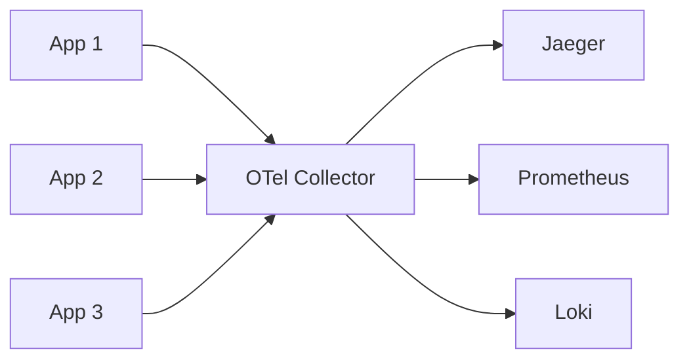

# Вопросы на собеседовании: `OpenTelemetry`

`OpenTelemetry (OTel)` — **vendor-neutral** стандарт для observability (родился из слияния OpenTracing + OpenCensus в 2019). 2-й по активности проект CNCF после Kubernetes. Стандарт де-факто для **distributed tracing**, набирает обороты в metrics и logs. Заменяет vendor-specific SDK (Datadog, NewRelic и т.д.).

## Полезные ссылки

### Официальная документация и авторитетные источники

- [OpenTelemetry Documentation](https://opentelemetry.io/docs/)
- [OpenTelemetry Specification](https://opentelemetry.io/docs/specs/otel/)
- [OpenTelemetry Java SDK](https://opentelemetry.io/docs/languages/java/)
- [OpenTelemetry Collector](https://opentelemetry.io/docs/collector/)
- [Semantic Conventions](https://opentelemetry.io/docs/specs/semconv/)
- [Awesome OpenTelemetry](https://github.com/magsther/awesome-opentelemetry)

## Содержание

- [Полезные ссылки](#полезные-ссылки)
- [See also](#see-also)

**Базовые понятия**
- [Q1. (!) Что такое OpenTelemetry?](#q1--что-такое-opentelemetry)
- [Q2. (!) Зачем OTel вместо vendor SDK?](#q2--зачем-otel-вместо-vendor-sdk)
- [Q3. (!) Три столпа наблюдаемости: traces, metrics, logs?](#q3--три-столпа-наблюдаемости-traces-metrics-logs)
- [Q4. Откуда взялся OpenTelemetry (OpenTracing + OpenCensus)?](#q4-откуда-взялся-opentelemetry-opentracing--opencensus)

**Архитектура**
- [Q5. (!) Из чего состоит OTel: API, SDK, Collector?](#q5--из-чего-состоит-otel-api-sdk-collector)
- [Q6. (!) OTel Collector — что это и зачем нужен?](#q6--otel-collector--что-это-и-зачем-нужен)
- [Q7. Что такое Receiver, Processor, Exporter в Collector?](#q7-что-такое-receiver-processor-exporter-в-collector)
- [Q8. Чем отличаются Agent и Gateway deployment?](#q8-чем-отличаются-agent-и-gateway-deployment)

**Instrumentation**
- [Q9. (!) Чем отличается auto- от manual instrumentation?](#q9--чем-отличается-auto--от-manual-instrumentation)
- [Q10. (!) Как работает Java auto-instrumentation (javaagent)?](#q10--как-работает-java-auto-instrumentation-javaagent)
- [Q11. Как создать manual span (ручной спан)?](#q11-как-создать-manual-span-ручной-спан)
- [Q12. Чем отличаются span attributes от events?](#q12-чем-отличаются-span-attributes-от-events)

**Tracing**
- [Q13. (!) Что такое trace, span и span context?](#q13--что-такое-trace-span-и-span-context)
- [Q14. (!) Как работает context propagation (W3C Trace Context)?](#q14--как-работает-context-propagation-w3c-trace-context)
- [Q15. Чем отличается head- от tail-sampling?](#q15-чем-отличается-head--от-tail-sampling)

**Metrics**
- [Q16. (!) Какие бывают metric instruments (Counter, Gauge, Histogram)?](#q16--какие-бывают-metric-instruments-counter-gauge-histogram)
- [Q17. Что такое aggregation и чем push отличается от pull?](#q17-что-такое-aggregation-и-чем-push-отличается-от-pull)
- [Q18. Что такое exemplars и как они связывают метрики с трейсами?](#q18-что-такое-exemplars-и-как-они-связывают-метрики-с-трейсами)

**Logs**
- [Q19. (!) Каков статус OTel Logs?](#q19--каков-статус-otel-logs)
- [Q20. Как коррелировать логи с трейсами?](#q20-как-коррелировать-логи-с-трейсами)

**Backends и exporters**
- [Q21. (!) Какие бэкенды поддерживают OTel?](#q21--какие-бэкенды-поддерживают-otel)
- [Q22. Что такое OTLP и как устроен его wire protocol?](#q22-что-такое-otlp-и-как-устроен-его-wire-protocol)
- [Q23. (!) Можно ли сменить бэкенд без изменения кода?](#q23--можно-ли-сменить-бэкенд-без-изменения-кода)

**Best practices**
- [Q24. (!) Что такое semantic conventions?](#q24--что-такое-semantic-conventions)
- [Q25. Что такое resource attributes?](#q25-что-такое-resource-attributes)
- [Q26. Что включать в traces, чтобы избежать шума?](#q26-что-включать-в-traces-чтобы-избежать-шума)

**Production**
- [Q27. (!) Какие частые проблемы OTel в production?](#q27--какие-частые-проблемы-otel-в-production)
- [Q28. Как оптимизировать стоимость OTel?](#q28-как-оптимизировать-стоимость-otel)

## Q1. (!) Что такое OpenTelemetry?

`OpenTelemetry (OTel)` — это open-source фреймворк и набор API для **сбора** и **экспорта** телеметрии, единый для трёх типов сигналов:
- **Traces** — distributed tracing, путь запроса через сервисы
- **Metrics** — числовые агрегаты (RPS, latency, использование ресурсов)
- **Logs** — дискретные события

Ключевое свойство — **vendor-neutral**: вы инструментируете код один раз, а отправлять данные можете в любой backend (Datadog, Jaeger, New Relic, Honeycomb, Splunk, Tempo и т.д.) без правок этого кода.

**В чём суть.** До OTel каждый вендор давал свой SDK, и переход на другую систему наблюдаемости означал переписывание инструментирования. OTel отделяет *что и как вы измеряете* от *куда это уходит*, поэтому смена бэкенда становится вопросом конфигурации.

Проект входит в **CNCF** и стоит 2-м по активности после Kubernetes — это значит, что стандарт стабилен и поддержан индустрией.

## Q2. (!) Зачем OTel вместо vendor SDK?

Коротко: OTel убирает **vendor lock-in** — инструментируете код один раз, а бэкенд меняете конфигом, не трогая приложение.

**Проблема vendor-specific SDK (Datadog, New Relic):**
- Код жёстко завязан на конкретного вендора
- Смена вендора означает переписывание всего инструментирования
- Разный API в каждом языке — нет единой модели для команды
- Полноценный lock-in: вы платите не только за продукт, но и за стоимость ухода

**Что даёт OpenTelemetry:**
- **Одно инструментирование — много бэкендов.** Вендорная привязка вынесена из кода в конфигурацию.
- Смена вендора — правка конфига Collector, без правок и редеплоя приложения
- Единый API во всех языках: одна ментальная модель для полиглот-команды
- Open source — нет привязки к одному поставщику
- Можно слать в несколько бэкендов параллельно (например, дешёвый self-hosted + дорогой SaaS только для критичного)

**Текущее положение дел.** Большинство вендоров уже **принимают вход в формате OTLP** (Datadog, New Relic). По сути OTel выиграл войну стандартов, поэтому ставка на него — безопасный выбор.

## Q3. (!) Три столпа наблюдаемости: traces, metrics, logs?

Три типа сигналов (signals) описывают систему с разных сторон и **дополняют** друг друга: метрики говорят *что* сломалось, трейсы — *где*, логи — *почему*.

**Traces** — путь запроса через сервисы, дают ответ «где именно тормозит/падает».
- Стабильны в OTel, широкая поддержка языков
- Бэкенды: Jaeger, Tempo, Honeycomb, Datadog APM

**Metrics** — числовые агрегаты, дают ответ «что происходит в целом» (объём, латентность, ресурсы). Дёшевы и хорошо подходят для алертов.
- Стабильны в OTel
- Инструменты: Counter, Gauge, Histogram
- Бэкенды: Prometheus, Datadog, CloudWatch

**Logs** — дискретные события с деталями, дают ответ «почему». Самый объёмный и дорогой сигнал.
- Самый молодой столп — стабилен в OTel с 2024, внедрение растёт
- Бэкенды: Loki, ELK, Datadog Logs

**Зрелость на сегодня.** Traces и metrics в OTel зрелые и production-ready; logs стабилизировались позже и пока внедряются активнее, чем используются.

## Q4. Откуда взялся OpenTelemetry (OpenTracing + OpenCensus)?

OTel родился из слияния двух конкурирующих проектов, чтобы прекратить раскол сообщества.

- **OpenTracing** (2016) — спецификация tracing API, ранний стандарт. Описывал *интерфейс*, но не реализацию.
- **OpenCensus** (2017) — библиотека от Google, покрывала tracing + metrics с готовой реализацией.

**Проблема:** два несовместимых стандарта делили рынок, и команды не знали, на что ставить — отсюда путаница и фрагментация.

**Развязка — OpenTelemetry** (2019): слияние OpenTracing и OpenCensus в один проект. За ним встали **CNCF и большинство крупных вендоров** (Google, Microsoft, AWS, Datadog, Splunk, ...), что и обеспечило ему статус общего стандарта.

**Итог.** OpenTracing и OpenCensus теперь **deprecated**, а OTel — единственный массовый стандарт. На собеседовании важно показать понимание этой эволюции: OTel взял интерфейсную часть от OpenTracing и реализацию от OpenCensus.

## Q5. (!) Из чего состоит OTel: API, SDK, Collector?

Три уровня, через которые проходит телеметрия:

```
[App + OTel API] → [OTel SDK] → [OTel Collector] → [Backend(s)]
```

- **API** — контракт инструментирования (`Tracer.startSpan(...)`). Только интерфейсы, без логики экспорта. На него ссылается код приложения и библиотеки.
- **SDK** — реализация API: создаёт спаны, батчит, семплирует и экспортирует. Это «движок», который можно настроить или заменить.
- **Collector** — отдельный процесс между приложением и бэкендами: принимает, обрабатывает и экспортирует телеметрию.

**Зачем разделять API и SDK** (ключевая идея архитектуры):
- Код приложения и сторонние библиотеки зависят **только от API** — лёгкой зависимости без транзитивов. Библиотека может быть инструментирована, но если SDK не подключён, она просто ничего не делает (no-op).
- SDK подключается и настраивается отдельно: можно поменять sampling, экспортер или вообще выключить телеметрию, не трогая бизнес-код.

## Q6. (!) OTel Collector — что это и зачем нужен?

**OTel Collector** — отдельный процесс-посредник, который **принимает** телеметрию от приложений, **обрабатывает** её (фильтрация, sampling, трансформация) и **экспортирует** в один или несколько бэкендов.



Технически можно слать телеметрию из SDK прямо в бэкенд. Но Collector выносит всю «грязную» работу из приложения и развязывает его с инфраструктурой наблюдаемости.

**Зачем он нужен:**
- **Развязка (decoupling)** — приложения шлют всё в один локальный endpoint и не знают про конкретные бэкенды. Их можно менять, не трогая код.
- **Централизованная конфигурация** — sampling и фильтрация настраиваются в одном месте, а не в десятках сервисов.
- **Буферизация и батчинг** — Collector копит и упаковывает данные, снижая число сетевых вызовов.
- **Multi-backend (fanout)** — один поток данных раздаётся сразу в несколько мест.
- **Снижает overhead приложения** — тяжёлая обработка идёт в Collector, а не в JVM/рантайме сервиса.

**Режимы развёртывания:**
- **Agent** — sidecar или DaemonSet рядом с приложениями (низкая latency, локальная буферизация)
- **Gateway** — отдельный центральный кластер коллекторов (тяжёлая обработка, единая точка)
- **Both** — Agent → Gateway: каждый берёт свою часть работы

## Q7. Что такое Receiver, Processor, Exporter в Collector?

Это три типа компонентов, из которых собирается **pipeline** Collector: данные входят через receiver, проходят цепочку processor-ов и уходят через exporter.

```yaml
# Collector config
receivers:
  otlp:
    protocols: { grpc: { endpoint: 0.0.0.0:4317 }, http: { endpoint: 0.0.0.0:4318 } }
  prometheus:
    config: { scrape_configs: [...] }

processors:
  batch:
    timeout: 10s
  memory_limiter:
    limit_mib: 512
  attributes:
    actions:
      - key: env
        value: prod
        action: insert

exporters:
  otlp/jaeger:
    endpoint: jaeger:4317
  prometheusremotewrite:
    endpoint: http://prometheus:9090/api/v1/write
  loki:
    endpoint: http://loki:3100/loki/api/v1/push

service:
  pipelines:
    traces:
      receivers: [otlp]
      processors: [memory_limiter, batch]
      exporters: [otlp/jaeger]
    metrics:
      receivers: [otlp, prometheus]
      processors: [batch]
      exporters: [prometheusremotewrite]
```

- **Receiver** — принимает данные на вход в нужном формате (OTLP, Jaeger, Prometheus, ...).
- **Processor** — обрабатывает поток в пути: батчинг, фильтрация, правка attributes, sampling, ограничение памяти. Порядок процессоров важен — они выполняются цепочкой.
- **Exporter** — отправляет результат в бэкенд (Jaeger, Prometheus remote write, Loki, ...).

**Pipeline** связывает их в конкретный маршрут `receivers → processors → exporters` отдельно для каждого сигнала (traces / metrics / logs). Один и тот же receiver или exporter можно переиспользовать в нескольких pipeline.

**На что обратить внимание в конфиге выше:** `memory_limiter` стоит **перед** `batch` — сначала защищаем коллектор от OOM, потом батчим. Это типичный рекомендуемый порядок.

## Q8. Чем отличаются Agent и Gateway deployment?

Это две топологии развёртывания Collector. Разница в том, где он живёт — рядом с приложением или централизованно.

**Agent (на каждом хосте, рядом с приложением):**
- DaemonSet в K8s (pod на каждой node) или sidecar в pod
- Низкая latency: приложение шлёт данные на localhost
- Берёт на себя локальную буферизацию и сокращает число сетевых вызовов к удалённому коллектору

**Gateway (централизованно):**
- Коллекторы в отдельном кластере, общие для многих сервисов
- Централизованная обработка: sampling и фильтрация в одном месте
- Проще в эксплуатации — конфигурация и обновления в одной точке
- Больше ёмкости для буферизации и tail sampling (нужно видеть весь трейс)

**Рекомендация:** в production обычно используют **Agent + Gateway** вместе:
- **Agent** делает локальную буферизацию и базовую обработку рядом с приложением
- **Gateway** делает тяжёлую обработку (tail sampling) и раздачу (fanout) в бэкенды

Такая двухуровневая схема даёт и низкую latency на стороне приложения, и централизованный контроль.

## Q9. (!) Чем отличается auto- от manual instrumentation?

Два способа добавить телеметрию: автоматически для готовых библиотек или вручную для своего кода. На практике их комбинируют.

**Auto-instrumentation** — телеметрия для популярных библиотек (HTTP, DB, gRPC) подключается без правок кода.

```bash
# Java
java -javaagent:opentelemetry-javaagent.jar -jar app.jar

# Python
pip install opentelemetry-distro
opentelemetry-instrument python app.py

# Node.js
node --require @opentelemetry/auto-instrumentations-node app.js
```

Auto-инструментирование покрывает «технические границы» (входящие/исходящие вызовы), но не знает про вашу бизнес-логику.

**Manual instrumentation** — явные спаны в коде там, где важна именно доменная семантика.

```java
Span span = tracer.spanBuilder("processOrder").startSpan();
try (Scope scope = span.makeCurrent()) {
    span.setAttribute("order.id", orderId);
    processOrder();
} finally {
    span.end();
}
```

**Рекомендация:** комбинировать. **Auto** — для инфраструктуры (HTTP, DB, очереди): быстрый старт, покрытие границ сервиса. **Manual** — для ключевых бизнес-операций, где нужны доменные атрибуты и понятные имена спанов. Auto даёт базовый каркас трейса, manual добавляет в него смысл.

## Q10. (!) Как работает Java auto-instrumentation (javaagent)?

**Java agent** — это JVM-агент, который подключается флагом `-javaagent` и инструментирует байткод классов на старте приложения (через bytecode manipulation). Поэтому правки исходников не нужны: агент сам «вшивает» спаны в известные ему библиотеки.

```bash
# Download agent
curl -L -O https://github.com/open-telemetry/opentelemetry-java-instrumentation/releases/latest/download/opentelemetry-javaagent.jar

# Configure via env
export OTEL_SERVICE_NAME=my-service
export OTEL_TRACES_EXPORTER=otlp
export OTEL_METRICS_EXPORTER=otlp
export OTEL_EXPORTER_OTLP_ENDPOINT=http://collector:4317

# Run
java -javaagent:opentelemetry-javaagent.jar -jar app.jar
```

Конфигурация задаётся переменными окружения (`OTEL_*`), а не кодом — это удобно в контейнерах: один и тот же образ в разных окружениях настраивается переменными.

**Что агент инструментирует автоматически:**
- Spring Boot (контроллеры, бины)
- HTTP-клиенты (HttpClient, OkHttp, RestTemplate, WebClient)
- JDBC (все БД)
- Kafka, RabbitMQ
- Redis, MongoDB
- gRPC
- всего 100+ библиотек

**Главное преимущество — нулевые правки кода:** достаточно положить jar агента рядом и добавить флаг запуска. Это делает Java одним из самых сильных языков по auto-instrumentation в OTel.

## Q11. Как создать manual span (ручной спан)?

Когда нужно обернуть свой код в спан, паттерн всегда один: получить `Tracer` → построить и стартовать спан → сделать его «текущим» через `Scope` → в `finally` обязательно закрыть. Закрытие в `finally` — главное: незакрытый спан утекает и ломает трейс.

```java
import io.opentelemetry.api.trace.Tracer;

Tracer tracer = GlobalOpenTelemetry.getTracer("my-app");

Span span = tracer.spanBuilder("process_order")
    .setSpanKind(SpanKind.INTERNAL)
    .startSpan();
try (Scope scope = span.makeCurrent()) {
    span.setAttribute("order.id", orderId);
    span.setAttribute("user.id", userId);

    processOrder(orderId);

    span.setStatus(StatusCode.OK);
} catch (Exception e) {
    span.setStatus(StatusCode.ERROR, e.getMessage());
    span.recordException(e);
    throw e;
} finally {
    span.end();
}
```

**Рекомендации:**
- Оборачивай в try-finally — спан должен завершаться при любом исходе, иначе он утечёт
- Делай спан текущим через `makeCurrent()` — иначе вложенные спаны не привяжутся к нему
- Проставляй attributes для контекста (id, важные параметры)
- Записывай исключения через `recordException` и выставляй статус `ERROR` — так трейс покажет, где именно упало
- В норме ставь статус `OK`

## Q12. Чем отличаются span attributes от events?

Оба добавляют детали в спан, но по-разному: attributes описывают спан целиком, events — отмечают момент во времени внутри него.

**Attributes** — пары ключ-значение (как теги), описывающие спан в целом. Без собственной метки времени.

```java
span.setAttribute("http.method", "GET");
span.setAttribute("http.status_code", 200);
span.setAttribute("db.system", "postgresql");
```

**Events** — точечные события с собственной меткой времени *внутри* спана. Полезны, чтобы отметить «здесь случилось X» по ходу операции (промах кэша, медленный запрос), не плодя отдельные спаны.

```java
span.addEvent("Cache miss");
span.addEvent("Slow query detected", Attributes.of(
    AttributeKey.stringKey("query"), sql
));
```

**Когда что выбирать:** attribute — для свойства всей операции (`http.method`, `order.id`); event — для отметки конкретного момента внутри неё.

**Имена атрибутов** — следуй [Semantic Conventions](https://opentelemetry.io/docs/specs/semconv/): стандартные ключи дают совместимость (interoperability), и бэкенды понимают их «из коробки».

## Q13. (!) Что такое trace, span и span context?

Базовая иерархия трассировки: **span** — это узел, **trace** — дерево узлов, **span context** — идентификаторы, которые их сшивают.

- **Trace** — все спаны одного запроса, объединённые общим `trace_id`. Образуют дерево от корневого спана.
- **Span** — одна операция: HTTP-вызов, запрос к БД, вызов функции. У него есть имя, начало/конец, attributes и ссылка на родителя.
- **Span context** — иммутабельный набор идентификаторов, который *передаётся* между спанами и сервисами для корреляции:
  - `trace_id` — одинаковый для всех спанов трейса (16 байт / 32 hex-символа)
  - `span_id` — уникальный для каждого спана (8 байт / 16 hex-символов)
  - `trace_flags` — флаги, в т.ч. решение о sampling (трейсить ли этот запрос)

Именно span context (а не сам спан) переносится по сети между сервисами — об этом следующий вопрос.

```
Trace 0123456789abcdef0123456789abcdef
├── Span (root): HTTP GET /orders/123
│   ├── Span: SELECT FROM orders
│   ├── Span: SELECT FROM users
│   └── Span: HTTP POST /payments
│       └── Span: SELECT FROM accounts
```

## Q14. (!) Как работает context propagation (W3C Trace Context)?

**Context propagation** — передача span context между сервисами, чтобы спаны из разных сервисов склеились в один трейс. Без неё каждый сервис создавал бы изолированный трейс, и связи запроса терялись бы. Технически контекст передаётся через служебные HTTP-заголовки.

**W3C Trace Context** — стандартный формат этих заголовков (стандарт W3C 2020), который понимают все вендоры:
```
Headers:
  traceparent: 00-0123456789abcdef0123456789abcdef-0123456789abcdef-01
  tracestate: vendor1=value1,vendor2=value2
```

**Формат заголовков:**
- `traceparent` = `version-traceId-spanId-flags` — обязательный заголовок с идентификаторами
- `tracestate` = дополнительные данные конкретных вендоров (опционально)

С auto-instrumentation OTel SDK **сам** инжектит контекст в исходящие HTTP-запросы и извлекает его из входящих — разработчику ничего делать не нужно.

**Граничный случай — async и messaging** (Kafka, RabbitMQ): там нет HTTP-заголовков, поэтому контекст инжектят в заголовки сообщения на стороне producer-а и извлекают в consumer-е. Если этого не сделать, трейс «обрывается» на очереди — частая причина разорванных трейсов.

## Q15. Чем отличается head- от tail-sampling?

Трейсить каждый запрос дорого по хранилищу и сети, поэтому часть трейсов отбрасывают — это и есть sampling. Разница между head и tail — в **моменте** принятия решения, и отсюда вытекают их плюсы и минусы.

**Head sampling** — решение в *начале* трейса, до того как он отработал:
- Принимается на первом спане (часто вероятностно, например 10%)
- Дёшево: не нужно буферизовать спаны, не оставленные сразу можно не создавать
- Главный минус — решает «вслепую»: **может выбросить интересные трейсы** (ошибки, медленные), потому что в начале ещё не знает их исхода

**Tail sampling** — решение *после* завершения всего трейса, когда исход уже известен:
- Можно оставить **все** трейсы с ошибками, все медленные и небольшой процент нормальных
- Цена — нужно **буферизовать** все спаны трейса в памяти до решения
- Реализуется в Collector (Gateway), а не в SDK: только там виден весь трейс целиком

```yaml
# Tail sampling в Collector
processors:
  tail_sampling:
    policies:
      - name: errors-policy
        type: status_code
        status_code: { status_codes: [ERROR] }
      - name: slow-policy
        type: latency
        latency: { threshold_ms: 1000 }
      - name: random-policy
        type: probabilistic
        probabilistic: { sampling_percentage: 10 }
```

**Рекомендация:** для production-приложений с высоким трафиком предпочитают tail sampling — он сохраняет именно те трейсы, которые нужны для отладки (ошибки и медленные), вместо случайной выборки.

## Q16. (!) Какие бывают metric instruments (Counter, Gauge, Histogram)?

Instrument — это тип метрики, и выбор зависит от природы величины: монотонно растёт, колеблется или нужно распределение. Неправильный выбор инструмента ломает агрегацию на бэкенде.

**Counter** — монотонно возрастающее значение (только вверх): число запросов, ошибок, обработанных сообщений. Бэкенд считает производную (rate).
```java
LongCounter requests = meter.counterBuilder("http.requests")
    .setDescription("HTTP request count")
    .setUnit("1")
    .build();
requests.add(1, Attributes.of(AttributeKey.stringKey("method"), "GET"));
```

**UpDownCounter** — счётчик, который может расти и убывать: число активных соединений, размер очереди, баланс. В отличие от Counter, фиксирует *дельту* (+1/−1), а не абсолют.

**Gauge** — мгновенный замер текущего значения через callback: CPU%, занятая память, размер очереди на момент опроса.
```java
meter.gaugeBuilder("queue.size")
    .buildWithCallback(measurement -> measurement.record(queue.size()));
```

**Histogram** — распределение значений по бакетам, типичный случай — latency.
```java
DoubleHistogram latency = meter.histogramBuilder("http.duration")
    .setUnit("ms")
    .build();
latency.record(245.5, Attributes.of(...));
```

Histogram нужен, когда важно не среднее, а форма распределения: по бакетам бэкенд вычисляет перцентили (p50, p95, p99). Среднее скрывает «хвосты», а именно p99 показывает реальную боль пользователей.

## Q17. Что такое aggregation и чем push отличается от pull?

Это две модели доставки метрик. Разница — кто инициирует передачу: приложение шлёт само (push) или бэкенд сам приходит за данными (pull).

**Push** — SDK периодически *отправляет* метрики наружу.
- OTLP push из приложения в Collector, далее Collector → бэкенд
- Удобно для коротко живущих и serverless-нагрузок, которые scrape может не застать

**Pull** — бэкенд сам *собирает* (scrape) метрики с приложения.
- Prometheus периодически скрейпит endpoint `/metrics`
- Бэкенд контролирует частоту опроса и сразу видит, что таргет «жив»

**OTel поддерживает обе модели:**
- **Push** — через OTLP exporter
- **Pull** — через Prometheus exporter, который отдаёт endpoint для скрейпа

**Aggregation (агрегация)** — метрики не шлются на каждое событие, а накапливаются и сворачиваются за интервал (по умолчанию 60 сек). Это и есть то, что отличает метрики от сырых событий: они компактны по объёму.

## Q18. Что такое exemplars и как они связывают метрики с трейсами?

**Exemplar** — это конкретный trace_id, прикреплённый к точке данных метрики как «образец». Он отвечает на вопрос, который агрегированная метрика сама ответить не может: «а покажи мне *пример* запроса, попавшего вот в этот бакет».

```
Histogram bucket: 1000-2000ms
  Exemplar: trace_id=abc123, value=1500ms
```

**Зачем это нужно.** Метрика говорит «p99 latency вырос», но не говорит почему — она агрегирована и теряет детали. Exemplar восстанавливает мост: кликаешь по точке на графике → переходишь по trace_id → видишь трейс того самого медленного запроса с полным разбором.

**Сценарий применения:** график p99 latency растёт → клик по exemplar → открывается конкретный медленный трейс → видно, какой именно спан (БД, внешний вызов) дал задержку.

Поддерживается в Prometheus, Tempo, Datadog. Это ключевой инструмент перехода metrics → traces при отладке.

## Q19. (!) Каков статус OTel Logs?

Logs — самый молодой из трёх столпов: он **стабилизировался в OTel позже всего, в 2024**. Поэтому подход к логам отличается от traces/metrics.

**Ключевая идея.** Логи — зрелая область с десятками существующих библиотек, и OTel не пытается их заменить. Вместо нового logging API он встраивается в то, что уже есть:

- **OTLP Logs** — стандартизированный формат и протокол приёма логов от приложений.
- **Log Bridge** — мост от существующих библиотек логирования (Log4j, Logback, ZapLogger) к OTel. Вы продолжаете писать логи как раньше, а мост перенаправляет их в OTLP-конвейер и автоматически привязывает к текущему трейсу.

```java
// Slf4j → OTel automatic
logger.info("Processing order {}", orderId);
// Auto-correlated с current trace span
```

**Текущая зрелость.** Внедрение Logs растёт, но они всё ещё **менее зрелые**, чем traces и metrics: экосистема мостов и бэкендов пока догоняет. На собеседовании корректно сказать, что Logs стабильны, но это самый свежий из сигналов.

## Q20. Как коррелировать логи с трейсами?

Суть корреляции в том, что каждая запись лога несёт `trace_id` и `span_id` текущего запроса. Без этого лог — изолированная строка; с ними он становится точкой входа во весь трейс.

```
2025-04-19 14:30:00 INFO [trace_id=abc123, span_id=def456] Processing order 12345
```

**Зачем это даёт силу.** Три сигнала сшиваются в единую картину инцидента:

1. Видишь ошибку в логах → берёшь `trace_id` из записи
2. Открываешь трейс по этому id в Jaeger/Tempo → видишь полный путь запроса через сервисы
3. Находишь медленный спан → переходишь к связанным метрикам и exemplars

**Как это включается.** При использовании Log Bridge OTel **подставляет trace_id/span_id автоматически** из текущего контекста — руками их прокидывать не нужно. В Datadog, Honeycomb, New Relic UI связывает logs ↔ traces «из коробки», превращая корреляцию в один клик.

## Q21. (!) Какие бэкенды поддерживают OTel?

Практически весь рынок наблюдаемости. Удобно делить бэкенды на open-source (self-hosted) и SaaS/Enterprise — выбор между ними обычно сводится к компромиссу «стоимость владения vs стоимость эксплуатации».

**Open-source (self-hosted):**
- **Jaeger** — traces
- **Zipkin** — traces (более старый)
- **Prometheus** — metrics
- **Loki** (Grafana) — logs
- **Tempo** (Grafana) — traces
- **Mimir** (Grafana) — metrics
- **OpenSearch / Elasticsearch** — logs / traces
- **Cassandra** (как хранилище для Jaeger)

**SaaS / Enterprise:**
- **Datadog**
- **New Relic**
- **Splunk**
- **Honeycomb**
- **Lightstep**
- **AWS X-Ray** (через ADOT)
- **Azure Monitor**
- **Google Cloud Trace**
- **Dynatrace**

**Главный вывод.** Практически **все** observability-вендоры сегодня принимают OTLP — войны стандартов завершены. На практике это значит: инструментируете через OTel один раз, а бэкенд выбираете и меняете по соображениям цены и удобства, а не по тому, «чей SDK уже вшит в код».

## Q22. Что такое OTLP и как устроен его wire protocol?

**OTLP (OpenTelemetry Protocol)** — родной wire-формат OTel для передачи телеметрии между приложением, Collector и бэкендами. Именно его универсальность («все принимают OTLP») и обеспечивает vendor-neutrality.

**Кодирование** — Protocol Buffers: бинарный формат, компактный и быстрый при сериализации.

**Два транспорта** под один и тот же формат:
- **gRPC** на порту `:4317` — бинарный, эффективный, со стримингом; выбор по умолчанию для высоких нагрузок
- **HTTP/protobuf** на порту `:4318` — проще пробивается через прокси/файрволы и проще отлаживать

**Endpoint по умолчанию:** `localhost:4317` (gRPC).

```yaml
exporters:
  otlp:
    endpoint: "collector:4317"
    tls:
      insecure: true
```

Итог: OTLP — общий стандарт, который принимают все вендорные бэкенды, поэтому код приложения остаётся одинаковым независимо от того, куда уходят данные.

## Q23. (!) Можно ли сменить бэкенд без изменения кода?

**Да — и это и есть главная ценность OTel.** Вендорная привязка вынесена из кода приложения в конфигурацию Collector, поэтому смена бэкенда не затрагивает бизнес-логику.

```bash
# Switch from Jaeger to Datadog
# Just change Collector config:

# Before:
exporters:
  otlp/jaeger:
    endpoint: jaeger:4317

# After:
exporters:
  datadog:
    api: { key: ${DD_API_KEY} }
```

**Код приложения не меняется и не передеплоится** — достаточно поправить конфиг и перезапустить Collector. Можно даже слать в старый и новый бэкенд параллельно во время миграции, чтобы сравнить.

В эпоху vendor SDK такая смена означала переписывание инструментирования и редеплой всех сервисов — отсюда и ценность развязки, которую даёт OTel.

## Q24. (!) Что такое semantic conventions?

**Semantic Conventions** — это согласованный словарь стандартных имён для attributes (и ресурсов). Они решают проблему «вавилонской башни»: без них каждый назвал бы HTTP-метод по-своему (`method`, `httpMethod`, `http_verb`), и инструменты не смогли бы автоматически понимать данные.

```
http.method  = "GET"
http.status_code = 200
http.url = "https://example.com/path"
db.system = "postgresql"
db.statement = "SELECT * FROM users"
service.name = "order-service"
service.version = "1.2.3"
```

**Зачем они нужны — совместимость (interoperability):** бэкенды и дашборды понимают данные «из коробки». Datadog UI знает, что `http.method` — это HTTP-метод, и строит по нему стандартные графики, потому что имя предопределено, а не кастомное.

**На практике:**
- **Auto-instrumentation** использует semantic conventions сама — это одна из причин, почему авто-данные сразу красиво ложатся в дашборды.
- **Вручную** не пиши строки руками, а импортируй готовые ключи из OTel-пакета (`SemanticAttributes.HTTP_METHOD`) — так не разойдёшься со стандартом и не словишь опечатку.

## Q25. Что такое resource attributes?

**Resource** описывает **источник** телеметрии — *кто* её произвёл: сервис, хост, контейнер, pod. Если span attributes отвечают «что произошло», то resource attributes отвечают «где и в каком инстансе».

```yaml
service.name: my-app
service.version: 1.0.0
service.namespace: production
host.name: web-01
container.id: abc123
k8s.cluster.name: prod-eu-west-1
k8s.pod.name: my-app-7d8f9b-xz2k
deployment.environment: production
```

Resource задаётся один раз и **автоматически прикрепляется к каждому** span/metric/log — поэтому потом в бэкенде можно фильтровать и группировать телеметрию по сервису, версии, окружению или поду.

**В K8s** заполнять это руками не нужно: OTel resource detector сам подтягивает `k8s.pod.name`, `k8s.cluster.name` и т.п. из окружения и K8s API. Особенно важен `service.name` — без него телеметрия не привязывается к сервису, и многие бэкенды просто не покажут её корректно.

## Q26. Что включать в traces, чтобы избежать шума?

Принцип: спан должен отражать **значимую границу** работы (вызов через сеть, дорогую операцию, ключевой бизнес-шаг). Слишком мелкие спаны раздувают объём, стоимость и затрудняют чтение трейса — это и есть «noise».

**Стоит трейсить:**
- HTTP-запросы (auto) — границы сервиса
- Запросы к БД (auto) — частый источник тормозов
- Вызовы внешних API (auto) — где сервис зависит от чужой латентности
- Ключевые бизнес-операции (manual) — то, что хочется видеть в трейсе по смыслу
- Долгоиграющие задачи и промахи кэша (cache misses) — объясняют скачки latency

**Не стоит трейсить:**
- Очень частые мелкие операции (спан на каждый элемент цикла)
- Health check endpoints — шумят и не несут информации
- Отдачу статики
- Тривиальные внутренние функции без сети и I/O

Для неизбежно высокообъёмных операций применяй **sampling** вместо отключения трассировки целиком — так сохранишь видимость, но снизишь объём.

## Q27. (!) Какие частые проблемы OTel в production?

Большинство проблем сводятся к двум темам: **стоимость/объём данных** и **целостность контекста**. Полезно сгруппировать так на собеседовании.

**Объём, стоимость и производительность:**
1. **Overhead приложения** — инструментирование может съедать 5–10% CPU. Лечится агрессивным sampling.
2. **Сетевые расходы** — слать все спаны напрямую дорого. Решается батчингом в Collector.
3. **Стоимость хранилища** — SaaS-бэкенды (Datadog и т.д.) берут плату за объём принятых данных, и без sampling счёт растёт быстро.
4. **Взрыв кардинальности** — атрибуты с высокой кардинальностью (`user_id`) множат временные ряды и раздувают метрики; часто это главный источник внезапных затрат.

**Целостность контекста и эксплуатация:**
5. **Потеря контекста в async** — пробрасывать span context через `CompletableFuture`, корутины и очереди непросто; в результате трейсы рвутся.
6. **Различия вендоров** — даже OTLP-совместимые бэкенды имеют свои причуды в обработке.
7. **Конфликты auto-instrumentation** — несколько агентов на одном процессе могут мешать друг другу.
8. **Рассинхрон версий** — расхождение версий SDK / Agent / API ломает совместимость.

## Q28. Как оптимизировать стоимость OTel?

Главная стратегия одна: **отдавать в бэкенд меньше данных, не теряя ценные**. Большинство приёмов — это либо отбор данных (sampling/фильтрация), либо снижение их «веса» (кардинальность, сжатие, агрегация).

**Уменьшить объём отправляемых данных:**
1. **Sampling** — комбинация head + tail. Tail sampling особенно ценен: оставляет важные трейсы (ошибки, медленные), отбрасывает рутину.
2. **Отбрасывай ненужные спаны** в Collector через filter processor (health-checks, статика).
3. **Снижай кардинальность метрик** — не тегируй по `user_id` и другим высококардинальным полям: это главный множитель стоимости.
4. **Сокращай число атрибутов** на спан до действительно полезных.

**Снизить «вес» и стоимость передачи/хранения:**
5. **Сжимай** OTLP-трафик.
6. **Батчируй** данные в Collector — меньше запросов, эффективнее передача.
7. **Агрегируй метрики** на уровне Collector до отправки.
8. **Хости бэкенды у себя** (Jaeger, Loki, Tempo) вместо дорогого SaaS, если есть ресурсы на эксплуатацию.

**Порядок величин.** В Datadog принятые трейсы могут стоить **$0.10–1.00 за миллион спанов**, поэтому грамотный sampling на крупном трафике экономит десятки тысяч $/месяц — это самый результативный рычаг.

---

## See also

- [Jaeger / Zipkin](jaeger-zipkin-interview.md) — backend-ы для traces
- [ELK Stack](elk-stack-interview.md) — backend для logs
- [Loki + Grafana](loki-grafana-interview.md) — backend для logs
- [Prometheus + Grafana](prometheus-grafana-interview.md) — backend для metrics
- [Observability](observability-interview.md) — общая концепция
- [Метрики и трейсинг](metrics-tracing-interview.md) — базовые понятия
- [Logging](../logging/logging-interview.md) — управление логами
- [Стратегии логирования](logging-strategies-interview.md) — лучшие практики
- [Микросервисы](../architecture/microservices-interview.md) — где нужен OTel
- [Kubernetes](../devops/kubernetes-interview.md) — Collector в K8s
- [Cloud-native Patterns](../cloud/cloud-native-patterns-interview.md) — pillar observability
- [Application Profiling](../performance/application-profiling-interview.md) — альтернатива для профилирования
- [Spring Boot Actuator](../frameworks/spring/spring-boot-actuator-interview.md) — Actuator + OTel

- [Jaeger и Zipkin](jaeger-zipkin-interview.md)
- [Стратегии логирования](logging-strategies-interview.md)
- [Loki и Grafana](loki-grafana-interview.md)
- [Метрики и трейсинг](metrics-tracing-interview.md)
- [Observability](observability-interview.md)
- [Шпаргалка: OpenTelemetry](../../monitoring/tracing/opentelemetry.md) — теория
