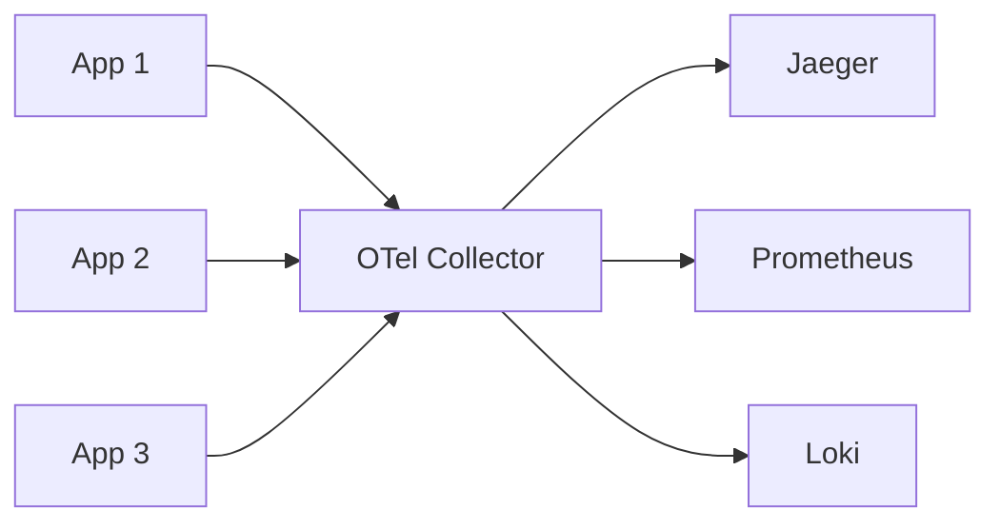

# Вопросы на собеседовании: `OpenTelemetry`

`OpenTelemetry (OTel)` — **vendor-neutral** стандарт для observability (родился из слияния OpenTracing + OpenCensus в 2019). 2-й по активности проект CNCF после Kubernetes. Стандарт де-факто для **distributed tracing**, набирает обороты в metrics и logs. Заменяет vendor-specific SDK (Datadog, NewRelic и т.д.).

## Полезные ссылки

### Официальная документация и авторитетные источники

- [OpenTelemetry Documentation](https://opentelemetry.io/docs/)
- [OpenTelemetry Specification](https://opentelemetry.io/docs/specs/otel/)
- [OpenTelemetry Java SDK](https://opentelemetry.io/docs/languages/java/)
- [OpenTelemetry Collector](https://opentelemetry.io/docs/collector/)
- [Semantic Conventions](https://opentelemetry.io/docs/specs/semconv/)
- [Awesome OpenTelemetry](https://github.com/magsther/awesome-opentelemetry)

## Содержание

- [Полезные ссылки](#полезные-ссылки)
- [See also](#see-also)

**Базовые понятия**
- [Q1. (!) Что такое OpenTelemetry?](#q1--что-такое-opentelemetry)
- [Q2. (!) Зачем OTel вместо vendor SDK?](#q2--зачем-otel-вместо-vendor-sdk)
- [Q3. (!) Three pillars: traces, metrics, logs?](#q3--three-pillars-traces-metrics-logs)
- [Q4. История (OpenTracing + OpenCensus = OpenTelemetry)?](#q4-история-opentracing--opencensus--opentelemetry)

**Архитектура**
- [Q5. (!) Components: API, SDK, Collector?](#q5--components-api-sdk-collector)
- [Q6. (!) OTel Collector — что и зачем?](#q6--otel-collector--что-и-зачем)
- [Q7. Receiver, Processor, Exporter в Collector?](#q7-receiver-processor-exporter-в-collector)
- [Q8. Agent vs Gateway deployment?](#q8-agent-vs-gateway-deployment)

**Instrumentation**
- [Q9. (!) Auto vs manual instrumentation?](#q9--auto-vs-manual-instrumentation)
- [Q10. (!) Java auto-instrumentation (javaagent)?](#q10--java-auto-instrumentation-javaagent)
- [Q11. Manual spans?](#q11-manual-spans)
- [Q12. Span attributes, events?](#q12-span-attributes-events)

**Tracing**
- [Q13. (!) Trace, span, span context?](#q13--trace-span-span-context)
- [Q14. (!) Context propagation (W3C Trace Context)?](#q14--context-propagation-w3c-trace-context)
- [Q15. Sampling — head vs tail?](#q15-sampling--head-vs-tail)

**Metrics**
- [Q16. (!) Metric instruments (Counter, Gauge, Histogram)?](#q16--metric-instruments-counter-gauge-histogram)
- [Q17. Aggregation, push vs pull?](#q17-aggregation-push-vs-pull)
- [Q18. Exemplars (linking metrics к traces)?](#q18-exemplars-linking-metrics-к-traces)

**Logs**
- [Q19. (!) OTel Logs — статус?](#q19--otel-logs--статус)
- [Q20. Log correlation с traces?](#q20-log-correlation-с-traces)

**Backends и exporters**
- [Q21. (!) Какие backends поддерживают OTel?](#q21--какие-backends-поддерживают-otel)
- [Q22. OTLP — wire protocol?](#q22-otlp--wire-protocol)
- [Q23. (!) Можно ли менять backend без code change?](#q23--можно-ли-менять-backend-без-code-change)

**Best practices**
- [Q24. (!) Semantic conventions?](#q24--semantic-conventions)
- [Q25. Resource attributes?](#q25-resource-attributes)
- [Q26. Что включить в traces (избежать noise)?](#q26-что-включить-в-traces-избежать-noise)

**Production**
- [Q27. (!) Какие частые проблемы OTel в production?](#q27--какие-частые-проблемы-otel-в-production)
- [Q28. Cost optimization для OTel?](#q28-cost-optimization-для-otel)

## Q1. (!) Что такое OpenTelemetry?

`OpenTelemetry (OTel)` — open-source фреймворк для **сбора** и **экспорта** телеметрии:
- Traces (distributed tracing)
- Metrics
- Logs

**Vendor-neutral** — можно отправлять данные в любой backend (Datadog, Jaeger, New Relic, Honeycomb, Splunk, Tempo и т.д.).

Проект со статусом **CNCF graduated** (2024). 2-й по активности после Kubernetes.

**Цель:** **стандартизировать** инструментирование — пишешь один раз, отправляешь куда угодно.

## Q2. (!) Зачем OTel вместо vendor SDK?

**Vendor-specific SDK (Datadog, New Relic):**
- Жёстко завязаны на вендора
- Смена вендора → переписывание инструментирования
- Разный API в каждом языке
- Vendor lock-in

**OpenTelemetry:**
- **Одно инструментирование, много backend-ов**
- Смена вендора через конфиг (без правок кода)
- Единый API во всех языках
- Open source (без vendor lock-in)
- Можно слать в несколько backend-ов параллельно

**В 2025** — большинство вендоров **принимают вход от OTel** (Datadog, NewRelic принимают OTLP). OTel выиграл войну стандартов.

## Q3. (!) Three pillars: traces, metrics, logs?

**Traces** — пути запроса через сервисы.
- Стабильны в OTel
- Широкая поддержка языков
- Backend-ы: Jaeger, Tempo, Honeycomb, Datadog APM

**Metrics** — числовые агрегаты.
- Стабильны в OTel
- Counter, Gauge, Histogram
- Backend-ы: Prometheus, Datadog, CloudWatch

**Logs** — дискретные события.
- Самый молодой pillar (stable с 2024)
- Внедрение растёт
- Backend-ы: Loki, ELK, Datadog Logs

В 2025 — **traces + metrics** зрелые, **logs** растёт.

## Q4. История (OpenTracing + OpenCensus = OpenTelemetry)?

**OpenTracing** (2016) — спецификация tracing API. Ранний стандарт.
**OpenCensus** (2017) — библиотека tracing + metrics от Google.

**Конкуренция:** раскол сообщества, всеобщая путаница.

**OpenTelemetry** (2019) — слияние OpenTracing + OpenCensus. За проектом стоят **CNCF + большинство крупных вендоров** (Google, Microsoft, AWS, Datadog, Splunk, ...).

В **2025** — OpenTracing и OpenCensus **deprecated**. OTel — единственный массовый стандарт.

## Q5. (!) Components: API, SDK, Collector?

```
[App + OTel API] → [OTel SDK] → [OTel Collector] → [Backend(s)]
```

**API** — определяет инструментирование (`Tracer.startSpan(...)`).
**SDK** — реализация (создаёт спаны, батчит, экспортирует).
**Collector** — отдельный процесс; принимает, обрабатывает и экспортирует телеметрию.

**Зачем разделять API/SDK:**
- Код приложения зависит только от API (минимальная зависимость)
- SDK можно заменить (другой sampling, другой экспорт)

## Q6. (!) OTel Collector — что и зачем?

**OTel Collector** — процесс, который **принимает** телеметрию от приложений, **обрабатывает** её (фильтрация, sampling, трансформация) и **экспортирует** в backend-ы.



**Зачем он нужен:**
- **Развязка (decoupling)** — приложения не знают про конкретные backend-ы
- **Централизованная конфигурация** — sampling и фильтрация в одном месте
- **Буферизация / батчинг** — эффективная передача
- **Multi-backend** — раздача (fanout) сразу в несколько мест
- **Снижает overhead приложения** — тяжёлая работа в Collector, а не в приложении

**Режимы:**
- **Agent** — sidecar / DaemonSet рядом с приложениями
- **Gateway** — отдельный кластер, центральный
- **Both** — Agent → Gateway

## Q7. Receiver, Processor, Exporter в Collector?

```yaml
# Collector config
receivers:
  otlp:
    protocols: { grpc: { endpoint: 0.0.0.0:4317 }, http: { endpoint: 0.0.0.0:4318 } }
  prometheus:
    config: { scrape_configs: [...] }

processors:
  batch:
    timeout: 10s
  memory_limiter:
    limit_mib: 512
  attributes:
    actions:
      - key: env
        value: prod
        action: insert

exporters:
  otlp/jaeger:
    endpoint: jaeger:4317
  prometheusremotewrite:
    endpoint: http://prometheus:9090/api/v1/write
  loki:
    endpoint: http://loki:3100/loki/api/v1/push

service:
  pipelines:
    traces:
      receivers: [otlp]
      processors: [memory_limiter, batch]
      exporters: [otlp/jaeger]
    metrics:
      receivers: [otlp, prometheus]
      processors: [batch]
      exporters: [prometheusremotewrite]
```

**Receiver** — принимает данные (OTLP, Jaeger, Prometheus, ...).
**Processor** — обрабатывает (батчинг, фильтрация, attributes, sampling).
**Exporter** — отправляет в backend.

**Pipelines** — соединяют receivers → processors → exporters.

## Q8. Agent vs Gateway deployment?

**Agent (на каждом хосте):**
- DaemonSet в K8s (pod на каждой node)
- Sidecar в pod
- Низкая latency, локально
- Сокращает сетевые вызовы к удалённому коллектору

**Gateway (централизованно):**
- Коллекторы в отдельном кластере
- Централизованная обработка (sampling, фильтрация)
- Проще в эксплуатации (всё в одном месте)
- Больше ёмкости для буферизации

**Best practice:** **Agent + Gateway** вместе:
- Agent: локальная буферизация, базовая обработка
- Gateway: сложная обработка, раздача (fanout) в backend-ы

## Q9. (!) Auto vs manual instrumentation?

**Auto-instrumentation** — автоматически для популярных библиотек (HTTP, DB, gRPC).

```bash
# Java
java -javaagent:opentelemetry-javaagent.jar -jar app.jar

# Python
pip install opentelemetry-distro
opentelemetry-instrument python app.py

# Node.js
node --require @opentelemetry/auto-instrumentations-node app.js
```

**Manual instrumentation** — явный код в бизнес-логике.

```java
Span span = tracer.spanBuilder("processOrder").startSpan();
try (Scope scope = span.makeCurrent()) {
    span.setAttribute("order.id", orderId);
    processOrder();
} finally {
    span.end();
}
```

**Best practice:** **auto** для инфраструктуры (HTTP, DB), **manual** для бизнес-логики (ключевые операции).

## Q10. (!) Java auto-instrumentation (javaagent)?

**Java agent** — JVM-агент, инструментирует байткод на старте.

```bash
# Download agent
curl -L -O https://github.com/open-telemetry/opentelemetry-java-instrumentation/releases/latest/download/opentelemetry-javaagent.jar

# Configure via env
export OTEL_SERVICE_NAME=my-service
export OTEL_TRACES_EXPORTER=otlp
export OTEL_METRICS_EXPORTER=otlp
export OTEL_EXPORTER_OTLP_ENDPOINT=http://collector:4317

# Run
java -javaagent:opentelemetry-javaagent.jar -jar app.jar
```

**Авто-инструментирует:**
- Spring Boot (контроллеры, бины)
- HTTP-клиенты (HttpClient, OkHttp, RestTemplate, WebClient)
- JDBC (все БД)
- Kafka, RabbitMQ
- Redis, MongoDB
- gRPC
- 100+ библиотек

**Без правок кода!** Достаточно подключить агент.

## Q11. Manual spans?

```java
import io.opentelemetry.api.trace.Tracer;

Tracer tracer = GlobalOpenTelemetry.getTracer("my-app");

Span span = tracer.spanBuilder("process_order")
    .setSpanKind(SpanKind.INTERNAL)
    .startSpan();
try (Scope scope = span.makeCurrent()) {
    span.setAttribute("order.id", orderId);
    span.setAttribute("user.id", userId);

    processOrder(orderId);

    span.setStatus(StatusCode.OK);
} catch (Exception e) {
    span.setStatus(StatusCode.ERROR, e.getMessage());
    span.recordException(e);
    throw e;
} finally {
    span.end();
}
```

**Best practices:**
- Оборачивай в try-finally (всегда завершай спан)
- Проставляй attributes для контекста
- Записывай исключения (record exceptions)
- Выставляй статус (OK / ERROR)

## Q12. Span attributes, events?

**Attributes** — пары ключ-значение (как теги). Статичная информация про спан.

```java
span.setAttribute("http.method", "GET");
span.setAttribute("http.status_code", 200);
span.setAttribute("db.system", "postgresql");
```

**Events** — события с меткой времени внутри спана.

```java
span.addEvent("Cache miss");
span.addEvent("Slow query detected", Attributes.of(
    AttributeKey.stringKey("query"), sql
));
```

**Стандартные attributes** — следуй [Semantic Conventions](https://opentelemetry.io/docs/specs/semconv/) ради совместимости (interoperability).

## Q13. (!) Trace, span, span context?

**Trace** — набор спанов для одного запроса.

**Span** — одна операция (HTTP-вызов, запрос к БД, вызов функции).

**Span context** — идентификаторы для корреляции:
- `trace_id` — одинаковый для всех спанов в трейсе (16 байт / 32 hex-символа)
- `span_id` — уникальный для каждого спана (8 байт / 16 hex-символов)
- `trace_flags` — решение о sampling

```
Trace 0123456789abcdef0123456789abcdef
├── Span (root): HTTP GET /orders/123
│   ├── Span: SELECT FROM orders
│   ├── Span: SELECT FROM users
│   └── Span: HTTP POST /payments
│       └── Span: SELECT FROM accounts
```

## Q14. (!) Context propagation (W3C Trace Context)?

**Context propagation** — передача trace context между сервисами через HTTP-заголовки.

**W3C Trace Context** (стандарт 2020):
```
Headers:
  traceparent: 00-0123456789abcdef0123456789abcdef-0123456789abcdef-01
  tracestate: vendor1=value1,vendor2=value2
```

**Формат:**
- `traceparent` = `version-traceId-spanId-flags`
- `tracestate` = данные конкретного вендора

OTel SDK **автоматически** инжектят/извлекают контекст при HTTP-вызовах (с auto-instrumentation).

**Для async** (Kafka): инжектить контекст в заголовки сообщения, извлекать в consumer-е.

## Q15. Sampling — head vs tail?

**Не каждый** запрос нужно трейсить (это стоит денег). Отсюда — sampling.

**Head sampling** (до обработки):
- Решение принимается в начале трейса
- Дёшево (не нужно хранить все спаны)
- **Пропускает интересные трейсы** (ошибки, медленные)

**Tail sampling** (после завершения трейса):
- Решение принимается, когда трейс завершён
- Нужно **буферизовать** все спаны
- **Умно:** оставляем все трейсы с ошибками, медленные трейсы, % нормальных
- Реализуется в Collector, а не в SDK

```yaml
# Tail sampling в Collector
processors:
  tail_sampling:
    policies:
      - name: errors-policy
        type: status_code
        status_code: { status_codes: [ERROR] }
      - name: slow-policy
        type: latency
        latency: { threshold_ms: 1000 }
      - name: random-policy
        type: probabilistic
        probabilistic: { sampling_percentage: 10 }
```

**Best practice 2025:** tail sampling для **production**-приложений с высоким трафиком.

## Q16. (!) Metric instruments (Counter, Gauge, Histogram)?

**Counter** — монотонно возрастающий.
```java
LongCounter requests = meter.counterBuilder("http.requests")
    .setDescription("HTTP request count")
    .setUnit("1")
    .build();
requests.add(1, Attributes.of(AttributeKey.stringKey("method"), "GET"));
```

**UpDownCounter** — может расти и убывать (например, число активных соединений).

**Gauge** — текущее значение (CPU%, занятая память).
```java
meter.gaugeBuilder("queue.size")
    .buildWithCallback(measurement -> measurement.record(queue.size()));
```

**Histogram** — распределение значений (latency).
```java
DoubleHistogram latency = meter.histogramBuilder("http.duration")
    .setUnit("ms")
    .build();
latency.record(245.5, Attributes.of(...));
```

**Histogram** даёт перцентили (p50, p95, p99) на стороне backend-а.

## Q17. Aggregation, push vs pull?

**Push** — SDK периодически шлёт метрики в backend.
- OTLP push в Collector
- Collector → backend

**Pull** — backend сам собирает (scrape) метрики из приложения.
- Prometheus скрейпит эндпоинт `/metrics` приложения

**OTel поддерживает оба:**
- **Push** — OTLP exporter
- **Pull** — Prometheus exporter (отдаёт эндпоинт)

**Периоды агрегации:** как часто агрегируются метрики (по умолчанию 60 сек).

## Q18. Exemplars (linking metrics к traces)?

**Exemplar** — пример trace ID, прикреплённый к точке данных метрики.

```
Histogram bucket: 1000-2000ms
  Exemplar: trace_id=abc123, value=1500ms
```

**Сценарий:** «p99 latency растёт» → кликаешь по exemplar → видишь трейс того самого медленного запроса.

Связка metrics → traces. Мощный инструмент отладки.

Поддерживается в Prometheus, Tempo, Datadog.

## Q19. (!) OTel Logs — статус?

**Logs** — самый молодой pillar. **Стабилен с 2024** в OTel.

**OTLP Logs** — приём логов от приложений в стандартизированном формате.

**Log Bridge** — мост от существующих библиотек логирования (Log4j, Logback, ZapLogger) к OTel.

```java
// Slf4j → OTel automatic
logger.info("Processing order {}", orderId);
// Auto-correlated с current trace span
```

В **2025** — внедрение растёт, но Logs всё ещё **менее зрелые**, чем traces/metrics.

## Q20. Log correlation с traces?

**Корреляция** — запись лога содержит trace_id + span_id.

```
2025-04-19 14:30:00 INFO [trace_id=abc123, span_id=def456] Processing order 12345
```

**Сценарий работы:**
1. Видишь ошибку в логах → берёшь trace_id
2. Открываешь трейс в Jaeger/Tempo → видишь полный путь запроса
3. Видишь медленный спан → проверяешь связанные метрики

**OTel авто-коррелирует** при использовании Log Bridge.

В **Datadog, Honeycomb, NewRelic** — UI связывает logs ↔ traces автоматически.

## Q21. (!) Какие backends поддерживают OTel?

**Open-source:**
- **Jaeger** — traces
- **Zipkin** — traces (более старый)
- **Prometheus** — metrics
- **Loki** (Grafana) — logs
- **Tempo** (Grafana) — traces
- **Mimir** (Grafana) — metrics
- **OpenSearch / Elasticsearch** — logs / traces
- **Cassandra** (как хранилище для Jaeger)

**SaaS / Enterprise:**
- **Datadog**
- **New Relic**
- **Splunk**
- **Honeycomb**
- **Lightstep**
- **AWS X-Ray** (через ADOT)
- **Azure Monitor**
- **Google Cloud Trace**
- **Dynatrace**

В **2025** — практически **все** observability-вендоры принимают OTLP. Войны стандартов завершены.

## Q22. OTLP — wire protocol?

**OTLP (OpenTelemetry Protocol)** — wire-формат для передачи телеметрии.

**Два транспорта:**
- **gRPC** (`:4317`) — бинарный, эффективный
- **HTTP/protobuf** (`:4318`) — проще отлаживать

**Эндпоинт по умолчанию:** `localhost:4317`.

**Кодирование:**
- Protocol Buffers (бинарный)
- Компактно, быстро

```yaml
exporters:
  otlp:
    endpoint: "collector:4317"
    tls:
      insecure: true
```

OTLP — стандарт. Все vendor-backend-ы его принимают.

## Q23. (!) Можно ли менять backend без code change?

**Да!** В этом и главная ценность OTel.

```bash
# Switch from Jaeger to Datadog
# Just change Collector config:

# Before:
exporters:
  otlp/jaeger:
    endpoint: jaeger:4317

# After:
exporters:
  datadog:
    api: { key: ${DD_API_KEY} }
```

**Код приложения не меняется.** Достаточно перезапустить Collector.

Это **революционный сдвиг** по сравнению с эпохой vendor SDK.

## Q24. (!) Semantic conventions?

**Semantic Conventions** — стандартные имена для attributes.

```
http.method  = "GET"
http.status_code = 200
http.url = "https://example.com/path"
db.system = "postgresql"
db.statement = "SELECT * FROM users"
service.name = "order-service"
service.version = "1.2.3"
```

**Зачем:** **совместимость (interoperability)** между инструментами. Datadog UI знает, что `http.method` означает HTTP-метод, а не кастомный атрибут.

**Auto-instrumentation** использует semantic conventions автоматически.

**Вручную:** импортируй стандартные ключи атрибутов из OTel-пакета (`SemanticAttributes.HTTP_METHOD`).

## Q25. Resource attributes?

**Resource** — информация про **источник** телеметрии (сервис, хост, контейнер).

```yaml
service.name: my-app
service.version: 1.0.0
service.namespace: production
host.name: web-01
container.id: abc123
k8s.cluster.name: prod-eu-west-1
k8s.pod.name: my-app-7d8f9b-xz2k
deployment.environment: production
```

**Resource** автоматически прикрепляется к каждому span/metric/log.

**В K8s:** OTel resource detector автоматически заполняет данные из K8s API.

## Q26. Что включить в traces (избежать noise)?

**Включай:**
- HTTP-запросы (auto)
- Запросы к БД (auto)
- Вызовы внешних API (auto)
- Ключевые бизнес-операции (manual)
- Долгоиграющие задачи
- Промахи кэша (cache misses)

**Избегай:**
- Очень частые операции (на каждый элемент в цикле)
- Эндпоинты health check
- Отдача статики
- Тривиальные внутренние функции

**Sampling** для высокообъёмных операций.

## Q27. (!) Какие частые проблемы OTel в production?

1. **Высокий overhead** — инструментирование съедает 5-10% CPU. Семплируй агрессивно.
2. **Сетевые расходы** — слать все спаны дорого. Используй батчинг в Collector.
3. **Расходы на хранилище** — backend-ы (Datadog и т.д.) берут плату за объём принятых данных.
4. **Взрыв кардинальности** — атрибуты с высокой кардинальностью (user_id) раздувают метрики.
5. **Потеря контекста в async** — пробрасывать контекст в async (CompletableFuture, Coroutines) непросто.
6. **Разные вендоры обрабатывают по-разному** — даже OTLP-совместимые имеют свои причуды.
7. **Конфликты auto-instrumentation** — несколько агентов конфликтуют между собой.
8. **Версионирование** — рассогласование версий SDK / Agent / API.

## Q28. Cost optimization для OTel?

1. **Sampling** — head + tail
2. **Отбрасывай ненужные спаны** в Collector (filter processor)
3. **Снижай кардинальность** метрик (не тегируй по user_id)
4. **Сокращай число атрибутов** на спан
5. **Сжимай** OTLP-трафик
6. **Батчируй** в Collector
7. **Хости backend-ы у себя** (Jaeger, Loki, Tempo) вместо дорогого SaaS
8. **Агрегируй метрики** на уровне Collector
9. **Tail sampling** оставляет важные трейсы, отбрасывает шум

В Datadog: принятые трейсы могут стоить **$0.10-1.00 за миллион спанов**. Sampling экономит десятки тысяч $/месяц.

---

## See also

- [Jaeger / Zipkin](jaeger-zipkin-interview.md) — backend-ы для traces
- [ELK Stack](elk-stack-interview.md) — backend для logs
- [Loki + Grafana](loki-grafana-interview.md) — backend для logs
- [Prometheus + Grafana](prometheus-grafana-interview.md) — backend для metrics
- [Observability](observability-interview.md) — общая концепция
- [Метрики и трейсинг](metrics-tracing-interview.md) — базовые понятия
- [Logging](../logging/logging-interview.md) — управление логами
- [Стратегии логирования](logging-strategies-interview.md) — лучшие практики
- [Микросервисы](../architecture/microservices-interview.md) — где нужен OTel
- [Kubernetes](../devops/kubernetes-interview.md) — Collector в K8s
- [Cloud-native Patterns](../cloud/cloud-native-patterns-interview.md) — pillar observability
- [Application Profiling](../performance/application-profiling-interview.md) — альтернатива для профилирования
- [Spring Boot Actuator](../frameworks/spring/spring-boot-actuator-interview.md) — Actuator + OTel

- [Jaeger и Zipkin](jaeger-zipkin-interview.md)
- [Стратегии логирования](logging-strategies-interview.md)
- [Loki и Grafana](loki-grafana-interview.md)
- [Метрики и трейсинг](metrics-tracing-interview.md)
- [Observability](observability-interview.md)
- [Шпаргалка: OpenTelemetry](../../monitoring/tracing/opentelemetry.md) — теория
