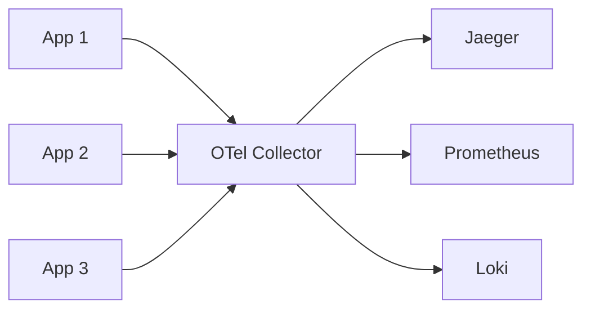

# Вопросы на собеседовании: `OpenTelemetry`

`OpenTelemetry (OTel)` — **vendor-neutral** стандарт для observability (от слияния OpenTracing + OpenCensus в 2019). 2-й по активности проект CNCF после Kubernetes. Стандарт de facto для **distributed tracing**, набирает momentum для metrics и logs. Заменяет vendor-specific SDKs (Datadog, NewRelic, etc.).

## Полезные ссылки

### Официальная документация и авторитетные источники

- [OpenTelemetry Documentation](https://opentelemetry.io/docs/)
- [OpenTelemetry Specification](https://opentelemetry.io/docs/specs/otel/)
- [OpenTelemetry Java SDK](https://opentelemetry.io/docs/languages/java/)
- [OpenTelemetry Collector](https://opentelemetry.io/docs/collector/)
- [Semantic Conventions](https://opentelemetry.io/docs/specs/semconv/)
- [Awesome OpenTelemetry](https://github.com/magsther/awesome-opentelemetry)

## Содержание

- [Полезные ссылки](#полезные-ссылки)
- [See also](#see-also)

**Базовые понятия**
- [Q1. (!) Что такое OpenTelemetry?](#q1--что-такое-opentelemetry)
- [Q2. (!) Зачем OTel вместо vendor SDK?](#q2--зачем-otel-вместо-vendor-sdk)
- [Q3. (!) Three pillars: traces, metrics, logs?](#q3--three-pillars-traces-metrics-logs)
- [Q4. История (OpenTracing + OpenCensus = OpenTelemetry)?](#q4-история-opentracing--opencensus--opentelemetry)

**Архитектура**
- [Q5. (!) Components: API, SDK, Collector?](#q5--components-api-sdk-collector)
- [Q6. (!) OTel Collector — что и зачем?](#q6--otel-collector--что-и-зачем)
- [Q7. Receiver, Processor, Exporter в Collector?](#q7-receiver-processor-exporter-в-collector)
- [Q8. Agent vs Gateway deployment?](#q8-agent-vs-gateway-deployment)

**Instrumentation**
- [Q9. (!) Auto vs manual instrumentation?](#q9--auto-vs-manual-instrumentation)
- [Q10. (!) Java auto-instrumentation (javaagent)?](#q10--java-auto-instrumentation-javaagent)
- [Q11. Manual spans?](#q11-manual-spans)
- [Q12. Span attributes, events?](#q12-span-attributes-events)

**Tracing**
- [Q13. (!) Trace, span, span context?](#q13--trace-span-span-context)
- [Q14. (!) Context propagation (W3C Trace Context)?](#q14--context-propagation-w3c-trace-context)
- [Q15. Sampling — head vs tail?](#q15-sampling--head-vs-tail)

**Metrics**
- [Q16. (!) Metric instruments (Counter, Gauge, Histogram)?](#q16--metric-instruments-counter-gauge-histogram)
- [Q17. Aggregation, push vs pull?](#q17-aggregation-push-vs-pull)
- [Q18. Exemplars (linking metrics к traces)?](#q18-exemplars-linking-metrics-к-traces)

**Logs**
- [Q19. (!) OTel Logs — статус?](#q19--otel-logs--статус)
- [Q20. Log correlation с traces?](#q20-log-correlation-с-traces)

**Backends и exporters**
- [Q21. (!) Какие backends поддерживают OTel?](#q21--какие-backends-поддерживают-otel)
- [Q22. OTLP — wire protocol?](#q22-otlp--wire-protocol)
- [Q23. (!) Можно ли менять backend без code change?](#q23--можно-ли-менять-backend-без-code-change)

**Best practices**
- [Q24. (!) Semantic conventions?](#q24--semantic-conventions)
- [Q25. Resource attributes?](#q25-resource-attributes)
- [Q26. Что включить в traces (избежать noise)?](#q26-что-включить-в-traces-избежать-noise)

**Production**
- [Q27. (!) Какие частые проблемы OTel в production?](#q27--какие-частые-проблемы-otel-в-production)
- [Q28. Cost optimization для OTel?](#q28-cost-optimization-для-otel)

## Q1. (!) Что такое OpenTelemetry?

`OpenTelemetry (OTel)` — open-source framework для **collection** и **export** телеметрии:
- Traces (distributed tracing)
- Metrics
- Logs

**Vendor-neutral** — можно отправлять данные в любой backend (Datadog, Jaeger, New Relic, Honeycomb, Splunk, Tempo, etc.).

**CNCF graduated** project (2024). 2-й по активности после Kubernetes.

**Цель:** **standardize** instrumentation — пишешь один раз, отправляешь куда угодно.

## Q2. (!) Зачем OTel вместо vendor SDK?

**Vendor-specific SDK (Datadog, New Relic):**
- Tightly coupled к vendor
- Switch vendor → rewrite instrumentation
- Different API в каждом language
- Vendor lock-in

**OpenTelemetry:**
- **One instrumentation, multiple backends**
- Switch vendor через config (без code changes)
- Standard API across languages
- Open source (no vendor lock-in)
- Can send к multiple backends parallel

**В 2025** — большинство vendors **support OTel input** (Datadog, NewRelic accept OTLP). OTel выиграл standards war.

## Q3. (!) Three pillars: traces, metrics, logs?

**Traces** — request paths через services.
- Stable in OTel
- Wide language support
- Backends: Jaeger, Tempo, Honeycomb, Datadog APM

**Metrics** — numerical aggregations.
- Stable in OTel
- Counter, Gauge, Histogram
- Backends: Prometheus, Datadog, CloudWatch

**Logs** — discrete events.
- Newest pillar (stable since 2024)
- Adoption растёт
- Backends: Loki, ELK, Datadog Logs

В 2025 — **traces + metrics** mature, **logs** растёт.

## Q4. История (OpenTracing + OpenCensus = OpenTelemetry)?

**OpenTracing** (2016) — спецификация tracing API. Ранний стандарт.
**OpenCensus** (2017) — Google's tracing + metrics library.

**Конкуренция:** community split, mass confusion.

**OpenTelemetry** (2019) — merge OpenTracing + OpenCensus. Backed by **CNCF + большинство major vendors** (Google, Microsoft, AWS, Datadog, Splunk, ...).

В **2025** — OpenTracing и OpenCensus **deprecated**. OTel — единственный mainstream standard.

## Q5. (!) Components: API, SDK, Collector?

```
[App + OTel API] → [OTel SDK] → [OTel Collector] → [Backend(s)]
```

**API** — defines instrumentation (`Tracer.startSpan(...)`).
**SDK** — implementation (creates spans, batches, exports).
**Collector** — separate process; receives, processes, exports телеметрию.

**Зачем split API/SDK:**
- App code только зависит от API (минимальная dependency)
- SDK можно swap (different sampling, exporting)

## Q6. (!) OTel Collector — что и зачем?

**OTel Collector** — process, который **receives** телеметрию от apps, **processes** (filter, sample, transform), и **exports** к backends.



**Почему нужен:**
- **Decoupling** — apps не знают про specific backends
- **Centralized config** — sampling, filtering в одном месте
- **Buffering / batching** — efficient transmission
- **Multi-backend** — fanout одновременно
- **Reduces app overhead** — heavy work в Collector, не в app

**Modes:**
- **Agent** — sidecar / DaemonSet рядом с apps
- **Gateway** — separate cluster, central
- **Both** — Agent → Gateway

## Q7. Receiver, Processor, Exporter в Collector?

```yaml
# Collector config
receivers:
  otlp:
    protocols: { grpc: { endpoint: 0.0.0.0:4317 }, http: { endpoint: 0.0.0.0:4318 } }
  prometheus:
    config: { scrape_configs: [...] }

processors:
  batch:
    timeout: 10s
  memory_limiter:
    limit_mib: 512
  attributes:
    actions:
      - key: env
        value: prod
        action: insert

exporters:
  otlp/jaeger:
    endpoint: jaeger:4317
  prometheusremotewrite:
    endpoint: http://prometheus:9090/api/v1/write
  loki:
    endpoint: http://loki:3100/loki/api/v1/push

service:
  pipelines:
    traces:
      receivers: [otlp]
      processors: [memory_limiter, batch]
      exporters: [otlp/jaeger]
    metrics:
      receivers: [otlp, prometheus]
      processors: [batch]
      exporters: [prometheusremotewrite]
```

**Receiver** — принимает данные (OTLP, Jaeger, Prometheus, ...).
**Processor** — обрабатывает (batch, filter, attributes, sampling).
**Exporter** — отправляет к backend.

**Pipelines** — соединяют receivers → processors → exporters.

## Q8. Agent vs Gateway deployment?

**Agent (per-host):**
- DaemonSet в K8s (pod на каждой node)
- Sidecar в pod
- Low latency, local
- Reduces network calls к remote collector

**Gateway (centralized):**
- Separate cluster collectors
- Centralized processing (sampling, filtering)
- Easier ops (one place)
- More buffering capacity

**Best practice:** **Agent + Gateway** combined:
- Agent: local buffering, basic processing
- Gateway: complex processing, fanout к backends

## Q9. (!) Auto vs manual instrumentation?

**Auto-instrumentation** — automatic для popular libraries (HTTP, DB, gRPC).

```bash
# Java
java -javaagent:opentelemetry-javaagent.jar -jar app.jar

# Python
pip install opentelemetry-distro
opentelemetry-instrument python app.py

# Node.js
node --require @opentelemetry/auto-instrumentations-node app.js
```

**Manual instrumentation** — explicit code в business logic.

```java
Span span = tracer.spanBuilder("processOrder").startSpan();
try (Scope scope = span.makeCurrent()) {
    span.setAttribute("order.id", orderId);
    processOrder();
} finally {
    span.end();
}
```

**Best practice:** **auto** для infrastructure (HTTP, DB), **manual** для business logic (key operations).

## Q10. (!) Java auto-instrumentation (javaagent)?

**Java agent** — JVM agent, instrumentates bytecode at startup.

```bash
# Download agent
curl -L -O https://github.com/open-telemetry/opentelemetry-java-instrumentation/releases/latest/download/opentelemetry-javaagent.jar

# Configure via env
export OTEL_SERVICE_NAME=my-service
export OTEL_TRACES_EXPORTER=otlp
export OTEL_METRICS_EXPORTER=otlp
export OTEL_EXPORTER_OTLP_ENDPOINT=http://collector:4317

# Run
java -javaagent:opentelemetry-javaagent.jar -jar app.jar
```

**Auto-instruments:**
- Spring Boot (controllers, beans)
- HTTP clients (HttpClient, OkHttp, RestTemplate, WebClient)
- JDBC (всё DBs)
- Kafka, RabbitMQ
- Redis, MongoDB
- gRPC
- 100+ libraries

**Без code changes!** Just attach agent.

## Q11. Manual spans?

```java
import io.opentelemetry.api.trace.Tracer;

Tracer tracer = GlobalOpenTelemetry.getTracer("my-app");

Span span = tracer.spanBuilder("process_order")
    .setSpanKind(SpanKind.INTERNAL)
    .startSpan();
try (Scope scope = span.makeCurrent()) {
    span.setAttribute("order.id", orderId);
    span.setAttribute("user.id", userId);

    processOrder(orderId);

    span.setStatus(StatusCode.OK);
} catch (Exception e) {
    span.setStatus(StatusCode.ERROR, e.getMessage());
    span.recordException(e);
    throw e;
} finally {
    span.end();
}
```

**Best practices:**
- Wrap в try-finally (always end span)
- Set attributes для context
- Record exceptions
- Set status (OK / ERROR)

## Q12. Span attributes, events?

**Attributes** — key-value pairs (как tags). Static info про span.

```java
span.setAttribute("http.method", "GET");
span.setAttribute("http.status_code", 200);
span.setAttribute("db.system", "postgresql");
```

**Events** — timestamped events внутри span.

```java
span.addEvent("Cache miss");
span.addEvent("Slow query detected", Attributes.of(
    AttributeKey.stringKey("query"), sql
));
```

**Standard attributes** — следуй [Semantic Conventions](https://opentelemetry.io/docs/specs/semconv/) для interoperability.

## Q13. (!) Trace, span, span context?

**Trace** — collection of spans for one request.

**Span** — single operation (HTTP call, DB query, function call).

**Span context** — IDs для correlation:
- `trace_id` — same для всех spans в trace (16 bytes / 32 hex chars)
- `span_id` — unique per span (8 bytes / 16 hex chars)
- `trace_flags` — sampling decision

```
Trace 0123456789abcdef0123456789abcdef
├── Span (root): HTTP GET /orders/123
│   ├── Span: SELECT FROM orders
│   ├── Span: SELECT FROM users
│   └── Span: HTTP POST /payments
│       └── Span: SELECT FROM accounts
```

## Q14. (!) Context propagation (W3C Trace Context)?

**Context propagation** — passing trace context между services через HTTP headers.

**W3C Trace Context** (standard 2020):
```
Headers:
  traceparent: 00-0123456789abcdef0123456789abcdef-0123456789abcdef-01
  tracestate: vendor1=value1,vendor2=value2
```

**Format:**
- `traceparent` = `version-traceId-spanId-flags`
- `tracestate` = vendor-specific data

OTel SDKs **automatically** inject/extract при HTTP calls (with auto-instrumentation).

**For async** (Kafka): inject context в message headers, extract в consumer.

## Q15. Sampling — head vs tail?

**Не каждый** request нужно trace (cost). Sampling.

**Head sampling** (before processing):
- Decision на start trace
- Cheap (no need to keep all spans)
- **Misses interesting traces** (errors, slow)

**Tail sampling** (after trace complete):
- Decision when trace finishes
- Need to **buffer** all spans
- **Smart:** keep all error traces, slow traces, % normal
- Implemented в Collector, not SDK

```yaml
# Tail sampling в Collector
processors:
  tail_sampling:
    policies:
      - name: errors-policy
        type: status_code
        status_code: { status_codes: [ERROR] }
      - name: slow-policy
        type: latency
        latency: { threshold_ms: 1000 }
      - name: random-policy
        type: probabilistic
        probabilistic: { sampling_percentage: 10 }
```

**Best practice 2025:** tail sampling для **production** apps с high traffic.

## Q16. (!) Metric instruments (Counter, Gauge, Histogram)?

**Counter** — monotonically increasing.
```java
LongCounter requests = meter.counterBuilder("http.requests")
    .setDescription("HTTP request count")
    .setUnit("1")
    .build();
requests.add(1, Attributes.of(AttributeKey.stringKey("method"), "GET"));
```

**UpDownCounter** — может increase/decrease (например, active connections).

**Gauge** — current value (CPU%, memory used).
```java
meter.gaugeBuilder("queue.size")
    .buildWithCallback(measurement -> measurement.record(queue.size()));
```

**Histogram** — distribution of values (latencies).
```java
DoubleHistogram latency = meter.histogramBuilder("http.duration")
    .setUnit("ms")
    .build();
latency.record(245.5, Attributes.of(...));
```

**Histogram** даёт percentiles (p50, p95, p99) на backend.

## Q17. Aggregation, push vs pull?

**Push** — SDK sends metrics к backend periodically.
- OTLP push к Collector
- Collector → backend

**Pull** — backend scrapes metrics из app.
- Prometheus scrapes app's `/metrics` endpoint

**OTel supports both:**
- **Push** — OTLP exporter
- **Pull** — Prometheus exporter (exposes endpoint)

**Aggregation periods:** how often metrics aggregated (default 60 sec).

## Q18. Exemplars (linking metrics к traces)?

**Exemplar** — sample trace ID attached к metric data point.

```
Histogram bucket: 1000-2000ms
  Exemplar: trace_id=abc123, value=1500ms
```

**Use case:** "p99 latency растёт" → click exemplar → see trace того slow request.

Bridging metrics → traces. Powerful debugging.

Supported в Prometheus, Tempo, Datadog.

## Q19. (!) OTel Logs — статус?

**Logs** — newest pillar. **Stable since 2024** в OTel.

**OTLP Logs** — accept logs от apps в standardized format.

**Log Bridge** — bridge existing logging libraries (Log4j, Logback, ZapLogger) к OTel.

```java
// Slf4j → OTel automatic
logger.info("Processing order {}", orderId);
// Auto-correlated с current trace span
```

В **2025** — adoption растёт, но Logs всё ещё **более immature** чем traces/metrics.

## Q20. Log correlation с traces?

**Correlation** — log entry contains trace_id + span_id.

```
2025-04-19 14:30:00 INFO [trace_id=abc123, span_id=def456] Processing order 12345
```

**Workflow:**
1. See error в logs → grab trace_id
2. Open trace в Jaeger/Tempo → see full request path
3. See slow span → check related metrics

**OTel auto-correlates** при использовании Log Bridge.

В **Datadog, Honeycomb, NewRelic** — UI links logs ↔ traces автоматически.

## Q21. (!) Какие backends поддерживают OTel?

**Open-source:**
- **Jaeger** — traces
- **Zipkin** — traces (older)
- **Prometheus** — metrics
- **Loki** (Grafana) — logs
- **Tempo** (Grafana) — traces
- **Mimir** (Grafana) — metrics
- **OpenSearch / Elasticsearch** — logs / traces
- **Cassandra** (для Jaeger storage)

**SaaS / Enterprise:**
- **Datadog**
- **New Relic**
- **Splunk**
- **Honeycomb**
- **Lightstep**
- **AWS X-Ray** (через ADOT)
- **Azure Monitor**
- **Google Cloud Trace**
- **Dynatrace**

В **2025** — practically **все** observability vendors accept OTLP. Standard wars завершены.

## Q22. OTLP — wire protocol?

**OTLP (OpenTelemetry Protocol)** — wire format для transmission телеметрии.

**Two transport options:**
- **gRPC** (`:4317`) — binary, efficient
- **HTTP/protobuf** (`:4318`) — easier to debug

**Default endpoint:** `localhost:4317`.

**Encoding:**
- Protocol Buffers (binary)
- Compact, fast

```yaml
exporters:
  otlp:
    endpoint: "collector:4317"
    tls:
      insecure: true
```

OTLP — standard. Все vendor backends accept it.

## Q23. (!) Можно ли менять backend без code change?

**Да!** Это main value OTel.

```bash
# Switch from Jaeger to Datadog
# Just change Collector config:

# Before:
exporters:
  otlp/jaeger:
    endpoint: jaeger:4317

# After:
exporters:
  datadog:
    api: { key: ${DD_API_KEY} }
```

**App code не меняется.** Restart Collector.

Это **революционный shift** vs vendor SDK era.

## Q24. (!) Semantic conventions?

**Semantic Conventions** — standard names для attributes.

```
http.method  = "GET"
http.status_code = 200
http.url = "https://example.com/path"
db.system = "postgresql"
db.statement = "SELECT * FROM users"
service.name = "order-service"
service.version = "1.2.3"
```

**Зачем:** **interoperability** между tools. Datadog UI знает что `http.method` означает HTTP method, не custom attribute.

**Auto-instrumentation** uses semantic conventions automatically.

**Manual:** import standard attribute keys из OTel package (`SemanticAttributes.HTTP_METHOD`).

## Q25. Resource attributes?

**Resource** — info про **источник** телеметрии (service, host, container).

```yaml
service.name: my-app
service.version: 1.0.0
service.namespace: production
host.name: web-01
container.id: abc123
k8s.cluster.name: prod-eu-west-1
k8s.pod.name: my-app-7d8f9b-xz2k
deployment.environment: production
```

**Resource** attached к каждому span/metric/log automatically.

**В K8s:** OTel resource detector auto-fills from K8s API.

## Q26. Что включить в traces (избежать noise)?

**Включай:**
- HTTP requests (auto)
- DB queries (auto)
- External API calls (auto)
- Key business operations (manual)
- Long-running tasks
- Cache misses

**Избегай:**
- Очень частые ops (per-element в loop)
- Health check endpoints
- Static asset serving
- Internal trivial functions

**Sampling** для high-volume operations.

## Q27. (!) Какие частые проблемы OTel в production?

1. **High overhead** — instrumentation eats 5-10% CPU. Sample aggressively.
2. **Network costs** — sending все spans expensive. Use Collector batching.
3. **Storage costs** — backends (Datadog, etc.) charge per ingested data.
4. **Cardinality explosion** — high-cardinality attributes (user_id) blow up metrics.
5. **Async context loss** — propagation в async (CompletableFuture, Coroutines) tricky.
6. **Different vendors handle differently** — даже OTLP-compatible имеют quirks.
7. **Auto-instrumentation conflicts** — несколько agents fighting.
8. **Versioning** — SDK / Agent / API version mismatches.

## Q28. Cost optimization для OTel?

1. **Sampling** — head + tail
2. **Drop unnecessary spans** в Collector (filter processor)
3. **Lower cardinality** metrics (don't tag with user_id)
4. **Reduce attribute count** per span
5. **Compress** OTLP traffic
6. **Batch** in Collector
7. **Self-host backends** (Jaeger, Loki, Tempo) instead of expensive SaaS
8. **Aggregate metrics** при Collector level
9. **Tail sampling** keeps important traces, drops noise

В Datadog: ingested traces могут быть **$0.10-1.00 per million spans**. Sampling экономит десятки тысяч $/month.

---

## See also

- [Jaeger / Zipkin](jaeger-zipkin-interview.md) — backends для traces
- [ELK Stack](elk-stack-interview.md) — backend для logs
- [Loki + Grafana](loki-grafana-interview.md) — backend для logs
- [Prometheus + Grafana](prometheus-grafana-interview.md) — backend для metrics
- [Observability](observability-interview.md) — общая концепция
- [Метрики и трейсинг](metrics-tracing-interview.md) — concepts
- [Logging](../logging/logging-interview.md) — log management
- [Стратегии логирования](logging-strategies-interview.md) — best practices
- [Микросервисы](../architecture/microservices-interview.md) — где OTel needed
- [Kubernetes](../devops/kubernetes-interview.md) — Collector в K8s
- [Cloud-native Patterns](../cloud/cloud-native-patterns-interview.md) — observability pillar
- [Application Profiling](../performance/application-profiling-interview.md) — alternative для perf
- [Spring Boot Actuator](../frameworks/spring/spring-boot-actuator-interview.md) — Actuator + OTel

- [Jaeger и Zipkin](jaeger-zipkin-interview.md)
- [Стратегии логирования](logging-strategies-interview.md)
- [Loki и Grafana](loki-grafana-interview.md)
- [Метрики и трейсинг](metrics-tracing-interview.md)
- [Observability](observability-interview.md)
- [Шпаргалка: OpenTelemetry](../../monitoring/tracing/opentelemetry.md) — теория
