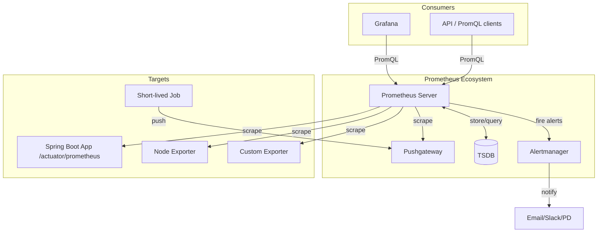
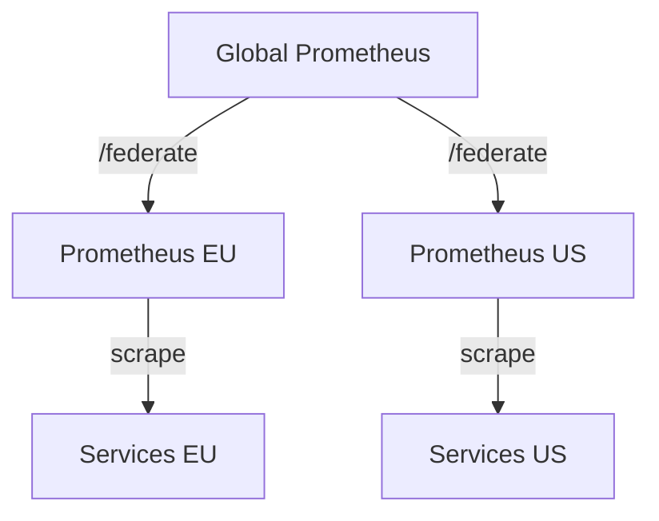

# Вопросы на собеседовании: `Prometheus` и `Grafana`

Шпаргалка охватывает архитектуру `Prometheus`, типы метрик, язык запросов `PromQL`, настройку алертов через `Alertmanager`, интеграцию с `Spring Boot` через `Micrometer`, визуализацию в `Grafana`, а также решения для долгосрочного хранения — `Thanos` и `VictoriaMetrics`.

**`Prometheus`** — система мониторинга с открытым исходным кодом, основанная на pull-модели сбора метрик и собственной TSDB. **`Grafana`** — платформа визуализации, которая подключается к `Prometheus` как источнику данных и строит дашборды.

## Полезные ссылки

### Официальная документация

- [Prometheus Documentation](https://prometheus.io/docs/) — официальная документация Prometheus
- [PromQL Reference](https://prometheus.io/docs/prometheus/latest/querying/basics/) — язык запросов PromQL
- [Grafana Documentation](https://grafana.com/docs/grafana/latest/) — документация Grafana
- [Micrometer Documentation](https://docs.micrometer.io/micrometer/reference/) — документация Micrometer
- [Grafana Loki](https://grafana.com/docs/loki/latest/) — документация Loki
- [Baeldung: Monitor a Spring Boot App Using Prometheus](https://www.baeldung.com/spring-boot-prometheus) — практическое руководство
- [Baeldung: Quick Guide to Micrometer](https://www.baeldung.com/micrometer) — основы Micrometer

## Содержание

- [Полезные ссылки](#полезные-ссылки)
- [See also](#see-also)

**Архитектура Prometheus**
- [Q1. Опишите архитектуру Prometheus. Из каких компонентов она состоит?](#q1-опишите-архитектуру-prometheus-из-каких-компонентов-она-состоит)
- [Q2. Что такое TSDB в Prometheus? Как данные хранятся на диске?](#q2-что-такое-tsdb-в-prometheus-как-данные-хранятся-на-диске)
- [Q3. (!) Что такое pull-модель сбора метрик и почему Prometheus её использует?](#q3--что-такое-pull-модель-сбора-метрик-и-почему-prometheus-её-использует)
- [Q4. Что такое Pushgateway и когда его использовать?](#q4-что-такое-pushgateway-и-когда-его-использовать)
- [Q5. Что такое Alertmanager? Как он связан с Prometheus Server?](#q5-что-такое-alertmanager-как-он-связан-с-prometheus-server)

**Типы метрик**
- [Q6. (!) Какие типы метрик существуют в Prometheus? Когда какой использовать?](#q6--какие-типы-метрик-существуют-в-prometheus-когда-какой-использовать)
- [Q7. В чём разница между Histogram и Summary?](#q7-в-чём-разница-между-histogram-и-summary)
- [Q8. Как правильно назвать метрику в Prometheus? Какие конвенции именования?](#q8-как-правильно-назвать-метрику-в-prometheus-какие-конвенции-именования)

**PromQL**
- [Q9. (!) Чем отличаются функции rate() и irate()?](#q9--чем-отличаются-функции-rate-и-irate)
- [Q10. Что делает функция increase()? Когда предпочесть её rate()?](#q10-что-делает-функция-increase-когда-предпочесть-её-rate)
- [Q11. (!) Как работает histogram_quantile()? Приведите пример.](#q11--как-работает-histogram_quantile-приведите-пример)
- [Q12. Что такое label_replace() и для чего используется?](#q12-что-такое-label_replace-и-для-чего-используется)
- [Q13. Как агрегировать метрики по лейблам в PromQL?](#q13-как-агрегировать-метрики-по-лейблам-в-promql)
- [Q14. Что такое instant vector и range vector в PromQL?](#q14-что-такое-instant-vector-и-range-vector-в-promql)
- [Q15. Как вычислить процент ошибок HTTP-запросов с помощью PromQL?](#q15-как-вычислить-процент-ошибок-http-запросов-с-помощью-promql)

**Labels и Cardinality**
- [Q16. (!) Что такое high cardinality в Prometheus и почему это проблема?](#q16--что-такое-high-cardinality-в-prometheus-и-почему-это-проблема)
- [Q17. Какие лейблы не стоит добавлять в метрики?](#q17-какие-лейблы-не-стоит-добавлять-в-метрики)

**Recording rules и Alert rules**
- [Q18. (!) Что такое recording rules и зачем они нужны?](#q18--что-такое-recording-rules-и-зачем-они-нужны)
- [Q19. Как устроены alert rules в Prometheus? Что такое pending и firing?](#q19-как-устроены-alert-rules-в-prometheus-что-такое-pending-и-firing)
- [Q20. Что такое for: в alert rule? Зачем это нужно?](#q20-что-такое-for-в-alert-rule-зачем-это-нужно)

**Alertmanager**
- [Q21. (!) Как устроена маршрутизация алертов в Alertmanager?](#q21--как-устроена-маршрутизация-алертов-в-alertmanager)
- [Q22. Что такое inhibition rules в Alertmanager?](#q22-что-такое-inhibition-rules-в-alertmanager)
- [Q23. Что такое silences в Alertmanager и как их применять?](#q23-что-такое-silences-в-alertmanager-и-как-их-применять)
- [Q24. Как Alertmanager дедуплицирует и группирует алерты?](#q24-как-alertmanager-дедуплицирует-и-группирует-алерты)

**Spring Boot + Micrometer + Prometheus**
- [Q25. (!) Как подключить Prometheus к Spring Boot приложению?](#q25--как-подключить-prometheus-к-spring-boot-приложению)
- [Q26. Как создать кастомную метрику с помощью Micrometer?](#q26-как-создать-кастомную-метрику-с-помощью-micrometer)
- [Q27. Какие метрики Spring Boot экспортирует автоматически?](#q27-какие-метрики-spring-boot-экспортирует-автоматически)
- [Q28. Как добавить общие теги (common tags) ко всем метрикам приложения?](#q28-как-добавить-общие-теги-common-tags-ко-всем-метрикам-приложения)

**Grafana**
- [Q29. (!) Что такое Data Sources в Grafana? Как добавить Prometheus?](#q29--что-такое-data-sources-в-grafana-как-добавить-prometheus)
- [Q30. Что такое templating и переменные в Grafana?](#q30-что-такое-templating-и-переменные-в-grafana)
- [Q31. Чем отличаются Grafana Alerts от Alertmanager?](#q31-чем-отличаются-grafana-alerts-от-alertmanager)
- [Q32. Что такое Grafana Loki? Как он отличается от Prometheus?](#q32-что-такое-grafana-loki-как-он-отличается-от-prometheus)

**Service Discovery**
- [Q33. Какие механизмы service discovery поддерживает Prometheus?](#q33-какие-механизмы-service-discovery-поддерживает-prometheus)
- [Q34. Как работает Kubernetes service discovery в Prometheus?](#q34-как-работает-kubernetes-service-discovery-в-prometheus)

**Remote Write / Remote Read / Federation**
- [Q35. (!) Что такое Remote Write в Prometheus и зачем используется?](#q35--что-такое-remote-write-в-prometheus-и-зачем-используется)
- [Q36. Что такое Prometheus Federation?](#q36-что-такое-prometheus-federation)
- [Q37. Чем Thanos отличается от VictoriaMetrics? Когда использовать каждый?](#q37-чем-thanos-отличается-от-victoriametrics-когда-использовать-каждый)

**SLI / SLO**
- [Q38. Что такое SLI и SLO? Какие метрики обычно используются?](#q38-что-такое-sli-и-slo-какие-метрики-обычно-используются)
- [Q39. Что такое error budget и как его считать через PromQL?](#q39-что-такое-error-budget-и-как-его-считать-через-promql)

---

## Q1. Опишите архитектуру Prometheus. Из каких компонентов она состоит?

**Prometheus** — система мониторинга на pull-архитектуре: сервер сам ходит к таргетам по HTTP, забирает метрики, кладёт их в свою TSDB и проверяет правила алертов. Вокруг этого ядра работает несколько вспомогательных компонентов.



| Компонент | Роль |
|-----------|------|
| **Prometheus Server** | Сердце системы: scrape метрик, хранение в TSDB, вычисление recording и alert rules |
| **TSDB** | Встроенная time-series БД; хранит данные локально на диске |
| **Alertmanager** | Получает сработавшие алерты от сервера и маршрутизирует их по receivers |
| **Pushgateway** | Буфер для short-lived jobs, которые завершаются раньше, чем сервер успеет их опросить |
| **Exporters** | Переходники для систем без нативной поддержки Prometheus (Node Exporter, JMX, Redis) |

**Ключевая идея для интервью:** ответственность чётко разделена. Prometheus Server только *детектирует* проблему (правило переходит в `FIRING`), а `Alertmanager` отдельно решает, *кому, когда и как* отправить уведомление — дедуплицирует, группирует и маршрутизирует. Это позволяет иметь несколько серверов и один общий узел нотификаций.

---

## Q2. Что такое TSDB в Prometheus? Как данные хранятся на диске?

**TSDB (Time Series Database)** — встроенное хранилище `Prometheus`, заточенное под один сценарий: писать много временных рядов и быстро их читать по диапазону времени. Поэтому данные не лежат построчно, как в обычной БД, а группируются в блоки по времени и сильно сжимаются.

**Структура на диске:**

```
data/
├── 01BKGV7JC0RY8A6FHJF7H6Q68R/   ← Block (2-часовой блок)
│   ├── chunks/
│   │   └── 000001                 ← сжатые данные сэмплов
│   ├── index                      ← индекс лейблов → временные ряды
│   ├── meta.json
│   └── tombstones
├── chunks_head/                   ← текущие данные в памяти (WAL)
└── wal/                           ← Write-Ahead Log
```

**Как это работает:**
- **Блоки.** Данные нарезаются на иммутабельные блоки (~2 часа по умолчанию). Внутри блока: `chunks/` (сжатые сэмплы), `index` (лейблы → ряды) и `meta.json`.
- **Head block + WAL.** Последние ~2 часа ещё пишутся, поэтому живут в памяти (head block). Чтобы не потерять их при падении, каждая запись дублируется в Write-Ahead Log на диске — после рестарта head восстанавливается из WAL.
- **Compaction.** Фоновый процесс сливает старые мелкие блоки в более крупные, заодно дополнительно сжимая их и удаляя помеченные на удаление ряды.
- **Сжатие.** Применяется алгоритм Gorilla: double-delta для timestamps и XOR для значений float64. Соседние во времени сэмплы похожи, поэтому хранится только дельта — это и даёт компактность.
- **Retention.** По умолчанию данные живут **15 дней** (`--storage.tsdb.retention.time`); дальше блоки удаляются. Для долгого хранения метрики выгружают наружу через remote write (см. Q35).

---

## Q3. (!) Что такое pull-модель сбора метрик и почему Prometheus её использует?

**Pull-модель** означает, что `Prometheus Server` сам периодически опрашивает (`scrapes`) таргеты по HTTP и забирает метрики — таргеты ничего никуда не шлют, они лишь отдают свой текущий снимок метрик по запросу. Это инверсия привычной push-модели, где агент сам толкает данные в коллектор.

**Почему именно так — преимущества pull:**
- **Контроль нагрузки.** Частоту опроса задаёт сам `Prometheus`, а не таргеты. Никакой таргет не сможет «зашуметь» сервер потоком данных.
- **Бесплатный health-check.** Если scrape не удался, появляется метрика `up == 0` — мониторинг доступности встроен в саму модель сбора.
- **Простое service discovery.** Чтобы начать собирать метрики, достаточно знать адрес таргета; ничего настраивать на самом таргете не нужно.
- **Централизованная конфигурация.** Что и как часто собирать описано в одном месте — на стороне `Prometheus`, а не размазано по сотням агентов.
- **Проще с сетью.** Входящие соединения открывает `Prometheus`, поэтому не нужно прокалывать firewall для входящего трафика на каждом таргете.

**Где pull неудобен и нужен push:**
- **Short-lived jobs** (batch, cron, CI) живут секунды и просто не доживают до следующего scrape → они пушат метрики в `Pushgateway`, а оттуда их уже забирает сервер.
- **NAT/firewall**, когда `Prometheus` физически не может достучаться до таргета напрямую.

**Сравнение:**

| | Pull | Push |
|-|------|------|
| Нагрузка | Контролируется Prometheus | Контролируется таргетом |
| Доступность | up/down автоматически | Нужен heartbeat |
| Масштаб | Узкое место — Prometheus | Сервер может быть перегружен |
| Firewall | Prometheus → таргет | Таргет → сервер |

---

## Q4. Что такое Pushgateway и когда его использовать?

**Pushgateway** — промежуточный буфер. Short-lived job толкает в него метрики по HTTP push, Pushgateway держит их у себя, а `Prometheus Server` забирает их оттуда обычным scrape. По сути это «почтовый ящик» для задач, которые сами не доживут до опроса.

**Когда нужен:**
- **Cron / batch jobs, CI/CD pipelines** — задача завершается быстрее, чем наступит scrape interval, поэтому опросить её напрямую невозможно.
- **Разовые замеры** — например, результат теста производительности, который нужно зафиксировать один раз.

**Пример отправки метрики через Pushgateway:**
```bash
echo "batch_job_duration_seconds 120.5" | curl --data-binary @- \
  http://pushgateway:9091/metrics/job/batch_import/instance/server01
```

**Подводные камни (важно проговорить на интервью):**
- **Не замена pull.** Использовать Pushgateway как единственный канал сбора метрик из long-running сервисов — антипаттерн; для них есть обычный scrape.
- **Нет TTL.** Однажды запушенная метрика лежит в Pushgateway вечно, пока её не удалят явно. Если job упал и больше не пушит, вы будете видеть его последнее «застывшее» значение и не заметите, что он умер.
- **Не масштабируется горизонтально.** Несколько инстансов одной job, пишущих по одному адресу, перезапишут метрики друг друга — нужно разносить по разным группировкам (`instance`).

---

## Q5. Что такое Alertmanager? Как он связан с Prometheus Server?

**Alertmanager** — отдельный компонент, который превращает поток сработавших алертов в осмысленные уведомления: дедуплицирует, группирует, маршрутизирует и доставляет их в нужные каналы.

**Главное — разделение ответственности.** Сам `Prometheus` алерты *не отправляет*; он лишь вычисляет правила и поднимает флаг:
- `Prometheus Server` — **вычисляет** alert rules и определяет состояние алерта (`PENDING` → `FIRING`).
- `Alertmanager` — **решает, что делать** с firing-алертами: кому, когда и через какой канал уведомить, как сгруппировать и не задублировать.

Это разделение и даёт гибкость: правила живут как код рядом с Prometheus, а вся логика нотификаций (расписания, каналы, заглушки) — в одном Alertmanager.

**Поток алерта:**
```
Prometheus Server
  → evaluates PromQL rule
  → state becomes FIRING
  → sends alert to Alertmanager via HTTP POST /api/v2/alerts
  → Alertmanager deduplicates, groups, routes
  → sends notification (email/Slack/PagerDuty/etc.)
```

Один `Alertmanager` может принимать алерты от нескольких `Prometheus Server`-ов.

---

## Q6. (!) Какие типы метрик существуют в Prometheus? Когда какой использовать?

`Prometheus` поддерживает 4 типа метрик. Выбор типа определяется природой величины: только растёт, может падать или это распределение значений.

| Тип | Описание | Когда использовать |
|-----|----------|--------------------|
| **Counter** | Монотонно возрастающий счётчик, обнуляется только при рестарте | Число запросов, ошибок, обработанных событий |
| **Gauge** | Текущее значение, которое свободно растёт и падает | CPU, память, температура, число соединений |
| **Histogram** | Распределение значений по бакетам + sum + count | Время ответа, размер запроса/ответа |
| **Summary** | Квантили, посчитанные на стороне клиента + sum + count | Нужны точные квантили одного инстанса без агрегации |

**Counter:**
```java
// Micrometer
Counter requestCounter = Counter.builder("http_requests_total")
    .tag("method", "GET")
    .tag("status", "200")
    .register(meterRegistry);
requestCounter.increment();
```

**Gauge:**
```java
Gauge.builder("queue_size", queue, Queue::size)
    .register(meterRegistry);
```

**Histogram (Timer в Micrometer):**
```java
Timer timer = Timer.builder("http_request_duration_seconds")
    .publishPercentileHistogram()  // для histogram_quantile в PromQL
    .register(meterRegistry);
timer.record(() -> handleRequest());
```

**Эмпирическое правило выбора:** если величина только растёт → `Counter`; если может и расти, и падать → `Gauge`; если важна не одна цифра, а распределение (перцентили) → `Histogram` (или `Summary`). Counter почти никогда не смотрят «в лоб» — к нему применяют `rate()`, чтобы получить скорость в секунду.

---

## Q7. В чём разница между Histogram и Summary?

Оба измеряют распределение значений (например, latency), но принципиально по-разному решают, *где* считаются перцентили — и отсюда вытекают все остальные различия.

| | Histogram | Summary |
|-|-----------|---------|
| Квантили | Считаются в PromQL на стороне сервера | Считаются на стороне клиента при записи |
| Агрегация | Можно агрегировать по нескольким инстансам | Нельзя — квантили не суммируются |
| Накладные расходы | На сервере (PromQL) | На клиенте (CPU приложения) |
| Точность | Зависит от настройки бакетов | Точная, но только для одного инстанса |
| Бакеты | Задаются заранее | Не требуются |

**Histogram** экспортирует:
- `http_request_duration_seconds_bucket{le="0.1"}` — число запросов <= 0.1s
- `http_request_duration_seconds_sum`
- `http_request_duration_seconds_count`

**Summary** экспортирует:
- `http_request_duration_seconds{quantile="0.99"}` — P99 на клиенте
- `http_request_duration_seconds_sum`
- `http_request_duration_seconds_count`

**Рекомендация:** по умолчанию выбирайте `Histogram` + `histogram_quantile()` в `PromQL`. Ключевая причина — агрегируемость: P99 по всему сервису из 20 подов корректно посчитать можно только из гистограммы (сложив бакеты), а перцентили Summary каждого инстанса между собой суммировать математически нельзя. Summer берут лишь когда нужна высокая точность одного инстанса и заранее неизвестны границы бакетов.

---

## Q8. Как правильно назвать метрику в Prometheus? Какие конвенции именования?

Хорошее имя метрики само объясняет, что в ней лежит и в каких единицах. Конвенции `Prometheus`:

1. **Формат** `<namespace>_<subsystem>_<name>_<unit>` в `snake_case` — слева общая область, справа единица измерения.
2. **Единица — в суффиксе, в базовых единицах СИ:** `_seconds`, `_bytes`. Не миллисекунды и не килобайты — это упрощает математику в PromQL и сравнение метрик.
3. **`Counter` всегда заканчивается на `_total`** — это сигнал, что значение монотонно растёт и к нему нужно применять `rate()`.
4. **Не дублируй единицу:** `request_duration_seconds_total` — плохо, потому что `_seconds` и `_total` конфликтуют по смыслу (это «секунды» или «штуки»?).

**Примеры:**
```
http_requests_total              # counter: общее число HTTP-запросов
http_request_duration_seconds    # histogram: длительность в секундах
process_resident_memory_bytes    # gauge: память в байтах
jvm_gc_pause_seconds_total       # counter sum: суммарное время GC
kafka_consumer_lag               # gauge: отставание консьюмера
```

**Плохие примеры:**
```
requestCount        # нет namespace, нет единиц
http_request_ms     # нестандартная единица (ms вместо seconds)
user_id_total       # лейбл в имени метрики
```

---

## Q9. (!) Чем отличаются функции rate() и irate()?

Обе функции вычисляют скорость роста `Counter` в секунду, но по-разному выбирают, *по каким точкам* считать наклон. Отсюда и разница в поведении.

| | `rate()` | `irate()` |
|-|----------|-----------|
| Алгоритм | Усреднённая скорость по всем точкам в range | Мгновенная скорость по последним 2 точкам |
| Сглаживание | Сильное — устойчив к выбросам | Нет — реагирует на каждый спайк |
| Применение | Дашборды, алертинг | Отладка, real-time графики |
| Рекомендация | Большинство случаев | Только для диагностики |

```promql
# Среднее число запросов в секунду за последние 5 минут
rate(http_requests_total[5m])

# Мгновенная скорость (последние 2 точки)
irate(http_requests_total[5m])
```

**Подводный камень:** `irate()` нельзя использовать в alert rules — он смотрит только на последние 2 точки, поэтому дёргается на каждом всплеске и даёт ложные срабатывания. Для алертов всегда `rate()` с окном пошире (минимум `5m`) — оно сгладит шум и оставит реальный тренд.

---

## Q10. Что делает функция increase()? Когда предпочесть её rate()?

`increase(v[d])` — возвращает абсолютный прирост `Counter` за период `d`, то есть «сколько событий случилось за `d`», а не скорость в секунду. Это `rate()`, домноженный на длину окна, поэтому корректно обрабатывает сбросы счётчика при рестартах.

```promql
# Сколько запросов было за последний час
increase(http_requests_total[1h])

# Эквивалентно rate * seconds:
rate(http_requests_total[1h]) * 3600
```

**Когда `increase()` удобнее `rate()`:**
- Нужно **абсолютное число событий**, а не скорость: «сколько ошибок за сутки».
- Отчёты и SLO-расчёты, где считают долю плохих запросов от общего числа.
- Числа-итоги на дашборде: «Всего запросов за час: 12 345».

**Подводный камень:** `increase()` экстраполирует крайние точки окна на его границы, поэтому может вернуть нецелое число (например, 12.7 ошибки). Это нормально и не баг — для счётчиков точное целое не гарантируется.

---

## Q11. (!) Как работает histogram_quantile()? Приведите пример.

`histogram_quantile(φ, b)` вычисляет квантиль φ (от 0 до 1) из гистограммы `b` — например, `0.99` даёт P99 latency. Это аппроксимация: точного значения у гистограммы нет, есть только распределение по бакетам.

**Как работает:**
1. Принимает вектор бакетов `_bucket` (каждый бакет — счётчик «сколько значений ≤ границы `le`»).
2. Находит бакет, в который попадает искомый квантиль, и выполняет линейную интерполяцию *внутри* этого бакета.
3. Возвращает приближённое значение. Точность зависит от того, насколько удачно границы бакетов покрывают реальное распределение.

**Пример — P99 latency:**
```promql
histogram_quantile(
  0.99,
  rate(http_request_duration_seconds_bucket[5m])
)
```

**P99 latency по сервисам:**
```promql
histogram_quantile(
  0.99,
  sum by (service, le) (
    rate(http_request_duration_seconds_bucket[5m])
  )
)
```

**Подводные камни:**
- **Сначала `rate()`, потом квантиль.** К `_bucket` нужно применить `rate()` (или `increase()`), иначе вы посчитаете квантиль по накопленным с запуска счётчикам, а не по свежему трафику.
- **Бакеты решают всё.** Если P99 = 2 с, а самый крупный конечный бакет — `1 с`, результат «упрётся» в `+Inf` и будет бесполезен. Подбирайте границы под ожидаемый диапазон.
- **Стандартные бакеты `Micrometer`:** `.005, .01, .025, .05, .1, .25, .5, 1, 2.5, 5, 10` секунд.
- **`le="+Inf"` всегда равен `_count`** — это бакет «все значения», то есть полное число наблюдений.

---

## Q12. Что такое label_replace() и для чего используется?

`label_replace()` — функция, которая на лету создаёт или переписывает лейбл, вытаскивая значение из другого лейбла по regex. Сами данные она не трогает — меняет только разметку рядов, чтобы их было удобнее агрегировать или красиво показать в Grafana.

**Синтаксис:**
```promql
label_replace(v, dst_label, replacement, src_label, regex)
```

**Пример — извлечь имя сервиса из namespace:**
```promql
label_replace(
  up,
  "short_name",      -- новый лейбл
  "$1",              -- значение: первая группа regex
  "job",             -- источник
  "(.+)-service"     -- regex
)
```

**Сценарии применения:**
- **Нормализация** лейблов из разных источников к единому виду, чтобы их можно было объединить в одном запросе.
- **Читаемость** — превратить технический `job="orders-service"` в короткий `short_name="orders"` для легенды графика.
- **Извлечение** части строки (hostname, namespace, версия) в отдельный лейбл, по которому потом удобно группировать.

---

## Q13. Как агрегировать метрики по лейблам в PromQL?

Агрегация в `PromQL` схлопывает множество временных рядов в меньшее число, применяя оператор: `sum`, `avg`, `min`, `max`, `count`, `topk`, `bottomk`, `stddev`. Без уточнения он схлопнет вообще всё в одно число — поэтому почти всегда нужен `by` или `without`.

**Два способа управлять группировкой:**
- `by (label1, label2)` — оставить только перечисленные лейблы, по ним и группировать (всё остальное схлопывается).
- `without (label1)` — наоборот, убрать перечисленные лейблы, остальные сохранить. Удобно, когда лейблов много и проще назвать те, что нужно «выкинуть» (например, `instance`).

```promql
# Суммарный RPS по всем инстансам, сгруппированный по сервису
sum by (service) (rate(http_requests_total[5m]))

# Максимальный heap по всем podам
max without (pod) (jvm_memory_used_bytes{area="heap"})

# Топ 5 эндпоинтов по числу запросов
topk(5, sum by (path) (rate(http_requests_total[5m])))

# Процент ошибок по сервису
sum by (service) (rate(http_requests_total{status=~"5.."}[5m]))
/
sum by (service) (rate(http_requests_total[5m]))
* 100
```

---

## Q14. Что такое instant vector и range vector в PromQL?

Это два фундаментальных типа данных в PromQL. Разница — в том, сколько точек на каждый ряд: один снимок «здесь и сейчас» или цепочка значений за период.

| | Instant vector | Range vector |
|-|----------------|--------------|
| Что это | Снимок: по одному значению на ряд в момент `t` | История: набор значений за окно `[d]` |
| Синтаксис | `metric_name{labels}` | `metric_name{labels}[5m]` |
| Применение | Арифметика, сравнения, вывод на график | Вход для `rate()`, `increase()`, `delta()` |

```promql
# Instant vector — текущее значение
http_requests_total{job="api"}

# Range vector — значения за 5 минут (только как аргумент функции)
rate(http_requests_total{job="api"}[5m])
```

**Подводный камень:** range vector нельзя вывести на график или сравнить напрямую — у него на каждый ряд несколько точек, и Prometheus не знает, какую брать. Его можно подавать только в функции, которые сворачивают историю в одно число (`rate`, `irate`, `increase`, `delta`, `deriv`, `predict_linear`, `resets`). Попытка построить график по «голому» range vector — частая ошибка новичков.

---

## Q15. Как вычислить процент ошибок HTTP-запросов с помощью PromQL?

Идея во всех случаях одна: **доля плохих запросов = rate(ошибки) / rate(всех)**. Берём `rate()` (а не сырой счётчик), чтобы сравнивать скорости, и делим. Умножение на 100 переводит в проценты.

**Процент 5xx ошибок:**
```promql
100 * (
  sum(rate(http_requests_total{status=~"5.."}[5m]))
  /
  sum(rate(http_requests_total[5m]))
)
```

**Error rate по сервисам:**
```promql
100 * sum by (service) (
  rate(http_server_requests_seconds_count{status=~"5.."}[5m])
)
/ sum by (service) (
  rate(http_server_requests_seconds_count[5m])
)
```

**Метрика для SLO (availability):**
```promql
# Доступность = (1 - error_rate) за 30 дней
1 - (
  sum(increase(http_requests_total{status=~"5.."}[30d]))
  /
  sum(increase(http_requests_total[30d]))
)
```

---

## Q16. (!) Что такое high cardinality в Prometheus и почему это проблема?

**Cardinality (мощность)** — число уникальных комбинаций значений лейблов у одной метрики. Каждая такая комбинация — это *отдельный временной ряд*, который Prometheus хранит и индексирует независимо.

Главное здесь — комбинаторика: cardinality перемножается. Метрика с лейблами `{method, path, status}`, где `path` принимает 10 000 уникальных значений, создаст порядка **10 000 временных рядов** (а если ещё умножить на варианты `method` и `status` — кратно больше).

**Почему high cardinality — это боль:**
- Каждый уникальный ряд занимает память в TSDB — рядов миллионы, память кончается.
- Раздувается индекс лейблов → запросы выполняются медленнее.
- Scrape тяжелеет, обработка одного опроса дольше.
- В пределе `Prometheus Server` уходит в OOM и теряет стабильность — это самый частый способ «уронить» мониторинг.

**Типичные источники high cardinality (запрещено использовать как лейблы):**
```
user_id, request_id, session_id,
email, IP-адрес, UUID,
timestamp, version (если много релизов)
```

**Допустимые лейблы** (ограниченное множество значений):
```
method (GET/POST/...), status (200/400/500),
environment (dev/staging/prod), region (eu/us),
service, job, instance
```

---

## Q17. Какие лейблы не стоит добавлять в метрики?

**Эмпирическое правило:** лейбл годится, только если множество его значений конечно и невелико. Если значение уникально для каждого запроса или пользователя — это не лейбл, а взрыв cardinality (см. Q16).

**Нельзя (множество значений неограниченно):**
```
user_id="user-12345"        # миллионы пользователей
request_id="abc-def-123"    # уникален для каждого запроса
url="/api/users/12345"      # ID в URL → тысячи вариантов
```

**Можно — приём «нормализация»:** ID из значения убирают, заменяя его на шаблон. Так тысячи реальных URL схлопываются в один ряд.
```
endpoint="/api/users/{id}"  # шаблон вместо реального ID
status="404"                # конечное множество
method="GET"                # конечное множество
```

**Как найти виновника — топ метрик по числу рядов:**
```promql
# Топ метрик по числу уникальных time series
topk(10, count by (__name__)({__name__=~".+"}))
```

---

## Q18. (!) Что такое recording rules и зачем они нужны?

**Recording rules** — это PromQL-выражения, которые Prometheus периодически считает заранее и сохраняет результат как новую метрику в TSDB. Идея: тяжёлую агрегацию посчитать один раз по расписанию, а не заново при каждом открытии дашборда.

**Зачем:**
- **Скорость дашбордов.** Панель читает готовую метрику вместо того, чтобы каждый раз пересчитывать гистограмму по миллионам рядов.
- **Снижение нагрузки.** Выражение вычисляется раз в `evaluation_interval` (например, 30 с), а не при каждом обращении пользователя или каждой проверке алерта.
- **Единый источник.** Сложную формулу описываешь один раз и переиспользуешь в нескольких alert rules и панелях — меньше шансов разойтись.
- **Нормализация имён** — короткое предсказуемое имя вместо длинного выражения.

**Пример конфигурации:**
```yaml
groups:
  - name: api_recording_rules
    interval: 30s
    rules:
      # Предвычисленный RPS по сервису
      - record: job:http_requests:rate5m
        expr: sum by (job) (rate(http_requests_total[5m]))

      # P99 latency по сервису
      - record: job:http_request_duration_p99:rate5m
        expr: |
          histogram_quantile(0.99,
            sum by (job, le) (
              rate(http_request_duration_seconds_bucket[5m])
            )
          )
```

**Конвенция именования**: `<level>:<metric>:<operation>`
- `job:http_requests:rate5m` → уровень aggregation = `job`, метрика = `http_requests`, операция = `rate5m`

---

## Q19. Как устроены alert rules в Prometheus? Что такое pending и firing?

**Alert rule** — PromQL-выражение, которое Prometheus проверяет на каждом цикле оценки. Если оно вернуло непустой результат (условие истинно), запускается жизненный цикл алерта.

**Три состояния алерта** — это и есть суть `pending` vs `firing`:
- `inactive` — условие ложно, всё спокойно.
- `pending` — условие *стало* истинным, но ещё не выдержало паузу `for:`. Алерт «на испытательном сроке» и в `Alertmanager` пока **не** уходит.
- `firing` — условие держалось истинным дольше `for:` → алерт подтверждён и отправлен в `Alertmanager`.

Промежуточное состояние `pending` нужно, чтобы отсеять кратковременные всплески (подробнее — Q20).

**Пример:**
```yaml
groups:
  - name: api_alerts
    rules:
      - alert: HighErrorRate
        expr: |
          sum(rate(http_requests_total{status=~"5.."}[5m]))
          /
          sum(rate(http_requests_total[5m])) > 0.05
        for: 5m
        labels:
          severity: critical
          team: backend
        annotations:
          summary: "High error rate on {{ $labels.job }}"
          description: "Error rate is {{ $value | humanizePercentage }}"
```

---

## Q20. Что такое for: в alert rule? Зачем это нужно?

`for:` — сколько времени условие должно держаться истинным **непрерывно**, прежде чем алерт перейдёт из `pending` в `firing`. Если за этот период условие хоть раз стало ложным — счётчик сбрасывается, и алерт возвращается в `inactive`.

**Зачем нужен:** это фильтр от ложных срабатываний. Без `for:` любой одиночный всплеск (на доли секунды превысили порог) разбудил бы дежурного. `for:` гарантирует, что проблема реальна и устойчива, а не моргнула один раз.

**Эмпирические значения:**
- Критичные алерты: `for: 2m` — `5m` (баланс между скоростью реакции и защитой от шума).
- Предупреждения: `for: 10m` — `15m` (можно подождать дольше — это не пожар).
- `for: 0m` или отсутствие `for:` — алерт срабатывает мгновенно на первом же совпадении. Для production не рекомендуется именно из-за ложных срабатываний.

```yaml
- alert: MemoryPressure
  expr: jvm_memory_used_bytes{area="heap"} / jvm_memory_max_bytes{area="heap"} > 0.9
  for: 5m          # только если > 90% heap в течение 5 минут
  labels:
    severity: warning
```

---

## Q21. (!) Как устроена маршрутизация алертов в Alertmanager?

**Маршрутизация** в Alertmanager — это дерево (`route`), по которому каждый входящий алерт спускается сверху вниз, пока не найдёт подходящий по лейблам узел. Лист, на котором алерт остановился, задаёт `receiver` — куда слать уведомление. У дерева есть корневой маршрут с настройками по умолчанию и вложенные `routes` для частных случаев.

```yaml
route:
  group_by: ['alertname', 'cluster']
  group_wait: 30s        # ждать перед отправкой первой группы
  group_interval: 5m     # интервал между отправками группы
  repeat_interval: 4h    # повторять если алерт не resolved
  receiver: 'default-slack'

  routes:
    # Критичные алерты → PagerDuty
    - matchers:
        - severity = critical
      receiver: pagerduty-critical
      continue: false    # не проверять следующие маршруты

    # Backend-команда
    - matchers:
        - team = backend
      receiver: backend-slack

receivers:
  - name: 'default-slack'
    slack_configs:
      - api_url: 'https://hooks.slack.com/...'
        channel: '#alerts'

  - name: 'pagerduty-critical'
    pagerduty_configs:
      - routing_key: '<KEY>'
```

**Ключевые параметры:**
- `group_by` — по каким лейблам объединять алерты в одно уведомление (например, все алерты одного кластера — в один месседж).
- `group_wait` — пауза перед первой отправкой, чтобы собрать в группу алерты, прилетевшие почти одновременно.
- `continue` — по умолчанию `false`: алерт останавливается на первом совпавшем маршруте. Поставьте `continue: true`, если один алерт должен уйти сразу в несколько мест (например, и в PagerDuty, и в Slack).

---

## Q22. Что такое inhibition rules в Alertmanager?

**Inhibition** — правило «если горит алерт A, то заглуши алерты B». Нужно, чтобы при каскадном сбое не получить «шторм алертов»: первопричина и так видна, а десятки следствий только мешают.

**Логика правила:** алерт-источник (`source`) подавляет алерты-цели (`target`), но только если у них совпадают указанные в `equal` лейблы — иначе заглушили бы вообще всё.

**Сценарий:** упала `Kubernetes Node` → все алерты про поды *на этой же* node бессмысленны (поды упали как следствие). Подавляем их, оставляя один информативный `NodeDown`.

```yaml
inhibit_rules:
  - source_matchers:
      - alertname = NodeDown
    target_matchers:
      - alertname =~ "Pod.*"
    # Подавлять только если совпадает node
    equal: ['node']
```

**Другой пример**: если `DatacenterDown`, заглушить все сервисные алерты из этого датацентра:
```yaml
inhibit_rules:
  - source_matchers:
      - severity = critical
      - alertname = DatacenterDown
    target_matchers:
      - severity =~ "warning|info"
    equal: ['datacenter']
```

---

## Q23. Что такое silences в Alertmanager и как их применять?

**Silence** — ручное временное заглушение алертов по матчерам лейблов на заданный интервал. Важный нюанс: алерты по-прежнему долетают до `Alertmanager` и видны в UI как активные — подавляется только *отправка уведомлений*.

**Сценарии применения:**
- **Плановые работы** (maintenance window) — заранее заглушить алерты на время, когда сбои ожидаемы.
- **Деплои** — на время выкатки отключить некритичные алерты, которые шумят при перезапуске.
- **Тестирование alert rules** — проверить новое правило, не засоряя каналы команды.

**Через UI Alertmanager**: `/alertmanager/#/silences/new`

**Через API:**
```bash
curl -X POST http://alertmanager:9093/api/v2/silences \
  -H 'Content-Type: application/json' \
  -d '{
    "matchers": [
      {"name": "environment", "value": "staging", "isRegex": false}
    ],
    "startsAt": "2026-04-13T10:00:00Z",
    "endsAt": "2026-04-13T12:00:00Z",
    "createdBy": "admin",
    "comment": "Planned deployment"
  }'
```

**Чем silence отличается от inhibition:** silence — ручное действие с конкретным временным окном («заглуши вот это до 12:00»); inhibition — постоянное автоматическое правило («всегда глуши B, пока горит A»).

---

## Q24. Как Alertmanager дедуплицирует и группирует алерты?

Это два независимых механизма, которые часто путают.

**Дедупликация** борется с дублями от *разных источников*. В HA-схеме за метриками следят несколько одинаковых `Prometheus Server`-ов, и каждый шлёт свой алерт. Alertmanager видит, что у них идентичный набор лейблов, и считает их одним алертом — уведомление уйдёт один раз, а не N.

**Группировка** борется со *спамом от одной причины*. Алерты с одинаковыми значениями `group_by`-лейблов сворачиваются в одно уведомление со списком внутри.

**Пример без группировки:** упали 100 подов → 100 отдельных сообщений в Slack (мгновенный шум).

**Пример с группировкой** `group_by: ['alertname', 'cluster']`:
```
[FIRING: 100] PodCrashLooping (cluster=prod-eu)
 - pod: backend-1
 - pod: backend-2
 - ... (98 more)
```

**Тайминги:**
```yaml
route:
  group_wait: 30s      # ждём 30 сек собирая группу перед первой отправкой
  group_interval: 5m   # если группа пополнилась — ждём 5 мин перед повторной отправкой
  repeat_interval: 4h  # повторять уведомление каждые 4ч пока не resolved
```

---

## Q25. (!) Как подключить Prometheus к Spring Boot приложению?

Связка простая: `Micrometer` — это «SLF4J для метрик» (единый фасад), а `micrometer-registry-prometheus` учит его отдавать метрики в формате Prometheus через Actuator-эндпоинт. Дальше дело за конфигурацией и scrape.

**Шаг 1 — зависимости:** Actuator поднимает management-эндпоинты, registry добавляет экспорт в формат Prometheus.
```xml
<dependency>
    <groupId>org.springframework.boot</groupId>
    <artifactId>spring-boot-starter-actuator</artifactId>
</dependency>
<dependency>
    <groupId>io.micrometer</groupId>
    <artifactId>micrometer-registry-prometheus</artifactId>
</dependency>
```

**Шаг 2 — конфигурация приложения:** открываем эндпоинт `prometheus` наружу и навешиваем общие теги на все метрики.
```yaml
# application.yml
management:
  endpoints:
    web:
      exposure:
        include: prometheus,health,info
  endpoint:
    prometheus:
      enabled: true
  metrics:
    tags:
      application: ${spring.application.name}
      environment: ${spring.profiles.active:default}
```

**Шаг 3 — конфигурация Prometheus:** говорим серверу, кого опрашивать, по какому пути и как часто.
```yaml
# prometheus.yml
scrape_configs:
  - job_name: 'spring-boot-app'
    metrics_path: '/actuator/prometheus'
    scrape_interval: 15s
    static_configs:
      - targets: ['localhost:8080']
        labels:
          service: 'my-service'
```

**Проверка:** `GET /actuator/prometheus` отдаёт метрики в формате `text/plain; version=0.0.4` — это и есть тот текст, который сервер забирает каждый scrape. Открыть его в браузере — первый способ убедиться, что экспорт работает.

---

## Q26. Как создать кастомную метрику с помощью Micrometer?

Через `Micrometer` метрику не создают вручную каждый раз — её регистрируют в `MeterRegistry` один раз (обычно в конструкторе), а потом дёргают. Тип метрики выбирают по природе величины (см. Q6): счётчик событий — `Counter`, длительность операции — `Timer`.

**Counter — считаем события:**
```java
@Service
public class OrderService {
    private final Counter orderCreatedCounter;
    private final Counter orderFailedCounter;

    public OrderService(MeterRegistry registry) {
        this.orderCreatedCounter = Counter.builder("orders_created_total")
            .description("Total number of created orders")
            .tag("type", "standard")
            .register(registry);
        this.orderFailedCounter = Counter.builder("orders_failed_total")
            .register(registry);
    }

    public void createOrder(Order order) {
        try {
            // ...
            orderCreatedCounter.increment();
        } catch (Exception e) {
            orderFailedCounter.increment();
            throw e;
        }
    }
}
```

**Timer — замеряем длительность** (под капотом это `Histogram`):
```java
private final Timer orderProcessingTimer;

orderProcessingTimer = Timer.builder("order_processing_duration_seconds")
    .description("Time to process an order")
    .publishPercentileHistogram(true)  // для histogram_quantile
    .sla(Duration.ofMillis(100), Duration.ofMillis(500))  // SLA бакеты
    .register(registry);

orderProcessingTimer.record(() -> processOrder(order));
```

**`@Timed` — декларативно, через Spring AOP** (когда не хочется руками оборачивать вызов):
```java
@Timed(value = "payment_duration", percentiles = {0.5, 0.95, 0.99})
public PaymentResult processPayment(PaymentRequest request) { ... }
```
Для работы аннотации нужен бин `TimedAspect` в контексте — иначе аспект не сработает.

---

## Q27. Какие метрики Spring Boot экспортирует автоматически?

Большая ценность связки в том, что значительную часть метрик не нужно писать руками: `Spring Boot Actuator + Micrometer` подхватывают известные библиотеки (JVM, HikariCP, Kafka, кэши) через автоконфигурацию и сразу регистрируют их метрики.

| Группа | Примеры метрик |
|--------|---------------|
| **JVM** | `jvm_memory_used_bytes`, `jvm_gc_pause_seconds`, `jvm_threads_live_threads` |
| **HTTP сервер** | `http_server_requests_seconds` (histogram), `http_server_requests_seconds_count` |
| **HTTP клиент** | `http_client_requests_seconds` (RestTemplate, WebClient) |
| **Data Source** | `hikaricp_connections`, `hikaricp_connections_active`, `hikaricp_connections_timeout_total` |
| **Cache** | `cache_gets_total`, `cache_puts_total`, `cache_evictions_total` |
| **Kafka** | `kafka_consumer_fetch_manager_records_lag`, `kafka_producer_record_send_rate` |
| **System** | `process_cpu_usage`, `system_cpu_usage`, `process_uptime_seconds` |
| **Logback** | `logback_events_total{level="error"}` |

**Полезный PromQL для мониторинга Spring Boot:**
```promql
# Процент ошибок эндпоинтов
sum by (uri) (
  rate(http_server_requests_seconds_count{status=~"5.."}[5m])
) /
sum by (uri) (
  rate(http_server_requests_seconds_count[5m])
)

# P99 latency по эндпоинтам
histogram_quantile(0.99,
  sum by (uri, le) (
    rate(http_server_requests_seconds_bucket[5m])
  )
)
```

---

## Q28. Как добавить общие теги (common tags) ко всем метрикам приложения?

Common tags — это лейблы, которые автоматически навешиваются на *каждую* метрику приложения. Есть два способа их задать.

**Способ 1 — статически, через конфигурацию** (значения известны заранее):
```yaml
management:
  metrics:
    tags:
      application: ${spring.application.name}
      environment: production
      region: eu-west-1
```

**Способ 2 — программно через `MeterRegistryCustomizer`** (когда значение вычисляется в рантайме — версия сборки, имя датацентра):
```java
@Bean
MeterRegistryCustomizer<MeterRegistry> commonTags() {
    return registry -> registry.config()
        .commonTags(
            "application", appName,
            "version", buildVersion,
            "datacenter", datacenter
        );
}
```

**Зачем:** без общих тегов метрики разных сервисов и сред сливаются в кашу. С ними в `Grafana` легко отфильтровать «только prod», сравнить регионы или собрать дашборд с переменной `$application` (см. Q30).

---

## Q29. (!) Что такое Data Sources в Grafana? Как добавить Prometheus?

**Data Source** — настроенное подключение к хранилищу данных. Сама `Grafana` ничего не хранит и не собирает: она лишь рисует то, что отдают источники. Поэтому первый шаг с любым дашбордом — подключить data source. `Grafana` умеет работать с `Prometheus`, `Loki`, `InfluxDB`, `MySQL`, `PostgreSQL`, `Elasticsearch`, `Jaeger` и десятками других.

**Добавление Prometheus (через UI):**
1. `Configuration → Data Sources → Add data source`
2. Выбрать `Prometheus`
3. Указать URL: `http://prometheus:9090`
4. Настроить `Scrape interval` (должен совпадать с `prometheus.yml`)
5. `Save & Test`

**Через provisioning (как код)** — предпочтительный путь для production: источник описывается в файле и едет в Git вместе с остальной конфигурацией, не настраивается руками на каждом инстансе.
```yaml
# grafana/provisioning/datasources/prometheus.yml
apiVersion: 1
datasources:
  - name: Prometheus
    type: prometheus
    url: http://prometheus:9090
    access: proxy
    isDefault: true
    jsonData:
      timeInterval: 15s
      httpMethod: POST
```

---

## Q30. Что такое templating и переменные в Grafana?

**Templating** — механизм переменных, который делает один дашборд переиспользуемым. Вместо того чтобы хардкодить `service="orders"` в каждой панели и плодить копии дашборда под каждый сервис, вы пишете `service="$service"` и переключаете значение выпадающим списком сверху. Один дашборд — на все сервисы.

**Типы переменных:**

| Тип | Описание |
|-----|----------|
| `Query` | Значения из PromQL-запроса к источнику данных |
| `Interval` | Временные интервалы (1m, 5m, 1h) |
| `Custom` | Фиксированный список значений |
| `Constant` | Константа, скрытая от пользователя |
| `Textbox` | Произвольный ввод пользователя |

**Пример переменной `service`** — `Query`-тип сам подтягивает актуальный список значений из метрик через `label_values`, поэтому новые сервисы появляются в списке автоматически:
```
Query: label_values(http_requests_total, service)
```

**Использование в панели:**
```promql
rate(http_requests_total{service="$service"}[5m])
```

**Встроенная `$__interval`** — Grafana подставляет её сама под уровень зума: при просмотре суток окно будет шире, при просмотре часа — уже. Это держит график читаемым на любом масштабе без ручной правки.
```promql
rate(http_requests_total[${__interval}])
```

---

## Q31. Чем отличаются Grafana Alerts от Alertmanager?

Оба умеют слать алерты, но это два разных движка. Ключевые различия — в том, *откуда* берутся данные и *где* живут правила.

| | Grafana Alerts | Alertmanager |
|-|----------------|--------------|
| Источник данных | Любой Grafana data source | Только Prometheus |
| Где хранятся правила | В Grafana | В Prometheus (файлы / ConfigMap) |
| Где смотреть | Прямо в дашборде | Отдельный UI |
| Маршрутизация | Contact points + Notification policies | Routes + Receivers |
| Silences | Есть | Есть |
| Inhibition | Нет | Есть |
| Интеграции | Slack, email, PD, OpsGenie, webhook | То же самое |

**Рекомендация Grafana**: использовать `Grafana-managed alerts` как основной инструмент при наличии `Grafana`. `Alertmanager` остаётся актуальным для команд, работающих с `Prometheus` напрямую и хранящих правила как код (GitOps).

**Оба могут сосуществовать**: `Alertmanager` как data source в `Grafana` для просмотра и управления silences через UI.

---

## Q32. Что такое Grafana Loki? Как он отличается от Prometheus?

**Grafana Loki** — система хранения логов, построенная по тем же принципам, что и `Prometheus`: «как Prometheus, только для логов». Главная идея, дающая дешевизну: Loki индексирует *не содержимое* логов, а только их лейблы. Полнотекстового индекса нет — поэтому хранение в разы дешевле, чем у Elasticsearch.

| | Prometheus | Loki |
|-|------------|------|
| Тип данных | Метрики (числа) | Логи (строки) |
| Хранение | Значения + лейблы | Сжатые log-потоки + лейблы |
| Язык запросов | PromQL | LogQL (синтаксис намеренно похож на PromQL) |
| Индексирование | Полный индекс по лейблам | Только лейблы, без полнотекстового индекса |
| Сбор данных | Pull (scrape) | Push (агент Promtail/Alloy толкает логи) |

**LogQL пример:**
```logql
# Найти ERROR-логи по сервису
{service="order-service"} |= "ERROR"

# Метрика из логов — частота ошибок
rate({service="order-service"} |= "Exception" [5m])
```

**Стек Grafana LGTM:**
```
Loki      — логи
Grafana   — визуализация
Tempo     — трейсы
Mimir     — метрики (Prometheus-совместимый)
```

**Корреляция**: в `Grafana` можно переходить из trace → metrics → logs в одном интерфейсе.

---

## Q33. Какие механизмы service discovery поддерживает Prometheus?

Service discovery решает задачу «откуда Prometheus узнаёт список таргетов», когда они появляются и исчезают динамически (автоскейлинг, поды Kubernetes). Вместо ручного списка хостов Prometheus берёт его из внешнего источника и сам обновляет. Поддерживается более 20 механизмов:

| SD механизм | Применение |
|-------------|-----------|
| `static_configs` | Статический список хостов |
| `file_sd_configs` | Из JSON/YAML файла (обновляется без reload) |
| `kubernetes_sd_configs` | Pod, Service, Node, Endpoint в Kubernetes |
| `consul_sd_configs` | Consul service registry |
| `ec2_sd_configs` | AWS EC2 instances |
| `dns_sd_configs` | DNS A/SRV записи |
| `http_sd_configs` | HTTP endpoint возвращающий список таргетов |

**Пример Kubernetes SD:**
```yaml
scrape_configs:
  - job_name: 'kubernetes-pods'
    kubernetes_sd_configs:
      - role: pod
    relabel_configs:
      # Только pods с аннотацией prometheus.io/scrape: "true"
      - source_labels: [__meta_kubernetes_pod_annotation_prometheus_io_scrape]
        action: keep
        regex: true
      # Переопределить metrics path из аннотации
      - source_labels: [__meta_kubernetes_pod_annotation_prometheus_io_path]
        action: replace
        target_label: __metrics_path__
        regex: (.+)
```

---

## Q34. Как работает Kubernetes service discovery в Prometheus?

`Prometheus` подписывается на `Kubernetes API` и получает живой список ресурсов — когда поды создаются и удаляются, список таргетов обновляется автоматически. Роль (`role`) задаёт, *что именно* считать таргетом: `pod`, `service`, `endpoints`, `node`, `ingress`.

**Аннотации — классический способ сказать «меня нужно скрейпить»:** Prometheus читает их при discovery и через `relabel_configs` (см. Q33) решает, опрашивать под и по какому пути.
```yaml
# deployment.yaml
spec:
  template:
    metadata:
      annotations:
        prometheus.io/scrape: "true"
        prometheus.io/path: "/actuator/prometheus"
        prometheus.io/port: "8080"
```

**Prometheus Operator** — современная альтернатива аннотациям и ручному `prometheus.yml`. Конфигурация задаётся декларативно через CRD (`ServiceMonitor`/`PodMonitor`), а оператор сам генерирует и перезагружает конфиг Prometheus:
```yaml
apiVersion: monitoring.coreos.com/v1
kind: ServiceMonitor
metadata:
  name: spring-boot-app
spec:
  selector:
    matchLabels:
      app: order-service
  endpoints:
    - port: http
      path: /actuator/prometheus
      interval: 15s
```

---

## Q35. (!) Что такое Remote Write в Prometheus и зачем используется?

**Remote Write** — потоковый форвардинг: по мере сбора `Prometheus` параллельно толкает каждый сэмпл во внешнее хранилище. Локальная TSDB при этом продолжает работать как обычно — remote write её не заменяет, а дублирует данные наружу.

**Зачем:**
- **Долгое хранение.** Локальная TSDB держит данные ~15 дней; для истории за месяцы и годы метрики уводят во внешнее хранилище.
- **Глобальная картина.** Несколько Prometheus из разных кластеров пишут в одно место — там можно строить запросы по всему парку сразу.
- **Интеграция** с `Thanos`, `VictoriaMetrics`, `Cortex`, `Mimir` — все они принимают данные именно по протоколу remote write.

**Конфигурация:**
```yaml
# prometheus.yml
remote_write:
  - url: "https://victoriametrics:8480/insert/0/prometheus/api/v1/write"
    queue_config:
      max_samples_per_send: 10000
      max_shards: 200
      capacity: 2500
    basic_auth:
      username: prometheus
      password: secret
```

**Remote Read** — зеркальный механизм для чтения. Когда вы делаете запрос за период старше локального retention, `Prometheus` прозрачно подтягивает недостающие данные из внешнего хранилища и склеивает их с локальными — пользователь не замечает, что часть данных пришла «издалека».

```yaml
remote_read:
  - url: "https://thanos-query:9090/api/v1/read"
    read_recent: false  # только для данных старше TSDB retention
```

---

## Q36. Что такое Prometheus Federation?

**Federation** — иерархия серверов: один «глобальный» `Prometheus` опрашивает (scrape) другие, «локальные» серверы через специальный эндпоинт `/federate`. Смысл — собрать в одном месте *агрегаты* со множества кластеров (а не сырые метрики целиком), чтобы получить общую картину, не дублируя все данные.



**Конфигурация на global Prometheus:**
```yaml
scrape_configs:
  - job_name: 'federate'
    honor_labels: true
    metrics_path: '/federate'
    params:
      match[]:
        - '{job=~".*"}'    # какие метрики забирать
    static_configs:
      - targets:
        - 'prometheus-eu:9090'
        - 'prometheus-us:9090'
```

**Federation vs Remote Write:** federation работает по pull (global тянет с local), remote write — по push (local толкает в хранилище). Federation удобен для выборочной агрегации, но плохо тянет большие объёмы; для полного долгосрочного хранения и низкой задержки предпочтительнее remote write.

---

## Q37. Чем Thanos отличается от VictoriaMetrics? Когда использовать каждый?

Оба решают одну задачу — долгосрочное хранение и глобальный обзор метрик, — но идут к ней с разных сторон. `Thanos` *достраивает* существующий Prometheus, `VictoriaMetrics` *заменяет* его TSDB на свою.

| | Thanos | VictoriaMetrics |
|-|--------|-----------------|
| Подход | Расширяет Prometheus (sidecar / receive) | Заменяет TSDB Prometheus |
| Хранение | Object storage (S3 / GCS) | Собственное эффективное хранилище |
| Деплой | Набор микросервисов (Querier, Store, Compactor…) | Один бинарь или кластер |
| Ресурсы | Больше компонентов, сложнее эксплуатация | Проще, легче, сжатие в ~5–10 раз лучше |
| Совместимость | Полностью совместим с Prometheus | Prometheus-совместимый API |
| Remote Write | Через Thanos Receive | Встроен |

**Когда Thanos**: уже есть Prometheus, нужен глобальный query view, object storage (S3), multi-tenancy.

**Когда VictoriaMetrics**: новый проект, хочется простоты, важна производительность и экономия ресурсов, высокая скорость записи.

---

## Q38. Что такое SLI и SLO? Какие метрики обычно используются?

Это два связанных понятия из SRE: SLI — *что меряем*, SLO — *какую планку держим*.

- **SLI (Service Level Indicator)** — конкретная измеримая метрика качества сервиса (например, доля успешных запросов).
- **SLO (Service Level Objective)** — целевое значение для этого SLI (например, «99.9% запросов успешны за 30 дней»). SLO — это обещание самим себе, а не клиенту; формальный договор с клиентом, где за нарушение платят, — это уже SLA.

**Типичные SLI и как их считать в PromQL:**

| SLI | PromQL |
|-----|--------|
| **Availability** (доступность) | `1 - sum(rate(http_errors[5m])) / sum(rate(http_requests[5m]))` |
| **Latency** (задержка P99 < 500ms) | `histogram_quantile(0.99, rate(http_request_duration_seconds_bucket[5m]))` |
| **Error rate** | `sum(rate(http_requests_total{status=~"5.."}[5m])) / sum(rate(http_requests_total[5m]))` |
| **Throughput** | `sum(rate(http_requests_total[5m]))` |
| **Saturation** (насыщенность) | `jvm_memory_used_bytes / jvm_memory_max_bytes` |

**Пример SLO alert:**
```yaml
- alert: SLOViolation
  expr: |
    (
      sum(rate(http_requests_total{status=~"5.."}[30m]))
      /
      sum(rate(http_requests_total[30m]))
    ) > 0.001   # больше 0.1% ошибок = нарушение SLO 99.9%
  for: 5m
  labels:
    severity: critical
```

---

## Q39. Что такое error budget и как его считать через PromQL?

**Error budget (бюджет ошибок)** — это «обратная сторона» SLO: сколько сбоев вы можете позволить себе, не нарушив цель. Если SLO = 99.9%, то 0.1% — это и есть бюджет, который разрешено потратить за период.

Главная мысль: 100% надёжности не бывает и не нужно. Бюджет ошибок превращает абстрактную цель в конкретный лимит и даёт командам право рисковать (катить релизы), пока бюджет не исчерпан.

Для SLO = 99.9% availability за 30 дней:
- Допустимое downtime = 0.1% × 30 × 24 × 60 = **43.2 минуты** в месяц.

**PromQL расчёт:**
```promql
# Процент "хороших" запросов за 30 дней
(
  sum(increase(http_requests_total{status!~"5.."}[30d]))
  /
  sum(increase(http_requests_total[30d]))
) * 100

# Оставшийся error budget (% от допустимого)
(
  1 - (
    sum(increase(http_requests_total{status=~"5.."}[30d]))
    /
    sum(increase(http_requests_total[30d]))
  )
) / 0.001  # 0.001 = 100% - SLO 99.9%
```

**Когда бюджет исчерпан** — это сигнал к смене приоритетов: команда замораживает выпуск новых фич и переключается на надёжность (исправление багов, устранение причин инцидентов), пока бюджет снова не восстановится за следующий период.

---

## See also

- [Observability](observability-interview.md) — три столпа observability: метрики, логи, трейсы; связь с Prometheus и Grafana
- [Метрики и трейсинг](metrics-tracing-interview.md) — концепции метрик, RED/USE методы, distributed tracing
- [Стратегии логирования](logging-strategies-interview.md) — структурированные логи, ELK стек, Grafana Loki
- [Spring Boot Actuator](../frameworks/spring/spring-boot-actuator-interview.md) — endpoints, health checks, metrics через Actuator
- [Kubernetes](../devops/kubernetes-interview.md) — мониторинг кластера, kube-state-metrics, node-exporter в K8s
- [Распределённые системы](../architecture/distributed-systems-interview.md) — мониторинг распределённых систем, latency, availability
- [Микросервисная архитектура](../architecture/microservices-interview.md) — мониторинг микросервисов, golden signals, circuit breaker metrics

- [ELK Stack](elk-stack-interview.md)
- [Jaeger и Zipkin](jaeger-zipkin-interview.md)
- [Стратегии логирования](logging-strategies-interview.md)
- [Loki и Grafana](loki-grafana-interview.md)
- [Метрики и трейсинг](metrics-tracing-interview.md)
- [Observability](observability-interview.md)
