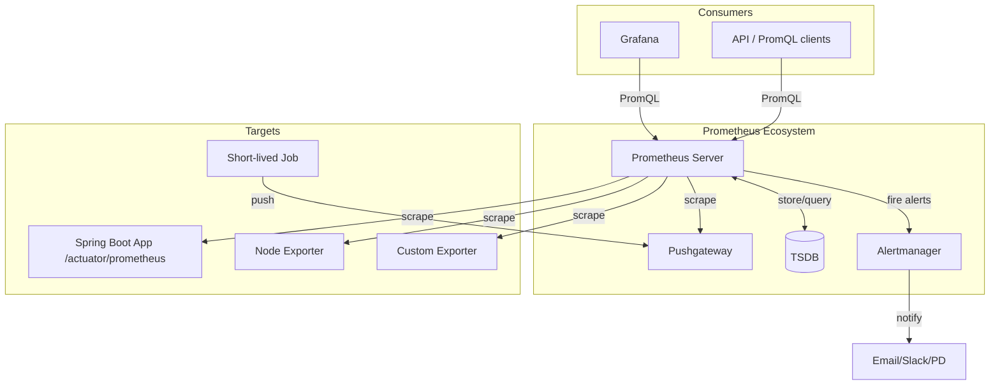
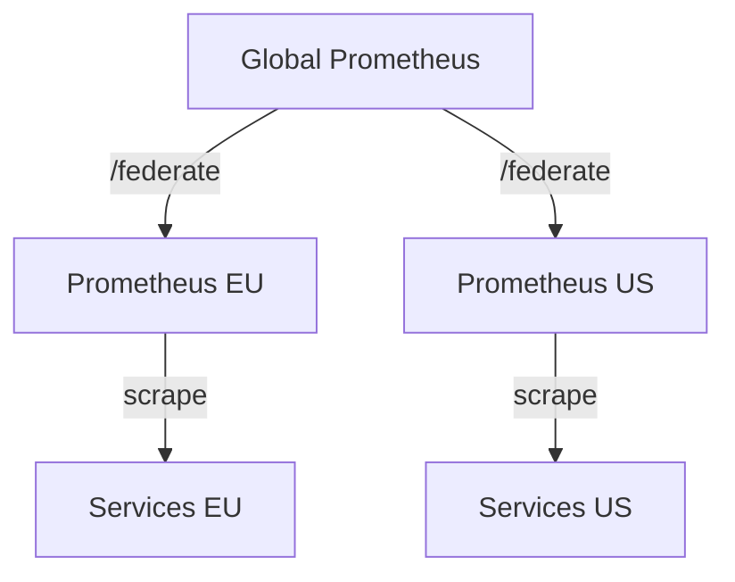

# Вопросы на собеседовании: `Prometheus` и `Grafana`

Шпаргалка охватывает архитектуру `Prometheus`, типы метрик, язык запросов `PromQL`, настройку алертов через `Alertmanager`, интеграцию с `Spring Boot` через `Micrometer`, визуализацию в `Grafana`, а также решения для долгосрочного хранения — `Thanos` и `VictoriaMetrics`.

**`Prometheus`** — система мониторинга с открытым исходным кодом, основанная на pull-модели сбора метрик и собственной TSDB. **`Grafana`** — платформа визуализации, которая подключается к `Prometheus` как источнику данных и строит дашборды.

## Полезные ссылки

### Официальная документация

- [Prometheus Documentation](https://prometheus.io/docs/) — официальная документация Prometheus
- [PromQL Reference](https://prometheus.io/docs/prometheus/latest/querying/basics/) — язык запросов PromQL
- [Grafana Documentation](https://grafana.com/docs/grafana/latest/) — документация Grafana
- [Micrometer Documentation](https://docs.micrometer.io/micrometer/reference/) — документация Micrometer
- [Grafana Loki](https://grafana.com/docs/loki/latest/) — документация Loki
- [Baeldung: Monitor a Spring Boot App Using Prometheus](https://www.baeldung.com/spring-boot-prometheus) — практическое руководство
- [Baeldung: Quick Guide to Micrometer](https://www.baeldung.com/micrometer) — основы Micrometer

## Содержание

- [Полезные ссылки](#полезные-ссылки)
- [See also](#see-also)

**Архитектура Prometheus**
- [Q1. (!) Опишите архитектуру Prometheus. Из каких компонентов она состоит?](#q1-опишите-архитектуру-prometheus-из-каких-компонентов-она-состоит)
- [Q2. Что такое TSDB в Prometheus? Как данные хранятся на диске?](#q2-что-такое-tsdb-в-prometheus-как-данные-хранятся-на-диске)
- [Q3. (!) Что такое pull-модель сбора метрик и почему Prometheus её использует?](#q3-что-такое-pull-модель-сбора-метрик-и-почему-prometheus-её-использует)
- [Q4. Что такое Pushgateway и когда его использовать?](#q4-что-такое-pushgateway-и-когда-его-использовать)
- [Q5. Что такое Alertmanager? Как он связан с Prometheus Server?](#q5-что-такое-alertmanager-как-он-связан-с-prometheus-server)

**Типы метрик**
- [Q6. (!) Какие типы метрик существуют в Prometheus? Когда какой использовать?](#q6-какие-типы-метрик-существуют-в-prometheus-когда-какой-использовать)
- [Q7. В чём разница между Histogram и Summary?](#q7-в-чём-разница-между-histogram-и-summary)
- [Q8. Как правильно назвать метрику в Prometheus? Какие конвенции именования?](#q8-как-правильно-назвать-метрику-в-prometheus-какие-конвенции-именования)

**PromQL**
- [Q9. (!) Чем отличаются функции rate() и irate()?](#q9-чем-отличаются-функции-rate-и-irate)
- [Q10. Что делает функция increase()? Когда предпочесть её rate()?](#q10-что-делает-функция-increase-когда-предпочесть-её-rate)
- [Q11. (!) Как работает histogram_quantile()? Приведите пример.](#q11-как-работает-histogram_quantile-приведите-пример)
- [Q12. Что такое label_replace() и для чего используется?](#q12-что-такое-label_replace-и-для-чего-используется)
- [Q13. Как агрегировать метрики по лейблам в PromQL?](#q13-как-агрегировать-метрики-по-лейблам-в-promql)
- [Q14. Что такое instant vector и range vector в PromQL?](#q14-что-такое-instant-vector-и-range-vector-в-promql)
- [Q15. Как вычислить процент ошибок HTTP-запросов с помощью PromQL?](#q15-как-вычислить-процент-ошибок-http-запросов-с-помощью-promql)

**Labels и Cardinality**
- [Q16. (!) Что такое high cardinality в Prometheus и почему это проблема?](#q16-что-такое-high-cardinality-в-prometheus-и-почему-это-проблема)
- [Q17. Какие лейблы не стоит добавлять в метрики?](#q17-какие-лейблы-не-стоит-добавлять-в-метрики)

**Recording rules и Alert rules**
- [Q18. (!) Что такое recording rules и зачем они нужны?](#q18-что-такое-recording-rules-и-зачем-они-нужны)
- [Q19. Как устроены alert rules в Prometheus? Что такое pending и firing?](#q19-как-устроены-alert-rules-в-prometheus-что-такое-pending-и-firing)
- [Q20. Что такое for: в alert rule? Зачем это нужно?](#q20-что-такое-for-в-alert-rule-зачем-это-нужно)

**Alertmanager**
- [Q21. (!) Как устроена маршрутизация алертов в Alertmanager?](#q21-как-устроена-маршрутизация-алертов-в-alertmanager)
- [Q22. Что такое inhibition rules в Alertmanager?](#q22-что-такое-inhibition-rules-в-alertmanager)
- [Q23. Что такое silences в Alertmanager и как их применять?](#q23-что-такое-silences-в-alertmanager-и-как-их-применять)
- [Q24. Как Alertmanager дедуплицирует и группирует алерты?](#q24-как-alertmanager-дедуплицирует-и-группирует-алерты)

**Spring Boot + Micrometer + Prometheus**
- [Q25. (!) Как подключить Prometheus к Spring Boot приложению?](#q25-как-подключить-prometheus-к-spring-boot-приложению)
- [Q26. Как создать кастомную метрику с помощью Micrometer?](#q26-как-создать-кастомную-метрику-с-помощью-micrometer)
- [Q27. Какие метрики Spring Boot экспортирует автоматически?](#q27-какие-метрики-spring-boot-экспортирует-автоматически)
- [Q28. Как добавить общие теги (common tags) ко всем метрикам приложения?](#q28-как-добавить-общие-теги-common-tags-ко-всем-метрикам-приложения)

**Grafana**
- [Q29. (!) Что такое Data Sources в Grafana? Как добавить Prometheus?](#q29-что-такое-data-sources-в-grafana-как-добавить-prometheus)
- [Q30. Что такое templating и переменные в Grafana?](#q30-что-такое-templating-и-переменные-в-grafana)
- [Q31. Чем отличаются Grafana Alerts от Alertmanager?](#q31-чем-отличаются-grafana-alerts-от-alertmanager)
- [Q32. Что такое Grafana Loki? Как он отличается от Prometheus?](#q32-что-такое-grafana-loki-как-он-отличается-от-prometheus)

**Service Discovery**
- [Q33. Какие механизмы service discovery поддерживает Prometheus?](#q33-какие-механизмы-service-discovery-поддерживает-prometheus)
- [Q34. Как работает Kubernetes service discovery в Prometheus?](#q34-как-работает-kubernetes-service-discovery-в-prometheus)

**Remote Write / Remote Read / Federation**
- [Q35. (!) Что такое Remote Write в Prometheus и зачем используется?](#q35-что-такое-remote-write-в-prometheus-и-зачем-используется)
- [Q36. Что такое Prometheus Federation?](#q36-что-такое-prometheus-federation)
- [Q37. Чем Thanos отличается от VictoriaMetrics? Когда использовать каждый?](#q37-чем-thanos-отличается-от-victoriametrics-когда-использовать-каждый)

**SLI / SLO**
- [Q38. Что такое SLI и SLO? Какие метрики обычно используются?](#q38-что-такое-sli-и-slo-какие-метрики-обычно-используются)
- [Q39. Что такое error budget и как его считать через PromQL?](#q39-что-такое-error-budget-и-как-его-считать-через-promql)

---

## Q1. Опишите архитектуру Prometheus. Из каких компонентов она состоит?

**Prometheus** — система мониторинга, построенная на pull-архитектуре. Основные компоненты:



| Компонент | Роль |
|-----------|------|
| **Prometheus Server** | Сбор метрик (scrape), хранение в TSDB, вычисление alert rules |
| **TSDB** | Встроенная time-series БД; хранит данные локально на диске |
| **Alertmanager** | Получает алерты от сервера, маршрутизирует по receivers |
| **Pushgateway** | Промежуточный буфер для short-lived jobs, которые не доживают до scrape |
| **Exporters** | Агенты-переходники для систем без нативной поддержки (Node Exporter, JMX, Redis) |

**На интервью**: подчеркни разделение ответственности — Prometheus Server только детектирует (`FIRING`), а `Alertmanager` решает, кому и как отправить уведомление.

> [!mcq]
> - [ ] Pushgateway отвечает за маршрутизацию алертов и отправку уведомлений в Slack и PagerDuty. | Pushgateway не занимается алертами — он только принимает метрики от short-lived jobs и хранит их до следующего scrape. Маршрутизацией алертов занимается Alertmanager.
> - [ ] Prometheus Server принимает алерты от Alertmanager и вычисляет их состояние (PENDING/FIRING). | Направление обратное: Prometheus Server сам вычисляет состояние alert rules и отправляет firing-алерты в Alertmanager, а не наоборот.
> - [x] Prometheus Server вычисляет alert rules и отправляет firing-алерты в Alertmanager, который маршрутизирует уведомления. | Это корректное разделение ответственности. Prometheus Server оценивает PromQL-выражения правил, определяет состояние FIRING/PENDING и отправляет алерты в Alertmanager по HTTP. Alertmanager дедуплицирует, группирует и направляет уведомления в нужные каналы.
> - [ ] Exporters отвечают за запуск alert rules и отправку уведомлений напрямую в Slack при превышении порогов. | Exporters только переводят метрики систем в формат Prometheus — они не содержат логики алертинга. Alert rules живут исключительно в Prometheus Server.

---

## Q2. Что такое TSDB в Prometheus? Как данные хранятся на диске?

**TSDB (Time Series Database)** — встроенное хранилище `Prometheus`, оптимизированное для записи и чтения временных рядов.

**Структура на диске:**

```
data/
├── 01BKGV7JC0RY8A6FHJF7H6Q68R/   ← Block (2-часовой блок)
│   ├── chunks/
│   │   └── 000001                 ← сжатые данные сэмплов
│   ├── index                      ← индекс лейблов → временные ряды
│   ├── meta.json
│   └── tombstones
├── chunks_head/                   ← текущие данные в памяти (WAL)
└── wal/                           ← Write-Ahead Log
```

**Ключевые особенности:**
- Данные делятся на **блоки** (~2 часа по умолчанию)
- Последние ~2 часа хранятся в памяти (head block) + WAL для durability
- Старые блоки **compaction** — слияние и сжатие в более крупные блоки
- Сжатие применяет алгоритм Gorilla (double-delta для timestamps, XOR для float64 значений)
- По умолчанию данные хранятся **15 дней** (`--storage.tsdb.retention.time`)

> [!mcq]
> - [ ] Данные в TSDB хранятся в одном большом файле и сжимаются алгоритмом LZ4 поверх float64 значений. | Prometheus TSDB использует блочную структуру с 2-часовыми блоками, а не один файл. Сжатие применяет алгоритм Gorilla (double-delta для timestamps, XOR для float64), а не LZ4.
> - [x] TSDB хранит данные в 2-часовых блоках на диске, последние ~2 часа — в памяти (head block) + WAL для durability, старые блоки периодически уплотняются (compaction). | Это точное описание архитектуры TSDB Prometheus. Блочная структура обеспечивает эффективную запись и чтение, WAL защищает от потери данных при сбое, а compaction объединяет мелкие блоки в более крупные для экономии ресурсов.
> - [ ] TSDB хранит все данные в памяти и периодически сбрасывает снапшоты на диск без использования WAL. | Этот подход без WAL не обеспечивает durability при сбоях. В Prometheus Write-Ahead Log используется именно для того, чтобы данные не терялись при неожиданном завершении процесса.
> - [ ] Данные в TSDB хранятся в 24-часовых блоках, а compaction не применяется — блоки только накапливаются до достижения retention limit. | Базовый размер блока — ~2 часа, а не 24. Compaction — обязательная часть архитектуры TSDB: без него диск быстро заполнялся бы огромным количеством мелких блоков.

---

## Q3. (!) Что такое pull-модель сбора метрик и почему Prometheus её использует?

**Pull-модель** означает, что `Prometheus Server` сам периодически опрашивает (`scrapes`) таргеты по HTTP, а не таргеты отправляют данные серверу.

**Преимущества pull:**
- `Prometheus` контролирует нагрузку — сам решает как часто scrape
- Легко определить, что таргет недоступен (метрика `up == 0`)
- Упрощённое service discovery — нужно только знать адрес
- Конфигурация централизована на стороне `Prometheus`
- Не нужно настраивать firewall rules для входящего трафика на каждом таргете

**Когда push всё же нужен:**
- Short-lived jobs (batch, cron) — не доживают до следующего scrape → используют `Pushgateway`
- Ситуации с NAT/firewall, когда `Prometheus` не может достучаться до таргета напрямую

**Сравнение:**

| | Pull | Push |
|-|------|------|
| Нагрузка | Контролируется Prometheus | Контролируется таргетом |
| Доступность | up/down автоматически | Нужен heartbeat |
| Масштаб | Узкое место — Prometheus | Сервер может быть перегружен |
| Firewall | Prometheus → таргет | Таргет → сервер |

> [!mcq]
> - [ ] Pull-модель означает, что таргеты сами периодически отправляют метрики в Prometheus по расписанию. | Это описание push-модели. В pull-модели всё наоборот: Prometheus Server инициирует HTTP-запросы к таргетам, а не таргеты отправляют данные серверу.
> - [ ] Pull-модель неудобна тем, что Prometheus не может автоматически определить недоступность таргета. | Это неверно. Одно из ключевых преимуществ pull-модели — автоматическое обнаружение недоступности: если scrape не удаётся, метрика `up` принимает значение 0, что сигнализирует о проблеме.
> - [x] В pull-модели Prometheus Server сам периодически опрашивает таргеты по HTTP и контролирует частоту и нагрузку на стороне сервера, а не на стороне таргетов. | Именно так работает pull-модель Prometheus. Сервер централизованно управляет расписанием scrape, что упрощает контроль нагрузки, обнаружение недоступности через `up == 0` и централизованную конфигурацию.
> - [ ] Prometheus использует pull-модель, потому что push-модель технически невозможна в современных облачных средах. | Это неверно: push-модель технически вполне реализуема (например, Pushgateway как раз принимает push). Prometheus выбирает pull из архитектурных соображений, а не из-за технических ограничений.

---

## Q4. Что такое Pushgateway и когда его использовать?

**Pushgateway** — промежуточный компонент, который принимает метрики по HTTP push от short-lived jobs и хранит их до следующего scrape от `Prometheus Server`.

**Сценарии использования:**
- Cron jobs, batch jobs, CI/CD pipelines — завершаются быстрее, чем scrape interval
- Тесты производительности — нужно записать результат разово

**Пример отправки метрики через Pushgateway:**
```bash
echo "batch_job_duration_seconds 120.5" | curl --data-binary @- \
  http://pushgateway:9091/metrics/job/batch_import/instance/server01
```

**Важные ограничения:**
- `Pushgateway` НЕ рекомендуется как единственный способ сбора метрик из long-running сервисов
- Метрика живёт в Pushgateway навсегда, пока не удалена явно — нет автоматического TTL
- Не подходит для горизонтально масштабированных сервисов (несколько инстансов перезапишут друг друга)

> [!mcq]
> - [x] Pushgateway используется для short-lived jobs (cron, batch), которые завершаются быстрее, чем scrape interval, и принимает метрики по HTTP push. | Это основной корректный сценарий: короткоживущие задачи не успевают быть scraped, поэтому отдают метрики в Pushgateway, а Prometheus уже забирает их оттуда по pull. Для long-running сервисов Pushgateway не рекомендуется.
> - [ ] Pushgateway используется как основной способ сбора метрик со всех long-running сервисов вместо scrape. | Это антипаттерн: Pushgateway не предназначен для long-running сервисов — у него нет автоматического TTL, метрики живут пока не удалены явно, что ломает модель Prometheus.
> - [ ] Pushgateway используется для дедупликации и маршрутизации алертов из нескольких Prometheus Server-ов. | Дедупликация и маршрутизация алертов — это задача Alertmanager, а не Pushgateway. Pushgateway работает только с метриками.
> - [ ] Pushgateway используется для долгосрочного хранения метрик и replace TSDB Prometheus. | Долгосрочное хранение решают Thanos, VictoriaMetrics, Cortex, Mimir — не Pushgateway. Pushgateway — это буфер для короткоживущих задач, а не storage.

---

## Q5. Что такое Alertmanager? Как он связан с Prometheus Server?

**Alertmanager** — отдельный компонент, отвечающий за управление алертами: дедупликацию, группировку, маршрутизацию и отправку уведомлений.

**Разделение ответственности:**
- `Prometheus Server` — **вычисляет** alert rules и определяет состояние `FIRING`/`PENDING`
- `Alertmanager` — **управляет** что делать с firing-алертами (кому, когда, как уведомить)

**Поток алерта:**
```
Prometheus Server
  → evaluates PromQL rule
  → state becomes FIRING
  → sends alert to Alertmanager via HTTP POST /api/v2/alerts
  → Alertmanager deduplicates, groups, routes
  → sends notification (email/Slack/PagerDuty/etc.)
```

Один `Alertmanager` может принимать алерты от нескольких `Prometheus Server`-ов.

> [!mcq]
> - [ ] Alertmanager вычисляет alert rules и определяет состояние FIRING/PENDING. | Это ответственность Prometheus Server, а не Alertmanager. Alertmanager получает уже готовые firing-алерты и решает, что с ними делать дальше.
> - [ ] Alertmanager отправляет алерты в Prometheus Server по HTTP POST для их обработки. | Направление потока обратное: это Prometheus Server отправляет firing-алерты в Alertmanager через `POST /api/v2/alerts`.
> - [x] Alertmanager принимает firing-алерты от Prometheus Server, дедуплицирует, группирует, маршрутизирует их и отправляет уведомления по нужным каналам (email/Slack/PagerDuty). | Это точное описание ответственности Alertmanager: Prometheus Server оценивает правила и отправляет алерты, а Alertmanager управляет дальнейшей судьбой уведомления.
> - [ ] Alertmanager хранит временные ряды и выполняет PromQL-запросы для вычисления алертов. | Хранением временных рядов занимается TSDB в Prometheus Server, а PromQL выполняет Prometheus Server. Alertmanager вообще не работает с временными рядами.

---

## Q6. (!) Какие типы метрик существуют в Prometheus? Когда какой использовать?

`Prometheus` поддерживает 4 типа метрик:

| Тип | Описание | Когда использовать |
|-----|----------|--------------------|
| **Counter** | Монотонно возрастающий счётчик, сбрасывается при рестарте | Число запросов, ошибок, обработанных событий |
| **Gauge** | Произвольное значение, может расти и падать | CPU, память, температура, число соединений |
| **Histogram** | Распределение значений по бакетам + sum + count | Время ответа, размер запроса/ответа |
| **Summary** | Квантили, вычисленные на стороне клиента + sum + count | Когда нужны точные квантили, но без агрегации |

**Counter:**
```java
// Micrometer
Counter requestCounter = Counter.builder("http_requests_total")
    .tag("method", "GET")
    .tag("status", "200")
    .register(meterRegistry);
requestCounter.increment();
```

**Gauge:**
```java
Gauge.builder("queue_size", queue, Queue::size)
    .register(meterRegistry);
```

**Histogram (Timer в Micrometer):**
```java
Timer timer = Timer.builder("http_request_duration_seconds")
    .publishPercentileHistogram()  // для histogram_quantile в PromQL
    .register(meterRegistry);
timer.record(() -> handleRequest());
```

**Правило выбора**: если значение только растёт → `Counter`; если может убывать → `Gauge`; если нужно распределение → `Histogram`/`Summary`.

> [!mcq]
> - [ ] Для метрики "число активных соединений к БД, которое может расти и падать" правильный тип — Counter. | Counter — только для монотонно растущих значений. Число соединений может уменьшаться (освобождаться), поэтому подходит Gauge.
> - [ ] Для метрики "число активных соединений к БД, которое может расти и падать" правильный тип — Histogram. | Histogram нужен для распределения значений по бакетам (например, latency). Для одного текущего числа соединений достаточно Gauge.
> - [x] Для метрики "число активных соединений к БД, которое может расти и падать" правильный тип — Gauge. | Именно Gauge предназначен для значений, которые могут и расти, и убывать (память, CPU, размер очереди, число активных соединений). Counter тут непригоден, так как не поддерживает уменьшение.
> - [ ] Для метрики "число активных соединений к БД, которое может расти и падать" правильный тип — Summary. | Summary нужен для клиентских квантилей распределения (например, времени ответа). Для одного текущего значения (число активных соединений) это избыточно и неправильно.

---

## Q7. В чём разница между Histogram и Summary?

| | Histogram | Summary |
|-|-----------|---------|
| Квантили | Вычисляются в PromQL на стороне сервера | Вычисляются на стороне клиента |
| Агрегация | Можно агрегировать по нескольким инстансам | Нельзя агрегировать (квантили не суммируются) |
| Накладные расходы | На сервере (PromQL) | На клиенте (CPU приложения) |
| Точность | Зависит от конфигурации бакетов | Точная, но только для одного инстанса |
| Бакеты | Предопределены заранее | Не требуются |

**Histogram** экспортирует:
- `http_request_duration_seconds_bucket{le="0.1"}` — число запросов <= 0.1s
- `http_request_duration_seconds_sum`
- `http_request_duration_seconds_count`

**Summary** экспортирует:
- `http_request_duration_seconds{quantile="0.99"}` — P99 на клиенте
- `http_request_duration_seconds_sum`
- `http_request_duration_seconds_count`

**Рекомендация**: в современных системах предпочитают `Histogram` + `histogram_quantile()` в `PromQL`, так как позволяет агрегировать данные по нескольким инстансам.

> [!mcq]
> - [x] Histogram вычисляет квантили на стороне сервера (PromQL) и позволяет агрегировать данные по нескольким инстансам, тогда как Summary вычисляет квантили на стороне клиента и не агрегируется. | Это ключевое различие: в Histogram бакеты хранятся отдельно и PromQL может агрегировать их через histogram_quantile(), а у Summary уже готовые квантили "поджёваны" на клиенте и математически не суммируются между инстансами.
> - [ ] Histogram вычисляет квантили на стороне клиента и агрегируется между инстансами, а Summary — на стороне сервера и не агрегируется. | Смешаны определения: именно Summary считает на клиенте, а Histogram — на сервере через histogram_quantile(). И свойство агрегации у Histogram, а не у Summary.
> - [ ] Histogram не поддерживает _sum и _count, поэтому не подходит для расчёта среднего значения. | Histogram экспортирует и _bucket, и _sum, и _count. Поэтому среднее (sum/count) считается прекрасно — это стандартный паттерн.
> - [ ] Summary всегда точнее Histogram, даже при агрегации по нескольким инстансам. | Quantile математически не суммируется, поэтому при агрегации Summary даёт неверные результаты. Histogram в таком сценарии точнее, потому что агрегирует бакеты, а квантиль считает поверх суммы.

---

## Q8. Как правильно назвать метрику в Prometheus? Какие конвенции именования?

**Правила именования:**
1. Формат: `<namespace>_<subsystem>_<name>_<unit>` в `snake_case`
2. Суффикс обозначает единицу измерения в базовых единицах СИ: `_seconds`, `_bytes`, `_total`
3. `Counter` всегда заканчивается на `_total`
4. Не дублировать единицы в имени (`request_duration_seconds_total` — плохо)

**Примеры:**
```
http_requests_total              # counter: общее число HTTP-запросов
http_request_duration_seconds    # histogram: длительность в секундах
process_resident_memory_bytes    # gauge: память в байтах
jvm_gc_pause_seconds_total       # counter sum: суммарное время GC
kafka_consumer_lag               # gauge: отставание консьюмера
```

**Плохие примеры:**
```
requestCount        # нет namespace, нет единиц
http_request_ms     # нестандартная единица (ms вместо seconds)
user_id_total       # лейбл в имени метрики
```

> [!mcq]
> - [ ] Правильное имя для метрики длительности HTTP-запросов — `http_request_ms` в camelCase. | Нарушены две конвенции: единица не в базовых единицах СИ (должны быть `_seconds`, а не `_ms`), и имя должно быть в snake_case, а не camelCase.
> - [ ] Правильное имя для метрики длительности HTTP-запросов — `http_request_duration_seconds_total`. | `_total` — это суффикс Counter, а длительность — это Histogram/Summary. Дублирование единицы и неверный суффикс типа метрики — ошибка.
> - [x] Правильное имя для метрики длительности HTTP-запросов — `http_request_duration_seconds` в snake_case с единицей в секундах. | Это соответствует всем конвенциям Prometheus: snake_case, единица измерения в базовых единицах СИ (`_seconds`), нет `_total` (так как это Histogram, а не Counter).
> - [ ] Правильное имя для метрики длительности HTTP-запросов — `httpRequestDurationSeconds` в camelCase. | Prometheus требует snake_case, а не camelCase. Формат имени — `<namespace>_<subsystem>_<name>_<unit>`.

---

## Q9. (!) Чем отличаются функции rate() и irate()?

Обе функции вычисляют скорость изменения `Counter` в секунду, но по-разному.

| | `rate()` | `irate()` |
|-|----------|-----------|
| Алгоритм | Средняя скорость за весь range | Мгновенная скорость по последним 2 точкам |
| Сглаживание | Сильное (устойчив к выбросам) | Отсутствует (реагирует на спайки) |
| Применение | Дашборды, алертинг | Отладка, real-time метрики |
| Рекомендация | Большинство случаев | Только для диагностики |

```promql
# Среднее число запросов в секунду за последние 5 минут
rate(http_requests_total[5m])

# Мгновенная скорость (последние 2 точки)
irate(http_requests_total[5m])
```

**Важно**: `irate()` нельзя использовать в alert rules — слишком нестабилен, вызывает ложные срабатывания. Для алертов всегда используй `rate()` с достаточным window (минимум 5m).

> [!mcq]
> - [ ] `irate()` вычисляет среднюю скорость изменения counter за весь range и хорошо подходит для alert rules. | Это описание `rate()`, а не `irate()`. И именно `irate()` нельзя использовать в alert rules из-за нестабильности.
> - [x] `rate()` вычисляет среднюю скорость изменения counter за весь range (сглаживает), а `irate()` — мгновенную скорость по последним двум точкам. | Это ключевое различие: `rate()` усредняет по всему окну и устойчив к выбросам, поэтому подходит для дашбордов и алертов. `irate()` реагирует на последние изменения и полезен для real-time отладки.
> - [ ] `rate()` и `irate()` работают одинаково, отличие только в синтаксисе имени. | Функции дают разные значения: одна усредняет по окну, другая считает по двум последним точкам. Для алертов это критично — `irate()` склонен к ложным срабатываниям.
> - [ ] `rate()` вычисляет мгновенную скорость по последним двум точкам, а `irate()` — среднюю за range. | Определения перепутаны: на самом деле `rate()` усредняет по окну, а `irate()` — это "instantaneous rate" по двум последним точкам.

---

## Q10. Что делает функция increase()? Когда предпочесть её rate()?

`increase(v[d])` — возвращает абсолютный прирост `Counter` за период `d`.

```promql
# Сколько запросов было за последний час
increase(http_requests_total[1h])

# Эквивалентно rate * seconds:
rate(http_requests_total[1h]) * 3600
```

**Когда использовать `increase()` вместо `rate()`:**
- Когда нужно **абсолютное число событий** (не скорость): "сколько ошибок за сутки"
- В отчётах и SLO-расчётах
- Для заголовков дашборда типа "Всего запросов за час: 12 345"

**Нюанс**: `increase()` экстраполирует значения, поэтому может возвращать нецелые числа.

> [!mcq]
> - [ ] `increase(v[d])` возвращает скорость изменения counter в секунду за период `d`. | Это описание `rate()`. `increase()` возвращает абсолютный прирост за период, а не скорость.
> - [ ] `increase(v[d])` возвращает мгновенную скорость counter по последним двум точкам за период `d`. | Это описание `irate()`. `increase()` — про абсолютный прирост за период, а не про мгновенную скорость.
> - [x] `increase(v[d])` возвращает абсолютный прирост counter за период `d` и полезен для отчётов вида "всего X событий за период". | Это точное определение: `increase` даёт приращение (эквивалентно `rate * seconds`), что удобно в дашбордах-summary и SLO-расчётах, где нужна именно суммарная цифра событий.
> - [ ] `increase(v[d])` возвращает текущее значение counter на момент окончания периода `d`. | Текущее значение метрики получается через instant vector `metric_name`, а не через `increase`. `increase` считает прирост, а не текущее значение.

---

## Q11. (!) Как работает histogram_quantile()? Приведите пример.

`histogram_quantile(φ, b)` вычисляет квантиль φ (от 0 до 1) из гистограммы `b`.

**Как работает:**
1. Принимает вектор с метриками типа `_bucket`
2. Выполняет линейную интерполяцию внутри бакета, в котором находится квантиль
3. Возвращает аппроксимированное значение

**Пример — P99 latency:**
```promql
histogram_quantile(
  0.99,
  rate(http_request_duration_seconds_bucket[5m])
)
```

**P99 latency по сервисам:**
```promql
histogram_quantile(
  0.99,
  sum by (service, le) (
    rate(http_request_duration_seconds_bucket[5m])
  )
)
```

**Важные нюансы:**
- Нужно применять `rate()` к `_bucket` перед `histogram_quantile()`
- Чем лучше подобраны бакеты, тем точнее результат
- Стандартные бакеты в `Micrometer`: `.005, .01, .025, .05, .1, .25, .5, 1, 2.5, 5, 10` секунд
- Значение `le="+Inf"` всегда равно `_count`

> [!mcq]
> - [x] `histogram_quantile(0.99, rate(http_request_duration_seconds_bucket[5m]))` — правильный способ вычислить P99 latency из Histogram. | Это стандартный и корректный паттерн: применяем `rate()` к `_bucket`, затем `histogram_quantile` выполняет линейную интерполяцию внутри бакета. Точность зависит от подбора бакетов.
> - [ ] `histogram_quantile(0.99, http_request_duration_seconds_bucket[5m])` — правильный способ вычислить P99 latency из Histogram. | Не хватает `rate()` вокруг range vector. `histogram_quantile` ожидает instant vector с бакетами из `rate()`, иначе запрос просто не выполнится.
> - [ ] `histogram_quantile(0.99, rate(http_request_duration_seconds_count[5m]))` — правильный способ вычислить P99 latency из Histogram. | `histogram_quantile` должна работать с `_bucket` метриками, а не с `_count`. `_count` — это просто число наблюдений, а не бакеты.
> - [ ] `histogram_quantile(0.99, rate(http_request_duration_seconds_sum[5m]))` — правильный способ вычислить P99 latency из Histogram. | `_sum` — это общая сумма значений, а не бакеты. `histogram_quantile` требует `_bucket`-метрики с лейблом `le`.

---

## Q12. Что такое label_replace() и для чего используется?

`label_replace()` — функция для манипуляции лейблами: создание нового лейбла или изменение существующего с помощью regex.

**Синтаксис:**
```promql
label_replace(v, dst_label, replacement, src_label, regex)
```

**Пример — извлечь имя сервиса из namespace:**
```promql
label_replace(
  up,
  "short_name",      -- новый лейбл
  "$1",              -- значение: первая группа regex
  "job",             -- источник
  "(.+)-service"     -- regex
)
```

**Применение:**
- Нормализация лейблов из разных источников
- Создание "удобных" лейблов для отображения в Grafana
- Извлечение части строки (hostname, namespace) в отдельный лейбл

> [!mcq]
> - [ ] `label_replace()` используется для изменения имени метрики (metric name) на основе regex. | `label_replace` работает только с лейблами, а не с именем метрики. Для переименования метрики используется recording rule.
> - [x] `label_replace()` создаёт новый лейбл или изменяет существующий с помощью regex-извлечения значения из другого лейбла. | Это точное описание функции: синтаксис `label_replace(v, dst_label, replacement, src_label, regex)` позволяет взять значение `src_label`, применить regex и поместить результат в `dst_label`.
> - [ ] `label_replace()` удаляет лейбл из метрики по имени. | Для удаления лейбла используется `sum without (label)`. `label_replace` добавляет или изменяет лейбл, но не удаляет его.
> - [ ] `label_replace()` заменяет значение лейбла фиксированной константой без regex. | Replacement в `label_replace` использует regex-группы (`$1`, `$2`), а не просто константы. Это инструмент именно для regex-преобразований.

---

## Q13. Как агрегировать метрики по лейблам в PromQL?

`PromQL` поддерживает агрегирующие операторы: `sum`, `avg`, `min`, `max`, `count`, `topk`, `bottomk`, `stddev`.

**Ключевые слова:**
- `by (label1, label2)` — агрегировать, сохранив только указанные лейблы
- `without (label1)` — агрегировать, убрав указанные лейблы

```promql
# Суммарный RPS по всем инстансам, сгруппированный по сервису
sum by (service) (rate(http_requests_total[5m]))

# Максимальный heap по всем podам
max without (pod) (jvm_memory_used_bytes{area="heap"})

# Топ 5 эндпоинтов по числу запросов
topk(5, sum by (path) (rate(http_requests_total[5m])))

# Процент ошибок по сервису
sum by (service) (rate(http_requests_total{status=~"5.."}[5m]))
/
sum by (service) (rate(http_requests_total[5m]))
* 100
```

> [!mcq]
> - [ ] `by (label1)` убирает указанные лейблы, а `without (label1)` оставляет только их. | Смысл перепутан: `by` оставляет только указанные лейблы, а `without` убирает указанные (и оставляет остальные).
> - [x] `by (label1)` оставляет только указанные лейблы после агрегации, а `without (label1)` убирает указанные и оставляет все остальные. | Это корректное определение. `sum by (service)` даёт суммарное значение, сгруппированное только по `service`, а `sum without (pod)` — по всем лейблам, кроме `pod`.
> - [ ] `by (label1)` и `without (label1)` делают одно и то же, это синонимы. | Это противоположные операторы группировки. Использование одного вместо другого даёт совершенно другой результат агрегации.
> - [ ] `by (label1)` применяется только к Counter, а `without (label1)` — только к Gauge. | Оба оператора работают с любыми типами метрик; тип метрики не влияет на выбор `by`/`without`.

---

## Q14. Что такое instant vector и range vector в PromQL?

| | Instant vector | Range vector |
|-|----------------|--------------|
| Синтаксис | `metric_name{labels}` | `metric_name{labels}[5m]` |
| Результат | Одно значение на каждый time series на момент t | Набор значений за период [d] |
| Применение | Арифметика, сравнения | Ввод для rate(), increase(), delta() |

```promql
# Instant vector — текущее значение
http_requests_total{job="api"}

# Range vector — значения за 5 минут (только как аргумент функции)
rate(http_requests_total{job="api"}[5m])
```

**Range vector нельзя использовать напрямую** — только как аргумент функций (`rate`, `irate`, `increase`, `delta`, `deriv`, `predict_linear`, `resets`).

> [!mcq]
> - [ ] `http_requests_total{job="api"}` — это range vector за период по умолчанию. | Это instant vector. Range vector всегда имеет `[duration]` в конце (например, `[5m]`), а без него — instant.
> - [ ] `http_requests_total{job="api"}[5m]` — это instant vector с одним значением. | Указание `[5m]` делает выражение range vector — набор значений за период, а не одно значение.
> - [x] `http_requests_total{job="api"}[5m]` — это range vector и может использоваться только как аргумент функций вроде `rate()`, `increase()`, `delta()`. | Range vector нельзя отобразить напрямую в графике или использовать в арифметике — только внутри функций, которые сводят его к instant vector (например, `rate()`).
> - [ ] `http_requests_total{job="api"}[5m]` можно использовать в арифметике напрямую: `http_requests_total[5m] / 100`. | Range vector нельзя участвовать в арифметике. Сначала его нужно свернуть функцией (например, `rate()`), а уже результат — делить.

---

## Q15. Как вычислить процент ошибок HTTP-запросов с помощью PromQL?

**Процент 5xx ошибок:**
```promql
100 * (
  sum(rate(http_requests_total{status=~"5.."}[5m]))
  /
  sum(rate(http_requests_total[5m]))
)
```

**Error rate по сервисам:**
```promql
100 * sum by (service) (
  rate(http_server_requests_seconds_count{status=~"5.."}[5m])
)
/ sum by (service) (
  rate(http_server_requests_seconds_count[5m])
)
```

**Метрика для SLO (availability):**
```promql
# Доступность = (1 - error_rate) за 30 дней
1 - (
  sum(increase(http_requests_total{status=~"5.."}[30d]))
  /
  sum(increase(http_requests_total[30d]))
)
```

> [!mcq]
> - [x] Процент 5xx ошибок считается как `sum(rate(http_requests_total{status=~"5.."}[5m])) / sum(rate(http_requests_total[5m])) * 100`. | Это классический паттерн: rate считаем отдельно для числителя (ошибки 5xx) и знаменателя (все запросы), затем делим. Важно одинаковое окно `[5m]` с обеих сторон.
> - [ ] Процент 5xx ошибок считается как `rate(http_requests_total{status=~"5.."}[5m]) / 100`. | Это неправильно: мы делим только на 100, а не на общее число запросов. Получится бессмысленная величина, а не процент.
> - [ ] Процент 5xx ошибок считается как `increase(http_requests_total{status=~"5.."}[5m]) - increase(http_requests_total[5m])`. | Это разность, а не процент — и она будет отрицательной (ошибки — подмножество всех запросов). Процент требует деления, а не вычитания.
> - [ ] Процент 5xx ошибок считается как `count(http_requests_total{status=~"5.."}) * 100`. | `count()` считает число временных рядов, а не число запросов. Для процента ошибок нужны `rate()` по числу событий и деление на общий rate.

---

## Q16. (!) Что такое high cardinality в Prometheus и почему это проблема?

**Cardinality (мощность)** — количество уникальных комбинаций лейблов для одной метрики.

Метрика с лейблами `{method, path, status}`, где `path` принимает 10 000 уникальных значений, создаст **10 000 временных рядов**.

**Почему это проблема:**
- Каждый уникальный time series требует памяти в TSDB
- Растёт размер индекса → медленнее запросы
- Scrape становится дольше
- Больше данных для `Prometheus Server` → OOM, нестабильность

**Типичные источники high cardinality (запрещено использовать как лейблы):**
```
user_id, request_id, session_id,
email, IP-адрес, UUID,
timestamp, version (если много релизов)
```

**Допустимые лейблы** (ограниченное множество значений):
```
method (GET/POST/...), status (200/400/500),
environment (dev/staging/prod), region (eu/us),
service, job, instance
```

> [!mcq]
> - [ ] High cardinality — это хорошо, потому что даёт максимум деталей для анализа и не влияет на производительность. | Cardinality напрямую влияет на потребление памяти, размер индекса и скорость запросов. Бесконтрольный рост cardinality приводит к OOM Prometheus Server.
> - [x] High cardinality — большое число уникальных комбинаций лейблов одной метрики, что приводит к росту потребления памяти, увеличению индекса и замедлению запросов вплоть до OOM. | Каждая уникальная комбинация лейблов создаёт отдельный time series. Если `path` принимает 10 000 значений, получаем 10 000 рядов — и всё это хранится в памяти TSDB, увеличивая нагрузку.
> - [ ] High cardinality означает высокую частоту scrape (например, каждую секунду) и решается уменьшением scrape_interval. | Это про частоту scrape, а не про cardinality. Cardinality — про число уникальных комбинаций лейблов, и решается она нормализацией лейблов, а не изменением scrape_interval.
> - [ ] High cardinality означает, что метрика имеет тип Histogram с большим числом бакетов, и решается переходом на Summary. | Число бакетов у Histogram даёт небольшой вклад, но основная проблема cardinality — лейблы с неограниченным множеством значений (user_id, request_id). Переход на Summary тут не поможет.

---

## Q17. Какие лейблы не стоит добавлять в метрики?

**Правило**: никогда не используй как лейбл значения с неограниченным или очень большим множеством значений.

**Нельзя:**
```
user_id="user-12345"        # миллионы пользователей
request_id="abc-def-123"    # уникален для каждого запроса
url="/api/users/12345"      # ID в URL → тысячи вариантов
```

**Можно (нормализуй):**
```
endpoint="/api/users/{id}"  # шаблон вместо реального ID
status="404"                # конечное множество
method="GET"                # конечное множество
```

**Как проверить cardinality:**
```promql
# Топ метрик по числу уникальных time series
topk(10, count by (__name__)({__name__=~".+"}))
```

> [!mcq]
> - [x] В метрики нельзя добавлять лейблы с неограниченным множеством значений, такие как `user_id`, `request_id`, `email`, IP-адрес, UUID. | Эти значения уникальны почти для каждого запроса, что приводит к взрыву cardinality. Для таких данных используют логи или трейсы, а не метрики.
> - [ ] В метрики нельзя добавлять лейблы с конечным множеством значений, такие как `status`, `method`, `environment`. | Это как раз допустимые лейблы: их множество значений ограничено (несколько десятков максимум), что даёт контролируемую cardinality.
> - [ ] В метрики можно добавлять любые лейблы, Prometheus эффективно справляется с миллионами уникальных комбинаций. | Prometheus хранит данные в памяти и ограничен объёмом ОЗУ. Миллионы уникальных рядов почти гарантированно приведут к OOM.
> - [ ] Метрики должны содержать как можно больше уникальных лейблов для максимальной детализации. | Это противоречит best practices Prometheus. Чем больше уникальных лейблов, тем хуже производительность и стабильность; нужна нормализация (например, шаблоны URL вместо конкретных ID).

---

## Q18. (!) Что такое recording rules и зачем они нужны?

**Recording rules** — предвычисленные PromQL-выражения, результат которых сохраняется как новая метрика в TSDB.

**Зачем:**
- Ускорение дашбордов — сложные запросы уже вычислены
- Уменьшение нагрузки — запрос выполняется раз в `evaluation_interval`, а не при каждом открытии дашборда
- Нормализация имён для удобства
- Повторное использование в нескольких alert rules

**Пример конфигурации:**
```yaml
groups:
  - name: api_recording_rules
    interval: 30s
    rules:
      # Предвычисленный RPS по сервису
      - record: job:http_requests:rate5m
        expr: sum by (job) (rate(http_requests_total[5m]))

      # P99 latency по сервису
      - record: job:http_request_duration_p99:rate5m
        expr: |
          histogram_quantile(0.99,
            sum by (job, le) (
              rate(http_request_duration_seconds_bucket[5m])
            )
          )
```

**Конвенция именования**: `<level>:<metric>:<operation>`
- `job:http_requests:rate5m` → уровень aggregation = `job`, метрика = `http_requests`, операция = `rate5m`

> [!mcq]
> - [ ] Recording rules — это способ задать пороги алертинга в Prometheus и отправить их в Alertmanager. | Это описание alert rules, а не recording rules. Recording rules не отправляют алерты, они сохраняют результат PromQL как новую метрику.
> - [x] Recording rules — предвычисленные PromQL-выражения, результат которых сохраняется как новая метрика в TSDB, что ускоряет дашборды и переиспользуется в alert rules. | Это точное определение: тяжёлые запросы вычисляются один раз в `evaluation_interval` и сохраняются как готовая метрика, которую можно быстро читать из Grafana или использовать в alert rules.
> - [ ] Recording rules — это способ записи логов приложения в TSDB Prometheus вместе с метриками. | Prometheus не работает с логами — только с метриками (числовыми временными рядами). Для логов используют Loki/ELK.
> - [ ] Recording rules — настройка частоты scrape для конкретных таргетов. | Частота scrape настраивается через `scrape_interval` в scrape_configs, а не через recording rules. Recording rules — про вычисления, а не про сбор.

---

## Q19. Как устроены alert rules в Prometheus? Что такое pending и firing?

**Alert rule** — PromQL-выражение, при истинности которого (`> 0`) генерируется алерт.

**Состояния алерта:**
- `inactive` — условие ложно
- `pending` — условие истинно, но не прошёл `for:` период
- `firing` — условие истинно дольше `for:` → отправлен в `Alertmanager`

**Пример:**
```yaml
groups:
  - name: api_alerts
    rules:
      - alert: HighErrorRate
        expr: |
          sum(rate(http_requests_total{status=~"5.."}[5m]))
          /
          sum(rate(http_requests_total[5m])) > 0.05
        for: 5m
        labels:
          severity: critical
          team: backend
        annotations:
          summary: "High error rate on {{ $labels.job }}"
          description: "Error rate is {{ $value | humanizePercentage }}"
```

> [!mcq]
> - [ ] Алерт сразу переходит из `inactive` в `firing`, а состояния `pending` не существует. | Состояние `pending` существует и используется, когда условие истинно, но не выдержало период `for:`. Без `pending` фильтрация спайков была бы невозможна.
> - [x] Алерт проходит стадии `inactive` → `pending` (условие истинно, но не прошёл `for:`) → `firing` (условие истинно дольше `for:`, отправляется в Alertmanager). | Это корректная последовательность состояний: `pending` нужен для устранения ложных срабатываний от кратковременных спайков, а `firing` — это уже готовый к отправке алерт.
> - [ ] Алерт проходит стадии `firing` → `pending` → `inactive` — сначала отправляется, потом проверяется условие. | Направление потока обратное. Сначала проверяется условие, затем (при соблюдении `for:`) состояние становится `firing` и только потом отправляется уведомление.
> - [ ] Алерт переходит из `inactive` в `firing` только по решению оператора, автоматического перехода нет. | Prometheus автоматически управляет состояниями alert-а на основе результата PromQL и `for:`. Ручное вмешательство не требуется.

---

## Q20. Что такое for: в alert rule? Зачем это нужно?

`for:` — задержка перед переходом алерта из `pending` в `firing`. Условие должно быть истинным **непрерывно** в течение этого периода.

**Зачем:**
- Фильтрация кратковременных спайков — избегаем ложных срабатываний
- Snooze для временных аномалий

**Рекомендации:**
- Для критичных алертов: `for: 2m` — `5m`
- Для предупреждений: `for: 10m` — `15m`
- `for: 0m` или отсутствие `for:` — алерт срабатывает немедленно (не рекомендуется для production)

```yaml
- alert: MemoryPressure
  expr: jvm_memory_used_bytes{area="heap"} / jvm_memory_max_bytes{area="heap"} > 0.9
  for: 5m          # только если > 90% heap в течение 5 минут
  labels:
    severity: warning
```

> [!mcq]
> - [x] `for:` задаёт минимальный период, в течение которого условие alert rule должно непрерывно выполняться, прежде чем алерт перейдёт из pending в firing. | Это точное определение: `for:` отфильтровывает кратковременные спайки. Если условие возвращается к ложному значению до истечения периода, алерт возвращается в `inactive` без уведомления.
> - [ ] `for:` задаёт частоту вычисления alert rule — как часто Prometheus проверяет условие. | Частоту проверки задаёт `evaluation_interval` (в group или глобально). `for:` — это про длительность непрерывного срабатывания условия, а не про частоту проверки.
> - [ ] `for:` задаёт период, в течение которого уведомление будет отправляться повторно в Alertmanager. | Повторная отправка (в том числе уведомлений) регулируется `repeat_interval` в Alertmanager, а не `for:` в alert rule.
> - [ ] `for:` задаёт TTL алерта — через сколько времени после firing алерт автоматически переходит в resolved. | Alert переходит в resolved, когда условие становится ложным — без привязки к таймауту. `for:` не управляет временем жизни firing-алерта.

---

## Q21. (!) Как устроена маршрутизация алертов в Alertmanager?

**Маршрутизация** — дерево правил, определяющее какой receiver получит алерт на основе лейблов.

```yaml
route:
  group_by: ['alertname', 'cluster']
  group_wait: 30s        # ждать перед отправкой первой группы
  group_interval: 5m     # интервал между отправками группы
  repeat_interval: 4h    # повторять если алерт не resolved
  receiver: 'default-slack'

  routes:
    # Критичные алерты → PagerDuty
    - matchers:
        - severity = critical
      receiver: pagerduty-critical
      continue: false    # не проверять следующие маршруты

    # Backend-команда
    - matchers:
        - team = backend
      receiver: backend-slack

receivers:
  - name: 'default-slack'
    slack_configs:
      - api_url: 'https://hooks.slack.com/...'
        channel: '#alerts'

  - name: 'pagerduty-critical'
    pagerduty_configs:
      - routing_key: '<KEY>'
```

**Ключевые параметры:**
- `group_by` — лейблы для группировки алертов в одно уведомление
- `group_wait` — сколько ждать чтобы собрать группу перед первой отправкой
- `continue: true` — проверять следующие маршруты (по умолчанию — остановиться на первом совпадении)

> [!mcq]
> - [ ] Маршрутизация в Alertmanager — это один фиксированный receiver для всех алертов, без возможности гибкой настройки. | Alertmanager позволяет строить дерево маршрутов с матчерами по лейблам, что даёт гибкую настройку направления каждого типа алерта.
> - [x] Маршрутизация — дерево правил с матчерами по лейблам, определяющее какой receiver получит алерт; поддерживает `continue`, `group_by`, `group_wait`, `repeat_interval`. | Это корректное описание. Route дерево сверяет labels алерта с matchers, отправляет его в соответствующий receiver, контролирует группировку и частоту повторной отправки.
> - [ ] Маршрутизация алертов делается через recording rules в Prometheus Server, а не в Alertmanager. | Recording rules — про предвычисленные метрики в Prometheus, к маршрутизации алертов отношения не имеют. Маршрутизация живёт в Alertmanager.
> - [ ] Маршрутизация в Alertmanager работает только по полю `alertname` и не поддерживает custom-лейблы. | Матчеры работают по любым лейблам алерта, включая `severity`, `team`, `environment` и любые другие, добавленные в alert rule.

---

## Q22. Что такое inhibition rules в Alertmanager?

**Inhibition** — заглушение одних алертов при наличии других. Используется для устранения "шторма алертов" при каскадных сбоях.

**Сценарий**: если `Kubernetes Node` недоступна, все pod-алерты с этой node бессмысленны.

```yaml
inhibit_rules:
  - source_matchers:
      - alertname = NodeDown
    target_matchers:
      - alertname =~ "Pod.*"
    # Подавлять только если совпадает node
    equal: ['node']
```

**Другой пример**: если `DatacenterDown`, заглушить все сервисные алерты из этого датацентра:
```yaml
inhibit_rules:
  - source_matchers:
      - severity = critical
      - alertname = DatacenterDown
    target_matchers:
      - severity =~ "warning|info"
    equal: ['datacenter']
```

> [!mcq]
> - [ ] Inhibition rules отключают механизм маршрутизации для указанных алертов полностью. | Маршрутизация продолжает работать; inhibition лишь подавляет отправку конкретных зависимых алертов при наличии source-алерта. Routes сами по себе не отключаются.
> - [x] Inhibition rules автоматически подавляют target-алерты при наличии активного source-алерта с совпадающими лейблами из `equal` — используется для устранения "шторма" при каскадных сбоях. | Это корректное описание: типичный пример — `NodeDown` подавляет все Pod-алерты с этой node, чтобы не получать лавину уведомлений при падении одного узла.
> - [ ] Inhibition rules задерживают отправку всех алертов на фиксированный период, как `for:` в alert rule. | Задержка отправки управляется `group_wait`/`for:`. Inhibition — это про полное подавление на основе source-алерта, без временного окна.
> - [ ] Inhibition rules — это ручная блокировка алертов через UI Alertmanager на время maintenance. | Ручная блокировка — это silence, а не inhibition. Inhibition работает автоматически по правилам, а не по ручному действию оператора.

---

## Q23. Что такое silences в Alertmanager и как их применять?

**Silence** — временное заглушение алертов по матчерам лейблов. Алерты всё равно приходят в `Alertmanager`, но уведомления не отправляются.

**Применение:**
- Плановые maintenance window
- Деплои — на время деплоя отключить некритичные алерты
- Тестирование alert rules без засорения каналов

**Через UI Alertmanager**: `/alertmanager/#/silences/new`

**Через API:**
```bash
curl -X POST http://alertmanager:9093/api/v2/silences \
  -H 'Content-Type: application/json' \
  -d '{
    "matchers": [
      {"name": "environment", "value": "staging", "isRegex": false}
    ],
    "startsAt": "2026-04-13T10:00:00Z",
    "endsAt": "2026-04-13T12:00:00Z",
    "createdBy": "admin",
    "comment": "Planned deployment"
  }'
```

**Отличие от inhibition**: silence — ручное/временное действие; inhibition — автоматическое правило.

> [!mcq]
> - [ ] Silence полностью отключает evaluation alert rules в Prometheus Server на заданный период. | Silence живёт в Alertmanager и не влияет на evaluation правил. Prometheus продолжает оценивать условия и отправлять firing-алерты, но уведомления от Alertmanager не уходят.
> - [x] Silence — временное подавление уведомлений в Alertmanager по матчерам лейблов с заданным периодом (startsAt/endsAt); применяется вручную через UI или API. | Это точное описание: silence — ручной инструмент для плановых maintenance или деплоев. Алерты продолжают поступать в Alertmanager, но уведомления не рассылаются.
> - [ ] Silence — постоянное правило в конфигурации Alertmanager, применяемое ко всем алертам по умолчанию. | Silence — это временное и динамически создаваемое действие через API/UI, а не статическая часть конфигурации Alertmanager.
> - [ ] Silence автоматически создаётся Alertmanager при каждом повторе firing-алерта, чтобы избежать спама. | Повтор уведомлений контролируется `repeat_interval`, а не автоматическими silence. Silence всегда создаётся явно.

---

## Q24. Как Alertmanager дедуплицирует и группирует алерты?

**Дедупликация**: `Alertmanager` получает алерты от нескольких `Prometheus Server`-ов (для HA). Алерты с одинаковыми лейблами считаются дубликатами.

**Группировка**: алерты с одинаковыми `group_by` лейблами объединяются в одно уведомление.

**Пример без группировки**: 100 pod-ов упали → 100 уведомлений в Slack.

**Пример с группировкой** `group_by: ['alertname', 'cluster']`:
```
[FIRING: 100] PodCrashLooping (cluster=prod-eu)
 - pod: backend-1
 - pod: backend-2
 - ... (98 more)
```

**Тайминги:**
```yaml
route:
  group_wait: 30s      # ждём 30 сек собирая группу перед первой отправкой
  group_interval: 5m   # если группа пополнилась — ждём 5 мин перед повторной отправкой
  repeat_interval: 4h  # повторять уведомление каждые 4ч пока не resolved
```

> [!mcq]
> - [x] Дедупликация объединяет одинаковые по лейблам алерты от нескольких Prometheus Server-ов в один, а группировка по `group_by` объединяет все алерты с совпадающими лейблами в одно уведомление. | Это корректное описание обоих механизмов: дедупликация важна для HA-сетапа с несколькими Prometheus, а группировка решает проблему "шторма уведомлений" (например, 100 упавших pod-ов — одно сообщение в Slack).
> - [ ] Дедупликация и группировка — это одно и то же и делается только по `alertname`. | Это два разных механизма: дедупликация — про одинаковые алерты от разных источников, группировка — про объединение разных алертов с общими лейблами в одно уведомление. И оба работают по настраиваемому набору лейблов, не только `alertname`.
> - [ ] Дедупликация происходит в Prometheus Server, а Alertmanager только рассылает уведомления. | Дедупликация — задача именно Alertmanager, так как он получает алерты от нескольких Prometheus и должен отличать дубликаты. Prometheus Server не знает о других серверах.
> - [ ] Группировка настраивается через `for:` в alert rule, а `group_by` не используется. | Группировка настраивается через `group_by` в Alertmanager route, а `for:` в alert rule управляет задержкой перехода в firing. Это разные механизмы с разной ответственностью.

---

## Q25. (!) Как подключить Prometheus к Spring Boot приложению?

**Шаг 1 — зависимости:**
```xml
<dependency>
    <groupId>org.springframework.boot</groupId>
    <artifactId>spring-boot-starter-actuator</artifactId>
</dependency>
<dependency>
    <groupId>io.micrometer</groupId>
    <artifactId>micrometer-registry-prometheus</artifactId>
</dependency>
```

**Шаг 2 — конфигурация приложения:**
```yaml
# application.yml
management:
  endpoints:
    web:
      exposure:
        include: prometheus,health,info
  endpoint:
    prometheus:
      enabled: true
  metrics:
    tags:
      application: ${spring.application.name}
      environment: ${spring.profiles.active:default}
```

**Шаг 3 — конфигурация Prometheus:**
```yaml
# prometheus.yml
scrape_configs:
  - job_name: 'spring-boot-app'
    metrics_path: '/actuator/prometheus'
    scrape_interval: 15s
    static_configs:
      - targets: ['localhost:8080']
        labels:
          service: 'my-service'
```

**Эндпоинт** будет доступен по: `GET /actuator/prometheus` — возвращает метрики в формате `text/plain; version=0.0.4`.

> [!mcq]
> - [ ] Для подключения Prometheus к Spring Boot достаточно добавить только `spring-boot-starter-actuator` без дополнительных зависимостей. | Без `micrometer-registry-prometheus` эндпоинт `/actuator/prometheus` не создаётся — actuator сам по себе не умеет экспортировать метрики в формате Prometheus.
> - [ ] Для подключения Prometheus нужна зависимость `spring-boot-starter-prometheus` — единственная официальная интеграция. | Такой зависимости не существует. Используется пара: `spring-boot-starter-actuator` + `micrometer-registry-prometheus` от Micrometer, а не отдельный starter.
> - [x] Для подключения Prometheus нужно добавить `spring-boot-starter-actuator` и `micrometer-registry-prometheus`, открыть эндпоинт `prometheus` через `management.endpoints.web.exposure.include` и настроить scrape_configs в Prometheus. | Это стандартная схема интеграции: Micrometer предоставляет реестр, actuator — эндпоинт `/actuator/prometheus`, а Prometheus Server scrape-ит его по HTTP.
> - [ ] Для подключения Prometheus к Spring Boot нужно отключить `spring-boot-starter-actuator` и написать собственный эндпоинт `/metrics`. | Не нужно: actuator + Micrometer покрывают всё из коробки, включая JVM, HTTP, DataSource-метрики. Собственная реализация — это лишний код и регресс.

---

## Q26. Как создать кастомную метрику с помощью Micrometer?

**Counter:**
```java
@Service
public class OrderService {
    private final Counter orderCreatedCounter;
    private final Counter orderFailedCounter;

    public OrderService(MeterRegistry registry) {
        this.orderCreatedCounter = Counter.builder("orders_created_total")
            .description("Total number of created orders")
            .tag("type", "standard")
            .register(registry);
        this.orderFailedCounter = Counter.builder("orders_failed_total")
            .register(registry);
    }

    public void createOrder(Order order) {
        try {
            // ...
            orderCreatedCounter.increment();
        } catch (Exception e) {
            orderFailedCounter.increment();
            throw e;
        }
    }
}
```

**Timer (автоматически создаёт Histogram):**
```java
private final Timer orderProcessingTimer;

orderProcessingTimer = Timer.builder("order_processing_duration_seconds")
    .description("Time to process an order")
    .publishPercentileHistogram(true)  // для histogram_quantile
    .sla(Duration.ofMillis(100), Duration.ofMillis(500))  // SLA бакеты
    .register(registry);

orderProcessingTimer.record(() -> processOrder(order));
```

**@Timed аннотация (Spring AOP):**
```java
@Timed(value = "payment_duration", percentiles = {0.5, 0.95, 0.99})
public PaymentResult processPayment(PaymentRequest request) { ... }
```

> [!mcq]
> - [x] Кастомный Counter создаётся через `Counter.builder("orders_created_total").tag(...).register(registry)` на внедрённом `MeterRegistry` и увеличивается через `counter.increment()`. | Это стандартный паттерн Micrometer: fluent builder регистрирует метрику в `MeterRegistry`, а `increment()` увеличивает значение на 1 или на заданное приращение.
> - [ ] Кастомный Counter создаётся через `new PrometheusCounter()` напрямую без регистрации в `MeterRegistry`. | Micrometer абстрагирует Prometheus — мы не создаём `PrometheusCounter` напрямую. Метрика должна быть зарегистрирована в `MeterRegistry`, иначе она не попадёт в эндпоинт `/actuator/prometheus`.
> - [ ] Кастомный Counter создаётся автоматически при любом HTTP-запросе и не требует явного создания. | Автоматически создаются только стандартные метрики (http_server_requests и т.п.). Кастомную бизнес-метрику (например, orders_created_total) нужно явно регистрировать.
> - [ ] Кастомный Counter создаётся через `@Counted` аннотацию, которая не требует `MeterRegistry` вообще. | `@Counted` работает, но тоже опирается на `MeterRegistry` под капотом и на Spring AOP. "Без `MeterRegistry`" — технически неверно: реестр всё равно используется.

---

## Q27. Какие метрики Spring Boot экспортирует автоматически?

`Spring Boot Actuator + Micrometer` автоматически регистрирует следующие метрики:

| Группа | Примеры метрик |
|--------|---------------|
| **JVM** | `jvm_memory_used_bytes`, `jvm_gc_pause_seconds`, `jvm_threads_live_threads` |
| **HTTP сервер** | `http_server_requests_seconds` (histogram), `http_server_requests_seconds_count` |
| **HTTP клиент** | `http_client_requests_seconds` (RestTemplate, WebClient) |
| **Data Source** | `hikaricp_connections`, `hikaricp_connections_active`, `hikaricp_connections_timeout_total` |
| **Cache** | `cache_gets_total`, `cache_puts_total`, `cache_evictions_total` |
| **Kafka** | `kafka_consumer_fetch_manager_records_lag`, `kafka_producer_record_send_rate` |
| **System** | `process_cpu_usage`, `system_cpu_usage`, `process_uptime_seconds` |
| **Logback** | `logback_events_total{level="error"}` |

**Полезный PromQL для мониторинга Spring Boot:**
```promql
# Процент ошибок эндпоинтов
sum by (uri) (
  rate(http_server_requests_seconds_count{status=~"5.."}[5m])
) /
sum by (uri) (
  rate(http_server_requests_seconds_count[5m])
)

# P99 latency по эндпоинтам
histogram_quantile(0.99,
  sum by (uri, le) (
    rate(http_server_requests_seconds_bucket[5m])
  )
)
```

> [!mcq]
> - [ ] Spring Boot Actuator + Micrometer автоматически экспортирует только JVM-метрики, а HTTP и DataSource нужно регистрировать вручную. | На самом деле HTTP (`http_server_requests`), DataSource (`hikaricp_*`), cache, Kafka, logback и многое другое регистрируются автоматически при наличии соответствующих starter-ов.
> - [x] Spring Boot Actuator + Micrometer автоматически регистрирует метрики JVM, HTTP-сервера/клиента, DataSource (HikariCP), cache, Kafka, system и logback при наличии соответствующих зависимостей. | Это стандартный набор auto-configured метрик. Разработчику остаётся только добавить бизнес-специфичные метрики, не занимаясь инфраструктурными.
> - [ ] Spring Boot Actuator экспортирует только кастомные метрики, зарегистрированные через `@Timed` или `Counter.builder`. | Это перевёрнуто: кастомные — поверх большого набора автоматических. Автоматические метрики — основа observability-стека Spring Boot.
> - [ ] Spring Boot Actuator вообще не экспортирует метрики — для этого нужна отдельная библиотека `spring-boot-metrics-exporter`. | Такой библиотеки нет. Метрики экспортируются через связку `spring-boot-starter-actuator` + `micrometer-registry-prometheus`.

---

## Q28. Как добавить общие теги (common tags) ко всем метрикам приложения?

**Через конфигурацию:**
```yaml
management:
  metrics:
    tags:
      application: ${spring.application.name}
      environment: production
      region: eu-west-1
```

**Программно через `MeterRegistryCustomizer`:**
```java
@Bean
MeterRegistryCustomizer<MeterRegistry> commonTags() {
    return registry -> registry.config()
        .commonTags(
            "application", appName,
            "version", buildVersion,
            "datacenter", datacenter
        );
}
```

**Зачем:** все метрики будут автоматически помечены этими тегами, что позволит фильтровать и агрегировать в `Grafana` по `application`, `environment` и т.д.

> [!mcq]
> - [x] Общие теги добавляются через `management.metrics.tags.*` в application.yml или программно через `MeterRegistryCustomizer#commonTags`, и применяются автоматически ко всем метрикам приложения. | Это два корректных способа, покрывающих 100% метрик. `MeterRegistryCustomizer` удобен, когда значения тегов нужно получать программно (например, из environment или build-info).
> - [ ] Общие теги добавляются только к кастомным метрикам, но не к автоматическим (JVM, HTTP, DataSource). | Common tags применяются ко всем метрикам, включая автоматические. В этом и смысл: пометить всё приложение, а не только кастомные метрики.
> - [ ] Общие теги нельзя изменить в runtime и задаются только в коде через аннотацию `@CommonTag`. | Такой аннотации не существует. Common tags задаются в application.yml или через `MeterRegistryCustomizer`, а Spring Profile позволяет переключать значения между средами.
> - [ ] Общие теги добавляются через прописывание их вручную в каждый вызов `Counter.builder()` и `Timer.builder()`. | Это антипаттерн и обратная сторона common tags: именно чтобы не дублировать теги в каждой метрике, используется `commonTags`/конфигурация, применяемая ко всем метрикам сразу.

---

## Q29. (!) Что такое Data Sources в Grafana? Как добавить Prometheus?

**Data Source** — подключение к источнику данных. `Grafana` поддерживает `Prometheus`, `Loki`, `InfluxDB`, `MySQL`, `PostgreSQL`, `Elasticsearch`, `Jaeger` и десятки других.

**Добавление Prometheus:**
1. `Configuration → Data Sources → Add data source`
2. Выбрать `Prometheus`
3. Указать URL: `http://prometheus:9090`
4. Настроить `Scrape interval` (должен совпадать с `prometheus.yml`)
5. `Save & Test`

**Через provisioning (как код):**
```yaml
# grafana/provisioning/datasources/prometheus.yml
apiVersion: 1
datasources:
  - name: Prometheus
    type: prometheus
    url: http://prometheus:9090
    access: proxy
    isDefault: true
    jsonData:
      timeInterval: 15s
      httpMethod: POST
```

> [!mcq]
> - [ ] Data Source в Grafana — это только Prometheus, других источников данных не поддерживается. | Grafana поддерживает десятки источников: Loki, InfluxDB, MySQL, PostgreSQL, Elasticsearch, Jaeger, Tempo, CloudWatch и многие другие, а не только Prometheus.
> - [x] Data Source — подключение к источнику данных в Grafana; Prometheus добавляется через Configuration → Data Sources с указанием URL (например, `http://prometheus:9090`) или через provisioning YAML-файлом. | Это корректное описание двух способов добавления: через UI для разовой настройки и через provisioning для GitOps-подхода, когда конфигурация хранится как код.
> - [ ] Data Source в Grafana требует установки специального агента на каждый Prometheus Server для сбора данных. | Никакого агента не нужно: Grafana сама делает HTTP-запросы к Prometheus API (обычно `:9090/api/v1/query`). Подключение чисто сетевое.
> - [ ] Data Source конфигурируется только через UI и не поддерживает код-ификацию. | Grafana поддерживает provisioning через YAML-файлы в `provisioning/datasources/` — это стандартный путь для IaC-подхода (Helm chart, Docker Compose и т.п.).

---

## Q30. Что такое templating и переменные в Grafana?

**Templating** — механизм динамических переменных в дашборде, позволяющий переключаться между инстансами, сервисами, временными интервалами без редактирования запросов.

**Типы переменных:**

| Тип | Описание |
|-----|----------|
| `Query` | Значения из PromQL-запроса к источнику данных |
| `Interval` | Временные интервалы (1m, 5m, 1h) |
| `Custom` | Фиксированный список значений |
| `Constant` | Константа, скрытая от пользователя |
| `Textbox` | Произвольный ввод пользователя |

**Пример переменной `service`:**
```
Query: label_values(http_requests_total, service)
```

**Использование в панели:**
```promql
rate(http_requests_total{service="$service"}[5m])
```

**Переменная `$__interval`** — автоматически подбирается Grafana под zoom уровень:
```promql
rate(http_requests_total[${__interval}])
```

> [!mcq]
> - [x] Templating — механизм динамических переменных в дашборде, которые можно подставлять в PromQL-запросы (например, `$service`, `$__interval`) для переключения между инстансами и сервисами без редактирования панелей. | Это точное описание: переменные заполняются значениями из query/custom/interval и подставляются в запросы, что делает один дашборд универсальным для множества сервисов/окружений.
> - [ ] Templating — это механизм генерации дашбордов по шаблонам JSON без возможности интерактивного переключения значений. | Смысл Templating — именно в интерактивном переключении (dropdown в header дашборда). Генерация дашбордов из шаблонов — это отдельная задача (например, jsonnet/grafonnet), не templating.
> - [ ] Templating — это серверный кэш запросов Prometheus в Grafana, ускоряющий рендер дашбордов. | Кэш запросов — другая фича (query caching). Templating — это про динамические переменные в UI, а не про кэширование.
> - [ ] Templating требует использования только кастомного типа переменных Custom и не поддерживает Query. | Grafana поддерживает несколько типов переменных (Query, Interval, Custom, Constant, Textbox, DataSource, AdHoc), и Query на основе PromQL — самый распространённый.

---

## Q31. Чем отличаются Grafana Alerts от Alertmanager?

| | Grafana Alerts | Alertmanager |
|-|----------------|--------------|
| Источник данных | Любой Grafana data source | Только Prometheus |
| Хранение правил | В Grafana | В Prometheus (файлы/ConfigMap) |
| Визуализация | В дашборде | Отдельный UI |
| Маршрутизация | Contact points + Notification policies | Routes + Receivers |
| Silences | Есть | Есть |
| Inhibition | Нет | Есть |
| Интеграции | Slack, email, PD, OpsGenie, webhook | То же самое |

**Рекомендация Grafana**: использовать `Grafana-managed alerts` как основной инструмент при наличии `Grafana`. `Alertmanager` остаётся актуальным для команд, работающих с `Prometheus` напрямую и хранящих правила как код (GitOps).

**Оба могут сосуществовать**: `Alertmanager` как data source в `Grafana` для просмотра и управления silences через UI.

> [!mcq]
> - [ ] Grafana Alerts и Alertmanager — одно и то же и используют один и тот же UI и storage. | Это разные системы: правила Grafana-alerts хранятся в Grafana, а правила для Alertmanager — в Prometheus (files/ConfigMap). UI и интеграции тоже различаются.
> - [x] Grafana Alerts работают поверх любого Grafana data source (Prometheus, Loki, SQL, etc), хранят правила в Grafana и имеют Contact points/Notification policies; Alertmanager работает только с Prometheus-алертами и не поддерживает inhibition через Grafana. | Это корректное различие: Grafana-alerts кросс-бэкендны, а Alertmanager специализирован под Prometheus и поддерживает inhibition rules. Выбор зависит от подхода команды (GitOps или Grafana UI).
> - [ ] Grafana Alerts поддерживают только email-уведомления, а Alertmanager — все остальные каналы. | Оба поддерживают примерно одинаковый набор каналов: Slack, PagerDuty, OpsGenie, email, webhook. Различие не в каналах, а в модели и хранении правил.
> - [ ] Alertmanager не поддерживает silences, в отличие от Grafana Alerts. | Alertmanager поддерживает silences (и именно там они появились изначально). Различие — в inhibition rules, которые есть у Alertmanager и отсутствуют у Grafana Alerts.

---

## Q32. Что такое Grafana Loki? Как он отличается от Prometheus?

**Grafana Loki** — горизонтально масштабируемая система хранения и агрегации логов, вдохновлённая `Prometheus`.

| | Prometheus | Loki |
|-|------------|------|
| Тип данных | Метрики (числа) | Логи (строки) |
| Хранение | Значения + лейблы | Сжатые log-потоки + лейблы |
| Язык запросов | PromQL | LogQL |
| Индексирование | Полный индекс по лейблам | Только лейблы (без полнотекстового индекса) |
| Scrape | Pull | Push (через Promtail/Alloy) |

**LogQL пример:**
```logql
# Найти ERROR-логи по сервису
{service="order-service"} |= "ERROR"

# Метрика из логов — частота ошибок
rate({service="order-service"} |= "Exception" [5m])
```

**Стек Grafana LGTM:**
```
Loki      — логи
Grafana   — визуализация
Tempo     — трейсы
Mimir     — метрики (Prometheus-совместимый)
```

**Корреляция**: в `Grafana` можно переходить из trace → metrics → logs в одном интерфейсе.

> [!mcq]
> - [ ] Loki — это TSDB для метрик, являющаяся полной заменой Prometheus. | Loki хранит логи, а не метрики. Заменой Prometheus для метрик является Mimir (в стеке LGTM), а не Loki.
> - [x] Loki — система агрегации логов, вдохновлённая Prometheus; индексирует только лейблы (без полнотекстового индекса), использует push через Promtail/Alloy и язык запросов LogQL. | Это корректное описание: Loki экономит ресурсы за счёт индексации только лейблов, а поиск по телу лога делается grep-ом внутри log-потоков с нужными лейблами.
> - [ ] Loki хранит логи во внешней Elasticsearch-совместимой базе и дублирует функциональность ELK-стека. | Loki не использует Elasticsearch — он хранит сжатые log-потоки сам (в локальном хранилище или object storage). Это принципиальное отличие от ELK.
> - [ ] Loki использует Pull-модель сбора логов, как Prometheus для метрик. | Loki использует Push-модель: агенты (Promtail/Alloy) отправляют логи в Loki. Prometheus тут не подходит как аналог — модели сбора разные.

---

## Q33. Какие механизмы service discovery поддерживает Prometheus?

`Prometheus` поддерживает более 20 механизмов service discovery:

| SD механизм | Применение |
|-------------|-----------|
| `static_configs` | Статический список хостов |
| `file_sd_configs` | Из JSON/YAML файла (обновляется без reload) |
| `kubernetes_sd_configs` | Pod, Service, Node, Endpoint в Kubernetes |
| `consul_sd_configs` | Consul service registry |
| `ec2_sd_configs` | AWS EC2 instances |
| `dns_sd_configs` | DNS A/SRV записи |
| `http_sd_configs` | HTTP endpoint возвращающий список таргетов |

**Пример Kubernetes SD:**
```yaml
scrape_configs:
  - job_name: 'kubernetes-pods'
    kubernetes_sd_configs:
      - role: pod
    relabel_configs:
      # Только pods с аннотацией prometheus.io/scrape: "true"
      - source_labels: [__meta_kubernetes_pod_annotation_prometheus_io_scrape]
        action: keep
        regex: true
      # Переопределить metrics path из аннотации
      - source_labels: [__meta_kubernetes_pod_annotation_prometheus_io_path]
        action: replace
        target_label: __metrics_path__
        regex: (.+)
```

> [!mcq]
> - [x] Prometheus поддерживает более 20 механизмов service discovery, включая `static_configs`, `file_sd_configs`, `kubernetes_sd_configs`, `consul_sd_configs`, `ec2_sd_configs`, `dns_sd_configs` и `http_sd_configs`. | Это корректный перечень: Prometheus исторически поддерживает большой набор SD-механизмов для разных платформ и сервис-регистри, что упрощает интеграцию с любой инфраструктурой.
> - [ ] Prometheus поддерживает только `static_configs` — список таргетов должен быть прописан в конфиге вручную. | `static_configs` — лишь один из многих механизмов. Для динамических сред (Kubernetes, Consul, EC2) есть отдельные SD, которые автоматически подхватывают изменения.
> - [ ] Prometheus полагается исключительно на DNS-записи (`dns_sd_configs`) и не поддерживает других SD. | DNS SD — лишь один из вариантов. Для Kubernetes, Consul, EC2, Azure, GCP и других платформ есть свои собственные SD-механизмы.
> - [ ] Prometheus требует установки отдельного Service Discovery Agent на каждый таргет для автоматического обнаружения. | Никакого агента на таргете не требуется: SD-механизмы работают на стороне Prometheus Server, запрашивая списки таргетов у внешних API (Kubernetes API, Consul, EC2 API и т.д.).

---

## Q34. Как работает Kubernetes service discovery в Prometheus?

`Prometheus` использует `Kubernetes API` для получения списка ресурсов. Поддерживаемые роли: `pod`, `service`, `endpoints`, `node`, `ingress`.

**Аннотации для управления scraping:**
```yaml
# deployment.yaml
spec:
  template:
    metadata:
      annotations:
        prometheus.io/scrape: "true"
        prometheus.io/path: "/actuator/prometheus"
        prometheus.io/port: "8080"
```

**Prometheus Operator** упрощает конфигурацию через CRD:
```yaml
apiVersion: monitoring.coreos.com/v1
kind: ServiceMonitor
metadata:
  name: spring-boot-app
spec:
  selector:
    matchLabels:
      app: order-service
  endpoints:
    - port: http
      path: /actuator/prometheus
      interval: 15s
```

> [!mcq]
> - [ ] Kubernetes SD в Prometheus работает путём чтения списка таргетов из статического ConfigMap без обращения к Kubernetes API. | ConfigMap можно использовать для конфигурации самого Prometheus, но SD работает через реальные запросы к Kubernetes API для динамического обнаружения pod/service/endpoints/node.
> - [x] Prometheus использует Kubernetes API (через роли `pod`, `service`, `endpoints`, `node`, `ingress`) для динамического обнаружения таргетов; управление scraping идёт через annotations или Prometheus Operator + ServiceMonitor CRD. | Это корректное описание: Prometheus постоянно запрашивает Kubernetes API и фильтрует ресурсы через `relabel_configs`. Prometheus Operator предоставляет CRD (ServiceMonitor/PodMonitor) как декларативный уровень поверх этого.
> - [ ] Kubernetes SD требует установки DaemonSet с Prometheus Agent на каждый worker node. | Агент на каждом node не нужен для SD. Один Prometheus Server (или кластер Prometheus Operator) обнаруживает все targets через Kubernetes API.
> - [ ] Kubernetes SD работает только для Pod-ов и не поддерживает Service или Node. | Prometheus поддерживает роли `pod`, `service`, `endpoints`, `node` и `ingress`. Каждая роль даёт свой список таргетов и метаданных через label prefix `__meta_kubernetes_*`.

---

## Q35. (!) Что такое Remote Write в Prometheus и зачем используется?

**Remote Write** — механизм форвардинга метрик из `Prometheus` во внешнее хранилище в real-time.

**Зачем:**
- Долгосрочное хранение (TSDB хранит данные 15 дней по умолчанию)
- Глобальная агрегация из нескольких кластеров
- Интеграция с `Thanos`, `VictoriaMetrics`, `Cortex`, `Mimir`

**Конфигурация:**
```yaml
# prometheus.yml
remote_write:
  - url: "https://victoriametrics:8480/insert/0/prometheus/api/v1/write"
    queue_config:
      max_samples_per_send: 10000
      max_shards: 200
      capacity: 2500
    basic_auth:
      username: prometheus
      password: secret
```

**Remote Read** — обратный механизм: `Prometheus` запрашивает исторические данные из внешнего хранилища прозрачно для пользователя.

```yaml
remote_read:
  - url: "https://thanos-query:9090/api/v1/read"
    read_recent: false  # только для данных старше TSDB retention
```

> [!mcq]
> - [x] Remote Write — механизм форвардинга метрик из Prometheus во внешнее хранилище (VictoriaMetrics/Thanos/Cortex/Mimir) в real-time по HTTP; используется для долгосрочного хранения и глобальной агрегации из нескольких кластеров. | Это корректное описание: локальная TSDB хранит данные ~15 дней, а для долгосрочного хранения, multi-cluster агрегации и высокой доступности используется Remote Write.
> - [ ] Remote Write — механизм pull-запроса метрик от удалённого Prometheus через `/federate` эндпоинт. | Это описание Federation (pull-механизм), а не Remote Write. Remote Write работает по push: Prometheus активно отправляет данные.
> - [ ] Remote Write — это способ записи метрик в WAL напрямую, минуя TSDB. | WAL — это внутренняя деталь TSDB для durability, она не связана с Remote Write. Remote Write отправляет данные во внешнее хранилище по сети.
> - [ ] Remote Write доступен только для Prometheus Agent Mode и не работает в обычном Prometheus Server. | Remote Write работает и в обычном Prometheus Server, и в Agent Mode. Agent Mode — это специальный режим без локального query/storage, но Remote Write там не эксклюзивен.

---

## Q36. Что такое Prometheus Federation?

**Federation** — механизм иерархической агрегации, при котором один `Prometheus` (global) scrape-ит метрики с других `Prometheus`-серверов (local).



**Конфигурация на global Prometheus:**
```yaml
scrape_configs:
  - job_name: 'federate'
    honor_labels: true
    metrics_path: '/federate'
    params:
      match[]:
        - '{job=~".*"}'    # какие метрики забирать
    static_configs:
      - targets:
        - 'prometheus-eu:9090'
        - 'prometheus-us:9090'
```

**Отличие от Remote Write**: federation работает по pull, Remote Write — по push. Remote Write предпочтительнее для больших объёмов данных и low latency.

> [!mcq]
> - [ ] Federation работает по push-модели: local Prometheus отправляют данные в global Prometheus. | Federation работает по pull: global Prometheus scrape-ит `/federate` эндпоинт у local Prometheus. Push — это режим Remote Write, а не federation.
> - [x] Federation — механизм иерархической агрегации, при котором global Prometheus scrape-ит подмножество метрик с local Prometheus-серверов через эндпоинт `/federate` (pull-модель). | Это корректное описание: federation используется для построения "пирамиды" мониторинга — много local серверов + один global для общего обзора. Pull-модель оставляет контроль над нагрузкой у global сервера.
> - [ ] Federation предпочтительнее Remote Write для больших объёмов данных и low latency. | Наоборот: для больших объёмов и low latency предпочтительнее Remote Write (push), так как federation по pull плохо масштабируется и даёт задержку.
> - [ ] Federation полностью заменяет Remote Write и используется для интеграции с Thanos/VictoriaMetrics. | Thanos и VictoriaMetrics интегрируются через Remote Write (или Thanos sidecar), а не через federation. Federation решает другую задачу — агрегацию между Prometheus-серверами.

---

## Q37. Чем Thanos отличается от VictoriaMetrics? Когда использовать каждый?

| | Thanos | VictoriaMetrics |
|-|--------|-----------------|
| Подход | Расширяет Prometheus, sidecar/receive | Заменяет TSDB Prometheus |
| Хранение | Object storage (S3/GCS) | Собственное эффективное хранилище |
| Деплой | Микросервисы (Querier, Store, Compactor...) | Один бинарь (single-node) или кластер |
| Ресурсы | Больше компонентов, сложнее | Проще, меньше ресурсов, ~5-10x лучше сжатие |
| Совместимость | Полностью совместим с Prometheus | Prometheus-совместимый API |
| Remote Write | Thanos Receive | Встроен |

**Когда Thanos**: уже есть Prometheus, нужен глобальный query view, object storage (S3), multi-tenancy.

**Когда VictoriaMetrics**: новый проект, хочется простоты, важна производительность и экономия ресурсов, высокая скорость записи.

> [!mcq]
> - [x] Thanos расширяет Prometheus через sidecar/receive и хранит данные в object storage (S3/GCS); VictoriaMetrics — самостоятельная TSDB с Prometheus-совместимым API, более эффективное сжатие и проще деплой (один бинарь). | Это корректное сравнение: Thanos хорош когда уже есть Prometheus-инфраструктура и object storage, а VictoriaMetrics подходит для новых проектов, где важна простота и производительность.
> - [ ] Thanos и VictoriaMetrics — это одно и то же, отличие только в названии. | Это разные архитектуры: Thanos — набор микросервисов поверх Prometheus, VictoriaMetrics — самостоятельная TSDB. Разная модель деплоя и storage.
> - [ ] VictoriaMetrics использует object storage (S3/GCS) как основное хранилище, а Thanos — локальные диски. | Наоборот: Thanos выгружает блоки в object storage, а VictoriaMetrics использует собственный эффективный формат на локальных дисках (или PersistentVolumes).
> - [ ] Thanos не совместим с Prometheus API и требует переписывания запросов. | Thanos Querier предоставляет Prometheus-совместимый API: существующие Grafana-дашборды и PromQL-запросы работают без изменений.

---

## Q38. Что такое SLI и SLO? Какие метрики обычно используются?

**SLI (Service Level Indicator)** — измеримая метрика, описывающая качество сервиса.
**SLO (Service Level Objective)** — целевое значение для SLI (99.9% запросов успешны).

**Типичные SLI и как их мерить:**

| SLI | PromQL |
|-----|--------|
| **Availability** (доступность) | `1 - sum(rate(http_errors[5m])) / sum(rate(http_requests[5m]))` |
| **Latency** (задержка P99 < 500ms) | `histogram_quantile(0.99, rate(http_request_duration_seconds_bucket[5m]))` |
| **Error rate** | `sum(rate(http_requests_total{status=~"5.."}[5m])) / sum(rate(http_requests_total[5m]))` |
| **Throughput** | `sum(rate(http_requests_total[5m]))` |
| **Saturation** (насыщенность) | `jvm_memory_used_bytes / jvm_memory_max_bytes` |

**Пример SLO alert:**
```yaml
- alert: SLOViolation
  expr: |
    (
      sum(rate(http_requests_total{status=~"5.."}[30m]))
      /
      sum(rate(http_requests_total[30m]))
    ) > 0.001   # больше 0.1% ошибок = нарушение SLO 99.9%
  for: 5m
  labels:
    severity: critical
```

> [!mcq]
> - [ ] SLI — это целевое значение, а SLO — измеримая метрика качества сервиса. | Определения перепутаны: SLI — это именно измеримая метрика (например, процент успешных запросов), а SLO — целевое значение для SLI (например, 99.9%).
> - [x] SLI (Service Level Indicator) — измеримая метрика качества (availability, latency, error rate, throughput, saturation); SLO (Service Level Objective) — целевое значение для SLI (например, availability ≥ 99.9%). | Это точное определение: SLI отвечает на вопрос "что мы измеряем", а SLO — "какое значение считаем приемлемым". Для измерения обычно используют PromQL-запросы над метриками Prometheus.
> - [ ] SLI и SLO — это одно и то же, разные названия одной метрики. | Это разные концепции: SLI — измерение, SLO — цель. Ещё есть SLA (Service Level Agreement) — контрактные обязательства перед клиентом.
> - [ ] SLO — это метрика CPU utilization, а SLI — метрика memory utilization. | SLI/SLO — универсальная концепция, не привязанная к конкретным ресурсам. Классические SLI — это availability, latency, error rate, а не CPU/memory.

---

## Q39. Что такое error budget и как его считать через PromQL?

**Error budget** — допустимый объём ошибок/деградаций в рамках SLO за период.

Если SLO = 99.9% availability за 30 дней:
- Допустимое downtime = 0.1% × 30 × 24 × 60 = **43.2 минуты** в месяц

**PromQL расчёт:**
```promql
# Процент "хороших" запросов за 30 дней
(
  sum(increase(http_requests_total{status!~"5.."}[30d]))
  /
  sum(increase(http_requests_total[30d]))
) * 100

# Оставшийся error budget (% от допустимого)
(
  1 - (
    sum(increase(http_requests_total{status=~"5.."}[30d]))
    /
    sum(increase(http_requests_total[30d]))
  )
) / 0.001  # 0.001 = 100% - SLO 99.9%
```

**Когда error budget исчерпан** — команда прекращает feature work и фокусируется на reliability.

> [!mcq]
> - [x] Error budget — допустимый объём ошибок в рамках SLO за период; при SLO 99.9% availability за 30 дней допустимое downtime ≈ 43.2 минуты в месяц. | Это корректное определение: error budget = 100% − SLO. Когда бюджет исчерпан, команда переключается с разработки фич на reliability-работы, пока SLO не восстановится.
> - [ ] Error budget — это бюджет в рублях на инфраструктуру Prometheus и Grafana в рамках SRE-практик. | Error budget не связан с финансовым бюджетом. Это допустимая "ошибка сервиса" относительно SLO, измеряемая в процентах/минутах downtime.
> - [ ] Error budget всегда равен 100% и не зависит от SLO. | Error budget строго связан с SLO: он равен `1 − SLO`. Чем выше SLO (например, 99.99%), тем меньше budget (≈ 4.3 минуты в месяц).
> - [ ] Error budget нельзя вычислить через PromQL — только вручную в таблицах. | Error budget прекрасно считается через PromQL поверх `increase()` и `rate()`. В шпаргалке есть готовые выражения с `sum(increase(http_requests_total{status=~"5.."}[30d]))`.

---

## See also

- [Observability](observability-interview.md) — три столпа observability: метрики, логи, трейсы; связь с Prometheus и Grafana
- [Метрики и трейсинг](metrics-tracing-interview.md) — концепции метрик, RED/USE методы, distributed tracing
- [Стратегии логирования](logging-strategies-interview.md) — структурированные логи, ELK стек, Grafana Loki
- [Spring Boot Actuator](../frameworks/spring/spring-boot-actuator-interview.md) — endpoints, health checks, metrics через Actuator
- [Kubernetes](../devops/kubernetes-interview.md) — мониторинг кластера, kube-state-metrics, node-exporter в K8s
- [Распределённые системы](../architecture/distributed-systems-interview.md) — мониторинг распределённых систем, latency, availability
- [Микросервисная архитектура](../architecture/microservices-interview.md) — мониторинг микросервисов, golden signals, circuit breaker metrics

- [ELK Stack](elk-stack-interview.md)
- [Jaeger и Zipkin](jaeger-zipkin-interview.md)
- [Стратегии логирования](logging-strategies-interview.md)
- [Loki и Grafana](loki-grafana-interview.md)
- [Метрики и трейсинг](metrics-tracing-interview.md)
- [Observability](observability-interview.md)
